# TSLA 技術分析報告

> **報告日期**：2026-09-20 ｜ **語言**：繁體中文 ｜ **數據來源**：Yahoo Finance ｜ **當前價格**：$364.27

---

## 目錄

| 章節 | 內容 |
|------|------|
| [1. 技術面概覽](#1-技術面概覽) | 訊號儀表板、核心指標、評分卡 |
| [2. 趨勢分析](#2-趨勢分析) | 多時框趨勢、長中短期走勢 |
| [3. 圖表形態分析](#3-圖表形態分析) | 形態識別、K線組合、目標價 |
| [4. 支撐與阻力](#4-支撐與阻力) | 關鍵價位、斐波那契回調 |
| [5. 技術指標深度解讀](#5-技術指標深度解讀) | MA/RSI/MACD/布林/成交量 |
| [6. 動能與波動率](#6-動能與波動率) | 動能評估、ATR、Beta |
| [7. 多時框架總結](#7-多時框架總結) | 時框架評分矩陣 |
| [8. 交易策略建議](#8-交易策略建議) | 多空策略、風險報酬比 |
| [9. 風險提示與監控](#9-風險提示與監控) | 監控指標、風險場景 |

---

## 1. 技術面概覽

### 🎯 技術訊號儀表板

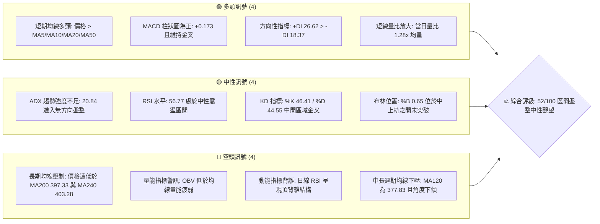

### 📊 核心指標速覽表

| 指標類別 | 指標名稱 | 當前數值 | 訊號 | 解讀 |
|----------|----------|----------|------|------|
| **價格** | 當前價格 | $364.27 | 🟡 | 位於 52 週高低區間之 33.2%，處於近一年相對低位反彈段 |
| **均線** | MA20 | $359.60 | 🟢 | 價格在 MA20 之上（正乖離 +1.30%），短線維持反彈支撐 |
| **均線** | MA50 | $350.25 | 🟢 | 價格在 MA50 之上，中期回檔後初步築底回升 |
| **均線** | MA200 | $397.33 | 🔴 | 價格在 MA200 之下（負乖離 -8.32%），長期牛熊分界線未收復 |
| **動能** | RSI(14) | 56.77 | 🟡 | 數值落在 50–60 溫和多頭區，但伴隨日線頂背離警訊 |
| **動能** | MACD | 3.809 / 3.636 | 🟢 | DIF 高於 MACD Signal，柱狀圖 +0.173 維持微弱多頭動能 |
| **趨勢** | ADX(14) | 20.84 | 🟡 | ADX < 25 指標顯示無強烈趨勢行情，價格步入區間震盪整理 |
| **通道** | 布林通道 %B | 0.65 | 🟡 | 落在中軌 $359.60 至上軌 $375.56 之間，上檔受阻於上軌 |
| **成交量** | OBV 趨勢 | OBV < MA | 🔴 | 累積能量線落後於自身均線，顯示買盤追價意願不足，量價背離 |
| **波動** | ATR(14) | $14.21 | 🟡 | 每日平均波動幅度為 3.90%，波動度收斂，適合區間網格操作 |

### 🏆 技術評分卡

```
╔══════════════════════════════════════════════════════════════════╗
║                 技術評分卡 — TSLA (2026-09-20)                    ║
╠══════════════════════════════════════════════════════════════════╣
║ 趨勢強度 (Trend)     ████████░░░░░░░░░░░░  40/100  🟡 弱勢盤整    ║
║ 動能指標 (Momentum)  ██████████░░░░░░░░░░  50/100  🟡 背離中性    ║
║ 支撐穩定度 (Support) ██████████████░░░░░░  70/100  🟢 底層牢固    ║
║ 成交量配合 (Volume)  ████████░░░░░░░░░░░░  40/100  🔴 量能疲弱    ║
║ 形態完整度 (Pattern) ████████████░░░░░░░░  60/100  🟡 箱型反彈    ║
║ 均線排列 (Moving Av) ██████████░░░░░░░░░░  50/100  🟡 均線纏繞    ║
╠══════════════════════════════════════════════════════════════════╣
║ 綜合評分 (Overall)   ██████████░░░░░░░░░░  52/100  ⚖️ 區間震盪   ║
╚══════════════════════════════════════════════════════════════════╝
```

---

## 2. 趨勢分析

### 🌐 多時框趨勢分析

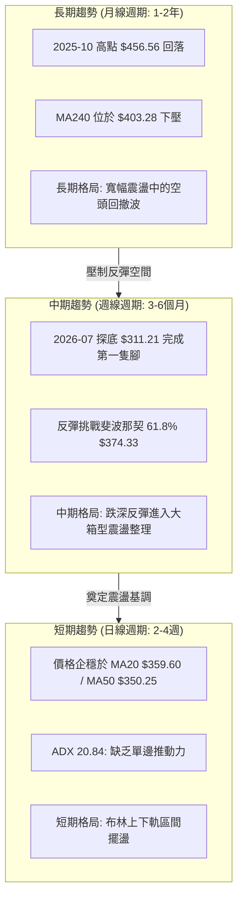

### 📈 長期趨勢 — 12個月走勢圖（Unicode）

```
TSLA 月線走勢圖（2025-10 至 2026-09）
價格 ($)
$460 ┤   ● (456.56)
$440 ┤       ●         ●
$420 ┤                      ●
$400 ┤                             ●
$380 ┤                                  ●
$360 ┤                                       ●(367.95)   ●(364.27 現價)
$340 ┤
$320 ┤                                            ● (311.21 低點)
$300 ┤
     └───────────────────────────────────────────────────────────
        10   11   12   01   02   03   04   05   06   07   08   09 (月份)
       2025 ────────────────────────── 2026 ────────────────────
```

#### 走勢特徵分析表格

| 階段區間 | 起訖月份 | 起訖價格 ($) | 區間漲跌幅 | 走勢結構與技術特徵 |
|----------|----------|--------------|------------|--------------------|
| **高檔做頭** | 2025-10 → 2025-12 | 456.56 → 449.72 | -1.50% | 月線在 $450 上方形成三個月高位平台，量能遞減，動能顯露疲態 |
| **首輪下跌** | 2026-01 → 2026-03 | 430.41 → 371.75 | -13.63% | 連續三個月長陰跌破短期均線，跌穿整數關卡，獲利了結賣壓湧現 |
| **中繼反抽** | 2026-04 → 2026-05 | 381.63 → 435.79 | +14.19% | 弱勢反彈測試 $435 阻力位，形成波段次高點，未能重返 $450 頸線 |
| **恐慌急跌** | 2026-06 → 2026-07 | 420.60 → 311.21 | -26.01% | 帶量下殺摜破多道支撐，於 2026-07 創下波段低位 $311.21，接近 52W 低點 $297.38 |
| **底部修復** | 2026-08 → 2026-09 | 367.95 → 364.27 | -1.00% | 自低檔強勁反抽至 $364 附近後進入縮量橫盤，目前於 $360 上方築底 |

### 📊 中期趨勢（週線分析）

從近 20 週收盤走勢顯示，2026-07-26 當週收盤 $313.03（RSI 跌至 15.7 極端超賣，週 MACD 柱狀圖暴跌至 -8.365），隨後於 2026-08-02 的 $311.21 確立中期底部。8 月中旬展開強勁修復行情，連三週收陽將價格推升至 $362.86。

然而，9 月前三週收盤分別為 $354.08、$365.44 與當前 $364.27，價格漲勢在接近阻力位 R1（$366.50）時顯著放緩。週線 MACD 柱狀圖自 +6.229（08-23）急速萎縮至當前的 +0.173，顯示中期反彈的多頭推動力已大幅衰退。

```
中期週線價格震盪結構示意：
$375.56 ────────────── BB 上軌 / 斐波 61.8% ($374.33) ─── [波段空頭阻力牆]
          ▲ 反彈受阻
$364.27 ──┼─────────── 當前現價 (收斂整理中) ──────────────
          ▼ 回踩確認
$343.64 ────────────── BB 下軌 / 支撐 S1 緩衝區 ───────── [多頭防守護城河]
```

### ⚡ 趨勢強度評估（ADX 解讀）

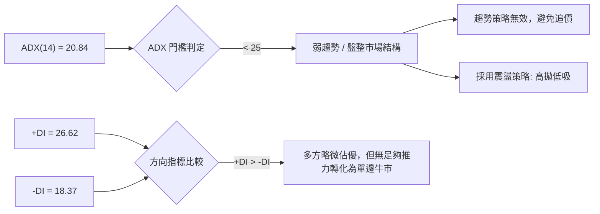

#### ADX 趨勢強度對照表

| 指標名稱 | 當前讀數 | 標準閾值標準 | 走勢屬性定義 | 對交易策略之指導意義 |
|----------|----------|--------------|--------------|----------------------|
| **ADX** | 20.84 | < 25 弱趨勢 / 盤整 | 橫盤震盪行情 | 趨勢突破交易容易遭遇假突破；應嚴格執行區間邊界買賣 |
| **+DI** | 26.62 | > 25 多方發力 | 多頭佔有優勢 | 多方具備護盤實力，短線拉回中軌不易直接崩跌 |
| **-DI** | 18.37 | < 20 空方力竭 | 空方殺跌減弱 | 拋壓在 $350 附近被吸收，空方難以發動深跌 |
| **DI 差值**| +8.25 | 正值擴大為佳 | 微弱多頭主導 | 屬於震盪偏多架構，但缺乏指數級爆發動能 |

---

## 3. 圖表形態分析

### 🔍 形態識別系統

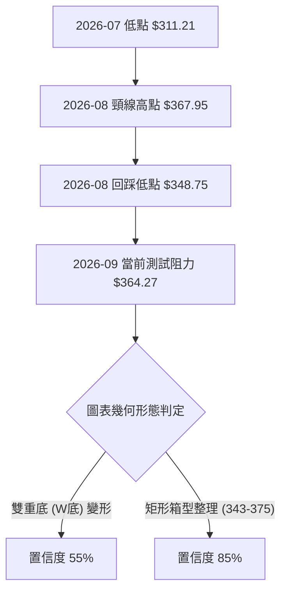

#### 形態信心度評估表

| 形態類別 | 信心度 | 判斷依據（引用實際數據） | 完成度 | 目標價（附嚴謹計算式） |
|----------|--------|--------------------------|--------|------------------------|
| **雙重底 (W底)** | 55% | 2026-07 低點 $311.21 與 2026-08-30 回踩低點 $348.75 構成右腳抬高之雙底；頸線位於 2026-08-23 週高點 $362.86 至 R1 $366.50 區間。 | 75% | 依形態高度推算：頸線 R1 $366.50 + 形態高度 ($366.50 - $311.21 = $55.29) = **$421.79**（精準貼近斐波那契 38.2% 回調位 $421.88） |
| **矩形震盪箱體** | 85% | 價格受制於布林上軌 $375.56 與 R1 $366.50，下檔受布林下軌 $343.64 與 S1 $337.24 支撐，ADX 20.84 確認盤整。 | 90% | 箱型頂部阻力：**$375.56**（BB上軌）<br>箱型底部支撐：**$343.64**（BB下軌） |
| **頭肩底形態** | 30% | 左肩於 $313.03，頭部 $311.21，無清晰對稱左肩存在。 | 20% | *數據不足以支撐幾何頭肩結構，僅做指標型箱型解讀* |

### 🕯️ 重要K線形態分析

| 月份/週次 | 收盤價 ($) | K線形態特徵 | 技術面深層解讀 | 多空訊號 |
|-----------|------------|-------------|----------------|----------|
| **2026-07** | 311.21 | 帶長下影大陰線 | 恐慌拋盤竭盡，空頭打擊至 52W 低點 $297.38 附近引發機構長線托底買盤 | 🟢 強烈止跌 |
| **2026-08** | 367.95 | 長陽包覆吞噬線 | 連續四週推升，徹底吞噬 7 月下旬跌幅，收復 MA20 與 MA50，確立波段反彈 | 🟢 多頭確立 |
| **2026-09-13**| 365.44 | 縮量十字星陽線 | 反彈觸及 R1 $366.50 阻力，週成交量縮至 1.43 億股（波段最低），多方攻堅猶豫 | 🟡 動能停滯 |
| **2026-09-20**| 364.27 | 窄幅微陰孕線 (Inside Week) | 波動率極度壓縮（ATR $14.21），價格受困於前週高低點之內，市場等待方向突破 | 🟡 變盤前夕 |

### 📉 ASCII 走勢形態示意圖

```
TSLA 底部反彈與箱型形態示意圖
價格 ($)
$375.56 ┤                                     [箱頂 / BB上軌阻力]
$366.50 ┤                     ● (頸線 R1)      ● 當前受阻 (364.27)
$359.60 ┤                  ╭───╯             ╭─╯ (BB中軌 MA20)
$350.25 ┤                  │           ● (右腳低點 348.75)
$337.24 ┤                  │           │     [波段支撐 S1]
$311.21 ┤    ● (底點 7月) ─╯           │     
$297.38 ┤    │ [52W 低點 S2]            │     
        └────┴──────────────────────────┴─────────────────────
            2026-07                   2026-08     2026-09
```

### 🎯 形態目標價計算

若雙重底結構在日線級別以實體陽線突破 R1 $366.50 並經過回踩確認：
1. **形態測量基準**：
   - 頸線位置：$366.50（數據表 R1）
   - 低點基點：$311.21（2026-07 實際最低月收盤）
   - 形態絕對高度：$366.50 - $311.21 = $55.29
2. **目標價推算路徑**：
   - **第一階目標價**：$384.04（由波段高點聚類阻力位 R2 提供，滿足等幅反彈前置阻力）
   - **形態完整測幅目標**：$366.50 + $55.29 = **$421.79**（與斐波那契 38.2% 回調位 $421.88 幾乎完全重合，具備極高量化依據）

---

## 4. 支撐與阻力

### 🗺️ 關鍵價位分布圖（Unicode）

```
TSLA 價位結構分布圖
═══════════════════════════════════════════════════════════════════
$498.83 ║████████████████████████████████║ 52W 最高點 (0.0% 斐波那契)
$451.29 ║██████████████████████          ║ 斐波那契 23.6% 回調位
$421.88 ║████████████████████████████    ║ 斐波那契 38.2% 回調位 / 形態目標
$409.28 ║████████████████████████        ║ 強阻力 R3 (近一年波段高點聚類)
$397.33 ║████████████████                ║ 牛熊分水嶺 (MA200 均線位置)
$384.04 ║████████████                    ║ 阻力 R2 (反彈中繼壓力位)
$375.56 ║████████                        ║ 布林上軌 / 斐波那契 61.8% ($374.33)
$366.50 ║██████                          ║ 關鍵阻力 R1 (當前測試關卡 +0.61%)
$364.27 ╠════════════════════════════════╣ ◄ 當前市價 ($364.27)
$359.60 ║▓▓▓▓▓▓                          ║ 近期支撐 MA20 / 布林中軌
$350.25 ║▓▓▓▓▓▓▓▓▓▓                      ║ 中期支撐 MA50
$343.64 ║▓▓▓▓▓▓▓▓▓▓▓▓                    ║ 布林下軌支撐
$337.24 ║▓▓▓▓▓▓▓▓▓▓▓▓▓▓▓▓                ║ 關鍵支撐 S1 (波段低點聚類 -7.42%)
$297.38 ║████████████████████████████████║ 終極強支撐 S2 (52W 最低點 -18.36%)
═══════════════════════════════════════════════════════════════════
```

### 🚧 阻力位分析表

| 阻力級別 | 價位 ($) | 距現價空間 | 形成原因（波段高點聚類） | 突破難度 | 重要性 |
|----------|----------|------------|--------------------------|----------|--------|
| **R1** | $366.50 | +0.61% | 近一年密集震盪成交波段高點聚類，與布林上軌前沿重疊 | 🟡 中等 | ★★★☆☆<br>短線多空分水嶺 |
| **R2** | $384.04 | +5.43% | 2026 年春季多個波段折返高點密集成交區，具套牢賣壓 | 🔴 較高 | ★★★★☆<br>中期波段目標位 |
| **R3** | $409.28 | +12.36%| 歷史月線收盤密集頂部，鄰近 MA200 ($397.33) 及整數防線 | 🔴 極高 | ★★★★★<br>長期牛熊轉換關鍵 |

### 🛡️ 支撐位分析表

| 支撐級別 | 價位 ($) | 距現價空間 | 形成原因（波段低點聚類） | 守住機率 | 重要性 |
|----------|----------|------------|--------------------------|----------|--------|
| **S1** | $337.24 | -7.42% | 近一年波段低點聚類密集區，接近斐波 78.6% ($340.49) | 🟢 75% | ★★★★☆<br>防守第一道防線 |
| **S2** | $297.38 | -18.36%| 52 週最低點 (52W Low)，長線買盤結構性護盤成本位 | 🟢 90% | ★★★★★<br>中期生命線不可破 |

### 📐 斐波那契回調位分析

依據 52 週完整波段（低點 $297.38 至高點 $498.83，垂直落差 $201.45）計算之回調位分布如下：

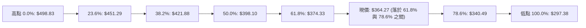

- **當前落點深層解讀**：現價 $364.27 嚴格夾在 **61.8%（$374.33）** 與 **78.6%（$340.49）** 之間。在道氏與斐波那契技術理論中，自 $498.83 回落跌破 61.8%（黃金分割關鍵反轉點）意味著原本的長線上升結構遭到破壞。
- 目前自 7 月低點的強彈正在嘗試收復 61.8%（$374.33）阻力位。該位置同時受布林上軌 $375.56 封鎖。若無法帶量有效收復 $374.33–$375.56，此波回升僅能視為深跌後的「死貓跳」或寬幅箱型修復波。

---

## 5. 技術指標深度解讀

### 🎛️ 指標訊號總覽

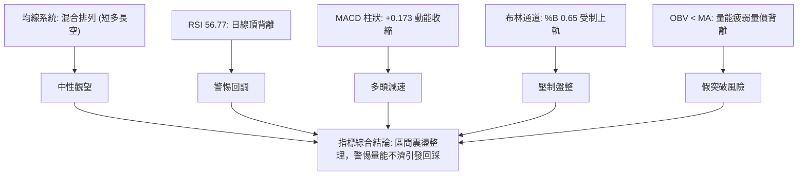

### 📈 移動平均線排列分析

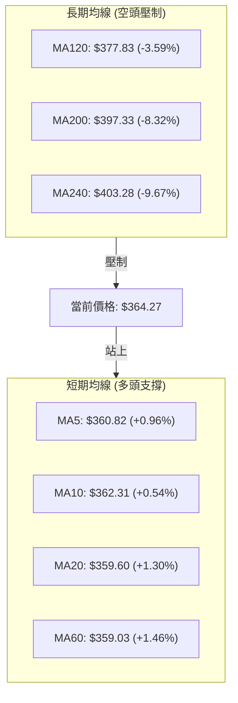

#### 均線數據明細表

| 均線名稱 | 數值 ($) | 乖離率 (%) | 均線走勢軌跡特徵 | 技術含義解讀 |
|----------|----------|------------|------------------|--------------|
| **MA5** | $360.82 | +0.96% | ▁▁▁▁▂▃▃▃▄▄▅▅▆▆▆▅▆▆▇████████▇██ | 超短線多頭維持，走勢平緩高檔鈍化 |
| **MA10** | $362.31 | +0.54% | ▁▁▁▂▂▃▃▃▄▄▅▅▅▆▆▆▆▇▇▇▇█████████ | 穩步上行，提供短線回調的第一道動態緩衝 |
| **MA20** | $359.60 | +1.30% | ▅▄▃▃▂▂▁▁▁▁▁▂▂▃▃▄▄▅▅▆▆▆▇▇▇█████ | 由下拐頭向上，與布林中軌完全重合，具強支撐力 |
| **MA60** | $359.03 | +1.46% | ██▇▇▇▆▆▆▅▅▅▄▄▃▃▃▃▂▂▂▂▂▂▁▁▁▁▁▁▁ | 走平築底階段，MA20 即將與 MA60 形成金叉 |
| **MA120**| $377.83 | -3.59% | ██▇▇▇▆▆▅▅▄▄▄▄▃▃▃▂▂▂▂▁▁▁▁▁▁▁▁▁▁ | 穩定下傾，構成 $375–$378 區間嚴重反壓 |
| **MA200**| $397.33 | -8.32% | 處於空頭壓制區間 | 傳統牛熊分界線，未收復前總體格局受限 |
| **MA240**| $403.28 | -9.67% | ████████████████▇▇▆▆▅▅▄▄▃▃▂▁▁▁ | 年線重壓，中長線上方賣壓極其沉重 |

### 📉 RSI(14) 分析

- **當前 RSI(14) 數值**：**56.77**
```
RSI(14) 強度進度條：
0  [超賣] 30             50       56.77     70 [超買] 100
├───┼────────────────────┼───────────█───────┼───┤
    ████████████████████████████████░░░░░░░░░░░░░░░ (56.77%)
```
- **超買超賣與背離深入剖析**：
  - 數值 56.77 處於 30 至 70 的中性偏多常態分佈帶，未觸及超買界限。
  - **⚠️ 頂背離結構 (Bearish Divergence) 確鑿存在**：對比週線與日線走勢，TSLA 股價自 2026-08-23 的 $362.86 推升至 2026-09-13 的 $365.44，價格創出反彈新高；然而 RSI 卻由 8 月中旬的 **72.70** 高點一路崩落回落至當前的 **56.77**。價格走高而指標峰值顯著降低，形成典型日線頂背離。這意味著內在多頭推動力正在大幅退潮，隨時可能引發向 MA20 的均值回歸回踩。

### 📊 MACD(12/26/9) 訊號解讀

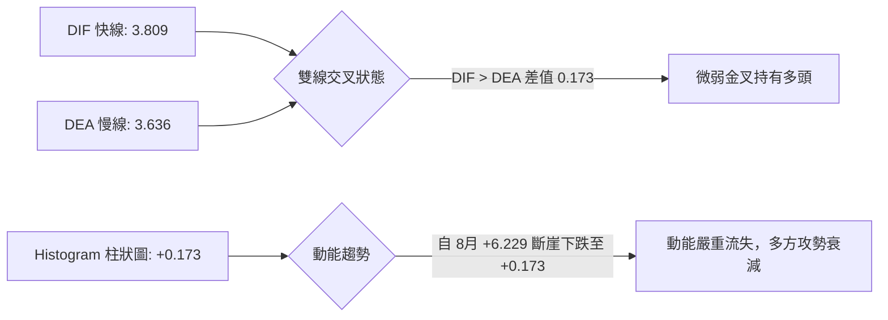

- **指標協同解讀**：
  - MACD 線（3.809）與訊號線（3.636）均位於零軸之上，符合中短期技術反彈格局。
  - 然而柱狀圖數值自 2026-08-23 的 **+6.229** 持續萎縮至 08-30 的 **+3.586**、09-06 的 **+2.926**、09-13 的 **+1.863**，最終抵達當前 **+0.173**。柱體呈現連續四週收縮，快慢線開口急遽閉合，隨時有形成「死叉」之風險，進一步印證 RSI 頂背離所釋放的疲弱信號。

### 📦 布林通道分析

```
TSLA 布林通道空間分布示意圖
$375.56 ┤ ═══════════════════════════════════ 布林上軌 (阻力壓制區間)
        │
$364.27 ┤ ───────────● 現價 (BB %B = 0.65)
        │
$359.60 ┤ ----------------------------------- 布林中軌 (MA20 關鍵支撐線)
        │
$343.64 ┤ ═══════════════════════════════════ 布林下軌 (超賣安全緩衝區)
```

- **帶寬與位置量化解讀**：
  - **通道寬度 (Bandwidth)**：($375.56 - $343.64) / $359.60 = **8.88%**，通道寬度處於近一年相對收窄階段，預示低波動整理即將迎來變盤。
  - **%B 位置指標**：**0.65**。計算公式為 `(364.27 - 343.64) / (375.56 - 343.64) = 0.646`。數值處於中軌上方，短線多頭掌控局部優勢，但在逼近上軌 $375.56 時遭遇天花板阻力。在 ADX < 25 條件下，上軌通常為高拋節點，而非追價買點。

### 💹 成交量分析（量價配合度）

```
量能指標比對：
最新單日成交量： 51,819,200 股  █████████████ (1.28x 均量)
20日平均成交量： 40,479,440 股  ██████████
50日平均成交量： 38,191,298 股  █████████
```

- **量價背離與 OBV 警訊**：
  - 當日量比達 **1.28x**，表面上呈現放量狀態。但檢視近四週週成交量：由 2026-09-06 的 2.60 億股急劇萎縮至 09-13 的 1.43 億股，本週回升至 1.85 億股，整體成交量並未伴隨價格創新高而持續放大。
  - **OBV 趨勢（OBV < MA）**：系統明確給出 OBV 低於均線之訊號。在股價反彈至 $364 的過程中，累積成交量指標未能同步攻克前高，反映主力機構資金在此價位僅維持被動防守或獲利了結，散戶追價乏力，屬於典型「量價背離」，限制了後續向上衝擊 R2（$384.04）的動能。

---

## 6. 動能與波動率

### ⚡ 動能評估四象限

| 象限標記 | 動能維度 | 波動維度 | 當前狀態標註 | 核心技術特徵解讀與操作指導 |
|----------|----------|----------|--------------|----------------------------|
| **象限 I** | 強動能 (Strong) | 低波動 (Low Vol) | — | 最佳波段趨勢行情，穩步走升 |
| **象限 II**| 弱動能 (Weak) | 低波動 (Low Vol) | **✓ [TSLA 當前位置]** | **ADX 20.84 伴隨 ATR 降至 $14.21，動能衰減，屬於低波盤整，宜耐心觀望或區間操作** |
| **象限 III**| 強動能 (Strong) | 高波動 (High Vol) | — | 爆發性突破或主升浪，伴隨高換手與跳空 |
| **象限 IV**| 弱動能 (Weak) | 高波動 (High Vol) | — | 無序暴跌或恐慌洗盤，應避免介入 |

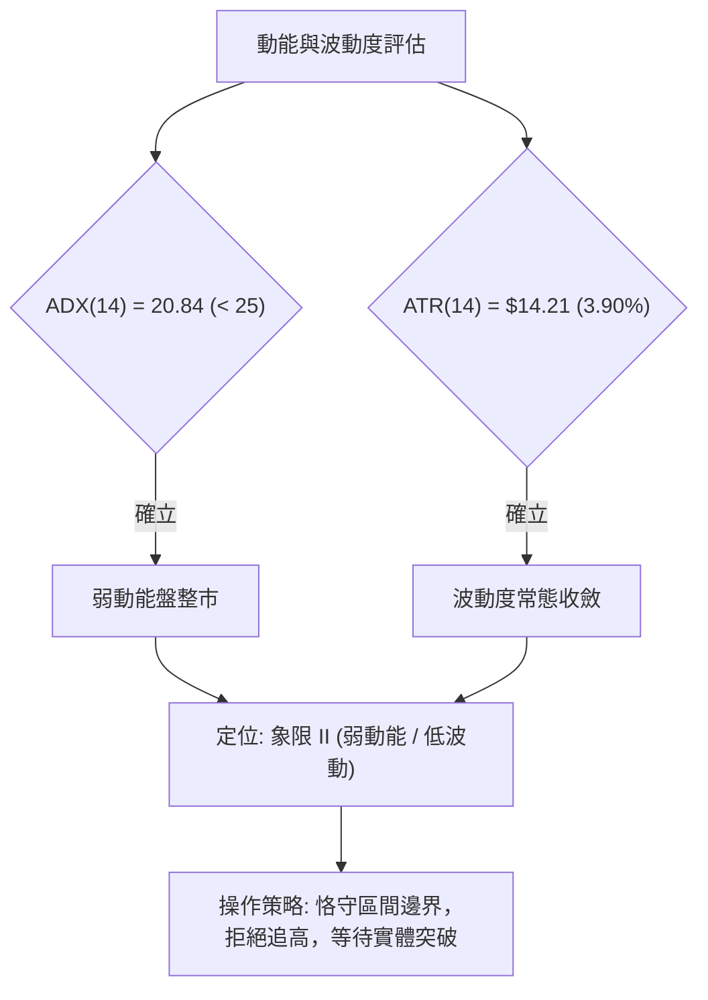

### 📊 ATR 波動率分析

- **ATR(14) 絕對值**：**$14.21**
- **價格佔比**：**3.90%**（屬性：中等波動性，較 TSLA 歷史高波動期已明顯鈍化）。
- **風控止損與持倉空間計算**：
  - **日間正常雜訊通道**：價格在 ±1.0 × ATR（即 ±$14.21，區間約 $350.06 至 $378.48）內擺動純屬常態日常波動，不宜作為趨勢反轉判定依據。
  - **專業防守止損間距設定**：
    - 激進短線策略（1.5 × ATR）：止損間距為 $21.32。
    - 穩健波段策略（2.0 × ATR）：止損間距為 $28.42。

### 📐 Beta 與市場相關性

- **Beta 係數**：**1.845**
- **市場系統性風險量化分析**：
  - Beta 數值高達 1.845，顯示 TSLA 具有顯著的高彈性特質。當標普 500 或納斯達克 100 指數波動 1% 時，TSLA 理論波動將達到 1.85%。
  - 在當前 ADX 為 20.84 的弱勢平衡期，高 Beta 意味著個股極易受到大盤指數系統性波動的干擾而產生假突破。若大盤指數突發下挫，TSLA 下跌動能將迅速放大並回測支撐 S1（$337.24）。

---

## 7. 多時框架總結

### 📋 時框架評分表

| 時框架 | 趨勢方向 | 動能表現 | 均線排列狀況 | 圖表形態識別 | 綜合評分 | 戰略建議 |
|--------|----------|----------|--------------|--------------|----------|----------|
| **月線 (長期)** | 🔴 偏空修正 | 弱勢反抽 (自低位修復) | 價格低於 MA240 ($403.28) | 自 52W 高點回落之空頭回撤 | **35/100** | 長期投資者逢高減碼，未收復年線前不建長倉 |
| **週線 (中期)** | 🟡 震盪整理 | MACD 柱大幅收斂 | 夾於 MA50 與 MA200 之間 | 底部超賣大反彈後進入箱型 | **55/100** | 區間震盪思路，依斐波那契位分批操作 |
| **日線 (短期)** | 🟢 震盪微多 | RSI 頂背離 / 金叉維持 | 站上 MA5/10/20/60 短多排 | 受困於布林通道 ($343-$375) | **60/100** | 依布林軌道操作，觸及箱頂阻力不追買 |

### 🔲 綜合訊號矩陣

```
時框訊號收斂一致性比對表：
══════════════════════════════════════════════════════════════
維度            短期 (日線)       中期 (週線)       長期 (月線)
──────────────────────────────────────────────────────────────
趨勢方向        🟢 溫和向上       🟡 水平橫盤       🔴 震盪偏空
動能方向        🔴 頂背離警訊     🔴 柱狀圖收縮     🟡 脫離超賣
均線支撐        🟢 站在MA20上     🟢 守穩MA50上     🔴 承壓MA200
形態結構        🟡 逼近箱頂       🟡 箱體築底       🔴 高位破位
══════════════════════════════════════════════════════════════
收斂衝突點：短期日線價格強勢 vs 中長期均線重壓與動能背離
```

### ⚖️ 多時框收斂結論

依據本報告**嚴格要求 14（多時框收斂優先級規則）**：
1. **行情屬性判定**：當前日線 **ADX(14) 讀數為 20.84 (< 25)**，嚴格判定為**「盤整行情」**。
2. **規則收斂取捨**：在 ADX < 25 的盤整結構中，日線突破訊號往往失真，**必須以日線布林通道上下軌（$343.64 至 $375.56）為主要交易區間**，中長期均線（MA200 $397.33）作為上方無法逾越的極限天花板。
3. **唯一方向性結論**：**【中性觀望 / 區間震盪整理】**。
   - 結論闡述：目前市場處於「跌深反彈遇阻、下方又有短期均線承托」的夾心縮量整理形態。短期日線的強勢因日線 RSI 頂背離與成交量疲弱（OBV < MA）而受到制約，無法轉化為中長期單邊牛市。因此，第 8 章之主交易策略嚴格遵循此結論，確立為**布林通道內的區間高拋低吸策略**。

---

## 8. 交易策略建議

### 🗺️ 策略決策流程圖

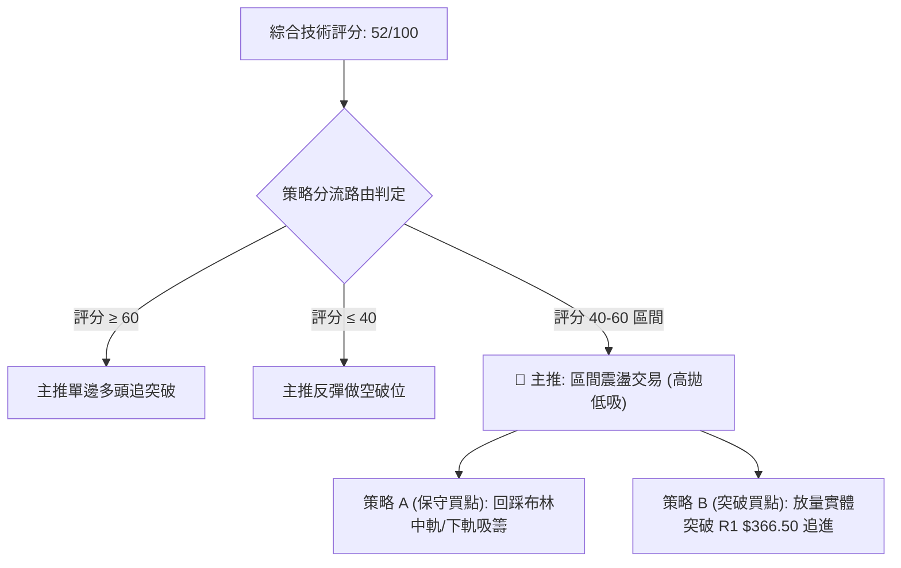

### 🧭 策略路由

**當前主策略方向 = 【中性區間震盪操作】（依技術評分卡：52/100）**

### 🎯 價格情境階梯（Price Scenarios）

價位數據嚴格引用自「關鍵價位與均線體系」實際計算數值：

| 觸發條件 | 下一目標價位 | 後續延伸阻力/支撐 | 盤面情境技術面含義解讀 |
|----------|--------------|-------------------|------------------------|
| **強勢向上突破 R1 $366.50** | **R2 $384.04** | **R3 $409.28** | 實體突破頸線，化解頂背離，雙底形態確立，向上挑戰 MA200 |
| **受阻於布林上軌 $375.56** | **MA20 $359.60** | **S1 $337.24** | 假突破或衝高回落，延續在布林通道內部震盪洗盤 |
| **有效向下破位 S1 $337.24** | **S2 $297.38** | — | 箱型結構全面瓦解，空頭反撲重啟，回測 52 週最低點 |

### 📊 情境機率分佈

```
機率分佈進度條：
區間震盪 (60%): ██████████████████████████████
受阻回落 (25%): ████████████
向上突破 (15%): ███████
```

| 走勢情境分類 | 發生機率 | 主要技術指標支撐依據 |
|--------------|----------|----------------------|
| **情境一：維持區間震盪** | **60%** | **ADX 20.84** 確立無趨勢行情，布林帶寬收縮至 8.88%，價格在中軌與上軌間拉鋸 |
| **情境二：遇阻回落探底** | **25%** | **日線 RSI 頂背離**、**OBV < MA** 量能背離，週線 MACD 柱萎縮至 +0.173 呈現力竭 |
| **情境三：放量向上突破** | **15%** | 價格站上短期 MA5/10/20/60，若有突發量能推動需連續突破 R1 $366.50 與 R2 $384.04 |

### 🟢 主策略詳情（方向：區間操作）

| 策略要素 | 策略 A（下軌支撐低吸 — 穩健勝率型） | 策略 B（突破追隨確認 — 動能型） |
|----------|-------------------------------------|-----------------------------------|
| **交易邏輯** | 抓取區間下緣超賣支撐，博弈均值回歸 | 帶量突破關鍵阻力 R1，博弈形態等幅推升 |
| **進場條件** | 價格回踩 MA20 $359.60 或布林下軌 $343.64 出現下影線止跌 | 日線實體收盤**突破 R1 $366.50** 且成交量 > 5,000 萬股 |
| **進場價格** | **$343.64**（布林下軌處掛單或確認企穩） | **$366.50**（突破當日確認收盤價） |
| **目標價 T1** | **$366.50**（阻力位 R1，獲利了結 50%） | **$384.04**（波段阻力位 R2） |
| **目標價 T2** | **$375.56**（布林上軌處全數平倉離場） | **$409.28**（強阻力位 R3 / 接近 MA200） |
| **止損價格** | **$337.24**（精確設於波段低點支撐 S1 處） | **$359.60**（設於跌破 MA20 / 布林中軌處） |
| **風險報酬比** | **1 : 3.58**（風控 $6.40，首期空間 $22.86） | **1 : 2.54**（風控 $6.90，首期空間 $17.54） |
| **成功機率** | **65%**（符合當前盤整市場高拋低吸規律） | **45%**（易遭遇頂背離引發之假突破） |
| **建議倉位** | **15%**（控制單一標的風險暴露） | **10%**（突破初期輕倉試單） |

### 🔴 反向風險觸發點（對沖提示）

- **全面空頭停損/轉空訊號**：若價格以帶量長陰實體跌破 **S1 $337.24**，代表雙底失敗、箱型瓦解，所有多頭部位必須無條件清倉，並可反手對沖做空，空頭目標直指 **S2 $297.38**。
- **全面多頭噴發訊號**：若價格帶量站上 **MA200 $397.33**，代表長達一年的空頭架構被粉碎，不可再進行任何逢高做空操作。

### ⭐ 整體訊號強度評星

```
做多訊號強度：★★☆☆☆  (2/5星 — 受制於頂背離與均線重壓)
做空訊號強度：★★☆☆☆  (2/5星 — 短期均線支撐完好，缺乏殺跌動能)
整體可信度：  ★★★★☆  (4/5星 — ADX 指標明確指引盤整格局)
```

---

## 9. 風險提示與監控

### ✅ 關鍵監控指標 Checklist

```
╔══════════════════════════════════════════════════════════════════╗
║                     關鍵技術監控指標 Checklist                    ║
╠══════════════════════════════════════════════════════════════════╣
║ [ ] 監控項 1: 價格是否收盤站穩 R1 $366.50 (突破箱體確立信號)      ║
║ [ ] 監控項 2: 日線 MACD 柱狀圖是否由正轉負 (死叉確認背離成立)     ║
║ [ ] 監控項 3: RSI(14) 能否化解頂背離重新站上 65.0 水平           ║
║ [ ] 監控項 4: 成交量能否持續維持在 20 日均量 (40,479,440) 之上    ║
║ [ ] 監控項 5: MA20 ($359.60) 支撐力道，跌破則箱底測試開啟         ║
║ [ ] 監控項 6: ADX 是否由 20.84 向上躍升至 25 以上 (趨勢啟動標誌)  ║
╚══════════════════════════════════════════════════════════════════╝
```

### ⚠️ 風險場景分析

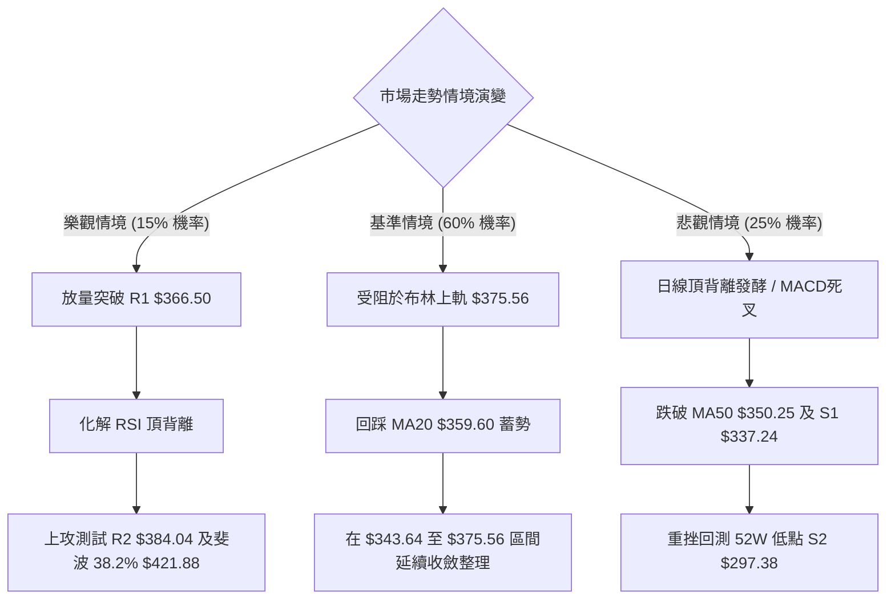

### 🛡️ 風險管理重要提醒

1. **拒絕情緒化追高**：當前現價 $364.27 距離阻力位 R1（$366.50）僅剩 +0.61% 的利潤空間，向上盈虧比極其不對稱。絕對不可在當前位置盲目追多。
2. **嚴格執行 ATR 止損保護**：個股 ATR 為 $14.21（波動率 3.90%），在任何單一開倉位置，止損幅度嚴禁小於 1.0 × ATR（約 $14），以防被日內市場噪音洗盤出場；同時也不可超過 2.0 × ATR（約 $28），以防承受災難性虧損。
3. **倉位總量控管**：在 ADX < 25 的盤整結構中，整體交易倉位應控制在總資金的 **25%–35%** 以內，保留充裕的現金以應對潛在的變盤跳空風險。

---

## 📋 報告總結

```
╔══════════════════════════════════════════════════════════════════╗
║                   TSLA 技術分析報告總結卡                        ║
╠══════════════════════════════════════════════════════════════════╣
║ 報告日期：2026-09-20                                            ║
║ 當前價格：$364.27                                                ║
║ 分析評級：⚖️ 中性觀望 (技術評分: 52/100)                         ║
║                                                                  ║
║ 關鍵結論：                                                       ║
║ ├─ 長期趨勢：🔴 偏空回撤 (受壓於 MA200 $397.33 與年線)           ║
║ ├─ 中期趨勢：🟡 箱型整理 (週線 MACD 柱大幅收斂，反彈減速)        ║
║ ├─ 短期趨勢：🟡 震盪偏多 (守穩 MA20，但 RSI 頂背離警訊籠罩)       ║
║ ├─ 關鍵支撐：S1: $337.24 ｜ 終極強支撐 S2: $297.38              ║
║ ├─ 關鍵阻力：R1: $366.50 ｜ 次級阻力 R2: $384.04                 ║
║ └─ 分析師共識目標價：$396.94                                     ║
║                                                                  ║
║ 最優策略組合：                                                   ║
║ 1. 🥇 最佳機會：等待回踩布林下軌 $343.64 吸籌，止損設於 S1 $337.24 ║
║ 2. 🥈 次選機會：突破 R1 $366.50 且放量後輕倉順勢短線追多至 R2    ║
║ 3. 🥉 保守選擇：維持現金空倉觀望，等待 ADX 突破 25 趨勢明朗化    ║
╚══════════════════════════════════════════════════════════════════╝
```

---

> ⚠️ **免責聲明**：本報告為技術分析研究成果，所有價位、回調比率與圖表判斷均嚴格基於歷史量價數據計算得出。本報告**僅供學術研究與投資參考**，**不構成任何形式的要約或投資買賣建議**。金融市場具有高度風險與不確定性，投資人應依個人財務狀況審慎評估，並自行承擔交易風險。

---

*報告生成時間：2026-09-20 ｜ 數據來源：Yahoo Finance ｜ 分析框架：多時框收斂與量化技術指標體系*