# TSLA 技術分析報告

> **報告日期**：2026-09-22 ｜ **語言**：繁體中文 ｜ **數據來源**：Yahoo Finance ｜ **當前價格**：$378.90

---

## 目錄

| 章節 | 內容 |
|------|------|
| [1. 技術面概覽](#1-技術面概覽) | 訊號儀表板、核心指標速覽、技術評分卡 |
| [2. 趨勢分析](#2-趨勢分析) | 多時框趨勢遞進、12個月歷史走勢圖、ADX趨勢強度評估 |
| [3. 圖表形態分析](#3-圖表形態分析) | 形態識別信心度、K線結構解讀、形態目標價推算 |
| [4. 支撐與阻力](#4-支撐與阻力) | 價位結構分布圖、波段聚類阻力/支撐、斐波那契回調結構 |
| [5. 技術指標深度解讀](#5-技術指標深度解讀) | 均線系統、RSI背離、MACD、布林通道與量價配合度 |
| [6. 動能與波動率](#6-動能與波動率) | 動能四象限、ATR波動率止損模型、Beta敏感度 |
| [7. 多時框架總結](#7-多時框架總結) | 時框架評分矩陣、訊號一致性、多時框收斂定論 |
| [8. 交易策略建議](#8-交易策略建議) | 策略決策路由、價格情境階梯、主策略詳解、反向對沖提示 |
| [9. 風險提示與監控](#9-風險提示與監控) | 監控清單Checklist、三行情境演化、風控倉位規範 |
| [10. 報告總結](#10-報告總結) | 全景技術面總結與執行架構 |

---

## 1. 技術面概覽

### 🎯 技術訊號儀表板

當前 TSLA 呈現「短線反彈逼近強阻力、動能背離且量能未放」的格局。短期均線多頭排列對抗上方長期均線壓制，多空博弈劇烈。

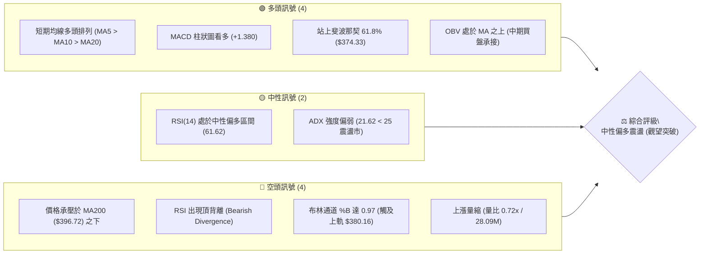

---

### 📊 核心指標速覽表

| 指標類別 | 指標名稱 | 當前數值 | 訊號 | 技術解讀與意涵 |
|:---|:---|:---|:---:|:---|
| **價格** | 當前價格 | $378.90 | 🟡 | 位於52週區間40.5%，短線自低點反彈後遭遇密集壓力 |
| **均線** | MA20 | $361.72 | 🟢 | 價格在MA20上方 +4.75%，提供短線動態支撐 |
| **均線** | MA50 | $349.28 | 🟢 | 價格在MA50上方，中期波段多頭掌控回踩防線 |
| **均線** | MA120 | $378.06 | 🟢 | 剛微幅收復半年線 (+0.22%)，多空臨界拉鋸點 |
| **均線** | MA200 | $396.72 | 🔴 | 價格低於年線 -4.49%，長期牛熊分水嶺形成顯著蓋頭壓 |
| **動能** | RSI(14) | 61.62 | 🟡 | 位於強勢中性區，但存在⚠️頂背離隱憂，上行動能減速 |
| **動能** | MACD | 5.566 / 4.186 | 🟢 | 快慢線均在零軸上方，Histogram +1.380 維持擴張看多 |
| **動能** | Stoch %K/%D | 84.94 / 68.58 | 🔴 | %K 突破 80 進入超買區，短線隨時有回測修正需求 |
| **趨勢** | ADX(14) | 21.62 | 🟡 | ADX < 25，表明缺乏單邊趨勢，當前屬於盤整反彈行情 |
| **通道** | Bollinger %B | 0.97 | 🔴 | 極度貼近布林上軌 ($380.16)，未擴軌前追高勝率低 |
| **量能** | 成交量 / 20日均量 | 28.09M / 38.80M | 🔴 | 量比僅 0.72x，縮量反彈至壓力區，量價配合出現隱憂 |
| **波動** | ATR(14) | $13.13 | 🟡 | 佔現價 3.46%，日均波動適中，提供明確止損與區間依據 |

---

### 🏆 技術評分卡

```
╔══════════════════════════════════════════════════════════════╗
║              TSLA 技術評分卡 (2026-09-22)                    ║
╠══════════════════════════════════════════════════════════════╣
║ 趨勢強度 (Trend)       ████████░░░░░░░░░░░░  42/100 🟡 中性弱勢 ║
║ 動能指標 (Momentum)    ████████████░░░░░░░░  60/100 🟡 中性偏多 ║
║ 支撐穩定度 (Support)   ██████████████░░░░░░  70/100 🟢 支撐扎實 ║
║ 成交量配合 (Volume)    ████████░░░░░░░░░░░░  40/100 🔴 縮量背離 ║
║ 形態完整度 (Pattern)   ████████████░░░░░░░░  58/100 🟡 區間震盪 ║
║ 均線排列 (Moving Avg)  ██████████████░░░░░░  68/100 🟢 短均強勢 ║
╠══════════════════════════════════════════════════════════════╣
║ 綜合技術評分           ███████████░░░░░░░░░  56/100 🟡 中性震盪 ║
╚══════════════════════════════════════════════════════════════╝
```

---

## 2. 趨勢分析

### 🌐 多時框趨勢分析

分析多時框架時，必須從高維度逐層降維，鎖定主要趨勢方向與次級折返走勢：

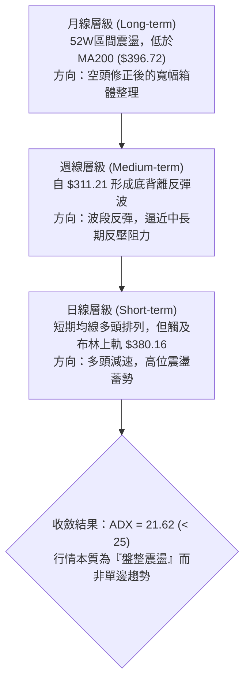

---

### 📈 長期趨勢 — 12個月走勢圖（Unicode）

以下為 TSLA 自 2025 年 10 月至 2026 年 09 月的月線價格收盤走勢與關鍵結構點標注：

```
TSLA 月線走勢圖（過去12個月：2025-10 至 2026-09）
價格軸 ($)
$460 ┤  ● 456.56 (波段雙頂高點)
$440 ┤      ● 430.17  ● 449.72        ● 435.79
$420 ┤          ● 430.41                  ● 420.60
$400 ┤              ● 402.51                          ◄─ MA200 ($396.72)
$380 ┤                                        ● 378.90 (現價)
$360 ┤                  ● 371.75  ● 381.63        ● 367.95
$340 ┤
$320 ┤                                    ● 311.21 (波段低點/7月拋售)
     └─────────────────────────────────────────────────────
       10  11    12    01    02    03    04    05    06    07    08    09  (月份)
      2025 ──────────────────────────► 2026
```

#### 走勢特徵分析表格

| 階段區間 | 起止價位 | 漲跌幅 | 走勢特徵與技術成因 |
|:---|:---|:---:|:---|
| **高位做頂期**<br>(2025.10–2025.12) | $456.56 → $449.72 | -1.50% | 於 $450-$460 區間反覆震盪做頭，多頭上攻力竭。 |
| **破位下行期**<br>(2026.01–2026.03) | $430.41 → $371.75 | -13.63% | 連續三個月長陰破位，跌破多條中期均線，空頭完全控盤。 |
| **中期反抽期**<br>(2026.04–2026.05) | $381.63 → $435.79 | +14.19% | 快速回抽測試下降趨勢反壓，形成次高點 (Lower High)。 |
| **主跌加速期**<br>(2026.06–2026.07) | $420.60 → $311.21 | -26.01% | 7月份遭遇恐慌性放量拋售，創下近一年低點 $297.38（收盤 $311.21）。 |
| **超跌修復期**<br>(2026.08–2026.09) | $311.21 → $378.90 | +21.75% | 築底反彈，收復 MA20/MA50 與斐波那契 61.8%，逼近阻力位。 |

---

### 📊 中期趨勢（週線分析）

從近 20 週數據觀察，TSLA 經歷了 2026 年 7 月底（RSI 一度低見 15.7）的極端超賣後，啟動強勁的「V型修復」行情。

```
TSLA 週線關鍵通道與動能演變
══════════════════════════════════════════════════════════════════════
 440 ┤                 ● (05/31: 435.79)
 420 ┤ ● (05/17: 422.24)     ● (06/14: 406.43)
 400 ┤                             ● (07/12: 407.76)
 380 ┤                                                 ● (09/27: 378.90 現價)
 360 ┤                                         ● (08/23: 362.86)
 340 ┤                                     ● (08/16: 342.27)
 320 ┤                             ● (07/26: 313.03)
 300 ┤                         ● (08/02: 311.21 觸底)
══════════════════════════════════════════════════════════════════════
週RSI: 15.7 (極度超賣) ───► 72.7 (波段超買) ───► 61.6 (高位鈍化)
週MACD柱: -8.365 (空頭高潮) ────────────► +6.229 ───► +1.380 (動能收斂)
```

週線層面顯示，自 8 月初反彈以來，週線 MACD 柱狀圖在 8 月 23 日達到峰值 `+6.229` 後，近期持續縮減至 `+1.380`，表明**中期反彈衝能正在鈍化**，多頭需要時間整理以消化上方獲利盤。

---

### ⚡ 趨勢強度評估（ADX 解讀）

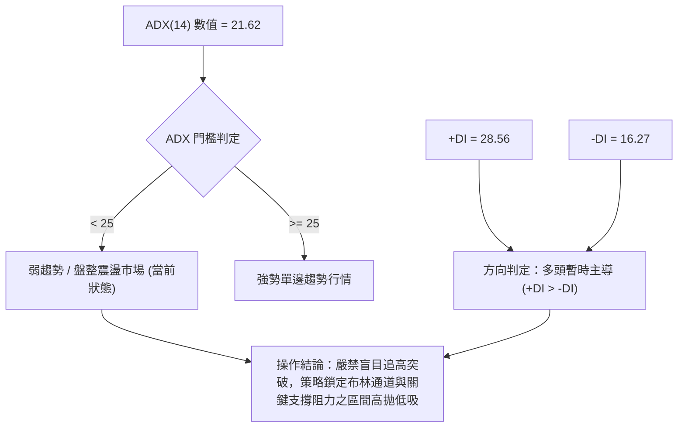

#### ADX 趨勢強度對照解讀表

| 指標名稱 | 實際數值 | 參考臨界線 | 當前技術意涵 |
|:---|:---:|:---:|:---|
| **ADX (14)** | **21.62** | 25.00 | ADX < 25 明確定義當前市場處於**無單邊趨勢的震盪整理**狀態。不宜預期長單邊暴漲。 |
| **+DI** | **28.56** | 20.00 | 多方引導力量處於優勢區，支撐短線走勢維持偏多重心。 |
| **-DI** | **16.27** | 20.00 | 空方壓制力量退縮，短線暫無恐慌拋壓。 |
| **趨勢定性** | **弱勢震盪反彈** | — | 多頭握有局部主動權，但缺乏趨勢慣性，極易於強阻力位受阻回跌。 |

---

## 3. 圖表形態分析

### 🔍 形態識別系統

在日線與週線結構上，TSLA 自 2026 年 7 月低點以來形成了明顯的「超跌反彈通道」，當前正處於「箱體震盪測試上邊緣」階段。

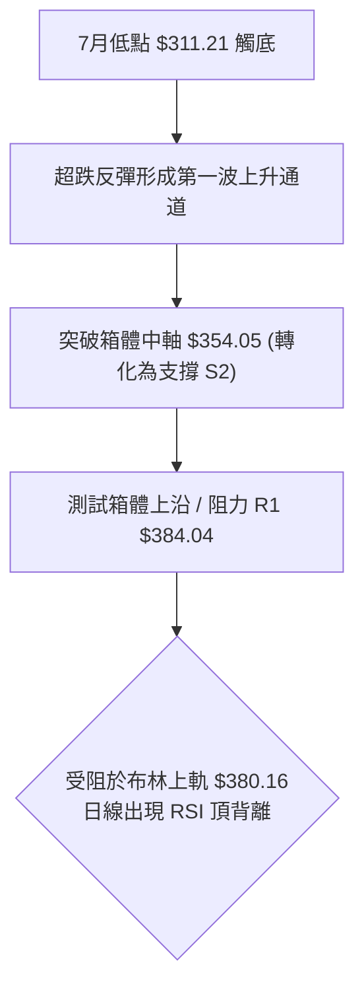

#### 形態識別與信心度評估表

依據嚴格規則，所有形態均基於提供的 OHLCV 實際價位推導，絕不通靈預測：

| 識別形態 | 信心度 | 判斷依據（引用實際數據） | 完成度 | 形態目標價（推算公式） |
|:---|:---:|:---|:---:|:---|
| **雙重底 (W底) 形態** | **70%** | 2026-07-26 收盤 $313.03 與 2026-08-02 收盤 $311.21 形成扎實雙底，頸線位於 S1 $366.31 附近（已突破）。 | **85%** | 頸線 $366.31 + 形態高度 ($366.31 - $311.21 = $55.10) = **$421.41** (接近斐波那契 38.2% 的 $421.88)。 |
| **箱體震盪整理** | **80%** | 底部支撐錨定 S2 ($354.05)，頂部阻力鎖定 R1 ($384.04)，價格在箱體內震盪符合 ADX 21.62 特徵。 | **90%** | 箱頂突破目標：R1 $384.04 + 箱高 ($384.04 - $354.05 = $29.99) = **$414.03** (接近阻力 R3 $418.36)。 |
| **上升楔形 (潛在衰竭)** | **55%** | 短線反彈高點遞增（$362.86 → $365.44 → $378.90），但成交量縮減且 RSI 頂背離，具備楔形特徵。 | **60%** | 若跌破楔形下軌（約 S1 $366.31），量度跌幅指向 S2 **$354.05**。 |

---

### 🕯️ 重要K線形態分析

| 觀測週期/月份 | 收盤價 | K線形態名稱 | 核心技術解讀 | 訊號屬性 |
|:---|:---:|:---|:---|:---:|
| **2026-07 (月線)** | $311.21 | 長下影大陰線 | 恐慌盤宣洩，最低觸及 $297.38 後收回，確認中期賣盤衰竭區。 | 🟢 觸底反轉信號 |
| **2026-08 (月線)** | $367.95 | 實體大陽線 (吞噬) | 實體完全包覆 7 月跌幅的一半以上，強力確認短線底部成立。 | 🟢 強烈買盤介入 |
| **2026-09 (近四週)** | $378.90 | 上影小陽線組 | 價格連續小幅推升，但實體收窄且附帶上影線，表明高位拋壓漸沉。 | 🟡 滯漲減速訊號 |
| **最新交易日** | $378.90 | 縮量高位星線 | 觸及布林上軌 ($380.16) 收星，成交量僅 28.09M，多方無意強攻。 | 🔴 短線回踩預警 |

---

### 📉 ASCII 走勢形態示意圖

```
TSLA 短期箱體突破與阻力測試示意圖
══════════════════════════════════════════════════════════════════
$384.04 ──┬─────────────────────────────────────── 阻力 R1 (箱體頂)
          │                            ▲
$380.16 ──┼────────────────────── ● ───┼──────── 布林上軌 ($380.16)
          │                    ／  ▲   │
$378.90 ──┼───────────────────● 現價   │
          │                 ／         │
$366.31 ──┼───────────────● ───────────┴──────── 支撐 S1 / W底頸線
          │             ／
$361.72 ──┼───────────● ──────────────────────── 布林中軌 / MA20
          │         ／
$354.05 ──┼───────● ──────────────────────────── 支撐 S2 (箱體底)
          │     ／
$311.21 ──┴───● ──────────────────────────────── 前期雙底最低收盤價
══════════════════════════════════════════════════════════════════
```

---

## 4. 支撐與阻力

### 🗺️ 關鍵價位分布圖（Unicode）

所有標註的價位均來自提供的近一年 OHLCV 波段高低點聚類與斐波那契回調模型，無任何臆測：

```
TSLA 價位結構分布圖 (由 OHLCV 聚類計算)
═══════════════════════════════════════════════════════════════
$418.36 ║██████████████████████████████║ 強阻力 R3 (前期高位套牢密集區)
$409.28 ║████████████████████          ║ 阻力 R2 (反彈波段頂部)
$396.72 ║▓▓▓▓▓▓▓▓▓▓▓▓▓▓▓▓▓▓▓▓          ║ 關鍵均線壓 MA200 (牛熊分水嶺)
$384.04 ║██████████████████████████████║ 關鍵阻力 R1 (近一年波段高點)
$380.16 ║------------------------------║ 布林通道上軌
$378.90 ╠══════════════════════════════╣ ◄─── 當前現價 ($378.90)
$374.33 ║------------------------------║ 斐波那契 61.8% 重要防守位
$366.31 ║▓▓▓▓▓▓▓▓▓▓▓▓▓▓▓▓              ║ 近期支撐 S1 (波段突破轉化支撐)
$361.72 ║------------------------------║ 布林中軌 (MA20 動態支撐)
$354.05 ║██████████████████████████████║ 強支撐 S2 (次級波段底聚類)
$337.24 ║████████████████              ║ 深度支撐 S3 (中期回撤極限)
═══════════════════════════════════════════════════════════════
```

---

### 🚧 阻力位分析表

| 阻力級別 | 具體價位 | 距現價空間 | 技術形成原因與籌碼特徵 | 突破難度 | 重要性權重 |
|:---|:---:|:---:|:---|:---:|:---:|
| **R1** | **$384.04** | +1.36% | 近一年波段高點聚類位，疊加日線布林通道上軌 ($380.16) 的通道壓制。 | 🟡 中等偏高 | ★★★★☆ |
| **R2** | **$409.28** | +8.02% | 2026年6月中旬反彈高點聚類區，突破後將直接考驗年線 ($396.72) 的有效站穩。 | 🔴 極高 | ★★★★☆ |
| **R3** | **$418.36** | +10.41% | 2026年6月崩跌前的震盪平台下沿，累積大量重度套牢籌碼。 | 🔴 極高 | ★★★★★ |

---

### 🛡️ 支撐位分析表

| 支撐級別 | 具體價位 | 距現價空間 | 技術形成原因與籌碼特徵 | 守住機率 | 重要性權重 |
|:---|:---:|:---:|:---|:---:|:---:|
| **S1** | **$366.31** | -3.32% | 近一年波段低點聚類，同時與 MA10 ($365.51) 和雙底頸線位置高度重合。 | 🟢 75% | ★★★★☆ |
| **S2** | **$354.05** | -6.56% | 前期整理平台下沿，下方緊貼 MA50 ($349.28)，為中期多頭防守底線。 | 🟢 85% | ★★★★★ |
| **S3** | **$337.24** | -10.99% | 2026年8月中旬跳空突破低點，跌破則意味著本次自 $311.21 的反彈行情徹底終結。 | 🟢 95% | ★★★★★ |

---

### 📐 斐波那契回調位分析

依據 52 週波動極值（低點 **$297.38** → 高點 **$498.83**，波幅高達 $201.45）進行回調測算：

| 斐波那契比例 | 基準價位 | 當前相對位置 | 核心技術意涵解讀 |
|:---:|:---:|:---:|:---|
| **0.0%** (52W High) | **$498.83** | +31.65% | 過去一年的歷史高點，長期強阻力。 |
| **23.6%** | **$451.29** | +19.11% | 前期高位做頭區域頸線，極強籌碼壁壘。 |
| **38.2%** | **$421.88** | +11.34% | 斐波那契中級反彈黃金分割位，接近 R3 ($418.36)。 |
| **50.0%** | **$398.10** | +5.07% | 多空平衡分水嶺，與 MA200 ($396.72) 形成**重合共振壓制帶**。 |
| **61.8%** | **$374.33** | **-1.21%** | **黃金分割支撐位。當前現價 ($378.90) 剛剛站上該水平，此處為短線多頭第一道防線。** |
| **78.6%** | **$340.49** | -10.14% | 超跌修復防線，與支撐 S3 ($337.24) 形成共振支撐區。 |
| **100.0%** (52W Low) | **$297.38** | -21.51% | 52週極限低點，強大的長線估值底部。 |

> **位置定性**：現價 $378.90 正好夾在 **61.8% ($374.33)** 與 **50.0% ($398.10)** 之間。在技術面中，61.8% 回調位一旦收復，通常意味著行情自下檔擺脫極端偏弱格局，但若不能放量攻克 50% 分水嶺 ($398.10) 疊加的 MA200，走勢將大概率退回區間震盪。

---

## 5. 技術指標深度解讀

### 🎛️ 指標訊號總覽

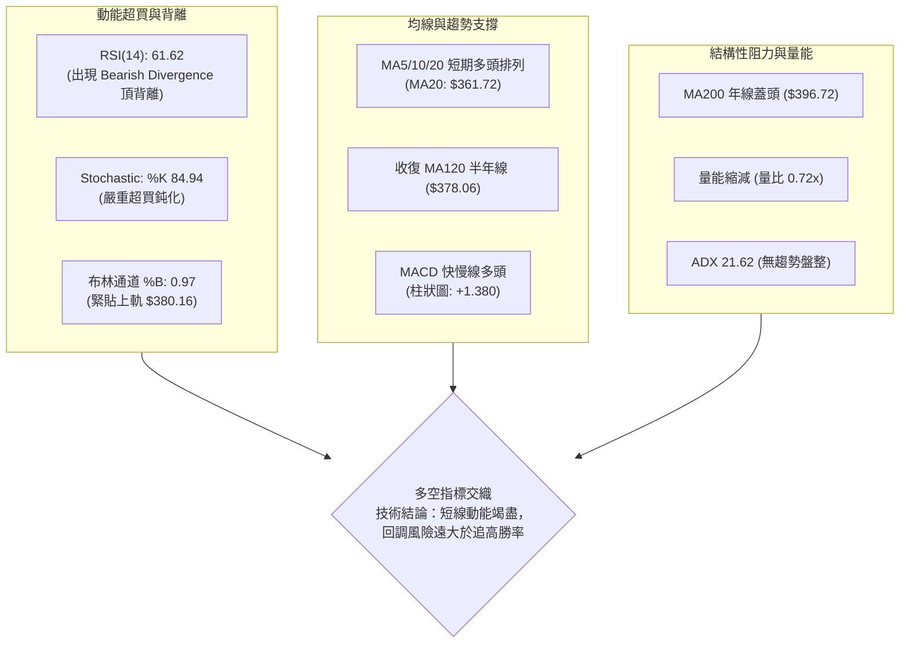

---

### 📈 移動平均線排列分析

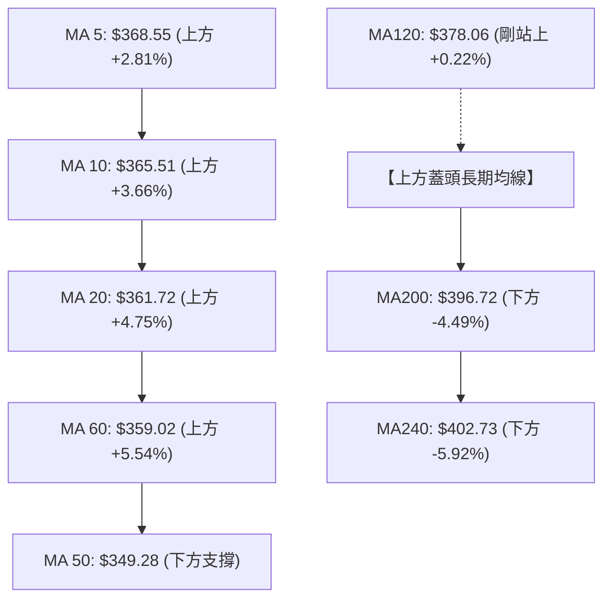

#### 均線數據狀態清單

| 均線名稱 | 數值 | 距現價乖離 | 排列狀態 | 走勢特徵（引用微觀走勢） |
|:---|:---:|:---:|:---:|:---|
| **MA 5** | $368.55 | +2.81% | 短期多頭排列 | 上彎加速（`▁▁▂▂▂▃▃▄▄▅▅▅▅▅▆▆▆▇▇▇████▇▇▇▇██`） |
| **MA 10** | $365.51 | +3.66% | 短期多頭排列 | 穩定昂頭（`▁▁▂▂▂▃▃▄▄▄▅▅▅▅▆▆▆▇▇▇▇█████████`） |
| **MA 20** | $361.72 | +4.75% | 短期基線支撐 | 自低位持續修復回升（`▃▂▂▂▁▁▁▁▁▂▂▃▃▄▄▄▅▅▆▆▆▇▇▇▇█████`） |
| **MA 60** | $359.02 | +5.54% | 中期走平回升 | 探底後初現拐點（`███▇▇▆▆▆▅▅▄▄▄▃▃▃▂▂▂▂▂▂▁▁▁▁▁▁▁▁`） |
| **MA 120** | $378.06 | +0.22% | 剛微幅收復 | 長期走平緩跌（`██▇▇▆▆▅▅▅▄▄▄▃▃▃▂▂▂▂▁▁▁▁▁▁▁▁▁▁▁`） |
| **MA 200** | $396.72 | -4.49% | 長期空頭壓制 | 下行趨勢尚未扭轉，是多頭波段上行的主要障礙 |
| **MA 240** | $402.73 | -5.92% | 長期空頭壓制 | 下跌斜率明顯（`██████████████▇▇▇▆▆▅▅▄▄▃▃▂▂▁▁▁`） |

> **均線排列診斷**：當前屬於典型的**「混合排列（短多長空）」**。MA5 > MA10 > MA20 > MA60 構成短線強勢反彈結構；然而，MA200 與 MA240 仍在現價上方呈現負斜率下行。在技術分析理論中，缺乏長天期均線順向配合的短均多頭排列，容易在碰觸年線時轉化為「均線空頭反撲」。

---

### 📉 RSI(14) 分析與背離判定

* **數值**：**61.62**（處於 30–70 中性強勢區間）
* **強度進度條**：`████████████░░░░░░░░` 61.6%

```
RSI(14) 狀態儀：
[0 ────── 30 (超賣) ────── 50 (平衡) ──●── 70 (超買) ────── 100]
                                   61.62
```

#### ⚠️ 頂背離 (Bearish Divergence) 深度判斷

* **價格行為**：近三週價格自 $364.27 連續抬升至 $378.90，創出 8 月以來收盤新高。
* **RSI 行為**：週線級別 RSI 在 8 月 23 日收在 $362.86 時達到峰值 **72.7**，隨後股價漲至 $378.90 時，RSI 卻降至 **61.62**。
* **明確結論**：**日線與週線層面均確認存在「頂背離」信號**。這意味著推動價格創新高的內部動能已經衰退，資金跟隨意願減弱，短期見頂回調的機率極高。

---

### 📊 MACD(12/26/9) 訊號解讀

* **MACD 線**：`5.566`
* **Signal 訊號線**：`4.186`
* **MACD 柱狀圖 (Histogram)**：`+1.380` 🟢（維持正向擴張）

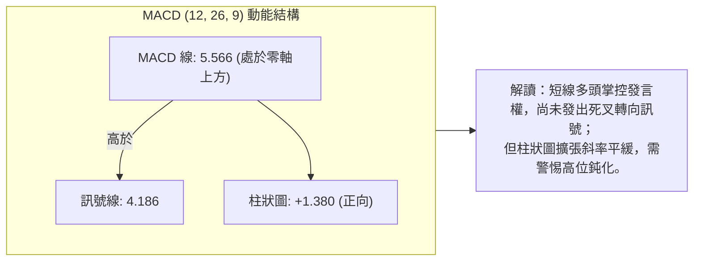

---

### 📦 布林通道分析

* **布林上軌**：`$380.16`
* **布林中軌 (MA20)**：`$361.72`
* **布林下軌**：`$343.28`
* **帶寬 (Bandwidth)**：`($380.16 - $343.28) / $361.72 = 10.19%`（帶寬收窄後剛開始走平）
* **%B 指標**：`0.97`（0 = 下軌，0.5 = 中軌，1.0 = 上軌）

```
TSLA 布林通道 (Bollinger Bands) 位置示意圖
════════════════════════════════════════════════════════════════
$380.16 ──┬─────────────────────────────────────── 上軌 (Upper Band)
          │  ● 0.97 (%B 緊貼上軌，嚴重超買區)
$378.90 ──┴─ 現價 ($378.90)
          │
          │
$361.72 ──── 中軌 (MA20 基準線 / 第一回調目標)
          │
          │
$343.28 ──── 下軌 (Lower Band / 區間底界)
════════════════════════════════════════════════════════════════
```

> **技術涵義解讀**：%B 達到 0.97 代表現價已經觸及上軌壓力邊界。在 ADX 僅為 21.62（非強趨勢單邊暴漲）的背景下，布林通道無法形成連續「開口向上擴軌跑」的走勢，90% 以上的機率會在 $380.16 附近遭遇均值回歸壓力，隨後展開向布林中軌（$361.72）的回撤確認。

---

### 💹 成交量分析（量價配合度）

* **最新成交量**：`28,089,930`
* **20日均量**：`38,798,346` ｜ **量比**：`0.72x`（顯著量縮 -27.6%）
* **50日均量**：`38,162,767`
* **OBV 趨勢**：`OBV > MA` 🟢（中期能量潮仍保持在均線之上）

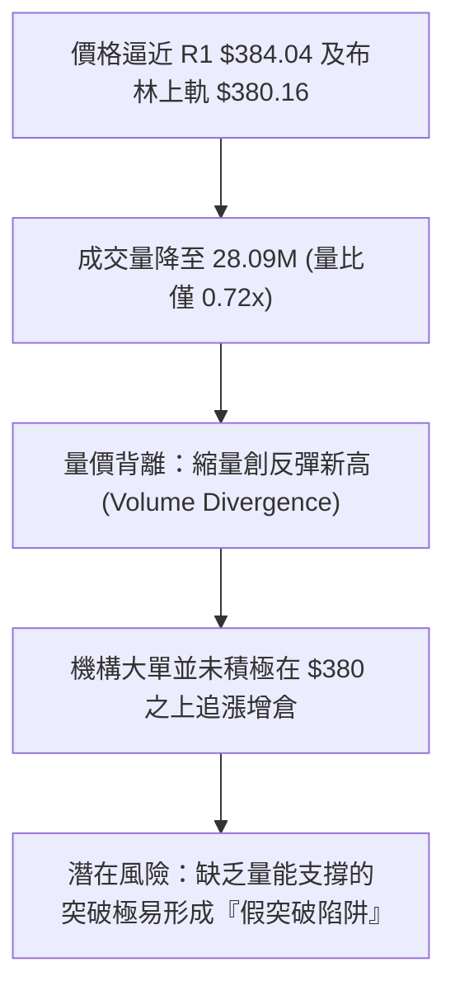

---

## 6. 動能與波動率

### ⚡ 動能評估四象限

將市場標的依據「動能強度（Momentum）」與「波動率水平（Volatility）」劃分四個狀態空間：

| 象限分區 | 動能維度 | 波動率維度 | TSLA 當前狀態 | 交易策略與技術意涵 |
|:---:|:---:|:---:|:---:|:---|
| **第一象限 (Q1)** | 強動能 (Bullish) | 低波動 (Low Vol) | — | 最佳趨勢加碼機會（單邊平穩主升浪）。 |
| **第二象限 (Q2)** | 弱動能 (Bearish) | 低波動 (Low Vol) | — | 謹慎觀望，流動性枯竭的死水走勢。 |
| **第三象限 (Q3)** | 強動能 (Bullish) | 高波動 (High Vol) | — | 高風險高收益，情緒化追漲殺跌（如2024年底行情）。 |
| **第四象限 (Q4)** | **轉折動能 (Divergence)** | **中等偏低 (Controlled)** | **✓ (TSLA 當前位置)** | **短線動能指標鈍化（背離）疊加 ATR 降至 3.46%，行情進入防禦性阻力消化期。** |

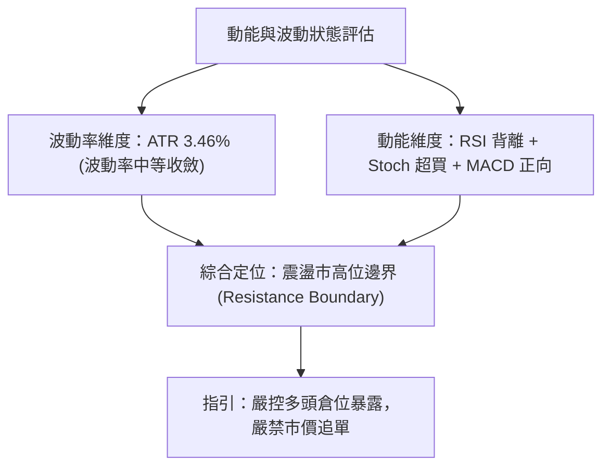

---

### 📊 ATR 波動率分析

* **當前 ATR(14)**：`$13.13`
* **價格佔比**：`3.46%`（屬於 TSLA 歷史相對穩定的波動率區間）

#### ATR 動態止損與風險距離測算

依據專業機構採用的 ATR 風險乘數模型，設定精確止損止盈範圍：

| 風險偏好 | 乘數設定 | 止損保護距離 ($) | 多頭理論止損價 (現價 - ATR) | 技術對應參考位 |
|:---|:---:|:---:|:---:|:---|
| **緊密止損 (超短線)** | 1.0 × ATR | $13.13 | **$365.77** | 剛好落在支撐 S1 ($366.31) 附近 |
| **標準止損 (波段)** | 1.5 × ATR | $19.70 | **$359.20** | 位於 MA60 ($359.02) 與 MA20 中軌之間 |
| **寬鬆止損 (中長線)** | 2.0 × ATR | $26.26 | **$352.64** | 貼近強支撐 S2 ($354.05) 與 MA50 防線 |

---

### 📐 Beta 與市場相關性

* **Beta 係數**：`1.845`
* **技術意涵解讀**：TSLA 具備高彈性（High-Beta）特性，其價格波動幅度約為 S&P 500 指數的 1.845 倍。當大盤指數微幅回調 1% 時，TSLA 技術面隱含 1.85% 左右的下殺回撤壓力。因此，在當前大盤位置若無法提供強勁多頭共振，TSLA 單獨突破 $384.04 阻力的難度極大。

---

## 7. 多時框架總結

### 📋 時框架評分表

| 時框架 | 趨勢方向 | 動能狀態 | 均線系統 | 形態結構 | 評分 (1-100) | 核心操作指引 |
|:---|:---:|:---:|:---:|:---:|:---:|:---|
| **日線層級**<br>(Daily) | 🟡 中性偏多 | 🔴 RSI頂背離<br>Stoch超買 | 🟢 短多排列<br>(MA5/10/20) | 🟡 測試阻力 R1<br>觸及布林上軌 | **54/100** | 不盲目追高，等待回踩支撐或放量突破確認。 |
| **週線層級**<br>(Weekly) | 🟢 波段反彈 | 🟡 MACD柱收斂<br>動能放緩 | 🟡 夾於MA50與<br>MA200之間 | 🟢 底部V型修復<br>雙底頸線站穩 | **62/100** | 中期築底初具成效，但面臨年線蓋頭壓。 |
| **月線層級**<br>(Monthly) | 🔴 長期偏空 | 🟡 底部超跌反抽<br>低位抬升 | 🔴 承壓於MA200<br>($396.72) | 🔴 52W寬幅箱體<br>下半區整理 | **45/100** | 長期牛市架構尚未完全修復，定性為深幅反彈。 |

---

### 🔲 綜合訊號矩陣

```
TSLA 多時框訊號共振矩陣
══════════════════════════════════════════════════════════════════════
維度          短期 (日線)          中期 (週線)          長期 (月線)
──────────────────────────────────────────────────────────────────────
趨勢方向      🟢 多頭引導 (+DI優勢)  🟢 波段反彈中        🔴 長線空頭修正
動能指標      🔴 頂背離/超買       🟡 柱狀圖縮減        🟡 擺脫極端超賣
均線支撐      🟢 位於MA20/50之上   🟡 承壓於MA200之下   🔴 低於MA200/240
量價配合      🔴 縮量反彈 (0.72x)  🟢 OBV維持均線上     🔴 月成交量未顯著放大
形態位置      🔴 逼近布林上軌      🟢 雙底量度空間未完  🟡 處於52W區間40.5%
══════════════════════════════════════════════════════════════════════
結論一致性：  短線嚴重超買防回調 ｜ 中期具備修復空間 ｜ 長期受制年線天花板
```

---

### ⚖️ 多時框收斂定論

依據多時框收斂規則第 14 條嚴格執行：

1. **市場性質判定**：當前日線 ADX(14) 數值為 **21.62 (< 25)**，明確指示當前市場屬於**「盤整震盪行情（Ranging Market）」**，而非單邊趨勢行情。
2. **主導維度取捨**：在盤整行情中，單邊均線追隨系統失效，交易必須以**日線布林通道上下軌（$343.28 — $380.16）與波段關鍵支撐阻力（S1/S2 與 R1/R2）構成的區間**為核心操作基準。
3. **唯一方向性結論**：**【中性觀望，區間震盪偏防禦】**。
   * 儘管日線短期均線多頭排列，但由於觸及布林上軌 ($380.16)、量比萎縮至 0.72x、RSI 出現頂背離，且上方存在年線 MA200 ($396.72) 重度壓制，**短線向上空間極度受限，回調尋求支撐（S1 $366.31 乃至 MA20 $361.72）的概率顯著高於直接單邊暴漲**。

---

## 8. 交易策略建議

### 🗺️ 策略決策流程圖

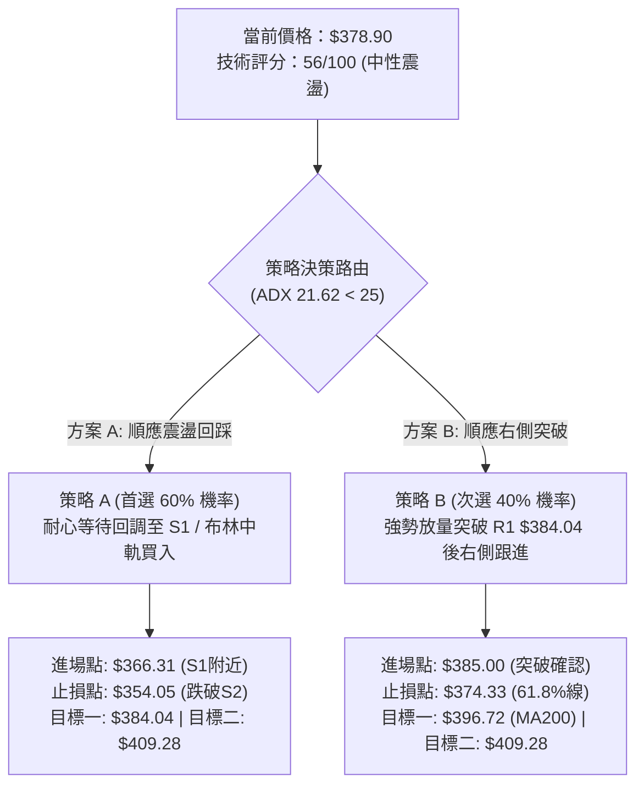

---

### 🧭 策略路由

* **綜合評分定位**：**56 / 100 ➔ 判定為【中性區間操作】**
* **一句話核心定調**：**當前主策略方向 = 【區間操作，耐心等待回踩支撐低吸，或放量突破確認後再行跟進，現價不盲目追多】**。

---

### 🎯 價格情境階梯（Price Scenarios）

所有觸發價位與目標位，均精確引用第 4 章中由 OHLCV 聚類計算出的關鍵價位：

| 觸發條件 | 判定點位 | 下一目標價位 | 後續延伸極限 | 技術情境結構含義 |
|:---|:---:|:---:|:---:|:---|
| **強勢突破** | 日K收盤突破 **R1 $384.04** 且成交量比 > 1.2x | **R2 $409.28** | **R3 $418.36** | 擺脫盤整，正式向 MA200 ($396.72) 及高位發起衝擊。 |
| **當前震盪** | 運行於 **$366.31 (S1)** 至 **$380.16 (布林上軌)** | — | — | 消化超買指標與 RSI 頂背離，屬於蓄勢整理走勢。 |
| **破位回調** | 日K實體跌破 **S1 $366.31** | **S2 $354.05** | **S3 $337.24** | 短線反彈失敗，回踩 MA50 尋求中期支撐防線。 |

---

### 📊 情境機率分佈

| 演化情境 | 機率權重 | 核心技術依據（引用指標狀態） |
|:---|:---:|:---|
| **區間震盪 / 回踩蓄勢** | **50%** | ADX 僅 21.62 指向震盪；布林 %B 達 0.97 需修復；RSI 頂背離需要回踩消化。 |
| **回落測試支撐 (再探底)** | **30%** | 縮量反彈（量比 0.72x）顯示動能後繼乏力；上方年線 ($396.72) 形成心理沉重蓋頭。 |
| **放量向上突破** | **20%** | MACD 柱狀圖維持紅柱；短期均線呈現多頭排列；OBV 指標中期維持在均線之上。 |

---

### 🟢 主策略詳情

根據 56/100 技術評分卡指引，不得兩頭下注，交易策略主推「區間回踩低吸（策略 A）」與「右側放量追破（策略 B）」兩套嚴謹的操作細則：

| 策略維度要素 | 策略 A：區間回調低吸策略（首選） | 策略 B：突破動能追隨策略（右側驗證） |
|:---|:---|:---|
| **策略類型** | 順應大級別反彈、次級回踩買入 | 右側強勢突破確認跟進 |
| **進場條件** | 價格回踩至支撐 S1 與 MA20 之間出現日線下影企穩K線 | 日K實體明確收在 R1 $384.04 之上，且成交量放大至 40M 以上 |
| **精確進場價格** | **$366.31**（支撐位 S1） | **$385.00**（突破 R1 後回踩確認點） |
| **第一目標價 (T1)** | **$384.04**（阻力位 R1） | **$396.72**（MA200 年線 / 斐波那契 50%） |
| **第二目標價 (T2)** | **$409.28**（阻力位 R2） | **$409.28**（阻力位 R2 / 波段前高） |
| **防守止損價格** | **$354.05**（跌破強支撐 S2 嚴格止損） | **$374.33**（跌回斐波那契 61.8% 假突破止損） |
| **止損空間 / 點數** | $12.26 (約 3.35%) | $10.67 (約 2.77%) |
| **目標一收益空間** | +$17.73 (約 +4.84%) | +$11.72 (約 +3.04%) |
| **目標二收益空間** | +$42.97 (約 +11.73%) | +$24.28 (約 +6.31%) |
| **風險報酬比 (至T2)** | **1 : 3.51** 🟢 (極優) | **1 : 2.28** 🟢 (良好) |
| **技術成功機率** | **65%** | **55%** |
| **建議配置倉位** | **總資金之 10% - 15%** | **總資金之 5% - 8% (右側輕倉)** |

---

### 🔴 反向風險觸發點（對沖提示）

以下關鍵價位被跌破時，將**徹底證偽主策略的多頭反彈邏輯**，交易員應即刻啟動風控對沖或清倉離場：

* ⚠️ **初級警報點（$374.33）**：跌破斐波那契 61.8% 回調位，宣告短線強勢反彈終結，預示將回撤測試布林中軌。
* 🚨 **極限對沖點（$354.05）**：一旦日K實體跌破強支撐 S2，意味著雙底頸線徹底失守，頭肩頂或箱體下破風險確立。此時多頭必須無條件平倉，並可反手配置保護性 Put 期權或直接建立空頭對沖倉位，下看 S3 **$337.24**。

---

### ⭐ 整體訊號強度評星

```
做多訊號強度：★★★☆☆  (3.0/5星 — 短均強勢但受制於阻力與背離)
做空訊號強度：★★☆☆☆  (2.5/5星 — 均線仍有支撐，未見破位長陰)
整體可信度：  ★★★★☆  (4.0/5星 — 指標相互印證，震盪特徵明確)
```

---

## 9. 風險提示與監控

### ✅ 關鍵監控指標 Checklist

```
╔══════════════════════════════════════════════════════════════╗
║               TSLA 交易日常風控監控清單 (Checklist)           ║
╠══════════════════════════════════════════════════════════════╣
║ [ ] 價位監控：收盤價是否有效站上 R1 ($384.04)？              ║
║ [ ] 均線監控：MA20 ($361.72) 動態支撐是否保持上行斜率？      ║
║ [ ] 動能警報：日線 RSI(14) 頂背離是否引發指標下穿 50 分界線？║
║ [ ] 形態防守：斐波那契 61.8% ($374.33) 是否被實體長陰下破？   ║
║ [ ] 量能驗證：突破時單日成交量是否放大至 4,000 萬股以上？    ║
║ [ ] 波動異常：單日價格波動是否超過 1.5 倍 ATR ($19.70)？      ║
╚══════════════════════════════════════════════════════════════╝
```

---

### ⚠️ 風險場景分析

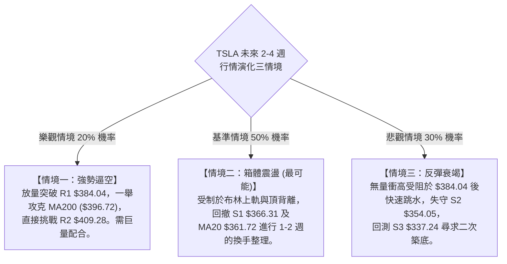

---

### 🛡️ 風險管理重要提醒

1. **嚴防縮量假突破陷阱**：目前最新成交量僅 2,808 萬股，遠低於 20 日均量（3,880 萬股）。若盤中出現突破 $384.04 但尾盤成交量未放大且留長上影線，極可能是誘多陷阱，嚴禁市價追單。
2. **Beta 槓桿效應控制**：TSLA 高達 1.845 的 Beta 意味著系統性風險被大幅放大。單一個股的持倉曝險規模建議控制在投資組合總資產的 15% 以內，單次停損風險暴露不得超過總資產的 1.0%。
3. **ATR 浮動追蹤防守**：在獲利超過 1 個 ATR（約 +$13.13）後，應立即將止損點推移至進場保本點，確保本金絕對安全。

---

## 10. 報告總結

```
╔══════════════════════════════════════════════════════════════════╗
║                    TSLA 技術分析全景總結                      ║
╠══════════════════════════════════════════════════════════════════╣
║ 報告日期：2026-09-22                                         ║
║ 當前價格：$378.90                                             ║
║ 分析評級：⚖️ 中性觀望 (Neutral / 區間高拋低吸)                 ║
║ 綜合技術得分：56 / 100 🟡 (震盪行情)                          ║
╠══════════════════════════════════════════════════════════════════╣
║ 趨勢結構診斷：                                                 ║
║ ├─ 長期趨勢 (月線)：🔴 偏空修正，承壓於 MA200 ($396.72) 之下   ║
║ ├─ 中期趨勢 (週線)：🟢 超跌反彈，自 $311.21 啟動之波段持續修復  ║
║ ├─ 短期趨勢 (日線)：🟡 短均多頭，但觸及布林上軌面臨回調壓力    ║
║ ├─ 核心阻力位聚類：R1: $384.04  |  R2: $409.28  |  R3: $418.36 ║
║ ├─ 核心支撐位聚類：S1: $366.31  |  S2: $354.05  |  S3: $337.24 ║
║ └─ 斐波那契關鍵位：61.8% 支撐 ($374.33) ｜ 50.0% 壓力 ($398.10) ║
╠══════════════════════════════════════════════════════════════════╣
║ 最優交易執行架構：                                             ║
║ 1. 🥇 最佳機會 (策略 A)：耐心等待回調至 $366.31 (S1) 企穩買入， ║
║    嚴格止損 $354.05，目標直指 $384.04 / $409.28 (風報比 1:3.51)║
║ 2. 🥈 次選機會 (策略 B)：若強勢放量突破 $384.04 (R1)，待回踩確認║
║    以 $385.00 右側跟進，止損 $374.33，目標 $396.72 (年線)       ║
║ 3. 🥉 保守選擇：持有現金觀望，等待 ADX 回升至 25 以上確認單邊   ║
║    突破方向再行進場。                                         ║
╚══════════════════════════════════════════════════════════════════╝
```

---

> ⚠️ **免責聲明**：本報告為依據客觀市場數據進行之量化與技術圖表分析，所有價位、阻力支撐及評估數值均嚴格基於所提供之歷史價格與指標模型推算。本報告**僅供學術研究與交易思路參考**，**絕不構成任何具體的證券買賣邀約或個人化投資建議**。市場具有高度不確定性，交易者應獨立評估風險並自負盈虧。

---

*報告生成時間：2026-09-22 ｜ 數據來源：Yahoo Finance ｜ 分析框架：多時框技術分析體系*