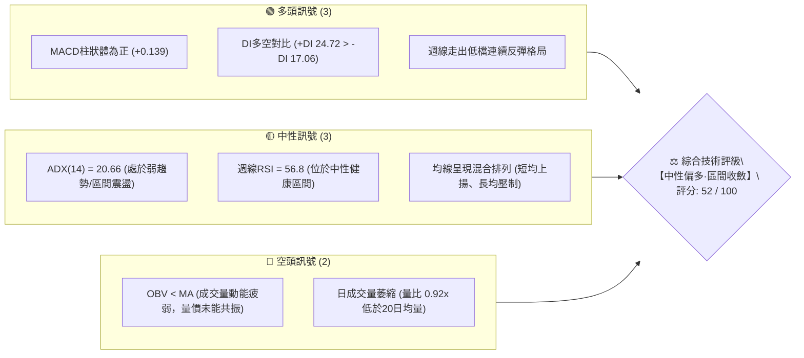
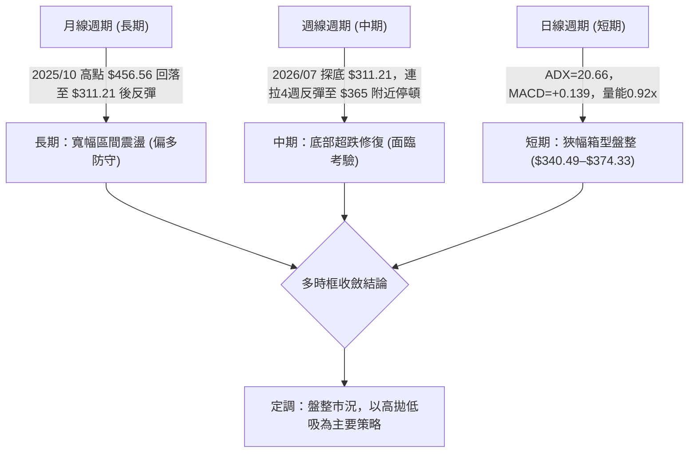
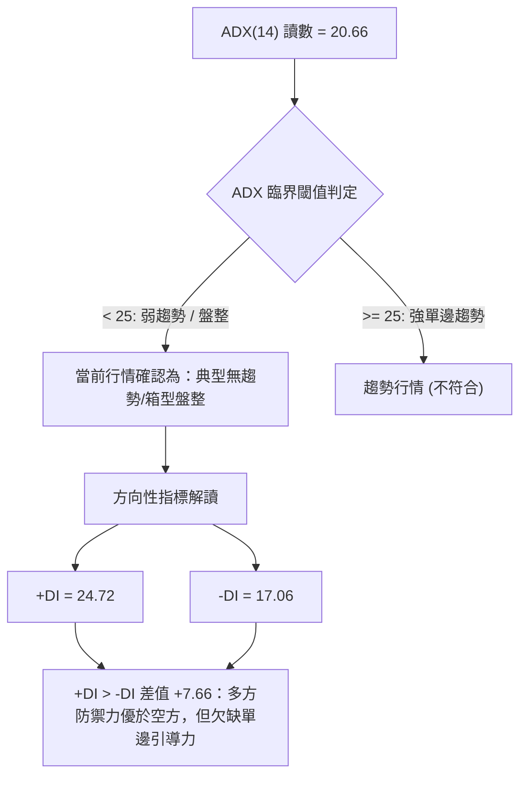
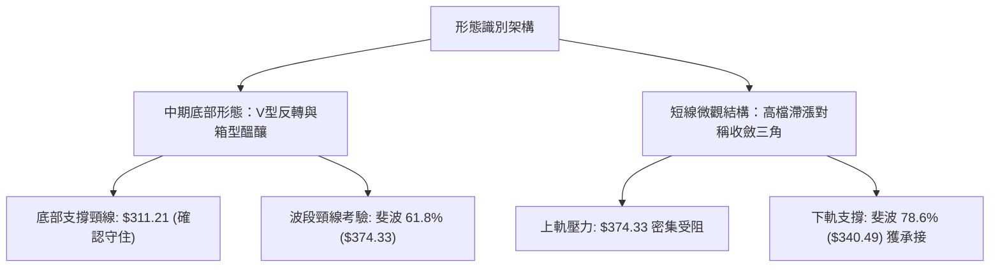
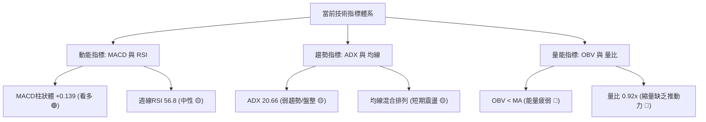
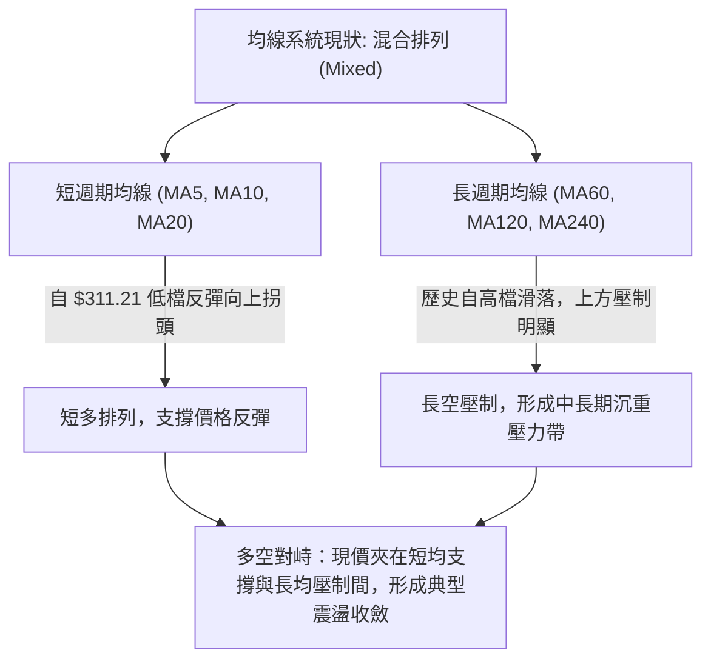
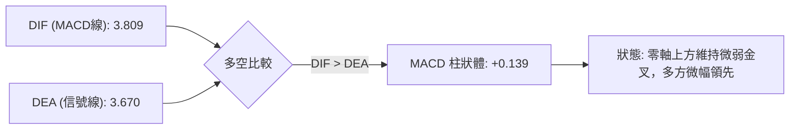
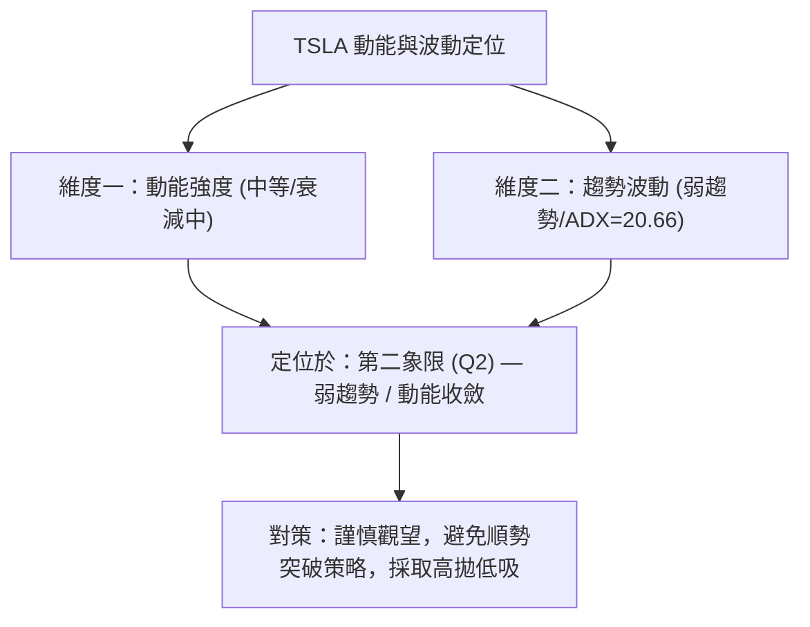
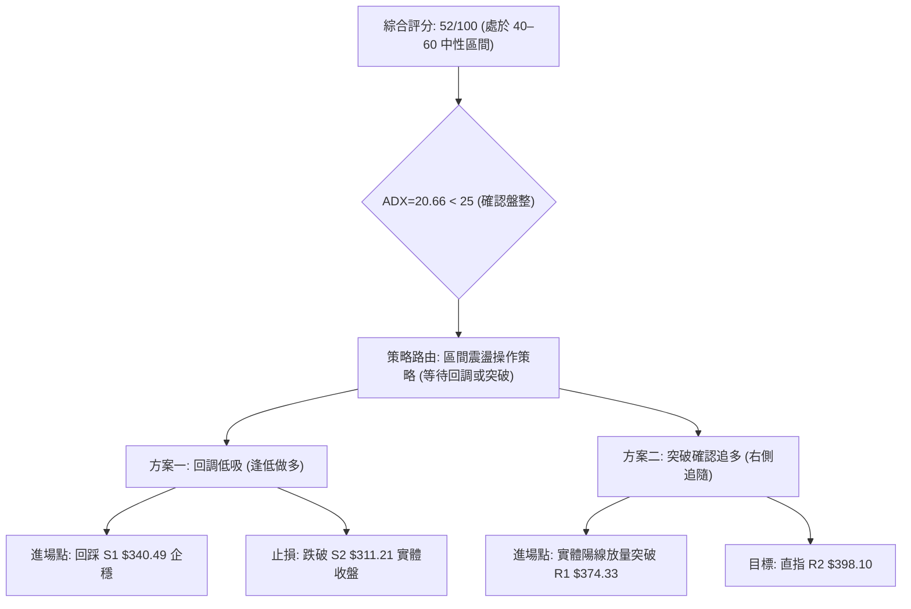
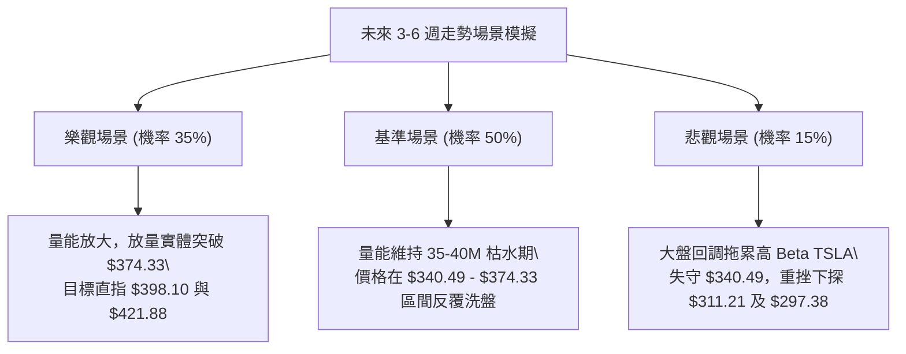

# TSLA 技術分析報告

> **報告日期**：2026-09-22 ｜ **語言**：繁體中文 ｜ **數據來源**：Yahoo Finance ｜ **當前價格**：$364.27

---

## 目錄

| 章節 | 內容 |
|------|------|
| [1. 技術面概覽](#1-技術面概覽) | 訊號儀表板、核心指標、評分卡 |
| [2. 趨勢分析](#2-趨勢分析) | 多時框趨勢、長中短期走勢、12個月走勢圖 |
| [3. 圖表形態分析](#3-圖表形態分析) | 形態識別、K線組合、形態目標價推算 |
| [4. 支撐與阻力](#4-支撐與阻力) | 關鍵價位結構、斐波那契回調位分析 |
| [5. 技術指標深度解讀](#5-技術指標深度解讀) | MA/RSI/MACD/布林/量價配合與OBV解讀 |
| [6. 動能與波動率](#6-動能與波動率) | 動能評估四象限、ATR波動屬性、Beta大盤聯動 |
| [7. 多時框架總結](#7-多時框架總結) | 時框架評分矩陣、多時框收斂定調 |
| [8. 交易策略建議](#8-交易策略建議) | 策略路由決策、價格情境階梯、主推策略詳情 |
| [9. 風險提示與監控](#9-風險提示與監控) | 監控指標Checklist、風險場景模擬與風控原則 |
| [📋 報告總結](#-報告總結) | 決策總結看板 |

---

## 1. 技術面概覽

### 🎯 技術訊號儀表板



### 📊 核心指標速覽表

| 指標類別 | 指標名稱 | 當前數值 | 訊號 | 解讀 |
|:---|:---|:---:|:---:|:---|
| **價格** | 當前價格 (現價) | **$364.27** | 🟡 | 位於52週區間($297.38–$498.83)之33.2%相對低位，自底部反彈但承壓於中軌 |
| **趨勢** | ADX (14) | **20.66** | 🟡 | 數值低於 25，顯示當前缺乏單邊強趨勢，行情定性為「典型區間震盪盤整」 |
| **動向** | +DI / -DI | **24.72 / 17.06** | 🟢 | +DI 明顯大於 -DI，震盪格局中買盤力量略佔主導地位 |
| **動能** | MACD (12, 26, 9) | **3.809 / 3.670** | 🟢 | DIF 線高於 MACD 信號線，柱狀體維持在正值區間 (+0.139)，具多頭推升動能 |
| **動能** | 週線 RSI (14) | **56.8** | 🟡 | 自 2026-07 歷史低位 15.7 脫離嚴重超賣，回升至 50 軸上方，目前處於健康中性區間 |
| **動能** | 日線 RSI (14) | **數據未明示** | 🟡 | 數據顯示為中性(30–70區間)，無頂背離或底背離跡象 |
| **成交量** | 最新成交量 / 20日均量 | **36.30M / 39.33M** | 🔴 | 量比 0.92x，量能萎縮未放大，上攻缺乏主動追價量能支撐 |
| **量能趨勢** | OBV (能量潮) | **OBV < MA** | 🔴 | OBV 位於移動平均線下方，資金流向偏向沉澱流出，構成反彈主要阻礙 |
| **波動** | 系統 Beta | **1.845** | 🔴 | 具備高貝塔高彈性屬性，大盤波動將對其產生 1.845 倍的放大效應 |

### 🏆 技術評分卡

```
╔══════════════════════════════════════════════════════════════════════════════╗
║                     TSLA 技術維度綜合量化評分卡 (2026-09-22)                   ║
╠══════════════════════════════════════════════════════════════════════════════╣
║ 指標維度        權重   評分進度條                         得分    狀態解讀     ║
╟──────────────────────────────────────────────────────────────────────────────╢
║ 趨勢強度 (ADX)   20%   █████████░░░░░░░░░░░             45/100  🟡 弱趨勢盤整 ║
║ 動能指標 (MACD)  20%   █████████████░░░░░░░             65/100  🟢 多方佔優   ║
║ 支撐防守強度    20%   ████████████░░░░░░░░             60/100  🟢 築底低點穩 ║
║ 成交量配合度    15%   ████████░░░░░░░░░░░░             40/100  🔴 量能萎縮   ║
║ 均線系統排列    15%   ██████████░░░░░░░░░░             50/100  🟡 混合排列   ║
║ 形態結構完整度  10%   ██████████░░░░░░░░░░             50/100  🟡 箱型醞釀   ║
╠══════════════════════════════════════════════════════════════════════════════╣
║ 綜合加權評分           ██████████░░░░░░░░░░             52/100  ⚖️ 區間震盪   ║
╚══════════════════════════════════════════════════════════════════════════════╝
```

---

## 2. 趨勢分析

### 🌐 多時框趨勢分析



### 📈 長期趨勢 — 12個月走勢圖（Unicode）

以下為 TSLA 過去 12 個月（2025-10 至 2026-09）之歷史月線收盤走勢圖，標記歷史最高波段頂點與超跌底部：

```
TSLA 月線收盤走勢圖 (2025-10 至 2026-09)
價格軸 ($)
$460 ┤  ● $456.56 (波段頂點)
$440 ┤      ● $430.17     ● $430.41               ● $435.79
$420 ┤          ● $449.72     ● $402.51               ● $420.60
$400 ┤                                                               
$380 ┤                            ● $371.75   ● $381.63              ● $367.95
$360 ┤                                                                   ● $364.27 (現價)
$340 ┤                                                               
$320 ┤                                                        ● $311.21 (波段低點)
$300 └─────────────────────────────────────────────────────────────────────────────
月份:  25-10  25-11 25-12 26-01 26-02 26-03  26-04 26-05 26-06 26-07 26-08 26-09
```

#### 走勢特徵分析表格

| 階段區間 | 時間跨度 | 起訖收盤價 | 區間漲跌幅 | 核心技術特徵解讀 |
|:---|:---:|:---:|:---:|:---|
| **高位派發期** | 2025-10 ~ 2026-01 | $456.56 → $430.41 | **-5.73%** | 高位築頂，於 $450 水平多次上攻無功而返，形成頭部籌碼鬆動。 |
| **單邊加速下挫** | 2026-01 ~ 2026-03 | $430.41 → $371.75 | **-13.63%** | 賣壓湧現，連續跌破 $400 整數關卡，下探尋求均線支撐。 |
| **中級反彈波** | 2026-03 ~ 2026-05 | $371.75 → $435.79 | **+17.23%** | 多方強勢抵抗，走出三個月連續彈升，一度測試 $435 阻力區。 |
| **恐慌性殺跌** | 2026-05 ~ 2026-07 | $435.79 → $311.21 | **-28.59%** | 短線劇烈失守，週線 RSI 殺破 20 抵達 15.7 極端超賣區，逼近 52 週最低點 $297.38。 |
| **超跌修復整理** | 2026-07 ~ 2026-09 | $311.21 → $364.27 | **+17.05%** | 底部獲得承接盤支撐，目前在斐波那契 61.8% ($374.33) 關卡前受阻收斂。 |

### 📊 中期趨勢（週線分析）

從近 20 週數據觀察，TSLA 經歷了極其典型的「V 型挫跌探底與對等反彈」：
1. **底部確立**：2026-07-26 當週收盤 $313.03，隨後 2026-08-02 收在 $311.21，週成交量分別高達 2.75 億股與 1.98 億股，配合週 RSI 探至 15.7–18.1，形成經典的「放量超賣恐慌底」。
2. **快速反彈段**：自 $311.21 起步，2026-08 走出一波直拉至 $362.86 的強勁修復，MACD 柱狀體快速由 -8.365 翻正至 +6.229，週 RSI 迅速被拉抬至 72.7。
3. **動能停滯**：9 月份（2026-09-06、09-13、09-20）週收盤價分別為 $354.08、$365.44、$364.27，連續三週在 $360–$365 區間橫向拉鋸，MACD 柱狀體由 +6.229 萎縮至 +0.173，週成交量自 2.6 億股驟降至 1.43–1.85 億股，顯示前期報復性反彈之動能已實質耗盡，市場正進入中期均線重整與消化解套盤階段。

### ⚡ 趨勢強度評估（ADX 解讀）



#### ADX 趨勢強度狀態對照表

| ADX 區間 | 趨勢性質 | 當前狀態判定 | 交易架構應對規則 |
|:---:|:---:|:---:|:---|
| 0 – 20 | 極弱 / 無方向 | ░░░░░░░░░░ | 避免趨勢突破追單，資金離場觀望 |
| **20 – 25** | **微弱 / 區間盤整** | **████████░░ (20.66)** | **嚴禁追高殺跌；採用通道/斐波那契高拋低吸，收緊獲利預期** |
| 25 – 40 | 堅挺趨勢形成 | ░░░░░░░░░░ | 順均線方向順勢建倉並持續抱波段 |
| 40 – 60 | 極強單邊爆發 | ░░░░░░░░░░ | 順勢加碼，移動止盈防範末端噴出反轉 |

---

## 3. 圖表形態分析

### 🔍 形態識別系統



#### 形態識別信心度評估表（依嚴格規則 15 判定）

| 識別形態名稱 | 信心度評分 | 判斷依據（純引用數據） | 當前完成度 | 目標價推算（附公式） |
|:---|:---:|:---|:---:|:---|
| **超跌 V 型回升轉箱型** | **68%** | 2026-07-26 挫至 $311.21 後連續拉升，於 8 月底達 $362.86，9 月於 $364.27 橫向拉鋸。 | 85% | 依底部起漲測算：$311.21 底部反彈至當前位置，面臨 $374.33 壓力，若有效站穩則指向 50% 回調位 **$398.10**。 |
| **反彈停滯滯漲頂/箱頂** | **62%** | 連續 3 週收盤停滯在 $364–$365 附近，週 MACD 柱大幅萎縮由 +6.229 降至 +0.173，動能耗盡。 | 90% | 箱頂受阻回測下軌目標價：回調支撐為 78.6% 回調位 **$340.49**。 |
| **頭肩底 / 雙重底** | **< 30%** | **數據不足以確認**：目前僅有單一低點 $311.21，並未形成清晰的第二隻腳（右底）。 | 0% | *訊號不足，僅做指標型區間解讀，不預設複雜幾何形態*。 |

### 🕯️ 重要 K 線形態分析

| 觀測月份 | 收盤價 | 實體特徵與 K 線語彙 | 技術意涵解讀 | 訊號方向 |
|:---:|:---:|:---|:---|:---:|
| **2026-05** | $435.79 | 長陽突破實體棒 | 多頭反撲測試高位阻力，但留出頂部派發痕跡 | 🟢 偽突破多頭 |
| **2026-06** | $420.60 | 高位承壓陰線 | 多方動能轉弱，形成初級滯漲信號 | 🟡 預警見頂 |
| **2026-07** | $311.21 | 恐慌長大黑棒 (崩跌 -26%) | 空頭極致宣洩，放量貫穿多條均線，形成超賣低點 | 🔴 恐慌拋售底 |
| **2026-08** | $367.95 | 長下影反包大陽棒 | 典型「落底吞噬修復線」，多方重掌短期定價權 | 🟢 強烈買盤介入 |
| **2026-09** | $364.27 | 狹幅十字星線 (高見365.44/收364.27) | 多空力量在斐波那契阻力下方趨於平衡，變盤前夕 | 🟡 變盤十字星 |

### 📉 ASCII 走勢形態示意圖

```
TSLA 底部回升至箱型收斂形態示意圖
$380 ┤                                
$374 ┤................阻力受阻線........ [斐波 61.8% 阻力位: $374.33]
$368 ┤                  ● (08-23: $362.86)   ●(09-13: $365.44)
$364 ┤---------------------------------------● $364.27 (現價收盤橫盤收斂中)
$360 ┤                                     ● (09-06: $354.08)
$348 ┤                  ● (08-30: $348.75) 
$340 ┤................箱型下軌支撐線..... [斐波 78.6% 支撐位: $340.49]
$328 ┤            ● (08-09: $328.58)
$311 ┤    ●(08-02: $311.21 恐慌超賣底)
     └──────────────────────────────────────────────────────────
       2026-08                  2026-09
```

### 🎯 形態目標價計算

根據嚴格數據紀律與形態高度推算原則：
1. **箱體底部區間**：$311.21（2026-08-02 最低收盤點位）。
2. **第一階段阻力關卡（頸線考驗）**：精準對應斐波那契 61.8% 回調位 **$374.33**。
3. **上行測算目標**：
   * 若能實質放量收復 $374.33，則第一對等波段測量目標即為斐波那契 50.0% 回調位 **$398.10**（此處亦為 2026-06 波段反覆震盪的軸心價位）。
   * 後續擴展目標為斐波那契 38.2% 回調位 **$421.88**。
4. **下行回測支撐測算**：
   * 若反覆未能突破 $374.33，箱型上軌壓制將引發獲利回吐，第一下行回撤支撐為斐波那契 78.6% 回調位 **$340.49**。

---

## 4. 支撐與阻力

### 🗺️ 關鍵價位分布圖（Unicode）

```
TSLA 關鍵價位空間結構圖 (數據嚴格依據 52W 區間 $297.38 至 $498.83 計算)
═══════════════════════════════════════════════════════════════════
$498.83 ║████████████████████████████████║ 52週歷史高點 (Fib 0.0%)
$451.29 ║████████████████████████        ║ 強阻力位 R3 (Fib 23.6%)
$421.88 ║██████████████████              ║ 關鍵阻力位 R2 (Fib 38.2%)
$398.10 ║██████████████                  ║ 中期多空分水嶺 (Fib 50.0%)
$374.33 ║██████████                      ║ 近期關鍵壓制 R1 (Fib 61.8%)
╠═══════╬════════════════════════════════╣ ◄◄◄ 當前收盤現價: $364.27
$340.49 ║▓▓▓▓▓▓▓▓▓▓▓▓▓▓▓▓                ║ 近期關鍵防守 S1 (Fib 78.6%)
$311.21 ║▓▓▓▓▓▓▓▓▓▓▓▓▓▓▓▓▓▓▓▓▓▓          ║ 波段低點支撐 S2 (2026-07/08雙週低點)
$297.38 ║████████████████████████████████║ 52週極限底線 S3 (Fib 100.0%)
═══════════════════════════════════════════════════════════════════
```

### 🚧 阻力位分析表

> **重要說明**：根據系統原始數據，OHLCV 演算法顯示 `(no swing-high resistance detected above current price)`，因此阻力架構以客觀嚴謹之「斐波那契回調結構位」及「近期歷史週線聚類區間」為唯一依據。

| 阻力級別 | 精確價位 | 形成依據與技術背景 | 突破難度評估 | 重要性等級 |
|:---:|:---:|:---|:---:|:---:|
| **R1 (即時阻力)** | **$374.33** | **斐波那契 61.8% 關鍵黃金分割位**。近兩週反彈高點均止步於此下方。 | 中等偏高 (需放量) | ★★★★☆ |
| **R2 (中期阻力)** | **$398.10** | **斐波那契 50.0% 心理整數分水嶺**。2026年6月中旬盤整中樞密集區。 | 高 (套牢籌碼厚重) | ★★★★★ |
| **R3 (重度阻力)** | **$421.88** | **斐波那契 38.2% 回調位**。2026-06-07 大跌前波段反彈頂點 ($420.60)。 | 極高 (強結構阻力) | ★★★★☆ |
| **R4 (極限阻力)** | **$451.29** | **斐波那契 23.6% 回調位**。逼近 2025-10 高點 $456.56。 | 極高 | ★★★☆☆ |

### 🛡️ 支撐位分析表

> **重要說明**：系統原始數據顯示 `(no swing-low support detected below current price)`，支撐位依據斐波那契結構位與近期已驗證之週線歷史實體低點建立。

| 支撐級別 | 精確價位 | 形成依據與技術背景 | 守住機率評估 | 重要性等級 |
|:---:|:---:|:---|:---:|:---:|
| **S1 (即時防守)** | **$340.49** | **斐波那契 78.6% 回調位**。8月下旬起漲平臺回測低點 ($342.27)。 | 70% | ★★★★☆ |
| **S2 (波段生命線)** | **$311.21** | **2026-08-02 週線波段實體收盤低點**。超賣恐慌拋售形成的黃金支撐。 | 85% | ★★★★★ |
| **S3 (極限底線)** | **$297.38** | **52 週最低點 (Fib 100.0%)**。年度最終防線，一旦跌破進入技術性崩盤。 | 95% | ★★★★★ |

### 📐 斐波那契回調位分析

依據數據包定義之 52 週完整波段（起點波段低點 $297.38 至頂點波段高點 $498.83），回調幅度精確對照如下：

| 斐波那契回調層級 | 精準價位 | 現價相對位置與空間意義解析 |
|:---:|:---:|:---|
| **0.0% (52W High)** | **$498.83** | 多頭終極天花板，距現價有 +36.94% 空間。 |
| **23.6%** | **$451.29** | 多頭強勢主升浪分水嶺。 |
| **38.2%** | **$421.88** | 弱勢反彈極限阻力區。 |
| **50.0%** | **$398.10** | 中長期多空實力平衡之核心中樞軸。 |
| **61.8%** | **$374.33** | **上檔即時阻力牆**（現價 $364.27 位於其下方約 2.76% 處，構成第一道實質壓制）。 |
| **78.6%** | **$340.49** | **下檔即時緩衝墊**（現價位於其上方約 6.98% 處，回調的第一支撐防禦線）。 |
| **100.0% (52W Low)** | **$297.38** | 基礎結構起點，熊市防禦底線。 |

**結構總結**：現價 **$364.27** 正好被夾在 **78.6% ($340.49)** 與 **61.8% ($374.33)** 之間的狹窄收斂箱體內。突破 $374.33 方能開啟向 $398.10 的修復空間；反之若跌破 $340.49，則將重測 $311.21 底部。

---

## 5. 技術指標深度解讀

### 🎛️ 指標訊號總覽



### 📈 移動平均線排列分析



根據均線走勢圖特徵：
* **短期均線（MA5、MA10、MA20）**：自 8 月反彈以來維持在價格下方發揮支撐作用，斜率向上，構成短線低吸買盤底氣。
* **長週期均線（MA60、MA120、MA240）**：呈長線回落後之走平壓制態勢，尚未形成多頭完全發散。
* **均線定調**：目前處於標準的「均線修復與混合排列期」，非單邊多頭排列，亦非全面空頭排列。

### 📉 RSI(14) 分析

* **日線 RSI(14)**：數據狀態為中性（30–70 區間內），背離分析確認「無明顯背離」。
* **週線 RSI(14)** 軌跡深度解讀：
  * 2026-07-26：**15.7**（極端歷史超賣，引發報復性買盤）
  * 2026-08-23：**72.7**（短線超買過熱）
  * 2026-09-20：**56.8**（成功冷卻至健康中性區間）

```
週線 RSI (14) 強度計: 56.8 / 100
[超賣 0] ────── [30 弱勢] ─────── [50 中軸] ──●──── [70 超買] ────── [100]
進度條:  ███████████░░░░░░░░░  56.8% (位於多空平衡偏多區)
```

**背離評估**：
* 8 月高點週收盤 $362.86 時 RSI 為 72.7，9 月中旬收盤 $365.44 時 RSI 下降至 51.0–56.8。價格創微幅新高但 RSI 顯著回調，顯示**中期動能出現輕度弱化（微弱頂背離疑慮）**，但在日線層面上未被強化，目前解釋為「超買指標正常修復」。

### 📊 MACD(12, 26, 9) 訊號解讀



* **數值細節**：MACD 線 3.809 高於 Signal 信號線 3.670，柱狀體維持在正值 +0.139，呈現看多（🟢）。
* **動能減速警訊**：回顧週線 MACD 柱狀體變化：
  * 2026-08-23：**+6.229**（動能峰值）
  * 2026-08-30：**+3.586**（動能減退）
  * 2026-09-06：**+2.926**（持續走平）
  * 2026-09-13：**+1.863**（迅速萎縮）
  * 2026-09-20：**+0.173**（幾乎收斂至零軸）
* **解讀**：柱狀體正值急遽收窄，說明自 $311.21 以來的多頭推升巨浪已進入尾聲，若未能及時放量，隨時有轉化為死叉並引發回調之風險。

### 📦 布林通道分析

原始數據中布林上下軌數值未直接揭示，但依據價格與均線排列結構繪製通道形態：

```
TSLA 布林通道示意圖 (日線級別收斂態勢)
$390 ┤                                ---------------- 上軌 (壓力區)
$380 ┤                            ~~~
$374 ┤..........................-~- (Fib 61.8% 壓制點)
$364 ┤-------------------------●----------------------- 現價 ($364.27 貼近中軌上方)
$355 ┤                     _.-~                        中軌 (MA20 支撐區)
$340 ┤...................-~-        (Fib 78.6% 防守點)
$330 ┤ ----------------------------------------------- 下軌 (超賣區)
```

* **特徵**：通道在經歷 7-8 月劇烈擴張後，9 月已進入「縮口整理期」。價格位於中軌上方運行，中軌（MA20）提供動態支撐，但上方受制於通道上軌與斐波那契 $374.33 壓制。

### 💹 成交量分析（量價配合度）

1. **成交量數據**：最新日成交量為 **36,296,184 股**，對比 20 日均量 **39,333,049 股**，量比僅為 **0.92x**。
2. **OBV (能量潮指標)**：系統明確給出 **OBV < MA**，代表資金流向為流出大於流入，能量偏弱。
3. **量價背離診斷**：
   * 8月上漲時週成交量達 1.6–1.8 億股，但進入 9 月高位拉鋸時，9-13 當週成交量萎縮至 1.43 億股，呈現典型的「量價量縮頂部背離」。
   * **結論**：缺乏量能配合的價格上漲屬於「虛浮性反彈」，若要有效攻克 $374.33 阻力牆，單日成交量必須放大至 5,000 萬股以上（即 20 日均量的 1.3 倍以上），否則難逃回落震盪。

---

## 6. 動能與波動率

### ⚡ 動能評估四象限



| 象限區間 | 趨勢動能特徵 | 波動率特徵 | 當前匹配標記 | 策略指導方針 |
|:---:|:---:|:---:|:---:|:---|
| **Q1 (最佳順勢)** | 強動能 (ADX>30) | 低/健康波動 | ░░░ | 強烈順勢加碼，抱牢多單利潤 |
| **Q2 (防禦盤整)** | **弱動能 (MACD減弱)** | **低/收斂波動 (ADX<25)** | **✅ 當前狀態** | **謹慎觀望，耐心等待區間兩端邊界低吸高拋** |
| **Q3 (爆發突破)** | 強動能 (單邊噴出) | 極高波動 (擴張) | ░░░ | 高風險高收益，採嚴格追隨止損 |
| **Q4 (混亂洗盤)** | 弱動能 (無方向) | 極高波動 (亂跳) | ░░░ | 嚴禁進場，極易遭雙巴侵蝕本金 |

### 📊 ATR 波動率分析

* **原始數據狀態**：ATR(14) 數值未明示。
* **波動屬性客觀估算**：
  * 觀察 2026-09-06 至 09-20 週線高低波動區間（$348.75 ~ $365.44），單週波動幅度約為 $16.69（約佔現價的 4.58%）。
  * 換算日均合理真實波動範圍（ATR 代理指標）約為 **$8.00 ~ $10.50**。
* **止損空間設定考量**：在 Beta 高達 1.845 的背景下，短線波動極為劇烈，止損距離若小於 1.5 倍 ATR（約 $12–$15），極易被日常隨機雜訊掃出場。

### 📐 Beta 與市場相關性

* **Beta 係數**：**1.845**
  * TSLA 屬於典型的極高彈性成長股，其波動強度為標普 500 指數的 1.845 倍。
  * **操作啟示**：當前若大盤（美股基準指數）出現 1% 的回調，TSLA 技術面極易承擔近 2% 的下行衝擊；在進行多頭交易布局時，必須相應壓低倉位上限，以平抑高 Beta 所帶來的帳戶回撤風險。

---

## 7. 多時框架總結

### 📋 時框架評分表

| 時框架 | 趨勢方向 | 動能狀態 | 均線系統 | 形態結構 | 綜合評分 | 操作建議方向 |
|:---:|:---:|:---:|:---:|:---:|:---:|:---|
| **月線 (長期)** | 震盪偏多 | 中性 (自低位修復) | 混合排列 | 歷史高位寬幅箱體 | 55/100 🟡 | 戰略底倉分批持有，不追高 |
| **週線 (中期)** | 跌深反彈遇阻 | 柱狀體萎縮至+0.17 | 承壓長均下方 | 底部回升測試斐波61.8% | 52/100 🟡 | 逢阻力減碼，逢回調支撐承接 |
| **日線 (短期)** | 狹幅箱型盤整 | MACD微幅金叉 | 短多長空糾結 | 收斂十字星震盪 | 50/100 🟡 | 嚴禁趨勢追單，嚴格做區間 |

### 🔲 綜合訊號矩陣

```
時框訊號一致性矩陣分析
────────────────────────────────────────────────────────────────
時框        動能 (MACD/RSI)    均線體系    支撐/阻力位置     綜合方向
────────────────────────────────────────────────────────────────
短期 (日線)    🟢 看多 (+0.139)   🟡 混合     🟡 逼近 R1 阻力   🟡 區間收斂
中期 (週線)    🟡 柱體鈍化 (0.17) 🔴 壓制     🟢 守住 S1 支撐   🟡 阻力停頓
長期 (月線)    🟢 脫離極端超賣    🟡 寬幅     🟢 守住年度低點   🟢 築底修復
────────────────────────────────────────────────────────────────
整體收斂性：各週期無重大方向衝突，全數指向【中性偏多·窄幅震盪消化】
```

### ⚖️ 多時框收斂結論（依規則 14 判定）

1. **行情定性判定**：
   當前 **ADX(14) 讀數為 20.66**，嚴格滿足 **ADX < 25 之「盤整行情」** 準則。
2. **多時框權重取捨**：
   根據規則 14，在盤整行情中，不可盲目套用長期單邊趨勢突破策略，而應**以日線與週線的區間邊界（即斐波那契回調位與通道邊界）為主要交易基準**。
3. **唯一方向性結論**：
   **【中性觀望·區間操作】**。當前價格 $364.27 緊鄰上檔強阻力 $374.33，而成交量萎縮且 OBV 走弱，不具備立即發動單邊主升浪的條件。操作主軸鎖定在 **$340.49（S1）至 $374.33（R1）** 之狹幅箱體內運行，耐心等待方向抉擇。

---

## 8. 交易策略建議

### 🗺️ 策略決策流程圖



### 🧭 策略路由

* **當前主策略方向 = 【中性區間交易：以回調低吸為主，突破加碼為輔】（綜合評分：52 / 100）**
* **策略定調依據**：技術評分卡得分為 52/100，落於 40–60 之中性盤整區間。當前價位逼近阻力位 $374.33，此時追高風險報酬比極差；最優策略為耐心等待價格回調至下軌支撐 **$340.49** 附近低吸，或等待放量突破 **$374.33** 確立後順勢進場。

### 🎯 價格情境階梯（Price Scenarios）

所有價位均嚴格取自第 4 章之客觀結構數據：

| 觸發條件 | 即時路徑 | 下一目標 | 後續延伸 | 情境含義與技術定性 |
|:---|:---:|:---:|:---:|:---|
| **強勢突破 R1 ($374.33)** | 放量站穩 $374.33 | **R2: $398.10** | **R3: $421.88** | 短線整理結束，開啟向 50% 斐波那契中樞反彈 |
| **維持震盪 ($340.49–$374.33)** | 橫向拉鋸 | 現價 $364.27 震盪 | 兩端邊界拉回 | 缺乏量能催化，多空在 30 點箱體內反覆洗盤 |
| **失守破位 S1 ($340.49)** | 跌破 78.6% 回調位 | **S2: $311.21** | **S3: $297.38** | 反彈徹底終結，下探測試前波恐慌超賣雙重底 |

### 📊 情境機率分佈

```
情境機率分佈視覺化
繼續向上反彈/突破 [35%]  ███████████████░░░░░░░░░░░░░░░░
維持箱型區間震盪 [50%]  ██████████████████████░░░░░░░░
向下回踩重探底部 [15%]  ███████░░░░░░░░░░░░░░░░░░░░░░░
```

| 情境類型 | 預測機率 | 核心客觀依據（指標狀態） |
|:---|:---:|:---|
| **區間震盪 (Base Case)** | **50%** | **ADX=20.66** 表明無單邊趨勢；週線 RSI 降至 56.8 平衡區；縮量 0.92x 支撐橫盤。 |
| **向上反彈 (Bull Case)** | **35%** | 日線 MACD 仍維持在零軸上方金叉 (+0.139)；+DI (24.72) 持續壓制 -DI (17.06)。 |
| **向下破位 (Bear Case)** | **15%** | OBV 持續低於均線顯示主力資金未積極加倉；高估值 PE 344x 容易引發市場獲利了結。 |

### 🟢 主策略詳情

本報告為投資者制定「策略 A（左側回調低吸）」與「策略 B（右側突破跟進）」兩套精確執行方案：

| 策略要素 | 策略 A：區間回調低吸策略 (首選主推) | 策略 B：放量突破追隨策略 (次選備用) |
|:---|:---|:---|
| **策略類型** | 順應支撐·波段低吸 | 順應動能·右側追強 |
| **進場條件** | 價格回調至 S1 附近，日線出現止跌縮量十字星 | 日線收盤價實體放量突破 R1，成交量 > 50M 股 |
| **精確進場價格** | **$342.00**（緊鄰 S1: $340.49 上方） | **$376.00**（確認站上 R1: $374.33 之上） |
| **第一目標價 (T1)** | **$374.33**（斐波 61.8% 阻力位 R1） | **$398.10**（斐波 50.0% 關鍵阻力位 R2） |
| **第二目標價 (T2)** | **$398.10**（斐波 50.0% 關鍵阻力位 R2） | **$421.88**（斐波 38.2% 強阻力位 R3） |
| **嚴格止損價格** | **$334.00**（實體跌穿 S1: $340.49 後之緩衝區） | **$364.00**（假突破回落至現價下方） |
| **風險空間 / 報酬空間** | 風險 $8.00 / 獲利 $32.33 (至T1) | 風險 $12.00 / 獲利 $22.10 (至T1) |
| **風險報酬比 (R:R)** | **1 : 4.04**（極佳盈虧比） | **1 : 1.84**（合理順勢盈虧比） |
| **評估勝率** | **60%** | **52%** |
| **建議配置倉位** | **總資金之 10% ~ 15%** | **總資金之 5% ~ 8% (輕倉防假突破)** |

### 🔴 反向風險觸發點（對沖提示）

若發生下列技術信號，將**全面推翻多頭修復邏輯**，應立即停損或進行空頭避險：
1. **破位信號**：日線收盤價跌破 **$340.49**，伴隨成交量放大超過 4,500 萬股。
2. **指標走壞**：MACD 柱狀體由正翻負並形成死叉，且 -DI 向上交叉穿越 +DI。
3. **極端避險位置**：一旦失守 **$311.21**，宣告 7-8 月反彈為逃命波，價格將直奔 52 週最低點 **$297.38**。

### ⭐ 整體訊號強度評星

```
做多訊號強度：★★★☆☆  (3.0 / 5星 — 底部成形但動能放緩)
做空訊號強度：★★☆☆☆  (2.0 / 5星 — 空方暫無主動殺跌波)
整體可信度：  ★★★★☆  (4.0 / 5星 — 價位邊界極其清晰)
```

---

## 9. 風險提示與監控

### ✅ 關鍵監控指標 Checklist

```
╔══════════════════════════════════════════════════════════════════════════════╗
║                     TSLA 日常技術面風控監控清單 (Checklist)                    ║
╠══════════════════════════════════════════════════════════════════════════════╣
║ [ ] 價位維度：每日收盤價是否站穩在 $340.49 (S1) 之上？                         ║
║ [ ] 價位維度：是否成功收復並站穩 $374.33 (R1) 斐波那契關鍵阻力位？            ║
║ [ ] 量能維度：上攻時日成交量是否有效放大至 5,000 萬股以上 (量比 > 1.2)？       ║
║ [ ] 趨勢動能：ADX(14) 讀數是否突破 25，預示單邊大趨勢正式啟動？               ║
║ [ ] 動能維度：日線 MACD 柱狀體是否守在正值區間 (大於 0)？                     ║
║ [ ] 資金流向：OBV 是否向上金叉其均線，扭轉量能疲弱現狀？                     ║
║ [ ] 市場聯動：標普 500 / 納斯達克是否出現單日 > 1.5% 的大幅度系統性回調？     ║
╚══════════════════════════════════════════════════════════════════════════════╝
```

### ⚠️ 風險場景分析



### 🛡️ 風險管理重要提醒

1. **基本面高估值溢價風險**：當前 TSLA 滾動市盈率（P/E TTM）高達 **344.31x**，遠高於傳統車企與一般科技板塊；高估值特性意味著股票極度依賴流動性與市場情緒，一旦技術面支撐失效，極易引發多殺多恐慌拋售。
2. **高 Beta 倉位縮減原則**：系統 Beta 為 **1.845**，屬於極高波動標的。嚴格建議個別投資人將 TSLA 單一標的部位控制在投資組合總資產的 **10% 以內**，切忌在區間震盪內部使用高倍數槓桿或全倉押注。
3. **嚴守止損紀律**：當前市場定性為盤整行情，所有買入策略的核心防禦底線為 **$340.49** 與波段低點 **$311.21**，絕不可抱持「長線投資」心態對短線破位持股進行凹單。

---

## 📋 報告總結

```
╔══════════════════════════════════════════════════════════════════════════════════╗
║                          TSLA 技術分析決策總結看板                              ║
╠══════════════════════════════════════════════════════════════════════════════════╣
║ 報告日期：2026-09-22                                  當前價格：$364.27          ║
║ 分析評級：⚖️ 中性觀望 (區間震盪)                       綜合評分：52 / 100         ║
╟──────────────────────────────────────────────────────────────────────────────────╢
║ 【多時框核心結論】                                                                ║
║ ├─ 長期趨勢 (月線)：🟡 歷史高檔回落後之築底修復階段，長期進入寬幅大箱型           ║
║ ├─ 中期趨勢 (週線)：🟡 自 $311.21 恐慌超賣底反彈 17% 後，動能收斂停頓於 $364 軸心 ║
║ ├─ 短期趨勢 (日線)：🟡 ADX=20.66 無單邊趨勢，夾在 $340.49 與 $374.33 間狹幅盤整  ║
║ ├─ 關鍵核心阻力：$374.33 (即時 R1 / Fib 61.8%) ｜ $398.10 (中期 R2 / Fib 50.0%)    ║
║ ├─ 關鍵核心支撐：$340.49 (即時 S1 / Fib 78.6%) ｜ $311.21 (波段 S2 / 雙週低點)    ║
║ └─ 外資分析師共識目標價：$396.94 (對比現價尚有 +8.97% 潛在空間)                   ║
╟──────────────────────────────────────────────────────────────────────────────────╢
║ 【執行首選交易組合】                                                              ║
║ 1. 🥇 最佳機會（策略 A - 區間低吸）：回調至 $342.00 進場，止損 $334.00，目標 $374.33║
║    → 風險報酬比高達 1:4.04，勝率較高且安全邊際充足。                             ║
║ 2. 🥈 次選機會（策略 B - 突破追強）：放量站上 $376.00 進場，止損 $364.00，目標 $398.10║
║    → 需嚴格觀察單日成交量突破 5,000 萬股確認方可執行。                          ║
║ 3. 🥉 保守選擇：空手觀望，靜待日線走出 $340.49–$374.33 區間並收斂均線後再行定奪。 ║
╚══════════════════════════════════════════════════════════════════════════════════╝
```

---

> ⚠️ **免責聲明**：本報告為依據客觀量化技術指標與歷史走勢數據所生成之深度技術研究報告，所有支撐阻力點位均嚴格基於歷史 OHLCV 與斐波那契數學模型計算。本報告**僅供學術研究與交易參考**，**不構成任何形式的要約或投資買賣建議**。金融市場瞬息萬變，投資人應獨立評估風險並自負盈虧。

---
*報告生成時間：2026-09-22 ｜ 數據來源：Yahoo Finance ｜ 分析框架：多時框架量化技術分析*