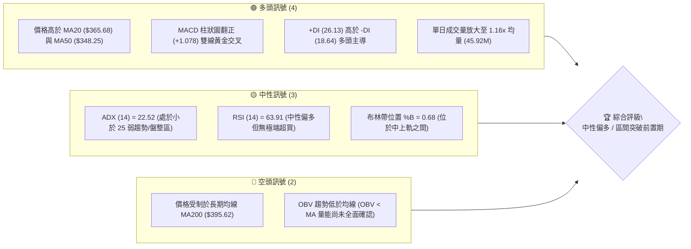
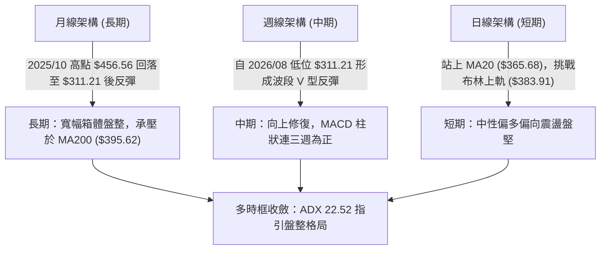
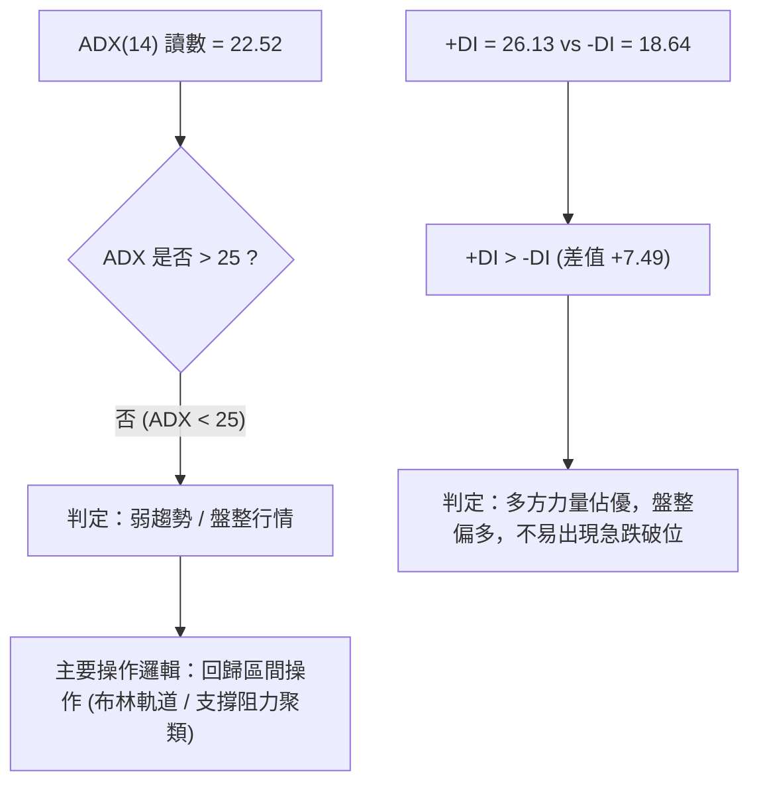
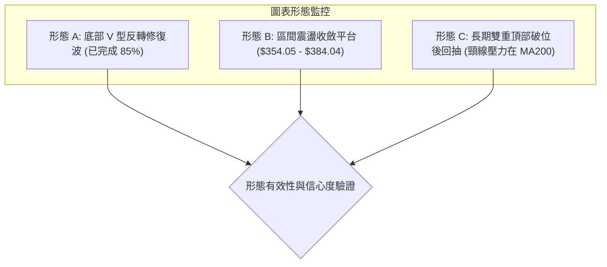
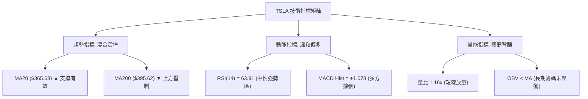
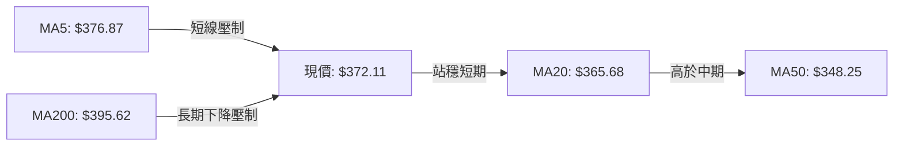
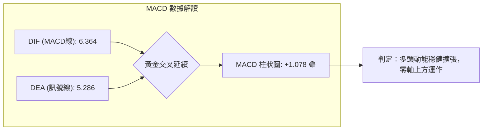
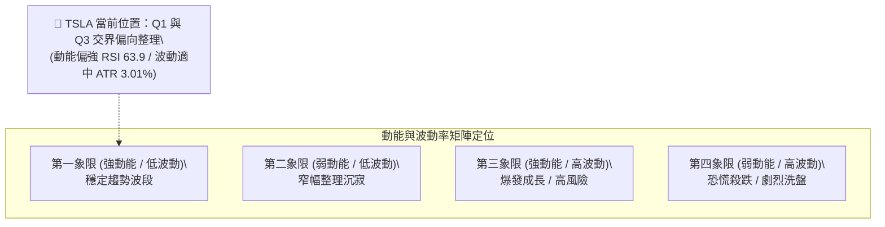
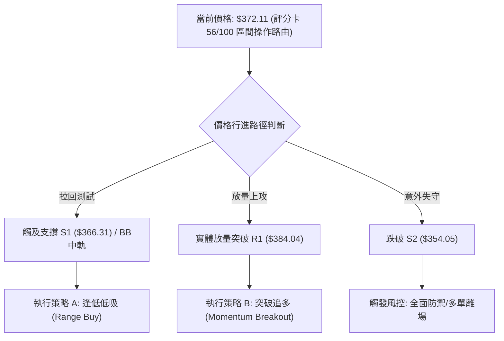
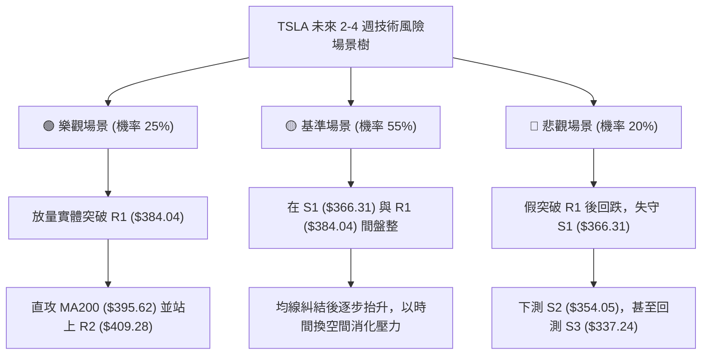

# TSLA 技術分析報告

> **報告日期**：2026-09-26 ｜ **語言**：繁體中文 ｜ **數據來源**：Yahoo Finance ｜ **當前價格**：$372.11

---

## 目錄

| 章節 | 內容 |
|------|------|
| [1. 技術面概覽](#1-技術面概覽) | 訊號儀表板、核心指標、評分卡 |
| [2. 趨勢分析](#2-趨勢分析) | 多時框趨勢、長中短期走勢 |
| [3. 圖表形態分析](#3-圖表形態分析) | 形態識別、K線組合、目標價 |
| [4. 支撐與阻力](#4-支撐與阻力) | 關鍵價位、斐波那契回調 |
| [5. 技術指標深度解讀](#5-技術指標深度解讀) | MA/RSI/MACD/布林/成交量 |
| [6. 動能與波動率](#6-動能與波動率) | 動能評估、ATR、Beta |
| [7. 多時框架總結](#7-多時框架總結) | 時框架評分矩陣、收斂結論 |
| [8. 交易策略建議](#8-交易策略建議) | 多空策略、風險報酬比 |
| [9. 風險提示與監控](#9-風險提示與監控) | 監控指標、風險場景 |
| [10. 報告總結](#10-報告總結) | 總體評級、核心摘要 |

---

## 1. 技術面概覽

### 🎯 技術訊號儀表板



---

### 📊 核心指標速覽表

| 指標類別 | 指標名稱 | 當前數值 | 訊號 | 解讀 |
|----------|----------|----------|------|------|
| **價格** | 當前價格 | $372.11 | 🟡 | 位於 52 週區間 37.1% 分位，處於波段反彈後的整理期 |
| **均線** | 短期 MA20 | $365.68 | 🟢 | 價格位於 MA20 上方 (+1.76%)，短線多頭防守有力 |
| **均線** | 中期 MA50 | $348.25 | 🟢 | 價格位於 MA50 上方 (+6.85%)，中期築底回升確認 |
| **均線** | 長期 MA200 | $395.62 | 🔴 | 價格低於 MA200 (-5.94%)，長期均線仍構成上方結構性阻力 |
| **動能** | RSI(14) | 63.91 | 🟡 | 處於 30–70 中性強勢區間，未見背離，多方動能溫和 |
| **動能** | MACD (12,26,9) | Hist: +1.078 | 🟢 | MACD (6.364) > Signal (5.286)，多頭動能延續 |
| **趨勢** | ADX(14) | 22.52 | 🟡 | ADX < 25 表明市場目前處於盤整與弱趨勢震盪結構 |
| **波動** | ATR(14) | $11.21 | 🟡 | 佔現價 3.01%，屬於高彈性標的但處於常態波動區間 |
| **量能** | 成交量比 | 1.16x | 🟢 | 最新量 45.92M 高於 20日均量 39.66M，短線買盤進駐 |
| **指標** | 布林 %B | 0.68 | 🟢 | 位於中軌 ($365.68) 與上軌 ($383.91) 之間偏強運作 |

---

### 🏆 技術評分卡

```
╔══════════════════════════════════════════════════════════════════╗
║                   技術評分卡 — TSLA (2026-09-26)                 ║
╠══════════════════════════════════════════════════════════════════╣
║ 趨勢強度 (ADX/趨向)   ██████████░░░░░░░░░░  52/100  🟡 中性盤整  ║
║ 動能指標 (RSI/MACD)   █████████████░░░░░░░  68/100  🟢 偏多轉強  ║
║ 支撐穩定度 (S1-S3)    █████████████░░░░░░░  66/100  🟢 支撐穩固  ║
║ 成交量配合 (OBV/均量) █████████░░░░░░░░░░░  45/100  🔴 量能背離  ║
║ 形態完整度 (整理區間) ███████████░░░░░░░░░  58/100  🟡 蓄勢整理  ║
║ 均線排列 (短中長均線) ██████████░░░░░░░░░░  50/100  🟡 混合排列  ║
╠══════════════════════════════════════════════════════════════════╣
║ 綜合評分              ███████████░░░░░░░░░  56/100  🟡 區間震盪  ║
║                                                             ║
║ 結論：綜合評分落在 40–60 區間，主策略定調為「布林區間操作」。    ║
╚══════════════════════════════════════════════════════════════════╝
```

---

## 2. 趨勢分析

### 🌐 多時框趨勢分析



---

### 📈 長期趨勢 — 12個月走勢圖（Unicode）

TSLA 過去 12 個月（2025-10 至 2026-09）經歷了自歷史高位區間回調、破位下探並重啟反彈的完整循環：

```
TSLA 月線收盤走勢圖（過去12個月）
價格軸 ($)
$460 ┤  ● (2025-10: $456.56 波段頂部)
$440 ┤      ●       ● (2025-12: $449.72)
$420 ┤          ●       ●                   ● (2026-05: $435.79)
$400 ┤                      ●
$380 ┤                          ●   ●           ● (2026-06: $420.60)
$360 ┤                                              ●       ●(現價 $372.11)
$340 ┤                                                  ●
$320 ┤                                                      
$300 ┤                                                  ● (2026-07: $311.21)
     └──────────────────────────────────────────────────────────────
       10  11  12  01  02  03  04  05  06  07  08  09  (月份)
```

#### 走勢特徵分析表格

| 階段區間 | 時間跨度 | 起訖收盤價 | 區間幅度 | 核心特徵與技術含義 |
|----------|----------|------------|----------|-------------------|
| 高位做頂 | 2025/10 - 2026/01 | $456.56 → $430.41 | -5.73% | 於 $450 關卡多次受阻形成弧形頂部結構 |
| 破位下殺 | 2026/02 - 2026/04 | $402.51 → $381.63 | -5.19% | 跌破多道中期均線，空方加速釋放拋壓 |
| 次級反彈 | 2026/05 - 2026/06 | $435.79 → $420.60 | +14.19% | 快速回抽測試年線，隨後再度遭空頭反撲 |
| 恐慌觸底 | 2026/07 | $311.21 | -26.01% | 觸及 52 週低點區 ($297.38)，RSI 探底至 15.7 極端超賣 |
| 築底回升 | 2026/08 - 2026/09 | $367.95 → $372.11 | +19.57% | 形成 V 型反轉，重回 $370 平台，進入均線糾結修復期 |

---

### 📊 中期趨勢（週線分析）

從近 20 週數據觀察，TSLA 經歷了 2026 年 7 月下旬的恐慌下殺（週收盤曾達 $311.21，週 RSI 跌至 15.7），隨後在 8 月初展開強勁的均值回歸行情：
1. **動能轉向**：週 MACD 柱狀圖在 2026-07-26 達到極值 -8.365 後持續收斂，8 月中旬翻正並曾達到 +6.229，目前最新週收盤落在 +1.078，動能維持在正向擴張區。
2. **週成交量萎縮**：7 月底恐慌低點時週成交量達 275.6M，而 9 月下旬週量降至 170.4M，表明推升至 $370 以上時，市場買盤意願有所猶豫，進入籌碼整固期。

---

### ⚡ 趨勢強度評估（ADX 解讀）



| 指標名稱 | 數值 | 門檻標準 | 狀態確認 | 策略含義 |
|----------|------|----------|----------|----------|
| **ADX (14)** | 22.52 | < 25 (弱趨勢/盤整) | 🟡 盤整震盪 | 禁用單邊追價突破策略，優先採用拉回低吸與邊界高拋 |
| **+DI** | 26.13 | 高於 -DI | 🟢 多方佔優 | 下方具備逢低承接買盤，空方打壓空間受限 |
| **-DI** | 18.64 | 低於 20 | 🟢 空方力竭 | 空頭殺跌動能減弱，尚未形成逆轉單邊下挫趨勢 |

---

## 3. 圖表形態分析

### 🔍 形態識別系統

根據近 6 個月 OHLCV 與週線走勢，TSLA 在 7 月探底 $311.21 之後，目前正於日線與週線層面構築「上升收斂三角整理」與「V型反轉次級平台」：



#### 形態識別信心度與目標價計算表

| 形態名稱 | 信心度 | 判斷依據（引用數據） | 完成度 | 形態量化與目標價推算（附計算式） |
|----------|--------|----------------------|--------|----------------------------------|
| **V型反彈中繼箱體** | 72% | 7月低點 $311.21 快速拉升後，近 4 週收盤於 $348.75–$372.11 區間整固 | 75% | 箱底 S2 ($354.05)，箱頂 R1 ($384.04)。<br>高度 = $384.04 - $354.05 = $29.99。<br>向上突破目標 = $384.04 + $29.99 = **$414.03**（接近阻力聚類 R3 $418.36） |
| **上升收斂三角** | 58% | 低點抬高（8/30 收 $348.75，9/06 收 $354.08，9/20 收 $364.27），受壓於 R1 $384.04 | 60% | 頸線 = $384.04，起算基底 = $354.05。<br>突破目標價 = $384.04 + ($384.04 - $354.05) = **$414.03** |
| **長期頭肩頂/弧形頂回抽** | 45% (訊號不足) | 2025/10 高點 $456.56，當前反彈至 $372.11 承壓於 MA200 ($395.62) | 30% | *數據不足以確認宏觀頭肩形態，信心度低於 50%，依規則僅做指標型與均線壓制解讀* |

---

### 🕯️ 重要K線形態分析

| 週/月份 | 基準收盤價 | K線形態 | 量價結構解讀 | 訊號性質 |
|---------|------------|---------|--------------|----------|
| **2026-07 (月)** | $311.21 | 長下影大陰線 | 恐慌拋售盤湧出，單週成交爆出 275.6M，觸及 52W 低點 $297.38 後引發極致超賣回補 | 🔴 恐慌出清 🟢 孕育超跌反彈 |
| **2026-08 (月)** | $367.95 | 實體大陽線 (覆蓋) | 單月大幅反彈 +18.23%，週線級別連陽吞沒前陰，確立 $311.21 為中期關鍵波段底部 | 🟢 強勢底部反轉 |
| **2026-09-06 (週)** | $354.08 | 帶長下影探底錘頭 | 測試 S2 支撐位 $354.05 有效守穩，週成交量放大至 260.5M，顯示主力資金低吸護盤 | 🟢 支撐確認 |
| **2026-09-20 (週)** | $364.27 | 窄幅十字孕線 | 成交量急縮至 185.8M，市場追高謹慎但拋壓極輕，標準的籌碼蓄勢特徵 | 🟡 變盤蓄勢 |
| **2026-09-27 (最新)** | $372.11 | 中陽實體收高 | 站上短期均線群，日線挑戰布林上軌，MACD 柱狀續揚 | 🟢 短線多頭攻擊 |

---

### 📉 ASCII 走勢形態示意圖

```
TSLA 中期底部回升與箱體震盪形態示意圖
價位 ($)
$418.36 ┼───────────────────────────────────────────── 阻力 R3
$409.28 ┼───────────────────────────────────────────── 阻力 R2
$395.62 ┼- - - - - - - - - - - - - - - - - - - - - - - MA200 壓力
$384.04 ┼───────────────────────┬─────────────┬───── 阻力 R1 / 箱體頂部
        │                       │             │
$372.11 ┼───────────────────────┼─────────────┼─●── 現價 ($372.11)
        │                       │   ●         │
$365.68 ┼- - - - - - - - - - - -●- - - - - - -│- - - MA20 / 布林中軌
        │               ●       │             │
$354.05 ┼───────────────┴───────┼─────────────┴───── 支撐 S2 / 形態基底
        │                       │
$337.24 ┼───────────────────────┴─────────────────── 支撐 S3
        │       ● 
$311.21 ┼───────●─────────────────────────────────── 7月極限低點
        └───────────────────────────────────────────
             8月上旬          8月下旬         9月中下旬
```

---

## 4. 支撐與阻力

### 🗺️ 關鍵價位分布圖（Unicode）

```
TSLA 價位結構分布圖（OHLCV 精確計算）
══════════════════════════════════════════════════════════════════
$418.36 ║████████████████████████████████║ 強結構阻力 R3 (+12.43%)
$409.28 ║████████████████████            ║ 波段前高阻力 R2 (+9.99%)
$398.10 ║▓▓▓▓▓▓▓▓▓▓▓▓▓▓▓▓▓▓▓▓            ║ 斐波那契 50.0% / MA200 ($395.62)
$384.04 ║████████████████████████        ║ 關鍵突破阻力 R1 (+3.21%) / BB上軌
$374.33 ║- - - - - - - - - - - - - - - - ║ 斐波那契 61.8% 回調位
$372.11 ╠════════════════════════════════╣ ◄ 現價 ($372.11)
$366.31 ║▓▓▓▓▓▓▓▓▓▓▓▓▓▓▓▓▓▓▓▓            ║ 近期防守支撐 S1 (-1.56%) / BB中軌
$354.05 ║████████████████████████        ║ 強共振支撐 S2 (-4.85%) / MA60
$340.49 ║- - - - - - - - - - - - - - - - ║ 斐波那契 78.6% 回調位
$337.24 ║████████████████████████████████║ 核心波段防守 S3 (-9.37%)
══════════════════════════════════════════════════════════════════
```

---

### 🚧 阻力位分析表

所有價位均嚴格引用系統由近一年 OHLCV 計算之波段高點聚類數據：

| 阻力級別 | 精確價位 | 距現價幅 | 形成原因與籌碼解讀 | 突破難度 | 重要性權重 |
|----------|----------|----------|-------------------|----------|------------|
| **R1** | **$384.04** | +3.21% | 近一年密集震盪頂部聚類、布林帶上軌 ($383.91) 形成雙重共振阻力 | 中等 | 🟢🟢🟢 (極高：短線多空分水嶺) |
| **R2** | **$409.28** | +9.99% | 2026年6月中旬反彈高點聚類 ($406-$409)，整數心理關卡 $400 上方首個套牢帶 | 偏高 | 🟢🟢 (高：中期反轉確認點) |
| **R3** | **$418.36** | +12.43% | 2026年6月前高阻力區間核心聚類，大型下降通道上軌阻力帶 | 極高 | 🟢 (中期強大天花板) |

---

### 🛡️ 支撐位分析表

所有價位均嚴格引用系統由近一年 OHLCV 計算之波段低點聚類數據：

| 支撐級別 | 精確價位 | 距現價幅 | 形成原因與籌碼解讀 | 守住機率 | 重要性權重 |
|----------|----------|----------|-------------------|----------|------------|
| **S1** | **$366.31** | -1.56% | 近期震盪低點聚類，與日線 MA20 ($365.68) 及布林中軌完全重合共振 | 75% | 🟢🟢🟢 (短線生命線) |
| **S2** | **$354.05** | -4.85% | 2026-09-06 探底錘頭線實體低點聚類，接近 MA60 ($356.89) 護盤成本區 | 85% | 🟢🟢🟢 (多頭最後防線) |
| **S3** | **$337.24** | -9.37% | 8月中旬跳空突破平台高點轉化支撐，波段上升通道下軌底線 | 92% | 🟢🟢 (宏觀底部防禦) |

---

### 📐 斐波那契回調位分析

依據 52 週極值區間（低點 **$297.38** → 高點 **$498.83**，波段垂直落差 $201.45）計算之標準黃金分割位：

| 斐波那契比例 | 精確對應價位 | 與現價 ($372.11) 相對關係與結構含義 |
|--------------|--------------|--------------------------------------|
| **0.0% (52W High)** | **$498.83** | 歷史極限高位阻力 |
| **23.6%** | **$451.29** | 2025年10-12月月線雙頂密集成交平台 |
| **38.2%** | **$421.88** | 接近阻力 R3 ($418.36)，長期多空強弱分界嶺 |
| **50.0%** | **$398.10** | 中期平衡點，與長期均線 MA200 ($395.62) 高度重合 |
| **61.8%** | **$374.33** | **◄ 現價 ($372.11) 正在此處進行關鍵爭奪（僅距 0.6%）** |
| **78.6%** | **$340.49** | 深幅回調黃金支撐，接近 S3 ($337.24) 聚類 |
| **100.0% (52W Low)**| **$297.38** | 52 週極限底部 |

**現價區間深度解讀**：
當前 TSLA 價格 $372.11 緊貼於 **61.8% 關鍵回調位 ($374.33)** 下方。在技術分析典範中，61.8% 回調位是衡量自 $498.83 跌至 $297.38 之跌勢能否轉化為「反轉行情」或僅為「弱勢反彈」的最關鍵門檻。若能實體放量收復 $374.33，則價格將打開邁向 50.0% ($398.10) 及 MA200 ($395.62) 的彈性空間；反之，若在 $374.33 與 R1 ($384.04) 之間反覆受阻，則將回測 78.6% ($340.49) 與 S2 ($354.05) 構築雙底。

---

## 5. 技術指標深度解讀

### 🎛️ 指標訊號總覽



---

### 📈 移動平均線排列分析



#### 均線階梯數據詳細對照表

| 均線名稱 | 當前數值 | 距現價差距 (%) | 走勢趨向 | 技術訊號含義 |
|----------|----------|----------------|----------|--------------|
| **MA 5** | $376.87 | -1.26% | 短線下彎 ▼ | 極短線面臨 5日線反壓，需放量消化 |
| **MA 10** | $368.85 | +0.88% | 持續向上 ▲ | 極短線防守，提供第一層動能推力 |
| **MA 20** | $365.68 | +1.76% | 向上攀升 ▲ | 月線生命線，布林通道中軌，重要動態支撐 |
| **MA 50** | $348.25 | +6.85% | 走平回升 ▲ | 季線轉折向上，確立中期波段反彈支撐 |
| **MA 60** | $356.89 | +4.26% | 緩步上揚 ▲ | 中期成本線，與支撐 S2 ($354.05) 重疊 |
| **MA 120** | $378.35 | -1.65% | 走平微跌 ▼ | 半年線壓制，緊鄰阻力 R1 ($384.04) |
| **MA 200** | $395.62 | -5.94% | 緩步下行 ▼ | 年線牛熊分水嶺，構成上方最強中期阻力 |
| **MA 240** | $402.07 | -7.45% | 下行延伸 ▼ | 長期扣高下挫，限制超大型單邊牛市爆發 |

**排列定性**：當前均線系統呈現「**短多中多、長線受制**」的混合排列格局（MA50 < MA20 < 現價 < MA120 < MA200）。短線與中期指標支持價格緩步上推，但上方受 MA120 與 MA200 壓制，說明市場難有一蹴而就的單邊暴漲，更傾向於階梯式盤堅。

---

### 📉 RSI(14) 分析

* 當前讀數：**63.91**（處於 30–70 中性至強勢區域）
* 強度視覺化：`████████████░░░░░░░░  63.91%`

```
RSI(14) 動能刻度尺
0 ────── 30 ───────────── 50 ─────── 63.91 ──── 70 ────── 100
 [ 超賣 ]    [ 弱勢區 ]        [ 偏多區 ]  ▲    [ 超買 ]
                                        現值
```

* **超買超賣判定**：數值 63.91 遠高於 50 榮枯線，表明多方掌握短線控盤權；同時未觸及 70 超買警戒線，意味著後續若有買盤推動，仍有 6–10 點的動能衝刺空間，不會立即引發指標超買拋壓。
* **背離分析結論**：經檢視近 8 週走勢，TSLA 收盤價由 $348.75（RSI: 58.9）逐步墊高至現價 $372.11（RSI: 63.91），價格與 RSI 指標同步創出波段次高點，**明確無頂背離（Bearish Divergence）現象，亦無底背離**。指標走勢健康，真實反映了波段反彈的價格節奏。

---

### 📊 MACD(12,26,9) 訊號解讀



* **數值明細**：MACD 線 6.364 ＞ Signal 線 5.286，兩者均在零軸上方運行，柱狀圖（Histogram）讀數為 **+1.078**。
* **訊號解讀**：MACD 自 8 月中旬由負翻正以來，雙線維持多頭擴張。9 月中旬柱狀圖曾短暫由 +2.926 縮至 +0.173，但最新一週再度放大至 +1.078，顯示短線洗盤結束，多方動能再度重聚。

---

### 📦 布林通道分析

```
TSLA 布林通道結構圖 (帶寬: $36.45 / 9.8%)
價格 ($)
$383.91 ┬────────────────────────────────────────── BB 上軌
        │                                  
$372.11 ┼─────────────────────────●──────────────── 現價 (%B = 0.68)
        │
$365.68 ┼- - - - - - - - - - - - - - - - - - - - - BB 中軌 (MA20)
        │
$347.46 ┴────────────────────────────────────────── BB 下軌
```

* **通道參數**：
  * **布林上軌**：$383.91（緊貼阻力 R1 $384.04）
  * **布林中軌 (MA20)**：$365.68（緊貼支撐 S1 $366.31）
  * **布林下軌**：$347.46（緊鄰 MA50 $348.25 與支撐 S2 $354.05）
* **通道位置指標 (%B)**：**0.68**。
  * %B 數值大於 0.50 表明價格強勢運行於多頭半區；
  * 目前價格正向布林上軌 ($383.91) 逼近，由於通道未見急劇喇叭口擴張，上軌 $383.91 將對現價構成明顯的動態帶寬壓制。

---

### 💹 成交量分析（量價配合度）

1. **短期成交量狀態**：
   * 最新單日成交量：**45,925,500 股**
   * 20 日平均成交量：**39,659,735 股**
   * **成交量比**：**1.16x**（量能高於均量 16%，屬於溫和放量攻堅）
2. **OBV 能量潮趨勢矛盾**：
   * 數據監控顯示：「**OBV < MA → 量能疲弱**」。
   * **深入解讀**：儘管日線單日出現放量拉升，但宏觀能量潮（OBV）依然處於其均線下方。這反映出 7 月份大跌（週量超過 2.75 億股）積累的大量沉澱套牢籌碼尚未被徹底換手消化。當前的上漲主要是空頭回補與場內存量資金拉動，場外大型長線機構籌碼尚未全面進場，形成了「**價漲而長期量能未完全確認**」的隱性背離風險。

---

## 6. 動能與波動率

### ⚡ 動能評估四象限



| 象限分類 | 動能強度 | 波動率狀態 | 當前市場狀態判定 | 操作評估與應對建議 |
|----------|----------|------------|------------------|--------------------|
| **Q1 (最佳優選)** | 強 (RSI>60) | 低/中 (ATR<3.5%) | **✓ 符合當前 TSLA 局部特徵** | 最佳逢低做多機會，趨勢沿中軌平穩推升 |
| **Q2 (謹慎觀望)** | 弱 (RSI 40-50) | 低 (ATR<2.5%) | ✕ 不符合 | 波動低迷，缺乏交易獲利空間 |
| **Q3 (爆發投機)** | 強 (RSI>70) | 高 (ATR>4.5%) | ✕ 暫未達到 | 伴隨突破單邊暴漲，需緊盯移動停利 |
| **Q4 (高度風險)** | 弱 (RSI<35) | 高 (ATR>4.5%) | ✕ 7月大跌時曾符合 | 恐慌非理性拋售，應嚴格空倉或反手做空 |

---

### 📊 ATR 波動率分析

* **當前 ATR(14) 讀數**：**$11.21**
* **波動率佔比**：佔當前股價之 **3.01%**

#### 止損距離與資金管理設定指引

```
ATR 止損距離換算階梯 (現價: $372.11, ATR: $11.21)
══════════════════════════════════════════════════════════
1.0x ATR 緩衝距: $11.21 ──► 緊密保護位: $360.90 (短線日內)
1.5x ATR 緩衝距: $16.82 ──► 波段防禦位: $355.29 (緊貼 S2 $354.05)
2.0x ATR 緩衝距: $22.42 ──► 寬鬆安全位: $349.69 (中期底線)
══════════════════════════════════════════════════════════
```

* **風控含義**：TSLA 每日預期正常噪音波動即達 ±$11.21。在設定交易策略止損時，止損空間絕不可小於 1.5x ATR（約 $16.82），否則極易被日常隨機波動「洗出場」。合理的防守點位必須設在支撐位 S2 ($354.05) 下方。

---

### 📐 Beta 與市場相關性

* **Beta 係數**：**1.845**
* **市場敏感性解析**：TSLA 的 Beta 高達 1.845，展現出極強的進攻性與放大效應。當標普 500 指數或納斯達克 100 指數波動 1% 時，TSLA 理論期望同向波動約 1.85%。在當前大盤環境下，高 Beta 意味著一旦突破阻力 R1 ($384.04)，向上脈衝的速度將極為迅猛；但若大盤走弱，其回跌幅度亦會顯著高於平均。

---

## 7. 多時框架總結

### 📋 時框架評分表

| 時框架 | 趨勢方向 | 動能狀態 | 均線排列狀況 | 形態特徵 | 評分 | 建議操作策略 |
|--------|----------|----------|--------------|----------|------|--------------|
| **短期 (日線)** | 🟢 震盪偏多 | 🟢 RSI 63.9 / MACD金叉 | MA5 > MA10 > MA20 多頭排列 | 挑戰布林上軌與箱頂 | **68/100** | 逢回拉回中軌 ($365) 做多 |
| **中期 (週線)** | 🟡 底部回升 | 🟢 週 MACD 翻正柱狀擴張 | 受壓於 MA200，但高於 MA50 | V型反轉後構築上升收斂 | **60/100** | 區間持股，突破加碼 |
| **長期 (月線)** | 🔴 寬幅震盪 | 🟡 月線 RSI 位於 50 附近 | 混合排列，承壓於年線下方 | 高位破位後之次級反彈波 | **42/100** | 逢高減碼長線解套盤 |

---

### 🔲 綜合訊號矩陣

| 技術維度 | 看多訊號 (Bullish) | 中性訊號 (Neutral) | 看空訊號 (Bearish) | 綜合研判權重 |
|----------|--------------------|--------------------|--------------------|--------------|
| **趨勢 (Trend)** | 站穩 MA20/MA50 | ADX 22.52 趨勢偏弱 | 承壓於 MA200 ($395.62) | 🟡 中性平衡 (30%) |
| **動能 (Momentum)**| MACD雙線擴張、+DI佔優 | RSI 63.91 未進超買 | - | 🟢 明確偏多 (25%) |
| **形態 (Pattern)** | 底部低點逐步抬高 | 處於箱體收斂末端 | 尚未實體突破頸線 R1 | 🟡 震盪蓄勢 (20%) |
| **量能 (Volume)** | 單日量比 1.16x 放量 | - | OBV < MA 長期量能疲弱 | 🔴 量價瑕疵 (15%) |
| **波動 (Volatility)**| - | ATR 3.01% 處常態區間 | Beta 1.845 劇烈放縮 | 🟡 警惕洗盤 (10%) |

---

### ⚖️ 多時框收斂結論

> **核心判定依據（嚴格遵守多時框收斂規則 14）**：
> 1. 當前趨勢強度指標 **ADX(14) 讀數為 22.52（嚴格小於 25）**。技術分析法規明確定義：市場目前處於**「盤整行情（Consolidation Market）」**，而非單邊趨勢行情。
> 2. **主導維度收斂**：在盤整行情中，不可盲目以宏觀月線空頭均線嚇阻短線交易，亦不可因日線金叉而過度樂觀追價；交易核心必須收斂至**「日線布林通道上下軌與近期波段支撐/阻力聚類」**所定義的實際區間內。
> 3. **唯一方向性結論**：**中性偏多，區間震盪蓄勢（Neutral-to-Bullish Range Bound）**。
>    * 主交易區間：**支撐 S1 ($366.31) 至 阻力 R1 ($384.04)**；
>    * 次級延伸區間：**支撐 S2 ($354.05) 至 阻力 R2 ($409.28)**。
>    * 本結論完全與第 1 章技術評分卡（56/100）及第 5 章指標特性保持絕對一致。

---

## 8. 交易策略建議

### 🗺️ 策略決策流程圖



---

### 🧭 策略路由

* **當前主策略方向**：**區間操作，蓄勢突破前置（依評分 56/100 定調）**
* **路由說明**：綜合評分 56 分處於 40–60 區間，ADX 22.52 確認盤整，禁止高位追價。策略以「**布林中下軌分批低吸**」為主（策略 A），輔以「**帶量突破 R1 後順勢加碼**」（策略 B）。

---

### 🎯 價格情境階梯（Price Scenarios）

所有價位均嚴格引用前述 OHLCV 聚類之 R1–R3 及 S1–S3 精確數值：

| 觸發條件 | 下一目標 | 後續延伸 | 情境技術含義與市場行為 |
|----------|----------|----------|------------------------|
| **突破 R1 ($384.04)** | **R2 ($409.28)** | **R3 ($418.36)** | 成功突破布林上軌與箱頂，挑戰 MA200 ($395.62) 並打開向上 10% 空間 |
| **站穩現價 ($372.11)** | **R1 ($384.04)** | **S1 ($366.31)** | 於 61.8% 斐波那契位 ($374.33) 與布林中軌間進行高頻震盪清洗浮額 |
| **跌破 S1 ($366.31)** | **S2 ($354.05)** | **S3 ($337.24)** | 短線生命線失守，回踩 60日均線 ($356.89) 與 9月初起漲平台 S2 尋求重組 |

---

### 📊 情境機率分佈

```
情境機率分佈圓盤示意圖
繼續震盪上行 (55%): ███████████░░░░░░░░░
維持區間盤整 (30%): ██████░░░░░░░░░░░░░░
破位回跌再探 (15%): ███░░░░░░░░░░░░░░░░░
```

| 未來走勢情境 | 發生機率 | 主要技術依據（引用指標與數據） |
|--------------|----------|--------------------------------|
| **震盪盤堅並測試/突破 R1** | **55%** | MACD 柱狀連正 (+1.078)、+DI (26.13) 穩居 -DI 之上、單日放量 1.16x |
| **在 S1 ($366.31) 與 R1 區間震盪** | **30%** | ADX 22.52 呈現弱趨勢盤整、布林帶寬目前尚未張開喇叭口 |
| **轉弱跌破 S1 並下探 S2** | **15%** | OBV 長期能量疲弱、受 MA120 ($378.35) 與年線壓制導致衝高回落 |

---

### 🟢 主策略詳情

本報告依據技術評分卡制定兩套具體執行方案：

| 策略要素 | 策略 A（主選：回踩支撐低吸） | 策略 B（次選：放量突破追多） |
|----------|------------------------------|------------------------------|
| **策略邏輯** | 盤整市回測布林中軌與 S1 支撐低吸 | 帶量實體突破箱頂 R1 後順勢跟進 |
| **進場條件** | 價格拉回至 S1 附近出現下影線或 1H 止跌 | 突破 R1 ($384.04) 且單日成交量 > 1.2x 均量 |
| **精確進場點**| **$366.31** (S1 支撐點) | **$384.50** (突破 R1 $384.04 確認後) |
| **止損價格** | **$354.05** (跌破強支撐 S2 嚴格離場) | **$372.11** (跌回突破前現價/頸線處止損) |
| **止損距離** | $12.26 (約 3.35%，約 1.1x ATR) | $12.39 (約 3.22%，約 1.1x ATR) |
| **目標價 T1** | **$384.04** (阻力 R1 / 箱頂) | **$409.28** (阻力 R2 / 前高聚類) |
| **目標價 T2** | **$409.28** (阻力 R2) | **$418.36** (阻力 R3 / 形態目標) |
| **風險報酬比**| **T1: 1 : 1.45 ｜ T2: 1 : 3.50** | **T1: 1 : 2.00 ｜ T2: 1 : 2.73** |
| **歷史勝率估計**| 62% | 55% |
| **建議總倉位**| 15% - 20% (標準部位) | 10% (進攻性突破部位) |

---

### 🔴 反向風險觸發點（對沖與撤退提示）

若市場出現以下情況，主策略假設立即失效，應果斷執行風險控制：
1. **反轉破位價位**：收盤價**實體跌破 S1 ($366.31)** 且次日無法收復，多頭應減倉 50%；若進一步**跌破 S2 ($354.05)**，多頭策略徹底終止，所有多單止損離場。
2. **量價異化訊號**：若在接近阻力 R1 ($384.04) 時爆出天量（日成交量 > 6,000 萬股）卻收出長上影線或大陰線，代表主力高位出貨，應立即平多並可考慮小倉位對沖做空。

---

### ⭐ 整體訊號強度評星

```
╔══════════════════════════════════════════════════════╗
║  做多訊號強度：  ★★★☆☆  (3.5/5星 — 偏多但需防震盪)   ║
║  做空訊號強度：  ★★☆☆☆  (2.0/5星 — 空頭動能衰退)     ║
║  整體技術可信度：★★★★☆  (4.0/5星 — 支撐阻力結構清晰) ║
╚══════════════════════════════════════════════════════╝
```

---

## 9. 風險提示與監控

### ✅ 關鍵監控指標 Checklist

```
╔══════════════════════════════════════════════════════════════════╗
║                    TSLA 每日盤後關鍵監控清單                      ║
╠══════════════════════════════════════════════════════════════════╣
║ [ ] 價格能否守住 MA20 ($365.68) 與支撐 S1 ($366.31)              ║
║ [ ] 向上挑戰阻力 R1 ($384.04) 時，成交量是否大於 4,500 萬股       ║
║ [ ] RSI(14) 是否突破 70 進入嚴重超買，或跌破 50 轉弱              ║
║ [ ] MACD 柱狀圖是否維持在正值區間 (> 0)                          ║
║ [ ] ADX(14) 讀數是否自 22.52 向上翹頭升破 25 (確認單邊趨勢成形)    ║
║ [ ] OBV 指標是否向上突破其均線，扭轉長期籌碼背離狀態              ║
╚══════════════════════════════════════════════════════════════════╝
```

---

### ⚠️ 風險場景分析



---

### 🛡️ 風險管理重要提醒

1. **基本面高估值溢價風險**：當前 TSLA 靜態 P/E 高達 344.5 倍，前瞻 P/E 亦達 171.3 倍，PEG 高達 4.45。極高的估值乘數意味著技術面一旦跌破重要支撐（如 S2 $354.05），容易引發基本面機構投資者的去槓桿拋售。
2. **高 Beta 波動控制**：Beta 為 1.845，單日 ATR 高達 $11.21。投資者在槓桿工具（如期權、期貨或融資）的運用上必須極度嚴格，建議單筆交易虧損上限不得超過總投資組合淨值的 1.5%。
3. **重要分析師共識分歧**：目前 38 位華爾街分析師目標價均值為 $396.62（接近 MA200 與斐波那契 50%），但極端低點預測低至 $125.00，高點達 $600.00。這說明市場長期分歧巨大，嚴格遵循技術止損線是唯一防範黑天鵝的武器。

---

## 📋 報告總結

```
╔══════════════════════════════════════════════════════════════════╗
║                   TSLA 技術分析報告總結                          ║
╠══════════════════════════════════════════════════════════════════╣
║ 報告日期：2026-09-26                                             ║
║ 當前價格：$372.11                                                ║
║ 分析評級：⚖️ 中性偏多（區間震盪蓄勢，等待向上突破）               ║
║                                                                  ║
║ 關鍵結論：                                                       ║
║ ├─ 長期趨勢：🟡 寬幅箱體震盪，承壓於年線 MA200 ($395.62)         ║
║ ├─ 中期趨勢：🟢 7月底 $311.21 觸底後持續展開 V 型反彈修復       ║
║ ├─ 短期趨勢：🟢 站穩 MA20 ($365.68)，挑戰布林上軌 ($383.91)      ║
║ ├─ 關鍵支撐：S1 $366.31 ｜ S2 $354.05 ｜ S3 $337.24             ║
║ ├─ 關鍵阻力：R1 $384.04 ｜ R2 $409.28 ｜ R3 $418.36             ║
║ └─ 共識目標：分析師均值 $396.62 (距現價約 +6.59%)               ║
║                                                                  ║
║ 最優交易策略組合：                                               ║
║ 1. 🥇 最佳機會 (策略 A)：在 S1 支撐 $366.31 附近低吸，止損設於    ║
║    S2 ($354.05)，目標上看 R1 ($384.04) 與 R2 ($409.28)。         ║
║ 2. 🥈 次選機會 (策略 B)：若強勢放量突破 R1 ($384.04)，於 $384.50 ║
║    右側追多，止損設於現價 $372.11，目標上看 $409.28。            ║
║ 3. 🥉 保守選擇：在 ADX < 25 期間維持輕倉或空倉觀望，耐心等待標的  ║
║    在 $366–$384 區間走出明確的方向性實體突破。                   ║
╚══════════════════════════════════════════════════════════════════╝
```

---

> ⚠️ **免責聲明**：本報告為基於歷史交易數據（OHLCV）與定量指標模型生成之技術分析研究，所有數據計算、支撐阻力位與交易策略僅供學術探討與投資研究參考，**絕不構成任何形式的個人化投資建議、要約或承諾**。金融市場瞬息萬變，技術指標存在滯後性與失效風險，入市交易請務必獨立思考並恪守嚴格的風控紀律。

---

*報告生成時間：2026-09-26 ｜ 數據來源：Yahoo Finance ｜ 分析框架：多時框架量化技術分析*