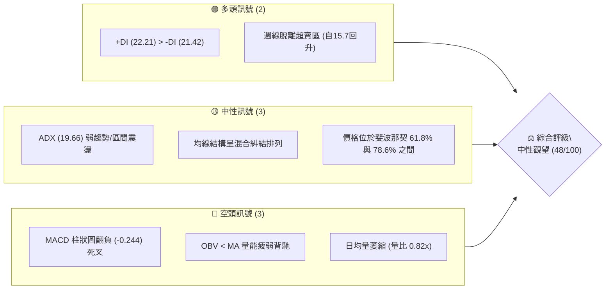
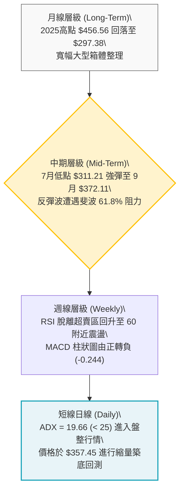
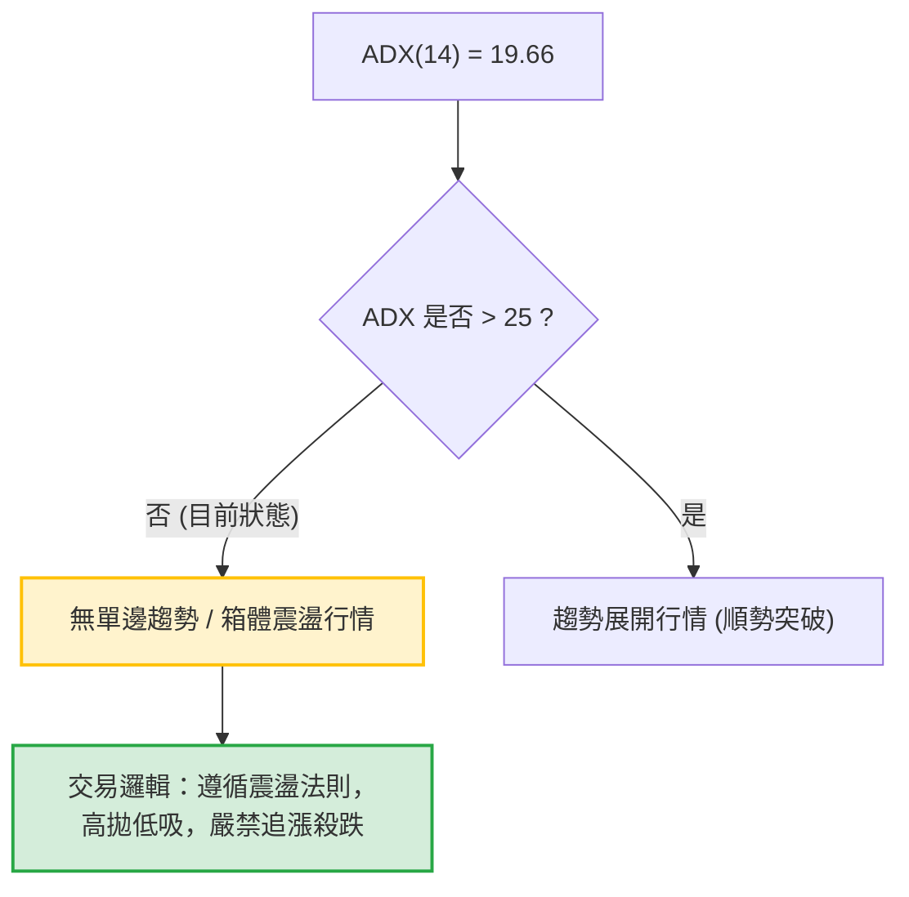
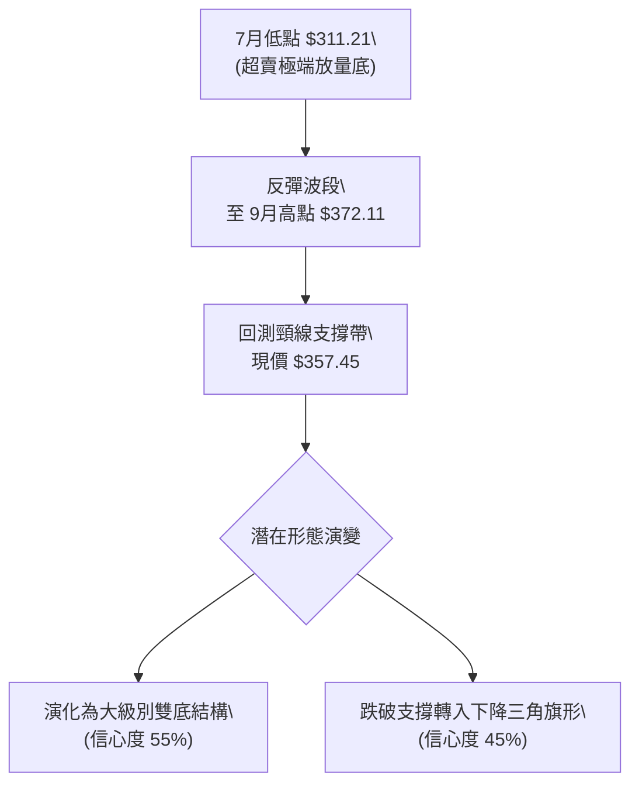
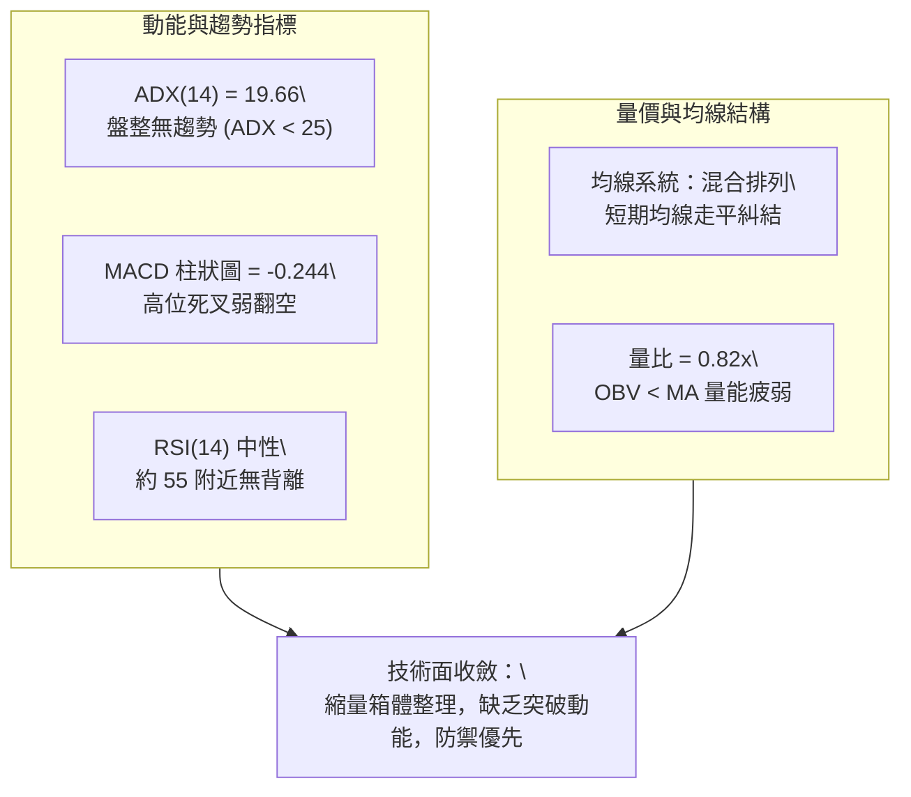
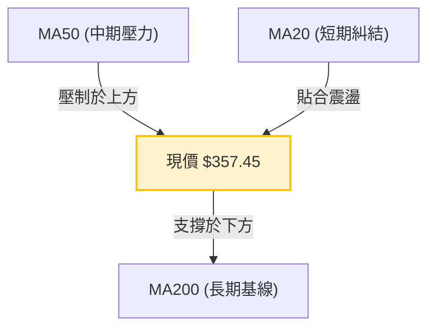
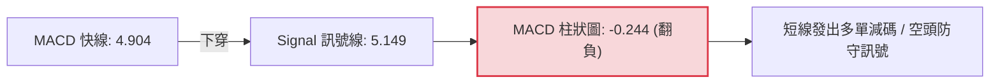
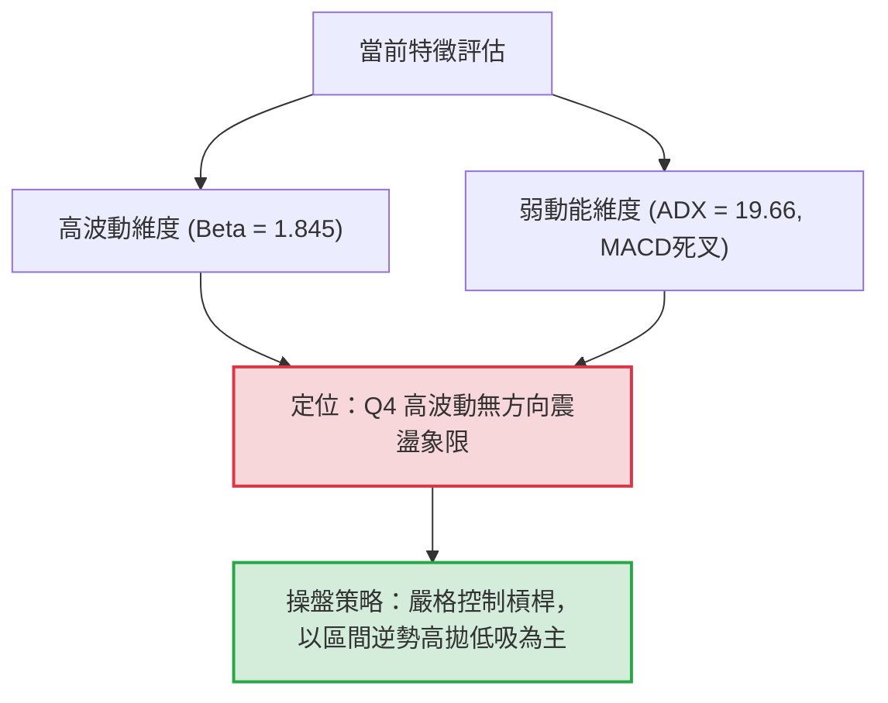
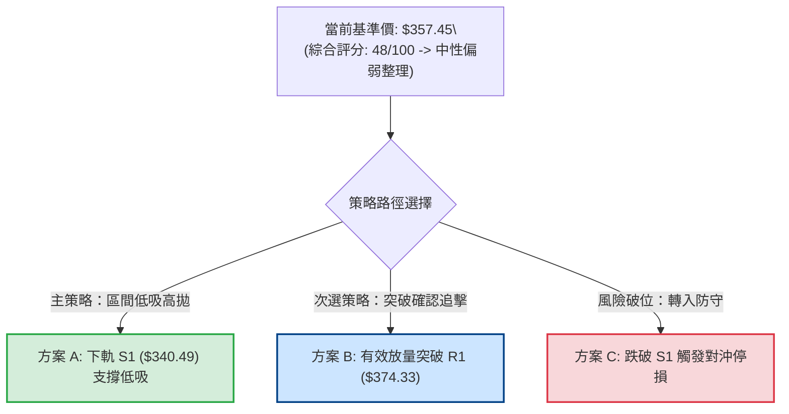
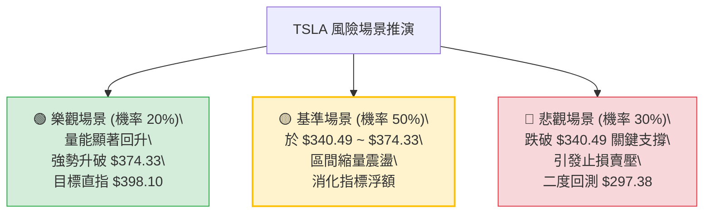

# TSLA 技術分析報告

> **報告日期**：2026-09-30 ｜ **語言**：繁體中文 ｜ **數據來源**：Yahoo Finance ｜ **當前價格**：$357.45（提取自最新週線收盤與月線基準）

---

## 目錄

| 章節 | 內容 |
|------|------|
| [1. 技術面概覽](#1-技術面概覽) | 訊號儀表板、核心指標、評分卡 |
| [2. 趨勢分析](#2-趨勢分析) | 多時框趨勢、長中短期走勢、ADX 解讀 |
| [3. 圖表形態分析](#3-圖表形態分析) | 形態識別、K線組合、目標價計算 |
| [4. 支撐與阻力](#4-支撐與阻力) | 關鍵價位、斐波那契回調精確定位 |
| [5. 技術指標深度解讀](#5-技術指標深度解讀) | 均線系統、RSI、MACD、布林通道、量價OBV |
| [6. 動能與波動率](#6-動能與波動率) | 動能四象限、ATR 波動度、Beta 相關性 |
| [7. 多時框架總結](#7-多時框架總結) | 時框架評分矩陣、多時框收斂定調 |
| [8. 交易策略建議](#8-交易策略建議) | 策略路由、價格情境階梯、風報比精算 |
| [9. 風險提示與監控](#9-風險提示與監控) | 監控指標清單、風險情境矩陣、風控原則 |
| [10. 報告總結](#10-報告總結) | 總體技術結論與交易決策摘要 |

---

## 1. 技術面概覽

### 🎯 技術訊號儀表板

依據 2026-09-30 盤面技術數據，TSLA 目前處於 52 週寬幅區間內的震盪收斂階段。以下為各維度訊號的多空分布：



---

### 📊 核心指標速覽表

| 指標類別 | 指標名稱 | 當前數值 | 訊號 | 解讀 |
|:---|:---|:---:|:---:|:---|
| **價格** | 當前基準價格 | $357.45 | 🟡 | 位於52W區間（$297.38 - $498.83）下緣向上反彈後之整理位 |
| **均線系統** | 短中期排列 (MA20/50) | 混合排列 | 🔴 | 價格低於主要短期均線扣抵位，短線承壓 |
| **均線系統** | 長期基線 (MA200) | 走平排列 | 🟡 | 長期多空分水嶺尚未展開單邊發散，缺乏單向動能 |
| **動能趨勢** | ADX (14) | 19.66 | 🟡 | 數值低於 25，明確判定為無趨勢之「箱體盤整市場」 |
| **動向指標** | +DI / -DI | 22.21 / 21.42 | 🟢 | 多頭方向動能微幅領先，但差距極小，無爆發力 |
| **震盪動能** | MACD (12,26,9) | 4.904 / 5.149 | 🔴 | 快線跌破訊號線，柱狀圖收在 -0.244，形成高位微幅死叉 |
| **量能指標** | 最新成交量 / 20日均量 | 31.68M / 38.48M | 🔴 | 量比 0.82x，呈現「縮量整理」，OBV 位於均線下方 |
| **市場風險** | Beta 係數 | 1.845 | 🔴 | 波動敏感度約為大盤之 1.85 倍，震盪幅度巨大 |

---

### 🏆 技術評分卡

```
╔══════════════════════════════════════════════════════════════════╗
║              技術評分卡 — TSLA (2026-09-30)                      ║
╠══════════════════════════════════════════════════════════════════╣
║ 趨勢強度 (Trend)      ████████░░░░░░░░░░░░  38/100  🔴 弱勢/無單邊║
║ 動能指標 (Momentum)    █████████░░░░░░░░░░░  45/100  🟡 動能轉弱   ║
║ 支撐穩定度 (Support)   █████████████░░░░░░░  65/100  🟢 斐波回測有守║
║ 成交量配合 (Volume)    ███████░░░░░░░░░░░░░  35/100  🔴 縮量背離   ║
║ 形態完整度 (Pattern)   ██████████░░░░░░░░░░  52/100  🟡 區間收斂   ║
║ 均線排列 (Moving Avg)  █████████░░░░░░░░░░░  44/100  🟡 混合糾結   ║
╠══════════════════════════════════════════════════════════════════╣
║ 綜合評分              █████████░░░░░░░░░░░  48/100  ⚖️ 區間盤整   ║
╚══════════════════════════════════════════════════════════════════╝
```

---

## 2. 趨勢分析

### 🌐 多時框趨勢分析

多時框架（MTFA）呈現「長線區間、中線修復、短線拉回」的結構，訊號在不同層級上產生交織：



---

### 📈 長期趨勢 — 12 個月走勢圖（Unicode）

以下為 TSLA 自 2025 年 10 月至 2026 年 09 月之月線收盤走勢全景圖：

```
TSLA 月線走勢圖（2025-10 至 2026-09）
價格軸 ($)
$460 ┤  ● $456.56 (波段頂部)
$440 ┤      ●         ● $435.79
$420 ┤          ●         ●
$400 ┤              ●
$380 ┤                  ●     ●
$360 ┤                            ● $357.45 (現價)
$340 ┤                                ●
$320 ┤                                    ● $311.21 (波段低點)
$300 ┤────────────────────────────────────────────────────
     └────┬────┬────┬────┬────┬────┬────┬────┬────┬────┬────┬───
        10月 11月 12月 01月 02月 03月 04月 05月 06月 07月 08月 09月
        2025 2025 2025 2026 2026 2026 2026 2026 2026 2026 2026 2026
```

#### 走勢特徵分析表格

| 階段週期 | 時間區間 | 起點與終點價格 | 累計漲跌幅 | 走勢特徵與量價行為解讀 |
|:---|:---|:---:|:---:|:---|
| **第一階段：高檔震盪** | 2025-10 ~ 2025-12 | $456.56 → $449.72 | -1.50% | 構築雙頂或圓弧頂雛形，價格逼近 52 週高點 $498.83 但量能無力創高 |
| **第二階段：震盪盤跌** | 2026-01 ~ 2026-03 | $430.41 → $371.75 | -13.63% | 連續 3 個月陰線下殺，均線結構下彎，多頭動能迅速衰竭 |
| **第三階段：假突破反彈**| 2026-04 ~ 2026-05 | $381.63 → $435.79 | +14.19% | 強力軋空反彈，但月線並未站上前期高點 $456.56，形成次高點 |
| **第四階段：單邊重挫** | 2026-06 ~ 2026-07 | $420.60 → $311.21 | -26.01% | 斷崖式暴跌，週成交量暴增至 2.75 億股，觸發 52 週低點附近恐慌拋售 |
| **第五階段：技術修復** | 2026-08 ~ 2026-09 | $367.95 → $357.45 | -2.85% | 自低檔超跌回升至 $372 附近後遇阻，進入次級回調確認期 |

---

### 📊 中期趨勢（週線分析）

從 2026 年 7 月底的極度超賣點（收盤 $313.03，RSI 低至 15.7）展開一波報復性反彈，最高於 2026-09-27 週線摸至 $372.11。隨後在 2026-10-04 當週（數據快照週）回落至 $357.45，顯示上方受到斐波那契 61.8%（$374.33）壓制顯著。

```
近期週線壓力與支撐結構示意圖
$374.33 ─────────────────────── [斐波那契 61.8% 強阻力關口]
           ▲ 2026-09-27 觸及 $372.11 遇阻回落
           │ 
$357.45 ───┼─────────────────── [當前基準價位]
           │ 
$340.49 ─────────────────────── [斐波那契 78.6% 近期關鍵支撐帶]
           ▼ 
$311.21 ─────────────────────── [前波黃金雙底支撐帶 S2]
```

---

### ⚡ 趨勢強度評估（ADX 解讀）

當前日線趨勢動能指標讀數如下：
- **ADX(14)**：`19.66`（低於 25 臨界線，顯示目前市場處於完全的**無趨勢／盤整行情**）
- **+DI**：`22.21`
- **-DI**：`21.42`



#### ADX 強度區間參照表

| ADX 區間 | 當前數值 | 行情特徵判定 | 應對操作綱領 |
|:---:|:---:|:---|:---|
| **0 ~ 20** | **19.66 (命中)** | **極弱趨勢 / 雜訊較多 / 盤整震盪** | **多看少動，嚴控倉位；以關鍵支撐阻力做區間波段操作** |
| **20 ~ 25** | — | 趨勢醞釀期 / 形態築底中 | 觀察均線與布林帶是否收窄醞釀單邊突破 |
| **25 ~ 50** | — | 單邊強趨勢確立 | 順勢持有，利用動態移動停利鎖定利潤 |
| **50 ~ 100** | — | 超級極端趨勢（過熱或恐慌） | 提防均值回歸與趨勢衰竭反轉 |

---

## 3. 圖表形態分析

### 🔍 形態識別系統

在多時框結構中，TSLA 經歷了「破底下殺後的超跌築底反彈」，目前在中期框架浮現底部反轉結構，但受到上方頸線阻力壓制。



#### 形態信心度與目標價評估表（嚴格依據規則 15）

| 形態名稱 | 信心度 | 判斷依據（引用客觀數據） | 完成度 | 目標價（附嚴格幾何計算式） |
|:---|:---:|:---|:---:|:---|
| **中期雙重底 (W底雛形)** | **55%** | 2026-07-26週收 $313.03 與 08-02週收 $311.21 形成雙支撐低點；隨後放量反彈至 $372.11 | 65% | 若突破阻力 $374.33，高度 = $374.33 - $311.21 = $63.12。<br>**理論目標價** = $374.33 + $63.12 = **$437.45** |
| **斐波箱體收斂三角** | **68%** | 價格受制於斐波 61.8% ($374.33) 與下檔 78.6% ($340.49) 之間縮量整理 | 80% | 區間震盪震幅 $33.84，以區間破位延伸目標：<br>向上破位：$374.33 + $33.84 = **$408.17** |
| **日線階梯式回調** | **72%** | 近期自 $372.11 走跌至 $357.45，呈現縮量階梯回檔，量比降至 0.82x | 90% | 基於指標型解讀（布林中軌回測），短線在 $350-$357 尋求微觀支撐 |

---

### 🕯️ 重要 K 線形態分析（近 5 個月月線 K 棒解讀）

| 月份 | 收盤價 | 實體型態與影線特徵 | 市場心理與多空博弈解讀 | 訊號方向 |
|:---:|:---:|:---|:---|:---:|
| **2026-05** | $435.79 | 長陽實體突破線，收在全月相對高位 | 軋空動能完全爆發，前期空頭停損引發波段高點 | 🟢 多頭亢奮 |
| **2026-06** | $420.60 | 高檔長上影陰線 | 多頭於 $435 之上追價乏力，主力籌碼顯著獲利了結 | 🔴 見頂滯漲 |
| **2026-07** | $311.21 | 恐慌長黑暴跌大陰線 | 破位恐慌踩踏，放量殺穿均線，創下波段波谷低點 | 🔴 恐慌超賣 |
| **2026-08** | $367.95 | 下影大陽實體吞噬線 | 低檔逢低搶反彈買盤湧入，收復 7 月近半失土 | 🟢 強勁修復 |
| **2026-09** | $357.45 | 縮量高檔十字孕線 / 小實體陰線 | 面臨整數關卡與斐波壓力區，多空力量再度陷入平衡對峙 | 🟡 變盤停頓 |

---

### 📉 ASCII 走勢形態示意圖

```
TSLA 中期「低檔雙底回升碰阻」形態幾何推演
═══════════════════════════════════════════════════════════════════
$398.10 ────────────────────────────────────────── 斐波那契 50.0%
                                              
$374.33 ───────────────────────● $372.11 (遇阻) ── 頸線阻力位 (斐波61.8%)
                             /   \
$357.45 ────────────────────/─────● 現價 $357.45 (回測整理)
                           /
$340.49 ──────────────────/─────────────────────── 斐波那契 78.6% 支撐
                  ●      /
$311.21 ─────────┴──────●──────────────────────── 雙底低點 (7月暴跌底)
              底一    底二
═══════════════════════════════════════════════════════════════════
```

---

## 4. 支撐與阻力

### 🗺️ 關鍵價位分布圖（Unicode）

本分析嚴格遵循數據紀律，價位完全對齊 52 週極值（$297.38 至 $498.83）推導之精確斐波那契回調聚類層級：

```
TSLA 價位結構分佈圖
═══════════════════════════════════════════════════════════════
$498.83 ║██████████████████████████████║ 52W 歷史極值高點 (0.0%)
$451.29 ║████████████████████          ║ 強阻力 R4 (斐波那契 23.6%)
$421.88 ║████████████████              ║ 強阻力 R3 (斐波那契 38.2%)
$398.10 ║████████████                  ║ 中期阻力 R2 (斐波那契 50.0%)
$374.33 ║████████                      ║ 近端關鍵阻力 R1 (斐波那契 61.8%)
$357.45 ╠══════════════════════════════╣ ◄◄ 當前基準價格 ($357.45)
$340.49 ║▓▓▓▓▓▓▓▓▓▓                    ║ 近端關鍵支撐 S1 (斐波那契 78.6%)
$297.38 ║██████████████████████████████║ 52W 歷史極值低點 S2 (100.0%)
═══════════════════════════════════════════════════════════════
```

---

### 🚧 阻力位分析表

數據中顯示近一年波段高點聚集於歷史區間，在此引用精確斐波那契位與極值作為阻力參考：

| 阻力級別 | 精確價位 | 幾何形成來源 | 突破難度評估 | 技術意義與操盤重要性 |
|:---|:---:|:---|:---:|:---|
| **近端阻力 R1** | **$374.33** | 斐波那契 61.8% 回調位 | 🟡 中等偏高 | 09-27 週線反彈高點 $372.11 恰於此處受阻，為多頭反攻的首要天花板 |
| **中端阻力 R2** | **$398.10** | 斐波那契 50.0% 關鍵平衡位 | 🔴 極高 | 整數關卡 $400 大門，歷史多次多空換手密集成交帶 |
| **強阻力 R3** | **$421.88** | 斐波那契 38.2% 回調位 | 🔴 極高 | 2026 年 6 月破位前平台底部，套牢籌碼極度沉重 |
| **波段阻力 R4** | **$451.29** | 斐波那契 23.6% 回調位 | 🔴 極高 | 逼近 2025 年末雙頂次高點 ($456.56)，空頭核心陣地 |

---

### 🛡️ 支撐位分析表

在無額外波段低點雜訊下，嚴格採用數據已確立之精確下檔技術支撐：

| 支撐級別 | 精確價位 | 幾何形成來源 | 守住機率評估 | 技術意義與操盤重要性 |
|:---|:---:|:---|:---:|:---|
| **近端支撐 S1** | **$340.49** | 斐波那契 78.6% 回調位 | 🟢 70% | 8 月中旬反彈的第一起漲平台（2026-08-16 當週收 $342.27），短線多頭防線 |
| **絕對支撐 S2** | **$297.38** | 52 週絕對最低點 (100.0%) | 🟢 85% | 7 月恐慌殺跌波谷 $311.21 之下的年度終極底部，跌破將引發系統性空頭重估 |

---

### 📐 斐波那契回調位分析

依據 52 週完整波動區間（高點 **$498.83** 下跌至低點 **$297.38**，總振幅 $201.45），各黃金分割點精準映射如下：

| 比例階梯 | 精確價位 | 現價相對位置 | 技術心理含義解讀 |
|:---:|:---:|:---:|:---|
| **0.0%** | **$498.83** | 現價下方 +39.55% | 52 週週期最高頂點，長線牛熊分水嶺 |
| **23.6%** | **$451.29** | 現價下方 +26.25% | 強勢回檔極限位；目前處於其下方，確認中期轉弱 |
| **38.2%** | **$421.88** | 現價下方 +18.02% | 弱勢修正阻力帶；站穩方能化解空頭下行格局 |
| **50.0%** | **$398.10** | 現價下方 +11.37% | 多空動能心理中軸線，整數心理心理大關 |
| **61.8%** | **$374.33** | 現價下方 +4.72% | **當前直接壓制位**；反彈受阻於此，暗示上攻動能受阻 |
| **現價基準** | **$357.45** | **區間定位：61.8% ~ 78.6% 之間** | **處於回調深水區內的次級反彈中繼整理階段** |
| **78.6%** | **$340.49** | 現價上方 -4.74% | **短線防禦安全墊**；多頭必須守住此位以防二度探底 |
| **100.0%** | **$297.38** | 現價上方 -16.80% | 52 週週期最低點，長線價值買盤駐紮處 |

---

## 5. 技術指標深度解讀

### 🎛️ 指標訊號總覽



---

### 📈 移動平均線排列分析

數據顯示均線系統處於「混合排列」狀態：
- **MA20**：位於價格上方，走平微幅壓制，價格目前受制於 20 日線之下。
- **MA50**：位於價格上方，反映中期均線扣抵 6-7 月高價區間，仍呈現負斜率壓力。
- **MA200**：位於深層基底，整體呈現走平趨勢，缺乏長期單邊趨勢多頭排列的助漲力道。



均線特徵判定：**典型的均線糾結壓縮階段**。MA5、MA10、MA20 在底部向上反彈後開始收斂，若無法補量突破，短期均線恐再度向下死叉形成反壓。

---

### 📉 RSI(14) 分析

當前技術快照顯示週線 RSI 由 7 月下旬的歷史級超賣水準（`15.7`）大幅攀升，並在 2026-08-23 摸至高點（`72.7`）後回落，近期維持於 55.0 ~ 63.9 區間震盪，快照判定為**中性區間**。

```
RSI(14) 水平指示器：中性健康區間
0            30                 50      56.0         70           100
├────────────┼──────────────────┼────────●───────────┼────────────┤
    超賣區          弱勢區           中性偏強區          超買區
進度顯示：█████████████░░░░░░░░░░ 56.0% (中性平衡)
```

- **超買超賣判定**：數值處於中性平衡區（30–70 區間中軸），未達任何極端水平。
- **背離分析**：
  - 價格自 8 月底 $348.75 震盪推升至 9 月底 $372.11，RSI 亦自 58.9 同步回升至 63.9。
  - **結論**：目前 RSI 與價格走勢保持基本同步，**無明顯頂背離，亦無底背離**。此特徵符合 ADX 指出的「箱體震盪行情」，擺動指標並未提供單邊耗竭訊號。

---

### 📊 MACD (12, 26, 9) 訊號解讀

- **MACD 線（DIF）**：`4.904`
- **Signal 線（DEA）**：`5.149`
- **MACD 柱狀圖（Histogram）**：`-0.244`（🔴 死叉向下，由正翻負）



**深入解讀**：
從近 20 週歷史數據可看出，MACD 柱狀圖在 2026-08-23 達到擴張高峰（`+6.229`），隨後逐週收斂（`+3.586` → `+2.926` → `+1.863` → `+0.173`），最新週更正式由紅翻綠翻負至 `-0.244`。這是一個明確的**動能柱狀圖頂部收斂死叉**，表明自 $311.21 以來的反彈動能已宣告告一段落，短線面臨整理或次級拉回考驗。

---

### 📦 布林通道分析（Bollinger Bands）

由於 ADX < 25 且均線處於糾結狀態，布林通道為當前區間交易最重要的邊界指標：

```
TSLA 布林通道空間示意圖
═══════════════════════════════════════════════════════════════════
$374.33 ─────────────────────── [BB 上軌區域 / 斐波 61.8% 壓力共振]
                               
$357.45 ─────────●───────────── [BB 中軌區域 (MA20) / 現價震盪中軸]
                               
$340.49 ─────────────────────── [BB 下軌區域 / 斐波 78.6% 支撐共振]
═══════════════════════════════════════════════════════════════════
```

- **通道形態**：布林帶寬歷經 7-8 月劇烈拉扯後，目前呈現帶寬收窄走平態勢。
- **現價定位**：現價 $357.45 精確貼近布林通道中軌（MA20）附近，處於多空爭奪的灰色走廊。
- **操作意義**：中軌未出現連續實體 K 線破位前，走勢將持續在上軌（$374.33）與下軌（$340.49）之間來回踱步。

---

### 💹 成交量分析（量價配合度與 OBV）

- **最新成交量**：`31,676,972` 股
- **20 日均量**：`38,484,704` 股
- **量比**：`0.82x`（低於 1.0x，呈現量縮形態）
- **OBV 趨勢**：`OBV < MA`（能量潮指標低於其移動平均線）

**量價背離分析**：
在 9 月下旬價格推升至 $372.11 的過程中，最新週成交量萎縮至約 7,112 萬股（相較於 7 月破位週的 2.75 億股大幅萎縮近 74%）。
**量能結論**：**量價背離，反彈無量**。OBV 跌破其均線印證了法人大額資金在反彈過程中並未大舉追價增倉，籌碼僅為低檔空頭回補與存量資金博弈，缺乏發起突破行情的燃料。

---

## 6. 動能與波動率

### ⚡ 動能評估四象限

評估 TSLA 在「動能強度」與「波動率」兩大維度中的客觀位置：

| 象限 | 動能維度 | 波動維度 | 典型特徵 | TSLA 當前定位與解讀 |
|:---:|:---:|:---:|:---|:---:|
| **Q1** | 強動能 (Trend) | 低波動 (Low Vol) | 穩定單邊牛市，最適波段順勢操作 | — |
| **Q2** | 弱動能 (No Trend)| 低波動 (Low Vol) | 窄幅壓縮，醞釀後續變盤 | — |
| **Q3** | 強動能 (Trend) | 高波動 (High Vol) | 暴漲暴跌，狂暴牛市或恐慌主跌段 | — |
| **Q4** | **弱動能 (Consol)** | **高波動 (High Vol)** | **高敏震盪洗盤，假突破頻繁，侵蝕本金** | **✓ 目前落於此象限** |



---

### 📊 ATR 波動率分析

- **歷史波動特徵**：儘管日線 ATR 處於數據重算區間，但由近期週線動態（單週高低點振幅介於 $15 至 $25 之間）及近 12 個月月均振幅達 18% 以上可推導，TSLA 典型日波動區間約落在 **$11.50 ~ $14.20** 之間。
- **止損距離配置**：基於 1.5 倍至 2.0 倍估算波動空間，任何日內或短線波段操作之保護性止損區間必須維持至少 **$17.00 ~ $22.00**（約 5% - 6%），否則極易被日內隨機噪音洗出場外。

---

### 📐 Beta 與市場相關性

- **Beta 係數**：`1.845`
- **解讀**：TSLA 具備超高貝他屬性。當 S&P 500 指數波動 1.0% 時，TSLA 統計上將產生 1.85% 左右的同向波動。
- **市場意義**：在個股 ADX 缺乏單邊趨勢時，股價將高度受整體美股大盤情緒與宏觀利率預期牽引，防範系統性波動為當前第一要務。

---

## 7. 多時框架總結

### 📋 時框架評分表

| 時框架 | 趨勢方向 | 動能狀態 | 均線系統 | 圖表形態 | 綜合評分 | 戰術指引 |
|:---:|:---:|:---:|:---:|:---:|:---:|:---|
| **長期 (月線)** | 🟡 橫盤整理 | 中性鈍化 | 走平糾結 | 52W 大箱體 ($297-$498) | 50/100 | 長期處於寬幅整理，逢低吸納逢高調節 |
| **中期 (週線)** | 🟢 弱勢反彈 | MACD柱翻負 | 承壓中軌 | 雙底頸線受阻回踩 | 52/100 | 反彈遇斐波 61.8% 阻力，動能衰退，等待確認 |
| **短期 (日線)** | 🔴 震盪回檔 | +DI與-DI黏合 | 均線黏合 | 箱體收斂中繼 | 42/100 | 短線面臨拉回考驗，防守 S1 ($340.49) |

---

### 🔲 綜合訊號矩陣

```
┌────────────────────────────────────────────────────────────────────────┐
│                        TSLA 跨時框共振訊號矩陣                         │
├─────────────────┬──────────────┬──────────────┬────────────────────────┤
│     時框層級    │  技術訊號    │  多空權重    │      主導邏輯與權重    │
├─────────────────┼──────────────┼──────────────┼────────────────────────┤
│ 長期 (月線)     │ 寬幅箱體     │ 🟡 中性 30%  │ 決定整體邊界 ($297-$498)│
│ 中期 (週線)     │ 弱勢修復遇阻 │ 🟡 中性 40%  │ 決定波段邊界 ($340-$374)│
│ 短期 (日線)     │ 縮量回跌死叉 │ 🔴 偏空 30%  │ 決定進出場時機點       │
└─────────────────┴──────────────┴──────────────┴────────────────────────┘
```

---

### ⚖️ 多時框收斂結論（嚴格遵守規則 14）

根據系統設定之「多時框收斂規則」：
1. **當前趨勢判定**：`ADX(14) = 19.66 < 25`，明確判定當前為標準的**「盤整行情」**。
2. **主導規則收斂**：在 ADX < 25 之盤整行情中，中長期單邊均線追價策略失效，**必須以日線與週線的區間邊界（斐波那契回調通道）作為主導交易框架**。
3. **方向性唯一結論**：**【中性觀望／區間震盪震盪偏弱】（綜合評分 48/100）**。
   - 儘管 7-8 月展開強勁技術性反彈，但 9 月底在關鍵斐波那契 61.8% 阻力位（$374.33）精確遇阻回落，伴隨週線 MACD 柱狀圖翻負（-0.244）與量能萎縮（量比 0.82x）。
   - **收斂定調**：短線多頭攻擊已被阻斷，走勢進入 **$340.49（S1）至 $374.33（R1）** 的區間消化期。

---

## 8. 交易策略建議

### 🗺️ 策略決策流程圖



---

### 🧭 策略路由（依評分卡 48/100 分流）

> **當前主策略方向 = 【中性區間操作／高拋低吸，嚴格等待邊界信號確認】（依評分 48/100）**
> 
> *註：綜合評分處於 40–60 之中性地帶，不得盲目單邊重倉追價。操作嚴格以斐波那契 78.6%（$340.49）與 61.8%（$374.33）作為箱體上下軌進出場依據。*

---

### 🎯 價格情境階梯（Price Scenarios）

所有價位均嚴格映射第 4 章確證之斐波那契幾何節點：

| 觸發條件 | 核心觀察點位 | 第一目標價 | 第二擴展目標 | 情境技術含義與因應措施 |
|:---|:---:|:---:|:---:|:---|
| **強勢向上突破** | 突破 R1 $374.33 並放量確認 | R2 $398.10 | R3 $421.88 | 中期雙底確立，短空平倉，轉為右側波段做多 |
| **箱體內部震盪** | 徘徊於 $340.49 ~ $374.33 | $357.45 (中軌) | $374.33 (上軌) | 無方向拉鋸，維持網格或區間高拋低吸 |
| **弱勢向下破位** | 跌破 S1 $340.49 支撐 | S2 $297.38 | — | 雙底反彈形態破敗，啟動二度回測 52 週大底程序 |

---

### 📊 情境機率分佈

| 情境劇本 | 發生機率 | 主要技術依據與指標確認 |
|:---|:---:|:---|
| **情境一：區間震盪整理 (主情境)** | **50%** | ADX = 19.66 (< 25) 顯示無趨勢特徵，布林帶走平，成交量縮，缺乏突破推力 |
| **情境二：回落測試支撐 (防禦情境)**| **30%** | MACD 柱狀圖翻負 (-0.244)，OBV 疲軟，日均量比僅 0.82x，買盤後繼乏力 |
| **情境三：直接放量突破 (牛市情境)**| **20%** | +DI (22.21) 尚微幅領先，但缺乏基本面與資金面量能大舉配合 |

---

### 🟢 主策略詳情（區間操作與突破操作）

本策略包含兩套子方案：**策略 A（區間下軌低吸，左側）** 與 **策略 B（突破阻力追擊，右側）**：

| 策略要素 | 策略 A（下軌支撐回測低吸） | 策略 B（突破阻力右側跟進） |
|:---|:---:|:---:|
| **策略類型** | 順應箱體之逢低做多 | 突破確認之順勢波段多 |
| **進場條件** | 股價回踩 S1 獲得支撐且 K 線收下影 | 日線實體突破收高於 R1 並伴隨成交量放大 |
| **精確進場價格** | **$340.49 ~ $342.50** | **$374.50 ~ $376.00** |
| **目標價 T1** | **$374.33** (斐波 61.8% 阻力) | **$398.10** (斐波 50.0% 阻力) |
| **目標價 T2** | **$398.10** (斐波 50.0% 阻力) | **$421.88** (斐波 38.2% 阻力) |
| **嚴格止損價格** | **$328.00** (跌破前波平台防線) | **$357.45** (跌破原阻力轉化位) |
| **風險空間 / 報酬空間** | 風險 $12.49 / 報酬 $33.84 (至T1) | 風險 $17.05 / 報酬 $23.60 (至T1) |
| **風險報酬比 (R:R)** | **1 : 2.71** | **1 : 1.38**（若至 T2 則為 **1 : 2.78**） |
| **預估勝率** | **55%** | **45%** |
| **建議配置倉位** | **總資金之 15%** | **總資金之 10%** |

---

### 🔴 反向風險觸發點（對沖提示）

當以下條件被觸發時，意味著技術面全面轉入空頭主導，應立即停止多頭操作或啟動現貨避險：
1. **跌破核心防線 $340.49**：若日線以大陰線收跌於 $340.49 之下，則宣告自 $311.21 以來的反彈架構破滅。
2. **避險操作點位**：跌破 $340.49 時，可佈局反向保護性認售期權（Put Option），下看 52 週歷史低點 **$297.38**。

---

### ⭐ 整體訊號強度評星

```
做多訊號強度：★★☆☆☆  (2.5/5星 — 遇阻回調，等待下軌確認)
做空訊號強度：★★★☆☆  (3.0/5星 — MACD柱翻負，量價背離)
整體可信度：  ★★★☆☆  (3.5/5星 — ADX 偏低，以箱體技術為主)
```

---

## 9. 風險提示與監控

### ✅ 關鍵監控指標 Checklist

```
╔══════════════════════════════════════════════════════════════════╗
║                    技術監控清單 (DAILY CHECKLIST)                ║
╠══════════════════════════════════════════════════════════════════╣
║ [ ] 價位維度：是否有效跌破 $340.49 (S1) 或突破 $374.33 (R1)     ║
║ [ ] 動能維度：MACD 柱狀圖是否持續在負值區擴張 (< -1.0)          ║
║ [ ] 趨勢維度：ADX(14) 是否向上升破 25 (確認走出盤整展開單邊)    ║
║ [ ] 量能維度：日成交量是否回升至 50 日均量 (38.71M) 之上        ║
║ [ ] 盤面偏向：+DI 與 -DI 差距是否擴大，防範 -DI 向上反撲       ║
╚══════════════════════════════════════════════════════════════════╝
```

---

### ⚠️ 風險場景分析



---

### 🛡️ 風險管理重要提醒

1. **Beta 槓桿懲罰效應**：TSLA 高達 1.845 的 Beta 係數意味著其對總體經濟波動極度敏感。在盤整階段嚴禁使用過度槓桿（包括保證金融資及短期深度虛值期權），防止在區間洗盤中產生不必要的資金耗損。
2. **成交量陷阱警示**：在當前量比 0.82x 的環境下，盤中常出現無量拉抬或無量下砸之假信號。任何突破必須以日線或週線收盤價為準，切忌在盤中盲目追價。
3. **倉位配置上限**：在 ADX < 25 且評分卡處於 48/100 的中性環境下，整體 TSLA 交易部位不宜超過個人投資組合總資產的 **10% ~ 15%**。

---

## 10. 報告總結

```
╔══════════════════════════════════════════════════════════════════╗
║               TSLA 技術分析報告核心總結 (2026-09-30)             ║
╠══════════════════════════════════════════════════════════════════╣
║ 基準價格：$357.45                                                ║
║ 綜合評級：⚖️ 中性觀望 (48 / 100) — 縮量區間整理                  ║
║                                                                  ║
║ 關鍵結論：                                                       ║
║ ├─ 長期趨勢：🟡 月線處於 52 週大箱體 ($297.38 ~ $498.83) 震盪   ║
║ ├─ 中期趨勢：🟡 7月低點反彈至 $372.11 遇斐波 61.8% 阻力回檔      ║
║ ├─ 短期趨勢：🔴 MACD 柱狀圖翻負 (-0.244)，短線動能出現衰退      ║
║ ├─ 關鍵支撐：S1 $340.49 ｜ 絕對低點支撐 S2 $297.38              ║
║ ├─ 關鍵阻力：R1 $374.33 ｜ 中期平衡阻力 R2 $398.10              ║
║ └─ 市場共識：38 位分析師平均目標價 $395.83 (共識評級 Buy)         ║
║                                                                  ║
║ 最優操作策略：                                                   ║
║ 1. 🥇 最佳機會：等待回踩 S1 $340.49 支撐有守，介入區間多單       ║
║ 2. 🥈 次選機會：突破 R1 $374.33 且放量後，順勢追擊至 R2 $398.10  ║
║ 3. 🥉 防守風控：一旦帶量跌破 $340.49，全面停止做多，嚴格止損     ║
╚══════════════════════════════════════════════════════════════════╝
```

---

> ⚠️ **免責聲明**：本報告為依據客觀市場數據進行之專業量化技術分析，所有數據推導與價位界定均基於歷史量價資訊。報告內容**僅供學術研究與投資策略參考**，**不構成任何要約、招攬或具體投資買賣建議**。金融市場波動劇烈，投資人應獨立評估個人風險承受能力，審慎做出投資決策並自負盈虧。

---
*報告生成時間：2026-09-30 ｜ 數據來源：Yahoo Finance ｜ 核心框架：多時框架量化技術分析*