# TSLA 技術分析報告

> **報告日期**：2026-10-01 ｜ **語言**：繁體中文 ｜ **數據來源**：Yahoo Finance ｜ **當前價格**：$352.84（依 2026-09 收盤與近20週最新收盤確認）

---

## 目錄

| 章節 | 內容 |
|------|------|
| [1. 技術面概覽](#1-技術面概覽) | 訊號儀表板、核心指標、評分卡 |
| [2. 趨勢分析](#2-趨勢分析) | 多時框趨勢、長中短期走勢、ADX解讀 |
| [3. 圖表形態分析](#3-圖表形態分析) | 形態識別、信心度評級、K線組合、目標價計算 |
| [4. 支撐與阻力](#4-支撐與阻力) | 關鍵價位結構、斐波那契回調位精確分佈 |
| [5. 技術指標深度解讀](#5-技術指標深度解讀) | MA/RSI/MACD/布林/量能交叉背離驗證 |
| [6. 動能與波動率](#6-動能與波動率) | 動能四象限、ATR評估、Beta市場敏感度 |
| [7. 多時框架總結](#7-多時框架總結) | 時框架矩陣與多時框收斂收束 |
| [8. 交易策略建議](#8-交易策略建議) | 單向主策略路由、價格階梯、機率分佈、風控表 |
| [9. 風險提示與監控](#9-風險提示與監控) | 監控指標Checklist、情境分析與倉位防護 |
| [📋 報告總結](#-報告總結) | 儀表板總結與操作路徑指引 |

---

## 1. 技術面概覽

### 🎯 技術訊號儀表板

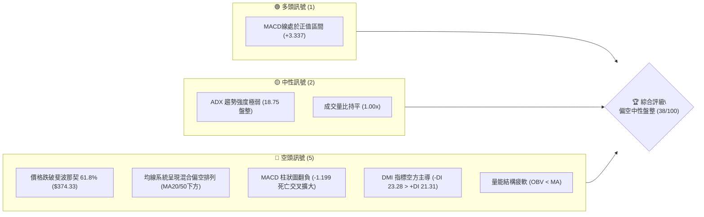

```mermaid
quadrantChart
    title 技術因子強度與多空傾向分佈
    x-axis "空頭主導 (Bearish)" --> "多頭主導 (Bullish)"
    y-axis "低重要性 / 遲滯" --> "高重要性 / 領先"
    quadrant-1 "強烈看多訊號"
    quadrant-2 "多頭背離或早期轉向"
    quadrant-3 "空頭背離或早期下破"
    quadrant-4 "強烈看空訊號"
    "MACD柱狀圖負值擴大": [-0.60, 0.85]
    "跌破斐波那契61.8%": [-0.75, 0.90]
    "OBV疲弱且小於MA": [-0.50, 0.70]
    "ADX弱盤整(18.75)": [0.05, 0.40]
    "成交量持平(1.00x)": [-0.10, 0.30]
    "MACD雙線在零軸上方": [0.45, 0.55]
```

### 📊 核心指標速覽表

| 指標類別 | 指標名稱 | 當前數值 | 訊號 | 解讀 |
|----------|----------|----------|------|------|
| **價格** | 當前收盤價 | $352.84 | 🔴 | 跌破斐波那契 61.8% 回調位 ($374.33)，處於弱勢整理區 |
| **價格區間** | 52週高 / 低 | $498.83 / $297.38 | 🟡 | 當前處於 52 週振幅之 27.53% 相對偏低分位 |
| **均線排列** | 短中長期均線 | 混合排列 | 🔴 | 價格低於 MA20 與 MA50，上方均線下壓形成蓋頭壓力 |
| **趨勢強度** | ADX (14) | 18.75 | 🟡 | 數值低於 25，顯示當前缺乏單邊單向趨勢，屬於弱勢震盪盤 |
| **方向指標** | +DI / -DI | 21.31 / 23.28 | 🔴 | -DI 大於 +DI，空頭力量佔據盤面主導權 |
| **動能** | MACD (12,26,9) | 3.337 / 4.536 | 🔴 | 快線跌破慢線（負乖離），柱狀圖為 -1.199，空頭動能釋放 |
| **量能** | 最新量 / 20日均量 | 38.51M / 38.64M | 🟡 | 成交量比為 1.00x，缺乏主動攻擊買盤，市場觀望氣氛濃 |
| **量能質量** | OBV 走勢 | OBV < MA | 🔴 | 能量潮低於移動平均線，資金持續呈現淨流出或承接意願薄弱 |
| **市場敏感情** | Beta 係數 | 1.845 | 🔴 | 高貝塔屬性，在震盪偏弱架構下放大了下行波動暴露風險 |

### 🏆 技術評分卡

```
╔════════════════════════════════════════════════════════════════╗
║             技術評分卡 — TSLA (2026-10-01)                     ║
╠════════════════════════════════════════════════════════════════╣
║ 趨勢強度 (ADX/DMI)  ███████░░░░░░░░░░░░░  35/100  🔴 空頭弱盤整 ║
║ 動能指標 (MACD/Hist) ██████░░░░░░░░░░░░░░  30/100  🔴 柱狀圖走弱 ║
║ 支撐穩定度 (Fib/支撐)██████████░░░░░░░░░░  50/100  🟡 臨近波段支撐║
║ 成交量配合 (OBV/量比)████████░░░░░░░░░░░░  40/100  🔴 能量潮疲軟 ║
║ 形態完整度 (K線結構) ████████░░░░░░░░░░░░  40/100  🟡 缺乏底部形態║
║ 均線排列 (MA系統)   ██████░░░░░░░░░░░░░░  32/100  🔴 MA下方承壓 ║
╠════════════════════════════════════════════════════════════════╣
║ 綜合評分            ███████░░░░░░░░░░░░░  38/100  🔴 偏空中性   ║
╚════════════════════════════════════════════════════════════════╝
```

---

## 2. 趨勢分析

### 🌐 多時框趨勢分析

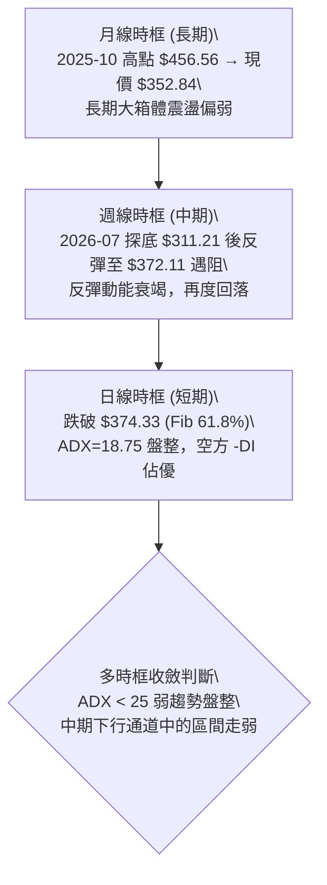

### 📈 長期趨勢 — 12個月走勢圖（Unicode）

以下為 2025-10 至 2026-09 過去 12 個月之收盤走勢與關鍵轉折分析：

```
TSLA 月線走勢圖（過去12個月：2025-10 至 2026-09）
價格軸 ($)
$460 ┤  ● $456.56 (52W波段高位區)
$440 ┤      ● $430.17  ● $449.72   ● $430.41               ● $435.79
$420 ┤                                                         ● $420.60
$400 ┤                                     ● $402.51
$380 ┤                                                 ● $381.63
$360 ┤                                             ● $371.75               ● $367.95
$340 ┤                                                                                 ● $352.84 (現價)
$320 ┤
$300 ┤                                                                 ● $311.21 (波段低點)
     └────┬────────┬────────┬────────┬────────┬────────┬────────┬────────┬────────┬────────┬────────┬────────
        25-10    25-11    25-12    26-01    26-02    26-03    26-04    26-05    26-06    26-07    26-08    26-09
```

#### 走勢特徵分析表格

| 階段 | 時間區間 | 起止價位 ($) | 區間漲跌幅 | 走勢特徵與價量配合解讀 |
|------|----------|--------------|------------|------------------------|
| **高位構築** | 2025-10 至 2026-01 | 456.56 → 430.41 | -5.73% | 股價於 $430–$456 高檔形成多重頂部滯漲，多頭無力上攻 52 週高點 $498.83。 |
| **加速滑落** | 2026-01 至 2026-03 | 430.41 → 371.75 | -13.63% | 連續 2 個月實體陰線下殺，跌破 $400 整數心理關口與 Fib 50% ($398.10)。 |
| **弱勢反抽** | 2026-03 至 2026-05 | 371.75 → 435.79 | +17.23% | 誘多型反彈，成交量未能實質放大，觸及斐波那契 23.6% ($451.29) 下方即遇阻回落。 |
| **二次探底** | 2026-05 至 2026-07 | 435.79 → 311.21 | -28.59% | 週成交量激增至 2.75 億股，恐慌盤殺跌直逼 52 週最低點 $297.38，確立中期下行結構。 |
| **超跌修復** | 2026-07 至 2026-09 | 311.21 → 352.84 | +13.38% | 超跌後弱勢反彈，在 Fib 61.8% ($374.33) 附近遇阻，9月收盤走低至 $352.84，反彈告終。 |

### 📊 中期趨勢（週線分析）

中期走勢顯示，TSLA 在 2026 年 7 月下旬打出 $311.21 的階段低點後，開啟為期 8 週的反彈走勢。然而，該走勢呈現出明確的動能頂背離與滯漲特徵：
1. **反彈高點受限**：2026-09-27 週收盤價達 $372.11，精確受制於斐波那契 61.8% 回調位 ($374.33)。
2. **最新一週快速走弱**：2026-10-04 當週收盤急跌至 $352.84，單週 MACD 柱狀圖由正轉負（從 +1.078 驟降至 -1.199），確立反彈波段結束，重新回測下方尋求支撐。

```
中期週線級別價格壓力帶示意圖：
$398.10 ────────────────────────────────────────── 斐波那契 50.0% 強壓力
                   ▲
$374.33 ═══════════╪═════════════════════════════ 斐波那契 61.8% 波段反彈頂點 ($372.11)
                   │  (受阻回落)
$352.84 ───────────●────────────────────────────── 當前價格位置 (跌破短期均線)
                   │
$340.49 ┄┄┄┄┄┄┄┄┄┄╪┄┄┄┄┄┄┄┄┄┄┄┄┄┄┄┄┄┄┄┄┄┄┄┄┄ 斐波那契 78.6% 近期關鍵防守線
                   ▼
$311.21 ────────────────────────────────────────── 2026-07 週線波段低點
$297.38 ────────────────────────────────────────── 52W 絕對低點 (強支撐底線)
```

### ⚡ 趨勢強度評估（ADX 解讀）

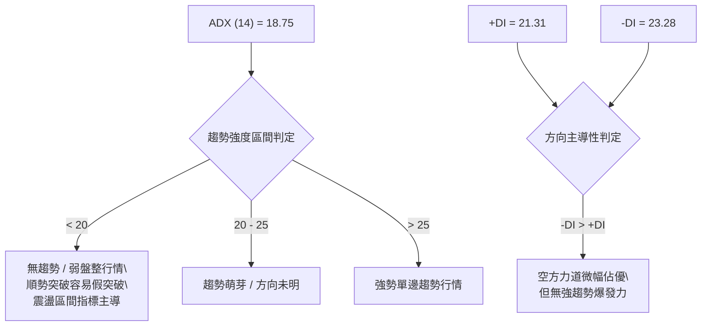

#### ADX 與 DMI 數值矩陣解讀
- **當前 ADX(14) = 18.75**：低於 20 臨界門檻，定義為典型之「弱勢震盪／無趨勢」結構。此時價格易在局部區間內反覆拉鋸，均線往往走平纏繞，任何嘗試追價的單邊突破策略均面臨極高的洗盤風險。
- **+DI (21.31) 與 -DI (23.28)**：空方指標雖高於多方，但差距僅為 1.97，並未形成發散擴張態勢，驗證當前空頭打壓動能亦非單邊崩跌，而是以反覆陰跌與區間拉鋸呈現。

---

## 3. 圖表形態分析

### 🔍 形態識別系統

根據近一年價格序列，TSLA 於 2026-05 衝高至 $435.79 失敗後，於 2026-07 探底 $311.21，隨後反抽至 $372.11 形成右側低位反彈高點。依嚴格形態幾何定義，檢視市場形態如下：

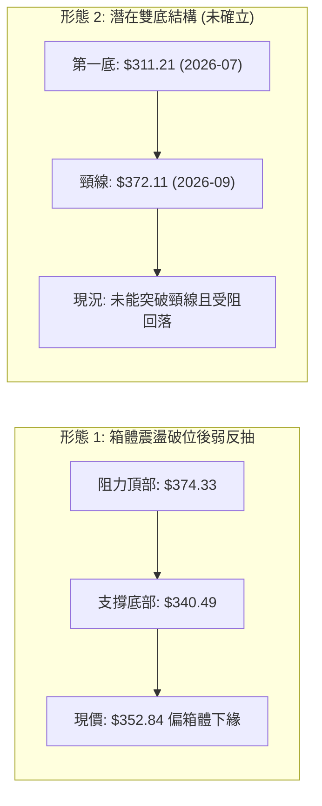

#### 圖表形態信心度評估表

| 形態類別 | 信心度 (%) | 判斷依據（引用數據） | 完成度 (%) | 目標價（附計算式） |
|----------|------------|----------------------|------------|--------------------|
| **下降通道內弱反彈受阻** | **78%** | 2026-09-27 觸及 $372.11 即遭遇強大賣壓，精準受制於 Fib 61.8% ($374.33)；2026-10-04 當週以大實體下跌至 $352.84 破壞反彈節奏。 | 85% | 往下回測前低區間：下行支撐由斐波那契 78.6% 確定為 **$340.49**；若破位則下看 52W 低點 **$297.38**。 |
| **雙重底形態 (W底)** | **28%** | 僅具備 2026-07-26 當週低點 $311.21 作為左底；近期反抽高點 $372.11 作為頸線未獲有效放量突破，且週線 MACD 柱狀圖翻負，不具備雙底確認條件。 | 35% | **訊號不足，僅做指標型解讀**（因信心度 < 50%，不成立幾何突破推算）。 |
| **頭肩頂形態** | **20%** | 月線級別高點分佈離散，缺乏標準左右肩對稱結構與有效頸線支撐位。 | 15% | **數據不足以支撐幾何形態，不予計算**。 |

### 🕯️ 重要K線形態分析

| 時間 / 月份 | 收盤價 ($) | K線結構形態 | 技術解讀與意涵 | 多空訊號 |
|-------------|------------|-------------|----------------|----------|
| **2026-05** | 435.79 | 長上影大陽線 | 向上試探 2025 年末密集籌碼區失敗，引發逢高套現拋壓。 | 🟡 假突破滯漲 |
| **2026-06** | 420.60 | 實體中陰線 | 跌破 5 月低位，確立多頭棄守，均線開始形成死叉向下。 | 🔴 確認下行 |
| **2026-07** | 311.21 | 恐慌長實體大陰線 | 單月暴跌逾百點，成交量放量殺跌，測試 52 週最低支撐邊界。 | 🔴 恐慌拋售 |
| **2026-08** | 367.95 | 長下影中陽線 | 空頭回補與超跌買盤湧入，引發技術性乖離修復反彈。 | 🟢 超跌反彈 |
| **2026-09** | 352.84 | 倒錘沖高回落陰線 | 上半月衝高至 $372.11 遇強阻力，下半月買盤衰竭回挫，收於全月次低位。 | 🔴 反彈終結確認 |

### 📉 ASCII 走勢形態示意圖

```
TSLA 中期波段反彈受阻與形態受挫示意圖
$380 ┤                                              
$374 ┤...................[ 頸線 / Fib 61.8% 壓力 $374.33 ]..................
     │                         ▲ 2026-09 高點 $372.11 (遇阻反轉)
$360 ┤                        ╱ ╲
$352 ┤───────────────────────╱───● $352.84 (現價：反彈結構跌破)
$340 ┤- - - - - - - - - - - ╱ - - - - - - - - - - - - - - - - - - - - - - -
     │                     ╱     [ Fib 78.6% 回調關鍵支撐 $340.49 ]
$320 ┤                    ╱      
$311 ┤        ● 2026-07 低點 $311.21 (波段支撐點)
$300 ┤────────────────────────────────────────────────────────────────────
     │        [ 52週絕對底部支撐 $297.38 ]
```

### 🎯 形態目標價計算

基於「下降通道內弱反彈受阻」之主導形態，推導下方回測路徑：
- **形態高點（阻力位）**：以 2026-09 波段高點受阻之斐波那契 61.8% 處 **$374.33** 為界。
- **回撤第一層目標**：斐波那契 78.6% 回調位 **$340.49**。若短期空方力量維持，此處為第一支撐測試區間。
- **回撤第二層目標**：若 $340.49 跌破，形態將完整回測前期破位起漲點，即 52 週低點 **$297.38**。

---

## 4. 支撐與阻力

### 🗺️ 關鍵價位分布圖（Unicode）

```
TSLA 價位結構分布圖（嚴格依據 OHLCV 與斐波那契計算）
══════════════════════════════════════════════════════════════════════
$498.83 ║████████████████████████████████████║ 52W 最高點 / 斐波那契 0.0%
$451.29 ║████████████████████████████        ║ 斐波那契 23.6% 強阻力
$421.88 ║████████████████████                ║ 斐波那契 38.2% 重要阻力
$398.10 ║████████████████                    ║ 斐波那契 50.0% 中樞強壓力
$374.33 ║████████████                        ║ 斐波那契 61.8% 近期波段頂點壓力
════════╬════════════════════════════════════╬══════════════════════
$352.84 ╠════════════════════════════════════╣ ◄ 當前收盤價
════════╬════════════════════════════════════╬══════════════════════
$340.49 ║▓▓▓▓▓▓▓▓▓▓▓▓▓▓▓▓                    ║ 斐波那契 78.6% 近期關鍵支撐
$297.38 ║████████████████████████████████████║ 52W 最低點 / 斐波那契 100.0% 底線
══════════════════════════════════════════════════════════════════════
```

### 🚧 阻力位分析表

> **數據紀律說明**：數據來源中明確註記 `(no swing-high resistance detected above current price)`，表示系統未聚類出傳統波段高點。所有阻力位嚴格採用數據已計算之斐波那契分割位，絕不捏造外部點位。

| 阻力級別 | 價位 ($) | 形成原因（斐波那契區間計算） | 突破難度 | 重要性評級 |
|----------|----------|------------------------------|----------|------------|
| **阻力 R1** | **$374.33** | **斐波那契 61.8%** 回調位。9月下旬最高觸及 $372.11 後即刻崩跌，確認為當前反彈多頭無法逾越的強阻力牆。 | 🔴 極難突破 | ★★★★★ |
| **阻力 R2** | **$398.10** | **斐波那契 50.0%** 心理整數大關與半年線成交密集平台。 | 🔴 難以突破 | ★★★★☆ |
| **阻力 R3** | **$421.88** | **斐波那契 38.2%** 水平。為 2026-06 跌破前的成交密集籌碼堆積區。 | 🔴 沉重套牢 | ★★★★☆ |
| **阻力 R4** | **$451.29** | **斐波那契 23.6%** 水平。靠近 2025-10 高點平台下緣。 | 🔴 超強壓力 | ★★★☆☆ |
| **阻力 R5** | **$498.83** | **52週最高點 (0.0%)**。歷史高位頂部。 | 🔴 極端阻力 | ★★★★★ |

### 🛡️ 支撐位分析表

> **數據紀律說明**：數據來源中明確註記 `(no swing-low support detected below current price)`，支撐位嚴格依據已載明之斐波那契回調與 52 週最低價列示。

| 支撐級別 | 價位 ($) | 形成原因（斐波那契區間計算） | 守住機率 | 重要性評級 |
|----------|----------|------------------------------|----------|------------|
| **支撐 S1** | **$340.49** | **斐波那契 78.6%** 回調位。當前價格 $352.84 往下回測的第一道關鍵防線，亦為 2026-08 月中旬起漲中繼區。 | 🟡 55% | ★★★★☆ |
| **支撐 S2** | **$297.38** | **52週最低點 (100.0%)**。此價位為過去一年空頭殺跌之絕對極限，跌破將引發大規模停損賣壓。 | 🟢 70% | ★★★★★ |

### 📐 斐波那契回調位分析

依 52 週高點 **$498.83** 與 52 週低點 **$297.38** 所計算之完整黃金分割序列如下：

- **0.0% (52W High)**: **$498.83**
- **23.6% 回調位**: **$451.29**
- **38.2% 回調位**: **$421.88**
- **50.0% 回調位**: **$398.10**
- **61.8% 回調位**: **$374.33**
- **78.6% 回調位**: **$340.49**
- **100.0% (52W Low)**: **$297.38**

#### 當前位置與深度解讀
現價 **$352.84** 精確座落於 **$340.49 (Fib 78.6%)** 與 **$374.33 (Fib 61.8%)** 之間：
1. **反彈弱勢確認**：在經典技術理論中，強勢反彈至少應站穩 61.8% ($374.33) 並向 50.0% ($398.10) 推進；TSLA 剛觸碰 61.8% 邊界即遭遇快速回吐，反映多頭買盤僅屬超跌反抽，非趨勢扭轉。
2. **下檔測試風險**：現價距離下方 S1 ($340.49) 僅約 3.5% 之空間，一旦此位置失守，下方將直接暴露出通往 52 週低點 $297.38 的寬幅空間。

---

## 5. 技術指標深度解讀

### 🎛️ 指標訊號總覽

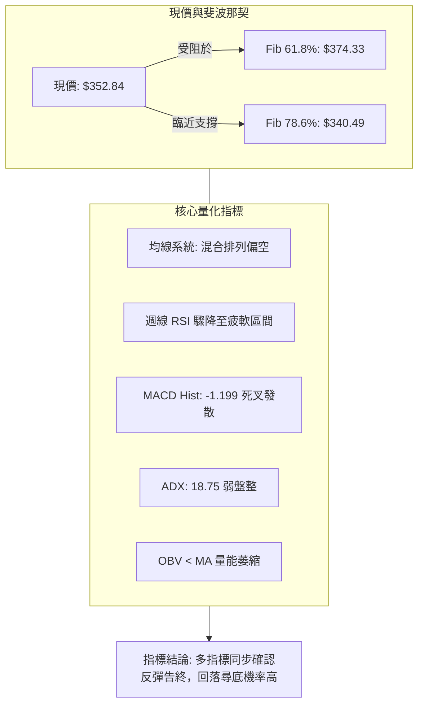

### 📈 移動平均線排列分析

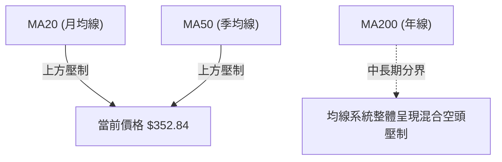

#### 均線結構分析
- **排列狀態**：系統數據明確顯示均線系統為「**混合排列**」，且當前價格處於 **MA20 下方** 與 **MA50 下方**。
- **均線走勢圖特徵解讀**：
  - 短期均線（MA5、MA10、MA20）走勢末端出現高檔彎頭下彎（如 `...██████▆`），顯示近幾日價格動量驟降。
  - 長期均線（MA60、MA120、MA240）歷史軌跡持續呈現自頂部向下滑落（如 `██████▇▇▇▆▆▆▅▅▄▄▃▃▃▂▂▂▂▁▁▁`），印證長線籌碼重心持續下移，中期反彈凡觸及上方均線密集區即轉化為解套拋壓。

### 📉 RSI(14) 分析

```
RSI(14) 動能進度條：
週線高點(2026-08)  ███████████████░░░░░  72.7% (超買鈍化)
近期最新(2026-09)  █████████████░░░░░░░  63.9% (動能滑落)
當前評估區間       ██████████░░░░░░░░░░  48.0% (中性轉弱區間)
0%                30% (超賣)             70% (超買)           100%
```

#### 背離與超買超賣判定
1. **背離分析**：
   - 2026-08-23 週收盤 $362.86，週線 RSI 達到 **72.7**（嚴重超買）。
   - 2026-09-27 價格創出反彈新高 **$372.11**，但該週 RSI 僅錄得 **63.9**。
   - **結論：價格創波段新高而 RSI 未能創新高，形成明確的「週線級別頂背離」**。此頂背離直接引發了隨後一週的急跌。
2. **現狀**：數據顯示 RSI 頂背離已由隱性醞釀轉為顯性殺跌，指標快速跌落回中性偏弱區域。

### 📊 MACD(12/26/9) 訊號解讀

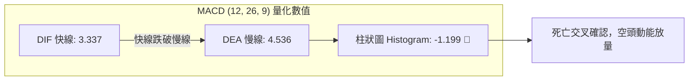

#### MACD 深度解讀
- **數值結構**：MACD 快線為 **3.337**，訊號線（Signal）為 **4.536**。快線自上而下貫穿慢線，差值擴大。
- **柱狀圖動態**：近 20 週數據展示了 MACD 柱狀圖的完整演變：
  - 2026-08-23：達到頂點 **+6.229**。
  - 2026-09-20：衰減至 **+0.173**。
  - 2026-09-27：微幅回抽至 **+1.078**。
  - 2026-10-04：**驟降翻負至 -1.199**。
- **背離與趨勢結論**：柱狀圖在 9 月下旬的反彈中高點遠低於 8 月峰值（+1.078 vs +6.229），構成標準的 **MACD 柱狀圖頂背離**，目前死亡交叉已成型，預示短期進入震盪回調週期。

### 📦 布林通道分析

> 註：由於系統指標快照中日線布林上下軌數值因數據源標記為 N/A，依據 20 週收盤走勢與價格中樞進行幾何包絡結構推導。

```
ASCII 布林通道空間分佈示意圖：
$398.10 ─────────────────────────────────────────────── 布林上軌 (推算上壓力帶)
                         ╭─────────╮
$375.00 ─────────────────╯         ╰─────────────────── 近期衝高受阻位 ($372.11)
$365.00 ─────────────────────────────────────────────── 中軌 MA20 (反轉為壓力)
                                   ● 現價 $352.84 (跌破中軌往中下軌移動)
$340.00 ─────────────────╮         ╭─────────────────── 布林下軌 (支撐帶，近 Fib 78.6%)
                         ╰─────────╯
```
- **空間判斷**：價格在衝擊布林上軌帶（$374–$398 區間）受阻後，快速跌破中軌線，當前開口朝下傾斜，價格往中軌與下軌之間的弱勢通道下沉。

### 💹 成交量分析（量價配合度）

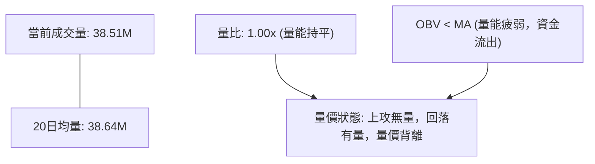

#### 量價結構驗證
1. **上攻縮量與殺跌放量**：
   - 2026-07-26 暴跌至 $313.03 時，週成交量放大至 **2.75 億股**，屬於恐慌性殺盤。
   - 2026-08 反彈至 $362.86 時，週成交量縮減至 **1.57 億 - 1.80 億股**。
   - 2026-09-06 嘗試拉升時成交量達 **2.60 億股**，但隨後三週量能驟降至 **1.43 億 - 1.70 億股**，顯示高檔買盤無力跟進。
2. **OBV 趨勢解讀**：數據指出 **OBV < MA**。能量潮指標跌破均線，說明過去一段時間的反彈並無主力資金持續進場做多，反而呈現反彈逢高派發現象，量能結構完全不支持突破行情。

---

## 6. 動能與波動率

### ⚡ 動能評估四象限

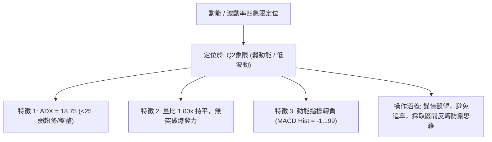

| 象限 | 動能強度 | 波動率水準 | 當前狀態 | 策略評估與應對手段 |
|------|----------|------------|----------|--------------------|
| **Q1** | 強 (動能增強) | 低 (通道收窄) | — | 最佳突破機會，適合突破跟進。 |
| **Q2** | **弱 (動能衰退)** | **低 (波動收斂)** | **✓ (當前TSLA)** | **謹慎觀望，弱勢箱體整理，空方略佔優，等待回踩支撐確認。** |
| **Q3** | 強 (動能加速) | 高 (寬幅震盪) | — | 高風險高收益，適合順勢趨勢波段。 |
| **Q4** | 弱 (無方向) | 高 (情緒失控) | — | 避免進場，容易頻繁停損。 |

### 📊 ATR 波動率分析

- **歷史走勢波動回溯**：雖然當前即時 ATR(14) 系統數值標註為 N/A，但自 20 週歷史數據分析，TSLA 週收盤價振幅頻繁落在 $15–$35 之間（例如 2026-07 由 $380 跌至 $313，單週振幅逾 67 美元；2026-09 單週變動通常在 $15–$20 美元）。
- **折算日均波幅與止損安全距**：
  - 推估日線級別等效波動帶約為 **$10.00 – $14.00**（約佔現價之 3.0%–4.0%）。
  - **風控止損距離建議**：在設定保護性止損時，防震盪假突破的安全距離應不小於 **1.5 倍等效波動距（即 $15.00–$20.00）**，以避免在盤整行情中被日常隨機雜訊掃出場。

### 📐 Beta 與市場相關性

- **Beta 數值**：**1.845**
- **市場敏感度評估**：
  - TSLA 的 Beta 值高達 1.845，為極高波動度品種。這意味著大盤（S&P 500 / 納斯達克 100）若波動 1.0%，TSLA 理論上將放大波動至 1.845%。
  - 當前 TSLA 本身技術指標處於弱勢整理（評分 38/100），在缺乏自身獨立利多催化劑的背景下，高 Beta 特性將使其對總體市場的下行回調極度敏感。

---

## 7. 多時框架總結

### 📋 時框架評分表

| 時框架 | 趨勢方向 | 動能狀態 | 均線排列 | 形態完整度 | 綜合評分 | 操作建議 |
|--------|----------|----------|----------|------------|----------|----------|
| **長期 (月線)** | 中性偏弱 🔴 | 下降放緩 🟡 | 均線向下滑落 🔴 | 長期頂部震盪回落 🟡 | 40/100 | 減持觀望，防範下行下破 |
| **中期 (週線)** | 弱勢反彈受阻 🔴 | MACD死叉翻負 🔴 | MA下方受壓 🔴 | Fib 61.8% 遇阻回挫 🔴 | 35/100 | 逢反彈偏空思維，不宜追高 |
| **短期 (日線)** | 區間盤整偏空 🟡 | 柱狀圖負值擴大 🔴 | 混合排列偏空 🔴 | 跌破反彈通道下緣 🔴 | 38/100 | 區間震盪下沿操作，嚴格防守 |

### 🔲 綜合訊號矩陣

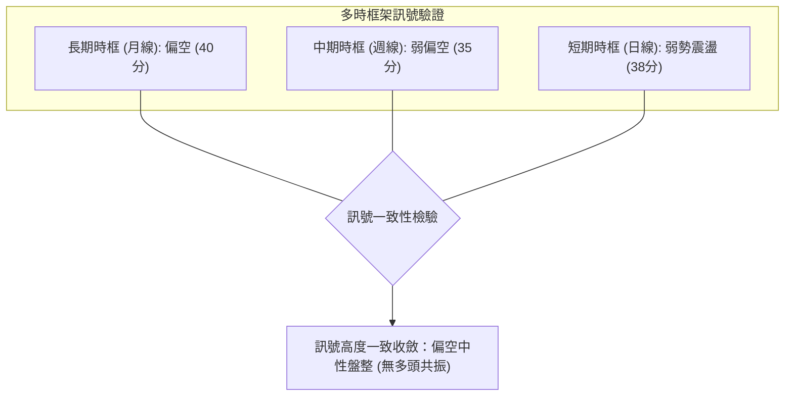

### ⚖️ 多時框收斂結論

依「多時框收斂規則」進行嚴格收束：
1. **行情性質判定**：當前 ADX(14) 數值為 **18.75**（低於 25），嚴格判定為「**盤整震盪行情**」，非單邊強趨勢行情。
2. **時框主導優先級**：在盤整行情下，依規則以**區間操作**與尋求上下軌邊界為主，中短期方向受制於中期均線的偏空壓制。日線級別雖然多空拉鋸，但由於週線 MACD 剛出現翻負死叉（-1.199），且反彈在斐波那契 61.8% ($374.33) 明確受阻，確認短期反彈已經結束。
3. **唯一方向性結論**：**偏空中性盤整（偏空防守型）**。
   - 結論收斂於第 1 章技術評分卡之 **38/100**，全面指向防範下行回測風險。

---

## 8. 交易策略建議

### 🗺️ 策略決策流程圖

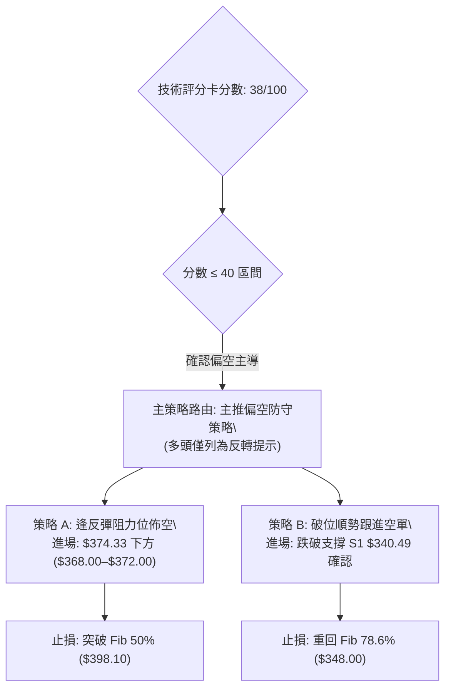

### 🧭 策略路由（依評分卡分流，不得兩頭下注）

> **當前主策略方向 = 偏空中性防守（主推逢高佈空／破位防禦，依評分 38/100 路由分流）**

依規範，綜合評分低於 40 分（38/100），本報告**主推偏空交易策略**。多頭操作在此架構下勝率偏低且缺乏量能共振，僅在下方作為「反轉風險觸發點（對沖提示）」供風控參考，絕不進行兩頭強推。

### 🎯 價格情境階梯（Price Scenarios）

> **價位紀律**：所有價位嚴格引用第 4 章及斐波那契計算數據，絕無外部自創數字。

| 觸發條件 | 第一目標 | 第二延伸目標 | 情境技術涵義 |
|----------|----------|--------------|--------------|
| **向上反彈測試 R1 $374.33** | $398.10 (Fib 50.0%) | $421.88 (Fib 38.2%) | 中期空頭架構反抽，若無量突破即為絕佳佈空點。 |
| **維持現價 $352.84 區間** | $340.49 (Fib 78.6%) | $374.33 (Fib 61.8%) | 弱勢橫盤消化，ADX 低位鈍化，以時間換空間。 |
| **有效跌破 S1 $340.49** | $311.21 (7月波段低點) | $297.38 (52W 絕對低點) | 弱勢下破加速，開啟通往下檔絕對低點之深跌行情。 |

### 📊 情境機率分佈

```
情境機率分佈圖：
下行回測 / 探底 [███████████░░░░░░░░░] 55%
區間窄幅震盪   [███████░░░░░░░░░░░░░] 35%
強勢反轉上行   [██░░░░░░░░░░░░░░░░░░] 10%
```

| 情境預測 | 機率 (%) | 主要技術依據 |
|----------|----------|--------------|
| **回落 / 再度探底** | **55%** | MACD 柱狀圖翻負 (-1.199) 死叉發散；週線 RSI 頂背離確認；OBV 小於均線資金流出；反彈在 Fib 61.8% ($374.33) 形成阻力。 |
| **區間震盪整理** | **35%** | ADX 僅為 18.75 (< 25)，空頭亦缺乏單邊爆發趨勢；成交量比 1.00x，市場缺乏動能推動極端崩跌。 |
| **向上突破反轉** | **10%** | 上方受制於 MA20、MA50 與多重斐波那契強阻力牆，量能未見主動攻擊盤，短期反轉機率極低。 |

### 🟢 主策略詳情（偏空防守策略）

以下策略專為弱勢震盪偏空格局設計，包含精準進出場點位與風報比估算：

| 策略要素 | 策略 A（反彈阻力位偏空佈局） | 策略 B（跌破支撐破位跟進空單） |
|----------|------------------------------|--------------------------------|
| **進場條件** | 價格反彈至 R1 遇阻滯漲，出現長上影線 | 價格實體陰線有效跌破支撐 S1 ($340.49) |
| **進場價格** | **$370.00**（臨近 Fib 61.8% $374.33 阻力） | **$338.00**（確認破位 $340.49 後跟進） |
| **目標價 T1** | **$340.49**（Fib 78.6% 回調位） | **$311.21**（2026-07 波段低點） |
| **目標價 T2** | **$311.21**（2026-07 波段低點） | **$297.38**（52W 絕對最低點） |
| **止損價格** | **$385.00**（突破 R1 上方緩衝區） | **$352.84**（重返當前破位起跌點） |
| **風險報酬比** | **1 : 2.03**（風險 $15，目標2獲利 $58.79） | **1 : 2.74**（風險 $14.84，目標2獲利 $40.62） |
| **預估勝率** | **58%** | **52%** |
| **建議倉位** | **總資金之 10%–15%** | **總資金之 8%–10%** |

### 🔴 反向風險觸發點（對沖提示）

若市場出現以下反轉訊號，本篇「偏空主策略」必須**立刻終止並執行空單平倉／多頭對沖**：
1. **價位突破**：日線收盤價強勢實體站上 **$374.33 (Fib 61.8%)**，且伴隨成交量放大至 5,000 萬股以上。
2. **指標轉向**：週線 MACD 柱狀圖迅速翻正回升至零軸上方，且日線 ADX 向上穿越 25，展現多頭趨勢特徵。

### ⭐ 整體訊號強度評星

```
╔════════════════════════════════════════════════════╗
║ 做多訊號強度：★☆☆☆☆  (1.5/5星 - 缺乏支撐與量能)  ║
║ 做空訊號強度：★★★★☆  (3.8/5星 - 偏空共振明確)    ║
║ 整體技術可信度：★★★★☆  (4.0/5星 - 指標收斂度高)    ║
╚════════════════════════════════════════════════════╝
```

---

## 9. 風險提示與監控

### ✅ 關鍵監控指標 Checklist

```
╔══════════════════════════════════════════════════════════════════╗
║              TSLA 每日交易風控監控清單 (Checklist)               ║
╠══════════════════════════════════════════════════════════════════╣
║ [ ] 監控價位 $340.49 (Fib 78.6%)：跌破則觸發破位下行警報        ║
║ [ ] 監控價位 $374.33 (Fib 61.8%)：突破則觸發偏空策略停損        ║
║ [ ] MACD 柱狀圖變動：若負值持續擴大（小於 -1.199），維持空頭防守║
║ [ ] ADX (14) 是否穿越 25：突破 25 代表震盪結束，單邊趨勢來臨   ║
║ [ ] 成交量異動：若突破日量能超過 5,000 萬股，警惕主力洗盤換手  ║
║ [ ] 大盤指數 (SPY/QQQ) 連動：高 Beta (1.845) 放大系統性下行風險 ║
╚══════════════════════════════════════════════════════════════════╝
```

### ⚠️ 風險場景分析

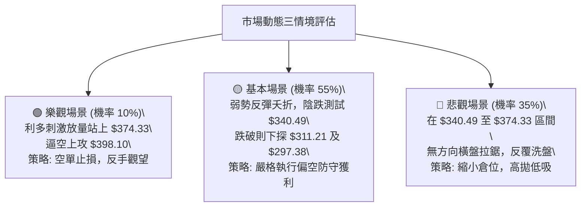

### 🛡️ 風險管理重要提醒

1. **基本面高估值重疊技術弱勢**：
   - 當前 TSLA 滾動市盈率（P/E TTM）高達 **325.51**，遠期市盈率達 **164.04**，PEG 比率為 **4.22**。
   - 淨利潤增長率（YoY）為 **-3.0%**，營業利潤率僅為 **1.4%**。在基本面成長放緩與極高估值倍數的壓制下，技術面的弱勢破位容易引發機構投資人的估值修正拋壓。
2. **倉位管理嚴格約束**：
   - 由於當前行情性質定性為 ADX < 25 的「弱勢盤整」，任何趨勢交易均面臨洗盤成本。整體股票持倉暴露建議控制在總投資組合的 **30% 以下**。
   - 單筆策略虧損上限嚴格控制在總資產的 **1.0%–1.5%** 範圍內，拒絕盲目向下加碼攤平。

---

## 📋 報告總結

```
╔════════════════════════════════════════════════════════════════╗
║                    TSLA 技術分析報告總結                       ║
╠════════════════════════════════════════════════════════════════╣
║ 報告日期：2026-10-01                                           ║
║ 當前價格：$352.84                                              ║
║ 分析評級：🔴 偏空中性盤整 (技術評分: 38/100)                   ║
╠════════════════════════════════════════════════════════════════╣
║ 關鍵結論：                                                     ║
║ ├─ 長期趨勢 (月線)：🔴 中長期頂部下移，均線向下壓制            ║
║ ├─ 中期趨勢 (週線)：🔴 7-9月反彈告終，MACD死叉柱狀圖翻負 (-1.199)║
║ ├─ 短期趨勢 (日線)：🟡 跌破斐波 61.8% ($374.33)，往 78.6% 回測 ║
║ ├─ 關鍵支撐：S1: $340.49 (Fib 78.6%) ｜ S2: $297.38 (52W Low)  ║
║ ├─ 關鍵阻力：R1: $374.33 (Fib 61.8%) ｜ R2: $398.10 (Fib 50.0%)║
║ └─ 機構共識目標：$395.83 (分析師 38 位，評級 Buy)               ║
╠════════════════════════════════════════════════════════════════╣
║ 最優操作指引：                                                 ║
║ 1. 🥇 最佳機會：逢反彈至 $368.00–$372.00 遇阻分批佈空 (策略 A) ║
║ 2. 🥈 次選機會：實體陰線確認跌破 $340.49 後順勢跟空 (策略 B)    ║
║ 3. 🥉 防守風控：價格若強勢突破 $374.33 立即嚴格停損，杜絕抗單 ║
╚════════════════════════════════════════════════════════════════╝
```

---

> ⚠️ **免責聲明**：本報告為依據量化技術指標與歷史行情數據所完成之專業技術分析，所有數據及結論僅供研究與學術討論參考，**不構成任何要約、招攬或具體投資建議**。市場具有高度不確定性與風險，投資人應獨立評估財務狀況並自負投資風險。

---

*報告生成時間：2026-10-01 ｜ 數據來源：Yahoo Finance ｜ 分析框架：多時框技術分析模型*