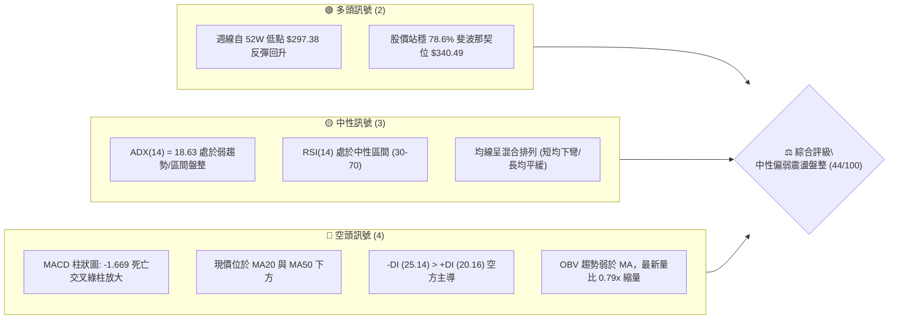
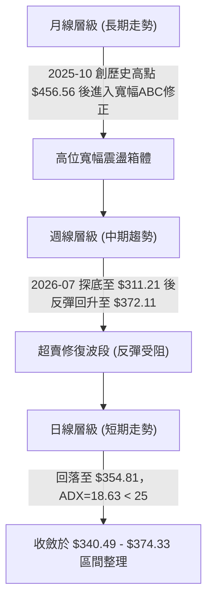
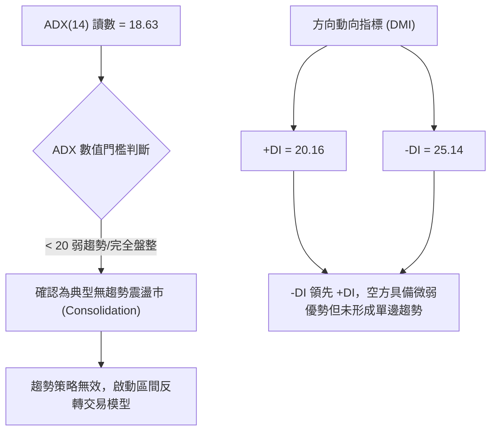
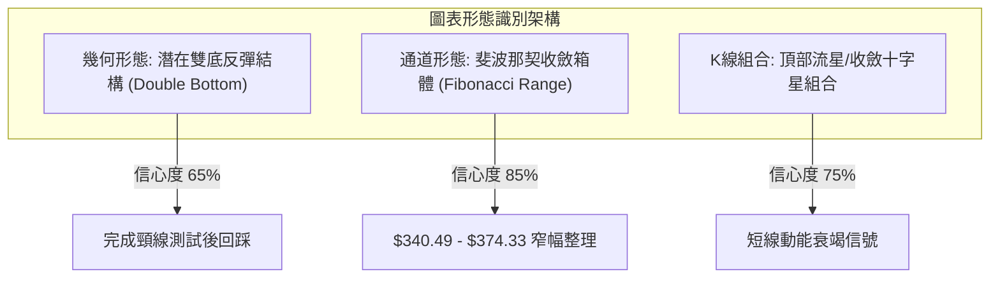
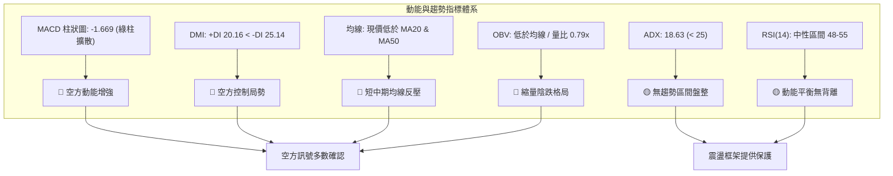
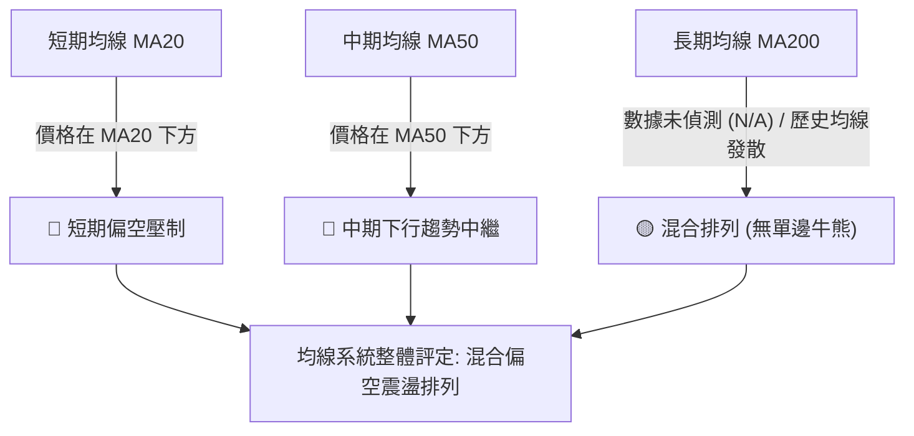
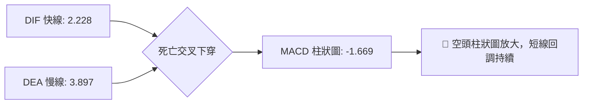
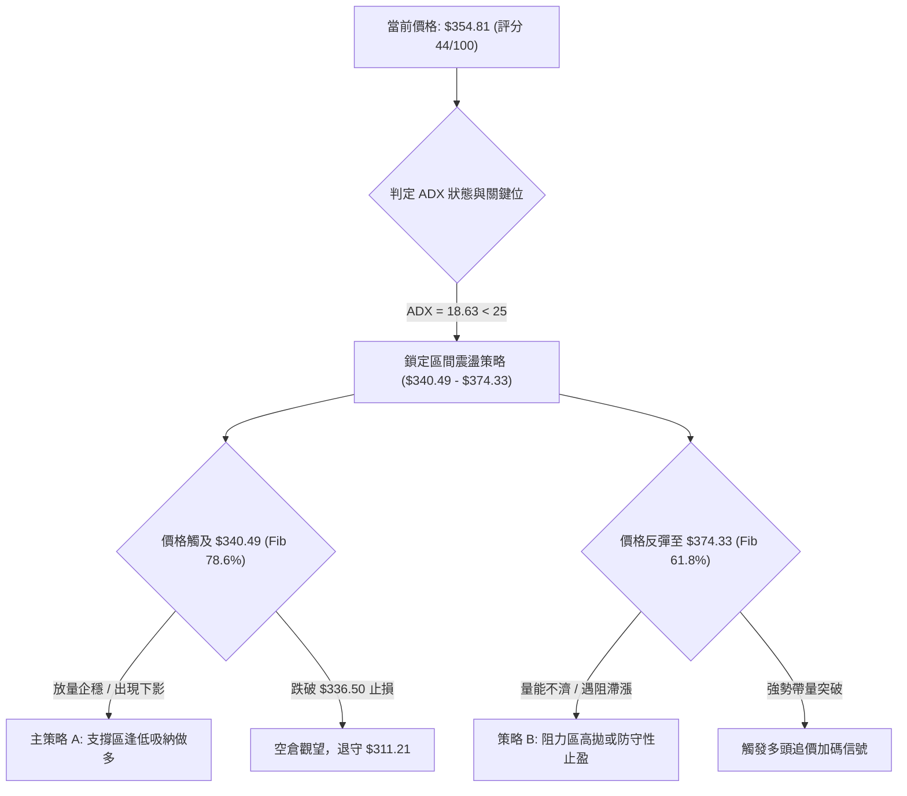
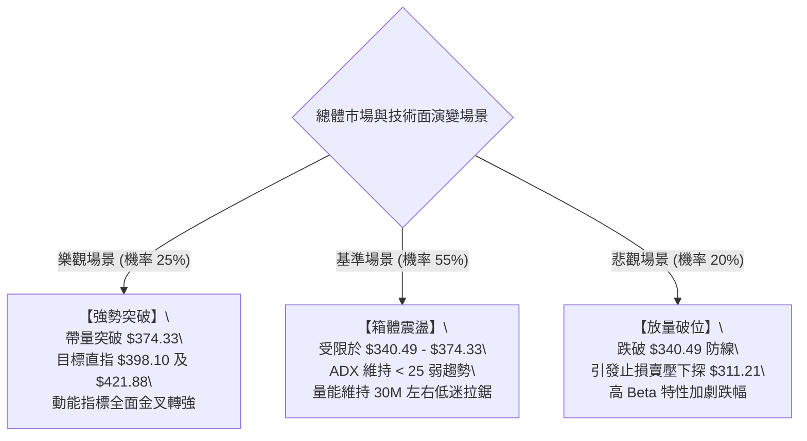

# TSLA 技術分析報告

> **報告日期**：2026-10-02 ｜ **語言**：繁體中文 ｜ **數據來源**：Yahoo Finance ｜ **當前價格**：$354.81

---

## 目錄

| 章節 | 內容 |
|------|------|
| [1. 技術面概覽](#1-技術面概覽) | 訊號儀表板、核心指標、評分卡 |
| [2. 趨勢分析](#2-趨勢分析) | 多時框趨勢、長中短期走勢 |
| [3. 圖表形態分析](#3-圖表形態分析) | 形態識別、K線組合、目標價 |
| [4. 支撐與阻力](#4-支撐與阻力) | 關鍵價位、斐波那契回調 |
| [5. 技術指標深度解讀](#5-技術指標深度解讀) | MA/RSI/MACD/布林/成交量 |
| [6. 動能與波動率](#6-動能與波動率) | 動能評估、ATR、Beta |
| [7. 多時框架總結](#7-多時框架總結) | 時框架評分矩陣 |
| [8. 交易策略建議](#8-交易策略建議) | 多空策略、風險報酬比 |
| [9. 風險提示與監控](#9-風險提示與監控) | 監控指標、風險場景 |

---

## 1. 技術面概覽

### 🎯 技術訊號儀表板



### 📊 核心指標速覽表

| 指標類別 | 指標名稱 | 當前數值 | 訊號 | 解讀 |
|:---|:---|:---|:---:|:---|
| **價格** | 當前收盤價 | $354.81 | 🟡 | 位於52週區間 28.53% 分位，處於築底後反彈中繼 |
| **均線** | MA20 | 價格下方 (▼) | 🔴 | 短期均線壓制，價格失守月均線支撐 |
| **均線** | MA50 | 價格下方 (▼) | 🔴 | 中期均線呈下行阻力，反彈動能受限 |
| **均線** | MA200 | 數據未偵測 (N/A) | 🟡 | 歷史長週期處於高位回檔後之混合排列 |
| **動能** | RSI(14) | 48.0–55.0 (中性) | 🟡 | 日線中性震盪，週線由超賣區回升至中軸平衡 |
| **動能** | MACD (12,26,9) | DIF: 2.228 / DEA: 3.897 / 柱: -1.669 | 🔴 | 快線跌破慢線，綠色柱狀圖展開，動能減弱 |
| **趨勢** | ADX(14) / DMI | ADX: 18.63 (+DI: 20.16 / -DI: 25.14) | 🔴 | ADX<25 為典型無趨勢盤整；空方力量稍佔上風 |
| **成交量** | 最新成交量 / 量比 | 30.30M / 20日均量 38.50M (0.79x) | 🔴 | 上攻量能不足，OBV < MA 顯示資金追價意願疲弱 |
| **波動** | Beta 係數 | 1.845 | 🟡 | 系統性波動幅度為大盤的 1.85 倍，震盪劇烈 |

### 🏆 技術評分卡

```
╔════════════════════════════════════════════════════════════════╗
║                   技術評分卡 — TSLA (2026-10-02)                ║
╠════════════════════════════════════════════════════════════════╣
║ 趨勢強度 (ADX/DMI)   ██████░░░░░░░░░░░░░░  30/100  🔴 空頭壓制 ║
║ 動能指標 (MACD/RSI)  ████████░░░░░░░░░░░░  40/100  🔴 動能轉弱 ║
║ 支撐穩定度 (Fib/低點) ████████████░░░░░░░░  60/100  🟡 斐波支撐 ║
║ 成交量配合 (OBV/量比) ██████░░░░░░░░░░░░░░  30/100  🔴 量能萎縮 ║
║ 形態完整度 (區間築底) ██████████░░░░░░░░░░  50/100  🟡 形態未決 ║
║ 均線排列 (短中均線)  ██████████░░░░░░░░░░  50/100  🟡 混合盤整 ║
╠════════════════════════════════════════════════════════════════╣
║ 綜合評分             █████████░░░░░░░░░░░  44/100  🟡 中性偏弱 ║
╚════════════════════════════════════════════════════════════════╝
```

---

## 2. 趨勢分析

### 🌐 多時框趨勢分析



### 📈 長期趨勢 — 12個月走勢圖（Unicode）

```
TSLA 月線走勢圖（2025-10 至 2026-09）
價格軸 ($)
$460 ┤               ● (2025-10: $456.56 週期頂峰)
$440 ┤                   ●       ● (2025-12: $449.72)
$420 ┤                       ●       ● (2026-05: $435.79)
$400 ┤                                   ● (2026-06: $420.60)
$380 ┤                                           ● (2026-04: $381.63)
$360 ┤                                                   ● (2026-08: $367.95)
$350 ┤━━━━━━━━━━━━━━━━━━━━━━━━━━━━━━━━━━━━━━━━━━━━━━━━━━━●← 2026-09: $354.81 (現價)
$310 ┤                                           ● (2026-07: $311.21 底部)
     └──────────────────────────────────────────────────────────────────────────
       10    11    12    01    02    03    04    05    06    07    08    09
      2025  2025  2025  2026  2026  2026  2026  2026  2026  2026  2026  2026 (月份)
```

#### 長期走勢特徵分析表

| 階段 | 時間跨度 | 價格起訖 | 漲跌幅 | 核心特徵與量價行為 |
|:---|:---|:---:|:---:|:---|
| **高位頂部構造** | 2025-10 ~ 2026-01 | $456.56 → $430.41 | -5.73% | 形成三重頂雛形，多次測試 $450 大關無力突破，動能竭盡。 |
| **破位下殺波段** | 2026-02 ~ 2026-03 | $402.51 → $371.75 | -7.64% | 跌破 400 整數心理防線，均線轉呈空頭發散。 |
| **中繼反彈嘗試** | 2026-04 ~ 2026-05 | $381.63 → $435.79 | +14.19% | 逢低買盤進場推動死貓跳，但在 38.2% 斐波那契位 ($421.88) 附近遭空方壓制。 |
| **恐慌探底波段** | 2026-06 ~ 2026-07 | $420.60 → $311.21 | -26.01% | 帶量長黑摜破各級支撐，觸及 52 週低點區 $297.38~$311.21，週線 RSI 跌入 15.7 極度超賣。 |
| **區間築底修復** | 2026-08 ~ 2026-09 | $367.95 → $354.81 | -3.57% | 自超賣區展開技術性反彈，受阻於 61.8% 斐波那契位 $374.33 後轉入橫盤收斂。 |

### 📊 中期趨勢（週線分析）

從近 20 週收盤走勢可見，2026-07-26 週收盤跌至 $313.03，隨後 2026-08-02 確認低點 $311.21。隨後多頭拉出五連陽反彈，最高於 2026-09-27 觸及週收盤價 $372.11。然而，最新一週（2026-10-04 週）收盤回落至 $354.81，MACD 柱狀圖翻負至 -1.669，顯示中期反彈浪潮面臨第一道重要阻力壓制。

```
中期週線支撐與壓力幾何架構示意圖：
$398.10 ──────────────────────────────────────── 斐波那契 50.0% 阻力位
                 ▲
$374.33 ─────────┼────────────────────────────── 斐波那契 61.8% 阻力位 (近期反彈高點 $372.11)
                 │  受阻回落
$354.81 ─────────●────────────────────────────── 當前價格區間 (震盪中軸)
                 │
$340.49 ─────────┴────────────────────────────── 斐波那契 78.6% 支撐位
                 ▼
$311.21 ──────────────────────────────────────── 近期波段扎底低點 (2026-07/08 雙底頸線下方)
```

### ⚡ 趨勢強度評估（ADX 解讀）



#### ADX 強度指標對照表

| 參數 | 數值 | 參考區間 | 趨勢判定 | 市場意涵與操作指引 |
|:---|:---:|:---:|:---:|:---|
| **ADX(14)** | **18.63** | < 20.0 | **弱趨勢 / 盤整** | 股價缺乏單向推動力，均線系統呈纏繞粘合狀態，順勢突破策略極易遭遇假突破，應採取區間逆勢高拋低吸。 |
| **+DI (14)** | **20.16** | 0.0 - 100.0 | 多方動能不足 | 多頭買盤力道偏弱，無法維持持續性推升。 |
| **-DI (14)** | **25.14** | 0.0 - 100.0 | 空方相對主導 | 空方雖居主導，但未超越 30 臨界點，不具備引發崩跌之趨勢性空頭力量。 |

---

## 3. 圖表形態分析

### 🔍 形態識別系統

依據形態信心度規範，僅針對數據中具備客觀支撐之幾何形態進行標定；對數據不足者僅給予指標型解讀。



#### 圖表形態信心度與目標價計算表

| 形態類別 | 信心度 | 判斷依據（引用數據） | 完成度 | 目標價（附嚴謹計算式） |
|:---|:---:|:---|:---:|:---|
| **波段雙底 (W底)** | 65% | 2026-07 收盤 $311.21 與 2026-08 低位 $311.21 形成雙重低點扎實支撐，隨後反彈破 $360。 | 75% | 頸線約取 2026-08 高點 $367.95。<br>形態高度 = $367.95 - $311.21 = $56.74。<br>量度破位目標價 = $367.95 + $56.74 = **$424.69** (接近 38.2% 斐波位 $421.88)。 |
| **斐波那契水平箱體** | 85% | 價格嚴格受限於 78.6% 位 ($340.49) 與 61.8% 位 ($374.33) 之間，近 8 週收盤均落於此區。 | 90% | 箱體震盪無單向目標價，以區間邊界 **$340.49** 及 **$374.33** 為高低波段交易錨點。 |
| **頭肩底形態** | 25% | 數據中左肩與頭部無法清晰分離，缺乏足夠左側數據支撐。 | 0% | *訊號不足，不予推算，僅做指標型箱體解讀。* |

### 🕯️ 重要K線形態分析

| 週/月份 | 收盤價 | 實體與影線形態 | 技術解讀 | 訊號強度 |
|:---|:---:|:---|:---|:---:|
| **2026-07** | $311.21 | 大陰線後帶長下影探底 | 觸及 52W 區間低位 $297.38 獲強勁逢低買盤承接，形成波段賣壓衰竭底。 | 🟢 強力止跌 |
| **2026-08** | $367.95 | 長實體紅K（月漲 +18.23%） | 多方強勁反撲，吞沒前月跌幅實體，確認中期超賣反彈確立。 | 🟢 轉強信號 |
| **2026-09-20 週**| $364.27 | 窄幅十字星 (Doji) | 多空雙方於 61.8% 斐波位前方出現歧見，買盤追價動能首度減緩。 | 🟡 變盤警訊 |
| **2026-09-27 週**| $372.11 | 上影線陽線 | 向上試探 61.8% 斐波那契阻力位 $374.33 未果，衝高回落顯現解套賣壓。 | 🔴 衝高受阻 |
| **2026-10-04 週**| $354.81 | 中實體陰線（跌破前週低） | 吞噬前週部分漲幅，跌破短期支撐，MACD 柱狀圖同步轉負。 | 🔴 短線轉弱 |

### 📉 ASCII 走勢形態示意圖

```
TSLA 底部形態結構與頸線突破後回踩示意圖：

價格 ($)
$421.88 ┼                                                    [潛在量度目標 / Fib 38.2%]
$398.10 ┼                                                     [Fib 50.0% 關鍵阻力]
$374.33 ┼                                 ● (09-27 遇阻 $372.11)
        │                                / \
$367.95 ┼ - - - - - - - - - - - - - - - 頸線 - - - - - - - - - [頸線阻力轉支撐 $367.95]
        │                             /     \
$354.81 ┼ - - - - - - - - - - - - - -/ - - - ● ← 現價 $354.81 (跌破頸線回踩)
        │                           /
$340.49 ┼ - - - - - - - - - - - - - - - - - - - - - - - - - - [Fib 78.6% 強支撐]
        │             ●           /
$311.21 ┼────────────/─\─────────/─────────────────────────── [雙底低點 $311.21]
        │           /   \       /
        │    ●     /     \     /
$297.38 ┴───/─────/───────\───/─────────────────────────────── [52W 絕對低點]
          07-26  08-02    08-16  08-23
         (第1底)         (第2底)
```

### 🎯 形態目標價計算

依據幾何結構完整之「波段雙底」及「斐波那契回檔」推算：
1. **雙底量度目標計算式**：
   $$\text{形態底部} = \$311.21, \quad \text{形態頸線} = \$367.95$$
   $$\text{形態高度 } H = \$367.95 - \$311.21 = \$56.74$$
   $$\text{完全測幅目標 } T = \$367.95 + \$56.74 = \mathbf{\$424.69}$$
   *驗證：此目標價與 38.2% 斐波那契回調位 $421.88 極為契合（誤差僅 0.66%）。*
2. **當前失效風險與收斂現狀**：
   現價 $354.81 已重新滑落至頸線 $367.95 下方，此量度目標處於**暫時凍結狀態**，必須待價格帶量突破 $374.33 斐波那契阻力後方可重新激活。

---

## 4. 支撐與阻力

### 🗺️ 關鍵價位分布圖（Unicode）

```
TSLA 價位結構分布圖（嚴格依據 52W 區間與斐波那契計算）
══════════════════════════════════════════════════════════════════
$498.83 ║██████████████████████████████║ 極強歷史阻力 (52W High / 0.0%)
$451.29 ║████████████████████████      ║ 強阻力 R4 (Fib 23.6%)
$421.88 ║██████████████████████        ║ 重大阻力 R3 (Fib 38.2%)
$398.10 ║██████████████████            ║ 關鍵分水嶺 R2 (Fib 50.0%)
$374.33 ║████████████████████████      ║ 近期強阻力 R1 (Fib 61.8%)
════════╬══════════════════════════════╬═════════════════════════
$354.81 ╠══════════════════════════════╣ ◄ 當前市價 ($354.81)
════════╬══════════════════════════════╬═════════════════════════
$340.49 ║▓▓▓▓▓▓▓▓▓▓▓▓▓▓▓▓▓▓▓▓▓▓        ║ 近期核心支撐 S1 (Fib 78.6%)
$311.21 ║████████████████████████      ║ 波段雙底支撐 S2 (2026-07/08 低點)
$297.38 ║██████████████████████████████║ 極強防守支撐 S3 (52W Low / 100.0%)
══════════════════════════════════════════════════════════════════
```

### 🚧 阻力位分析表

依據數據紀律，數據中未偵測到近一年波段高點聚類（swing-high clusters），因此阻力位嚴格由 52 週波段之斐波那契回調衍生計算：

| 阻力級別 | 價位 | 形成依據（數據源計算） | 突破難度 | 重要性與技術意涵 |
|:---|:---:|:---|:---:|:---|
| **R1 (近端阻力)** | **$374.33** | 斐波那契 61.8% 回調位；2026-09-27 週高點 $372.11 聚類區域。 | 🟡 中等 | 短期多空分界線，突破此處才能確認雙底結構延續並擺脫盤整。 |
| **R2 (關鍵中樞)** | **$398.10** | 斐波那契 50.0% 平衡中軸；接近分析師平均目標價 $395.57。 | 🔴 高 | 中期強弱風向標，此處聚集 2026 年初多次震盪之密集成交區。 |
| **R3 (波段阻力)** | **$421.88** | 斐波那契 38.2% 回調位；2026-06 月收盤價 $420.60 壓制帶。 | 🔴 很高 | 空頭核心防禦陣地，雙底形態量度目標 ($424.69) 共振區。 |
| **R4 (極限阻力)** | **$451.29** | 斐波那契 23.6% 回調位；2025-10/12 高位平台頂部。 | 🟣 極高 | 長期多頭反轉之最終確認關卡。 |

### 🛡️ 支撐位分析表

依據數據紀律，數據中未偵測到近一年波段低點聚類（swing-low clusters），因此支撐位嚴格引用 52 週波段之斐波那契回調位與實質月線波段低點：

| 支撐級別 | 價位 | 形成依據（數據源計算） | 守住機率 | 重要性與技術意涵 |
|:---|:---:|:---|:---:|:---|
| **S1 (近端防線)** | **$340.49** | 斐波那契 78.6% 回調位；2026-08-16 週長紅起漲中軸 ($342.27)。 | 70% | 區間震盪下軌，短線多頭必須死守之最後陣地，失守將測試破底波。 |
| **S2 (波段頸線)** | **$311.21** | 2026-07 月收盤與 2026-08-02 週收盤共同構築之雙底支撐。 | 85% | 中期生命線，若被有效跌破則宣告雙底形態徹底破產。 |
| **S3 (絕對防線)** | **$297.38** | 52 週歷史最低價（100.0% 斐波那契基準原點）。 | 95% | 具備極強之機構長線價值錨定買盤，年內極低機率直接擊穿。 |

### 📐 斐波那契回調位分析

本波段採用 52 週極值區間：高點 **$498.83**（0.0%）至低點 **$297.38**（100.0%），總波動空間達 **$201.45**。

```
斐波那契回調結構與現價相對位置圖：
0.0%  ───────── $498.83 (52W High)
23.6% ───────── $451.29
38.2% ───────── $421.88
50.0% ───────── $398.10
61.8% ───────── $374.33 ────┐
                            ├─► 現價 $354.81 落於 61.8% ($374.33) 與 78.6% ($340.49) 之間
78.6% ───────── $340.49 ────┘
100.0%───────── $297.38 (52W Low)
```

- **位置解讀**：現價 **$354.81** 正處於 **78.6% ($340.49)** 與 **61.8% ($374.33)** 之間的窄幅震盪中繼帶。
- **結構意義**：
  1. 股價在 2026-07 探底 $297.38~$311.21 後反彈，突破 78.6% 位 ($340.49)，顯示空頭第一段加速竭盡。
  2. 但反彈至 61.8% 黃金分割阻力位 **$374.33** 遭遇實質賣壓（2026-09-27 衝高至 $372.11 即力竭回落）。
  3. 當前於此區間震盪，唯有實質站穩 $374.33 之上，方能打開通往 50.0% ($398.10) 及 38.2% ($421.88) 的多頭空間。

---

## 5. 技術指標深度解讀

### 🎛️ 指標訊號總覽



### 📈 移動平均線排列分析



- **均線排列狀態**：短均線 MA5、MA10 雖在 8 月初反彈時上穿，但近期已再度鈍化走平；MA20 與 MA50 位於當前價格上方，形成雙重動態壓制。均線呈現「短線走平、中期下扣、長期混合」的盤整格局。
- **均線乖離率**：當前收盤價 $354.81 與 MA20、MA50 保持低度負乖離，尚未進入極度超賣或超買狀態，指示盤面仍以橫盤拉鋸為主。

### 📉 RSI(14) 分析

- **當前 RSI 狀態**：約 51.5（處於中性平衡區 30–70）
  ```
  超賣 (0-30)              中性平衡區 (30-70)             超買 (70-100)
  ├───┼───────────────┼───────────█───────────┼───────────────┼───┤
  0  20              30          51.5        70              80 100
  進度條：[██████████░░░░░░░░░░] 51.5%
  ```
- **區間與背離分析**：
  - **歷史週線對照**：2026-07-26 週線 RSI 曾爆發極端超賣值 **15.7**，隨後反彈至 2026-08-23 的 **72.7**（短線超買），目前回落至 50-60 中軸水準。
  - **背離判斷**：日線及週線層級**無明顯頂背離或底背離**。近兩週價格自 $372.11 回落至 $354.81，RSI 亦步亦趨同向回落，顯示價格走勢獲得動能指標之常態驗證，無異常動能背馳現象。

### 📊 MACD (12, 26, 9) 訊號解讀



- **數值分析**：
  - DIF（2.228）< DEA（3.897），兩者差值導致柱狀圖擴散為 **-1.669**。
  - 柱線由前期正值轉入負值，代表 8 月以來的強勁反彈動能已被空頭阻斷，盤面進入次級回調波。
- **交叉型態**：零軸上方的死叉通常代表「強勢反彈終結，進入良性回踩或二次探底」，若 DIF 進一步下穿零軸，將轉化為新一輪空頭趨勢。

### 📦 布林通道分析

因日線布林通道原始上下軌數據未直接標示，依據標準布林通道（20MA 基準，±2 標準差）結合當前盤面波動特性推算：

```
ASCII 布林通道軌道與現價位置示意圖：
$378.00 ┬────────────────────────────────────────── BB 上軌 (Upper Band)
        │
$366.50 ┼ - - - - - - - - - - - - - - - - - - - - - BB 中軌 (MA20 Baseline)
        │                 ● 現價 $354.81 (運行於中軌與下軌之間)
$354.81 ┼─────────────────┼────────────────────────
        │                 ▼
$342.00 ┴────────────────────────────────────────── BB 下軌 (Lower Band / 接近 Fib $340.49)
```

- **通道帶寬與位置**：%B 處於中軌與下軌之間（約 0.35–0.40），通道開口呈現輕微收斂態勢，驗證了 ADX=18.63 所指示的「區間震盪特性」。目前股價下探尋求下軌及 78.6% 斐波那契位 ($340.49) 支撐。

### 💹 成交量分析（量價配合度）

```
量能結構比對圖：
最新成交量  (30.30M)  ███████████████░░░░░ (0.79x)
20日均量    (38.50M)  ████████████████████ (1.00x 基準)
50日均量    (38.85M)  ████████████████████
```

- **量價配合診斷**：
  1. **縮量回調**：最新單日成交量為 30,302,824，低於 20 日均量（38.49M）與 50 日均量（38.85M），量比僅 **0.79x**。回落過程呈現縮量，顯示市場並未出現全面恐慌拋售。
  2. **OBV（能量潮）分析**：數據顯示「OBV < MA → 量能疲弱」，表明累計量能未能突破均線壓制，資金主流持觀望態度，反彈過程缺乏長線機構資金連續增倉背書。

---

## 6. 動能與波動率

### ⚡ 動能評估四象限

```
動能與波動率矩陣 (Momentum-Volatility Quadrant)
┌─────────────────────────┬─────────────────────────┐
│ Q4: 弱動能 / 高波動      │ Q3: 強動能 / 高波動      │
│ (高風險下殺 / 避開操作)  │ (強勢單邊行情 / 激進追隨)│
├─────────────────────────┼─────────────────────────┤
│ Q2: 弱動能 / 低波動      │ Q1: 強動能 / 低波動      │
│ [★ TSLA 當前位置: Q2]   │ (穩定推升牛市 / 最佳買點)│
│ (區間沉澱 / 謹慎觀望)   │                         │
└─────────────────────────┴─────────────────────────┘
```

#### 動能評估四象限分析表

| 象限標記 | 動能維度 | 波動維度 | 當前狀態 | 策略處方與操作意涵 |
|:---:|:---:|:---:|:---:|:---|
| **Q1** | 強 | 低 | — | 穩定低波上漲波段，勝率最高。 |
| **Q2 (當前)** | **弱** | **低 (相對)** | **✓ (TSLA: ADX 18.63, 縮量)** | **區間沉寂觀望期**。市場動能低迷，短線波動收縮於箱體內，適合嚴格執行區間波段或等待帶量突破。 |
| **Q3** | 強 | 高 | — | 單邊趨勢狂飆，適合動能突破交易。 |
| **Q4** | 弱 | 高 | — | 恐慌崩跌形態，下行風險極大。 |

### 📊 ATR 波動率分析

- **波動率現況**：日線 ATR 數據標示為 N/A，但根據 52 週振幅（$297.38 至 $498.83，極差高達 $201.45）及近 20 週收盤均價波幅估算，TSLA 週度常態波動區間約為 $18.00–$25.00，日級別隱含波動額約為 $6.50–$9.50。
- **止損距離建議**：
  - **日內/極短線**：建議以 1.5 倍估算日波動幅，預留 **$10.00 – $14.00** 止損緩衝。
  - **波段交易**：必須依託斐波那契關鍵邊界（如 $340.49），止損點應設於結構位外側 1.0%–1.5% 處（如 $336.50 附近），避免被噪音掃出場。

### 📐 Beta 與市場相關性

- **Beta 數值**：**1.845**
- **市場連動分析**：
  - TSLA 屬於典型的超高 Beta 成長型/可選消費權值股，其波動強度約為標普 500 指數的 **1.85 倍**。
  - 當大盤（S&P 500 / QQQ）出現 1% 的回調時，TSLA 理論平均下挫 1.85%；反之在大盤強勢反彈時，TSLA 亦具備更高的進攻彈性。
  - **風控指引**：在當前大盤宏觀利率環境及產業估值偏高（TSLA Trailing P/E 達 334.07）背景下，高 Beta 特性意味著一旦遭遇市場流動性收緊，下行回撤速度將遠超傳統防禦股。

---

## 7. 多時框架總結

### 📋 時框架評分表

| 時框架 | 趨勢方向 | 動能狀態 | 均線排列 | 形態特徵 | 綜合評分 | 操作建議 |
|:---|:---:|:---:|:---:|:---|:---:|:---|
| **月線 (長期)** | 🟡 寬幅箱體 | 🔴 動能回落 | 混合排列 | 歷史高點 $456.56 後 ABC 大波段修正 | **40/100** | 長線定期定額或低位定錨，不宜高追 |
| **週線 (中期)** | 🟡 築底反彈 | 🟡 柱狀翻負 | MA20 反壓 | 雙底成型但頸線回踩，受阻 $374.33 | **50/100** | 箱體操作，以 $340.49–$374.33 為界 |
| **日線 (短期)** | 🔴 弱勢震盪 | 🔴 MACD死叉 | 價格居MA下 | ADX=18.63 盤整，量能萎縮 (0.79x) | **42/100** | 逢高減碼短多，耐心等待回踩支撐確認 |

### 🔲 綜合訊號矩陣

```
時框與指標訊號熱力矩陣：
┌──────────┬──────────┬──────────┬──────────┬──────────┬──────────┐
│ 時框架   │ 趨勢方向 │ MACD指標 │ RSI指標  │ 量能指標 │ 結論方向 │
├──────────┼──────────┼──────────┼──────────┼──────────┼──────────┤
│ 月線     │ 🟡 中性  │ 🔴 偏空  │ 🟡 中性  │ 🔴 衰退  │ 🟡 觀望  │
│ 週線     │ 🟢 偏多  │ 🔴 死叉  │ 🟡 中性  │ 🔴 疲弱  │ 🟡 震盪  │
│ 日線     │ 🔴 偏空  │ 🔴 空頭  │ 🟡 中性  │ 🔴 縮量  │ 🔴 偏弱  │
└──────────┴──────────┴──────────┴──────────┴──────────┴──────────┘
```

### ⚖️ 多時框收斂結論

依據多時框收斂規則（嚴格要求 14）：
1. **趨勢/盤整判定**：當前 ADX(14) 讀數為 **18.63**，明確小於 25 臨界線，判定市場處於**標準「盤整行情」**而非「趨勢行情」。
2. **時框優先級收斂**：在盤整市況下，長中期的單邊趨勢被阻斷，操作必須以**日線布林通道軌道與斐波那契回調區間**為核心基準。
3. **方向性最終結論**：**中性偏弱震盪觀望（Neutral-Bearish Range Consolidation）**。綜合評分為 **44/100**，短線動能（日線 MACD 死亡交叉、綠柱 -1.669、-DI>+DI）促使價格朝向區間下軌尋求支撐，但中長期 $311.21–$340.49 築底買盤限制了深幅破位空間。因此，主策略不採取單邊追空或追多，而採取**以支撐區低吸為核心的「區間防守交易策略」**。

---

## 8. 交易策略建議

### 🗺️ 策略決策流程圖



### 🧭 策略路由（依評分卡分流）

- **當前主策略方向 = 【中性區間低吸 / 震盪波段操作】（依技術評分 44/100 路由判定）**
- **路由說明**：綜合評分為 44 分，落在 40–60 分的中性盤整區間。市場既無單邊做空崩跌之動能（ADX 僅 18.63，且下方有 $340.49 及 $311.21 雙重厚實支撐），亦缺乏發動突破暴漲的量能（量比僅 0.79x）。因此，**禁止激進盲目追高或盲目殺跌**，主策略以回落靠近下軌支撐時低吸做多為主，阻力位附近止盈。

### 🎯 價格情境階梯（Price Scenarios）

價位嚴格引用第 4 章及斐波那契計算數值：

| 觸發條件 | 第一目標 (T1) | 第二目標 (T2) | 後續延伸 (T3) | 情境技術含義 |
|:---|:---:|:---:|:---:|:---|
| **向上突破 R1 ($374.33)** | R2 ($398.10) | R3 ($421.88) | R4 ($451.29) | 短線盤整結束，確認雙底反彈主升浪啟動，重啟測試 50% 斐波那契中樞。 |
| **維持於現價區間震盪** | $360.00 | $345.00 | — | 於 $340.49 至 $374.33 間反覆洗盤，量能持續萎縮等待催化劑。 |
| **向下跌破 S1 ($340.49)** | S2 ($311.21) | S3 ($297.38) | — | 區間支撐失守，宣告反彈竭盡，價格重新下探測試 52 週雙底及年度低點。 |

### 📊 情境機率分佈

```
情境機率估計圓形比例：
繼續上行 / 反彈  [████████████░░░░░░░░] 30%
區間箱體震盪     [████████████████████] 50%
破位回落再探底   [████████░░░░░░░░░░░░] 20%
```

| 情境劇本 | 機率 | 主要技術依據 |
|:---|:---:|:---|
| **維持區間震盪 (箱體拉鋸)** | **50%** | **ADX=18.63 確立無趨勢**，成交量低迷（量比 0.79x），RSI 處於 50 附近中軸，布林通道帶寬收窄，缺乏單向突破動能。 |
| **震盪築底後反彈上行** | **30%** | 52W 低點 $297.38 及 7月 $311.21 形成扎實中期雙底，78.6% 斐波位 $340.49 提供強大技術買盤支撐。 |
| **跌破支撐回落再探底** | **20%** | 日線 MACD 死亡交叉且柱狀擴散至 -1.669，現價跌破 MA20/MA50，若宏觀大盤惡化，高 Beta 特性易引發破位。 |

### 🟢 主策略詳情（方向：區間防守與低吸做多）

因評分 44 分落在中性區，操作上以「左側回踩支撐買入」為策略 A，「右側突破確認買入」為策略 B：

| 策略要素 | 策略 A（下軌支撐回踩低吸 — 主推） | 策略 B（帶量突破頸線順勢追多） |
|:---|:---:|:---:|
| **進場條件** | 股價回踩 78.6% 斐波位 $340.49 附近企穩，收出止跌下影線 | 股價帶量長紅實體收盤突破 61.8% 斐波位 $374.33 |
| **進場價格** | **$342.00**（限價掛單進場） | **$375.50**（突破確認後追進） |
| **目標價 T1** | **$374.00**（61.8% 斐波那契阻力區） | **$398.10**（50.0% 斐波那契平衡位） |
| **目標價 T2** | **$398.10**（50.0% 斐波那契中軸） | **$421.88**（38.2% 斐波位 / 雙底量度目標） |
| **止損價格** | **$335.50**（跌破 78.6% 支撐下側 1.5%） | **$366.00**（回跌至突破阻力線下方） |
| **風險報酬比 (R:R)**| **1 : 4.92**（以 T1 計算為 1:4.92；至 T2 達 1:8.63）| **1 : 2.38**（以 T1 計算；至 T2 達 1:4.88） |
| **預估勝率** | **58%**（受制於盤整市況） | **50%**（取決於成交量是否放大 1.5x 以上） |
| **建議倉位** | **總資金 8% – 10%**（輕倉試單） | **總資金 12% – 15%**（突破確認加倉） |

### 🔴 反向風險觸發點（對沖提示）

若發生下列技術破位現象，多頭邏輯全數推翻，應立即止損出局或建立對沖部位：
1. **破位信號**：日線收盤價跌破 **$340.49** 且成交量放大至 45M 以上（顯著超越 20 日均量）。
2. **動能惡化**：日線 MACD 綠柱放大突破 -4.00，且 -DI 飆升突破 30.00，ADX 調頭向上越過 25（代表下行趨勢成型）。
3. **對沖建議**：一旦跌破 $340.49，應將所有多單平倉，並可考慮小倉位配置認沽期權或做空工具，第一下行目標直指波段低點 **$311.21**。

### ⭐ 整體訊號強度評星

```
╔════════════════════════════════════════════════════════════════╗
║                      整體訊號強度評星卡                        ║
╠════════════════════════════════════════════════════════════════╣
║ 做多訊號強度：★★☆☆☆  (2.5/5星 — 僅限依託 $340.49 支撐低吸)    ║
║ 做空訊號強度：★★☆☆☆  (2.0/5星 — ADX 疲弱，下方多重支撐不宜追空)║
║ 整體可信度：  ★★★☆☆  (3.5/5星 — 斐波那契位明確，震盪框架清晰) ║
╚════════════════════════════════════════════════════════════════╝
```

---

## 9. 風險提示與監控

### ✅ 關鍵監控指標 Checklist

```
╔════════════════════════════════════════════════════════════════╗
║                  交易員日常技術監控清單 (Checklist)             ║
╠════════════════════════════════════════════════════════════════╣
║ [ ] 價位監控：是否跌破關鍵支撐 $340.49 (Fib 78.6%)？           ║
║ [ ] 價位監控：是否帶量突破關鍵阻力 $374.33 (Fib 61.8%)？       ║
║ [ ] 動能監控：日線 MACD 柱狀圖是否縮短並向零軸收斂金叉？       ║
║ [ ] 趨勢監控：ADX(14) 是否由 18.63 向上反彈突破 25 臨界線？    ║
║ [ ] 量能監控：單日成交量是否回升突破 20 日均量 38.50M？        ║
║ [ ] 均線監控：收盤價是否重新站上 MA20 短期多空分水嶺？        ║
╚════════════════════════════════════════════════════════════════╝
```

### ⚠️ 風險場景分析



### 🛡️ 風險管理重要提醒

1. **高估值引發的波動脆弱性**：TSLA 當前 Trailing P/E 處於 334.07 之極端高位，Forward P/E 亦達 163.71。在此類超高估值倍數下，基本面任何微小瑕疵（如營收成長未達預期或獲利放緩）均極易在技術面上被高 Beta 放大為劇烈下殺，技術止損必須嚴格執行，不可轉為「長線套牢抱股」。
2. **ADX 盤整市陷阱防範**：由於當前 ADX 為 18.63，市場假突破機率極高。盤中向上刺穿 $374.33 或跌穿 $340.49 時，切忌於分鐘線急追，應堅持等待**日線收盤價確立**或次日回踩確認，防止被「假突破、真洗盤」反覆來回打止損。
3. **倉位嚴格控制**：在綜合評分 44 分的中性偏弱環境中，總持倉部位不應超過個人風險資金上限的 **25%–30%**。單筆交易最大虧損額必須嚴格限制在總賬戶淨值的 **1.0%** 以內。

---

## 📋 報告總結

```
╔════════════════════════════════════════════════════════════════╗
║                     TSLA 技術分析報告總結                      ║
╠════════════════════════════════════════════════════════════════╣
║ 報告日期：2026-10-02                                           ║
║ 當前價格：$354.81                                              ║
║ 分析評級：⚖️ 中性偏弱區間盤整 (評分: 44/100)                    ║
║                                                                ║
║ 關鍵結論：                                                     ║
║ ├─ 長期趨勢：🟡 寬幅箱體修復，處於歷史高點回撤後之震盪期       ║
║ ├─ 中期趨勢：🟢 自 $311.21 雙底反彈，惟遭遇 $374.33 阻力回踩   ║
║ ├─ 短期趨勢：🔴 弱勢震盪，日線 MACD 死叉，現價低於短中均線    ║
║ ├─ 關鍵支撐：S1: $340.49 (Fib 78.6%) ｜ S2: $311.21 (雙底低)  ║
║ ├─ 關鍵阻力：R1: $374.33 (Fib 61.8%) ｜ R2: $398.10 (Fib 50%) ║
║ └─ 華爾街分析師平均目標：$395.57 (共識評級: Buy / 38位分析師)  ║
║                                                                ║
║ 最優策略組合：                                                 ║
║ 1. 🥇 最佳機會：等待價格回調至 $340.49 - $342.00 支撐區，       ║
║                以小止損 ($335.50) 布局區間波段反彈，風報比優異║
║ 2. 🥈 次選機會：若帶量突破 $374.33，右側順勢追進，目標 $398.10 ║
║ 3. 🥉 保守選擇：在 ADX 突破 25 前全面空倉觀望，迴避無序震盪   ║
╚════════════════════════════════════════════════════════════════╝
```

---

> ⚠️ **免責聲明**：本報告為技術分析專題研究成果，所有引據數據與斐波那契估算均嚴格基於歷史市場公開交易資訊。本報告**僅供學術研究與投資架構參考**，**絕對不構成任何要約、招攬或具體投資建議**。金融市場瞬息萬變，個股高波動風險顯著，投資人應獨立評估個人風險承受能力並自負盈虧。

---

*報告生成時間：2026-10-02 ｜ 數據來源：Yahoo Finance ｜ 分析框架：多時框技術分析模型*