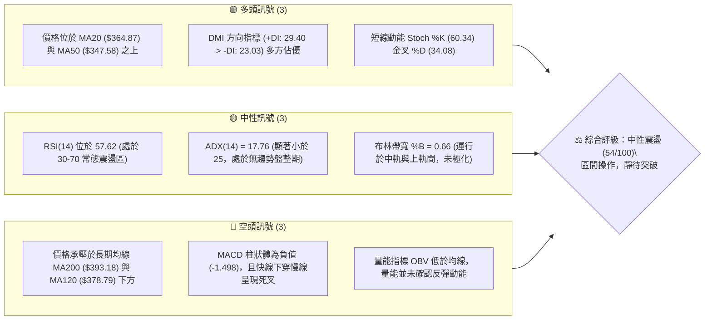
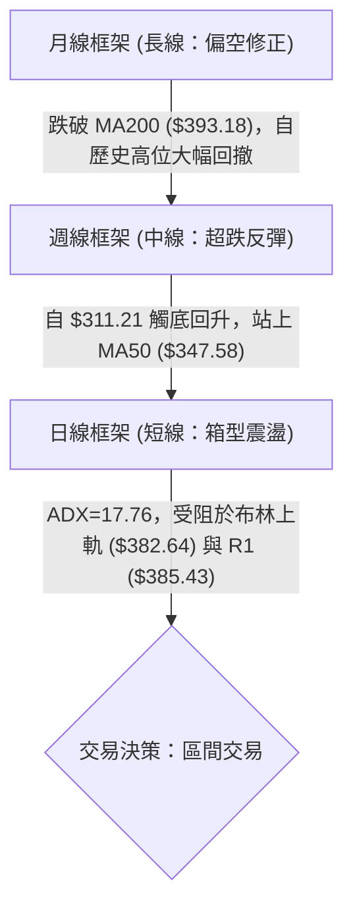
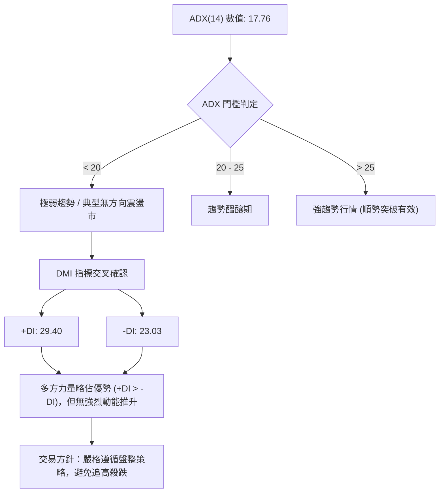
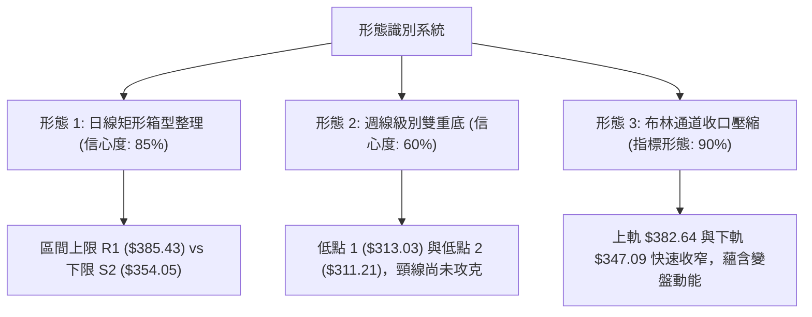
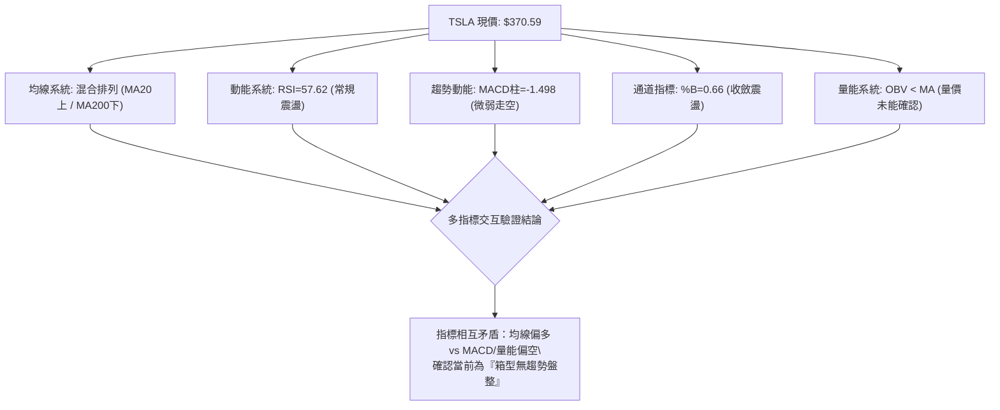
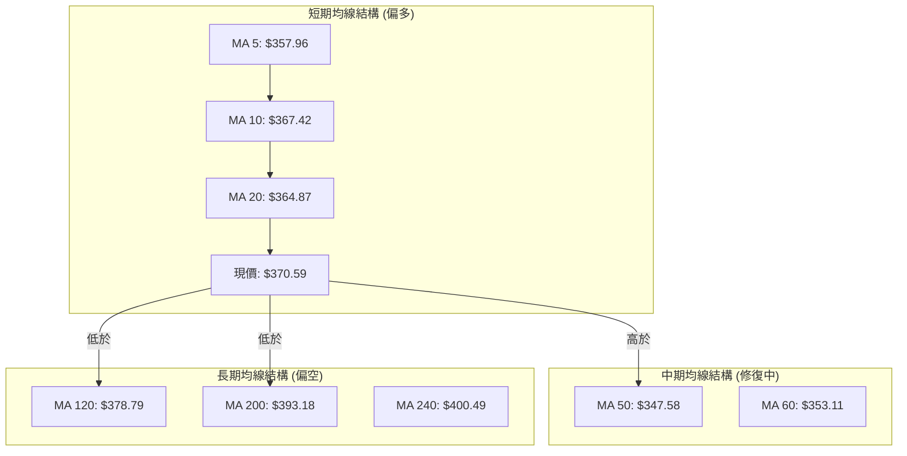
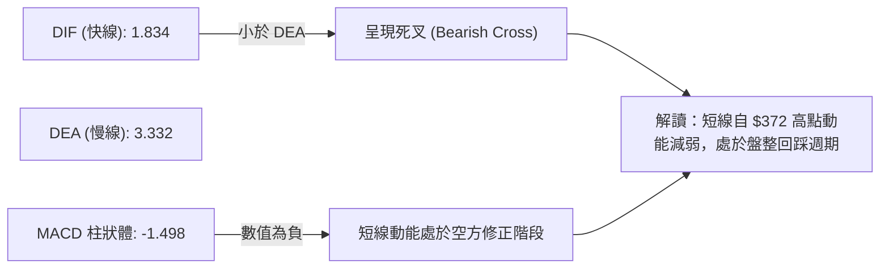
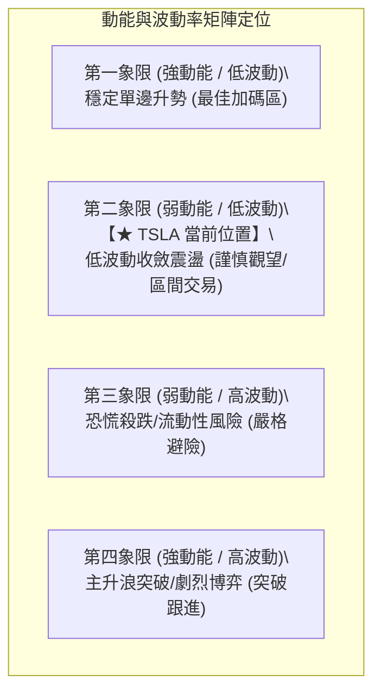
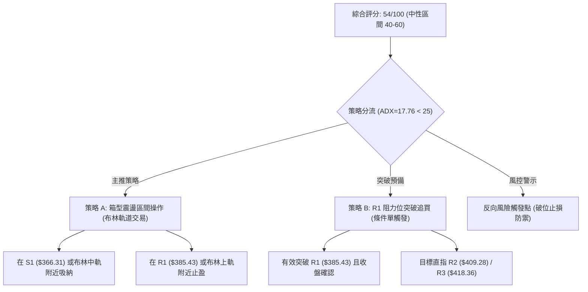
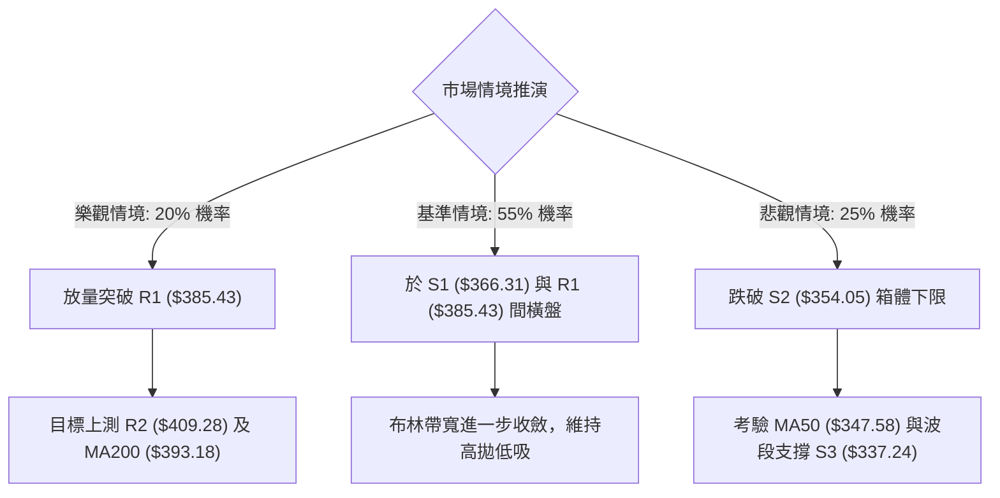

# TSLA 技術分析報告

> **報告日期**：2026-10-04 ｜ **語言**：繁體中文 ｜ **數據來源**：Yahoo Finance ｜ **當前價格**：$370.59

---

## 目錄

| 章節 | 內容 |
|------|------|
| [1. 技術面概覽](#1-技術面概覽) | 訊號儀表板、核心指標、評分卡 |
| [2. 趨勢分析](#2-趨勢分析) | 多時框趨勢、長中短期走勢、ADX 解讀 |
| [3. 圖表形態分析](#3-圖表形態分析) | 形態識別信心度、K線組合、目標價推算 |
| [4. 支撐與阻力](#4-支撐與阻力) | 關鍵價位結構、斐波那契回調位聚類 |
| [5. 技術指標深度解讀](#5-技術指標深度解讀) | MA/RSI/MACD/布林通道/量能背離 |
| [6. 動能與波動率](#6-動能與波動率) | 動能四象限、ATR 止損定位、Beta 敏感度 |
| [7. 多時框架總結](#7-多時框架總結) | 時框架矩陣、ADX 規則收斂結論 |
| [8. 交易策略建議](#8-交易策略建議) | 策略路由、區間操作策略、風險報酬比 |
| [9. 風險提示與監控](#9-風險提示與監控) | 關鍵監控清單、情境推演與風控底線 |

---

## 1. 技術面概覽

### 🎯 技術訊號儀表板



---

### 📊 核心指標速覽表

| 指標類別 | 指標名稱 | 當前數值 | 訊號 | 解讀 |
|:---|:---|:---|:---:|:---|
| **價格** | 當前價格 | $370.59 | 🟡 | 位於 52 週高低區間（$297.38 - $498.83）之 36.3% 分位 |
| **均線** | 短期 MA20 | $364.87 | 🟢 | 現價高於 MA20 達 +1.57%，短線具備下檔支撐 |
| **均線** | 中期 MA50 | $347.58 | 🟢 | 現價高於 MA50 達 +6.62%，中期築底回升雛形確立 |
| **均線** | 長期 MA200 | $393.18 | 🔴 | 現價低於 MA200 達 -5.74%，長期空頭結構壓制尚未解除 |
| **動能** | RSI(14) | 57.62 | 🟡 | 處於常規震盪區間，無超買超賣，短線無極端背離 |
| **動能** | MACD (12,26,9) | 1.834 / 3.332 | 🔴 | DIF 線小於 DEA 線，MACD 柱狀體為 -1.498，短線動能走弱 |
| **趨勢** | ADX(14) | 17.76 | 🟡 | ADX < 25 表明市場處於典型盤整市，單邊趨勢力道不足 |
| **通道** | 布林通道 %B | 0.66 | 🟡 | 位於中軌（$364.87）與上軌（$382.64）之間，屬偏強盤整 |
| **波動** | ATR(14) | $11.46 | 🟡 | 佔現價 3.09%，每日價格震盪區間適中，提供明確風控空間 |
| **量能** | 當日量 / 20日均量 | 1.45x | 🔴 | 最新成交量放大但 OBV 低於均線，資金推升意願存在疑慮 |

---

### 🏆 技術評分卡

```
╔══════════════════════════════════════════════════════════════════╗
║                   技術評分卡 — TSLA (2026-10-04)                 ║
╠══════════════════════════════════════════════════════════════════╣
║ 趨勢強度 (ADX=17.76 盤整市)     ███████░░░░░░░░░░░░░  35/100  🔴 ║
║ 動能指標 (RSI中性/MACD轉負)     ██████████░░░░░░░░░░  50/100  🟡 ║
║ 支撐穩定度 (S1 $366.31 緊密支撐) ██████████████░░░░░  70/100  🟢 ║
║ 成交量配合度 (OBV疲弱/量比1.45) █████████░░░░░░░░░░░  45/100  🟡 ║
║ 形態完整度 (日線區間整理)       ████████████░░░░░░░░  60/100  🟡 ║
║ 均線排列 (短多長空/混亂排列)     ████████████░░░░░░░░  60/100  🟡 ║
╠══════════════════════════════════════════════════════════════════╣
║ 綜合評分                       ███████████░░░░░░░░░  54/100  🟡 ║
║ 評級結論                       中性盤整（區間高拋低吸，等待突破）  ║
╚══════════════════════════════════════════════════════════════════╝
```

---

## 2. 趨勢分析

### 🌐 多時框趨勢分析



---

### 📈 長期趨勢 — 12個月走勢圖（Unicode）

以下為 TSLA 過去 12 個月（2025-11 至 2026-10）收盤價走勢圖與關鍵高低點標註：

```
TSLA 月線走勢圖（過去12個月：2025-11 至 2026-10）
價格軸 ($)
$460 ┤   ●(2025-12: $449.72)
$440 ┤●(2025-11: $430.17)  ●(2026-01: $430.41)
$420 ┤                     ●(2026-05: $435.79)  ●(2026-06: $420.60)
$400 ┤                             ●(2026-02: $402.51)
$380 ┤                                     ●(2026-04: $381.63)
$360 ┤                                 ●(2026-03: $371.75)   ●(2026-08: $367.95)   ●(現價: $370.59)
$340 ┤                                                               ●(2026-09: $354.81)
$320 ┤
$300 ┤                                                       ●(2026-07 低點: $311.21)
     └─┬─────┬─────┬─────┬─────┬─────┬─────┬─────┬─────┬─────┬─────┬─────┬──
      M11   M12   M01   M02   M03   M04   M05   M06   M07   M08   M09   M10
```

#### 長期走勢特徵分析表

| 階段區間 | 起止月份 | 價格變化 | 漲跌幅 | 走勢特徵解讀 |
|:---|:---|:---:|:---:|:---|
| 高位雙頂震盪 | 2025-11 ~ 2026-01 | $430.17 → $430.41 | +0.06% | 測試 $450 阻力未果，形成中長線頂部區域 |
| 震盪下行陰跌 | 2026-01 ~ 2026-04 | $430.41 → $381.63 | -11.33% | 均線逐漸轉為空頭發散，市場估值持續壓縮 |
| 次級反彈誘多 | 2026-04 ~ 2026-05 | $381.63 → $435.79 | +14.19% | 強勁抽頭測試 MA200 壓力，隨後爆發放量長黑 |
| 急促流動性出清 | 2026-06 ~ 2026-07 | $420.60 → $311.21 | -26.01% | 擊穿所有中期均線，創下波段低點 $311.21，進入極度超賣 |
| 築底震盪修復 | 2026-08 ~ 2026-10 | $311.21 → $370.59 | +19.08% | 站穩 MA20 與 MA50，於 $354-$385 間構築底部震盪平台 |

---

### 📊 中期趨勢（週線分析）

中期走勢圖示（近20週關鍵運行軌跡）：

```
週線走勢結構示意圖：
價格 ($)
$435.79 ├───● (5月底反彈高點)
        │    \
$407.76 ├───  \      ● (7月中旬反彈次高點)
        │      \    / \
$385.43 ├───    \  /   \─────── 上方波段阻力 R1
$370.59 ├───     \/             ★ (目前週線收盤價)
$354.05 ├───                    ─────── 下方波段支撐 S2
        │         \
$311.21 ├───       ● (7月底暴跌低點，完成雙針探底)
        └──────────────────────────────────────────────
         05/31    07/12   08/02    09/27   10/04
```

週線指標顯示，2026-07-26 當週收盤 $313.03，RSI 一度下挫至 15.7 極度超賣區，MACD 柱狀體深達 -8.365。隨後週線展開報復性反彈，於 2026-08-23 收復 $362.86（RSI 升至 72.7）。目前 2026-10-04 當週收於 $370.59，週線 RSI 回落至 57.6，週線 MACD 柱狀體出現收縮至 -1.498，中期呈現「超跌修復後的多空膠著」。

---

### ⚡ 趨勢強度評估（ADX 解讀）



#### ADX 趨勢強度對照表

| 指標名稱 | 實際數值 | 參考臨界值 | 狀態判定 | 交易指引 |
|:---|:---:|:---:|:---:|:---|
| **ADX(14)** | 17.76 | 25.00 | 弱趨勢 / 區間盤整 | 順勢突破策略無效，假突破頻率高；採用均值回歸策略 |
| **+DI** | 29.40 | -DI (23.03) | 多方微弱主導 | 價格有偏多試探意願，但缺乏趨勢加速度 |
| **-DI** | 23.03 | +DI (29.40) | 空方動能暫退 | 下檔殺跌動能鈍化，強支撐位易引發防禦買盤 |

---

## 3. 圖表形態分析

### 🔍 形態識別系統

依據嚴格規定，形態識別必須立足於精確數據點，並標註信心度，若缺乏標準幾何結構則回歸指標型解讀。



#### 圖表形態信心度評估表

| 形態類別 | 信心度 | 判斷依據（引用精確數據） | 完成度 | 突破後目標價推算（附精確計算式） |
|:---|:---:|:---|:---:|:---|
| **日線矩形震盪箱體** | 85% | 價格受困於 R1（$385.43）阻力與 S2（$354.05）支撐之間，且 ADX=17.76 確認盤整 | 80% | 箱體高度 = $385.43 - $354.05 = $31.38。<br>向上突破目標價 = 頸線 $385.43 + $31.38 = **$416.81**（逼近 R3 $418.36） |
| **週線雙重底 (W底)** | 60% | 2026-07-26 低點 $313.03 與 2026-08-02 低點 $311.21 形成雙針探底；但反彈尚未站穩頸線 R2 ($409.28) | 45% | 雙底頸線取近半年反彈高點 R2 $409.28。<br>形態高度 = $409.28 - $311.21 = $98.07。<br>若有效突破目標 = $409.28 + $98.07 = **$507.35**（數據目前未確認） |
| **指標型布林壓縮** | 90% | 布林上軌（$382.64）與下軌（$347.09）帶寬持續收斂，現價 $370.59 居於中軌上方 | 75% | 突破布林上軌 $382.64 則上測 R1 $385.43；跌破中軌 $364.87 則下測下軌 $347.09 |

---

### 🕯️ 重要K線形態分析（近 5 個月收盤演變）

| 月份 | 收盤價 | K線組合形態 | 解讀 | 多空訊號 |
|:---|:---:|:---|:---|:---:|
| **2026-06** | $420.60 | 高位帶長上影倒錘頭 | 逼近前高未果，多頭力竭，主力資金獲利了結明顯 | 🔴 空頭反轉 |
| **2026-07** | $311.21 | 大陰線破位放量重挫 | 單月暴跌 -26.01%，跌破所有短期均線，呈現恐慌性拋售 | 🔴 極度看空 |
| **2026-08** | $367.95 | 低位實體大陽線（吞噬線） | 強力反彈回補 7 月過半跌幅，確立 $311.21 為中期流動性底 | 🟢 強勢反彈 |
| **2026-09** | $354.81 | 小陰線回踩測試 | 反彈遇阻後的縮量回踩，未破 8 月實體中位，屬於健康消化 | 🟡 蓄勢整理 |
| **2026-10** | $370.59 | 孕線收紅微幅上揚 | 實體受制於 8 月高點下方，多空處於均線收斂等待選擇期 | 🟡 變盤前夕 |

---

### 📉 ASCII 走勢形態示意圖

```
TSLA 日線箱型整理形態示意圖（現價 $370.59）
════════════════════════════════════════════════════════════════
$385.43 ───────────────┬───────────────● (箱體上軌阻力 R1)
                       │              / \
$382.64 ─ ─ ─ ─ ─ ─ ─ ─┼─ ─ ─ ─ ─ ─ ─●─ ─ ─ (布林上軌阻力)
                       │             /   \
$370.59 ───────────────┼────────────★───── (當前價格位階)
                       │           /       \
$364.87 ─ ─ ─ ─ ─ ─ ─ ─┼─ ─ ─ ─ ─ ● ─ ─ ─ ─ (布林中軌 / MA20)
                       │          /
$354.05 ───────────────┴─────────● (箱體下軌支撐 S2)
════════════════════════════════════════════════════════════════
   狀態：股價在 $354.05 ~ $385.43 形成 31 點之緊湊箱型收斂
```

---

## 4. 支撐與阻力

### 🗺️ 關鍵價位分布圖（Unicode）

```
TSLA 價位結構分布圖 (由 OHLCV 與斐波那契精確聚類)
════════════════════════════════════════════════════════════════════
$498.83 ║████████████████████████████████║ 52週高點 / 斐波 0.0%
$451.29 ║██████████████████████          ║ 斐波那契 23.6% 回調位
$421.88 ║████████████████████            ║ 斐波那契 38.2% 回調位
$418.36 ║██████████████████              ║ 波段強阻力 R3
$409.28 ║████████████████                ║ 波段重要阻力 R2
$398.10 ║████████████                    ║ 斐波那契 50.0% 多空分水嶺
$393.18 ║███████████                     ║ 長期均線 MA200 壓制線
$385.43 ║█████████                       ║ 近期關鍵阻力 R1
$382.64 ║████████                        ║ 布林通道上軌
$374.33 ║██████                          ║ 斐波那契 61.8% 關鍵黃金位
$370.59 ╠════════════════════════════════╣ ◄ 當前市價 ($370.59)
$366.31 ║▓▓▓▓▓                           ║ 近期第一支撐 S1
$364.87 ║▓▓▓▓▓▓                          ║ 布林中軌 / MA20 支撐
$354.05 ║▓▓▓▓▓▓▓▓▓                        ║ 箱體強支撐 S2
$347.58 ║▓▓▓▓▓▓▓▓▓▓                       ║ 中期均線 MA50 支撐
$340.49 ║▓▓▓▓▓▓▓▓▓▓▓▓                     ║ 斐波那契 78.6% 回調位
$337.24 ║▓▓▓▓▓▓▓▓▓▓▓▓▓▓                   ║ 波段極限防守支撐 S3
$297.38 ║▓▓▓▓▓▓▓▓▓▓▓▓▓▓▓▓▓▓▓▓▓▓▓▓▓▓▓▓▓▓▓▓║ 52週低點 / 斐波 100.0%
════════════════════════════════════════════════════════════════════
```

---

### 🚧 阻力位分析表

所有阻力數據完全引用數據包中由 OHLCV 計算之聚類數值：

| 阻力級別 | 精確價位 | 距現價空間 | 形成原因與籌碼解讀 | 突破難度 | 重要性等級 |
|:---|:---:|:---:|:---|:---:|:---:|
| **R1** | $385.43 | +4.01% | 近一年波段高點聚類區，與布林上軌（$382.64）共振形成短線重壓區 | 🟡 中等 | ★★★★☆ |
| **R2** | $409.28 | +10.44% | 2026-07-12 當週反彈頂點聚類，接近心理整數大關 $400 與 MA200 延伸區 | 🔴 極高 | ★★★★★ |
| **R3** | $418.36 | +12.89% | 2026-06 跌破前的盤整平台頸線位置，積聚大量被套牢浮額籌碼 | 🔴 極高 | ★★★☆☆ |

---

### 🛡️ 支撐位分析表

所有支撐數據完全引用數據包中由 OHLCV 計算之聚類數值：

| 支撐級別 | 精確價位 | 距現價跌幅 | 形成原因與籌碼解讀 | 守住機率 | 重要性等級 |
|:---|:---:|:---:|:---|:---:|:---:|
| **S1** | $366.31 | -1.15% | 近期波段回踩低點聚類，且緊貼 MA20（$364.87），短線多頭生命線 | 75% | ★★★★☆ |
| **S2** | $354.05 | -4.46% | 2026-09-06 波段收盤低點（$354.08）聚類區，箱型整理下沿 | 80% | ★★★★★ |
| **S3** | $337.24 | -9.00% | 近一年波段極端低點聚類，若失守將觸發停損盤引發再次探底 | 88% | ★★★☆☆ |

---

### 📐 斐波那契回調位分析

依據 52 週極值區間（低點 $297.38 至 高點 $498.83）精確計算回調點位：

| 斐波那契比例 | 精確對應價位 | 現價相對位置 | 技術意涵與籌碼角色 |
|:---:|:---:|:---:|:---|
| **0.0% (52W High)** | $498.83 | +34.60% | 年度最高阻力位，目前無上測條件 |
| **23.6%** | $451.29 | +21.78% | 強勢拉回極限位，目前處於遠端阻力 |
| **38.2%** | $421.88 | +13.84% | 中期空頭修正強防守位，與 R3 ($418.36) 形成雙重壓力帶 |
| **50.0%** | $398.10 | +7.42% | 多空平衡分水嶺，此價位與 MA200 ($393.18) 構成中期多空轉換牛熊線 |
| **61.8%** | $374.33 | +1.01% | **黃金分割關鍵位：現價 ($370.59) 正緊貼此水平下方進行爭奪** |
| **78.6%** | $340.49 | -8.12% | 深度回調防守位，位於 S3 ($337.24) 與 MA50 ($347.58) 緩衝區 |
| **100.0% (52W Low)**| $297.38 | -19.75% | 年度流動性極限底，失守則長期熊市確立 |

> **回調位分析結論**：現價 $370.59 處於 **斐波那契 61.8%（$374.33）與 78.6%（$340.49）之間**。在技術分析中，61.8% 是空頭回撤過程中最重要的「多頭最後防線／反彈關鍵轉折位」。TSLA 自 $311.21 觸底回升後，連續數週在 $370-$374 附近受阻，顯示 $374.33 具有顯著的籌碼解套壓力；若不能有效以實體陽線站上 $374.33，反彈空間將受制於此。

---

## 5. 技術指標深度解讀

### 🎛️ 指標訊號總覽



---

### 📈 移動平均線排列分析



#### 均線數據明細與乖離率

| 均線名稱 | 精確數值 | 價格相對位置 | 乖離率 (Bias) | 技術解讀 |
|:---|:---:|:---:|:---:|:---|
| **MA 5** | $357.96 | ▲ 價格位於上方 | +3.53% | 極短線支撐強勁，短線多頭佔優 |
| **MA 10** | $367.42 | ▲ 價格位於上方 | +0.86% | 價格貼近短天期均線，具備回踩支撐效應 |
| **MA 20** | $364.87 | ▲ 價格位於上方 | +1.57% | 短期多空分水嶺，MA20 向上傾斜，支撐確立 |
| **MA 50** | $347.58 | ▲ 價格位於上方 | +6.62% | 中期築底完成，提供波段堅實防禦 |
| **MA 60** | $353.11 | ▲ 價格位於上方 | +4.95% | 季線轉化為波段強支撐帶 |
| **MA 120** | $378.79 | ▼ 價格位於下方 | -2.17% | 半年線向下壓制，構成上方第一道密集套牢區 |
| **MA 200** | $393.18 | ▼ 價格位於下方 | -5.74% | **年線關鍵牛熊分界**，尚未收復前不可盲目看大牛市 |
| **MA 240** | $400.49 | ▼ 價格位於下方 | -7.47% | 長期下行趨勢線，限制了中長期的反彈高度 |

---

### 📉 RSI(14) 分析

當前數值：**57.62**

```
RSI(14) 動能刻度尺：
0 ────── 超賣(30) ────────── 現值(57.62) ──── 超買(70) ────── 100
[░░░░░░░░░░░░░░░░░░░░░░░░░░░███████████░░░░░░░░░] 57.62%
```

- **區間評估**：數值 57.62 位於 50 中軸之上，但未進入 70 超買區，屬於多方佔優的常態強勢震盪。
- **背離判斷**：
  - 檢視近期走勢：2026-08-23 收盤價 $362.86，對應 RSI 為 72.7；隨後價格震盪推升至 2026-09-27 的 $372.11，對應 RSI 下降至 63.9；最新 2026-10-04 價格收 $370.59，RSI 降至 57.62。
  - **背離結論**：日線結構上存在**輕度頂背離（Price Higher High vs RSI Lower High）**跡象，說明價格推高過程中的動能正在衰退，警示短線不宜在 R1（$385.43）前貿然追多。

---

### 📊 MACD(12/26/9) 訊號解讀



週線層面：2026-09-27 當週 MACD 柱狀體為 +1.078，本週轉為 -1.498，柱狀體翻綠縮頭，顯示上攻動能暫告一段落，空方在零軸上方進行壓制，指標提示回調風險。

---

### 📦 布林通道分析

```
TSLA 布林通道 (20, 2) 結構圖：
$382.64 ─────────────────────── 上軌 (強阻力區)
                   ▲
$370.59 ────────── ★ ────────── 當前現價 (%B = 0.66)
                   ▼
$364.87 ─────────────────────── 中軌 / MA20 (短線支撐)
                   
$347.09 ─────────────────────── 下軌 (波段強支撐)
```

- **通道特徵**：目前帶寬收窄（Upper: $382.64, Lower: $347.09，全寬僅約 $35.55），呈現標準的「壓縮等待突破」格局。
- **%B 指標**：0.66 代表價格位於中軌上方約三分之二位置，短線偏多但已接近上軌壓力圈，在 ADX<25 的盤整市中，靠近上軌往往面臨均值回歸的拉回壓力。

---

### 💹 成交量分析（量價配合度）

```
量能比較：
最新單日成交量  ████████████████████████  55,242,800
20日平均成交量  ████████████████░░░░░░░░  38,116,105 (量比: 1.45x)
50日平均成交量  ████████████████░░░░░░░░  37,659,658
```

- **量價分析**：最新成交量放大至 20 日均量的 1.45 倍，但當日 K 線收在 $370.59（較上週收盤 $372.11 微幅下跌），顯示放量但未能推動價格創高，出現「量大滯漲」的量價背離特徵。
- **OBV（能量潮）**：數據顯示「OBV < MA → 量能疲弱」，OBV 線未能伴隨價格反彈同步越過前高均線，暗示此波反彈主要是由空頭回補推動，缺乏長線主力機構的持續實質買盤進場，後續走勢易出現動能中斷。

---

## 6. 動能與波動率

### ⚡ 動能評估四象限



#### 矩陣評估說明

| 象限 | 動能維度 | 波動維度 | TSLA 當前判定 | 操作策略指導 |
|:---:|:---:|:---:|:---:|:---|
| **Q1** | 強 | 低 | ✕ | 暫無連續推升動能 |
| **Q2** | **弱** | **低** | **✓ (當前狀態)** | **ADX=17.76 疊加 ATR%=3.09%，處於低波動無趨勢收斂期，適合網格區間低吸高拋** |
| **Q3** | 弱 | 高 | ✕ | 7 月底暴跌期已過，下行極端拋壓暫緩 |
| **Q4** | 強 | 高 | ✕ | 尚未出現帶量突破 R1 的加速特徵 |

---

### 📊 ATR 波動率分析

- **ATR(14) 數值**：**$11.46**（佔當前股價 3.09%）。
- **日內波動評估**：過去 14 天內，TSLA 每日正常波動區間為 ±$11.46。
- **風控止損應用**：
  - 在箱型震盪市中，合理的止損防守距離通常設定為 **1.5 倍至 2.0 倍 ATR**，以避免被日內雜訊洗盤出場。
  - 1.5 ATR 距離 = $11.46 × 1.5 = **$17.19**。
  - 2.0 ATR 距離 = $11.46 × 2.0 = **$22.92**。

---

### 📐 Beta 與市場相關性

- **Beta 數值**：**1.845**。
- **特徵解讀**：TSLA 具備典型高 Beta 屬性，其波動幅度約為 S&P 500 指數的 1.85 倍。在大盤處於無明確方向時，TSLA 易因自身產業與估值爭議放大日內振幅。
- **放空比率 (Short % Float)**：**1.9%**（Short Ratio 1.79 天），空頭部位極低，顯示市場並未過度集中做空，短期難以引發由軋空（Short Squeeze）驅動的暴漲行情。

---

## 7. 多時框架總結

### 📋 時框架評分表

| 時框架 | 趨勢方向 | 動能狀態 | 均線排列 | 圖表形態 | 綜合評分 | 操作建議 |
|:---|:---:|:---:|:---:|:---:|:---:|:---|
| **月線 (長線)** | 🔴 偏空調整 | 🟡 中性平淡 | 混亂，承壓於 MA200 | 雙頂修正後築底 | 42/100 | 長期投資者保持防禦，防範估值壓縮 |
| **週線 (中線)** | 🟡 震盪反彈 | 🟡 動能轉弱 | 站上 MA50，低於 MA200 | 超跌雙針探底修復 | 56/100 | 波段持有者在阻力位減碼，回踩支撐接回 |
| **日線 (短線)** | 🟢 偏強盤整 | 🔴 MACD柱轉負 | MA20 上方，受制 MA120 | 矩形箱體收斂壓縮 | 54/100 | 短線交易者以布林通道與 S1/R1 進行區間高拋低吸 |

---

### 🔲 綜合訊號矩陣

```
時框訊號一致性矩陣：
┌───────────┬──────────────┬──────────────┬──────────────┐
│  分析維度 │  短線 (日線) │  中線 (週線) │  長線 (月線) │
├───────────┼──────────────┼──────────────┼──────────────┤
│ 均線趨勢  │ 🟢 站上 MA20 │ 🟢 站上 MA50 │ 🔴 跌破 MA200│
│ 動能方向  │ 🔴 MACD 死叉 │ 🟡 柱狀收縮  │ 🟡 RSI 中性  │
│ 形態特徵  │ 🟡 箱型震盪  │ 🟢 超跌反彈  │ 🔴 高位回撤  │
│ 成交量配合│ 🔴 量大滯漲  │ 🟡 量能平移  │ 🔴 長線量縮  │
└───────────┴──────────────┴──────────────┴──────────────┘
訊號收斂狀態：多空訊號嚴重分歧，無任何單一方向形成三時框共振。
```

---

### ⚖️ 多時框收斂結論

> **依據多時框收斂規則（嚴格要求 14）**：
> 1. **行情性質判定**：當前 ADX(14) 數值為 **17.76 (< 25)**，嚴格界定為 **典型盤整行情（Consolidation Market）**。
> 2. **主導維度**：趨勢順勢交易法失效，行情完全由 **日線布林通道（$347.09 - $382.64）及波段聚類價位（S1 $366.31 至 R1 $385.43）** 所主導。日線與週線的矛盾（短線有支撐但缺乏持續上攻動能）需透過區間邊界來化解。
> 3. **唯一方向性結論**：**中性觀望／區間高拋低吸**。綜合評分為 **54/100**，未達多頭突破標準（≥60），亦未破位轉空（≤40），策略嚴格鎖定於區間網格操作，嚴禁單邊激進追漲。

---

## 8. 交易策略建議

### 🗺️ 策略決策流程圖



---

### 🧭 策略路由（依評分卡分流）

**當前主策略方向 = 中性震盪區間操作（依評分 54/100）**
由於綜合評分處於 40–60 之間，且 ADX < 25，市場缺乏主升浪或主跌浪條件。主推策略為「**高拋低吸之箱型區間操作**」，輔以突破確認條件單，嚴禁在箱體中軸位置進行單邊重倉押注。

---

### 🎯 價格情境階梯（Price Scenarios）

所有價位均嚴格引用第 4 章由 OHLCV 與斐波那契計算之精確價位：

| 觸發條件 | 第一目標 (T1) | 第二目標 (T2) | 後續延伸 (T3) | 情境含義解讀 |
|:---|:---:|:---:|:---:|:---|
| **強勢向上突破 R1 ($385.43)** | R2: **$409.28** | R3: **$418.36** | 斐波 38.2%: **$421.88** | 突破箱體上限，確認雙底完成，中期轉強挑戰年線 |
| **維持現價區間震盪** | 布林上軌: **$382.64** | 斐波 61.8%: **$374.33** | MA20: **$364.87** | 延續低波動箱體整理，指標反覆消化 |
| **向下跌破 S1 ($366.31)** | S2: **$354.05** | MA50: **$347.58** | S3: **$337.24** | 跌破短線防守線，回撤考驗中期支撐平台強度 |

---

### 📊 情境機率分佈

| 情境類型 | 機率預估 | 主要技術依據 |
|:---|:---:|:---|
| **區間震盪整理 (維持在 $354 - $385)** | **55%** | **ADX=17.76 極弱**，布林帶寬收窄，MACD 柱狀體翻綠但幅度有限，市場欠缺催化劑 |
| **回落測試下檔支撐 (跌向 S2 $354.05)** | **25%** | 日線 RSI 存在頂背離跡象，OBV 低於均線，量價配合不良，短期有均值回歸拉回需求 |
| **強勢向上突破 (站上 R1 $385.43)** | **20%** | 均線短多排列，若能伴隨放量收復 MA120 ($378.79) 則有望挑戰長期阻力 |

---

### 🟢 主策略詳情（區間與突破雙策略）

所有點位完全引用數據包數值，無憑空臆造數據：

| 策略要素 | 策略 A：區間網格回踩吸納（主策略） | 策略 B：突破追隨確認進場（次選條件策略） |
|:---|:---|:---|
| **適用行情** | 延續當前 ADX < 25 的箱型震盪行情 | 帶量有效突破箱型上軌與布林上軌 |
| **進場條件** | 價格回踩 S1 獲得支撐，或日線收於 MA20 之上時逢低介入 | 日線收盤價實體突破 R1（$385.43），成交量達均量 1.5 倍以上 |
| **精確進場價格** | **$366.31** (S1 支撐位) | **$385.43** (R1 突破點位) |
| **目標價 T1** | **$382.64** (布林通道上軌) | **$409.28** (波段阻力 R2) |
| **目標價 T2** | **$385.43** (關鍵阻力 R1) | **$418.36** (波段強阻力 R3) |
| **精確止損價格** | **$354.05** (跌破強支撐 S2 嚴格出場) | **$370.59** (跌回當前現價平台即認賠) |
| **風險報酬比 (R:R)** | **1 : 1.56**<br>*(風險: $366.31-$354.05=$12.26；獲利: $385.43-$366.31=$19.12)* | **1 : 1.61**<br>*(風險: $385.43-$370.59=$14.84；獲利: $409.28-$385.43=$23.85)* |
| **勝率預估** | **65%** (在盤整市中均值回歸成功率較高) | **45%** (低 ADX 環境下追假突破失敗率偏高) |
| **建議配置倉位** | **15% ~ 20%** (輕倉波段操作) | **10%** (突破後底倉試單，確認後加碼) |

---

### 🔴 反向風險觸發點（對沖與風控提示）

若持有多頭部位，當出現以下情境時，必須立即終止多頭策略並考慮避險對沖：
1. **收盤跌破 S2 ($354.05)**：意味著日線矩形箱體下沿徹底失守，短線形態轉為破位下行，下方空間將直探 S3（$337.24）乃至斐波那契 78.6%（$340.49）。
2. **週線 MACD 柱狀體放大翻綠且跌破 MA50 ($347.58)**：中期反彈趨勢遭到破壞，代表自 $311.21 以來的反彈終結，可能開啟二次探底行情。

---

### ⭐ 整體訊號強度評星

```
做多訊號強度：★★★☆☆  (3.0/5星 — 短線站上 MA20，但缺乏中長期均線與量能背書)
做空訊號強度：★★☆☆☆  (2.5/5星 — 均線空頭排列但下方 S1/S2 具備強烈籌碼承接)
整體策略可信度：★★★★☆ (4.0/5星 — 盤整市特徵明確，區間邊界清晰，風控點位精確)
```

---

## 9. 風險提示與監控

### ✅ 關鍵監控指標 Checklist

```
╔══════════════════════════════════════════════════════════════════╗
║                   關鍵技術監控 Checklist (每日盤後核對)           ║
╠══════════════════════════════════════════════════════════════════╣
║ [ ] 價格是否站穩短期生命線 MA20 ($364.87)？ (失守則減碼)          ║
║ [ ] RSI(14) 是否跌破 50 中軸？ (跌破代表空方動能佔優)            ║
║ [ ] 日成交量是否持續萎縮於 20日均量 ($38.1M) 下方？ (量縮防陰跌)   ║
║ [ ] MACD 負柱狀體是否擴大？ (若連續 3 天負值擴大則暫停買入)       ║
║ [ ] 價格觸碰布林上軌 ($382.64) 時是否出現量價背離或長上影線？      ║
║ [ ] 大盤市場波動指標是否突增？ (Beta=1.845 易放大系統性回撤)       ║
╚══════════════════════════════════════════════════════════════════╝
```

---

### ⚠️ 風險場景分析



---

### 🛡️ 風險管理重要提醒

1. **嚴禁在箱體中軸重倉追高**：現價 $370.59 處於箱體中央偏高位置，向上至 R1 僅約 4% 空間，向下至 S2 有 4.5% 跌幅，風險報酬比在中軸極差。合理的進場點必須嚴格等待價格靠近 S1（$366.31）附近。
2. **嚴格執行波動率止損**：當前 ATR 為 $11.46，任何日內突破若收盤未超過進場點 1.5 倍 ATR（約 $17.19）均不可視為有效突破，嚴防假突破洗盤。
3. **倉位總量控制**：在 ADX < 25 的盤整震盪期，整體 TSLA 倉位建議不超過總投資組合的 **20%**，現金儲備保持充裕，靜待突破確認。

---

## 📋 報告總結

```
╔══════════════════════════════════════════════════════════════════╗
║                   TSLA 技術分析報告總結                          ║
╠══════════════════════════════════════════════════════════════════╣
║ 報告日期：2026-10-04                                             ║
║ 當前價格：$370.59                                                ║
║ 分析評級：⚖️ 中性觀望 / 區間震盪 (技術評分: 54/100)               ║
╠══════════════════════════════════════════════════════════════════╣
║ 關鍵結構分析：                                                   ║
║ ├─ 長期趨勢：🔴 偏空調整 (現價顯著低於 MA200 $393.18 與 MA240)    ║
║ ├─ 中期趨勢：🟢 築底反彈 (自 $311.21 觸底回升，站上 MA50 $347.58)  ║
║ ├─ 短期趨勢：🟡 箱型盤整 (受困於 $354.05 ~ $385.43，ADX=17.76)   ║
║ ├─ 關鍵第一支撐：$366.31 (S1) / 強支撐：$354.05 (S2)             ║
║ ├─ 關鍵第一阻力：$385.43 (R1) / 強阻力：$409.28 (R2)             ║
║ └─ 分析師共識目標價：$395.57 (較現價空間 +6.74%)                 ║
╠══════════════════════════════════════════════════════════════════╣
║ 最優交易策略組合：                                               ║
║ 1. 🥇 最佳機會（網格策略）：等待回踩 S1 $366.31 輕倉進場，止損    ║
║      設於 S2 $354.05，目標看至布林上軌 $382.64 與 R1 $385.43     ║
║ 2. 🥈 次選機會（右側突破）：若放量站穩 R1 $385.43，順勢跟進，止損 ║
║      設於現價 $370.59，目標看至 R2 $409.28                       ║
║ 3. 🥉 保守選擇（空倉等待）：在 ADX 未突破 25 前保持觀望，避免在   ║
║      震盪行情中因反覆假突破損耗資本                              ║
╚══════════════════════════════════════════════════════════════════╝
```

---

> ⚠️ **免責聲明**：本報告為 AI 自動生成之技術分析研究，所有數據、圖表及價位推算均基於市場所提供之歷史交易數據。本報告**僅供學術研究與交易架構參考**，**絕不構成任何具體投資建議或邀約買賣**。金融市場瞬息萬變，高 Beta 股票波動劇烈，投資人應依個人財務狀況與風險承受度獨立判斷，並自行承擔交易風險。

---

*報告生成時間：2026-10-04 ｜ 數據來源：Yahoo Finance ｜ 分析框架：多時框技術分析體系*