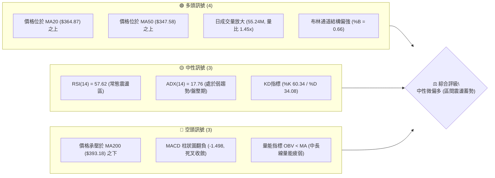
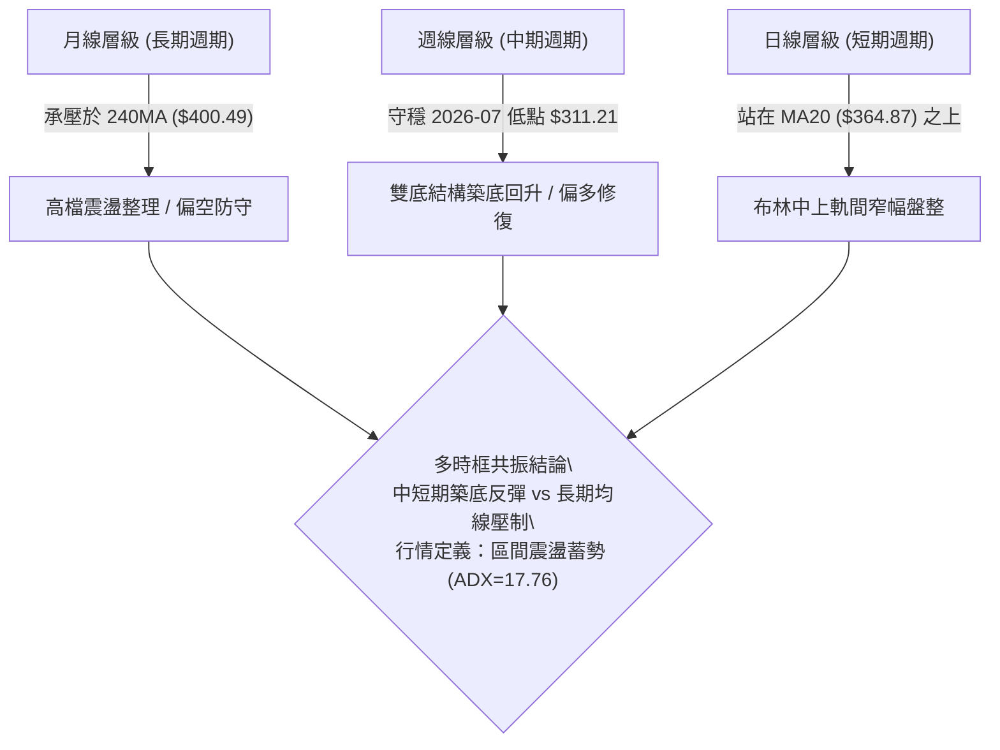
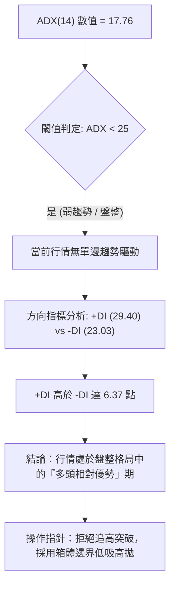
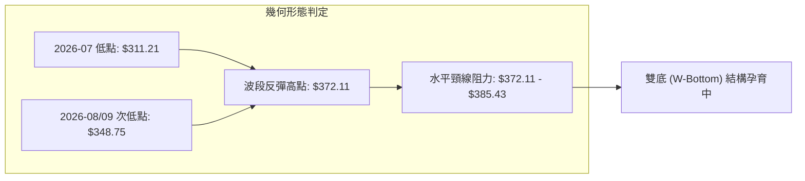
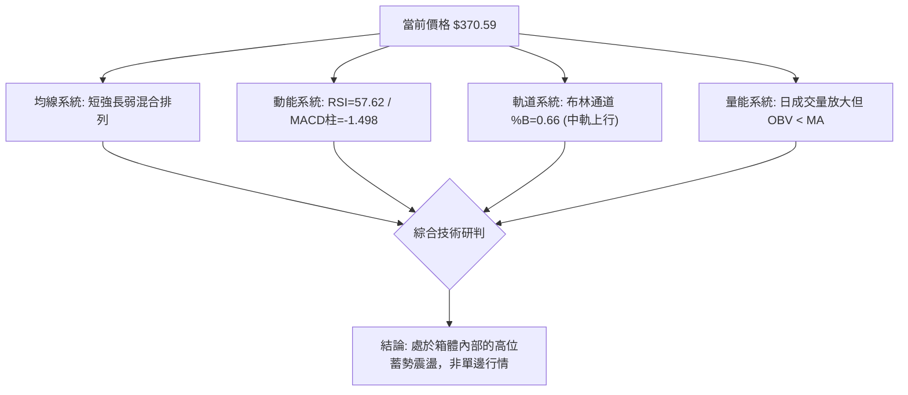
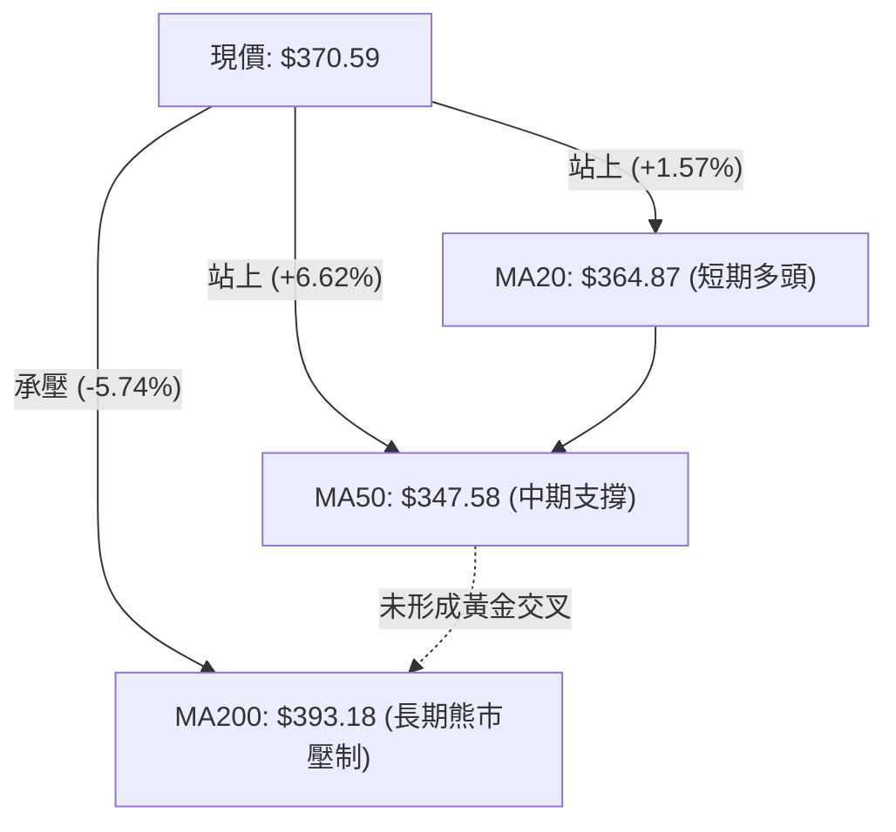
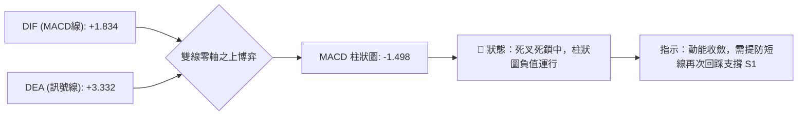
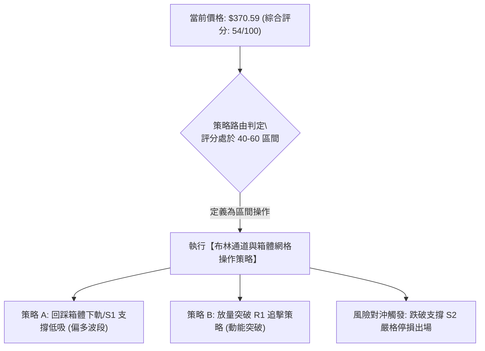
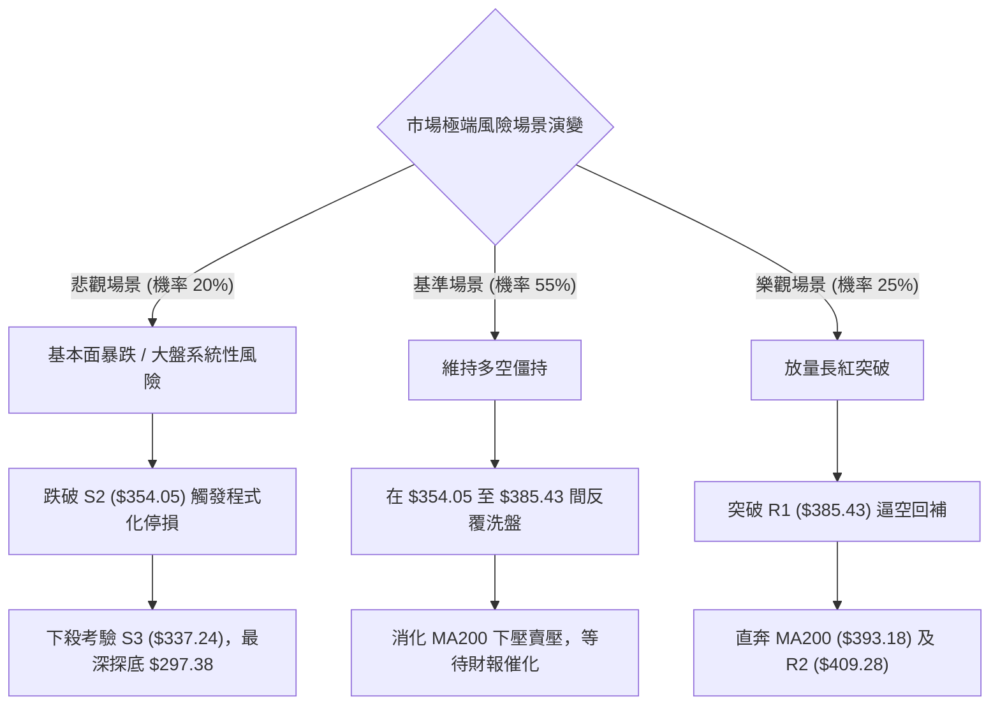

# TSLA 技術分析報告

> **報告日期**：2026-10-05 ｜ **語言**：繁體中文 ｜ **數據來源**：Yahoo Finance ｜ **當前價格**：$370.59

---

## 目錄

| 章節 | 內容 |
|------|------|
| [1. 技術面概覽](#1-技術面概覽) | 訊號儀表板、核心指標、評分卡 |
| [2. 趨勢分析](#2-趨勢分析) | 多時框趨勢、長中短期走勢、ADX解讀 |
| [3. 圖表形態分析](#3-圖表形態分析) | 形態識別、K線組合、目標價推算 |
| [4. 支撐與阻力](#4-支撐與阻力) | 關鍵價位聚類、斐波那契回調結構 |
| [5. 技術指標深度解讀](#5-技術指標深度解讀) | MA/RSI/MACD/布林通道/成交量 |
| [6. 動能與波動率](#6-動能與波動率) | 動能象限、ATR波幅、Beta相關性 |
| [7. 多時框架總結](#7-多時框架總結) | 時框架評分矩陣、多時框收斂定調 |
| [8. 交易策略建議](#8-交易策略建議) | 策略路由、情境階梯、進出場規劃 |
| [9. 風險提示與監控](#9-風險提示與監控) | 監控清單、極端情境、風控規則 |
| [10. 報告總結](#10-報告總結) | 全景摘要評級、最優策略組合 |

---

## 1. 技術面概覽

### 🎯 技術訊號儀表板



### 📊 核心指標速覽表

| 指標類別 | 指標名稱 | 當前數值 | 訊號 | 技術解讀 |
|:---|:---|:---|:---:|:---|
| **價格基準** | 現價 / 52W區間 | $370.59 / 36.3% | 🟡 | 位於52週下半部區間，自 $311.21 反彈後於中位收斂 |
| **短期均線** | MA20 | $364.87 | 🟢 | 現價高於MA20達 +1.57%，短天期多頭排列保持完整 |
| **中期均線** | MA50 | $347.58 | 🟢 | 現價高於MA50達 +6.62%，中期下檔具備堅實動態支撐 |
| **長期均線** | MA200 | $393.18 | 🔴 | 現價低於MA200達 -5.74%，長期牛熊分水嶺形成顯著重壓 |
| **超買超賣** | RSI(14) | 57.62 | 🟡 | 位於 50–60 強勢整理區，未見頂背離，多空力道均衡 |
| **趨勢動能** | MACD (12,26,9) | 1.834 / Sig: 3.332 | 🔴 | 柱狀圖 -1.498，短線快線下穿慢線，動能進入修正期 |
| **趨勢強度** | ADX(14) | 17.76 (+DI 29.40) | 🟡 | ADX < 25 表明無單邊趨勢，+DI佔優，本質為盤整偏多 |
| **通道軌道** | Bollinger %B | 0.66 (軌寬 $35.55) | 🟢 | 運行於中軌 ($364.87) 與上軌 ($382.64) 間，多方控盤 |
| **波動幅度** | ATR(14) | $11.46 (3.09%) | 🟡 | 日內波幅約 3.1%，處於歷史常態偏低水平，利於區間波段 |
| **成交配合** | 量比 / OBV | 1.45x / OBV < MA | 🔴 | 單日爆量攻擊但累積 OBV 仍滯後，暗示追高意願有限 |

### 🏆 技術評分卡

```
╔══════════════════════════════════════════════════════════════╗
║              TSLA 技術評分卡 (2026-10-05)                    ║
╠══════════════════════════════════════════════════════════════╣
║ 趨勢強度 (ADX=17.76)   ████████░░░░░░░░░░░░  42/100  🟡 弱趨勢 ║
║ 動能指標 (RSI/MACD)    ██████████░░░░░░░░░░  50/100  🟡 震盪調 ║
║ 支撐穩定度 (S1/MA20)   ██████████████░░░░░░  70/100  🟢 雙重支 ║
║ 成交量配合 (量比/OBV)  ██████████░░░░░░░░░░  52/100  🟡 量價分 ║
║ 形態完整度 (箱體結構)  ████████████░░░░░░░░  60/100  🟢 底部打 ║
║ 均線排列 (短強長弱)    ██████████░░░░░░░░░░  52/100  🟡 混合盤 ║
╠══════════════════════════════════════════════════════════════╣
║ 綜合技術評分           ███████████░░░░░░░░░  54/100  ⚖️ 區間震 ║
╚══════════════════════════════════════════════════════════════╝
```

---

## 2. 趨勢分析

### 🌐 多時框趨勢分析



### 📈 長期趨勢 — 12個月走勢圖（Unicode）

```
TSLA 月線歷史價格走勢圖（過去12個月：2025-10 至 2026-10）
價格軸 ($)
$460 ┤  ● $456.56 (2025-10 頂部)
$440 ┤      ● $449.72        ● $435.79
$420 ┤          ● $430.41        ● $420.60
$400 ┤              ● $402.51
$380 ┤                  ● $371.75    ● $381.63
$360 ┤                                      ● $367.95       ● $370.59 (現價)
$340 ┤                                              ● $354.81
$320 ┤                                  ● $311.21 (2026-07 探底)
     └────────────────────────────────────────────────────────────►
       10  11  12  01  02  03  04  05  06  07  08  09  10 (月份)
```

**走勢特徵分析表格**：

| 階段區間 | 起止月份 | 價格區間 | 累積漲跌 | 量價與趨勢特徵 |
|:---|:---:|:---:|:---:|:---|
| **頭部構築期** | 2025-10 ~ 2025-12 | $456.56 → $449.72 | -1.50% | 於 $450 以上高檔橫盤滯漲，高位多頭獲利了結 |
| **第一輪退潮** | 2026-01 ~ 2026-03 | $430.41 → $371.75 | -13.63% | 連續跌破短期均線，空方主導，成交量逐級退潮 |
| **次級反彈浪** | 2026-04 ~ 2026-05 | $381.63 → $435.79 | +14.19% | 快速回抽測試下降壓力線，受制於 $440 關卡形成假突破 |
| **主跌加速段** | 2026-06 ~ 2026-07 | $420.60 → $311.21 | -26.01% | 帶量下殺跌破 $350 頸線，週 RSI 一度摜壓至 15.7 極端超賣 |
| **低檔修復段** | 2026-08 ~ 2026-10 | $311.21 → $370.59 | +19.08% | 超跌後呈階梯式反彈，現正測試 MA120 ($378.79) 阻力帶 |

### 📊 中期趨勢（週線分析）

中期走勢圖展現了強烈的波段清洗特徵。2026年7月最後一週收於 $313.03，隨後8月首週觸及 $311.21 形成堅實底部。此處伴隨 275.6M 的恐慌盤爆量換手，隨後8月中下旬連續收出中紅K線，週線 RSI 由 15.7 快速拉升至 72.7。目前週線已連續4週在 $354.00–$372.00 區間進行高檔橫盤整固，週 MACD 柱狀圖由正轉為負值微幅發散（-1.498），顯示自低檔以來的單邊急漲動能已暫告一段落，中期轉入對稱三角形或矩形箱體收斂。

```
近期週線壓力與支撐示意圖：
  $409.28 ════════════════════════════════ (R2 中期強阻力/波段平台)
      ↑
  $385.43 ──────────────────────────────── (R1 近期密集成交阻力帶)
      ↑
  $370.59 ───► [ 當前價格在此窄幅震盪 ]
      ↓
  $366.31 ──────────────────────────────── (S1 近期波段回踩支撐 / MA20)
      ↓
  $354.05 ════════════════════════════════ (S2 箱體底部關鍵頸線)
```

### ⚡ 趨勢強度評估（ADX 解讀）



| ADX 數值區間 | 趨勢狀態 | 市場環境特徵 | 本標的當前位置 |
|:---:|:---:|:---|:---:|
| 0 – 20 | 極弱 / 無趨勢 | 價格在均線間反覆穿梭，假突破頻繁 | **17.76 (當前所處區間)** |
| 20 – 25 | 趨勢孕育期 | 動能指標開始發散，等待方向選擇 | — |
| 25 – 40 | 明確強趨勢 | 順勢操作勝率最高，均線系統呈扇形 | — |
| 40 – 60 | 極強噴出行情 | 動能過熱，隨時可能出現拋物線反轉 | — |

---

## 3. 圖表形態分析

### 🔍 形態識別系統



**形態信心度與目標價評估表**：

| 形態名稱 | 信心度 | 判斷依據（引用數據） | 完成度 | 目標價（附嚴謹計算式） |
|:---|:---:|:---|:---:|:---|
| **大級別雙重底** | 72% | 第一底為 2026-08-02 的 $311.21，第二底為 2026-08-30 的 $348.75（未破前低）；頸線壓在 R1 $385.43 | 75% | 待放量突破頸線 R1：<br>頸線 $385.43 + 形態深度 ($385.43 - $348.75 = $36.68) = **$422.11**（與斐波那契 38.2% 回調位 $421.88 完美共振） |
| **矩形收斂箱體** | 85% | 8月下旬至10月價格受限於箱底 S2 $354.05 與箱頂 R1 $385.43 之間反覆震盪 | 90% | 箱體等距映射：<br>突破箱頂 $385.43 + 箱體高度 ($385.43 - $354.05 = $31.38) = **$416.81**（逼近阻力位 R3 $418.36） |
| **頭肩底形態** | 35% | 缺乏清晰左肩對稱結構（6月份直接崩跌至 $311.21），幾何結構不完整 | 20% | **數據不足，信心度低於50%，僅做箱體與指標型解讀** |

### 🕯️ 重要K線形態分析

| 日期 / 週別 | 收盤價 | K線形態特徵 | 盤面語意解讀 | 多空訊號 |
|:---|:---:|:---|:---|:---:|
| **2026-07-26** | $313.03 | 長黑摜壓實體K | 恐慌性拋售放量釋放，週 RSI 摔落至 15.7 超賣極限區 | 🔴 恐慌拋盤 |
| **2026-08-02** | $311.21 | 下影線鎚頭線 (Hammer) | 探底 $297.38 後強勁抽回，多頭於 $300 大關發動防禦 | 🟢 探底止跌 |
| **2026-08-23** | $362.86 | 連續跳空大陽線 | 連續三週強攻突破 MA50，空單遭遇擠壓停損 | 🟢 動能噴出 |
| **2026-09-06** | $354.08 | 帶長下影十字星 | 回踩 S2 ($354.05) 獲得精準支撐，確認支撐有效性 | 🟢 支撐確認 |
| **2026-09-27** | $372.11 | 上影線射擊之星 | 衝擊 R1 ($385.43) 前哨遇阻回落，多空在 $370 爭奪 | 🟡 遇阻滯漲 |
| **2026-10-04** | $370.59 | 窄幅實體紡錘線 | 波動急劇收窄至 ATR 範圍內，醞釀次級方向突破 | 🟡 方向待定 |

### 📉 ASCII 走勢形態示意圖

```
TSLA 中期日/週線雙底及箱體形態圖解：
 價格 ($)
 $385.43 ┬ - - - - - - - - - - - - - - - - - - - - - - - - - 頸線 / 箱頂 (R1)
         │                     ┌──┐                  ┌──┐
 $370.59 ┼ - - - - - - - - - - │  │ - - - - - - - - -│  │ - 現價 ($370.59)
         │                     │  │        ┌──┐      │  │
 $354.05 ┼ - - - - - - - - - - ┘  └──┐     │  │  ┌───┘  └── 箱底 (S2)
         │                           │  ┌──┘  └──┘
         │                           └──┘ (第二低點: $348.75)
 $311.21 ┼──────┐
         │      └──┘ (第一低點: $311.21)
         └──────────────────────────────────────────────────► 時間軸
```

---

## 4. 支撐與阻力

### 🗺️ 關鍵價位分布圖（Unicode）

```
TSLA 價位結構分布圖 (由實際交易數據聚類計算)
═════════════════════════════════════════════════════════════════
$418.36 ║████████████████████████████████████████║ 強阻力 R3 (+12.89%)
$409.28 ║██████████████████████████████          ║ 中期阻力 R2 (+10.44%)
$393.18 ║▓▓▓▓▓▓▓▓▓▓▓▓▓▓▓▓▓▓▓▓▓▓▓▓▓▓▓▓▓▓▓▓        ║ 關鍵均線 MA200 壓制
$385.43 ║████████████████████████████████████    ║ 突破頸線阻力 R1 (+4.01%)
$374.33 ║▒▒▒▒▒▒▒▒▒▒▒▒▒▒▒▒▒▒▒▒▒▒                  ║ 斐波那契 61.8% 分界線
$370.59 ╠════════════════════════════════════════╣ ◄ 現價 ($370.59)
$366.31 ║▓▓▓▓▓▓▓▓▓▓▓▓▓▓▓▓▓▓▓▓                    ║ 短線第一支撐 S1 (-1.15%)
$364.87 ║░░░░░░░░░░░░░░░░                        ║ 布林中軌 / MA20 動態支撐
$354.05 ║████████████████████████████████████    ║ 箱體底部強支撐 S2 (-4.46%)
$347.09 ║░░░░░░░░░░░░░░░░                        ║ 布林下軌 / MA50 支撐
$337.24 ║████████████████████████████████████████║ 波段防守強支撐 S3 (-9.00%)
═════════════════════════════════════════════════════════════════
```

### 🚧 阻力位分析表

| 阻力級別 | 準確價位 | 距離現價幅 | 形成原因與數據佐證 | 突破難度 | 戰略重要性 |
|:---:|:---:|:---:|:---|:---:|:---:|
| **R1** | **$385.43** | +4.01% | 近一年多次波段反彈高點聚類；與布林通道上軌 ($382.64) 形成重疊壓力帶 | 🟡 中等 | 短線多空強弱分界嶺，突破將打開均線修復空間 |
| **R2** | **$409.28** | +10.44% | 2026年6月中旬反彈平台高點聚類；密集成交解套賣壓區 | 🔴 極高 | 中期牛熊轉換關卡，直接壓制波段波幅上限 |
| **R3** | **$418.36** | +12.89% | 2026年6月跌勢啟動點；波段密集籌碼套牢深水區 | 🔴 極高 | 中長線大結構防守底線，此處預期將出現機構劇烈對沖 |

### 🛡️ 支撐位分析表

| 支撐級別 | 準確價位 | 距離現價幅 | 形成原因與數據佐證 | 守住機率 | 戰略重要性 |
|:---:|:---:|:---:|:---|:---:|:---:|
| **S1** | **$366.31** | -1.15% | 近期波段回檔低點聚類；與 MA20 ($364.87) 形成緊密下檔保護墊 | 🟢 80% | 極短線防守點，守穩代表多頭微結構未破壞 |
| **S2** | **$354.05** | -4.46% | 近期箱體底部波段低點聚類（9月上旬確認點）；與 MA60 ($353.11) 吻合 | 🟢 75% | 多方核心陣地，跌破此處宣告雙底結構失敗轉為弱勢 |
| **S3** | **$337.24** | -9.00% | 8月中旬第一道跳空突破平台高點，也是斐波那契 78.6% ($340.49) 前哨 | 🟢 65% | 波段最後多方多頭退守防線，一旦跌破恐重探 $300 |

### 📐 斐波那契回調位分析

依據 52 週絕對極值區間：高點 **$498.83**（0.0%）至 低點 **$297.38**（100.0%），總落差為 $201.45：

```
0.0%  (52W High) ─────────────────────────── $498.83
23.6%            ─────────────────────────── $451.29
38.2%            ─────────────────────────── $421.88
50.0%            ─────────────────────────── $398.10
61.8%            ─────────────────────────── $374.33
▲▲▲ 現價落在此區間 ($370.59) 處於 61.8% 壓制與 78.6% 支撐之間 ▲▲▲
78.6%            ─────────────────────────── $340.49
100.0%(52W Low)  ─────────────────────────── $297.38
```

- **位置解讀**：現價 $370.59 正緊貼在 **黃金分割 61.8% 回調位 ($374.33)** 正下方。在經典技術分析中，自低點 $297.38 反彈至此處累積漲幅達 24.6%，61.8% 回調位歷來為多空決戰的主戰場。
- **博弈意涵**：若現價能帶量封閉並站穩 $374.33 之上，則跌勢回撤宣告結束，下一目標將依序直指 50.0% ($398.10) 及 38.2% ($421.88)；反之，若在 $374.33 下方持續受阻，價格將向下尋求 78.6% ($340.49) 的二度支撐測試。

---

## 5. 技術指標深度解讀

### 🎛️ 指標訊號總覽



### 📈 移動平均線排列分析



**移動平均線系統綜合狀態表**：

| 天期指標 | 數值 | 距現價差距 | 方向斜率 | 排列狀態與技術解讀 |
|:---|:---:|:---:|:---:|:---|
| **MA 5** | $357.96 | +3.53% | ▲ 上揚 | 極短線快速攀升，短線超買乖離擴大 |
| **MA 10** | $367.42 | +0.86% | ▲ 上揚 | 緊貼現價下方，提供即時推升動能 |
| **MA 20** | $364.87 | +1.57% | ▲ 上揚 | 月線趨勢向上，為短期多方最重要的動態生命線 |
| **MA 60** | $353.11 | +4.95% | ▲ 走平偏上 | 季線位置與支撐 S2 ($354.05) 重疊，構築中線防護罩 |
| **MA 120**| $378.79 | -2.17% | ▼ 下行 | 半年線持續下壓，與 R1 前緣共同形成現價上方第一道蓋頭簾 |
| **MA 200**| $393.18 | -5.74% | ▼ 下行 | 經典牛熊分界線，斜率向下，暗示中期反彈均屬「熊市反抽」性質 |
| **MA 240**| $400.49 | -7.47% | ▼ 下行 | 年線壓制，長期均線依然呈現空頭發散狀態 |

### 📉 RSI(14) 分析

```
RSI(14) 數值展示：57.62
[0] ─────────────── [30] ───────────── [50] ───────●────── [70] ────────────── [100]
超賣區                   偏弱整理              偏多震盪 (57.62)       超買區
進度條：█████████████████████████████░░░░░░░░░░░░░░░░░░░░ 57.62%
```

- **區間評估**：RSI(14) 讀數為 **57.62**，處於 50–70 的常態強勢偏多震盪區。未進入 >70 的過熱超買區，亦遠離 <30 的超賣恐慌區。
- **背離分析**：
  - **日線背離狀態**：現價由 9月下旬的 $364.27 推升至目前 $370.59，而 RSI 由 56.8 微幅提升至 57.62，價格小創新高而指標同步上揚，**無任何頂背離徵兆**。
  - **週線背離狀態**：2026年7月底低點 $311.21 時週線 RSI 跌至 15.7 極值，8月中反彈至 72.7，隨後9月底股價達 $372.11 時 RSI 回落至 63.9。此現象屬「急升後的動能自然沉澱」，非典型的頂背離，市場處於常態籌碼消化階段。

### 📊 MACD(12/26/9) 訊號解讀



- **數值剖析**：DIF (+1.834) 低於 DEA (+3.332)，柱狀圖讀數為 **-1.498**。
- **多空意涵**：雙線本體依然維持在零軸上方運行（DIF與DEA均為正值），這確認了自 8 月以來的多頭波段骨架並未坍塌。然而，柱狀圖自 9 月中旬的高點一路回落並持續於負值區發散，說明短線動能正在衰退，追價力道顯著萎縮。

### 📦 布林通道分析

```
布林通道結構示意圖 (帶寬: $35.55，現價處於中上軌間)
$382.64 ┬────────────────────────────────────────── 上軌 (壓力區，距現價 +3.25%)
        │
$370.59 ┼ - - - - - - - - - - - - - - - - - - - - - 現價 (%B = 0.66)
        │
$364.87 ┼────────────────────────────────────────── 中軌 (MA20，重要支撐，距現價 -1.54%)
        │
$347.09 ┴────────────────────────────────────────── 下軌 (超跌支撐區，距現價 -6.34%)
```

- **通道指標數值**：
  - 上軌：**$382.64**
  - 中軌 (MA20)：**$364.87**
  - 下軌：**$347.09**
  - 布林極限指標 (%B)：**0.66**
- **通道狀態評估**：通道帶寬 ($382.64 - $347.09 = $35.55) 呈現橫向平行收口特徵，此為波動率壓縮的典型表現。%B 位於 0.66，表明價格位於通道偏多側。根據布林通道統計法則，在橫盤階段，上軌 $382.64 構成強力天花板（與阻力位 R1 $385.43 產生夾角重壓），而中軌 $364.87 則是多方首要回踩支撐。

### 💹 成交量分析（量價配合度）

- **量能規模**：最新單日成交量為 **55,242,800 股**，相較於 20 日均量 (38,116,105 股) 的**量比為 1.45x**，亦高於 50 日均量 (37,659,658 股)，呈現顯著的「單日放量」特徵。
- **OBV 趨勢剖析**：雖然短線放量，但數據顯示 **「OBV < MA」**，能量潮指標依然被壓制在其移動平均線之下。
- **量價背離結論**：目前盤面呈現「短線放量攻擊、中長線籌碼沉積不足」的矛盾狀態。單日 1.45 倍的成交量雖推升價格上漲，但在缺乏 OBV 持續向上創高背書的前提下，此種放量往往屬於區間內部的獲利換手盤，難以發動持續性的大級別單邊突破行情。

---

## 6. 動能與波動率

### ⚡ 動能評估四象限

```
TSLA 動能 vs 波動率定位：
                高動能 (High Momentum)
                        │
         Q3 (高風險高收益)│   Q1 (強趨勢突破)
                        │
── 低波動 ──────────────┼────────────── 高波動 (High Volatility)
 (Low Volatility)       │
         Q2 [★TSLA 當前] │   Q4 (恐慌下行/高危)
                        │
                低動能 (Low Momentum)
```

| 象限代號 | 動能特徵 | 波動特徵 | 標的所屬狀態 | 策略指導方針 |
|:---:|:---:|:---:|:---:|:---|
| **Q1** | 強動能 | 高波動 | 排除 | 追隨突破，順勢加碼 |
| **Q2** | **弱/中動能** | **低/常態波動** | **✓ TSLA 歸屬此區間** | **區間震盪、逢低布局、嚴禁追高** |
| **Q3** | 強動能 | 低波動 | 排除 | 機構潛伏吸收期，抱牢持股 |
| **Q4** | 負向強動能 | 高波動 | 排除 | 恐慌主跌段，全面空倉觀望 |

### 📊 ATR 波動率分析

- **ATR(14) 當前值**：**$11.46**（佔當前股價之 **3.09%**）。
- **風控參數推導**：
  - **日內正常波幅空間**：現價 ± 1.0 × ATR ➔ **$359.13 至 $382.05**。這高度契合了布林中上軌的邊界範圍。
  - **波段止損緩衝距離 (1.5 × ATR)**：1.5 × $11.46 = **$17.19**。
  - **保守型防守緩衝距離 (2.0 × ATR)**：2.0 × $11.46 = **$22.92**。
- **交易應用結論**：若在現價 $370.59 建立短線部位，任何小於 $11.46 (1.0 ATR) 的緊繃止損都極易被市場的「白噪音」洗出場；合理的技術性防守位必須退至支撐 S1 ($366.31) 甚至 S2 ($354.05) 後方。

### 📐 Beta 與市場相關性

- **Beta 係數**：**1.845**。
- **市場敏感度評估**：TSLA 具備極高的市場彈性（高 Beta 屬性）。當 S&P 500 或 NASDAQ 100 指數波動 1.0% 時，理論上 TSLA 將產生 1.845% 的同向放大波幅。在當前 ADX=17.76 的盤整環境下，個股的任何獨立行情極易受到美股大盤宏觀環境的干擾。若大盤拉回，TSLA 將以近 2 倍的速度測試下檔 S1/S2 支撐。

---

## 7. 多時框架總結

### 📋 時框架評分表

| 時框架 | 趨勢方向 | 動能狀態 | 均線排列 | 關鍵形態特徵 | 評分 (1-100) | 核心建議 |
|:---|:---:|:---:|:---:|:---|:---:|:---|
| **短期 (日線)** | 🟡 震盪偏多 | 🔴 MACD死叉 | 🟢 站上MA20/50 | 布林中軌支撐反彈 | 55/100 | 箱體內高拋低吸 |
| **中期 (週線)** | 🟢 築底反彈 | 🟡 動能修復 | 🟡 夾於MA50/200間 | 雙底成形，挑戰頸線 | 60/100 | 持股續抱，防守 $354 |
| **長期 (月線)** | 🔴 弱勢修正 | 🔴 偏空承壓 | 🔴 承壓於MA200/240 | 自 $456 築頂下行 | 45/100 | 長線未至反轉點 |

### 🔲 綜合訊號矩陣

```
TSLA 多時框維度訊號矩陣：
┌─────────────┬─────────────┬─────────────┬─────────────┐
│ 時框維度    │ 趨勢 (Trend)│ 動能 (Mom)  │ 量價 (Vol)  │
├─────────────┼─────────────┼─────────────┼─────────────┤
│ 短期 (Daily)│ 🟢 偏多 (+DI)│ 🔴 柱狀負值 │ 🟡 量大但OBV疲│
│ 中期 (Weekly│ 🟢 底部墊高 │ 🟡 中性平穩 │ 🟢 恐慌量換手 │
│ 長期 (Month)│ 🔴 空頭排列 │ 🔴 弱勢鈍化 │ 🔴 資金退潮   │
└─────────────┴─────────────┴─────────────┴─────────────┘
結論：多時框矛盾，依多時框收斂規則第 14 條定調。
```

### ⚖️ 多時框收斂結論

依據多時框收斂強制規則（規則 14）：
1. **行情性質判定**：當前 **ADX(14) 數值為 17.76**，明確低於 25 的趨勢門檻。這確立了當前市場**並非單邊趨勢行情，而是處於典型的盤整/箱體行情**。
2. **主導維度取捨**：在 ADX < 25 的環境下，中長期趨勢均線（MA200 $393.18）主要作為極限防守壓制位，而**不可作為順勢追擊的依據**。日線與週線的震盪邊界（布林通道與波段高低點）具有最高的實戰指導權限。
3. **收斂方向定調**：**【中性偏多，區間震盪蓄勢】**。
   - 價格受下檔強支撐 S1 ($366.31) 與 MA20 ($364.87) 保障，向下殺跌動能有限；
   - 同時受到斐波那契 61.8% ($374.33)、布林上軌 ($382.64) 與阻力位 R1 ($385.43) 的層層死鎖；
   - **最終結論**：拒絕單邊盲目看多或過度悲觀看空，當前策略必須鎖定在 **$354.05 – $385.43** 的大箱體區間內部進行波段操作。

---

## 8. 交易策略建議

### 🗺️ 策略決策流程圖



### 🧭 策略路由

> **當前主策略方向 = 【區間操作 / 震盪整理】（依綜合評分 54/100 定調）**
> 
> 因評分處於 40–60 之間，且 ADX(17.76) < 25，禁止採取大部位單邊追漲殺跌。策略以守株待兔、在邊界掛單佈局為主。

### 🎯 價格情境階梯（Price Scenarios）

價位完全嚴格引用數據中聚類計算與斐波那契點位：

| 階梯層次 | 觸發與運行條件 | 下一目標位 | 後續延伸目標 | 戰略情境含義 |
|:---|:---|:---:|:---:|:---|
| **上行階梯 3** | 強勢站穩 R2 ($409.28) | R3 ($418.36) | 52W High ($498.83) | 牛市單邊啟動，長期熊市格局徹底反轉 |
| **上行階梯 2** | 放量突破 R1 ($385.43) | R2 ($409.28) | MA200 ($393.18) | 突破大箱體，空頭回補軋空行情 |
| **當前中樞** | **在 S1 ($366.31) 與 R1 ($385.43) 間** | **布林上軌 ($382.64)** | **布林中軌 ($364.87)** | **標準區間拉鋸，籌碼換手與洗盤** |
| **下行階梯 1** | 失守 S1 ($366.31) | S2 ($354.05) | MA50 ($347.58) | 短線走弱，向箱體底界尋求支撐 |
| **下行階梯 2** | 跌破 S2 ($354.05) | S3 ($337.24) | 52W Low ($297.38) | 箱體破位，雙底失敗，空頭重啟跌勢 |

### 📊 情境機率分佈

```
情境機率分佈直方圖：
區間震盪蓄勢 (55%) ▓▓▓▓▓▓▓▓▓▓▓▓▓▓▓▓▓▓▓▓▓▓▓▓▓▓▓ 55%
向上突破攻擊 (25%) ▓▓▓▓▓▓▓▓▓▓▓█ 25%
跌破重回探底 (20%) ▓▓▓▓▓▓▓▓▓█ 20%
```

| 未來情境劇本 | 預估機率 | 主要技術依據 |
|:---|:---:|:---|
| **劇本一：維持箱體震盪** | **55%** | ADX 僅 17.76 指向無趨勢，布林帶寬收窄，成交量放大但 OBV 未過高 |
| **劇本二：向上蓄勢突破** | **25%** | 現價穩居 MA20/MA50 之上，+DI (29.40) > -DI (23.03)，多方佔據局部主動 |
| **劇本三：回落破位探底** | **20%** | MACD 柱狀圖翻負 (-1.498)，MA200 與半年線下壓，大盤高 Beta 連動回調 |

### 🟢 主策略詳情

本報告主推兩套在震盪格局下嚴守風控的具體實戰方案：

| 策略維度要素 | 策略 A：箱底支撐低吸策略 (首選主策略) | 策略 B：突破頸線動能跟進 (右側確認策略) |
|:---|:---|:---|
| **策略類型** | 逆向支撐低吸（左側偏多） | 順勢破位追擊（右側確認） |
| **進場觸發條件** | 價格回踩 S1 與 MA20 獲得支撐不破 | 價格帶量突破 R1 且收盤確認站上 |
| **精確進場價格** | **$366.31**（S1 支撐位掛單） | **$386.00**（突破 R1 $385.43 後掛買） |
| **目標價 T1** | **$385.43**（箱頂阻力 R1） | **$409.28**（波段阻力 R2） |
| **目標價 T2** | **$398.10**（斐波那契 50.0% 回調位） | **$421.88**（斐波那契 38.2% 回調位） |
| **嚴格止損價格** | **$353.00**（跌破 S2 $354.05 緩衝區） | **$374.00**（跌回斐波那契 61.8% 之下） |
| **風報比 (R:R)** | **1 : 1.44** (至T1) ／ **1 : 2.39** (至T2) | **1 : 1.94** (至T1) ／ **1 : 2.99** (至T2) |
| **預估勝率** | 62% | 52% |
| **建議配置倉位** | 10% – 15% 總資金 | 8% – 10% 總資金 |

*風報比詳細計算式註解*：
- 策略 A 至 T1：風險 = $366.31 - $353.00 = $13.31；報酬 = $385.43 - $366.31 = $19.12。R:R = 19.12 / 13.31 ≈ **1.44**。
- 策略 A 至 T2：報酬 = $398.10 - $366.31 = $31.79。R:R = 31.79 / 13.31 ≈ **2.39**。
- 策略 B 至 T1：風險 = $386.00 - $374.00 = $12.00；報酬 = $409.28 - $386.00 = $23.28。R:R = 23.28 / 12.00 ≈ **1.94**。
- 策略 B 至 T2：報酬 = $421.88 - $386.00 = $35.88。R:R = 35.88 / 12.00 ≈ **2.99**。

### 🔴 反向風險觸發點（對沖與風控提示）

若發生下列技術事件，將**徹底推翻當前偏多震盪假說**，投資人應立即啟動防禦性平倉或反手空頭避險：
1. **收盤價跌破 $354.05 (支撐 S2)**：意味著箱體徹底失守，8月低點以來的反彈上升波段終結。
2. **MACD 柱狀圖跌破 -3.00 且快慢線跌穿零軸**：代表中級調整浪全面成形。
3. **防禦處置指針**：一旦跌破 $354.05，多頭持倉無條件停損，下看第一空頭目標 S3 ($337.24)，第二目標直指 52W Low ($297.38)。

### ⭐ 整體訊號強度評星

```
╔══════════════════════════════════════════════════╗
║ 做多訊號強度：  ★★★☆☆  (3.0 / 5星 - 區間逢低做多)  ║
║ 做空訊號強度：  ★★☆☆☆  (2.0 / 5星 - 缺乏主跌動能)  ║
║ 整體技術可信度：★★★★☆  (4.0 / 5星 - 關鍵價位極清晰) ║
╚══════════════════════════════════════════════════╝
```

---

## 9. 風險提示與監控

### ✅ 關鍵監控指標 Checklist

```
╔═════════════════════════════════════════════════════════════════╗
║                   TSLA 每日盤後風控監控清單                     ║
╠═════════════════════════════════════════════════════════════════╣
║ [ ] 價格是否跌破 S1 ($366.31)？  (短線強弱警戒)                 ║
║ [ ] 價格是否有效摜破 S2 ($354.05)？ (箱體停損底線)              ║
║ [ ] 向上收盤是否突破 R1 ($385.43)？ (打開上升通道訊號)          ║
║ [ ] RSI(14) 是否跌破 50 中軸？   (多空動能分水嶺)               ║
║ [ ] MACD 柱狀圖是否由負翻正 (> 0)？(回調結束訊號)               ║
║ [ ] 日成交量是否萎縮至 38M (20日均量) 之下？ (量能匱乏預警)     ║
║ [ ] 52週極值突破監控 ($297.38 / $498.83)                        ║
╚═════════════════════════════════════════════════════════════════╝
```

### ⚠️ 風險場景分析



### 🛡️ 風險管理重要提醒

1. **Beta 放大效應控管**：TSLA 的 Beta 值高達 **1.845**。在大盤震盪加劇的背景下，單一個股倉位不應超過個人總投資組合的 **15%**，避免高彈性資產帶來淨值的劇烈回撤。
2. **ATR 浮動停損規劃**：每日結算時，根據最新 ATR ($11.46) 動態調整追蹤止損點。在震盪市中，切勿將止損設定在 ATR 半徑之內，建議嚴格以關鍵技術位（如 S1、S2）作為硬性離場基準。
3. **機構籌碼結構考量**：當前機構持股比例為 43.7%，空頭部位比例（Short % Float）僅為 1.9%（借券賣出天數 Short Ratio 僅 1.79 天）。這表明市場並無龐大的極端空頭部位，因此**不可過度幻想大規模的「軋空爆發（Short Squeeze）」行情**，突破必須依靠扎實的真實多頭買盤放量推進。

---

## 10. 報告總結

```
╔══════════════════════════════════════════════════════════════════╗
║                    TSLA 技術分析報告總結                         ║
╠══════════════════════════════════════════════════════════════════╣
║ 報告日期：2026-10-05                                            ║
║ 當前價格：$370.59                                                ║
║ 技術評級：⚖️ 中性偏多 / 區間震盪蓄勢 (綜合評分: 54/100)           ║
╠══════════════════════════════════════════════════════════════════╣
║ 關鍵維度結論：                                                   ║
║ ├─ 長期趨勢 (月線)：🔴 偏空承壓，受制於 MA200 ($393.18)         ║
║ ├─ 中期趨勢 (週線)：🟢 築底反彈，2026-07 低點 $311.21 奠定雙底   ║
║ ├─ 短期趨勢 (日線)：🟡 整理蓄勢，布林通道中上軌收口運作         ║
║ ├─ 核心支撐價位：S1 $366.31 (短線) ｜ S2 $354.05 (強支撐)       ║
║ ├─ 核心阻力價位：R1 $385.43 (頸線) ｜ R2 $409.28 (強阻力)       ║
║ └─ 華爾街目標價：平均 $395.57 (潛在空間 +6.74%)                 ║
╠══════════════════════════════════════════════════════════════════╣
║ 最優策略組合：                                                   ║
║ 1. 🥇 最佳機會 (策略 A)：回踩 S1 $366.31 布局多單，目標 $385.43   ║
║ 2. 🥈 次選機會 (策略 B)：右側突破 R1 $386.00 追多，目標 $409.28   ║
║ 3. 🥉 防守離場 (風控)：收盤摜破 S2 $354.05，全數離場避險        ║
╚══════════════════════════════════════════════════════════════════╝
```

---

> ⚠️ **免責聲明**：本報告由量化技術分析系統自動生成，文中所有價格、支撐阻力位、均線指標及統計數據均基於歷史量價數據模型客觀推算。報告內容僅供專業投資機構與學術研究參考，在任何情況下均不構成對任何人的投資建議、交易要約或要約邀請。金融市場瞬息萬變，技術指標存在滯後性與失效風險，投資人應獨立承擔所有交易決策風險。

---

*報告生成時間：2026-10-05 ｜ 數據驗證源：Yahoo Finance OHLCV Engine ｜ 分析框架：多時框架量化技術架構*