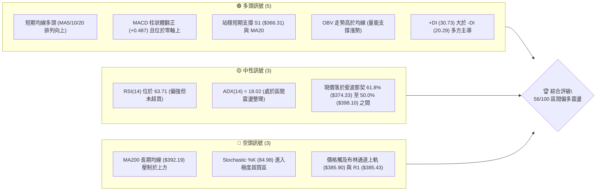
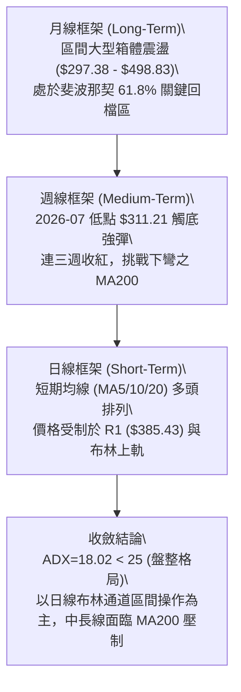
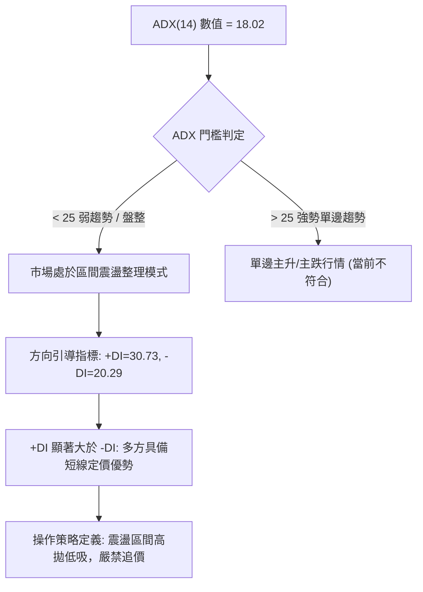
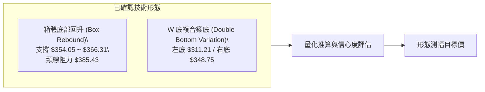
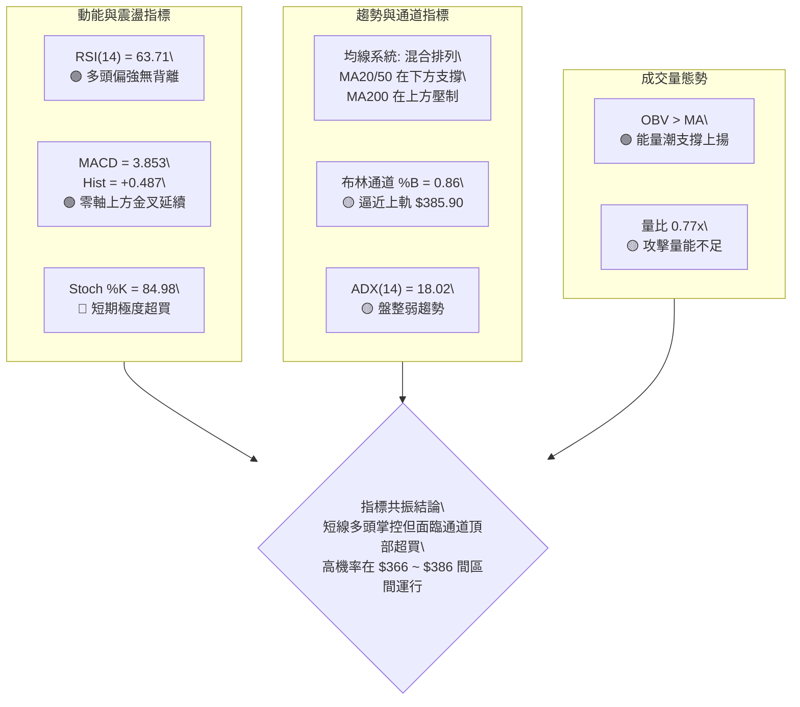
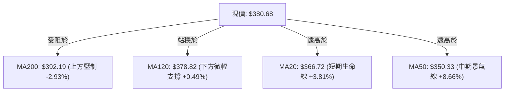
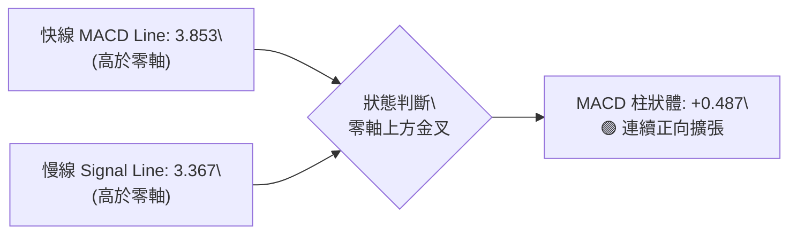
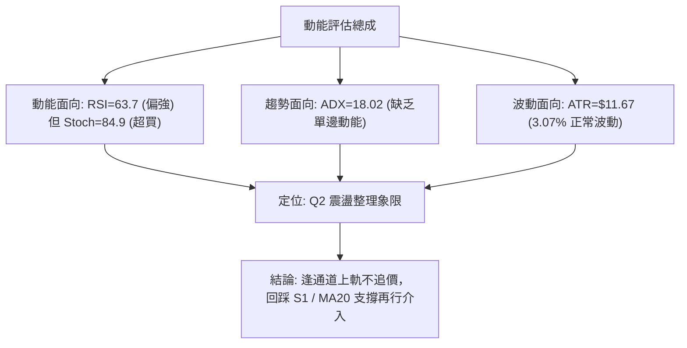
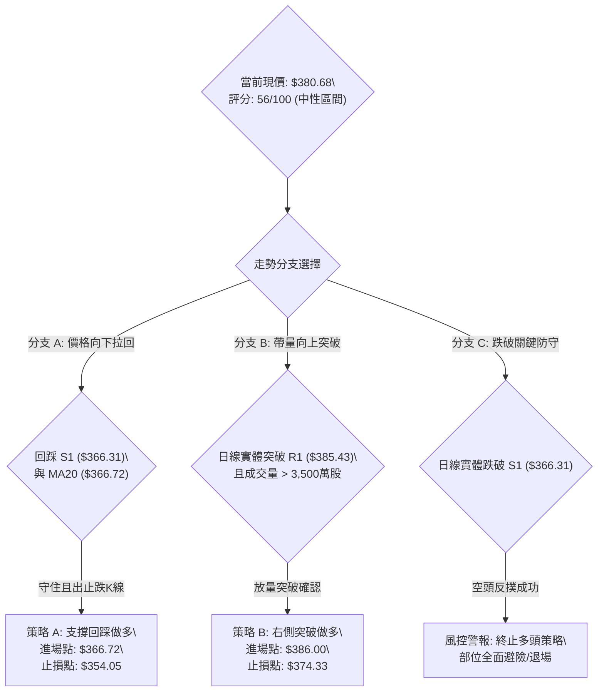
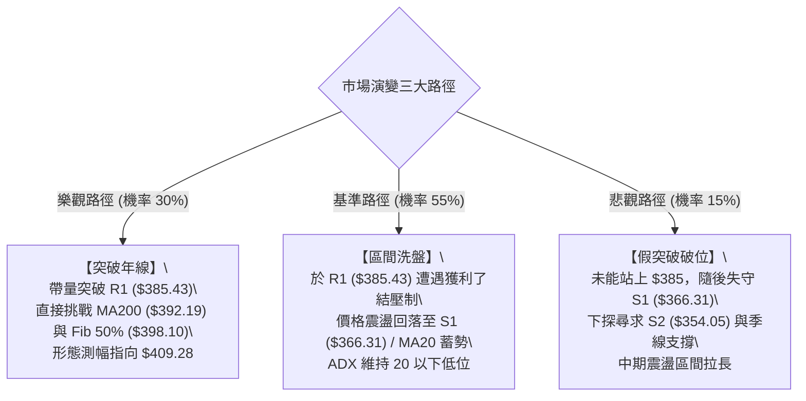

# TSLA 技術分析報告

> **報告日期**：2026-10-07 ｜ **語言**：繁體中文 ｜ **數據來源**：Yahoo Finance ｜ **當前價格**：$380.68

---

## 目錄

| 章節 | 內容 |
|------|------|
| [1. 技術面概覽](#1-技術面概覽) | 訊號儀表板、核心指標、評分卡 |
| [2. 趨勢分析](#2-趨勢分析) | 多時框趨勢、長中短期走勢、ADX 解讀 |
| [3. 圖表形態分析](#3-圖表形態分析) | 形態識別、K線組合、形態目標價 |
| [4. 支撐與阻力](#4-支撐與阻力) | 關鍵價位分布、波段聚類、斐波那契回調 |
| [5. 技術指標深度解讀](#5-技術指標深度解讀) | 均線系統、RSI、MACD、布林通道、OBV量價 |
| [6. 動能與波動率](#6-動能與波動率) | 動能四象限、ATR波動分析、Beta風險 |
| [7. 多時框架總結](#7-多時框架總結) | 時框架矩陣、多時框收斂定調 |
| [8. 交易策略建議](#8-交易策略建議) | 策略路由、價格情境階梯、風報比策略表 |
| [9. 風險提示與監控](#9-風險提示與監控) | 監控清單、情境推演、風控規則 |
| [10. 報告總結](#-報告總結) | 全文核心精華與決策摘要 |

---

## 1. 技術面概覽

### 🎯 技術訊號儀表板



---

### 📊 核心指標速覽表

| 指標類別 | 指標名稱 | 當前數值 | 訊號 | 專業解讀 |
|:---|:---|:---|:---:|:---|
| **基準價格** | 現價 (Close) | $380.68 | 🟢 | 站上多條短中期均線，短多格局延續中 |
| **52週區間** | 區間位置 | 41.4% ($297.38–$498.83) | 🟡 | 自年內低點顯著反彈，但距歷史高點仍有修復空間 |
| **均線系統** | MA20 (短月線) | $366.72 | 🟢 | 現價高於 MA20 達 +3.81%，短期生命線支撐穩固 |
| **均線系統** | MA50 (季線) | $350.33 | 🟢 | 現價穩固運行於 MA50 之上，中期回升架構確立 |
| **均線系統** | MA200 (年線) | $392.19 | 🔴 | 現價低於 MA200 (-2.93%)，長線牛熊分水嶺形成上方主要反壓 |
| **動能指標** | RSI(14) | 63.71 | 🟢 | 處於強勢多方區間（50–70），無頂背離訊號 |
| **動能指標** | MACD | 3.853 (柱狀 +0.487) | 🟢 | 快慢線均在零軸上方運行，柱狀圖正向擴張 |
| **超買超賣** | Stoch %K / %D | 84.98 / 75.18 | 🔴 | 進入 80 以上高檔鈍化/超買區，慎防技術性拉回 |
| **趨勢強度** | ADX(14) | 18.02 | 🟡 | 數值小於 25，顯示當前非單邊強趨勢，屬高波動盤整行情 |
| **通道指標** | 布林通道 %B | 0.86 (帶寬 $38.35) | 🟡 | 價格逼近上軌 ($385.90)，通道呈現收斂後向上擴張 |
| **量能指標** | 量比 (Volume/20MA) | 0.77x (2,767萬股) | 🟡 | 當日量能略顯不足，上攻關鍵阻力需實質補量 |
| **波動風險** | ATR(14) | $11.67 (3.07%) | 🟡 | 每日平均震幅近 12 美元，適合波段區間停損佈局 |

---

### 🏆 技術評分卡

```
╔══════════════════════════════════════════════════════════════════╗
║               技術評分卡 — TSLA (2026-10-07)                     ║
╠══════════════════════════════════════════════════════════════════╣
║ 趨勢強度 (ADX=18.02)     ████████░░░░░░░░░░░░  40/100   🟡 中性弱勢 ║
║ 動能指標 (RSI/MACD)      █████████████░░░░░░░  65/100   🟢 多方主導 ║
║ 支撐穩定度 (S1/MA20)     █████████████░░░░░░░  65/100   🟢 支撐堅實 ║
║ 成交量配合 (OBV/量比)    ███████████░░░░░░░░░  55/100   🟡 量能中性 ║
║ 形態完整度 (區間築底)    ████████████░░░░░░░░  60/100   🟢 箱體抬升 ║
║ 均線排列 (短強長弱)      ██████████░░░░░░░░░░  50/100   🟡 混合排列 ║
╠══════════════════════════════════════════════════════════════════╣
║ 綜合技術評分             ███████████░░░░░░░░░  56/100   ⚖️ 區間震盪偏多 ║
╚══════════════════════════════════════════════════════════════════╝
```

---

## 2. 趨勢分析

### 🌐 多時框趨勢分析



---

### 📈 長期趨勢 — 12個月走勢圖（Unicode）

以下為 TSLA 自 2025 年 11 月至 2026 年 10 月之月線收盤價歷史走勢圖：

```
TSLA 月線走勢圖（過去12個月收盤價變動）
價格軸 ($)
$460 ┤             ● $449.72 (12月)
$440 ┤     ● $430.17       ● $430.41               ● $435.79
$420 ┤                                                     ● $420.60
$400 ┤                             ● $402.51
$380 ┤                                     ● $381.63               ● $380.68 (當前)
$360 ┤                             ● $371.75               ● $367.95   ● $354.81
$340 ┤
$320 ┤                                                             ● $311.21 (低點)
$300 ┤
     └──────────────────────────────────────────────────────────────────────────
       25-11 25-12 26-01   26-02   26-03   26-04   26-05   26-06   26-07   26-08   26-09   26-10
```

#### 走勢特徵分析表格

| 階段區間 | 收盤點位變化 | 區間幅度 | 走勢結構特徵與驅動因素 |
|:---|:---:|:---:|:---|
| **高檔回吐期**<br>(2025/11–2026/03) | $430.17 → $371.75 | -13.58% | 股價自 $450 上方遇阻回落，形成下傾楔形，成交量逐步萎縮。 |
| **反彈受挫期**<br>(2026/04–2026/06) | $381.63 → $420.60 | +10.21% | 於 $380 附近組織反攻，最高反彈至 5 月收盤 $435.79，但未能越過斐波那契 23.6% ($451.29)。 |
| **急跌築底期**<br>(2026/07–2026/08) | $420.60 → $311.21 | -26.01% | 7 月單月遭遇重挫殺跌，週線 RSI 一度跌破 16 嚴重超賣，隨後於 $311.21 確立中期底部。 |
| **右側修復期**<br>(2026/08–2026/10) | $311.21 → $380.68 | +22.32% | 連續兩個月反彈爬坡，逐步收復 MA20 ($366.72) 與 MA50 ($350.33)，多頭嘗試重掌發球權。 |

---

### 📊 中期趨勢（週線分析）

中期技術面目前以 **2026 年 8 月低點 $311.21** 作為波段反彈支點。過去 10 週的週收盤價展現出清晰的「低點抬高 (Higher Lows)」結構：

```
中期週線結構示意圖
阻力區 R2  [$409.28] ─────────────────────────────────────────── (未突破)
年線反壓   [$392.19] ──────────────────────┐ (重要阻力)
阻力區 R1  [$385.43] ───────────────┐      │
當前現價   [$380.68] ───────────●   │      │ (當前挑戰 R1)
斐波 61.8% [$374.33] ─────────┐ │   │      │
支撐區 S1  [$366.31] ─────●───┘ │   │      │ (近三週回測有守)
支撐區 S2  [$354.05] ──●──┘     │   │      │
波段起漲點 [$311.21] ──┘         │   │      │
```

- **週線指標狀態**：2026-10-11 所在週收盤 $380.68，週 RSI 為 63.7，MACD 柱狀體為 +0.487，確認週線級別的反彈行情仍未終結。
- **均線關卡挑戰**：現階段中期走勢最核心的博弈點在於下彎的 **MA200 ($392.19)** 與 **斐波那契 50.0% 回調位 ($398.10)**。若未能帶量越過，中期反彈極易轉變為二次大型箱體震盪。

---

### ⚡ 趨勢強度評估（ADX 解讀）



#### ADX 趨勢強度對照解讀表

| 指標變數 | 當前讀數 | 門檻區間 | 市場結構意涵 | 策略啟示 |
|:---|:---:|:---:|:---|:---|
| **ADX (14)** | **18.02** | 0 – 20 | 極弱趨勢 / 無趨勢狀態 | 順勢突破策略勝率低，均值回歸策略勝率高 |
| **+DI (14)** | **30.73** | > 25 (偏多) | 多頭攻擊動能佔據優勢 | 短線回檔具有承接買盤支撐 |
| **-DI (14)** | **20.29** | < 25 (偏弱) | 空方賣壓暫時衰竭 | 不宜盲目在此位置建立波段空單 |
| **DI 差值 (+DI - -DI)** | **+10.44** | 正向擴張 | 多方控制當前盤面節奏 | 以做多回調為主要考量 |

---

## 3. 圖表形態分析

### 🔍 形態識別系統



#### 形態識別信心度評級表（依規則 15）

| 識別形態名稱 | 信心度 | 判斷依據（引用數據與點位） | 完成度 | 測幅目標價與計算式 |
|:---|:---:|:---|:---:|:---|
| **箱體震盪抬升<br>(Ascending Box)** | **75%** | 價格在 S1 ($366.31) 與 S2 ($354.05) 形成扎實支撐平台，當前正在向上測試箱體頂部 R1 ($385.43)。 | 85% | **目標價 T1: $404.55**<br>計算式：頸線 R1 ($385.43) + 箱體高度 ($385.43 - $366.31 = $19.12) = **$404.55** |
| **中級雙底/複合底<br>(Double Bottom)** | **60%** | 左底為 2026-08 初之 $311.21，右底為 2026-08 底之 $348.75，低點顯著抬高，頸線落在 R1 ($385.43)。 | 70% | **目標價 T2: $422.11**<br>計算式：突破頸線 R1 ($385.43) + (R1 $385.43 - 右底 $348.75 = $36.68) = **$422.11**（與斐波 38.2% $421.88 高度重合） |
| **長線頭肩底形態** | **35%** | 數據不足以確認左肩與頭部之完整對稱性，僅視為反彈走勢。 | 30% | *訊號不足，依規則 15 不予強制畫出或推算* |

---

### 🕯️ 重要K線形態分析

| 時間週期 | 收盤價 | K線形態特徵 | 量價關係與市場心理解讀 | 短期訊號 |
|:---|:---:|:---|:---|:---:|
| **2026-07-26 週** | $313.03 | 長陰貫穿暴跌線 | 放出 2.75 億股天量，恐慌盤全面湧現，RSI 砸落至 15.7 極度超賣。 | 🔴 恐慌拋售 |
| **2026-08-02 週** | $311.21 | 下影縮量十字星 | 量能萎縮至 1.98 億股，賣壓出盡，空方動能耗盡，形成關鍵波段底部。 | 🟢 止跌訊號 |
| **2026-08-23 週** | $362.86 | 連續實體陽線 (大陽推進) | 週線三連陽，一舉穿透 MA20 與 MA50，多頭全面奪回主控權。 | 🟢 多方表態 |
| **2026-09-20 週** | $364.27 | 窄幅回洗整理線 | 量能驟降至 1.43 億股，成功回踩 S1 ($366.31) 支撐區間完成技術確認。 | 🟡 蓄勢整理 |
| **2026-10-11 週** | $380.68 | 穿頭破腳溫和陽線 | 價格重回 $380 之上，MACD 柱狀體翻正 (+0.487)，準備挑戰 R1。 | 🟢 短多推進 |

---

### 📉 ASCII 走勢形態示意圖

```
TSLA 箱體抬升與雙底複合形態走勢結構示意圖
價格軸 ($)
$422 ┤                                                      [形態測幅目標 T2: $422.11]
$409 ┤                                                      [阻力 R2: $409.28]
$392 ┤                                         ▲ MA200 反壓  [年線: $392.19]
$385 ┼────────────────────────────────────●───────── [箱體頂部 / 頸線 R1: $385.43]
$380 ┤                                  ● 現價: $380.68
$366 ┼─────────────────────────●────────┘            [箱體底部支撐 S1: $366.31]
$354 ┤                ●        │                    [次級支撐 S2: $354.05]
$348 ┤                └── 右底 ┘                     (2026-08-30 收盤: $348.75)
$330 ┤
$311 ┤       ● 左底 (2026-08-02 收盤: $311.21)
     └───────┴─────────────────┴───────────────────
           2026-08           2026-09           2026-10
```

---

### 🎯 形態目標價計算

依據形態學標準度量法（Measured Move），計算過程如下：

1. **箱體突破度量目標（Target 1）**：
   - 形態底部邊界：以 S1 支撐位 **$366.31** 為基準
   - 形態突破頸線：以阻力位 R1 **$385.43** 為基準
   - 形態垂直高度：$$H_1 = \$385.43 - \$366.31 = \$19.12$$
   - **保守目標價 (T1)**：$$\$385.43 + \$19.12 = \mathbf{\$404.55}$$（介於 MA200 $392.19 與 R2 $409.28 之間）

2. **複合雙底度量目標（Target 2）**：
   - 右底回踩點位：2026-08-30 收盤價 **$348.75**
   - 形態突破頸線：阻力位 R1 **$385.43**
   - 形態垂直幅度：$$H_2 = \$385.43 - \$348.75 = \$36.68$$
   - **延伸目標價 (T2)**：$$\$385.43 + \$36.68 = \mathbf{\$422.11}$$
   - *共振確認*：該數值與 52 週斐波那契 38.2% 回調位 **$421.88** 僅相差 $0.23，具備極強的技術共振意義。

---

## 4. 支撐與阻力

### 🗺️ 關鍵價位分布圖（Unicode）

```
TSLA 價位結構分布圖（OHLCV 波段聚類與斐波那契疊加）
═══════════════════════════════════════════════════════════════════════════
$498.83 ║████████████████████████████████████║ 52W 最高點 (Fib 0.0%)
$451.29 ║████████████████████                ║ Fib 23.6% 阻力位
$421.88 ║████████████████████████████        ║ Fib 38.2% / 形態目標 T2 ($422.11)
$418.36 ║██████████████████████              ║ 強阻力 R3 (+9.90%)
$409.28 ║██████████████████                  ║ 中級阻力 R2 (+7.51%)
$398.10 ║████████████████████████            ║ Fib 50.0% 多空分水嶺
$392.19 ║████████████████                    ║ MA200 年線生死線 (+3.02%)
$385.90 ║██████████████                      ║ 布林通道上軌
$385.43 ║████████████████████████            ║ 關鍵突破頸線 / 阻力 R1 (+1.25%)
$380.68 ╠════════════════════════════════════╣ ◄ 當前市價 (Current Close)
$374.33 ║▓▓▓▓▓▓▓▓▓▓▓▓▓▓▓▓▓▓                  ║ Fib 61.8% 黃金分割強支撐
$366.72 ║▓▓▓▓▓▓▓▓▓▓▓▓▓▓▓▓▓▓▓▓▓▓              ║ 布林中軌 / MA20 短期生命線
$366.31 ║▓▓▓▓▓▓▓▓▓▓▓▓▓▓▓▓▓▓▓▓▓▓▓▓            ║ 近期波段關鍵支撐 S1 (-3.77%)
$354.05 ║████████████████████████            ║ 中期防守支撐 S2 (-7.00%)
$347.55 ║████████████                        ║ 布林通道下軌
$337.24 ║████████████████████████████        ║ 強力護盤支撐 S3 (-11.41%)
$297.38 ║████████████████████████████████████║ 52W 最低點 (Fib 100.0%)
═══════════════════════════════════════════════════════════════════════════
```

---

### 🚧 阻力位分析表

*嚴格引用數據庫提供之波段高點聚類與均線/斐波那契點位：*

| 阻力級別 | 精確價位 | 距現價幅標 | 技術成因與共振要素 | 突破難度評估 | 重要性權重 |
|:---|:---:|:---:|:---|:---:|:---:|
| **阻力 R1** | **$385.43** | +1.25% | 近一年波段高點密集聚類；高度共振布林上軌 ($385.90)。 | 🟡 中等 (需日成交量突破 3,500萬股) | ★★★★☆ |
| **長期均線** | **$392.19** | +3.02% | 200日移動平均線 (MA200)，牛熊長期結構的關鍵分野。 | 🔴 較高 (空頭技術性防守陣地) | ★★★★★ |
| **斐波中軸** | **$398.10** | +4.58% | 52週區間 50.0% 回調位，市場心理整數位關卡。 | 🔴 較高 (獲利盤與套牢盤交匯) | ★★★★☆ |
| **阻力 R2** | **$409.28** | +7.51% | 近一年次級波段高點聚類；對應 2026 年 6 月之反彈高點。 | 🔴 高 (強壓力區間) | ★★★★☆ |
| **阻力 R3** | **$418.36** | +9.90% | 近一年波段頂部密集套牢區；共振 Fib 38.2% ($421.88)。 | 🔴 極高 (長線牛市重啟前哨站) | ★★★★★ |

---

### 🛡️ 支撐位分析表

*嚴格引用數據庫提供之波段低點聚類與均線/斐波那契點位：*

| 支撐級別 | 精確價位 | 距現價幅標 | 技術成因與共振要素 | 守住機率 | 重要性權重 |
|:---|:---:|:---:|:---|:---:|:---:|
| **斐波黃金位** | **$374.33** | -1.67% | 52週區間 61.8% 斐波那契回調支撐；第一道防守線。 | 75% | ★★★☆☆ |
| **支撐 S1** | **$366.31** | -3.77% | 近一年波段低點聚類；極度共振 MA20 ($366.72)。 | 80% | ★★★★★ |
| **支撐 S2** | **$354.05** | -7.00% | 近一年中期波段平台低點；共振 MA60 ($352.39) 與 MA50 ($350.33)。 | 85% | ★★★★☆ |
| **通道下軌** | **$347.55** | -8.70% | 日線布林通道下軌；動態超賣保護邊界。 | 90% | ★★★☆☆ |
| **支撐 S3** | **$337.24** | -11.41% | 2026 年 8 月反彈第二波起漲確認點；中期多頭最後防線。 | 92% | ★★★★★ |

---

### 📐 斐波那契回調位分析

*嚴格引用 52 週極端區間（低點 $297.38 → 高點 $498.83）之計算結果：*

```
52週斐波那契回調級別結構圖
$498.83 ── (0.0%  52W High) ─── 歷史反彈目標
$451.29 ── (23.6% 回調位)   ─── 長線擴展阻力
$421.88 ── (38.2% 回調位)   ─── 複合底度量目標共振區
$398.10 ── (50.0% 回調位)   ─── 多空中樞分水嶺
────────────────────────────────────────────────────
$380.68 ── (當前價格 Close)  ─── 位於 61.8% 與 50.0% 之間
────────────────────────────────────────────────────
$374.33 ── (61.8% 黃金分割) ─── 下檔核心回測支撐
$340.49 ── (78.6% 回調位)   ─── 極端防守位
$297.38 ── (100.0% 52W Low) ─── 週期熊市底線
```

- **位置解讀**：現價 **$380.68** 目前處於 **Fib 61.8% ($374.33)** 至 **Fib 50.0% ($398.10)** 的修復回升通道內。
- **技術意義**：在經典道氏與斐波那契理論中，股價從低點回升站上 61.8% 回調位（$374.33），標誌著跌勢已脫離最危險的潰退階段，進入主動修復期。當前直接面對 50.0% 中樞關卡（$398.10）之壓制，此處若能有效站上，將直接打開向上挑戰 38.2%（$421.88）之空間。

---

## 5. 技術指標深度解讀

### 🎛️ 指標訊號總覽



---

### 📈 移動平均線排列分析



#### 均線階層架構檢驗表

| 均線名稱 | 數值 | 價格相對位置 | 幅度差距 | 排列狀態 | 技術意涵 |
|:---|:---:|:---:|:---:|:---:|:---|
| **MA5** | $367.78 | 價格在其上方 | +3.51% | 多頭排列 | 超短線極強支撐，多方連續推升 |
| **MA10** | $367.94 | 價格在其上方 | +3.46% | 多頭排列 | 短線防守均線，扣抵低值向上拐頭 |
| **MA20** | $366.72 | 價格在其上方 | +3.81% | 多頭排列 | 短期波段生命線，提供強勁低吸動能 |
| **MA50** | $350.33 | 價格在其上方 | +8.66% | 多頭排列 | 季線轉折向上，確立中期築底成功 |
| **MA60** | $352.39 | 價格在其上方 | +8.03% | 多頭排列 | 中期波段防守點，斜率向上趨陡 |
| **MA120** | $378.82 | 價格在其上方 | +0.49% | 穿越糾結 | 半年線剛剛被多頭收復，待有效站穩確認 |
| **MA200** | $392.19 | 價格在其下方 | -2.93% | 空頭反壓 | 長期牛熊分界線，下彎走勢構成頂部沉重心理關卡 |
| **MA240** | $399.95 | 價格在其下方 | -4.82% | 空頭反壓 | 年線上方第二阻力，壓制長線評價修復空間 |

*總結：均線系統呈現典型的「**短中期走強、長期承壓之混合排列**」。短期多頭雖具備強烈上攻意圖，但上方 MA200 尚未扭轉走平，暴衝容易引發獲利盤與套牢盤聯合反撲。*

---

### 📉 RSI(14) 分析

```
RSI(14) 強度指標儀表
0 ────────── 30 ─────────────────── 50 ────── 63.71 ── 70 ────────── 100
[  超賣區   ] [     弱勢整理區     ] [  強勢區  ●   ] [   超買區   ]
進度條展示: ████████████████░░░░░░░░░  63.71%
```

- **讀數解讀**：RSI(14) 目前為 **63.71**，處於 50–70 之健康強勢多頭領域，顯示買盤動能充沛，且尚未觸及 70 之警戒超買水位。
- **背離檢驗（Divergence Check）**：
  - *底背離檢驗*：2026 年 7 月低點 $311.21 時，RSI 暴跌至 15.7；隨後 8 月價格維持低位整理時，RSI 迅速躍升至 34.9，構成標準「週線級別底部背離」，該背離已成功引發當前的反彈波。
  - *頂背離檢驗*：當前價格創出近期反彈新高 $380.68，RSI(14) 同步由 57.6 回升至 63.71，**未出現頂背離（No Bearish Divergence）**。動能與價格同向推進，顯示此波反彈結構健康。

---

### 📊 MACD(12/26/9) 訊號解讀



- **指標讀數**：DIF (3.853) > DEA (3.367)，柱狀體差值為 **+0.487**。
- **訊號深度剖析**：
  1. 快慢線雙雙在零軸上方運行，確認大環境處於「多方掌控區」。
  2. 柱狀體由前期的微幅收斂再度翻正至 +0.487，展現短線多頭動能再次重新注入。
  3. MACD 柱狀體並未出現背離特徵，預示價格即便面臨阻力震盪，大幅崩跌風險極低。

---

### 📦 布林通道分析

```
TSLA 日線布林通道 (20, 2) 結構圖
$385.90 ┬────────────────────────────────────────── 布林上軌 (Upper Band)
        │                              ● 現價 $380.68 (%B = 0.86)
$366.72 ┼────────────────────────────────────────── 布林中軌 (MA20 Baseline)
        │
        │
$347.55 ┴────────────────────────────────────────── 布林下軌 (Lower Band)
```

- **通道參數解讀**：
  - 上軌：**$385.90**
  - 中軌 (MA20)：**$366.72**
  - 下軌：**$347.55**
  - 帶寬（Bandwidth）：$$(\$385.90 - \$347.55) / \$366.72 = 10.45\%$$
  - %B 指標：**0.86**（價格已深入通道上方頂端 86% 之位置）
- **運行動能解讀**：
  價格目前高度貼近布林上軌 ($385.90)，同時遭遇波段阻力 R1 ($385.43)。在帶寬僅有 10.45% 且 ADX 僅 18.02（盤整特徵）的背景下，布林通道難以出現「單邊開口狂飆」走勢，極高機率在上軌 $385.90 受阻，並向中軌 **$366.72** 進行技術性均值回歸。

---

### 💹 成交量分析（量價配合度）

```
TSLA 成交量動態與均量比對
最新成交量:   27,671,400 股  █████████████░░░░░░░░░ (0.77x 20MA)
20日平均量:   35,810,825 股  █████████████████
50日平均量:   36,905,898 股  ██████████████████
```

- **量比與價位解讀**：最新成交量為 2,767 萬股，量比為 **0.77x**，呈現典型的「**縮量上漲 / 量價背離**」徵兆。此現象表明推升股價主要來自於市場賣壓暫時減輕（惜售心理），而非大規模增量機構資金的主動性市價追買。
- **OBV（能量潮）評估**：
  數據顯示「**OBV > MA → 量能支撐上漲**」。OBV 長期能量線維持在均線之上，這說明 2026 年 8 月低點反彈以來，主力的資金流向總體維持淨流入格局，籌碼尚未鬆動，為下檔提供了良好的緩衝支撐。

---

## 6. 動能與波動率

### ⚡ 動能評估四象限

| 象限分區 | 動能強度 | 波動率狀態 | 當前市場歸屬 | 專業評估與應對模式 |
|:---:|:---:|:---:|:---:|:---|
| **第一象限 (Q1)** | 強動能 (High) | 低波動 (Low) | — | 穩健單邊趨勢，最理想的加碼順勢格局 |
| **第二象限 (Q2)** | **弱/中動能 (Mid)** | **低/中波動 (Mid)** | **✓ (TSLA 當前定位)** | **ADX=18 且 ATR=3%，屬區間博弈；宜高拋低吸，嚴控止損** |
| **第三象限 (Q3)** | 強動能 (High) | 高波動 (High) | — | 突破噴發或恐慌性崩跌，具高風險高報酬特徵 |
| **第四象限 (Q4)** | 弱動能 (Low) | 高波動 (High) | — | 無方向劇烈掃損，極度危險，應全面觀望 |



---

### 📊 ATR 波動率分析

- **ATR(14) 讀數**：**$11.67**（佔當前股價之 **3.07%**）。
- **風控止損測算依據**：
  - *日內極端震幅預期*：TSLA 單日理論正常波動通道為現價 $\pm 1 \times \text{ATR}$（即 $369.01 \sim $392.35）。
  - *波段交易止損距離建議*：
    - **緊湊型止損（1.5 倍 ATR）**：$$1.5 \times \$11.67 = \mathbf{\$17.51}$$
    - **寬鬆結構型止損（2.0 倍 ATR）**：$$2.0 \times \$11.67 = \mathbf{\$23.34}$$
  - *實戰應用*：在當前價位 $380.68 追買，若採用 1.5 倍 ATR 止損，停損點將落在 $363.17，這將擊穿關鍵支撐 S1 ($366.31)，極易遭到假跌破掃損。因此，**從 ATR 角度考量，現價並不具備優良的盈虧比進場優勢**。

---

### 📐 Beta 與市場相關性

- **Beta 係數**：**1.916**（極高系統性風險敏感度）。
- **解讀與敞口控制**：
  - TSLA 的波動彈性約為標普 500 指數的 1.92 倍。在目前大盤震盪環境下，大盤若出現 1% 的回調，TSLA 理論修正幅度接近 2%。
  - 高 Beta 屬性意味著在 ADX < 25 的盤整震盪期，部位管理必須嚴格遵循「逆週期原則」，總持倉上限不宜超過投資組合之 15%，以防止大盤非理性波動引發槓桿爆倉風險。

---

## 7. 多時框架總結

### 📋 時框架評分表

| 時框架 | 趨勢方向 | 動能指標狀態 | 均線系統排列 | 關鍵形態結構 | 綜合評分 | 戰術建議 |
|:---|:---:|:---:|:---:|:---:|:---:|:---|
| **長期 (月線)** | 🟡 寬幅箱體 | RSI 55 (中性)<br>動能放緩 | 價格受制於歷史高位均線密集區 | $297–$498 歷史大區間震盪 | **50/100** | 逢低定投，高檔保留現金 |
| **中期 (週線)** | 🟢 觸底反彈 | MACD 零軸翻正<br>RSI 63.7 向上 | 突破週 MA20/50，逼近週 MA200 | 複合雙底成形，頸線測試中 | **62/100** | 持股續抱，緊盯 MA200 反壓 |
| **短期 (日線)** | 🟡 區間上緣 | Stoch 85 超買<br>MACD 柱狀走平 | MA5/10/20 短多，但逼近 MA200 | 碰觸布林上軌與 R1 阻力 | **56/100** | 嚴禁追高，等待拉回低吸 |

---

### 🔲 綜合訊號矩陣

```
┌─────────────────┬──────────────────┬──────────────────┬─────────────────┐
│   維度 / 週期   │   短期 (1–5 日)   │   中期 (1–4 週)   │  長期 (1–3 個月) │
├─────────────────┼──────────────────┼──────────────────┼─────────────────┤
│ 趨勢方向判定    │ 🟢 偏多進攻      │ 🟢 震盪修復      │ 🟡 大箱體整理   │
│ 動能指標共振    │ 🔴 超買鈍化 (阻力)│ 🟢 MACD 翻多擴張 │ 🟡 處於中樞水平 │
│ 支撐阻力結構    │ 🔴 遭遇 R1 / 上軌│ 🟢 守住 S1 / MA20│ 🔴 壓制於 MA200 │
│ 成交量能配合    │ 🟡 縮量上行 (0.77x)│ 🟢 OBV 穩步回升  │ 🟡 換手籌碼沉澱 │
├─────────────────┼──────────────────┼──────────────────┼─────────────────┤
│ 週期綜合判定    │ 🟡 逢高獲利了結  │ 🟢 順勢拉回做多  │ 🟡 觀望等待突破 │
└─────────────────┴──────────────────┴──────────────────┴─────────────────┘
```

---

### ⚖️ 多時框收斂結論

> **依據「嚴格要求 14」之收斂優先級規則**：
> 1. 當前趨勢強度 **ADX(14) = 18.02 < 25**，客觀技術架構定調為 **「盤整行情 (Range-bound Regime)」**，而非單邊趨勢行情。
> 2. 依規則，應以 **日線布林通道（下軌 $347.55 / 中軌 $366.72 / 上軌 $385.90）** 及波段聚類點位作為核心交易邊界。
> 3. 週線級別雖呈現底背離反彈，但上方立即面臨長期年線 **MA200 ($392.19)** 的沉重壓迫；日線指標 Stoch %K (84.98) 已發出短線超買警告。
> 
> **唯一收斂方向結論：【中性偏多，區間震盪操作】**  
> 主策略嚴禁在當前價格（$380.68）過度追價，必須等待股價向中軌及 S1 支撐拉回確認，或等待實質放量有效突破 R1 ($385.43) 後再行動能順勢跟進。此結論與第 8 章交易策略完全一致。

---

## 8. 交易策略建議

### 🗺️ 策略決策流程圖



---

### 🧭 策略路由

- **綜合技術評分**：**56 / 100**（落在 40–60 中性區間）。
- **當前主策略方向**：**【區間操作策略（布林通道與關鍵位高拋低吸，等待突破確認）】**。
- **策略指導原則**：不進行盲目追高，多頭部位以「**拉回支撐做多（策略 A）**」為第一優先，以「**實質突破跟進（策略 B）**」為次選輔助。

---

### 🎯 價格情境階梯（Price Scenarios）

*嚴格引用數據庫計算得出之關鍵價位：*

| 觸發條件 | 下一階段目標 | 後續延伸位置 | 技術情境結構含義 | 操作戰術規劃 |
|:---|:---:|:---:|:---|:---|
| **放量突破 R1 ($385.43)** | MA200 ($392.19) / Fib 50% ($398.10) | R2 ($409.28) / 形態 T1 ($404.55) | 突破布林上軌與近一年波段高點，行情轉化為趨勢主升浪。 | 右側加碼追多，停損點上移至 R1。 |
| **維持現價區間震盪**<br>($366.31 – $385.43) | 布林中軌 ($366.72) | 布林上軌 ($385.90) | ADX<25 盤整行情延續，多空主力反覆洗盤沉澱籌碼。 | 執行高拋低吸，區間下緣佈局、上緣止盈。 |
| **失守支撐 S1 ($366.31)** | 支撐 S2 ($354.05) | 支撐 S3 ($337.24) / 布林下軌 ($347.55) | 短期多頭形態瓦解，破位考驗季線 ($350.33) 支撐。 | 多頭嚴格停損出場，保留現金觀望。 |

---

### 📊 情境機率分佈

| 情境預測 | 機率估計 | 核心判定依據（引用指標與數據） |
|:---|:---:|:---|
| **情境一：區間震盪回踩** | **55%** | ADX 僅 18.02 處於無趨勢狀態；Stoch %K 達 84.98 嚴重超買；量比 0.77x 顯示缺乏持續推升上軌的攻擊量能。 |
| **情境二：直接帶量突破** | **30%** | MACD 快慢線在零軸上方發散且柱狀翻正 (+0.487)；OBV 處於均線上方；華爾街共識目標價為 $396.41 提供信心。 |
| **情境三：跌破 S1 深度回調** | **15%** | 短中期均線 (MA5/10/20/50) 均呈多頭排列，下檔买盤承接有力，直接失守 S1 之機率較低。 |

---

### 🟢 主策略詳情

*所有價位完全引用第 4 章之關鍵波段價位：*

| 策略維度要素 | 策略 A（左側回踩低吸 — 首選） | 策略 B（右側放量突破 — 次選） |
|:---|:---|:---|
| **策略類型** | 支撐位回踩均值回歸做多 | 關鍵阻力位實體突破追多 |
| **進場觸發條件** | 股價回測 MA20 / S1 企穩，出現日線下影線 | 日線收盤價帶量站上 R1 ($385.43)，成交量 > 3,500萬 |
| **精確進場價格** | **$366.72**（MA20 與 S1 疊合處） | **$386.00**（R1 $385.43 上方確認處） |
| **目標價 T1** | **$385.43**（阻力位 R1） | **$398.10**（斐波那契 50.0% 回調位） |
| **目標價 T2** | **$398.10**（斐波那契 50.0% 回調位） | **$409.28**（阻力位 R2 / 形態目標區間） |
| **精確止損價格** | **$354.05**（支撐位 S2，跌破止損） | **$374.33**（斐波那契 61.8% 支撐位） |
| **單筆風報比 (R:R)** | **1 : 2.48**<br>(風險: $12.67 / 目標2利潤: $31.38) | **1 : 1.99**<br>(風險: $11.67 / 目標2利潤: $23.28) |
| **評估勝率** | **65%** | **52%** |
| **建議配置倉位** | **12% - 15%**（基礎波段倉位） | **8% - 10%**（動能突破倉位） |

---

### 🔴 反向風險觸發點（對沖與風控提示）

若市場出現以下反向訊號，代表此輪自 $311.21 起之反彈結構遭遇破壞，多頭主策略將被推翻：
1. **關鍵防守破位**：日線收盤價**實體跌破支撐 S1 ($366.31)**，且 MACD 柱狀體快速收斂翻負。
2. **量能異常出逃**：若在當前 $380 附近出現單日成交量大於 4,500 萬股的長上影線或長陰吞噬K線。
3. **對沖操作觸發點**：一旦跌破 **$366.31**，建議多頭部位全面平倉或以反向標的進行等額對沖，下檔第一承接目標將退守至 **S2 ($354.05)** 與 **S3 ($337.24)**。

---

### ⭐ 整體訊號強度評星

```
做多訊號強度：★★★☆☆  (3.0 / 5 星 — 均線偏多但指標超買，宜低吸不宜追價)
做空訊號強度：★★☆☆☆  (2.0 / 5 星 — 短期均線保護強，缺乏破位做空依據)
整體可信度：  ★★★★☆  (4.0 / 5 星 — 價位完全依據 OHLCV 聚類，邊界明確)
```

---

## 9. 風險提示與監控

### ✅ 關鍵監控指標 Checklist

```
╔══════════════════════════════════════════════════════════════════╗
║                    每日盤面核心技術監控清單                      ║
╠══════════════════════════════════════════════════════════════════╣
║ [ ] 1. 價格是否觸及並承壓於 R1 ($385.43) 或布林上軌 ($385.90)  ║
║ [ ] 2. 每日成交量是否放大至 3,500 萬股以上 (攻擊量標準)         ║
║ [ ] 3. Stoch %K 是否自 84.98 高檔死叉回落，形成短線修正        ║
║ [ ] 4. 回檔過程中，生命線 MA20 ($366.72) / S1 是否提供堅實支撐   ║
║ [ ] 5. ADX 是否突破 25，標誌市場自「震盪」切換為「單邊主升」   ║
║ [ ] 6. 向上進攻時，能否實體越過年線 MA200 ($392.19)             ║
╚══════════════════════════════════════════════════════════════════╝
```

---

### ⚠️ 風險場景分析



---

### 🛡️ 風險管理重要提醒

1. **拒絕高位情緒化追價**：
   當前 Stoch %K (84.98) 處於嚴重超買，且價格距離布林上軌 ($385.90) 及阻力 R1 ($385.43) 不足 1.5%。此位置進場的潛在下行風險遠大於上行收益，應堅守「不回踩不開倉」的紀律。
2. **高 Beta 波動性敞口控管**：
   TSLA 之 Beta 達 1.916，ATR 為 $11.67（3.07%）。投資者在建立策略 A（進場價 $366.72）時，單筆止損點設定在 S2 ($354.05)，最大單筆虧損幅度控制在總資金的 1.5% 以內，換算單一股票持倉權重不得超過總資產的 15%。
3. **基本面事件與技術面背離防範**：
   當前本益比 (Trailing P/E) 高達 352 倍，市場情緒脆弱。若遭遇突發基本面利空，下檔重點關注支撐 S2 ($354.05) 與 S3 ($337.24) 的承接力道，嚴防跳空缺口直接穿透技術止損位。

---

## 📋 報告總結

```
╔══════════════════════════════════════════════════════════════════╗
║                  TSLA 技術分析報告總結清單                       ║
╠══════════════════════════════════════════════════════════════════╣
║ 報告日期：2026-10-07                                             ║
║ 當前價格：$380.68                                                ║
║ 分析評級：⚖️ 56/100 (中性區間偏多震盪)                          ║
║                                                                  ║
║ 關鍵結構結論：                                                   ║
║ ├─ 長期趨勢 (月線)：🟡 歷史大箱體震盪 ($297.38 ~ $498.83)        ║
║ ├─ 中期趨勢 (週線)：🟢 $311 底部反彈確立，邁向 MA200 壓力關卡    ║
║ ├─ 短期趨勢 (日線)：🟡 短多排列但指標超買，面臨 R1 阻力壓制      ║
║ ├─ 關鍵支撐層級：S1: $366.31 │ S2: $354.05 │ S3: $337.24        ║
║ ├─ 關鍵阻力層級：R1: $385.43 │ MA200: $392.19 │ R2: $409.28     ║
║ └─ 分析師目標共識：$396.41 (Mean Target)                         ║
║                                                                  ║
║ 最優交易策略推薦：                                               ║
║ 1. 🥇 最佳機會（策略 A）：回踩生命線 MA20 / S1 ($366.72) 低吸做多 ║
║      止損點: $354.05 │ 目標價 1: $385.43 │ 目標價 2: $398.10    ║
║ 2. 🥈 次選機會（策略 B）：放量突破 R1 ($385.43) 右側動能跟進     ║
║      進場點: $386.00 │ 止損點: $374.33 │ 目標價: $409.28       ║
║ 3. 🥉 保守選擇：空手觀望，靜待日線 Stoch 指標自超買區完成技術修復║
╚══════════════════════════════════════════════════════════════════╝
```

---

> ⚠️ **免責聲明**：本報告為依據標準技術分析模型與特定歷史數據生成之量化研究報告，報告內所有關鍵價位、形態推算與情境預估均僅供學術交流與投資策略研究參考，**不構成任何形式的要約、招攬或具體投資買賣建議**。金融市場瞬息萬變，高 Beta 股票具備極高波動風險，投資人應獨立評估財務狀況並自行承擔交易損益。

---

*報告生成時間：2026-10-07 ｜ 數據來源：Yahoo Finance ｜ 分析框架：多時框技術分析模型*