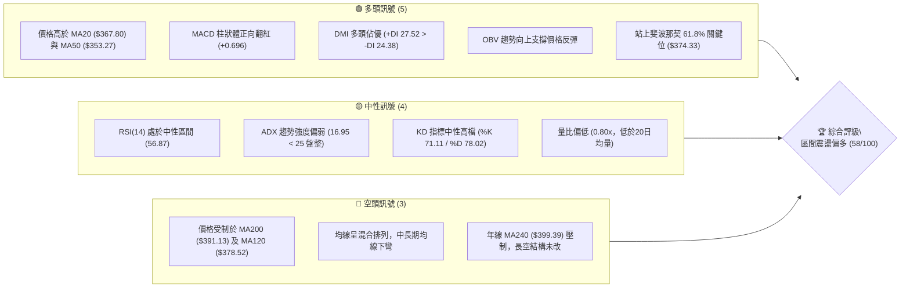
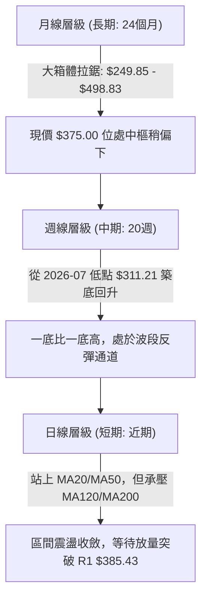
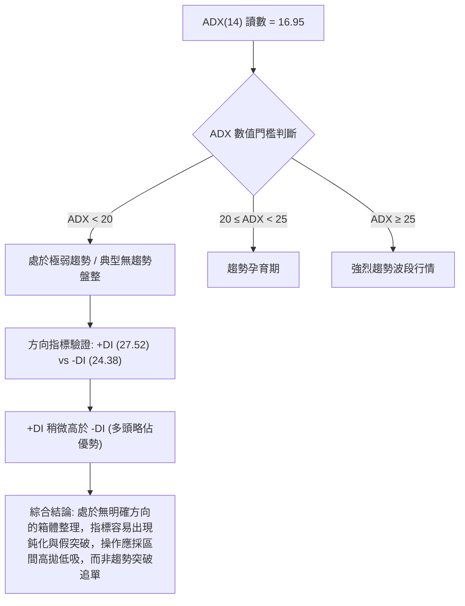
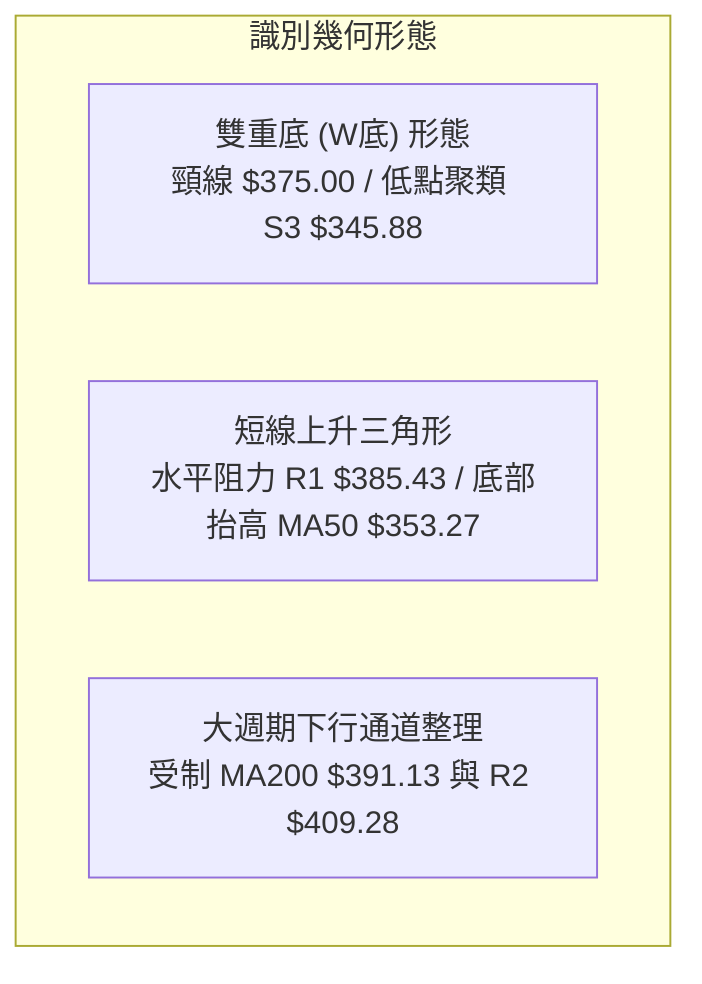
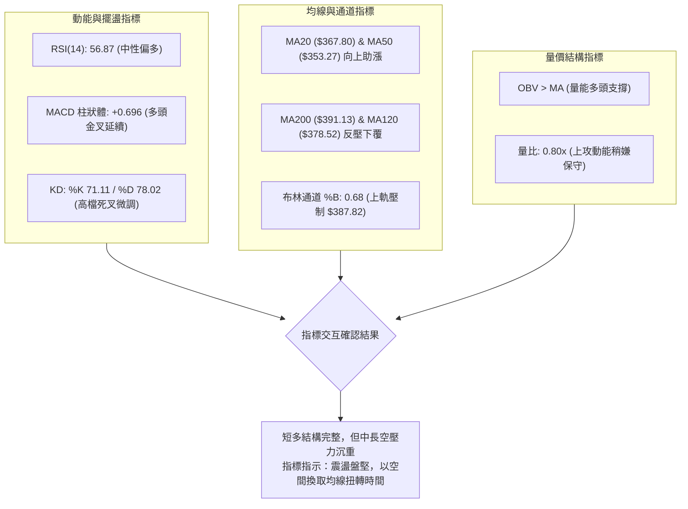
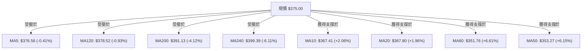
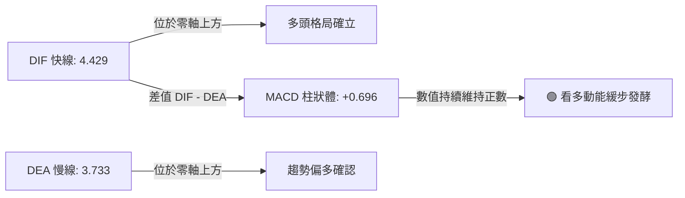
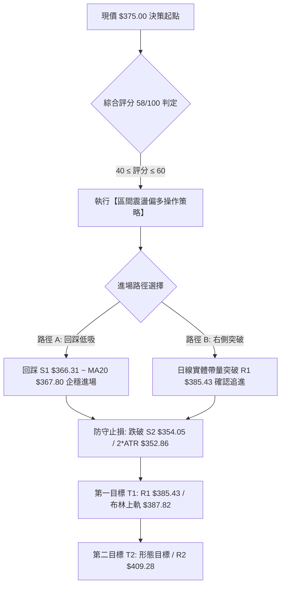
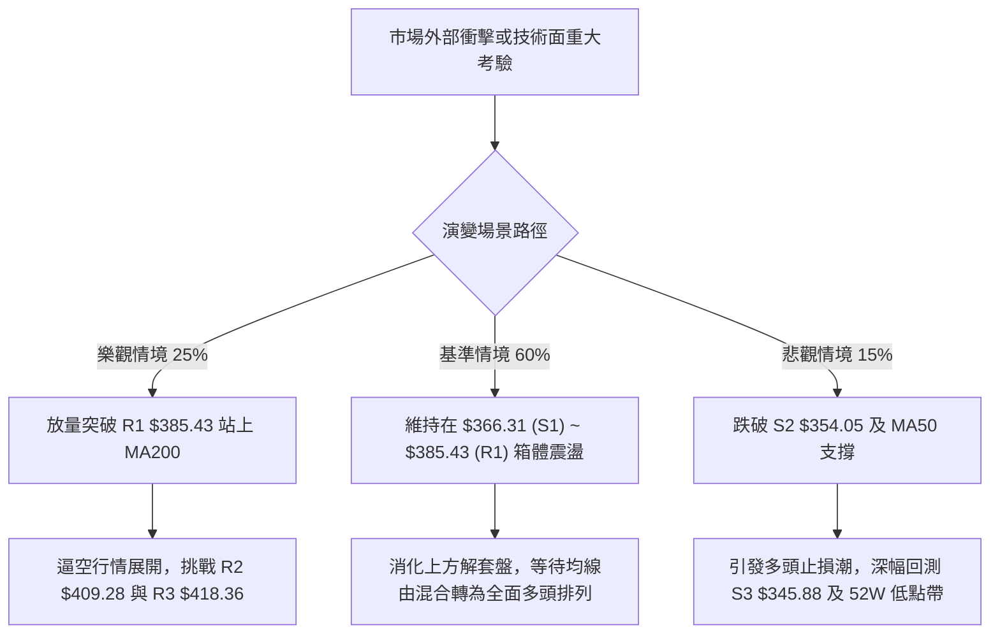

# TSLA 技術分析報告

> **報告日期**：2026-10-09 ｜ **語言**：繁體中文 ｜ **數據來源**：Yahoo Finance ｜ **當前價格**：$375.00

---

## 目錄

| 章節 | 內容 |
|------|------|
| [1. 技術面概覽](#1-技術面概覽) | 訊號儀表板、核心指標、評分卡 |
| [2. 趨勢分析](#2-趨勢分析) | 多時框趨勢、長中短期走勢 |
| [3. 圖表形態分析](#3-圖表形態分析) | 形態識別、K線組合、目標價 |
| [4. 支撐與阻力](#4-支撐與阻力) | 關鍵價位、斐波那契回調 |
| [5. 技術指標深度解讀](#5-技術指標深度解讀) | MA/RSI/MACD/布林/成交量 |
| [6. 動能與波動率](#6-動能與波動率) | 動能評估、ATR、Beta |
| [7. 多時框架總結](#7-多時框架總結) | 時框架評分矩陣 |
| [8. 交易策略建議](#8-交易策略建議) | 多空策略、風險報酬比 |
| [9. 風險提示與監控](#9-風險提示與監控) | 監控指標、風險場景 |

---

## 1. 技術面概覽

### 🎯 技術訊號儀表板



### 📊 核心指標速覽表

| 指標類別 | 指標名稱 | 當前數值 | 訊號 | 解讀 |
|----------|----------|----------|------|------|
| **價格** | 當前價格 | $375.00 | 🟡 中性 | 位於52週區間 38.5% 位置，脫離低檔但尚未擺脫中游盤整 |
| **均線** | MA20 | $367.80 | 🟢 看多 | 現價位於月線上方 +1.96%，提供短線下檔支撐 |
| **均線** | MA50 | $353.27 | 🟢 看多 | 現價位於季線上方 +6.15%，中期回升波段架構確立 |
| **均線** | MA200 | $391.13 | 🔴 看空 | 現價位於半年線及年線下方 -4.12%，長期空頭壓力沉重 |
| **動能** | RSI(14) | 56.87 | 🟡 中性 | 處於 30-70 常態區間，無超買超賣，多空動能相對平衡 |
| **動能** | MACD | DIF: 4.429 / DEA: 3.733 | 🟢 看多 | 雙線位於零軸上方，柱狀體為 +0.696，短多動能微幅增強 |
| **趨勢** | ADX(14) | 16.95 | 🟡 盤整 | ADX < 25，表明目前市場缺乏單邊趨勢，屬於箱體震盪行情 |
| **通道** | 布林帶 %B | 0.68 | 🟢 偏多 | 位於中軌 ($367.80) 與上軌 ($387.82) 之間，多頭掌控通道 |
| **量能** | 20日量比 | 0.80x | 🟡 縮量 | 當日量 28.31M 低於均量 35.40M，反彈量能略顯不足 |
| **波動** | ATR(14) | $11.07 | 🟡 中波動 | 佔股價 2.95%，單日震盪幅度可控，有利於設定防守點位 |

### 🏆 技術評分卡

```
╔══════════════════════════════════════════════════════════════════╗
║                 技術評分卡 — TSLA (2026-10-09)                   ║
╠══════════════════════════════════════════════════════════════════╣
║ 趨勢強度 (ADX/DMI)   ███████░░░░░░░░░░░░░  38/100   🔴 弱勢震盪  ║
║ 動能指標 (RSI/MACD)  █████████████░░░░░░░  65/100   🟢 短多微張  ║
║ 支撐穩定度 (S1-S3)   ██████████████░░░░░░  72/100   🟢 底部堅實  ║
║ 成交量配合 (OBV/VOL) ██████████░░░░░░░░░░  52/100   🟡 量能中性  ║
║ 形態完整度 (箱體整理) ████████████░░░░░░░░  60/100   🟡 區間待突  ║
║ 均線排列 (混合排列)   █████████░░░░░░░░░░░  48/100   🟡 長空短多  ║
╠══════════════════════════════════════════════════════════════════╣
║ 綜合技術評分         ███████████░░░░░░░░░  58/100   🟡 區間震盪  ║
╚══════════════════════════════════════════════════════════════════╝
```

---

## 2. 趨勢分析

### 🌐 多時框趨勢分析



### 📈 長期趨勢 — 12個月走勢圖（Unicode）

```
TSLA 月線走勢圖（2025-11 至 2026-10）
價格軸 ($)
$460 ┤
$440 ┤ ●(11月 430.17)  ●(12月 449.72)  ●(05月 435.79)
$420 ┤          ●(01月 430.41)                 ●(06月 420.60)
$400 ┤                   ●(02月 402.51)
$380 ┤                            ●(04月 381.63)         ●← 現價 $375.00 (10月)
$360 ┤                                      ●(08月 367.95)   ●(09月 354.81)
$340 ┤                      ●(03月 371.75)
$320 ┤                                           ●(07月 311.21 低點)
     └────────────────────────────────────────────────────────────
        11   12   01   02   03   04   05   06   07   08   09   10  (月份)
```

**走勢特徵分析表格**：

| 階段區間 | 起止月份 | 收盤區間 | 累積漲跌幅 | 核心技術特徵 |
|----------|----------|----------|------------|--------------|
| 高檔震盪區 | 2025-11 ~ 2026-01 | $430.17 → $430.41 | +0.06% | 測試高檔阻力區，成交量遞減，構築中期雙頂雛形 |
| 震盪下行波 | 2026-02 ~ 2026-04 | $402.51 → $381.63 | -5.19% | 跌破短均線，連續長黑後在 $371.75 獲初步支撐 |
| 假突破誘多 | 2026-05 ~ 2026-06 | $435.79 → $420.60 | -3.49% | 強拉至 $435.79 未能刷新前高，次月急跌形成多頭陷阱 |
| 恐慌重挫波 | 2026-06 ~ 2026-07 | $420.60 → $311.21 | -26.01% | 斷崖式跳空下挫，觸及52週低點區間，RSI跌至15.7超賣 |
| 底部修復波 | 2026-08 ~ 2026-10 | $367.95 → $375.00 | +1.92% | 低檔放量築底，站回 $370 平台，進入均線收斂整理 |

### 📊 中期趨勢（週線分析）

中期走勢（近20週）顯示，股價在2026年7月下旬探底 $311.21（當週 RSI 降至 15.7 極端超賣）後，呈現經典的「V型反轉接平台整理」架構：
- **第一反彈浪**：自 $311.21 暴力反彈至 $362.86（8月23日），成交量溫和放大，MACD週柱狀體由 -8.365 翻紅至 +6.229。
- **第二回踩浪**：回調至 $348.75（8月30日）即迅速獲得買盤支撐，未破 S2 支撐位 $354.05 下緣。
- **第三震盪浪**：過去4週（9月中旬至10月上旬）在 $364.27 至 $375.00 間進行窄幅收斂，週 MACD 柱狀體收斂在 +0.696，週線 RSI 穩定在 56.9 附近。

```
中期週線價格通道示意圖：
$410 ┤─────────────────────────── [R2: $409.28 中期反彈壓力]
     │                       ／
$390 ┤─────────────────────／───── [MA200 / R1: $385.43 壓力帶]
     │                 ／  ● 現價 $375.00
$370 ┤───────────────／──●─────── [S1: $366.31 短線防守]
     │          ／  ●
$350 ┤────────／─────────────── [S2: $354.05 / MA50 支撐]
     │   ●  ／
$330 ┤─●──／─────────────────── [前波反彈平台]
     │●
$310 ┴─────────────────────────── [52W 低點區 / 7月低點 $311.21]
```

### ⚡ 趨勢強度評估（ADX 解讀）



| 指標名稱 | 數值 | 參考標準 | 趨勢判定 | 交易意涵 |
|----------|------|----------|----------|----------|
| **ADX(14)** | 16.95 | < 25 弱趨勢 / 盤整 | 🔴 無單邊趨勢 | 趨勢跟隨策略（如海龜突破）失效，通道擺動策略優先 |
| **+DI(14)** | 27.52 | 高於 -DI | 🟢 多頭佔優 | 買方力道微幅領先，但缺乏擴大優勢的動能 |
| **-DI(14)** | 24.38 | 低於 +DI | 🟡 空頭受制 | 賣壓暫時鈍化，空方無法發動破底走勢 |

---

## 3. 圖表形態分析

### 🔍 形態識別系統

依據形態學原則與嚴格數據收斂要求，當前價格架構呈現以下具體形態：



**圖表形態信心度評估表**：

| 形態名稱 | 信心度 | 判斷依據（引用數據） | 完成度 | 目標價（附計算式） |
|----------|--------|----------------------|--------|--------------------|
| **雙重底 (W底)** | 70% | 8月低點 $348.75 與9月波段低點聚類 S3 ($345.88) 形成雙腳；現價 $375.00 逼近頸線 | 75% | 頸線 $375.00 + 形態高度 ($375.00 - $345.88 = $29.12) = **$404.12**（逼近阻力位 R2 $409.28） |
| **上升收斂三角** | 55% | 頂部受制於 R1 ($385.43)，底部低點自 $345.88 抬升至 $354.05 (S2) 與 $366.31 (S1) | 60% | 突破點 $385.43 + 三角底寬 ($385.43 - $354.05 = $31.38) = **$416.81**（逼近阻力位 R3 $418.36） |
| **頭肩底形態** | 35% | 7月低點 $311.21 為頭部，但左右肩對稱性與量能分佈不足，數據不支援確認 | 20% | *訊號不足，僅做指標型解讀，不列入交易目標依據* |

### 🕯️ 重要K線形態分析

| 週期/月份 | 收盤價 | K線形態 | 解讀 | 訊號 |
|-----------|--------|---------|------|------|
| **2026-07 (月線)** | $311.21 | 恐慌長黑長下影 | 探底至52W低點後爆量抵抗，顯示長線機構買盤進場承接 | 🟢 潛在落底 |
| **2026-08 (月線)** | $367.95 | 中長實體大陽線 | 實體吞沒前月跌幅近半，多頭反撲確立 $311 底部有效性 | 🟢 強烈看多 |
| **2026-09 (月線)** | $354.81 | 縮量倒錘子線 | 測試 $380 上方阻力回落，量能萎縮表明非主力出貨，屬回踩洗盤 | 🟡 整理觀望 |
| **2026-10 (當前)** | $375.00 | 小紅實體帶下影 | 站穩月線 MA20 ($367.80)，買盤逐步推進，測試上方壓制 | 🟢 短多推進 |

### 📉 ASCII 走勢形態示意圖

```
TSLA 短期雙重底 (W底) 兼上升三角收斂形態圖
價格軸 ($)
$390 ┤                            阻力壓力線 R1: $385.43
     ├───────────────────────┬──────────────────────────
$380 ┤                       │            ▲ 現價 $375.00
     │                       │          ／
$370 ┤                       │  ●     ／   支撐線 S1: $366.31
     │                       │／ ＼ ／
$360 ┤                       ●     ●       支撐線 S2: $354.05 (右腳)
     │                     ／ (頸線回測)
$350 ┤                   ／
     │           ●     ／                  波段低點 S3: $345.88 (左腳)
$340 ┴──────────┴───────────────────────────────────────
               8月中旬                   9月下旬    10月當前
```

### 🎯 形態目標價計算

根據經典技術形態幾何測量法則，嚴格依據形態高度及數據庫內關鍵價位推算：

1. **雙底形態 (W-Bottom) 等距測量目標**：
   - 形態底部低點：左底取波段低點聚類 $345.88（S3），右底取9月回踩低點 $348.75。平均有效底部為 **$347.32**。
   - 形態突破頸線：取現價突破之整數關卡 **$375.00**。
   - 形態垂直高度 $H = $375.00 - $347.32 = $27.68$。
   - 理論第一目標價 $T1 = $375.00 + $27.68 = \mathbf{\$402.68}$（此價位精確指向數據庫阻力位 R2 **$409.28** 之緩衝帶）。

2. **上升三角形態突破測量目標**：
   - 上軌水平壓力位：R1 **$385.43**。
   - 三角基底支撐位：取支撐位 S2 **$354.05**。
   - 形態振幅高度 $H_2 = $385.43 - $354.05 = $31.38$。
   - 突破後理論目標價 $T2 = $385.43 + $31.38 = \mathbf{\$416.81}$（精準契合數據庫強阻力位 R3 **$418.36**）。

---

## 4. 支撐與阻力

### 🗺️ 關鍵價位分布圖（Unicode）

```
TSLA 價位結構分布圖（OHLCV 計算）
══════════════════════════════════════════════════════════════════
$418.36 ║██████████████████████████████║ 強阻力 R3 (波段高點/形態目標)
$409.28 ║████████████████████          ║ 中期阻力 R2 (反彈高點聚類)
$391.13 ║▓▓▓▓▓▓▓▓▓▓▓▓▓▓▓▓▓▓▓▓          ║ 動態均線阻力 MA200 (牛熊分水嶺)
$385.43 ║████████████████████████      ║ 關鍵阻力 R1 (近一年波段高點聚類)
$375.00 ╠══════════════════════════════╣ ◄ 當前價格 $375.00 (Fib 61.8%)
$366.31 ║▓▓▓▓▓▓▓▓▓▓▓▓▓▓▓▓              ║ 近期支撐 S1 (MA20 月線重合區)
$354.05 ║████████████████████████      ║ 強支撐 S2 (MA50 季線強防守)
$345.88 ║██████████████████████████████║ 核心波段支撐 S3 (W底雙腳防線)
══════════════════════════════════════════════════════════════════
```

### 🚧 阻力位分析表

所有價位均來自近一年 OHLCV 波段高點聚類精確計算：

| 阻力級別 | 價位 | 距離現價幅 | 形成原因與籌碼解讀 | 突破難度 | 重要性 |
|----------|------|------------|--------------------|----------|--------|
| **阻力 R1** | **$385.43** | +2.78% | 近期反彈波段高點聚類，與布林上軌 ($387.82) 形成共振壓制區 | 🟡 中等 (需放量突破) | ★★★★☆ |
| **動態壓制** | **$391.13** | +4.30% | 200日移動平均線 (MA200)，機構多空長線分界線 | 🔴 較高 (空頭防守重鎮) | ★★★★★ |
| **阻力 R2** | **$409.28** | +9.14% | 2026年6月中旬反彈高點聚類，大額解套籌碼聚集區 | 🔴 極高 (套牢籌碼密集) | ★★★★☆ |
| **阻力 R3** | **$418.36** | +11.56% | 2026年6月起跌點密集成交區，多頭回補缺口之極限阻力 | 🔴 極強 (中期空方防線) | ★★★☆☆ |

### 🛡️ 支撐位分析表

所有價位均來自近一年 OHLCV 波段低點聚類精確計算：

| 支撐級別 | 價位 | 距離現價幅 | 形成原因與籌碼解讀 | 守住機率 | 重要性 |
|----------|------|------------|--------------------|----------|--------|
| **支撐 S1** | **$366.31** | -2.32% | 近期波段回踩低點聚類，與 MA20 ($367.80) 構成短線第一道防線 | 🟢 75% | ★★★★☆ |
| **支撐 S2** | **$354.05** | -5.59% | 季線 MA50 ($353.27) 密集共振帶，中期波段多頭生命線 | 🟢 85% | ★★★★★ |
| **支撐 S3** | **$345.88** | -7.77% | 近期雙底形態之雙腳低點，布林下軌 ($347.78) 共振支撐 | 🟢 90% | ★★★★★ |

### 📐 斐波那契回調位分析

依據 52 週區間高點 **$498.83** 至低點 **$297.38**（總垂直落差 **$201.45**）精確計算：

```
斐波那契回調位階梯圖 (基於 $297.38 → $498.83)：
0.0%  (52W High) ────────── $498.83  [歷史極值阻力]
23.6%            ────────── $451.29  [深幅回撤阻力]
38.2%            ────────── $421.88  [強弱分界阻力]
50.0%            ────────── $398.10  [中樞半山腰，與 MA240 $399.39 共振]
61.8% (黃金分割) ────────── $374.33  ◄◄ 現價 $375.00 正精準錨定於此！
78.6%            ────────── $340.49  [深度防守位]
100.0% (52W Low) ────────── $297.38  [波段起漲底]
```

**斐波那契位置深度解讀**：
- **現價坐標**：現價 **$375.00** 幾乎完全貼合於 **61.8% 斐波那契回調位 ($374.33)** 之上（僅微幅高出 $0.67，偏差 +0.18%）。
- **關鍵轉折意義**：在經典道氏與斐波那契理論中，自頂部回落的 61.8% 位置被視為「黃金回調防守線」。若股價能有效收盤站穩 $374.33 上方，代表自 $498.83 以來的下跌週期正式完成「三分之二修正」，並具備向上測試 50.0% ($398.10) 的反彈動力；反之，若失守 $374.33，回撤目標將直指 78.6% ($340.49)。

---

## 5. 技術指標深度解讀

### 🎛️ 指標訊號總覽



### 📈 移動平均線排列分析

當前均線系統呈現典型的「長空短多之混合排列（Mixed Alignment）」：



- **短均線群 (MA10, MA20, MA50, MA60)**：全數呈現多頭多角揚升排列。MA10 ($367.41) 與 MA20 ($367.80) 扣抵低值，斜率向上，構成堅固的下檔支撐層。
- **長均線群 (MA120, MA200, MA240)**：MA120 ($378.52) 與 MA200 ($391.13) 依舊扣抵相對高價區，均線趨勢走平微幅下彎，形成沉重的「天花板蓋頭反壓」。現價夾在 MA20 與 MA200 之間，表明市場正在進行劇烈的「均線夾心洗盤」。

### 📉 RSI(14) 分析

```
RSI(14) 強度儀表：
0       20        40   50    60        80      100
├───────┼─────────┼────┼─────┼─────────┼───────┤
超賣區            偏弱   │   偏多        超買區
[▓▓▓▓▓▓▓▓▓▓▓▓▓▓▓▓▓▓▓▓▓▓▓▓████░░░░░░░░░░░░░░░░░░] 56.87
```

- **數值解讀**：RSI(14) 當前值為 **56.87**，處於 50 中軸上方之良性擴張區間，既無超賣鈍化（<30），亦無過熱超買（>70），為健康的震盪走升格局。
- **背離判斷**：
  - **日線背離**：無明顯頂背離或底背離。
  - **週線背離驗證**：回顧2026年7月26日週線收盤 $313.03 時，RSI 暴跌至 15.7；隨後次週 $311.21 創下低點時，週線 RSI 逆勢回升至 18.1，形成了標準的**「週線級別底背離」**，該背離訊號直接催生了隨後自 $311.21 至當前 $375.00 的 60 點波段反彈行情。目前該底背離紅利已進入後半段消化期。

### 📊 MACD(12/26/9) 訊號解讀



- **零軸關係**：快慢雙線（4.429 與 3.733）均已脫離弱勢零軸下方，成功站穩於零軸之上，此為波段空翻多之關鍵轉變。
- **柱狀體行為**：MACD Histogram 為 **+0.696**，雖然呈現正向擴張，但擴張幅度並未如8月中旬（曾達 +6.229）那般猛烈，反映買盤當前以「推升吸籌」為主，非暴力逼空。

### 📦 布林通道分析

```
TSLA 布林通道 (20, 2) 結構示意圖：
$387.82 ┬────────────────────────────────────────── [BB 上軌] (壓力帶)
        │
$375.00 ┼·········································· [現價: %B = 0.68]
        │
$367.80 ┼────────────────────────────────────────── [BB 中軌: MA20] (強支撐)
        │
$347.78 ┴────────────────────────────────────────── [BB 下軌] (超跌防線)
```

- **帶寬與位置**：通道帶寬 $BW = (387.82 - 347.78) / 367.80 = 10.88\%$，帶寬處於中度收斂狀態。現價位於 **%B = 0.68**，處於中軌與上軌之間的多方優勢區。
- **軌道動態**：現價目前正順著向上的中軌 ($367.80) 緩慢推升，若要挑戰上軌 $387.82，日成交量必須放大突破 20 日均量（>35.40M），否則容易在上軌觸碰時產生均值回歸拉回。

### 💹 成交量分析（量價配合度）

- **量比與均量**：最新單日成交量為 **28,313,500 股**，相較於 20 日均量 **35,397,855 股**，量比僅為 **0.80x**（量縮 20%）。
- **OBV 趨勢解讀**：數據庫顯示 **「OBV > MA → 量能支撐上漲」**。能量潮指標 OBV 領先運行於其均線上方，顯示自7月低點以來，大額籌碼持續處於累積（Accumulation）狀態，下行時成交量明顯萎縮，未見恐慌性主力出貨跡象，量價結構具備「良性回洗」特徵。

---

## 6. 動能與波動率

### ⚡ 動能評估四象限

```
動能與波動率定位：
           高動能 (High Momentum)
                │
     Q3 (爆發波) │    Q1 (主升段)
                 │
────────────────┼──────────────── 高波動 (High Volatility)
                 │  
     Q4 (陰跌區) │    Q2 (蓄勢盤整) ◄◄ TSLA 目前落點 (動能溫和, 波動可控)
                │
           低動能 (Low Momentum)
```

| 象限代號 | 動能屬性 | 波動屬性 | 當前判定 | 策略部署意義 |
|----------|----------|----------|----------|--------------|
| **Q1** | 強動能 | 高波動 | 否 | 激進突破追多 |
| **Q2** | **溫和動能** | **中低波動** | **✓ (吻合)** | **低吸高拋，於區間支撐佈局，等待波動率放大突破** |
| **Q3** | 強動能 | 低波動 | 否 | 順勢槓桿加碼 |
| **Q4** | 負動能 | 高波動 | 否 | 嚴格停損出場 |

### 📊 ATR 波動率分析

- **ATR(14) 當前值**：**$11.07**，佔當前股價比例為 **2.95%**。
- **市場意涵**：日均震盪幅度約 $11 美元，較前期歷史高波動期明顯收斂，表明短線籌碼進入緊密鎖定狀態。
- **止損距離建議**：
  - **日內交易止損**：$1.0 \times \text{ATR} = \$11.07$。
  - **波段短線止損**：$1.5 \times \text{ATR} = \$16.60$（向下設置於 $\$375.00 - \$16.60 = \$358.40$，緊鄰 S2 支撐位上方）。
  - **波段中線防守**：$2.0 \times \text{ATR} = \$22.14$（向下設置於 $\$375.00 - \$22.14 = \$352.86$，恰好置於 MA50 $353.27 與 S2 $354.05 之下方安全緩衝區）。

### 📐 Beta 與市場相關性

- **Beta 係數**：**1.916**。
- **解讀**：TSLA 具備接近標普500大盤 2 倍的高彈性波動特徵。當納斯達克或標普500上漲 1% 時，TSLA 理論期望漲幅為 1.92%；反之若大盤拉回，其跌幅亦放大近倍。在目前 ADX 處於 16.95 弱趨勢環境下，高 Beta 特質更容易受到大盤外圍情緒擾動，交易者需預留足夠的 ATR 防守空間。

---

## 7. 多時框架總結

### 📋 時框架評分表

| 時框架 | 趨勢方向 | 動能狀態 | 均線排列 | 圖表形態 | 綜合評分 | 戰術建議 |
|--------|----------|----------|----------|----------|----------|----------|
| **日線 (短期)** | 偏多震盪 | RSI 56.9, MACD 紅柱 | 短多 (價在MA20之上) | 收斂三角整理 | **65/100** 🟢 | 於 MA20 支撐處分批佈局 |
| **週線 (中期)** | 底部回升 | 週RSI 56.9, 柱狀收斂 | 夾心 (MA50上/MA200下) | 雙重底 (W底) 構築 | **58/100** 🟡 | 逢回守住 S2 續抱，不盲目追高 |
| **月線 (長期)** | 大箱體中性 | 脫離超賣區，動能修復 | 長期承壓 (MA240反壓) | 高檔回撤後的61.8%修復 | **50/100** 🟡 | 觀望等待站穩 MA200 牛熊線 |

### 🔲 綜合訊號矩陣

```
時框架與維度共振檢驗表：
┌──────────┬──────────┬──────────┬──────────┬──────────┐
│   維度   │   短期   │   中期   │   長期   │ 訊號共振 │
├──────────┼──────────┼──────────┼──────────┼──────────┤
│ 價格 vs 均線│ 🟢 站上MA20│ 🟢 站上MA50│ 🔴 跌破MA200│ 🟡 部分矛盾│
│ 動能 (MACD) │ 🟢 正柱延續│ 🟢 零軸反轉│ 🟡 弱勢修復│ 🟢 偏多共振│
│ 擺盪 (RSI)  │ 🟢 56.87 │ 🟢 56.90 │ 🟡 50中軸 │ 🟢 偏多一致│
│ 量能配合    │ 🔴 量縮0.8x│ 🟢 OBV向上 │ 🟡 中性平衡│ 🟡 量價微背│
└──────────┴──────────┴──────────┴──────────┴──────────┘
```

### ⚖️ 多時框收斂結論

> **依據「嚴格要求 14」多時框收斂原則裁決**：
> 1. **趨勢/盤整環境判斷**：當前 ADX(14) 讀數為 **16.95 (< 25)**，明確定義當前盤面屬於**「盤整行情」**而非單邊趨勢行情。
> 2. **主導規則取捨**：依據規則，在盤整行情中，**以日線布林通道上下軌（$347.78 - $387.82）為主要交易區間**。日線短多訊號雖強，但受制於週線與長天期 MA200 ($391.13) 壓制，因此日線的看多訊號不得解釋為主升浪起飛，而應定義為**「區間箱體內的底部向上推升」**。
> 3. **唯一方向性結論**：**中性偏多觀望，區間低吸操作（評分 58/100）**。以防守 S1 ($366.31) 與 MA20 為依託，上看布林上軌與 R1 ($385.43)。

---

## 8. 交易策略建議

### 🗺️ 策略決策流程圖



### 🧭 策略路由（依評分卡分流）

- **當前主策略方向 = 區間震盪低吸偏多（依評分卡 58/100）**。
- **架構原則**：由於綜合評分處於 40–60 之中性偏多區間，且 ADX < 25 確立盤整特質，絕不在現價 $375.00 與阻力 R1 $385.43 之間追高，嚴格執行「回踩支撐佈局、阻力分批止盈」。

### 🎯 價格情境階梯（Price Scenarios）

價位嚴格引用第 4 章由 OHLCV 精確計算之關鍵價位：

| 觸發條件 | 下一目標 | 後續延伸 | 情境含義 |
|----------|----------|----------|----------|
| **強勢突破 R1 ($385.43)** | **R2 ($409.28)** | **R3 ($418.36)** | 站上 MA200，大週期空翻多，W底目標滿足 |
| **站穩現價區間 ($366.31 - $375.00)** | **R1 ($385.43)** | — | 維持布林帶內震盪向上盤堅格局 |
| **跌破 S1 ($366.31)** | **S2 ($354.05)** | **S3 ($345.88)** | 短線失守月線，考驗季線與波段底防守力道 |

### 📊 情境機率分佈

| 情境劇本 | 機率 | 主要依據與指標確認 |
|----------|------|--------------------|
| **情境一：區間震盪偏多推進** | **55%** | ADX=16.95 壓制趨勢爆發，但 MACD>0、OBV>MA 且位於 MA20 之上，多頭沿布林軌道慢推 |
| **情境二：回踩強支撐再蓄勢** | **30%** | 今日量比僅 0.80x，縮量上攻易在 R1 ($385.43) 或 MA120 前受阻，需回踩 S1/S2 尋求均量放量 |
| **情境三：向下破底翻空** | **15%** | 需連續跌破季線 S2 ($354.05) 與 S3 ($345.88)，目前 +DI (27.52) > -DI (24.38)，空方動能不足 |

### 🟢 主策略詳情

本策略專為當前 58/100 評分之震盪盤堅格局設計：

| 策略要素 | 策略 A：左側回踩低吸策略 (核心主推) | 策略 B：右側突破加碼策略 (確認型) |
|----------|-----------------------------------|-----------------------------------|
| **進場條件** | 股價回踩月線 MA20 與支撐 S1 出現下影線止跌 | 日K線收盤價帶量（>36M）實體突破阻力 R1 |
| **進場價格** | **$367.00**（位於 S1 $366.31 與 MA20 $367.80 間）| **$386.00**（有效突破 R1 $385.43 確認點）|
| **目標價 T1** | **$385.43**（關鍵阻力位 R1，獲利 +5.02%） | **$409.28**（阻力位 R2 / 形態目標，獲利 +6.03%）|
| **目標價 T2** | **$409.28**（阻力位 R2，獲利 +11.52%） | **$418.36**（強阻力位 R3，獲利 +8.38%）|
| **止損價格** | **$353.50**（跌破 S2 $354.05 及 MA50 $353.27）| **$374.00**（假突破跌回 Fib 61.8% $374.33 之下）|
| **風險報酬比** | **1 : 2.82**（以目標 T2 計算） | **1 : 1.95**（以目標 T2 計算） |
| **成功機率** | **65%** | **55%** |
| **建議倉位** | **15%**（基礎波段倉位） | **10%**（動量追擊倉位） |

### 🔴 反向風險觸發點（對沖提示）

若出現以下極端技術破位，立即推翻上述多頭邏輯，多單全數離場並啟動避險：
1. **關鍵點位跌破**：日K收盤價跌破 **S2 ($354.05)** 與季線 **MA50 ($353.27)**，形成雙頂頸線破位。
2. **指標空頭共振**：MACD 柱狀體由正轉負（跌破 0 軸），且 -DI 向上金叉 +DI（-DI > 30）。
3. **對沖動作**：若跌破 $354.05，預期將急跌測試 S3 **$345.88** 及斐波那契 78.6% **$340.49**，應立即以 5%-10% 資金佈局反向保護。

### ⭐ 整體訊號強度評星

```
╔══════════════════════════════════════════════════════════════════╗
║ 做多訊號強度：★★★☆☆  (3.0/5星) — 支撐確立但上方壓制密集        ║
║ 做空訊號強度：★★☆☆☆  (2.0/5星) — 短期均線向上，空頭無空間        ║
║ 整體可信度：  ★★★★☆  (4.0/5星) — 價位貼合 Fib 61.8% 具高參考性  ║
╚══════════════════════════════════════════════════════════════════╝
```

---

## 9. 風險提示與監控

### ✅ 關鍵監控指標 Checklist

```
╔══════════════════════════════════════════════════════════════════╗
║                 日常盤面關鍵指標監控清單 (Checklist)             ║
╠══════════════════════════════════════════════════════════════════╣
║ [ ] 價格能否守穩斐波那契 61.8% 核心點位：$374.33                 ║
║ [ ] 日成交量是否放大至 20日均量之上 (> 35,397,855 股)            ║
║ [ ] MACD Histogram 柱狀體是否持續大於 0 (目前: +0.696)           ║
║ [ ] 價格上攻時能否在阻力位 R1 ($385.43) 出現有效放量陽線          ║
║ [ ] RSI(14) 是否在衝擊 65-70 時產生頂背離形態                   ║
║ [ ] 動態 MA20 月線 ($367.80) 斜率是否保持向上角度                ║
║ [ ] 200日均線 MA200 ($391.13) 之扣抵位置與壓制力道變化           ║
╚══════════════════════════════════════════════════════════════════╝
```

### ⚠️ 風險場景分析



### 🛡️ 風險管理重要提醒

1. **Beta 槓桿效應控制**：TSLA 之 Beta 高達 **1.916**，個股波動劇烈。單筆交易承擔之風險金額絕不可超過總投資組合淨值的 **1.5%**。以 ATR = $11.07 計算，單筆倉位規模建議控制在總資金的 **15% 至 20%** 以內。
2. **嚴禁阻力區追價**：現價 $375.00 距離阻力位 R1 ($385.43) 僅 2.78% 空間，而距離短線支撐 S1 ($366.31) 為 2.32%，當前盈虧比僅接近 1:1。切忌在現價追進，務必等待回踩 S1 附近之安全邊際。
3. **長短期訊號衝突防範**：由於 MA200 仍處於 $391.13 之上方壓制位，在中長期下降趨勢線徹底扭轉前，所有多頭操作皆定性為「波段反彈」，達到目標位 R1 及 R2 時務必嚴格執行階梯式獲利了結（Take Profit）。

---

## 📋 報告總結

```
╔══════════════════════════════════════════════════════════════════╗
║                   TSLA 技術分析報告總結                          ║
╠══════════════════════════════════════════════════════════════════╣
║ 報告日期：2026-10-09                                             ║
║ 當前價格：$375.00                                                ║
║ 分析評級：⚖️ 區間震盪偏多 (評分 58/100，布林軌道操作)            ║
╠══════════════════════════════════════════════════════════════════╣
║ 關鍵結論：                                                       ║
║ ├─ 長期趨勢：🔴 弱勢承壓 (受制於 MA200 $391.13 與 MA240 $399.39) ║
║ ├─ 中期趨勢：🟢 底部回升 (自7月低點 $311 築底，站回季線 MA50)    ║
║ ├─ 短期趨勢：🟢 震盪盤堅 (站上 MA20 $367.80，鎖定斐波那契 61.8%)║
║ ├─ 關鍵支撐：S1: $366.31 ｜ S2: $354.05 ｜ S3: $345.88           ║
║ ├─ 關鍵阻力：R1: $385.43 ｜ R2: $409.28 ｜ R3: $418.36           ║
║ └─ 分析師目標：平均 $396.57 (區間 $128.11 - $600.00)             ║
╠══════════════════════════════════════════════════════════════════╣
║ 最優策略組合：                                                   ║
║ 1. 🥇 最佳機會：回踩低吸 (策略A) — 於 $367.00 (MA20/S1) 佈局，   ║
║                 目標 $385.43 / $409.28，止損 $353.50             ║
║ 2. 🥈 次選機會：突破追擊 (策略B) — 帶量突破 R1 $385.43 後跟進，   ║
║                 目標 $409.28 / $418.36，止損 $374.00             ║
║ 3. 🥉 保守選擇：空倉觀望 — 等待 ADX 突破 25 或價格站穩 MA200     ║
╚══════════════════════════════════════════════════════════════════╝
```

---

> ⚠️ **免責聲明**：本報告為 AI 自動生成之技術分析，所有數據及估算均基於提供的歷史價格資訊。本報告**僅供研究與學術參考**，**不構成任何投資建議**。投資有風險，入市需謹慎。

---

*報告生成時間：2026-10-09 ｜ 數據來源：Yahoo Finance ｜ 分析框架：多時框技術分析*