<details>
<summary>📊 靜態圖表 (點擊展開)</summary>
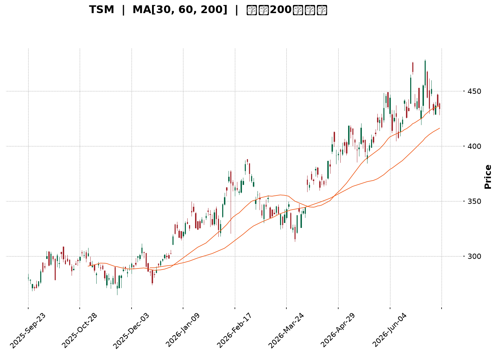
</details>

<html>
<head><meta charset="utf-8" /></head>
<body>
    <div style="height:500px; width:100%;">                        <script>window.PlotlyConfig = {MathJaxConfig: 'local'};</script>
        <script charset="utf-8" src="https://cdn.plot.ly/plotly-3.7.0.min.js" integrity="sha256-jvTGqxNp8AGWEcvNLVuKr+8j5dGe9Yw51LQkmDH+IYA=" crossorigin="anonymous"></script>                <div id="candlestick-chart" class="plotly-graph-div" style="height:100%; width:100%;"></div>            <script>                window.PLOTLYENV=window.PLOTLYENV || {};                                if (document.getElementById("candlestick-chart")) {                    Plotly.newPlot(                        "candlestick-chart",                        [{"close":{"dtype":"f8","bdata":"AAAAwP6HcUAAAADgPmhxQAAAAMDzJ3FAAAAAgJDzcEAAAABggPFwQAAAACC0UXFAAAAAYG\u002fjcUAAAABAuN1xQAAAAGB9HnJAAAAAgJLAckAAAAAAsztyQAAAAAA64nJAAAAAQJGYckAAAACgc2dxQAAAAABayHJAAAAAIAVackAAAABgPuVyQAAAAKDul3JAAAAAIF5MckAAAADg9XVyQAAAAMBRQ3JAAAAAgPHpcUAAAAAAUAdyQAAAAIB2SnJAAAAAILF+ckAAAADAwrJyQAAAAKBG63JAAAAA4JbNckAAAABgTKFyQAAAAMCf53JAAAAAYAQ8ckAAAAAggjVyQAAAAICo73FAAAAAQCnEcUAAAABAYk9yQAAAAABMDnJAAAAA4JAFckAAAABA5n9xQAAAAMB9qXFAAAAAIOJ8cUAAAADAyztxQAAAACCZgnFAAAAAgEk1cUAAAABAjQ5xQAAAAGCipnFAAAAA4ESncUAAAACgFvtxQAAAAMCxE3JAAAAAwOTWcUAAAADg5hxyQAAAAAA+UnJAAAAAoDwqckAAAAAgp0ZyQAAAAIAouHJAAAAAIJvQckAAAADgcTtzQAAAAOCH9HJAAAAAwJ8ockAAAABgLeRxQAAAAEBU1nFAAAAAgJU4cUAAAAAgeLNxQAAAACBw93FAAAAAwFw8ckAAAADAx3ZyQAAAAGA6lHJAAAAAIInUckAAAABg+bVyQAAAAOCkoHJAAAAAAEDlckAAAAAAet9zQAAAAOB\u002fCXRAAAAAIPRbdEAAAABArNBzQAAAAEACxnNAAAAAYHcfdEAAAABgCaF0QAAAAGAfmHRAAAAAINxWdEAAAABAJT51QAAAAAA+SnVAAAAA4KdXdEAAAAAAGkd0QAAAAKD\u002fWnRAAAAAwGHSdEAAAADg\u002f690QAAAAMCdCXVAAAAAoKZIdUAAAACA4Bx1QAAAAMDGjXRAAAAAILA5dUAAAACgY+B0QAAAAIANQXRAAAAAgHuQdEAAAACg6bB1QAAAACBVGXZAAAAAYMyAdkAAAAAgrUJ3QAAAAGBU43ZAAAAA4KHHdkAAAAAAQKV2QAAAAKBehnZAAAAAgJpodkAAAABAKwp3QAAAAKA1AndAAAAAIEf8d0AAAACAyxt4QAAAACD5bXdAAAAA4HlKd0AAAADgZ\u002fN2QAAAAGAK9XVAAAAAYKU5dkAAAAAAqQB2QAAAACBfEnVAAAAAYIaudUAAAACg5ZR1QAAAAGDNC3ZAAAAAoKvvdEAAAACAIwl1QAAAAICzJ3VAAAAAIL+SdUAAAAAgbSx1QAAAAMD5H3VAAAAAQIiHdEAAAABgjBp1QAAAACArZ3VAAAAAIACvdUAAAACgkVV0QAAAACCgX3RAAAAAICu8c0AAAAAgkRJ1QAAAAAATS3VAAAAAYPcjdUAAAABgYk91QAAAACA2iHVAAAAAwLjQdkAAAABgLcp2QAAAAAC\u002fG3dAAAAAAE4Ld0AAAAAACrB3QAAAAACUY3dAAAAAYASodkAAAABgJhp3QAAAACAm1nZAAAAAIIXzdkAAAACAjih4QAAAAGBB3HdAAAAAoFAYeUAAAACAikB5QAAAAADGdnhAAAAAwI6OeEAAAACAJ7J4QAAAAMDay3hAAAAAIL8KeUAAAAAA0Zd4QAAAAIBRKHpAAAAAAOvSeUAAAACAfat5QAAAAICEOXlAAAAAAKHFeEAAAADA2u14QAAAAKDnC3pAAAAAIHw2eUAAAAAgZrB4QAAAAEAVe3hAAAAAIOgKeUAAAAAALmN5QAAAAMAyOXlAAAAA4LS1eUAAAACg4Ft6QAAAAKDgfXpAAAAAwI4XekAAAACgyyl7QAAAAIBX2ntAAAAAQLc6e0AAAACgFr57QAAAAEAz43lAAAAAYNicekAAAABAua56QAAAAGC4fHlAAAAAwB5RekAAAABA4X56QAAAAGBmlntAAAAAoEedekAAAABgZgJ7QAAAAIDr4XxAAAAAYLg6fUAAAACAPUZ7QAAAAKBHjXtAAAAAANcve0AAAACgmQV7QAAAAKCZcXxAAAAAwB7ZfUAAAAAgrsN7QAAAAGCPIntAAAAA4KM8fEAAAADAHgl7QAAAACCuT3tAAAAAIFxPe0AAAACAwiF7QA=="},"high":{"dtype":"f8","bdata":"kztsRDm8cUBStAXdLnBxQH9a3ICSL3FADC4DeIkVcUBnkX8d6VpxQJdmkNjgVHFAVvAHAlgDckD9UEInZ2ZyQK3v9fHsW3JABq3m9VsOc0AbZc8zLwtzQHGYkEsSAHNAeT3l52XHckCBrRXCpZ1yQKNJrUf543JAodIX0UC2ckBuHgfoZwNzQB6EKET4TnNALF1BBNzOckD7aBB2atRyQKi+uZ14kHJAmzkx3EVOckAPbvzmpjxyQEuL1N\u002fteXJAWSuX1heickCqnhkpSbxyQIZy2jfWGHNAR4DahYQOc0CTHQs0ZBRzQFooEE4gO3NAeSaqXBC6ckD9hTgVN35yQF8XZxJiRXJAWcKdPDracUCEMnxP6WxyQLzsIunTSXJAXiiZxghJckC2uMs6yfNxQI8GGyzgyXFAnvxaQaPEcUBAkJac\u002fV9xQHZ4lZA0pXFAJY20kPcockC5+MSALUhxQGx9\u002fSxNrXFApIR38bKycUADe7D7VChyQP3TMPobJnJAx3\u002fgbiMOckANHr0SKUNyQNtejsjQZHJArXcmBrM7ckDONv4LLKdyQKolcnsQxHJACSqcVMTkckAdsBqIZ3hzQCIYmAhKBHNARXfQEXXrckAVREdxeWRyQHCp7Gaj73FAJqn2bNP5cUArlFoK8tpxQG2U+3WxKnJAxXtwdOZXckCFhDeqD4ZyQHUjwGv1mXJA0pWsoSHdckCfAj2i9e5yQL5vJV\u002fB73JAjdpiUfYcc0CQt\u002f1w\u002fv5zQEosWWfCmHRATr8djuO1dECe3Y5U90l0QIiQZp9QLXRA7s81wJwxdEDEf+zGXr10QGcHGPEN63RAoblFO6KCdEBzQ2VhY9h1QMdunGjUwHVA5t7ETENGdUBusiOwzb50QDK1oTE\u002f1XRAojhCoKz2dEBEp2QPC9Z0QCxhxdzvN3VAfgwTgpZ7dUDNs6GKkl91QFYter9yInVA7lUSFuVmdUAW8mh7QpR1QGQdYE\u002fwEHVA4h7GSJvNdEBZllHPwr51QPd3SioHXHZASRtJACqudkBLbyOMEJp3QNf4JTvAoHdAVza44D0Td0BMLzjlFcV2QGcuygXd93ZAVrPIA\u002feOdkBQAbStlyR3QNmo7KErOHdAWJCMKuAyeECc32RKRUN4QPbGFiO9B3hAz5lHSudrd0D3YTIA6zJ3QMOLXABoInZAmR7r6L5zdkDmpraF9Vl2QI8FrM7XrnVAQvuOw6q5dUD0NzMO7vp1QMQ\u002faoM2OHZAhMYMsLaRdUC6L7nj\u002fGt1QOo\u002fuD69bXVALPsUiTKfdUDzjAluMbJ1QG1mtKCxMXVA6ecg3\u002foMdUCC7sIIuWl1QN3gpgYwgXVAGLVeiRnadUC9XBzd0EF1QBBEROOjjHRAJdZZYkeNdECT1BPZ6Bl1QH1qY3HYvXVALe8AQVVUdUDa\u002fzhGVXZ1QFwljT2Qi3VAlvHovM5Wd0D3OF8a9fR2QNyzsY7ekXdAWmG8SXkpd0At9ccmRtR3QGV67Khm0XdA\u002fkQUclwVd0DfX6ZiPWt3QMJN4DhJE3dAcl668iMed0CJ5owgDzB4QHnZs5+gPXhAffRAOYiIeUAJyf1Egdh5QDSKMfQLz3hAaVQ3a82ueEDj+cR\u002fu914QCg14OS8MHlA1DwMmPVreUAT9un35VJ5QIsIANaCK3pA4WoZpEwwekDTrH9WaQB6QNR25ThwbHlAP1W4qM0UeUDWlKWMwDt5QDOoDPS+T3pA+NnrLJmOeUD0aDfH3l55QCoBET8r33hAtX5Xf\u002fsueUA3y\u002fyA+qd5QAV1cWVem3lAu1PyN0X4eUApeM5ptNh6QBTrOYedqXpAVsb4AfPWekDbROvxcAV8QKlCs5NR9XtABWaMeLsRfECUz\u002f6tae97QMKqpQEuDntA4Ad2Sr4Me0Dj4ERBLlJ7QGYoIPwulXpAAAAAAABkekAAAABACq96QAAAAKBHqXtAAAAAoEeFe0AAAAAAAKh7QAAAACCFE31AAAAA4KPMfUAAAACgR\u002fV7QAAAAIDCvXtAAAAAYGZOfEAAAACAFEJ7QAAAAKCZgXxAAAAAAADwfUAAAAAAKUh9QAAAACCF13xAAAAA4HrAfEAAAADAzHx7QAAAAADXh3tAAAAAQAr7e0AAAABgj3p7QA=="},"hovertemplate":"\u003cb\u003e%{x|%Y-%m-%d}\u003c\u002fb\u003e\u003cbr\u003e\u958b: $%{open:.2f}\u003cbr\u003e\u9ad8: $%{high:.2f}\u003cbr\u003e\u4f4e: $%{low:.2f}\u003cbr\u003e\u6536: $%{close:.2f}\u003cextra\u003e\u003c\u002fextra\u003e","low":{"dtype":"f8","bdata":"WO2UaPlccUCwGsOl5yhxQJeXMdE9wXBA5\u002fegPhHIcEAAAABggPFwQDsN4bgG+3BA3rbJfAwwcUCRbbU1k8xxQBHnnpCAA3JAqvz7JoWZckC09oMEyy9yQPgSnMfnOnJAMI8j54NxckAk6H5xNmJxQMjRNbyNIHJANXhIz\u002f4QckBv4CeWlZtyQDUo5h\u002ftZXJAxpZ2\u002f9NJckBdrdbezGtyQK28XljTNXJAn6Vn19KicUA5YM2Z2fVxQHZ9qiBqQXJAQLFoZk02ckA7OKcHPlxyQDnVcEhBwHJAvvFbW32nckAedbx2xGVyQDTgon4gvHJArGWv6nEzckA89dwniRNyQGJSOpAh0nFAOKqDz2kvcUCZdBEZgRdyQPZ3x19r6nFA\u002fkv3TQ71cUCU1atz+VxxQLsJq0eA8XBA+GKmpcxZcUAsR5mzZ+lwQNFjWB2OInFAlDrJx\u002fsjcUDwcXYgvotwQK7H7Mrd8HBAP4VBuB7vcEDuWlkJsNdxQFhZRiHZ63FAyk7uiJ2PcUCemkWwtO5xQF+jq+BVvXFAKg9hDOb+cUD+ESMTUS9yQHiDBQxnZnJABZxJ\u002fKiCckDARA4IKcJyQK5gem6ZoXJAz9K\u002fUMAXckCi0AAgJ+FxQMXiMDzSnXFAK\u002fUKlKgacUANO8GO1IRxQLtO6XqHznFAksLnk2kbckAd+Ky\u002fKytyQNdgfdpRa3JA0RtHUsWPckAHsucp15FyQEe2eDyTnnJAaW40b+3dckCEqsJFkWFzQPrmDaqP\u002fXNA6nLHSb8udEDXVG\u002fScc5zQEP3\u002fR0+qHNAGWzOItTJc0BssyG4jvZzQDJWZy1HkXRAonSBlWgydEDn+l5w7gJ1QJ8NFopHO3VA5LlMWYRTdEC3Z1EDGUB0QApoA2WEU3RA3VnFbquadEBlonYVhoh0QLxH\u002f3NyzXRA\u002fnoU4bUOdUCY5u7wNWh0QNE0aFyJdnRAuHZyWYl2dEDSzoohLoV0QDuau6rh1nNAftR\u002fAh3gc0AWP8I1t+50QBuFnrUyoHVAQP03te4odkDF+pf\u002f8ed2QDQhocQcB3RAb5RK7qZudkBVOKpTiyZ2QMPunWGybXZAAYCuWqU5dkBi79\u002fVEVR2QAiYPj45yXZATyrRFOBhd0D9AmQNou13QLjNB07M\u002fHZA+PKgOJvrdkD3XKmkaax2QLBaEqLwZXVAQ0VKt6QLdkBe8cAIh2B1QLPppzBa73RAAqArwWyjdECXG2hGpWh1QFc8t4vyyHVAZ8Vr8mrqdEARVeDf3ud0QANcq8EsIXVAwUNG6r8ZdUCRhH8zwSh1QIle8kXiRnRAiU2GljdSdECm6GoWOaV0QM5lmVTV03RAbd\u002feyyhrdUA4Feu0wUl0QDHzCEXpGHRAcpa\u002fthGRc0CDo20+PAZ0QC54wqZML3VAkUMHYpVgdEBu3b3sQh11QKzaIUra7XRAB6RMHGlmdkAHvbUlCX52QBzbb4ItDndA2VSurx3TdkB1O8l0kUV3QOuQJChyNXdAD1DNS1J7dkBjJ1Arl8R2QL9EQititnZAeHg2bBzEdkBq2g+GYhx3QDWRtU3pbndAvW2LheCOeEBj8JOUbvd4QPDSAb3R\u002fHdAwSa\u002fcV40eEDVM2Ts8Ax4QNGSTeRrc3hAi9LJN22keEC7rjKS7Hp4QAogr0Ns+3hArwFj7YByeUAo1OsaGP94QEzOtqQn1HhA\u002fJpvbHwTeECUtVfX4mh4QFH795qREnlAtUkn817eeEBMYUyELmJ4QLL8usCQAnhAlWeKImaweECfjBu9Oel4QHb9vEKzHnlAlBhIaMqReUCecM9WjeZ5QG9odWLb23lAWY\u002fi+2YEekAbcajGNFh6QOrJrXTcL3tAVhWuizwYe0CGEEqe06R6QPjFvoY1vXlAr4PfXK9YekArtshVAEl5QKPmT6z1a3lAAAAAgMKNeUAAAAAgXBN6QAAAAEDh\u002fnpAAAAAQDOTekAAAACAPfp6QAAAAIA9ZntAAAAAYLgSfUAAAABACiN7QAAAAKBHCXtAAAAAQAoHe0AAAABACjN6QAAAAKBw8XpAAAAAAABQfEAAAAAghbd7QAAAAAAA2HpAAAAAoJnZe0AAAACAwsF6QAAAAAAAzHpAAAAAgD1Ge0AAAACgmcF6QA=="},"name":"\u50f9\u683c","open":{"dtype":"f8","bdata":"P0Je7RKDcUDD0yFP5WFxQADIDj3B73BA+4XIhvr7cEBzwrvaQCVxQKr\u002fyiGuEnFA2715sTVEcUB7h\u002fROOmNyQLfpgisgKXJAdaQQqaGackCIOvNykANzQJnSp\u002f0YS3JA3+vKriS\u002fckBcQslR1plyQGl\u002flmiIfnJAkKBjTRlVckBj8CqHU\u002f5yQFhEVRv8R3NAsmiCjhKBckB2mrT4eJpyQAtK9PaYinJApf0GEFkrckAtLEpojPhxQGwUGJclVHJA1rzjsAqFckC53sZrzX9yQBEYggOM9nJA0i\u002fa213LckCbNMoSkPlyQI5ViJGWw3JA5YPOf\u002fFockBdjyHKUCVyQHOXaX3PPHJAxdOHr66vcUDo4kIE8EByQBnl0t9sHHJAZlMX\u002fnU2ckApeQUsjO5xQFGW4rQLHHFAjkHkoNVzcUBgQGinFDZxQNhSioYULHFA\u002fwWLj84eckACfsdN1epwQK7H7Mrd8HBAAJvZMVCIcUCU5CWqb+1xQFDV2M8XI3JAmO9ONtTKcUBlucoheRtyQEVZaLdUHnJAyD7z3+c6ckAloLUoxFtyQPp3kbSFrXJAb\u002fZSRVCackCKYiGguO9yQLJ6\u002fxoD\u002fHJARXfQEXXrckDZh17AIFpyQGpHEYqJ3HFAhLTxrMDwcUCIYF4jkLhxQLtO6XqHznFAHrrI\u002fHxSckB35HycRT5yQEMXsfBag3JAlqnexLylckBDTz\u002fFqcNyQB3pvDnlzHJAGQJBLwDnckDQab5ABmZzQH5IYKw6i3RAZ5efQ12IdEBYfDFFBTB0QG10JXCQK3RAmt6uf\u002fric0DkayOzHAd0QJBnks2LsnRAoblFO6KCdEBn4Y7exFB1QMCZURmqi3VAG0pKbp0wdUAEWQTcdbt0QPYpLSJNu3RAmqMm8s+ldEB2scLwRbF0QNrdgtxT7HRASaG6YUVUdUDr7Kk82yB1QCSdqg8j23RAuswWx\u002fWQdED6nmQqvnR1QNw6IY0A3nRA4wQSppISdEBz\u002fc3wPvx0QLzPpr96r3VAhRHWrVGndkAWLKCL2AJ3QE1jd0jVkHdAJLq+Awv0dkBXFV9NKYB2QPceJXHWn3ZA8sbxOvBddkADmCzF5F52QLTc9Yn60XZAwTVxLjOXd0Cc32RKRUN4QBslCl4fA3hA\u002fmqsOM0Dd0DIeTzStrd2QI2X6f0NvHVAQjPylXw5dkClKAr7NhF2QMEeIpPAW3VAL2VtiADedEA6H6kS3ap1QCSyXyPGAXZAX5f3pW6CdUAMBT8FcGJ1QBLP4ebvN3VAf6B3HN48dUAtakzSjY91QKEGEJU2h3RARXAITUv+dECm6GoWOaV0QMvLNV+T7HRAS6c93xCTdUDbRoSrajB1QODyUAcjQXRAqPIV+vdmdEANKh1M6Rh0QItxyk+LcXVA0JgD4DhhdECy6FWcTC91QJ0HKeVZKnVAm43uPMwWd0AT1ScVOKd2QGVf+z5ma3dA\u002fuCQpVEWd0CodmuCeKJ3QNg5XV1NyHdA+VsHhfj\u002fdkCpS0zJP0V3QExhTLu3BXdAAAAAIIXzdkAV9Dr9lC53QGEsssii9XdAtKxEe26zeECkVWpyiMx5QKS7+fpCc3hA1IDWTd9\u002feEDhobDAFs54QCGQ+hpViHhA8MLIpjI5eUAZIim8eTp5QL5ncoRbF3lA019oi88RekCpxvYQnf95QNqDUpKiXHlAkzGQoCHNeEBHXEqEbtV4QLDnpXtJJHlAswHd7M1YeUD0aDfH3l55QFzwomqZSXhAYY491ijBeECfjBu9Oel4QF2zSiOTh3lAbogb+HnCeUCFEfdRW6B6QOezsYO8U3pA4ogNwiehekBHaft\u002fMn56QD4Xy1jPeHtAJDEOuQQPfEAXiEWA+9l6QFE6sgdBzHpAKz4Sf3psekC2f2EM+d16QO0ITqTiz3lAAAAAACnUeUAAAADAzEB6QAAAAEDhantAAAAA4FFAe0AAAAAAACx7QAAAAIAUbntAAAAAoHDBfUAAAABA4XJ7QAAAACCuH3tAAAAAYGZOfEAAAAAAAJB6QAAAAAAAUHtAAAAAgMJ5fEAAAABguDp9QAAAAOCjKHxAAAAA4Hr8e0AAAADgUWB7QAAAAAAA0HpAAAAAIK7re0AAAABguGp7QA=="},"x":["2025-09-23T00:00:00-04:00","2025-09-24T00:00:00-04:00","2025-09-25T00:00:00-04:00","2025-09-26T00:00:00-04:00","2025-09-29T00:00:00-04:00","2025-09-30T00:00:00-04:00","2025-10-01T00:00:00-04:00","2025-10-02T00:00:00-04:00","2025-10-03T00:00:00-04:00","2025-10-06T00:00:00-04:00","2025-10-07T00:00:00-04:00","2025-10-08T00:00:00-04:00","2025-10-09T00:00:00-04:00","2025-10-10T00:00:00-04:00","2025-10-13T00:00:00-04:00","2025-10-14T00:00:00-04:00","2025-10-15T00:00:00-04:00","2025-10-16T00:00:00-04:00","2025-10-17T00:00:00-04:00","2025-10-20T00:00:00-04:00","2025-10-21T00:00:00-04:00","2025-10-22T00:00:00-04:00","2025-10-23T00:00:00-04:00","2025-10-24T00:00:00-04:00","2025-10-27T00:00:00-04:00","2025-10-28T00:00:00-04:00","2025-10-29T00:00:00-04:00","2025-10-30T00:00:00-04:00","2025-10-31T00:00:00-04:00","2025-11-03T00:00:00-05:00","2025-11-04T00:00:00-05:00","2025-11-05T00:00:00-05:00","2025-11-06T00:00:00-05:00","2025-11-07T00:00:00-05:00","2025-11-10T00:00:00-05:00","2025-11-11T00:00:00-05:00","2025-11-12T00:00:00-05:00","2025-11-13T00:00:00-05:00","2025-11-14T00:00:00-05:00","2025-11-17T00:00:00-05:00","2025-11-18T00:00:00-05:00","2025-11-19T00:00:00-05:00","2025-11-20T00:00:00-05:00","2025-11-21T00:00:00-05:00","2025-11-24T00:00:00-05:00","2025-11-25T00:00:00-05:00","2025-11-26T00:00:00-05:00","2025-11-28T00:00:00-05:00","2025-12-01T00:00:00-05:00","2025-12-02T00:00:00-05:00","2025-12-03T00:00:00-05:00","2025-12-04T00:00:00-05:00","2025-12-05T00:00:00-05:00","2025-12-08T00:00:00-05:00","2025-12-09T00:00:00-05:00","2025-12-10T00:00:00-05:00","2025-12-11T00:00:00-05:00","2025-12-12T00:00:00-05:00","2025-12-15T00:00:00-05:00","2025-12-16T00:00:00-05:00","2025-12-17T00:00:00-05:00","2025-12-18T00:00:00-05:00","2025-12-19T00:00:00-05:00","2025-12-22T00:00:00-05:00","2025-12-23T00:00:00-05:00","2025-12-24T00:00:00-05:00","2025-12-26T00:00:00-05:00","2025-12-29T00:00:00-05:00","2025-12-30T00:00:00-05:00","2025-12-31T00:00:00-05:00","2026-01-02T00:00:00-05:00","2026-01-05T00:00:00-05:00","2026-01-06T00:00:00-05:00","2026-01-07T00:00:00-05:00","2026-01-08T00:00:00-05:00","2026-01-09T00:00:00-05:00","2026-01-12T00:00:00-05:00","2026-01-13T00:00:00-05:00","2026-01-14T00:00:00-05:00","2026-01-15T00:00:00-05:00","2026-01-16T00:00:00-05:00","2026-01-20T00:00:00-05:00","2026-01-21T00:00:00-05:00","2026-01-22T00:00:00-05:00","2026-01-23T00:00:00-05:00","2026-01-26T00:00:00-05:00","2026-01-27T00:00:00-05:00","2026-01-28T00:00:00-05:00","2026-01-29T00:00:00-05:00","2026-01-30T00:00:00-05:00","2026-02-02T00:00:00-05:00","2026-02-03T00:00:00-05:00","2026-02-04T00:00:00-05:00","2026-02-05T00:00:00-05:00","2026-02-06T00:00:00-05:00","2026-02-09T00:00:00-05:00","2026-02-10T00:00:00-05:00","2026-02-11T00:00:00-05:00","2026-02-12T00:00:00-05:00","2026-02-13T00:00:00-05:00","2026-02-17T00:00:00-05:00","2026-02-18T00:00:00-05:00","2026-02-19T00:00:00-05:00","2026-02-20T00:00:00-05:00","2026-02-23T00:00:00-05:00","2026-02-24T00:00:00-05:00","2026-02-25T00:00:00-05:00","2026-02-26T00:00:00-05:00","2026-02-27T00:00:00-05:00","2026-03-02T00:00:00-05:00","2026-03-03T00:00:00-05:00","2026-03-04T00:00:00-05:00","2026-03-05T00:00:00-05:00","2026-03-06T00:00:00-05:00","2026-03-09T00:00:00-04:00","2026-03-10T00:00:00-04:00","2026-03-11T00:00:00-04:00","2026-03-12T00:00:00-04:00","2026-03-13T00:00:00-04:00","2026-03-16T00:00:00-04:00","2026-03-17T00:00:00-04:00","2026-03-18T00:00:00-04:00","2026-03-19T00:00:00-04:00","2026-03-20T00:00:00-04:00","2026-03-23T00:00:00-04:00","2026-03-24T00:00:00-04:00","2026-03-25T00:00:00-04:00","2026-03-26T00:00:00-04:00","2026-03-27T00:00:00-04:00","2026-03-30T00:00:00-04:00","2026-03-31T00:00:00-04:00","2026-04-01T00:00:00-04:00","2026-04-02T00:00:00-04:00","2026-04-06T00:00:00-04:00","2026-04-07T00:00:00-04:00","2026-04-08T00:00:00-04:00","2026-04-09T00:00:00-04:00","2026-04-10T00:00:00-04:00","2026-04-13T00:00:00-04:00","2026-04-14T00:00:00-04:00","2026-04-15T00:00:00-04:00","2026-04-16T00:00:00-04:00","2026-04-17T00:00:00-04:00","2026-04-20T00:00:00-04:00","2026-04-21T00:00:00-04:00","2026-04-22T00:00:00-04:00","2026-04-23T00:00:00-04:00","2026-04-24T00:00:00-04:00","2026-04-27T00:00:00-04:00","2026-04-28T00:00:00-04:00","2026-04-29T00:00:00-04:00","2026-04-30T00:00:00-04:00","2026-05-01T00:00:00-04:00","2026-05-04T00:00:00-04:00","2026-05-05T00:00:00-04:00","2026-05-06T00:00:00-04:00","2026-05-07T00:00:00-04:00","2026-05-08T00:00:00-04:00","2026-05-11T00:00:00-04:00","2026-05-12T00:00:00-04:00","2026-05-13T00:00:00-04:00","2026-05-14T00:00:00-04:00","2026-05-15T00:00:00-04:00","2026-05-18T00:00:00-04:00","2026-05-19T00:00:00-04:00","2026-05-20T00:00:00-04:00","2026-05-21T00:00:00-04:00","2026-05-22T00:00:00-04:00","2026-05-26T00:00:00-04:00","2026-05-27T00:00:00-04:00","2026-05-28T00:00:00-04:00","2026-05-29T00:00:00-04:00","2026-06-01T00:00:00-04:00","2026-06-02T00:00:00-04:00","2026-06-03T00:00:00-04:00","2026-06-04T00:00:00-04:00","2026-06-05T00:00:00-04:00","2026-06-08T00:00:00-04:00","2026-06-09T00:00:00-04:00","2026-06-10T00:00:00-04:00","2026-06-11T00:00:00-04:00","2026-06-12T00:00:00-04:00","2026-06-15T00:00:00-04:00","2026-06-16T00:00:00-04:00","2026-06-17T00:00:00-04:00","2026-06-18T00:00:00-04:00","2026-06-22T00:00:00-04:00","2026-06-23T00:00:00-04:00","2026-06-24T00:00:00-04:00","2026-06-25T00:00:00-04:00","2026-06-26T00:00:00-04:00","2026-06-29T00:00:00-04:00","2026-06-30T00:00:00-04:00","2026-07-01T00:00:00-04:00","2026-07-02T00:00:00-04:00","2026-07-06T00:00:00-04:00","2026-07-07T00:00:00-04:00","2026-07-08T00:00:00-04:00","2026-07-09T00:00:00-04:00","2026-07-10T00:00:00-04:00"],"type":"candlestick"},{"hovertemplate":"MA30: $%{y:.2f}\u003cextra\u003e\u003c\u002fextra\u003e","line":{"color":"#2196F3","dash":"dash","width":2},"mode":"lines","name":"MA30","x":["2025-09-23T00:00:00-04:00","2025-09-24T00:00:00-04:00","2025-09-25T00:00:00-04:00","2025-09-26T00:00:00-04:00","2025-09-29T00:00:00-04:00","2025-09-30T00:00:00-04:00","2025-10-01T00:00:00-04:00","2025-10-02T00:00:00-04:00","2025-10-03T00:00:00-04:00","2025-10-06T00:00:00-04:00","2025-10-07T00:00:00-04:00","2025-10-08T00:00:00-04:00","2025-10-09T00:00:00-04:00","2025-10-10T00:00:00-04:00","2025-10-13T00:00:00-04:00","2025-10-14T00:00:00-04:00","2025-10-15T00:00:00-04:00","2025-10-16T00:00:00-04:00","2025-10-17T00:00:00-04:00","2025-10-20T00:00:00-04:00","2025-10-21T00:00:00-04:00","2025-10-22T00:00:00-04:00","2025-10-23T00:00:00-04:00","2025-10-24T00:00:00-04:00","2025-10-27T00:00:00-04:00","2025-10-28T00:00:00-04:00","2025-10-29T00:00:00-04:00","2025-10-30T00:00:00-04:00","2025-10-31T00:00:00-04:00","2025-11-03T00:00:00-05:00","2025-11-04T00:00:00-05:00","2025-11-05T00:00:00-05:00","2025-11-06T00:00:00-05:00","2025-11-07T00:00:00-05:00","2025-11-10T00:00:00-05:00","2025-11-11T00:00:00-05:00","2025-11-12T00:00:00-05:00","2025-11-13T00:00:00-05:00","2025-11-14T00:00:00-05:00","2025-11-17T00:00:00-05:00","2025-11-18T00:00:00-05:00","2025-11-19T00:00:00-05:00","2025-11-20T00:00:00-05:00","2025-11-21T00:00:00-05:00","2025-11-24T00:00:00-05:00","2025-11-25T00:00:00-05:00","2025-11-26T00:00:00-05:00","2025-11-28T00:00:00-05:00","2025-12-01T00:00:00-05:00","2025-12-02T00:00:00-05:00","2025-12-03T00:00:00-05:00","2025-12-04T00:00:00-05:00","2025-12-05T00:00:00-05:00","2025-12-08T00:00:00-05:00","2025-12-09T00:00:00-05:00","2025-12-10T00:00:00-05:00","2025-12-11T00:00:00-05:00","2025-12-12T00:00:00-05:00","2025-12-15T00:00:00-05:00","2025-12-16T00:00:00-05:00","2025-12-17T00:00:00-05:00","2025-12-18T00:00:00-05:00","2025-12-19T00:00:00-05:00","2025-12-22T00:00:00-05:00","2025-12-23T00:00:00-05:00","2025-12-24T00:00:00-05:00","2025-12-26T00:00:00-05:00","2025-12-29T00:00:00-05:00","2025-12-30T00:00:00-05:00","2025-12-31T00:00:00-05:00","2026-01-02T00:00:00-05:00","2026-01-05T00:00:00-05:00","2026-01-06T00:00:00-05:00","2026-01-07T00:00:00-05:00","2026-01-08T00:00:00-05:00","2026-01-09T00:00:00-05:00","2026-01-12T00:00:00-05:00","2026-01-13T00:00:00-05:00","2026-01-14T00:00:00-05:00","2026-01-15T00:00:00-05:00","2026-01-16T00:00:00-05:00","2026-01-20T00:00:00-05:00","2026-01-21T00:00:00-05:00","2026-01-22T00:00:00-05:00","2026-01-23T00:00:00-05:00","2026-01-26T00:00:00-05:00","2026-01-27T00:00:00-05:00","2026-01-28T00:00:00-05:00","2026-01-29T00:00:00-05:00","2026-01-30T00:00:00-05:00","2026-02-02T00:00:00-05:00","2026-02-03T00:00:00-05:00","2026-02-04T00:00:00-05:00","2026-02-05T00:00:00-05:00","2026-02-06T00:00:00-05:00","2026-02-09T00:00:00-05:00","2026-02-10T00:00:00-05:00","2026-02-11T00:00:00-05:00","2026-02-12T00:00:00-05:00","2026-02-13T00:00:00-05:00","2026-02-17T00:00:00-05:00","2026-02-18T00:00:00-05:00","2026-02-19T00:00:00-05:00","2026-02-20T00:00:00-05:00","2026-02-23T00:00:00-05:00","2026-02-24T00:00:00-05:00","2026-02-25T00:00:00-05:00","2026-02-26T00:00:00-05:00","2026-02-27T00:00:00-05:00","2026-03-02T00:00:00-05:00","2026-03-03T00:00:00-05:00","2026-03-04T00:00:00-05:00","2026-03-05T00:00:00-05:00","2026-03-06T00:00:00-05:00","2026-03-09T00:00:00-04:00","2026-03-10T00:00:00-04:00","2026-03-11T00:00:00-04:00","2026-03-12T00:00:00-04:00","2026-03-13T00:00:00-04:00","2026-03-16T00:00:00-04:00","2026-03-17T00:00:00-04:00","2026-03-18T00:00:00-04:00","2026-03-19T00:00:00-04:00","2026-03-20T00:00:00-04:00","2026-03-23T00:00:00-04:00","2026-03-24T00:00:00-04:00","2026-03-25T00:00:00-04:00","2026-03-26T00:00:00-04:00","2026-03-27T00:00:00-04:00","2026-03-30T00:00:00-04:00","2026-03-31T00:00:00-04:00","2026-04-01T00:00:00-04:00","2026-04-02T00:00:00-04:00","2026-04-06T00:00:00-04:00","2026-04-07T00:00:00-04:00","2026-04-08T00:00:00-04:00","2026-04-09T00:00:00-04:00","2026-04-10T00:00:00-04:00","2026-04-13T00:00:00-04:00","2026-04-14T00:00:00-04:00","2026-04-15T00:00:00-04:00","2026-04-16T00:00:00-04:00","2026-04-17T00:00:00-04:00","2026-04-20T00:00:00-04:00","2026-04-21T00:00:00-04:00","2026-04-22T00:00:00-04:00","2026-04-23T00:00:00-04:00","2026-04-24T00:00:00-04:00","2026-04-27T00:00:00-04:00","2026-04-28T00:00:00-04:00","2026-04-29T00:00:00-04:00","2026-04-30T00:00:00-04:00","2026-05-01T00:00:00-04:00","2026-05-04T00:00:00-04:00","2026-05-05T00:00:00-04:00","2026-05-06T00:00:00-04:00","2026-05-07T00:00:00-04:00","2026-05-08T00:00:00-04:00","2026-05-11T00:00:00-04:00","2026-05-12T00:00:00-04:00","2026-05-13T00:00:00-04:00","2026-05-14T00:00:00-04:00","2026-05-15T00:00:00-04:00","2026-05-18T00:00:00-04:00","2026-05-19T00:00:00-04:00","2026-05-20T00:00:00-04:00","2026-05-21T00:00:00-04:00","2026-05-22T00:00:00-04:00","2026-05-26T00:00:00-04:00","2026-05-27T00:00:00-04:00","2026-05-28T00:00:00-04:00","2026-05-29T00:00:00-04:00","2026-06-01T00:00:00-04:00","2026-06-02T00:00:00-04:00","2026-06-03T00:00:00-04:00","2026-06-04T00:00:00-04:00","2026-06-05T00:00:00-04:00","2026-06-08T00:00:00-04:00","2026-06-09T00:00:00-04:00","2026-06-10T00:00:00-04:00","2026-06-11T00:00:00-04:00","2026-06-12T00:00:00-04:00","2026-06-15T00:00:00-04:00","2026-06-16T00:00:00-04:00","2026-06-17T00:00:00-04:00","2026-06-18T00:00:00-04:00","2026-06-22T00:00:00-04:00","2026-06-23T00:00:00-04:00","2026-06-24T00:00:00-04:00","2026-06-25T00:00:00-04:00","2026-06-26T00:00:00-04:00","2026-06-29T00:00:00-04:00","2026-06-30T00:00:00-04:00","2026-07-01T00:00:00-04:00","2026-07-02T00:00:00-04:00","2026-07-06T00:00:00-04:00","2026-07-07T00:00:00-04:00","2026-07-08T00:00:00-04:00","2026-07-09T00:00:00-04:00","2026-07-10T00:00:00-04:00"],"y":{"dtype":"f8","bdata":"AAAAAAAA+H8AAAAAAAD4fwAAAAAAAPh\u002fAAAAAAAA+H8AAAAAAAD4fwAAAAAAAPh\u002fAAAAAAAA+H8AAAAAAAD4fwAAAAAAAPh\u002fAAAAAAAA+H8AAAAAAAD4fwAAAAAAAPh\u002fAAAAAAAA+H8AAAAAAAD4fwAAAAAAAPh\u002fAAAAAAAA+H8AAAAAAAD4fwAAAAAAAPh\u002fAAAAAAAA+H8AAAAAAAD4fwAAAAAAAPh\u002fAAAAAAAA+H8AAAAAAAD4fwAAAAAAAPh\u002fAAAAAAAA+H8AAAAAAAD4fwAAAAAAAPh\u002fAAAAAAAA+H8AAAAAAAD4f1VVVcXoLXJAVVVV9egzckCJiIiIwDpyQBEREbFoQXJAd3d3t1xIckARERFhBlRyQFVVVbVPWnJAVVVV9XJbckC8u7tbUlhyQImIiPhrVHJAMzMz06FJckDe3d0dGkFyQN7d3Y1hNXJARERE1IkpckB3d3c3kyZyQGZmZvbqHHJA7+7unvUWckDv7u5+Jw9yQBERERG\u002fCnJA7+7untQGckB3d3en3ANyQO\u002fu7v5bBHJAIiIiooAGckAzMzMjnQhyQERERDRFDHJARERENAAPckAzMzOTjhNyQM3MzIzdE3JAiYiI2F0OckAzMzMDEAhyQFVVVeXz\u002fnFAEREREU72cUBmZmZm+PFxQJqZmck68nFAERERgTz2cUAAAACwjPdxQBEREZED\u002fHFAVVVVtekCckDe3d2tPw1yQHd3d7d8FXJAiYiI2H8hckB3d3enBThyQBEREeGVTXJA7+7ubnlockAAAAAAA4ByQLy7u8sfknJAvLu7izKnckBERES0y71yQDMzM9NG03JA7+7u3pvockBmZmYmUQNzQLy7u3umHHNAAAAAIDsvc0BVVVUFUEBzQAAAACBGTnNAiYiIWGZfc0Crqqp60WtzQJqZmXmWfXNA7+7uXkGYc0Dv7u7OvrNzQKuqqkrtynNAiYiI2Bjtc0AzMzPDMQh0QCIiIgK3G3RAZmZm5pUvdEAAAACQH0t0QM3MzPwoaXRAAAAAkICIdECrqqpaU690QJqZmYmu03RA7+7u7tP0dECrqqqqfAx1QKuqqkq3IXVA3t3dTTQzdUCamZmJuE51QJqZmdlTanVAVVVVtUmLdUCJiIjY+qh1QFVVVcUswXVAIiIislzadUC8u7v77+h1QGZmZnah7nVAIiIicrL+dUCamZlpag12QCIiIjKHE3ZAAAAAwN0adkAiIiICfyJ2QCIiIjIaK3ZAVVVV5SIodkBmZmZ2eid2QERERPSbLHZAvLu765MvdkBVVVXFHDJ2QLy7uwuLOXZAvLu7qz45dkAAAACQOzR2QKuqqjpLLnZARERE9EwndkAiIiKSVA52QBEREaHf+HVARERENOTedUCamZn5d9F1QERERHT1xnVAd3d3NyO8dUCamZnJYK11QERERDTHoHVA3t3d\u002fcqWdUDNzMz8iYt1QBEREVHMiHVAERERQbGGdUDNzMzs+ox1QGZmZrYymXVAvLu7i+CcdUB3d3eXQqZ1QCIiIsJRtXVAzczMDCfAdUBVVVUlJNZ1QKuqqnqf5XVAIiIichwJdkCJiIhYFy12QCIiIrJTSXZAzczMjMlidkC8u7tL2IB2QImIiJgsoHZAzczMbK7GdkCrqqr6dOR2QDMzM1MHDXdARERE9Fswd0ARERHR4113QLy7u0tJh3dAERERsUSyd0C8u7uLLdN3QKuqqiq9+3dAMzMzU30eeECJiIjIUjt4QKuqqlp8VHhA7+7u7n1neEDv7u6eqH14QDMzMwO1j3hAzczMLHSmeECJiIiYP714QN7d3Z2513hAd3d3Bwv1eEC8u7urshd5QN7d3R2BQnlAmpmZyQJneUBERERkmIV5QImIiLjklnlA3t3dLdijeUAAAADwDLB5QHd3dzfIuHlAREREBM3HeUCrqqqKKNd5QO\u002fu7v757nlAIiIi8mT8eUBmZmaGAxF6QERERGREKHpAVVVVxVNFekBmZmbWBFN6QM3MzKzgZnpAMzMzE3x7ekBVVVXFV416QDMzM6PMoXpAd3d3l1rJekCamZm5mON6QN7d3e0++npAvLu764AVe0Crqqp6kSN7QERERGRiNXtAmpmZGQpDe0AiIiKyokl7QA=="},"type":"scatter"},{"hovertemplate":"MA60: $%{y:.2f}\u003cextra\u003e\u003c\u002fextra\u003e","line":{"color":"#9C27B0","dash":"dash","width":2},"mode":"lines","name":"MA60","x":["2025-09-23T00:00:00-04:00","2025-09-24T00:00:00-04:00","2025-09-25T00:00:00-04:00","2025-09-26T00:00:00-04:00","2025-09-29T00:00:00-04:00","2025-09-30T00:00:00-04:00","2025-10-01T00:00:00-04:00","2025-10-02T00:00:00-04:00","2025-10-03T00:00:00-04:00","2025-10-06T00:00:00-04:00","2025-10-07T00:00:00-04:00","2025-10-08T00:00:00-04:00","2025-10-09T00:00:00-04:00","2025-10-10T00:00:00-04:00","2025-10-13T00:00:00-04:00","2025-10-14T00:00:00-04:00","2025-10-15T00:00:00-04:00","2025-10-16T00:00:00-04:00","2025-10-17T00:00:00-04:00","2025-10-20T00:00:00-04:00","2025-10-21T00:00:00-04:00","2025-10-22T00:00:00-04:00","2025-10-23T00:00:00-04:00","2025-10-24T00:00:00-04:00","2025-10-27T00:00:00-04:00","2025-10-28T00:00:00-04:00","2025-10-29T00:00:00-04:00","2025-10-30T00:00:00-04:00","2025-10-31T00:00:00-04:00","2025-11-03T00:00:00-05:00","2025-11-04T00:00:00-05:00","2025-11-05T00:00:00-05:00","2025-11-06T00:00:00-05:00","2025-11-07T00:00:00-05:00","2025-11-10T00:00:00-05:00","2025-11-11T00:00:00-05:00","2025-11-12T00:00:00-05:00","2025-11-13T00:00:00-05:00","2025-11-14T00:00:00-05:00","2025-11-17T00:00:00-05:00","2025-11-18T00:00:00-05:00","2025-11-19T00:00:00-05:00","2025-11-20T00:00:00-05:00","2025-11-21T00:00:00-05:00","2025-11-24T00:00:00-05:00","2025-11-25T00:00:00-05:00","2025-11-26T00:00:00-05:00","2025-11-28T00:00:00-05:00","2025-12-01T00:00:00-05:00","2025-12-02T00:00:00-05:00","2025-12-03T00:00:00-05:00","2025-12-04T00:00:00-05:00","2025-12-05T00:00:00-05:00","2025-12-08T00:00:00-05:00","2025-12-09T00:00:00-05:00","2025-12-10T00:00:00-05:00","2025-12-11T00:00:00-05:00","2025-12-12T00:00:00-05:00","2025-12-15T00:00:00-05:00","2025-12-16T00:00:00-05:00","2025-12-17T00:00:00-05:00","2025-12-18T00:00:00-05:00","2025-12-19T00:00:00-05:00","2025-12-22T00:00:00-05:00","2025-12-23T00:00:00-05:00","2025-12-24T00:00:00-05:00","2025-12-26T00:00:00-05:00","2025-12-29T00:00:00-05:00","2025-12-30T00:00:00-05:00","2025-12-31T00:00:00-05:00","2026-01-02T00:00:00-05:00","2026-01-05T00:00:00-05:00","2026-01-06T00:00:00-05:00","2026-01-07T00:00:00-05:00","2026-01-08T00:00:00-05:00","2026-01-09T00:00:00-05:00","2026-01-12T00:00:00-05:00","2026-01-13T00:00:00-05:00","2026-01-14T00:00:00-05:00","2026-01-15T00:00:00-05:00","2026-01-16T00:00:00-05:00","2026-01-20T00:00:00-05:00","2026-01-21T00:00:00-05:00","2026-01-22T00:00:00-05:00","2026-01-23T00:00:00-05:00","2026-01-26T00:00:00-05:00","2026-01-27T00:00:00-05:00","2026-01-28T00:00:00-05:00","2026-01-29T00:00:00-05:00","2026-01-30T00:00:00-05:00","2026-02-02T00:00:00-05:00","2026-02-03T00:00:00-05:00","2026-02-04T00:00:00-05:00","2026-02-05T00:00:00-05:00","2026-02-06T00:00:00-05:00","2026-02-09T00:00:00-05:00","2026-02-10T00:00:00-05:00","2026-02-11T00:00:00-05:00","2026-02-12T00:00:00-05:00","2026-02-13T00:00:00-05:00","2026-02-17T00:00:00-05:00","2026-02-18T00:00:00-05:00","2026-02-19T00:00:00-05:00","2026-02-20T00:00:00-05:00","2026-02-23T00:00:00-05:00","2026-02-24T00:00:00-05:00","2026-02-25T00:00:00-05:00","2026-02-26T00:00:00-05:00","2026-02-27T00:00:00-05:00","2026-03-02T00:00:00-05:00","2026-03-03T00:00:00-05:00","2026-03-04T00:00:00-05:00","2026-03-05T00:00:00-05:00","2026-03-06T00:00:00-05:00","2026-03-09T00:00:00-04:00","2026-03-10T00:00:00-04:00","2026-03-11T00:00:00-04:00","2026-03-12T00:00:00-04:00","2026-03-13T00:00:00-04:00","2026-03-16T00:00:00-04:00","2026-03-17T00:00:00-04:00","2026-03-18T00:00:00-04:00","2026-03-19T00:00:00-04:00","2026-03-20T00:00:00-04:00","2026-03-23T00:00:00-04:00","2026-03-24T00:00:00-04:00","2026-03-25T00:00:00-04:00","2026-03-26T00:00:00-04:00","2026-03-27T00:00:00-04:00","2026-03-30T00:00:00-04:00","2026-03-31T00:00:00-04:00","2026-04-01T00:00:00-04:00","2026-04-02T00:00:00-04:00","2026-04-06T00:00:00-04:00","2026-04-07T00:00:00-04:00","2026-04-08T00:00:00-04:00","2026-04-09T00:00:00-04:00","2026-04-10T00:00:00-04:00","2026-04-13T00:00:00-04:00","2026-04-14T00:00:00-04:00","2026-04-15T00:00:00-04:00","2026-04-16T00:00:00-04:00","2026-04-17T00:00:00-04:00","2026-04-20T00:00:00-04:00","2026-04-21T00:00:00-04:00","2026-04-22T00:00:00-04:00","2026-04-23T00:00:00-04:00","2026-04-24T00:00:00-04:00","2026-04-27T00:00:00-04:00","2026-04-28T00:00:00-04:00","2026-04-29T00:00:00-04:00","2026-04-30T00:00:00-04:00","2026-05-01T00:00:00-04:00","2026-05-04T00:00:00-04:00","2026-05-05T00:00:00-04:00","2026-05-06T00:00:00-04:00","2026-05-07T00:00:00-04:00","2026-05-08T00:00:00-04:00","2026-05-11T00:00:00-04:00","2026-05-12T00:00:00-04:00","2026-05-13T00:00:00-04:00","2026-05-14T00:00:00-04:00","2026-05-15T00:00:00-04:00","2026-05-18T00:00:00-04:00","2026-05-19T00:00:00-04:00","2026-05-20T00:00:00-04:00","2026-05-21T00:00:00-04:00","2026-05-22T00:00:00-04:00","2026-05-26T00:00:00-04:00","2026-05-27T00:00:00-04:00","2026-05-28T00:00:00-04:00","2026-05-29T00:00:00-04:00","2026-06-01T00:00:00-04:00","2026-06-02T00:00:00-04:00","2026-06-03T00:00:00-04:00","2026-06-04T00:00:00-04:00","2026-06-05T00:00:00-04:00","2026-06-08T00:00:00-04:00","2026-06-09T00:00:00-04:00","2026-06-10T00:00:00-04:00","2026-06-11T00:00:00-04:00","2026-06-12T00:00:00-04:00","2026-06-15T00:00:00-04:00","2026-06-16T00:00:00-04:00","2026-06-17T00:00:00-04:00","2026-06-18T00:00:00-04:00","2026-06-22T00:00:00-04:00","2026-06-23T00:00:00-04:00","2026-06-24T00:00:00-04:00","2026-06-25T00:00:00-04:00","2026-06-26T00:00:00-04:00","2026-06-29T00:00:00-04:00","2026-06-30T00:00:00-04:00","2026-07-01T00:00:00-04:00","2026-07-02T00:00:00-04:00","2026-07-06T00:00:00-04:00","2026-07-07T00:00:00-04:00","2026-07-08T00:00:00-04:00","2026-07-09T00:00:00-04:00","2026-07-10T00:00:00-04:00"],"y":{"dtype":"f8","bdata":"AAAAAAAA+H8AAAAAAAD4fwAAAAAAAPh\u002fAAAAAAAA+H8AAAAAAAD4fwAAAAAAAPh\u002fAAAAAAAA+H8AAAAAAAD4fwAAAAAAAPh\u002fAAAAAAAA+H8AAAAAAAD4fwAAAAAAAPh\u002fAAAAAAAA+H8AAAAAAAD4fwAAAAAAAPh\u002fAAAAAAAA+H8AAAAAAAD4fwAAAAAAAPh\u002fAAAAAAAA+H8AAAAAAAD4fwAAAAAAAPh\u002fAAAAAAAA+H8AAAAAAAD4fwAAAAAAAPh\u002fAAAAAAAA+H8AAAAAAAD4fwAAAAAAAPh\u002fAAAAAAAA+H8AAAAAAAD4fwAAAAAAAPh\u002fAAAAAAAA+H8AAAAAAAD4fwAAAAAAAPh\u002fAAAAAAAA+H8AAAAAAAD4fwAAAAAAAPh\u002fAAAAAAAA+H8AAAAAAAD4fwAAAAAAAPh\u002fAAAAAAAA+H8AAAAAAAD4fwAAAAAAAPh\u002fAAAAAAAA+H8AAAAAAAD4fwAAAAAAAPh\u002fAAAAAAAA+H8AAAAAAAD4fwAAAAAAAPh\u002fAAAAAAAA+H8AAAAAAAD4fwAAAAAAAPh\u002fAAAAAAAA+H8AAAAAAAD4fwAAAAAAAPh\u002fAAAAAAAA+H8AAAAAAAD4fwAAAAAAAPh\u002fAAAAAAAA+H8AAAAAAAD4f1VVVVVuFnJAMzMzgxsVckB3d3d3XBZyQFVVVb3RGXJAREREnEwfckCJiIiIySVyQDMzM6MpK3JAVVVVVS4vckDNzMwEyTJyQAAAAFj0NHJA3t3d1ZA1ckCrqqrijzxyQHd3d7d7QXJAmpmZoQFJckC8u7sbS1NyQBEREWGFV3JAVVVVFRRfckCamZmZeWZyQCIiIvICb3JA7+7uPrh3ckDv7u7mloNyQFVVVT2BkHJAERER4d2ackBERESUdqRyQCIiIqpFrXJAZmZmRjO3ckDv7u4GsL9yQDMzMwO6yHJAvLu7m0\u002fTckARERFp591yQAAAAJjw5HJAzczMdLPxckDNzMwUFf1yQN7d3eX4BnNAvLu7M+kSc0AAAAAgViFzQO\u002fu7kaWMnNAq6qqIrVFc0BERESESV5zQImIiKCVdHNAvLu74ymLc0AREREpQaJzQN7d3ZWmt3NAZmZm3tbNc0DNzMzEXedzQKuqqtI5\u002fnNAiYiIID4ZdEBmZmZGYzN0QERERMw5SnRAiYiISHxhdEARERGRIHZ0QBEREfmjhXRAERERyfaWdEB3d3c33aZ0QBEREanmsHRAREREDCK9dEBmZmY+KMd0QN7d3VVY1HRAIiIiIjLgdECrqqqinO10QHd3d5\u002fE+3RAIiIiYlYOdUBEREREJx11QO\u002fu7gahKnVAERERSWo0dUAAAACQrT91QLy7uxu6S3VAIiIiwuZXdUBmZmb20151QFVVVRVHZnVAmpmZEdxpdUAiIiJS+m51QHd3d19WdHVAq6qqwqt3dUCamZmpDH51QO\u002fu7oaNhXVAmpmZWQqRdUCrqqpqQpp1QDMzM4v8pHVAmpmZ+YawdUBERER09bp1QGZmZhbqw3VA7+7ufsnNdUCJiIiA1tl1QCIiInps5HVAZmZmZoLtdUC8u7uTUfx1QGZmZtZcCHZAvLu7q58YdkB3d3fnSCp2QDMzM9P3OnZAREREvC5JdkCJiIiIell2QCIiItLbbHZAREREjPZ\u002fdkBVVVVFWIx2QO\u002fu7kapnXZAREREdNSrdkCamZkxHLZ2QGZmZnYUwHZAq6qqcpTIdkCrqqrCUtJ2QHd3d09Z4XZAVVVVRVDtdkARERHJWfR2QHd3d8eh+nZAZmZmdiT\u002fdkDe3d1NmQR3QCIiIqpADHdA7+7utpIWd0CrqqpCHSV3QCIiIip2OHdAmpmZyfVId0CamZmh+l53QAAAAHDpe3dAMzMz65STd0DNzMxE3q13QJqZmRlCvndAAAAAUHrWd0BEREQkku53QM3MzPQNAXhAiYiISEsVeEAzMzNrACx4QLy7u0uTR3hAd3d3r4lheECJiIhAvHp4QLy7u9ulmnhAzczM3Ne6eEC8u7tTdNh4QERERPwU93hAIiIiYuAWeUCJiIioQjB5QO\u002fu7ubETnlAVVVV9etzeUARERHBdY95QERERKRdp3lAVVVVbX++eUDNzMwMndB5QLy7u7OL4nlAMzMzI7\u002f0eUBVVVUlcQN6QA=="},"type":"scatter"},{"hovertemplate":"MA200: $%{y:.2f}\u003cextra\u003e\u003c\u002fextra\u003e","line":{"color":"#FF6F00","dash":"solid","width":2},"mode":"lines","name":"MA200","x":["2025-09-23T00:00:00-04:00","2025-09-24T00:00:00-04:00","2025-09-25T00:00:00-04:00","2025-09-26T00:00:00-04:00","2025-09-29T00:00:00-04:00","2025-09-30T00:00:00-04:00","2025-10-01T00:00:00-04:00","2025-10-02T00:00:00-04:00","2025-10-03T00:00:00-04:00","2025-10-06T00:00:00-04:00","2025-10-07T00:00:00-04:00","2025-10-08T00:00:00-04:00","2025-10-09T00:00:00-04:00","2025-10-10T00:00:00-04:00","2025-10-13T00:00:00-04:00","2025-10-14T00:00:00-04:00","2025-10-15T00:00:00-04:00","2025-10-16T00:00:00-04:00","2025-10-17T00:00:00-04:00","2025-10-20T00:00:00-04:00","2025-10-21T00:00:00-04:00","2025-10-22T00:00:00-04:00","2025-10-23T00:00:00-04:00","2025-10-24T00:00:00-04:00","2025-10-27T00:00:00-04:00","2025-10-28T00:00:00-04:00","2025-10-29T00:00:00-04:00","2025-10-30T00:00:00-04:00","2025-10-31T00:00:00-04:00","2025-11-03T00:00:00-05:00","2025-11-04T00:00:00-05:00","2025-11-05T00:00:00-05:00","2025-11-06T00:00:00-05:00","2025-11-07T00:00:00-05:00","2025-11-10T00:00:00-05:00","2025-11-11T00:00:00-05:00","2025-11-12T00:00:00-05:00","2025-11-13T00:00:00-05:00","2025-11-14T00:00:00-05:00","2025-11-17T00:00:00-05:00","2025-11-18T00:00:00-05:00","2025-11-19T00:00:00-05:00","2025-11-20T00:00:00-05:00","2025-11-21T00:00:00-05:00","2025-11-24T00:00:00-05:00","2025-11-25T00:00:00-05:00","2025-11-26T00:00:00-05:00","2025-11-28T00:00:00-05:00","2025-12-01T00:00:00-05:00","2025-12-02T00:00:00-05:00","2025-12-03T00:00:00-05:00","2025-12-04T00:00:00-05:00","2025-12-05T00:00:00-05:00","2025-12-08T00:00:00-05:00","2025-12-09T00:00:00-05:00","2025-12-10T00:00:00-05:00","2025-12-11T00:00:00-05:00","2025-12-12T00:00:00-05:00","2025-12-15T00:00:00-05:00","2025-12-16T00:00:00-05:00","2025-12-17T00:00:00-05:00","2025-12-18T00:00:00-05:00","2025-12-19T00:00:00-05:00","2025-12-22T00:00:00-05:00","2025-12-23T00:00:00-05:00","2025-12-24T00:00:00-05:00","2025-12-26T00:00:00-05:00","2025-12-29T00:00:00-05:00","2025-12-30T00:00:00-05:00","2025-12-31T00:00:00-05:00","2026-01-02T00:00:00-05:00","2026-01-05T00:00:00-05:00","2026-01-06T00:00:00-05:00","2026-01-07T00:00:00-05:00","2026-01-08T00:00:00-05:00","2026-01-09T00:00:00-05:00","2026-01-12T00:00:00-05:00","2026-01-13T00:00:00-05:00","2026-01-14T00:00:00-05:00","2026-01-15T00:00:00-05:00","2026-01-16T00:00:00-05:00","2026-01-20T00:00:00-05:00","2026-01-21T00:00:00-05:00","2026-01-22T00:00:00-05:00","2026-01-23T00:00:00-05:00","2026-01-26T00:00:00-05:00","2026-01-27T00:00:00-05:00","2026-01-28T00:00:00-05:00","2026-01-29T00:00:00-05:00","2026-01-30T00:00:00-05:00","2026-02-02T00:00:00-05:00","2026-02-03T00:00:00-05:00","2026-02-04T00:00:00-05:00","2026-02-05T00:00:00-05:00","2026-02-06T00:00:00-05:00","2026-02-09T00:00:00-05:00","2026-02-10T00:00:00-05:00","2026-02-11T00:00:00-05:00","2026-02-12T00:00:00-05:00","2026-02-13T00:00:00-05:00","2026-02-17T00:00:00-05:00","2026-02-18T00:00:00-05:00","2026-02-19T00:00:00-05:00","2026-02-20T00:00:00-05:00","2026-02-23T00:00:00-05:00","2026-02-24T00:00:00-05:00","2026-02-25T00:00:00-05:00","2026-02-26T00:00:00-05:00","2026-02-27T00:00:00-05:00","2026-03-02T00:00:00-05:00","2026-03-03T00:00:00-05:00","2026-03-04T00:00:00-05:00","2026-03-05T00:00:00-05:00","2026-03-06T00:00:00-05:00","2026-03-09T00:00:00-04:00","2026-03-10T00:00:00-04:00","2026-03-11T00:00:00-04:00","2026-03-12T00:00:00-04:00","2026-03-13T00:00:00-04:00","2026-03-16T00:00:00-04:00","2026-03-17T00:00:00-04:00","2026-03-18T00:00:00-04:00","2026-03-19T00:00:00-04:00","2026-03-20T00:00:00-04:00","2026-03-23T00:00:00-04:00","2026-03-24T00:00:00-04:00","2026-03-25T00:00:00-04:00","2026-03-26T00:00:00-04:00","2026-03-27T00:00:00-04:00","2026-03-30T00:00:00-04:00","2026-03-31T00:00:00-04:00","2026-04-01T00:00:00-04:00","2026-04-02T00:00:00-04:00","2026-04-06T00:00:00-04:00","2026-04-07T00:00:00-04:00","2026-04-08T00:00:00-04:00","2026-04-09T00:00:00-04:00","2026-04-10T00:00:00-04:00","2026-04-13T00:00:00-04:00","2026-04-14T00:00:00-04:00","2026-04-15T00:00:00-04:00","2026-04-16T00:00:00-04:00","2026-04-17T00:00:00-04:00","2026-04-20T00:00:00-04:00","2026-04-21T00:00:00-04:00","2026-04-22T00:00:00-04:00","2026-04-23T00:00:00-04:00","2026-04-24T00:00:00-04:00","2026-04-27T00:00:00-04:00","2026-04-28T00:00:00-04:00","2026-04-29T00:00:00-04:00","2026-04-30T00:00:00-04:00","2026-05-01T00:00:00-04:00","2026-05-04T00:00:00-04:00","2026-05-05T00:00:00-04:00","2026-05-06T00:00:00-04:00","2026-05-07T00:00:00-04:00","2026-05-08T00:00:00-04:00","2026-05-11T00:00:00-04:00","2026-05-12T00:00:00-04:00","2026-05-13T00:00:00-04:00","2026-05-14T00:00:00-04:00","2026-05-15T00:00:00-04:00","2026-05-18T00:00:00-04:00","2026-05-19T00:00:00-04:00","2026-05-20T00:00:00-04:00","2026-05-21T00:00:00-04:00","2026-05-22T00:00:00-04:00","2026-05-26T00:00:00-04:00","2026-05-27T00:00:00-04:00","2026-05-28T00:00:00-04:00","2026-05-29T00:00:00-04:00","2026-06-01T00:00:00-04:00","2026-06-02T00:00:00-04:00","2026-06-03T00:00:00-04:00","2026-06-04T00:00:00-04:00","2026-06-05T00:00:00-04:00","2026-06-08T00:00:00-04:00","2026-06-09T00:00:00-04:00","2026-06-10T00:00:00-04:00","2026-06-11T00:00:00-04:00","2026-06-12T00:00:00-04:00","2026-06-15T00:00:00-04:00","2026-06-16T00:00:00-04:00","2026-06-17T00:00:00-04:00","2026-06-18T00:00:00-04:00","2026-06-22T00:00:00-04:00","2026-06-23T00:00:00-04:00","2026-06-24T00:00:00-04:00","2026-06-25T00:00:00-04:00","2026-06-26T00:00:00-04:00","2026-06-29T00:00:00-04:00","2026-06-30T00:00:00-04:00","2026-07-01T00:00:00-04:00","2026-07-02T00:00:00-04:00","2026-07-06T00:00:00-04:00","2026-07-07T00:00:00-04:00","2026-07-08T00:00:00-04:00","2026-07-09T00:00:00-04:00","2026-07-10T00:00:00-04:00"],"y":{"dtype":"f8","bdata":"AAAAAAAA+H8AAAAAAAD4fwAAAAAAAPh\u002fAAAAAAAA+H8AAAAAAAD4fwAAAAAAAPh\u002fAAAAAAAA+H8AAAAAAAD4fwAAAAAAAPh\u002fAAAAAAAA+H8AAAAAAAD4fwAAAAAAAPh\u002fAAAAAAAA+H8AAAAAAAD4fwAAAAAAAPh\u002fAAAAAAAA+H8AAAAAAAD4fwAAAAAAAPh\u002fAAAAAAAA+H8AAAAAAAD4fwAAAAAAAPh\u002fAAAAAAAA+H8AAAAAAAD4fwAAAAAAAPh\u002fAAAAAAAA+H8AAAAAAAD4fwAAAAAAAPh\u002fAAAAAAAA+H8AAAAAAAD4fwAAAAAAAPh\u002fAAAAAAAA+H8AAAAAAAD4fwAAAAAAAPh\u002fAAAAAAAA+H8AAAAAAAD4fwAAAAAAAPh\u002fAAAAAAAA+H8AAAAAAAD4fwAAAAAAAPh\u002fAAAAAAAA+H8AAAAAAAD4fwAAAAAAAPh\u002fAAAAAAAA+H8AAAAAAAD4fwAAAAAAAPh\u002fAAAAAAAA+H8AAAAAAAD4fwAAAAAAAPh\u002fAAAAAAAA+H8AAAAAAAD4fwAAAAAAAPh\u002fAAAAAAAA+H8AAAAAAAD4fwAAAAAAAPh\u002fAAAAAAAA+H8AAAAAAAD4fwAAAAAAAPh\u002fAAAAAAAA+H8AAAAAAAD4fwAAAAAAAPh\u002fAAAAAAAA+H8AAAAAAAD4fwAAAAAAAPh\u002fAAAAAAAA+H8AAAAAAAD4fwAAAAAAAPh\u002fAAAAAAAA+H8AAAAAAAD4fwAAAAAAAPh\u002fAAAAAAAA+H8AAAAAAAD4fwAAAAAAAPh\u002fAAAAAAAA+H8AAAAAAAD4fwAAAAAAAPh\u002fAAAAAAAA+H8AAAAAAAD4fwAAAAAAAPh\u002fAAAAAAAA+H8AAAAAAAD4fwAAAAAAAPh\u002fAAAAAAAA+H8AAAAAAAD4fwAAAAAAAPh\u002fAAAAAAAA+H8AAAAAAAD4fwAAAAAAAPh\u002fAAAAAAAA+H8AAAAAAAD4fwAAAAAAAPh\u002fAAAAAAAA+H8AAAAAAAD4fwAAAAAAAPh\u002fAAAAAAAA+H8AAAAAAAD4fwAAAAAAAPh\u002fAAAAAAAA+H8AAAAAAAD4fwAAAAAAAPh\u002fAAAAAAAA+H8AAAAAAAD4fwAAAAAAAPh\u002fAAAAAAAA+H8AAAAAAAD4fwAAAAAAAPh\u002fAAAAAAAA+H8AAAAAAAD4fwAAAAAAAPh\u002fAAAAAAAA+H8AAAAAAAD4fwAAAAAAAPh\u002fAAAAAAAA+H8AAAAAAAD4fwAAAAAAAPh\u002fAAAAAAAA+H8AAAAAAAD4fwAAAAAAAPh\u002fAAAAAAAA+H8AAAAAAAD4fwAAAAAAAPh\u002fAAAAAAAA+H8AAAAAAAD4fwAAAAAAAPh\u002fAAAAAAAA+H8AAAAAAAD4fwAAAAAAAPh\u002fAAAAAAAA+H8AAAAAAAD4fwAAAAAAAPh\u002fAAAAAAAA+H8AAAAAAAD4fwAAAAAAAPh\u002fAAAAAAAA+H8AAAAAAAD4fwAAAAAAAPh\u002fAAAAAAAA+H8AAAAAAAD4fwAAAAAAAPh\u002fAAAAAAAA+H8AAAAAAAD4fwAAAAAAAPh\u002fAAAAAAAA+H8AAAAAAAD4fwAAAAAAAPh\u002fAAAAAAAA+H8AAAAAAAD4fwAAAAAAAPh\u002fAAAAAAAA+H8AAAAAAAD4fwAAAAAAAPh\u002fAAAAAAAA+H8AAAAAAAD4fwAAAAAAAPh\u002fAAAAAAAA+H8AAAAAAAD4fwAAAAAAAPh\u002fAAAAAAAA+H8AAAAAAAD4fwAAAAAAAPh\u002fAAAAAAAA+H8AAAAAAAD4fwAAAAAAAPh\u002fAAAAAAAA+H8AAAAAAAD4fwAAAAAAAPh\u002fAAAAAAAA+H8AAAAAAAD4fwAAAAAAAPh\u002fAAAAAAAA+H8AAAAAAAD4fwAAAAAAAPh\u002fAAAAAAAA+H8AAAAAAAD4fwAAAAAAAPh\u002fAAAAAAAA+H8AAAAAAAD4fwAAAAAAAPh\u002fAAAAAAAA+H8AAAAAAAD4fwAAAAAAAPh\u002fAAAAAAAA+H8AAAAAAAD4fwAAAAAAAPh\u002fAAAAAAAA+H8AAAAAAAD4fwAAAAAAAPh\u002fAAAAAAAA+H8AAAAAAAD4fwAAAAAAAPh\u002fAAAAAAAA+H8AAAAAAAD4fwAAAAAAAPh\u002fAAAAAAAA+H8AAAAAAAD4fwAAAAAAAPh\u002fAAAAAAAA+H8AAAAAAAD4fwAAAAAAAPh\u002fAAAAAAAA+H+uR+G68611QA=="},"type":"scatter"}],                        {"template":{"data":{"barpolar":[{"marker":{"line":{"color":"rgb(17,17,17)","width":0.5},"pattern":{"fillmode":"overlay","size":10,"solidity":0.2}},"type":"barpolar"}],"bar":[{"error_x":{"color":"#f2f5fa"},"error_y":{"color":"#f2f5fa"},"marker":{"line":{"color":"rgb(17,17,17)","width":0.5},"pattern":{"fillmode":"overlay","size":10,"solidity":0.2}},"type":"bar"}],"carpet":[{"aaxis":{"endlinecolor":"#A2B1C6","gridcolor":"#506784","linecolor":"#506784","minorgridcolor":"#506784","startlinecolor":"#A2B1C6"},"baxis":{"endlinecolor":"#A2B1C6","gridcolor":"#506784","linecolor":"#506784","minorgridcolor":"#506784","startlinecolor":"#A2B1C6"},"type":"carpet"}],"choropleth":[{"colorbar":{"outlinewidth":0,"ticks":""},"type":"choropleth"}],"contourcarpet":[{"colorbar":{"outlinewidth":0,"ticks":""},"type":"contourcarpet"}],"contour":[{"colorbar":{"outlinewidth":0,"ticks":""},"colorscale":[[0.0,"#0d0887"],[0.1111111111111111,"#46039f"],[0.2222222222222222,"#7201a8"],[0.3333333333333333,"#9c179e"],[0.4444444444444444,"#bd3786"],[0.5555555555555556,"#d8576b"],[0.6666666666666666,"#ed7953"],[0.7777777777777778,"#fb9f3a"],[0.8888888888888888,"#fdca26"],[1.0,"#f0f921"]],"type":"contour"}],"heatmap":[{"colorbar":{"outlinewidth":0,"ticks":""},"colorscale":[[0.0,"#0d0887"],[0.1111111111111111,"#46039f"],[0.2222222222222222,"#7201a8"],[0.3333333333333333,"#9c179e"],[0.4444444444444444,"#bd3786"],[0.5555555555555556,"#d8576b"],[0.6666666666666666,"#ed7953"],[0.7777777777777778,"#fb9f3a"],[0.8888888888888888,"#fdca26"],[1.0,"#f0f921"]],"type":"heatmap"}],"histogram2dcontour":[{"colorbar":{"outlinewidth":0,"ticks":""},"colorscale":[[0.0,"#0d0887"],[0.1111111111111111,"#46039f"],[0.2222222222222222,"#7201a8"],[0.3333333333333333,"#9c179e"],[0.4444444444444444,"#bd3786"],[0.5555555555555556,"#d8576b"],[0.6666666666666666,"#ed7953"],[0.7777777777777778,"#fb9f3a"],[0.8888888888888888,"#fdca26"],[1.0,"#f0f921"]],"type":"histogram2dcontour"}],"histogram2d":[{"colorbar":{"outlinewidth":0,"ticks":""},"colorscale":[[0.0,"#0d0887"],[0.1111111111111111,"#46039f"],[0.2222222222222222,"#7201a8"],[0.3333333333333333,"#9c179e"],[0.4444444444444444,"#bd3786"],[0.5555555555555556,"#d8576b"],[0.6666666666666666,"#ed7953"],[0.7777777777777778,"#fb9f3a"],[0.8888888888888888,"#fdca26"],[1.0,"#f0f921"]],"type":"histogram2d"}],"histogram":[{"marker":{"pattern":{"fillmode":"overlay","size":10,"solidity":0.2}},"type":"histogram"}],"mesh3d":[{"colorbar":{"outlinewidth":0,"ticks":""},"type":"mesh3d"}],"parcoords":[{"line":{"colorbar":{"outlinewidth":0,"ticks":""}},"type":"parcoords"}],"pie":[{"automargin":true,"type":"pie"}],"scatter3d":[{"line":{"colorbar":{"outlinewidth":0,"ticks":""}},"marker":{"colorbar":{"outlinewidth":0,"ticks":""}},"type":"scatter3d"}],"scattercarpet":[{"marker":{"colorbar":{"outlinewidth":0,"ticks":""}},"type":"scattercarpet"}],"scattergeo":[{"marker":{"colorbar":{"outlinewidth":0,"ticks":""}},"type":"scattergeo"}],"scattergl":[{"marker":{"line":{"color":"#283442"}},"type":"scattergl"}],"scattermapbox":[{"marker":{"colorbar":{"outlinewidth":0,"ticks":""}},"type":"scattermapbox"}],"scattermap":[{"marker":{"colorbar":{"outlinewidth":0,"ticks":""}},"type":"scattermap"}],"scatterpolargl":[{"marker":{"colorbar":{"outlinewidth":0,"ticks":""}},"type":"scatterpolargl"}],"scatterpolar":[{"marker":{"colorbar":{"outlinewidth":0,"ticks":""}},"type":"scatterpolar"}],"scatter":[{"marker":{"line":{"color":"#283442"}},"type":"scatter"}],"scatterternary":[{"marker":{"colorbar":{"outlinewidth":0,"ticks":""}},"type":"scatterternary"}],"surface":[{"colorbar":{"outlinewidth":0,"ticks":""},"colorscale":[[0.0,"#0d0887"],[0.1111111111111111,"#46039f"],[0.2222222222222222,"#7201a8"],[0.3333333333333333,"#9c179e"],[0.4444444444444444,"#bd3786"],[0.5555555555555556,"#d8576b"],[0.6666666666666666,"#ed7953"],[0.7777777777777778,"#fb9f3a"],[0.8888888888888888,"#fdca26"],[1.0,"#f0f921"]],"type":"surface"}],"table":[{"cells":{"fill":{"color":"#506784"},"line":{"color":"rgb(17,17,17)"}},"header":{"fill":{"color":"#2a3f5f"},"line":{"color":"rgb(17,17,17)"}},"type":"table"}]},"layout":{"annotationdefaults":{"arrowcolor":"#f2f5fa","arrowhead":0,"arrowwidth":1},"autotypenumbers":"strict","coloraxis":{"colorbar":{"outlinewidth":0,"ticks":""}},"colorscale":{"diverging":[[0,"#8e0152"],[0.1,"#c51b7d"],[0.2,"#de77ae"],[0.3,"#f1b6da"],[0.4,"#fde0ef"],[0.5,"#f7f7f7"],[0.6,"#e6f5d0"],[0.7,"#b8e186"],[0.8,"#7fbc41"],[0.9,"#4d9221"],[1,"#276419"]],"sequential":[[0.0,"#0d0887"],[0.1111111111111111,"#46039f"],[0.2222222222222222,"#7201a8"],[0.3333333333333333,"#9c179e"],[0.4444444444444444,"#bd3786"],[0.5555555555555556,"#d8576b"],[0.6666666666666666,"#ed7953"],[0.7777777777777778,"#fb9f3a"],[0.8888888888888888,"#fdca26"],[1.0,"#f0f921"]],"sequentialminus":[[0.0,"#0d0887"],[0.1111111111111111,"#46039f"],[0.2222222222222222,"#7201a8"],[0.3333333333333333,"#9c179e"],[0.4444444444444444,"#bd3786"],[0.5555555555555556,"#d8576b"],[0.6666666666666666,"#ed7953"],[0.7777777777777778,"#fb9f3a"],[0.8888888888888888,"#fdca26"],[1.0,"#f0f921"]]},"colorway":["#636efa","#EF553B","#00cc96","#ab63fa","#FFA15A","#19d3f3","#FF6692","#B6E880","#FF97FF","#FECB52"],"font":{"color":"#f2f5fa"},"geo":{"bgcolor":"rgb(17,17,17)","lakecolor":"rgb(17,17,17)","landcolor":"rgb(17,17,17)","showlakes":true,"showland":true,"subunitcolor":"#506784"},"hoverlabel":{"align":"left"},"hovermode":"closest","mapbox":{"style":"dark"},"paper_bgcolor":"rgb(17,17,17)","plot_bgcolor":"rgb(17,17,17)","polar":{"angularaxis":{"gridcolor":"#506784","linecolor":"#506784","ticks":""},"bgcolor":"rgb(17,17,17)","radialaxis":{"gridcolor":"#506784","linecolor":"#506784","ticks":""}},"scene":{"xaxis":{"backgroundcolor":"rgb(17,17,17)","gridcolor":"#506784","gridwidth":2,"linecolor":"#506784","showbackground":true,"ticks":"","zerolinecolor":"#C8D4E3"},"yaxis":{"backgroundcolor":"rgb(17,17,17)","gridcolor":"#506784","gridwidth":2,"linecolor":"#506784","showbackground":true,"ticks":"","zerolinecolor":"#C8D4E3"},"zaxis":{"backgroundcolor":"rgb(17,17,17)","gridcolor":"#506784","gridwidth":2,"linecolor":"#506784","showbackground":true,"ticks":"","zerolinecolor":"#C8D4E3"}},"shapedefaults":{"line":{"color":"#f2f5fa"}},"sliderdefaults":{"bgcolor":"#C8D4E3","bordercolor":"rgb(17,17,17)","borderwidth":1,"tickwidth":0},"ternary":{"aaxis":{"gridcolor":"#506784","linecolor":"#506784","ticks":""},"baxis":{"gridcolor":"#506784","linecolor":"#506784","ticks":""},"bgcolor":"rgb(17,17,17)","caxis":{"gridcolor":"#506784","linecolor":"#506784","ticks":""}},"title":{"x":0.05},"updatemenudefaults":{"bgcolor":"#506784","borderwidth":0},"xaxis":{"automargin":true,"gridcolor":"#283442","linecolor":"#506784","ticks":"","title":{"standoff":15},"zerolinecolor":"#283442","zerolinewidth":2},"yaxis":{"automargin":true,"gridcolor":"#283442","linecolor":"#506784","ticks":"","title":{"standoff":15},"zerolinecolor":"#283442","zerolinewidth":2}}},"xaxis":{"rangeslider":{"visible":false},"title":{"text":"\u65e5\u671f"}},"font":{"size":11},"title":{"text":"TSM  |  MA(30\u002f60\u002f200)  |  \u6700\u8fd1200\u4ea4\u6613\u65e5"},"yaxis":{"title":{"text":"\u80a1\u50f9 (USD)"}},"hovermode":"x unified","height":500},                        {"responsive": true}                    )                };            </script>        </div>
</body>
</html>

# TSM 技術分析報告

> **報告日期**：2026-07-11 ｜ **語言**：繁體中文 ｜ **數據來源**：Yahoo Finance ｜ **當前價格**：$434.11

---

## 目錄

| 章節 | 內容 |
|------|------|
| [1. 技術面概覽](#1-技術面概覽) | 訊號儀表板、核心指標、評分卡 |
| [2. 趨勢分析](#2-趨勢分析) | 多時框趨勢、長中短期走勢 |
| [3. 圖表形態分析](#3-圖表形態分析) | 形態識別、K線組合、目標價 |
| [4. 支撐與阻力](#4-支撐與阻力) | 關鍵價位、斐波那契回調 |
| [5. 技術指標深度解讀](#5-技術指標深度解讀) | MA/RSI/MACD/布林/成交量 |
| [6. 動能與波動率](#6-動能與波動率) | 動能評估、ATR、Beta |
| [7. 多時框架總結](#7-多時框架總結) | 時框架評分矩陣 |
| [8. 交易策略建議](#8-交易策略建議) | 多空策略、風險報酬比 |
| [9. 風險提示與監控](#9-風險提示與監控) | 監控指標、風險場景 |

---

## 1. 技術面概覽

### 🎯 技術訊號儀表板

當前 TSM 的技術訊號呈現短期偏空，中期盤整的複雜格局。儘管長期均線保持多頭排列，但多項短期動能與量能指標均發出警示訊號，顯示股價正處於回調階段。ADX 指標的低迷值進一步確認了目前市場缺乏明確趨勢，更傾向於區間震盪。

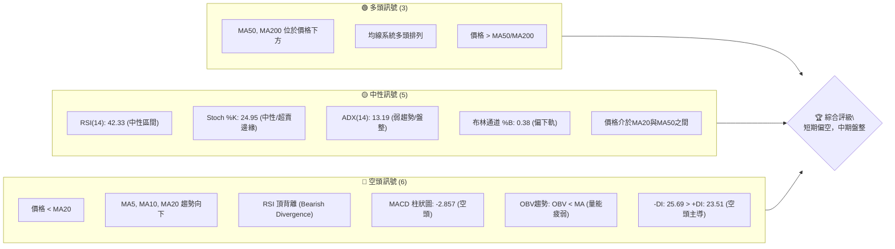

### 📊 核心指標速覽表

| 指標類別 | 指標名稱 | 當前數值 | 訊號 | 解讀 |
|----------|----------|----------|------|------|
| **價格** | 當前價格 | $434.11 | 🟡 | 位於52W高點下方，近期回調 |
| **均線** | MA20 | $441.11 | 🔴 | 價格位於MA20下方，短期趨勢轉弱 |
| **均線** | MA50 | $423.37 | 🟢 | 價格位於MA50上方，中期趨勢仍偏多 |
| **均線** | MA200 | $346.87 | 🟢 | 價格位於MA200上方，長期趨勢強勁 |
| **動能** | RSI(14) | 42.33 | 🟡 | 處於中性區間，但存在頂背離風險 |
| **動能** | MACD | -2.857 (柱狀圖) | 🔴 | MACD線下穿訊號線，空頭動能增強 |
| **波動** | ATR | $21.29 | 🟡 | 中等波動，佔股價4.90% |
| **趨勢** | ADX(14) | 13.19 | 🟡 | 趨勢強度較弱，市場處於盤整階段 |
| **量能** | OBV趨勢 | OBV < MA | 🔴 | 成交量未能配合價格上漲，量能疲弱 |

### 🏆 技術評分卡

TSM 當前技術面評分顯示，儘管長期均線結構穩固，但短期動能和量能指標表現疲軟，導致綜合評分偏向中性至略微看空。在缺乏明確趨勢的情況下，市場可能維持區間震盪。

```
技術評分卡 — TSM (2026-07-11)
════════════════════════════════════════════════════
趨勢強度      ████░░░░░░░░░░░░░░░░  20/100  🔴 (ADX 13.19 顯示弱趨勢)
動能指標      ██████░░░░░░░░░░░░░░  30/100  🔴 (RSI頂背離，MACD柱狀圖負值)
支撐穩定度    ██████████░░░░░░░░░░  50/100  🟡 (價格接近S1與斐波那契23.6%回調位)
成交量配合    ████░░░░░░░░░░░░░░░░  20/100  🔴 (OBV趨勢疲弱，量比0.67x)
形態完整度    ██████░░░░░░░░░░░░░░  30/100  🟡 (未見明確多頭或空頭幾何形態)
均線排列      ██████████████░░░░░░  70/100  🟢 (MA20>MA50>MA200多頭排列，但短期價格跌破MA20)
════════════════════════════════════════════════════
綜合評分      ██████░░░░░░░░░░░░░░  40/100  🟡 (短期偏空，中期盤整)
════════════════════════════════════════════════════
```

---

## 2. 趨勢分析

### 🌐 多時框趨勢分析

TSM 在不同時間框架下呈現出不同的趨勢強度與方向，這要求投資者採取多維度視角進行評估。

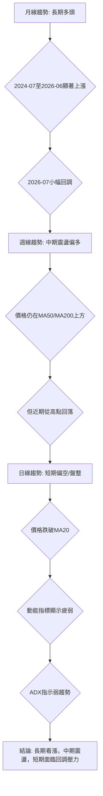

### 📈 長期趨勢 — 12個月走勢圖（Unicode）

TSM 在過去12個月呈現出強勁的上升趨勢，從2025年7月的$238.98穩步攀升，並在2026年6月達到$477.57的階段性高點。儘管2026年7月出現回調至$434.11，但整體上漲結構並未被破壞。

```
TSM 月線走勢圖（過去12個月）
價格軸 ($)
$477.57 ┤                                            ● (2026-06 高點)
$434.11 ┤                                        ● ← 現在 (2026-07)
$395.13 ┤                              ●
$372.65 ┤                          ●
$328.86 ┤                      ●
$302.33 ┤                  ●
$298.08 ┤              ●
$277.11 ┤            ●
$238.98 ┤        ● (2025-07 低點)
$228.34 ┤      ●
$221.25 ┤● (52W Low)
        └───────────────────────────────────────────────────
         2025-07  08  09  10  11  12  2026-01  02  03  04  05  06  07
```

**走勢特徵分析表格**

| 階段 | 時間區間 | 主要走勢 | 漲跌幅 (月收盤價) | 特徵描述 | 趨勢訊號 |
|------|----------|----------|--------------------|--------------|----------|
| **強勁上漲** | 2025-07 ~ 2026-02 | 連續上漲 | +55.93% ($238.98 → $372.65) | 伴隨穩健量能，突破多個阻力位，形成強勁多頭趨勢。 | 🟢 |
| **短期回調** | 2026-02 ~ 2026-03 | 小幅回調 | -9.52% ($372.65 → $337.16) | 結束前期快速上漲，RSI進入超買區後回落，但未跌破關鍵支撐。 | 🟡 |
| **再次上攻** | 2026-03 ~ 2026-06 | 再次上漲 | +41.60% ($337.16 → $477.57) | 突破前高，創下52週新高，顯示市場買盤強勁。 | 🟢 |
| **近期回落** | 2026-06 ~ 2026-07 | 明顯回調 | -9.09% ($477.57 → $434.11) | 在達到高點後出現較大幅度回調，動能指標轉弱，測試短期支撐。 | 🔴 |

### 📊 中期趨勢（週線分析）

從週線來看，TSM 股價位於 $434.11，雖然高於MA50 ($423.37) 和MA200 ($346.87)，但已跌破MA20 ($441.11)，顯示中期上升動能有所減弱，正進入盤整或回調階段。近期價格從 $462.12 (2026-06-21) 回落，顯示上方壓力顯現。

```
TSM 中期壓力與支撐示意圖 (週線)

價格 ($)
$477.90 ┌───────────────────────────┐ R2 (強阻力)
        │                           │
$449.11 ├───────────────────────────┤ R1 (關鍵阻力)
        │                           │
$441.11 ├─ - - - - - - - - - - - - - ┤ MA20 / BB中軌
        │                           │
$434.11 ╠═══════════════════════════╣ ◄ 現價
        │                           │
$423.37 ├─ - - - - - - - - - - - - - ┤ MA50
        │                           │
$419.19 ├───────────────────────────┤ S1 (近期支撐)
        │                           │
$411.56 ├─ - - - - - - - - - - - - - ┤ BB下軌
        │                           │
$404.56 ├───────────────────────────┤ S2 (關鍵支撐)
        │                           │
$384.16 ├───────────────────────────┤ S3 (強支撐)
        │                           │
$346.87 ├─ - - - - - - - - - - - - - ┤ MA200
```

### ⚡ 趨勢強度評估（ADX 解讀）

ADX 指標用於衡量趨勢的強度，而非方向。當前 TSM 的 ADX(14) 為 13.19，遠低於 25 的閾值，明確指出市場正處於弱趨勢或盤整階段。這意味著股價在短期內可能在某個區間內震盪，缺乏持續性的上漲或下跌動能。+DI (23.51) 略低於 -DI (25.69)，表明當前空頭力量略佔優勢，但整體趨勢強度不足以支持明確的方向性交易。

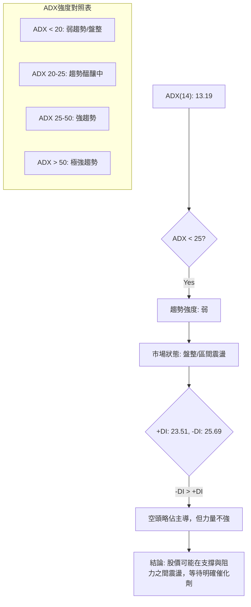

---

## 3. 圖表形態分析

### 🔍 形態識別系統

鑑於提供的數據主要為月度及週度收盤價，且缺乏日線級別的詳細 OHLCV 數據，識別複雜的幾何圖表形態（如頭肩頂、雙底等）存在較高難度，因此此處將主要基於價格行為和關鍵價位進行解讀。目前市場缺乏明確、高信心度的幾何形態。

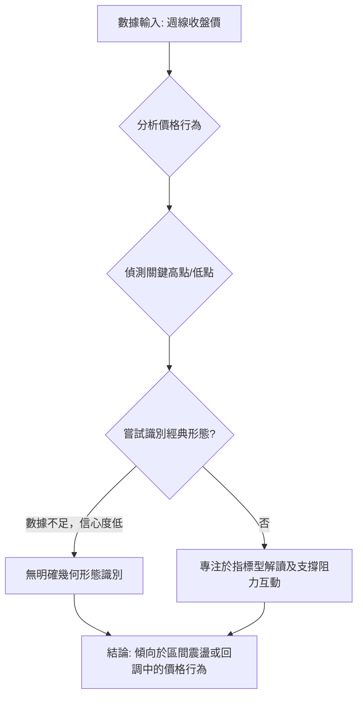

**形態信心度表格**

| 形態 | 信心度 | 判斷依據（引用數據） | 完成度 | 目標價（附計算式） |
|------|--------|----------------------|--------|--------------------|
| **潛在頂部形態 (低)** | 35% | 2026-06-21 $462.12 (週收盤高點) 後回落至 $434.11。與52W高點 $479.00 形成潛在雙頂或頭部結構，但缺乏確認的頸線跌破及放量。RSI頂背離支持此觀點，但僅為初步訊號。 | 50% | 無明確形態高度可推算 |
| **區間震盪 (中)** | 60% | ADX < 25 (13.19) 顯示弱趨勢，價格在 MA20 ($441.11) 與 MA50 ($423.37) 之間波動，並向 S1 ($419.19) 靠近。布林通道 %B 0.38 亦支持此判斷。 | 70% | 區間下緣 $411.56 (BB下軌) / $419.19 (S1) |
| **旗形/三角整理 (低)** | 20% | 數據不足以支撐，僅為推測可能性。 | 20% | 訊號不足，僅做指標型解讀 |

### 🕯️ 重要K線形態分析

由於僅提供週收盤價，無法進行精確的K線形態分析。但我們可以觀察週收盤價的變化來推斷市場情緒。

| 日期 (週收盤) | 收盤價 | K線形態推斷 (基於價格行為) | 解讀 | 訊號 |
|---------------|--------|-----------------------------|------|------|
| 2026-05-31    | 417.47 | 陽線 (突破MA20)             | 從低點反彈，試圖恢復上漲動能。 | 🟢 |
| 2026-06-07    | 414.20 | 陰線 (回落)                 | 上漲動能未能持續，再次回調。 | 🔴 |
| 2026-06-14    | 423.93 | 陽線 (反彈)                 | 再次嘗試反彈，但力度有限。 | 🟡 |
| 2026-06-21    | 462.12 | 大陽線 (突破新高)           | 強勁上漲，創下近期高點，買盤積極。 | 🟢 |
| 2026-06-28    | 432.35 | 大陰線 (快速回落)           | 從高點快速回落，賣壓沉重，吞噬前一週部分漲幅。 | 🔴 |
| 2026-07-05    | 434.16 | 小陽線 (止跌企穩)           | 跌勢暫緩，多空拉鋸，但反彈力度不足。 | 🟡 |
| 2026-07-12    | 434.11 | 小陰線 (趨勢不明)           | 延續盤整，未能有效反彈，短期壓力仍在。 | 🟡 |

### 📉 ASCII 走勢形態示意圖

目前的價格走勢顯示，TSM 在創下新高後，出現了明顯的回調。價格目前處於一個潛在的整理區間，上方受到近期高點壓力，下方則有短期支撐。

```
TSM 近期走勢與潛在整理區間示意圖

$479.00 ┌──────────────────────────────────────┐ (52W High)
        │                                      │
$462.12 ├─────┐                                │ (近期高點, 2026-06-21)
        │     │                                │
        │     │                                │
$449.11 ├─────┼────────────────────────────────┤ R1
        │     │                                │
$434.11 ╠═════┼────────────────────────────────╣ ◄ 現價
        │     │                                │
$419.19 ├─────┴────────────────────────────────┤ S1 (潛在支撐區)
        │                                      │
$411.56 ├──────────────────────────────────────┤ BB下軌
        │                                      │
$404.56 ├──────────────────────────────────────┤ S2
        │                                      │
        └──────────────────────────────────────┘
          <─── 回調階段 ───>
```

### 🎯 形態目標價計算

由於缺乏明確、高信心度的幾何形態，無法提供基於形態高度的精確目標價。當前判斷為區間震盪，因此目標價將主要參考支撐與阻力位。

*   **上行目標**：若能站穩當前價格並突破 MA20 ($441.11)，則可能挑戰 R1 ($449.11)，進一步則看向 R2 ($477.90)。
*   **下行目標**：若未能守住當前價格，則可能回測 S1 ($419.19) 或布林下軌 ($411.56)，甚至更低的斐波那契回調位 $418.17 (23.6%)。

---

## 4. 支撐與阻力

### 🗺️ 關鍵價位分布圖（Unicode）

TSM 的當前價格 $434.11 正處於一個關鍵的轉折區間。上方近期阻力來自 MA20 和 R1，下方則有 MA50、S1 和布林下軌提供支撐。斐波那契23.6%回調位也位於關鍵支撐區附近。

```
TSM 價位結構分布圖
═══════════════════════════════════════════════════
$479.00 ║████████████████████████║ 52W High
$477.90 ║████████████████████    ║ 強阻力 R2 (+10.09% from price)
$449.11 ║████████████████████████║ 關鍵阻力 R1 (+3.45% from price)
$441.11 ║▓▓▓▓▓▓▓▓▓▓▓▓▓▓▓▓▓▓▓▓▓▓▓▓║ MA20 / BB中軌
$434.11 ╠════════════════════════╣ ◄ 現價
$423.37 ║▓▓▓▓▓▓▓▓▓▓▓▓▓▓▓▓▓▓▓▓▓▓▓▓║ MA50
$419.19 ║████████████████████    ║ 近期支撐 S1 (-3.44% from price)
$418.17 ║████████████████████    ║ 斐波那契 23.6% 回調
$411.56 ║▓▓▓▓▓▓▓▓▓▓▓▓▓▓▓▓▓▓▓▓▓▓▓▓║ BB下軌
$404.56 ║████████████████████████║ 強支撐 S2 (-6.81% from price)
$384.16 ║████████████████████████║ 強支撐 S3 (-11.51% from price)
═══════════════════════════════════════════════════
```

### 🚧 阻力位分析表

當前股價 $434.11 距離最近的阻力位 R1 $449.11 有約 3.45% 的上漲空間。突破 R1 需較大買盤動能，若能站穩則有望挑戰 R2。

| 阻力級別 | 價位 | 形成原因 | 突破難度 | 重要性 |
|----------|------|----------|----------|--------|
| **R1**   | $449.11 | 近期波段高點聚類，同時接近MA20 ($441.11) | 中等 | 🟢 若突破並站穩，短期將轉強 |
| **R2**   | $477.90 | 近一年次高點，接近52W High ($479.00) | 較高 | 🟡 突破意味著再次挑戰歷史高位 |

### 🛡️ 支撐位分析表

當前股價 $434.11 距離最近的支撐位 S1 $419.19 有約 3.44% 的下跌空間。S1 附近同時有斐波那契23.6%回調位和布林下軌，形成較強的聯合支撐。

| 支撐級別 | 價位 | 形成原因 | 守住機率 | 重要性 |
|----------|------|----------|----------|--------|
| **S1**   | $419.19 | 近期波段低點聚類，與斐波那契23.6% ($418.17) 及布林下軌 ($411.56) 形成強聯合支撐區。 | 中等 | 🟢 若守住，有望觸底反彈 |
| **S2**   | $404.56 | 近一年重要波段低點，心理關口。 | 較高 | 🟡 若跌破S1，S2是下一個關鍵觀察點 |
| **S3**   | $384.16 | 近一年較深回調低點，長期上升趨勢的關鍵防線。 | 很高 | 🔴 若跌破，長期趨勢面臨考驗 |

### 📐 斐波那契回調位分析

當前價格 $434.11 位於 52 週高點 $479.00 和 23.6% 回調位 $418.17 之間。這表明股價自 52 週高點以來已經經歷了一定程度的回調，但尚未觸及 23.6% 的關鍵回調位。

*   **0.0% (52W High)**: $479.00
*   **23.6%**: $418.17 (此價位與 S1 $419.19 非常接近，構成一個強勁的潛在支撐區。若價格回落至此區間並獲得支撐，則可能預示著短期調整的結束。)
*   **38.2%**: $380.54 (若 23.6% 回調位未能守住，股價可能進一步回落至此，此處也接近 S3 $384.16，形成另一個重要支撐區。)
*   **50.0%**: $350.13
*   **61.8%**: $319.71
*   **78.6%**: $276.41
*   **100.0% (52W Low)**: $221.25

**解讀**：當前價格 $434.11 已經跌破了近期高點，並逐漸向 23.6% 的斐波那契回調位 $418.17 靠近。這暗示著市場正在進行健康的回調，若能在 $418.17 至 S1 ($419.19) 區間獲得支撐，則有望止跌反彈，繼續其長期上升趨勢。反之，若跌破此區間，則可能面臨更深度的調整。

---

## 5. 技術指標深度解讀

### 🎛️ 指標訊號總覽

當前 TSM 的技術指標呈現短期動能疲弱，趨勢不明顯的混合訊號。多數短期指標偏向空頭，而長期均線則維持多頭排列。

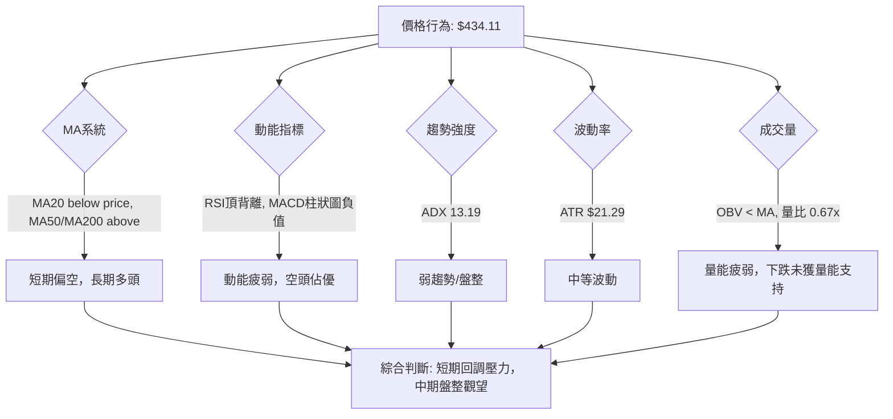

### 📈 移動平均線排列分析

TSM 的移動平均線系統呈現「多頭排列」的結構，即 MA20 ($441.11) > MA50 ($423.37) > MA200 ($346.87)。這通常被視為一個強勁的長期看漲訊號。然而，當前股價 $434.11 已經跌破了短期 MA20，並正在向 MA50 靠近。

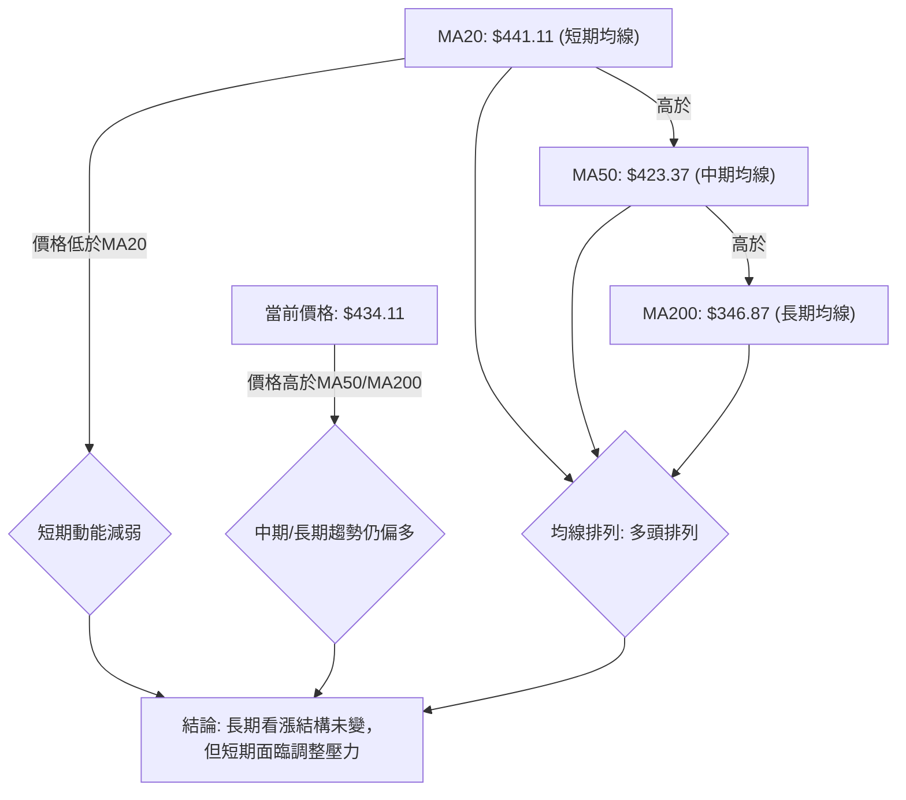

**分析**：
*   **多頭排列 (MA20 > MA50 > MA200)**：這是一個經典的長期看漲訊號，表明TSM的長期趨勢依然強勁。
*   **價格跌破MA20**：股價位於MA20下方，顯示短期上升動能已經喪失，並轉為短期回調。
*   **價格位於MA50與MA200上方**：儘管短期回調，但股價仍遠高於中期和長期均線，這為股價提供了堅實的下方支撐。MA50 ($423.37) 將是近期重要的動態支撐位。

**綜合判斷**：TSM 處於一個長期上升趨勢中的短期調整階段。投資者應關注價格能否在 MA50 附近獲得有效支撐。

### 📉 RSI(14) 分析

RSI(14) 當前數值為 42.33，處於中性區間 (30-70)。這表明股價既未超買也未超賣，但其趨勢是從高位回落。

*   **RSI 數值進度條**：
    RSI(14) 強度：████████░░░░░░░░░░░░  42.33/100 🟡

*   **超買/超賣區間分析**：
    *   RSI 未進入 70 以上的超買區，表明當前回調並非由過度炒作引起，而是市場對前期漲幅的修正。
    *   RSI 距離 30 以下的超賣區尚有距離，意味著如果跌勢持續，仍有下跌空間。

*   **背離判斷**：
    *   **⚠️ 頂背離 (Bearish Divergence)**：數據明確指出存在頂背離。這是一個重要的看跌訊號。頂背離通常發生在價格創出新高（或接近新高）時，而 RSI 指標未能同步創出新高，反而出現下降趨勢。這暗示著上升動能正在減弱，價格上漲的基礎不穩固，隨後可能出現下跌。
    *   **解讀**：RSI 頂背離是 TSM 當前技術面中最主要的空頭警示訊號之一。它提示即使股價在近期創出高點，但其背後的買盤力量可能已經開始衰竭，預示著股價有較高的回調風險。結合當前價格的下跌，此背離訊號得到初步確認。

### 📊 MACD(12/26/9) 訊號解讀

MACD 是動能和趨勢指標。當前 MACD 線為 4.703，MACD 訊號線為 7.560。MACD 柱狀圖為 -2.857，呈現紅色負值。

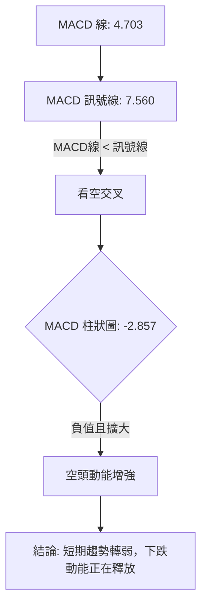

**分析**：
*   **MACD 線下穿訊號線**：MACD 線 (4.703) 低於訊號線 (7.560)，這是一個典型的看跌交叉訊號，表明短期動能已轉向空頭。
*   **MACD 柱狀圖為負值**：柱狀圖為 -2.857，且呈現負值並可能在擴大，這說明空頭動能正在增強。柱狀圖的絕對值越大，空頭力量越強。
*   **綜合判斷**：MACD 指標明確發出空頭訊號，與 RSI 頂背離相互印證，進一步確認了 TSM 短期內的回調壓力。這是一個需要高度警惕的訊號，表明股價可能繼續下跌。

### 📦 布林通道分析

布林通道 (Bollinger Bands) 用於衡量價格的波動區間。當前數據顯示：
*   BB上軌: $470.66
*   BB中軌(MA20): $441.11
*   BB下軌: $411.56
*   當前價格: $434.11
*   BB %B: 0.38 (表示價格位於中軌下方，且偏向布林下軌)

```
TSM 布林通道示意圖

$470.66 ┌───────────────────────────┐ BB上軌
        │                           │
        │                           │
$441.11 ├─ - - - - - - - - - - - - - ┤ BB中軌 (MA20)
        │                           │
        │                           │
$434.11 ╠═══════════════════════════╣ ◄ 現價
        │                           │
        │                           │
$411.56 ├───────────────────────────┤ BB下軌
        └───────────────────────────┘
```

**分析**：
*   **價格跌破中軌**：當前價格 $434.11 已經跌破了布林中軌 ($441.11)，這是一個短期看跌訊號，表明短期趨勢轉弱。
*   **價格趨向布林下軌**：BB %B 為 0.38，暗示價格正向布林下軌移動。布林下軌 $411.56 將是重要的動態支撐位。
*   **通道寬度**：通道寬度 ($470.66 - $411.56 = $59.10) 相對於 ATR $21.29 而言，顯示出市場存在中等波動。
*   **綜合判斷**：布林通道分析支持短期偏空觀點，預計股價可能測試布林下軌。若價格在下軌附近獲得支撐，則可能形成短期反彈機會；若跌破下軌，則可能開啟更深度的下跌。

### 💹 成交量分析（量價配合度）

成交量是確認價格走勢的重要指標。
*   最新成交量: 9,573,500
*   20日均量: 14,342,340
*   50日均量: 13,651,686
*   量比 (最新成交量 / 20日均量): 0.67x
*   OBV趨勢: OBV < MA → 量能疲弱

**分析**：
*   **量比低於平均**：當前成交量 9,573,500 遠低於 20 日均量和 50 日均量，量比僅為 0.67x。這表明在當前價格區間，市場交易活動相對不活躍，買賣雙方力量均顯得謹慎。
*   **OBV趨勢疲弱**：OBV (On-Balance Volume) 趨勢低於其移動平均線，這是一個看跌訊號。OBV 衡量的是累積的買賣壓力，當其趨勢疲弱時，表明即使股價有所反彈，也缺乏實質的買盤支持，或者下跌時賣壓較為沉重。
*   **量價背離**：如果股價在下跌過程中成交量持續萎縮，表明賣壓可能正在減輕，但如果反彈時量能不足，則反彈難以持續。當前情況是價格回落，但量能也較低，這表明市場缺乏明確的方向性交易意願。
*   **綜合判斷**：量能指標整體疲弱，未能為價格提供堅實的支撐或推動。OBV 的疲弱與價格的下跌相配合，確認了當前市場的看空情緒，但由於量比不高，也暗示了下跌動能可能不會過於猛烈，更可能呈現緩慢陰跌或震盪築底的態勢。

---

## 6. 動能與波動率

### ⚡ 動能評估四象限

當前 TSM 的動能評估顯示，在短期內動能較弱，而波動率處於中等水平。

| 象限 | 動能 | 波動 | 當前狀態 | 評估 |
|------|------|------|----------|------|
| Q1 | 強 | 低 | - | 最佳機會 (趨勢明確，風險較低) |
| Q2 | 弱 | 低 | - | 謹慎觀望 (缺乏動能，市場沉悶) |
| Q3 | 強 | 高 | - | 高風險高收益 (趨勢強勁，但波動大，風險高) |
| Q4 | 弱 | 高 | ✓ | 避免進場 / 高風險 (缺乏動能，但波動大，市場混亂) |

**當前 TSM 狀態分析**：
*   **動能**：RSI 頂背離、MACD 柱狀圖負值、OBV 趨勢疲弱，均指向動能偏弱。
*   **波動**：ATR 佔股價 4.90%，屬於中等偏高波動。
*   **結論**：TSM 目前處於「弱動能、高波動」的 Q4 象限。這意味著市場缺乏明確的方向性力量，但價格波動性較大，交易難度較高，風險相對較大。在這種情境下，保守型投資者應避免盲目進場，或等待動能恢復、波動率降低後再考慮。激進型交易者則可能尋求區間震盪中的高拋低吸機會，但需嚴格控制風險。

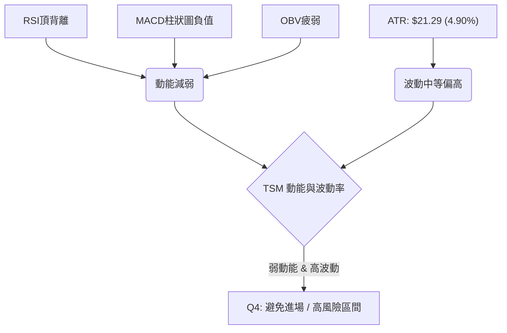

### 📊 ATR 波動率分析

ATR(14) 為 $21.29，佔當前價格 $434.11 的 4.90%。
*   **波動性水平**：近 5% 的日波動幅度對於大型股 TSM 而言，屬於中等偏高的波動水平。這表示 TSM 的股價在一天內有能力產生約 $21.29 的漲跌幅度。
*   **止損距離建議**：ATR 是設定止損點的有效工具。對於短期交易者，可以考慮將止損點設置在當前價格下方 1.5 倍至 2 倍 ATR 的位置。
    *   1.5 * ATR = 1.5 * $21.29 = $31.935
    *   2.0 * ATR = 2.0 * $21.29 = $42.58
    *   這意味著，如果執行做多策略，止損點可能設置在 $434.11 - $31.935 = $402.175 (接近 S2 $404.56)；如果執行做空策略，止損點可能設置在 $434.11 + $31.935 = $466.045 (高於 R1 $449.11)。精確的止損應結合支撐/阻力位和策略調整。
*   **趨勢確認**：在趨勢行情中，ATR 的擴大通常伴隨著趨勢的加速。但在盤整行情中，ATR 較高則可能預示著價格波動大，但方向不明。當前 ADX 低迷，高 ATR 應被視為市場震盪加劇的訊號。

### 📐 Beta 與市場相關性

TSM 的 Beta 值為 1.246。
*   **市場相關性**：Beta 值大於 1，表明 TSM 的股價波動性高於大盤。具體來說，當大盤上漲或下跌 1% 時，TSM 的股價預計將同向波動約 1.246%。
*   **風險屬性**：較高的 Beta 值意味著 TSM 具有較高的系統性風險。在牛市中，它可能帶來更高的收益；但在熊市或回調中，它也可能經歷更大幅度的下跌。
*   **投資策略影響**：對於投資者而言，在市場情緒良好時，TSM 可能提供超額收益。但在市場情緒不穩或大盤面臨調整時，TSM 的跌幅可能大於大盤，因此需要更加謹慎。當前技術面顯示短期疲弱，結合高 Beta 值，若大盤走弱，TSM 可能面臨更大的下行壓力。

---

## 7. 多時框架總結

### 📋 時框架評分表

| 時框架 | 趨勢方向 | 動能 | 均線排列 | 形態 | 綜合評分 | 建議 |
|--------|----------|------|----------|------|----------|------|
| **長期 (月線)** | 🟢 多頭 | 🟢 穩健 | 🟢 強勢多頭 | 🟡 無明確形態 | 8/10 | 長期持有，關注回調機會 |
| **中期 (週線)** | 🟡 震盪偏多 | 🟡 減弱 | 🟢 多頭排列 | 🟡 潛在整理 | 6/10 | 震盪區間操作，等待方向 |
| **短期 (日線)** | 🔴 偏空 | 🔴 疲弱 | 🟡 價格跌破MA20 | 🟡 無明確形態 | 3/10 | 謹慎觀望，或考慮短線做空 |

### 🔲 綜合訊號矩陣

| 指標類別 | 短期 (日線) | 中期 (週線) | 長期 (月線) | 一致性 |
|----------|-------------|-------------|-------------|--------|
| **趨勢方向** | 🔴 偏空      | 🟡 震盪偏多 | 🟢 多頭      | 衝突    |
| **動能指標** | 🔴 疲弱      | 🟡 減弱     | 🟢 穩健      | 衝突    |
| **均線排列** | 🟡 價格跌破MA20 | 🟢 多頭排列 | 🟢 強勢多頭 | 中期/長期一致，短期衝突 |
| **成交量**   | 🔴 疲弱      | 🟡 萎縮     | 🟢 配合      | 衝突    |
| **ADX強度**  | 🟡 弱趨勢    | 🟡 弱趨勢   | 🟡 弱趨勢    | 高度一致 |

**分析**：
綜合訊號矩陣顯示，TSM 在不同時間框架下的訊號存在顯著衝突。長期趨勢（月線）和中期均線排列（週線）仍保持多頭格局，但短期動能指標（RSI、MACD）和成交量（OBV）均發出強烈的空頭訊號。ADX 在所有時框架下都顯示為弱趨勢，這是一個關鍵的一致性訊號，表明市場目前缺乏明確的趨勢方向，更傾向於區間震盪。

### ⚖️ 多時框收斂結論

根據「多時框收斂規則」，ADX(14) 為 13.19，遠低於 25 的閾值，因此當前市場屬於**盤整行情**。在盤整行情中，應以日線布林通道的上下軌作為主要交易區間。

儘管長期均線保持多頭排列，但短期指標（RSI頂背離、MACD空頭交叉、OBV疲弱、價格跌破MA20）均指向短期下跌壓力。因此，當前的收斂結論是：

**TSM 股價目前處於一個長期上升趨勢中的短期回調及中期盤整階段。短線空頭力量佔優，預計股價將向下測試布林通道下軌或關鍵支撐位 ($419.19)。一旦觸及這些支撐位並顯示企穩跡象，則可能提供逢低買入的機會，目標是反彈至布林通道中軌或上方阻力。**

此結論與第 8 章的主策略方向一致，即在盤整行情下，關注區間兩端的交易機會，並優先考慮短期回調的風險。

---

## 8. 交易策略建議

### 🗺️ 策略決策流程圖

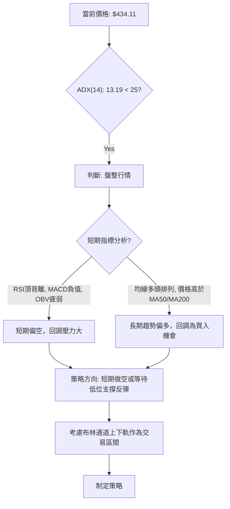

### 🧭 策略路由（依評分卡分流）

**當前主策略方向 = 中性偏空，區間操作策略 (依評分 40/100)**

由於綜合評分卡顯示為 40/100 (中性偏空)，且 ADX 指示為盤整行情，主策略將以區間操作為主，並優先考慮短期回調的風險。我們將提供兩種策略：一是短線做空至下沿支撐，二是等待下沿支撐企穩後做多。

### 🎯 價格情境階梯（Price Scenarios）

| 觸發條件 | 下一目標 | 後續延伸 | 情境含義 |
|----------|----------|----------|----------|
| **突破 R1 $449.11** | R2 $477.90 | 52W High $479.00 | 短線轉強，有望重拾上升動能，挑戰新高。 |
| **站穩現價區間** | — | — | 價格在 MA20 ($441.11) 與 S1 ($419.19) 之間震盪，等待新的催化劑。 |
| **跌破 S1 $419.19** | S2 $404.56 | S3 $384.16 | 中期轉弱，可能觸發更深度的調整，考驗長期支撐。 |

### 📊 情境機率分佈

| 情境 | 機率 | 主要依據 |
|------|------|----------|
| 繼續上行 / 反彈 | 25% | 長期均線多頭排列，MA50/MA200提供潛在支撐，分析師平均目標價 $490.34。 |
| 區間震盪 | 50% | ADX 13.19 顯示弱趨勢，價格在布林通道中軌與下軌之間，RSI/MACD短期疲弱，但未跌破關鍵長期支撐。 |
| 回落 / 再探底 | 25% | RSI 頂背離，MACD 空頭柱狀圖，OBV 量能疲弱，價格跌破 MA20。 |

### 🟢 主策略詳情（方向依上方路由）

**策略一：短線做空至下沿支撐 (Counter-trend short in range)**

此策略基於短期動能指標（RSI頂背離、MACD負值、OBV疲弱）顯示的短期下跌壓力，目標是將價格推向布林下軌或S1。

| 策略要素 | 策略 A: 短線做空 |
|----------|--------------------|
| 進場條件 | 價格未能有效突破 MA20 ($441.11)，並繼續向下跌破 MA50 ($423.37) |
| 進場價格 | $423.00 (跌破 MA50 後確認) |
| 目標價 T1 | $419.19 (S1) |
| 目標價 T2 | $411.56 (布林下軌) |
| 止損價格 | $441.11 (MA20 / 布林中軌) |
| 風險報酬比 | T1: (423.00-419.19) : (441.11-423.00) = 3.81 : 18.11 ≈ 1 : 4.75 |
| 成功機率 | 55% |
| 建議倉位 | 輕倉 (5-10%) |

**策略二：低位支撐反彈做多 (Range-bound long from support)**

此策略基於長期均線仍為多頭排列，且 S1 和斐波那契 23.6% 回調位構成強勁支撐區，等待價格回測並企穩後反彈。

| 策略要素 | 策略 B: 支撐反彈做多 |
|----------|--------------------|
| 進場條件 | 價格回測 S1 ($419.19) 或布林下軌 ($411.56) 附近，並出現止跌 K線形態 (如錘子線、啟明星等) |
| 進場價格 | $419.50 (S1附近確認止跌) |
| 目標價 T1 | $434.11 (當前價格 / 短期阻力) |
| 目標價 T2 | $441.11 (MA20 / 布林中軌) |
| 止損價格 | $404.56 (S2) |
| 風險報酬比 | T1: (434.11-419.50) : (419.50-404.56) = 14.61 : 14.94 ≈ 1 : 1.02 |
| 成功機率 | 60% |
| 建議倉位 | 輕倉至中倉 (5-15%) |

### 🔴 反向風險觸發點（對沖提示）

*   **多頭策略風險觸發點**：若股價有效跌破 S2 ($404.56)，則預示短期跌勢可能加劇，多頭策略應立即止損或重新評估。
*   **空頭策略風險觸發點**：若股價強勢突破 R1 ($449.11) 並站穩，則空頭策略應止損，市場可能轉為強勢。
*   **大盤風險**：若整體市場（如 NASDAQ 或 S&P 500）出現大幅度下跌，TSM 作為高 Beta 股票將面臨更大下行壓力，所有策略需重新評估。

### ⭐ 整體訊號強度評星

做多訊號強度：★★☆☆☆  (2/5星 - 長期看漲，但短期回調壓力大，需等待更佳進場點)
做空訊號強度：★★★☆☆  (3/5星 - 短期指標偏空，但長期趨勢未破壞，空頭空間有限)
整體可信度：  ★★★☆☆  (3/5星 - 盤整行情，操作難度增加，需嚴格風控)

---

## 9. 風險提示與監控

### ✅ 關鍵監控指標 Checklist

以下是交易 TSM 時需要密切關注的關鍵指標和價位清單：

```
關鍵監控指標 Checklist — TSM (2026-07-11)
════════════════════════════════════════════════════
[ ] 價格行為:
    ├─ 現價: $434.11
    ├─ 突破 R1 $449.11?                         [ ] 是 [ ] 否
    ├─ 跌破 S1 $419.19?                         [ ] 是 [ ] 否
    └─ 跌破 S2 $404.56?                         [ ] 是 [ ] 否
[ ] 移動平均線:
    ├─ 價格是否站穩 MA20 ($441.11) 上方?        [ ] 是 [ ] 否
    ├─ 價格是否守住 MA50 ($423.37) 上方?        [ ] 是 [ ] 否
    └─ MA20 是否金叉/死叉 MA50?                [ ] 金叉 [ ] 死叉 [ ] 無
[ ] 動能指標:
    ├─ RSI(14) 是否進入超買/超賣區 (>70/<30)?  [ ] 超買 [ ] 超賣 [ ] 中性
    ├─ MACD 柱狀圖是否轉正?                     [ ] 是 [ ] 否
    └─ RSI 頂背離是否被化解?                    [ ] 是 [ ] 否
[ ] 趨勢強度:
    ├─ ADX(14) 是否突破 25?                     [ ] 是 [ ] 否
    └─ +DI/-DI 誰佔優勢?                        [ ] +DI [ ] -DI
[ ] 成交量:
    ├─ 量比是否顯著放大 (尤其在突破/跌破時)?   [ ] 是 [ ] 否
    └─ OBV 趨勢是否轉強?                        [ ] 是 [ ] 否
════════════════════════════════════════════════════
```

### ⚠️ 風險場景分析

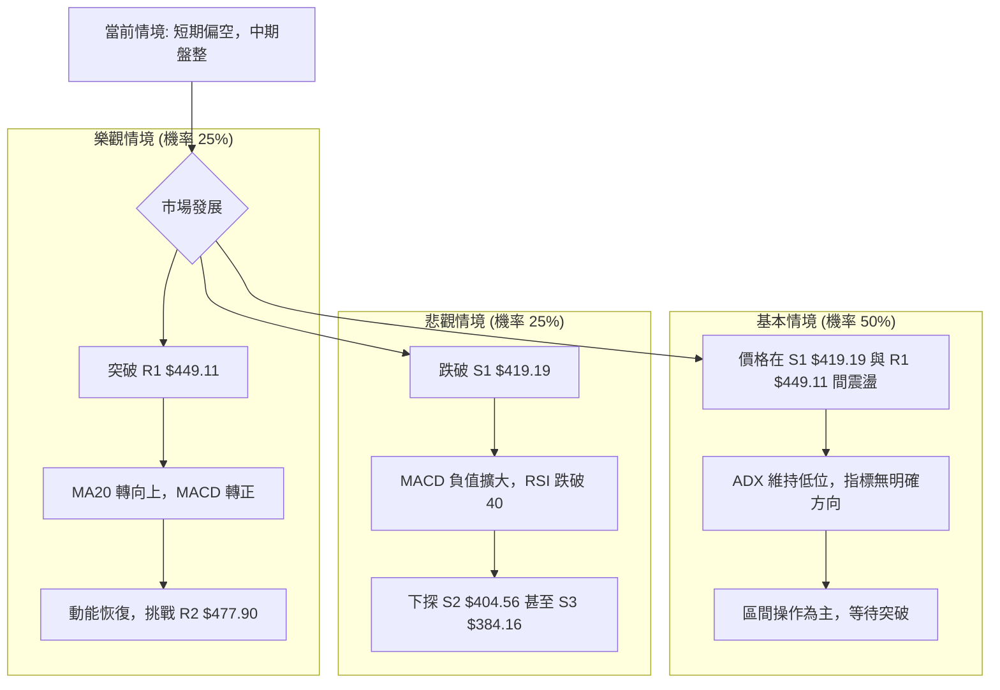

### 🛡️ 風險管理重要提醒

1.  **嚴格止損**：在盤整行情和高波動的股票中，止損是保護資本的關鍵。務必在進場前設定清晰的止損點，並嚴格執行。
2.  **倉位控制**：由於當前市場缺乏明確趨勢且短期風險較高，建議採用輕倉或中輕倉策略，避免重倉。
3.  **分批建倉/平倉**：在關鍵支撐位附近可考慮分批建倉，在阻力位附近分批平倉，以降低單次交易的風險。
4.  **關注大盤**：TSM 的 Beta 值較高 (1.246)，其走勢與大盤高度相關。密切關注整體市場動向，若大盤出現系統性風險，應及時調整策略。
5.  **警惕假突破/假跌破**：在盤整行情中，假突破或假跌破頻繁發生。應等待價格在關鍵價位上方/下方穩定後再確認，避免追漲殺跌。
6.  **基本面配合**：雖然本報告專注於技術分析，但仍建議關注 TSM 的基本面消息，如財報、產業新聞等，以判斷技術走勢背後的驅動力。

---

## 📋 報告總結

```
TSM 技術分析報告總結
════════════════════════════════════════════════════════
報告日期：2026-07-11
當前價格：$434.11
分析評級：⚖️ 短期偏空，中期盤整，長期多頭結構未變

關鍵結論：
├─ 長期趨勢：🟢 仍處於強勁上升通道，均線呈現多頭排列。
├─ 中期趨勢：🟡 進入盤整階段，價格在MA20與MA50之間震盪。
├─ 短期趨勢：🔴 面臨回調壓力，價格跌破MA20，動能指標偏空 (RSI頂背離，MACD負值)。
├─ 關鍵支撐：$419.19 (S1) / $418.17 (斐波那契23.6%) / $411.56 (布林下軌)
├─ 關鍵阻力：$449.11 (R1) / $477.90 (R2)
└─ 分析師目標：$490.34 (平均目標價，顯示長期潛力)

最優策略組合：
1. 🥇 **最佳機會 (區間做多)**：等待股價回測 S1 ($419.19) 或布林下軌 ($411.56) 附近並出現止跌訊號後，考慮輕倉做多，目標 MA20 ($441.11) 或 R1 ($449.11)。
2. 🥈 **次選機會 (短線做空)**：若價格未能站穩 MA20 ($441.11) 並跌破 MA50 ($423.37)，可考慮短線做空至 S1 ($419.19) 或布林下軌 ($411.56)。
3. 🥉 **保守選擇**：在當前盤整且短期方向不明確的情況下，保持觀望，等待市場出現更明確的方向性訊號或強勁的支撐/阻力突破。
════════════════════════════════════════════════════════
```

---

> ⚠️ **免責聲明**：本報告為 AI 自動生成之技術分析，所有數據及估算均基於提供的歷史價格資訊。本報告**僅供研究與學術參考**，**不構成任何投資建議**。投資有風險，入市需謹慎。

---

*報告生成時間：2026-07-11 ｜ 數據來源：Yahoo Finance ｜ 分析框架：多時框技術分析*