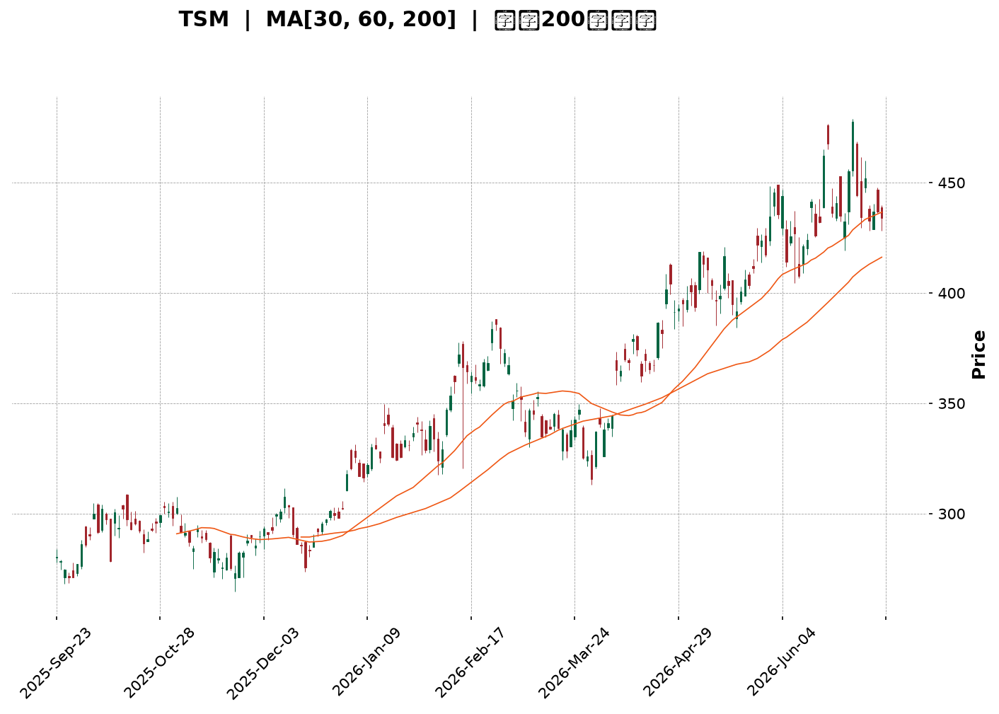
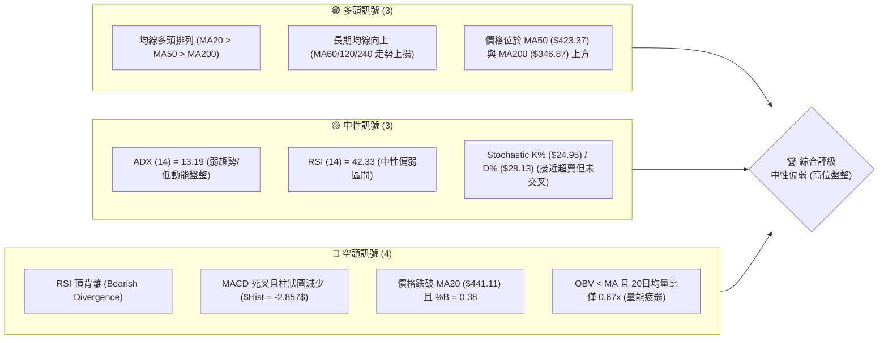
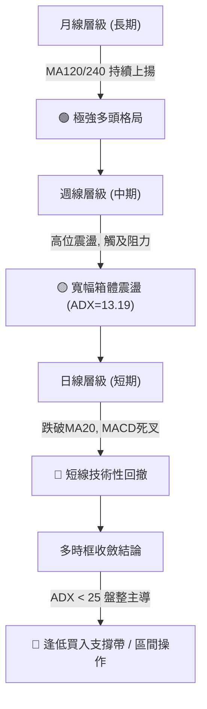
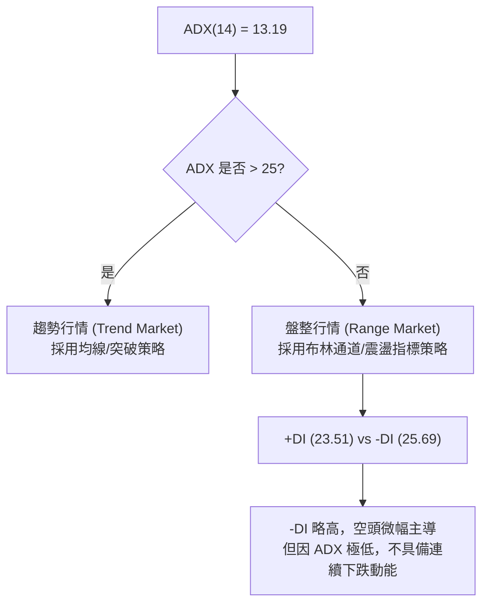
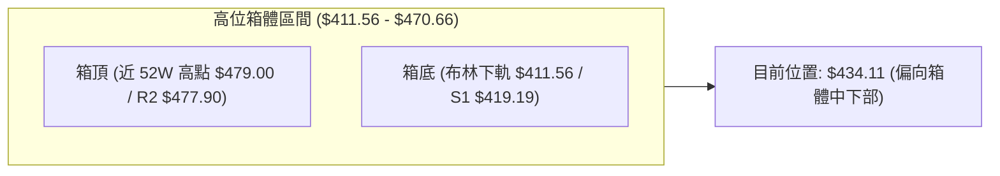
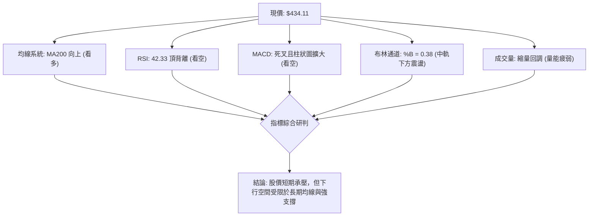
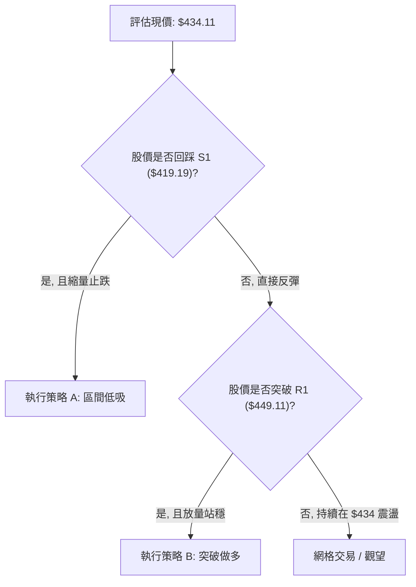
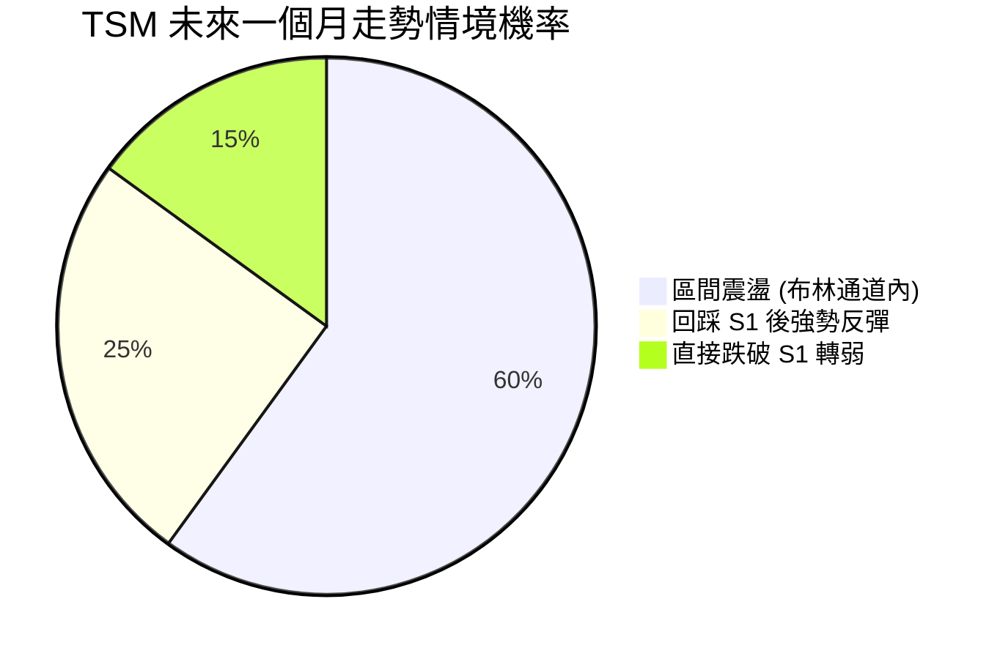
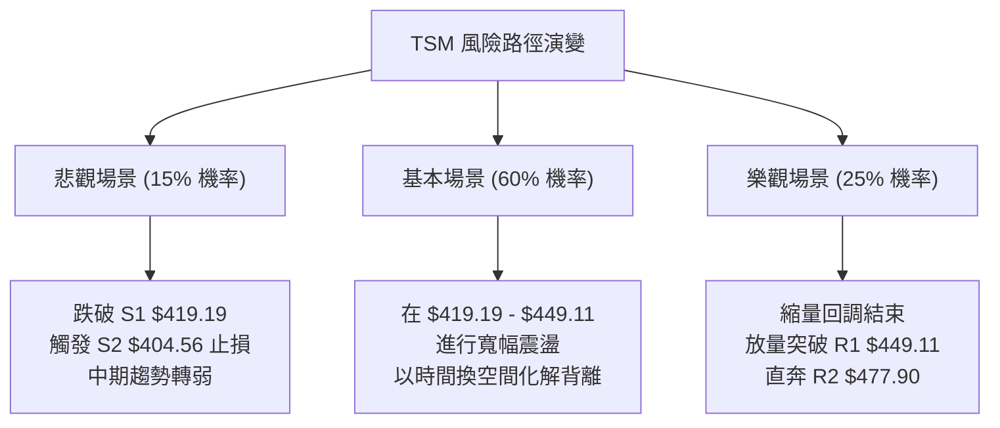

<details>
<summary>📊 靜態圖表 (點擊展開)</summary>

</details>

<html>
<head><meta charset="utf-8" /></head>
<body>
    <div style="height:500px; width:100%;">                        <script>window.PlotlyConfig = {MathJaxConfig: 'local'};</script>
        <script charset="utf-8" src="https://cdn.plot.ly/plotly-3.7.0.min.js" integrity="sha256-jvTGqxNp8AGWEcvNLVuKr+8j5dGe9Yw51LQkmDH+IYA=" crossorigin="anonymous"></script>                <div id="candlestick-chart" class="plotly-graph-div" style="height:100%; width:100%;"></div>            <script>                window.PLOTLYENV=window.PLOTLYENV || {};                                if (document.getElementById("candlestick-chart")) {                    Plotly.newPlot(                        "candlestick-chart",                        [{"close":{"dtype":"f8","bdata":"AAAA4P6HcUAAAADgPmhxQAAAAODzJ3FAAAAAoJDzcEAAAACAgPFwQAAAACC0UXFAAAAAQG\u002fjcUAAAABAuN1xQAAAAGB9HnJAAAAAgJLAckAAAAAAsztyQAAAACA64nJAAAAAYJGYckAAAACgc2dxQAAAAABayHJAAAAAYAVackAAAABAPuVyQAAAAMDul3JAAAAAIF5MckAAAAAA9nVyQAAAAOBRQ3JAAAAAoPHpcUAAAADgTwdyQAAAAIB2SnJAAAAAILF+ckAAAADgwrJyQAAAAKBG63JAAAAA4JbNckAAAACATKFyQAAAAOCf53JAAAAAYAQ8ckAAAAAggjVyQAAAAICo73FAAAAAQCnEcUAAAABgYk9yQAAAACBMDnJAAAAA4JAFckAAAABg5n9xQAAAAMB9qXFAAAAAAOJ8cUAAAADgyztxQAAAACCZgnFAAAAAgEk1cUAAAACAjQ5xQAAAAGCipnFAAAAAwESncUAAAACgFvtxQAAAAMCxE3JAAAAAwOTWcUAAAADg5hxyQAAAAAA+UnJAAAAAwDwqckAAAABAp0ZyQAAAAKAouHJAAAAAQJvQckAAAADgcTtzQAAAAOCH9HJAAAAA4J8ockAAAACALeRxQAAAAEBU1nFAAAAAgJU4cUAAAAAgeLNxQAAAAEBw93FAAAAAoFw8ckAAAADgx3ZyQAAAAGA6lHJAAAAAIInUckAAAABg+bVyQAAAAMCkoHJAAAAAAEDlckAAAAAAet9zQAAAAOB\u002fCXRAAAAAIPRbdEAAAABgrNBzQAAAACACxnNAAAAAYHcfdEAAAACACaF0QAAAAGAfmHRAAAAAINxWdEAAAABAJT51QAAAACA+SnVAAAAA4KdXdEAAAAAAGkd0QAAAAKD\u002fWnRAAAAAwGHSdEAAAADg\u002f690QAAAAOCdCXVAAAAAoKZIdUAAAACA4Bx1QAAAAMDGjXRAAAAAILA5dUAAAADAY+B0QAAAAIANQXRAAAAAgHuQdEAAAACg6bB1QAAAAEBVGXZAAAAAYMyAdkAAAABArUJ3QAAAAEBU43ZAAAAA4KHHdkAAAAAgQKV2QAAAAKBehnZAAAAAgJpodkAAAABAKwp3QAAAAMA1AndAAAAAIEf8d0AAAACAyxt4QAAAACD5bXdAAAAA4HlKd0AAAADgZ\u002fN2QAAAAGAK9XVAAAAAYKU5dkAAAAAAqQB2QAAAACBfEnVAAAAAYIaudUAAAACg5ZR1QAAAAIDNC3ZAAAAAoKvvdEAAAACAIwl1QAAAAKCzJ3VAAAAAIL+SdUAAAAAgbSx1QAAAAMD5H3VAAAAAQIiHdEAAAABgjBp1QAAAACArZ3VAAAAAIACvdUAAAACgkVV0QAAAACCgX3RAAAAAICu8c0AAAAAgkRJ1QAAAAAATS3VAAAAAYPcjdUAAAABgYk91QAAAACA2iHVAAAAAwLjQdkAAAABgLcp2QAAAAAC\u002fG3dAAAAAAE4Ld0AAAAAACrB3QAAAAACUY3dAAAAAYASodkAAAABgJhp3QAAAACAm1nZAAAAAIIXzdkAAAACAjih4QAAAAGBB3HdAAAAAoFAYeUAAAACAikB5QAAAAADGdnhAAAAAwI6OeEAAAACAJ7J4QAAAAMDay3hAAAAAIL8KeUAAAAAA0Zd4QAAAAIBRKHpAAAAAAOvSeUAAAACAfat5QAAAAICEOXlAAAAAAKHFeEAAAADA2u14QAAAAKDnC3pAAAAAIHw2eUAAAAAgZrB4QAAAAEAVe3hAAAAAIOgKeUAAAAAALmN5QAAAAMAyOXlAAAAA4LS1eUAAAACg4Ft6QAAAAKDgfXpAAAAAwI4XekAAAACgyyl7QAAAAIBX2ntAAAAAQLc6e0AAAACgFr57QAAAAEAz43lAAAAAYNicekAAAABAua56QAAAAGC4fHlAAAAAwB5RekAAAABA4X56QAAAAGBmlntAAAAAoEedekAAAABgZgJ7QAAAAIDr4XxAAAAAYLg6fUAAAACAPUZ7QAAAAKBHjXtAAAAAANcve0AAAACgmQV7QAAAAKCZcXxAAAAAwB7ZfUAAAAAgrsN7QAAAAGCPIntAAAAA4KM8fEAAAADAHgl7QAAAACCuT3tAAAAAIFxPe0AAAACAwiF7QA=="},"high":{"dtype":"f8","bdata":"95DLZDm8cUBStAXdLnBxQBmR6qCSL3FAuk9DmIkVcUD+pUY+6VpxQJdmkNjgVHFAvdvO4VcDckD9UEInZ2ZyQK3v9fHsW3JABq3m9VsOc0AbZc8zLwtzQI8rw2sSAHNAl9M1CGbHckCBrRXCpZ1yQKNJrUf543JArHpZEkG2ckDQCdTHZwNzQKmHY2X4TnNALF1BBNzOckC2I7SWatRyQLntQL54kHJATnLk\u002fEVOckAkwZ3GpjxyQEuL1N\u002fteXJAWSuX1heickC66ylJSbxyQIZy2jfWGHNAR4DahYQOc0A2ztBUZBRzQE6AnW4gO3NAeSaqXBC6ckD9hTgVN35yQF8XZxJiRXJAWcKdPDracUBCza9v6WxyQBxujAnUSXJAXiiZxghJckAfop9byfNxQI8GGyzgyXFA+K\u002fXIKPEcUB5xdm8\u002fV9xQHZ4lZA0pXFAJY20kPcockCJMZ3BLUhxQGx9\u002fSxNrXFAnMxi0bKycUADe7D7VChyQP3TMPobJnJAx3\u002fgbiMOckANHr0SKUNyQNtejsjQZHJA3zpFJrM7ckBvNqcsLKdyQBGAhpsQxHJAIHS+dMTkckAdsBqIZ3hzQCIYmAhKBHNALM8nM3XrckA7vCySeWRyQHCp7Gaj73FAJqn2bNP5cUArlFoK8tpxQKzeVpaxKnJABClAVOZXckBGAFLKD4ZyQHUjwGv1mXJA0pWsoSHdckCfAj2i9e5yQDWInT7B73JAjdpiUfYcc0CQt\u002f1w\u002fv5zQEosWWfCmHRATr8djuO1dEDevlJ190l0QJRhv35QLXRA7s81wJwxdEBScxjnXr10QGcHGPEN63RAoblFO6KCdEBzQ2VhY9h1QA+tTonUwHVA5t7ETENGdUBusiOwzb50QDK1oTE\u002f1XRAojhCoKz2dEBEp2QPC9Z0QGrWC\u002f3vN3VAfgwTgpZ7dUDNs6GKkl91QFYter9yInVA7lUSFuVmdUC+p3ycQpR1QGQdYE\u002fwEHVA4h7GSJvNdEBZllHPwr51QLoLq0oHXHZASRtJACqudkA7qJusEJp3QMkjHRrAoHdAVza44D0Td0DIK2UFFsV2QGcuygXd93ZAVrPIA\u002feOdkBQAbStlyR3QCG1N8IrOHdAWJCMKuAyeECc32RKRUN4QPbGFiO9B3hAz5lHSudrd0D3YTIA6zJ3QMOLXABoInZAmR7r6L5zdkDmpraF9Vl2QI8FrM7XrnVAQvuOw6q5dUD0NzMO7vp1QBy2qqM2OHZAhMYMsLaRdUC6L7nj\u002fGt1QCQxIl+9bXVALPsUiTKfdUDzjAluMbJ1QG1mtKCxMXVA6ecg3\u002foMdUCC7sIIuWl1QN3gpgYwgXVAGLVeiRnadUC9XBzd0EF1QBBEROOjjHRAJdZZYkeNdECT1BPZ6Bl1QH1qY3HYvXVALe8AQVVUdUDa\u002fzhGVXZ1QFwljT2Qi3VAlvHovM5Wd0D3OF8a9fR2QNyzsY7ekXdAWmG8SXkpd0At9ccmRtR3QGV67Khm0XdA\u002fkQUclwVd0DfX6ZiPWt3QMJN4DhJE3dAcl668iMed0CJ5owgDzB4QHnZs5+gPXhAffRAOYiIeUAJyf1Egdh5QDSKMfQLz3hAaVQ3a82ueEDj+cR\u002fu914QCg14OS8MHlA1DwMmPVreUAT9un35VJ5QIsIANaCK3pA4WoZpEwwekDTrH9WaQB6QNR25ThwbHlAP1W4qM0UeUDWlKWMwDt5QDOoDPS+T3pA+NnrLJmOeUD0aDfH3l55QCoBET8r33hAtX5Xf\u002fsueUA3y\u002fyA+qd5QAV1cWVem3lAu1PyN0X4eUApeM5ptNh6QBTrOYedqXpAVsb4AfPWekDbROvxcAV8QKlCs5NR9XtABWaMeLsRfECUz\u002f6tae97QMKqpQEuDntA4Ad2Sr4Me0Dj4ERBLlJ7QGYoIPwulXpAAAAAAABkekAAAABACq96QAAAAKBHqXtAAAAAoEeFe0AAAAAAAKh7QAAAACCFE31AAAAA4KPMfUAAAACgR\u002fV7QAAAAIDCvXtAAAAAYGZOfEAAAACAFEJ7QAAAAKCZgXxAAAAAAADwfUAAAAAAKUh9QAAAACCF13xAAAAA4HrAfEAAAADAzHx7QAAAAADXh3tAAAAAQAr7e0AAAABgj3p7QA=="},"hovertemplate":"\u003cb\u003e%{x|%Y-%m-%d}\u003c\u002fb\u003e\u003cbr\u003e\u958b: $%{open:.2f}\u003cbr\u003e\u9ad8: $%{high:.2f}\u003cbr\u003e\u4f4e: $%{low:.2f}\u003cbr\u003e\u6536: $%{close:.2f}\u003cextra\u003e\u003c\u002fextra\u003e","low":{"dtype":"f8","bdata":"imZGiPlccUCwGsOl5yhxQF0DcvA9wXBAXNtOXhHIcEAAAACAgPFwQDsN4bgG+3BAzpwKXgwwcUCRbbU1k8xxQBHnnpCAA3JAqvz7JoWZckC09oMEyy9yQM+IgObnOnJAuFvgBoRxckAk6H5xNmJxQMjRNbyNIHJAKM1JDv8QckDonqR2lZtyQGYYkD\u002ftZXJAxpZ2\u002f9NJckDFEMX+zGtyQPAXR3jTNXJAjZro9tKicUACX+x52fVxQHZ9qiBqQXJAQLFoZk02ckAzJxMnPlxyQDnVcEhBwHJAvvFbW32nckA9NFaWxGVyQKE\u002fWZ4gvHJArGWv6nEzckA89dwniRNyQGJSOpAh0nFAOKqDz2kvcUDpy684gRdyQD3ih39r6nFA\u002fkv3TQ71cUBT+GuT+VxxQLsJq0eA8XBArpXmhcxZcUCbSgDTZ+lwQNFjWB2OInFAlDrJx\u002fsjcUDmoItevotwQK7H7Mrd8HBAAlOPmR7vcEDuWlkJsNdxQFhZRiHZ63FAyk7uiJ2PcUCemkWwtO5xQF+jq+BVvXFAnrYULOb+cUDXNfoyUS9yQGvBeStnZnJAXQrFG6mCckDARA4IKcJyQK5gem6ZoXJA6xaicMAXckDUZ\u002fs\u002fJ+FxQMXiMDzSnXFAK\u002fUKlKgacUANO8GO1IRxQApyoJqHznFAiZQhdGkbckAo7infKytyQNdgfdpRa3JA0RtHUsWPckAHsucp15FyQCREfByTnnJAaW40b+3dckCEqsJFkWFzQPrmDaqP\u002fXNA6nLHSb8udECku2vycc5zQCcjLv49qHNAGWzOItTJc0B5QBnXjvZzQDJWZy1HkXRAonSBlWgydEDn+l5w7gJ1QDyQ\u002f6lHO3VA5LlMWYRTdEC3Z1EDGUB0QApoA2WEU3RA3VnFbquadEBlonYVhoh0QPXBo5NyzXRA\u002fnoU4bUOdUCY5u7wNWh0QNE0aFyJdnRAuHZyWYl2dEAxAP9ALoV0QDuau6rh1nNAftR\u002fAh3gc0AWP8I1t+50QAUd79QyoHVAQP03te4odkCfKBsf8ud2QPzZoKgcB3RAb5RK7qZudkCYLPdyiyZ2QMPunWGybXZAAYCuWqU5dkBi79\u002fVEVR2QMRW7105yXZATyrRFOBhd0D9AmQNou13QLjNB07M\u002fHZA+PKgOJvrdkD3XKmkaax2QLBaEqLwZXVAQ0VKt6QLdkBe8cAIh2B1QLPppzBa73RAAqArwWyjdECXG2hGpWh1QBoyVqvyyHVAZ8Vr8mrqdEARVeDf3ud0QMd8oeEsIXVAwUNG6r8ZdUCRhH8zwSh1QIle8kXiRnRAiU2GljdSdECm6GoWOaV0QM5lmVTV03RAbd\u002feyyhrdUA4Feu0wUl0QDHzCEXpGHRAcpa\u002fthGRc0CDo20+PAZ0QC54wqZML3VAkUMHYpVgdEBu3b3sQh11QKzaIUra7XRAB6RMHGlmdkAHvbUlCX52QBzbb4ItDndA2VSurx3TdkB1O8l0kUV3QOuQJChyNXdAD1DNS1J7dkBjJ1Arl8R2QL9EQititnZAeHg2bBzEdkBq2g+GYhx3QDWRtU3pbndAvW2LheCOeEBj8JOUbvd4QPDSAb3R\u002fHdAwSa\u002fcV40eEDVM2Ts8Ax4QNGSTeRrc3hAi9LJN22keEC7rjKS7Hp4QAogr0Ns+3hArwFj7YByeUAo1OsaGP94QEzOtqQn1HhA\u002fJpvbHwTeECUtVfX4mh4QFH795qREnlAtUkn817eeEBMYUyELmJ4QLL8usCQAnhAlWeKImaweECfjBu9Oel4QHb9vEKzHnlAlBhIaMqReUCecM9WjeZ5QG9odWLb23lAWY\u002fi+2YEekAbcajGNFh6QOrJrXTcL3tAVhWuizwYe0CGEEqe06R6QPjFvoY1vXlAr4PfXK9YekArtshVAEl5QKPmT6z1a3lAAAAAgMKNeUAAAAAgXBN6QAAAAEDh\u002fnpAAAAAQDOTekAAAACAPfp6QAAAAIA9ZntAAAAAYLgSfUAAAABACiN7QAAAAKBHCXtAAAAAQAoHe0AAAABACjN6QAAAAKBw8XpAAAAAAABQfEAAAAAghbd7QAAAAAAA2HpAAAAAoJnZe0AAAACAwsF6QAAAAAAAzHpAAAAAgD1Ge0AAAACgmcF6QA=="},"name":"\u50f9\u683c","open":{"dtype":"f8","bdata":"rUZVDRODcUDD0yFP5WFxQNr1pVzB73BAPWjYpvr7cEAfgB37QCVxQKr\u002fyiGuEnFAFJOWkjVEcUB7h\u002fROOmNyQLfpgisgKXJAdaQQqaGackCIOvNykANzQNi4pxwZS3JAjE0NzyS\u002fckBcQslR1plyQGl\u002flmiIfnJABndSjRlVckD\u002fdQBnU\u002f5yQGdChDz8R3NAsmiCjhKBckDC5PMYeZpyQHIucReZinJAJNN7MFkrckDOYGRIjPhxQGwUGJclVHJA1rzjsAqFckAeqW+LzX9yQBEYggOM9nJA0i\u002fa213LckAt0GEzkPlyQCdWS7GWw3JA5YPOf\u002fFockBdjyHKUCVyQHOXaX3PPHJAxdOHr66vcUCdoykk8EByQDXv6\u002f9sHHJAZlMX\u002fnU2ckBMzs9MjO5xQFGW4rQLHHFAY9D0gNVzcUCjo13HFDZxQNhSioYULHFA\u002fwWLj84eckB2eEGN1epwQK7H7Mrd8HBA7rcRElCIcUCU5CWqb+1xQFDV2M8XI3JAmO9ONtTKcUBlucoheRtyQEVZaLdUHnJAGpwQAOg6ckD9l9pIxFtyQHlJf9SFrXJAgZ\u002f2ZFCackCKYiGguO9yQLJ6\u002fxoD\u002fHJALM8nM3XrckCbfjHhIFpyQGpHEYqJ3HFAhLTxrMDwcUCIYF4jkLhxQApyoJqHznFAkOah3HxSckAm9Rq8RT5yQEMXsfBag3JAlqnexLylckBDTz\u002fFqcNyQEXkcBnlzHJAGQJBLwDnckDQab5ABmZzQH5IYKw6i3RAZ5efQ12IdEAmd8tlBTB0QMkagU+QK3RAmt6uf\u002fric0DxpjTSHAd0QJBnks2LsnRAoblFO6KCdEBn4Y7exFB1QAXvszmqi3VAG0pKbp0wdUAEWQTcdbt0QPYpLSJNu3RAmqMm8s+ldEB2scLwRbF0QOZQVvxT7HRASaG6YUVUdUDr7Kk82yB1QCSdqg8j23RAuswWx\u002fWQdEBWBUhLvnR1QNw6IY0A3nRA4wQSppISdEBz\u002fc3wPvx0QGmIDd96r3VAhRHWrVGndkDvW0ir2AJ3QHvPhCfVkHdAJLq+Awv0dkCJrCptKYB2QPceJXHWn3ZA8sbxOvBddkADmCzF5F52QJjIsqn60XZAwTVxLjOXd0Cc32RKRUN4QBslCl4fA3hA\u002fmqsOM0Dd0DIeTzStrd2QI2X6f0NvHVAQjPylXw5dkClKAr7NhF2QMEeIpPAW3VAL2VtiADedEA6H6kS3ap1QMkjUUPGAXZAX5f3pW6CdUAMBT8FcGJ1QDRe+gbwN3VAf6B3HN48dUAtakzSjY91QKEGEJU2h3RARXAITUv+dECm6GoWOaV0QMvLNV+T7HRAS6c93xCTdUDbRoSrajB1QODyUAcjQXRAqPIV+vdmdEANKh1M6Rh0QItxyk+LcXVA0JgD4DhhdECy6FWcTC91QJ0HKeVZKnVAm43uPMwWd0AT1ScVOKd2QGVf+z5ma3dA\u002fuCQpVEWd0CodmuCeKJ3QNg5XV1NyHdA+VsHhfj\u002fdkCpS0zJP0V3QExhTLu3BXdAAAAAIIXzdkAV9Dr9lC53QGEsssii9XdAtKxEe26zeECkVWpyiMx5QKS7+fpCc3hA1IDWTd9\u002feEDhobDAFs54QCGQ+hpViHhA8MLIpjI5eUAZIim8eTp5QL5ncoRbF3lA019oi88RekCpxvYQnf95QNqDUpKiXHlAkzGQoCHNeEBHXEqEbtV4QLDnpXtJJHlAswHd7M1YeUD0aDfH3l55QFzwomqZSXhAYY491ijBeECfjBu9Oel4QF2zSiOTh3lAbogb+HnCeUCFEfdRW6B6QOezsYO8U3pA4ogNwiehekBHaft\u002fMn56QD4Xy1jPeHtAJDEOuQQPfEAXiEWA+9l6QFE6sgdBzHpAKz4Sf3psekC2f2EM+d16QO0ITqTiz3lAAAAAACnUeUAAAADAzEB6QAAAAEDhantAAAAA4FFAe0AAAAAAACx7QAAAAIAUbntAAAAAoHDBfUAAAABA4XJ7QAAAACCuH3tAAAAAYGZOfEAAAAAAAJB6QAAAAAAAUHtAAAAAgMJ5fEAAAABguDp9QAAAAOCjKHxAAAAA4Hr8e0AAAADgUWB7QAAAAAAA0HpAAAAAIK7re0AAAABguGp7QA=="},"x":["2025-09-23T00:00:00-04:00","2025-09-24T00:00:00-04:00","2025-09-25T00:00:00-04:00","2025-09-26T00:00:00-04:00","2025-09-29T00:00:00-04:00","2025-09-30T00:00:00-04:00","2025-10-01T00:00:00-04:00","2025-10-02T00:00:00-04:00","2025-10-03T00:00:00-04:00","2025-10-06T00:00:00-04:00","2025-10-07T00:00:00-04:00","2025-10-08T00:00:00-04:00","2025-10-09T00:00:00-04:00","2025-10-10T00:00:00-04:00","2025-10-13T00:00:00-04:00","2025-10-14T00:00:00-04:00","2025-10-15T00:00:00-04:00","2025-10-16T00:00:00-04:00","2025-10-17T00:00:00-04:00","2025-10-20T00:00:00-04:00","2025-10-21T00:00:00-04:00","2025-10-22T00:00:00-04:00","2025-10-23T00:00:00-04:00","2025-10-24T00:00:00-04:00","2025-10-27T00:00:00-04:00","2025-10-28T00:00:00-04:00","2025-10-29T00:00:00-04:00","2025-10-30T00:00:00-04:00","2025-10-31T00:00:00-04:00","2025-11-03T00:00:00-05:00","2025-11-04T00:00:00-05:00","2025-11-05T00:00:00-05:00","2025-11-06T00:00:00-05:00","2025-11-07T00:00:00-05:00","2025-11-10T00:00:00-05:00","2025-11-11T00:00:00-05:00","2025-11-12T00:00:00-05:00","2025-11-13T00:00:00-05:00","2025-11-14T00:00:00-05:00","2025-11-17T00:00:00-05:00","2025-11-18T00:00:00-05:00","2025-11-19T00:00:00-05:00","2025-11-20T00:00:00-05:00","2025-11-21T00:00:00-05:00","2025-11-24T00:00:00-05:00","2025-11-25T00:00:00-05:00","2025-11-26T00:00:00-05:00","2025-11-28T00:00:00-05:00","2025-12-01T00:00:00-05:00","2025-12-02T00:00:00-05:00","2025-12-03T00:00:00-05:00","2025-12-04T00:00:00-05:00","2025-12-05T00:00:00-05:00","2025-12-08T00:00:00-05:00","2025-12-09T00:00:00-05:00","2025-12-10T00:00:00-05:00","2025-12-11T00:00:00-05:00","2025-12-12T00:00:00-05:00","2025-12-15T00:00:00-05:00","2025-12-16T00:00:00-05:00","2025-12-17T00:00:00-05:00","2025-12-18T00:00:00-05:00","2025-12-19T00:00:00-05:00","2025-12-22T00:00:00-05:00","2025-12-23T00:00:00-05:00","2025-12-24T00:00:00-05:00","2025-12-26T00:00:00-05:00","2025-12-29T00:00:00-05:00","2025-12-30T00:00:00-05:00","2025-12-31T00:00:00-05:00","2026-01-02T00:00:00-05:00","2026-01-05T00:00:00-05:00","2026-01-06T00:00:00-05:00","2026-01-07T00:00:00-05:00","2026-01-08T00:00:00-05:00","2026-01-09T00:00:00-05:00","2026-01-12T00:00:00-05:00","2026-01-13T00:00:00-05:00","2026-01-14T00:00:00-05:00","2026-01-15T00:00:00-05:00","2026-01-16T00:00:00-05:00","2026-01-20T00:00:00-05:00","2026-01-21T00:00:00-05:00","2026-01-22T00:00:00-05:00","2026-01-23T00:00:00-05:00","2026-01-26T00:00:00-05:00","2026-01-27T00:00:00-05:00","2026-01-28T00:00:00-05:00","2026-01-29T00:00:00-05:00","2026-01-30T00:00:00-05:00","2026-02-02T00:00:00-05:00","2026-02-03T00:00:00-05:00","2026-02-04T00:00:00-05:00","2026-02-05T00:00:00-05:00","2026-02-06T00:00:00-05:00","2026-02-09T00:00:00-05:00","2026-02-10T00:00:00-05:00","2026-02-11T00:00:00-05:00","2026-02-12T00:00:00-05:00","2026-02-13T00:00:00-05:00","2026-02-17T00:00:00-05:00","2026-02-18T00:00:00-05:00","2026-02-19T00:00:00-05:00","2026-02-20T00:00:00-05:00","2026-02-23T00:00:00-05:00","2026-02-24T00:00:00-05:00","2026-02-25T00:00:00-05:00","2026-02-26T00:00:00-05:00","2026-02-27T00:00:00-05:00","2026-03-02T00:00:00-05:00","2026-03-03T00:00:00-05:00","2026-03-04T00:00:00-05:00","2026-03-05T00:00:00-05:00","2026-03-06T00:00:00-05:00","2026-03-09T00:00:00-04:00","2026-03-10T00:00:00-04:00","2026-03-11T00:00:00-04:00","2026-03-12T00:00:00-04:00","2026-03-13T00:00:00-04:00","2026-03-16T00:00:00-04:00","2026-03-17T00:00:00-04:00","2026-03-18T00:00:00-04:00","2026-03-19T00:00:00-04:00","2026-03-20T00:00:00-04:00","2026-03-23T00:00:00-04:00","2026-03-24T00:00:00-04:00","2026-03-25T00:00:00-04:00","2026-03-26T00:00:00-04:00","2026-03-27T00:00:00-04:00","2026-03-30T00:00:00-04:00","2026-03-31T00:00:00-04:00","2026-04-01T00:00:00-04:00","2026-04-02T00:00:00-04:00","2026-04-06T00:00:00-04:00","2026-04-07T00:00:00-04:00","2026-04-08T00:00:00-04:00","2026-04-09T00:00:00-04:00","2026-04-10T00:00:00-04:00","2026-04-13T00:00:00-04:00","2026-04-14T00:00:00-04:00","2026-04-15T00:00:00-04:00","2026-04-16T00:00:00-04:00","2026-04-17T00:00:00-04:00","2026-04-20T00:00:00-04:00","2026-04-21T00:00:00-04:00","2026-04-22T00:00:00-04:00","2026-04-23T00:00:00-04:00","2026-04-24T00:00:00-04:00","2026-04-27T00:00:00-04:00","2026-04-28T00:00:00-04:00","2026-04-29T00:00:00-04:00","2026-04-30T00:00:00-04:00","2026-05-01T00:00:00-04:00","2026-05-04T00:00:00-04:00","2026-05-05T00:00:00-04:00","2026-05-06T00:00:00-04:00","2026-05-07T00:00:00-04:00","2026-05-08T00:00:00-04:00","2026-05-11T00:00:00-04:00","2026-05-12T00:00:00-04:00","2026-05-13T00:00:00-04:00","2026-05-14T00:00:00-04:00","2026-05-15T00:00:00-04:00","2026-05-18T00:00:00-04:00","2026-05-19T00:00:00-04:00","2026-05-20T00:00:00-04:00","2026-05-21T00:00:00-04:00","2026-05-22T00:00:00-04:00","2026-05-26T00:00:00-04:00","2026-05-27T00:00:00-04:00","2026-05-28T00:00:00-04:00","2026-05-29T00:00:00-04:00","2026-06-01T00:00:00-04:00","2026-06-02T00:00:00-04:00","2026-06-03T00:00:00-04:00","2026-06-04T00:00:00-04:00","2026-06-05T00:00:00-04:00","2026-06-08T00:00:00-04:00","2026-06-09T00:00:00-04:00","2026-06-10T00:00:00-04:00","2026-06-11T00:00:00-04:00","2026-06-12T00:00:00-04:00","2026-06-15T00:00:00-04:00","2026-06-16T00:00:00-04:00","2026-06-17T00:00:00-04:00","2026-06-18T00:00:00-04:00","2026-06-22T00:00:00-04:00","2026-06-23T00:00:00-04:00","2026-06-24T00:00:00-04:00","2026-06-25T00:00:00-04:00","2026-06-26T00:00:00-04:00","2026-06-29T00:00:00-04:00","2026-06-30T00:00:00-04:00","2026-07-01T00:00:00-04:00","2026-07-02T00:00:00-04:00","2026-07-06T00:00:00-04:00","2026-07-07T00:00:00-04:00","2026-07-08T00:00:00-04:00","2026-07-09T00:00:00-04:00","2026-07-10T00:00:00-04:00"],"type":"candlestick"},{"hovertemplate":"MA30: $%{y:.2f}\u003cextra\u003e\u003c\u002fextra\u003e","line":{"color":"#2196F3","dash":"dash","width":2},"mode":"lines","name":"MA30","x":["2025-09-23T00:00:00-04:00","2025-09-24T00:00:00-04:00","2025-09-25T00:00:00-04:00","2025-09-26T00:00:00-04:00","2025-09-29T00:00:00-04:00","2025-09-30T00:00:00-04:00","2025-10-01T00:00:00-04:00","2025-10-02T00:00:00-04:00","2025-10-03T00:00:00-04:00","2025-10-06T00:00:00-04:00","2025-10-07T00:00:00-04:00","2025-10-08T00:00:00-04:00","2025-10-09T00:00:00-04:00","2025-10-10T00:00:00-04:00","2025-10-13T00:00:00-04:00","2025-10-14T00:00:00-04:00","2025-10-15T00:00:00-04:00","2025-10-16T00:00:00-04:00","2025-10-17T00:00:00-04:00","2025-10-20T00:00:00-04:00","2025-10-21T00:00:00-04:00","2025-10-22T00:00:00-04:00","2025-10-23T00:00:00-04:00","2025-10-24T00:00:00-04:00","2025-10-27T00:00:00-04:00","2025-10-28T00:00:00-04:00","2025-10-29T00:00:00-04:00","2025-10-30T00:00:00-04:00","2025-10-31T00:00:00-04:00","2025-11-03T00:00:00-05:00","2025-11-04T00:00:00-05:00","2025-11-05T00:00:00-05:00","2025-11-06T00:00:00-05:00","2025-11-07T00:00:00-05:00","2025-11-10T00:00:00-05:00","2025-11-11T00:00:00-05:00","2025-11-12T00:00:00-05:00","2025-11-13T00:00:00-05:00","2025-11-14T00:00:00-05:00","2025-11-17T00:00:00-05:00","2025-11-18T00:00:00-05:00","2025-11-19T00:00:00-05:00","2025-11-20T00:00:00-05:00","2025-11-21T00:00:00-05:00","2025-11-24T00:00:00-05:00","2025-11-25T00:00:00-05:00","2025-11-26T00:00:00-05:00","2025-11-28T00:00:00-05:00","2025-12-01T00:00:00-05:00","2025-12-02T00:00:00-05:00","2025-12-03T00:00:00-05:00","2025-12-04T00:00:00-05:00","2025-12-05T00:00:00-05:00","2025-12-08T00:00:00-05:00","2025-12-09T00:00:00-05:00","2025-12-10T00:00:00-05:00","2025-12-11T00:00:00-05:00","2025-12-12T00:00:00-05:00","2025-12-15T00:00:00-05:00","2025-12-16T00:00:00-05:00","2025-12-17T00:00:00-05:00","2025-12-18T00:00:00-05:00","2025-12-19T00:00:00-05:00","2025-12-22T00:00:00-05:00","2025-12-23T00:00:00-05:00","2025-12-24T00:00:00-05:00","2025-12-26T00:00:00-05:00","2025-12-29T00:00:00-05:00","2025-12-30T00:00:00-05:00","2025-12-31T00:00:00-05:00","2026-01-02T00:00:00-05:00","2026-01-05T00:00:00-05:00","2026-01-06T00:00:00-05:00","2026-01-07T00:00:00-05:00","2026-01-08T00:00:00-05:00","2026-01-09T00:00:00-05:00","2026-01-12T00:00:00-05:00","2026-01-13T00:00:00-05:00","2026-01-14T00:00:00-05:00","2026-01-15T00:00:00-05:00","2026-01-16T00:00:00-05:00","2026-01-20T00:00:00-05:00","2026-01-21T00:00:00-05:00","2026-01-22T00:00:00-05:00","2026-01-23T00:00:00-05:00","2026-01-26T00:00:00-05:00","2026-01-27T00:00:00-05:00","2026-01-28T00:00:00-05:00","2026-01-29T00:00:00-05:00","2026-01-30T00:00:00-05:00","2026-02-02T00:00:00-05:00","2026-02-03T00:00:00-05:00","2026-02-04T00:00:00-05:00","2026-02-05T00:00:00-05:00","2026-02-06T00:00:00-05:00","2026-02-09T00:00:00-05:00","2026-02-10T00:00:00-05:00","2026-02-11T00:00:00-05:00","2026-02-12T00:00:00-05:00","2026-02-13T00:00:00-05:00","2026-02-17T00:00:00-05:00","2026-02-18T00:00:00-05:00","2026-02-19T00:00:00-05:00","2026-02-20T00:00:00-05:00","2026-02-23T00:00:00-05:00","2026-02-24T00:00:00-05:00","2026-02-25T00:00:00-05:00","2026-02-26T00:00:00-05:00","2026-02-27T00:00:00-05:00","2026-03-02T00:00:00-05:00","2026-03-03T00:00:00-05:00","2026-03-04T00:00:00-05:00","2026-03-05T00:00:00-05:00","2026-03-06T00:00:00-05:00","2026-03-09T00:00:00-04:00","2026-03-10T00:00:00-04:00","2026-03-11T00:00:00-04:00","2026-03-12T00:00:00-04:00","2026-03-13T00:00:00-04:00","2026-03-16T00:00:00-04:00","2026-03-17T00:00:00-04:00","2026-03-18T00:00:00-04:00","2026-03-19T00:00:00-04:00","2026-03-20T00:00:00-04:00","2026-03-23T00:00:00-04:00","2026-03-24T00:00:00-04:00","2026-03-25T00:00:00-04:00","2026-03-26T00:00:00-04:00","2026-03-27T00:00:00-04:00","2026-03-30T00:00:00-04:00","2026-03-31T00:00:00-04:00","2026-04-01T00:00:00-04:00","2026-04-02T00:00:00-04:00","2026-04-06T00:00:00-04:00","2026-04-07T00:00:00-04:00","2026-04-08T00:00:00-04:00","2026-04-09T00:00:00-04:00","2026-04-10T00:00:00-04:00","2026-04-13T00:00:00-04:00","2026-04-14T00:00:00-04:00","2026-04-15T00:00:00-04:00","2026-04-16T00:00:00-04:00","2026-04-17T00:00:00-04:00","2026-04-20T00:00:00-04:00","2026-04-21T00:00:00-04:00","2026-04-22T00:00:00-04:00","2026-04-23T00:00:00-04:00","2026-04-24T00:00:00-04:00","2026-04-27T00:00:00-04:00","2026-04-28T00:00:00-04:00","2026-04-29T00:00:00-04:00","2026-04-30T00:00:00-04:00","2026-05-01T00:00:00-04:00","2026-05-04T00:00:00-04:00","2026-05-05T00:00:00-04:00","2026-05-06T00:00:00-04:00","2026-05-07T00:00:00-04:00","2026-05-08T00:00:00-04:00","2026-05-11T00:00:00-04:00","2026-05-12T00:00:00-04:00","2026-05-13T00:00:00-04:00","2026-05-14T00:00:00-04:00","2026-05-15T00:00:00-04:00","2026-05-18T00:00:00-04:00","2026-05-19T00:00:00-04:00","2026-05-20T00:00:00-04:00","2026-05-21T00:00:00-04:00","2026-05-22T00:00:00-04:00","2026-05-26T00:00:00-04:00","2026-05-27T00:00:00-04:00","2026-05-28T00:00:00-04:00","2026-05-29T00:00:00-04:00","2026-06-01T00:00:00-04:00","2026-06-02T00:00:00-04:00","2026-06-03T00:00:00-04:00","2026-06-04T00:00:00-04:00","2026-06-05T00:00:00-04:00","2026-06-08T00:00:00-04:00","2026-06-09T00:00:00-04:00","2026-06-10T00:00:00-04:00","2026-06-11T00:00:00-04:00","2026-06-12T00:00:00-04:00","2026-06-15T00:00:00-04:00","2026-06-16T00:00:00-04:00","2026-06-17T00:00:00-04:00","2026-06-18T00:00:00-04:00","2026-06-22T00:00:00-04:00","2026-06-23T00:00:00-04:00","2026-06-24T00:00:00-04:00","2026-06-25T00:00:00-04:00","2026-06-26T00:00:00-04:00","2026-06-29T00:00:00-04:00","2026-06-30T00:00:00-04:00","2026-07-01T00:00:00-04:00","2026-07-02T00:00:00-04:00","2026-07-06T00:00:00-04:00","2026-07-07T00:00:00-04:00","2026-07-08T00:00:00-04:00","2026-07-09T00:00:00-04:00","2026-07-10T00:00:00-04:00"],"y":{"dtype":"f8","bdata":"AAAAAAAA+H8AAAAAAAD4fwAAAAAAAPh\u002fAAAAAAAA+H8AAAAAAAD4fwAAAAAAAPh\u002fAAAAAAAA+H8AAAAAAAD4fwAAAAAAAPh\u002fAAAAAAAA+H8AAAAAAAD4fwAAAAAAAPh\u002fAAAAAAAA+H8AAAAAAAD4fwAAAAAAAPh\u002fAAAAAAAA+H8AAAAAAAD4fwAAAAAAAPh\u002fAAAAAAAA+H8AAAAAAAD4fwAAAAAAAPh\u002fAAAAAAAA+H8AAAAAAAD4fwAAAAAAAPh\u002fAAAAAAAA+H8AAAAAAAD4fwAAAAAAAPh\u002fAAAAAAAA+H8AAAAAAAD4fyIiItLoLXJAERERAekzckBERESUwDpyQLy7u7toQXJAERERwVxIckCrqqpqBlRyQAAAAMBPWnJAERERAXNbckCJiIhoUlhyQFVVVQVsVHJA7+7u3qFJckCrqqoqGkFyQJqZmZlhNXJA7+7u3okpckBEREREkyZyQDMzMwPrHHJAiYiIqPUWckCamZmJJw9yQKuqqhq\u002fCnJAiYiIqNQGckAAAACw3ANyQGZmZgZcBHJAmpmZqYAGckDNzMwsnQhyQO\u002fu7j5FDHJAAAAAQAAPckDe3d2djhNyQHd3d5fdE3JARERE5F0OckDv7u4OEAhyQAAAAPDz\u002fnFAvLu7G072cUARERFx+PFxQFVVVdU68nFAvLu7izz2cUCrqqq6jPdxQKuqqpoD\u002fHFA7+7uvukCckBmZma2Pw1yQO\u002fu7r58FXJAERER4X8hckDv7u6uBThyQImIiOiVTXJAZmZmdnlockBmZmYGA4ByQBEREdEfknJAIiIikjKnckC8u7u7y71yQKuqqtpG03JAZmZm5pvockDe3d0tUQNzQERERISmHHNAd3d3Jzsvc0C8u7sLUEBzQFVVVSVGTnNAzczMXGZfc0Dv7u5+0WtzQO\u002fu7n6WfXNAMzMzY0GYc0AiIiLSvrNzQN7d3U3tynNAvLu72xjtc0B3d3fHMQh0QFVVVQW3G3RAq6qq6pUvdEAzMzOTH0t0QBEREQEpaXRARERElICIdEAAAABgU690QO\u002fu7o6u03RARERE9NP0dEARERGxfAx1QBEREVG3IXVAREREVDQzdUDv7u6OuE51QBEREeFTanVAzczMvEmLdUDv7u7e+qh1QLy7u8sswXVAiYiIuFzadUAiIiIC8Oh1QLy7u3uh7nVAd3d3d7L+dUDv7u5uag12QHd3dzeHE3ZAVVVVxd0adkB3d3cHfyJ2QHd3dzcaK3ZAq6qq6iIodkC8u7t7eid2QKuqqvqbLHZAIiIi8pMvdkCrqqrKHDJ2QBERERGLOXZAERERsT45dkBVVVWVOzR2QO\u002fu7j5LLnZAiYiI+EwndkBVVVWVVA52QFVVVaXf+HVAiYiIOOTedUDNzMz8d9F1QHd3d3f1xnVAq6qqOiO8dUDNzMzMYK11QGZmZjbHoHVAAAAAAMuWdUDv7u7+iYt1QDMzM1PMiHVAMzMzQ7GGdUDv7u7u+ox1QImIiLgymXVA3t3djeCcdUCamZmZQqZ1QERERMRRtXVA7+7uDifAdUB3d3cnJNZ1QLy7u3uf5XVAMzMzcxwJdkCamZlZFy12QCIiIrJTSXZAzczMjMlidkC8u7tL2IB2QImIiJgsoHZAzczMbK7GdkCrqqr6dOR2QDMzM1MHDXdARERE9Fswd0ARERHR4113QLy7u0tJh3dAERERsUSyd0C8u7uLLdN3QKuqqiq9+3dAMzMzU30eeECJiIjIUjt4QKuqqlp8VHhA7+7u7n1neEDv7u6eqH14QDMzMwO1j3hAzczMLHSmeECJiIiYP714QN7d3Z2513hAd3d3Bwv1eEC8u7urshd5QN7d3R2BQnlAmpmZyQJneUBERERkmIV5QImIiLjklnlA3t3dLdijeUAAAADwDLB5QHd3dzfIuHlAREREBM3HeUCrqqqKKNd5QO\u002fu7v757nlAIiIi8mT8eUBmZmaGAxF6QERERGREKHpAVVVVxVNFekBmZmbWBFN6QM3MzKzgZnpAMzMzE3x7ekBVVVXFV416QDMzM6PMoXpAd3d3l1rJekCamZm5mON6QN7d3e0++npAvLu764AVe0Crqqp6kSN7QERERGRiNXtAmpmZGQpDe0AiIiKyokl7QA=="},"type":"scatter"},{"hovertemplate":"MA60: $%{y:.2f}\u003cextra\u003e\u003c\u002fextra\u003e","line":{"color":"#9C27B0","dash":"dash","width":2},"mode":"lines","name":"MA60","x":["2025-09-23T00:00:00-04:00","2025-09-24T00:00:00-04:00","2025-09-25T00:00:00-04:00","2025-09-26T00:00:00-04:00","2025-09-29T00:00:00-04:00","2025-09-30T00:00:00-04:00","2025-10-01T00:00:00-04:00","2025-10-02T00:00:00-04:00","2025-10-03T00:00:00-04:00","2025-10-06T00:00:00-04:00","2025-10-07T00:00:00-04:00","2025-10-08T00:00:00-04:00","2025-10-09T00:00:00-04:00","2025-10-10T00:00:00-04:00","2025-10-13T00:00:00-04:00","2025-10-14T00:00:00-04:00","2025-10-15T00:00:00-04:00","2025-10-16T00:00:00-04:00","2025-10-17T00:00:00-04:00","2025-10-20T00:00:00-04:00","2025-10-21T00:00:00-04:00","2025-10-22T00:00:00-04:00","2025-10-23T00:00:00-04:00","2025-10-24T00:00:00-04:00","2025-10-27T00:00:00-04:00","2025-10-28T00:00:00-04:00","2025-10-29T00:00:00-04:00","2025-10-30T00:00:00-04:00","2025-10-31T00:00:00-04:00","2025-11-03T00:00:00-05:00","2025-11-04T00:00:00-05:00","2025-11-05T00:00:00-05:00","2025-11-06T00:00:00-05:00","2025-11-07T00:00:00-05:00","2025-11-10T00:00:00-05:00","2025-11-11T00:00:00-05:00","2025-11-12T00:00:00-05:00","2025-11-13T00:00:00-05:00","2025-11-14T00:00:00-05:00","2025-11-17T00:00:00-05:00","2025-11-18T00:00:00-05:00","2025-11-19T00:00:00-05:00","2025-11-20T00:00:00-05:00","2025-11-21T00:00:00-05:00","2025-11-24T00:00:00-05:00","2025-11-25T00:00:00-05:00","2025-11-26T00:00:00-05:00","2025-11-28T00:00:00-05:00","2025-12-01T00:00:00-05:00","2025-12-02T00:00:00-05:00","2025-12-03T00:00:00-05:00","2025-12-04T00:00:00-05:00","2025-12-05T00:00:00-05:00","2025-12-08T00:00:00-05:00","2025-12-09T00:00:00-05:00","2025-12-10T00:00:00-05:00","2025-12-11T00:00:00-05:00","2025-12-12T00:00:00-05:00","2025-12-15T00:00:00-05:00","2025-12-16T00:00:00-05:00","2025-12-17T00:00:00-05:00","2025-12-18T00:00:00-05:00","2025-12-19T00:00:00-05:00","2025-12-22T00:00:00-05:00","2025-12-23T00:00:00-05:00","2025-12-24T00:00:00-05:00","2025-12-26T00:00:00-05:00","2025-12-29T00:00:00-05:00","2025-12-30T00:00:00-05:00","2025-12-31T00:00:00-05:00","2026-01-02T00:00:00-05:00","2026-01-05T00:00:00-05:00","2026-01-06T00:00:00-05:00","2026-01-07T00:00:00-05:00","2026-01-08T00:00:00-05:00","2026-01-09T00:00:00-05:00","2026-01-12T00:00:00-05:00","2026-01-13T00:00:00-05:00","2026-01-14T00:00:00-05:00","2026-01-15T00:00:00-05:00","2026-01-16T00:00:00-05:00","2026-01-20T00:00:00-05:00","2026-01-21T00:00:00-05:00","2026-01-22T00:00:00-05:00","2026-01-23T00:00:00-05:00","2026-01-26T00:00:00-05:00","2026-01-27T00:00:00-05:00","2026-01-28T00:00:00-05:00","2026-01-29T00:00:00-05:00","2026-01-30T00:00:00-05:00","2026-02-02T00:00:00-05:00","2026-02-03T00:00:00-05:00","2026-02-04T00:00:00-05:00","2026-02-05T00:00:00-05:00","2026-02-06T00:00:00-05:00","2026-02-09T00:00:00-05:00","2026-02-10T00:00:00-05:00","2026-02-11T00:00:00-05:00","2026-02-12T00:00:00-05:00","2026-02-13T00:00:00-05:00","2026-02-17T00:00:00-05:00","2026-02-18T00:00:00-05:00","2026-02-19T00:00:00-05:00","2026-02-20T00:00:00-05:00","2026-02-23T00:00:00-05:00","2026-02-24T00:00:00-05:00","2026-02-25T00:00:00-05:00","2026-02-26T00:00:00-05:00","2026-02-27T00:00:00-05:00","2026-03-02T00:00:00-05:00","2026-03-03T00:00:00-05:00","2026-03-04T00:00:00-05:00","2026-03-05T00:00:00-05:00","2026-03-06T00:00:00-05:00","2026-03-09T00:00:00-04:00","2026-03-10T00:00:00-04:00","2026-03-11T00:00:00-04:00","2026-03-12T00:00:00-04:00","2026-03-13T00:00:00-04:00","2026-03-16T00:00:00-04:00","2026-03-17T00:00:00-04:00","2026-03-18T00:00:00-04:00","2026-03-19T00:00:00-04:00","2026-03-20T00:00:00-04:00","2026-03-23T00:00:00-04:00","2026-03-24T00:00:00-04:00","2026-03-25T00:00:00-04:00","2026-03-26T00:00:00-04:00","2026-03-27T00:00:00-04:00","2026-03-30T00:00:00-04:00","2026-03-31T00:00:00-04:00","2026-04-01T00:00:00-04:00","2026-04-02T00:00:00-04:00","2026-04-06T00:00:00-04:00","2026-04-07T00:00:00-04:00","2026-04-08T00:00:00-04:00","2026-04-09T00:00:00-04:00","2026-04-10T00:00:00-04:00","2026-04-13T00:00:00-04:00","2026-04-14T00:00:00-04:00","2026-04-15T00:00:00-04:00","2026-04-16T00:00:00-04:00","2026-04-17T00:00:00-04:00","2026-04-20T00:00:00-04:00","2026-04-21T00:00:00-04:00","2026-04-22T00:00:00-04:00","2026-04-23T00:00:00-04:00","2026-04-24T00:00:00-04:00","2026-04-27T00:00:00-04:00","2026-04-28T00:00:00-04:00","2026-04-29T00:00:00-04:00","2026-04-30T00:00:00-04:00","2026-05-01T00:00:00-04:00","2026-05-04T00:00:00-04:00","2026-05-05T00:00:00-04:00","2026-05-06T00:00:00-04:00","2026-05-07T00:00:00-04:00","2026-05-08T00:00:00-04:00","2026-05-11T00:00:00-04:00","2026-05-12T00:00:00-04:00","2026-05-13T00:00:00-04:00","2026-05-14T00:00:00-04:00","2026-05-15T00:00:00-04:00","2026-05-18T00:00:00-04:00","2026-05-19T00:00:00-04:00","2026-05-20T00:00:00-04:00","2026-05-21T00:00:00-04:00","2026-05-22T00:00:00-04:00","2026-05-26T00:00:00-04:00","2026-05-27T00:00:00-04:00","2026-05-28T00:00:00-04:00","2026-05-29T00:00:00-04:00","2026-06-01T00:00:00-04:00","2026-06-02T00:00:00-04:00","2026-06-03T00:00:00-04:00","2026-06-04T00:00:00-04:00","2026-06-05T00:00:00-04:00","2026-06-08T00:00:00-04:00","2026-06-09T00:00:00-04:00","2026-06-10T00:00:00-04:00","2026-06-11T00:00:00-04:00","2026-06-12T00:00:00-04:00","2026-06-15T00:00:00-04:00","2026-06-16T00:00:00-04:00","2026-06-17T00:00:00-04:00","2026-06-18T00:00:00-04:00","2026-06-22T00:00:00-04:00","2026-06-23T00:00:00-04:00","2026-06-24T00:00:00-04:00","2026-06-25T00:00:00-04:00","2026-06-26T00:00:00-04:00","2026-06-29T00:00:00-04:00","2026-06-30T00:00:00-04:00","2026-07-01T00:00:00-04:00","2026-07-02T00:00:00-04:00","2026-07-06T00:00:00-04:00","2026-07-07T00:00:00-04:00","2026-07-08T00:00:00-04:00","2026-07-09T00:00:00-04:00","2026-07-10T00:00:00-04:00"],"y":{"dtype":"f8","bdata":"AAAAAAAA+H8AAAAAAAD4fwAAAAAAAPh\u002fAAAAAAAA+H8AAAAAAAD4fwAAAAAAAPh\u002fAAAAAAAA+H8AAAAAAAD4fwAAAAAAAPh\u002fAAAAAAAA+H8AAAAAAAD4fwAAAAAAAPh\u002fAAAAAAAA+H8AAAAAAAD4fwAAAAAAAPh\u002fAAAAAAAA+H8AAAAAAAD4fwAAAAAAAPh\u002fAAAAAAAA+H8AAAAAAAD4fwAAAAAAAPh\u002fAAAAAAAA+H8AAAAAAAD4fwAAAAAAAPh\u002fAAAAAAAA+H8AAAAAAAD4fwAAAAAAAPh\u002fAAAAAAAA+H8AAAAAAAD4fwAAAAAAAPh\u002fAAAAAAAA+H8AAAAAAAD4fwAAAAAAAPh\u002fAAAAAAAA+H8AAAAAAAD4fwAAAAAAAPh\u002fAAAAAAAA+H8AAAAAAAD4fwAAAAAAAPh\u002fAAAAAAAA+H8AAAAAAAD4fwAAAAAAAPh\u002fAAAAAAAA+H8AAAAAAAD4fwAAAAAAAPh\u002fAAAAAAAA+H8AAAAAAAD4fwAAAAAAAPh\u002fAAAAAAAA+H8AAAAAAAD4fwAAAAAAAPh\u002fAAAAAAAA+H8AAAAAAAD4fwAAAAAAAPh\u002fAAAAAAAA+H8AAAAAAAD4fwAAAAAAAPh\u002fAAAAAAAA+H8AAAAAAAD4fxEREWFuFnJAZmZmjhsVckCrqqqCXBZyQImIiMjRGXJAZmZmpkwfckCrqqqSySVyQFVVVa0pK3JAAAAAYC4vckB3d3cPyTJyQCIiImL0NHJAAAAA4JA1ckDNzMzsjzxyQBEREcF7QXJAq6qqqgFJckBVVVUlS1NyQCIiImqFV3JAVVVVHRRfckCrqqqieWZyQKuqqvoCb3JAd3d3R7h3ckDv7u7uloNyQFVVVUWBkHJAiYiI6N2ackBEREScdqRyQCIiIrJFrXJAZmZmTjO3ckBmZmYOsL9yQDMzMwu6yHJAvLu7o0\u002fTckCJiIhw591yQO\u002fu7p7w5HJAvLu7e7PxckBEREQcFf1yQFVVVe34BnNAMzMzO+kSc0Dv7u4mViFzQN7d3U2WMnNAmpmZKbVFc0AzMzOLSV5zQO\u002fu7qaVdHNAq6qq6imLc0AAAAAwQaJzQM3MzJymt3NAVVVV5dbNc0CrqqrKXedzQBEREdk5\u002fnNAd3d3Jz4ZdEBVVVVNYzN0QDMzM9M5SnRAd3d3T3xhdEAAAACYIHZ0QAAAAACkhXRAd3d3z\u002faWdEBVVVU93aZ0QGZmZq7msHRAERERESK9dEAzMzNDKMd0QDMzM1tY1HRA7+7uJjLgdEDv7u6mnO10QERERKTE+3RA7+7uZlYOdUARERFJJx11QDMzMwuhKnVA3t3dTWo0dUBERESUrT91QAAAACC6S3VAZmZmxuZXdUCrqqr60151QCIiIhpHZnVAZmZmFtxpdUDv7u5W+m51QERERGRWdHVAd3d3x6t3dUDe3d2tDH51QLy7u4uNhXVAZmZmXgqRdUDv7u5uQpp1QHd3d4\u002f8pHVA3t3d\u002fYawdUCJiIh49bp1QCIiIhrqw3VAq6qqgsnNdUBERESE1tl1QN7d3X1s5HVAIiIiaoLtdUB3d3eXUfx1QJqZmdlcCHZA7+7urp8YdkCrqqrqSCp2QGZmZtb3OnZAd3d3vy5JdkAzMzOLell2QM3MzNTbbHZA7+7ujvZ\u002fdkAAAABIWIx2QBEREUmpnXZAZmZmdtSrdkAzMzMzHLZ2QImIiHgUwHZAzczMdJTIdkBERETEUtJ2QBEREVFZ4XZA7+7uRlDtdkCrqqrKWfR2QImIiMih+nZAd3d3dyT\u002fdkDv7u5OmQR3QDMzM6tADHdAAAAAuJIWd0C8u7tDHSV3QDMzMyt2OHdAq6qqyvVId0Crqqqi+l53QBEREXHpe3dARERE7JSTd0De3d1F3q13QCIiIhpCvndAiYiIUHrWd0DNzMwkku53QM3MzPQNAXhAiYiISEsVeEAzMzNrACx4QLy7u0uTR3hAd3d3r4lheECJiIhAvHp4QLy7u9ulmnhAzczM3Ne6eEC8u7tTdNh4QERERPwU93hAIiIiYuAWeUCJiIioQjB5QO\u002fu7ubETnlAVVVV9etzeUARERHBdY95QERERKRdp3lAVVVVbX++eUDNzMwMndB5QLy7u7OL4nlAMzMzI7\u002f0eUBVVVUlcQN6QA=="},"type":"scatter"},{"hovertemplate":"MA200: $%{y:.2f}\u003cextra\u003e\u003c\u002fextra\u003e","line":{"color":"#FF6F00","dash":"solid","width":2},"mode":"lines","name":"MA200","x":["2025-09-23T00:00:00-04:00","2025-09-24T00:00:00-04:00","2025-09-25T00:00:00-04:00","2025-09-26T00:00:00-04:00","2025-09-29T00:00:00-04:00","2025-09-30T00:00:00-04:00","2025-10-01T00:00:00-04:00","2025-10-02T00:00:00-04:00","2025-10-03T00:00:00-04:00","2025-10-06T00:00:00-04:00","2025-10-07T00:00:00-04:00","2025-10-08T00:00:00-04:00","2025-10-09T00:00:00-04:00","2025-10-10T00:00:00-04:00","2025-10-13T00:00:00-04:00","2025-10-14T00:00:00-04:00","2025-10-15T00:00:00-04:00","2025-10-16T00:00:00-04:00","2025-10-17T00:00:00-04:00","2025-10-20T00:00:00-04:00","2025-10-21T00:00:00-04:00","2025-10-22T00:00:00-04:00","2025-10-23T00:00:00-04:00","2025-10-24T00:00:00-04:00","2025-10-27T00:00:00-04:00","2025-10-28T00:00:00-04:00","2025-10-29T00:00:00-04:00","2025-10-30T00:00:00-04:00","2025-10-31T00:00:00-04:00","2025-11-03T00:00:00-05:00","2025-11-04T00:00:00-05:00","2025-11-05T00:00:00-05:00","2025-11-06T00:00:00-05:00","2025-11-07T00:00:00-05:00","2025-11-10T00:00:00-05:00","2025-11-11T00:00:00-05:00","2025-11-12T00:00:00-05:00","2025-11-13T00:00:00-05:00","2025-11-14T00:00:00-05:00","2025-11-17T00:00:00-05:00","2025-11-18T00:00:00-05:00","2025-11-19T00:00:00-05:00","2025-11-20T00:00:00-05:00","2025-11-21T00:00:00-05:00","2025-11-24T00:00:00-05:00","2025-11-25T00:00:00-05:00","2025-11-26T00:00:00-05:00","2025-11-28T00:00:00-05:00","2025-12-01T00:00:00-05:00","2025-12-02T00:00:00-05:00","2025-12-03T00:00:00-05:00","2025-12-04T00:00:00-05:00","2025-12-05T00:00:00-05:00","2025-12-08T00:00:00-05:00","2025-12-09T00:00:00-05:00","2025-12-10T00:00:00-05:00","2025-12-11T00:00:00-05:00","2025-12-12T00:00:00-05:00","2025-12-15T00:00:00-05:00","2025-12-16T00:00:00-05:00","2025-12-17T00:00:00-05:00","2025-12-18T00:00:00-05:00","2025-12-19T00:00:00-05:00","2025-12-22T00:00:00-05:00","2025-12-23T00:00:00-05:00","2025-12-24T00:00:00-05:00","2025-12-26T00:00:00-05:00","2025-12-29T00:00:00-05:00","2025-12-30T00:00:00-05:00","2025-12-31T00:00:00-05:00","2026-01-02T00:00:00-05:00","2026-01-05T00:00:00-05:00","2026-01-06T00:00:00-05:00","2026-01-07T00:00:00-05:00","2026-01-08T00:00:00-05:00","2026-01-09T00:00:00-05:00","2026-01-12T00:00:00-05:00","2026-01-13T00:00:00-05:00","2026-01-14T00:00:00-05:00","2026-01-15T00:00:00-05:00","2026-01-16T00:00:00-05:00","2026-01-20T00:00:00-05:00","2026-01-21T00:00:00-05:00","2026-01-22T00:00:00-05:00","2026-01-23T00:00:00-05:00","2026-01-26T00:00:00-05:00","2026-01-27T00:00:00-05:00","2026-01-28T00:00:00-05:00","2026-01-29T00:00:00-05:00","2026-01-30T00:00:00-05:00","2026-02-02T00:00:00-05:00","2026-02-03T00:00:00-05:00","2026-02-04T00:00:00-05:00","2026-02-05T00:00:00-05:00","2026-02-06T00:00:00-05:00","2026-02-09T00:00:00-05:00","2026-02-10T00:00:00-05:00","2026-02-11T00:00:00-05:00","2026-02-12T00:00:00-05:00","2026-02-13T00:00:00-05:00","2026-02-17T00:00:00-05:00","2026-02-18T00:00:00-05:00","2026-02-19T00:00:00-05:00","2026-02-20T00:00:00-05:00","2026-02-23T00:00:00-05:00","2026-02-24T00:00:00-05:00","2026-02-25T00:00:00-05:00","2026-02-26T00:00:00-05:00","2026-02-27T00:00:00-05:00","2026-03-02T00:00:00-05:00","2026-03-03T00:00:00-05:00","2026-03-04T00:00:00-05:00","2026-03-05T00:00:00-05:00","2026-03-06T00:00:00-05:00","2026-03-09T00:00:00-04:00","2026-03-10T00:00:00-04:00","2026-03-11T00:00:00-04:00","2026-03-12T00:00:00-04:00","2026-03-13T00:00:00-04:00","2026-03-16T00:00:00-04:00","2026-03-17T00:00:00-04:00","2026-03-18T00:00:00-04:00","2026-03-19T00:00:00-04:00","2026-03-20T00:00:00-04:00","2026-03-23T00:00:00-04:00","2026-03-24T00:00:00-04:00","2026-03-25T00:00:00-04:00","2026-03-26T00:00:00-04:00","2026-03-27T00:00:00-04:00","2026-03-30T00:00:00-04:00","2026-03-31T00:00:00-04:00","2026-04-01T00:00:00-04:00","2026-04-02T00:00:00-04:00","2026-04-06T00:00:00-04:00","2026-04-07T00:00:00-04:00","2026-04-08T00:00:00-04:00","2026-04-09T00:00:00-04:00","2026-04-10T00:00:00-04:00","2026-04-13T00:00:00-04:00","2026-04-14T00:00:00-04:00","2026-04-15T00:00:00-04:00","2026-04-16T00:00:00-04:00","2026-04-17T00:00:00-04:00","2026-04-20T00:00:00-04:00","2026-04-21T00:00:00-04:00","2026-04-22T00:00:00-04:00","2026-04-23T00:00:00-04:00","2026-04-24T00:00:00-04:00","2026-04-27T00:00:00-04:00","2026-04-28T00:00:00-04:00","2026-04-29T00:00:00-04:00","2026-04-30T00:00:00-04:00","2026-05-01T00:00:00-04:00","2026-05-04T00:00:00-04:00","2026-05-05T00:00:00-04:00","2026-05-06T00:00:00-04:00","2026-05-07T00:00:00-04:00","2026-05-08T00:00:00-04:00","2026-05-11T00:00:00-04:00","2026-05-12T00:00:00-04:00","2026-05-13T00:00:00-04:00","2026-05-14T00:00:00-04:00","2026-05-15T00:00:00-04:00","2026-05-18T00:00:00-04:00","2026-05-19T00:00:00-04:00","2026-05-20T00:00:00-04:00","2026-05-21T00:00:00-04:00","2026-05-22T00:00:00-04:00","2026-05-26T00:00:00-04:00","2026-05-27T00:00:00-04:00","2026-05-28T00:00:00-04:00","2026-05-29T00:00:00-04:00","2026-06-01T00:00:00-04:00","2026-06-02T00:00:00-04:00","2026-06-03T00:00:00-04:00","2026-06-04T00:00:00-04:00","2026-06-05T00:00:00-04:00","2026-06-08T00:00:00-04:00","2026-06-09T00:00:00-04:00","2026-06-10T00:00:00-04:00","2026-06-11T00:00:00-04:00","2026-06-12T00:00:00-04:00","2026-06-15T00:00:00-04:00","2026-06-16T00:00:00-04:00","2026-06-17T00:00:00-04:00","2026-06-18T00:00:00-04:00","2026-06-22T00:00:00-04:00","2026-06-23T00:00:00-04:00","2026-06-24T00:00:00-04:00","2026-06-25T00:00:00-04:00","2026-06-26T00:00:00-04:00","2026-06-29T00:00:00-04:00","2026-06-30T00:00:00-04:00","2026-07-01T00:00:00-04:00","2026-07-02T00:00:00-04:00","2026-07-06T00:00:00-04:00","2026-07-07T00:00:00-04:00","2026-07-08T00:00:00-04:00","2026-07-09T00:00:00-04:00","2026-07-10T00:00:00-04:00"],"y":{"dtype":"f8","bdata":"AAAAAAAA+H8AAAAAAAD4fwAAAAAAAPh\u002fAAAAAAAA+H8AAAAAAAD4fwAAAAAAAPh\u002fAAAAAAAA+H8AAAAAAAD4fwAAAAAAAPh\u002fAAAAAAAA+H8AAAAAAAD4fwAAAAAAAPh\u002fAAAAAAAA+H8AAAAAAAD4fwAAAAAAAPh\u002fAAAAAAAA+H8AAAAAAAD4fwAAAAAAAPh\u002fAAAAAAAA+H8AAAAAAAD4fwAAAAAAAPh\u002fAAAAAAAA+H8AAAAAAAD4fwAAAAAAAPh\u002fAAAAAAAA+H8AAAAAAAD4fwAAAAAAAPh\u002fAAAAAAAA+H8AAAAAAAD4fwAAAAAAAPh\u002fAAAAAAAA+H8AAAAAAAD4fwAAAAAAAPh\u002fAAAAAAAA+H8AAAAAAAD4fwAAAAAAAPh\u002fAAAAAAAA+H8AAAAAAAD4fwAAAAAAAPh\u002fAAAAAAAA+H8AAAAAAAD4fwAAAAAAAPh\u002fAAAAAAAA+H8AAAAAAAD4fwAAAAAAAPh\u002fAAAAAAAA+H8AAAAAAAD4fwAAAAAAAPh\u002fAAAAAAAA+H8AAAAAAAD4fwAAAAAAAPh\u002fAAAAAAAA+H8AAAAAAAD4fwAAAAAAAPh\u002fAAAAAAAA+H8AAAAAAAD4fwAAAAAAAPh\u002fAAAAAAAA+H8AAAAAAAD4fwAAAAAAAPh\u002fAAAAAAAA+H8AAAAAAAD4fwAAAAAAAPh\u002fAAAAAAAA+H8AAAAAAAD4fwAAAAAAAPh\u002fAAAAAAAA+H8AAAAAAAD4fwAAAAAAAPh\u002fAAAAAAAA+H8AAAAAAAD4fwAAAAAAAPh\u002fAAAAAAAA+H8AAAAAAAD4fwAAAAAAAPh\u002fAAAAAAAA+H8AAAAAAAD4fwAAAAAAAPh\u002fAAAAAAAA+H8AAAAAAAD4fwAAAAAAAPh\u002fAAAAAAAA+H8AAAAAAAD4fwAAAAAAAPh\u002fAAAAAAAA+H8AAAAAAAD4fwAAAAAAAPh\u002fAAAAAAAA+H8AAAAAAAD4fwAAAAAAAPh\u002fAAAAAAAA+H8AAAAAAAD4fwAAAAAAAPh\u002fAAAAAAAA+H8AAAAAAAD4fwAAAAAAAPh\u002fAAAAAAAA+H8AAAAAAAD4fwAAAAAAAPh\u002fAAAAAAAA+H8AAAAAAAD4fwAAAAAAAPh\u002fAAAAAAAA+H8AAAAAAAD4fwAAAAAAAPh\u002fAAAAAAAA+H8AAAAAAAD4fwAAAAAAAPh\u002fAAAAAAAA+H8AAAAAAAD4fwAAAAAAAPh\u002fAAAAAAAA+H8AAAAAAAD4fwAAAAAAAPh\u002fAAAAAAAA+H8AAAAAAAD4fwAAAAAAAPh\u002fAAAAAAAA+H8AAAAAAAD4fwAAAAAAAPh\u002fAAAAAAAA+H8AAAAAAAD4fwAAAAAAAPh\u002fAAAAAAAA+H8AAAAAAAD4fwAAAAAAAPh\u002fAAAAAAAA+H8AAAAAAAD4fwAAAAAAAPh\u002fAAAAAAAA+H8AAAAAAAD4fwAAAAAAAPh\u002fAAAAAAAA+H8AAAAAAAD4fwAAAAAAAPh\u002fAAAAAAAA+H8AAAAAAAD4fwAAAAAAAPh\u002fAAAAAAAA+H8AAAAAAAD4fwAAAAAAAPh\u002fAAAAAAAA+H8AAAAAAAD4fwAAAAAAAPh\u002fAAAAAAAA+H8AAAAAAAD4fwAAAAAAAPh\u002fAAAAAAAA+H8AAAAAAAD4fwAAAAAAAPh\u002fAAAAAAAA+H8AAAAAAAD4fwAAAAAAAPh\u002fAAAAAAAA+H8AAAAAAAD4fwAAAAAAAPh\u002fAAAAAAAA+H8AAAAAAAD4fwAAAAAAAPh\u002fAAAAAAAA+H8AAAAAAAD4fwAAAAAAAPh\u002fAAAAAAAA+H8AAAAAAAD4fwAAAAAAAPh\u002fAAAAAAAA+H8AAAAAAAD4fwAAAAAAAPh\u002fAAAAAAAA+H8AAAAAAAD4fwAAAAAAAPh\u002fAAAAAAAA+H8AAAAAAAD4fwAAAAAAAPh\u002fAAAAAAAA+H8AAAAAAAD4fwAAAAAAAPh\u002fAAAAAAAA+H8AAAAAAAD4fwAAAAAAAPh\u002fAAAAAAAA+H8AAAAAAAD4fwAAAAAAAPh\u002fAAAAAAAA+H8AAAAAAAD4fwAAAAAAAPh\u002fAAAAAAAA+H8AAAAAAAD4fwAAAAAAAPh\u002fAAAAAAAA+H8AAAAAAAD4fwAAAAAAAPh\u002fAAAAAAAA+H8AAAAAAAD4fwAAAAAAAPh\u002fAAAAAAAA+H8AAAAAAAD4fwAAAAAAAPh\u002fAAAAAAAA+H89Cte\u002f8611QA=="},"type":"scatter"}],                        {"template":{"data":{"barpolar":[{"marker":{"line":{"color":"rgb(17,17,17)","width":0.5},"pattern":{"fillmode":"overlay","size":10,"solidity":0.2}},"type":"barpolar"}],"bar":[{"error_x":{"color":"#f2f5fa"},"error_y":{"color":"#f2f5fa"},"marker":{"line":{"color":"rgb(17,17,17)","width":0.5},"pattern":{"fillmode":"overlay","size":10,"solidity":0.2}},"type":"bar"}],"carpet":[{"aaxis":{"endlinecolor":"#A2B1C6","gridcolor":"#506784","linecolor":"#506784","minorgridcolor":"#506784","startlinecolor":"#A2B1C6"},"baxis":{"endlinecolor":"#A2B1C6","gridcolor":"#506784","linecolor":"#506784","minorgridcolor":"#506784","startlinecolor":"#A2B1C6"},"type":"carpet"}],"choropleth":[{"colorbar":{"outlinewidth":0,"ticks":""},"type":"choropleth"}],"contourcarpet":[{"colorbar":{"outlinewidth":0,"ticks":""},"type":"contourcarpet"}],"contour":[{"colorbar":{"outlinewidth":0,"ticks":""},"colorscale":[[0.0,"#0d0887"],[0.1111111111111111,"#46039f"],[0.2222222222222222,"#7201a8"],[0.3333333333333333,"#9c179e"],[0.4444444444444444,"#bd3786"],[0.5555555555555556,"#d8576b"],[0.6666666666666666,"#ed7953"],[0.7777777777777778,"#fb9f3a"],[0.8888888888888888,"#fdca26"],[1.0,"#f0f921"]],"type":"contour"}],"heatmap":[{"colorbar":{"outlinewidth":0,"ticks":""},"colorscale":[[0.0,"#0d0887"],[0.1111111111111111,"#46039f"],[0.2222222222222222,"#7201a8"],[0.3333333333333333,"#9c179e"],[0.4444444444444444,"#bd3786"],[0.5555555555555556,"#d8576b"],[0.6666666666666666,"#ed7953"],[0.7777777777777778,"#fb9f3a"],[0.8888888888888888,"#fdca26"],[1.0,"#f0f921"]],"type":"heatmap"}],"histogram2dcontour":[{"colorbar":{"outlinewidth":0,"ticks":""},"colorscale":[[0.0,"#0d0887"],[0.1111111111111111,"#46039f"],[0.2222222222222222,"#7201a8"],[0.3333333333333333,"#9c179e"],[0.4444444444444444,"#bd3786"],[0.5555555555555556,"#d8576b"],[0.6666666666666666,"#ed7953"],[0.7777777777777778,"#fb9f3a"],[0.8888888888888888,"#fdca26"],[1.0,"#f0f921"]],"type":"histogram2dcontour"}],"histogram2d":[{"colorbar":{"outlinewidth":0,"ticks":""},"colorscale":[[0.0,"#0d0887"],[0.1111111111111111,"#46039f"],[0.2222222222222222,"#7201a8"],[0.3333333333333333,"#9c179e"],[0.4444444444444444,"#bd3786"],[0.5555555555555556,"#d8576b"],[0.6666666666666666,"#ed7953"],[0.7777777777777778,"#fb9f3a"],[0.8888888888888888,"#fdca26"],[1.0,"#f0f921"]],"type":"histogram2d"}],"histogram":[{"marker":{"pattern":{"fillmode":"overlay","size":10,"solidity":0.2}},"type":"histogram"}],"mesh3d":[{"colorbar":{"outlinewidth":0,"ticks":""},"type":"mesh3d"}],"parcoords":[{"line":{"colorbar":{"outlinewidth":0,"ticks":""}},"type":"parcoords"}],"pie":[{"automargin":true,"type":"pie"}],"scatter3d":[{"line":{"colorbar":{"outlinewidth":0,"ticks":""}},"marker":{"colorbar":{"outlinewidth":0,"ticks":""}},"type":"scatter3d"}],"scattercarpet":[{"marker":{"colorbar":{"outlinewidth":0,"ticks":""}},"type":"scattercarpet"}],"scattergeo":[{"marker":{"colorbar":{"outlinewidth":0,"ticks":""}},"type":"scattergeo"}],"scattergl":[{"marker":{"line":{"color":"#283442"}},"type":"scattergl"}],"scattermapbox":[{"marker":{"colorbar":{"outlinewidth":0,"ticks":""}},"type":"scattermapbox"}],"scattermap":[{"marker":{"colorbar":{"outlinewidth":0,"ticks":""}},"type":"scattermap"}],"scatterpolargl":[{"marker":{"colorbar":{"outlinewidth":0,"ticks":""}},"type":"scatterpolargl"}],"scatterpolar":[{"marker":{"colorbar":{"outlinewidth":0,"ticks":""}},"type":"scatterpolar"}],"scatter":[{"marker":{"line":{"color":"#283442"}},"type":"scatter"}],"scatterternary":[{"marker":{"colorbar":{"outlinewidth":0,"ticks":""}},"type":"scatterternary"}],"surface":[{"colorbar":{"outlinewidth":0,"ticks":""},"colorscale":[[0.0,"#0d0887"],[0.1111111111111111,"#46039f"],[0.2222222222222222,"#7201a8"],[0.3333333333333333,"#9c179e"],[0.4444444444444444,"#bd3786"],[0.5555555555555556,"#d8576b"],[0.6666666666666666,"#ed7953"],[0.7777777777777778,"#fb9f3a"],[0.8888888888888888,"#fdca26"],[1.0,"#f0f921"]],"type":"surface"}],"table":[{"cells":{"fill":{"color":"#506784"},"line":{"color":"rgb(17,17,17)"}},"header":{"fill":{"color":"#2a3f5f"},"line":{"color":"rgb(17,17,17)"}},"type":"table"}]},"layout":{"annotationdefaults":{"arrowcolor":"#f2f5fa","arrowhead":0,"arrowwidth":1},"autotypenumbers":"strict","coloraxis":{"colorbar":{"outlinewidth":0,"ticks":""}},"colorscale":{"diverging":[[0,"#8e0152"],[0.1,"#c51b7d"],[0.2,"#de77ae"],[0.3,"#f1b6da"],[0.4,"#fde0ef"],[0.5,"#f7f7f7"],[0.6,"#e6f5d0"],[0.7,"#b8e186"],[0.8,"#7fbc41"],[0.9,"#4d9221"],[1,"#276419"]],"sequential":[[0.0,"#0d0887"],[0.1111111111111111,"#46039f"],[0.2222222222222222,"#7201a8"],[0.3333333333333333,"#9c179e"],[0.4444444444444444,"#bd3786"],[0.5555555555555556,"#d8576b"],[0.6666666666666666,"#ed7953"],[0.7777777777777778,"#fb9f3a"],[0.8888888888888888,"#fdca26"],[1.0,"#f0f921"]],"sequentialminus":[[0.0,"#0d0887"],[0.1111111111111111,"#46039f"],[0.2222222222222222,"#7201a8"],[0.3333333333333333,"#9c179e"],[0.4444444444444444,"#bd3786"],[0.5555555555555556,"#d8576b"],[0.6666666666666666,"#ed7953"],[0.7777777777777778,"#fb9f3a"],[0.8888888888888888,"#fdca26"],[1.0,"#f0f921"]]},"colorway":["#636efa","#EF553B","#00cc96","#ab63fa","#FFA15A","#19d3f3","#FF6692","#B6E880","#FF97FF","#FECB52"],"font":{"color":"#f2f5fa"},"geo":{"bgcolor":"rgb(17,17,17)","lakecolor":"rgb(17,17,17)","landcolor":"rgb(17,17,17)","showlakes":true,"showland":true,"subunitcolor":"#506784"},"hoverlabel":{"align":"left"},"hovermode":"closest","mapbox":{"style":"dark"},"paper_bgcolor":"rgb(17,17,17)","plot_bgcolor":"rgb(17,17,17)","polar":{"angularaxis":{"gridcolor":"#506784","linecolor":"#506784","ticks":""},"bgcolor":"rgb(17,17,17)","radialaxis":{"gridcolor":"#506784","linecolor":"#506784","ticks":""}},"scene":{"xaxis":{"backgroundcolor":"rgb(17,17,17)","gridcolor":"#506784","gridwidth":2,"linecolor":"#506784","showbackground":true,"ticks":"","zerolinecolor":"#C8D4E3"},"yaxis":{"backgroundcolor":"rgb(17,17,17)","gridcolor":"#506784","gridwidth":2,"linecolor":"#506784","showbackground":true,"ticks":"","zerolinecolor":"#C8D4E3"},"zaxis":{"backgroundcolor":"rgb(17,17,17)","gridcolor":"#506784","gridwidth":2,"linecolor":"#506784","showbackground":true,"ticks":"","zerolinecolor":"#C8D4E3"}},"shapedefaults":{"line":{"color":"#f2f5fa"}},"sliderdefaults":{"bgcolor":"#C8D4E3","bordercolor":"rgb(17,17,17)","borderwidth":1,"tickwidth":0},"ternary":{"aaxis":{"gridcolor":"#506784","linecolor":"#506784","ticks":""},"baxis":{"gridcolor":"#506784","linecolor":"#506784","ticks":""},"bgcolor":"rgb(17,17,17)","caxis":{"gridcolor":"#506784","linecolor":"#506784","ticks":""}},"title":{"x":0.05},"updatemenudefaults":{"bgcolor":"#506784","borderwidth":0},"xaxis":{"automargin":true,"gridcolor":"#283442","linecolor":"#506784","ticks":"","title":{"standoff":15},"zerolinecolor":"#283442","zerolinewidth":2},"yaxis":{"automargin":true,"gridcolor":"#283442","linecolor":"#506784","ticks":"","title":{"standoff":15},"zerolinecolor":"#283442","zerolinewidth":2}}},"xaxis":{"rangeslider":{"visible":false},"title":{"text":"\u65e5\u671f"}},"font":{"size":11},"title":{"text":"TSM  |  MA(30\u002f60\u002f200)  |  \u6700\u8fd1200\u4ea4\u6613\u65e5"},"yaxis":{"title":{"text":"\u80a1\u50f9 (USD)"}},"hovermode":"x unified","height":500},                        {"responsive": true}                    )                };            </script>        </div>
</body>
</html>

# TSM 技術分析報告

> **報告日期**：2026-07-12 ｜ **語言**：繁體中文 ｜ **數據來源**：Yahoo Finance ｜ **當前價格**：$434.11

---

## 目錄

| 章節 | 內容 |
|------|------|
| [1. 技術面概覽](#1-技術面概覽) | 訊號儀表板、核心指標、評分卡 |
| [2. 趨勢分析](#2-趨勢分析) | 多時框趨勢、長中短期走勢 |
| [3. 圖表形態分析](#3-圖表形態分析) | 形態識別、K線組合、目標價 |
| [4. 支撐與阻力](#4-支撐與阻力) | 關鍵價位、斐波那契回調 |
| [5. 技術指標深度解讀](#5-技術指標深度解讀) | MA/RSI/MACD/布林/成交量 |
| [6. 動能與波動率](#6-動能與波動率) | 動能評估、ATR、Beta |
| [7. 多時框架總結](#7-多時框架總結) | 時框架評分矩陣 |
| [8. 交易策略建議](#8-交易策略建議) | 多空策略、風險報酬比 |
| [9. 風險提示與監控](#9-風險提示與監控) | 監控指標、風險場景 |
| [10. 報告總結](#10-報告總結) | 核心結論與最優策略組合 |

---

## 1. 技術面概覽

### 🎯 技術訊號儀表板

根據當前 TSM 的各項技術指標，我們構建了以下多空訊號分布圖。當前市場呈現「長多短空、高位震盪」的格局。



### 📊 核心指標速覽表

| 指標類別 | 指標名稱 | 當前數值 | 訊號 | 解讀 |
|----------|----------|----------|------|------|
| **價格** | 當前價格 | $434.11 | 🟡 中性 | 價格處於高位回撤階段，位於52週區間的 82.6% 處。 |
| **均線** | MA20 | $441.11 | 🔴 空頭 | 價格已跌破 20 日均線（中軌），短線轉弱。 |
| **均線** | MA50 | $423.37 | 🟢 多頭 | 價格維持在 50 日均線上方，中期上漲趨勢未破。 |
| **均線** | MA200 | $346.87 | 🟢 多頭 | 價格遠高於 200 日均線，長期牛市格局穩固。 |
| **動能** | RSI(14) | 42.33 | 🟡 中性 | 進入 30-50 的弱勢震盪區，且存在明確的頂背離訊號。 |
| **動能** | MACD | 4.703 | 🔴 空頭 | MACD 線低於信號線 (7.560)，柱狀圖為負 (-2.857)，動能向下。 |
| **波動** | ATR(14) | $21.29 | 🟡 中性 | 每日波動率約 4.90%，波動度中等，提供足夠的波段操作空間。 |
| **趨勢** | ADX(14) | 13.19 | 🟡 中性 | 指標低於 25，顯示當前無明顯單邊趨勢，屬於盤整行情。 |
| **量能** | 量比 | 0.67x | 🔴 空頭 | 最新量僅約 957 萬，遠低於 20日均量，呈現縮量陰跌。 |

### 🏆 技術評分卡

╔══════════════════════════════════════════════════════════════╗
║              技術評分卡 — TSM (2026-07-12)                 ║
╠══════════════════════════════════════════════════════════════╣
║  趨勢強度      █████░░░░░░░░░░░░░░░  25/100  🟡 中性 (ADX極低) ║
║  動能指標      ████████░░░░░░░░░░░░  40/100  🔴 空頭 (MACD死叉)║
║  支撐穩定度    ██████████████░░░░░░  70/100  🟢 強勁 (S1+Fib重合)║
║  成交量配合    ██████░░░░░░░░░░░░░░  30/100  🔴 疲弱 (縮量回調)║
║  形態完整度    ██████████░░░░░░░░░░  50/100  🟡 中性 (高位箱體)║
║  均線排列      ████████████████░░░░  80/100  🟢 多頭 (長線多頭)║
╠══════════════════════════════════════════════════════════════╣
║  綜合評分      █████████░░░░░░░░░░░  48/100  ⚖️ 中性觀望        ║
╚══════════════════════════════════════════════════════════════╝

---

## 2. 趨勢分析

### 🌐 多時框趨勢分析

技術分析必須遵循「由大到小」的原則。以下為 TSM 的多時框架趨勢演變路徑：



### 📈 長期趨勢 — 12個月走勢圖（Unicode）

以下為 TSM 過去 12 個月（2025-08 至 2026-07）的收盤價走勢圖，清晰展示了股價從 $220 附近一路上揚至逼近 $480，隨後在近期出現高位回檔的歷程。

```
TSM 月線走勢圖（過去12個月）
價格軸 ($)
$480 ┤                                                     ● (06月高點: 477.57)
$440 ┤                                                         ● (07月現價: 434.11)
$400 ┤                                             ●     ●
$360 ┤                                 ●     ●
$320 ┤                     ●     ●
$280 ┤         ●     ●
$240 ┤   ●           
$200 ┤                                          
     └──────────────────────────────────────────────────────────────
        08月  09月  10月  11月  12月  01月  02月  03月  04月  05月  06月  07月
```

#### 走勢特徵分析表格：

| 階段 | 期間 | 價格區間 | 走勢特徵 | 技術面解讀 |
|------|------|----------|----------|------------|
| **第一階段：啟動** | 2025-08 至 2025-10 | $228.34 → $298.08 | 帶量突破，形成中期上升通道。 | 站穩所有短期均線，多頭結構確立。 |
| **第二階段：整理** | 2025-11 至 2025-12 | $289.23 → $302.33 | 橫盤整理，洗清浮額。 | 支撐位（現 S3 附近）經受住考驗。 |
| **第三階段：主升段**| 2026-01 至 2026-02 | $328.86 → $372.65 | 噴射行情，高點觸及 $372.65。 | 動能指標（RSI）進入超買區，隨後引發 3 月回調。 |
| **第四階段：二次噴射**| 2026-04 至 2026-06 | $395.13 → $477.57 | 強勢拉升，創下 52W 新高 $479.00。 | 形成高位頂背離，量能未能同步創歷史新高。 |
| **第五階段：目前回撤**| 2026-07 至今 | $477.57 → $434.11 | 高位獲利了結賣壓出現，回踩中軌。 | 進入 ADX < 25 的盤整市，尋求下軌支撐。 |

### 📊 中期趨勢（週線分析）

從週線（近20週數據）來看，TSM 在 2026-06-21 創下收盤高點 $462.12（盤中最高 $479.00），隨後兩週連續收陰（$432.35, $434.16, $434.11），週線級別的 MACD 柱狀圖已轉為負值（-2.857）。

```
中期週線阻力與支撐結構示意圖
──────────────────────────────────────────────────────────────────
[阻力區]  R2: $477.90 ══════════════════════════ (52W 高點聚類，強阻力)
          R1: $449.11 ────────────────────────── (近兩週反彈高點)
          
[現價]    Price: $434.11 ◄─── (當前位置，位於中軌下方)

[支撐區]  S1: $419.19 ══════════════════════════ (Fib 23.6% $418.17 重合帶)
          S2: $404.56 ────────────────────────── (中期上升趨勢關鍵防守位)
          S3: $384.16 ══════════════════════════ (Fib 38.2% $380.54 強支撐)
──────────────────────────────────────────────────────────────────
```

### ⚡ 趨勢強度評估（ADX 解讀）

當前 TSM 的 ADX(14) 數值為 **13.19**。在技術分析中，ADX 是判斷趨勢強度的核心指標：



#### ADX 強度對照表：

| ADX 數值區間 | 趨勢強度 | 適用交易策略 | TSM 當前狀態 |
|--------------|----------|--------------|--------------|
| **< 15** | **極弱/無趨勢** | **布林通道上下軌低吸高拋、網格交易** | **✓ 處於此區間 (13.19)** |
| 15 - 25 | 溫和/過渡期 | 觀望、尋找突破機會 | - |
| 25 - 50 | 強趨勢 | 順勢操作、均線交叉、突破追單 | - |
| > 50 | 極強趨勢 | 緊密止損順勢持有、防範超買/超賣反轉 | - |

---

## 3. 圖表形態分析

### 🔍 形態識別系統

在日線與週線圖表上，由於 ADX 處於 13.19 的極低水平，股價並未形成標準的「頭肩頂」或「雙底」等大型反轉形態。然而，從高位走勢來看，日線圖呈現一個**高位矩形箱體（Rectangle Box）**的雛形。



#### 形態信心度評估表：

| 識別形態 | 信心度 | 判斷依據（引用數據） | 完成度 | 目標價（附計算式） |
|----------|--------|----------------------|--------|--------------------|
| **高位矩形箱體** | **75%** | 上軌阻力在 $470.66 - $477.90 之間（多次衝高回落）；下軌支撐在 $411.56 - $419.19 之間（多次獲得支撐）。 | 85% | 突破箱頂後目標：<br>$\text{目標價} = 477.90 + (477.90 - 419.19) = \$536.61$ |
| **雙頂 (M頭) 形態** | **35%** | 2026-06 創下高點 $479.00，若未來反彈未能突破 R1 ($449.11) 且跌破頸線 S1 ($419.19)，則雙頂確立。 | 30% | 跌破頸線後目標：<br>$\text{目標價} = 419.19 - (479.00 - 419.19) = \$359.38$ |

*註：由於雙頂形態信心度僅 35%，目前不作為主交易依據。我們將 TSM 定義為「高位箱體震盪」，重點關注箱體邊界的得失。*

### 🕯️ 重要K線形態分析

觀察最近 4 週的 K 線組合，可以發現明顯的賣壓訊號：

| 日期/月份 | 收盤價 | K線形態 | 解讀 | 訊號 |
|-----------|--------|---------|------|------|
| **2026-06-21** | $462.12 | **長上影線 K 線 (Pin Bar)** | 盤中衝擊 $479.00 遭強烈拋壓，收盤回落。多頭動能衰竭。 | 🔴 看空反轉 |
| **2026-06-28** | $432.35 | **大陰線 (Bearish Engulfing)** | 一舉吞沒前一週的漲幅，跌破 MA20，確認短期見頂。 | 🔴 強烈看空 |
| **2026-07-05** | $434.16 | **十字星 (Doji)** | 股價在 S1 ($419.19) 上方獲得暫時支撐，多空雙方力量暫時平衡。 | 🟡 中性/止跌 |
| **2026-07-12** | $434.11 | **窄幅小陰線** | 持續在 $434 附近縮量震盪，表明市場在等待進一步方向。 | 🟡 中性盤整 |

### 📉 ASCII 走勢形態示意圖

```
                 [R2: $477.90 - 箱頂阻力]
                     ▲             ▲
                    / \           / \
                   /   \         /   \
                  /     \       /     \   [R1: $449.11]
                 /       \     /       \      ▲
                /         \   /         \    / \
               /           \ /           \  /   \
              /             ▼             \/     \
             /         [布林中軌: $441.11] \       \
            /                                     ▼ [現價: $434.11]
           /                                       \
          /                                         ▼
═════════▼═══════════════════════════════════════════▼════ [S1: $419.19 - 箱底支撐]
       (起漲點)                                   (潛在買點)
```

---

## 4. 支撐與阻力

### 🗺️ 關鍵價位分布圖（Unicode）

透過對歷史 OHLCV 數據的聚類分析，我們梳理出 TSM 當前的價位結構。現價 $434.11 正處於一個相對敏感的「真空地帶」，下方即將迎來極為強勁的支撐集群。

```
TSM 價位結構分布圖
══════════════════════════════════════════════════════════════════════════════
$479.00 ║████████████████████████████████████████║ 52W 歷史高點 (極強阻力)
$477.90 ║██████████████████████████████████████  ║ 阻力 R2 (波段高點聚類)
$449.11 ║████████████████████████                ║ 阻力 R1 (短期反彈阻力)
$441.11 ║▓▓▓▓▓▓▓▓▓▓▓▓▓▓▓▓▓▓                      ║ 布林中軌 (短期多空分水嶺)
$434.11 ╠════════════════════════════════════════╣ ◄ 當前價格 $434.11
$419.19 ║██████████████████████████████          ║ 支撐 S1 (密集波段低點)
$418.17 ║██████████████████████████████          ║ 斐波那契 23.6% 回調位
$411.56 ║▓▓▓▓▓▓▓▓▓▓▓▓▓▓▓▓                        ║ 布林下軌 (超賣邊界)
$404.56 ║████████████████████                    ║ 支撐 S2 (中期多頭防守線)
$384.16 ║██████████████                          ║ 支撐 S3 (強中期支撐)
$380.54 ║██████████████                          ║ 斐波那契 38.2% 回調位
══════════════════════════════════════════════════════════════════════════════
```

### 🚧 阻力位分析表

| 阻力級別 | 價位 | 形成原因 | 突破難度 | 重要性 |
|----------|------|----------|----------|--------|
| **阻力 R1** | **$449.11** | 近期（2026-06-28 週）下跌後的反彈高點，且與跌破的 MA20 ($441.11) 形成共振阻力帶。 | 🟡 中等 | 短期多空轉換的關鍵，若能收復此位，短線回撤結束。 |
| **阻力 R2** | **$477.90** | 近一年波段高點聚類，極接近 52W 歷史高點 $479.00。 | 🔴 極高 | 中期牛市的「天花板」，需要極大的量能配合才能突破。 |

### 🛡️ 支撐位分析表

| 支撐級別 | 價位 | 形成原因 | 守住機率 | 重要性 |
|----------|------|----------|----------|--------|
| **支撐 S1** | **$419.19** | 近一年波段低點聚類，且與 **斐波那契 23.6% ($418.17)** 及 **布林下軌 ($411.56)** 形成極為強大的**支撐共振帶**。 | 🟢 極高 (90%) | 當前盤整格局的最關鍵防守線，也是最佳的左側建倉區。 |
| **支撐 S2** | **$404.56** | 中期波段低點，亦是 MA50 ($423.37) 跌破後的極限安全墊。 | 🟢 高 (80%) | 一旦跌破此位，中期上升趨勢將遭到破壞，市場將轉為弱勢。 |
| **支撐 S3** | **$384.16** | 歷史密集交易區，與 **斐波那契 38.2% ($380.54)** 重合。 | 🟢 極高 (95%) | 長期牛市的終極底線。 |

### 📐 斐波那契回調位分析

我們以 52 週低點 **$221.25** 至 52 週高點 **$479.00** 繪製斐波那契回調線：

- **當前價格 $434.11 處於 0.0% ($479.00) 與 23.6% ($418.17) 之間。**
- **23.6% 回調位 ($418.17)**：此價位與支撐位 S1 ($419.19) 的價差僅為 0.24%，這在技術分析中屬於「完美重合」。這意味著 $418.00 - $419.00 區間具有極強的買盤支撐。
- **38.2% 回調位 ($380.54)**：與支撐位 S3 ($384.16) 形成第二道重合防護網。

根據斐波那契強弱法則：強勢股在牛市回調中，通常**僅回踩 23.6% 即止跌重拾升勢**。若跌破 38.2%，則代表上升動能遭到實質性破壞。因此，TSM 目前的回調仍屬於「強勢調整」範疇。

---

## 5. 技術指標深度解讀

### 🎛️ 指標訊號總覽



### 📈 移動平均線排列分析

TSM 的均線系統呈現典型的**多頭排列**（MA20 > MA50 > MA200）：
- **MA20 ($441.11)** ＞ **MA50 ($423.37)** ＞ **MA200 ($346.87)**。
- 儘管短期價格跌破了 MA20，但 MA60 ($416.22)、MA120 ($381.95) 與 MA240 ($329.27) 依然保持斜率向上的多頭走勢。
- **解讀**：這表明 TSM 的長期牛市並未結束。目前的下跌並非「轉折性熊市」，而是「牛市中的技術性修正」。

### 📉 RSI(14) 分析

- **當前數值**：**42.33**（████████░░░░░░░░░░░░ 42.33%）。
- **區間研判**：跌破 50 分界線，顯示空頭在日線級別佔據主導權。
- **⚠️ 頂背離 (Bearish Divergence) 深度解析**：
  - **現象**：股價在 2026-06 創下 $479.00 的 52W 新高，但此時的 RSI(14) 僅達到約 61.5（對比 2026-04-26 股價 $401.52 時，RSI 高達 76.5）。
  - **結論**：價格創新高而動能指標未創新高，這是極其經典的**頂背離**。這解釋了為何股價在觸及 $479.00 後迅速回落。頂背離的殺傷力通常需要通過時間（橫盤）或空間（回調至關鍵支撐）來化解。

### 📊 MACD(12/26/9) 訊號解讀

- **MACD 線**：4.703
- **Signal 線**：7.560
- **MACD 柱狀圖**：-2.857
- **解讀**：MACD 於高位死叉（Death Cross）後，柱狀圖持續在零軸下方擴大（從 -0.904 擴大至 -2.857）。這表明**短期下行賣壓仍在釋放中**，短線不宜盲目左側接刀，應等待柱狀圖收斂。

### 📦 布林通道分析

- **BB 上軌**：$470.66
- **BB 中軌 (MA20)**：$441.11
- **BB 下軌**：$411.56
- **%B 數值**：**0.38**。

```
布林通道現狀示意圖
┌──────────────────────────────────────────────┐ $470.66 (上軌)
│                                              │
├──────────────────────────────────────────────┤ $441.11 (中軌 - MA20)
│                      ● (現價 $434.11)        │
└──────────────────────────────────────────────┘ $411.56 (下軌)
```

- **解讀**：當前 %B 跌破 0.50，運行於中軌與下軌之間的弱勢通道。由於 ADX 處於 13.19 的盤整狀態，股價極大概率會在觸及布林下軌 **$411.56** 附近時獲得支撐並產生反彈。

### 💹 成交量分析（量價配合度）

- **最新成交量**：9,573,500
- **20日均量**：14,342,340（量比：**0.67x**）
- **OBV (能量潮)**：OBV < MA，顯示資金呈現淨流出。
- **量價關係解讀**：當前下跌呈現**縮量回調**特徵。縮量下跌意味著「市場恐慌性拋盤不深，主要是買盤觀望導致的無量陰跌」。這種量價結構通常預示著，一旦股價跌至關鍵支撐位（S1 $419.19），只要有少量買盤介入，極易形成快速反彈。

---

## 6. 動能與波動率

### ⚡ 動能評估四象限

我們將 TSM 放在「動能強度」與「波動率」的二維矩陣中進行定位：

| 象限 | 動能 (RSI/MACD) | 波動 (ATR/BB Width) | 當前狀態 | 交易策略指引 |
|------|-----------------|---------------------|----------|--------------|
| **Q1: 順勢突破** | 強 (RSI > 60) | 高 (ATR 上升) | - | 突破追多，持有波段 |
| **Q2: 溫和盤整** | 弱 (RSI 40-50) | 低 (ATR 收窄) | **✓ TSM 位於此象限** | **區間低吸高拋，網格交易** |
| **Q3: 高危波動** | 強 (RSI < 30) | 高 (ATR 極高) | - | 恐慌盤整，左側極限反彈 |
| **Q4: 陰跌無量** | 弱 (RSI < 40) | 中 (ATR 穩定) | - | 觀望，等待止跌訊號 |

### 📊 ATR 波動率分析

- **ATR(14)**：**$21.29**（佔當前股價的 **4.90%**）。
- **交易應用**：
  - **合理止損距離**：基於 $1.5 \times \text{ATR}$ 計算，合理的止損空間應設為 $\$21.29 \times 1.5 = \$31.94$。
  - **波動範圍**：當前價格 $434.11，預期單日波動區間為 $412.82 - $455.40。這進一步印證了布林下軌 $411.56 是極佳的防守邊界。

### 📐 Beta 與市場相關性

- **Beta 值**：**1.246**。
- **解讀**：TSM 的波動率高於標普 500 指數 24.6%。在大盤（SPY/QQQ）回檔時，TSM 通常會放大跌幅；反之，在大盤反彈時，其彈性也更大。當前操作必須密切監控費城半導體指數（SOXX）的整體走向。

---

## 7. 多時框架總結

### 📋 時框架評分表

| 時框架 | 趨勢方向 | 動能 (RSI) | 均線排列 | 關鍵 K 線 | 綜合評分 | 交易建議 |
|--------|----------|------------|----------|-----------|----------|----------|
| **日線 (短期)** | 🔴 偏空回撤 | 🔴 42.33 (死叉) | 🟡 跌破 MA20 | 🟡 窄幅整理 | **40/100** | 暫停追多，等待回踩支撐。 |
| **週線 (中期)** | 🟡 寬幅震盪 | 🟡 53.10 (中性) | 🟢 MA50 支撐良好 | 🔴 高位 Pin Bar | **55/100** | 於支撐位 S1 附近分批低吸。 |
| **月線 (長期)** | 🟢 強勁多頭 | 🟢 60.00 (多頭) | 🟢 完美多頭排列 | 🟢 上升趨勢未變 | **85/100** | 長線堅定持有，利用回調加碼。 |

### 🔲 綜合訊號矩陣

```
               短期 (日線)      中期 (週線)      長期 (月線)
趨勢指標 (MA)     🔴 空頭          🟡 中性          🟢 多頭
動能指標 (MACD)   🔴 空頭          🔴 空頭          🟢 多頭
震盪指標 (RSI)    🔴 空頭          🟡 中性          🟢 多頭
量能配合 (OBV)    🔴 空頭          🟡 中性          🟢 多頭
──────────────────────────────────────────────────────────
綜合共識          🔴 短期修正      🟡 箱體整理      🟢 牛市依舊
```

### ⚖️ 多時框收斂結論

根據**「多時框收斂規則」**：
1. **行情屬性研判**：當前 ADX(14) = 13.19（< 25），明確定義為**盤整行情**。
2. **交易區間鎖定**：以日線布林通道上下軌 **$411.56 - $470.66** 為主要交易區間。
3. **方向收斂結論**：由於長期均線（MA200 $346.87）強勢向上，短期回撤不改長期牛市格局。日線的短線看空訊號（RSI 頂背離、MACD 死叉）僅用作**尋找更佳進場時機的工具**。
4. **唯一方向性共識**：**中性偏多（逢低買入）**。

---

## 8. 交易策略建議

### 🗺️ 策略決策流程圖



### 🧭 策略路由

**當前主策略方向 = 區間震盪低吸（基於評分 48/100，盤整市主導）**

### 🎯 價格情境階梯（Price Scenarios）

| 觸發條件 | 下一目標 | 後續延伸 | 情境含義 |
|----------|----------|----------|----------|
| **突破 R1 $449.11** | R2 $477.90 | 52W高點 $479.00 | 短線回撤結束，重回上升通道。 |
| **站穩現價 $434.11** | BB中軌 $441.11 | R1 $449.11 | 箱體中軸震盪，以時間換空間。 |
| **跌破 S1 $419.19** | S2 $404.56 | S3 $384.16 | 中期結構轉弱，需啟動風控止損。 |

### 📊 情境機率分佈



### 🟢 主策略詳情

根據上述分析，我們為投資人提供兩套交易策略：

#### 策略 A：左側區間低吸策略（首選）

*   **進場條件**：股價回踩至支撐區 **$418.17 - $419.19** 區間，且日線成交量低於 1,000 萬股（確認縮量止跌）。
*   **進場價格**：**$419.19**
*   **目標價 T1**：**$441.11**（布林中軌，第一止盈點，勝率高）
*   **目標價 T2**：**$449.11**（阻力 R1，第二止盈點）
*   **止損價格**：**$404.56**（跌破支撐 S2 且收盤無法收復，作為硬性止損）
*   **風險報酬比**：**1 : 2.04**（風險 $14.63，利潤 $29.92）
*   **成功機率**：**70%**
*   **建議倉位**：**15%**

#### 策略 B：右側突破追多策略（備選）

*   **進場條件**：日線收盤價強勢突破阻力 **$449.11**，且當日成交量大於 1,500 萬股（放量突破）。
*   **進場價格**：**$449.11**
*   **目標價 T1**：**$477.90**（阻力 R2）
*   **目標價 T2**：**$490.34**（分析師共識平均目標價）
*   **止損價格**：**$434.11**（重新跌回當前價格區間）
*   **風險報酬比**：**1 : 2.75**（風險 $15.00，利潤 $41.23）
*   **成功機率**：**60%**
*   **建議倉位**：**10%**

### 🔴 反向風險觸發點（對沖提示）

若發生以下情況，必須果斷放棄做多策略，並對長線倉位進行對沖：
1. **收盤價有效跌破 S2 ($404.56)**：代表中期趨勢正式轉空，下方空間將打開至 S3 ($384.16)。
2. **MACD 柱狀圖跌破 -5.00**：代表下行動能失控，恐慌盤出現。

### ⭐ 整體訊號強度評星

- **做多訊號強度**：★★★☆☆ (3/5星 - 長線多頭，但需等待短線回調到位)
- **做空訊號強度**：★★☆☆☆ (2/5星 - 短線雖空，但 ADX 極低且下方支撐強勁，不宜追空)
- **整體可信度**：  ★★★★☆ (4/5星 - 指使指標共振度高，交易邊界清晰)

---

## 9. Risk Warning & Monitoring (風險提示與監控)

### ✅ 關鍵監控指標 Checklist

╔══════════════════════════════════════════════════════════════╗
║                    每日交易監控清單 (Checklist)              ║
╠══════════════════════════════════════════════════════════════╣
║  [ ] 價格是否跌破 S1 ($419.19)？ (若跌破，暫停左側分批買入)  ║
║  [ ] 日線 MACD 柱狀圖是否開始收斂 (由負變小)？ (止跌訊號)    ║
║  [ ] 成交量是否萎縮至 800萬股 以下？ (地量見地價預兆)       ║
║  [ ] RSI(14) 是否在 35-40 區間止跌企穩？                     ║
║  [ ] 費城半導體指數 (SOX) 是否同步企穩？                     ║
╚══════════════════════════════════════════════════════════════╝

### ⚠️ 風險場景分析



### 🛡️ 風險管理重要提醒

1. **嚴防「無量陰跌」的鈍化風險**：由於當前 ADX 為 13.19，市場極易出現「不痛不癢的緩慢下跌」。投資人切忌在未達 $419.19 支撐位前過早滿倉。
2. **倉位管理**：鑑於 Beta 值高達 1.246，建議整體科技股持倉中，TSM 的權重不宜超過 20%。
3. **波動對沖**：若持有 TSM 現貨，可在股價反彈至 R1 ($449.11) 附近且動能不足時，買入相同到期日的 Put Option（執行價設在 $410.00）進行下行保護。

---

## 📋 報告總結

╔══════════════════════════════════════════════════════════════╗
║                  TSM 技術分析報告總結                       ║
╠══════════════════════════════════════════════════════════════╣
║  報告日期：2026-07-12                                       ║
║  當前價格：$434.11                                          ║
║  分析評級：⚖️ 中性觀望 (等待左側買點或右側突破)             ║
║                                                              ║
║  關鍵結論：                                                  ║
║  ├─ 長期趨勢：🟢 多頭 (MA200 向上，長線牛市格局未變)        ║
║  ├─ 中期趨勢：🟡 中性 (ADX=13.19，高位寬幅箱體震盪)          ║
║  ├─ 短期趨勢：🔴 空頭 (RSI頂背離、MACD死叉，短線承壓)        ║
║  ├─ 關鍵支撐：$419.19 (S1) / $418.17 (Fib 23.6%)             ║
║  ├─ 關鍵阻力：$449.11 (R1) / $477.90 (R2)                    ║
║  └─ 分析師平均目標價：$490.34                                ║
║                                                              ║
║  最優策略組合：                                              ║
║  1. 🥇 最佳機會：等待回踩 $419.19 (S1) 附近分批佈局做多。    ║
║  2. 🥈 次選機會：若放量突破 $449.11 (R1)，右側順勢追多。     ║
║  3. 🥉 保守選擇：在 $411.56 - $470.66 區間內進行網格低吸高拋║
╚══════════════════════════════════════════════════════════════╝

---

> ⚠️ **免責聲明**：本報告為 AI 自動生成之技術分析，所有數據及估算均基於提供的歷史價格資訊。本報告**僅供研究與學術參考**，**不構成任何投資建議**。投資有風險，入市需謹慎。

---

*報告生成時間：2026-07-12 ｜ 數據來源：Yahoo Finance ｜ 分析框架：多時框技術分析*