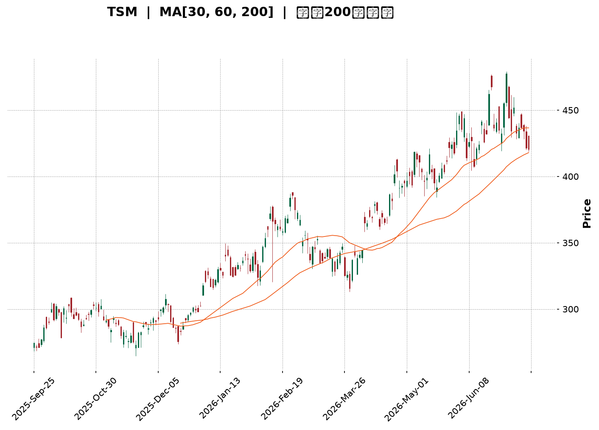
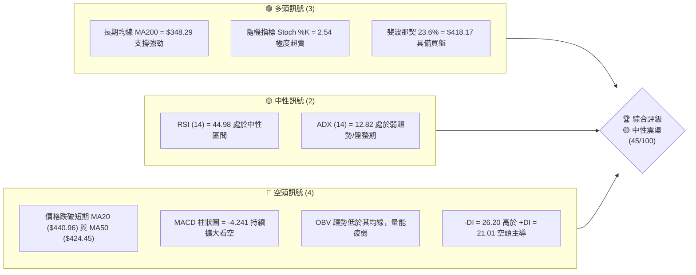
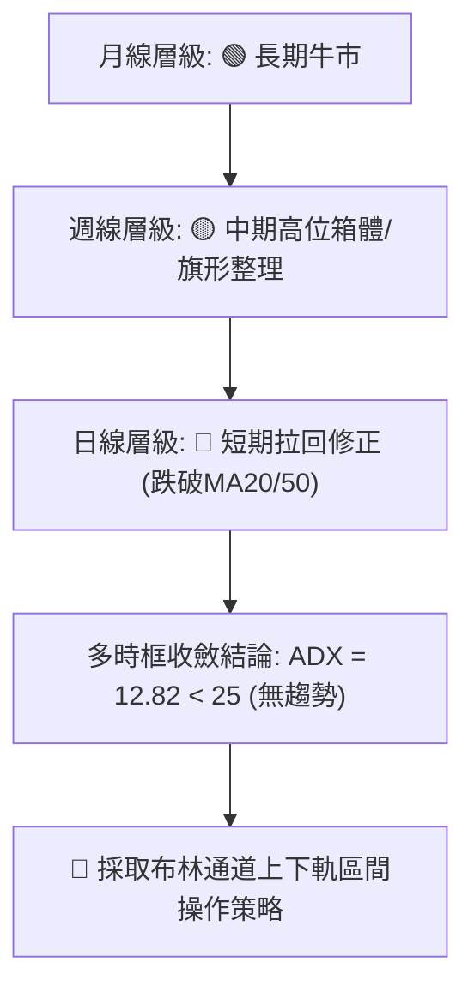
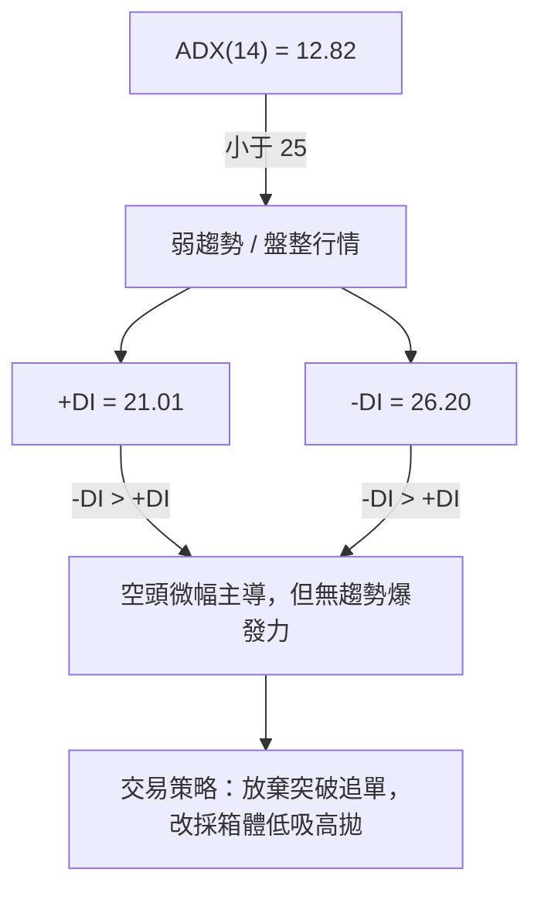
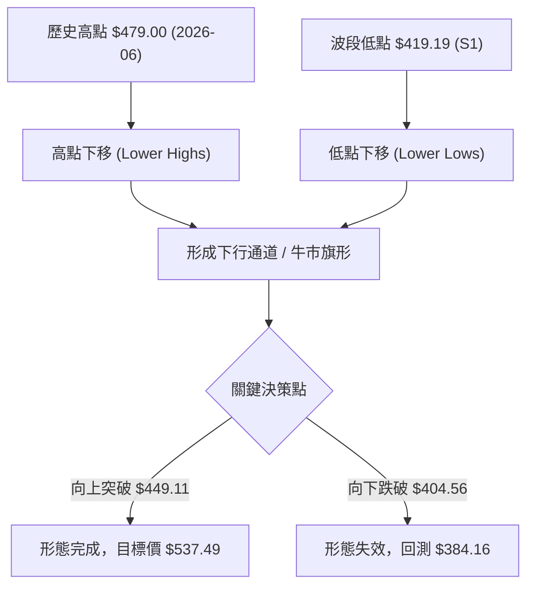
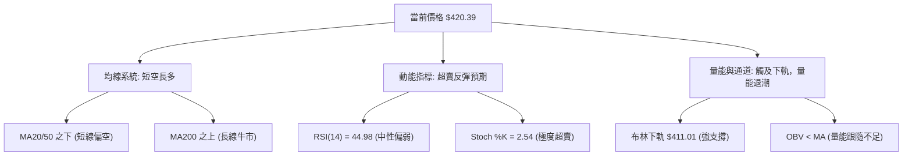
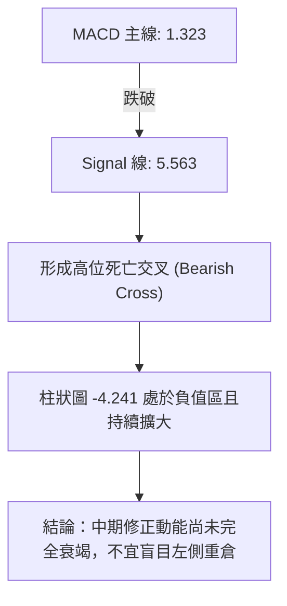
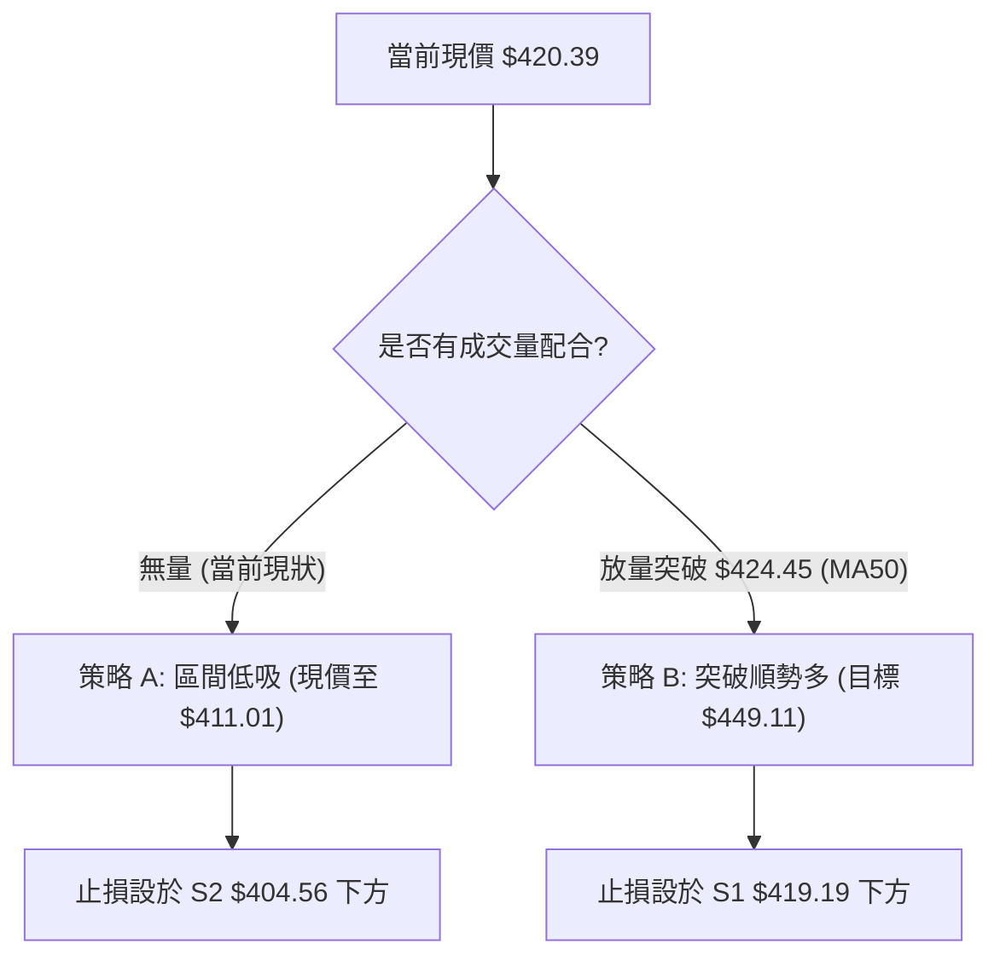
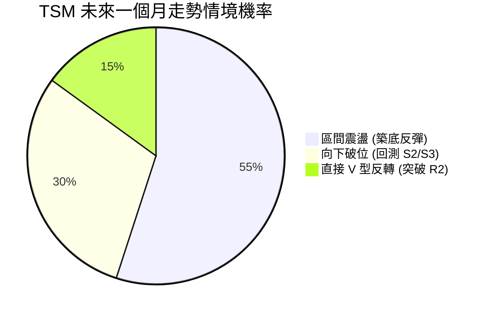
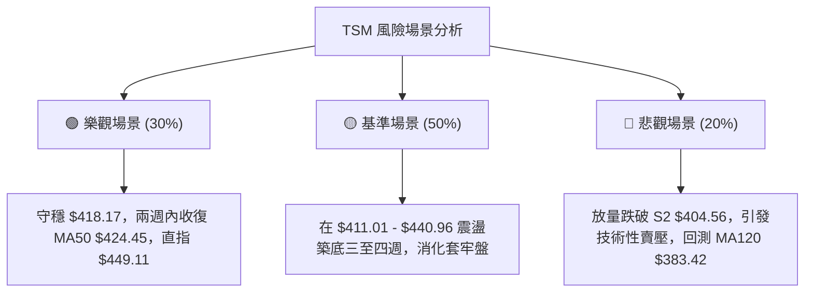

<details>
<summary>📊 靜態圖表 (點擊展開)</summary>

</details>

<html>
<head><meta charset="utf-8" /></head>
<body>
    <div style="height:500px; width:100%;">                        <script>window.PlotlyConfig = {MathJaxConfig: 'local'};</script>
        <script charset="utf-8" src="https://cdn.plot.ly/plotly-3.7.0.min.js" integrity="sha256-jvTGqxNp8AGWEcvNLVuKr+8j5dGe9Yw51LQkmDH+IYA=" crossorigin="anonymous"></script>                <div id="candlestick-chart" class="plotly-graph-div" style="height:100%; width:100%;"></div>            <script>                window.PLOTLYENV=window.PLOTLYENV || {};                                if (document.getElementById("candlestick-chart")) {                    Plotly.newPlot(                        "candlestick-chart",                        [{"close":{"dtype":"f8","bdata":"AAAAwPMncUAAAACgkPNwQAAAAGCA8XBAAAAAILRRcUAAAABgb+NxQAAAAGC43XFAAAAAQH0eckAAAACgksByQAAAAOCyO3JAAAAAADrickAAAABgkZhyQAAAAKBzZ3FAAAAAAFrIckAAAAAgBVpyQAAAAEA+5XJAAAAAwO6XckAAAAAgXkxyQAAAAOD1dXJAAAAAwFFDckAAAACg8elxQAAAAABQB3JAAAAAgHZKckAAAAAAsX5yQAAAAMDCsnJAAAAAoEbrckAAAAAAl81yQAAAAIBMoXJAAAAAwJ\u002fnckAAAABgBDxyQAAAACCCNXJAAAAAgKjvcUAAAABAKcRxQAAAAGBiT3JAAAAAAEwOckAAAAAAkQVyQAAAAEDmf3FAAAAA4H2pcUAAAAAg4nxxQAAAAMDLO3FAAAAAIJmCcUAAAACASTVxQAAAAGCNDnFAAAAAYKKmcUAAAADARKdxQAAAAKAW+3FAAAAAwLETckAAAADA5NZxQAAAAODmHHJAAAAAAD5SckAAAACgPCpyQAAAAECnRnJAAAAAgCi4ckAAAAAgm9ByQAAAAOBxO3NAAAAA4If0ckAAAADAnyhyQAAAAGAt5HFAAAAAQFTWcUAAAACAlThxQAAAACB4s3FAAAAAIHD3cUAAAADAXDxyQAAAAMDHdnJAAAAAYDqUckAAAAAgidRyQAAAAGD5tXJAAAAA4KSgckAAAAAAQOVyQAAAAAB633NAAAAA4H8JdEAAAAAg9Ft0QAAAAECs0HNAAAAAQALGc0AAAABgdx90QAAAAGAJoXRAAAAAYB+YdEAAAAAg3FZ0QAAAAEAlPnVAAAAAAD5KdUAAAADgp1d0QAAAAAAaR3RAAAAAoP9adEAAAADAYdJ0QAAAAOD\u002fr3RAAAAAwJ0JdUAAAACgpkh1QAAAAIDgHHVAAAAAwMaNdEAAAAAgsDl1QAAAAKBj4HRAAAAAgA1BdEAAAACAe5B0QAAAAKDpsHVAAAAAIFUZdkAAAABgzIB2QAAAACCtQndAAAAAYFTjdkAAAADgocd2QAAAAABApXZAAAAAoF6GdkAAAACAmmh2QAAAAEArCndAAAAAoDUCd0AAAAAgR\u002fx3QAAAAIDLG3hAAAAAIPltd0AAAADgeUp3QAAAAOBn83ZAAAAAYAr1dUAAAABgpTl2QAAAAACpAHZAAAAAIF8SdUAAAABghq51QAAAAKDllHVAAAAAYM0LdkAAAACgq+90QAAAAIAjCXVAAAAAgLMndUAAAAAgv5J1QAAAACBtLHVAAAAAwPkfdUAAAABAiId0QAAAAGCMGnVAAAAAICtndUAAAAAgAK91QAAAAKCRVXRAAAAAIKBfdEAAAAAgK7xzQAAAACCREnVAAAAAABNLdUAAAABg9yN1QAAAAGBiT3VAAAAAIDaIdUAAAADAuNB2QAAAAGAtynZAAAAAAL8bd0AAAAAATgt3QAAAAAAKsHdAAAAAAJRjd0AAAABgBKh2QAAAAGAmGndAAAAAICbWdkAAAAAghfN2QAAAAICOKHhAAAAAYEHcd0AAAACgUBh5QAAAAICKQHlAAAAAAMZ2eEAAAADAjo54QAAAAIAnsnhAAAAAwNrLeEAAAAAgvwp5QAAAAADRl3hAAAAAgFEoekAAAAAA69J5QAAAAIB9q3lAAAAAgIQ5eUAAAAAAocV4QAAAAMDa7XhAAAAAoOcLekAAAAAgfDZ5QAAAACBmsHhAAAAAQBV7eEAAAAAg6Ap5QAAAAAAuY3lAAAAAwDI5eUAAAADgtLV5QAAAAKDgW3pAAAAAoOB9ekAAAADAjhd6QAAAAKDLKXtAAAAAgFfae0AAAABAtzp7QAAAAKAWvntAAAAAQDPjeUAAAABg2Jx6QAAAAEC5rnpAAAAAYLh8eUAAAADAHlF6QAAAAEDhfnpAAAAAYGaWe0AAAACgR516QAAAAGBmAntAAAAAgOvhfEAAAABguDp9QAAAAIA9RntAAAAAoEeNe0AAAAAA1y97QAAAAKCZBXtAAAAAoJlxfEAAAADAHtl9QAAAACCuw3tAAAAAYI8ie0AAAADgozx8QAAAAMAeCXtAAAAAIK5Pe0AAAAAgXE97QAAAAIDCIXtAAAAAoEdZekAAAACAPUZ6QA=="},"high":{"dtype":"f8","bdata":"f1rcgJIvcUC6T0OYiRVxQGeRfx3pWnFAl2aQ2OBUcUBW8AcCWANyQEchN0hnZnJAV2+J0exbckCdamsWXA5zQAhAYxIvC3NAcZiQSxIAc0CX0zUIZsdyQIGtFcKlnXJAo0mtR\u002fnjckCh0hfRQLZyQNAJ1MdnA3NAqYdjZfhOc0AsXUEE3M5yQPtoEHZq1HJAqL65nXiQckBOcuT8RU5yQA9u\u002fOamPHJAS4vU3+15ckD46lm2F6JyQKqeGSlJvHJAhnLaN9YYc0DO\u002f0imhA5zQDbO0FRkFHNAWigQTiA7c0B5JqpcELpyQP2FOBU3fnJAXxdnEmJFckBZwp08OtpxQELNr2\u002fpbHJAvOwi6dNJckDt9BDnCElyQLa4yzrJ83FAFLNVTODJcUCe\u002fFpBo8RxQECQlpz9X3FAdniVkDSlcUAljbSQ9yhyQCEVMaEtSHFAbH39LE2tcUCczGLRsrJxQAN7sPtUKHJA\u002fdMw+hsmckDHf+BuIw5yQA0evRIpQ3JA216OyNBkckCtdyYGsztyQG82pywsp3JAqiVyexDEckAJKpxUxORyQB2wGohneHNAIhiYCEoEc0BFd9ARdetyQBVER3F5ZHJAcKnsZqPvcUAmqfZs0\u002flxQCuUWgry2nFAbZT7dbEqckDFe3B05ldyQIWEN6oPhnJAdSPAa\u002fWZckDSlayhId1yQJ8CPaL17nJAvm8lX8HvckCN2mJR9hxzQJC3\u002fXD+\u002fnNASixZZ8KYdEBOvx2O47V0QJ7djlT3SXRAiJBmn1AtdEDuzzXAnDF0QMR\u002f7MZevXRAZwcY8Q3rdEChuUU7ooJ0QHNDZWFj2HVAx26caNTAdUDm3sRMQ0Z1QG6yI7DNvnRAMrWhMT\u002fVdECiOEKgrPZ0QESnZA8L1nRALGHF3O83dUB+DBOClnt1QM2zoYqSX3VAVi16v3IidUDuVRIW5WZ1QBbyaHtClHVAZB1gT\u002fAQdUDiHsZIm810QFmWUc\u002fCvnVA93dKKgdcdkBJG0kAKq52QEtvI4wQmndA1\u002fglO8Cgd0BXNrjgPRN3QEwvOOUVxXZAZy7KBd33dkBWs8gD9452QFABtK2XJHdA2ajsoSs4d0BYkIwq4DJ4QJzfZEpFQ3hA9sYWI70HeEDPmUdK52t3QPdhMgDrMndAw4tcAGgidkCZHuvovnN2QOamtoX1WXZAjwWszteudUBC+47Dqrl1QPQ3Mw7u+nVAxD9qgzY4dkCExgywtpF1QLovueP8a3VA6j+4Pr1tdUAs+xSJMp91QPOMCW4xsnVAbWa0oLExdUDp5yDf+gx1QILuwgi5aXVA3eCmBjCBdUAYtV6JGdp1QL1cHN3QQXVAEERE46OMdEAl1lliR410QJPUE9noGXVAfWpjcdi9dUAt7wBBVVR1QNr\u002fOEZVdnVAXCWNPZCLdUCW8ei8zlZ3QPc4Xxr19HZA3LOxjt6Rd0BaYbxJeSl3QC31xyZG1HdAZXrsqGbRd0D+RBRyXBV3QN9fpmI9a3dAwk3gOEkTd0ByXrryIx53QInmjCAPMHhAedmzn6A9eEB99EA5iIh5QAnJ\u002fUSB2HlANIox9AvPeEBpVDdrza54QOP5xH+73XhAKDXg5LwweUDUPAyY9Wt5QBP26fflUnlAiwgA1oIrekDhahmkTDB6QNOsf1ZpAHpA1HblOHBseUA\u002fVbiozRR5QNaUpYzAO3lAM6gM9L5PekD42essmY55QPRoN8feXnlAKgERPyvfeEC1fld\u002f+y55QDfL\u002fID6p3lABXVxZV6beUC7U\u002fI3Rfh5QCl4zmm02HpAFOs5h52pekBWxvgB89Z6QNtE6\u002fFwBXxAqUKzk1H1e0AFZox4uxF8QJTP\u002fq1p73tAwqqlAS4Oe0DgB3ZKvgx7QOPgREEuUntAZigg\u002fC6VekAAAAAAAGR6QAAAAEAKr3pAAAAAoEepe0AAAACgR4V7QAAAAAAAqHtAAAAAIIUTfUAAAADgo8x9QAAAAKBH9XtAAAAAgMK9e0AAAABgZk58QAAAAIAUQntAAAAAoJmBfEAAAAAAAPB9QAAAAAApSH1AAAAAIIXXfEAAAADgesB8QAAAAMDMfHtAAAAAANeHe0AAAABACvt7QAAAAGCPentAAAAAANdfe0AAAACA6+16QA=="},"hovertemplate":"\u003cb\u003e%{x|%Y-%m-%d}\u003c\u002fb\u003e\u003cbr\u003e\u958b: $%{open:.2f}\u003cbr\u003e\u9ad8: $%{high:.2f}\u003cbr\u003e\u4f4e: $%{low:.2f}\u003cbr\u003e\u6536: $%{close:.2f}\u003cextra\u003e\u003c\u002fextra\u003e","low":{"dtype":"f8","bdata":"l5cx0T3BcEBc205eEchwQAAAAGCA8XBAOw3huAb7cEDetsl8DDBxQFm4llWTzHFAqZDOcIADckCPWLlGhZlyQAncmOTKL3JA+BKcx+c6ckC4W+AGhHFyQCTofnE2YnFAyNE1vI0gckA1eEjP\u002fhByQOiepHaVm3JAZhiQP+1lckDGlnb\u002f00lyQF2t1t7Ma3JArbxeWNM1ckCNmuj20qJxQDlgzZnZ9XFAdn2qIGpBckD68OVGTTZyQDs4pwc+XHJAOdVwSEHAckC7Ght7fadyQD00VpbEZXJANOCifiC8ckCsZa\u002fqcTNyQDz13CeJE3JAYlI6kCHScUA4qoPPaS9xQOnLrziBF3JA9nfHX2vqcUAn+9ltDvVxQJTVq3P5XHFArq9dZoDxcED4YqalzFlxQCxHmbNn6XBA0WNYHY4icUCUOsnH+yNxQGsJgT++i3BArsfsyt3wcEACU4+ZHu9wQO5aWQmw13FAWFlGIdnrcUDKTu6InY9xQJ6aRbC07nFAX6Or4FW9cUAqD2EM5v5xQNc1+jJRL3JAeIMFDGdmckAFnEn8qIJyQMBEDggpwnJArmB6bpmhckDP0r9QwBdyQKLQACAn4XFAxeIwPNKdcUAr9QqUqBpxQA07wY7UhHFAu07peofOcUCSwueTaRtyQB34rL8rK3JA12B92lFrckDRG0dSxY9yQAey5ynXkXJAR7Z4PJOeckBpbjRv7d1yQISqwkWRYXNA+uYNqo\u002f9c0DqcsdJvy50QNdUb9JxznNAQ\u002ff9HT6oc0AZbM4i1MlzQGyzIbiO9nNAMlZnLUeRdECidIGVaDJ0QOf6XnDuAnVAnw0Wikc7dUDkuUxZhFN0QLdnUQMZQHRACmgDZYRTdEDdWcVuq5p0QGWidhWGiHRAvEf\u002fc3LNdED+ehThtQ51QJjm7vA1aHRA0TRoXIl2dEC4dnJZiXZ0QNLOiiEuhXRAO5q7quHWc0B+1H8CHeBzQBY\u002fwjW37nRAG4WetTKgdUBA\u002fTe17ih2QMX6l\u002f\u002fx53ZANCGhxBwHdEBvlErupm52QFU4qlOLJnZAw+6dYbJtdkABgK5apTl2QGLv39URVHZACJg+PjnJdkBPKtEU4GF3QP0CZA2i7XdAuM0HTsz8dkD48qA4m+t2QPdcqaRprHZAsFoSovBldUBDRUq3pAt2QF7xwAiHYHVAs+mnMFrvdEACoCvBbKN0QJcbaEalaHVAVzy3i\u002fLIdUBnxWvyaup0QBFV4N\u002fe53RAA1yrwSwhdUDBQ0bqvxl1QJGEfzPBKHVAiV7yReJGdECJTYaWN1J0QKboahY5pXRAzmWZVNXTdEBt397LKGt1QDgV67TBSXRAMfMIRekYdEBylr+2EZFzQIOjbT48BnRALnjCpkwvdUCRQwdilWB0QG7dvexCHXVArNohStrtdEAHpEwcaWZ2QAe9tSUJfnZAHNtvgi0Od0DZVK6vHdN2QHU7yXSRRXdA65AkKHI1d0APUM1LUnt2QGMnUCuXxHZAv0RCK2K2dkB4eDZsHMR2QGraD4ZiHHdANZG1Telud0C9bYuF4I54QGPwk5Ru93hA8NIBvdH8d0DBJr9xXjR4QNUzZOzwDHhA0ZJN5GtzeECL0sk3baR4QLuuMpLsenhACiCvQ2z7eECvAWPtgHJ5QCjU6xoY\u002f3hATM62pCfUeED8mm9sfBN4QJS1V9fiaHhAUfv3mpESeUC1SSfzXt54QExhTIQuYnhAsvy6wJACeECVZ4oiZrB4QJ+MG7056XhAdv28QrMeeUCUGEhoypF5QJ5wz1aN5nlAb2h1YtvbeUBZj+L7ZgR6QBtxqMY0WHpA6smtdNwve0BWFa6LPBh7QIYQSp7TpHpA+MW+hjW9eUCvg99cr1h6QCu2yFUASXlAo+ZPrPVreUAAAACAwo15QAAAACBcE3pAAAAAQOH+ekAAAABAM5N6QAAAAIA9+npAAAAAgD1me0AAAABguBJ9QAAAAEAKI3tAAAAAoEcJe0AAAABACgd7QAAAAEAKM3pAAAAAoHDxekAAAAAAAFB8QAAAACCFt3tAAAAAAADYekAAAACgmdl7QAAAAIDCwXpAAAAAAADMekAAAACAPUZ7QAAAAKCZwXpAAAAA4KNEekAAAACAwi16QA=="},"name":"\u50f9\u683c","open":{"dtype":"f8","bdata":"AMgOPcHvcEA9aNim+vtwQHPCu9pAJXFAqv\u002fKIa4ScUDbvXmxNURxQOKn4286Y3JAAiFwCyApckDa5c\u002fIoZpyQBt1lFGQA3NAmdKn\u002fRhLckCMTQ3PJL9yQFxCyVHWmXJAaX+WaIh+ckCQoGNNGVVyQP91AGdT\u002fnJAZ0KEPPxHc0CyaIKOEoFyQHaatPh4mnJAC0r09piKckAk03swWStyQC0sSmiM+HFAbBQYlyVUckBEwNiQCoVyQLnexmvNf3JAERiCA4z2ckBxZ9b7XctyQC3QYTOQ+XJAjlWIkZbDckDlg85\u002f8WhyQF2PIcpQJXJAc5dpfc88ckDF04evrq9xQJ2jKSTwQHJAGeXS32wcckA1JW4edjZyQCl5BSyM7nFARFHi0wsccUCOQeSg1XNxQGBAaKcUNnFA2FKKhhQscUD\u002fBYuPzh5yQDx7hG3V6nBArsfsyt3wcEDutxESUIhxQJTkJapv7XFAUNXYzxcjckCY70421MpxQGW5yiF5G3JARVlot1QeckDIPvPf5zpyQP2X2kjEW3JA+neRtIWtckBv9lJFUJpyQIpiIaC473JAsnr\u002fGgP8ckBFd9ARdetyQNmHXsAgWnJAakcRionccUCEtPGswPBxQIhgXiOQuHFAu07peofOcUAeusj8fFJyQHfkfJxFPnJAQxex8FqDckCWqd7EvKVyQENPP8Wpw3JAHem8OeXMckAZAkEvAOdyQNBpvkAGZnNAfkhgrDqLdEBnl59DXYh0QFh8MUUFMHRAbXQlcJArdECa3q5\u002f+uJzQORrI7McB3RAkGeSzYuydEChuUU7ooJ0QGfhjt7EUHVAwJlRGaqLdUAbSkpunTB1QARZBNx1u3RA9iktIk27dECaoybyz6V0QHaxwvBFsXRA2t2C3FPsdEBJobphRVR1QOvsqTzbIHVAJJ2qDyPbdEC6zBbH9ZB0QPqeZCq+dHVA3DohjQDedEDjBBKmkhJ0QHP9zfA+\u002fHRAvM+mv3qvdUCFEdatUad2QBYsoIvYAndATWN3SNWQd0Akur4DC\u002fR2QFcVX00pgHZA9x4lcdafdkDyxvE68F12QAOYLMXkXnZAtNz1ifrRdkDBNXEuM5d3QJzfZEpFQ3hAGyUKXh8DeED+aqw4zQN3QMh5PNK2t3ZAjZfp\u002fQ28dUBCM\u002fKVfDl2QKUoCvs2EXZAwR4ik8BbdUAvZW2IAN50QDofqRLdqnVAJLJfI8YBdkBfl\u002felboJ1QAwFPwVwYnVAEs\u002fh5u83dUB\u002foHcc3jx1QC1qTNKNj3VAoQYQlTaHdEBFcAhNS\u002f50QKboahY5pXRAy8s1X5PsdEBLpz3fEJN1QNtGhKtqMHVA4PJQByNBdECo8hX692Z0QA0qHUzpGHRAi3HKT4txdUDQmAPgOGF0QLLoVZxML3VAnQcp5VkqdUCbje48zBZ3QBPVJxU4p3ZAZV\u002f7PmZrd0D+4JClURZ3QKh2a4J4ondA2DldXU3Id0D5WweF+P92QKlLTMk\u002fRXdATGFMu7cFd0AAAAAghfN2QBX0Ov2ULndAYSyyyKL1d0C0rER7brN4QKRVanKIzHlApLv5+kJzeEDUgNZN3394QOGhsMAWznhAIZD6GlWIeEDwwsimMjl5QBkiKbx5OnlAvmdyhFsXeUDTX2iLzxF6QKnG9hCd\u002f3lA2oNSkqJceUCTMZCgIc14QEdcSoRu1XhAsOele0kkeUCzAd3szVh5QPRoN8feXnlAXPCiaplJeEBhjj3WKMF4QJ+MG7056XhAXbNKI5OHeUBuiBv4ecJ5QIUR91FboHpA57Oxg7xTekDiiA3CJ6F6QEdp+38yfnpAPhfLWM94e0AkMQ65BA98QBeIRYD72XpAUTqyB0HMekArPhJ\u002femx6QLZ\u002fYQz53XpA7QhOpOLPeUAAAAAAKdR5QAAAAMDMQHpAAAAAQOFqe0AAAADgUUB7QAAAAAAALHtAAAAAgBRue0AAAACgcMF9QAAAAEDhcntAAAAAIK4fe0AAAABgZk58QAAAAAAAkHpAAAAAAABQe0AAAACAwnl8QAAAAGC4On1AAAAA4KMofEAAAADgevx7QAAAAOBRYHtAAAAAAADQekAAAAAgrut7QAAAAGC4antAAAAAwB4de0AAAACA6+16QA=="},"x":["2025-09-25T00:00:00-04:00","2025-09-26T00:00:00-04:00","2025-09-29T00:00:00-04:00","2025-09-30T00:00:00-04:00","2025-10-01T00:00:00-04:00","2025-10-02T00:00:00-04:00","2025-10-03T00:00:00-04:00","2025-10-06T00:00:00-04:00","2025-10-07T00:00:00-04:00","2025-10-08T00:00:00-04:00","2025-10-09T00:00:00-04:00","2025-10-10T00:00:00-04:00","2025-10-13T00:00:00-04:00","2025-10-14T00:00:00-04:00","2025-10-15T00:00:00-04:00","2025-10-16T00:00:00-04:00","2025-10-17T00:00:00-04:00","2025-10-20T00:00:00-04:00","2025-10-21T00:00:00-04:00","2025-10-22T00:00:00-04:00","2025-10-23T00:00:00-04:00","2025-10-24T00:00:00-04:00","2025-10-27T00:00:00-04:00","2025-10-28T00:00:00-04:00","2025-10-29T00:00:00-04:00","2025-10-30T00:00:00-04:00","2025-10-31T00:00:00-04:00","2025-11-03T00:00:00-05:00","2025-11-04T00:00:00-05:00","2025-11-05T00:00:00-05:00","2025-11-06T00:00:00-05:00","2025-11-07T00:00:00-05:00","2025-11-10T00:00:00-05:00","2025-11-11T00:00:00-05:00","2025-11-12T00:00:00-05:00","2025-11-13T00:00:00-05:00","2025-11-14T00:00:00-05:00","2025-11-17T00:00:00-05:00","2025-11-18T00:00:00-05:00","2025-11-19T00:00:00-05:00","2025-11-20T00:00:00-05:00","2025-11-21T00:00:00-05:00","2025-11-24T00:00:00-05:00","2025-11-25T00:00:00-05:00","2025-11-26T00:00:00-05:00","2025-11-28T00:00:00-05:00","2025-12-01T00:00:00-05:00","2025-12-02T00:00:00-05:00","2025-12-03T00:00:00-05:00","2025-12-04T00:00:00-05:00","2025-12-05T00:00:00-05:00","2025-12-08T00:00:00-05:00","2025-12-09T00:00:00-05:00","2025-12-10T00:00:00-05:00","2025-12-11T00:00:00-05:00","2025-12-12T00:00:00-05:00","2025-12-15T00:00:00-05:00","2025-12-16T00:00:00-05:00","2025-12-17T00:00:00-05:00","2025-12-18T00:00:00-05:00","2025-12-19T00:00:00-05:00","2025-12-22T00:00:00-05:00","2025-12-23T00:00:00-05:00","2025-12-24T00:00:00-05:00","2025-12-26T00:00:00-05:00","2025-12-29T00:00:00-05:00","2025-12-30T00:00:00-05:00","2025-12-31T00:00:00-05:00","2026-01-02T00:00:00-05:00","2026-01-05T00:00:00-05:00","2026-01-06T00:00:00-05:00","2026-01-07T00:00:00-05:00","2026-01-08T00:00:00-05:00","2026-01-09T00:00:00-05:00","2026-01-12T00:00:00-05:00","2026-01-13T00:00:00-05:00","2026-01-14T00:00:00-05:00","2026-01-15T00:00:00-05:00","2026-01-16T00:00:00-05:00","2026-01-20T00:00:00-05:00","2026-01-21T00:00:00-05:00","2026-01-22T00:00:00-05:00","2026-01-23T00:00:00-05:00","2026-01-26T00:00:00-05:00","2026-01-27T00:00:00-05:00","2026-01-28T00:00:00-05:00","2026-01-29T00:00:00-05:00","2026-01-30T00:00:00-05:00","2026-02-02T00:00:00-05:00","2026-02-03T00:00:00-05:00","2026-02-04T00:00:00-05:00","2026-02-05T00:00:00-05:00","2026-02-06T00:00:00-05:00","2026-02-09T00:00:00-05:00","2026-02-10T00:00:00-05:00","2026-02-11T00:00:00-05:00","2026-02-12T00:00:00-05:00","2026-02-13T00:00:00-05:00","2026-02-17T00:00:00-05:00","2026-02-18T00:00:00-05:00","2026-02-19T00:00:00-05:00","2026-02-20T00:00:00-05:00","2026-02-23T00:00:00-05:00","2026-02-24T00:00:00-05:00","2026-02-25T00:00:00-05:00","2026-02-26T00:00:00-05:00","2026-02-27T00:00:00-05:00","2026-03-02T00:00:00-05:00","2026-03-03T00:00:00-05:00","2026-03-04T00:00:00-05:00","2026-03-05T00:00:00-05:00","2026-03-06T00:00:00-05:00","2026-03-09T00:00:00-04:00","2026-03-10T00:00:00-04:00","2026-03-11T00:00:00-04:00","2026-03-12T00:00:00-04:00","2026-03-13T00:00:00-04:00","2026-03-16T00:00:00-04:00","2026-03-17T00:00:00-04:00","2026-03-18T00:00:00-04:00","2026-03-19T00:00:00-04:00","2026-03-20T00:00:00-04:00","2026-03-23T00:00:00-04:00","2026-03-24T00:00:00-04:00","2026-03-25T00:00:00-04:00","2026-03-26T00:00:00-04:00","2026-03-27T00:00:00-04:00","2026-03-30T00:00:00-04:00","2026-03-31T00:00:00-04:00","2026-04-01T00:00:00-04:00","2026-04-02T00:00:00-04:00","2026-04-06T00:00:00-04:00","2026-04-07T00:00:00-04:00","2026-04-08T00:00:00-04:00","2026-04-09T00:00:00-04:00","2026-04-10T00:00:00-04:00","2026-04-13T00:00:00-04:00","2026-04-14T00:00:00-04:00","2026-04-15T00:00:00-04:00","2026-04-16T00:00:00-04:00","2026-04-17T00:00:00-04:00","2026-04-20T00:00:00-04:00","2026-04-21T00:00:00-04:00","2026-04-22T00:00:00-04:00","2026-04-23T00:00:00-04:00","2026-04-24T00:00:00-04:00","2026-04-27T00:00:00-04:00","2026-04-28T00:00:00-04:00","2026-04-29T00:00:00-04:00","2026-04-30T00:00:00-04:00","2026-05-01T00:00:00-04:00","2026-05-04T00:00:00-04:00","2026-05-05T00:00:00-04:00","2026-05-06T00:00:00-04:00","2026-05-07T00:00:00-04:00","2026-05-08T00:00:00-04:00","2026-05-11T00:00:00-04:00","2026-05-12T00:00:00-04:00","2026-05-13T00:00:00-04:00","2026-05-14T00:00:00-04:00","2026-05-15T00:00:00-04:00","2026-05-18T00:00:00-04:00","2026-05-19T00:00:00-04:00","2026-05-20T00:00:00-04:00","2026-05-21T00:00:00-04:00","2026-05-22T00:00:00-04:00","2026-05-26T00:00:00-04:00","2026-05-27T00:00:00-04:00","2026-05-28T00:00:00-04:00","2026-05-29T00:00:00-04:00","2026-06-01T00:00:00-04:00","2026-06-02T00:00:00-04:00","2026-06-03T00:00:00-04:00","2026-06-04T00:00:00-04:00","2026-06-05T00:00:00-04:00","2026-06-08T00:00:00-04:00","2026-06-09T00:00:00-04:00","2026-06-10T00:00:00-04:00","2026-06-11T00:00:00-04:00","2026-06-12T00:00:00-04:00","2026-06-15T00:00:00-04:00","2026-06-16T00:00:00-04:00","2026-06-17T00:00:00-04:00","2026-06-18T00:00:00-04:00","2026-06-22T00:00:00-04:00","2026-06-23T00:00:00-04:00","2026-06-24T00:00:00-04:00","2026-06-25T00:00:00-04:00","2026-06-26T00:00:00-04:00","2026-06-29T00:00:00-04:00","2026-06-30T00:00:00-04:00","2026-07-01T00:00:00-04:00","2026-07-02T00:00:00-04:00","2026-07-06T00:00:00-04:00","2026-07-07T00:00:00-04:00","2026-07-08T00:00:00-04:00","2026-07-09T00:00:00-04:00","2026-07-10T00:00:00-04:00","2026-07-13T00:00:00-04:00","2026-07-14T00:00:00-04:00"],"type":"candlestick"},{"hovertemplate":"MA30: $%{y:.2f}\u003cextra\u003e\u003c\u002fextra\u003e","line":{"color":"#2196F3","dash":"dash","width":2},"mode":"lines","name":"MA30","x":["2025-09-25T00:00:00-04:00","2025-09-26T00:00:00-04:00","2025-09-29T00:00:00-04:00","2025-09-30T00:00:00-04:00","2025-10-01T00:00:00-04:00","2025-10-02T00:00:00-04:00","2025-10-03T00:00:00-04:00","2025-10-06T00:00:00-04:00","2025-10-07T00:00:00-04:00","2025-10-08T00:00:00-04:00","2025-10-09T00:00:00-04:00","2025-10-10T00:00:00-04:00","2025-10-13T00:00:00-04:00","2025-10-14T00:00:00-04:00","2025-10-15T00:00:00-04:00","2025-10-16T00:00:00-04:00","2025-10-17T00:00:00-04:00","2025-10-20T00:00:00-04:00","2025-10-21T00:00:00-04:00","2025-10-22T00:00:00-04:00","2025-10-23T00:00:00-04:00","2025-10-24T00:00:00-04:00","2025-10-27T00:00:00-04:00","2025-10-28T00:00:00-04:00","2025-10-29T00:00:00-04:00","2025-10-30T00:00:00-04:00","2025-10-31T00:00:00-04:00","2025-11-03T00:00:00-05:00","2025-11-04T00:00:00-05:00","2025-11-05T00:00:00-05:00","2025-11-06T00:00:00-05:00","2025-11-07T00:00:00-05:00","2025-11-10T00:00:00-05:00","2025-11-11T00:00:00-05:00","2025-11-12T00:00:00-05:00","2025-11-13T00:00:00-05:00","2025-11-14T00:00:00-05:00","2025-11-17T00:00:00-05:00","2025-11-18T00:00:00-05:00","2025-11-19T00:00:00-05:00","2025-11-20T00:00:00-05:00","2025-11-21T00:00:00-05:00","2025-11-24T00:00:00-05:00","2025-11-25T00:00:00-05:00","2025-11-26T00:00:00-05:00","2025-11-28T00:00:00-05:00","2025-12-01T00:00:00-05:00","2025-12-02T00:00:00-05:00","2025-12-03T00:00:00-05:00","2025-12-04T00:00:00-05:00","2025-12-05T00:00:00-05:00","2025-12-08T00:00:00-05:00","2025-12-09T00:00:00-05:00","2025-12-10T00:00:00-05:00","2025-12-11T00:00:00-05:00","2025-12-12T00:00:00-05:00","2025-12-15T00:00:00-05:00","2025-12-16T00:00:00-05:00","2025-12-17T00:00:00-05:00","2025-12-18T00:00:00-05:00","2025-12-19T00:00:00-05:00","2025-12-22T00:00:00-05:00","2025-12-23T00:00:00-05:00","2025-12-24T00:00:00-05:00","2025-12-26T00:00:00-05:00","2025-12-29T00:00:00-05:00","2025-12-30T00:00:00-05:00","2025-12-31T00:00:00-05:00","2026-01-02T00:00:00-05:00","2026-01-05T00:00:00-05:00","2026-01-06T00:00:00-05:00","2026-01-07T00:00:00-05:00","2026-01-08T00:00:00-05:00","2026-01-09T00:00:00-05:00","2026-01-12T00:00:00-05:00","2026-01-13T00:00:00-05:00","2026-01-14T00:00:00-05:00","2026-01-15T00:00:00-05:00","2026-01-16T00:00:00-05:00","2026-01-20T00:00:00-05:00","2026-01-21T00:00:00-05:00","2026-01-22T00:00:00-05:00","2026-01-23T00:00:00-05:00","2026-01-26T00:00:00-05:00","2026-01-27T00:00:00-05:00","2026-01-28T00:00:00-05:00","2026-01-29T00:00:00-05:00","2026-01-30T00:00:00-05:00","2026-02-02T00:00:00-05:00","2026-02-03T00:00:00-05:00","2026-02-04T00:00:00-05:00","2026-02-05T00:00:00-05:00","2026-02-06T00:00:00-05:00","2026-02-09T00:00:00-05:00","2026-02-10T00:00:00-05:00","2026-02-11T00:00:00-05:00","2026-02-12T00:00:00-05:00","2026-02-13T00:00:00-05:00","2026-02-17T00:00:00-05:00","2026-02-18T00:00:00-05:00","2026-02-19T00:00:00-05:00","2026-02-20T00:00:00-05:00","2026-02-23T00:00:00-05:00","2026-02-24T00:00:00-05:00","2026-02-25T00:00:00-05:00","2026-02-26T00:00:00-05:00","2026-02-27T00:00:00-05:00","2026-03-02T00:00:00-05:00","2026-03-03T00:00:00-05:00","2026-03-04T00:00:00-05:00","2026-03-05T00:00:00-05:00","2026-03-06T00:00:00-05:00","2026-03-09T00:00:00-04:00","2026-03-10T00:00:00-04:00","2026-03-11T00:00:00-04:00","2026-03-12T00:00:00-04:00","2026-03-13T00:00:00-04:00","2026-03-16T00:00:00-04:00","2026-03-17T00:00:00-04:00","2026-03-18T00:00:00-04:00","2026-03-19T00:00:00-04:00","2026-03-20T00:00:00-04:00","2026-03-23T00:00:00-04:00","2026-03-24T00:00:00-04:00","2026-03-25T00:00:00-04:00","2026-03-26T00:00:00-04:00","2026-03-27T00:00:00-04:00","2026-03-30T00:00:00-04:00","2026-03-31T00:00:00-04:00","2026-04-01T00:00:00-04:00","2026-04-02T00:00:00-04:00","2026-04-06T00:00:00-04:00","2026-04-07T00:00:00-04:00","2026-04-08T00:00:00-04:00","2026-04-09T00:00:00-04:00","2026-04-10T00:00:00-04:00","2026-04-13T00:00:00-04:00","2026-04-14T00:00:00-04:00","2026-04-15T00:00:00-04:00","2026-04-16T00:00:00-04:00","2026-04-17T00:00:00-04:00","2026-04-20T00:00:00-04:00","2026-04-21T00:00:00-04:00","2026-04-22T00:00:00-04:00","2026-04-23T00:00:00-04:00","2026-04-24T00:00:00-04:00","2026-04-27T00:00:00-04:00","2026-04-28T00:00:00-04:00","2026-04-29T00:00:00-04:00","2026-04-30T00:00:00-04:00","2026-05-01T00:00:00-04:00","2026-05-04T00:00:00-04:00","2026-05-05T00:00:00-04:00","2026-05-06T00:00:00-04:00","2026-05-07T00:00:00-04:00","2026-05-08T00:00:00-04:00","2026-05-11T00:00:00-04:00","2026-05-12T00:00:00-04:00","2026-05-13T00:00:00-04:00","2026-05-14T00:00:00-04:00","2026-05-15T00:00:00-04:00","2026-05-18T00:00:00-04:00","2026-05-19T00:00:00-04:00","2026-05-20T00:00:00-04:00","2026-05-21T00:00:00-04:00","2026-05-22T00:00:00-04:00","2026-05-26T00:00:00-04:00","2026-05-27T00:00:00-04:00","2026-05-28T00:00:00-04:00","2026-05-29T00:00:00-04:00","2026-06-01T00:00:00-04:00","2026-06-02T00:00:00-04:00","2026-06-03T00:00:00-04:00","2026-06-04T00:00:00-04:00","2026-06-05T00:00:00-04:00","2026-06-08T00:00:00-04:00","2026-06-09T00:00:00-04:00","2026-06-10T00:00:00-04:00","2026-06-11T00:00:00-04:00","2026-06-12T00:00:00-04:00","2026-06-15T00:00:00-04:00","2026-06-16T00:00:00-04:00","2026-06-17T00:00:00-04:00","2026-06-18T00:00:00-04:00","2026-06-22T00:00:00-04:00","2026-06-23T00:00:00-04:00","2026-06-24T00:00:00-04:00","2026-06-25T00:00:00-04:00","2026-06-26T00:00:00-04:00","2026-06-29T00:00:00-04:00","2026-06-30T00:00:00-04:00","2026-07-01T00:00:00-04:00","2026-07-02T00:00:00-04:00","2026-07-06T00:00:00-04:00","2026-07-07T00:00:00-04:00","2026-07-08T00:00:00-04:00","2026-07-09T00:00:00-04:00","2026-07-10T00:00:00-04:00","2026-07-13T00:00:00-04:00","2026-07-14T00:00:00-04:00"],"y":{"dtype":"f8","bdata":"AAAAAAAA+H8AAAAAAAD4fwAAAAAAAPh\u002fAAAAAAAA+H8AAAAAAAD4fwAAAAAAAPh\u002fAAAAAAAA+H8AAAAAAAD4fwAAAAAAAPh\u002fAAAAAAAA+H8AAAAAAAD4fwAAAAAAAPh\u002fAAAAAAAA+H8AAAAAAAD4fwAAAAAAAPh\u002fAAAAAAAA+H8AAAAAAAD4fwAAAAAAAPh\u002fAAAAAAAA+H8AAAAAAAD4fwAAAAAAAPh\u002fAAAAAAAA+H8AAAAAAAD4fwAAAAAAAPh\u002fAAAAAAAA+H8AAAAAAAD4fwAAAAAAAPh\u002fAAAAAAAA+H8AAAAAAAD4f83MzIzAOnJAVVVVtWhBckCrqqq6XEhyQFVVVWUGVHJAmpmZuU9ackCrqqr6cltyQAAAAGBSWHJA7+7u\u002fmtUckCJiIjYoUlyQERERCQaQXJARERElGE1ckCamZnZiSlyQN7d3T2TJnJAzczM\u002fOocckBERESk9RZyQFVVVYUnD3JAZmZmFr8KckBERESk1AZyQM3MzKzcA3JAREREBFwEckBmZmamgAZyQImIiCidCHJAmpmZOUUMckCrqqo6AA9yQJqZmZmOE3JAMzMzk90TckDe3d3dXQ5yQHd3dwcQCHJAmpmZ6fP+cUBVVVUVTvZxQKuqqmr48XFA3t3dzTrycUBVVVWFPPZxQDMzM7OM93FARERElAP8cUB3d3e36QJyQAAAALA\u002fDXJAiYiIuHwVckCamZnZfyFyQImIiKgFOHJAIiIi4pVNckAAAABweWhyQAAAAAADgHJAvLu7yx+SckDNzMyMMqdyQFVVVbXLvXJARERE1EbTckAAAADgm+hyQHd3dydRA3NAzczMfKYcc0AREREhOy9zQFVVVQVQQHNAAAAAIEZOc0CJiIhYZl9zQKuqqnrRa3NAmpmZeZZ9c0Dv7u5eQZhzQO\u002fu7s6+s3NAq6qqSu3Kc0CJiIjYGO1zQDMzM8MxCHRAIiIiArcbdEBmZmbmlS90QAAAAJAfS3RAzczM\u002fChpdEAAAACQgIh0QKuqqlpTr3RAmpmZia7TdEDv7u7u0\u002fR0QKuqqqp8DHVAq6qqSrchdUDe3d1NNDN1QJqZmYm4TnVAmpmZ2VNqdUBVVVW1SYt1QImIiNj6qHVAVVVVxSzBdUAiIiKyXNp1QLy7u\u002fvv6HVAZmZmdqHudUAiIiJysv51QJqZmWlqDXZAIiIiMocTdkAAAADA3Rp2QCIiIgJ\u002fInZAIiIiMhordkBVVVXlIih2QGZmZnZ6J3ZARERE9JssdkC8u7vrky92QFVVVcUcMnZAvLu7C4s5dkC8u7urPjl2QAAAAJA7NHZAq6qqOksudkBERET0TCd2QCIiIpJUDnZAERERod\u002f4dUBEREQ05N51QJqZmfl30XVAREREdPXGdUB3d3c3I7x1QJqZmclgrXVARERENMegdUDe3d39ypZ1QM3MzPyJi3VAERERUcyIdUARERFBsYZ1QM3MzOz6jHVAZmZmtjKZdUC8u7uL4Jx1QHd3d5dCpnVAIiIiwlG1dUDNzMwMJ8B1QFVVVSUk1nVAq6qqep\u002fldUAiIiJyHAl2QImIiFgXLXZAIiIislNJdkDNzMyMyWJ2QLy7u0vYgHZAiYiImCygdkDNzMxsrsZ2QKuqqvp05HZAMzMzUwcNd0BERET0WzB3QBEREdHjXXdAvLu7S0mHd0ARERGxRLJ3QLy7u4st03dAq6qqKr37d0AzMzNTfR54QImIiMhSO3hAq6qqWnxUeEDv7u7ufWd4QO\u002fu7p6ofXhAMzMzA7WPeEDNzMwsdKZ4QImIiJg\u002fvXhA3t3dnbnXeEB3d3cHC\u002fV4QLy7u6uyF3lA3t3dHYFCeUCamZnJAmd5QERERGSYhXlAiYiIuOSWeUDe3d0t2KN5QAAAAPAMsHlAd3d3N8i4eUBEREQEzcd5QKuqqooo13lA7+7u\u002fvnueUAiIiLyZPx5QGZmZoYDEXpAREREZEQoekBVVVXFU0V6QGZmZtYEU3pAzczMrOBmekAzMzMTfHt6QFVVVcVXjXpAMzMzo8yhekB3d3eXWsl6QJqZmbmY43pA3t3d7T76ekC8u7vrgBV7QKuqqnqRI3tAREREZGI1e0CamZkZCkN7QCIiIrKiSXtAVVVVZWpIe0ARERHB+El7QA=="},"type":"scatter"},{"hovertemplate":"MA60: $%{y:.2f}\u003cextra\u003e\u003c\u002fextra\u003e","line":{"color":"#9C27B0","dash":"dash","width":2},"mode":"lines","name":"MA60","x":["2025-09-25T00:00:00-04:00","2025-09-26T00:00:00-04:00","2025-09-29T00:00:00-04:00","2025-09-30T00:00:00-04:00","2025-10-01T00:00:00-04:00","2025-10-02T00:00:00-04:00","2025-10-03T00:00:00-04:00","2025-10-06T00:00:00-04:00","2025-10-07T00:00:00-04:00","2025-10-08T00:00:00-04:00","2025-10-09T00:00:00-04:00","2025-10-10T00:00:00-04:00","2025-10-13T00:00:00-04:00","2025-10-14T00:00:00-04:00","2025-10-15T00:00:00-04:00","2025-10-16T00:00:00-04:00","2025-10-17T00:00:00-04:00","2025-10-20T00:00:00-04:00","2025-10-21T00:00:00-04:00","2025-10-22T00:00:00-04:00","2025-10-23T00:00:00-04:00","2025-10-24T00:00:00-04:00","2025-10-27T00:00:00-04:00","2025-10-28T00:00:00-04:00","2025-10-29T00:00:00-04:00","2025-10-30T00:00:00-04:00","2025-10-31T00:00:00-04:00","2025-11-03T00:00:00-05:00","2025-11-04T00:00:00-05:00","2025-11-05T00:00:00-05:00","2025-11-06T00:00:00-05:00","2025-11-07T00:00:00-05:00","2025-11-10T00:00:00-05:00","2025-11-11T00:00:00-05:00","2025-11-12T00:00:00-05:00","2025-11-13T00:00:00-05:00","2025-11-14T00:00:00-05:00","2025-11-17T00:00:00-05:00","2025-11-18T00:00:00-05:00","2025-11-19T00:00:00-05:00","2025-11-20T00:00:00-05:00","2025-11-21T00:00:00-05:00","2025-11-24T00:00:00-05:00","2025-11-25T00:00:00-05:00","2025-11-26T00:00:00-05:00","2025-11-28T00:00:00-05:00","2025-12-01T00:00:00-05:00","2025-12-02T00:00:00-05:00","2025-12-03T00:00:00-05:00","2025-12-04T00:00:00-05:00","2025-12-05T00:00:00-05:00","2025-12-08T00:00:00-05:00","2025-12-09T00:00:00-05:00","2025-12-10T00:00:00-05:00","2025-12-11T00:00:00-05:00","2025-12-12T00:00:00-05:00","2025-12-15T00:00:00-05:00","2025-12-16T00:00:00-05:00","2025-12-17T00:00:00-05:00","2025-12-18T00:00:00-05:00","2025-12-19T00:00:00-05:00","2025-12-22T00:00:00-05:00","2025-12-23T00:00:00-05:00","2025-12-24T00:00:00-05:00","2025-12-26T00:00:00-05:00","2025-12-29T00:00:00-05:00","2025-12-30T00:00:00-05:00","2025-12-31T00:00:00-05:00","2026-01-02T00:00:00-05:00","2026-01-05T00:00:00-05:00","2026-01-06T00:00:00-05:00","2026-01-07T00:00:00-05:00","2026-01-08T00:00:00-05:00","2026-01-09T00:00:00-05:00","2026-01-12T00:00:00-05:00","2026-01-13T00:00:00-05:00","2026-01-14T00:00:00-05:00","2026-01-15T00:00:00-05:00","2026-01-16T00:00:00-05:00","2026-01-20T00:00:00-05:00","2026-01-21T00:00:00-05:00","2026-01-22T00:00:00-05:00","2026-01-23T00:00:00-05:00","2026-01-26T00:00:00-05:00","2026-01-27T00:00:00-05:00","2026-01-28T00:00:00-05:00","2026-01-29T00:00:00-05:00","2026-01-30T00:00:00-05:00","2026-02-02T00:00:00-05:00","2026-02-03T00:00:00-05:00","2026-02-04T00:00:00-05:00","2026-02-05T00:00:00-05:00","2026-02-06T00:00:00-05:00","2026-02-09T00:00:00-05:00","2026-02-10T00:00:00-05:00","2026-02-11T00:00:00-05:00","2026-02-12T00:00:00-05:00","2026-02-13T00:00:00-05:00","2026-02-17T00:00:00-05:00","2026-02-18T00:00:00-05:00","2026-02-19T00:00:00-05:00","2026-02-20T00:00:00-05:00","2026-02-23T00:00:00-05:00","2026-02-24T00:00:00-05:00","2026-02-25T00:00:00-05:00","2026-02-26T00:00:00-05:00","2026-02-27T00:00:00-05:00","2026-03-02T00:00:00-05:00","2026-03-03T00:00:00-05:00","2026-03-04T00:00:00-05:00","2026-03-05T00:00:00-05:00","2026-03-06T00:00:00-05:00","2026-03-09T00:00:00-04:00","2026-03-10T00:00:00-04:00","2026-03-11T00:00:00-04:00","2026-03-12T00:00:00-04:00","2026-03-13T00:00:00-04:00","2026-03-16T00:00:00-04:00","2026-03-17T00:00:00-04:00","2026-03-18T00:00:00-04:00","2026-03-19T00:00:00-04:00","2026-03-20T00:00:00-04:00","2026-03-23T00:00:00-04:00","2026-03-24T00:00:00-04:00","2026-03-25T00:00:00-04:00","2026-03-26T00:00:00-04:00","2026-03-27T00:00:00-04:00","2026-03-30T00:00:00-04:00","2026-03-31T00:00:00-04:00","2026-04-01T00:00:00-04:00","2026-04-02T00:00:00-04:00","2026-04-06T00:00:00-04:00","2026-04-07T00:00:00-04:00","2026-04-08T00:00:00-04:00","2026-04-09T00:00:00-04:00","2026-04-10T00:00:00-04:00","2026-04-13T00:00:00-04:00","2026-04-14T00:00:00-04:00","2026-04-15T00:00:00-04:00","2026-04-16T00:00:00-04:00","2026-04-17T00:00:00-04:00","2026-04-20T00:00:00-04:00","2026-04-21T00:00:00-04:00","2026-04-22T00:00:00-04:00","2026-04-23T00:00:00-04:00","2026-04-24T00:00:00-04:00","2026-04-27T00:00:00-04:00","2026-04-28T00:00:00-04:00","2026-04-29T00:00:00-04:00","2026-04-30T00:00:00-04:00","2026-05-01T00:00:00-04:00","2026-05-04T00:00:00-04:00","2026-05-05T00:00:00-04:00","2026-05-06T00:00:00-04:00","2026-05-07T00:00:00-04:00","2026-05-08T00:00:00-04:00","2026-05-11T00:00:00-04:00","2026-05-12T00:00:00-04:00","2026-05-13T00:00:00-04:00","2026-05-14T00:00:00-04:00","2026-05-15T00:00:00-04:00","2026-05-18T00:00:00-04:00","2026-05-19T00:00:00-04:00","2026-05-20T00:00:00-04:00","2026-05-21T00:00:00-04:00","2026-05-22T00:00:00-04:00","2026-05-26T00:00:00-04:00","2026-05-27T00:00:00-04:00","2026-05-28T00:00:00-04:00","2026-05-29T00:00:00-04:00","2026-06-01T00:00:00-04:00","2026-06-02T00:00:00-04:00","2026-06-03T00:00:00-04:00","2026-06-04T00:00:00-04:00","2026-06-05T00:00:00-04:00","2026-06-08T00:00:00-04:00","2026-06-09T00:00:00-04:00","2026-06-10T00:00:00-04:00","2026-06-11T00:00:00-04:00","2026-06-12T00:00:00-04:00","2026-06-15T00:00:00-04:00","2026-06-16T00:00:00-04:00","2026-06-17T00:00:00-04:00","2026-06-18T00:00:00-04:00","2026-06-22T00:00:00-04:00","2026-06-23T00:00:00-04:00","2026-06-24T00:00:00-04:00","2026-06-25T00:00:00-04:00","2026-06-26T00:00:00-04:00","2026-06-29T00:00:00-04:00","2026-06-30T00:00:00-04:00","2026-07-01T00:00:00-04:00","2026-07-02T00:00:00-04:00","2026-07-06T00:00:00-04:00","2026-07-07T00:00:00-04:00","2026-07-08T00:00:00-04:00","2026-07-09T00:00:00-04:00","2026-07-10T00:00:00-04:00","2026-07-13T00:00:00-04:00","2026-07-14T00:00:00-04:00"],"y":{"dtype":"f8","bdata":"AAAAAAAA+H8AAAAAAAD4fwAAAAAAAPh\u002fAAAAAAAA+H8AAAAAAAD4fwAAAAAAAPh\u002fAAAAAAAA+H8AAAAAAAD4fwAAAAAAAPh\u002fAAAAAAAA+H8AAAAAAAD4fwAAAAAAAPh\u002fAAAAAAAA+H8AAAAAAAD4fwAAAAAAAPh\u002fAAAAAAAA+H8AAAAAAAD4fwAAAAAAAPh\u002fAAAAAAAA+H8AAAAAAAD4fwAAAAAAAPh\u002fAAAAAAAA+H8AAAAAAAD4fwAAAAAAAPh\u002fAAAAAAAA+H8AAAAAAAD4fwAAAAAAAPh\u002fAAAAAAAA+H8AAAAAAAD4fwAAAAAAAPh\u002fAAAAAAAA+H8AAAAAAAD4fwAAAAAAAPh\u002fAAAAAAAA+H8AAAAAAAD4fwAAAAAAAPh\u002fAAAAAAAA+H8AAAAAAAD4fwAAAAAAAPh\u002fAAAAAAAA+H8AAAAAAAD4fwAAAAAAAPh\u002fAAAAAAAA+H8AAAAAAAD4fwAAAAAAAPh\u002fAAAAAAAA+H8AAAAAAAD4fwAAAAAAAPh\u002fAAAAAAAA+H8AAAAAAAD4fwAAAAAAAPh\u002fAAAAAAAA+H8AAAAAAAD4fwAAAAAAAPh\u002fAAAAAAAA+H8AAAAAAAD4fwAAAAAAAPh\u002fAAAAAAAA+H8AAAAAAAD4f7y7u3tcFnJAmpmZwdEZckAAAACgTB9yQERERIzJJXJA7+7upikrckARERFZLi9yQAAAAAjJMnJAvLu7W\u002fQ0ckARERHZkDVyQGZmZuaPPHJAMzMzu3tBckDNzMykAUlyQO\u002fu7h5LU3JAREREZIVXckCJiIgYFF9yQFVVVZ15ZnJAVVVV9QJvckAiIiJCuHdyQCIiIuqWg3JAiYiIQIGQckC8u7vj3ZpyQO\u002fu7pZ2pHJAzczMrEWtckCamZlJM7dyQCIiIgqwv3JAZmZmBrrIckBmZmaeT9NyQDMzM2vn3XJAIiIimvDkckDv7u52s\u002fFyQO\u002fu7hYV\u002fXJAAAAA6PgGc0De3d016RJzQJqZmSFWIXNAiYiISJYyc0C8u7sjtUVzQFVVVYVJXnNAERERoZV0c0BERETkKYtzQJqZmSlBonNAZmZmlqa3c0Dv7u7e1s1zQM3MzMRd53NAq6qq0jn+c0AREREhPhl0QO\u002fu7kZjM3RAzczMzDlKdEARERFJfGF0QJqZmZEgdnRAmpmZ+aOFdECamZnJ9pZ0QHd3dzfdpnRAERERqeawdEBEREQMIr10QGZmZj4ox3RA3t3dVVjUdEAiIiIiMuB0QKuqqqKc7XRAd3d3n8T7dEAiIiJiVg51QEREREQnHXVA7+7uBqEqdUARERFJajR1QAAAAJCtP3VAvLu7G7pLdUAiIiLC5ld1QGZmZvbTXnVAVVVVFUdmdUCamZkR3Gl1QCIiIlL6bnVAd3d3X1Z0dUCrqqrCq3d1QJqZmakMfnVA7+7uho2FdUCamZlZCpF1QKuqqmpCmnVAMzMzi\u002fykdUCamZn5hrB1QERERHT1unVAZmZmFurDdUDv7u5+yc11QImIiIDW2XVAIiIiemzkdUBmZmZmgu11QLy7u5NR\u002fHVAZmZm1lwIdkC8u7urnxh2QHd3d+dIKnZAMzMz0\u002fc6dkBERES8Lkl2QImIiIh6WXZAIiIi0ttsdkBERESM9n92QFVVVUVYjHZA7+7uRqmddkBERER01Kt2QJqZmTEctnZAZmZmdhTAdkCrqqpylMh2QKuqqsJS0nZAd3d3T1nhdkBVVVVFUO12QBEREclZ9HZAd3d3x6H6dkBmZmZ2JP92QN7d3U2ZBHdAIiIiqkAMd0Dv7u62khZ3QKuqqkIdJXdAIiIiKnY4d0CamZnJ9Uh3QJqZmaH6XndAAAAAcOl7d0AzMzPrlJN3QM3MzETerXdAmpmZGUK+d0AAAABQetZ3QERERCSS7ndAzczM9A0BeECJiIhISxV4QDMzM2sALHhAvLu7S5NHeEB3d3eviWF4QImIiEC8enhAvLu726WaeEDNzMzc17p4QLy7u1N02HhARERE\u002fBT3eEAiIiJi4BZ5QImIiKhCMHlA7+7u5sROeUBVVVX163N5QBEREcF1j3lAREREpF2neUBVVVVtf755QM3MzAyd0HlAvLu7s4vieUAzMzMjv\u002fR5QFVVVSVxA3pAmpmZARIQekBERETkgR96QA=="},"type":"scatter"},{"hovertemplate":"MA200: $%{y:.2f}\u003cextra\u003e\u003c\u002fextra\u003e","line":{"color":"#FF6F00","dash":"solid","width":2},"mode":"lines","name":"MA200","x":["2025-09-25T00:00:00-04:00","2025-09-26T00:00:00-04:00","2025-09-29T00:00:00-04:00","2025-09-30T00:00:00-04:00","2025-10-01T00:00:00-04:00","2025-10-02T00:00:00-04:00","2025-10-03T00:00:00-04:00","2025-10-06T00:00:00-04:00","2025-10-07T00:00:00-04:00","2025-10-08T00:00:00-04:00","2025-10-09T00:00:00-04:00","2025-10-10T00:00:00-04:00","2025-10-13T00:00:00-04:00","2025-10-14T00:00:00-04:00","2025-10-15T00:00:00-04:00","2025-10-16T00:00:00-04:00","2025-10-17T00:00:00-04:00","2025-10-20T00:00:00-04:00","2025-10-21T00:00:00-04:00","2025-10-22T00:00:00-04:00","2025-10-23T00:00:00-04:00","2025-10-24T00:00:00-04:00","2025-10-27T00:00:00-04:00","2025-10-28T00:00:00-04:00","2025-10-29T00:00:00-04:00","2025-10-30T00:00:00-04:00","2025-10-31T00:00:00-04:00","2025-11-03T00:00:00-05:00","2025-11-04T00:00:00-05:00","2025-11-05T00:00:00-05:00","2025-11-06T00:00:00-05:00","2025-11-07T00:00:00-05:00","2025-11-10T00:00:00-05:00","2025-11-11T00:00:00-05:00","2025-11-12T00:00:00-05:00","2025-11-13T00:00:00-05:00","2025-11-14T00:00:00-05:00","2025-11-17T00:00:00-05:00","2025-11-18T00:00:00-05:00","2025-11-19T00:00:00-05:00","2025-11-20T00:00:00-05:00","2025-11-21T00:00:00-05:00","2025-11-24T00:00:00-05:00","2025-11-25T00:00:00-05:00","2025-11-26T00:00:00-05:00","2025-11-28T00:00:00-05:00","2025-12-01T00:00:00-05:00","2025-12-02T00:00:00-05:00","2025-12-03T00:00:00-05:00","2025-12-04T00:00:00-05:00","2025-12-05T00:00:00-05:00","2025-12-08T00:00:00-05:00","2025-12-09T00:00:00-05:00","2025-12-10T00:00:00-05:00","2025-12-11T00:00:00-05:00","2025-12-12T00:00:00-05:00","2025-12-15T00:00:00-05:00","2025-12-16T00:00:00-05:00","2025-12-17T00:00:00-05:00","2025-12-18T00:00:00-05:00","2025-12-19T00:00:00-05:00","2025-12-22T00:00:00-05:00","2025-12-23T00:00:00-05:00","2025-12-24T00:00:00-05:00","2025-12-26T00:00:00-05:00","2025-12-29T00:00:00-05:00","2025-12-30T00:00:00-05:00","2025-12-31T00:00:00-05:00","2026-01-02T00:00:00-05:00","2026-01-05T00:00:00-05:00","2026-01-06T00:00:00-05:00","2026-01-07T00:00:00-05:00","2026-01-08T00:00:00-05:00","2026-01-09T00:00:00-05:00","2026-01-12T00:00:00-05:00","2026-01-13T00:00:00-05:00","2026-01-14T00:00:00-05:00","2026-01-15T00:00:00-05:00","2026-01-16T00:00:00-05:00","2026-01-20T00:00:00-05:00","2026-01-21T00:00:00-05:00","2026-01-22T00:00:00-05:00","2026-01-23T00:00:00-05:00","2026-01-26T00:00:00-05:00","2026-01-27T00:00:00-05:00","2026-01-28T00:00:00-05:00","2026-01-29T00:00:00-05:00","2026-01-30T00:00:00-05:00","2026-02-02T00:00:00-05:00","2026-02-03T00:00:00-05:00","2026-02-04T00:00:00-05:00","2026-02-05T00:00:00-05:00","2026-02-06T00:00:00-05:00","2026-02-09T00:00:00-05:00","2026-02-10T00:00:00-05:00","2026-02-11T00:00:00-05:00","2026-02-12T00:00:00-05:00","2026-02-13T00:00:00-05:00","2026-02-17T00:00:00-05:00","2026-02-18T00:00:00-05:00","2026-02-19T00:00:00-05:00","2026-02-20T00:00:00-05:00","2026-02-23T00:00:00-05:00","2026-02-24T00:00:00-05:00","2026-02-25T00:00:00-05:00","2026-02-26T00:00:00-05:00","2026-02-27T00:00:00-05:00","2026-03-02T00:00:00-05:00","2026-03-03T00:00:00-05:00","2026-03-04T00:00:00-05:00","2026-03-05T00:00:00-05:00","2026-03-06T00:00:00-05:00","2026-03-09T00:00:00-04:00","2026-03-10T00:00:00-04:00","2026-03-11T00:00:00-04:00","2026-03-12T00:00:00-04:00","2026-03-13T00:00:00-04:00","2026-03-16T00:00:00-04:00","2026-03-17T00:00:00-04:00","2026-03-18T00:00:00-04:00","2026-03-19T00:00:00-04:00","2026-03-20T00:00:00-04:00","2026-03-23T00:00:00-04:00","2026-03-24T00:00:00-04:00","2026-03-25T00:00:00-04:00","2026-03-26T00:00:00-04:00","2026-03-27T00:00:00-04:00","2026-03-30T00:00:00-04:00","2026-03-31T00:00:00-04:00","2026-04-01T00:00:00-04:00","2026-04-02T00:00:00-04:00","2026-04-06T00:00:00-04:00","2026-04-07T00:00:00-04:00","2026-04-08T00:00:00-04:00","2026-04-09T00:00:00-04:00","2026-04-10T00:00:00-04:00","2026-04-13T00:00:00-04:00","2026-04-14T00:00:00-04:00","2026-04-15T00:00:00-04:00","2026-04-16T00:00:00-04:00","2026-04-17T00:00:00-04:00","2026-04-20T00:00:00-04:00","2026-04-21T00:00:00-04:00","2026-04-22T00:00:00-04:00","2026-04-23T00:00:00-04:00","2026-04-24T00:00:00-04:00","2026-04-27T00:00:00-04:00","2026-04-28T00:00:00-04:00","2026-04-29T00:00:00-04:00","2026-04-30T00:00:00-04:00","2026-05-01T00:00:00-04:00","2026-05-04T00:00:00-04:00","2026-05-05T00:00:00-04:00","2026-05-06T00:00:00-04:00","2026-05-07T00:00:00-04:00","2026-05-08T00:00:00-04:00","2026-05-11T00:00:00-04:00","2026-05-12T00:00:00-04:00","2026-05-13T00:00:00-04:00","2026-05-14T00:00:00-04:00","2026-05-15T00:00:00-04:00","2026-05-18T00:00:00-04:00","2026-05-19T00:00:00-04:00","2026-05-20T00:00:00-04:00","2026-05-21T00:00:00-04:00","2026-05-22T00:00:00-04:00","2026-05-26T00:00:00-04:00","2026-05-27T00:00:00-04:00","2026-05-28T00:00:00-04:00","2026-05-29T00:00:00-04:00","2026-06-01T00:00:00-04:00","2026-06-02T00:00:00-04:00","2026-06-03T00:00:00-04:00","2026-06-04T00:00:00-04:00","2026-06-05T00:00:00-04:00","2026-06-08T00:00:00-04:00","2026-06-09T00:00:00-04:00","2026-06-10T00:00:00-04:00","2026-06-11T00:00:00-04:00","2026-06-12T00:00:00-04:00","2026-06-15T00:00:00-04:00","2026-06-16T00:00:00-04:00","2026-06-17T00:00:00-04:00","2026-06-18T00:00:00-04:00","2026-06-22T00:00:00-04:00","2026-06-23T00:00:00-04:00","2026-06-24T00:00:00-04:00","2026-06-25T00:00:00-04:00","2026-06-26T00:00:00-04:00","2026-06-29T00:00:00-04:00","2026-06-30T00:00:00-04:00","2026-07-01T00:00:00-04:00","2026-07-02T00:00:00-04:00","2026-07-06T00:00:00-04:00","2026-07-07T00:00:00-04:00","2026-07-08T00:00:00-04:00","2026-07-09T00:00:00-04:00","2026-07-10T00:00:00-04:00","2026-07-13T00:00:00-04:00","2026-07-14T00:00:00-04:00"],"y":{"dtype":"f8","bdata":"AAAAAAAA+H8AAAAAAAD4fwAAAAAAAPh\u002fAAAAAAAA+H8AAAAAAAD4fwAAAAAAAPh\u002fAAAAAAAA+H8AAAAAAAD4fwAAAAAAAPh\u002fAAAAAAAA+H8AAAAAAAD4fwAAAAAAAPh\u002fAAAAAAAA+H8AAAAAAAD4fwAAAAAAAPh\u002fAAAAAAAA+H8AAAAAAAD4fwAAAAAAAPh\u002fAAAAAAAA+H8AAAAAAAD4fwAAAAAAAPh\u002fAAAAAAAA+H8AAAAAAAD4fwAAAAAAAPh\u002fAAAAAAAA+H8AAAAAAAD4fwAAAAAAAPh\u002fAAAAAAAA+H8AAAAAAAD4fwAAAAAAAPh\u002fAAAAAAAA+H8AAAAAAAD4fwAAAAAAAPh\u002fAAAAAAAA+H8AAAAAAAD4fwAAAAAAAPh\u002fAAAAAAAA+H8AAAAAAAD4fwAAAAAAAPh\u002fAAAAAAAA+H8AAAAAAAD4fwAAAAAAAPh\u002fAAAAAAAA+H8AAAAAAAD4fwAAAAAAAPh\u002fAAAAAAAA+H8AAAAAAAD4fwAAAAAAAPh\u002fAAAAAAAA+H8AAAAAAAD4fwAAAAAAAPh\u002fAAAAAAAA+H8AAAAAAAD4fwAAAAAAAPh\u002fAAAAAAAA+H8AAAAAAAD4fwAAAAAAAPh\u002fAAAAAAAA+H8AAAAAAAD4fwAAAAAAAPh\u002fAAAAAAAA+H8AAAAAAAD4fwAAAAAAAPh\u002fAAAAAAAA+H8AAAAAAAD4fwAAAAAAAPh\u002fAAAAAAAA+H8AAAAAAAD4fwAAAAAAAPh\u002fAAAAAAAA+H8AAAAAAAD4fwAAAAAAAPh\u002fAAAAAAAA+H8AAAAAAAD4fwAAAAAAAPh\u002fAAAAAAAA+H8AAAAAAAD4fwAAAAAAAPh\u002fAAAAAAAA+H8AAAAAAAD4fwAAAAAAAPh\u002fAAAAAAAA+H8AAAAAAAD4fwAAAAAAAPh\u002fAAAAAAAA+H8AAAAAAAD4fwAAAAAAAPh\u002fAAAAAAAA+H8AAAAAAAD4fwAAAAAAAPh\u002fAAAAAAAA+H8AAAAAAAD4fwAAAAAAAPh\u002fAAAAAAAA+H8AAAAAAAD4fwAAAAAAAPh\u002fAAAAAAAA+H8AAAAAAAD4fwAAAAAAAPh\u002fAAAAAAAA+H8AAAAAAAD4fwAAAAAAAPh\u002fAAAAAAAA+H8AAAAAAAD4fwAAAAAAAPh\u002fAAAAAAAA+H8AAAAAAAD4fwAAAAAAAPh\u002fAAAAAAAA+H8AAAAAAAD4fwAAAAAAAPh\u002fAAAAAAAA+H8AAAAAAAD4fwAAAAAAAPh\u002fAAAAAAAA+H8AAAAAAAD4fwAAAAAAAPh\u002fAAAAAAAA+H8AAAAAAAD4fwAAAAAAAPh\u002fAAAAAAAA+H8AAAAAAAD4fwAAAAAAAPh\u002fAAAAAAAA+H8AAAAAAAD4fwAAAAAAAPh\u002fAAAAAAAA+H8AAAAAAAD4fwAAAAAAAPh\u002fAAAAAAAA+H8AAAAAAAD4fwAAAAAAAPh\u002fAAAAAAAA+H8AAAAAAAD4fwAAAAAAAPh\u002fAAAAAAAA+H8AAAAAAAD4fwAAAAAAAPh\u002fAAAAAAAA+H8AAAAAAAD4fwAAAAAAAPh\u002fAAAAAAAA+H8AAAAAAAD4fwAAAAAAAPh\u002fAAAAAAAA+H8AAAAAAAD4fwAAAAAAAPh\u002fAAAAAAAA+H8AAAAAAAD4fwAAAAAAAPh\u002fAAAAAAAA+H8AAAAAAAD4fwAAAAAAAPh\u002fAAAAAAAA+H8AAAAAAAD4fwAAAAAAAPh\u002fAAAAAAAA+H8AAAAAAAD4fwAAAAAAAPh\u002fAAAAAAAA+H8AAAAAAAD4fwAAAAAAAPh\u002fAAAAAAAA+H8AAAAAAAD4fwAAAAAAAPh\u002fAAAAAAAA+H8AAAAAAAD4fwAAAAAAAPh\u002fAAAAAAAA+H8AAAAAAAD4fwAAAAAAAPh\u002fAAAAAAAA+H8AAAAAAAD4fwAAAAAAAPh\u002fAAAAAAAA+H8AAAAAAAD4fwAAAAAAAPh\u002fAAAAAAAA+H8AAAAAAAD4fwAAAAAAAPh\u002fAAAAAAAA+H8AAAAAAAD4fwAAAAAAAPh\u002fAAAAAAAA+H8AAAAAAAD4fwAAAAAAAPh\u002fAAAAAAAA+H8AAAAAAAD4fwAAAAAAAPh\u002fAAAAAAAA+H8AAAAAAAD4fwAAAAAAAPh\u002fAAAAAAAA+H8AAAAAAAD4fwAAAAAAAPh\u002fAAAAAAAA+H8AAAAAAAD4fwAAAAAAAPh\u002fAAAAAAAA+H9xPQqnlsR1QA=="},"type":"scatter"}],                        {"template":{"data":{"barpolar":[{"marker":{"line":{"color":"rgb(17,17,17)","width":0.5},"pattern":{"fillmode":"overlay","size":10,"solidity":0.2}},"type":"barpolar"}],"bar":[{"error_x":{"color":"#f2f5fa"},"error_y":{"color":"#f2f5fa"},"marker":{"line":{"color":"rgb(17,17,17)","width":0.5},"pattern":{"fillmode":"overlay","size":10,"solidity":0.2}},"type":"bar"}],"carpet":[{"aaxis":{"endlinecolor":"#A2B1C6","gridcolor":"#506784","linecolor":"#506784","minorgridcolor":"#506784","startlinecolor":"#A2B1C6"},"baxis":{"endlinecolor":"#A2B1C6","gridcolor":"#506784","linecolor":"#506784","minorgridcolor":"#506784","startlinecolor":"#A2B1C6"},"type":"carpet"}],"choropleth":[{"colorbar":{"outlinewidth":0,"ticks":""},"type":"choropleth"}],"contourcarpet":[{"colorbar":{"outlinewidth":0,"ticks":""},"type":"contourcarpet"}],"contour":[{"colorbar":{"outlinewidth":0,"ticks":""},"colorscale":[[0.0,"#0d0887"],[0.1111111111111111,"#46039f"],[0.2222222222222222,"#7201a8"],[0.3333333333333333,"#9c179e"],[0.4444444444444444,"#bd3786"],[0.5555555555555556,"#d8576b"],[0.6666666666666666,"#ed7953"],[0.7777777777777778,"#fb9f3a"],[0.8888888888888888,"#fdca26"],[1.0,"#f0f921"]],"type":"contour"}],"heatmap":[{"colorbar":{"outlinewidth":0,"ticks":""},"colorscale":[[0.0,"#0d0887"],[0.1111111111111111,"#46039f"],[0.2222222222222222,"#7201a8"],[0.3333333333333333,"#9c179e"],[0.4444444444444444,"#bd3786"],[0.5555555555555556,"#d8576b"],[0.6666666666666666,"#ed7953"],[0.7777777777777778,"#fb9f3a"],[0.8888888888888888,"#fdca26"],[1.0,"#f0f921"]],"type":"heatmap"}],"histogram2dcontour":[{"colorbar":{"outlinewidth":0,"ticks":""},"colorscale":[[0.0,"#0d0887"],[0.1111111111111111,"#46039f"],[0.2222222222222222,"#7201a8"],[0.3333333333333333,"#9c179e"],[0.4444444444444444,"#bd3786"],[0.5555555555555556,"#d8576b"],[0.6666666666666666,"#ed7953"],[0.7777777777777778,"#fb9f3a"],[0.8888888888888888,"#fdca26"],[1.0,"#f0f921"]],"type":"histogram2dcontour"}],"histogram2d":[{"colorbar":{"outlinewidth":0,"ticks":""},"colorscale":[[0.0,"#0d0887"],[0.1111111111111111,"#46039f"],[0.2222222222222222,"#7201a8"],[0.3333333333333333,"#9c179e"],[0.4444444444444444,"#bd3786"],[0.5555555555555556,"#d8576b"],[0.6666666666666666,"#ed7953"],[0.7777777777777778,"#fb9f3a"],[0.8888888888888888,"#fdca26"],[1.0,"#f0f921"]],"type":"histogram2d"}],"histogram":[{"marker":{"pattern":{"fillmode":"overlay","size":10,"solidity":0.2}},"type":"histogram"}],"mesh3d":[{"colorbar":{"outlinewidth":0,"ticks":""},"type":"mesh3d"}],"parcoords":[{"line":{"colorbar":{"outlinewidth":0,"ticks":""}},"type":"parcoords"}],"pie":[{"automargin":true,"type":"pie"}],"scatter3d":[{"line":{"colorbar":{"outlinewidth":0,"ticks":""}},"marker":{"colorbar":{"outlinewidth":0,"ticks":""}},"type":"scatter3d"}],"scattercarpet":[{"marker":{"colorbar":{"outlinewidth":0,"ticks":""}},"type":"scattercarpet"}],"scattergeo":[{"marker":{"colorbar":{"outlinewidth":0,"ticks":""}},"type":"scattergeo"}],"scattergl":[{"marker":{"line":{"color":"#283442"}},"type":"scattergl"}],"scattermapbox":[{"marker":{"colorbar":{"outlinewidth":0,"ticks":""}},"type":"scattermapbox"}],"scattermap":[{"marker":{"colorbar":{"outlinewidth":0,"ticks":""}},"type":"scattermap"}],"scatterpolargl":[{"marker":{"colorbar":{"outlinewidth":0,"ticks":""}},"type":"scatterpolargl"}],"scatterpolar":[{"marker":{"colorbar":{"outlinewidth":0,"ticks":""}},"type":"scatterpolar"}],"scatter":[{"marker":{"line":{"color":"#283442"}},"type":"scatter"}],"scatterternary":[{"marker":{"colorbar":{"outlinewidth":0,"ticks":""}},"type":"scatterternary"}],"surface":[{"colorbar":{"outlinewidth":0,"ticks":""},"colorscale":[[0.0,"#0d0887"],[0.1111111111111111,"#46039f"],[0.2222222222222222,"#7201a8"],[0.3333333333333333,"#9c179e"],[0.4444444444444444,"#bd3786"],[0.5555555555555556,"#d8576b"],[0.6666666666666666,"#ed7953"],[0.7777777777777778,"#fb9f3a"],[0.8888888888888888,"#fdca26"],[1.0,"#f0f921"]],"type":"surface"}],"table":[{"cells":{"fill":{"color":"#506784"},"line":{"color":"rgb(17,17,17)"}},"header":{"fill":{"color":"#2a3f5f"},"line":{"color":"rgb(17,17,17)"}},"type":"table"}]},"layout":{"annotationdefaults":{"arrowcolor":"#f2f5fa","arrowhead":0,"arrowwidth":1},"autotypenumbers":"strict","coloraxis":{"colorbar":{"outlinewidth":0,"ticks":""}},"colorscale":{"diverging":[[0,"#8e0152"],[0.1,"#c51b7d"],[0.2,"#de77ae"],[0.3,"#f1b6da"],[0.4,"#fde0ef"],[0.5,"#f7f7f7"],[0.6,"#e6f5d0"],[0.7,"#b8e186"],[0.8,"#7fbc41"],[0.9,"#4d9221"],[1,"#276419"]],"sequential":[[0.0,"#0d0887"],[0.1111111111111111,"#46039f"],[0.2222222222222222,"#7201a8"],[0.3333333333333333,"#9c179e"],[0.4444444444444444,"#bd3786"],[0.5555555555555556,"#d8576b"],[0.6666666666666666,"#ed7953"],[0.7777777777777778,"#fb9f3a"],[0.8888888888888888,"#fdca26"],[1.0,"#f0f921"]],"sequentialminus":[[0.0,"#0d0887"],[0.1111111111111111,"#46039f"],[0.2222222222222222,"#7201a8"],[0.3333333333333333,"#9c179e"],[0.4444444444444444,"#bd3786"],[0.5555555555555556,"#d8576b"],[0.6666666666666666,"#ed7953"],[0.7777777777777778,"#fb9f3a"],[0.8888888888888888,"#fdca26"],[1.0,"#f0f921"]]},"colorway":["#636efa","#EF553B","#00cc96","#ab63fa","#FFA15A","#19d3f3","#FF6692","#B6E880","#FF97FF","#FECB52"],"font":{"color":"#f2f5fa"},"geo":{"bgcolor":"rgb(17,17,17)","lakecolor":"rgb(17,17,17)","landcolor":"rgb(17,17,17)","showlakes":true,"showland":true,"subunitcolor":"#506784"},"hoverlabel":{"align":"left"},"hovermode":"closest","mapbox":{"style":"dark"},"paper_bgcolor":"rgb(17,17,17)","plot_bgcolor":"rgb(17,17,17)","polar":{"angularaxis":{"gridcolor":"#506784","linecolor":"#506784","ticks":""},"bgcolor":"rgb(17,17,17)","radialaxis":{"gridcolor":"#506784","linecolor":"#506784","ticks":""}},"scene":{"xaxis":{"backgroundcolor":"rgb(17,17,17)","gridcolor":"#506784","gridwidth":2,"linecolor":"#506784","showbackground":true,"ticks":"","zerolinecolor":"#C8D4E3"},"yaxis":{"backgroundcolor":"rgb(17,17,17)","gridcolor":"#506784","gridwidth":2,"linecolor":"#506784","showbackground":true,"ticks":"","zerolinecolor":"#C8D4E3"},"zaxis":{"backgroundcolor":"rgb(17,17,17)","gridcolor":"#506784","gridwidth":2,"linecolor":"#506784","showbackground":true,"ticks":"","zerolinecolor":"#C8D4E3"}},"shapedefaults":{"line":{"color":"#f2f5fa"}},"sliderdefaults":{"bgcolor":"#C8D4E3","bordercolor":"rgb(17,17,17)","borderwidth":1,"tickwidth":0},"ternary":{"aaxis":{"gridcolor":"#506784","linecolor":"#506784","ticks":""},"baxis":{"gridcolor":"#506784","linecolor":"#506784","ticks":""},"bgcolor":"rgb(17,17,17)","caxis":{"gridcolor":"#506784","linecolor":"#506784","ticks":""}},"title":{"x":0.05},"updatemenudefaults":{"bgcolor":"#506784","borderwidth":0},"xaxis":{"automargin":true,"gridcolor":"#283442","linecolor":"#506784","ticks":"","title":{"standoff":15},"zerolinecolor":"#283442","zerolinewidth":2},"yaxis":{"automargin":true,"gridcolor":"#283442","linecolor":"#506784","ticks":"","title":{"standoff":15},"zerolinecolor":"#283442","zerolinewidth":2}}},"xaxis":{"rangeslider":{"visible":false},"title":{"text":"\u65e5\u671f"}},"font":{"size":11},"title":{"text":"TSM  |  MA(30\u002f60\u002f200)  |  \u6700\u8fd1200\u4ea4\u6613\u65e5"},"yaxis":{"title":{"text":"\u80a1\u50f9 (USD)"}},"hovermode":"x unified","height":500},                        {"responsive": true}                    )                };            </script>        </div>
</body>
</html>

# TSM 技術分析報告

> **報告日期**：2026-07-14 ｜ **語言**：繁體中文 ｜ **數據來源**：Yahoo Finance ｜ **當前價格**：$420.39

---

## 目錄

| 章節 | 內容 |
|------|------|
| [1. 技術面概覽](#1-技術面概覽) | 訊號儀表板、核心指標、評分卡 |
| [2. 趨勢分析](#2-趨勢分析) | 多時框趨勢、長中短期走勢 |
| [3. 圖表形態分析](#3-圖表形態分析) | 形態識別、K線組合、目標價 |
| [4. 支撐與阻力](#4-支撐與阻力) | 關鍵價位、斐波那契回調 |
| [5. 技術指標深度解讀](#5-技術指標深度解讀) | MA/RSI/MACD/布林/成交量 |
| [6. 動能與波動率](#6-動能與波動率) | 動能評估、ATR、Beta |
| [7. 多時框架總結](#7-多時框架總結) | 時框架評分矩陣 |
| [8. 交易策略建議](#8-交易策略建議) | 多空策略、風險報酬比 |
| [9. 風險提示與監控](#9-風險提示與監控) | 監控指標、風險場景 |

---

## 1. 技術面概覽

### 🎯 技術訊號儀表板

本儀表板整合了 TSM 當前的多空技術訊號。目前市場呈現「長期多頭格局未變，但中短期陷入強烈修正與高位盤整」的特徵。



### 📊 核心指標速覽表

| 指標類別 | 指標名稱 | 當前數值 | 訊號 | 解讀 |
|----------|----------|----------|------|------|
| **價格** | 當前價格 | $420.39 | 🟡 中性 | 處於52周高低點區間之 77.3% 位置，短期高檔拉回 |
| **均線** | MA20 | $440.96 | 🔴 空頭 | 價格位於MA20下方，短期趨勢偏弱，MA20下行構成阻力 |
| **均線** | MA50 | $424.45 | 🔴 空頭 | 價格跌破中期生命線，短中期多空分水嶺失守 |
| **均線** | MA200 | $348.29 | 🟢 多頭 | 價格遠高於長期牛熊分界線，長期多頭趨勢依然穩固 |
| **動能** | RSI(14) | 44.98 | 🟡 中性 | 無明顯背離，指數落入中性偏弱區間，多空拉鋸 |
| **動能** | MACD | 1.323 | 🔴 空頭 | MACD線低於訊號線 5.563，柱狀圖 -4.241 顯示空頭動能強 |
| **波動** | ATR(14) | $19.97 | 🟡 中性 | 佔股價 4.75%，每日波動幅度大，適合區間操作 |
| **量能** | 量比 | 0.97x | 🟡 中性 | 20日均量 14,560,092，當前量能稍顯不足，缺乏突破動能 |

### 🏆 技術評分卡

根據多時框指標量化計算，TSM 當前的綜合技術評分為 **45/100**，屬於中性偏弱的盤整格局。

```
技術評分卡 — TSM (2026-07-14)
════════════════════════════════════════════════════
趨勢強度      ███░░░░░░░░░░░░░░░░░  15/100  🔴 弱趨勢
動能指標      ███████░░░░░░░░░░░░░  35/100  🔴 中短期偏空
支撐穩定度    ███████████████░░░░░  75/100  🟢 關鍵支撐強
成交量配合    ████████░░░░░░░░░░░░  40/100  🟡 量能退潮
形態完整度    ██████████░░░░░░░░░░  50/100  🟡 旗形修正中
均線排列      ██████████████░░░░░░  70/100  🟢 長期多頭排列
════════════════════════════════════════════════════
綜合評分      █████████░░░░░░░░░░░  45/100  🟡 中性震盪
════════════════════════════════════════════════════
```

---

## 2. 趨勢分析

### 🌐 多時框趨勢分析

TSM 在不同時間週期上展現了明顯的訊號衝突，這是典型的高位震盪盤整行情。



### 📈 長期趨勢 — 12個月走勢圖（Unicode）

以下為 TSM 過去 12 個月的收盤價走勢圖，清晰展示了從 2025 年 8 月的 $228.34 一路飆升至 2026 年 6 月歷史高點 $477.57，隨後在 7 月出現獲利回吐的軌跡。

```
TSM 月線走勢圖（過去12個月）
價格軸 ($)
$480 ┤                                                 ●(2026-06: $477.57)
$440 ┤                                                     ●(現在: $420.39)
$400 ┤                                         ●     ●
$360 ┤                                   ●
$320 ┤                     ●       ●
$280 ┤         ●     ●
$240 ┤   ●
     └──────────────────────────────────────────────────────────────────
        08/25 09/25 10/25 11/25 12/25 01/26 02/26 03/26 04/26 05/26 06/26 07/26
```

**走勢特徵分析表格**：

| 階段 | 時間區間 | 收盤價變動 | 漲跌幅 | 走勢特徵與量能配合 |
|------|----------|------------|--------|-------------------|
| **第一階段** | 2025-08 ~ 2025-10 | $228.34 → $298.08 | +30.54% | 主升段啟動，伴隨機構持股比例上升，均線呈現標準多頭排列。 |
| **第二階段** | 2025-10 ~ 2026-01 | $298.08 → $328.86 | +10.33% | 高檔震盪洗盤，曾於11月小幅拉回，隨後在2026年初再度突破。 |
| **第三階段** | 2026-01 ~ 2026-06 | $328.86 → $477.57 | +45.22% | 瘋狂噴出段，4月與6月連續大陽線突破，高點達到 $479.00。 |
| **第四階段** | 2026-06 ~ 2026-07 | $477.57 → $420.39 | -11.97% | 漲多獲利回吐，跌破短期均線，目前在斐波那契 23.6% 尋求支撐。 |

### 📊 中期趨勢（週線分析）

從週線級別來看，TSM 經歷了連續三週的陰線調整（從 2026-06-21 的 $462.12 連續回落至目前的 $420.39）。週線 RSI 從 61.5 急速降至 45.0，週線 MACD 柱狀圖也跌至 -4.241。這表明中期上升動能已暫時衰竭，進入高位防守階段。

```
中期阻力位聚類 (R2): $449.11 ════════════════════════════════════ (近期週線密集套牢區)
                      ▲
                      │  (反彈空間)
                      ▼
當前收盤價格:        $420.39 ────────────────────────────────────
中期關鍵支撐 (S1):   $419.19 ━━━━━━━━━━━━━━━━━━━━━━━━━━━━━━━━━━━━ (近一年波段低點聚類)
```

### ⚡ 趨勢強度評估（ADX 解讀）

目前 TSM 的 ADX(14) 數值為 **12.82**，遠低於趨勢行情臨界點（25）。這意味著不論是日線還是週線，目前都**不具備單邊趨勢行情**的動能，市場已進入典型的盤整期。



**ADX 趨勢強度對照表**：

| ADX 數值區間 | 趨勢強度 | TSM 當前狀態 | 適用交易系統 |
|--------------|----------|--------------|--------------|
| **0 - 15** | **極弱 / 無趨勢** | **✓ 12.82 (當前)** | **振盪指標 (Stochastics, BB 區間)** |
| **15 - 25** | **弱趨勢 / 過渡期**| - | 觀望，等待均線收斂 |
| **25 - 50** | **強趨勢** | - | 均線前行 / 趨勢跟隨 (MA Crossover) |
| **50 - 100** | **極強趨勢** | - | 強力突破 / 趨勢加碼 |

---

## 3. 圖表形態分析

### 🔍 形態識別系統

在日線圖表上，TSM 自 2026 年 6 月中旬創下 $479.00 的歷史新高後，呈現出一個「下行通道（Descending Channel）」或「牛市旗形（Bull Flag）」的整理形態。



**形態信心度評估表**：

| 識別形態 | 信心度 | 判斷依據（引用數據） | 完成度 | 目標價（附計算式） |
|----------|--------|----------------------|--------|--------------------|
| **牛市旗形 (Bull Flag)** | **65%** | 旗桿由 $325.98 漲至 $479.00，目前拉回至 $420.39，未跌破 38.2% 回調位 ($380.54)。 | 70% | **$537.49**<br>計算式：突破點 $449.11 + (旗桿高度 $479.00 - $390.62) = $537.49 |
| **雙重頂 (Double Top)** | **35%** | 若反彈無法越過 R2 ($449.11) 且隨後放量跌破頸線 S2 ($404.56)。 | 30% | **$359.12**<br>計算式：頸線 $404.56 - (高點 $449.11 - 頸線 $404.56) = $359.12 |

*註：由於目前 ADX 僅 12.82，形態尚未確認突破，因此信心度偏向中等，交易時應以指標型區間操作為主。*

### 🕯️ 重要K線形態分析

觀察近期日線與週線的 K 線組合，可以發現高檔賣壓與低檔買盤的博弈過程：

| 日期 / 週期 | 收盤價 | K線形態 | 技術解讀 | 多空訊號 |
|-------------|--------|---------|----------|----------|
| **2026-06-21 (週)** | $462.12 | **高檔流星線 (Shooting Star)** | 盤中創下歷史新高後遭逢強烈獲利回吐，留長上影線，暗示波段見頂。 | 🔴 看空 |
| **2026-07-12 (週)** | $434.11 | **大陰線 (Bearish Marubozu)** | 實體大陰線跌破短週期均線，空頭完全主導中期週線走勢。 | 🔴 看空 |
| **2026-07-19 (週/當前)**| $420.39 | **下影線錘子線 (Hammer)** | 價格盤中探底至 S1 ($419.19) 附近獲得支撐，出現買盤抵抗。 | 🟢 看多 (止跌) |

### 📉 ASCII 走勢形態示意圖

```
TSM 日線牛市旗形整理形態 (2026-06 至 2026-07)

$479.00 (旗桿頂部) 
        \
         \   R2 ($449.11 旗形上軌)
          \     \
           \     ●───────────●
            \     \           \
             \     \           ● ◄─── 當前現價 $420.39 (接近旗形下軌)
              \     \           \
               ●─────●───────────● ◄─── S1 ($419.19 關鍵支撐)
              /     S2 ($404.56)
             /
$325.98 ━━━━/ (旗桿起點)
```

### 🎯 形態目標價計算

若此牛市旗形在未來數週內獲得成交量配合並向上突破，其目標價計算如下：
1. **旗桿高度** = 2026年6月高點 ($479.00) - 2026年3月低點 ($325.98) = **$153.02**
2. **保守突破確認點** = 旗形上軌阻力位 **$449.11 (R2)**
3. **經典形態目標價** = 突破點 $449.11 + 旗桿高度 $153.02 = **$602.13**
4. **保守形態目標價 (50% 旗桿高度)** = $449.11 + $76.51 = **$525.62**（與分析師平均目標價 $498.24 接近）

---

## 4. 支撐與阻力

### 🗺️ 關鍵價位分布圖（Unicode）

TSM 當前的價格結構非常有趣，現價 $420.39 正好夾在極度狹窄的區間內：上方僅 0.14% 處為阻力 R1 ($420.98)，下方僅 0.29% 處為支撐 S1 ($419.19)。這暗示著市場即將在這個窄幅區間內做出短線方向選擇。

```
TSM 價位結構分布圖
═══════════════════════════════════════════════════
$477.90 ║████████████████████████║ 強阻力 R3 (歷史高點聚類)
$449.11 ║████████████████████    ║ 中期阻力 R2 (套牢盤密集區)
$420.98 ║████████████████████████║ 立即阻力 R1 (日線 MA50 附近)
$420.39 ╠════════════════════════╣ ◄ 當前現價 $420.39 (多空臨界點)
$419.19 ║▓▓▓▓▓▓▓▓▓▓▓▓▓▓▓▓        ║ 立即支撐 S1 (近期波段低點)
$404.56 ║████████████████████████║ 強支撐 S2 (整數關卡防線)
$384.16 ║████████████████████████║ 終極支撐 S3 (中期多頭護城河)
═══════════════════════════════════════════════════
```

### 🚧 阻力位分析表

| 阻力級別 | 價位 | 形成原因 | 突破難度 | 重要性 |
|----------|------|----------|----------|--------|
| **R1 (立即阻力)** | **$420.98** | 近期日線反彈高點聚類，與日線 MA50 ($424.45) 形成共振阻力帶。 | 🟡 中等 | 決定短線能否止跌回穩的關鍵。 |
| **R2 (中期阻力)** | **$449.11** | 近期週線收盤套牢區，也是布林通道中軌 ($440.96) 上方的關鍵密集成交區。 | 🔴 極高 | 突破此處才能宣告修正結束，重回多頭。 |
| **R3 (強阻力)** | **$477.90** | 52周歷史高點 ($479.00) 附近的籌碼聚類區。 | 🔴🔴 極難 | 需要極大的成交量配合與重大利多催化。 |

### 🛡️ 支撐位分析表

| 支撐級別 | 價位 | 形成原因 | 守住機率 | 重要性 |
|----------|------|----------|----------|--------|
| **S1 (立即支撐)** | **$419.19** | 近一年波段低點聚類，且與斐波那契 23.6% 回調位 ($418.17) 重疊。 | 🟢 高 | 短線多頭必須死守的防線，失守將引發多頭踩踏。 |
| **S2 (強支撐)** | **$404.56** | 歷史重要跳空缺口與整數心理關卡聚類。 | 🟢🟢 極高 | 中期多空分水嶺，跌破則中期多頭走勢破壞。 |
| **S3 (終極支撐)** | **$384.16** | 密集籌碼換手區，接近 MA120 ($383.42) 與斐波那契 38.2% ($380.54)。 | 🟢🟢🟢 幾乎必守 | 長期投資人與機構法人的鐵底防線。 |

### 📐 斐波那契回調位分析

採用 52 週低點 **$221.25** 至 52 週高點 **$479.00** 繪製斐波那契回調尺：

*   **0.0% (52W High)**: **$479.00**
*   **23.6% 回調位**: **$418.17** ◄ **當前價格 $420.39 正運行於此處上方**。
*   **38.2% 回調位**: **$380.54**
*   **50.0% 回調位**: **$350.13**
*   **61.8% 回調位**: **$319.71**
*   **100.0% (52W Low)**: **$221.25**

**技術解讀**：
TSM 目前精準地在 **23.6% 回調位 ($418.17)** 獲得支撐。在強勢牛市中，23.6% 通常是強勢調整的極限。若此處能橫盤整理並守穩，暗示後市仍有極大機會挑戰新高。然而，一旦日線收盤價跌破 $418.17，市場將迅速向 38.2% 回調位 ($380.54) 靠攏，該價位與 S3 ($384.16) 及 MA120 ($383.42) 形成強烈的「三合一支撐帶」。

---

## 5. 技術指標深度解讀

### 🎛️ 指標訊號總覽



### 📈 移動平均線排列分析

TSM 目前的均線系統呈現「**長線多頭、中短期修正**」的割裂狀態。

*   **MA5 ($430.00) < MA10 ($439.03) < MA20 ($440.96)**：短期均線呈現空頭排列，且價格均運行於其下，顯示短期下行壓力沉重。
*   **MA50 ($424.45)**：價格跌破中期生命線，且 MA50 扣高值，未來兩週若無法收復，MA50 將轉為下行阻力。
*   **MA200 ($348.29)**：長期均線依然向上運行，且與現價有 20.7% 的正乖離。
*   **均線排列狀態**：雖然 MA20 > MA50 > MA200 的長期多頭排列未被破壞，但短期均線的死叉向下（MA5 跌破 MA20/MA50）壓制了多頭反彈。

### 📉 RSI(14) 分析

當前 RSI(14) 數值為 **44.98**。

```
RSI(14) 強度顯示
░░░░░░░░░░░░░░░░░░░░████████████████████░░░░░░░░░░░░░░░░░░░  44.98% (中性)
0                  30                   70                100
```

*   **背離分析**：日線與週線層級均**無明顯背離**現象。股價創高時 RSI 亦創高，此輪下跌 RSI 亦同步回落，屬於健康的籌碼清洗。
*   **區間定位**：RSI 跌破 50 分水嶺，但未進入 30 以下的極度超賣區，顯示空頭雖佔優勢，但並未失控。

### 📊 MACD(12/26/9) 訊號解讀

*   **MACD 主線**：1.323
*   **訊號線 (Signal Line)**：5.563
*   **柱狀圖 (Histogram)**：-4.241 (🔴 看空)



### 📦 布林通道分析

*   **布林上軌**：$470.91
*   **布林中軌 (MA20)**：$440.96
*   **布林下軌**：$411.01
*   **當前 %B 數值**：**0.16**（接近下軌）

```
TSM 布林通道與現價關係示意圖
$470.91 ─────────────────────────────────────────────────── (布林上軌)
                                   
$440.96 ─────────────────────────────────────────────────── (布林中軌 / MA20)
                                   ▲
                                   │ (反彈空間)
$420.39 ━━━━━━━━━━━━━━━━━━━━━━━━━━━★ (當前現價: %B = 0.16)
$411.01 ─────────────────────────────────────────────────── (布林下軌 - 具備超賣支撐)
```

**技術解讀**：
%B 降至 0.16 指示股價已極度逼近布林下軌（$411.01），這通常伴隨著短期的技術性反彈。結合隨機指標（Stoch %K = 2.54），股價在下軌附近有強烈的止跌反彈需求。

### 💹 成交量分析（量價配合度）

*   **最新成交量**：14,192,635
*   **20日均量**：14,560,092（量比 0.97x）
*   **50日均量**：13,760,545
*   **量價關係分析**：
    在 6 月創下歷史高點時，成交量並未同步創出歷史天量，呈現輕微的**量價背離**。而在 7 月的下跌過程中，成交量維持在均量附近（量比 0.97x），並未出現恐慌性放量殺跌。這表明當前的下跌主要是「買盤觀望、多頭退潮」導致的無量陰跌，而非機構大舉出逃。
*   **OBV 指標**：OBV 目前低於其移動平均線，量能疲弱，確認了當前價格的弱勢整理格局。

---

## 6. 動能與波動率

### ⚡ 動能評估四象限

根據 TSM 的動能與波動率指標，我們將其定位於**第二象限（弱動能、低/中波動）**。這是一個典型的「蓄勢 / 盤整」階段，市場波動率因缺乏方向而收斂，動能指標多空拉鋸。

| 象限 | 動能 | 波動 | 當前狀態 | 評估與交易指南 |
|------|------|------|----------|----------------|
| **Q1 (強勢爆發)** | 強 | 高 | - | 順勢追多，突破交易 |
| **Q2 (蓄勢盤整)** | 弱 | 低 | **✓ TSM (當前)** | **箱體交易，低吸高拋，靜待均線收斂** |
| **Q3 (高危波動)** | 強 | 高 | - | 避險為主，嚴格止損 |
| **Q4 (無量陰跌)** | 弱 | 高 | - | 觀望，不輕易左側抄底 |

### 📊 ATR 波動率分析

*   **ATR(14)**：**$19.97**（佔股價 4.75%）
*   **交易應用（止損與倉位管理）**：
    由於 TSM 的日均波動高達約 $20.00，短線交易必須預留足夠的波動空間。
    *   **短線止損距離**：1.5倍 ATR = $19.97 × 1.5 = **$29.96**
    *   **波段止損距離**：2.0倍 ATR = $19.97 × 2.0 = **$39.94**
    若在現價 $420.39 進場，合理的止損位不應窄於 $420.39 - $29.96 = $390.43（這與我們的強支撐 S2 $404.56 以及 S3 $384.16 結構高度吻合）。

### 📐 Beta 與市場相關性

*   **Beta 係數**：**1.246**
*   **技術解讀**：
    TSM 的波動率高於大盤（S&P 500）約 24.6%。這意味著在大盤上漲時，TSM 具有更強的彈性；但在大盤回調時，其修正幅度也會更大。在當前大盤可能面臨高位回調的背景下，高 Beta 的 TSM 短期承受了更大的系統性風險壓力。

---

## 7. 多時框架總結

### 📋 時框架評分表

| 時框架 | 趨勢方向 | 動能 (RSI/MACD) | 均線排列 | 形態 | 綜合評分 | 交易建議 |
|--------|----------|-----------------|----------|------|----------|----------|
| **日線 (Daily)** | 🔴 修正 | 🔴 偏空 (MACD死叉) | 🔴 空頭排列 | 🟡 旗形整理 | **35/100** | 觀望，等待 S1 守穩 |
| **週線 (Weekly)**| 🟡 震盪 | 🟡 中性 (RSI 45) | 🟢 多頭排列 | 🟡 高位箱體 | **55/100** | 尋求下軌支撐分批佈局 |
| **月線 (Monthly)**| 🟢 多頭 | 🟢 強勁 (RSI 65) | 🟢 完美多頭 | 🟢 主升浪 | **85/100** | 長線堅定持有 / 逢低加碼 |

### 🔲 綜合訊號矩陣

```
            【 短期 (日線) 】 ───► 🔴 偏空修正 (跌破 MA50)
                   │
            【 中期 (週線) 】 ───► 🟡 中性震盪 (ADX = 12.82 盤整)
                   │
            【 長期 (月線) 】 ───► 🟢 長多未變 (MA200 支撐強勁)
```

### ⚖️ 多時框收斂結論

依據**「多時框收斂規則」**：
1.  **趨勢診斷**：由於當前 ADX(14) 為 12.82（< 25），市場被判定為**「盤整行情」**。
2.  **主導規則**：盤整行情以**日線布林通道上下軌（$411.01 至 $470.91）**為主要交易區間。
3.  **唯一方向結論**：**中性偏震盪，靜待支撐確認後反彈**。
    *   日線的短期偏空訊號（跌破 MA50）與月線的長期多頭訊號在中期週線的 S1 ($419.19) 附近達成收斂。
    *   預計股價將在 **$411.01（布林下軌）至 $449.11（R2 阻力）** 之間進行寬幅震盪。

---

## 8. 交易策略建議

### 🗺️ 策略決策流程圖



### 🧭 策略路由（依評分卡分流）

*   **當前主策略方向**：**區間震盪操作（綜合評分 45/100，處於 40-60 區間）**
*   **策略方針**：不追高、不殺跌。利用布林下軌與關鍵支撐位進行低吸，並在布林中軌與 R2 阻力位進行高拋，靜待市場選擇突破方向。

### 🎯 價格情境階梯（Price Scenarios）

| 觸發條件 | 下一目標 | 後續延伸 | 情境含義 |
|----------|----------|----------|----------|
| **突破 R1 $420.98 並站穩 MA50** | R2 $449.11 | R3 $477.90 | 短線止跌，重回多頭掌控 |
| **維持在 $411.01 - $440.96 區間**| — | — | 區間震盪，時間換取空間 |
| **跌破 S1 $419.19 / 斐波那契 23.6%** | S2 $404.56 | S3 $384.16 | 中期走勢轉弱，回測長期均線 |

### 📊 情境機率分佈



*   **區間震盪 (55%)**：ADX 處於極低水平，且隨機指標極度超賣，股價極大概率在 $411.01 - $449.11 之間反覆築底。
*   **向下破位 (30%)**：若美股大盤（High Beta 敏感度）出現系統性修正，TSM 可能被迫跌破 S1，向 S2 ($404.56) 尋求支撐。
*   **V型反轉 (15%)**：在無重大利多刺激下，直接突破 R2 的難度極高。

### 🟢 主策略詳情（方向：區間雙向操作）

| 策略要素 | 策略 A (支撐區低吸 - 主推) | 策略 B (右側突破確認多) |
|----------|----------------------------|--------------------------|
| **進場條件** | 股價回落至布林下軌或 S1 守穩時 | 日線收盤價放量突破 R1 $420.98 並站上 MA50 |
| **進場價格** | **$411.01 至 $418.17** (斐波那契23.6%) | **$424.45** (MA50 突破確認點) |
| **目標價 T1** | **$440.96** (布林中軌 / MA20) | **$449.11** (R2 關鍵阻力) |
| **目標價 T2** | **$449.11** (R2 阻力) | **$477.90** (R3 歷史高點) |
| **止損價格** | **$401.00** (跌破 S2 $404.56 止損) | **$411.01** (布林下軌支撐) |
| **風險報酬比**| **1 : 2.51** (以進場點 $415 計算) | **1 : 2.81** (以 T2 為目標) |
| **成功機率** | **65%** | **50%** |
| **建議倉位** | **15% - 20%** (分批建倉) | **10%** (突破加碼) |

### 🔴 反向風險觸發點（對沖提示）

*   **觸發價位**：日線收盤價跌破 **$404.56 (S2)**。
*   **對沖/風控行動**：若跌破此價位，意味著中期多頭結構破壞，應立即暫停所有做多策略，並對長線部位進行 30% 的套期保值（如買入 PUT 或減倉），直至股價在 S3 ($384.16) 附近止跌。

### ⭐ 整體訊號強度評星

```
做多訊號強度：★★★☆☆  (3/5星 - 處於強支撐，適合左側佈局)
做空訊號強度：★★☆☆☆  (2/5星 - 弱趨勢下空頭動能受限)
整體可信度：  ★★★★☆  (4/5星 - 指標共振度高，區間邊界清晰)
```

---

## 9. Risk Warning and Monitoring

### ✅ 關鍵監控指標 Checklist

```
╔══════════════════════════════════════════════════════════════╗
║              TSM 交易監控清單 (Daily Checklist)              ║
╠══════════════════════════════════════════════════════════════╣
║  [ ] 價格是否守穩斐波那契 23.6% ($418.17)？                  ║
║  [ ] 隨機指標 Stoch %K 是否從超賣區 (<20) 向上黃金交叉 %D？     ║
║  [ ] 成交量是否萎縮至 12,000,000 以下（暗示賣壓竭盡）？       ║
║  [ ] MACD 柱狀圖是否開始收斂（由 -4.241 往 0 軸靠攏）？         ║
║  [ ] 大盤 Beta 效應：標普 500 是否同步在關鍵支撐位止跌？       ║
╚══════════════════════════════════════════════════════════════╝
```

### ⚠️ 風險場景分析



### 🛡️ 風險管理重要提醒

1.  **資金管理（1.5% 規則）**：
    單筆交易所面臨的的最大虧損不應超過總資金的 1.5%。以策略 A 為例，若進場點為 $415.00，止損點為 $401.00，每股風險為 $14.00。若您的總資產為 $100,000，則單筆最大容許虧損為 $1,500，折合可交易股數約為 107 股。
2.  **高 Beta 警示**：
    由於 TSM 的 Beta 值為 1.246，在美股大盤震盪劇烈時，TSM 容易出現超越基本面的技術性超跌。此時應嚴格執行「收盤價止損法」，避免被盤中的瞬間震盪（Shatter）掃出場。

---

## 📋 報告總結

```
TSM 技術分析報告總結
════════════════════════════════════════════════════════
報告日期：2026-07-14
當前價格：$420.39
分析評級：⚖️ 中性震盪 (區間操作)

關鍵結論：
├─ 長期趨勢：🟢 多頭 (MA200 = $348.29 向上，牛市架構未變)
├─ 中期趨勢：🟡 盤整 (ADX = 12.82，中期動能減弱，進入高位箱體)
├─ 短期趨勢：🔴 偏空 (跌破 MA20 與 MA50，呈現無量陰跌修正)
├─ 關鍵支撐：$419.19 (S1) / $411.01 (布林下軌)
├─ 關鍵阻力：$420.98 (R1) / $449.11 (R2)
└─ 分析師目標：$498.24 (隱含 +18.5% 上行空間)

最優策略組合：
1. 🥇 最佳機會：在 $411.01 - $418.17 區間分批佈局多單，止損設於 $401.00。
2. 🥈 次選機會：待日線收盤突破 $424.45 (MA50) 後右側跟進，目標 $449.11。
3. 🥉 保守選擇：完全觀望，等待 MACD 柱狀圖翻正後再行進場。
════════════════════════════════════════════════════════
```

---

> ⚠️ **免責聲明**：本報告為 AI 自動生成之技術分析，所有數據及估算均基於提供的歷史價格資訊。本報告**僅供研究與學術參考**，**不構成任何投資建議**。投資有風險，入市需謹慎。

---

*報告生成時間：2026-07-14 ｜ 數據來源：Yahoo Finance ｜ 分析框架：多時框技術分析*