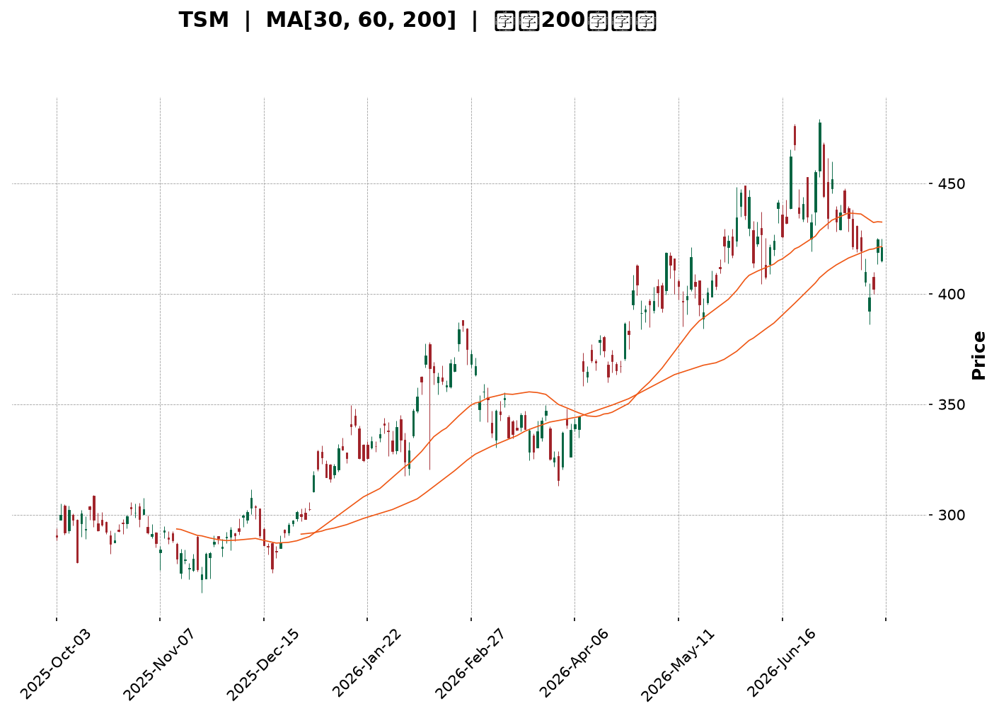
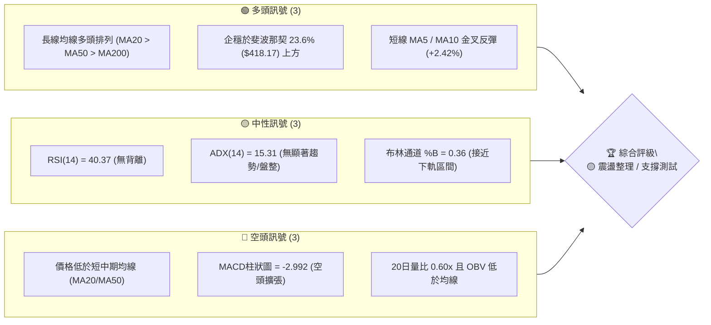
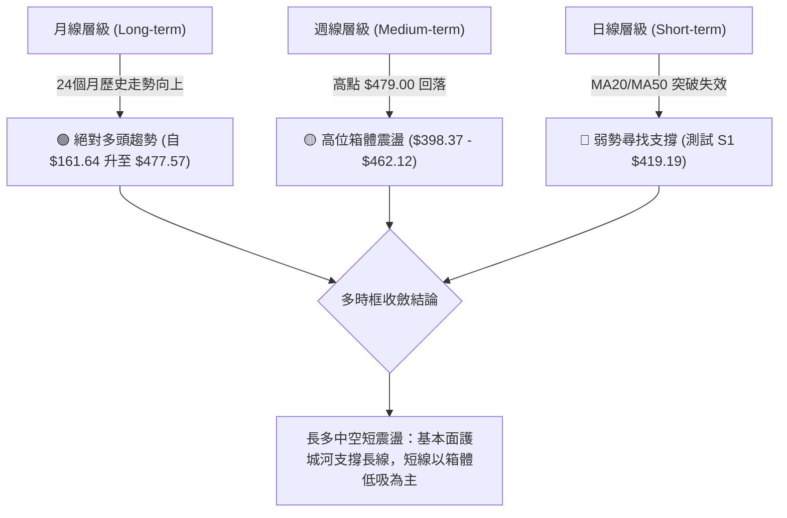
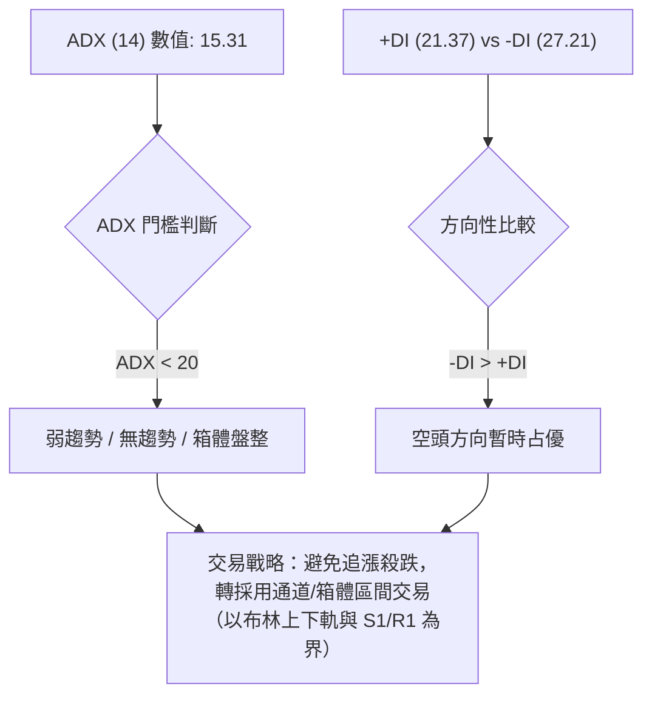
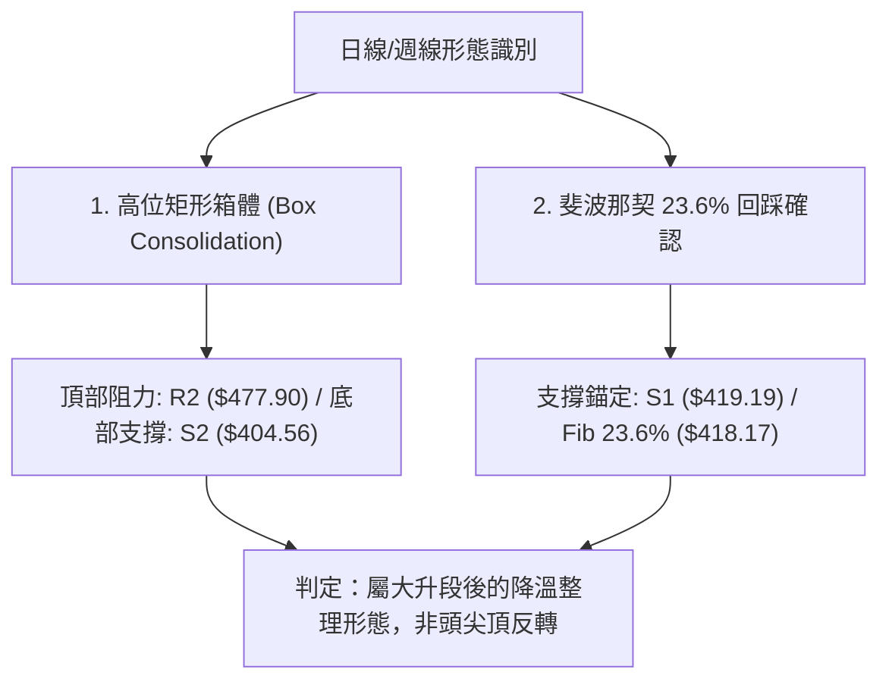
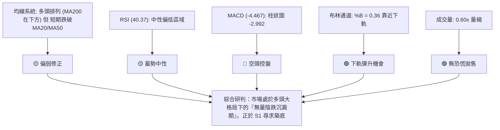
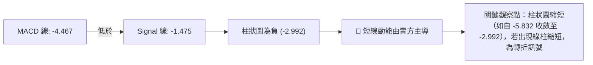
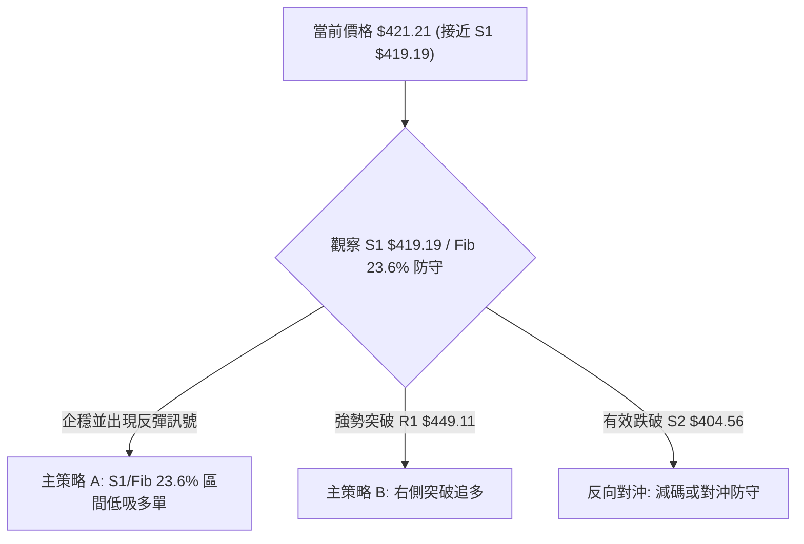
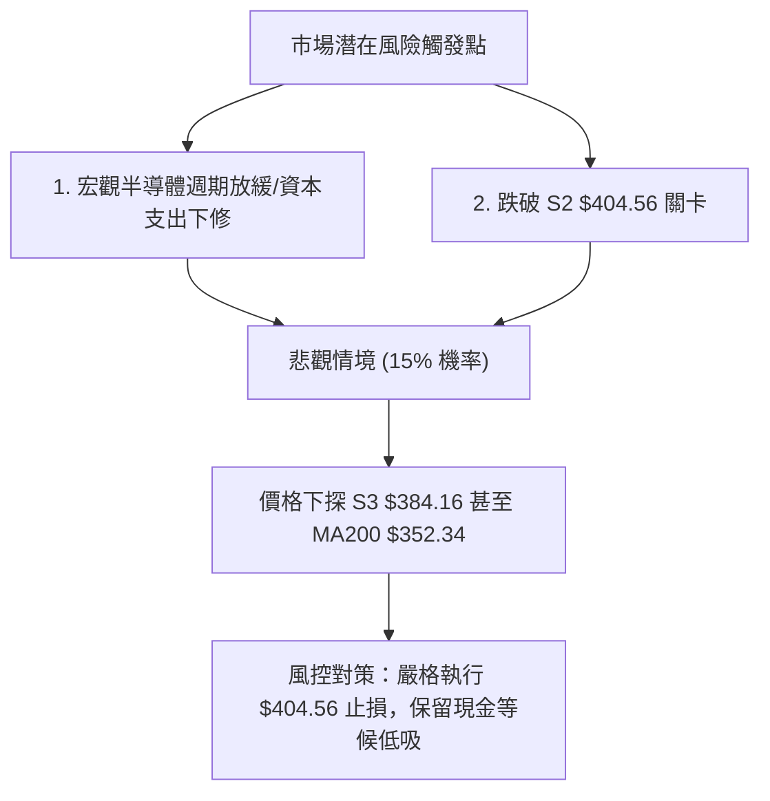

<details>
<summary>📊 靜態圖表 (點擊展開)</summary>

</details>

<html>
<head><meta charset="utf-8" /></head>
<body>
    <div style="height:500px; width:100%;">                        <script>window.PlotlyConfig = {MathJaxConfig: 'local'};</script>
        <script charset="utf-8" src="https://cdn.plot.ly/plotly-3.7.0.min.js" integrity="sha256-jvTGqxNp8AGWEcvNLVuKr+8j5dGe9Yw51LQkmDH+IYA=" crossorigin="anonymous"></script>                <div id="candlestick-chart" class="plotly-graph-div" style="height:100%; width:100%;"></div>            <script>                window.PLOTLYENV=window.PLOTLYENV || {};                                if (document.getElementById("candlestick-chart")) {                    Plotly.newPlot(                        "candlestick-chart",                        [{"close":{"dtype":"f8","bdata":"AAAAYH0eckAAAACgksByQAAAAACzO3JAAAAAQDrickAAAABgkZhyQAAAAKBzZ3FAAAAAAFrIckAAAABgBVpyQAAAAEA+5XJAAAAAoO6XckAAAABAXkxyQAAAAAD2dXJAAAAAwFFDckAAAACg8elxQAAAAABQB3JAAAAAoHZKckAAAAAgsX5yQAAAAODCsnJAAAAAgEbrckAAAAAAl81yQAAAAGBMoXJAAAAA4J\u002fnckAAAABABDxyQAAAACCCNXJAAAAAgKjvcUAAAABgKcRxQAAAAEBiT3JAAAAAIEwOckAAAADgkAVyQAAAAGDmf3FAAAAA4H2pcUAAAAAA4nxxQAAAAMDLO3FAAAAAIJmCcUAAAACASTVxQAAAAGCNDnFAAAAAYKKmcUAAAADgRKdxQAAAAIAW+3FAAAAAwLETckAAAADg5NZxQAAAAODmHHJAAAAAAD5SckAAAADAPCpyQAAAAECnRnJAAAAAoCi4ckAAAABAm9ByQAAAAMBxO3NAAAAA4If0ckAAAADgnyhyQAAAAIAt5HFAAAAAQFTWcUAAAACAlThxQAAAACB4s3FAAAAAQHD3cUAAAACgXDxyQAAAAODHdnJAAAAAYDqUckAAAAAgidRyQAAAAGD5tXJAAAAAwKSgckAAAAAAQOVyQAAAAAB633NAAAAA4H8JdEAAAAAg9Ft0QAAAAGCs0HNAAAAAIALGc0AAAABgdx90QAAAAIAJoXRAAAAAYB+YdEAAAAAg3FZ0QAAAAEAlPnVAAAAAID5KdUAAAADgp1d0QAAAAAAaR3RAAAAAoP9adEAAAADAYdJ0QAAAAOD\u002fr3RAAAAA4J0JdUAAAACgpkh1QAAAAIDgHHVAAAAAwMaNdEAAAAAgsDl1QAAAAMBj4HRAAAAAgA1BdEAAAACAe5B0QAAAAKDpsHVAAAAAQFUZdkAAAABgzIB2QAAAAECtQndAAAAAQFTjdkAAAADgocd2QAAAACBApXZAAAAAoF6GdkAAAACAmmh2QAAAAEArCndAAAAAwDUCd0AAAAAgR\u002fx3QAAAAIDLG3hAAAAAIPltd0AAAADgeUp3QAAAAOBn83ZAAAAAYAr1dUAAAABgpTl2QAAAAACpAHZAAAAAIF8SdUAAAABghq51QAAAAKDllHVAAAAAgM0LdkAAAACgq+90QAAAAIAjCXVAAAAAoLMndUAAAAAgv5J1QAAAACBtLHVAAAAAwPkfdUAAAABAiId0QAAAAGCMGnVAAAAAICtndUAAAAAgAK91QAAAAKCRVXRAAAAAIKBfdEAAAAAgK7xzQAAAACCREnVAAAAAABNLdUAAAABg9yN1QAAAAGBiT3VAAAAAIDaIdUAAAADAuNB2QAAAAGAtynZAAAAAAL8bd0AAAAAATgt3QAAAAAAKsHdAAAAAAJRjd0AAAABgBKh2QAAAAGAmGndAAAAAICbWdkAAAAAghfN2QAAAAICOKHhAAAAAYEHcd0AAAACgUBh5QAAAAICKQHlAAAAAAMZ2eEAAAADAjo54QAAAAIAnsnhAAAAAwNrLeEAAAAAgvwp5QAAAAADRl3hAAAAAgFEoekAAAAAA69J5QAAAAIB9q3lAAAAAgIQ5eUAAAAAAocV4QAAAAMDa7XhAAAAAoOcLekAAAAAgfDZ5QAAAACBmsHhAAAAAQBV7eEAAAAAg6Ap5QAAAAAAuY3lAAAAAwDI5eUAAAADgtLV5QAAAAKDgW3pAAAAAoOB9ekAAAADAjhd6QAAAAKDLKXtAAAAAgFfae0AAAABAtzp7QAAAAKAWvntAAAAAQDPjeUAAAABg2Jx6QAAAAEC5rnpAAAAAYLh8eUAAAADAHlF6QAAAAEDhfnpAAAAAYGaWe0AAAACgR516QAAAAGBmAntAAAAAgOvhfEAAAABguDp9QAAAAIA9RntAAAAAoEeNe0AAAAAA1y97QAAAAKCZBXtAAAAAoJlxfEAAAADAHtl9QAAAACCuw3tAAAAAYI8ie0AAAADgozx8QAAAAMAeCXtAAAAAIK5Pe0AAAAAgXE97QAAAAIDCIXtAAAAAoEdZekAAAACAPUZ6QAAAACCuN3pAAAAAANebeUAAAACA6+V4QAAAAMDMJHlAAAAAgMKJekAAAAAgXFN6QA=="},"high":{"dtype":"f8","bdata":"re\u002f18exbckCdamsWXA5zQBtlzzMvC3NArb71ixIAc0CX0zUIZsdyQIGtFcKlnXJAo0mtR\u002fnjckCselkSQbZyQNAJ1MdnA3NAHoQoRPhOc0A8kSUl3M5yQLYjtJZq1HJAqL65nXiQckBOcuT8RU5yQA9u\u002fOamPHJANJYnAO55ckBZK5fWF6JyQLrrKUlJvHJAhWKNF9YYc0DO\u002f0imhA5zQJMdCzRkFHNAToCdbiA7c0C28sw7ELpyQP2FOBU3fnJAXxdnEmJFckAegcVcOtpxQIQyfE\u002fpbHJAHG6MCdRJckBeKJnGCElyQB+in1vJ83FAFLNVTODJcUD4r9cgo8RxQECQlpz9X3FAdniVkDSlcUAljbSQ9yhyQCEVMaEtSHFAbH39LE2tcUCkhHfxsrJxQC\u002f2X9tUKHJA\u002fdMw+hsmckChmEOPIw5yQA0evRIpQ3JA216OyNBkckDfOkUmsztyQG82pywsp3JAEYCGmxDEckAgdL50xORyQD5CtWdneHNAIhiYCEoEc0AszyczdetyQDu8LJJ5ZHJAcKnsZqPvcUAmqfZs0\u002flxQCuUWgry2nFArN5WlrEqckAEKUBU5ldyQEYAUsoPhnJAdSPAa\u002fWZckDSlayhId1yQJ8CPaL17nJANYidPsHvckCN2mJR9hxzQJC3\u002fXD+\u002fnNASixZZ8KYdEBOvx2O47V0QN6+UnX3SXRAlGG\u002fflAtdEDuzzXAnDF0QFJzGOdevXRAZwcY8Q3rdEChuUU7ooJ0QHNDZWFj2HVAD61OidTAdUDm3sRMQ0Z1QG6yI7DNvnRAMrWhMT\u002fVdECiOEKgrPZ0QESnZA8L1nRAatYL\u002fe83dUB+DBOClnt1QM2zoYqSX3VAVi16v3IidUDuVRIW5WZ1QL6nfJxClHVAZB1gT\u002fAQdUDiHsZIm810QFmWUc\u002fCvnVAugurSgdcdkBJG0kAKq52QDuom6wQmndAySMdGsCgd0BXNrjgPRN3QMgrZQUWxXZAZy7KBd33dkBWs8gD9452QFABtK2XJHdAIbU3wis4d0BYkIwq4DJ4QJzfZEpFQ3hA9sYWI70HeEDPmUdK52t3QPdhMgDrMndAw4tcAGgidkCZHuvovnN2QOamtoX1WXZAjwWszteudUBC+47Dqrl1QPQ3Mw7u+nVAHLaqozY4dkCExgywtpF1QLovueP8a3VAJDEiX71tdUAs+xSJMp91QPOMCW4xsnVAbWa0oLExdUDp5yDf+gx1QILuwgi5aXVA3eCmBjCBdUAYtV6JGdp1QL1cHN3QQXVAEERE46OMdEAl1lliR410QJPUE9noGXVAfWpjcdi9dUAt7wBBVVR1QNr\u002fOEZVdnVAXCWNPZCLdUCW8ei8zlZ3QPc4Xxr19HZA3LOxjt6Rd0BaYbxJeSl3QC31xyZG1HdAZXrsqGbRd0D+RBRyXBV3QN9fpmI9a3dAwk3gOEkTd0ByXrryIx53QInmjCAPMHhAedmzn6A9eEB99EA5iIh5QAnJ\u002fUSB2HlANIox9AvPeEBpVDdrza54QOP5xH+73XhAKDXg5LwweUDUPAyY9Wt5QBP26fflUnlAiwgA1oIrekDhahmkTDB6QNOsf1ZpAHpA1HblOHBseUA\u002fVbiozRR5QNaUpYzAO3lAM6gM9L5PekD42essmY55QPRoN8feXnlAKgERPyvfeEC1fld\u002f+y55QDfL\u002fID6p3lABXVxZV6beUC7U\u002fI3Rfh5QCl4zmm02HpAFOs5h52pekBWxvgB89Z6QNtE6\u002fFwBXxAqUKzk1H1e0AFZox4uxF8QJTP\u002fq1p73tAwqqlAS4Oe0DgB3ZKvgx7QOPgREEuUntAZigg\u002fC6VekAAAAAAAGR6QAAAAEAKr3pAAAAAoEepe0AAAACgR4V7QAAAAAAAqHtAAAAAIIUTfUAAAADgo8x9QAAAAKBH9XtAAAAAgMK9e0AAAABgZk58QAAAAIAUQntAAAAAoJmBfEAAAAAAAPB9QAAAAAApSH1AAAAAIIXXfEAAAADgesB8QAAAAMDMfHtAAAAAANeHe0AAAABACvt7QAAAAGCPentAAAAAANdfe0AAAADA9fB6QAAAAIA9znpAAAAAQDP\u002feUAAAABAM0t5QAAAAIA9nnlAAAAAYGaWekAAAADA9Yx6QA=="},"hovertemplate":"\u003cb\u003e%{x|%Y-%m-%d}\u003c\u002fb\u003e\u003cbr\u003e\u958b: $%{open:.2f}\u003cbr\u003e\u9ad8: $%{high:.2f}\u003cbr\u003e\u4f4e: $%{low:.2f}\u003cbr\u003e\u6536: $%{close:.2f}\u003cextra\u003e\u003c\u002fextra\u003e","low":{"dtype":"f8","bdata":"EeeekIADckCPWLlGhZlyQLT2gwTLL3JAp\u002f5kBeg6ckC4W+AGhHFyQCTofnE2YnFAyNE1vI0gckAozUkO\u002fxByQOiepHaVm3JANSjmH+1lckDVJXIf1ElyQMUQxf7Ma3JArbxeWNM1ckCNmuj20qJxQDlgzZnZ9XFA86iaQGpBckBAsWhmTTZyQDMnEyc+XHJAYJm5KEHAckC7Ght7fadyQB51vHbEZXJAoT9ZniC8ckDFcL7KcTNyQDz13CeJE3JAYlI6kCHScUDGvnfuaS9xQJl0ERmBF3JAPeKHf2vqcUD+S\u002fdNDvVxQFP4a5P5XHFArq9dZoDxcECuleaFzFlxQCxHmbNn6XBA0WNYHY4icUCUOsnH+yNxQGsJgT++i3BArsfsyt3wcEA\u002fhUG4Hu9wQGNbmOmv13FAWFlGIdnrcUBOc26onY9xQJ6aRbC07nFAX6Or4FW9cUCethQs5v5xQNc1+jJRL3JAa8F5K2dmckBdCsUbqYJyQCoS2OgownJArmB6bpmhckDrFqJwwBdyQNRn+z8n4XFAxeIwPNKdcUAr9QqUqBpxQA07wY7UhHFACnKgmofOcUCJlCF0aRtyQCjuKd8rK3JA12B92lFrckDRG0dSxY9yQAey5ynXkXJAJER8HJOeckBpbjRv7d1yQISqwkWRYXNA+uYNqo\u002f9c0DqcsdJvy50QKS7a\u002fJxznNAJyMu\u002fj2oc0AZbM4i1MlzQHlAGdeO9nNAMlZnLUeRdECidIGVaDJ0QOf6XnDuAnVAPJD\u002fqUc7dUDkuUxZhFN0QLdnUQMZQHRACmgDZYRTdEDdWcVuq5p0QGWidhWGiHRA9cGjk3LNdED+ehThtQ51QJjm7vA1aHRA0TRoXIl2dEC4dnJZiXZ0QDEA\u002f0AuhXRAO5q7quHWc0B+1H8CHeBzQBY\u002fwjW37nRABR3v1DKgdUBA\u002fTe17ih2QJ8oGx\u002fy53ZA\u002fNmgqBwHdEBvlErupm52QJgs93KLJnZAw+6dYbJtdkABgK5apTl2QGLv39URVHZAxFbvXTnJdkBPKtEU4GF3QP0CZA2i7XdAuM0HTsz8dkD48qA4m+t2QPdcqaRprHZAsFoSovBldUBDRUq3pAt2QF7xwAiHYHVAs+mnMFrvdEACoCvBbKN0QJcbaEalaHVAGjJWq\u002fLIdUBnxWvyaup0QBFV4N\u002fe53RAx3yh4SwhdUDBQ0bqvxl1QJGEfzPBKHVAiV7yReJGdECJTYaWN1J0QKboahY5pXRAzmWZVNXTdEBt397LKGt1QDgV67TBSXRAMfMIRekYdEBylr+2EZFzQIOjbT48BnRALnjCpkwvdUCRQwdilWB0QG7dvexCHXVArNohStrtdEAHpEwcaWZ2QAe9tSUJfnZAHNtvgi0Od0DZVK6vHdN2QHU7yXSRRXdA65AkKHI1d0APUM1LUnt2QGMnUCuXxHZAv0RCK2K2dkB4eDZsHMR2QGraD4ZiHHdANZG1Telud0C9bYuF4I54QGPwk5Ru93hA8NIBvdH8d0DBJr9xXjR4QNUzZOzwDHhA0ZJN5GtzeECL0sk3baR4QLuuMpLsenhACiCvQ2z7eECvAWPtgHJ5QCjU6xoY\u002f3hATM62pCfUeED8mm9sfBN4QJS1V9fiaHhAUfv3mpESeUC1SSfzXt54QExhTIQuYnhAsvy6wJACeECVZ4oiZrB4QJ+MG7056XhAdv28QrMeeUCUGEhoypF5QJ5wz1aN5nlAb2h1YtvbeUBZj+L7ZgR6QBtxqMY0WHpA6smtdNwve0BWFa6LPBh7QIYQSp7TpHpA+MW+hjW9eUCvg99cr1h6QCu2yFUASXlAo+ZPrPVreUAAAACAwo15QAAAACBcE3pAAAAAQOH+ekAAAABAM5N6QAAAAIA9+npAAAAAgD1me0AAAABguBJ9QAAAAEAKI3tAAAAAoEcJe0AAAABACgd7QAAAAEAKM3pAAAAAoHDxekAAAAAAAFB8QAAAACCFt3tAAAAAAADYekAAAACgmdl7QAAAAIDCwXpAAAAAAADMekAAAACAPUZ7QAAAAKCZwXpAAAAA4KNEekAAAACAwi16QAAAAAAArHlAAAAAAAA4eUAAAADgUSB4QAAAAKBHAXlAAAAAwPXYeUAAAABAe+N5QA=="},"name":"\u50f9\u683c","open":{"dtype":"f8","bdata":"t+mCKyApckDa5c\u002fIoZpyQIg683KQA3NAGJ+nOxlLckCMTQ3PJL9yQFxCyVHWmXJAaX+WaIh+ckAGd1KNGVVyQP91AGdT\u002fnJAWERVG\u002fxHc0AylN6uEoFyQMLk8xh5mnJAC0r09piKckAk03swWStyQC0sSmiM+HFAmwUptyVUckDWvOOwCoVyQB6pb4vNf3JArAdv44v2ckBxZ9b7XctyQJs0yhKQ+XJAJ1ZLsZbDckBVrH9f8WhyQF2PIcpQJXJAc5dpfc88ckAJ8WLPrq9xQOjiQgTwQHJANe\u002fr\u002f2wcckBmUxf+dTZyQEzOz0yM7nFARFHi0wsccUBj0PSA1XNxQGBAaKcUNnFA2FKKhhQscUD\u002fBYuPzh5yQDx7hG3V6nBArsfsyt3wcEAAm9kxUIhxQHkwPopv7XFAUNXYzxcjckBwSzlW1MpxQGW5yiF5G3JARVlot1QeckAanBAA6DpyQP2X2kjEW3JAeUl\u002f1IWtckCBn\u002fZkUJpyQC9hn4C473JAsnr\u002fGgP8ckAszyczdetyQJt+MeEgWnJAakcRionccUCEtPGswPBxQIhgXiOQuHFACnKgmofOcUCQ5qHcfFJyQCb1GrxFPnJAQxex8FqDckCWqd7EvKVyQENPP8Wpw3JAReRwGeXMckAZAkEvAOdyQNBpvkAGZnNAfkhgrDqLdEBnl59DXYh0QCZ3y2UFMHRAyRqBT5ArdECa3q5\u002f+uJzQPGmNNIcB3RAkGeSzYuydEChuUU7ooJ0QGfhjt7EUHVABe+zOaqLdUAbSkpunTB1QARZBNx1u3RA9iktIk27dECaoybyz6V0QHaxwvBFsXRA5lBW\u002fFPsdEBJobphRVR1QOvsqTzbIHVAJJ2qDyPbdEC6zBbH9ZB0QFYFSEu+dHVA3DohjQDedEDjBBKmkhJ0QHP9zfA+\u002fHRAaYgN33qvdUCFEdatUad2QO9bSKvYAndAe8+EJ9WQd0Akur4DC\u002fR2QImsKm0pgHZA9x4lcdafdkDyxvE68F12QAOYLMXkXnZAmMiyqfrRdkDBNXEuM5d3QJzfZEpFQ3hAGyUKXh8DeED+aqw4zQN3QMh5PNK2t3ZAjZfp\u002fQ28dUBCM\u002fKVfDl2QKUoCvs2EXZAwR4ik8BbdUAvZW2IAN50QDofqRLdqnVAySNRQ8YBdkBfl\u002felboJ1QAwFPwVwYnVANF76BvA3dUB\u002foHcc3jx1QC1qTNKNj3VAoQYQlTaHdEBFcAhNS\u002f50QKboahY5pXRAy8s1X5PsdEBLpz3fEJN1QNtGhKtqMHVA4PJQByNBdECo8hX692Z0QA0qHUzpGHRAi3HKT4txdUDQmAPgOGF0QLLoVZxML3VAnQcp5VkqdUCbje48zBZ3QBPVJxU4p3ZAZV\u002f7PmZrd0D+4JClURZ3QKh2a4J4ondA2DldXU3Id0D5WweF+P92QKlLTMk\u002fRXdATGFMu7cFd0AAAAAghfN2QBX0Ov2ULndAYSyyyKL1d0C0rER7brN4QKRVanKIzHlApLv5+kJzeEDUgNZN3394QOGhsMAWznhAIZD6GlWIeEDwwsimMjl5QBkiKbx5OnlAvmdyhFsXeUDTX2iLzxF6QKnG9hCd\u002f3lA2oNSkqJceUCTMZCgIc14QEdcSoRu1XhAsOele0kkeUCzAd3szVh5QPRoN8feXnlAXPCiaplJeEBhjj3WKMF4QJ+MG7056XhAXbNKI5OHeUBuiBv4ecJ5QIUR91FboHpA57Oxg7xTekDiiA3CJ6F6QEdp+38yfnpAPhfLWM94e0AkMQ65BA98QBeIRYD72XpAUTqyB0HMekArPhJ\u002femx6QLZ\u002fYQz53XpA7QhOpOLPeUAAAAAAKdR5QAAAAMDMQHpAAAAAQOFqe0AAAADgUUB7QAAAAAAALHtAAAAAgBRue0AAAACgcMF9QAAAAEDhcntAAAAAIK4fe0AAAABgZk58QAAAAAAAkHpAAAAAAABQe0AAAACAwnl8QAAAAGC4On1AAAAA4KMofEAAAADgevx7QAAAAOBRYHtAAAAAAADQekAAAAAgrut7QAAAAGC4antAAAAAwB4de0AAAACA6+16QAAAAAAAnHpAAAAA4KNUeUAAAACA64F4QAAAACBce3lAAAAAANcrekAAAADgeu55QA=="},"x":["2025-10-03T00:00:00-04:00","2025-10-06T00:00:00-04:00","2025-10-07T00:00:00-04:00","2025-10-08T00:00:00-04:00","2025-10-09T00:00:00-04:00","2025-10-10T00:00:00-04:00","2025-10-13T00:00:00-04:00","2025-10-14T00:00:00-04:00","2025-10-15T00:00:00-04:00","2025-10-16T00:00:00-04:00","2025-10-17T00:00:00-04:00","2025-10-20T00:00:00-04:00","2025-10-21T00:00:00-04:00","2025-10-22T00:00:00-04:00","2025-10-23T00:00:00-04:00","2025-10-24T00:00:00-04:00","2025-10-27T00:00:00-04:00","2025-10-28T00:00:00-04:00","2025-10-29T00:00:00-04:00","2025-10-30T00:00:00-04:00","2025-10-31T00:00:00-04:00","2025-11-03T00:00:00-05:00","2025-11-04T00:00:00-05:00","2025-11-05T00:00:00-05:00","2025-11-06T00:00:00-05:00","2025-11-07T00:00:00-05:00","2025-11-10T00:00:00-05:00","2025-11-11T00:00:00-05:00","2025-11-12T00:00:00-05:00","2025-11-13T00:00:00-05:00","2025-11-14T00:00:00-05:00","2025-11-17T00:00:00-05:00","2025-11-18T00:00:00-05:00","2025-11-19T00:00:00-05:00","2025-11-20T00:00:00-05:00","2025-11-21T00:00:00-05:00","2025-11-24T00:00:00-05:00","2025-11-25T00:00:00-05:00","2025-11-26T00:00:00-05:00","2025-11-28T00:00:00-05:00","2025-12-01T00:00:00-05:00","2025-12-02T00:00:00-05:00","2025-12-03T00:00:00-05:00","2025-12-04T00:00:00-05:00","2025-12-05T00:00:00-05:00","2025-12-08T00:00:00-05:00","2025-12-09T00:00:00-05:00","2025-12-10T00:00:00-05:00","2025-12-11T00:00:00-05:00","2025-12-12T00:00:00-05:00","2025-12-15T00:00:00-05:00","2025-12-16T00:00:00-05:00","2025-12-17T00:00:00-05:00","2025-12-18T00:00:00-05:00","2025-12-19T00:00:00-05:00","2025-12-22T00:00:00-05:00","2025-12-23T00:00:00-05:00","2025-12-24T00:00:00-05:00","2025-12-26T00:00:00-05:00","2025-12-29T00:00:00-05:00","2025-12-30T00:00:00-05:00","2025-12-31T00:00:00-05:00","2026-01-02T00:00:00-05:00","2026-01-05T00:00:00-05:00","2026-01-06T00:00:00-05:00","2026-01-07T00:00:00-05:00","2026-01-08T00:00:00-05:00","2026-01-09T00:00:00-05:00","2026-01-12T00:00:00-05:00","2026-01-13T00:00:00-05:00","2026-01-14T00:00:00-05:00","2026-01-15T00:00:00-05:00","2026-01-16T00:00:00-05:00","2026-01-20T00:00:00-05:00","2026-01-21T00:00:00-05:00","2026-01-22T00:00:00-05:00","2026-01-23T00:00:00-05:00","2026-01-26T00:00:00-05:00","2026-01-27T00:00:00-05:00","2026-01-28T00:00:00-05:00","2026-01-29T00:00:00-05:00","2026-01-30T00:00:00-05:00","2026-02-02T00:00:00-05:00","2026-02-03T00:00:00-05:00","2026-02-04T00:00:00-05:00","2026-02-05T00:00:00-05:00","2026-02-06T00:00:00-05:00","2026-02-09T00:00:00-05:00","2026-02-10T00:00:00-05:00","2026-02-11T00:00:00-05:00","2026-02-12T00:00:00-05:00","2026-02-13T00:00:00-05:00","2026-02-17T00:00:00-05:00","2026-02-18T00:00:00-05:00","2026-02-19T00:00:00-05:00","2026-02-20T00:00:00-05:00","2026-02-23T00:00:00-05:00","2026-02-24T00:00:00-05:00","2026-02-25T00:00:00-05:00","2026-02-26T00:00:00-05:00","2026-02-27T00:00:00-05:00","2026-03-02T00:00:00-05:00","2026-03-03T00:00:00-05:00","2026-03-04T00:00:00-05:00","2026-03-05T00:00:00-05:00","2026-03-06T00:00:00-05:00","2026-03-09T00:00:00-04:00","2026-03-10T00:00:00-04:00","2026-03-11T00:00:00-04:00","2026-03-12T00:00:00-04:00","2026-03-13T00:00:00-04:00","2026-03-16T00:00:00-04:00","2026-03-17T00:00:00-04:00","2026-03-18T00:00:00-04:00","2026-03-19T00:00:00-04:00","2026-03-20T00:00:00-04:00","2026-03-23T00:00:00-04:00","2026-03-24T00:00:00-04:00","2026-03-25T00:00:00-04:00","2026-03-26T00:00:00-04:00","2026-03-27T00:00:00-04:00","2026-03-30T00:00:00-04:00","2026-03-31T00:00:00-04:00","2026-04-01T00:00:00-04:00","2026-04-02T00:00:00-04:00","2026-04-06T00:00:00-04:00","2026-04-07T00:00:00-04:00","2026-04-08T00:00:00-04:00","2026-04-09T00:00:00-04:00","2026-04-10T00:00:00-04:00","2026-04-13T00:00:00-04:00","2026-04-14T00:00:00-04:00","2026-04-15T00:00:00-04:00","2026-04-16T00:00:00-04:00","2026-04-17T00:00:00-04:00","2026-04-20T00:00:00-04:00","2026-04-21T00:00:00-04:00","2026-04-22T00:00:00-04:00","2026-04-23T00:00:00-04:00","2026-04-24T00:00:00-04:00","2026-04-27T00:00:00-04:00","2026-04-28T00:00:00-04:00","2026-04-29T00:00:00-04:00","2026-04-30T00:00:00-04:00","2026-05-01T00:00:00-04:00","2026-05-04T00:00:00-04:00","2026-05-05T00:00:00-04:00","2026-05-06T00:00:00-04:00","2026-05-07T00:00:00-04:00","2026-05-08T00:00:00-04:00","2026-05-11T00:00:00-04:00","2026-05-12T00:00:00-04:00","2026-05-13T00:00:00-04:00","2026-05-14T00:00:00-04:00","2026-05-15T00:00:00-04:00","2026-05-18T00:00:00-04:00","2026-05-19T00:00:00-04:00","2026-05-20T00:00:00-04:00","2026-05-21T00:00:00-04:00","2026-05-22T00:00:00-04:00","2026-05-26T00:00:00-04:00","2026-05-27T00:00:00-04:00","2026-05-28T00:00:00-04:00","2026-05-29T00:00:00-04:00","2026-06-01T00:00:00-04:00","2026-06-02T00:00:00-04:00","2026-06-03T00:00:00-04:00","2026-06-04T00:00:00-04:00","2026-06-05T00:00:00-04:00","2026-06-08T00:00:00-04:00","2026-06-09T00:00:00-04:00","2026-06-10T00:00:00-04:00","2026-06-11T00:00:00-04:00","2026-06-12T00:00:00-04:00","2026-06-15T00:00:00-04:00","2026-06-16T00:00:00-04:00","2026-06-17T00:00:00-04:00","2026-06-18T00:00:00-04:00","2026-06-22T00:00:00-04:00","2026-06-23T00:00:00-04:00","2026-06-24T00:00:00-04:00","2026-06-25T00:00:00-04:00","2026-06-26T00:00:00-04:00","2026-06-29T00:00:00-04:00","2026-06-30T00:00:00-04:00","2026-07-01T00:00:00-04:00","2026-07-02T00:00:00-04:00","2026-07-06T00:00:00-04:00","2026-07-07T00:00:00-04:00","2026-07-08T00:00:00-04:00","2026-07-09T00:00:00-04:00","2026-07-10T00:00:00-04:00","2026-07-13T00:00:00-04:00","2026-07-14T00:00:00-04:00","2026-07-15T00:00:00-04:00","2026-07-16T00:00:00-04:00","2026-07-17T00:00:00-04:00","2026-07-20T00:00:00-04:00","2026-07-21T00:00:00-04:00","2026-07-22T00:00:00-04:00"],"type":"candlestick"},{"hovertemplate":"MA30: $%{y:.2f}\u003cextra\u003e\u003c\u002fextra\u003e","line":{"color":"#2196F3","dash":"dash","width":2},"mode":"lines","name":"MA30","x":["2025-10-03T00:00:00-04:00","2025-10-06T00:00:00-04:00","2025-10-07T00:00:00-04:00","2025-10-08T00:00:00-04:00","2025-10-09T00:00:00-04:00","2025-10-10T00:00:00-04:00","2025-10-13T00:00:00-04:00","2025-10-14T00:00:00-04:00","2025-10-15T00:00:00-04:00","2025-10-16T00:00:00-04:00","2025-10-17T00:00:00-04:00","2025-10-20T00:00:00-04:00","2025-10-21T00:00:00-04:00","2025-10-22T00:00:00-04:00","2025-10-23T00:00:00-04:00","2025-10-24T00:00:00-04:00","2025-10-27T00:00:00-04:00","2025-10-28T00:00:00-04:00","2025-10-29T00:00:00-04:00","2025-10-30T00:00:00-04:00","2025-10-31T00:00:00-04:00","2025-11-03T00:00:00-05:00","2025-11-04T00:00:00-05:00","2025-11-05T00:00:00-05:00","2025-11-06T00:00:00-05:00","2025-11-07T00:00:00-05:00","2025-11-10T00:00:00-05:00","2025-11-11T00:00:00-05:00","2025-11-12T00:00:00-05:00","2025-11-13T00:00:00-05:00","2025-11-14T00:00:00-05:00","2025-11-17T00:00:00-05:00","2025-11-18T00:00:00-05:00","2025-11-19T00:00:00-05:00","2025-11-20T00:00:00-05:00","2025-11-21T00:00:00-05:00","2025-11-24T00:00:00-05:00","2025-11-25T00:00:00-05:00","2025-11-26T00:00:00-05:00","2025-11-28T00:00:00-05:00","2025-12-01T00:00:00-05:00","2025-12-02T00:00:00-05:00","2025-12-03T00:00:00-05:00","2025-12-04T00:00:00-05:00","2025-12-05T00:00:00-05:00","2025-12-08T00:00:00-05:00","2025-12-09T00:00:00-05:00","2025-12-10T00:00:00-05:00","2025-12-11T00:00:00-05:00","2025-12-12T00:00:00-05:00","2025-12-15T00:00:00-05:00","2025-12-16T00:00:00-05:00","2025-12-17T00:00:00-05:00","2025-12-18T00:00:00-05:00","2025-12-19T00:00:00-05:00","2025-12-22T00:00:00-05:00","2025-12-23T00:00:00-05:00","2025-12-24T00:00:00-05:00","2025-12-26T00:00:00-05:00","2025-12-29T00:00:00-05:00","2025-12-30T00:00:00-05:00","2025-12-31T00:00:00-05:00","2026-01-02T00:00:00-05:00","2026-01-05T00:00:00-05:00","2026-01-06T00:00:00-05:00","2026-01-07T00:00:00-05:00","2026-01-08T00:00:00-05:00","2026-01-09T00:00:00-05:00","2026-01-12T00:00:00-05:00","2026-01-13T00:00:00-05:00","2026-01-14T00:00:00-05:00","2026-01-15T00:00:00-05:00","2026-01-16T00:00:00-05:00","2026-01-20T00:00:00-05:00","2026-01-21T00:00:00-05:00","2026-01-22T00:00:00-05:00","2026-01-23T00:00:00-05:00","2026-01-26T00:00:00-05:00","2026-01-27T00:00:00-05:00","2026-01-28T00:00:00-05:00","2026-01-29T00:00:00-05:00","2026-01-30T00:00:00-05:00","2026-02-02T00:00:00-05:00","2026-02-03T00:00:00-05:00","2026-02-04T00:00:00-05:00","2026-02-05T00:00:00-05:00","2026-02-06T00:00:00-05:00","2026-02-09T00:00:00-05:00","2026-02-10T00:00:00-05:00","2026-02-11T00:00:00-05:00","2026-02-12T00:00:00-05:00","2026-02-13T00:00:00-05:00","2026-02-17T00:00:00-05:00","2026-02-18T00:00:00-05:00","2026-02-19T00:00:00-05:00","2026-02-20T00:00:00-05:00","2026-02-23T00:00:00-05:00","2026-02-24T00:00:00-05:00","2026-02-25T00:00:00-05:00","2026-02-26T00:00:00-05:00","2026-02-27T00:00:00-05:00","2026-03-02T00:00:00-05:00","2026-03-03T00:00:00-05:00","2026-03-04T00:00:00-05:00","2026-03-05T00:00:00-05:00","2026-03-06T00:00:00-05:00","2026-03-09T00:00:00-04:00","2026-03-10T00:00:00-04:00","2026-03-11T00:00:00-04:00","2026-03-12T00:00:00-04:00","2026-03-13T00:00:00-04:00","2026-03-16T00:00:00-04:00","2026-03-17T00:00:00-04:00","2026-03-18T00:00:00-04:00","2026-03-19T00:00:00-04:00","2026-03-20T00:00:00-04:00","2026-03-23T00:00:00-04:00","2026-03-24T00:00:00-04:00","2026-03-25T00:00:00-04:00","2026-03-26T00:00:00-04:00","2026-03-27T00:00:00-04:00","2026-03-30T00:00:00-04:00","2026-03-31T00:00:00-04:00","2026-04-01T00:00:00-04:00","2026-04-02T00:00:00-04:00","2026-04-06T00:00:00-04:00","2026-04-07T00:00:00-04:00","2026-04-08T00:00:00-04:00","2026-04-09T00:00:00-04:00","2026-04-10T00:00:00-04:00","2026-04-13T00:00:00-04:00","2026-04-14T00:00:00-04:00","2026-04-15T00:00:00-04:00","2026-04-16T00:00:00-04:00","2026-04-17T00:00:00-04:00","2026-04-20T00:00:00-04:00","2026-04-21T00:00:00-04:00","2026-04-22T00:00:00-04:00","2026-04-23T00:00:00-04:00","2026-04-24T00:00:00-04:00","2026-04-27T00:00:00-04:00","2026-04-28T00:00:00-04:00","2026-04-29T00:00:00-04:00","2026-04-30T00:00:00-04:00","2026-05-01T00:00:00-04:00","2026-05-04T00:00:00-04:00","2026-05-05T00:00:00-04:00","2026-05-06T00:00:00-04:00","2026-05-07T00:00:00-04:00","2026-05-08T00:00:00-04:00","2026-05-11T00:00:00-04:00","2026-05-12T00:00:00-04:00","2026-05-13T00:00:00-04:00","2026-05-14T00:00:00-04:00","2026-05-15T00:00:00-04:00","2026-05-18T00:00:00-04:00","2026-05-19T00:00:00-04:00","2026-05-20T00:00:00-04:00","2026-05-21T00:00:00-04:00","2026-05-22T00:00:00-04:00","2026-05-26T00:00:00-04:00","2026-05-27T00:00:00-04:00","2026-05-28T00:00:00-04:00","2026-05-29T00:00:00-04:00","2026-06-01T00:00:00-04:00","2026-06-02T00:00:00-04:00","2026-06-03T00:00:00-04:00","2026-06-04T00:00:00-04:00","2026-06-05T00:00:00-04:00","2026-06-08T00:00:00-04:00","2026-06-09T00:00:00-04:00","2026-06-10T00:00:00-04:00","2026-06-11T00:00:00-04:00","2026-06-12T00:00:00-04:00","2026-06-15T00:00:00-04:00","2026-06-16T00:00:00-04:00","2026-06-17T00:00:00-04:00","2026-06-18T00:00:00-04:00","2026-06-22T00:00:00-04:00","2026-06-23T00:00:00-04:00","2026-06-24T00:00:00-04:00","2026-06-25T00:00:00-04:00","2026-06-26T00:00:00-04:00","2026-06-29T00:00:00-04:00","2026-06-30T00:00:00-04:00","2026-07-01T00:00:00-04:00","2026-07-02T00:00:00-04:00","2026-07-06T00:00:00-04:00","2026-07-07T00:00:00-04:00","2026-07-08T00:00:00-04:00","2026-07-09T00:00:00-04:00","2026-07-10T00:00:00-04:00","2026-07-13T00:00:00-04:00","2026-07-14T00:00:00-04:00","2026-07-15T00:00:00-04:00","2026-07-16T00:00:00-04:00","2026-07-17T00:00:00-04:00","2026-07-20T00:00:00-04:00","2026-07-21T00:00:00-04:00","2026-07-22T00:00:00-04:00"],"y":{"dtype":"f8","bdata":"AAAAAAAA+H8AAAAAAAD4fwAAAAAAAPh\u002fAAAAAAAA+H8AAAAAAAD4fwAAAAAAAPh\u002fAAAAAAAA+H8AAAAAAAD4fwAAAAAAAPh\u002fAAAAAAAA+H8AAAAAAAD4fwAAAAAAAPh\u002fAAAAAAAA+H8AAAAAAAD4fwAAAAAAAPh\u002fAAAAAAAA+H8AAAAAAAD4fwAAAAAAAPh\u002fAAAAAAAA+H8AAAAAAAD4fwAAAAAAAPh\u002fAAAAAAAA+H8AAAAAAAD4fwAAAAAAAPh\u002fAAAAAAAA+H8AAAAAAAD4fwAAAAAAAPh\u002fAAAAAAAA+H8AAAAAAAD4f5qZmWlSWHJAd3d3B2xUckAAAADgoUlyQKuqqioaQXJAiYiImGE1ckDe3d3diSlyQCIiIkKTJnJAERERAescckB3d3en9RZyQHd3d4cnD3JAmpmZGb8KckB3d3en1AZyQO\u002fu7q7cA3JAZmZmBlwEckCamZmpgAZyQLy7uyudCHJAzczMPEUMckDe3d09AA9yQKuqqpqOE3JAVVVVld0TckARERHhXQ5yQM3MzAwQCHJA3t3d7fP+cUCrqqoaTvZxQAAAAHD48XFARERE1DrycUCamZmJPPZxQJqZmbmM93FAmpmZmQP8cUDe3d296QJyQFVVVbU\u002fDXJAzczMvHwVckDv7u7efyFyQN7d3a0FOHJAd3d355VNckBVVVV1eWhyQGZmZgYDgHJAERER0R+SckARERGRMqdyQLy7u7vLvXJAq6qq2kbTckBVVVXlm+hyQM3MzCxRA3NAMzMzg6Ycc0BmZmYmOy9zQKuqqgpQQHNAREREJEZOc0C8u7tbZl9zQO\u002fu7n7Ra3NA7+7ufpZ9c0AzMzNjQZhzQCIiItK+s3NA3t3dTe3Kc0C8u7vbGO1zQHd3d8cxCHRAVVVVBbcbdECrqqrqlS90QDMzM5MfS3RAERERASlpdEBERESUgIh0QAAAAGBTr3RA7+7ujq7TdEBERET00\u002fR0QBEREbF8DHVAERERUbchdUBERERUNDN1QO\u002fu7o64TnVAERER4VNqdUDNzMy8SYt1QO\u002fu7t76qHVAvLu7yyzBdUCJiIi4XNp1QCIiIgLw6HVAvLu7e6HudUB3d3d3sv51QO\u002fu7m5qDXZAd3d3N4cTdkBVVVXF3Rp2QHd3dwd\u002fInZAd3d3NxordkCrqqrqIih2QLy7u3t6J3ZAq6qq+pssdkAiIiLyky92QKuqqsocMnZAEREREYs5dkARERGxPjl2QFVVVZU7NHZA7+7uPksudkCJiIj4TCd2QFVVVZVUDnZAVVVVpd\u002f4dUCJiIg45N51QM3MzPx30XVAd3d3d\u002fXGdUCrqqo6I7x1QM3MzMxgrXVAZmZmNsegdUAAAAAAy5Z1QO\u002fu7v6Ji3VAMzMzU8yIdUAzMzNDsYZ1QO\u002fu7u76jHVAiYiIuDKZdUDe3d2N4Jx1QJqZmZlCpnVARERExFG1dUDv7u4OJ8B1QHd3dyck1nVAvLu7e5\u002fldUAzMzNzHAl2QJqZmVkXLXZAIiIislNJdkDNzMyMyWJ2QLy7u0vYgHZAiYiImCygdkDNzMxsrsZ2QKuqqvp05HZAMzMzUwcNd0BERET0WzB3QBEREdHjXXdAvLu7S0mHd0ARERGxRLJ3QLy7u4st03dAq6qqKr37d0AzMzNTfR54QImIiMhSO3hAq6qqWnxUeEDv7u7ufWd4QO\u002fu7p6ofXhAMzMzA7WPeEDNzMwsdKZ4QImIiJg\u002fvXhA3t3dnbnXeEB3d3cHC\u002fV4QLy7u6uyF3lA3t3dHYFCeUCamZnJAmd5QERERGSYhXlAiYiIuOSWeUDe3d0t2KN5QAAAAPAMsHlAd3d3N8i4eUBEREQEzcd5QKuqqooo13lA7+7u\u002fvnueUAiIiLyZPx5QGZmZoYDEXpAREREZEQoekBVVVXFU0V6QGZmZtYEU3pAzczMrOBmekAzMzMTfHt6QFVVVcVXjXpAMzMzo8yhekB3d3eXWsl6QJqZmbmY43pA3t3d7T76ekC8u7vrgBV7QKuqqnqRI3tAREREZGI1e0CamZkZCkN7QCIiIrKiSXtAVVVVZWpIe0ARERHB+El7QERERLTmQXtAmpmZScAue0ARERGh2xp7QAAAAICuBHtA7+7uzjsKe0C8u7u7yAd7QA=="},"type":"scatter"},{"hovertemplate":"MA60: $%{y:.2f}\u003cextra\u003e\u003c\u002fextra\u003e","line":{"color":"#9C27B0","dash":"dash","width":2},"mode":"lines","name":"MA60","x":["2025-10-03T00:00:00-04:00","2025-10-06T00:00:00-04:00","2025-10-07T00:00:00-04:00","2025-10-08T00:00:00-04:00","2025-10-09T00:00:00-04:00","2025-10-10T00:00:00-04:00","2025-10-13T00:00:00-04:00","2025-10-14T00:00:00-04:00","2025-10-15T00:00:00-04:00","2025-10-16T00:00:00-04:00","2025-10-17T00:00:00-04:00","2025-10-20T00:00:00-04:00","2025-10-21T00:00:00-04:00","2025-10-22T00:00:00-04:00","2025-10-23T00:00:00-04:00","2025-10-24T00:00:00-04:00","2025-10-27T00:00:00-04:00","2025-10-28T00:00:00-04:00","2025-10-29T00:00:00-04:00","2025-10-30T00:00:00-04:00","2025-10-31T00:00:00-04:00","2025-11-03T00:00:00-05:00","2025-11-04T00:00:00-05:00","2025-11-05T00:00:00-05:00","2025-11-06T00:00:00-05:00","2025-11-07T00:00:00-05:00","2025-11-10T00:00:00-05:00","2025-11-11T00:00:00-05:00","2025-11-12T00:00:00-05:00","2025-11-13T00:00:00-05:00","2025-11-14T00:00:00-05:00","2025-11-17T00:00:00-05:00","2025-11-18T00:00:00-05:00","2025-11-19T00:00:00-05:00","2025-11-20T00:00:00-05:00","2025-11-21T00:00:00-05:00","2025-11-24T00:00:00-05:00","2025-11-25T00:00:00-05:00","2025-11-26T00:00:00-05:00","2025-11-28T00:00:00-05:00","2025-12-01T00:00:00-05:00","2025-12-02T00:00:00-05:00","2025-12-03T00:00:00-05:00","2025-12-04T00:00:00-05:00","2025-12-05T00:00:00-05:00","2025-12-08T00:00:00-05:00","2025-12-09T00:00:00-05:00","2025-12-10T00:00:00-05:00","2025-12-11T00:00:00-05:00","2025-12-12T00:00:00-05:00","2025-12-15T00:00:00-05:00","2025-12-16T00:00:00-05:00","2025-12-17T00:00:00-05:00","2025-12-18T00:00:00-05:00","2025-12-19T00:00:00-05:00","2025-12-22T00:00:00-05:00","2025-12-23T00:00:00-05:00","2025-12-24T00:00:00-05:00","2025-12-26T00:00:00-05:00","2025-12-29T00:00:00-05:00","2025-12-30T00:00:00-05:00","2025-12-31T00:00:00-05:00","2026-01-02T00:00:00-05:00","2026-01-05T00:00:00-05:00","2026-01-06T00:00:00-05:00","2026-01-07T00:00:00-05:00","2026-01-08T00:00:00-05:00","2026-01-09T00:00:00-05:00","2026-01-12T00:00:00-05:00","2026-01-13T00:00:00-05:00","2026-01-14T00:00:00-05:00","2026-01-15T00:00:00-05:00","2026-01-16T00:00:00-05:00","2026-01-20T00:00:00-05:00","2026-01-21T00:00:00-05:00","2026-01-22T00:00:00-05:00","2026-01-23T00:00:00-05:00","2026-01-26T00:00:00-05:00","2026-01-27T00:00:00-05:00","2026-01-28T00:00:00-05:00","2026-01-29T00:00:00-05:00","2026-01-30T00:00:00-05:00","2026-02-02T00:00:00-05:00","2026-02-03T00:00:00-05:00","2026-02-04T00:00:00-05:00","2026-02-05T00:00:00-05:00","2026-02-06T00:00:00-05:00","2026-02-09T00:00:00-05:00","2026-02-10T00:00:00-05:00","2026-02-11T00:00:00-05:00","2026-02-12T00:00:00-05:00","2026-02-13T00:00:00-05:00","2026-02-17T00:00:00-05:00","2026-02-18T00:00:00-05:00","2026-02-19T00:00:00-05:00","2026-02-20T00:00:00-05:00","2026-02-23T00:00:00-05:00","2026-02-24T00:00:00-05:00","2026-02-25T00:00:00-05:00","2026-02-26T00:00:00-05:00","2026-02-27T00:00:00-05:00","2026-03-02T00:00:00-05:00","2026-03-03T00:00:00-05:00","2026-03-04T00:00:00-05:00","2026-03-05T00:00:00-05:00","2026-03-06T00:00:00-05:00","2026-03-09T00:00:00-04:00","2026-03-10T00:00:00-04:00","2026-03-11T00:00:00-04:00","2026-03-12T00:00:00-04:00","2026-03-13T00:00:00-04:00","2026-03-16T00:00:00-04:00","2026-03-17T00:00:00-04:00","2026-03-18T00:00:00-04:00","2026-03-19T00:00:00-04:00","2026-03-20T00:00:00-04:00","2026-03-23T00:00:00-04:00","2026-03-24T00:00:00-04:00","2026-03-25T00:00:00-04:00","2026-03-26T00:00:00-04:00","2026-03-27T00:00:00-04:00","2026-03-30T00:00:00-04:00","2026-03-31T00:00:00-04:00","2026-04-01T00:00:00-04:00","2026-04-02T00:00:00-04:00","2026-04-06T00:00:00-04:00","2026-04-07T00:00:00-04:00","2026-04-08T00:00:00-04:00","2026-04-09T00:00:00-04:00","2026-04-10T00:00:00-04:00","2026-04-13T00:00:00-04:00","2026-04-14T00:00:00-04:00","2026-04-15T00:00:00-04:00","2026-04-16T00:00:00-04:00","2026-04-17T00:00:00-04:00","2026-04-20T00:00:00-04:00","2026-04-21T00:00:00-04:00","2026-04-22T00:00:00-04:00","2026-04-23T00:00:00-04:00","2026-04-24T00:00:00-04:00","2026-04-27T00:00:00-04:00","2026-04-28T00:00:00-04:00","2026-04-29T00:00:00-04:00","2026-04-30T00:00:00-04:00","2026-05-01T00:00:00-04:00","2026-05-04T00:00:00-04:00","2026-05-05T00:00:00-04:00","2026-05-06T00:00:00-04:00","2026-05-07T00:00:00-04:00","2026-05-08T00:00:00-04:00","2026-05-11T00:00:00-04:00","2026-05-12T00:00:00-04:00","2026-05-13T00:00:00-04:00","2026-05-14T00:00:00-04:00","2026-05-15T00:00:00-04:00","2026-05-18T00:00:00-04:00","2026-05-19T00:00:00-04:00","2026-05-20T00:00:00-04:00","2026-05-21T00:00:00-04:00","2026-05-22T00:00:00-04:00","2026-05-26T00:00:00-04:00","2026-05-27T00:00:00-04:00","2026-05-28T00:00:00-04:00","2026-05-29T00:00:00-04:00","2026-06-01T00:00:00-04:00","2026-06-02T00:00:00-04:00","2026-06-03T00:00:00-04:00","2026-06-04T00:00:00-04:00","2026-06-05T00:00:00-04:00","2026-06-08T00:00:00-04:00","2026-06-09T00:00:00-04:00","2026-06-10T00:00:00-04:00","2026-06-11T00:00:00-04:00","2026-06-12T00:00:00-04:00","2026-06-15T00:00:00-04:00","2026-06-16T00:00:00-04:00","2026-06-17T00:00:00-04:00","2026-06-18T00:00:00-04:00","2026-06-22T00:00:00-04:00","2026-06-23T00:00:00-04:00","2026-06-24T00:00:00-04:00","2026-06-25T00:00:00-04:00","2026-06-26T00:00:00-04:00","2026-06-29T00:00:00-04:00","2026-06-30T00:00:00-04:00","2026-07-01T00:00:00-04:00","2026-07-02T00:00:00-04:00","2026-07-06T00:00:00-04:00","2026-07-07T00:00:00-04:00","2026-07-08T00:00:00-04:00","2026-07-09T00:00:00-04:00","2026-07-10T00:00:00-04:00","2026-07-13T00:00:00-04:00","2026-07-14T00:00:00-04:00","2026-07-15T00:00:00-04:00","2026-07-16T00:00:00-04:00","2026-07-17T00:00:00-04:00","2026-07-20T00:00:00-04:00","2026-07-21T00:00:00-04:00","2026-07-22T00:00:00-04:00"],"y":{"dtype":"f8","bdata":"AAAAAAAA+H8AAAAAAAD4fwAAAAAAAPh\u002fAAAAAAAA+H8AAAAAAAD4fwAAAAAAAPh\u002fAAAAAAAA+H8AAAAAAAD4fwAAAAAAAPh\u002fAAAAAAAA+H8AAAAAAAD4fwAAAAAAAPh\u002fAAAAAAAA+H8AAAAAAAD4fwAAAAAAAPh\u002fAAAAAAAA+H8AAAAAAAD4fwAAAAAAAPh\u002fAAAAAAAA+H8AAAAAAAD4fwAAAAAAAPh\u002fAAAAAAAA+H8AAAAAAAD4fwAAAAAAAPh\u002fAAAAAAAA+H8AAAAAAAD4fwAAAAAAAPh\u002fAAAAAAAA+H8AAAAAAAD4fwAAAAAAAPh\u002fAAAAAAAA+H8AAAAAAAD4fwAAAAAAAPh\u002fAAAAAAAA+H8AAAAAAAD4fwAAAAAAAPh\u002fAAAAAAAA+H8AAAAAAAD4fwAAAAAAAPh\u002fAAAAAAAA+H8AAAAAAAD4fwAAAAAAAPh\u002fAAAAAAAA+H8AAAAAAAD4fwAAAAAAAPh\u002fAAAAAAAA+H8AAAAAAAD4fwAAAAAAAPh\u002fAAAAAAAA+H8AAAAAAAD4fwAAAAAAAPh\u002fAAAAAAAA+H8AAAAAAAD4fwAAAAAAAPh\u002fAAAAAAAA+H8AAAAAAAD4fwAAAAAAAPh\u002fAAAAAAAA+H8AAAAAAAD4f3d3dw\u002fJMnJAIiIiYvQ0ckB3d3ffkDVyQEREROyPPHJAAAAAwHtBckCamZmpAUlyQERERCRLU3JAERERaYVXckBEREQcFF9yQJqZmaF5ZnJAIiIi+gJvckBmZmZGuHdyQN7d3e2Wg3JAzczMRIGQckAAAADo3ZpyQDMzM5t2pHJAiYiIsEWtckDNzMxMM7dyQM3MzAywv3JAIiIiCrrIckAiIiKiT9NyQHd3d2\u002fn3XJA3t3dnfDkckAzMzN7s\u002fFyQLy7uxsV\u002fXJAzczM7PgGc0AiIiI66RJzQGZmZiZWIXNAVVVVTZYyc0AREREptUVzQKuqqopJXnNA3t3dpZV0c0CamZnpKYtzQHd3dy9BonNAREREnKa3c0DNzMzk1s1zQKuqqspd53NAERER2Tn+c0Dv7u4mPhl0QFVVVU1jM3RAMzMz0zlKdEDv7u5OfGF0QHd3d5cgdnRAd3d3\u002f6OFdEDv7u7O9pZ0QM3MzDzdpnRA3t3dreawdECJiIgQIr10QDMzM0Mox3RAMzMzW1jUdEDv7u4mMuB0QO\u002fu7qac7XRAREREpMT7dEDv7u5mVg51QBEREUknHXVAMzMzC6EqdUDe3d1NajR1QERERJStP3VAAAAAILpLdUBmZmbG5ld1QKuqqvrTXnVAIiIiGkdmdUBmZmYW3Gl1QO\u002fu7lb6bnVAREREZFZ0dUB3d3fHq3d1QN7d3a0MfnVAvLu7i42FdUBmZmZeCpF1QO\u002fu7m5CmnVAd3d3j\u002fykdUDe3d39hrB1QImIiHj1unVAIiIiGurDdUCrqqqCyc11QERERITW2XVA3t3dfWzkdUAiIiJqgu11QHd3d5dR\u002fHVAmpmZ2VwIdkDv7u6unxh2QKuqqupIKnZAZmZm1vc6dkB3d3e\u002fLkl2QDMzM4t6WXZAzczM1NtsdkDv7u6O9n92QAAAAEhYjHZAERERSamddkBmZmZ21Kt2QDMzMzMctnZAiYiIeBTAdkDNzMx0lMh2QERERMRS0nZAERERUVnhdkDv7u5GUO12QKuqqspZ9HZAiYiIyKH6dkB3d3d3JP92QO\u002fu7k6ZBHdAMzMzq0AMd0AAAAC4khZ3QLy7u0MdJXdAMzMzK3Y4d0CrqqrK9Uh3QKuqqqL6XndAERERcel7d0BERETslJN3QN7d3UXerXdAIiIiGkK+d0CJiIhQetZ3QM3MzCSS7ndAzczM9A0BeECJiIhISxV4QDMzM2sALHhAvLu7S5NHeEB3d3eviWF4QImIiEC8enhAvLu726WaeEDNzMzc17p4QLy7u1N02HhARERE\u002fBT3eEAiIiJi4BZ5QImIiKhCMHlA7+7u5sROeUBVVVX163N5QBEREcF1j3lAREREpF2neUBVVVVtf755QM3MzAyd0HlAvLu7s4vieUAzMzMjv\u002fR5QFVVVSVxA3pAmpmZARIQekBERETkgR96QAAAALDMLHpAvLu7s6A4ekBVVVU170B6QCIiInIjRXpAvLu7Q5BQekDNzMx00FV6QA=="},"type":"scatter"},{"hovertemplate":"MA200: $%{y:.2f}\u003cextra\u003e\u003c\u002fextra\u003e","line":{"color":"#FF6F00","dash":"solid","width":2},"mode":"lines","name":"MA200","x":["2025-10-03T00:00:00-04:00","2025-10-06T00:00:00-04:00","2025-10-07T00:00:00-04:00","2025-10-08T00:00:00-04:00","2025-10-09T00:00:00-04:00","2025-10-10T00:00:00-04:00","2025-10-13T00:00:00-04:00","2025-10-14T00:00:00-04:00","2025-10-15T00:00:00-04:00","2025-10-16T00:00:00-04:00","2025-10-17T00:00:00-04:00","2025-10-20T00:00:00-04:00","2025-10-21T00:00:00-04:00","2025-10-22T00:00:00-04:00","2025-10-23T00:00:00-04:00","2025-10-24T00:00:00-04:00","2025-10-27T00:00:00-04:00","2025-10-28T00:00:00-04:00","2025-10-29T00:00:00-04:00","2025-10-30T00:00:00-04:00","2025-10-31T00:00:00-04:00","2025-11-03T00:00:00-05:00","2025-11-04T00:00:00-05:00","2025-11-05T00:00:00-05:00","2025-11-06T00:00:00-05:00","2025-11-07T00:00:00-05:00","2025-11-10T00:00:00-05:00","2025-11-11T00:00:00-05:00","2025-11-12T00:00:00-05:00","2025-11-13T00:00:00-05:00","2025-11-14T00:00:00-05:00","2025-11-17T00:00:00-05:00","2025-11-18T00:00:00-05:00","2025-11-19T00:00:00-05:00","2025-11-20T00:00:00-05:00","2025-11-21T00:00:00-05:00","2025-11-24T00:00:00-05:00","2025-11-25T00:00:00-05:00","2025-11-26T00:00:00-05:00","2025-11-28T00:00:00-05:00","2025-12-01T00:00:00-05:00","2025-12-02T00:00:00-05:00","2025-12-03T00:00:00-05:00","2025-12-04T00:00:00-05:00","2025-12-05T00:00:00-05:00","2025-12-08T00:00:00-05:00","2025-12-09T00:00:00-05:00","2025-12-10T00:00:00-05:00","2025-12-11T00:00:00-05:00","2025-12-12T00:00:00-05:00","2025-12-15T00:00:00-05:00","2025-12-16T00:00:00-05:00","2025-12-17T00:00:00-05:00","2025-12-18T00:00:00-05:00","2025-12-19T00:00:00-05:00","2025-12-22T00:00:00-05:00","2025-12-23T00:00:00-05:00","2025-12-24T00:00:00-05:00","2025-12-26T00:00:00-05:00","2025-12-29T00:00:00-05:00","2025-12-30T00:00:00-05:00","2025-12-31T00:00:00-05:00","2026-01-02T00:00:00-05:00","2026-01-05T00:00:00-05:00","2026-01-06T00:00:00-05:00","2026-01-07T00:00:00-05:00","2026-01-08T00:00:00-05:00","2026-01-09T00:00:00-05:00","2026-01-12T00:00:00-05:00","2026-01-13T00:00:00-05:00","2026-01-14T00:00:00-05:00","2026-01-15T00:00:00-05:00","2026-01-16T00:00:00-05:00","2026-01-20T00:00:00-05:00","2026-01-21T00:00:00-05:00","2026-01-22T00:00:00-05:00","2026-01-23T00:00:00-05:00","2026-01-26T00:00:00-05:00","2026-01-27T00:00:00-05:00","2026-01-28T00:00:00-05:00","2026-01-29T00:00:00-05:00","2026-01-30T00:00:00-05:00","2026-02-02T00:00:00-05:00","2026-02-03T00:00:00-05:00","2026-02-04T00:00:00-05:00","2026-02-05T00:00:00-05:00","2026-02-06T00:00:00-05:00","2026-02-09T00:00:00-05:00","2026-02-10T00:00:00-05:00","2026-02-11T00:00:00-05:00","2026-02-12T00:00:00-05:00","2026-02-13T00:00:00-05:00","2026-02-17T00:00:00-05:00","2026-02-18T00:00:00-05:00","2026-02-19T00:00:00-05:00","2026-02-20T00:00:00-05:00","2026-02-23T00:00:00-05:00","2026-02-24T00:00:00-05:00","2026-02-25T00:00:00-05:00","2026-02-26T00:00:00-05:00","2026-02-27T00:00:00-05:00","2026-03-02T00:00:00-05:00","2026-03-03T00:00:00-05:00","2026-03-04T00:00:00-05:00","2026-03-05T00:00:00-05:00","2026-03-06T00:00:00-05:00","2026-03-09T00:00:00-04:00","2026-03-10T00:00:00-04:00","2026-03-11T00:00:00-04:00","2026-03-12T00:00:00-04:00","2026-03-13T00:00:00-04:00","2026-03-16T00:00:00-04:00","2026-03-17T00:00:00-04:00","2026-03-18T00:00:00-04:00","2026-03-19T00:00:00-04:00","2026-03-20T00:00:00-04:00","2026-03-23T00:00:00-04:00","2026-03-24T00:00:00-04:00","2026-03-25T00:00:00-04:00","2026-03-26T00:00:00-04:00","2026-03-27T00:00:00-04:00","2026-03-30T00:00:00-04:00","2026-03-31T00:00:00-04:00","2026-04-01T00:00:00-04:00","2026-04-02T00:00:00-04:00","2026-04-06T00:00:00-04:00","2026-04-07T00:00:00-04:00","2026-04-08T00:00:00-04:00","2026-04-09T00:00:00-04:00","2026-04-10T00:00:00-04:00","2026-04-13T00:00:00-04:00","2026-04-14T00:00:00-04:00","2026-04-15T00:00:00-04:00","2026-04-16T00:00:00-04:00","2026-04-17T00:00:00-04:00","2026-04-20T00:00:00-04:00","2026-04-21T00:00:00-04:00","2026-04-22T00:00:00-04:00","2026-04-23T00:00:00-04:00","2026-04-24T00:00:00-04:00","2026-04-27T00:00:00-04:00","2026-04-28T00:00:00-04:00","2026-04-29T00:00:00-04:00","2026-04-30T00:00:00-04:00","2026-05-01T00:00:00-04:00","2026-05-04T00:00:00-04:00","2026-05-05T00:00:00-04:00","2026-05-06T00:00:00-04:00","2026-05-07T00:00:00-04:00","2026-05-08T00:00:00-04:00","2026-05-11T00:00:00-04:00","2026-05-12T00:00:00-04:00","2026-05-13T00:00:00-04:00","2026-05-14T00:00:00-04:00","2026-05-15T00:00:00-04:00","2026-05-18T00:00:00-04:00","2026-05-19T00:00:00-04:00","2026-05-20T00:00:00-04:00","2026-05-21T00:00:00-04:00","2026-05-22T00:00:00-04:00","2026-05-26T00:00:00-04:00","2026-05-27T00:00:00-04:00","2026-05-28T00:00:00-04:00","2026-05-29T00:00:00-04:00","2026-06-01T00:00:00-04:00","2026-06-02T00:00:00-04:00","2026-06-03T00:00:00-04:00","2026-06-04T00:00:00-04:00","2026-06-05T00:00:00-04:00","2026-06-08T00:00:00-04:00","2026-06-09T00:00:00-04:00","2026-06-10T00:00:00-04:00","2026-06-11T00:00:00-04:00","2026-06-12T00:00:00-04:00","2026-06-15T00:00:00-04:00","2026-06-16T00:00:00-04:00","2026-06-17T00:00:00-04:00","2026-06-18T00:00:00-04:00","2026-06-22T00:00:00-04:00","2026-06-23T00:00:00-04:00","2026-06-24T00:00:00-04:00","2026-06-25T00:00:00-04:00","2026-06-26T00:00:00-04:00","2026-06-29T00:00:00-04:00","2026-06-30T00:00:00-04:00","2026-07-01T00:00:00-04:00","2026-07-02T00:00:00-04:00","2026-07-06T00:00:00-04:00","2026-07-07T00:00:00-04:00","2026-07-08T00:00:00-04:00","2026-07-09T00:00:00-04:00","2026-07-10T00:00:00-04:00","2026-07-13T00:00:00-04:00","2026-07-14T00:00:00-04:00","2026-07-15T00:00:00-04:00","2026-07-16T00:00:00-04:00","2026-07-17T00:00:00-04:00","2026-07-20T00:00:00-04:00","2026-07-21T00:00:00-04:00","2026-07-22T00:00:00-04:00"],"y":{"dtype":"f8","bdata":"AAAAAAAA+H8AAAAAAAD4fwAAAAAAAPh\u002fAAAAAAAA+H8AAAAAAAD4fwAAAAAAAPh\u002fAAAAAAAA+H8AAAAAAAD4fwAAAAAAAPh\u002fAAAAAAAA+H8AAAAAAAD4fwAAAAAAAPh\u002fAAAAAAAA+H8AAAAAAAD4fwAAAAAAAPh\u002fAAAAAAAA+H8AAAAAAAD4fwAAAAAAAPh\u002fAAAAAAAA+H8AAAAAAAD4fwAAAAAAAPh\u002fAAAAAAAA+H8AAAAAAAD4fwAAAAAAAPh\u002fAAAAAAAA+H8AAAAAAAD4fwAAAAAAAPh\u002fAAAAAAAA+H8AAAAAAAD4fwAAAAAAAPh\u002fAAAAAAAA+H8AAAAAAAD4fwAAAAAAAPh\u002fAAAAAAAA+H8AAAAAAAD4fwAAAAAAAPh\u002fAAAAAAAA+H8AAAAAAAD4fwAAAAAAAPh\u002fAAAAAAAA+H8AAAAAAAD4fwAAAAAAAPh\u002fAAAAAAAA+H8AAAAAAAD4fwAAAAAAAPh\u002fAAAAAAAA+H8AAAAAAAD4fwAAAAAAAPh\u002fAAAAAAAA+H8AAAAAAAD4fwAAAAAAAPh\u002fAAAAAAAA+H8AAAAAAAD4fwAAAAAAAPh\u002fAAAAAAAA+H8AAAAAAAD4fwAAAAAAAPh\u002fAAAAAAAA+H8AAAAAAAD4fwAAAAAAAPh\u002fAAAAAAAA+H8AAAAAAAD4fwAAAAAAAPh\u002fAAAAAAAA+H8AAAAAAAD4fwAAAAAAAPh\u002fAAAAAAAA+H8AAAAAAAD4fwAAAAAAAPh\u002fAAAAAAAA+H8AAAAAAAD4fwAAAAAAAPh\u002fAAAAAAAA+H8AAAAAAAD4fwAAAAAAAPh\u002fAAAAAAAA+H8AAAAAAAD4fwAAAAAAAPh\u002fAAAAAAAA+H8AAAAAAAD4fwAAAAAAAPh\u002fAAAAAAAA+H8AAAAAAAD4fwAAAAAAAPh\u002fAAAAAAAA+H8AAAAAAAD4fwAAAAAAAPh\u002fAAAAAAAA+H8AAAAAAAD4fwAAAAAAAPh\u002fAAAAAAAA+H8AAAAAAAD4fwAAAAAAAPh\u002fAAAAAAAA+H8AAAAAAAD4fwAAAAAAAPh\u002fAAAAAAAA+H8AAAAAAAD4fwAAAAAAAPh\u002fAAAAAAAA+H8AAAAAAAD4fwAAAAAAAPh\u002fAAAAAAAA+H8AAAAAAAD4fwAAAAAAAPh\u002fAAAAAAAA+H8AAAAAAAD4fwAAAAAAAPh\u002fAAAAAAAA+H8AAAAAAAD4fwAAAAAAAPh\u002fAAAAAAAA+H8AAAAAAAD4fwAAAAAAAPh\u002fAAAAAAAA+H8AAAAAAAD4fwAAAAAAAPh\u002fAAAAAAAA+H8AAAAAAAD4fwAAAAAAAPh\u002fAAAAAAAA+H8AAAAAAAD4fwAAAAAAAPh\u002fAAAAAAAA+H8AAAAAAAD4fwAAAAAAAPh\u002fAAAAAAAA+H8AAAAAAAD4fwAAAAAAAPh\u002fAAAAAAAA+H8AAAAAAAD4fwAAAAAAAPh\u002fAAAAAAAA+H8AAAAAAAD4fwAAAAAAAPh\u002fAAAAAAAA+H8AAAAAAAD4fwAAAAAAAPh\u002fAAAAAAAA+H8AAAAAAAD4fwAAAAAAAPh\u002fAAAAAAAA+H8AAAAAAAD4fwAAAAAAAPh\u002fAAAAAAAA+H8AAAAAAAD4fwAAAAAAAPh\u002fAAAAAAAA+H8AAAAAAAD4fwAAAAAAAPh\u002fAAAAAAAA+H8AAAAAAAD4fwAAAAAAAPh\u002fAAAAAAAA+H8AAAAAAAD4fwAAAAAAAPh\u002fAAAAAAAA+H8AAAAAAAD4fwAAAAAAAPh\u002fAAAAAAAA+H8AAAAAAAD4fwAAAAAAAPh\u002fAAAAAAAA+H8AAAAAAAD4fwAAAAAAAPh\u002fAAAAAAAA+H8AAAAAAAD4fwAAAAAAAPh\u002fAAAAAAAA+H8AAAAAAAD4fwAAAAAAAPh\u002fAAAAAAAA+H8AAAAAAAD4fwAAAAAAAPh\u002fAAAAAAAA+H8AAAAAAAD4fwAAAAAAAPh\u002fAAAAAAAA+H8AAAAAAAD4fwAAAAAAAPh\u002fAAAAAAAA+H8AAAAAAAD4fwAAAAAAAPh\u002fAAAAAAAA+H8AAAAAAAD4fwAAAAAAAPh\u002fAAAAAAAA+H8AAAAAAAD4fwAAAAAAAPh\u002fAAAAAAAA+H8AAAAAAAD4fwAAAAAAAPh\u002fAAAAAAAA+H8AAAAAAAD4fwAAAAAAAPh\u002fAAAAAAAA+H8AAAAAAAD4fwAAAAAAAPh\u002fAAAAAAAA+H+uR+GuXQV2QA=="},"type":"scatter"}],                        {"template":{"data":{"barpolar":[{"marker":{"line":{"color":"rgb(17,17,17)","width":0.5},"pattern":{"fillmode":"overlay","size":10,"solidity":0.2}},"type":"barpolar"}],"bar":[{"error_x":{"color":"#f2f5fa"},"error_y":{"color":"#f2f5fa"},"marker":{"line":{"color":"rgb(17,17,17)","width":0.5},"pattern":{"fillmode":"overlay","size":10,"solidity":0.2}},"type":"bar"}],"carpet":[{"aaxis":{"endlinecolor":"#A2B1C6","gridcolor":"#506784","linecolor":"#506784","minorgridcolor":"#506784","startlinecolor":"#A2B1C6"},"baxis":{"endlinecolor":"#A2B1C6","gridcolor":"#506784","linecolor":"#506784","minorgridcolor":"#506784","startlinecolor":"#A2B1C6"},"type":"carpet"}],"choropleth":[{"colorbar":{"outlinewidth":0,"ticks":""},"type":"choropleth"}],"contourcarpet":[{"colorbar":{"outlinewidth":0,"ticks":""},"type":"contourcarpet"}],"contour":[{"colorbar":{"outlinewidth":0,"ticks":""},"colorscale":[[0.0,"#0d0887"],[0.1111111111111111,"#46039f"],[0.2222222222222222,"#7201a8"],[0.3333333333333333,"#9c179e"],[0.4444444444444444,"#bd3786"],[0.5555555555555556,"#d8576b"],[0.6666666666666666,"#ed7953"],[0.7777777777777778,"#fb9f3a"],[0.8888888888888888,"#fdca26"],[1.0,"#f0f921"]],"type":"contour"}],"heatmap":[{"colorbar":{"outlinewidth":0,"ticks":""},"colorscale":[[0.0,"#0d0887"],[0.1111111111111111,"#46039f"],[0.2222222222222222,"#7201a8"],[0.3333333333333333,"#9c179e"],[0.4444444444444444,"#bd3786"],[0.5555555555555556,"#d8576b"],[0.6666666666666666,"#ed7953"],[0.7777777777777778,"#fb9f3a"],[0.8888888888888888,"#fdca26"],[1.0,"#f0f921"]],"type":"heatmap"}],"histogram2dcontour":[{"colorbar":{"outlinewidth":0,"ticks":""},"colorscale":[[0.0,"#0d0887"],[0.1111111111111111,"#46039f"],[0.2222222222222222,"#7201a8"],[0.3333333333333333,"#9c179e"],[0.4444444444444444,"#bd3786"],[0.5555555555555556,"#d8576b"],[0.6666666666666666,"#ed7953"],[0.7777777777777778,"#fb9f3a"],[0.8888888888888888,"#fdca26"],[1.0,"#f0f921"]],"type":"histogram2dcontour"}],"histogram2d":[{"colorbar":{"outlinewidth":0,"ticks":""},"colorscale":[[0.0,"#0d0887"],[0.1111111111111111,"#46039f"],[0.2222222222222222,"#7201a8"],[0.3333333333333333,"#9c179e"],[0.4444444444444444,"#bd3786"],[0.5555555555555556,"#d8576b"],[0.6666666666666666,"#ed7953"],[0.7777777777777778,"#fb9f3a"],[0.8888888888888888,"#fdca26"],[1.0,"#f0f921"]],"type":"histogram2d"}],"histogram":[{"marker":{"pattern":{"fillmode":"overlay","size":10,"solidity":0.2}},"type":"histogram"}],"mesh3d":[{"colorbar":{"outlinewidth":0,"ticks":""},"type":"mesh3d"}],"parcoords":[{"line":{"colorbar":{"outlinewidth":0,"ticks":""}},"type":"parcoords"}],"pie":[{"automargin":true,"type":"pie"}],"scatter3d":[{"line":{"colorbar":{"outlinewidth":0,"ticks":""}},"marker":{"colorbar":{"outlinewidth":0,"ticks":""}},"type":"scatter3d"}],"scattercarpet":[{"marker":{"colorbar":{"outlinewidth":0,"ticks":""}},"type":"scattercarpet"}],"scattergeo":[{"marker":{"colorbar":{"outlinewidth":0,"ticks":""}},"type":"scattergeo"}],"scattergl":[{"marker":{"line":{"color":"#283442"}},"type":"scattergl"}],"scattermapbox":[{"marker":{"colorbar":{"outlinewidth":0,"ticks":""}},"type":"scattermapbox"}],"scattermap":[{"marker":{"colorbar":{"outlinewidth":0,"ticks":""}},"type":"scattermap"}],"scatterpolargl":[{"marker":{"colorbar":{"outlinewidth":0,"ticks":""}},"type":"scatterpolargl"}],"scatterpolar":[{"marker":{"colorbar":{"outlinewidth":0,"ticks":""}},"type":"scatterpolar"}],"scatter":[{"marker":{"line":{"color":"#283442"}},"type":"scatter"}],"scatterternary":[{"marker":{"colorbar":{"outlinewidth":0,"ticks":""}},"type":"scatterternary"}],"surface":[{"colorbar":{"outlinewidth":0,"ticks":""},"colorscale":[[0.0,"#0d0887"],[0.1111111111111111,"#46039f"],[0.2222222222222222,"#7201a8"],[0.3333333333333333,"#9c179e"],[0.4444444444444444,"#bd3786"],[0.5555555555555556,"#d8576b"],[0.6666666666666666,"#ed7953"],[0.7777777777777778,"#fb9f3a"],[0.8888888888888888,"#fdca26"],[1.0,"#f0f921"]],"type":"surface"}],"table":[{"cells":{"fill":{"color":"#506784"},"line":{"color":"rgb(17,17,17)"}},"header":{"fill":{"color":"#2a3f5f"},"line":{"color":"rgb(17,17,17)"}},"type":"table"}]},"layout":{"annotationdefaults":{"arrowcolor":"#f2f5fa","arrowhead":0,"arrowwidth":1},"autotypenumbers":"strict","coloraxis":{"colorbar":{"outlinewidth":0,"ticks":""}},"colorscale":{"diverging":[[0,"#8e0152"],[0.1,"#c51b7d"],[0.2,"#de77ae"],[0.3,"#f1b6da"],[0.4,"#fde0ef"],[0.5,"#f7f7f7"],[0.6,"#e6f5d0"],[0.7,"#b8e186"],[0.8,"#7fbc41"],[0.9,"#4d9221"],[1,"#276419"]],"sequential":[[0.0,"#0d0887"],[0.1111111111111111,"#46039f"],[0.2222222222222222,"#7201a8"],[0.3333333333333333,"#9c179e"],[0.4444444444444444,"#bd3786"],[0.5555555555555556,"#d8576b"],[0.6666666666666666,"#ed7953"],[0.7777777777777778,"#fb9f3a"],[0.8888888888888888,"#fdca26"],[1.0,"#f0f921"]],"sequentialminus":[[0.0,"#0d0887"],[0.1111111111111111,"#46039f"],[0.2222222222222222,"#7201a8"],[0.3333333333333333,"#9c179e"],[0.4444444444444444,"#bd3786"],[0.5555555555555556,"#d8576b"],[0.6666666666666666,"#ed7953"],[0.7777777777777778,"#fb9f3a"],[0.8888888888888888,"#fdca26"],[1.0,"#f0f921"]]},"colorway":["#636efa","#EF553B","#00cc96","#ab63fa","#FFA15A","#19d3f3","#FF6692","#B6E880","#FF97FF","#FECB52"],"font":{"color":"#f2f5fa"},"geo":{"bgcolor":"rgb(17,17,17)","lakecolor":"rgb(17,17,17)","landcolor":"rgb(17,17,17)","showlakes":true,"showland":true,"subunitcolor":"#506784"},"hoverlabel":{"align":"left"},"hovermode":"closest","mapbox":{"style":"dark"},"paper_bgcolor":"rgb(17,17,17)","plot_bgcolor":"rgb(17,17,17)","polar":{"angularaxis":{"gridcolor":"#506784","linecolor":"#506784","ticks":""},"bgcolor":"rgb(17,17,17)","radialaxis":{"gridcolor":"#506784","linecolor":"#506784","ticks":""}},"scene":{"xaxis":{"backgroundcolor":"rgb(17,17,17)","gridcolor":"#506784","gridwidth":2,"linecolor":"#506784","showbackground":true,"ticks":"","zerolinecolor":"#C8D4E3"},"yaxis":{"backgroundcolor":"rgb(17,17,17)","gridcolor":"#506784","gridwidth":2,"linecolor":"#506784","showbackground":true,"ticks":"","zerolinecolor":"#C8D4E3"},"zaxis":{"backgroundcolor":"rgb(17,17,17)","gridcolor":"#506784","gridwidth":2,"linecolor":"#506784","showbackground":true,"ticks":"","zerolinecolor":"#C8D4E3"}},"shapedefaults":{"line":{"color":"#f2f5fa"}},"sliderdefaults":{"bgcolor":"#C8D4E3","bordercolor":"rgb(17,17,17)","borderwidth":1,"tickwidth":0},"ternary":{"aaxis":{"gridcolor":"#506784","linecolor":"#506784","ticks":""},"baxis":{"gridcolor":"#506784","linecolor":"#506784","ticks":""},"bgcolor":"rgb(17,17,17)","caxis":{"gridcolor":"#506784","linecolor":"#506784","ticks":""}},"title":{"x":0.05},"updatemenudefaults":{"bgcolor":"#506784","borderwidth":0},"xaxis":{"automargin":true,"gridcolor":"#283442","linecolor":"#506784","ticks":"","title":{"standoff":15},"zerolinecolor":"#283442","zerolinewidth":2},"yaxis":{"automargin":true,"gridcolor":"#283442","linecolor":"#506784","ticks":"","title":{"standoff":15},"zerolinecolor":"#283442","zerolinewidth":2}}},"xaxis":{"rangeslider":{"visible":false},"title":{"text":"\u65e5\u671f"}},"font":{"size":11},"title":{"text":"TSM  |  MA(30\u002f60\u002f200)  |  \u6700\u8fd1200\u4ea4\u6613\u65e5"},"yaxis":{"title":{"text":"\u80a1\u50f9 (USD)"}},"hovermode":"x unified","height":500},                        {"responsive": true}                    )                };            </script>        </div>
</body>
</html>

# TSM 技術分析報告

> **報告日期**：2026-07-22 ｜ **語言**：繁體中文 ｜ **數據來源**：Yahoo Finance ｜ **當前價格**：$421.21

---

## 目錄

| 章節 | 內容 |
|------|------|
| [1. 技術面概覽](#1-技術面概覽) | 訊號儀表板、核心指標、評分卡 |
| [2. 趨勢分析](#2-趨勢分析) | 多時框趨勢、長中短期走勢 |
| [3. 圖表形態分析](#3-圖表形態分析) | 形態識別、K線組合、目標價 |
| [4. 支撐與阻力](#4-支撐與阻力) | 關鍵價位、斐波那契回調 |
| [5. 技術指標深度解讀](#5-技術指標深度解讀) | MA/RSI/MACD/布林/成交量 |
| [6. 動能與波動率](#6-動能與波動率) | 動能評估、ATR、Beta |
| [7. 多時框架總結](#7-多時框架總結) | 時框架評分矩陣 |
| [8. 交易策略建議](#8-交易策略建議) | 多空策略、風險報酬比 |
| [9. 風險提示與監控](#9-風險提示與監控) | 監控指標、風險場景 |

---

## 1. 技術面概覽

### 🎯 技術訊號儀表板



---

### 📊 核心指標速覽表

| 指標類別 | 指標名稱 | 當前數值 | 訊號 | 解讀 |
|----------|----------|----------|------|------|
| **價格** | 當前收盤價 | $421.21 | 🟡 中性 | 距 52 週高點 $479.00 回落 -12.06%，落於 77.6% 分位 |
| **均線** | MA20 | $431.47 | 🔴 空頭 | 現價落於 MA20 下方 (-2.38%)，短線承壓 |
| **均線** | MA50 | $425.30 | 🔴 空頭 | 現價落於 MA50 下方 (-0.96%)，中期轉向整理 |
| **均線** | MA200 | $352.34 | 🟢 多頭 | 現價高於 MA200 (+19.55%)，長線多頭結構穩固 |
| **動能** | RSI(14) | 40.37 | 🟡 中性 | 位於中性偏弱區，無超買/超賣或背離訊號 |
| **動能** | MACD | -4.467 | 🔴 空頭 | MACD 柱狀圖 -2.992，短期空頭動能主導 |
| **動能** | ADX(14) | 15.31 | 🟡 中性 | ADX < 25 表示無強烈趨勢，屬典型的箱體盤整 |
| **波動** | ATR(14) | $17.79 | 🟡 中性 | 占價格 4.22%，每日波幅適中，波動無異常放大 |
| **量能** | 20日均量比 | 0.60x | 🔴 空頭 | 成交量 902.8 萬股，縮量回調，買盤追高意願低 |

---

### 🏆 技術評分卡

```
╔══════════════════════════════════════════════════════════════════╗
║                   技術評分卡 — TSM (2026-07-22)                   ║
╠══════════════════════════════════════════════════════════════════╣
║ 趨勢強度 (ADX)     ▓▓▓▓▓░░░░░░░░░░░░░░░  25/100  🟡 弱趨勢/盤整   ║
║ 動能指標 (RSI/MACD) ▓▓▓▓▓▓▓▓░░░░░░░░░░░░  40/100  🔴 空頭佔優     ║
║ 支撐穩定度 (S1/Fib)▓▓▓▓▓▓▓▓▓▓▓▓▓▓░░░░░░  70/100  🟢 關鍵區域強撐 ║
║ 成交量配合度       ▓▓▓▓▓▓▓▓░░░░░░░░░░░░  40/100  🔴 觀望量縮     ║
║ 形態結構           ▓▓▓▓▓▓▓▓▓▓▓▓░░░░░░░░  60/100  🟡 高位旗形震盪 ║
║ 均線排列           ▓▓▓▓▓▓▓▓▓▓▓▓▓▓░░░░░░  70/100  🟢 中長線仍多頭 ║
╠══════════════════════════════════════════════════════════════════╣
║ 綜合技術評分       ▓▓▓▓▓▓▓▓▓▓░░░░░░░░░░  48/100  🟡 震盪整理偏觀望║
╚══════════════════════════════════════════════════════════════════╝
```

---

## 2. 趨勢分析

### 🌐 多時框趨勢分析



---

### 📈 長期趨勢 — 24個月與過去12個月走勢圖（Unicode）

以下展示 TSM 自 2025 年 7 月至 2026 年 7 月之 12 個月月線收盤走勢：

```
TSM 月線走勢圖（2025-07 至 2026-07）
價格軸 ($)
$480 ┤                                                ● $477.57 (2026-06 高點)
$440 ┤                                          ● $417.47    ● $421.21 (現價)
$400 ┤                                    ● $395.13
$360 ┤                              ● $372.65
$320 ┤                      ● $302.33  ● $328.86
$280 ┤              ● $277.11  ● $298.08
$240 ┤  ● $238.98  ● $228.34
$200 ┤─────────────────────────────────────────────────────────────────
       2025-07 2025-09 2025-11 2026-01 2026-03 2026-05 2026-07
```

#### 月線走勢特徵分析表

| 期間 | 開盤/起點 | 階段高點/低點 | 收盤價 | 漲跌幅 | 走勢特徵與技術解讀 |
|------|-----------|---------------|--------|--------|--------------------|
| **2025-07 ~ 2025-08** | $238.98 | 低點 $221.25 | $228.34 | -4.45% | 築底完成，探明 52 週最低點 $221.25 |
| **2025-09 ~ 2025-12** | $277.11 | 高點 $302.33 | $302.33 | +32.39% | 強勢主升段，順利突破 300 元心理關卡 |
| **2026-01 ~ 2026-02** | $328.86 | 高點 $372.65 | $372.65 | +23.27% | AI 需求爆發，進入加速拉升期 |
| **2026-03 ~ 2026-04** | $337.16 | 低點 $325.98 | $395.13 | +17.19% | 回檔測試 MA120 後暴力反彈，多頭極強 |
| **2026-05 ~ 2026-06** | $417.47 | 高點 $477.57 | $477.57 | +20.87% | 刷新歷史新高 479.00，短線指標嚴重超買 |
| **2026-07 (至今)** | $477.57 | 低點 $398.37 | $421.21 | -11.80% | 高位獲利結調，回測 斐波那契 23.6% ($418.17) |

---

### 📊 中期趨勢（週線分析）

從近 20 週收盤走勢觀察：
1. **衝高受阻**：價格於 2026 年 6 月初突破至 $462.12 後，未能延續量能，7 月中旬下探至 $398.37。
2. **週線 MACD 轉弱**：週線 MACD 柱狀圖由 +1.073 迅速轉為 -5.832，顯示中期修復整理需求強烈。
3. **週量能放大**：在 $398.37 探底當週（2026-07-19），週成交量放大至 9,149.8 萬股，顯示低位有法人恐慌盤換手與逢低承接買盤。

---

### ⚡ 趨勢強度評估（ADX 解讀）



#### ADX 趨勢強度對照表

| ADX 區間 | 當前狀態 | 市場環境 | 最佳交易策略 |
|----------|----------|----------|--------------|
| **0 - 20** | **15.31 🟢** | **無顯著趨勢 / 盤整區間** | **網格交易 / 高拋低吸 / 支撐阻力高勝率策略** |
| **20 - 25** | 未達到 | 趨勢萌芽期 | 突破確認策略 |
| **25 - 50** | 未達到 | 強烈趨勢行情 | 均線順勢單 / 抱牢波段 |
| **50 - 100**| 未達到 | 極端單邊行情 | 嚴格移動止損 |

---

## 3. 圖表形態分析

### 🔍 形態識別系統



#### 形態信心度評估表

| 形態名稱 | 信心度 | 判斷依據（引用數據） | 完成度 | 目標價（計算式） |
|----------|--------|----------------------|--------|------------------|
| **矩形箱體盤整** | **75%** | 價格介於 $404.56 (S2) 與 $477.90 (R2) 之間，ADX 僅 15.31 | 80% | 區間上軌突破目標 = $477.90 + ($477.90 - $404.56) = **$551.24** |
| **斐波那契 23.6% 回踩** | **65%** | 近期低點 $398.37 迅速收復至 $418.17 (Fib 23.6%) 與 $419.19 (S1) 之上 | 90% | 第一反彈目標 = R1 (**$449.11**) |

---

### 🕯️ 重要 K 線形態分析

| 日期/期間 | 關鍵價位 | K線形態 | 解讀 | 訊號 |
|-----------|----------|---------|------|------|
| **2026-06-28 週** | $432.35 | 頂部大陰線 | 自歷史高點 $479.00 回落，多頭獲利了結壓制 | 🔴 空頭 |
| **2026-07-19 週** | $398.37 | 下影線長陰（探底） | 盤中跌破 $400 心理關卡與 S2 ($404.56)，隨後吸引大量逢低買盤拉回 | 🟢 多頭抵抗 |
| **2026-07-26 當週** | $421.21 | 縮量小陽線企穩 | 價格重回 MA5 ($411.25) 與 Fib 23.6% ($418.17) 上方，短線止跌 | 🟡 中性偏多 |

---

### 📉 ASCII 走勢形態示意圖

```
TSM 日線高位矩形箱體震盪結構 ($404.56 - $477.90)
  $479.00 ┼───────────────────▲ Historic High ($479.00) ───────────────────
          │                  / \
  $449.11 ┼─ ─ ─ ─ ─ ─ ─ ─ ─/─ ─\─ ─ ─ Resistance R1 ($449.11) ─ ─ ─ ─ ─ ─ ─
          │                /     \         /▲
  $431.47 ┼───────────────/───────\───────/──\─────── MA20 ($431.47) ───────
          │              /         \     /    \
  $421.21 ┼─────────────/───────────\───/──────●────── Current Price ($421.21)
  $418.17 ┼- - - - - - / - - - - - - \-/ - - - - - - - Fib 23.6% ($418.17) -
  $404.56 ┼───────────▼───────────────▼──────────────── Support S2 ($404.56)
          └─────────────────────────────────────────────────────────────► 時間
```

---

### 🎯 形態目標價計算

1. **箱體底部強支撐**：$404.56 (S2)
2. **箱體頂部強阻力**：$477.90 (R2)
3. **箱體高度 ($H$)**：
   $$\text{Height} = \$477.90 - \$404.56 = \$73.34$$
4. **向上突破目標價 ($T_{Up}$)**：
   $$T_{Up} = R2 + H = \$477.90 + \$73.34 = \$551.24$$
   *(註：此目標與分析師平均目標價 $527.26 相近)*
5. **向下跌破預警價 ($T_{Down}$)**：
   $$T_{Down} = S2 - H = \$404.56 - \$73.34 = \$331.22$$
   *(註：若跌破，將逼近 MA240 支撐價 $335.23)*

---

## 4. 支撐與阻力

### 🗺️ 關鍵價位分布圖（Unicode）

```
TSM 價位結構分布圖 (由數據庫 OHLCV 精確計算)
═══════════════════════════════════════════════════════════════════
$479.00 ║████████████████████████████████████████║ 52W 高點 / 0.0% Fib
$477.90 ║██████████████████████████████████████  ║ 強阻力 R2 (+13.46%)
$468.09 ║████████████████████████████            ║ 布林通道上軌
$449.11 ║██████████████████████████              ║ 關鍵阻力 R1 (+6.62%)
$431.47 ║▓▓▓▓▓▓▓▓▓▓▓▓▓▓▓▓▓▓▓▓                    ║ MA20 / 布林通道中軌
$425.30 ║▓▓▓▓▓▓▓▓▓▓▓▓▓▓▓▓▓                       ║ MA50 均線
$421.21 ╠════════════════════════════════════════╣ ◄ 當前價格 ($421.21)
$419.19 ║▓▓▓▓▓▓▓▓▓▓▓▓▓▓▓▓                        ║ 近期第一支撐 S1 (-0.48%)
$418.17 ║▓▓▓▓▓▓▓▓▓▓▓▓▓▓▓▓                        ║ 斐波那契 23.6% 回調位
$404.56 ║████████████████████                    ║ 強支撐 S2 (-3.95%)
$394.84 ║██████████████                          ║ 布林通道下軌
$384.16 ║████████████                            ║ 關鍵支撐 S3 (-8.80%)
$380.54 ║██████████                              ║ 斐波那契 38.2% 回調位
$352.34 ║██████                                  ║ MA200 牛熊分界線
═══════════════════════════════════════════════════════════════════
```

---

### 🚧 阻力位分析表

| 阻力級別 | 精確價位 | 形成原因 | 突破難度 | 重要性 |
|----------|----------|----------|----------|--------|
| **R1** | **$449.11** | 近一年波段高點聚類 / 接近 6 月回調起漲點 | 🟡 中等 | 短線多空強弱分界線 |
| **R2** | **$477.90** | 52週最高點 ($479.00) 歷史套牢賣壓聚類區 | 🔴 極高 | 波段主升段開啟之關鍵關卡 |

---

### 🛡️ 支撐位分析表

| 支撐級別 | 精確價位 | 形成原因 | 守住機率 | 重要性 |
|----------|----------|----------|----------|--------|
| **S1** | **$419.19** | 近一年波段低點聚類 + Fib 23.6% ($418.17) 重疊 | 🟢 70% | 短線多頭護城河，不容有失 |
| **S2** | **$404.56** | 7月中旬低點防線 / $400 心理整數關卡卡位 | 🟢 80% | 箱體震盪區間底部位 |
| **S3** | **$384.16** | 波段低點聚類 + Fib 38.2% ($380.54) 強支撐 | 🟢 90% | 中期趨勢防守陣線 |

---

### 📐 斐波那契回調位分析（52週區間：$221.25 ➔ $479.00）

```
52週漲幅總空間：$479.00 - $221.25 = $257.75
```

| 斐波那契比例 | 算術精確價位 | 與現價距離 | 技術面解讀 |
|--------------|--------------|------------|------------|
| **0.0%** | **$479.00** | +13.72% | 52 週最高點 / 歷史高點壓力 |
| **23.6%** | **$418.17** | **-0.72%** | **極強首要支撐！現價 $421.21 剛好在其上方 0.72% 處企穩** |
| **38.2%** | **$380.54** | -9.66% | 健康強勢回調的極限深水區，與 S3 ($384.16) 構成重疊支撐 |
| **50.0%** | **$350.13** | -16.87% | 牛熊分水嶺，與 MA200 ($352.34) 高度重疊 |
| **61.8%** | **$319.71** | -24.10% | 黃金分割強防禦位（極端轉熊時的底線） |
| **78.6%** | **$276.41** | -34.38% | 深度修正區 |
| **100.0%** | **$221.25** | -47.47% | 52 週最低點 |

---

## 5. 技術指標深度解讀

### 🎛️ 指標訊號總覽



---

### 📈 移動平均線排列分析

#### 均線數據快照

- **MA 5**: $411.25 (現價在其上方 +2.42%) 🟢 短線反彈
- **MA 10**: $418.87 (現價在其上方 +0.56%) 🟢 短線站穩
- **MA 20**: $431.47 (現價在其下方 -2.38%) 🔴 月線壓力
- **MA 50**: $425.30 (現價在其下方 -0.96%) 🔴 季線壓力
- **MA 60**: $421.36 (現價與其持平 -0.04%) 🟡 攻防節點
- **MA120**: $387.45 (現價在其上方 +8.71%) 🟢 半年線支撐
- **MA200**: $352.34 (現價在其上方 +19.55%) 🟢 年線強支撐
- **MA240**: $335.23 (現價在其上方 +25.65%) 🟢 長線基石

**結構解讀**：目前長期均線排列依序為 `MA20 > MA50 > MA200`，整體保持**標準多頭排列**。然而短線股價壓制於 MA20 ($431.47) 與 MA50 ($425.30) 之下，上方有短期均線交錯形成的密集反壓區 ($425.30 - $431.47)。

---

### 📉 RSI(14) 分析

**當前數值**：**40.37**

```
0            30                   50               70           100
[═════════════▓▓▓▓▓▓▓▓▓▓▓▓▓▓▓▓▓▓▓▓░░░░░░░░░░░░░░░░░░░░░░░░═══════════]
              ▲ (超賣區 30)        ▲ (現價 40.37)  ▲ (超買區 70)
```

- **區間定位**：處於 40-50 中性偏弱區，遠離超買區 (70)，亦未達超賣區 (30)。
- **背離檢測**：近兩次價格尋底（$398.37 與 $421.21）對應 RSI 保持在 39.9 - 40.4 之間，**無頂背離亦無底背離**。此情況反映指標正跟隨價格同步進行合理的指標修復。

---

### 📊 MACD(12/26/9) 訊號解讀

- **MACD 線**：-4.467
- **Signal 線**：-1.475
- **MACD 柱狀圖 (Histogram)**：**-2.992**



---

### 📦 布林通道分析

```
布林通道結構 (BB-20, 2)
  $468.09 ┼──────────────────────────────────────── 上軌 (BB Upper)
          │
  $431.47 ┼──────────────────────────────────────── 中軌 (MA20)
          │                 ● $421.21 (現價 %B = 0.36)
  $394.84 ┼──────────────────────────────────────── 下軌 (BB Lower)
```

- **BB 上軌**：$468.09
- **BB 中軌 (MA20)**：$431.47
- **BB 下軌**：$394.84
- **%B 指標**：**0.36**（公式：$\frac{421.21 - 394.84}{468.09 - 394.84} = 0.36$）
- **通道狀態**：%B 位於 0.36，顯示股價已回落至通道下半區，靠近下軌 $394.84 與 S2 $404.56 支撐位，此處常為箱體震盪行情中之低吸區。

---

### 💹 成交量分析（量價配合度）

- **今日成交量**：9,028,630 股
- **20日平均成交量**：15,007,016 股
- **量比 (Volume Ratio)**：**0.60x**（顯著縮量）
- **OBV (能量潮)**：OBV < MA(OBV)，量能表現較為疲弱。

**專業研判**：價格從 $479.00 回落過程中伴隨成交量大幅萎縮（僅為 20 日均量的 60%），此為典型的「縮量洗盤/沉澱」，無主力資金恐慌性砸盤跡象。市場觀望氣氛濃厚，正等待下一催化劑（如法說會或財報）引導方向。

---

## 6. 動能與波動率

### ⚡ 動能評估四象限

```
                   高動能 (High Momentum)
                             │
            Q3: 高風險高收益  │  Q1: 最佳多頭爆發
                             │
   ──────────────────────────┼──────────────────────────
                             │
            Q4: 避免進場區    │  Q2: 築底/沉澱蓄勢 ◄ (TSM 當前位置)
                             │  (低波動 4.22%, 中低動能)
                   低動能 (Low Momentum)
```

| 象限 | 動能強度 | 波動率 | 當前狀態 | 策略建議 |
|------|----------|--------|----------|----------|
| **Q1** | 強 | 低 | - | 順勢加碼，抱牢主升段 |
| **Q2** | **弱/中性** | **低 (4.22%)** | **✓ TSM 當前位置** | **網格/低吸，耐心等待突破** |
| **Q3** | 強 | 高 | - | 突破追高，嚴格止損 |
| **Q4** | 弱 | 高 | - | 空頭主導，觀望為主 |

---

### 📊 ATR 波動率分析

- **ATR(14)**：**$17.79**（占當前價格 4.22%）
- **止損距離設計建議**：
  - **緊密止損 (1.0 x ATR)**：$17.79 ➔ 建議距離現價降 $17.79 ($403.42)
  - **標準風控止損 (1.5 x ATR)**：$26.68 ➔ 建議距離現價降 $26.68 ($394.53，約於布林下軌 $394.84)
  - **寬鬆波段止損 (2.0 x ATR)**：$35.58 ➔ 建議距離現價降 $35.58 ($385.63，接近 S3 $384.16)

---

### 📐 Beta 與市場相關性

- **Beta 係數**：**1.246**
- **市場特質**：TSM 波動度高於大盤（S&P500/費城半導體）約 24.6%。在大盤反彈時具有較強的彈升 Beta 槓桿效益，但在市場整體修正時受壓亦相對顯著。

---

## 7. 多時框架總結

### 📋 時框架評分表

| 時框架 | 趨勢方向 | 動能 (RSI/MACD) | 均線排列 | 形態結構 | 綜合評分 | 建議策略 |
|--------|----------|-----------------|----------|----------|----------|----------|
| **長期 (月線)** | 🟢 多頭 | 🟢 強勢 | 🟢 多頭排列 | 🟢 頂天立地 | **85/100** | 核心持股抱牢 |
| **中期 (週線)** | 🟡 震盪 | 🔴 空頭交叉 | 🟢 守住MA20 | 🟡 高位箱體 | **55/100** | 逢低分批佈局 |
| **短期 (日線)** | 🔴 修正 | 🔴 負柱狀圖 | 🔴 壓制於MA20 | 🟢 S1 企穩 | **40/100** | 觀望/區間低吸 |

---

### 🔲 綜合訊號矩陣

| 維度 | 短期 (日線) | 中期 (週線) | 長期 (月線) | 訊號收斂 |
|------|-------------|-------------|-------------|----------|
| **趨勢 (Trend)** | 🔴 回調尋撐 | 🟡 箱體震盪 | 🟢 向上主升 | 🟡 中長多短空 |
| **動能 (Momentum)** | 🔴 MACD負值 | 🔴 週MACD收斂| 🟢 長線偏多 | 🟡 動能修復中 |
| **成交量 (Volume)** | 🟢 縮量沉澱 | 🟢 低位爆量換手| 🟢 溫和放大 | 🟢 籌碼穩定 |

---

### ⚖️ 多時框收斂結論

> **收斂規則執行 (Rule 14)**：
> 當前 ADX(14) 為 **15.31 (< 25)**，技術面已明確進入**盤整/箱體行情**。
> 根據多時框收斂原則：
> 1. 主導機制為**日線與週線之布林通道上下軌**（$394.84 - $468.09）與關鍵支撐阻力（S1 $419.19 / R1 $449.11）。
> 2. 月線多頭趨勢（MA200 $352.34）提供堅實的長線底座，排除大崩盤可能。
> 3. **唯一方向性結論**：**中性偏多，區間震盪整理**。交易應以「逢低在 S1/Fib 23.6% 佈局多單」為主，不宜在 mid-range 追高。

---

## 8. 交易策略建議

### 🗺️ 策略決策流程圖



---

### 🧭 策略路由

**當前主策略方向 = 🟡 區間低吸 / 逢低做多（依綜合評分 48/100 & 長線多頭趨勢）**

---

### 🎯 價格情境階梯 (Price Scenarios)

| 觸發條件 | 下一目標價 | 後續延伸目標 | 情境技術含義 |
|----------|------------|--------------|--------------|
| **強勢突破 R1 $449.11** | R2 $477.90 | 形態目標 $551.24 | 短線修正結束，挑戰歷史新高 |
| **站穩 S1 $419.19 區間** | R1 $449.11 | R2 $477.90 | **（當前情境）** 箱體下軌反彈修復行情 |
| **跌破 S1 並下探 S2 $404.56**| S3 $384.16 | Fib 38.2% $380.54 | 箱體深度洗盤，測試布林下軌 $394.84 |

---

### 📊 情境機率分佈

```
情境機率分佈圖
┌─────────────────────────────────────────┬───────────────────────────┬───────────────┐
│  區間震盪反彈 (S1企穩) 55%               │  深度洗盤 (下探S2/S3) 30%  │突破新高 15%   │
└─────────────────────────────────────────┴───────────────────────────┴───────────────┘
```

| 情境劇本 | 估計機率 | 主要技術依據 |
|----------|----------|--------------|
| **1. 企穩反彈（主劇本）** | **55%** | 現價緊貼 S1 ($419.19) 與 Fib 23.6% ($418.17)，成交量 0.60x 顯著縮量，拋壓耗盡 |
| **2. 區間下探（次劇本）** | **30%** | MACD 柱狀圖 -2.992 仍偏空，若大盤回調可能再測 S2 ($404.56) / 布林下軌 ($394.84) |
| **3. 直接突破（樂觀劇本）** | **15%** | ADX 僅 15.31，缺乏足夠動能直接拉飛，需等待催化劑 |

---

### 🟢 主策略詳情

#### 策略 A：S1 支撐區間低吸多單（主推策略）

- **進場條件**：價格於 $418.17 (Fib 23.6%) - $421.21 區間企穩，日線收陽。
- **進場價格**：**$421.21** (或 $419.19 附近掛單)
- **止損價格**：**$404.56** (跌破 S2 強支撐即止損出場，風險金額 = $16.65 / 股)
- **目標價 T1**：**$449.11** (阻力位 R1，盈虧比 = $\frac{449.11 - 421.21}{421.21 - 404.56} = \frac{27.90}{16.65} =$ **1.68 : 1**)
- **目標價 T2**：**$468.09** (布林通道上軌，盈虧比 = $\frac{468.09 - 421.21}{421.21 - 404.56} = \frac{46.88}{16.65} =$ **2.82 : 1**)
- **勝率估計**：**60%**
- **建議倉位**：**15% - 20%**

#### 策略 B：突破 R1 右側加碼多單（順勢策略）

- **進場條件**：日線強勢帶量突破 R1 $449.11，且成交量比 > 1.2x。
- **進場價格**：**$449.50**
- **止損價格**：**$431.47** (跌破 MA20 / BB中軌 止損，風險金額 = $18.03 / 股)
- **目標價 T1**：**$477.90** (52週高點 R2，盈虧比 = $\frac{477.90 - 449.50}{449.50 - 431.47} = \frac{28.40}{18.03} =$ **1.58 : 1**)
- **目標價 T2**：**$527.26** (分析師平均目標價，盈虧比 = $\frac{527.26 - 449.50}{449.50 - 431.47} = \frac{77.76}{18.03} =$ **4.31 : 1**)
- **勝率估計**：**55%**
- **建议倉位**：**10% - 15%**

---

### 🔴 反向風險觸發點（對沖提示）

- **觸發條件**：若股價收盤流暢跌破 **$404.56 (S2)**，代表箱體底部防線失守。
- **應對機制**：多單全面止損，並可考慮針對現貨持倉進行 50% 比例的看跌期權 (Put Option) 避險，下看 S3 **$384.16** 或 Fib 38.2% **$380.54**。

---

### ⭐ 整體訊號強度評星

```
做多訊號強度：★★★☆☆  (3/5星 — 長線優異，短線等待止跌確認)
做空訊號強度：★★☆☆☆  (2/5星 — 縮量陰跌，缺少大空頭趨勢條件)
整體可信度：  ████████████████░░░░  (4/5星 — 數據結構清晰)
```

---

## 9. 風險提示與監控

### ✅ 關鍵監控指標 Checklist

```
╔══════════════════════════════════════════════════════════════════╗
║                   TSM 技術面每日監控 Checklist                   ║
╠══════════════════════════════════════════════════════════════════╣
║ [ ] 價格防禦：收盤價是否守穩 S1 $419.19 與 Fib 23.6% $418.17     ║
║ [ ] 阻力攻克：價格能否帶量重回 MA50 $425.30 與 MA20 $431.47      ║
║ [ ] 動能修復：MACD 柱狀圖是否由 -2.992 開始向 0 軸收斂           ║
║ [ ] 量能變化：日成交量是否回升至 1,500 萬股 (20日均量) 以上       ║
║ [ ] 波動警戒：ATR 是否暴增超過 $25 (代表市場恐慌度上升)          ║
╚══════════════════════════════════════════════════════════════════╝
```

---

### ⚠️ 風險場景分析



---

### 🛡️ 風險管理重要提醒

1. **單筆交易風險上限**：任何交易策略之單筆最大虧損不應超過總投資組合資產的 **1.5% - 2.0%**。
2. **倉位控制與槓桿**：鉴於 Beta 為 1.246 且當前 MACD 尚未金叉，建議初期建倉以 **20% 資金為限**，切忌在未確認突破 R1 $449.11 前開立高槓桿衍生品。
3. **波動性防護**：以當前 ATR $17.79 計算，價格每日正常波幅約 $18 美元，掛單止損應避免設置過近（至少給予 1.0 - 1.5x ATR 空間），以免被正常噪音震盪清洗出場。

---

## 📋 報告總結

```
╔══════════════════════════════════════════════════════════════════╗
║                     TSM 技術分析報告總結                          ║
════════════════════════════════════════════════════════════════════
報告日期：2026-07-22
當前價格：$421.21
分析評級：🟡 震盪整理 / 支撐測試 (技術分 48/100)

關鍵價位速查：
├─ 長期趨勢：🟢 堅固多頭 (MA200 $352.34 上方)
├─ 中期趨勢：🟡 箱體整理 ($404.56 - $477.90)
├─ 短期趨勢：🔴 弱勢尋撐 (測試 S1 $419.19 / Fib 23.6% $418.17)
├─ 關鍵阻力：R1 $449.11 ｜ R2 $477.90 (歷史高點)
├─ 關鍵支撐：S1 $419.19 ｜ S2 $404.56 ｜ S3 $384.16
└─ 分析師共識目標價：$527.26 (潛在空間 +25.18%)

最優策略組合：
1. 🥇 主推選擇：在 S1 $419.19 / Fib 23.6% $418.17 附近分批建倉多單，止損 $404.56，目標 $449.11。
2. 🥈 右側選擇：待強勢帶量突破 R1 $449.11 後順勢追多，目標 $477.90 / $527.26。
3. 🥉 風控備案：若收盤跌破 S2 $404.56 無條件離場，觀望至 S3 $384.16 再行評估。
════════════════════════════════════════════════════════════════════
```

---

> ⚠️ **免責聲明**：本報告為 AI 自動生成之技術分析，所有數據及估算均基於提供的歷史價格資訊。本報告**僅供研究與學術參考**，**不構成任何投資建議**。投資有風險，入市需謹慎。

---

*報告生成時間：2026-07-22 ｜ 數據來源：Yahoo Finance ｜ 分析框架：多時框技術分析*