<details markdown="1">
<summary>📊 靜態圖表 (點擊展開)</summary>

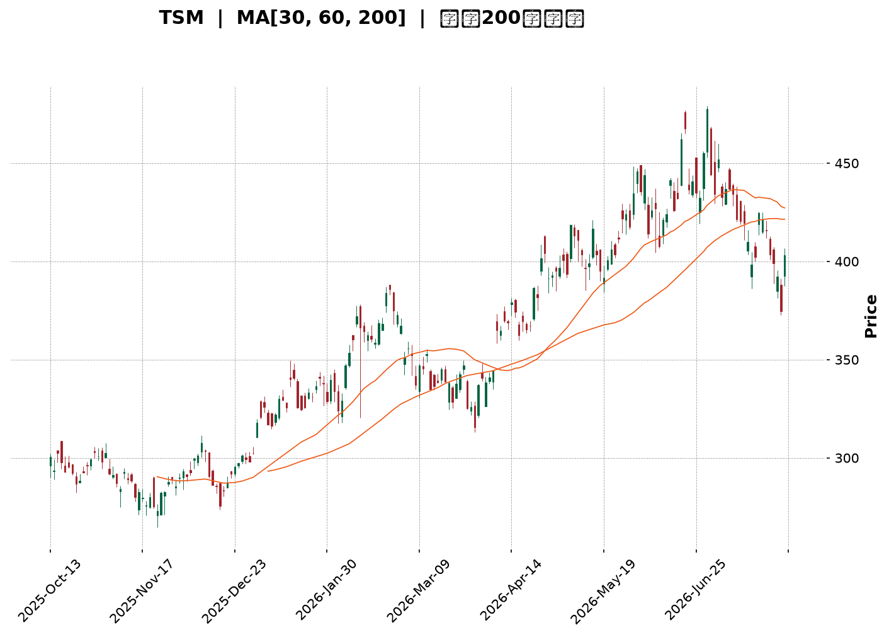

</details>

<html>
<head><meta charset="utf-8" /></head>
<body>
    <div style="height:500px; width:100%;">                        <script>window.PlotlyConfig = {MathJaxConfig: 'local'};</script>
        <script charset="utf-8" src="https://cdn.plot.ly/plotly-3.7.0.min.js" integrity="sha256-jvTGqxNp8AGWEcvNLVuKr+8j5dGe9Yw51LQkmDH+IYA=" crossorigin="anonymous"></script>                <div id="candlestick-chart" class="plotly-graph-div" style="height:100%; width:100%;"></div>            <script>                window.PLOTLYENV=window.PLOTLYENV || {};                                if (document.getElementById("candlestick-chart")) {                    Plotly.newPlot(                        "candlestick-chart",                        [{"close":{"dtype":"f8","bdata":"AAAAAFrIckAAAAAgBVpyQAAAAEA+5XJAAAAAwO6XckAAAAAgXkxyQAAAAOD1dXJAAAAAwFFDckAAAACg8elxQAAAAABQB3JAAAAAgHZKckAAAAAAsX5yQAAAAMDCsnJAAAAAoEbrckAAAAAAl81yQAAAAIBMoXJAAAAAwJ\u002fnckAAAABgBDxyQAAAACCCNXJAAAAAgKjvcUAAAABAKcRxQAAAAGBiT3JAAAAAAEwOckAAAAAAkQVyQAAAAEDmf3FAAAAA4H2pcUAAAAAg4nxxQAAAAMDLO3FAAAAAIJmCcUAAAACASTVxQAAAAGCNDnFAAAAAYKKmcUAAAADARKdxQAAAAKAW+3FAAAAAwLETckAAAADA5NZxQAAAAODmHHJAAAAAAD5SckAAAACgPCpyQAAAAECnRnJAAAAAgCi4ckAAAAAgm9ByQAAAAOBxO3NAAAAA4If0ckAAAADAnyhyQAAAAGAt5HFAAAAAQFTWcUAAAACAlThxQAAAACB4s3FAAAAAIHD3cUAAAADAXDxyQAAAAMDHdnJAAAAAYDqUckAAAAAgidRyQAAAAGD5tXJAAAAA4KSgckAAAAAAQOVyQAAAAAB633NAAAAA4H8JdEAAAAAg9Ft0QAAAAECs0HNAAAAAQALGc0AAAABgdx90QAAAAGAJoXRAAAAAYB+YdEAAAAAg3FZ0QAAAAEAlPnVAAAAAAD5KdUAAAADgp1d0QAAAAAAaR3RAAAAAoP9adEAAAADAYdJ0QAAAAOD\u002fr3RAAAAAwJ0JdUAAAACgpkh1QAAAAIDgHHVAAAAAwMaNdEAAAAAgsDl1QAAAAKBj4HRAAAAAgA1BdEAAAACAe5B0QAAAAKDpsHVAAAAAIFUZdkAAAABgzIB2QAAAACCtQndAAAAAYFTjdkAAAADgocd2QAAAAABApXZAAAAAoF6GdkAAAACAmmh2QAAAAEArCndAAAAAoDUCd0AAAAAgR\u002fx3QAAAAIDLG3hAAAAAIPltd0AAAADgeUp3QAAAAOBn83ZAAAAAYAr1dUAAAABgpTl2QAAAAACpAHZAAAAAIF8SdUAAAABghq51QAAAAKDllHVAAAAAYM0LdkAAAACgq+90QAAAAIAjCXVAAAAAgLMndUAAAAAgv5J1QAAAACBtLHVAAAAAwPkfdUAAAABAiId0QAAAAGCMGnVAAAAAICtndUAAAAAgAK91QAAAAKCRVXRAAAAAIKBfdEAAAAAgK7xzQAAAACCREnVAAAAAABNLdUAAAABg9yN1QAAAAGBiT3VAAAAAIDaIdUAAAADAuNB2QAAAAGAtynZAAAAAAL8bd0AAAAAATgt3QAAAAAAKsHdAAAAAAJRjd0AAAABgBKh2QAAAAGAmGndAAAAAICbWdkAAAAAghfN2QAAAAICOKHhAAAAAYEHcd0AAAACgUBh5QAAAAICKQHlAAAAAAMZ2eEAAAADAjo54QAAAAIAnsnhAAAAAwNrLeEAAAAAgvwp5QAAAAADRl3hAAAAAgFEoekAAAAAA69J5QAAAAIB9q3lAAAAAgIQ5eUAAAAAAocV4QAAAAMDa7XhAAAAAoOcLekAAAAAgfDZ5QAAAACBmsHhAAAAAQBV7eEAAAAAg6Ap5QAAAAAAuY3lAAAAAwDI5eUAAAADgtLV5QAAAAKDgW3pAAAAAoOB9ekAAAADAjhd6QAAAAKDLKXtAAAAAgFfae0AAAABAtzp7QAAAAKAWvntAAAAAQDPjeUAAAABg2Jx6QAAAAEC5rnpAAAAAYLh8eUAAAADAHlF6QAAAAEDhfnpAAAAAYGaWe0AAAACgR516QAAAAGBmAntAAAAAgOvhfEAAAABguDp9QAAAAIA9RntAAAAAoEeNe0AAAAAA1y97QAAAAKCZBXtAAAAAoJlxfEAAAADAHtl9QAAAACCuw3tAAAAAYI8ie0AAAADgozx8QAAAAMAeCXtAAAAAIK5Pe0AAAAAgXE97QAAAAIDCIXtAAAAAoEdZekAAAACAPUZ6QAAAACCuN3pAAAAAANebeUAAAACA6+V4QAAAAMDMJHlAAAAAgMKJekAAAAAgXFN6QAAAAKBH+XlAAAAAYI82eUAAAACgcPF4QAAAAMD1hHhAAAAAYLhqd0AAAADA9TR5QA=="},"high":{"dtype":"f8","bdata":"o0mtR\u002fnjckCh0hfRQLZyQNAJ1MdnA3NAqYdjZfhOc0AsXUEE3M5yQPtoEHZq1HJAqL65nXiQckBOcuT8RU5yQA9u\u002fOamPHJAS4vU3+15ckD46lm2F6JyQKqeGSlJvHJAhnLaN9YYc0DO\u002f0imhA5zQDbO0FRkFHNAWigQTiA7c0B5JqpcELpyQP2FOBU3fnJAXxdnEmJFckBZwp08OtpxQELNr2\u002fpbHJAvOwi6dNJckDt9BDnCElyQLa4yzrJ83FAFLNVTODJcUCe\u002fFpBo8RxQECQlpz9X3FAdniVkDSlcUAljbSQ9yhyQCEVMaEtSHFAbH39LE2tcUCczGLRsrJxQAN7sPtUKHJA\u002fdMw+hsmckDHf+BuIw5yQA0evRIpQ3JA216OyNBkckCtdyYGsztyQG82pywsp3JAqiVyexDEckAJKpxUxORyQB2wGohneHNAIhiYCEoEc0BFd9ARdetyQBVER3F5ZHJAcKnsZqPvcUAmqfZs0\u002flxQCuUWgry2nFAbZT7dbEqckDFe3B05ldyQIWEN6oPhnJAdSPAa\u002fWZckDSlayhId1yQJ8CPaL17nJAvm8lX8HvckCN2mJR9hxzQJC3\u002fXD+\u002fnNASixZZ8KYdEBOvx2O47V0QJ7djlT3SXRAiJBmn1AtdEDuzzXAnDF0QMR\u002f7MZevXRAZwcY8Q3rdEChuUU7ooJ0QHNDZWFj2HVAx26caNTAdUDm3sRMQ0Z1QG6yI7DNvnRAMrWhMT\u002fVdECiOEKgrPZ0QESnZA8L1nRALGHF3O83dUB+DBOClnt1QM2zoYqSX3VAVi16v3IidUDuVRIW5WZ1QBbyaHtClHVAZB1gT\u002fAQdUDiHsZIm810QFmWUc\u002fCvnVA93dKKgdcdkBJG0kAKq52QEtvI4wQmndA1\u002fglO8Cgd0BXNrjgPRN3QEwvOOUVxXZAZy7KBd33dkBWs8gD9452QFABtK2XJHdA2ajsoSs4d0BYkIwq4DJ4QJzfZEpFQ3hA9sYWI70HeEDPmUdK52t3QPdhMgDrMndAw4tcAGgidkCZHuvovnN2QOamtoX1WXZAjwWszteudUBC+47Dqrl1QPQ3Mw7u+nVAxD9qgzY4dkCExgywtpF1QLovueP8a3VA6j+4Pr1tdUAs+xSJMp91QPOMCW4xsnVAbWa0oLExdUDp5yDf+gx1QILuwgi5aXVA3eCmBjCBdUAYtV6JGdp1QL1cHN3QQXVAEERE46OMdEAl1lliR410QJPUE9noGXVAfWpjcdi9dUAt7wBBVVR1QNr\u002fOEZVdnVAXCWNPZCLdUCW8ei8zlZ3QPc4Xxr19HZA3LOxjt6Rd0BaYbxJeSl3QC31xyZG1HdAZXrsqGbRd0D+RBRyXBV3QN9fpmI9a3dAwk3gOEkTd0ByXrryIx53QInmjCAPMHhAedmzn6A9eEB99EA5iIh5QAnJ\u002fUSB2HlANIox9AvPeEBpVDdrza54QOP5xH+73XhAKDXg5LwweUDUPAyY9Wt5QBP26fflUnlAiwgA1oIrekDhahmkTDB6QNOsf1ZpAHpA1HblOHBseUA\u002fVbiozRR5QNaUpYzAO3lAM6gM9L5PekD42essmY55QPRoN8feXnlAKgERPyvfeEC1fld\u002f+y55QDfL\u002fID6p3lABXVxZV6beUC7U\u002fI3Rfh5QCl4zmm02HpAFOs5h52pekBWxvgB89Z6QNtE6\u002fFwBXxAqUKzk1H1e0AFZox4uxF8QJTP\u002fq1p73tAwqqlAS4Oe0DgB3ZKvgx7QOPgREEuUntAZigg\u002fC6VekAAAAAAAGR6QAAAAEAKr3pAAAAAoEepe0AAAACgR4V7QAAAAAAAqHtAAAAAIIUTfUAAAADgo8x9QAAAAKBH9XtAAAAAgMK9e0AAAABgZk58QAAAAIAUQntAAAAAoJmBfEAAAAAAAPB9QAAAAAApSH1AAAAAIIXXfEAAAADgesB8QAAAAMDMfHtAAAAAANeHe0AAAABACvt7QAAAAGCPentAAAAAANdfe0AAAADA9fB6QAAAAIA9znpAAAAAQDP\u002feUAAAABAM0t5QAAAAIA9nnlAAAAAYGaWekAAAADA9Yx6QAAAAKBwTXpAAAAAYLjOeUAAAABA4XZ5QAAAAIDCtXhAAAAAAAB0eEAAAADgUWx5QA=="},"hovertemplate":"\u003cb\u003e%{x|%Y-%m-%d}\u003c\u002fb\u003e\u003cbr\u003e\u958b: $%{open:.2f}\u003cbr\u003e\u9ad8: $%{high:.2f}\u003cbr\u003e\u4f4e: $%{low:.2f}\u003cbr\u003e\u6536: $%{close:.2f}\u003cextra\u003e\u003c\u002fextra\u003e","low":{"dtype":"f8","bdata":"yNE1vI0gckA1eEjP\u002fhByQOiepHaVm3JAZhiQP+1lckDGlnb\u002f00lyQF2t1t7Ma3JArbxeWNM1ckCNmuj20qJxQDlgzZnZ9XFAdn2qIGpBckD68OVGTTZyQDs4pwc+XHJAOdVwSEHAckC7Ght7fadyQD00VpbEZXJANOCifiC8ckCsZa\u002fqcTNyQDz13CeJE3JAYlI6kCHScUA4qoPPaS9xQOnLrziBF3JA9nfHX2vqcUAn+9ltDvVxQJTVq3P5XHFArq9dZoDxcED4YqalzFlxQCxHmbNn6XBA0WNYHY4icUCUOsnH+yNxQGsJgT++i3BArsfsyt3wcEACU4+ZHu9wQO5aWQmw13FAWFlGIdnrcUDKTu6InY9xQJ6aRbC07nFAX6Or4FW9cUAqD2EM5v5xQNc1+jJRL3JAeIMFDGdmckAFnEn8qIJyQMBEDggpwnJArmB6bpmhckDP0r9QwBdyQKLQACAn4XFAxeIwPNKdcUAr9QqUqBpxQA07wY7UhHFAu07peofOcUCSwueTaRtyQB34rL8rK3JA12B92lFrckDRG0dSxY9yQAey5ynXkXJAR7Z4PJOeckBpbjRv7d1yQISqwkWRYXNA+uYNqo\u002f9c0DqcsdJvy50QNdUb9JxznNAQ\u002ff9HT6oc0AZbM4i1MlzQGyzIbiO9nNAMlZnLUeRdECidIGVaDJ0QOf6XnDuAnVAnw0Wikc7dUDkuUxZhFN0QLdnUQMZQHRACmgDZYRTdEDdWcVuq5p0QGWidhWGiHRAvEf\u002fc3LNdED+ehThtQ51QJjm7vA1aHRA0TRoXIl2dEC4dnJZiXZ0QNLOiiEuhXRAO5q7quHWc0B+1H8CHeBzQBY\u002fwjW37nRAG4WetTKgdUBA\u002fTe17ih2QMX6l\u002f\u002fx53ZANCGhxBwHdEBvlErupm52QFU4qlOLJnZAw+6dYbJtdkABgK5apTl2QGLv39URVHZACJg+PjnJdkBPKtEU4GF3QP0CZA2i7XdAuM0HTsz8dkD48qA4m+t2QPdcqaRprHZAsFoSovBldUBDRUq3pAt2QF7xwAiHYHVAs+mnMFrvdEACoCvBbKN0QJcbaEalaHVAVzy3i\u002fLIdUBnxWvyaup0QBFV4N\u002fe53RAA1yrwSwhdUDBQ0bqvxl1QJGEfzPBKHVAiV7yReJGdECJTYaWN1J0QKboahY5pXRAzmWZVNXTdEBt397LKGt1QDgV67TBSXRAMfMIRekYdEBylr+2EZFzQIOjbT48BnRALnjCpkwvdUCRQwdilWB0QG7dvexCHXVArNohStrtdEAHpEwcaWZ2QAe9tSUJfnZAHNtvgi0Od0DZVK6vHdN2QHU7yXSRRXdA65AkKHI1d0APUM1LUnt2QGMnUCuXxHZAv0RCK2K2dkB4eDZsHMR2QGraD4ZiHHdANZG1Telud0C9bYuF4I54QGPwk5Ru93hA8NIBvdH8d0DBJr9xXjR4QNUzZOzwDHhA0ZJN5GtzeECL0sk3baR4QLuuMpLsenhACiCvQ2z7eECvAWPtgHJ5QCjU6xoY\u002f3hATM62pCfUeED8mm9sfBN4QJS1V9fiaHhAUfv3mpESeUC1SSfzXt54QExhTIQuYnhAsvy6wJACeECVZ4oiZrB4QJ+MG7056XhAdv28QrMeeUCUGEhoypF5QJ5wz1aN5nlAb2h1YtvbeUBZj+L7ZgR6QBtxqMY0WHpA6smtdNwve0BWFa6LPBh7QIYQSp7TpHpA+MW+hjW9eUCvg99cr1h6QCu2yFUASXlAo+ZPrPVreUAAAACAwo15QAAAACBcE3pAAAAAQOH+ekAAAABAM5N6QAAAAIA9+npAAAAAgD1me0AAAABguBJ9QAAAAEAKI3tAAAAAoEcJe0AAAABACgd7QAAAAEAKM3pAAAAAoHDxekAAAAAAAFB8QAAAACCFt3tAAAAAAADYekAAAACgmdl7QAAAAIDCwXpAAAAAAADMekAAAACAPUZ7QAAAAKCZwXpAAAAA4KNEekAAAACAwi16QAAAAAAArHlAAAAAAAA4eUAAAADgUSB4QAAAAKBHAXlAAAAAwPXYeUAAAAAgXON5QAAAAMDMvHlAAAAAwMwMeUAAAADAzEx4QAAAAMDM1HdAAAAAIIVLd0AAAACgmTl4QA=="},"name":"\u50f9\u683c","open":{"dtype":"f8","bdata":"aX+WaIh+ckCQoGNNGVVyQP91AGdT\u002fnJAZ0KEPPxHc0CyaIKOEoFyQHaatPh4mnJAC0r09piKckAk03swWStyQC0sSmiM+HFAbBQYlyVUckBEwNiQCoVyQLnexmvNf3JAERiCA4z2ckBxZ9b7XctyQC3QYTOQ+XJAjlWIkZbDckDlg85\u002f8WhyQF2PIcpQJXJAc5dpfc88ckDF04evrq9xQJ2jKSTwQHJAGeXS32wcckA1JW4edjZyQCl5BSyM7nFARFHi0wsccUCOQeSg1XNxQGBAaKcUNnFA2FKKhhQscUD\u002fBYuPzh5yQDx7hG3V6nBArsfsyt3wcEDutxESUIhxQJTkJapv7XFAUNXYzxcjckCY70421MpxQGW5yiF5G3JARVlot1QeckDIPvPf5zpyQP2X2kjEW3JA+neRtIWtckBv9lJFUJpyQIpiIaC473JAsnr\u002fGgP8ckBFd9ARdetyQNmHXsAgWnJAakcRionccUCEtPGswPBxQIhgXiOQuHFAu07peofOcUAeusj8fFJyQHfkfJxFPnJAQxex8FqDckCWqd7EvKVyQENPP8Wpw3JAHem8OeXMckAZAkEvAOdyQNBpvkAGZnNAfkhgrDqLdEBnl59DXYh0QFh8MUUFMHRAbXQlcJArdECa3q5\u002f+uJzQORrI7McB3RAkGeSzYuydEChuUU7ooJ0QGfhjt7EUHVAwJlRGaqLdUAbSkpunTB1QARZBNx1u3RA9iktIk27dECaoybyz6V0QHaxwvBFsXRA2t2C3FPsdEBJobphRVR1QOvsqTzbIHVAJJ2qDyPbdEC6zBbH9ZB0QPqeZCq+dHVA3DohjQDedEDjBBKmkhJ0QHP9zfA+\u002fHRAvM+mv3qvdUCFEdatUad2QBYsoIvYAndATWN3SNWQd0Akur4DC\u002fR2QFcVX00pgHZA9x4lcdafdkDyxvE68F12QAOYLMXkXnZAtNz1ifrRdkDBNXEuM5d3QJzfZEpFQ3hAGyUKXh8DeED+aqw4zQN3QMh5PNK2t3ZAjZfp\u002fQ28dUBCM\u002fKVfDl2QKUoCvs2EXZAwR4ik8BbdUAvZW2IAN50QDofqRLdqnVAJLJfI8YBdkBfl\u002felboJ1QAwFPwVwYnVAEs\u002fh5u83dUB\u002foHcc3jx1QC1qTNKNj3VAoQYQlTaHdEBFcAhNS\u002f50QKboahY5pXRAy8s1X5PsdEBLpz3fEJN1QNtGhKtqMHVA4PJQByNBdECo8hX692Z0QA0qHUzpGHRAi3HKT4txdUDQmAPgOGF0QLLoVZxML3VAnQcp5VkqdUCbje48zBZ3QBPVJxU4p3ZAZV\u002f7PmZrd0D+4JClURZ3QKh2a4J4ondA2DldXU3Id0D5WweF+P92QKlLTMk\u002fRXdATGFMu7cFd0AAAAAghfN2QBX0Ov2ULndAYSyyyKL1d0C0rER7brN4QKRVanKIzHlApLv5+kJzeEDUgNZN3394QOGhsMAWznhAIZD6GlWIeEDwwsimMjl5QBkiKbx5OnlAvmdyhFsXeUDTX2iLzxF6QKnG9hCd\u002f3lA2oNSkqJceUCTMZCgIc14QEdcSoRu1XhAsOele0kkeUCzAd3szVh5QPRoN8feXnlAXPCiaplJeEBhjj3WKMF4QJ+MG7056XhAXbNKI5OHeUBuiBv4ecJ5QIUR91FboHpA57Oxg7xTekDiiA3CJ6F6QEdp+38yfnpAPhfLWM94e0AkMQ65BA98QBeIRYD72XpAUTqyB0HMekArPhJ\u002femx6QLZ\u002fYQz53XpA7QhOpOLPeUAAAAAAKdR5QAAAAMDMQHpAAAAAQOFqe0AAAADgUUB7QAAAAAAALHtAAAAAgBRue0AAAACgcMF9QAAAAEDhcntAAAAAIK4fe0AAAABgZk58QAAAAAAAkHpAAAAAAABQe0AAAACAwnl8QAAAAGC4On1AAAAA4KMofEAAAADgevx7QAAAAOBRYHtAAAAAAADQekAAAAAgrut7QAAAAGC4antAAAAAwB4de0AAAACA6+16QAAAAAAAnHpAAAAA4KNUeUAAAACA64F4QAAAACBce3lAAAAAANcrekAAAABgj+55QAAAAKBw\u002fXlAAAAAoJm1eUAAAACgR2F5QAAAAAAAEHhAAAAAoEdBeEAAAAAA14d4QA=="},"x":["2025-10-13T00:00:00-04:00","2025-10-14T00:00:00-04:00","2025-10-15T00:00:00-04:00","2025-10-16T00:00:00-04:00","2025-10-17T00:00:00-04:00","2025-10-20T00:00:00-04:00","2025-10-21T00:00:00-04:00","2025-10-22T00:00:00-04:00","2025-10-23T00:00:00-04:00","2025-10-24T00:00:00-04:00","2025-10-27T00:00:00-04:00","2025-10-28T00:00:00-04:00","2025-10-29T00:00:00-04:00","2025-10-30T00:00:00-04:00","2025-10-31T00:00:00-04:00","2025-11-03T00:00:00-05:00","2025-11-04T00:00:00-05:00","2025-11-05T00:00:00-05:00","2025-11-06T00:00:00-05:00","2025-11-07T00:00:00-05:00","2025-11-10T00:00:00-05:00","2025-11-11T00:00:00-05:00","2025-11-12T00:00:00-05:00","2025-11-13T00:00:00-05:00","2025-11-14T00:00:00-05:00","2025-11-17T00:00:00-05:00","2025-11-18T00:00:00-05:00","2025-11-19T00:00:00-05:00","2025-11-20T00:00:00-05:00","2025-11-21T00:00:00-05:00","2025-11-24T00:00:00-05:00","2025-11-25T00:00:00-05:00","2025-11-26T00:00:00-05:00","2025-11-28T00:00:00-05:00","2025-12-01T00:00:00-05:00","2025-12-02T00:00:00-05:00","2025-12-03T00:00:00-05:00","2025-12-04T00:00:00-05:00","2025-12-05T00:00:00-05:00","2025-12-08T00:00:00-05:00","2025-12-09T00:00:00-05:00","2025-12-10T00:00:00-05:00","2025-12-11T00:00:00-05:00","2025-12-12T00:00:00-05:00","2025-12-15T00:00:00-05:00","2025-12-16T00:00:00-05:00","2025-12-17T00:00:00-05:00","2025-12-18T00:00:00-05:00","2025-12-19T00:00:00-05:00","2025-12-22T00:00:00-05:00","2025-12-23T00:00:00-05:00","2025-12-24T00:00:00-05:00","2025-12-26T00:00:00-05:00","2025-12-29T00:00:00-05:00","2025-12-30T00:00:00-05:00","2025-12-31T00:00:00-05:00","2026-01-02T00:00:00-05:00","2026-01-05T00:00:00-05:00","2026-01-06T00:00:00-05:00","2026-01-07T00:00:00-05:00","2026-01-08T00:00:00-05:00","2026-01-09T00:00:00-05:00","2026-01-12T00:00:00-05:00","2026-01-13T00:00:00-05:00","2026-01-14T00:00:00-05:00","2026-01-15T00:00:00-05:00","2026-01-16T00:00:00-05:00","2026-01-20T00:00:00-05:00","2026-01-21T00:00:00-05:00","2026-01-22T00:00:00-05:00","2026-01-23T00:00:00-05:00","2026-01-26T00:00:00-05:00","2026-01-27T00:00:00-05:00","2026-01-28T00:00:00-05:00","2026-01-29T00:00:00-05:00","2026-01-30T00:00:00-05:00","2026-02-02T00:00:00-05:00","2026-02-03T00:00:00-05:00","2026-02-04T00:00:00-05:00","2026-02-05T00:00:00-05:00","2026-02-06T00:00:00-05:00","2026-02-09T00:00:00-05:00","2026-02-10T00:00:00-05:00","2026-02-11T00:00:00-05:00","2026-02-12T00:00:00-05:00","2026-02-13T00:00:00-05:00","2026-02-17T00:00:00-05:00","2026-02-18T00:00:00-05:00","2026-02-19T00:00:00-05:00","2026-02-20T00:00:00-05:00","2026-02-23T00:00:00-05:00","2026-02-24T00:00:00-05:00","2026-02-25T00:00:00-05:00","2026-02-26T00:00:00-05:00","2026-02-27T00:00:00-05:00","2026-03-02T00:00:00-05:00","2026-03-03T00:00:00-05:00","2026-03-04T00:00:00-05:00","2026-03-05T00:00:00-05:00","2026-03-06T00:00:00-05:00","2026-03-09T00:00:00-04:00","2026-03-10T00:00:00-04:00","2026-03-11T00:00:00-04:00","2026-03-12T00:00:00-04:00","2026-03-13T00:00:00-04:00","2026-03-16T00:00:00-04:00","2026-03-17T00:00:00-04:00","2026-03-18T00:00:00-04:00","2026-03-19T00:00:00-04:00","2026-03-20T00:00:00-04:00","2026-03-23T00:00:00-04:00","2026-03-24T00:00:00-04:00","2026-03-25T00:00:00-04:00","2026-03-26T00:00:00-04:00","2026-03-27T00:00:00-04:00","2026-03-30T00:00:00-04:00","2026-03-31T00:00:00-04:00","2026-04-01T00:00:00-04:00","2026-04-02T00:00:00-04:00","2026-04-06T00:00:00-04:00","2026-04-07T00:00:00-04:00","2026-04-08T00:00:00-04:00","2026-04-09T00:00:00-04:00","2026-04-10T00:00:00-04:00","2026-04-13T00:00:00-04:00","2026-04-14T00:00:00-04:00","2026-04-15T00:00:00-04:00","2026-04-16T00:00:00-04:00","2026-04-17T00:00:00-04:00","2026-04-20T00:00:00-04:00","2026-04-21T00:00:00-04:00","2026-04-22T00:00:00-04:00","2026-04-23T00:00:00-04:00","2026-04-24T00:00:00-04:00","2026-04-27T00:00:00-04:00","2026-04-28T00:00:00-04:00","2026-04-29T00:00:00-04:00","2026-04-30T00:00:00-04:00","2026-05-01T00:00:00-04:00","2026-05-04T00:00:00-04:00","2026-05-05T00:00:00-04:00","2026-05-06T00:00:00-04:00","2026-05-07T00:00:00-04:00","2026-05-08T00:00:00-04:00","2026-05-11T00:00:00-04:00","2026-05-12T00:00:00-04:00","2026-05-13T00:00:00-04:00","2026-05-14T00:00:00-04:00","2026-05-15T00:00:00-04:00","2026-05-18T00:00:00-04:00","2026-05-19T00:00:00-04:00","2026-05-20T00:00:00-04:00","2026-05-21T00:00:00-04:00","2026-05-22T00:00:00-04:00","2026-05-26T00:00:00-04:00","2026-05-27T00:00:00-04:00","2026-05-28T00:00:00-04:00","2026-05-29T00:00:00-04:00","2026-06-01T00:00:00-04:00","2026-06-02T00:00:00-04:00","2026-06-03T00:00:00-04:00","2026-06-04T00:00:00-04:00","2026-06-05T00:00:00-04:00","2026-06-08T00:00:00-04:00","2026-06-09T00:00:00-04:00","2026-06-10T00:00:00-04:00","2026-06-11T00:00:00-04:00","2026-06-12T00:00:00-04:00","2026-06-15T00:00:00-04:00","2026-06-16T00:00:00-04:00","2026-06-17T00:00:00-04:00","2026-06-18T00:00:00-04:00","2026-06-22T00:00:00-04:00","2026-06-23T00:00:00-04:00","2026-06-24T00:00:00-04:00","2026-06-25T00:00:00-04:00","2026-06-26T00:00:00-04:00","2026-06-29T00:00:00-04:00","2026-06-30T00:00:00-04:00","2026-07-01T00:00:00-04:00","2026-07-02T00:00:00-04:00","2026-07-06T00:00:00-04:00","2026-07-07T00:00:00-04:00","2026-07-08T00:00:00-04:00","2026-07-09T00:00:00-04:00","2026-07-10T00:00:00-04:00","2026-07-13T00:00:00-04:00","2026-07-14T00:00:00-04:00","2026-07-15T00:00:00-04:00","2026-07-16T00:00:00-04:00","2026-07-17T00:00:00-04:00","2026-07-20T00:00:00-04:00","2026-07-21T00:00:00-04:00","2026-07-22T00:00:00-04:00","2026-07-23T00:00:00-04:00","2026-07-24T00:00:00-04:00","2026-07-27T00:00:00-04:00","2026-07-28T00:00:00-04:00","2026-07-29T00:00:00-04:00","2026-07-30T00:00:00-04:00"],"type":"candlestick"},{"hovertemplate":"MA30: $%{y:.2f}\u003cextra\u003e\u003c\u002fextra\u003e","line":{"color":"#2196F3","dash":"dash","width":2},"mode":"lines","name":"MA30","x":["2025-10-13T00:00:00-04:00","2025-10-14T00:00:00-04:00","2025-10-15T00:00:00-04:00","2025-10-16T00:00:00-04:00","2025-10-17T00:00:00-04:00","2025-10-20T00:00:00-04:00","2025-10-21T00:00:00-04:00","2025-10-22T00:00:00-04:00","2025-10-23T00:00:00-04:00","2025-10-24T00:00:00-04:00","2025-10-27T00:00:00-04:00","2025-10-28T00:00:00-04:00","2025-10-29T00:00:00-04:00","2025-10-30T00:00:00-04:00","2025-10-31T00:00:00-04:00","2025-11-03T00:00:00-05:00","2025-11-04T00:00:00-05:00","2025-11-05T00:00:00-05:00","2025-11-06T00:00:00-05:00","2025-11-07T00:00:00-05:00","2025-11-10T00:00:00-05:00","2025-11-11T00:00:00-05:00","2025-11-12T00:00:00-05:00","2025-11-13T00:00:00-05:00","2025-11-14T00:00:00-05:00","2025-11-17T00:00:00-05:00","2025-11-18T00:00:00-05:00","2025-11-19T00:00:00-05:00","2025-11-20T00:00:00-05:00","2025-11-21T00:00:00-05:00","2025-11-24T00:00:00-05:00","2025-11-25T00:00:00-05:00","2025-11-26T00:00:00-05:00","2025-11-28T00:00:00-05:00","2025-12-01T00:00:00-05:00","2025-12-02T00:00:00-05:00","2025-12-03T00:00:00-05:00","2025-12-04T00:00:00-05:00","2025-12-05T00:00:00-05:00","2025-12-08T00:00:00-05:00","2025-12-09T00:00:00-05:00","2025-12-10T00:00:00-05:00","2025-12-11T00:00:00-05:00","2025-12-12T00:00:00-05:00","2025-12-15T00:00:00-05:00","2025-12-16T00:00:00-05:00","2025-12-17T00:00:00-05:00","2025-12-18T00:00:00-05:00","2025-12-19T00:00:00-05:00","2025-12-22T00:00:00-05:00","2025-12-23T00:00:00-05:00","2025-12-24T00:00:00-05:00","2025-12-26T00:00:00-05:00","2025-12-29T00:00:00-05:00","2025-12-30T00:00:00-05:00","2025-12-31T00:00:00-05:00","2026-01-02T00:00:00-05:00","2026-01-05T00:00:00-05:00","2026-01-06T00:00:00-05:00","2026-01-07T00:00:00-05:00","2026-01-08T00:00:00-05:00","2026-01-09T00:00:00-05:00","2026-01-12T00:00:00-05:00","2026-01-13T00:00:00-05:00","2026-01-14T00:00:00-05:00","2026-01-15T00:00:00-05:00","2026-01-16T00:00:00-05:00","2026-01-20T00:00:00-05:00","2026-01-21T00:00:00-05:00","2026-01-22T00:00:00-05:00","2026-01-23T00:00:00-05:00","2026-01-26T00:00:00-05:00","2026-01-27T00:00:00-05:00","2026-01-28T00:00:00-05:00","2026-01-29T00:00:00-05:00","2026-01-30T00:00:00-05:00","2026-02-02T00:00:00-05:00","2026-02-03T00:00:00-05:00","2026-02-04T00:00:00-05:00","2026-02-05T00:00:00-05:00","2026-02-06T00:00:00-05:00","2026-02-09T00:00:00-05:00","2026-02-10T00:00:00-05:00","2026-02-11T00:00:00-05:00","2026-02-12T00:00:00-05:00","2026-02-13T00:00:00-05:00","2026-02-17T00:00:00-05:00","2026-02-18T00:00:00-05:00","2026-02-19T00:00:00-05:00","2026-02-20T00:00:00-05:00","2026-02-23T00:00:00-05:00","2026-02-24T00:00:00-05:00","2026-02-25T00:00:00-05:00","2026-02-26T00:00:00-05:00","2026-02-27T00:00:00-05:00","2026-03-02T00:00:00-05:00","2026-03-03T00:00:00-05:00","2026-03-04T00:00:00-05:00","2026-03-05T00:00:00-05:00","2026-03-06T00:00:00-05:00","2026-03-09T00:00:00-04:00","2026-03-10T00:00:00-04:00","2026-03-11T00:00:00-04:00","2026-03-12T00:00:00-04:00","2026-03-13T00:00:00-04:00","2026-03-16T00:00:00-04:00","2026-03-17T00:00:00-04:00","2026-03-18T00:00:00-04:00","2026-03-19T00:00:00-04:00","2026-03-20T00:00:00-04:00","2026-03-23T00:00:00-04:00","2026-03-24T00:00:00-04:00","2026-03-25T00:00:00-04:00","2026-03-26T00:00:00-04:00","2026-03-27T00:00:00-04:00","2026-03-30T00:00:00-04:00","2026-03-31T00:00:00-04:00","2026-04-01T00:00:00-04:00","2026-04-02T00:00:00-04:00","2026-04-06T00:00:00-04:00","2026-04-07T00:00:00-04:00","2026-04-08T00:00:00-04:00","2026-04-09T00:00:00-04:00","2026-04-10T00:00:00-04:00","2026-04-13T00:00:00-04:00","2026-04-14T00:00:00-04:00","2026-04-15T00:00:00-04:00","2026-04-16T00:00:00-04:00","2026-04-17T00:00:00-04:00","2026-04-20T00:00:00-04:00","2026-04-21T00:00:00-04:00","2026-04-22T00:00:00-04:00","2026-04-23T00:00:00-04:00","2026-04-24T00:00:00-04:00","2026-04-27T00:00:00-04:00","2026-04-28T00:00:00-04:00","2026-04-29T00:00:00-04:00","2026-04-30T00:00:00-04:00","2026-05-01T00:00:00-04:00","2026-05-04T00:00:00-04:00","2026-05-05T00:00:00-04:00","2026-05-06T00:00:00-04:00","2026-05-07T00:00:00-04:00","2026-05-08T00:00:00-04:00","2026-05-11T00:00:00-04:00","2026-05-12T00:00:00-04:00","2026-05-13T00:00:00-04:00","2026-05-14T00:00:00-04:00","2026-05-15T00:00:00-04:00","2026-05-18T00:00:00-04:00","2026-05-19T00:00:00-04:00","2026-05-20T00:00:00-04:00","2026-05-21T00:00:00-04:00","2026-05-22T00:00:00-04:00","2026-05-26T00:00:00-04:00","2026-05-27T00:00:00-04:00","2026-05-28T00:00:00-04:00","2026-05-29T00:00:00-04:00","2026-06-01T00:00:00-04:00","2026-06-02T00:00:00-04:00","2026-06-03T00:00:00-04:00","2026-06-04T00:00:00-04:00","2026-06-05T00:00:00-04:00","2026-06-08T00:00:00-04:00","2026-06-09T00:00:00-04:00","2026-06-10T00:00:00-04:00","2026-06-11T00:00:00-04:00","2026-06-12T00:00:00-04:00","2026-06-15T00:00:00-04:00","2026-06-16T00:00:00-04:00","2026-06-17T00:00:00-04:00","2026-06-18T00:00:00-04:00","2026-06-22T00:00:00-04:00","2026-06-23T00:00:00-04:00","2026-06-24T00:00:00-04:00","2026-06-25T00:00:00-04:00","2026-06-26T00:00:00-04:00","2026-06-29T00:00:00-04:00","2026-06-30T00:00:00-04:00","2026-07-01T00:00:00-04:00","2026-07-02T00:00:00-04:00","2026-07-06T00:00:00-04:00","2026-07-07T00:00:00-04:00","2026-07-08T00:00:00-04:00","2026-07-09T00:00:00-04:00","2026-07-10T00:00:00-04:00","2026-07-13T00:00:00-04:00","2026-07-14T00:00:00-04:00","2026-07-15T00:00:00-04:00","2026-07-16T00:00:00-04:00","2026-07-17T00:00:00-04:00","2026-07-20T00:00:00-04:00","2026-07-21T00:00:00-04:00","2026-07-22T00:00:00-04:00","2026-07-23T00:00:00-04:00","2026-07-24T00:00:00-04:00","2026-07-27T00:00:00-04:00","2026-07-28T00:00:00-04:00","2026-07-29T00:00:00-04:00","2026-07-30T00:00:00-04:00"],"y":{"dtype":"f8","bdata":"AAAAAAAA+H8AAAAAAAD4fwAAAAAAAPh\u002fAAAAAAAA+H8AAAAAAAD4fwAAAAAAAPh\u002fAAAAAAAA+H8AAAAAAAD4fwAAAAAAAPh\u002fAAAAAAAA+H8AAAAAAAD4fwAAAAAAAPh\u002fAAAAAAAA+H8AAAAAAAD4fwAAAAAAAPh\u002fAAAAAAAA+H8AAAAAAAD4fwAAAAAAAPh\u002fAAAAAAAA+H8AAAAAAAD4fwAAAAAAAPh\u002fAAAAAAAA+H8AAAAAAAD4fwAAAAAAAPh\u002fAAAAAAAA+H8AAAAAAAD4fwAAAAAAAPh\u002fAAAAAAAA+H8AAAAAAAD4f97d3T2TJnJAzczM\u002fOocckBERESk9RZyQFVVVYUnD3JAZmZmFr8KckBERESk1AZyQM3MzKzcA3JAREREBFwEckBmZmamgAZyQImIiCidCHJAmpmZOUUMckCrqqo6AA9yQJqZmZmOE3JAMzMzk90TckDe3d3dXQ5yQHd3dwcQCHJAmpmZ6fP+cUBVVVUVTvZxQKuqqmr48XFA3t3dzTrycUBVVVWFPPZxQDMzM7OM93FARERElAP8cUB3d3e36QJyQAAAALA\u002fDXJAiYiIuHwVckCamZnZfyFyQImIiKgFOHJAIiIi4pVNckAAAABweWhyQAAAAAADgHJAvLu7yx+SckDNzMyMMqdyQFVVVbXLvXJARERE1EbTckAAAADgm+hyQHd3dydRA3NAzczMfKYcc0AREREhOy9zQFVVVQVQQHNAAAAAIEZOc0CJiIhYZl9zQKuqqnrRa3NAmpmZeZZ9c0Dv7u5eQZhzQO\u002fu7s6+s3NAq6qqSu3Kc0CJiIjYGO1zQDMzM8MxCHRAIiIiArcbdEBmZmbmlS90QAAAAJAfS3RAzczM\u002fChpdEAAAACQgIh0QKuqqlpTr3RAmpmZia7TdEDv7u7u0\u002fR0QKuqqqp8DHVAq6qqSrchdUDe3d1NNDN1QJqZmYm4TnVAmpmZ2VNqdUBVVVW1SYt1QImIiNj6qHVAVVVVxSzBdUAiIiKyXNp1QLy7u\u002fvv6HVAZmZmdqHudUAiIiJysv51QJqZmWlqDXZAIiIiMocTdkAAAADA3Rp2QCIiIgJ\u002fInZAIiIiMhordkBVVVXlIih2QGZmZnZ6J3ZARERE9JssdkC8u7vrky92QFVVVcUcMnZAvLu7C4s5dkC8u7urPjl2QAAAAJA7NHZAq6qqOksudkBERET0TCd2QCIiIpJUDnZAERERod\u002f4dUBEREQ05N51QJqZmfl30XVAREREdPXGdUB3d3c3I7x1QJqZmclgrXVARERENMegdUDe3d39ypZ1QM3MzPyJi3VAERERUcyIdUARERFBsYZ1QM3MzOz6jHVAZmZmtjKZdUC8u7uL4Jx1QHd3d5dCpnVAIiIiwlG1dUDNzMwMJ8B1QFVVVSUk1nVAq6qqep\u002fldUAiIiJyHAl2QImIiFgXLXZAIiIislNJdkDNzMyMyWJ2QLy7u0vYgHZAiYiImCygdkDNzMxsrsZ2QKuqqvp05HZAMzMzUwcNd0BERET0WzB3QBEREdHjXXdAvLu7S0mHd0ARERGxRLJ3QLy7u4st03dAq6qqKr37d0AzMzNTfR54QImIiMhSO3hAq6qqWnxUeEDv7u7ufWd4QO\u002fu7p6ofXhAMzMzA7WPeEDNzMwsdKZ4QImIiJg\u002fvXhA3t3dnbnXeEB3d3cHC\u002fV4QLy7u6uyF3lA3t3dHYFCeUCamZnJAmd5QERERGSYhXlAiYiIuOSWeUDe3d0t2KN5QAAAAPAMsHlAd3d3N8i4eUBEREQEzcd5QKuqqooo13lA7+7u\u002fvnueUAiIiLyZPx5QGZmZoYDEXpAREREZEQoekBVVVXFU0V6QGZmZtYEU3pAzczMrOBmekAzMzMTfHt6QFVVVcVXjXpAMzMzo8yhekB3d3eXWsl6QJqZmbmY43pA3t3d7T76ekC8u7vrgBV7QKuqqnqRI3tAREREZGI1e0CamZkZCkN7QCIiIrKiSXtAVVVVZWpIe0ARERHB+El7QERERLTmQXtAmpmZScAue0ARERGh2xp7QAAAAICuBHtA7+7uzjsKe0C8u7u7yAd7QJqZmWm8AXtAZmZmtmX\u002fekBVVVW1rPN6QGZmZobP4npAiYiIqDi\u002fekDe3d3tNbN6QA=="},"type":"scatter"},{"hovertemplate":"MA60: $%{y:.2f}\u003cextra\u003e\u003c\u002fextra\u003e","line":{"color":"#9C27B0","dash":"dash","width":2},"mode":"lines","name":"MA60","x":["2025-10-13T00:00:00-04:00","2025-10-14T00:00:00-04:00","2025-10-15T00:00:00-04:00","2025-10-16T00:00:00-04:00","2025-10-17T00:00:00-04:00","2025-10-20T00:00:00-04:00","2025-10-21T00:00:00-04:00","2025-10-22T00:00:00-04:00","2025-10-23T00:00:00-04:00","2025-10-24T00:00:00-04:00","2025-10-27T00:00:00-04:00","2025-10-28T00:00:00-04:00","2025-10-29T00:00:00-04:00","2025-10-30T00:00:00-04:00","2025-10-31T00:00:00-04:00","2025-11-03T00:00:00-05:00","2025-11-04T00:00:00-05:00","2025-11-05T00:00:00-05:00","2025-11-06T00:00:00-05:00","2025-11-07T00:00:00-05:00","2025-11-10T00:00:00-05:00","2025-11-11T00:00:00-05:00","2025-11-12T00:00:00-05:00","2025-11-13T00:00:00-05:00","2025-11-14T00:00:00-05:00","2025-11-17T00:00:00-05:00","2025-11-18T00:00:00-05:00","2025-11-19T00:00:00-05:00","2025-11-20T00:00:00-05:00","2025-11-21T00:00:00-05:00","2025-11-24T00:00:00-05:00","2025-11-25T00:00:00-05:00","2025-11-26T00:00:00-05:00","2025-11-28T00:00:00-05:00","2025-12-01T00:00:00-05:00","2025-12-02T00:00:00-05:00","2025-12-03T00:00:00-05:00","2025-12-04T00:00:00-05:00","2025-12-05T00:00:00-05:00","2025-12-08T00:00:00-05:00","2025-12-09T00:00:00-05:00","2025-12-10T00:00:00-05:00","2025-12-11T00:00:00-05:00","2025-12-12T00:00:00-05:00","2025-12-15T00:00:00-05:00","2025-12-16T00:00:00-05:00","2025-12-17T00:00:00-05:00","2025-12-18T00:00:00-05:00","2025-12-19T00:00:00-05:00","2025-12-22T00:00:00-05:00","2025-12-23T00:00:00-05:00","2025-12-24T00:00:00-05:00","2025-12-26T00:00:00-05:00","2025-12-29T00:00:00-05:00","2025-12-30T00:00:00-05:00","2025-12-31T00:00:00-05:00","2026-01-02T00:00:00-05:00","2026-01-05T00:00:00-05:00","2026-01-06T00:00:00-05:00","2026-01-07T00:00:00-05:00","2026-01-08T00:00:00-05:00","2026-01-09T00:00:00-05:00","2026-01-12T00:00:00-05:00","2026-01-13T00:00:00-05:00","2026-01-14T00:00:00-05:00","2026-01-15T00:00:00-05:00","2026-01-16T00:00:00-05:00","2026-01-20T00:00:00-05:00","2026-01-21T00:00:00-05:00","2026-01-22T00:00:00-05:00","2026-01-23T00:00:00-05:00","2026-01-26T00:00:00-05:00","2026-01-27T00:00:00-05:00","2026-01-28T00:00:00-05:00","2026-01-29T00:00:00-05:00","2026-01-30T00:00:00-05:00","2026-02-02T00:00:00-05:00","2026-02-03T00:00:00-05:00","2026-02-04T00:00:00-05:00","2026-02-05T00:00:00-05:00","2026-02-06T00:00:00-05:00","2026-02-09T00:00:00-05:00","2026-02-10T00:00:00-05:00","2026-02-11T00:00:00-05:00","2026-02-12T00:00:00-05:00","2026-02-13T00:00:00-05:00","2026-02-17T00:00:00-05:00","2026-02-18T00:00:00-05:00","2026-02-19T00:00:00-05:00","2026-02-20T00:00:00-05:00","2026-02-23T00:00:00-05:00","2026-02-24T00:00:00-05:00","2026-02-25T00:00:00-05:00","2026-02-26T00:00:00-05:00","2026-02-27T00:00:00-05:00","2026-03-02T00:00:00-05:00","2026-03-03T00:00:00-05:00","2026-03-04T00:00:00-05:00","2026-03-05T00:00:00-05:00","2026-03-06T00:00:00-05:00","2026-03-09T00:00:00-04:00","2026-03-10T00:00:00-04:00","2026-03-11T00:00:00-04:00","2026-03-12T00:00:00-04:00","2026-03-13T00:00:00-04:00","2026-03-16T00:00:00-04:00","2026-03-17T00:00:00-04:00","2026-03-18T00:00:00-04:00","2026-03-19T00:00:00-04:00","2026-03-20T00:00:00-04:00","2026-03-23T00:00:00-04:00","2026-03-24T00:00:00-04:00","2026-03-25T00:00:00-04:00","2026-03-26T00:00:00-04:00","2026-03-27T00:00:00-04:00","2026-03-30T00:00:00-04:00","2026-03-31T00:00:00-04:00","2026-04-01T00:00:00-04:00","2026-04-02T00:00:00-04:00","2026-04-06T00:00:00-04:00","2026-04-07T00:00:00-04:00","2026-04-08T00:00:00-04:00","2026-04-09T00:00:00-04:00","2026-04-10T00:00:00-04:00","2026-04-13T00:00:00-04:00","2026-04-14T00:00:00-04:00","2026-04-15T00:00:00-04:00","2026-04-16T00:00:00-04:00","2026-04-17T00:00:00-04:00","2026-04-20T00:00:00-04:00","2026-04-21T00:00:00-04:00","2026-04-22T00:00:00-04:00","2026-04-23T00:00:00-04:00","2026-04-24T00:00:00-04:00","2026-04-27T00:00:00-04:00","2026-04-28T00:00:00-04:00","2026-04-29T00:00:00-04:00","2026-04-30T00:00:00-04:00","2026-05-01T00:00:00-04:00","2026-05-04T00:00:00-04:00","2026-05-05T00:00:00-04:00","2026-05-06T00:00:00-04:00","2026-05-07T00:00:00-04:00","2026-05-08T00:00:00-04:00","2026-05-11T00:00:00-04:00","2026-05-12T00:00:00-04:00","2026-05-13T00:00:00-04:00","2026-05-14T00:00:00-04:00","2026-05-15T00:00:00-04:00","2026-05-18T00:00:00-04:00","2026-05-19T00:00:00-04:00","2026-05-20T00:00:00-04:00","2026-05-21T00:00:00-04:00","2026-05-22T00:00:00-04:00","2026-05-26T00:00:00-04:00","2026-05-27T00:00:00-04:00","2026-05-28T00:00:00-04:00","2026-05-29T00:00:00-04:00","2026-06-01T00:00:00-04:00","2026-06-02T00:00:00-04:00","2026-06-03T00:00:00-04:00","2026-06-04T00:00:00-04:00","2026-06-05T00:00:00-04:00","2026-06-08T00:00:00-04:00","2026-06-09T00:00:00-04:00","2026-06-10T00:00:00-04:00","2026-06-11T00:00:00-04:00","2026-06-12T00:00:00-04:00","2026-06-15T00:00:00-04:00","2026-06-16T00:00:00-04:00","2026-06-17T00:00:00-04:00","2026-06-18T00:00:00-04:00","2026-06-22T00:00:00-04:00","2026-06-23T00:00:00-04:00","2026-06-24T00:00:00-04:00","2026-06-25T00:00:00-04:00","2026-06-26T00:00:00-04:00","2026-06-29T00:00:00-04:00","2026-06-30T00:00:00-04:00","2026-07-01T00:00:00-04:00","2026-07-02T00:00:00-04:00","2026-07-06T00:00:00-04:00","2026-07-07T00:00:00-04:00","2026-07-08T00:00:00-04:00","2026-07-09T00:00:00-04:00","2026-07-10T00:00:00-04:00","2026-07-13T00:00:00-04:00","2026-07-14T00:00:00-04:00","2026-07-15T00:00:00-04:00","2026-07-16T00:00:00-04:00","2026-07-17T00:00:00-04:00","2026-07-20T00:00:00-04:00","2026-07-21T00:00:00-04:00","2026-07-22T00:00:00-04:00","2026-07-23T00:00:00-04:00","2026-07-24T00:00:00-04:00","2026-07-27T00:00:00-04:00","2026-07-28T00:00:00-04:00","2026-07-29T00:00:00-04:00","2026-07-30T00:00:00-04:00"],"y":{"dtype":"f8","bdata":"AAAAAAAA+H8AAAAAAAD4fwAAAAAAAPh\u002fAAAAAAAA+H8AAAAAAAD4fwAAAAAAAPh\u002fAAAAAAAA+H8AAAAAAAD4fwAAAAAAAPh\u002fAAAAAAAA+H8AAAAAAAD4fwAAAAAAAPh\u002fAAAAAAAA+H8AAAAAAAD4fwAAAAAAAPh\u002fAAAAAAAA+H8AAAAAAAD4fwAAAAAAAPh\u002fAAAAAAAA+H8AAAAAAAD4fwAAAAAAAPh\u002fAAAAAAAA+H8AAAAAAAD4fwAAAAAAAPh\u002fAAAAAAAA+H8AAAAAAAD4fwAAAAAAAPh\u002fAAAAAAAA+H8AAAAAAAD4fwAAAAAAAPh\u002fAAAAAAAA+H8AAAAAAAD4fwAAAAAAAPh\u002fAAAAAAAA+H8AAAAAAAD4fwAAAAAAAPh\u002fAAAAAAAA+H8AAAAAAAD4fwAAAAAAAPh\u002fAAAAAAAA+H8AAAAAAAD4fwAAAAAAAPh\u002fAAAAAAAA+H8AAAAAAAD4fwAAAAAAAPh\u002fAAAAAAAA+H8AAAAAAAD4fwAAAAAAAPh\u002fAAAAAAAA+H8AAAAAAAD4fwAAAAAAAPh\u002fAAAAAAAA+H8AAAAAAAD4fwAAAAAAAPh\u002fAAAAAAAA+H8AAAAAAAD4fwAAAAAAAPh\u002fAAAAAAAA+H8AAAAAAAD4f+\u002fu7h5LU3JAREREZIVXckCJiIgYFF9yQFVVVZ15ZnJAVVVV9QJvckAiIiJCuHdyQCIiIuqWg3JAiYiIQIGQckC8u7vj3ZpyQO\u002fu7pZ2pHJAzczMrEWtckCamZlJM7dyQCIiIgqwv3JAZmZmBrrIckBmZmaeT9NyQDMzM2vn3XJAIiIimvDkckDv7u52s\u002fFyQO\u002fu7hYV\u002fXJAAAAA6PgGc0De3d016RJzQJqZmSFWIXNAiYiISJYyc0C8u7sjtUVzQFVVVYVJXnNAERERoZV0c0BERETkKYtzQJqZmSlBonNAZmZmlqa3c0Dv7u7e1s1zQM3MzMRd53NAq6qq0jn+c0AREREhPhl0QO\u002fu7kZjM3RAzczMzDlKdEARERFJfGF0QJqZmZEgdnRAmpmZ+aOFdECamZnJ9pZ0QHd3dzfdpnRAERERqeawdEBEREQMIr10QGZmZj4ox3RA3t3dVVjUdEAiIiIiMuB0QKuqqqKc7XRAd3d3n8T7dEAiIiJiVg51QEREREQnHXVA7+7uBqEqdUARERFJajR1QAAAAJCtP3VAvLu7G7pLdUAiIiLC5ld1QGZmZvbTXnVAVVVVFUdmdUCamZkR3Gl1QCIiIlL6bnVAd3d3X1Z0dUCrqqrCq3d1QJqZmakMfnVA7+7uho2FdUCamZlZCpF1QKuqqmpCmnVAMzMzi\u002fykdUCamZn5hrB1QERERHT1unVAZmZmFurDdUDv7u5+yc11QImIiIDW2XVAIiIiemzkdUBmZmZmgu11QLy7u5NR\u002fHVAZmZm1lwIdkC8u7urnxh2QHd3d+dIKnZAMzMz0\u002fc6dkBERES8Lkl2QImIiIh6WXZAIiIi0ttsdkBERESM9n92QFVVVUVYjHZA7+7uRqmddkBERER01Kt2QJqZmTEctnZAZmZmdhTAdkCrqqpylMh2QKuqqsJS0nZAd3d3T1nhdkBVVVVFUO12QBEREclZ9HZAd3d3x6H6dkBmZmZ2JP92QN7d3U2ZBHdAIiIiqkAMd0Dv7u62khZ3QKuqqkIdJXdAIiIiKnY4d0CamZnJ9Uh3QJqZmaH6XndAAAAAcOl7d0AzMzPrlJN3QM3MzETerXdAmpmZGUK+d0AAAABQetZ3QERERCSS7ndAzczM9A0BeECJiIhISxV4QDMzM2sALHhAvLu7S5NHeEB3d3eviWF4QImIiEC8enhAvLu726WaeEDNzMzc17p4QLy7u1N02HhARERE\u002fBT3eEAiIiJi4BZ5QImIiKhCMHlA7+7u5sROeUBVVVX163N5QBEREcF1j3lAREREpF2neUBVVVVtf755QM3MzAyd0HlAvLu7s4vieUAzMzMjv\u002fR5QFVVVSVxA3pAmpmZARIQekBERETkgR96QAAAALDMLHpAvLu7s6A4ekBVVVU170B6QCIiInIjRXpAvLu7Q5BQekDNzMx00FV6QM3MzKzkWHpA7+7u9hZcekDNzMzcvF16QImIiAj8XHpAvLu7UxlXekAAAABwzVd6QA=="},"type":"scatter"},{"hovertemplate":"MA200: $%{y:.2f}\u003cextra\u003e\u003c\u002fextra\u003e","line":{"color":"#FF6F00","dash":"solid","width":2},"mode":"lines","name":"MA200","x":["2025-10-13T00:00:00-04:00","2025-10-14T00:00:00-04:00","2025-10-15T00:00:00-04:00","2025-10-16T00:00:00-04:00","2025-10-17T00:00:00-04:00","2025-10-20T00:00:00-04:00","2025-10-21T00:00:00-04:00","2025-10-22T00:00:00-04:00","2025-10-23T00:00:00-04:00","2025-10-24T00:00:00-04:00","2025-10-27T00:00:00-04:00","2025-10-28T00:00:00-04:00","2025-10-29T00:00:00-04:00","2025-10-30T00:00:00-04:00","2025-10-31T00:00:00-04:00","2025-11-03T00:00:00-05:00","2025-11-04T00:00:00-05:00","2025-11-05T00:00:00-05:00","2025-11-06T00:00:00-05:00","2025-11-07T00:00:00-05:00","2025-11-10T00:00:00-05:00","2025-11-11T00:00:00-05:00","2025-11-12T00:00:00-05:00","2025-11-13T00:00:00-05:00","2025-11-14T00:00:00-05:00","2025-11-17T00:00:00-05:00","2025-11-18T00:00:00-05:00","2025-11-19T00:00:00-05:00","2025-11-20T00:00:00-05:00","2025-11-21T00:00:00-05:00","2025-11-24T00:00:00-05:00","2025-11-25T00:00:00-05:00","2025-11-26T00:00:00-05:00","2025-11-28T00:00:00-05:00","2025-12-01T00:00:00-05:00","2025-12-02T00:00:00-05:00","2025-12-03T00:00:00-05:00","2025-12-04T00:00:00-05:00","2025-12-05T00:00:00-05:00","2025-12-08T00:00:00-05:00","2025-12-09T00:00:00-05:00","2025-12-10T00:00:00-05:00","2025-12-11T00:00:00-05:00","2025-12-12T00:00:00-05:00","2025-12-15T00:00:00-05:00","2025-12-16T00:00:00-05:00","2025-12-17T00:00:00-05:00","2025-12-18T00:00:00-05:00","2025-12-19T00:00:00-05:00","2025-12-22T00:00:00-05:00","2025-12-23T00:00:00-05:00","2025-12-24T00:00:00-05:00","2025-12-26T00:00:00-05:00","2025-12-29T00:00:00-05:00","2025-12-30T00:00:00-05:00","2025-12-31T00:00:00-05:00","2026-01-02T00:00:00-05:00","2026-01-05T00:00:00-05:00","2026-01-06T00:00:00-05:00","2026-01-07T00:00:00-05:00","2026-01-08T00:00:00-05:00","2026-01-09T00:00:00-05:00","2026-01-12T00:00:00-05:00","2026-01-13T00:00:00-05:00","2026-01-14T00:00:00-05:00","2026-01-15T00:00:00-05:00","2026-01-16T00:00:00-05:00","2026-01-20T00:00:00-05:00","2026-01-21T00:00:00-05:00","2026-01-22T00:00:00-05:00","2026-01-23T00:00:00-05:00","2026-01-26T00:00:00-05:00","2026-01-27T00:00:00-05:00","2026-01-28T00:00:00-05:00","2026-01-29T00:00:00-05:00","2026-01-30T00:00:00-05:00","2026-02-02T00:00:00-05:00","2026-02-03T00:00:00-05:00","2026-02-04T00:00:00-05:00","2026-02-05T00:00:00-05:00","2026-02-06T00:00:00-05:00","2026-02-09T00:00:00-05:00","2026-02-10T00:00:00-05:00","2026-02-11T00:00:00-05:00","2026-02-12T00:00:00-05:00","2026-02-13T00:00:00-05:00","2026-02-17T00:00:00-05:00","2026-02-18T00:00:00-05:00","2026-02-19T00:00:00-05:00","2026-02-20T00:00:00-05:00","2026-02-23T00:00:00-05:00","2026-02-24T00:00:00-05:00","2026-02-25T00:00:00-05:00","2026-02-26T00:00:00-05:00","2026-02-27T00:00:00-05:00","2026-03-02T00:00:00-05:00","2026-03-03T00:00:00-05:00","2026-03-04T00:00:00-05:00","2026-03-05T00:00:00-05:00","2026-03-06T00:00:00-05:00","2026-03-09T00:00:00-04:00","2026-03-10T00:00:00-04:00","2026-03-11T00:00:00-04:00","2026-03-12T00:00:00-04:00","2026-03-13T00:00:00-04:00","2026-03-16T00:00:00-04:00","2026-03-17T00:00:00-04:00","2026-03-18T00:00:00-04:00","2026-03-19T00:00:00-04:00","2026-03-20T00:00:00-04:00","2026-03-23T00:00:00-04:00","2026-03-24T00:00:00-04:00","2026-03-25T00:00:00-04:00","2026-03-26T00:00:00-04:00","2026-03-27T00:00:00-04:00","2026-03-30T00:00:00-04:00","2026-03-31T00:00:00-04:00","2026-04-01T00:00:00-04:00","2026-04-02T00:00:00-04:00","2026-04-06T00:00:00-04:00","2026-04-07T00:00:00-04:00","2026-04-08T00:00:00-04:00","2026-04-09T00:00:00-04:00","2026-04-10T00:00:00-04:00","2026-04-13T00:00:00-04:00","2026-04-14T00:00:00-04:00","2026-04-15T00:00:00-04:00","2026-04-16T00:00:00-04:00","2026-04-17T00:00:00-04:00","2026-04-20T00:00:00-04:00","2026-04-21T00:00:00-04:00","2026-04-22T00:00:00-04:00","2026-04-23T00:00:00-04:00","2026-04-24T00:00:00-04:00","2026-04-27T00:00:00-04:00","2026-04-28T00:00:00-04:00","2026-04-29T00:00:00-04:00","2026-04-30T00:00:00-04:00","2026-05-01T00:00:00-04:00","2026-05-04T00:00:00-04:00","2026-05-05T00:00:00-04:00","2026-05-06T00:00:00-04:00","2026-05-07T00:00:00-04:00","2026-05-08T00:00:00-04:00","2026-05-11T00:00:00-04:00","2026-05-12T00:00:00-04:00","2026-05-13T00:00:00-04:00","2026-05-14T00:00:00-04:00","2026-05-15T00:00:00-04:00","2026-05-18T00:00:00-04:00","2026-05-19T00:00:00-04:00","2026-05-20T00:00:00-04:00","2026-05-21T00:00:00-04:00","2026-05-22T00:00:00-04:00","2026-05-26T00:00:00-04:00","2026-05-27T00:00:00-04:00","2026-05-28T00:00:00-04:00","2026-05-29T00:00:00-04:00","2026-06-01T00:00:00-04:00","2026-06-02T00:00:00-04:00","2026-06-03T00:00:00-04:00","2026-06-04T00:00:00-04:00","2026-06-05T00:00:00-04:00","2026-06-08T00:00:00-04:00","2026-06-09T00:00:00-04:00","2026-06-10T00:00:00-04:00","2026-06-11T00:00:00-04:00","2026-06-12T00:00:00-04:00","2026-06-15T00:00:00-04:00","2026-06-16T00:00:00-04:00","2026-06-17T00:00:00-04:00","2026-06-18T00:00:00-04:00","2026-06-22T00:00:00-04:00","2026-06-23T00:00:00-04:00","2026-06-24T00:00:00-04:00","2026-06-25T00:00:00-04:00","2026-06-26T00:00:00-04:00","2026-06-29T00:00:00-04:00","2026-06-30T00:00:00-04:00","2026-07-01T00:00:00-04:00","2026-07-02T00:00:00-04:00","2026-07-06T00:00:00-04:00","2026-07-07T00:00:00-04:00","2026-07-08T00:00:00-04:00","2026-07-09T00:00:00-04:00","2026-07-10T00:00:00-04:00","2026-07-13T00:00:00-04:00","2026-07-14T00:00:00-04:00","2026-07-15T00:00:00-04:00","2026-07-16T00:00:00-04:00","2026-07-17T00:00:00-04:00","2026-07-20T00:00:00-04:00","2026-07-21T00:00:00-04:00","2026-07-22T00:00:00-04:00","2026-07-23T00:00:00-04:00","2026-07-24T00:00:00-04:00","2026-07-27T00:00:00-04:00","2026-07-28T00:00:00-04:00","2026-07-29T00:00:00-04:00","2026-07-30T00:00:00-04:00"],"y":{"dtype":"f8","bdata":"AAAAAAAA+H8AAAAAAAD4fwAAAAAAAPh\u002fAAAAAAAA+H8AAAAAAAD4fwAAAAAAAPh\u002fAAAAAAAA+H8AAAAAAAD4fwAAAAAAAPh\u002fAAAAAAAA+H8AAAAAAAD4fwAAAAAAAPh\u002fAAAAAAAA+H8AAAAAAAD4fwAAAAAAAPh\u002fAAAAAAAA+H8AAAAAAAD4fwAAAAAAAPh\u002fAAAAAAAA+H8AAAAAAAD4fwAAAAAAAPh\u002fAAAAAAAA+H8AAAAAAAD4fwAAAAAAAPh\u002fAAAAAAAA+H8AAAAAAAD4fwAAAAAAAPh\u002fAAAAAAAA+H8AAAAAAAD4fwAAAAAAAPh\u002fAAAAAAAA+H8AAAAAAAD4fwAAAAAAAPh\u002fAAAAAAAA+H8AAAAAAAD4fwAAAAAAAPh\u002fAAAAAAAA+H8AAAAAAAD4fwAAAAAAAPh\u002fAAAAAAAA+H8AAAAAAAD4fwAAAAAAAPh\u002fAAAAAAAA+H8AAAAAAAD4fwAAAAAAAPh\u002fAAAAAAAA+H8AAAAAAAD4fwAAAAAAAPh\u002fAAAAAAAA+H8AAAAAAAD4fwAAAAAAAPh\u002fAAAAAAAA+H8AAAAAAAD4fwAAAAAAAPh\u002fAAAAAAAA+H8AAAAAAAD4fwAAAAAAAPh\u002fAAAAAAAA+H8AAAAAAAD4fwAAAAAAAPh\u002fAAAAAAAA+H8AAAAAAAD4fwAAAAAAAPh\u002fAAAAAAAA+H8AAAAAAAD4fwAAAAAAAPh\u002fAAAAAAAA+H8AAAAAAAD4fwAAAAAAAPh\u002fAAAAAAAA+H8AAAAAAAD4fwAAAAAAAPh\u002fAAAAAAAA+H8AAAAAAAD4fwAAAAAAAPh\u002fAAAAAAAA+H8AAAAAAAD4fwAAAAAAAPh\u002fAAAAAAAA+H8AAAAAAAD4fwAAAAAAAPh\u002fAAAAAAAA+H8AAAAAAAD4fwAAAAAAAPh\u002fAAAAAAAA+H8AAAAAAAD4fwAAAAAAAPh\u002fAAAAAAAA+H8AAAAAAAD4fwAAAAAAAPh\u002fAAAAAAAA+H8AAAAAAAD4fwAAAAAAAPh\u002fAAAAAAAA+H8AAAAAAAD4fwAAAAAAAPh\u002fAAAAAAAA+H8AAAAAAAD4fwAAAAAAAPh\u002fAAAAAAAA+H8AAAAAAAD4fwAAAAAAAPh\u002fAAAAAAAA+H8AAAAAAAD4fwAAAAAAAPh\u002fAAAAAAAA+H8AAAAAAAD4fwAAAAAAAPh\u002fAAAAAAAA+H8AAAAAAAD4fwAAAAAAAPh\u002fAAAAAAAA+H8AAAAAAAD4fwAAAAAAAPh\u002fAAAAAAAA+H8AAAAAAAD4fwAAAAAAAPh\u002fAAAAAAAA+H8AAAAAAAD4fwAAAAAAAPh\u002fAAAAAAAA+H8AAAAAAAD4fwAAAAAAAPh\u002fAAAAAAAA+H8AAAAAAAD4fwAAAAAAAPh\u002fAAAAAAAA+H8AAAAAAAD4fwAAAAAAAPh\u002fAAAAAAAA+H8AAAAAAAD4fwAAAAAAAPh\u002fAAAAAAAA+H8AAAAAAAD4fwAAAAAAAPh\u002fAAAAAAAA+H8AAAAAAAD4fwAAAAAAAPh\u002fAAAAAAAA+H8AAAAAAAD4fwAAAAAAAPh\u002fAAAAAAAA+H8AAAAAAAD4fwAAAAAAAPh\u002fAAAAAAAA+H8AAAAAAAD4fwAAAAAAAPh\u002fAAAAAAAA+H8AAAAAAAD4fwAAAAAAAPh\u002fAAAAAAAA+H8AAAAAAAD4fwAAAAAAAPh\u002fAAAAAAAA+H8AAAAAAAD4fwAAAAAAAPh\u002fAAAAAAAA+H8AAAAAAAD4fwAAAAAAAPh\u002fAAAAAAAA+H8AAAAAAAD4fwAAAAAAAPh\u002fAAAAAAAA+H8AAAAAAAD4fwAAAAAAAPh\u002fAAAAAAAA+H8AAAAAAAD4fwAAAAAAAPh\u002fAAAAAAAA+H8AAAAAAAD4fwAAAAAAAPh\u002fAAAAAAAA+H8AAAAAAAD4fwAAAAAAAPh\u002fAAAAAAAA+H8AAAAAAAD4fwAAAAAAAPh\u002fAAAAAAAA+H8AAAAAAAD4fwAAAAAAAPh\u002fAAAAAAAA+H8AAAAAAAD4fwAAAAAAAPh\u002fAAAAAAAA+H8AAAAAAAD4fwAAAAAAAPh\u002fAAAAAAAA+H8AAAAAAAD4fwAAAAAAAPh\u002fAAAAAAAA+H8AAAAAAAD4fwAAAAAAAPh\u002fAAAAAAAA+H8AAAAAAAD4fwAAAAAAAPh\u002fAAAAAAAA+H8AAAAAAAD4fwAAAAAAAPh\u002fAAAAAAAA+H8K16OEpjd2QA=="},"type":"scatter"}],                        {"template":{"data":{"barpolar":[{"marker":{"line":{"color":"rgb(17,17,17)","width":0.5},"pattern":{"fillmode":"overlay","size":10,"solidity":0.2}},"type":"barpolar"}],"bar":[{"error_x":{"color":"#f2f5fa"},"error_y":{"color":"#f2f5fa"},"marker":{"line":{"color":"rgb(17,17,17)","width":0.5},"pattern":{"fillmode":"overlay","size":10,"solidity":0.2}},"type":"bar"}],"carpet":[{"aaxis":{"endlinecolor":"#A2B1C6","gridcolor":"#506784","linecolor":"#506784","minorgridcolor":"#506784","startlinecolor":"#A2B1C6"},"baxis":{"endlinecolor":"#A2B1C6","gridcolor":"#506784","linecolor":"#506784","minorgridcolor":"#506784","startlinecolor":"#A2B1C6"},"type":"carpet"}],"choropleth":[{"colorbar":{"outlinewidth":0,"ticks":""},"type":"choropleth"}],"contourcarpet":[{"colorbar":{"outlinewidth":0,"ticks":""},"type":"contourcarpet"}],"contour":[{"colorbar":{"outlinewidth":0,"ticks":""},"colorscale":[[0.0,"#0d0887"],[0.1111111111111111,"#46039f"],[0.2222222222222222,"#7201a8"],[0.3333333333333333,"#9c179e"],[0.4444444444444444,"#bd3786"],[0.5555555555555556,"#d8576b"],[0.6666666666666666,"#ed7953"],[0.7777777777777778,"#fb9f3a"],[0.8888888888888888,"#fdca26"],[1.0,"#f0f921"]],"type":"contour"}],"heatmap":[{"colorbar":{"outlinewidth":0,"ticks":""},"colorscale":[[0.0,"#0d0887"],[0.1111111111111111,"#46039f"],[0.2222222222222222,"#7201a8"],[0.3333333333333333,"#9c179e"],[0.4444444444444444,"#bd3786"],[0.5555555555555556,"#d8576b"],[0.6666666666666666,"#ed7953"],[0.7777777777777778,"#fb9f3a"],[0.8888888888888888,"#fdca26"],[1.0,"#f0f921"]],"type":"heatmap"}],"histogram2dcontour":[{"colorbar":{"outlinewidth":0,"ticks":""},"colorscale":[[0.0,"#0d0887"],[0.1111111111111111,"#46039f"],[0.2222222222222222,"#7201a8"],[0.3333333333333333,"#9c179e"],[0.4444444444444444,"#bd3786"],[0.5555555555555556,"#d8576b"],[0.6666666666666666,"#ed7953"],[0.7777777777777778,"#fb9f3a"],[0.8888888888888888,"#fdca26"],[1.0,"#f0f921"]],"type":"histogram2dcontour"}],"histogram2d":[{"colorbar":{"outlinewidth":0,"ticks":""},"colorscale":[[0.0,"#0d0887"],[0.1111111111111111,"#46039f"],[0.2222222222222222,"#7201a8"],[0.3333333333333333,"#9c179e"],[0.4444444444444444,"#bd3786"],[0.5555555555555556,"#d8576b"],[0.6666666666666666,"#ed7953"],[0.7777777777777778,"#fb9f3a"],[0.8888888888888888,"#fdca26"],[1.0,"#f0f921"]],"type":"histogram2d"}],"histogram":[{"marker":{"pattern":{"fillmode":"overlay","size":10,"solidity":0.2}},"type":"histogram"}],"mesh3d":[{"colorbar":{"outlinewidth":0,"ticks":""},"type":"mesh3d"}],"parcoords":[{"line":{"colorbar":{"outlinewidth":0,"ticks":""}},"type":"parcoords"}],"pie":[{"automargin":true,"type":"pie"}],"scatter3d":[{"line":{"colorbar":{"outlinewidth":0,"ticks":""}},"marker":{"colorbar":{"outlinewidth":0,"ticks":""}},"type":"scatter3d"}],"scattercarpet":[{"marker":{"colorbar":{"outlinewidth":0,"ticks":""}},"type":"scattercarpet"}],"scattergeo":[{"marker":{"colorbar":{"outlinewidth":0,"ticks":""}},"type":"scattergeo"}],"scattergl":[{"marker":{"line":{"color":"#283442"}},"type":"scattergl"}],"scattermapbox":[{"marker":{"colorbar":{"outlinewidth":0,"ticks":""}},"type":"scattermapbox"}],"scattermap":[{"marker":{"colorbar":{"outlinewidth":0,"ticks":""}},"type":"scattermap"}],"scatterpolargl":[{"marker":{"colorbar":{"outlinewidth":0,"ticks":""}},"type":"scatterpolargl"}],"scatterpolar":[{"marker":{"colorbar":{"outlinewidth":0,"ticks":""}},"type":"scatterpolar"}],"scatter":[{"marker":{"line":{"color":"#283442"}},"type":"scatter"}],"scatterternary":[{"marker":{"colorbar":{"outlinewidth":0,"ticks":""}},"type":"scatterternary"}],"surface":[{"colorbar":{"outlinewidth":0,"ticks":""},"colorscale":[[0.0,"#0d0887"],[0.1111111111111111,"#46039f"],[0.2222222222222222,"#7201a8"],[0.3333333333333333,"#9c179e"],[0.4444444444444444,"#bd3786"],[0.5555555555555556,"#d8576b"],[0.6666666666666666,"#ed7953"],[0.7777777777777778,"#fb9f3a"],[0.8888888888888888,"#fdca26"],[1.0,"#f0f921"]],"type":"surface"}],"table":[{"cells":{"fill":{"color":"#506784"},"line":{"color":"rgb(17,17,17)"}},"header":{"fill":{"color":"#2a3f5f"},"line":{"color":"rgb(17,17,17)"}},"type":"table"}]},"layout":{"annotationdefaults":{"arrowcolor":"#f2f5fa","arrowhead":0,"arrowwidth":1},"autotypenumbers":"strict","coloraxis":{"colorbar":{"outlinewidth":0,"ticks":""}},"colorscale":{"diverging":[[0,"#8e0152"],[0.1,"#c51b7d"],[0.2,"#de77ae"],[0.3,"#f1b6da"],[0.4,"#fde0ef"],[0.5,"#f7f7f7"],[0.6,"#e6f5d0"],[0.7,"#b8e186"],[0.8,"#7fbc41"],[0.9,"#4d9221"],[1,"#276419"]],"sequential":[[0.0,"#0d0887"],[0.1111111111111111,"#46039f"],[0.2222222222222222,"#7201a8"],[0.3333333333333333,"#9c179e"],[0.4444444444444444,"#bd3786"],[0.5555555555555556,"#d8576b"],[0.6666666666666666,"#ed7953"],[0.7777777777777778,"#fb9f3a"],[0.8888888888888888,"#fdca26"],[1.0,"#f0f921"]],"sequentialminus":[[0.0,"#0d0887"],[0.1111111111111111,"#46039f"],[0.2222222222222222,"#7201a8"],[0.3333333333333333,"#9c179e"],[0.4444444444444444,"#bd3786"],[0.5555555555555556,"#d8576b"],[0.6666666666666666,"#ed7953"],[0.7777777777777778,"#fb9f3a"],[0.8888888888888888,"#fdca26"],[1.0,"#f0f921"]]},"colorway":["#636efa","#EF553B","#00cc96","#ab63fa","#FFA15A","#19d3f3","#FF6692","#B6E880","#FF97FF","#FECB52"],"font":{"color":"#f2f5fa"},"geo":{"bgcolor":"rgb(17,17,17)","lakecolor":"rgb(17,17,17)","landcolor":"rgb(17,17,17)","showlakes":true,"showland":true,"subunitcolor":"#506784"},"hoverlabel":{"align":"left"},"hovermode":"closest","mapbox":{"style":"dark"},"paper_bgcolor":"rgb(17,17,17)","plot_bgcolor":"rgb(17,17,17)","polar":{"angularaxis":{"gridcolor":"#506784","linecolor":"#506784","ticks":""},"bgcolor":"rgb(17,17,17)","radialaxis":{"gridcolor":"#506784","linecolor":"#506784","ticks":""}},"scene":{"xaxis":{"backgroundcolor":"rgb(17,17,17)","gridcolor":"#506784","gridwidth":2,"linecolor":"#506784","showbackground":true,"ticks":"","zerolinecolor":"#C8D4E3"},"yaxis":{"backgroundcolor":"rgb(17,17,17)","gridcolor":"#506784","gridwidth":2,"linecolor":"#506784","showbackground":true,"ticks":"","zerolinecolor":"#C8D4E3"},"zaxis":{"backgroundcolor":"rgb(17,17,17)","gridcolor":"#506784","gridwidth":2,"linecolor":"#506784","showbackground":true,"ticks":"","zerolinecolor":"#C8D4E3"}},"shapedefaults":{"line":{"color":"#f2f5fa"}},"sliderdefaults":{"bgcolor":"#C8D4E3","bordercolor":"rgb(17,17,17)","borderwidth":1,"tickwidth":0},"ternary":{"aaxis":{"gridcolor":"#506784","linecolor":"#506784","ticks":""},"baxis":{"gridcolor":"#506784","linecolor":"#506784","ticks":""},"bgcolor":"rgb(17,17,17)","caxis":{"gridcolor":"#506784","linecolor":"#506784","ticks":""}},"title":{"x":0.05},"updatemenudefaults":{"bgcolor":"#506784","borderwidth":0},"xaxis":{"automargin":true,"gridcolor":"#283442","linecolor":"#506784","ticks":"","title":{"standoff":15},"zerolinecolor":"#283442","zerolinewidth":2},"yaxis":{"automargin":true,"gridcolor":"#283442","linecolor":"#506784","ticks":"","title":{"standoff":15},"zerolinecolor":"#283442","zerolinewidth":2}}},"xaxis":{"rangeslider":{"visible":false},"title":{"text":"\u65e5\u671f"}},"font":{"size":11},"title":{"text":"TSM  |  MA(30\u002f60\u002f200)  |  \u6700\u8fd1200\u4ea4\u6613\u65e5"},"yaxis":{"title":{"text":"\u80a1\u50f9 (USD)"}},"hovermode":"x unified","height":500},                        {"responsive": true}                    )                };            </script>        </div>
</body>
</html>

# TSM 技術分析報告

> **報告日期**：2026-07-30 ｜ **語言**：繁體中文 ｜ **數據來源**：Yahoo Finance ｜ **當前價格**：$403.31

---

## 目錄

| 章節 | 內容 |
|------|------|
| [1. 技術面概覽](#1-技術面概覽) | 訊號儀表板、核心指標、評分卡 |
| [2. 趨勢分析](#2-趨勢分析) | 多時框趨勢、長中短期走勢 |
| [3. 圖表形態分析](#3-圖表形態分析) | 形態識別、K線組合、目標價 |
| [4. 支撐與阻力](#4-支撐與阻力) | 關鍵價位、斐波那契回調 |
| [5. 技術指標深度解讀](#5-技術指標深度解讀) | MA/RSI/MACD/布林/成交量 |
| [6. 動能與波動率](#6-動能與波動率) | 動能評估、ATR、Beta |
| [7. 多時框架總結](#7-多時框架總結) | 時框架評分矩陣 |
| [8. 交易策略建議](#8-交易策略建議) | 多空策略、風險報酬比 |
| [9. 風險提示與監控](#9-風險提示與監控) | 監控指標、風險場景 |

---

## 1. 技術面概覽

### 🎯 技術訊號儀表板

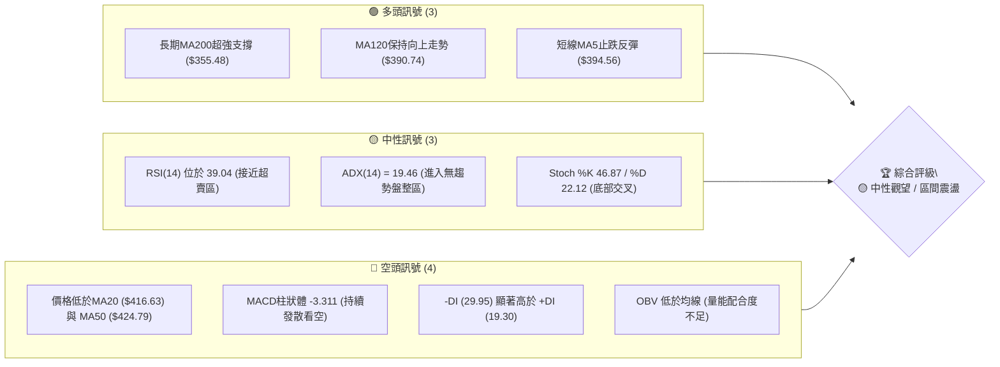

### 📊 核心指標速覽表

| 指標類別 | 指標名稱 | 當前數值 | 訊號 | 解讀 |
|----------|----------|----------|------|------|
| **價格** | 當前價格 | $403.31 | 🟡 | 位於52週高低區間 70.6% 位置，處於高檔拉回修正階段 |
| **均線** | MA20 | $416.63 | 🔴 | 價格低於MA20 (-3.20%)，短線偏弱 |
| **均線** | MA50 | $424.79 | 🔴 | 價格低於MA50，中期走勢承壓 |
| **均線** | MA200 | $355.48 | 🟢 | 價格遠高於MA200 (+13.45%)，超長期多頭格局未破 |
| **動能** | RSI(14) | 39.04 | 🟡 | 中性偏弱，無超買超賣，短線醞釀弱勢反彈 |
| **動能** | MACD | -9.781 | 🔴 | MACD線(-9.781)低於訊號線(-6.470)，柱狀體-3.311，空頭占優 |
| **趨勢** | ADX(14) | 19.46 | 🟡 | ADX < 25 進入盤整行情，-DI(29.95) > +DI(19.30) 主導短空 |
| **波動** | ATR(14) | $17.52 | 🟡 | 佔股價 4.34%，每日波動區間較大，需注意風控 |
| **通道** | 布林通道 | %B = 0.32 | 🟡 | 位於下軌($379.18)與中軌($416.63)之間，下軌存在支撐 |

### 🏆 技術評分卡

```
╔══════════════════════════════════════════════════════════════════╗
║                   技術評分卡 — TSM (2026-07-30)                  ║
╠══════════════════════════════════════════════════════════════════╣
║ 趨勢強度 (ADX)      ▓▓▓▓▓▓▓░░░░░░░░░░░░░  35/100  🟡 弱趨勢盤整   ║
║ 動能指標 (RSI/MACD) ▓▓▓▓▓▓▓▓░░░░░░░░░░░░  38/100  🔴 動能偏空     ║
║ 支撐穩定度 (Support)▓▓▓▓▓▓▓▓▓▓▓▓▓▓░░░░░░  70/100  🟢 關鍵支撐強   ║
║ 成交量配合 (Volume) ▓▓▓▓▓▓▓▓▓░░░░░░░░░░░  45/100  🟡 量能中性疲弱 ║
║ 形態完整度 (Pattern)▓▓▓▓▓▓▓▓▓▓░░░░░░░░░░  50/100  🟡 箱體整理中   ║
║ 均線排列 (MA System)▓▓▓▓▓▓▓▓░░░░░░░░░░░░  42/100  🔴 中短期糾結偏空║
╠══════════════════════════════════════════════════════════════════╣
║ 綜合技術評分        ▓▓▓▓▓▓▓▓▓░░░░░░░░░░░  46/100  🟡 中性觀望     ║
╚══════════════════════════════════════════════════════════════════╝
```

---

## 2. 趨勢分析

### 🌐 多時框趨勢分析

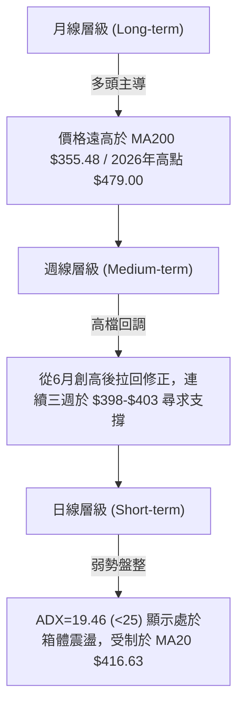

### 📈 長期趨勢 — 12個月走勢圖（Unicode）

```
TSM 12個月月線走勢示意圖 (2025-08 至 2026-07)
價格軸 ($)
$480 ┤                                        ● $477.57 (2026-06 高點)
$440 ┤                                       / \
$400 ┤                                 ●────●   ● $403.31 (現在)
$360 ┤                         ●──────/
$320 ┤                 ●──────/
$280 ┤         ●──────/
$240 ┤ ●──────/
$200 ┤
     └─┬──────┬──────┬──────┬──────┬──────┬──────┬──────┬──────┬──────┬──────┬──────┬───
      25-08  25-09  25-10  25-11  25-12  26-01  26-02  26-03  26-04  26-05  26-06  26-07
```

**走勢特徵分析表格**：

| 時間段 | 開盤/收盤區間 | 變動特徵 | 技術意義 |
|--------|---------------|----------|----------|
| **2025-08 至 2025-12** | $228.34 → $302.33 | 穩健震盪上揚，突破300關卡 | 長期上升趨勢奠定基礎，多頭掌控 |
| **2026-01 至 2026-02** | $328.86 → $372.65 | 主升段加速發動 | 強勢主升浪，成交量同步放大 |
| **2026-03** | $337.16 (低點$325.98) | 健康洗盤回調 | 守住斐波那契50%區間，打出中期次低點 |
| **2026-04 至 2026-06** | $395.13 → $477.57 | 強勢攻頂，創歷史新高 $479.00 | 完成波段極致推升，多頭消耗大量動能 |
| **2026-07 (最新)** | $403.31 | 高檔大幅回調 (-15.54%) | 獲利賣壓湧現，測試下方強支撐區 S1 ($385.09) |

### 📊 中期趨勢（週線分析）

從近20週數據觀測：
1. **高點回落**：價格自 2026-06-21 週收盤 $462.12 (盤中最高 $479.00) 見頂後，展開連續4週的修正，於 2026-07-19 週落至低點 $398.37。
2. **打底訊號**：近兩週（2026-07-26 週收 $403.41、2026-08-02 週收 $403.31）價格均在 $400-$403 區間縮量止跌，週RSI已從超買區(76.5)回落至 39.0，短線賣壓顯著宣洩。

### ⚡ 趨勢強度評估（ADX 解讀）

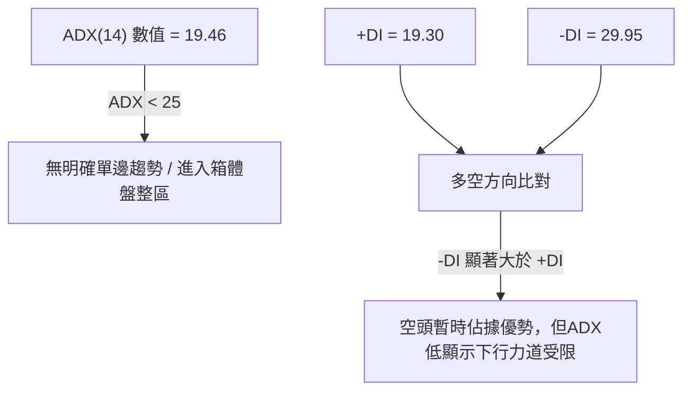

**ADX 趨勢強度對照解讀**：
- **ADX 19.46 (< 25)**：代表當前市場**並非強烈趨勢行情**，而是處於**區間震盪/盤整**階段。
- **交易指導原則**：依據多時框收斂規則（規則14），ADX < 25 時**不可以**使用追漲殺跌的趨勢跟隨策略，應以布林通道上下軌 ($379.18 ~ $454.08) 及關鍵支撐阻力做箱體區間操作。

---

## 3. 圖表形態分析

### 🔍 形態識別系統

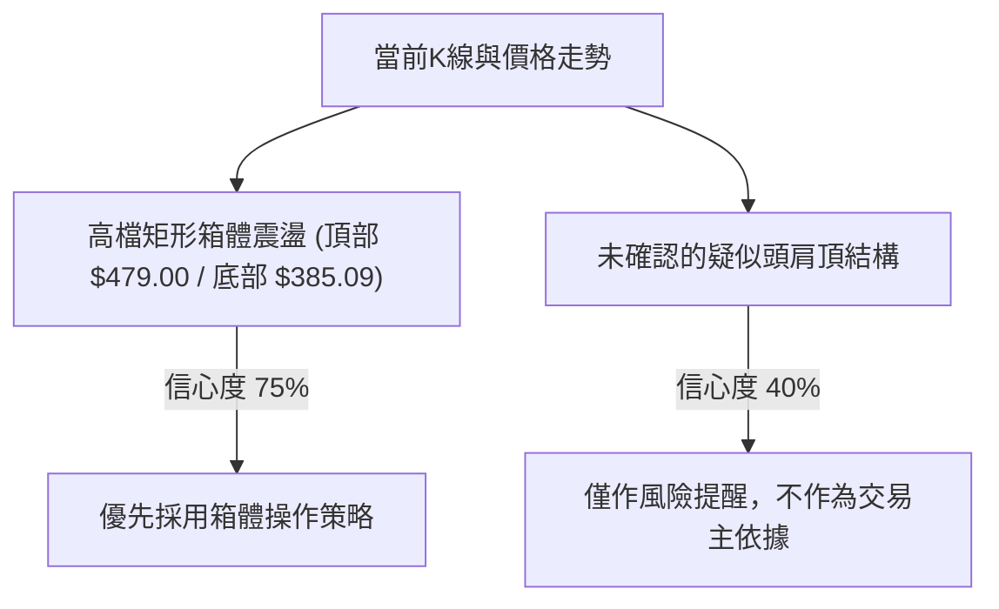

**形態信心度評估表**：

| 形態類型 | 信心度 | 判斷依據（引用數據） | 完成度 | 目標價（附計算式） |
|----------|--------|----------------------|--------|--------------------|
| **高檔矩形箱體** | **75%** | 頂部受制於 52W 高點 $479.00，底部獲 S1 ($385.09) 與 Fib 38.2% ($380.54) 強支撐 | 85% | 箱體上軌目標 $454.08 (布林上軌) / $479.00 |
| **頭肩頂疑慮** | **40%** | 左肩 $434.16、頭部 $479.00、右肩 $434.11，頸線位於 S1 $385.09（尚未跌破） | 50% | 若跌破頸線 $385.09，推算目標價 = $385.09 - ($479.00 - $385.09) = **$291.18** |

*註：由於頭肩頂信心度僅 40% 且頸線未破，本報告依規則15主打「箱體震盪」解讀。*

### 🕯️ 重要K線形態分析

| 週期/日期 | 收盤價 | K線形態 | 解讀 | 訊號 |
|-----------|--------|---------|------|------|
| **2026-06 月線** | $477.57 | 長上影大陽線 | 盤中衝高至 $479.00 後遭獲利調節，留下拉回陰影 | 🟡 警示 |
| **2026-07 月線** | $403.31 | 中陰線（包覆前高） | 單月拉回 -15.54%，回測 MA120 ($390.74) 附近 | 🔴 偏空 |
| **近兩週週線** | $403.31 | 十字星/小陽錘子線 | 在 $398-$403 區間連續兩週收十字星，賣壓收斂 | 🟢 止跌 |

### 📉 ASCII 走勢形態示意圖

```
TSM 箱體震盪與關鍵價位示意圖
$479.00 ───────────┐ 歷史高點 (52W High) / 箱體頂部
                   │
$454.08 ─ ─ ─ ─ ─ ─┼─ ─ ─ ─ ─ ─ 布林上軌 (BB Upper)
                   │  [頭部 $479.00]
$434.16 ───●───────┼───────●─── 右肩 / 阻力 R2 $420.98
          / \      │      / \
$416.63 ─ ─ ─ ─ ─ ─┼─ ─ ─ ─ ─ ─ 布林中軌 (MA20 $416.63) / 阻力 R1 $413.53
$403.31 ───────────┼───►【現價 $403.31】
                   │
$385.09 ───────────┴─── 頸線 / 關鍵支撐 S1 ($385.09) / Fib 38.2% ($380.54)
$379.18 ─ ─ ─ ─ ─ ─ ─ ─ ─ ─ ─ 布林下軌 (BB Lower)
```

---

## 4. 支撐與阻力

### 🗺️ 關鍵價位分布圖（Unicode）

```
TSM 價位結構分布圖 (現價: $403.31)
═══════════════════════════════════════════════════════════
$479.00 ║████████████████████████████████║ 52W High (0.0% Fib)
$449.11 ║████████████████████            ║ 強阻力 R3 (+11.36%)
$420.98 ║██████████████                  ║ 阻力 R2 (+4.38%)
$418.17 ║█████████████                   ║ 23.6% 斐波那契位
$413.53 ║████████████                    ║ 近期阻力 R1 (+2.53%)
$403.31 ╠════════════════════════════════╣ ◄ 當前價格 $403.31
$385.09 ║▓▓▓▓▓▓▓▓▓▓▓▓                    ║ 關鍵支撐 S1 (-4.52%)
$380.54 ║▓▓▓▓▓▓▓▓▓▓                      ║ 38.2% 斐波那契位
$359.71 ║████████████████████            ║ 強支撐 S2 (-10.81%)
$350.13 ║████████████                    ║ 50.0% 斐波那契位 (MA200 附近)
$330.21 ║████████████████████████████████║ 深度支撐 S3 (-18.12%)
═══════════════════════════════════════════════════════════
```

### 🚧 阻力位分析表

| 阻力級別 | 價位 | 形成原因（嚴格引用數據） | 突破難度 | 重要性 |
|----------|------|--------------------------|----------|--------|
| **R1** | **$413.53** | 近一年波段高點聚類、接近 MA20 ($416.63) | 🟡 中等 | 短線反彈第一關卡，需帶量突破 |
| **R2** | **$420.98** | 近一年波段高點聚類、MA50 ($424.79) 壓制 | 🔴 較高 | 中期多空分水嶺，與 Fib 23.6% ($418.17) 重疊 |
| **R3** | **$449.11** | 近一年波段高點聚類、接近布林通道上軌 ($454.08) | 🔴 極高 | 轉強為極度強勢多頭之解封關卡 |

### 🛡️ 支撐位分析表

| 支撐級別 | 價位 | 形成原因（嚴格引用數據） | 守住機率 | 重要性 |
|----------|------|--------------------------|----------|--------|
| **S1** | **$385.09** | 近一年波段低點聚類、緊鄰布林下軌 ($379.18) | 🟢 70% | 短線核心防線，離現價僅 -4.52% |
| **S2** | **$359.71** | 近一年波段低點聚類、接近 MA200 ($355.48) | 🟢 85% | 中長期鐵板支撐，強烈買盤防線 |
| **S3** | **$330.21** | 近一年波段低點聚類、接近 2026-03 低點 ($325.98) | 🟢 95% | 熊市風險防線，極難跌破 |

### 📐 斐波那契回調位分析

基於 52 週高低區間（高點 $479.00，低點 $221.25）：
- **0.0% (52W High)**: $479.00
- **23.6% 回調位**: **$418.17** —— 現價 $403.31 低於此位，受制於該回調位壓力（與 R1/R2 區間重疊）。
- **38.2% 回調位**: **$380.54** —— 當前價格下方的第一道黃金分割支撐，與 S1 ($385.09) 和布林下軌 ($379.18) 形成**三重強支撐共振帶** ($379.18 ~ $385.09)。
- **50.0% 回調位**: **$350.13** —— 與 MA200 ($355.48) 及 S2 ($359.71) 形成**中期防禦共振帶**。
- **61.8% 回調位**: $319.71
- **78.6% 回調位**: $276.41
- **100.0% (52W Low)**: $221.25

**現價位置解讀**：現價 $403.31 正處於 23.6% ($418.17) 與 38.2% ($380.54) 之間的**箱體腹地**，顯示技術面上處於回調落腳期，離下軌支撐區近，離上軌壓力區遠，具備良好風險報酬比。

---

## 5. 技術指標深度解讀

### 🎛️ 指標訊號總覽

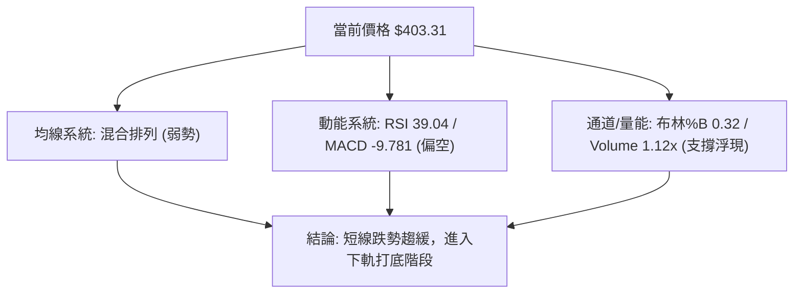

### 📈 移動平均線排列分析

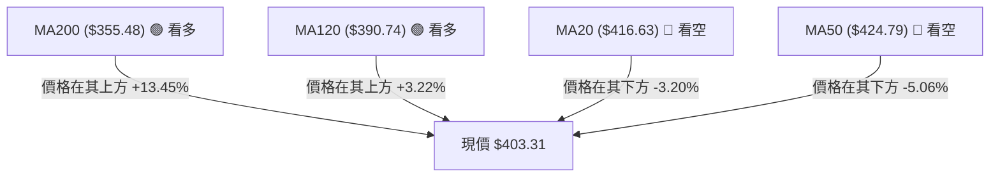

- **短均線 (MA5 $394.56 / MA10 $403.49)**：MA5 開始向上鉤頭 (+2.22%)，現價跨越 MA5，顯示最劇烈的下殺階段已過，極短線有反彈跡象。
- **中均線 (MA20 $416.63 / MA50 $424.79)**：雙雙彎頭向下，且價格位於其下，形成上方雙重動態壓力。
- **長均線 (MA120 $390.74 / MA200 $355.48)**：持續穩健向上，MA240 達 $339.20 (+18.90%)，確立長期牛市格局未改變。

### 📉 RSI(14) 分析

- **當前數值**：**39.04**
- **進度條**：`▓▓▓▓▓▓▓▓░░░░░░░░░░░░ 39.04%`
- **狀態**：位於中性偏弱區間 (30-70)，尚未進入 <30 的極度超賣區，但已相當接近。
- **背離分析**：**無明顯背離**。RSI 與價格同步從高點回落，未出現頂背離或底背離。短線 RSI 在 30-40 區間築底，預示下行空間有限。

### 📊 MACD(12/26/9) 訊號解讀

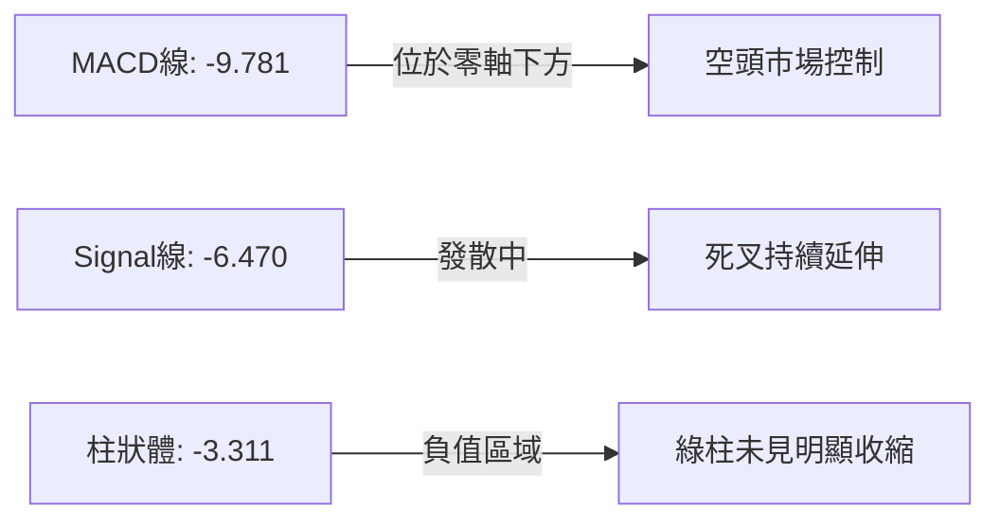

- **解讀**：MACD 線 (-9.781) 低於訊號線 (-6.470)，柱狀體為 -3.311 🔴看空。指標顯示中線修正賣壓仍在，但近一週柱狀體下跌斜率開始趨緩（從週線數據看，負值未再大幅擴大），正在尋求底部的拐點。

### 📦 布林通道分析

```
TSM 布林通道現狀示意圖
$454.08 ─────────────────────────── BB 上軌 (Upper Band)
                   
$416.63 ─── ─ ─ ─ ─ ─ ─ ─ ─ ─ ─ ─ ─ BB 中軌 (MA20)
            【現價 $403.31】(%B = 0.32)
$379.18 ─────────────────────────── BB 下軌 (Lower Band)
```

- **通道寬度**：上軌 $454.08，下軌 $379.18，通道寬度 $74.90。
- **%B 指標**：**0.32**（0代表下軌，0.5代表中軌，1代表上軌）。
- **分析**：價格落於下軌與中軌之間，%B = 0.32 顯示股價已接近下軌支撐區 ($379.18)。在 ADX < 25 的盤整格局下，布林下軌具備極高的均值回歸彈升機率。

### 💹 成交量分析（量價配合度）

- **最新成交量**：17,295,107 股
- **20日均量**：15,396,185 股 (量比: **1.12x**)
- **OBV 狀態**：OBV < MA → 量能表現相對疲弱。
- **解讀**：近期拉回過程中成交量並未出現恐慌性暴量（量比僅 1.12 倍），屬正常的獲利回吐與縮量震盪洗盤，符合箱體整理期「無量陰跌、遇支撐止跌」的典型量能特徵。

---

## 6. 動能與波動率

### ⚡ 動能評估四象限

| 象限區間 | 動能強度 (RSI/MACD) | 波動率 (ATR/Beta) | 當前 TSM 定位 | 交易戰術對策 |
|----------|---------------------|-------------------|---------------|--------------|
| **Q1 (高動能/低波動)** | 強 (RSI > 60) | 低 (ATR < 3%) | — | 趨勢加碼突破 |
| **Q2 (低動能/低波動)** | 弱 (RSI < 45) | 低 (ATR < 3%) | — | 沉悶觀望區間 |
| **Q3 (高動能/高波動)** | 強 (RSI > 60) | 高 (ATR > 4%) | — | 追漲高風險高收益 |
| **Q4 (低動能/高波動)** | **弱 (RSI = 39.04)**| **高 (ATR = 4.34%)**| **✓ 當前定位** | **區間低吸 / 嚴設止損** |

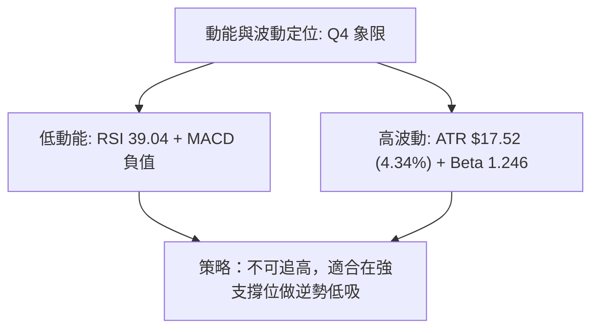

### 📊 ATR 波動率分析

- **ATR(14)**：**$17.52**
- **價格百分比**：**4.34%**
- **風控指引**：
  - **每日預期波動區間**：$403.31 ± $17.52 ($385.79 ~ $420.83)
  - **建議止損距離 (1.5x ATR)**：1.5 × $17.52 = **$26.28**
  - **建議止盈距離 (3.0x ATR)**：3.0 × $17.52 = **$52.56**

### 📐 Beta 與市場相關性

- **Beta 值**：**1.246**
- **解讀**：TSM 的波動度較整體大盤 (S&P 500) 高出 24.6%。在市場反彈時具備更強的彈性，但在市場下挫時亦承擔較大的Beta修正壓力。

---

## 7. 多時框架總結

### 📋 時框架評分表

| 時框架 | 趨勢方向 | 動能狀態 | 均線排列 | 形態結構 | 綜合評分 | 戰術建議 |
|--------|----------|----------|----------|----------|----------|----------|
| **月線 (Long)** | 🟢 超級多頭 | 🟢 強勁 | 🟢 多頭排列 | 🟢 上升通道 | **85/100** | 長線堅定持有 |
| **週線 (Medium)** | 🟡 高檔回調 | 🟡 中性降溫 | 🟡 震盪整理 | 🟡 大箱體 | **50/100** | 中線尋求築底點 |
| **日線 (Short)** | 🔴 短線偏弱 | 🔴 偏空 | 🔴 混合偏空 | 🟡 布林下軌區 | **38/100** | 短線等待止跌訊號 |

### 🔲 綜合訊號矩陣

```
時框架收斂訊號矩陣
────────────────────────────────────────────────────────────
長線 (月線)  : [🟢 多頭] ────┐
中線 (週線)  : [🟡 箱體] ────┼──► 收斂結果: 🟡 中性觀望 / 區間低吸
短線 (日線)  : [🔴 偏空] ────┘    (ADX = 19.46 主導為盤整行情)
────────────────────────────────────────────────────────────
```

### ⚖️ 多時框收斂結論

依據多時框收斂規則（規則14）：
1. **行情定性**：當前 ADX(14) = 19.46 (< 25)，確定為**盤整行情（Consolidation Market）**。
2. **主導時框與區間**：盤整行情以**日線布林通道**與**關鍵支撐阻力**為主要交易邊界。交易區間鎖定於布林下軌與 S1 重疊區 (**$379.18 ~ $385.09**) 至布林中軌與 R1/R2 重疊區 (**$413.53 ~ $420.98**)。
3. **方向性收斂**：長線牛市未破，短線殺跌動能竭盡，最終結論為 **🟡 中性觀望，偏向逢低尋求買點（區間低吸策略）**。

---

## 8. 交易策略建議

### 🗺️ 策略決策流程圖

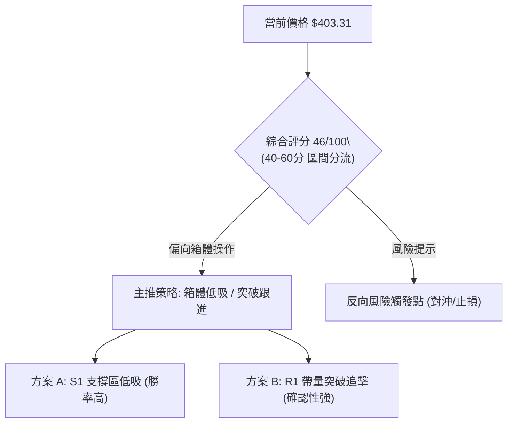

### 🧭 策略路由

**當前主策略方向 = 🟡 區間低吸 / 箱體震盪操作（依評分 46/100）**

由於綜合評分為 46/100（處於 40–60 中性區間），且 ADX < 25，市場明確處於箱體整理。策略以「靠近箱體下軌/S1 支撐低吸」為主，「突破 R1 追擊」為輔。

### 🎯 價格情境階梯（Price Scenarios）

| 觸發條件 | 下一目標 | 後續延伸 | 情境含義 |
|----------|----------|----------|----------|
| **突破 R1 $413.53** | R2 $420.98 | R3 $449.11 | 短線轉強，重回 MA20/MA50 上方 |
| **站穩現價區間 ($398-$403)** | R1 $413.53 | — | 區間震盪打底，蓄積反彈動能 |
| **跌破 S1 $385.09** | S2 $359.71 | S3 $330.21 | 中期回調加深，考驗 MA200 鐵板區 |

### 📊 情境機率分佈

| 情境 | 機率 | 主要依據（引用指標） |
|------|------|----------------------|
| **箱體反彈 / 向上測試壓力** | **55%** | RSI(39.04) 接近超賣、MA5 向上鉤頭、長線 MA200 強勢支撐 |
| **區間橫盤震盪 ($385-$413)** | **30%** | ADX(19.46) 無趨勢、成交量量比 1.12x 縮量洗盤 |
| **向下跌破 S1 再探底** | **15%** | MACD 柱狀體 (-3.311) 仍為負值、-DI (29.95) 主導短空 |

### 🟢 主策略詳情

| 策略要素 | 策略 A（箱體低吸 - 保守型） | 策略 B（突破跟進 - 積極型） |
|----------|----------------------------|----------------------------|
| **策略類型** | 支撐區低吸 (Range Low Buy) | 阻力突破追擊 (Breakout Buy) |
| **進場條件** | 價格拉回至 S1 附近出現止跌 K 線 | 帶量突破 R1 阻力位並收高 |
| **進場價格** | **$385.09** (S1 支撐位) | **$414.00** (突破 R1 $413.53 後) |
| **目標價 T1** | **$413.53** (R1 阻力位) | **$420.98** (R2 阻力位 / MA50) |
| **目標價 T2** | **$420.98** (R2 阻力位) | **$449.11** (R3 強阻力位) |
| **止損價格** | **$375.00** (跌破布林下軌 $379.18) | **$403.00** (回跌至現價區間) |
| **風險報酬比** | **2.82 : 1** 判算：($413.53-$385.09)/($385.09-$375.00) | **3.19 : 1** 判算：($449.11-$414.00)/($414.00-$403.00) |
| **成功機率** | **65%** | **55%** |
| **建議倉位** | **15% - 20%** | **10% - 15%** |

### 🔴 反向風險觸發點（對沖/防禦提示）

- **多頭失效/停損觸發條件**：若日線收盤價**強勢跌破 S1 ($385.09)** 且成交量放大至 20日均量的 1.5 倍以上，代表箱體支撐失效，應立即出局觀望，下一個接盤點看向 S2 ($359.71) 與 MA200 ($355.48) 區間。
- **空頭平倉/轉強觸發條件**：若股價收復 **R2 ($420.98)** 與 MA50，空頭結構徹底化解，行情將回歸強勢多頭軌道。

### ⭐ 整體訊號強度評星

```
做多訊號強度：★★★☆☆  (3/5星) - 靠近箱體下軌，具備低吸吸引力
做空訊號強度：★★☆☆☆  (2/5星) - ADX低，向下空間受限於強支撐
整體可信度：  ★★★☆☆  (3/5星) - 數據完整，指標收斂一致
```

---

## 9. 風險提示與監控

### ✅ 關鍵監控指標 Checklist

```
╔══════════════════════════════════════════════════════════════════╗
║                   TSM 每日交易風險監控清單                      ║
╠══════════════════════════════════════════════════════════════════╣
║ [ ] 價格防線：是否守住 S1 ($385.09) 與 38.2% Fib ($380.54)        ║
║ [ ] 均線動態：價格是否帶量攻克 MA20 ($416.63)                     ║
║ [ ] 動能轉向：RSI(14) 是否站回 50 中性分水嶺                     ║
║ [ ] 指標拐點：MACD 柱狀體 (-3.311) 是否開始收縮（綠柱變短）        ║
║ [ ] 趨勢強度：ADX(14) 是否升破 25（代表新一輪單邊趨勢啟動）        ║
║ [ ] 波動變化：ATR ($17.52) 是否異常放大（超過 $22.00 需減倉）     ║
╚══════════════════════════════════════════════════════════════════╝
```

### ⚠️ 風險場景分析

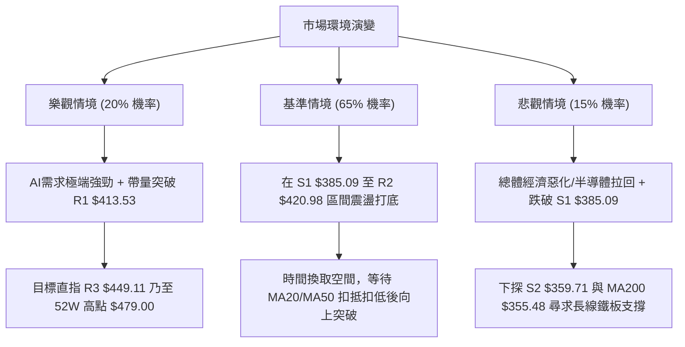

### 🛡️ 風險管理重要提醒

1. **波動度管理**：TSM 當前 ATR 為 **$17.52** (4.34%)，單日波幅較大。建議單筆交易承受風險不超過總資金的 1.5% - 2.0%。
2. **槓桿控制**：在 ADX < 25 的盤整市況中，切忌使用高倍槓桿追漲，避免在布林通道上下軌之間被雙向套牢。
3. **資金分批**：建議採用 3-3-4 分批建倉法（S1 附近建立 30% 底倉，突破 R1 追加 30%，回測確認站穩後補足剩餘 40%）。

---

## 📋 報告總結

```
╔══════════════════════════════════════════════════════════════════╗
║                    TSM 技術分析報告總結                          ║
════════════════════════════════════════════════════════════════════
報告日期：2026-07-30
當前價格：$403.31
分析評級：🟡 中性觀望 / 箱體低吸 (技術評分 46/100)

關鍵結論：
├─ 長期趨勢：🟢 強勢多頭 (價格高於 MA200 $355.48 達 +13.45%)
├─ 中期趨勢：🟡 高檔修正 (從 $479.00 回調至 $385-$420 箱體區間)
├─ 短期趨勢：🟡 止跌盤整 (ADX 19.46 無趨勢，近兩週於 $400-$403 築底)
├─ 關鍵支撐：S1 $385.09 / S2 $359.71 / Fib 38.2% $380.54
├─ 關鍵阻力：R1 $413.53 / R2 $420.98 / R3 $449.11
└─ 分析師目標：$540.20 (平均) / $430.00 (最低) / $700.00 (最高)

最優策略組合：
1. 🥇 最佳機會：策略 A (S1 $385.09 附近低吸，止損 $375.00，目標 $413.53 / $420.98)
2. 🥈 次選機會：策略 B (帶量突破 R1 $413.53 後追擊，目標 $449.11)
3. 🥉 保守選擇：等待股價重新收復 MA20 ($416.63) 且 MACD 柱狀體轉正後右側進場
════════════════════════════════════════════════════════════════════
```

---

> ⚠️ **免責聲明**：本報告為 AI 自動生成之技術分析，所有數據及估算均基於提供的歷史價格資訊。本報告**僅供研究與學術參考**，**不構成任何投資建議**。投資有風險，入市需謹慎。

---

*報告生成時間：2026-07-30 ｜ 數據來源：Yahoo Finance ｜ 分析框架：多時框技術分析*