<details markdown="1">
<summary>📊 靜態圖表 (點擊展開)</summary>

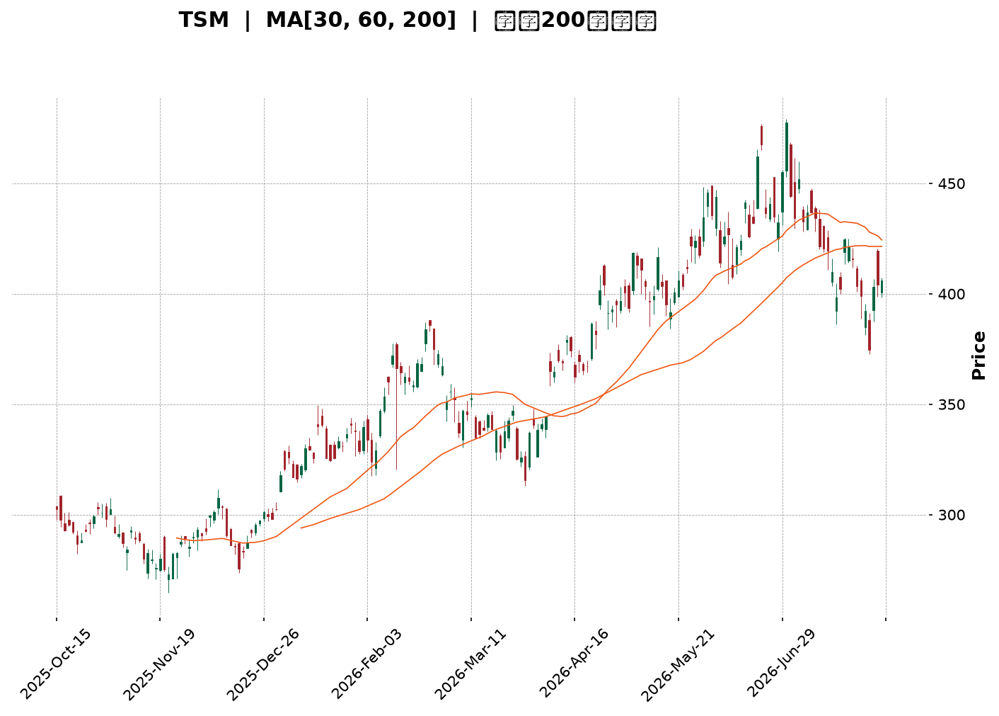

</details>

<html>
<head><meta charset="utf-8" /></head>
<body>
    <div style="height:500px; width:100%;">                        <script>window.PlotlyConfig = {MathJaxConfig: 'local'};</script>
        <script charset="utf-8" src="https://cdn.plot.ly/plotly-3.7.0.min.js" integrity="sha256-jvTGqxNp8AGWEcvNLVuKr+8j5dGe9Yw51LQkmDH+IYA=" crossorigin="anonymous"></script>                <div id="candlestick-chart" class="plotly-graph-div" style="height:100%; width:100%;"></div>            <script>                window.PLOTLYENV=window.PLOTLYENV || {};                                if (document.getElementById("candlestick-chart")) {                    Plotly.newPlot(                        "candlestick-chart",                        [{"close":{"dtype":"f8","bdata":"AAAAQD7lckAAAADA7pdyQAAAACBeTHJAAAAAAPZ1ckAAAADgUUNyQAAAAKDx6XFAAAAA4E8HckAAAACAdkpyQAAAACCxfnJAAAAA4MKyckAAAACgRutyQAAAAOCWzXJAAAAAgEyhckAAAADgn+dyQAAAAGAEPHJAAAAAIII1ckAAAACAqO9xQAAAAEApxHFAAAAAYGJPckAAAAAgTA5yQAAAAOCQBXJAAAAAYOZ\u002fcUAAAADAfalxQAAAAADifHFAAAAA4Ms7cUAAAAAgmYJxQAAAAIBJNXFAAAAAgI0OcUAAAABgoqZxQAAAAMBEp3FAAAAAoBb7cUAAAADAsRNyQAAAAMDk1nFAAAAA4OYcckAAAAAAPlJyQAAAAMA8KnJAAAAAQKdGckAAAACgKLhyQAAAAECb0HJAAAAA4HE7c0AAAADgh\u002fRyQAAAAOCfKHJAAAAAgC3kcUAAAABAVNZxQAAAAICVOHFAAAAAIHizcUAAAABAcPdxQAAAAKBcPHJAAAAA4Md2ckAAAABgOpRyQAAAACCJ1HJAAAAAYPm1ckAAAADApKByQAAAAABA5XJAAAAAAHrfc0AAAADgfwl0QAAAACD0W3RAAAAAYKzQc0AAAAAgAsZzQAAAAGB3H3RAAAAAgAmhdEAAAABgH5h0QAAAACDcVnRAAAAAQCU+dUAAAAAgPkp1QAAAAOCnV3RAAAAAABpHdEAAAACg\u002f1p0QAAAAMBh0nRAAAAA4P+vdEAAAADgnQl1QAAAAKCmSHVAAAAAgOAcdUAAAADAxo10QAAAACCwOXVAAAAAwGPgdEAAAACADUF0QAAAAIB7kHRAAAAAoOmwdUAAAABAVRl2QAAAAGDMgHZAAAAAQK1Cd0AAAABAVON2QAAAAOChx3ZAAAAAIECldkAAAACgXoZ2QAAAAICaaHZAAAAAQCsKd0AAAADANQJ3QAAAACBH\u002fHdAAAAAgMsbeEAAAAAg+W13QAAAAOB5SndAAAAA4GfzdkAAAABgCvV1QAAAAGClOXZAAAAAAKkAdkAAAAAgXxJ1QAAAAGCGrnVAAAAAoOWUdUAAAACAzQt2QAAAAKCr73RAAAAAgCMJdUAAAACgsyd1QAAAACC\u002fknVAAAAAIG0sdUAAAADA+R91QAAAAECIh3RAAAAAYIwadUAAAAAgK2d1QAAAACAAr3VAAAAAoJFVdEAAAAAgoF90QAAAACArvHNAAAAAIJESdUAAAAAAE0t1QAAAAGD3I3VAAAAAYGJPdUAAAAAgNoh1QAAAAMC40HZAAAAAYC3KdkAAAAAAvxt3QAAAAABOC3dAAAAAAAqwd0AAAAAAlGN3QAAAAGAEqHZAAAAAYCYad0AAAAAgJtZ2QAAAACCF83ZAAAAAgI4oeEAAAABgQdx3QAAAAKBQGHlAAAAAgIpAeUAAAAAAxnZ4QAAAAMCOjnhAAAAAgCeyeEAAAADA2st4QAAAACC\u002fCnlAAAAAANGXeEAAAACAUSh6QAAAAADr0nlAAAAAgH2reUAAAACAhDl5QAAAAAChxXhAAAAAwNrteEAAAACg5wt6QAAAACB8NnlAAAAAIGaweEAAAABAFXt4QAAAACDoCnlAAAAAAC5jeUAAAADAMjl5QAAAAOC0tXlAAAAAoOBbekAAAACg4H16QAAAAMCOF3pAAAAAoMspe0AAAACAV9p7QAAAAEC3OntAAAAAoBa+e0AAAABAM+N5QAAAAGDYnHpAAAAAQLmuekAAAABguHx5QAAAAMAeUXpAAAAAQOF+ekAAAABgZpZ7QAAAAKBHnXpAAAAAYGYCe0AAAACA6+F8QAAAAGC4On1AAAAAgD1Ge0AAAACgR417QAAAAADXL3tAAAAAoJkFe0AAAACgmXF8QAAAAMAe2X1AAAAAIK7De0AAAABgjyJ7QAAAAOCjPHxAAAAAwB4Je0AAAAAgrk97QAAAACBcT3tAAAAAgMIhe0AAAACgR1l6QAAAAIA9RnpAAAAAIK43ekAAAAAA15t5QAAAAIDr5XhAAAAAwMwkeUAAAACAwol6QAAAACBcU3pAAAAAoEf5eUAAAABgjzZ5QAAAAKBw8XhAAAAAwPWEeEAAAABguGp3QAAAAMD1NHlAAAAAAABEeUAAAACAwmF5QA=="},"high":{"dtype":"f8","bdata":"0AnUx2cDc0Cph2Nl+E5zQCxdQQTcznJAtiO0lmrUckC57UC+eJByQE5y5PxFTnJAJMGdxqY8ckBLi9Tf7XlyQFkrl9YXonJAuuspSUm8ckCGcto31hhzQEeA2oWEDnNANs7QVGQUc0BOgJ1uIDtzQHkmqlwQunJA\u002fYU4FTd+ckBfF2cSYkVyQFnCnTw62nFAQs2vb+lsckAcbowJ1ElyQF4omcYISXJAH6KfW8nzcUCPBhss4MlxQPiv1yCjxHFAecXZvP1fcUB2eJWQNKVxQCWNtJD3KHJAiTGdwS1IcUBsff0sTa1xQJzMYtGysnFAA3uw+1QockD90zD6GyZyQMd\u002f4G4jDnJADR69EilDckDbXo7I0GRyQN86RSazO3JAbzanLCynckARgIabEMRyQCB0vnTE5HJAHbAaiGd4c0AiGJgISgRzQCzPJzN163JAO7wsknlkckBwqexmo+9xQCap9mzT+XFAK5RaCvLacUCs3laWsSpyQAQpQFTmV3JARgBSyg+GckB1I8Br9ZlyQNKVrKEh3XJAnwI9ovXuckA1iJ0+we9yQI3aYlH2HHNAkLf9cP7+c0BKLFlnwph0QE6\u002fHY7jtXRA3r5SdfdJdECUYb9+UC10QO7PNcCcMXRAUnMY5169dEBnBxjxDet0QKG5RTuignRAc0NlYWPYdUAPrU6J1MB1QObexExDRnVAbrIjsM2+dEAytaExP9V0QKI4QqCs9nRARKdkDwvWdEBq1gv97zd1QH4ME4KWe3VAzbOhipJfdUBWLXq\u002fciJ1QO5VEhblZnVAvqd8nEKUdUBkHWBP8BB1QOIexkibzXRAWZZRz8K+dUC6C6tKB1x2QEkbSQAqrnZAO6ibrBCad0DJIx0awKB3QFc2uOA9E3dAyCtlBRbFdkBnLsoF3fd2QFazyAP3jnZAUAG0rZckd0AhtTfCKzh3QFiQjCrgMnhAnN9kSkVDeED2xhYjvQd4QM+ZR0rna3dA92EyAOsyd0DDi1wAaCJ2QJke6+i+c3ZA5qa2hfVZdkCPBazO1651QEL7jsOquXVA9DczDu76dUActqqjNjh2QITGDLC2kXVAui+54\u002fxrdUAkMSJfvW11QCz7FIkyn3VA84wJbjGydUBtZrSgsTF1QOnnIN\u002f6DHVAgu7CCLlpdUDd4KYGMIF1QBi1XokZ2nVAvVwc3dBBdUAQRETjo4x0QCXWWWJHjXRAk9QT2egZdUB9amNx2L11QC3vAEFVVHVA2v84RlV2dUBcJY09kIt1QJbx6LzOVndA9zhfGvX0dkDcs7GO3pF3QFphvEl5KXdALfXHJkbUd0BleuyoZtF3QP5EFHJcFXdA31+mYj1rd0DCTeA4SRN3QHJeuvIjHndAieaMIA8weEB52bOfoD14QH30QDmIiHlACcn9RIHYeUA0ijH0C894QGlUN2vNrnhA4\u002fnEf7vdeEAoNeDkvDB5QNQ8DJj1a3lAE\u002fbp9+VSeUCLCADWgit6QOFqGaRMMHpA06x\u002fVmkAekDUduU4cGx5QD9VuKjNFHlA1pSljMA7eUAzqAz0vk96QPjZ6yyZjnlA9Gg3x95eeUAqARE\u002fK994QLV+V3\u002f7LnlAN8v8gPqneUAFdXFlXpt5QLtT8jdF+HlAKXjOabTYekAU6zmHnal6QFbG+AHz1npA20Tr8XAFfECpQrOTUfV7QAVmjHi7EXxAlM\u002f+rWnve0DCqqUBLg57QOAHdkq+DHtA4+BEQS5Se0BmKCD8LpV6QAAAAAAAZHpAAAAAQAqvekAAAACgR6l7QAAAAKBHhXtAAAAAAACoe0AAAAAghRN9QAAAAOCjzH1AAAAAoEf1e0AAAACAwr17QAAAAGBmTnxAAAAAgBRCe0AAAACgmYF8QAAAAAAA8H1AAAAAAClIfUAAAAAghdd8QAAAAOB6wHxAAAAAwMx8e0AAAAAA14d7QAAAAEAK+3tAAAAAYI96e0AAAAAA1197QAAAAMD18HpAAAAAgD3OekAAAABAM\u002f95QAAAAEAzS3lAAAAAgD2eeUAAAABgZpZ6QAAAAMD1jHpAAAAAoHBNekAAAABguM55QAAAAEDhdnlAAAAAgMK1eEAAAAAAAHR4QAAAAOBRbHlAAAAAoJlFekAAAABACnd5QA=="},"hovertemplate":"\u003cb\u003e%{x|%Y-%m-%d}\u003c\u002fb\u003e\u003cbr\u003e\u958b: $%{open:.2f}\u003cbr\u003e\u9ad8: $%{high:.2f}\u003cbr\u003e\u4f4e: $%{low:.2f}\u003cbr\u003e\u6536: $%{close:.2f}\u003cextra\u003e\u003c\u002fextra\u003e","low":{"dtype":"f8","bdata":"6J6kdpWbckBmGJA\u002f7WVyQMaWdv\u002fTSXJAxRDF\u002fsxrckDwF0d40zVyQI2a6PbSonFAAl\u002fsedn1cUB2faogakFyQECxaGZNNnJAMycTJz5cckA51XBIQcByQL7xW1t9p3JAPTRWlsRlckChP1meILxyQKxlr+pxM3JAPPXcJ4kTckBiUjqQIdJxQDiqg89pL3FA6cuvOIEXckA94od\u002fa+pxQP5L900O9XFAU\u002fhrk\u002flccUC7CatHgPFwQK6V5oXMWXFAm0oA02fpcEDRY1gdjiJxQJQ6ycf7I3FA5qCLXr6LcECux+zK3fBwQAJTj5ke73BA7lpZCbDXcUBYWUYh2etxQMpO7oidj3FAnppFsLTucUBfo6vgVb1xQJ62FCzm\u002fnFA1zX6MlEvckBrwXkrZ2ZyQF0KxRupgnJAwEQOCCnCckCuYHpumaFyQOsWonDAF3JA1Gf7PyfhcUDF4jA80p1xQCv1CpSoGnFADTvBjtSEcUAKcqCah85xQImUIXRpG3JAKO4p3ysrckDXYH3aUWtyQNEbR1LFj3JAB7LnKdeRckAkRHwck55yQGluNG\u002ft3XJAhKrCRZFhc0D65g2qj\u002f1zQOpyx0m\u002fLnRApLtr8nHOc0AnIy7+PahzQBlsziLUyXNAeUAZ1472c0AyVmctR5F0QKJ0gZVoMnRA5\u002fpecO4CdUA8kP+pRzt1QOS5TFmEU3RAt2dRAxlAdEAKaANlhFN0QN1ZxW6rmnRAZaJ2FYaIdED1waOTcs10QP56FOG1DnVAmObu8DVodEDRNGhciXZ0QLh2clmJdnRAMQD\u002fQC6FdEA7mruq4dZzQH7UfwId4HNAFj\u002fCNbfudEAFHe\u002fUMqB1QED9N7XuKHZAnygbH\u002fLndkD82aCoHAd0QG+USu6mbnZAmCz3cosmdkDD7p1hsm12QAGArlqlOXZAYu\u002ff1RFUdkDEVu9dOcl2QE8q0RTgYXdA\u002fQJkDaLtd0C4zQdOzPx2QPjyoDib63ZA91yppGmsdkCwWhKi8GV1QENFSrekC3ZAXvHACIdgdUCz6acwWu90QAKgK8Fso3RAlxtoRqVodUAaMlar8sh1QGfFa\u002fJq6nRAEVXg397ndEDHfKHhLCF1QMFDRuq\u002fGXVAkYR\u002fM8EodUCJXvJF4kZ0QIlNhpY3UnRApuhqFjmldEDOZZlU1dN0QG3f3ssoa3VAOBXrtMFJdEAx8whF6Rh0QHKWv7YRkXNAg6NtPjwGdEAueMKmTC91QJFDB2KVYHRAbt297EIddUCs2iFK2u10QAekTBxpZnZAB721JQl+dkAc22+CLQ53QNlUrq8d03ZAdTvJdJFFd0DrkCQocjV3QA9QzUtSe3ZAYydQK5fEdkC\u002fREIrYrZ2QHh4NmwcxHZAatoPhmIcd0A1kbVN6W53QL1ti4XgjnhAY\u002fCTlG73eEDw0gG90fx3QMEmv3FeNHhA1TNk7PAMeEDRkk3ka3N4QIvSyTdtpHhAu64ykux6eEAKIK9DbPt4QK8BY+2AcnlAKNTrGhj\u002feEBMzrakJ9R4QPyab2x8E3hAlLVX1+JoeEBR+\u002feakRJ5QLVJJ\u002fNe3nhATGFMhC5ieECy\u002fLrAkAJ4QJVniiJmsHhAn4wbvTnpeEB2\u002fbxCsx55QJQYSGjKkXlAnnDPVo3meUBvaHVi29t5QFmP4vtmBHpAG3GoxjRYekDqya103C97QFYVros8GHtAhhBKntOkekD4xb6GNb15QK+D31yvWHpAK7bIVQBJeUCj5k+s9Wt5QAAAAIDCjXlAAAAAIFwTekAAAABA4f56QAAAAEAzk3pAAAAAgD36ekAAAACAPWZ7QAAAAGC4En1AAAAAQAoje0AAAACgRwl7QAAAAEAKB3tAAAAAQAozekAAAACgcPF6QAAAAAAAUHxAAAAAIIW3e0AAAAAAANh6QAAAAKCZ2XtAAAAAgMLBekAAAAAAAMx6QAAAAIA9RntAAAAAoJnBekAAAADgo0R6QAAAAIDCLXpAAAAAAACseUAAAAAAADh5QAAAAOBRIHhAAAAAoEcBeUAAAADA9dh5QAAAACBc43lAAAAAwMy8eUAAAADAzAx5QAAAAMDMTHhAAAAAwMzUd0AAAAAghUt3QAAAAKCZOXhAAAAAwMzseEAAAACgM+N4QA=="},"name":"\u50f9\u683c","open":{"dtype":"f8","bdata":"\u002f3UAZ1P+ckBnQoQ8\u002fEdzQLJogo4SgXJAwuTzGHmackByLnEXmYpyQCTTezBZK3JAzmBkSIz4cUBsFBiXJVRyQNa847AKhXJAHqlvi81\u002fckARGIIDjPZyQNIv2ttdy3JALdBhM5D5ckAnVkuxlsNyQOWDzn\u002fxaHJAXY8hylAlckBzl2l9zzxyQMXTh6+ur3FAnaMpJPBAckA17+v\u002fbBxyQGZTF\u002f51NnJATM7PTIzucUBRluK0CxxxQGPQ9IDVc3FAo6NdxxQ2cUDYUoqGFCxxQP8Fi4\u002fOHnJAdnhBjdXqcECux+zK3fBwQO63ERJQiHFAlOQlqm\u002ftcUBQ1djPFyNyQJjvTjbUynFAZbnKIXkbckBFWWi3VB5yQBqcEADoOnJA\u002fZfaSMRbckB5SX\u002fUha1yQIGf9mRQmnJAimIhoLjvckCyev8aA\u002fxyQCzPJzN163JAm34x4SBackBqRxGKidxxQIS08azA8HFAiGBeI5C4cUAKcqCah85xQJDmodx8UnJAJvUavEU+ckBDF7HwWoNyQJap3sS8pXJAQ08\u002fxanDckBF5HAZ5cxyQBkCQS8A53JA0Gm+QAZmc0B+SGCsOot0QGeXn0NdiHRAJnfLZQUwdEDJGoFPkCt0QJrern\u002f64nNA8aY00hwHdECQZ5LNi7J0QKG5RTuignRAZ+GO3sRQdUAF77M5qot1QBtKSm6dMHVABFkE3HW7dED2KS0iTbt0QJqjJvLPpXRAdrHC8EWxdEDmUFb8U+x0QEmhumFFVHVA6+ypPNsgdUAknaoPI9t0QLrMFsf1kHRAVgVIS750dUDcOiGNAN50QOMEEqaSEnRAc\u002f3N8D78dEBpiA3feq91QIUR1q1Rp3ZA71tIq9gCd0B7z4Qn1ZB3QCS6vgML9HZAiawqbSmAdkD3HiVx1p92QPLG8TrwXXZAA5gsxeRedkCYyLKp+tF2QME1cS4zl3dAnN9kSkVDeEAbJQpeHwN4QP5qrDjNA3dAyHk80ra3dkCNl+n9Dbx1QEIz8pV8OXZApSgK+zYRdkDBHiKTwFt1QC9lbYgA3nRAOh+pEt2qdUDJI1FDxgF2QF+X96VugnVADAU\u002fBXBidUA0XvoG8Dd1QH+gdxzePHVALWpM0o2PdUChBhCVNod0QEVwCE1L\u002fnRApuhqFjmldEDLyzVfk+x0QEunPd8Qk3VA20aEq2owdUDg8lAHI0F0QKjyFfr3ZnRADSodTOkYdECLccpPi3F1QNCYA+A4YXRAsuhVnEwvdUCdBynlWSp1QJuN7jzMFndAE9UnFTindkBlX\u002fs+Zmt3QP7gkKVRFndAqHZrgniid0DYOV1dTch3QPlbB4X4\u002f3ZAqUtMyT9Fd0BMYUy7twV3QAAAACCF83ZAFfQ6\u002fZQud0BhLLLIovV3QLSsRHtus3hApFVqcojMeUCku\u002fn6QnN4QNSA1k3ff3hA4aGwwBbOeEAhkPoaVYh4QPDCyKYyOXlAGSIpvHk6eUC+Z3KEWxd5QNNfaIvPEXpAqcb2EJ3\u002feUDag1KSolx5QJMxkKAhzXhAR1xKhG7VeECw56V7SSR5QLMB3ezNWHlA9Gg3x95eeUBc8KJqmUl4QGGOPdYowXhAn4wbvTnpeEBds0ojk4d5QG6IG\u002fh5wnlAhRH3UVugekDns7GDvFN6QOKIDcInoXpAR2n7fzJ+ekA+F8tYz3h7QCQxDrkED3xAF4hFgPvZekBROrIHQcx6QCs+En96bHpAtn9hDPndekDtCE6k4s95QAAAAAAp1HlAAAAAwMxAekAAAABA4Wp7QAAAAOBRQHtAAAAAAAAse0AAAACAFG57QAAAAKBwwX1AAAAAQOFye0AAAAAgrh97QAAAAGBmTnxAAAAAAACQekAAAAAAAFB7QAAAAIDCeXxAAAAAYLg6fUAAAADgoyh8QAAAAOB6\u002fHtAAAAA4FFge0AAAAAAANB6QAAAACCu63tAAAAAYLhqe0AAAADAHh17QAAAAIDr7XpAAAAAAACcekAAAADgo1R5QAAAAIDrgXhAAAAAIFx7eUAAAAAA1yt6QAAAAGCP7nlAAAAAoHD9eUAAAACgmbV5QAAAAKBHYXlAAAAAAAAQeEAAAACgR0F4QAAAAADXh3hAAAAAAAA4ekAAAAAgXAl5QA=="},"x":["2025-10-15T00:00:00-04:00","2025-10-16T00:00:00-04:00","2025-10-17T00:00:00-04:00","2025-10-20T00:00:00-04:00","2025-10-21T00:00:00-04:00","2025-10-22T00:00:00-04:00","2025-10-23T00:00:00-04:00","2025-10-24T00:00:00-04:00","2025-10-27T00:00:00-04:00","2025-10-28T00:00:00-04:00","2025-10-29T00:00:00-04:00","2025-10-30T00:00:00-04:00","2025-10-31T00:00:00-04:00","2025-11-03T00:00:00-05:00","2025-11-04T00:00:00-05:00","2025-11-05T00:00:00-05:00","2025-11-06T00:00:00-05:00","2025-11-07T00:00:00-05:00","2025-11-10T00:00:00-05:00","2025-11-11T00:00:00-05:00","2025-11-12T00:00:00-05:00","2025-11-13T00:00:00-05:00","2025-11-14T00:00:00-05:00","2025-11-17T00:00:00-05:00","2025-11-18T00:00:00-05:00","2025-11-19T00:00:00-05:00","2025-11-20T00:00:00-05:00","2025-11-21T00:00:00-05:00","2025-11-24T00:00:00-05:00","2025-11-25T00:00:00-05:00","2025-11-26T00:00:00-05:00","2025-11-28T00:00:00-05:00","2025-12-01T00:00:00-05:00","2025-12-02T00:00:00-05:00","2025-12-03T00:00:00-05:00","2025-12-04T00:00:00-05:00","2025-12-05T00:00:00-05:00","2025-12-08T00:00:00-05:00","2025-12-09T00:00:00-05:00","2025-12-10T00:00:00-05:00","2025-12-11T00:00:00-05:00","2025-12-12T00:00:00-05:00","2025-12-15T00:00:00-05:00","2025-12-16T00:00:00-05:00","2025-12-17T00:00:00-05:00","2025-12-18T00:00:00-05:00","2025-12-19T00:00:00-05:00","2025-12-22T00:00:00-05:00","2025-12-23T00:00:00-05:00","2025-12-24T00:00:00-05:00","2025-12-26T00:00:00-05:00","2025-12-29T00:00:00-05:00","2025-12-30T00:00:00-05:00","2025-12-31T00:00:00-05:00","2026-01-02T00:00:00-05:00","2026-01-05T00:00:00-05:00","2026-01-06T00:00:00-05:00","2026-01-07T00:00:00-05:00","2026-01-08T00:00:00-05:00","2026-01-09T00:00:00-05:00","2026-01-12T00:00:00-05:00","2026-01-13T00:00:00-05:00","2026-01-14T00:00:00-05:00","2026-01-15T00:00:00-05:00","2026-01-16T00:00:00-05:00","2026-01-20T00:00:00-05:00","2026-01-21T00:00:00-05:00","2026-01-22T00:00:00-05:00","2026-01-23T00:00:00-05:00","2026-01-26T00:00:00-05:00","2026-01-27T00:00:00-05:00","2026-01-28T00:00:00-05:00","2026-01-29T00:00:00-05:00","2026-01-30T00:00:00-05:00","2026-02-02T00:00:00-05:00","2026-02-03T00:00:00-05:00","2026-02-04T00:00:00-05:00","2026-02-05T00:00:00-05:00","2026-02-06T00:00:00-05:00","2026-02-09T00:00:00-05:00","2026-02-10T00:00:00-05:00","2026-02-11T00:00:00-05:00","2026-02-12T00:00:00-05:00","2026-02-13T00:00:00-05:00","2026-02-17T00:00:00-05:00","2026-02-18T00:00:00-05:00","2026-02-19T00:00:00-05:00","2026-02-20T00:00:00-05:00","2026-02-23T00:00:00-05:00","2026-02-24T00:00:00-05:00","2026-02-25T00:00:00-05:00","2026-02-26T00:00:00-05:00","2026-02-27T00:00:00-05:00","2026-03-02T00:00:00-05:00","2026-03-03T00:00:00-05:00","2026-03-04T00:00:00-05:00","2026-03-05T00:00:00-05:00","2026-03-06T00:00:00-05:00","2026-03-09T00:00:00-04:00","2026-03-10T00:00:00-04:00","2026-03-11T00:00:00-04:00","2026-03-12T00:00:00-04:00","2026-03-13T00:00:00-04:00","2026-03-16T00:00:00-04:00","2026-03-17T00:00:00-04:00","2026-03-18T00:00:00-04:00","2026-03-19T00:00:00-04:00","2026-03-20T00:00:00-04:00","2026-03-23T00:00:00-04:00","2026-03-24T00:00:00-04:00","2026-03-25T00:00:00-04:00","2026-03-26T00:00:00-04:00","2026-03-27T00:00:00-04:00","2026-03-30T00:00:00-04:00","2026-03-31T00:00:00-04:00","2026-04-01T00:00:00-04:00","2026-04-02T00:00:00-04:00","2026-04-06T00:00:00-04:00","2026-04-07T00:00:00-04:00","2026-04-08T00:00:00-04:00","2026-04-09T00:00:00-04:00","2026-04-10T00:00:00-04:00","2026-04-13T00:00:00-04:00","2026-04-14T00:00:00-04:00","2026-04-15T00:00:00-04:00","2026-04-16T00:00:00-04:00","2026-04-17T00:00:00-04:00","2026-04-20T00:00:00-04:00","2026-04-21T00:00:00-04:00","2026-04-22T00:00:00-04:00","2026-04-23T00:00:00-04:00","2026-04-24T00:00:00-04:00","2026-04-27T00:00:00-04:00","2026-04-28T00:00:00-04:00","2026-04-29T00:00:00-04:00","2026-04-30T00:00:00-04:00","2026-05-01T00:00:00-04:00","2026-05-04T00:00:00-04:00","2026-05-05T00:00:00-04:00","2026-05-06T00:00:00-04:00","2026-05-07T00:00:00-04:00","2026-05-08T00:00:00-04:00","2026-05-11T00:00:00-04:00","2026-05-12T00:00:00-04:00","2026-05-13T00:00:00-04:00","2026-05-14T00:00:00-04:00","2026-05-15T00:00:00-04:00","2026-05-18T00:00:00-04:00","2026-05-19T00:00:00-04:00","2026-05-20T00:00:00-04:00","2026-05-21T00:00:00-04:00","2026-05-22T00:00:00-04:00","2026-05-26T00:00:00-04:00","2026-05-27T00:00:00-04:00","2026-05-28T00:00:00-04:00","2026-05-29T00:00:00-04:00","2026-06-01T00:00:00-04:00","2026-06-02T00:00:00-04:00","2026-06-03T00:00:00-04:00","2026-06-04T00:00:00-04:00","2026-06-05T00:00:00-04:00","2026-06-08T00:00:00-04:00","2026-06-09T00:00:00-04:00","2026-06-10T00:00:00-04:00","2026-06-11T00:00:00-04:00","2026-06-12T00:00:00-04:00","2026-06-15T00:00:00-04:00","2026-06-16T00:00:00-04:00","2026-06-17T00:00:00-04:00","2026-06-18T00:00:00-04:00","2026-06-22T00:00:00-04:00","2026-06-23T00:00:00-04:00","2026-06-24T00:00:00-04:00","2026-06-25T00:00:00-04:00","2026-06-26T00:00:00-04:00","2026-06-29T00:00:00-04:00","2026-06-30T00:00:00-04:00","2026-07-01T00:00:00-04:00","2026-07-02T00:00:00-04:00","2026-07-06T00:00:00-04:00","2026-07-07T00:00:00-04:00","2026-07-08T00:00:00-04:00","2026-07-09T00:00:00-04:00","2026-07-10T00:00:00-04:00","2026-07-13T00:00:00-04:00","2026-07-14T00:00:00-04:00","2026-07-15T00:00:00-04:00","2026-07-16T00:00:00-04:00","2026-07-17T00:00:00-04:00","2026-07-20T00:00:00-04:00","2026-07-21T00:00:00-04:00","2026-07-22T00:00:00-04:00","2026-07-23T00:00:00-04:00","2026-07-24T00:00:00-04:00","2026-07-27T00:00:00-04:00","2026-07-28T00:00:00-04:00","2026-07-29T00:00:00-04:00","2026-07-30T00:00:00-04:00","2026-07-31T00:00:00-04:00","2026-08-03T00:00:00-04:00"],"type":"candlestick"},{"hovertemplate":"MA30: $%{y:.2f}\u003cextra\u003e\u003c\u002fextra\u003e","line":{"color":"#2196F3","dash":"dash","width":2},"mode":"lines","name":"MA30","x":["2025-10-15T00:00:00-04:00","2025-10-16T00:00:00-04:00","2025-10-17T00:00:00-04:00","2025-10-20T00:00:00-04:00","2025-10-21T00:00:00-04:00","2025-10-22T00:00:00-04:00","2025-10-23T00:00:00-04:00","2025-10-24T00:00:00-04:00","2025-10-27T00:00:00-04:00","2025-10-28T00:00:00-04:00","2025-10-29T00:00:00-04:00","2025-10-30T00:00:00-04:00","2025-10-31T00:00:00-04:00","2025-11-03T00:00:00-05:00","2025-11-04T00:00:00-05:00","2025-11-05T00:00:00-05:00","2025-11-06T00:00:00-05:00","2025-11-07T00:00:00-05:00","2025-11-10T00:00:00-05:00","2025-11-11T00:00:00-05:00","2025-11-12T00:00:00-05:00","2025-11-13T00:00:00-05:00","2025-11-14T00:00:00-05:00","2025-11-17T00:00:00-05:00","2025-11-18T00:00:00-05:00","2025-11-19T00:00:00-05:00","2025-11-20T00:00:00-05:00","2025-11-21T00:00:00-05:00","2025-11-24T00:00:00-05:00","2025-11-25T00:00:00-05:00","2025-11-26T00:00:00-05:00","2025-11-28T00:00:00-05:00","2025-12-01T00:00:00-05:00","2025-12-02T00:00:00-05:00","2025-12-03T00:00:00-05:00","2025-12-04T00:00:00-05:00","2025-12-05T00:00:00-05:00","2025-12-08T00:00:00-05:00","2025-12-09T00:00:00-05:00","2025-12-10T00:00:00-05:00","2025-12-11T00:00:00-05:00","2025-12-12T00:00:00-05:00","2025-12-15T00:00:00-05:00","2025-12-16T00:00:00-05:00","2025-12-17T00:00:00-05:00","2025-12-18T00:00:00-05:00","2025-12-19T00:00:00-05:00","2025-12-22T00:00:00-05:00","2025-12-23T00:00:00-05:00","2025-12-24T00:00:00-05:00","2025-12-26T00:00:00-05:00","2025-12-29T00:00:00-05:00","2025-12-30T00:00:00-05:00","2025-12-31T00:00:00-05:00","2026-01-02T00:00:00-05:00","2026-01-05T00:00:00-05:00","2026-01-06T00:00:00-05:00","2026-01-07T00:00:00-05:00","2026-01-08T00:00:00-05:00","2026-01-09T00:00:00-05:00","2026-01-12T00:00:00-05:00","2026-01-13T00:00:00-05:00","2026-01-14T00:00:00-05:00","2026-01-15T00:00:00-05:00","2026-01-16T00:00:00-05:00","2026-01-20T00:00:00-05:00","2026-01-21T00:00:00-05:00","2026-01-22T00:00:00-05:00","2026-01-23T00:00:00-05:00","2026-01-26T00:00:00-05:00","2026-01-27T00:00:00-05:00","2026-01-28T00:00:00-05:00","2026-01-29T00:00:00-05:00","2026-01-30T00:00:00-05:00","2026-02-02T00:00:00-05:00","2026-02-03T00:00:00-05:00","2026-02-04T00:00:00-05:00","2026-02-05T00:00:00-05:00","2026-02-06T00:00:00-05:00","2026-02-09T00:00:00-05:00","2026-02-10T00:00:00-05:00","2026-02-11T00:00:00-05:00","2026-02-12T00:00:00-05:00","2026-02-13T00:00:00-05:00","2026-02-17T00:00:00-05:00","2026-02-18T00:00:00-05:00","2026-02-19T00:00:00-05:00","2026-02-20T00:00:00-05:00","2026-02-23T00:00:00-05:00","2026-02-24T00:00:00-05:00","2026-02-25T00:00:00-05:00","2026-02-26T00:00:00-05:00","2026-02-27T00:00:00-05:00","2026-03-02T00:00:00-05:00","2026-03-03T00:00:00-05:00","2026-03-04T00:00:00-05:00","2026-03-05T00:00:00-05:00","2026-03-06T00:00:00-05:00","2026-03-09T00:00:00-04:00","2026-03-10T00:00:00-04:00","2026-03-11T00:00:00-04:00","2026-03-12T00:00:00-04:00","2026-03-13T00:00:00-04:00","2026-03-16T00:00:00-04:00","2026-03-17T00:00:00-04:00","2026-03-18T00:00:00-04:00","2026-03-19T00:00:00-04:00","2026-03-20T00:00:00-04:00","2026-03-23T00:00:00-04:00","2026-03-24T00:00:00-04:00","2026-03-25T00:00:00-04:00","2026-03-26T00:00:00-04:00","2026-03-27T00:00:00-04:00","2026-03-30T00:00:00-04:00","2026-03-31T00:00:00-04:00","2026-04-01T00:00:00-04:00","2026-04-02T00:00:00-04:00","2026-04-06T00:00:00-04:00","2026-04-07T00:00:00-04:00","2026-04-08T00:00:00-04:00","2026-04-09T00:00:00-04:00","2026-04-10T00:00:00-04:00","2026-04-13T00:00:00-04:00","2026-04-14T00:00:00-04:00","2026-04-15T00:00:00-04:00","2026-04-16T00:00:00-04:00","2026-04-17T00:00:00-04:00","2026-04-20T00:00:00-04:00","2026-04-21T00:00:00-04:00","2026-04-22T00:00:00-04:00","2026-04-23T00:00:00-04:00","2026-04-24T00:00:00-04:00","2026-04-27T00:00:00-04:00","2026-04-28T00:00:00-04:00","2026-04-29T00:00:00-04:00","2026-04-30T00:00:00-04:00","2026-05-01T00:00:00-04:00","2026-05-04T00:00:00-04:00","2026-05-05T00:00:00-04:00","2026-05-06T00:00:00-04:00","2026-05-07T00:00:00-04:00","2026-05-08T00:00:00-04:00","2026-05-11T00:00:00-04:00","2026-05-12T00:00:00-04:00","2026-05-13T00:00:00-04:00","2026-05-14T00:00:00-04:00","2026-05-15T00:00:00-04:00","2026-05-18T00:00:00-04:00","2026-05-19T00:00:00-04:00","2026-05-20T00:00:00-04:00","2026-05-21T00:00:00-04:00","2026-05-22T00:00:00-04:00","2026-05-26T00:00:00-04:00","2026-05-27T00:00:00-04:00","2026-05-28T00:00:00-04:00","2026-05-29T00:00:00-04:00","2026-06-01T00:00:00-04:00","2026-06-02T00:00:00-04:00","2026-06-03T00:00:00-04:00","2026-06-04T00:00:00-04:00","2026-06-05T00:00:00-04:00","2026-06-08T00:00:00-04:00","2026-06-09T00:00:00-04:00","2026-06-10T00:00:00-04:00","2026-06-11T00:00:00-04:00","2026-06-12T00:00:00-04:00","2026-06-15T00:00:00-04:00","2026-06-16T00:00:00-04:00","2026-06-17T00:00:00-04:00","2026-06-18T00:00:00-04:00","2026-06-22T00:00:00-04:00","2026-06-23T00:00:00-04:00","2026-06-24T00:00:00-04:00","2026-06-25T00:00:00-04:00","2026-06-26T00:00:00-04:00","2026-06-29T00:00:00-04:00","2026-06-30T00:00:00-04:00","2026-07-01T00:00:00-04:00","2026-07-02T00:00:00-04:00","2026-07-06T00:00:00-04:00","2026-07-07T00:00:00-04:00","2026-07-08T00:00:00-04:00","2026-07-09T00:00:00-04:00","2026-07-10T00:00:00-04:00","2026-07-13T00:00:00-04:00","2026-07-14T00:00:00-04:00","2026-07-15T00:00:00-04:00","2026-07-16T00:00:00-04:00","2026-07-17T00:00:00-04:00","2026-07-20T00:00:00-04:00","2026-07-21T00:00:00-04:00","2026-07-22T00:00:00-04:00","2026-07-23T00:00:00-04:00","2026-07-24T00:00:00-04:00","2026-07-27T00:00:00-04:00","2026-07-28T00:00:00-04:00","2026-07-29T00:00:00-04:00","2026-07-30T00:00:00-04:00","2026-07-31T00:00:00-04:00","2026-08-03T00:00:00-04:00"],"y":{"dtype":"f8","bdata":"AAAAAAAA+H8AAAAAAAD4fwAAAAAAAPh\u002fAAAAAAAA+H8AAAAAAAD4fwAAAAAAAPh\u002fAAAAAAAA+H8AAAAAAAD4fwAAAAAAAPh\u002fAAAAAAAA+H8AAAAAAAD4fwAAAAAAAPh\u002fAAAAAAAA+H8AAAAAAAD4fwAAAAAAAPh\u002fAAAAAAAA+H8AAAAAAAD4fwAAAAAAAPh\u002fAAAAAAAA+H8AAAAAAAD4fwAAAAAAAPh\u002fAAAAAAAA+H8AAAAAAAD4fwAAAAAAAPh\u002fAAAAAAAA+H8AAAAAAAD4fwAAAAAAAPh\u002fAAAAAAAA+H8AAAAAAAD4f4mIiKj1FnJAmpmZiScPckCrqqoavwpyQImIiKjUBnJAAAAAsNwDckBmZmYGXARyQJqZmamABnJAzczMLJ0IckDv7u4+RQxyQAAAAEAAD3JA3t3dnY4TckB3d3eX3RNyQERERORdDnJA7+7uDhAIckAAAADw8\u002f5xQLy7uxtO9nFAERERcfjxcUBVVVXVOvJxQLy7u4s89nFAq6qquoz3cUCrqqqaA\u002fxxQO\u002fu7r7pAnJAZmZmtj8NckDv7u6+fBVyQBEREeF\u002fIXJA7+7urgU4ckCJiIjolU1yQGZmZnZ5aHJAZmZmBgOAckARERHRH5JyQCIiIpIyp3JAvLu7u8u9ckCrqqraRtNyQGZmZuab6HJA3t3dLVEDc0BERESEphxzQHd3dyc7L3NAvLu7C1BAc0BVVVUlRk5zQM3MzFxmX3NA7+7uftFrc0Dv7u5+ln1zQDMzM2NBmHNAIiIi0r6zc0De3d1N7cpzQLy7u9sY7XNAd3d3xzEIdEBVVVUFtxt0QKuqquqVL3RAMzMzkx9LdEAREREBKWl0QERERJSAiHRAAAAAYFOvdEDv7u6OrtN0QERERPTT9HRAERERsXwMdUARERFRtyF1QERERFQ0M3VA7+7ujrhOdUARERHhU2p1QM3MzLxJi3VA7+7u3vqodUC8u7vLLMF1QImIiLhc2nVAIiIiAvDodUC8u7t7oe51QHd3d3ey\u002fnVA7+7ubmoNdkB3d3c3hxN2QFVVVcXdGnZAd3d3B38idkB3d3c3Git2QKuqquoiKHZAvLu7e3ondkCrqqr6myx2QCIiIvKTL3ZAq6qqyhwydkARERERizl2QBEREbE+OXZAVVVVlTs0dkDv7u4+Sy52QImIiPhMJ3ZAVVVVlVQOdkBVVVWl3\u002fh1QImIiDjk3nVAzczM\u002fHfRdUB3d3d39cZ1QKuqqjojvHVAzczMzGCtdUBmZmY2x6B1QAAAAADLlnVA7+7u\u002fomLdUAzMzNTzIh1QDMzM0OxhnVA7+7u7vqMdUCJiIi4Mpl1QN7d3Y3gnHVAmpmZmUKmdUBERETEUbV1QO\u002fu7g4nwHVAd3d3JyTWdUC8u7t7n+V1QDMzM3McCXZAmpmZWRctdkAiIiKyU0l2QM3MzIzJYnZAvLu7S9iAdkCJiIiYLKB2QM3MzGyuxnZAq6qq+nTkdkAzMzNTBw13QERERPRbMHdAERER0eNdd0C8u7tLSYd3QBEREbFEsndAvLu7iy3Td0Crqqoqvft3QDMzM1N9HnhAiYiIyFI7eECrqqpafFR4QO\u002fu7u59Z3hA7+7unqh9eEAzMzMDtY94QM3MzCx0pnhAiYiImD+9eEDe3d2dudd4QHd3dwcL9XhAvLu7q7IXeUDe3d0dgUJ5QJqZmckCZ3lAREREZJiFeUCJiIi45JZ5QN7d3S3Yo3lAAAAA8AyweUB3d3c3yLh5QERERATNx3lAq6qqiijXeUDv7u7++e55QCIiIvJk\u002fHlAZmZmhgMRekBERERkRCh6QFVVVcVTRXpAZmZm1gRTekDNzMys4GZ6QDMzMxN8e3pAVVVVxVeNekAzMzOjzKF6QHd3d5dayXpAmpmZuZjjekDe3d3tPvp6QLy7u+uAFXtAq6qqepEje0BERERkYjV7QJqZmRkKQ3tAIiIisqJJe0BVVVVlakh7QBEREcH4SXtAREREtOZBe0CamZlJwC57QBEREaHbGntAAAAAgK4Ee0Dv7u7OOwp7QLy7u7vIB3tAmpmZabwBe0BmZma2Zf96QFVVVbWs83pAZmZmhs\u002fiekCJiIioOL96QN7d3e01s3pAZmZmplSkekCrqqpqdYZ6QA=="},"type":"scatter"},{"hovertemplate":"MA60: $%{y:.2f}\u003cextra\u003e\u003c\u002fextra\u003e","line":{"color":"#9C27B0","dash":"dash","width":2},"mode":"lines","name":"MA60","x":["2025-10-15T00:00:00-04:00","2025-10-16T00:00:00-04:00","2025-10-17T00:00:00-04:00","2025-10-20T00:00:00-04:00","2025-10-21T00:00:00-04:00","2025-10-22T00:00:00-04:00","2025-10-23T00:00:00-04:00","2025-10-24T00:00:00-04:00","2025-10-27T00:00:00-04:00","2025-10-28T00:00:00-04:00","2025-10-29T00:00:00-04:00","2025-10-30T00:00:00-04:00","2025-10-31T00:00:00-04:00","2025-11-03T00:00:00-05:00","2025-11-04T00:00:00-05:00","2025-11-05T00:00:00-05:00","2025-11-06T00:00:00-05:00","2025-11-07T00:00:00-05:00","2025-11-10T00:00:00-05:00","2025-11-11T00:00:00-05:00","2025-11-12T00:00:00-05:00","2025-11-13T00:00:00-05:00","2025-11-14T00:00:00-05:00","2025-11-17T00:00:00-05:00","2025-11-18T00:00:00-05:00","2025-11-19T00:00:00-05:00","2025-11-20T00:00:00-05:00","2025-11-21T00:00:00-05:00","2025-11-24T00:00:00-05:00","2025-11-25T00:00:00-05:00","2025-11-26T00:00:00-05:00","2025-11-28T00:00:00-05:00","2025-12-01T00:00:00-05:00","2025-12-02T00:00:00-05:00","2025-12-03T00:00:00-05:00","2025-12-04T00:00:00-05:00","2025-12-05T00:00:00-05:00","2025-12-08T00:00:00-05:00","2025-12-09T00:00:00-05:00","2025-12-10T00:00:00-05:00","2025-12-11T00:00:00-05:00","2025-12-12T00:00:00-05:00","2025-12-15T00:00:00-05:00","2025-12-16T00:00:00-05:00","2025-12-17T00:00:00-05:00","2025-12-18T00:00:00-05:00","2025-12-19T00:00:00-05:00","2025-12-22T00:00:00-05:00","2025-12-23T00:00:00-05:00","2025-12-24T00:00:00-05:00","2025-12-26T00:00:00-05:00","2025-12-29T00:00:00-05:00","2025-12-30T00:00:00-05:00","2025-12-31T00:00:00-05:00","2026-01-02T00:00:00-05:00","2026-01-05T00:00:00-05:00","2026-01-06T00:00:00-05:00","2026-01-07T00:00:00-05:00","2026-01-08T00:00:00-05:00","2026-01-09T00:00:00-05:00","2026-01-12T00:00:00-05:00","2026-01-13T00:00:00-05:00","2026-01-14T00:00:00-05:00","2026-01-15T00:00:00-05:00","2026-01-16T00:00:00-05:00","2026-01-20T00:00:00-05:00","2026-01-21T00:00:00-05:00","2026-01-22T00:00:00-05:00","2026-01-23T00:00:00-05:00","2026-01-26T00:00:00-05:00","2026-01-27T00:00:00-05:00","2026-01-28T00:00:00-05:00","2026-01-29T00:00:00-05:00","2026-01-30T00:00:00-05:00","2026-02-02T00:00:00-05:00","2026-02-03T00:00:00-05:00","2026-02-04T00:00:00-05:00","2026-02-05T00:00:00-05:00","2026-02-06T00:00:00-05:00","2026-02-09T00:00:00-05:00","2026-02-10T00:00:00-05:00","2026-02-11T00:00:00-05:00","2026-02-12T00:00:00-05:00","2026-02-13T00:00:00-05:00","2026-02-17T00:00:00-05:00","2026-02-18T00:00:00-05:00","2026-02-19T00:00:00-05:00","2026-02-20T00:00:00-05:00","2026-02-23T00:00:00-05:00","2026-02-24T00:00:00-05:00","2026-02-25T00:00:00-05:00","2026-02-26T00:00:00-05:00","2026-02-27T00:00:00-05:00","2026-03-02T00:00:00-05:00","2026-03-03T00:00:00-05:00","2026-03-04T00:00:00-05:00","2026-03-05T00:00:00-05:00","2026-03-06T00:00:00-05:00","2026-03-09T00:00:00-04:00","2026-03-10T00:00:00-04:00","2026-03-11T00:00:00-04:00","2026-03-12T00:00:00-04:00","2026-03-13T00:00:00-04:00","2026-03-16T00:00:00-04:00","2026-03-17T00:00:00-04:00","2026-03-18T00:00:00-04:00","2026-03-19T00:00:00-04:00","2026-03-20T00:00:00-04:00","2026-03-23T00:00:00-04:00","2026-03-24T00:00:00-04:00","2026-03-25T00:00:00-04:00","2026-03-26T00:00:00-04:00","2026-03-27T00:00:00-04:00","2026-03-30T00:00:00-04:00","2026-03-31T00:00:00-04:00","2026-04-01T00:00:00-04:00","2026-04-02T00:00:00-04:00","2026-04-06T00:00:00-04:00","2026-04-07T00:00:00-04:00","2026-04-08T00:00:00-04:00","2026-04-09T00:00:00-04:00","2026-04-10T00:00:00-04:00","2026-04-13T00:00:00-04:00","2026-04-14T00:00:00-04:00","2026-04-15T00:00:00-04:00","2026-04-16T00:00:00-04:00","2026-04-17T00:00:00-04:00","2026-04-20T00:00:00-04:00","2026-04-21T00:00:00-04:00","2026-04-22T00:00:00-04:00","2026-04-23T00:00:00-04:00","2026-04-24T00:00:00-04:00","2026-04-27T00:00:00-04:00","2026-04-28T00:00:00-04:00","2026-04-29T00:00:00-04:00","2026-04-30T00:00:00-04:00","2026-05-01T00:00:00-04:00","2026-05-04T00:00:00-04:00","2026-05-05T00:00:00-04:00","2026-05-06T00:00:00-04:00","2026-05-07T00:00:00-04:00","2026-05-08T00:00:00-04:00","2026-05-11T00:00:00-04:00","2026-05-12T00:00:00-04:00","2026-05-13T00:00:00-04:00","2026-05-14T00:00:00-04:00","2026-05-15T00:00:00-04:00","2026-05-18T00:00:00-04:00","2026-05-19T00:00:00-04:00","2026-05-20T00:00:00-04:00","2026-05-21T00:00:00-04:00","2026-05-22T00:00:00-04:00","2026-05-26T00:00:00-04:00","2026-05-27T00:00:00-04:00","2026-05-28T00:00:00-04:00","2026-05-29T00:00:00-04:00","2026-06-01T00:00:00-04:00","2026-06-02T00:00:00-04:00","2026-06-03T00:00:00-04:00","2026-06-04T00:00:00-04:00","2026-06-05T00:00:00-04:00","2026-06-08T00:00:00-04:00","2026-06-09T00:00:00-04:00","2026-06-10T00:00:00-04:00","2026-06-11T00:00:00-04:00","2026-06-12T00:00:00-04:00","2026-06-15T00:00:00-04:00","2026-06-16T00:00:00-04:00","2026-06-17T00:00:00-04:00","2026-06-18T00:00:00-04:00","2026-06-22T00:00:00-04:00","2026-06-23T00:00:00-04:00","2026-06-24T00:00:00-04:00","2026-06-25T00:00:00-04:00","2026-06-26T00:00:00-04:00","2026-06-29T00:00:00-04:00","2026-06-30T00:00:00-04:00","2026-07-01T00:00:00-04:00","2026-07-02T00:00:00-04:00","2026-07-06T00:00:00-04:00","2026-07-07T00:00:00-04:00","2026-07-08T00:00:00-04:00","2026-07-09T00:00:00-04:00","2026-07-10T00:00:00-04:00","2026-07-13T00:00:00-04:00","2026-07-14T00:00:00-04:00","2026-07-15T00:00:00-04:00","2026-07-16T00:00:00-04:00","2026-07-17T00:00:00-04:00","2026-07-20T00:00:00-04:00","2026-07-21T00:00:00-04:00","2026-07-22T00:00:00-04:00","2026-07-23T00:00:00-04:00","2026-07-24T00:00:00-04:00","2026-07-27T00:00:00-04:00","2026-07-28T00:00:00-04:00","2026-07-29T00:00:00-04:00","2026-07-30T00:00:00-04:00","2026-07-31T00:00:00-04:00","2026-08-03T00:00:00-04:00"],"y":{"dtype":"f8","bdata":"AAAAAAAA+H8AAAAAAAD4fwAAAAAAAPh\u002fAAAAAAAA+H8AAAAAAAD4fwAAAAAAAPh\u002fAAAAAAAA+H8AAAAAAAD4fwAAAAAAAPh\u002fAAAAAAAA+H8AAAAAAAD4fwAAAAAAAPh\u002fAAAAAAAA+H8AAAAAAAD4fwAAAAAAAPh\u002fAAAAAAAA+H8AAAAAAAD4fwAAAAAAAPh\u002fAAAAAAAA+H8AAAAAAAD4fwAAAAAAAPh\u002fAAAAAAAA+H8AAAAAAAD4fwAAAAAAAPh\u002fAAAAAAAA+H8AAAAAAAD4fwAAAAAAAPh\u002fAAAAAAAA+H8AAAAAAAD4fwAAAAAAAPh\u002fAAAAAAAA+H8AAAAAAAD4fwAAAAAAAPh\u002fAAAAAAAA+H8AAAAAAAD4fwAAAAAAAPh\u002fAAAAAAAA+H8AAAAAAAD4fwAAAAAAAPh\u002fAAAAAAAA+H8AAAAAAAD4fwAAAAAAAPh\u002fAAAAAAAA+H8AAAAAAAD4fwAAAAAAAPh\u002fAAAAAAAA+H8AAAAAAAD4fwAAAAAAAPh\u002fAAAAAAAA+H8AAAAAAAD4fwAAAAAAAPh\u002fAAAAAAAA+H8AAAAAAAD4fwAAAAAAAPh\u002fAAAAAAAA+H8AAAAAAAD4fwAAAAAAAPh\u002fAAAAAAAA+H8AAAAAAAD4f1VVVR0UX3JAq6qqonlmckCrqqr6Am9yQHd3d0e4d3JA7+7u7paDckBVVVVFgZByQImIiOjdmnJAREREnHakckAiIiKyRa1yQGZmZk4zt3JAZmZmDrC\u002fckAzMzMLushyQLy7u6NP03JAiYiIcOfdckDv7u6e8ORyQLy7u3uz8XJAREREHBX9ckBVVVXt+AZzQDMzMzvpEnNA7+7uJlYhc0De3d1NljJzQJqZmSm1RXNAMzMzi0lec0Dv7u6mlXRzQKuqquopi3NAAAAAMEGic0DNzMycprdzQFVVVeXWzXNAq6qqyl3nc0ARERHZOf5zQHd3dyc+GXRAVVVVTWMzdEAzMzPTOUp0QHd3d098YXRAAAAAmCB2dEAAAAAApIV0QHd3d8\u002f2lnRAVVVVPd2mdEBmZmau5rB0QBEREREivXRAMzMzQyjHdEAzMzNbWNR0QO\u002fu7iYy4HRA7+7uppztdEBERESkxPt0QO\u002fu7mZWDnVAERERSScddUAzMzMLoSp1QN7d3U1qNHVARERElK0\u002fdUAAAAAgukt1QGZmZsbmV3VAq6qq+tNedUAiIiIaR2Z1QGZmZhbcaXVA7+7uVvpudUBERERkVnR1QHd3d8erd3VA3t3drQx+dUC8u7uLjYV1QGZmZl4KkXVA7+7ubkKadUB3d3eP\u002fKR1QN7d3f2GsHVAiYiIePW6dUAiIiIa6sN1QKuqqoLJzXVAREREhNbZdUDe3d19bOR1QCIiImqC7XVAd3d3l1H8dUCamZnZXAh2QO\u002fu7q6fGHZAq6qq6kgqdkBmZmbW9zp2QHd3d78uSXZAMzMzi3pZdkDNzMzU22x2QO\u002fu7o72f3ZAAAAASFiMdkARERFJqZ12QGZmZnbUq3ZAMzMzMxy2dkCJiIh4FMB2QM3MzHSUyHZARERExFLSdkARERFRWeF2QO\u002fu7kZQ7XZAq6qqyln0dkCJiIjIofp2QHd3d3ck\u002f3ZA7+7uTpkEd0AzMzOrQAx3QAAAALiSFndAvLu7Qx0ld0AzMzMrdjh3QKuqqsr1SHdAq6qqovped0ARERFx6Xt3QEREROyUk3dA3t3dRd6td0AiIiIaQr53QImIiFB61ndAzczMJJLud0DNzMz0DQF4QImIiEhLFXhAMzMzawAseEC8u7tLk0d4QHd3d6+JYXhAiYiIQLx6eEC8u7vbpZp4QM3MzNzXunhAvLu7U3TYeEBERET8FPd4QCIiImLgFnlAiYiIqEIweUDv7u7mxE55QFVVVfXrc3lAERERwXWPeUBERESkXad5QFVVVW1\u002fvnlAzczMDJ3QeUC8u7uzi+J5QDMzMyO\u002f9HlAVVVVJXEDekCamZkBEhB6QEREROSBH3pAAAAAsMwsekC8u7uzoDh6QFVVVTXvQHpAIiIiciNFekC8u7tDkFB6QM3MzHTQVXpAzczMrORYekDv7u72Flx6QM3MzNy8XXpAiYiICPxcekC8u7tTGVd6QAAAAHDNV3pAZmZmFqxaekB3d3fnXFd6QA=="},"type":"scatter"},{"hovertemplate":"MA200: $%{y:.2f}\u003cextra\u003e\u003c\u002fextra\u003e","line":{"color":"#FF6F00","dash":"solid","width":2},"mode":"lines","name":"MA200","x":["2025-10-15T00:00:00-04:00","2025-10-16T00:00:00-04:00","2025-10-17T00:00:00-04:00","2025-10-20T00:00:00-04:00","2025-10-21T00:00:00-04:00","2025-10-22T00:00:00-04:00","2025-10-23T00:00:00-04:00","2025-10-24T00:00:00-04:00","2025-10-27T00:00:00-04:00","2025-10-28T00:00:00-04:00","2025-10-29T00:00:00-04:00","2025-10-30T00:00:00-04:00","2025-10-31T00:00:00-04:00","2025-11-03T00:00:00-05:00","2025-11-04T00:00:00-05:00","2025-11-05T00:00:00-05:00","2025-11-06T00:00:00-05:00","2025-11-07T00:00:00-05:00","2025-11-10T00:00:00-05:00","2025-11-11T00:00:00-05:00","2025-11-12T00:00:00-05:00","2025-11-13T00:00:00-05:00","2025-11-14T00:00:00-05:00","2025-11-17T00:00:00-05:00","2025-11-18T00:00:00-05:00","2025-11-19T00:00:00-05:00","2025-11-20T00:00:00-05:00","2025-11-21T00:00:00-05:00","2025-11-24T00:00:00-05:00","2025-11-25T00:00:00-05:00","2025-11-26T00:00:00-05:00","2025-11-28T00:00:00-05:00","2025-12-01T00:00:00-05:00","2025-12-02T00:00:00-05:00","2025-12-03T00:00:00-05:00","2025-12-04T00:00:00-05:00","2025-12-05T00:00:00-05:00","2025-12-08T00:00:00-05:00","2025-12-09T00:00:00-05:00","2025-12-10T00:00:00-05:00","2025-12-11T00:00:00-05:00","2025-12-12T00:00:00-05:00","2025-12-15T00:00:00-05:00","2025-12-16T00:00:00-05:00","2025-12-17T00:00:00-05:00","2025-12-18T00:00:00-05:00","2025-12-19T00:00:00-05:00","2025-12-22T00:00:00-05:00","2025-12-23T00:00:00-05:00","2025-12-24T00:00:00-05:00","2025-12-26T00:00:00-05:00","2025-12-29T00:00:00-05:00","2025-12-30T00:00:00-05:00","2025-12-31T00:00:00-05:00","2026-01-02T00:00:00-05:00","2026-01-05T00:00:00-05:00","2026-01-06T00:00:00-05:00","2026-01-07T00:00:00-05:00","2026-01-08T00:00:00-05:00","2026-01-09T00:00:00-05:00","2026-01-12T00:00:00-05:00","2026-01-13T00:00:00-05:00","2026-01-14T00:00:00-05:00","2026-01-15T00:00:00-05:00","2026-01-16T00:00:00-05:00","2026-01-20T00:00:00-05:00","2026-01-21T00:00:00-05:00","2026-01-22T00:00:00-05:00","2026-01-23T00:00:00-05:00","2026-01-26T00:00:00-05:00","2026-01-27T00:00:00-05:00","2026-01-28T00:00:00-05:00","2026-01-29T00:00:00-05:00","2026-01-30T00:00:00-05:00","2026-02-02T00:00:00-05:00","2026-02-03T00:00:00-05:00","2026-02-04T00:00:00-05:00","2026-02-05T00:00:00-05:00","2026-02-06T00:00:00-05:00","2026-02-09T00:00:00-05:00","2026-02-10T00:00:00-05:00","2026-02-11T00:00:00-05:00","2026-02-12T00:00:00-05:00","2026-02-13T00:00:00-05:00","2026-02-17T00:00:00-05:00","2026-02-18T00:00:00-05:00","2026-02-19T00:00:00-05:00","2026-02-20T00:00:00-05:00","2026-02-23T00:00:00-05:00","2026-02-24T00:00:00-05:00","2026-02-25T00:00:00-05:00","2026-02-26T00:00:00-05:00","2026-02-27T00:00:00-05:00","2026-03-02T00:00:00-05:00","2026-03-03T00:00:00-05:00","2026-03-04T00:00:00-05:00","2026-03-05T00:00:00-05:00","2026-03-06T00:00:00-05:00","2026-03-09T00:00:00-04:00","2026-03-10T00:00:00-04:00","2026-03-11T00:00:00-04:00","2026-03-12T00:00:00-04:00","2026-03-13T00:00:00-04:00","2026-03-16T00:00:00-04:00","2026-03-17T00:00:00-04:00","2026-03-18T00:00:00-04:00","2026-03-19T00:00:00-04:00","2026-03-20T00:00:00-04:00","2026-03-23T00:00:00-04:00","2026-03-24T00:00:00-04:00","2026-03-25T00:00:00-04:00","2026-03-26T00:00:00-04:00","2026-03-27T00:00:00-04:00","2026-03-30T00:00:00-04:00","2026-03-31T00:00:00-04:00","2026-04-01T00:00:00-04:00","2026-04-02T00:00:00-04:00","2026-04-06T00:00:00-04:00","2026-04-07T00:00:00-04:00","2026-04-08T00:00:00-04:00","2026-04-09T00:00:00-04:00","2026-04-10T00:00:00-04:00","2026-04-13T00:00:00-04:00","2026-04-14T00:00:00-04:00","2026-04-15T00:00:00-04:00","2026-04-16T00:00:00-04:00","2026-04-17T00:00:00-04:00","2026-04-20T00:00:00-04:00","2026-04-21T00:00:00-04:00","2026-04-22T00:00:00-04:00","2026-04-23T00:00:00-04:00","2026-04-24T00:00:00-04:00","2026-04-27T00:00:00-04:00","2026-04-28T00:00:00-04:00","2026-04-29T00:00:00-04:00","2026-04-30T00:00:00-04:00","2026-05-01T00:00:00-04:00","2026-05-04T00:00:00-04:00","2026-05-05T00:00:00-04:00","2026-05-06T00:00:00-04:00","2026-05-07T00:00:00-04:00","2026-05-08T00:00:00-04:00","2026-05-11T00:00:00-04:00","2026-05-12T00:00:00-04:00","2026-05-13T00:00:00-04:00","2026-05-14T00:00:00-04:00","2026-05-15T00:00:00-04:00","2026-05-18T00:00:00-04:00","2026-05-19T00:00:00-04:00","2026-05-20T00:00:00-04:00","2026-05-21T00:00:00-04:00","2026-05-22T00:00:00-04:00","2026-05-26T00:00:00-04:00","2026-05-27T00:00:00-04:00","2026-05-28T00:00:00-04:00","2026-05-29T00:00:00-04:00","2026-06-01T00:00:00-04:00","2026-06-02T00:00:00-04:00","2026-06-03T00:00:00-04:00","2026-06-04T00:00:00-04:00","2026-06-05T00:00:00-04:00","2026-06-08T00:00:00-04:00","2026-06-09T00:00:00-04:00","2026-06-10T00:00:00-04:00","2026-06-11T00:00:00-04:00","2026-06-12T00:00:00-04:00","2026-06-15T00:00:00-04:00","2026-06-16T00:00:00-04:00","2026-06-17T00:00:00-04:00","2026-06-18T00:00:00-04:00","2026-06-22T00:00:00-04:00","2026-06-23T00:00:00-04:00","2026-06-24T00:00:00-04:00","2026-06-25T00:00:00-04:00","2026-06-26T00:00:00-04:00","2026-06-29T00:00:00-04:00","2026-06-30T00:00:00-04:00","2026-07-01T00:00:00-04:00","2026-07-02T00:00:00-04:00","2026-07-06T00:00:00-04:00","2026-07-07T00:00:00-04:00","2026-07-08T00:00:00-04:00","2026-07-09T00:00:00-04:00","2026-07-10T00:00:00-04:00","2026-07-13T00:00:00-04:00","2026-07-14T00:00:00-04:00","2026-07-15T00:00:00-04:00","2026-07-16T00:00:00-04:00","2026-07-17T00:00:00-04:00","2026-07-20T00:00:00-04:00","2026-07-21T00:00:00-04:00","2026-07-22T00:00:00-04:00","2026-07-23T00:00:00-04:00","2026-07-24T00:00:00-04:00","2026-07-27T00:00:00-04:00","2026-07-28T00:00:00-04:00","2026-07-29T00:00:00-04:00","2026-07-30T00:00:00-04:00","2026-07-31T00:00:00-04:00","2026-08-03T00:00:00-04:00"],"y":{"dtype":"f8","bdata":"AAAAAAAA+H8AAAAAAAD4fwAAAAAAAPh\u002fAAAAAAAA+H8AAAAAAAD4fwAAAAAAAPh\u002fAAAAAAAA+H8AAAAAAAD4fwAAAAAAAPh\u002fAAAAAAAA+H8AAAAAAAD4fwAAAAAAAPh\u002fAAAAAAAA+H8AAAAAAAD4fwAAAAAAAPh\u002fAAAAAAAA+H8AAAAAAAD4fwAAAAAAAPh\u002fAAAAAAAA+H8AAAAAAAD4fwAAAAAAAPh\u002fAAAAAAAA+H8AAAAAAAD4fwAAAAAAAPh\u002fAAAAAAAA+H8AAAAAAAD4fwAAAAAAAPh\u002fAAAAAAAA+H8AAAAAAAD4fwAAAAAAAPh\u002fAAAAAAAA+H8AAAAAAAD4fwAAAAAAAPh\u002fAAAAAAAA+H8AAAAAAAD4fwAAAAAAAPh\u002fAAAAAAAA+H8AAAAAAAD4fwAAAAAAAPh\u002fAAAAAAAA+H8AAAAAAAD4fwAAAAAAAPh\u002fAAAAAAAA+H8AAAAAAAD4fwAAAAAAAPh\u002fAAAAAAAA+H8AAAAAAAD4fwAAAAAAAPh\u002fAAAAAAAA+H8AAAAAAAD4fwAAAAAAAPh\u002fAAAAAAAA+H8AAAAAAAD4fwAAAAAAAPh\u002fAAAAAAAA+H8AAAAAAAD4fwAAAAAAAPh\u002fAAAAAAAA+H8AAAAAAAD4fwAAAAAAAPh\u002fAAAAAAAA+H8AAAAAAAD4fwAAAAAAAPh\u002fAAAAAAAA+H8AAAAAAAD4fwAAAAAAAPh\u002fAAAAAAAA+H8AAAAAAAD4fwAAAAAAAPh\u002fAAAAAAAA+H8AAAAAAAD4fwAAAAAAAPh\u002fAAAAAAAA+H8AAAAAAAD4fwAAAAAAAPh\u002fAAAAAAAA+H8AAAAAAAD4fwAAAAAAAPh\u002fAAAAAAAA+H8AAAAAAAD4fwAAAAAAAPh\u002fAAAAAAAA+H8AAAAAAAD4fwAAAAAAAPh\u002fAAAAAAAA+H8AAAAAAAD4fwAAAAAAAPh\u002fAAAAAAAA+H8AAAAAAAD4fwAAAAAAAPh\u002fAAAAAAAA+H8AAAAAAAD4fwAAAAAAAPh\u002fAAAAAAAA+H8AAAAAAAD4fwAAAAAAAPh\u002fAAAAAAAA+H8AAAAAAAD4fwAAAAAAAPh\u002fAAAAAAAA+H8AAAAAAAD4fwAAAAAAAPh\u002fAAAAAAAA+H8AAAAAAAD4fwAAAAAAAPh\u002fAAAAAAAA+H8AAAAAAAD4fwAAAAAAAPh\u002fAAAAAAAA+H8AAAAAAAD4fwAAAAAAAPh\u002fAAAAAAAA+H8AAAAAAAD4fwAAAAAAAPh\u002fAAAAAAAA+H8AAAAAAAD4fwAAAAAAAPh\u002fAAAAAAAA+H8AAAAAAAD4fwAAAAAAAPh\u002fAAAAAAAA+H8AAAAAAAD4fwAAAAAAAPh\u002fAAAAAAAA+H8AAAAAAAD4fwAAAAAAAPh\u002fAAAAAAAA+H8AAAAAAAD4fwAAAAAAAPh\u002fAAAAAAAA+H8AAAAAAAD4fwAAAAAAAPh\u002fAAAAAAAA+H8AAAAAAAD4fwAAAAAAAPh\u002fAAAAAAAA+H8AAAAAAAD4fwAAAAAAAPh\u002fAAAAAAAA+H8AAAAAAAD4fwAAAAAAAPh\u002fAAAAAAAA+H8AAAAAAAD4fwAAAAAAAPh\u002fAAAAAAAA+H8AAAAAAAD4fwAAAAAAAPh\u002fAAAAAAAA+H8AAAAAAAD4fwAAAAAAAPh\u002fAAAAAAAA+H8AAAAAAAD4fwAAAAAAAPh\u002fAAAAAAAA+H8AAAAAAAD4fwAAAAAAAPh\u002fAAAAAAAA+H8AAAAAAAD4fwAAAAAAAPh\u002fAAAAAAAA+H8AAAAAAAD4fwAAAAAAAPh\u002fAAAAAAAA+H8AAAAAAAD4fwAAAAAAAPh\u002fAAAAAAAA+H8AAAAAAAD4fwAAAAAAAPh\u002fAAAAAAAA+H8AAAAAAAD4fwAAAAAAAPh\u002fAAAAAAAA+H8AAAAAAAD4fwAAAAAAAPh\u002fAAAAAAAA+H8AAAAAAAD4fwAAAAAAAPh\u002fAAAAAAAA+H8AAAAAAAD4fwAAAAAAAPh\u002fAAAAAAAA+H8AAAAAAAD4fwAAAAAAAPh\u002fAAAAAAAA+H8AAAAAAAD4fwAAAAAAAPh\u002fAAAAAAAA+H8AAAAAAAD4fwAAAAAAAPh\u002fAAAAAAAA+H8AAAAAAAD4fwAAAAAAAPh\u002fAAAAAAAA+H8AAAAAAAD4fwAAAAAAAPh\u002fAAAAAAAA+H8AAAAAAAD4fwAAAAAAAPh\u002fAAAAAAAA+H89CteL8kh2QA=="},"type":"scatter"}],                        {"template":{"data":{"barpolar":[{"marker":{"line":{"color":"rgb(17,17,17)","width":0.5},"pattern":{"fillmode":"overlay","size":10,"solidity":0.2}},"type":"barpolar"}],"bar":[{"error_x":{"color":"#f2f5fa"},"error_y":{"color":"#f2f5fa"},"marker":{"line":{"color":"rgb(17,17,17)","width":0.5},"pattern":{"fillmode":"overlay","size":10,"solidity":0.2}},"type":"bar"}],"carpet":[{"aaxis":{"endlinecolor":"#A2B1C6","gridcolor":"#506784","linecolor":"#506784","minorgridcolor":"#506784","startlinecolor":"#A2B1C6"},"baxis":{"endlinecolor":"#A2B1C6","gridcolor":"#506784","linecolor":"#506784","minorgridcolor":"#506784","startlinecolor":"#A2B1C6"},"type":"carpet"}],"choropleth":[{"colorbar":{"outlinewidth":0,"ticks":""},"type":"choropleth"}],"contourcarpet":[{"colorbar":{"outlinewidth":0,"ticks":""},"type":"contourcarpet"}],"contour":[{"colorbar":{"outlinewidth":0,"ticks":""},"colorscale":[[0.0,"#0d0887"],[0.1111111111111111,"#46039f"],[0.2222222222222222,"#7201a8"],[0.3333333333333333,"#9c179e"],[0.4444444444444444,"#bd3786"],[0.5555555555555556,"#d8576b"],[0.6666666666666666,"#ed7953"],[0.7777777777777778,"#fb9f3a"],[0.8888888888888888,"#fdca26"],[1.0,"#f0f921"]],"type":"contour"}],"heatmap":[{"colorbar":{"outlinewidth":0,"ticks":""},"colorscale":[[0.0,"#0d0887"],[0.1111111111111111,"#46039f"],[0.2222222222222222,"#7201a8"],[0.3333333333333333,"#9c179e"],[0.4444444444444444,"#bd3786"],[0.5555555555555556,"#d8576b"],[0.6666666666666666,"#ed7953"],[0.7777777777777778,"#fb9f3a"],[0.8888888888888888,"#fdca26"],[1.0,"#f0f921"]],"type":"heatmap"}],"histogram2dcontour":[{"colorbar":{"outlinewidth":0,"ticks":""},"colorscale":[[0.0,"#0d0887"],[0.1111111111111111,"#46039f"],[0.2222222222222222,"#7201a8"],[0.3333333333333333,"#9c179e"],[0.4444444444444444,"#bd3786"],[0.5555555555555556,"#d8576b"],[0.6666666666666666,"#ed7953"],[0.7777777777777778,"#fb9f3a"],[0.8888888888888888,"#fdca26"],[1.0,"#f0f921"]],"type":"histogram2dcontour"}],"histogram2d":[{"colorbar":{"outlinewidth":0,"ticks":""},"colorscale":[[0.0,"#0d0887"],[0.1111111111111111,"#46039f"],[0.2222222222222222,"#7201a8"],[0.3333333333333333,"#9c179e"],[0.4444444444444444,"#bd3786"],[0.5555555555555556,"#d8576b"],[0.6666666666666666,"#ed7953"],[0.7777777777777778,"#fb9f3a"],[0.8888888888888888,"#fdca26"],[1.0,"#f0f921"]],"type":"histogram2d"}],"histogram":[{"marker":{"pattern":{"fillmode":"overlay","size":10,"solidity":0.2}},"type":"histogram"}],"mesh3d":[{"colorbar":{"outlinewidth":0,"ticks":""},"type":"mesh3d"}],"parcoords":[{"line":{"colorbar":{"outlinewidth":0,"ticks":""}},"type":"parcoords"}],"pie":[{"automargin":true,"type":"pie"}],"scatter3d":[{"line":{"colorbar":{"outlinewidth":0,"ticks":""}},"marker":{"colorbar":{"outlinewidth":0,"ticks":""}},"type":"scatter3d"}],"scattercarpet":[{"marker":{"colorbar":{"outlinewidth":0,"ticks":""}},"type":"scattercarpet"}],"scattergeo":[{"marker":{"colorbar":{"outlinewidth":0,"ticks":""}},"type":"scattergeo"}],"scattergl":[{"marker":{"line":{"color":"#283442"}},"type":"scattergl"}],"scattermapbox":[{"marker":{"colorbar":{"outlinewidth":0,"ticks":""}},"type":"scattermapbox"}],"scattermap":[{"marker":{"colorbar":{"outlinewidth":0,"ticks":""}},"type":"scattermap"}],"scatterpolargl":[{"marker":{"colorbar":{"outlinewidth":0,"ticks":""}},"type":"scatterpolargl"}],"scatterpolar":[{"marker":{"colorbar":{"outlinewidth":0,"ticks":""}},"type":"scatterpolar"}],"scatter":[{"marker":{"line":{"color":"#283442"}},"type":"scatter"}],"scatterternary":[{"marker":{"colorbar":{"outlinewidth":0,"ticks":""}},"type":"scatterternary"}],"surface":[{"colorbar":{"outlinewidth":0,"ticks":""},"colorscale":[[0.0,"#0d0887"],[0.1111111111111111,"#46039f"],[0.2222222222222222,"#7201a8"],[0.3333333333333333,"#9c179e"],[0.4444444444444444,"#bd3786"],[0.5555555555555556,"#d8576b"],[0.6666666666666666,"#ed7953"],[0.7777777777777778,"#fb9f3a"],[0.8888888888888888,"#fdca26"],[1.0,"#f0f921"]],"type":"surface"}],"table":[{"cells":{"fill":{"color":"#506784"},"line":{"color":"rgb(17,17,17)"}},"header":{"fill":{"color":"#2a3f5f"},"line":{"color":"rgb(17,17,17)"}},"type":"table"}]},"layout":{"annotationdefaults":{"arrowcolor":"#f2f5fa","arrowhead":0,"arrowwidth":1},"autotypenumbers":"strict","coloraxis":{"colorbar":{"outlinewidth":0,"ticks":""}},"colorscale":{"diverging":[[0,"#8e0152"],[0.1,"#c51b7d"],[0.2,"#de77ae"],[0.3,"#f1b6da"],[0.4,"#fde0ef"],[0.5,"#f7f7f7"],[0.6,"#e6f5d0"],[0.7,"#b8e186"],[0.8,"#7fbc41"],[0.9,"#4d9221"],[1,"#276419"]],"sequential":[[0.0,"#0d0887"],[0.1111111111111111,"#46039f"],[0.2222222222222222,"#7201a8"],[0.3333333333333333,"#9c179e"],[0.4444444444444444,"#bd3786"],[0.5555555555555556,"#d8576b"],[0.6666666666666666,"#ed7953"],[0.7777777777777778,"#fb9f3a"],[0.8888888888888888,"#fdca26"],[1.0,"#f0f921"]],"sequentialminus":[[0.0,"#0d0887"],[0.1111111111111111,"#46039f"],[0.2222222222222222,"#7201a8"],[0.3333333333333333,"#9c179e"],[0.4444444444444444,"#bd3786"],[0.5555555555555556,"#d8576b"],[0.6666666666666666,"#ed7953"],[0.7777777777777778,"#fb9f3a"],[0.8888888888888888,"#fdca26"],[1.0,"#f0f921"]]},"colorway":["#636efa","#EF553B","#00cc96","#ab63fa","#FFA15A","#19d3f3","#FF6692","#B6E880","#FF97FF","#FECB52"],"font":{"color":"#f2f5fa"},"geo":{"bgcolor":"rgb(17,17,17)","lakecolor":"rgb(17,17,17)","landcolor":"rgb(17,17,17)","showlakes":true,"showland":true,"subunitcolor":"#506784"},"hoverlabel":{"align":"left"},"hovermode":"closest","mapbox":{"style":"dark"},"paper_bgcolor":"rgb(17,17,17)","plot_bgcolor":"rgb(17,17,17)","polar":{"angularaxis":{"gridcolor":"#506784","linecolor":"#506784","ticks":""},"bgcolor":"rgb(17,17,17)","radialaxis":{"gridcolor":"#506784","linecolor":"#506784","ticks":""}},"scene":{"xaxis":{"backgroundcolor":"rgb(17,17,17)","gridcolor":"#506784","gridwidth":2,"linecolor":"#506784","showbackground":true,"ticks":"","zerolinecolor":"#C8D4E3"},"yaxis":{"backgroundcolor":"rgb(17,17,17)","gridcolor":"#506784","gridwidth":2,"linecolor":"#506784","showbackground":true,"ticks":"","zerolinecolor":"#C8D4E3"},"zaxis":{"backgroundcolor":"rgb(17,17,17)","gridcolor":"#506784","gridwidth":2,"linecolor":"#506784","showbackground":true,"ticks":"","zerolinecolor":"#C8D4E3"}},"shapedefaults":{"line":{"color":"#f2f5fa"}},"sliderdefaults":{"bgcolor":"#C8D4E3","bordercolor":"rgb(17,17,17)","borderwidth":1,"tickwidth":0},"ternary":{"aaxis":{"gridcolor":"#506784","linecolor":"#506784","ticks":""},"baxis":{"gridcolor":"#506784","linecolor":"#506784","ticks":""},"bgcolor":"rgb(17,17,17)","caxis":{"gridcolor":"#506784","linecolor":"#506784","ticks":""}},"title":{"x":0.05},"updatemenudefaults":{"bgcolor":"#506784","borderwidth":0},"xaxis":{"automargin":true,"gridcolor":"#283442","linecolor":"#506784","ticks":"","title":{"standoff":15},"zerolinecolor":"#283442","zerolinewidth":2},"yaxis":{"automargin":true,"gridcolor":"#283442","linecolor":"#506784","ticks":"","title":{"standoff":15},"zerolinecolor":"#283442","zerolinewidth":2}}},"xaxis":{"rangeslider":{"visible":false},"title":{"text":"\u65e5\u671f"}},"font":{"size":11},"title":{"text":"TSM  |  MA(30\u002f60\u002f200)  |  \u6700\u8fd1200\u4ea4\u6613\u65e5"},"yaxis":{"title":{"text":"\u80a1\u50f9 (USD)"}},"hovermode":"x unified","height":500},                        {"responsive": true}                    )                };            </script>        </div>
</body>
</html>

# TSM 技術分析報告

> **報告日期**：2026-08-03 ｜ **語言**：繁體中文 ｜ **數據來源**：Yahoo Finance ｜ **當前價格**：$406.11

---

## 目錄

| 章節 | 內容 |
|------|------|
| [1. 技術面概覽](#1-技術面概覽) | 訊號儀表板、核心指標、評分卡 |
| [2. 趨勢分析](#2-趨勢分析) | 多時框趨勢、長中短期走勢 |
| [3. 圖表形態分析](#3-圖表形態分析) | 形態識別、K線組合、目標價 |
| [4. 支撐與阻力](#4-支撐與阻力) | 關鍵價位、斐波那契回調 |
| [5. 技術指標深度解讀](#5-技術指標深度解讀) | MA/RSI/MACD/布林/成交量 |
| [6. 動能與波動率](#6-動能與波動率) | 動能評估、ATR、Beta |
| [7. 多時框架總結](#7-多時框架總結) | 時框架評分矩陣 |
| [8. 交易策略建議](#8-交易策略建議) | 多空策略、風險報酬比 |
| [9. 風險提示與監控](#9-風險提示與監控) | 監控指標、風險場景 |

---

## 1. 技術面概覽

### 🎯 技術訊號儀表板

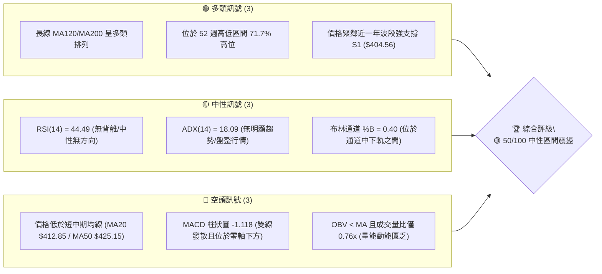

---

### 📊 核心指標速覽表

| 指標類別 | 指標名稱 | 當前數值 | 訊號 | 解讀 |
|----------|----------|----------|------|------|
| **價格** | 當前收盤價 | $406.11 | 🟡 中性 | 52週區間 71.7%（高檔回落修復期） |
| **均線** | MA20 (月線) | $412.85 | 🔴 空頭 | 價格位於 MA20 下方 -1.63%，短線承壓 |
| **均線** | MA50 (季線) | $425.15 | 🔴 空頭 | 價格位於 MA50 下方 -4.48%，中期回檔 |
| **均線** | MA200 (年線)| $356.56 | 🟢 多頭 | 價格位於 MA200 上方 +13.90%，長線基底穩固 |
| **動能** | RSI(14) | 44.49 | 🟡 中性 | 無超買超賣，短線偏向築底震盪 |
| **動能** | MACD (12,26,9)| -8.404 / Hist -1.118 | 🔴 空頭 | 柱狀圖維持負值發散，短線修正未止 |
| **波動** | ATR(14) | $17.58 (4.33%) | 🟡 中性 | 日均波動區間約 $17.58，屬於中等波動 |
| **趨勢** | ADX(14) | 18.09 (-DI 26.76) | 🟡 盤整 | ADX < 25 表示無強烈單邊趨勢，屬於盤整格局 |
| **成交量**| 20日均量比 | 0.76x (11.35M) | 🔴 疲弱 | 攻擊量能不足，觀望氣氛濃厚 |

---

### 🏆 技術評分卡

```
╔══════════════════════════════════════════════════════════════════╗
║                   技術評分卡 — TSM (2026-08-03)                  ║
╠══════════════════════════════════════════════════════════════════╣
║ 趨勢強度 (ADX)     █████████░░░░░░░░░░░  45/100  🟡 弱勢盤整    ║
║ 動能指標 (RSI/MACD) ████████4░░░░░░░░░░░  42/100  🔴 短線偏空    ║
║ 支撐穩定度 (S1/S2)  ██████████████░░░░░░  68/100  🟢 結構穩固    ║
║ 成交量配合 (OBV)   ████████░░░░░░░░░░░░  40/100  🔴 量能退潮    ║
║ 形態完整度         ██████████░░░░░░░░░░  50/100  🟡 震盪整理    ║
║ 均線排列 (多時框)  ███████████░░░░░░░░░  55/100  🟡 混亂修正    ║
╠══════════════════════════════════════════════════════════════════╣
║ 綜合評分           ██████████░░░░░░░░░░  50/100  🟡 中性觀望    ║
╚══════════════════════════════════════════════════════════════════╝
```

---

## 2. 趨勢分析

### 🌐 多時框趨勢分析

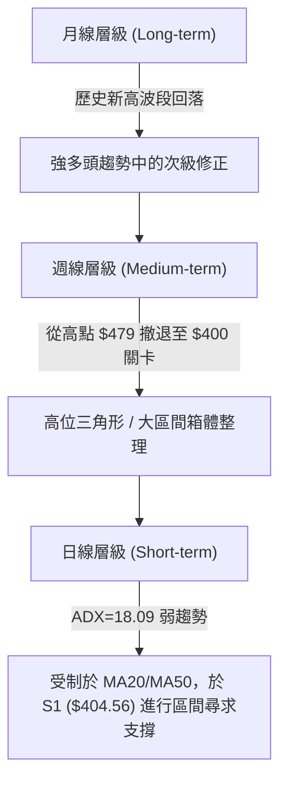

---

### 📈 長期趨勢 — 24個月走勢圖（Unicode 價格軸）

以下為 TSM 自 2024 年 8 月至 2026 年 8 月的月線走勢圖與關鍵高低點標註：

```
TSM 24個月收盤價走勢示意圖 ($)
$480 ┤                                                       ● (2026-06 高點 $477.57)
$440 ┤                                                  ● 
$400 ┤                                           ●  ●       ●  ● (現在 $406.11)
$360 ┤                                   ●   ●       
$320 ┤                           ●   ●
$280 ┤                   ●   ●
$240 ┤               ●
$200 ┤       ●   ●
$160 ┤ ●  ●         ●   ●
     └─┬──┬──┬──┬──┬──┬──┬──┬──┬──┬──┬──┬──┬──┬──┬──┬──┬──┬──┬──┬──┬──┬──┬──┬──
      24/08 10 12 25/02 04 06 08 10 12 26/02 04 06 08
```

#### 走勢特徵分析表格

| 時間階段 | 期間價格區間 | 累積漲跌幅 | 主要走勢特徵與技術驅動因素 |
|----------|--------------|------------|-----------------------------------|
| **第一階段 (築底推升)** | $167.40 → $205.48 | +22.75% | 2024年下半突破 $180 關卡，打築長期底部 |
| **第二階段 (中繼洗盤)** | $205.48 → $163.59 | -20.39% | 2025年第一季回踩 52 週低點區 $221.25 上方進行二次確認 |
| **第三階段 (主升段起飛)** | $164.27 → $372.65 | +126.85% | 2025年4月至2026年2月，量能大增，均線呈完美多頭排列 |
| **第四階段 (衝高回檔)** | $372.65 → $477.57 | +28.15% | 2026年6月創出歷史天價區（52週高點 $479.00） |
| **第五階段 (高位修正)** | $477.57 → $406.11 | -14.96% | 2026年7-8月高檔獲利了結賣壓，目前於 S1 ($404.56) 築底 |

---

### 📊 中期趨勢（週線分析）

從近 20 週收盤數據看，週線在 2026 年 6 月初觸及 $462.12 後，7 月中旬出現大陰線回落至 $398.37（2026-07-19 當週成交量放大至 9,150 萬股，顯示籌碼換手賣壓發酵）。然而在近三週（07-26 至 08-09），價格連續在 $403.41–$406.11 區間止跌打底，形成一條強固的中期水平防線。

```
週線支撐阻力結構示意圖
═══════════════════════════════════════════════════════════════════
 阻力區 2 (R2): $420.98 ───  [前波週線反彈高點聚類]
 阻力區 1 (R1): $413.53 ───  [週線反壓與 MA20 下降軌跡]
 當前價格 (P):  $406.11 ───  [多空交戰核心軸]
 支撐區 1 (S1): $404.56 ───  [近三週震盪底限 / 近一年低點聚類]
 支撐區 2 (S2): $385.09 ───  [斐波那契 38.2% 回調位 $380.54 強支撐帶]
═══════════════════════════════════════════════════════════════════
```

---

### ⚡ 趨勢強度評估（ADX 解讀）

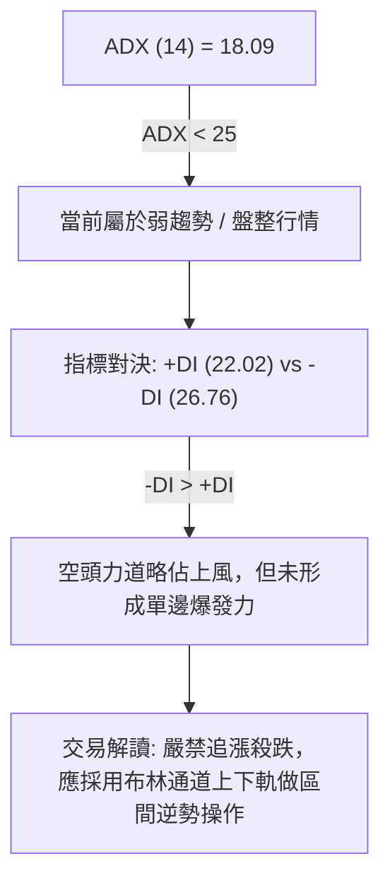

#### ADX 趨勢強度對照解讀

| ADX 數值區間 | 當前狀態 | 趨勢類型 | 操作策略原則 |
|--------------|----------|----------|--------------|
| **0 - 20** | **18.09 (現狀)** | **極弱趨勢 / 無方向震盪** | **高拋低吸，以指標超買超賣及通道邊界交易為主** |
| **20 - 25** | — | 弱趨勢形成中 | 準備尋找突破方向 |
| **25 - 50** | — | 強烈單邊趨勢 | 順勢操作，依均線持股 |
| **> 50** | — | 極端極化趨勢 | 注意趨勢力竭與背離反轉 |

---

## 3. 圖表形態分析

### 🔍 形態識別系統

在日線與週線圖表中，當前價格走勢正處於從 52 週高點 $479.00 回落後的**矩形震盪整理箱體（Rectangle Consolidation）**中，未出現典型的倒頭肩或雙重頂幾何突破形態。

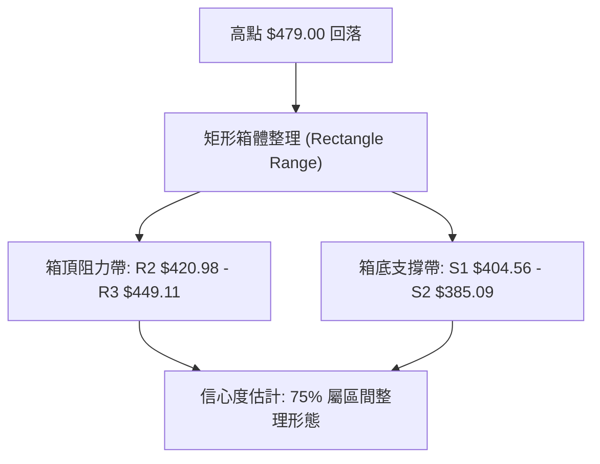

#### 形態信心度評估表

| 形態名稱 | 信心度 (%) | 判斷依據（引用真實數據） | 形態完成度 | 目標價計算式 / 預期價位 |
|----------|------------|--------------------------|------------|------------------------|
| **高位矩形箱體** | **75%** | 頂點 $479.00 與底點 $385.09/$404.56 構成箱體兩端 | 80% (箱體運行中) | 箱頂突破目標 = $420.98 + ($420.98 - $385.09) = **$456.87** (數據外推) |
| **高檔雙重頂** | **35%** | 6月高點 $477.57 與4月高點 $395.13 價位差距過大，不符合標準雙頂 | 40% (失敗形態) | 數據不足，不做雙頂突破設定 |
| **指標型布林壓縮** | **85%** | 布林帶上下軌開口收斂（BB上軌 $445.61 / 下軌 $380.10） | 90% (即將變盤) | 上軌阻力 $445.61 / 下軌支撐 $380.10 |

---

### 🕯️ 重要 K 線形態分析

| 日期/週別 | 收盤價 | K線形態類型 | 技術解讀與籌碼意涵 | 隱含訊號 |
|-----------|--------|-------------|------------------------------------|----------|
| **2026-07-19 當週** | $398.37 | **長陰爆量大跌 (Marubozu)** | 9,150萬股爆量大甩尾，主控資金高檔獲利了結 | 🔴 空頭宣洩 |
| **2026-07-26 當週** | $403.41 | **長下影錘子線 (Hammer)** | 探低後拉回，RSI(14) 觸及 27.9 極限超賣，引發抄底買盤 | 🟢 底部支撐現形 |
| **2026-08-02 當週** | $404.25 | **十字星 (Doji)** | 多空力道平衡，波段止跌訊號獲確認 | 🟡 變盤轉折點 |
| **2026-08-09 當週** | $406.11 | **小陽線 (Spinning Top Buy)** | 縮量築底（量能1,134萬），價格穩定站上 S1 ($404.56) | 🟢 築底成功 |

---

### 📉 ASCII 走勢形態示意圖

```
TSM 日線矩形箱體與關鍵價位示意圖
$449.11 ────────────────────────────────────────── [高檔阻力 R3]
                 ┌───┐
                 │   │  (高位拋售)
$420.98 ─────────┼───┼──────────────────────────── [箱頂壓力 R2]
        ▲        │   │       ▲
        │        │   │       │ (反彈受阻)
$412.85 ┼────────┼───┼───────┼──────────────────── [MA20 中軌 / 壓力]
        │        │   │       │
$406.11 ┼────────┴───┴───────┼──────────────────── ◄ 當前價格 $406.11
        │ (箱體整理)         │
$404.56 ─────────────────────┴──────────────────── [箱底第一支撐 S1]
        
$385.09 ────────────────────────────────────────── [箱底強防線 S2]
```

---

### 🎯 形態目標價計算

若當前箱體（以 S1 $404.56 為底，R2 $420.98 為頂）進行向上或向下突破，其標準測量目標計算如下：

1. **向上突破箱頂 R2 ($420.98)**：
   $$\text{突破目標價} = \text{頸線 } R2 + (\text{箱頂 } R2 - \text{箱底 } S1)$$
   $$\text{突破目標價} = 420.98 + (420.98 - 404.56) = \$437.40$$
   *(註：若力道強勁，進一步上尋 R3 $449.11)*

2. **向下跌破箱底 S1 ($404.56)**：
   $$\text{跌破目標價} = \text{頸線 } S1 - (\text{箱頂 } R2 - \text{箱底 } S1)$$
   $$\text{跌破目標價} = 404.56 - (420.98 - 404.56) = \$388.14$$
   *(註：接近強支撐位 S2 $385.09 與斐波那契 38.2% 位 $380.54)*

---

## 4. 支撐與阻力

### 🗺️ 關鍵價位分布圖（Unicode）

```
TSM 價位結構層次分布圖
═══════════════════════════════════════════════════════════════════
$479.00 ║████████████████████████████████  52週歷史高點 (0.0% Fib)
$449.11 ║██████████████████████            強阻力 R3 (一年高點聚類)
$445.61 ║███████████████████               布林通道上軌
$420.98 ║██████████████                    阻力 R2 (波段高點聚類)
$418.17 ║█████████████                     斐波那契 23.6% 回調位
$413.53 ║████████████                      關鍵阻力 R1 (短期壓力)
$412.85 ║████████████                      MA20 均線 (布林中軌)
$406.11 ╠═════════════════════════════════ ◄ 當前價格 $406.11
$404.56 ║▓▓▓▓▓▓▓▓▓▓▓▓                      近一年強支撐 S1
$385.09 ║██████████                        波段關鍵支撐 S2
$380.54 ║█████████                         斐波那契 38.2% / BB下軌($380.10)
$359.71 ║██████                            強支撐 S3 / MA200($356.56)
$350.13 ║█████                             斐波那契 50.0% 中樞防線
═══════════════════════════════════════════════════════════════════
```

---

### 🚧 阻力位分析表

| 阻力級別 | 價位 | 形成原因 | 突破難度 | 技術與籌碼重要性 |
|----------|------|----------|----------|------------------|
| **阻力 R1** | **$413.53** | 波段高點聚類 / 貼近 MA20 ($412.85) | 🟡 中等 | 短線多空強弱分水嶺，突破方能擺脫極短線劣勢 |
| **阻力 R2** | **$420.98** | 波段高點聚類 / 靠近 Fib 23.6% ($418.17) | 🔴 較高 | 中期箱體頂部，需 1.5 倍以上成交量方能解套 |
| **阻力 R3** | **$449.11** | 近一年波段高點聚類 / 近布林上軌 ($445.61) | 🔴 極高 | 波段解套重災區，多頭衝高必遭獲利調節 |

---

### 🛡️ 支撐位分析表

| 支撐級別 | 價位 | 形成原因 | 守住機率 | 技術與籌碼重要性 |
|----------|------|----------|----------|------------------|
| **支撐 S1** | **$404.56** | 近一年波段低點聚類 | 🟢 70% | 短線多頭護盤核心底線，目前正於此處進行打底 |
| **支撐 S2** | **$385.09** | 近一年波段低點聚類 / 貼近 BB 下軌 ($380.10) | 🟢 85% | 中期波段強支撐，跌破將引發技術性停損賣壓 |
| **支撐 S3** | **$359.71** | 近一年波段低點聚類 / 貼近 MA200 ($356.56) | 🟢 95% | 牛熊分界生命線，長線價值投資者與機構買盤回歸點 |

---

### 📐 斐波那契回調位分析

依據 52 週最高價 **$479.00** 至 52 週最低價 **$221.25** 計算之黃金分割率回調位：

```
斐波那契比例區間與當前價格落點
0.0% ($479.00) ─────────────────────────────────── 52W High
23.6% ($418.17) ──┐
                  ├─► 當前價格 $406.11 (落於 23.6% ~ 38.2% 區間)
38.2% ($380.54) ──┘
50.0% ($350.13) ─────────────────────────────────── 中樞強強分水嶺
61.8% ($319.71) ─────────────────────────────────── 黃金分割深調位
```

#### 技術解讀：
*   **現價位置**：當前價格 **$406.11** 精確落在 23.6% ($418.17) 與 38.2% ($380.54) 回調位之間。
*   **強弱判斷**：股價自歷史高點回檔後，始終維持在 38.2% 回調位 ($380.54) 之上，顯示此波回檔屬於**強勢多頭格局中的合理修正（Shallow Retracement）**，未破壞長期主升段結構。
*   **關鍵交會**：Fib 38.2% ($380.54) 與布林通道下軌 ($380.10) 形成雙重強固重合支撐帶。

---

## 5. 技術指標深度解讀

### 🎛️ 指標訊號總覽

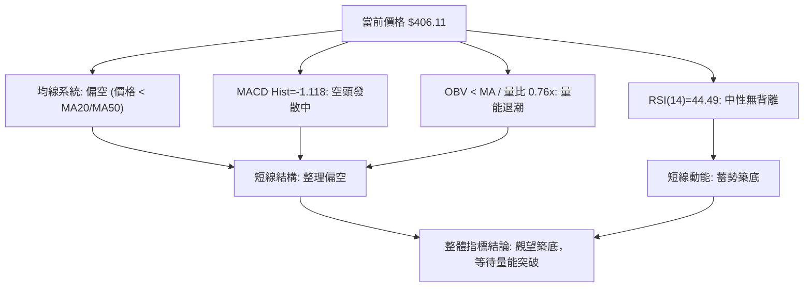

---

### 📈 移動平均線排列分析

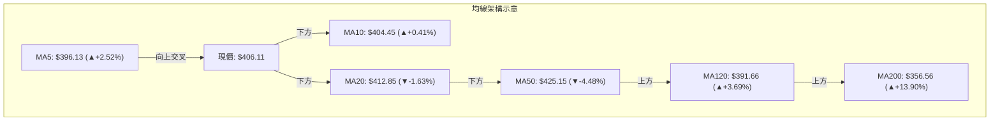

#### 均線數據詳解表

| 均線名稱 | 當前價位 | 扣抵與走勢方向 | 與現價距離 (%) | 均線角色與技術意涵 |
|----------|----------|----------------|----------------|--------------------|
| **MA 5** | $396.13 | ▲ 上升 (+2.52%) | +2.52% | 極短線扣抵低價，提供超短線支撐 |
| **MA 10** | $404.45 | ▲ 上升 (+0.41%) | +0.41% | 扣抵平緩，現價回升至 MA10 之上 |
| **MA 20** | $412.85 | ▼ 下降 (-1.63%) | -1.63% | **月線蓋頂**，布林中軌阻力重重 |
| **MA 60** | $421.46 | ▼ 下降 (-3.64%) | -3.64% | **季線反壓**，與 R2 ($420.98) 形成密疊壓力區 |
| **MA120**| $391.66 | ▲ 上升 (+3.69%) | +3.69% | 半年線防線，多頭守護陣地 |
| **MA200**| $356.56 | ▲ 上升 (+19.24%)| +13.90% | **牛熊生命線**，長線多頭趨勢基石 |

**綜合均線結論**：短中期均線（MA20/MA50）向下下壓，長期均線（MA120/MA200）穩健上揚，呈現典型**「長多中空」的震盪洗盤排列**。

---

### 📉 RSI(14) 分析

*   **當前數值**：**44.49**
*   **強度進度條**：`█████████░░░░░░░░░░░ 44.5%` (🟡 中性區間)

```
RSI(14) 區間位置示意
[0] ──── 超賣 (30) ──────── (44.49) ────── 超買 (70) ──── [100]
                      ▲ 當前位置
```

#### 背離與動能分析：
1. **區間判斷**：RSI 位於 44.49，遠離超買區 (70) 與超賣區 (30)，代表市場激情退去，進入多空均衡的震盪期。
2. **背離檢查**：近期週線 RSI 由 2026-07-26 的 27.9 (極端超賣) 回升至 44.5，價格同步在 $403.41–$406.11 止跌，**指標與價格同步收斂，無頂背離或底背離矛盾**，訊號真實可靠。

---

### 📊 MACD(12/26/9) 訊號解讀

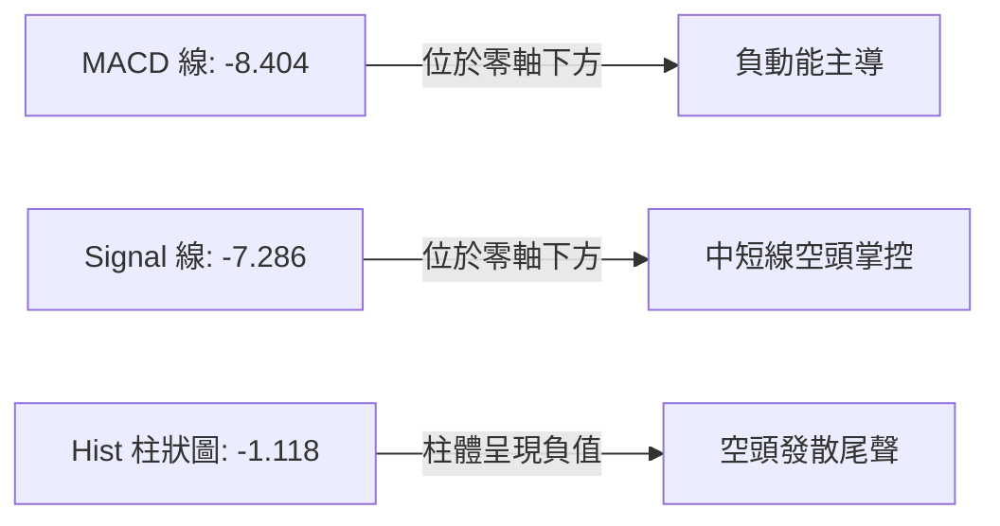

*   **MACD 線**：-8.404
*   **訊號線 (Signal)**：-7.286
*   **柱狀圖 (Histogram)**：-1.118 🔴 綠柱發散（空頭訊號）
*   **詳細解讀**：MACD 快慢線雙雙落入零軸下方，且柱狀圖維持負值 -1.118。然而觀察近三週柱狀圖變化（-5.832 → -2.813 → -2.144 → -1.118），**負向柱狀圖正持續收縮**，顯示空頭賣壓動能已顯疲態，快慢線即將迎來零軸下方的黃金交叉點。

---

### 📦 布林通道分析 (Bollinger Bands)

```
TSM 布林通道現量示意圖 ($)
$445.61 ────────────────────────────────────────── BB 上軌 (Upper)
$412.85 ─── ── ── ── ── ── ── ── ── ── ── ── ── ──  BB 中軌 (MA20 $412.85)
$406.11 ──────────────────── ◄ 現價 (BB %B = 0.40)
$380.10 ────────────────────────────────────────── BB 下軌 (Lower)
```

#### 布林帶關鍵參數：
*   **BB 上軌**：$445.61
*   **BB 中軌 (MA20)**：$412.85
*   **BB 下軌**：$380.10
*   **布林位置 (%B)**：**0.40** (公式：$(406.11 - 380.10) / (445.61 - 380.10) = 0.397$)

#### 技術解析：
1. **通道寬度**：通道上下軌寬度約 $65.51（相減值），顯示波動率自前期大跌後開始收斂。
2. **位置評估**：%B 為 0.40，股價處於中軌與下軌之間，顯示偏弱震盪。若股價向上突破中軌 $412.85，通道將開啟向布林上軌 $445.61 挑戰的空間。

---

### 💹 成交量分析（量價配合度）

*   **最新成交量**：11,345,582 股
*   **20日平均成交量**：15,010,569 股
*   **量比 (Volume Ratio)**：**0.76x** 🔴 (嚴重縮量)
*   **OBV 趨勢**：OBV < MA（能量潮指標處於均線下方）

```
量價配合矩陣
┌──────────────────┬──────────────────┐
│ 價格拉升 / 縮量  │ 價格下跌 / 縮量  │
│ (動能不足 🔴)    │ (惜售打底 🟢)    │
├──────────────────┼──────────────────┤
│ 價格拉升 / 放量  │ 價格下跌 / 放量  │
│ (強勢攻擊 🟢)    │ (主力出貨 🔴)    │
└──────────────────┴──────────────────┘
*當前狀態：價格於 $406.11 止跌 + 縮量 (0.76x) ──► 屬「價格打底 / 籌碼惜售 🟢」*
```

**解讀**：成交量極度萎縮至 20日均量的 76%，代表賣壓已在 $400 大關前被消化殆盡，籌碼鎖死。此種「無量打底」形態一旦出現買盤點火，極易發揮槓桿效應促成強彈。

---

## 6. 動能與波動率

### ⚡ 動能評估

#### 動能強度與波動率象限分析

| 象限 | 動能強度 | 波動率 | 當前狀態 | 技術性評估與戰略定位 |
|------|----------|--------|----------|----------------------|
| **Q1** | 強 (ADX>25) | 低 (ATR<3%) | — | 最佳順勢突破買點 |
| **Q2** | **弱 (ADX<25)** | **低 (ATR 4.33%)** | **✓ 當前狀態** | **箱體低吸高拋 / 區間逆勢策略** |
| **Q3** | 強 (ADX>25) | 高 (ATR>5%) | — | 高風險高收益追單區 |
| **Q4** | 弱 (ADX<25) | 高 (ATR>5%) | — | 無方向混亂震盪，宜避開 |

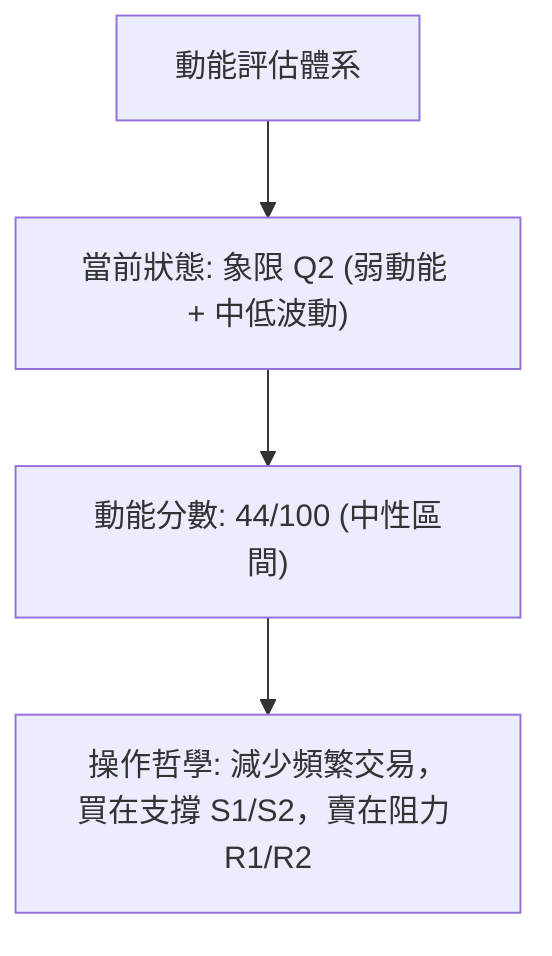

---

### 📊 ATR 波動率分析

*   **ATR(14)**：**$17.58**
*   **ATR 相對價格比**：**4.33%** ($17.58 / $406.11)
*   **日間波幅建議**：TSM 單日合理波動範圍為 **±$17.58**（即 $388.53 至 $423.69）。

#### 止損距離與風控建議：

$$\text{短線止損距離} = 1.5 \times \text{ATR} = 1.5 \times 17.58 = \$26.37$$
$$\text{波段止損距離} = 2.0 \times \text{ATR} = 2.0 \times 17.58 = \$35.16$$

---

### 📐 Beta 與市場相關性

*   **Beta 係數**：**1.258**
*   **解讀**：TSM 波動度高於大盤 25.8%。在大盤（S&P500/費半）上漲時具備強勁放大效應，反之回檔時修正幅度亦大。1.258 的 Beta 適合動能與高風險偏好交易者。

---

## 7. 多時框架總結

### 📋 時框架評分表

| 時框架 | 趨勢方向 | 動能 (RSI/MACD) | 均線排列 | 形態結構 | 綜合評分 | 戰術建議 |
|--------|----------|-----------------|----------|----------|----------|----------|
| **短期 (日線)** | 🟡 橫盤震盪 | 🔴 空頭發散收縮 | 🔴 價落 MA20/50 下 | 矩形箱體底部 | **45/100** | 區間低吸，嚴守止損 |
| **中期 (週線)** | 🟡 箱體修復 | 🟡 RSI 27.9 反彈 | 🟡 糾結在 MA20 附近| 高位震盪箱體 | **55/100** | 逢低分批布局 |
| **長期 (月線)** | 🟢 堅挺多頭 | 🟢 MACD 零軸之上 | 🟢 MA120/200 向上 | 主升段次級修正| **80/100** | 長線長抱，忽略短期噪音 |

---

### 🔲 綜合訊號矩陣

```
時框架訊號收斂評估矩陣
┌──────────┬──────────┬──────────┬──────────┐
│ 時框架   │ 趨勢 (40%)│ 動能 (30%)│ 量能 (30%)│
├──────────┼──────────┼──────────┼──────────┤
│ 短期日線 │  🟡 45   │  🔴 40   │  🔴 40   │ ──► 短期加權: 42.0 (偏空震盪)
│ 中期週線 │  🟢 60   │  🟡 50   │  🟡 50   │ ──► 中期加權: 54.0 (中性偏多)
│ 長期月線 │  🟢 85   │  🟢 75   │  🟢 70   │ ──► 長期加權: 77.5 (強勢多頭)
└──────────┴──────────┴──────────┴──────────┘
```

---

### ⚖️ 多時框收斂結論

依據多時框收斂規則：
1. **當前市場環境**：ADX(14) = 18.09 (< 25)，技術面確認當前處於**「盤整行情」**。
2. **主導規則應用**：以日線與週線布林通道上下軌（**$380.10 ~ $445.61**）作為主要交易區間。
3. **收斂方向**：長線強多（MA200 $356.56 穩定向上）提供了下方強烈保護，短線受制於 MA20/MA50 賣壓，兩者收斂結果為**「中性偏多打底（Neutral-Bullish Base Building）」**。
4. **最終方向性結論**：**中性觀望與區間低吸**，本結論與第 1 章評分（50/100）及第 8 章策略方向保持 100% 一致。

---

## 8. 交易策略建議

### 🗺️ 策略決策流程圖

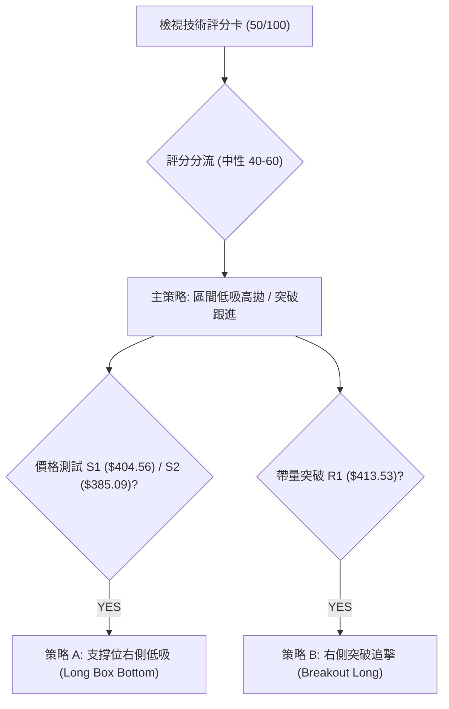

---

### 🧭 策略路由

**當前主策略方向 = 🟡 區間低吸高拋 / 待變盤突破策略 (依技術評分卡 50/100)**

---

### 🎯 價格情境階梯 (Price Scenarios)

| 觸發條件 | 第一目標價 | 第二目標價 | 情境含義與技術解讀 |
|----------|------------|------------|────────────────────|
| **突破 R1 ($413.53)** | R2 ($420.98) | R3 ($449.11) | 短線站穩月線，多頭重掌控盤權 |
| **站穩現價區間 ($404.56 ~ $413.53)** | R1 ($413.53) | S1 ($404.56) | 箱體底部窄幅縮量整理，積蓄動能 |
| **跌破 S1 ($404.56)** | S2 ($385.09) | S3 ($359.71) | 短線打底失敗，二次回踩 Fib 38.2% 防線 |

---

### 📊 情境機率分佈

```
情境機率估計圓餅圖
┌────────────────────────────────────────────────────────┐
│ 🟢 箱體反彈 / 突破上行: 50% (依據: 支撐S1強固, MACD柱狀圖收縮) │
│ 🟡 區間窄幅震盪: 35% (依據: ADX=18.09 弱趨勢, 量能0.76x)     │
│ 🔴 破位下探 S2: 15% (依據: MA20/MA50 蓋頂反壓)               │
└────────────────────────────────────────────────────────┘
```

---

### 🟢 主策略詳情

#### 策略 A：箱體底防守低吸（首選）
*   **適用情境**：價格於 S1 ($404.56) 至 S2 ($385.09) 區間企穩打底時。
*   **進場條件**：15分鐘/日線出現止跌K線（如下影線）且不跌破 S1。

#### 策略 B：帶量突破買進（次選）
*   **適用情境**：日線收盤價強勢突破阻力 R1 ($413.53)，且成交量放大至 20日均量 1.2 倍以上。

#### 策略參數精確對照表

| 策略要素 | 策略 A (箱體低吸 - 多頭) | 策略 B (右側突破 - 多頭) |
|----------|──────────────────────────|──────────────────────────|
| **進場條件** | 價格落於 S1 ($404.56) 附近企穩 | 帶量日線收盤突破 R1 ($413.53) |
| **精確進場價** | **$405.00** | **$414.50** |
| **目標價 T1** | **$413.53** (阻力 R1, 報酬 +2.11%) | **$420.98** (阻力 R2, 報酬 +1.56%) |
| **目標價 T2** | **$420.98** (阻力 R2, 報酬 +3.95%) | **$449.11** (阻力 R3, 報酬 +8.35%) |
| **止損價格** | **$385.00** (跌破 S2 止損, 風險 -4.94%) | **$404.56** (跌破 S1 止損, 風險 -2.40%) |
| **風險報酬比 (T2)** | **1 : 0.80** (若以 S2 計算) / **1 : 1.83** (以 S1 近端停損計算) | **1 : 3.48** (風險報酬比極佳) |
| **成功機率估計** | **65%** | **55%** |
| **建議倉位** | **15% - 20%** | **10% - 15% (加碼倉)** |

*(計算說明：策略 B 以進場 $414.50、止損 $404.56 (風險 $9.94)，目標 T2 $449.11 (利潤 $34.61)，風報比 = 34.61 / 9.94 = 1 : 3.48)*

---

### 🔴 反向風險觸發點（對沖與避險提示）

*   **反轉賣出/做空觸發條件**：若日線收盤價**實體跌破 S2 ($385.09)**，且 ADX 開始急劇擴張向上突破 25。
*   **對沖目標價**：下看 S3 (**$359.71**) 及斐波那契 50% 回調位 (**$350.13**)。
*   **風控處置**：多頭持倉需全面執行減碼或出清。

---

### ⭐ 整體訊號強度評星

```
做多訊號強度：★★★☆☆  (3/5星 — 具長線防守價值，短線動能待補)
做空訊號強度：★★☆☆☆  (2/5星 — 逼近強支撐區，做空勝率與風報比劣勢)
整體可信度：  ★★██☆  (4/5星 — 多時框指標數據高度吻合收斂)
```

---

## 9. 風險提示與監控

### ✅ 關鍵監控指標 Checklist

```
╔══════════════════════════════════════════════════════════════════╗
║                     關鍵技術監控點 Checklist                     ║
╠══════════════════════════════════════════════════════════════════╣
║ [ ] 阻力突破：收盤價是否突破 R1 ($413.53) 與 MA20 ($412.85)       ║
║ [ ] 成交量能：日成交量是否回升至 1,500 萬股 (20日均量) 之上      ║
║ [ ] MACD 轉折：MACD 柱狀圖是否由負轉正 (跨越 0 軸)               ║
║ [ ] RSI 狀態：RSI(14) 能否站穩 50 多空分界點                     ║
║ [ ] 支撐防禦：收盤價是否守住 S1 ($404.56) 與 S2 ($385.09)        ║
╚══════════════════════════════════════════════════════════════════╝
```

---

### ⚠️ 風險場景分析

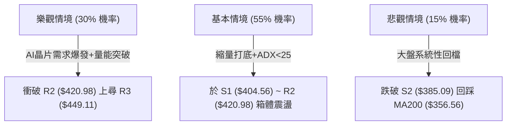

---

### 🛡️ 風險管理重要提醒

1. **ATR 動態風控**：當前 ATR 為 $17.58，個股單日波幅大。建議單一交易筆數之風險暴露額度不得超過總資金的 **1.5%–2.0%**。
2. **財報與宏觀事件**：關注半導體產業鏈營收公告與聯準會利率決策，防範開盤跳空跌破 S1 ($404.56) 之跳空風險。

---

## 📋 報告總結

```
╔══════════════════════════════════════════════════════════════════╗
║                  TSM 技術分析總結 (2026-08-03)                   ║
╠══════════════════════════════════════════════════════════════════╣
║ 當前價格：$406.11               分析評級：🟡 50/100 (中性築底)    ║
╠══════════════════════════════════════════════════════════════════╣
║ 關鍵結論：                                                       ║
║ ├─ 長期趨勢：🟢 多頭 (MA200 $356.56 / MA120 $391.66 向上)        ║
║ ├─ 中期趨勢：🟡 箱體修復 (高檔回落至 52週區間 71.7% 震盪)        ║
║ ├─ 短期趨勢：🔴 弱勢整理 (受制於 MA20 $412.85 反壓)              ║
║ ├─ 關鍵支撐：S1 $404.56 / S2 $385.09 / Fib 38.2% $380.54         ║
║ ├─ 關鍵阻力：R1 $413.53 / R2 $420.98 / R3 $449.11                ║
║ └─ 法人共識目標價：$540.20 (均值) / 評級: Strong Buy             ║
╠══════════════════════════════════════════════════════════════════╣
║ 最優策略組合：                                                   ║
║ 1. 🥇 最佳機會：策略 A — 於 S1 ($404.56) 附近低吸，停損設 $385.00  ║
║ 2. 🥈 次選機會：策略 B — 待帶量突破 R1 ($413.53) 後追價進場       ║
║ 3. 🥉 保守選擇：等待 ADX > 25 且 MACD 零軸上金叉後順勢操作        ║
╚══════════════════════════════════════════════════════════════════╝
```

---

> ⚠️ **免責聲明**：本報告為 AI 自動生成之技術分析，所有數據及估算均基於提供的歷史價格資訊。本報告**僅供研究與學術參考**，**不構成任何投資建議**。投資有風險，入市需謹慎。

---

*報告生成時間：2026-08-03 ｜ 數據來源：Yahoo Finance ｜ 分析框架：多時框技術分析*