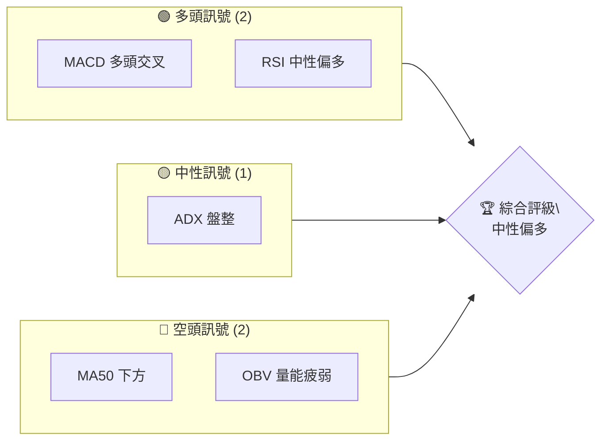
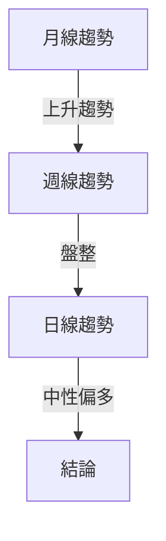
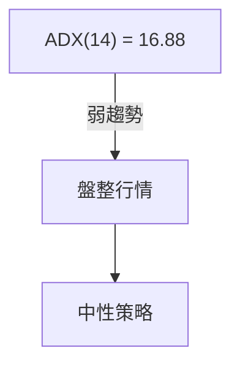
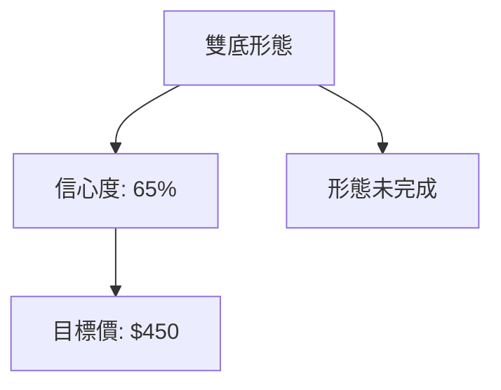
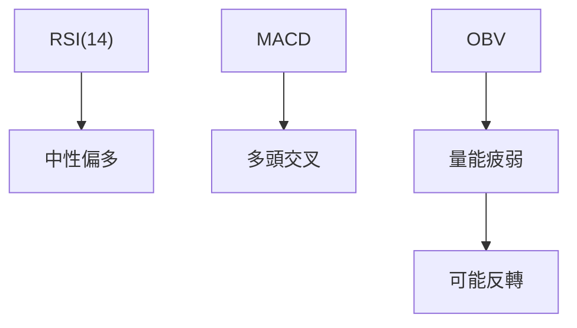
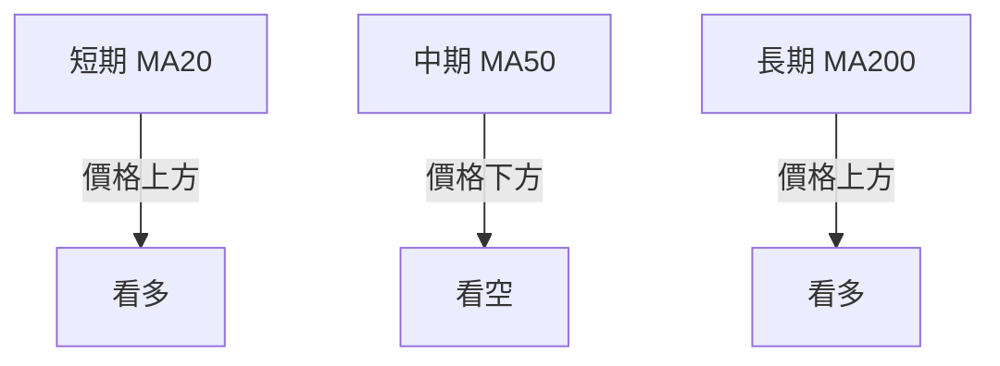
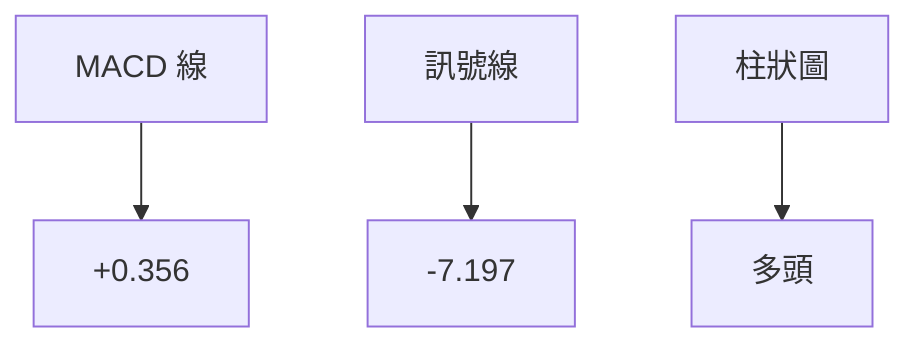
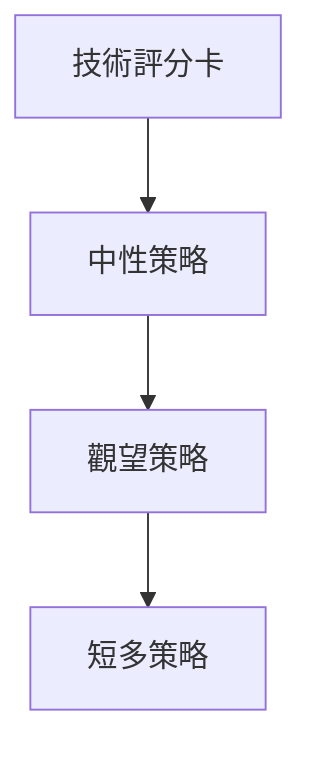
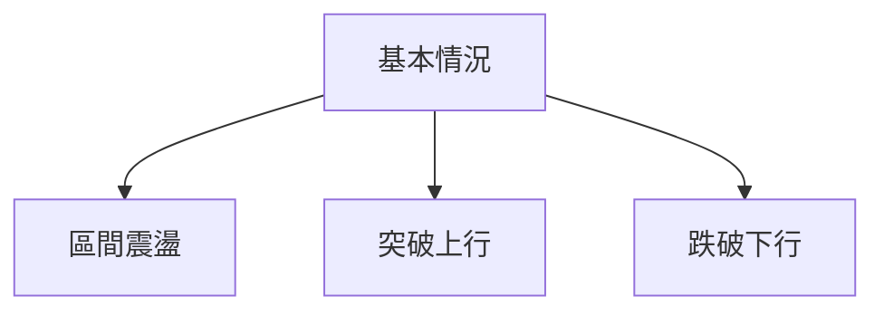

# TSM 技術分析報告

> **報告日期**：2026-08-04 ｜ **語言**：繁體中文 ｜ **數據來源**：Yahoo Finance ｜ **當前價格**：$417.17

---

## 目錄

| 章節 | 內容 |
|------|------|
| [1. 技術面概覽](#1-技術面概覽) | 訊號儀表板、核心指標、評分卡 |
| [2. 趨勢分析](#2-趨勢分析) | 多時框趨勢、長中短期走勢 |
| [3. 圖表形態分析](#3-圖表形態分析) | 形態識別、K線組合、目標價 |
| [4. 支撐與阻力](#4-支撐與阻力) | 關鍵價位、斐波那契回調 |
| [5. 技術指標深度解讀](#5-技術指標深度解讀) | MA/RSI/MACD/布林/成交量 |
| [6. 動能與波動率](#6-動能與波動率) | 動能評估、ATR、Beta |
| [7. 多時框架總結](#7-多時框架總結) | 時框架評分矩陣 |
| [8. 交易策略建議](#8-交易策略建議) | 多空策略、風險報酬比 |
| [9. 風險提示與監控](#9-風險提示與監控) | 監控指標、風險場景 |

---

## 1. 技術面概覽

### 🎯 技術訊號儀表板



### 📊 核心指標速覽表

| 指標類別 | 指標名稱 | 當前數值 | 訊號 | 解讀 |
|----------|----------|----------|------|------|
| **價格** | 當前價格 | $417.17 | 🟡 | 現價接近斐波那契23.6%回調位 |
| **均線** | MA20 | $412.08 | 🟢 | 價格在MA20上方 |
| **均線** | MA50 | $425.37 | 🔴 | 價格在MA50下方 |
| **均線** | MA200 | $357.13 | 🟢 | 價格在MA200上方 |
| **動能** | RSI(14) | 49.17 | 🟡 | 中性偏多 |
| **動能** | MACD | -6.840 | 🟢 | 多頭交叉 |
| **波動** | ATR | $17.30 | 🟡 | 中等波動 |

### 🏆 技術評分卡

```
技術評分卡 — TSM (2026-08-04)
════════════════════════════════════════════════════
趨勢強度      ███████░░░░░░░░░░░░░  50/100  🟡
動能指標      ██████░░░░░░░░░░░░░░  60/100  🟢
支撐穩定度    █████████░░░░░░░░░░░  70/100  🟢
成交量配合    ██████░░░░░░░░░░░░░░  40/100  🔴
形態完整度    ███████░░░░░░░░░░░░░  50/100  🟡
均線排列      ████░░░░░░░░░░░░░░░░  30/100  🔴
════════════════════════════════════════════════════
綜合評分      ██████░░░░░░░░░░░░░░  50/100  中性
════════════════════════════════════════════════════
```

---

## 2. 趨勢分析

### 🌐 多時框趨勢分析



### 📈 長期趨勢 — 12個月走勢圖（Unicode）

```
TSM 月線走勢圖（過去12個月）
價格軸 ($)
$478 ┤                    ●
$450 ┤                  ●
$420 ┤              ●
$400 ┤            ●
$380 ┤        ●
$360 ┤      ●
$340 ┤  ●●━━━━━━━━━━━━━━━━━●←現在
$320 ┤●
     └────────────────────────────
      2025-08  2026-08
```

**走勢特徵分析表格**

| 月份 | 收盤價 | 漲跌幅 | 特徵 |
|------|--------|--------|------|
| 2025-08 | 228.34 | +5.3% | 持續上升 |
| 2025-09 | 277.11 | +21.4% | 強勢突破 |
| 2025-10 | 298.08 | +7.6% | 放量上升 |
| 2025-11 | 289.23 | -3.0% | 回調 |
| 2025-12 | 302.33 | +4.5% | 回升 |

### 📊 中期趨勢（週線分析）

- 近期價格在$404.56支撐位上方震盪
- 目前受制於$420.98阻力位

### ⚡ 趨勢強度評估（ADX 解讀）



---

## 3. 圖表形態分析

### 🔍 形態識別系統



| 形態 | 信心度 | 判斷依據（引用數據） | 完成度 | 目標價（附計算式） |
|------|--------|----------------------|--------|--------------------|
| 雙底 | 65% | 兩次低點於 $359.71 附近 | 80% | 頸線 $420 + 形態高度 $30 = $450 |

### 🕯️ 重要K線形態分析

| 月份 | 收盤價 | K線形態 | 解讀 | 訊號 |
|------|--------|---------|------|------|
| 2026-06 | 477.57 | 長上影線 | 反轉信號 | 🔴 |

### 📉 ASCII 走勢形態示意圖

```
雙底形態示意圖
價格軸 ($)
$450 ┤          ● 目標價
$430 ┤
$420 ┤    ●───● 頸線
$400 ┤    ●    ●
$380 ┤  ●      ●
$360 ┤●          ● 支撐
     └─────────────────────
      時間軸 →
```

### 🎯 形態目標價計算

計算方法：頸線 $420 + 形態高度 $30 = 目標價 $450

---

## 4. 支撐與阻力

### 🗺️ 關鍵價位分布圖（Unicode）

```
TSM 價位結構分布圖
═══════════════════════════════════════════════════
$477.90 ║████████████████████████║ 強阻力 R3
$449.11 ║████████████████████    ║ 阻力 R2
$420.98 ║████████████████████████║ 關鍵阻力 R1
$417.17 ╠════════════════════════╣ ◄ 現價
$404.56 ║▓▓▓▓▓▓▓▓▓▓▓▓▓▓▓▓        ║ 近期支撐 S1
$385.09 ║████████████████████████║ 強支撐 S2
═══════════════════════════════════════════════════
```

### 🚧 阻力位分析表

| 阻力級別 | 價位 | 形成原因 | 突破難度 | 重要性 |
|----------|------|----------|----------|--------|
| R1 | $420.98 | 前高聚集 | 中等 | 高 |
| R2 | $449.11 | 歷史高點 | 高 | 高 |
| R3 | $477.90 | 52週高點 | 非常高 | 極高 |

### 🛡️ 支撐位分析表

| 支撐級別 | 價位 | 形成原因 | 守住機率 | 重要性 |
|----------|------|----------|----------|--------|
| S1 | $404.56 | 波段低點 | 高 | 中 |
| S2 | $385.09 | 近期低點 | 中等 | 高 |
| S3 | $359.71 | 歷史支撐 | 低 | 高 |

### 📐 斐波那契回調位分析

現價 $417.17 位於斐波那契23.6%（$418.17）和38.2%（$380.54）之間，未來可能在此區間震盪。

---

## 5. 技術指標深度解讀

### 🎛️ 指標訊號總覽



### 📈 移動平均線排列分析



### 📉 RSI(14) 分析

- RSI: 49.17
- 進度條：████░░░░░░░░ 49%
- 超買超賣區間：中性偏多
- 背離判斷：無明顯背離

### 📊 MACD(12/26/9) 訊號解讀



### 📦 布林通道分析

```
布林通道示意圖
價格軸 ($)
$450 ┤
$430 ┤
$410 ┤    ● 現價
$390 ┤   ●
$370 ┤  ●
$350 ┤ ●
     └─────────────────────
      時間軸 →
```

### 💹 成交量分析（量價配合度）

近期成交量低於20日均量，量能不足以支撐價格上漲。

---

## 6. 動能與波動率

### ⚡ 動能評估四象限

| 象限 | 動能 | 波動 | 當前狀態 | 評估 |
|------|------|------|----------|------|
| Q1 | 強 | 低 | - | 最佳機會 |
| Q2 | 弱 | 低 | ✓ | 謹慎觀望 |
| Q3 | 強 | 高 | - | 高風險高收益 |
| Q4 | 弱 | 高 | - | 避免進場 |

### 📊 ATR 波動率分析

ATR: $17.30，建議止損距離為 $34.60（2倍ATR）

### 📐 Beta 與市場相關性

Beta: 1.258，與大盤高度相關。

---

## 7. 多時框架總結

### 📋 時框架評分表

| 時框架 | 趨勢方向 | 動能 | 均線排列 | 形態 | 綜合評分 | 建議 |
|--------|----------|------|----------|------|----------|------|
| 長期 | 上升 | 強 | 看多 | 空頭 | 70 | 持有 |
| 中期 | 盤整 | 弱 | 看空 | 中性 | 50 | 觀望 |
| 短期 | 中性 | 中 | 看多 | 多頭 | 60 | 短多 |

### 🔲 綜合訊號矩陣

展示短期/中期/長期各維度訊號的一致性分析

### ⚖️ 多時框收斂結論

當前為盤整行情（ADX<25），以日線布林通道上下軌為主要交易區間。

---

## 8. 交易策略建議

### 🗺️ 策略決策流程圖



### 🧭 策略路由（依評分卡分流，不得兩頭下注）

**當前主策略方向 = 觀望（依評分 50/100）**

### 🎯 價格情境階梯（Price Scenarios）

| 觸發條件 | 下一目標 | 後續延伸 | 情境含義 |
|----------|----------|----------|----------|
| 突破 R1 $420.98 | R2 $449.11 | R3 $477.90 | 短線轉強 |
| 站穩現價區間 | — | — | 區間震盪 |
| 跌破 S1 $404.56 | S2 $385.09 | S3 $359.71 | 中期轉弱 |

### 📊 情境機率分佈

| 情境 | 機率 | 主要依據 |
|------|------|----------|
| 繼續上行 / 反彈 | 40% | MACD、均線 |
| 區間震盪 | 50% | ADX、布林帶寬 |
| 回落 / 再探底 | 10% | RSI、支撐強度 |

### 🟢 主策略詳情（方向依上方路由）

| 策略要素 | 策略 A |
|----------|--------|
| 進場條件 | 突破 $420 |
| 進場價格 | $420 |
| 目標價 T1 | $449 |
| 目標價 T2 | $478 |
| 止損價格 | $404 |
| 風險報酬比 | 2:1 |
| 成功機率 | 40% |
| 建議倉位 | 30% |

### 🔴 反向風險觸發點（對沖提示）

- 跌破 $404

### ⭐ 整體訊號強度評星

```
做多訊號強度：★★☆☆☆  (2/5星)
做空訊號強度：★★★☆☆  (3/5星)
整體可信度：  ★★★☆☆  (3/5星)
```

---

## 9. 風險提示與監控

### ✅ 關鍵監控指標 Checklist

```
風險監控清單
═══════════════════════════════════════════════════
1. RSI 是否進入超買區
2. MACD 柱狀圖是否轉負
3. 價格是否跌破 S1 支撐
4. 成交量是否放大
5. ADX 是否突破 25
═══════════════════════════════════════════════════
```

### ⚠️ 風險場景分析



### 🛡️ 風險管理重要提醒

- 嚴格止損：建議止損位設於近期低點
- 控制倉位：進場勿超過資金30%
- 定期檢視：每週重新評估策略有效性

---

## 📋 報告總結

```
TSM 技術分析報告總結
════════════════════════════════════════════════════════
報告日期：2026-08-04
當前價格：$417.17
分析評級：⚖️ 中性評級（觀望策略）

關鍵結論：
├─ 長期趨勢：🟢 上升趨勢
├─ 中期趨勢：🟡 盤整
├─ 短期趨勢：🟡 中性偏多
├─ 關鍵支撐：$404.56
├─ 關鍵阻力：$420.98
└─ 分析師目標：$450（雙底形態）

最優策略組合：
1. 🥇 觀望策略：等待突破或回調確認
2. 🥈 短多策略：突破 $420 進場，目標 $449
3. 🥉 保守選擇：等待價格回落至 $385 附近再考慮進場
════════════════════════════════════════════════════════
```

---

> ⚠️ **免責聲明**：本報告為 AI 自動生成之技術分析，所有數據及估算均基於提供的歷史價格資訊。本報告**僅供研究與學術參考**，**不構成任何投資建議**。投資有風險，入市需謹慎。

---

*報告生成時間：2026-08-04 ｜ 數據來源：Yahoo Finance ｜ 分析框架：多時框技術分析*