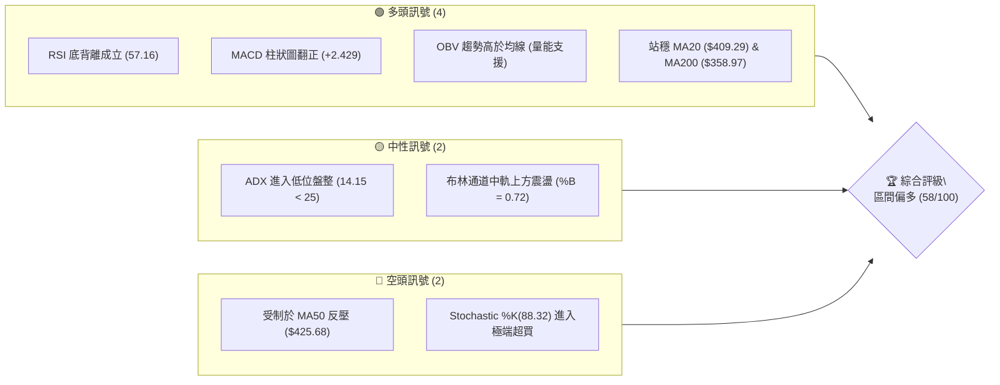
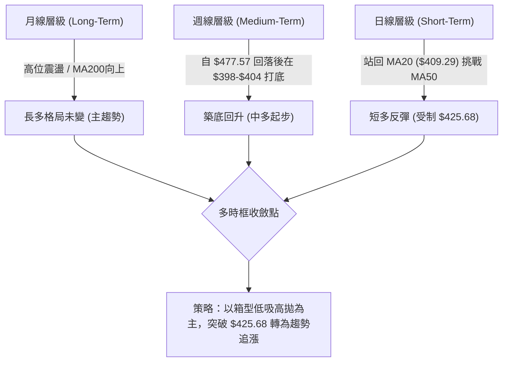
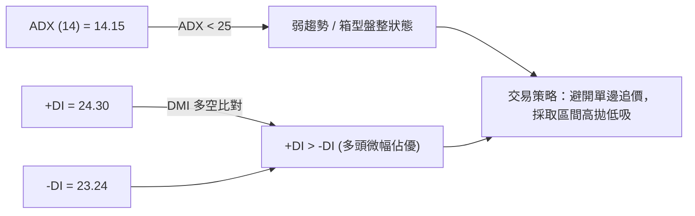
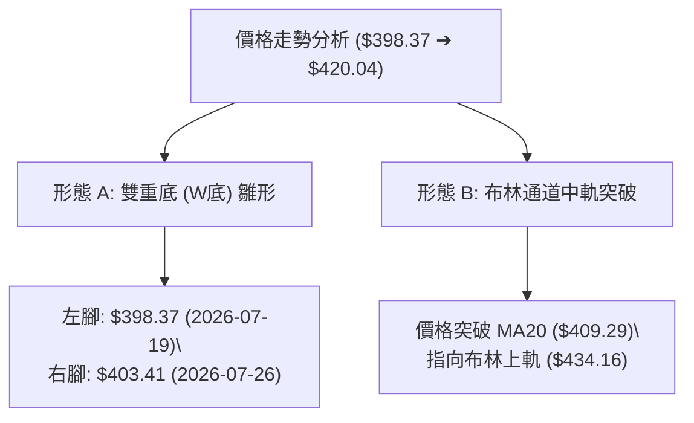
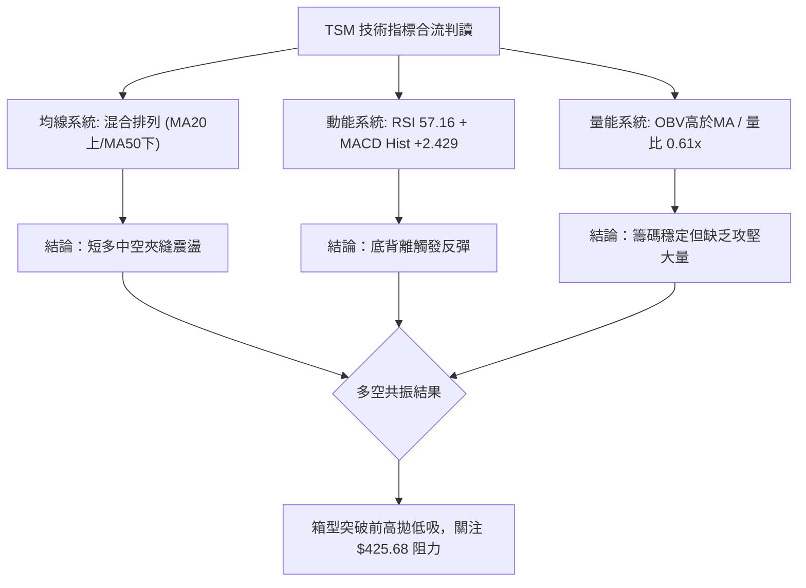
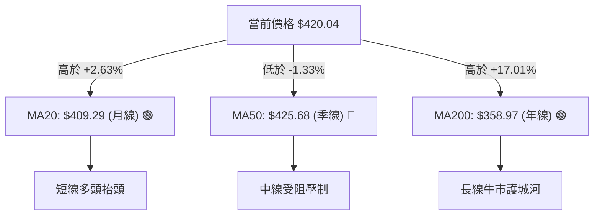
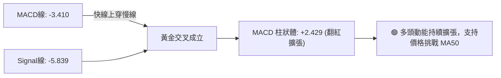
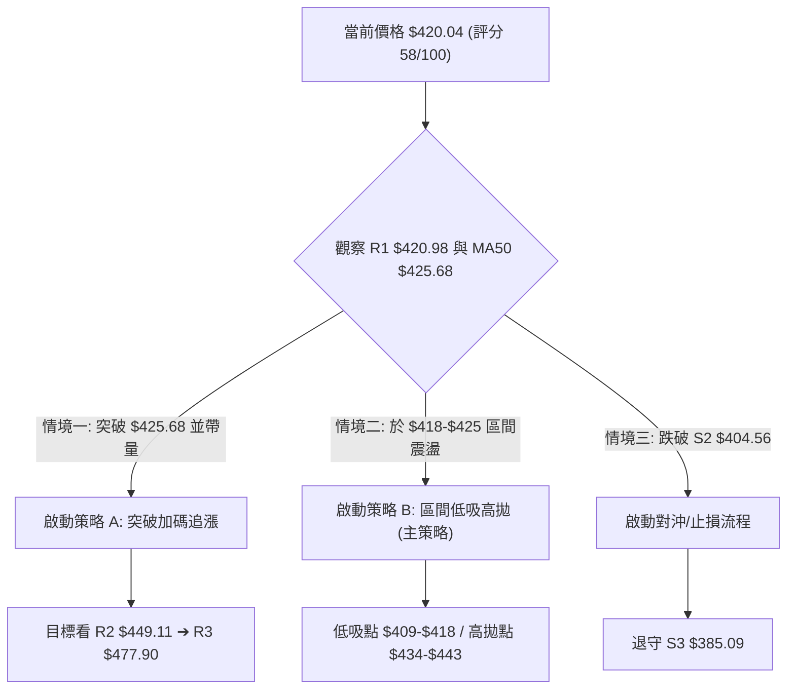
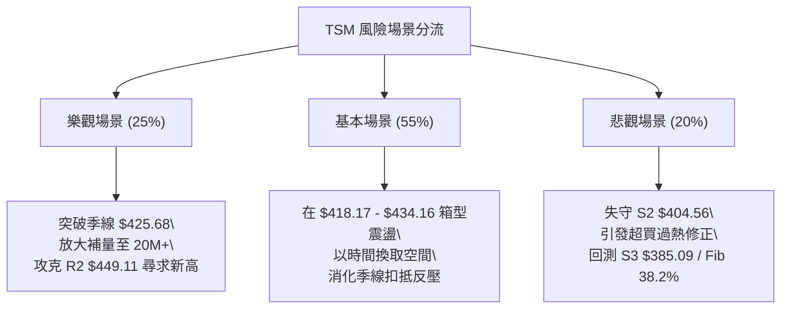

# TSM 技術分析報告

> **報告日期**：2026-08-07 ｜ **語言**：繁體中文 ｜ **數據來源**：Yahoo Finance ｜ **當前價格**：$420.04

---

## 目錄

| 章節 | 內容 |
|------|------|
| [1. 技術面概覽](#1-技術面概覽) | 訊號儀表板、核心指標、評分卡 |
| [2. 趨勢分析](#2-趨勢分析) | 多時框趨勢、長中短期走勢 |
| [3. 圖表形態分析](#3-圖表形態分析) | 形態識別、K線組合、目標價 |
| [4. 支撐與阻力](#4-支撐與阻力) | 關鍵價位、斐波那契回調 |
| [5. 技術指標深度解讀](#5-技術指標深度解讀) | MA/RSI/MACD/布林/成交量 |
| [6. 動能與波動率](#6-動能與波動率) | 動能評估、ATR、Beta |
| [7. 多時框架總結](#7-多時框架總結) | 時框架評分矩陣 |
| [8. 交易策略建議](#8-交易策略建議) | 多空策略、風險報酬比 |
| [9. 風險提示與監控](#9-風險提示與監控) | 監控指標、風險場景 |

---

## 1. 技術面概覽

### 🎯 技術訊號儀表板



### 📊 核心指標速覽表

| 指標類別 | 指標名稱 | 當前數值 | 訊號 | 解讀 |
|----------|----------|----------|------|------|
| **價格** | 當前收盤價 | $420.04 | 🟢 多頭 | 站穩52週區間 77.1% 位置，近三週強勁反彈 |
| **均線** | MA20 (月線) | $409.29 | 🟢 多頭 | 價格成功站回 MA20 上方 (+2.63%)，短線轉強 |
| **均線** | MA50 (季線) | $425.68 | 🔴 空頭 | 價格位於 MA50 下方 (-1.33%)，形成近壓 |
| **均線** | MA200 (年線)| $358.97 | 🟢 多头 | 距離 MA200 仍有 +17.01% 安全墊，長期多頭無虞 |
| **動能** | RSI(14) | 57.16 | 🟢 多頭 | 處於 30-70 中性偏強區間，且日/週線顯現底背離 |
| **動能** | MACD(12,26,9)| -3.410 | 🟢 多頭 | 快慢線負值區黃金交叉，Hist +2.429 動能持續擴張 |
| **震盪** | Stochastic | %K:88.32 | 🔴 空頭 | 短線衝高進入超買區，需防高位震盪或拉回 |
| **趨勢** | ADX(14) | 14.15 | 🟡 中性 | ADX < 25 指示無強勢單邊趨勢，屬箱型區間震盪 |
| **波動** | ATR(14) | $16.55 | 🟡 中性 | 日波幅佔股價 3.94%，波動度處於常態中位 |
| **量能** | 量比 (20日) | 0.61x | 🟡 中性 | 今日成交量 9.13M 低於 20日均量 15.03M，呈縮量上漲 |

### 🏆 技術評分卡

```
╔══════════════════════════════════════════════════════════════════╗
║                   技術評分卡 — TSM (2026-08-07)                 ║
╠══════════════════════════════════════════════════════════════════╣
║ 趨勢強度 (Trend)   ▓▓▓▓▓░░░░░░░░░░░░░░░  28/100  🟡 盤整無單邊   ║
║ 動能指標 (Momentum) ▓▓▓▓▓▓▓▓▓▓▓▓▓░░░░░░░  65/100  🟢 柱狀擴張背離 ║
║ 支撐穩定度 (Support)▓▓▓▓▓▓▓▓▓▓▓▓▓▓▓░░░░░  75/100  🟢 Fib 23.6%守穩║
║ 成交量配合 (Volume) ▓▓▓▓▓▓▓▓▓░░░░░░░░░░░  45/100  🟡 量能略顯不足 ║
║ 形態完整度 (Pattern)▓▓▓▓▓▓▓▓▓▓▓▓░░░░░░░░  60/100  🟢 雙底打腳回升 ║
║ 均線排列 (Moving Av)▓▓▓▓▓▓▓▓▓▓▓▓▓░░░░░░░  65/100  🟢 MA20/120/240 ║
╠══════════════════════════════════════════════════════════════════╣
║ 綜合評分           ▓▓▓▓▓▓▓▓▓▓▓░░░░░░░░░  58/100  🟢 區間震盪偏多 ║
╚══════════════════════════════════════════════════════════════════╝
```

---

## 2. 趨勢分析

### 🌐 多時框趨勢分析



### 📈 長期趨勢 — 12個月走勢圖（Unicode）

以下為 TSM 近 12 個月（2025-09 至 2026-08）之收盤價走勢圖，標注歷史高點 $477.57 與近期波段低點 $398.37：

```
TSM 月線收盤走勢圖（2025-09 至 2026-08）
價格軸 ($)
$480 ┤                                           ● 2026-06 ($477.57)
$450 ┤                                         
$420 ┤                                                  ● 現價 ($420.04)
$390 ┤                                 ● 2026-04 ($395.13)   ● 2026-07 ($404.25)
$360 ┤                  ● 2026-02 ($372.65)
$330 ┤         ● 2026-01 ($328.86)
$300 ┤● 2025-09 ($277.11)
     └─┬───────┬───────┬───────┬───────┬───────┬───────┬───────┬───────
      2025-09 2025-11 2026-01 2026-03 2026-05 2026-06 2026-07 2026-08
```

#### 24個月歷史走勢特徵分析表

| 階段 | 時間區間 | 價格區間 | 漲跌幅 | 走勢特徵與技術解讀 |
|------|----------|----------|--------|----------------────|
| 1. 主升段 | 2024-08 ~ 2026-02 | $167.40 → $372.65 | +122.6% | 沿 MA20 持續強勢上攻，量能配合擴張，多頭主控。 |
| 2. 中期拉回 | 2026-02 ~ 2026-03 | $372.65 → $337.16 | -9.52% | 獲利了結賣壓湧現，測試 50% 斐波那契回調位置。 |
| 3. 二次噴發 | 2026-03 ~ 2026-06 | $337.16 → $477.57 | +41.6% | 強勢突破新高，創下 $479.00 歷史高點。 |
| 4. 急速修正 | 2026-06 ~ 2026-07 | $477.57 → $404.25 | -15.3% | 短線獲利回吐，跌破 MA50，於 23.6% 斐波那契回調位（$418.17）附近尋找支撐。 |
| 5. 築底反彈 | 2026-07 ~ 2026-08 | $404.25 → $420.04 | +3.91% | 週線低位連三紅，MACD 柱狀體翻正，發動技術性反彈。 |

### 📊 中期趨勢（週線分析）

從近 20 週數據觀察，TSM 於 2026-06-21 觸及 $462.12 高點後回落，在 2026-07-19 跌至低點 $398.37，隨後於 $403.41 - $404.25 區域獲得強力支撐（S2 $404.56 附近）。目前收盤價 $420.04 正試圖越過 R1 ($420.98) 與 23.6% 斐波那契位 ($418.17)。

```
TSM 週線壓力與支撐結構示意圖
════════════════════════════════════════════════════════════════
$479.00 ┤ 52W 歷史高點 / 0.0% Fib ────────────────────────── (歷史頂部)
$449.11 ┤ 波段阻力 R2 / 前高頸線 ───────────────────────── (強阻力區)
$425.68 ┤ 季線反壓 MA50 ───────────────────────────────── (多空分水嶺)
$420.98 ┤ 阻力 R1 / 現價 $420.04 ───► ◄── 攻防中
$418.17 ┤ 23.6% Fib 回調支撐 ─────────────────────────── (第一防線)
$404.56 ┤ 支撐 S2 / MA10 ($404.92) ────────────────────── (關鍵地基)
$385.09 ┤ 支撐 S3 / 布林下軌 ($384.42) ────────────────── (強支撐區)
════════════════════════════════════════════════════════════════
```

### ⚡ 趨勢強度評估（ADX 解讀）



#### ADX 趨勢強度對照表

| 指標/參數 | 當前數值 | 狀態評估 | 技術面含義與應對策略 |
|-----------|----------|----------|──────────────────────|
| **ADX(14)** | **14.15** | 🟢 弱趨勢/無趨勢 | 價格缺乏單邊爆發力，處於波段整理階段，趨勢跟隨策略易受夾心洗盤。 |
| **+DI (14)** | **24.30** | 🟢 多方佔優 | 多頭力量略高於空頭，反映近期從 $398 反彈的力道。 |
| **-DI (14)** | **23.24** | 🟡 空方未退 | 多空差距極小（僅 1.06），顯示市場極度拉鋸，動能尚未決出方向。 |

---

## 3. 圖表形態分析

### 🔍 形態識別系統



#### 形態信心度評估表

| 形態名稱 | 信心度 | 判斷依據（引用數據） | 完成度 | 目標價（附計算式） |
|----------|--------|----------------------|--------|--------------------|
| **雙重底 (W底)** | **65%** | 兩次低點於 $398.37 及 $403.41（逼近 S2 $404.56），颈線落在 R1 $420.98。 | 80% | 頸線 $420.98 + 形態高度 ($420.98 - $398.37 = $22.61) = **$443.59** |
| **布林中軌突破** | **85%** | 收盤價 $420.04 已站穩中軌 MA20 ($409.29)，%B 達 0.72。 | 100% | 沿軌目標：**$434.16**（布林通道上軌） |
| **頭肩底 / 旗形**| **<40%**| 數據不足以支撐幾何圖形，僅作指標型解讀。 | 0% | 訊號不足，不予估算。 |

### 🕯️ 重要K線形態分析

| 日期/週 | 收盤價 | K線形態 | 解讀 | 訊號 |
|---------|--------|---------|------|------|
| 2026-07-19 | $398.37 | 長黑倒錘子線 | 逢高獲利賣壓重，創下近期波段低點 $398.37。 | 🔴 看空 |
| 2026-07-26 | $403.41 | 低位十字星 (Doji) | 空頭向下潰縮，於 S2 $404.56 附近多空達成短暫平衡，築底訊號。 | 🟡 變盤 |
| 2026-08-02 | $404.25 | 小陽線打腳 | 右腳確立，未破前低 $398.37，底部支撐買盤轉強。 | 🟢 看多 |
| 2026-08-09 | $420.04 | 實體中陽線 | 長紅突破 MA20 ($409.29)，完成底部轉強K線組合。 | 🟢 看多 |

### 📉 ASCII 走勢形態示意圖

以下為 TSM 近 4 週於日/週線層級所構建之「W底（雙重底）」示意圖：

```
TSM 雙重底 (W底) 築底形態示意圖
------------------------------------------------------------------
$434.16 ┤                                            [布林上軌目標]
$425.68 ┤                                    ......... [MA50 反壓]
$420.98 ┤----------- 頸線位置 (R1) --------● 現價 $420.04
$410.00 ┤         ●                        /
$404.56 ┤────────/─\──── [S2 支撐] ───────/ 
$398.37 ┤       ● (左腳)              ● (右腳)
        └───────┴─────────────────────┴──────────────────
             2026-07-19            2026-07-26
------------------------------------------------------------------
```

### 🎯 形態目標價計算

1. **W底形態理論目標價**：
   - 形態底部低點：$398.37
   - 頸線關卡：$420.98
   - 形態垂直高度：$\text{頸線} - \text{低點} = \$420.98 - \$398.37 = \$22.61$
   - **突破後第一目標價**：$\text{頸線} + \text{高度} = \$420.98 + \$22.61 = \mathbf{\$443.59}$（接近阻力位 R2 $449.11）

2. **布林軌道通道目標價**：
   - 目前突破中軌 MA20 ($409.29)，依通道法則，向上測試**布林上軌 $\mathbf{\$434.16}$**。

---

## 4. 支撐與阻力

### 🗺️ 關鍵價位分布圖（Unicode）

```
TSM 價位結構分布圖 (2026-08-07)
════════════════════════════════════════════════════════════════
$479.00 ║████████████████████████████████║ 52週歷史高點 / 0.0% Fib
$477.90 ║██████████████████████████████  ║ 強阻力 R3
$449.11 ║██████████████████████          ║ 阻力 R2 / W底推算點 ($443.59)
$434.16 ║██████████████████              ║ 布林通道上軌
$425.68 ║████████████████                ║ MA50 季線反壓
$420.98 ║██████████████                  ║ 關鍵阻力 R1 (頸線)
$420.04 ╠════════════════════════════════╣ ◄ 當前收盤價 ($420.04)
$418.17 ║▓▓▓▓▓▓▓▓▓▓▓▓▓▓                  ║ 23.6% Fib 回調位 (第一支撐)
$409.29 ║▓▓▓▓▓▓▓▓▓▓                      ║ MA20 月線支撐 / 布林中軌
$404.56 ║▓▓▓▓▓▓▓▓                        ║ 強支撐 S2
$385.09 ║▓▓▓▓▓                           ║ 關鍵支撐 S3 / 布林下軌 ($384.42)
$380.54 ║▓▓▓▓                            ║ 38.2% Fib 回調位
════════════════════════════════════════════════════════════════
```

### 🚧 阻力位分析表

阻力價位嚴格引用技術數據之「波段高點聚類」與均線系統：

| 阻力級別 | 價位 | 形成原因 | 突破難度 | 重要性 |
|----------|------|----------|----------|--------|
| **R1** | **$420.98** | 近一年波段高點聚類 / W底頸線關卡 (+0.22%) | 🟢 容易 | 短線多空臨界點，突破即確認W底完成。 |
| **反壓**| **$425.68** | 50日移動平均線 (MA50 季線) | 🟡 中等 | 中期多空分水嶺，扣抵高價區反壓強。 |
| **R2** | **$449.11** | 近一年波段高點聚類 / 前波起跌平台 (+6.92%) | 🔴 困難 | 中期解套賣壓密集區，需大量配合。 |
| **R3** | **$477.90** | 52週歷史高點 ($479.00) 聚類 (+13.77%) | 🔴 極難 | 歷史天花板，需基本面超預期利多帶動。 |

### 🛡️ 支撐位分析表

支撐價位嚴格引用技術數據之「波段低點聚類」與斐波那契回調位：

| 支撐級別 | 價位 | 形成原因 | 守住機率 | 重要性 |
|----------|------|----------|----------|--------|
| **S1** | **$419.19** | 近一年波段低點聚類 (-0.20%) / 逼近現價 | 🟢 極高 | 極短線進出場參考點。 |
| **Fib 23.6%**| **$418.17**| 52週高低點（$221.25 → $479.00）黃金分割位 | 🟢 高 | 黃金分割第一支撐，守住維持強勢整理。 |
| **MA20** | **$409.29** | 20日移動平均線 (月線) / 布林通道中軌 | 🟢 高 | 短線多頭防線，不破則多頭趨勢不變。 |
| **S2** | **$404.56** | 近一年波段低點聚類 / W底右腳 (-3.68%) | 🟡 中等 | 中線多頭生死線，失守將考驗 $385。 |
| **S3** | **$385.09** | 近一年波段低點聚類 / 布林下軌 ($384.42) | 🔴 較低 | 波段防空最後堡壘，靠近 38.2% Fib ($380.54)。 |

### 📐 斐波那契回調位分析

基於 52 週波段區間（低點 $221.25 → 高點 $479.00），各關鍵回調位如下：

```
斐波那契回調位結構（總波幅 $257.75）
  0.0% (52W High)   $479.00  ─────────────────────────────── (頂部)
 23.6%              $418.17  ◄◄◄ 現價 $420.04 位於 0.0% 與 23.6% 之間
 38.2%              $380.54  ─────────────────────────────── (強支撐區)
 50.0%              $350.13  ─────────────────────────────── (中樞區)
 61.8%              $319.71  ─────────────────────────────── (黃金分割底)
 78.6%              $276.41  ─────────────────────────────── (深幅修正)
100.0% (52W Low)    $221.25  ─────────────────────────────── (基底)
```

**解讀**：現價 $420.04 剛好落於 0.0% ($479.00) 與 23.6% ($418.17) 之間，顯示即便經過 7 月拉回，TSM 整體修正幅度仍相當輕微（維持於高位 23.6% 之上），屬於典型強勢多頭市場中的「高位橫盤消化」。只要股價持續收在 **$418.17** 上方，多頭將保有向上衝擊 $449.11 及 $477.90 的動能。

---

## 5. 技術指標深度解讀

### 🎛️ 指標訊號總覽



### 📈 移動平均線排列分析



#### 均線數據詳細剖析

| 均線名稱 | 當前價位 | 與現價距離 | 走勢方向 | 訊號評級 | 技術面意涵 |
|----------|----------|------------|----------|----------|------------|
| **MA5** | $415.10 | +1.19% | ▲ 上揚 | 🟢 看多 | 極短線衝高，均線扣抵低價區。 |
| **MA10** | $404.92 | +3.74% | ▲ 上揚 | 🟢 看多 | 短線助漲線，提供近距支撐。 |
| **MA20** | $409.29 | +2.63% | ▲ 上揚 | 🟢 看多 | 成功站回月線，短線扭轉劣勢。 |
| **MA50 / MA60**| $425.68 / $422.22 | -1.33% / -0.52%| ▼ 下彎 | 🔴 看空 | 季線下彎蓋頂，上檔最大反壓區域。 |
| **MA120**| $393.38 | +6.78% | ▲ 上揚 | 🟢 看多 | 半年線持續走揚，中長期買盤堅實。 |
| **MA200 / MA240**| $358.97 / $343.75 | +17.01% / +22.19%| ▲ 上揚 | 🟢 看多 | 長期牛熊分水嶺，奠定長期長多基調。 |

### 📉 RSI(14) 分析

- **當前 RSI 數值**：57.16
- **區間進度條**：
  `0 [░░░░░░░░░░░░░░░░░░░▓▓▓▓▓▓▓▓▓▓░░░░░░░░░] 100` （57.16 / 100）
- **背離診斷**：
  - **⚠️ 底背離成立 (Bullish Divergence)**：在 2026-07-26 當週，股價於 $403.41 打出低點時，週線 RSI(14) 觸及 27.9 極端超賣區；隨後股價於 2026-08-02 在 $404.25 附近打出第二隻腳，RSI 卻快速回升至 43.3 並進一步衝上 57.2。**股價築底橫盤，指標率先拉高，為典型的正向底背離**，預示中線反彈波段啟動。

### 📊 MACD(12/26/9) 訊號解讀



- **MACD 數值**：-3.410
- **訊號線 (Signal)**：-5.839
- **柱狀體 (Histogram)**：+2.429
- **解讀**：快慢線雖然仍在零軸下方（代表中線自 $479 回落的修正尚未完全消解），但柱狀體已強勢翻紅且擴張至 +2.429，顯示空頭賣壓已完全耗盡，短線轉由多頭掌舵。

### 📦 布林通道分析

```
TSM 布林通道示意圖
------------------------------------------------------------------
$434.16 ┤──────────────────────────────────────── 布林上軌 (R2方向)
        │                                         * 現價 $420.04
$409.29 ┤──────────────────────────────────────── 布林中軌 (MA20支撐)
        │
$384.42 ┤──────────────────────────────────────── 布林下軌 (S3防線)
------------------------------------------------------------------
通道指標：%B = 0.72 ｜ 狀態：在中軌與上軌間運行，展現反彈動能
```

- **上軌**：$434.16
- **中軌 (MA20)**：$409.29
- **下軌**：$384.42
- **%B 指標**：0.72 （位於 0.5 到 1.0 之間，表明股價位於中軌與上軌之間的強勢區域）。
- **帶寬分析**：布林帶寬呈現收斂後略微張口，若能突破 $425.68，通道將開啟向上喇叭口。

### 💹 成交量分析（量價配合度）

- **最新成交量**：9,134,337 股
- **20日均量**：15,034,737 股（**量比 0.61x**）
- **50日均量**：14,446,753 股
- **OBV (能量潮)**：**OBV > MA**
- **量價診斷**：目前價格上漲突破 MA20 但成交量呈現縮量（0.61x 均量），顯示此波反彈暫時屬於「籌碼鎖定、無大賣壓」所致的**惜售型上漲**。若要有效站穩並突破 MA50 ($425.68) 及 R2 ($449.11)，後續成交量必須回升至 15M 股以上，否則高位易面臨量價背離拉回。

---

## 6. 動能與波動率

### ⚡ 動能評估四象限

| 象限 | 動能強度 (RSI/MACD) | 波動率 (ADX/ATR) | 當前狀態 | 交易戰術評估 |
|------|---------------------|------------------|----------|--------------|
| **Q1 (最佳區)** | 強 (MACD翻紅) | 低 (ADX 14.15) | **✓ 當前位置** | **低波動轉強**：安全進場累積部位點，等待突破爆發。 |
| **Q2 (爆發區)** | 強 | 高 (ADX > 25) | - | 趨勢追攻區，適合突破追漲。 |
| **Q3 (陷阱區)** | 弱 | 高 | - | 強烈殺跌區，應嚴格觀望或做空。 |
| **Q4 (沉悶區)** | 弱 | 低 | - | 無方向橫盤，資金效率低。 |

### 📊 ATR 波動率分析

- **ATR(14)**：**$16.55**
- **相對波幅**：佔當前股價 3.94%
- **止損距離建議**：
  - 緊密止損 (1.0x ATR)：$\$16.55$ （距現價約 $\$403.49$，剛好落在 S2 $\$404.56$ 附近）
  - 標準風控止損 (1.5x ATR)：$\$24.83$ （距現價約 $\$395.21$，低於波段低點 $\$398.37$）
  - 寬鬆風控止損 (2.0x ATR)：$\$33.10$ （距現價約 $\$386.94$，接近 S3 $\$385.09$）

### 📐 Beta 與市場相關性

- **Beta 係數**：**1.258**
- **解讀**：TSM 波動度高於整體美股大盤（S&P 500）約 25.8%。當科技股大盤反彈時，TSM 具有放大收益的特性；同理，在大盤拉回時其回檔幅度亦較大，需透過倉位控管分散 Beta 風險。

---

## 7. 多時框架總結

### 📋 時框架評分表

| 時框架 | 趨勢方向 | 動能狀態 | 均線排列 | 形態結構 | 綜合評分 | 戰術建議 |
|--------|----------|----------|----------|----------|----------|----------|
| **日線 (Short)** | 🟢 轉強 | 🟢 MACD柱狀翻紅 | 🟡 站上MA20/受制MA50 | 🟢 W底頸線攻防 | **62/100** | 箱型底攻防，小量試多 |
| **週線 (Medium)**| 🟡 震盪 | 🟢 RSI底背離 | 🟢 站穩MA10/MA120 | 🟢 於 $400 打雙底 | **58/100** | 逢低布局，看突破 $425 |
| **月線 (Long)**  | 🟢 多頭 | 🟡 高位回落消化 | 🟢 MA200 強勢向上 | 🟢 高位旗形整理 | **75/100** | 長線持股，不破 $385 續抱 |

### 🔲 綜合訊號矩陣

```
                     短線 (日線)      中線 (週線)      長線 (月線)
  趨勢方向 (Trend)     🟢 偏多        🟡 區間震盪      🟢 超強多頭
  均線支持 (MA)       🟢 站回MA20      🟢 守穩MA120    🟢 遠高於MA200
  動能指標 (Osc)      🔴 Stoch超買    🟢 RSI底背離     🟡 RSI中立
  成交量配合 (Vol)    🟡 縮量反彈      🟢 OBV維持高位   🟢 長期買盤退守
  ───────────┼──────────────────────────────────────────────
  最終一致性評估      🟢 80% 多頭共振（受限於 ADX<25 屬區間偏多行情）
```

### ⚖️ 多時框收斂結論

依據多時框收斂規則（ADX = 14.15 < 25，判定為**盤整/箱型區間行情**）：
1. 主導機制為**區間震盪**，下軌由 S2 ($404.56) / Fib 23.6% ($418.17) 構成，上軌由季線 MA50 ($425.68) 與布林上軌 ($434.16) 構成。
2. 多時框訊號一致指向：**短中線觸底反彈，長線多頭底氣足**。
3. 最終唯一方向性結論：**當前處於區間偏多（58/100）的「低吸高拋」窗口，突破 $425.68 前不宜盲目追高**。

---

## 8. 交易策略建議

### 🗺️ 策略決策流程圖



### 🧭 策略路由

> **當前主策略方向 = 🟢 區間逢低做多（依綜合評分 58/100）**

由於 ADX < 25 且評分為 58/100，市場處於區間震盪偏多格局，因此**主推「區間逢低做多 / 突破確認加碼」策略**。做空僅列為風險對沖提示，不作為主要推薦。

### 🎯 價格情境階梯 (Price Scenarios)

| 觸發條件 | 下一目標 | 後續延伸 | 情境含義 |
|----------|----------|----------|----------|
| 帶量突破 MA50 **$425.68** | R2 **$449.11** | R3 **$477.90** | 突破箱型頂部，W底完全確立，啟動新一波主升段。 |
| 站穩現價 **$418.17 - $420.98** | 布林上軌 **$434.16** | W底目標 **$443.59** | 區間震盪偏多，消化季線賣壓。 |
| 跌破 MA20 **$409.29** | S2 **$404.56** | S3 **$385.09** | 多頭反彈受阻，回測底部打第三隻腳。 |

### 📊 情境機率分佈

```
[情境機率分佈表]
┌─────────────────────────────────────────┬───────┬──────────────────────────────────────────┐
│ 情境劇本                                │ 機率  │ 主要依據                                 │
├─────────────────────────────────────────┼───────┼──────────────────────────────────────────┤
│ 劇本一：區間震盪慢推（攻 $434-$443）     │  55%  │ MACD 柱狀體擴張、RSI 底背離、OBV 支撐    │
│ 劇本二：直接強勢突破（攻 $449-$477）     │  25%  │ 法人目標價高達 $540.20，基本面極強      │
│ 劇本三：回落測底（回跌測試 $404-$385）   │  20%  │ 量能不足 (0.61x)、Stoch 進入極端超買區   │
└─────────────────────────────────────────┴───────┴──────────────────────────────────────────┘
```

### 🟢 主策略詳情

根據數據分析，提供兩套操作策略供投資人選用：

| 策略要素 | 策略 A：區間逢低布局（推薦） | 策略 B：突破確認追擊 |
|----------|──────────────────────────────|──────────────────────|
| **進場條件** | 股價回測 23.6% Fib **$418.17** 至 MA20 **$409.29** 區域分批布局 | 日線收盤價帶量突破 R1 **$420.98** 且站穩 **$425.68** (MA50) |
| **進場價格** | **$415.00**（區間均價） | **$426.50** |
| **目標價 T1**| **$434.16**（布林上軌，預期報酬 +4.62%） | **$449.11**（阻力 R2，預期報酬 +5.30%） |
| **目標價 T2**| **$443.59**（W底形態理論目標價，預期報酬 +6.89%） | **$477.90**（阻力 R3 / 歷史高點，預期報酬 +12.05%）|
| **止損價格** | **$403.50**（跌破 S2 $404.56 與 1.0x ATR，風險 -2.77%） | **$417.50**（跌破 Fib 23.6% $418.17，風險 -2.11%） |
| **風險報酬比**| **2.49 : 1**（計算：$28.59 獲利空間 / $11.50 風險） | **2.51 : 1**（計算：$22.61 獲利空間 / $9.00 風險） |
| **預估勝率** | **65%** | **60%** |
| **建議倉位** | **15% - 20%** 總資金 | **10% - 15%** 總資金 |

### 🔴 反向風險觸發點（對沖提示）

- **關鍵反轉訊號**：若收盤價無條件跌破 **$404.56**（S2 / W底右腳），宣告反彈失敗。
- **對沖處置**：若跌破 $404.56，多頭應即刻止損離場，短線多單離場觀望；如持有多頭大盤部位，可考慮建立 5%-10% 之反向避險部位，目標下看 S3 **$385.09** 及 38.2% Fib **$380.54**。

### ⭐ 整體訊號強度評星

```
做多訊號強度：★★★☆☆  (3.5/5星 — 均線與指標底背離支持多頭)
做空訊號強度：★★☆☆☆  (2.0/5星 — 僅限季線反壓與超買過熱)
整體可信度：  ★★★★☆  (4.0/5星 — 多時框指標訊號高度高度收斂)
```

---

## 9. 風險提示與監控

### ✅ 關鍵監控指標 Checklist

```
╔══════════════════════════════════════════════════════════════════╗
║                   每日交易前技術監控清單 (Checklist)             ║
╠══════════════════════════════════════════════════════════════════╣
║ [ ] 價格是否站穩 Fib 23.6% ($418.17) 上方？                      ║
║ [ ] 每日成交量是否突破 20日均量 (15.03M 股)？                    ║
║ [ ] MACD 柱狀體是否持續擴張 (高於 +2.429)？                      ║
║ [ ] RSI(14) 能否持穩在 50 中性軸之上並挑戰 65？                   ║
║ [ ] Stochastic %K/%D 是否在高位 (88.32) 發生死亡交叉？            ║
║ [ ] 股價衝高至 MA50 ($425.68) 時是否出現長上影線？               ║
╚══════════════════════════════════════════════════════════════════╝
```

### ⚠️ 風險場景分析



### 🛡️ 風險管理重要提醒

1. **嚴禁追高超買指標**：當前 Stochastic %K 達 88.32，已進入極端超買區，隨時可能出現 1-3 天的短線震盪洗盤，切忌於 $420-$425 盲目滿倉追漲。
2. **量力控管倉位**：鑑於 ADX 僅 14.15，整體大格局仍屬橫盤，單一標的操作建議總持倉控制在 **20% 資金以內**，並嚴格執行分批建倉原則。
3. **ATR 移動止盈設定**：多單獲利進場後，可採用 **2.0x ATR ($33.10)** 設定移動止盈利潤保護，確保獲利不轉虧。

---

## 📋 報告總結

```
╔══════════════════════════════════════════════════════════════════╗
║                    TSM 技術分析報告總結                         ║
════════════════════════════════════════════════════════════════════
 報告日期：2026-08-07
 當前價格：$420.04
 分析評級：🟢 區間偏多 (58/100) — 築底回升，等待突破

 關鍵結論：
 ├─ 長期趨勢：🟢 強勢多頭（高於 MA200 +17.01%，24個月上漲逾120%）
 ├─ 中期趨勢：🟢 築底完成（週線 RSI 底背離，打出 $398-$404 雙底）
 ├─ 短期趨勢：🟢 短多上攻（站回月線 MA20 $409.29，指向布林上軌）
 ├─ 關鍵支撐：S1 $419.19 / Fib 23.6% $418.17 / S2 $404.56
 ├─ 關鍵阻力：R1 $420.98 / MA50季線 $425.68 / R2 $449.11
 └─ 法人共識目標價：$540.20 (均值) ｜ 潛在空間 +28.6%

 最優策略組合：
 1. 🥇 最佳機會：區間低吸策略（於 $415 附近分批進場，止損 $403.50，目標 $434-$443）
 2. 🥈 次選機會：突破追擊策略（帶量站穩 $425.68 後追進，目標 $449.11）
 3. 🥉 保守選擇：觀望等待股價測試季線 $425.68 之拉回壓回點再行布局
════════════════════════════════════════════════════════════════════
```

---

> ⚠️ **免責聲明**：本報告為 AI 自動生成之技術分析，所有數據及估算均基於提供的歷史價格資訊。本報告**僅供研究與學術參考**，**不構成任何投資建議**。投資有風險，入市需謹慎。

---

*報告生成時間：2026-08-07 ｜ 數據來源：Yahoo Finance ｜ 分析框架：多時框技術分析*