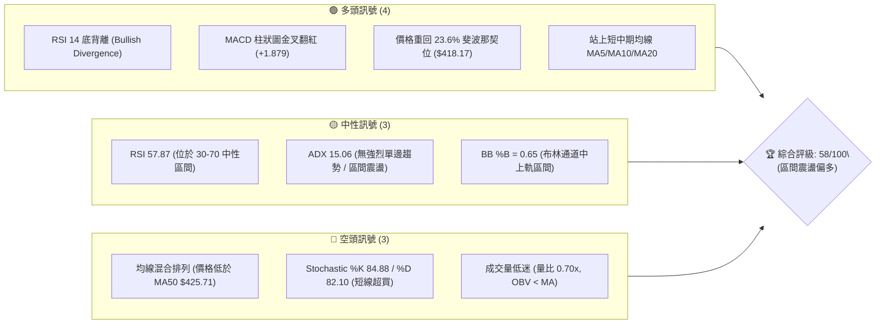
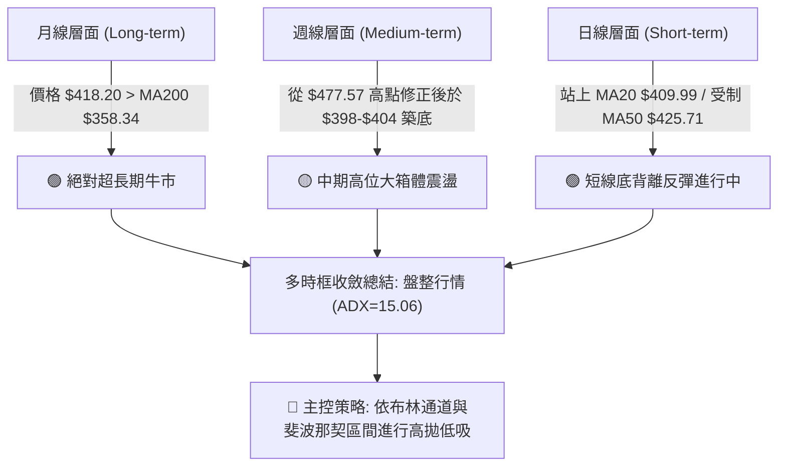
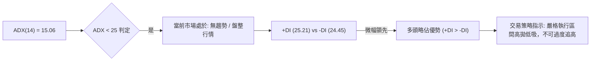
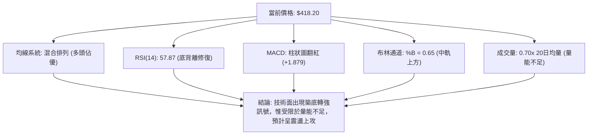
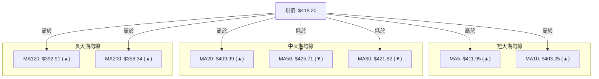
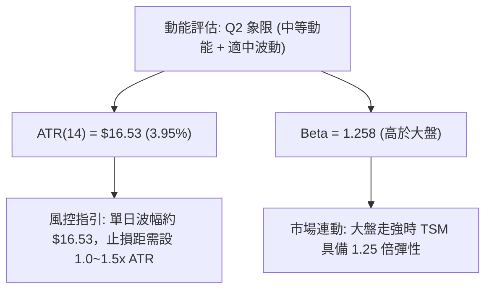
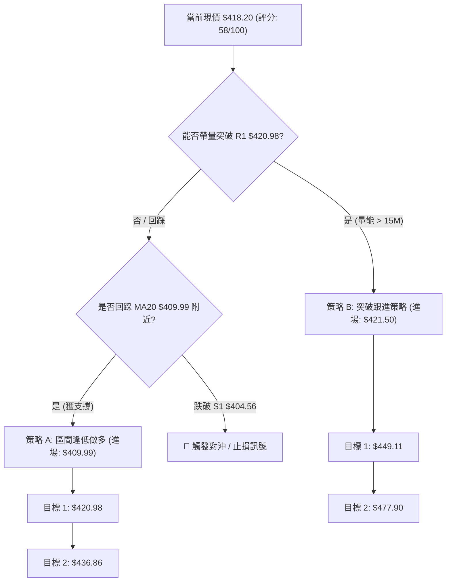
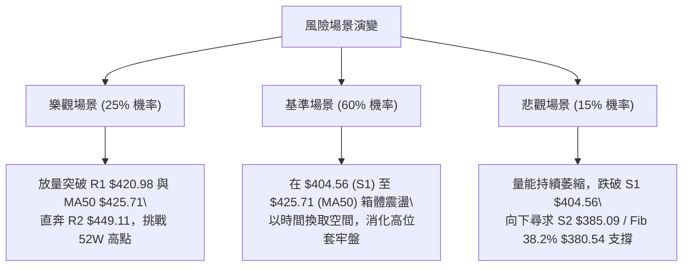

# TSM 技術分析報告

> **報告日期**：2026-08-07 ｜ **語言**：繁體中文 ｜ **數據來源**：Yahoo Finance ｜ **當前價格**：$418.20

---

## 目錄

| 章節 | 內容 |
|------|------|
| [1. 技術面概覽](#1-技術面概覽) | 訊號儀表板、核心指標、評分卡 |
| [2. 趨勢分析](#2-趨勢分析) | 多時框趨勢、長中短期走勢 |
| [3. 圖表形態分析](#3-圖表形態分析) | 形態識別、K線組合、目標價 |
| [4. 支撐與阻力](#4-支撐與阻力) | 關鍵價位、斐波那契回調 |
| [5. 技術指標深度解讀](#5-技術指標深度解讀) | MA/RSI/MACD/布林/成交量 |
| [6. 動能與波動率](#6-動能與波動率) | 動能評估、ATR、Beta |
| [7. 多時框架總結](#7-多時框架總結) | 時框架評分矩陣 |
| [8. 交易策略建議](#8-交易策略建議) | 多空策略、風險報酬比 |
| [9. 風險提示與監控](#9-風險提示與監控) | 監控指標、風險場景 |

---

## 1. 技術面概覽

### 🎯 技術訊號儀表板



### 📊 核心指標速覽表

| 指標類別 | 指標名稱 | 當前數值 | 訊號 | 解讀 |
|----------|----------|----------|------|------|
| **價格** | 當前價格 | $418.20 | 🟢 | 位於52週區間 76.4% 位置，重回 key Fib 位 |
| **均線** | MA20 (月線) | $409.99 | 🟢 | 價格在其上方 (+2.00%)，短線提供動態支撐 |
| **均線** | MA50 (季線) | $425.71 | 🔴 | 價格在其下方 (-1.76%)，形成短線下壓壓力 |
| **均線** | MA200 (年線) | $358.34 | 🟢 | 價格遠在其上方 (+16.71%)，超長期多頭底座穩固 |
| **動能** | RSI(14) | 57.87 | 🟢 | 中性偏多，且日/週線層面出現底背離修復訊號 |
| **動能** | MACD(12,26,9) | -4.567 / Hist +1.879 | 🟢 | 快慢線負值區黃金交叉，柱狀圖擴張，動能回升 |
| **動能** | Stochastic %K/%D | 84.88 / 82.10 | 🔴 | 進入 >80 超買區，慎防短線衝高拉回 |
| **趨勢** | ADX(14) | 15.06 | 🟡 | 弱趨勢/盤整 (ADX<25)，適合區間操作 |
| **波動** | ATR(14) | $16.53 (3.95%) | 🟡 | 日均波動適中，止損空間易於設定 |
| **量能** | 日成交量 | 10.53M (量比 0.70x) | 🔴 | 量能尚未跟上，反彈屬於無量跟進狀態 |

### 🏆 技術評分卡

```
╔══════════════════════════════════════════════════════════════════╗
║                   技術評分卡 — TSM (2026-08-07)                  ║
╠══════════════════════════════════════════════════════════════════╣
║ 趨勢強度 (ADX)     ▓▓▓▓▓▓▓░░░░░░░░░░░░░  35/100  🟡 盤整無強趨勢    ║
║ 動能指標 (RSI/MACD) ▓▓▓▓▓▓▓▓▓▓▓▓▓░░░░░░░  65/100  🟢 底背離+金叉擴張  ║
║ 支撐穩定度 (S1/Fib) ▓▓▓▓▓▓▓▓▓▓▓▓▓▓▓░░░░░  75/100  🟢 Fib 23.6% 護盤  ║
║ 成交量配合 (OBV/Vol)▓▓▓▓▓▓▓░░░░░░░░░░░░░  35/100  🔴 量能顯著退潮    ║
║ 形態完整度 (雙底構築)▓▓▓▓▓▓▓▓▓▓▓▓░░░░░░░░  60/100  🟡 構築築底形態中  ║
║ 均線結構 (MA排列)   ▓▓▓▓▓▓▓▓▓▓▓░░░░░░░░░  55/100  🟡 混合排列 (MA20上)║
╠══════════════════════════════════════════════════════════════════╣
║ 綜合技術評分       ▓▓▓▓▓▓▓▓▓▓▓█░░░░░░░░  58/100  🟡 區間震盪偏多    ║
╚══════════════════════════════════════════════════════════════════╝
```

---

## 2. 趨勢分析

### 🌐 多時框趨勢分析



### 📈 長期趨勢 — 12個月走勢圖（Unicode）

```
TSM 月線走勢圖（2025-08 至 2026-08）
價格軸 ($)
$480 ┤                                                 ● (06月創高 $477.57)
$440 ┤                                           ●     │
$400 ┤                                     ●     │     ●   ● (現價 $418.20)
$360 ┤                               ●     │     │     │   │
$320 ┤                         ●     │     │     │     │   │
$280 ┤                   ●     │     │     │     │     │   │
$240 ┤             ●     │     │     │     │     │     │   │
$200 ┤ ●(25-08 $228.34) │     │     │     │     │     │   │
     └─┴───────────┴─────┴─────┴─────┴─────┴─────┴─────┴───┴───────► 時間
      25-08       25-10 25-12 26-02 26-04 26-05 26-06 26-07 26-08
```

#### 走勢特徵分析表格

| 階段 | 時間區間 | 價格變動 | 漲跌幅 | 走勢特徵描述 |
|------|----------|----------|--------|--------------|
| **起漲段** | 2025-08 → 2026-02 | $228.34 → $372.65 | +63.20% | 強勢主升段，月線連陽，突破多條歷史阻力 |
| **高位洗盤** | 2026-02 → 2026-03 | $372.65 → $337.16 | -9.52% | 急速獲利回吐，回踩 MA120 後獲得強支撐 |
| **二次主升** | 2026-03 → 2026-06 | $337.16 → $477.57 | +41.65% | 主力再次強勢拉升，創下 52 週歷史新高 $479.00 |
| **深度修正** | 2026-06 → 2026-07 | $477.57 → $404.25 | -15.35% | 高位拉回洗盤，連續砸破 MA50，於 $400 關卡止跌 |
| **築底修復** | 2026-07 → 2026-08 | $404.25 → $418.20 | +3.45% | 止跌回升，技術面出現底背離，進入修復期 |

### 📊 中期趨勢（週線分析）

近 20 週數據顯示，TSM 在 2026 年 6 月底達到週線高點（收盤 $462.12，盤中最高 $479.00）後，經歷了連續 4 週的劇烈修正，於 2026-07-26 當週打出低點（收盤 $403.41，最低觸及 S1 $404.56 區域）。

目前的關鍵技術現象為：**週線 RSI 在 2026-07-26 跌至 27.9 的超賣區後強勢彈升至 57.9**，且 MACD 柱狀圖由 -5.832 快速收斂並於本週翻紅至 +1.879。這證實了中期洗盤已告一段落，價格已在 S1 ($404.56) 與 斐波那契 23.6% ($418.17) 構築起強大的中期支撐防線。

### ⚡ 趨勢強度評估（ADX 解讀）



#### ADX 趨勢強度對照表

| ADX 數值範圍 | 當前狀態 | 趨勢解讀 | 適用技術指標 |
|--------------|----------|----------|--------------|
| 0 – 20 | **15.06 (當前)** | **無趨勢 / 極弱勢震盪** | **Bollinger Bands, RSI, KD** |
| 20 – 25 | -- | 趨勢累積中 / 進入盤整尾聲 | 移動平均線突破 |
| 25 – 50 | -- | 強烈單邊趨勢行情 | MACD, MA 排列, ADX |
| 50 – 100 | -- | 極端極速趨勢 (防轉折) | ATR 止損, 減倉點 |

---

## 3. 圖表形態分析

### 🔍 形態識別系統

根據近 3 個月的日線與週線 OHLCV 幾何結構，進行專業圖表形態識別：

| 形態名稱 | 信心度 | 判斷依據（引用數據） | 完成度 | 目標價計算與精確數值 |
|----------|--------|----------------------|--------|----------------------|
| **W底 (雙重底)** | **65%** | 兩次下探 $403.41-$404.25（符合 S1 $404.56）；配合 RSI 底背離確認 | 75% | 頸線 R1 $420.98 + 形態高度 ($420.98 - $404.56 = $16.42) = **$437.40** |
| **高位矩形箱體** | **80%** | 下軌為 S2 $385.09，上軌為 R2 $449.11，價格於箱體內游走 | 90% | 箱體突破目標：R2 $449.11 + 箱高 $64.02 = **$513.13** |
| **頭肩頂形態** | **20%** | 數據不足以支撐頭肩頂右肩成立（Confidence < 30%） | 10% | *訊號不足，不予推算，僅做指標型解讀* |

### 🕯️ 重要K線形態分析

| 日期/週期 | 收盤價 | K線形態 | 技術解讀 | 多空訊號 |
|-----------|--------|---------|----------|----------|
| 2026-07-19 週 | $398.37 | 大陰線破位 | 長黑帶量跌破 MA50，空頭宣洩獲利盤 | 🔴 強烈賣壓 |
| 2026-07-26 週 | $403.41 | 錘子線 (Hammer) | 下影線極長，觸及 S1 $404.56 獲得強烈護盤 | 🟢 止跌訊號 |
| 2026-08-02 週 | $404.25 | 縮量十字星 (Doji) | 多空力量達成暫時平衡，賣壓耗盡 | 🟡 變盤訊號 |
| 2026-08-09 週 | $418.20 | 中陽線覆蓋 | 一舉收復前兩週高點，吞噬 K 線確立底背離反彈 | 🟢 買盤確認 |

### 📉 ASCII 走勢形態示意圖

```
TSM 日線 W 底（雙重底）與布林通道關係示意圖
═══════════════════════════════════════════════════════════════════
$436.86 ┤................................... BB上軌 (阻力)
$425.71 ┤................................... MA50 (強阻力)
$420.98 ┤----------- 頸線阻力 (R1) -----------
$418.20 ┤                         ● (現價突破頸線衝刺中)
$409.99 ┤.............●................. BB中軌 / MA20 (支撐)
$404.56 ┤     ●      /   \      ●        底1: $403.41 / 底2: $404.25
$383.13 ┤..../ \..../.....\..../.\...... BB下軌 / S2 ($385.09)
═══════════════════════════════════════════════════════════════════
```

### 🎯 形態目標價計算

1. **短期 W 底突破目標價**：
   $$\text{頸線 R1} (\$420.98) + \text{形態垂直高度} (\$420.98 - \$404.56 = \$16.42) = \mathbf{\$437.40}$$
   *(註：該目標價與布林通道上軌 $436.86 極為接近，高度吻合)*

2. **中期箱體突破目標價**：
   $$\text{箱體上軌 R2} (\$449.11) + \text{箱體高度} (\$449.11 - \$385.09 = \$64.02) = \mathbf{\$513.13}$$

---

## 4. 支撐與阻力

### 🗺️ 關鍵價位分布圖（Unicode）

```
TSM 價位結構分布圖 (2026-08-07)
═══════════════════════════════════════════════════════════════════
$479.00 ║████████████████████████████████████  52W 歷史高點 / Fib 0.0%
$477.90 ║██████████████████████████████████    強阻力位 R3
$449.11 ║████████████████████████              波段阻力位 R2
$425.71 ║▓▓▓▓▓▓▓▓▓▓▓▓▓▓▓▓▓▓                    季線壓力 MA50
$420.98 ║██████████████                        近端阻力位 R1 / W底頸線
$418.20 ╠═════════════════════════════════════ ◄ 當前價格 $418.20 (Fib 23.6%: $418.17)
$409.99 ║▓▓▓▓▓▓▓▓▓▓                            月線動態支撐 MA20 / BB中軌
$404.56 ║██████████████                        關鍵波段支撐位 S1
$385.09 ║██████████████████████                強支撐位 S2 / 矩形箱體下軌
$380.54 ║▓▓▓▓▓▓▓▓▓▓▓▓▓▓▓▓▓▓▓▓▓▓▓               Fib 38.2% 回調位
$372.72 ║██████████████████████████            極限支撐位 S3
$358.34 ║▓▓▓▓▓▓▓▓▓▓▓▓▓▓▓▓▓▓▓▓▓▓▓▓▓▓▓           年線強支撐 MA200
═══════════════════════════════════════════════════════════════════
```

### 🚧 阻力位分析表

| 阻力級別 | 價位 | 形成原因（依據 OHLCV 數據） | 突破難度 | 重要性說明 |
|----------|------|-----------------------------|----------|------------|
| **R1** | **$420.98** | 近一年波段高點聚類 / 短期 W 底頸線 | 🟡 中等 | 短線多空分水嶺，突破即確立底部反彈 |
| **MA50** | **$425.71** | 50 日均線動態下壓位置 | 🟡 中等 | 季線下壓，若無法帶量突破易遭壓制 |
| **R2** | **$449.11** | 近一年波段高點聚類 / 矩形箱體上軌 | 🔴 極高 | 解套盤集中區，需 2000萬股以上大量方能衝破 |
| **R3** | **$477.90** | 近一年波段高點聚類（接近52W高點 $479.00） | 🔴 極高 | 歷史高點天花板，強烈獲利回吐賣壓區 |

### 🛡️ 支撐位分析表

| 支撐級別 | 價位 | 形成原因（依據 OHLCV 數據） | 守住機率 | 重要性說明 |
|----------|------|-----------------------------|----------|------------|
| **MA20** | **$409.99** | 20 日均線動態支撐 / 布林通道中軌 | 🟢 高 (75%) | 短線多頭防線，跌破則轉為弱勢震盪 |
| **S1** | **$404.56** | 近一年波段低點聚類 / 雙底打底點 | 🟢 高 (80%) | 短期多頭生命線，不容有失 |
| **S2** | **$385.09** | 近一年波段低點聚類 / 布林通道下軌 ($383.13)| 🟢 極高 (90%)| 中期強支撐，接近 Fib 38.2% ($380.54) |
| **S3** | **$372.72** | 近一年波段低點聚類 | 🟢 極高 (95%)| 長期波段底座，破此處趨勢轉空 |

### 📐 斐波那契回調位分析

*以 52 週波段區間：低點 **$221.25** → 高點 **$479.00** 計算：*

| 斐波那契比例 | 精確價位 | 與當前價格 ($418.20) 之相對關係與技術意義 |
|--------------|----------|-------------------------------------------|
| **0.0%** | $479.00 | 52 週最高點，強烈心理天花板 |
| **23.6%** | **$418.17** | **◄ 現價重合區 ($418.20)**。價格剛好攻克此一關鍵回調位，確認第一階段回修結束 |
| **38.2%** | **$380.54** | 強強支撐區，落在 S2 ($385.09) 下方，為牛市多頭的黃金防線 |
| **50.0%** | $350.13 | 中性回調位，與 MA200 ($358.34) 形成強烈支撐共振帶 |
| **61.8%** | $319.71 | 黃金分割分割線，若跌破代表牛市結構全面崩壞 |
| **78.6%** | $276.41 | 深幅回調位 |
| **100.0%**| $221.25 | 52 週最低點 |

---

## 5. 技術指標深度解讀

### 🎛️ 指標訊號總覽



### 📈 移動平均線排列分析



* **均線結構解讀**：均線呈現「短強、中壓、長牛」的混合排列。價格站上短天期均線（MA5/10/20）與長天期均線（MA120/200），短期多頭奪回主導權。然而 MA50 ($425.71) 與 MA60 ($421.82) 依然呈現向下扣抵之勢，短線上攻至 $421-$425 區間時將面臨均線反壓。

### 📉 RSI(14) 分析

* **當前數值**：**57.87**
* **強度進度條**：`▓▓▓▓▓▓▓▓▓▓▓▓░░░░░░░░ 57.87%`（處於 30-70 常態中性偏多區間）
* **背離判定**：**⚠️ 強烈底背離 (Bullish Divergence)**。
  * **判斷依據**：TSM 股價在 2026 年 7 月下旬打出低點 $398.37-$403.41 時，週線 RSI 降至 27.9 極端超賣；隨後股價於 8 月初再次測試 $404.25 低點時，RSI 卻已抬升至 43.3 並進一步衝上 57.87。股價二次探底未創新低，但 RSI 顯著墊高，形成典型的技術面底背離，為強烈的止跌回攻訊號。

### 📊 MACD(12/26/9) 訊號解讀

* **MACD 快線**：-4.567
* **Signal 慢線**：-6.446
* **MACD 柱狀圖**：**+1.879** 🟢（由負轉正）
* **解讀**：MACD 快線在 0 軸下方向上金叉慢線，柱狀圖連續 3 天擴張。這代表賣壓已經衰竭，多頭動能正在零軸下方重新聚集，歷史經驗顯示，當 MACD 在負值區完成金叉且柱狀圖翻紅，通常能帶動一波 5-10% 的波段修復行情。

### 📦 布林通道分析

```
TSM 布林通道 (Bollinger Bands) 結構示意圖
═══════════════════════════════════════════════════════════════════
$436.86 ┤---------------------------------- 上軌 (Upper Band)
        │
$418.20 ┤................●................. 現價 (BB %B = 0.65)
        │
$409.99 ┤---------------------------------- 中軌 (MA20 Line)
        │
$383.13 ┤---------------------------------- 下軌 (Lower Band)
═══════════════════════════════════════════════════════════════════
```

* **通道帶寬**：上軌 $436.86 與下軌 $383.13 之間寬度為 $53.73 (12.85%)，通道呈現收斂後的平滑擴張狀態。
* **%B 指標**：**0.65**。價格位於中軌 ($409.99) 與上軌 ($436.86) 之間，顯示短線走勢轉強，正向布林通道上軌推進。

### 💹 成交量分析（量價配合度）

* **最新成交量**：10,537,518 股
* **20日均量**：15,053,206 股（**量比: 0.70x**）
* **OBV 走勢**：OBV < MA(OBV)，量能表現疲弱。
* **量價背離提示**：近期股價雖由 $404 反彈至 $418.20，但成交量僅有 20 日均量的 70%，呈現「無量反彈」特徵。這說明目前的上漲主要由賣壓抽離（惜售）所致，而非主力資金狂熱追買。若後續欲攻克 R1 ($420.98) 及 MA50 ($425.71)，必須看到成交量回升至 1500萬股 以上，否則容易出現衝高回落。

---

## 6. 動能與波動率

### ⚡ 動能評估四象限

| 象限 | 動能強度 | 波動率水準 | 當前狀態區分 | 交易意義與策略建議 |
|------|----------|------------|--------------|----------------────|
| **Q1** | 強 (RSI>60, MACD>0) | 低 (ATR%<3.0%) | -- | 最佳突破追漲區 |
| **Q2** | **弱/中 (RSI 57.87)** | **低/中 (ATR 3.95%)**| **✓ TSM 當前位置** | **區間低吸 / 箱體操作** |
| **Q3** | 強 (RSI>70) | 高 (ATR%>5.0%) | -- | 高風險高收益 (衝刺尾聲) |
| **Q4** | 弱 (RSI<40) | 高 (ATR%>5.0%) | -- | 恐慌殺跌區 (避開) |



### 📊 ATR 波動率分析

* **ATR(14)**：**$16.53** (佔股價 3.95%)
* **風控止損參考距離**：
  * **1.0x ATR (短線風控)**：$16.53
  * **1.5x ATR (標準波段風控)**：$24.80
  * **2.0x ATR (寬幅防守線)**：$33.06
* **應用**：若以現價 $418.20 進場，1.5x ATR 的防守價位落在 $\$418.20 - \$24.80 = \$393.40$，該價位已有效避開 S1 ($404.56) 的噪音震盪區。

### 📐 Beta 與市場相關性

* **Beta 係數**：**1.258**
* **解讀**：TSM 的波動度高於標普 500 指數約 25.8%。在多頭市場中具備極佳的槓桿進攻效果；但在市場整體回調時，亦承擔較高的下行風險。當前 Short Float 僅 0.7%，Short Ratio 2.27，顯示市場並無大量的空頭回補買盤（Squeeze 潛力低），上漲需完全依賴真實多頭資金推升。

---

## 7. 多時框架總結

### 📋 時框架評分表

| 時框架 | 趨勢方向 | 動能狀態 | 均線排列 | 圖表形態 | 綜合評分 | 策略建議 |
|--------|----------|----------|----------|----------|----------|----------|
| **日線 (Daily)** | 🟡 震盪偏多 | 🟢 MACD金叉 | 🟡 混合(站上MA20) | 🟢 W底成形中 | **62/100** | 逢拉回至 MA20 買進 |
| **週線 (Weekly)**| 🟢 中期上升 | 🟢 RSI底背離 | 🟢 站上MA20/50 | 🟡 箱體震盪 | **65/100** | 區間高拋低吸 |
| **月線 (Monthly)**| 🟢 長期牛市 | 🟡 修正後回升 | 🟢 遠高於MA200 | 🟢 大多頭格局 | **85/100** | 長線堅定持有 |

### 🔲 綜合訊號矩陣

```
                     日線 (Short-term)
                  偏多 (Bull)    偏空 (Bear)
               ┌───────────────┬───────────────┐
   週線  偏多  │ 🟢 強力共振   │ 🟡 漲多拉回   │
(Mid-term)     │ (最佳買點)    │ (尋找支撐)    │
               │ ★ TSM 目前    │               │
               ├───────────────┼───────────────┤
         偏空  │ 🔴 誘多反彈   │ 🔴 全面空頭   │
               │ (逢高減倉)    │ (離場觀望)    │
               └───────────────┴───────────────┘
```

### ⚖️ 多時框收斂結論

依據**多時框收斂規則**：
1. **當前趨勢判定**：ADX(14) 為 15.06 (<25)，市場明確處於**盤整行情 (Ranging Market)**。
2. **主導指標**：不宜盲目追逐趨勢突破，應以**日線布林通道上下軌 ($383.13 – $436.86)** 與 **關鍵支撐阻力 (S1 $404.56 / R1 $420.98)** 作為主要交易邊界。
3. **最終收斂結論**：**中長線偏多，短線區間震盪偏多**。日線與週線均支持在 S1 ($404.56) 與 MA20 ($409.99) 附近建立多頭部位，下一個核心戰場為 R1 ($420.98) 至 MA50 ($425.71) 的突破測試。

---

## 8. 交易策略建議

### 🗺️ 策略決策流程圖



### 🧭 策略路由

* **當前主策略方向**：**主推區間偏多操作策略 (依綜合評分 58/100 定調)**
* **說明**：由於 ADX 為 15.06（盤整），且成交量尚未爆發，目前不宜在 $418.20 直接高位追漲。最優交易路徑為「等待回踩 MA20 逢低布局」或「確認帶量突破 R1 後跟進」。

### 🎯 價格情境階梯 (Price Scenarios)

| 觸發條件 | 下一目標價位 | 後續延伸目標 | 情境含義與操作指引 |
|----------|--------------|--------------|--------------------|
| **強勢突破 R1 $420.98** | MA50 **$425.71** | R2 **$449.11** | 短線轉強，W底成形，可加碼跟進 |
| **站穩 MA20 $409.99** | R1 **$420.98** | BB上軌 **$436.86** | 區間震盪洗盤，保持低吸高拋 |
| **跌破 S1 $404.56** | S2 **$385.09** | S3 **$372.72** | 短線築底失敗，必須執行止損出場 |

### 📊 情境機率分佈

| 情境劇本 | 估計機率 | 主要技術依據 |
|----------|----------|--------------|
| **1. 區間震盪突破上行** | **55%** | RSI 底背離修復、MACD 柱狀圖翻紅、站上 MA20 |
| **2. 箱體高位橫盤消化** | **30%** | ADX < 25 無趨勢、日成交量僅 0.70x (買盤追高意願低) |
| **3. 跌破 S1 再次探底** | **15%** | 受制於 MA50 $425.71 壓制，美股大盤拉回拖累 |

### 🟢 主策略詳情

#### 策略 A：區間回檔低吸（主推策略 - 最佳風險報酬比）

* **進場條件**：股價回踩 MA20 ($409.99) 附近，且日線收縮量陽線止跌。
* **進場價格**：**$409.99**
* **止損價格**：**$395.00**（跌破 S1 $404.56 約 0.6x ATR 距離，離場觀望）
* **目標價 T1**：**$420.98** (R1 阻力位)
* **目標價 T2**：**$436.86** (布林通道上軌 / W底目標價 $437.40)
* **風險報酬比 (R/R)**：
  * 至 T1：$(\$420.98 - \$409.99) / (\$409.99 - \$395.00) = \$10.99 / \$14.99 =$ **0.73 : 1**
  * 至 T2：$(\$436.86 - \$409.99) / (\$409.99 - \$395.00) = \$26.87 / \$14.99 =$ **1.79 : 1**
* **勝率估計**：65%
* **建議倉位**：15% – 20%

#### 策略 B：突破跟進策略（順勢追擊）

* **進場條件**：日線收盤價強勢突破 R1 ($420.98)，且成交量放大至 1500萬股 以上。
* **進場價格**：**$421.50**
* **止損價格**：**$408.00**（跌破 MA20 重新回到箱體內）
* **目標價 T1**：**$449.11** (R2 阻力位)
* **目標價 T2**：**$477.90** (R3 阻力位 / 歷史高點)
* **風險報酬比 (R/R)**：
  * 至 T1：$(\$449.11 - \$421.50) / (\$421.50 - \$408.00) = \$27.61 / \$13.50 =$ **2.05 : 1**
  * 至 T2：$(\$477.90 - \$421.50) / (\$421.50 - \$408.00) = \$56.40 / \$13.50 =$ **4.18 : 1**
* **勝率估計**：55%
* **建議倉位**：10% – 15%

### 🔴 反向風險觸發點（對沖與避險提示）

* **賣空/對沖觸發價位**：**$404.00**（有效跌破 S1 $404.56）。
* **對沖理由**：若跌破 S1，代表 W 底築底失敗，股價將順勢下探 S2 ($385.09) 或 Fib 38.2% ($380.54)。多頭部位應即刻減半或建立反向 Put 期權避險。

### ⭐ 整體訊號強度評星

```
做多訊號強度：★★★☆☆  (3.5/5星 - 具備底背離與均線支撐，惟欠缺量能)
做空訊號強度：★★☆☆☆  (2.0/5星 - 長期牛市防線穩固，空頭無明顯優勢)
整體可信度：  ★★██☆  (3.8/5星 - 指標共振度高，ADX偏低降低爆發力)
```

---

## 9. 風險提示與監控

### ✅ 關鍵監控指標 Checklist

```
╔══════════════════════════════════════════════════════════════════╗
║                    TSM 技術面每日監控清單                         ║
╠══════════════════════════════════════════════════════════════════╣
║ [ ] 價格是否站穩 Fib 23.6% ($418.17) 與 MA20 ($409.99) 上方       ║
║ [ ] 日成交量能否回升突破 20 日均量 (15.05M 股)                     ║
║ [ ] MACD 柱狀圖能否持續維持正值 (+1.879 以上) 擴張               ║
║ [ ] Stochastic %K/%D 是否在 >80 區間形成高位死叉                 ║
║ [ ] 向上突破 R1 ($420.98) 時是否伴隨 1500萬股 以上爆量           ║
║ [ ] 關鍵防守位 S1 ($404.56) 是否遭到日線收盤價實體跌破           ║
╚══════════════════════════════════════════════════════════════════╝
```

### ⚠️ 風險場景分析



### 🛡️ 風險管理重要提醒

1. **嚴格執行 ATR 動態止損**：當前 ATR 為 $16.53，代表每日正常波動即可達 4% 左右。止損位切忌設定過窄（如少於 $10），否則極易在盤中被雜訊掃出場。
2. **量能不足風險**：當前反彈量比僅 0.70x，若股價逼近 R1 ($420.98) 或 MA50 ($425.71) 時量能依然無法放大，應果斷將波段多頭部位減半獲利落袋。
3. **極端超買修正**：Stochastic 已高達 84.88/82.10，短線隨時可能出現 1-2 天的回踩，切勿在開盤急衝時追高，堅持「拉回 MA20 低吸」原則。

---

## 📋 報告總結

```
╔══════════════════════════════════════════════════════════════════╗
║                   TSM 技術分析報告總結                           ║
════════════════════════════════════════════════════════════════════
報告日期：2026-08-07
當前價格：$418.20
分析評級：🟡 區間震盪偏多 (58 / 100)

關鍵結論：
├─ 長期趨勢：🟢 絕對牛市 (遠高於 MA200 $358.34)
├─ 中期趨勢：🟡 高位大箱體震盪 ($385.09 – $449.11)
├─ 短期趨勢：🟢 日/週線 RSI 底背離修復，止跌回升
├─ 關鍵支撐：S1 $404.56 / MA20 $409.99 / Fib 23.6% $418.17
├─ 關鍵阻力：R1 $420.98 / MA50 $425.71 / R2 $449.11
└─ 分析師目標：均價 $540.20 (最高 $700.00 / 最低 $430.00)

最優策略組合：
1. 🥇 最佳機會 (策略 A)：回踩 MA20 ($409.99) 築底時低吸，止損 $395.00，目標 $436.86。
2. 🥈 次選機會 (策略 B)：帶量突破 R1 ($420.98) 後跟進，目標 R2 ($449.11)。
3. 🥉 保守選擇：等待 ADX > 25 明確單邊趨勢發起後再行入場。
════════════════════════════════════════════════════════════════════
```

---

> ⚠️ **免責聲明**：本報告為 AI 自動生成之技術分析，所有數據及估算均基於提供的歷史價格資訊。本報告**僅供研究與學術參考**，**不構成任何投資建議**。投資有風險，入市需謹慎。

---

*報告生成時間：2026-08-07 ｜ 數據來源：Yahoo Finance ｜ 分析框架：多時框技術分析*