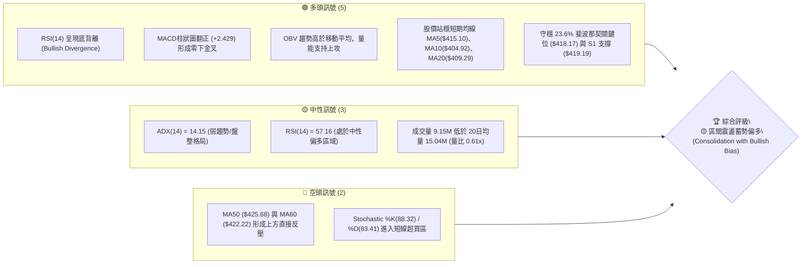
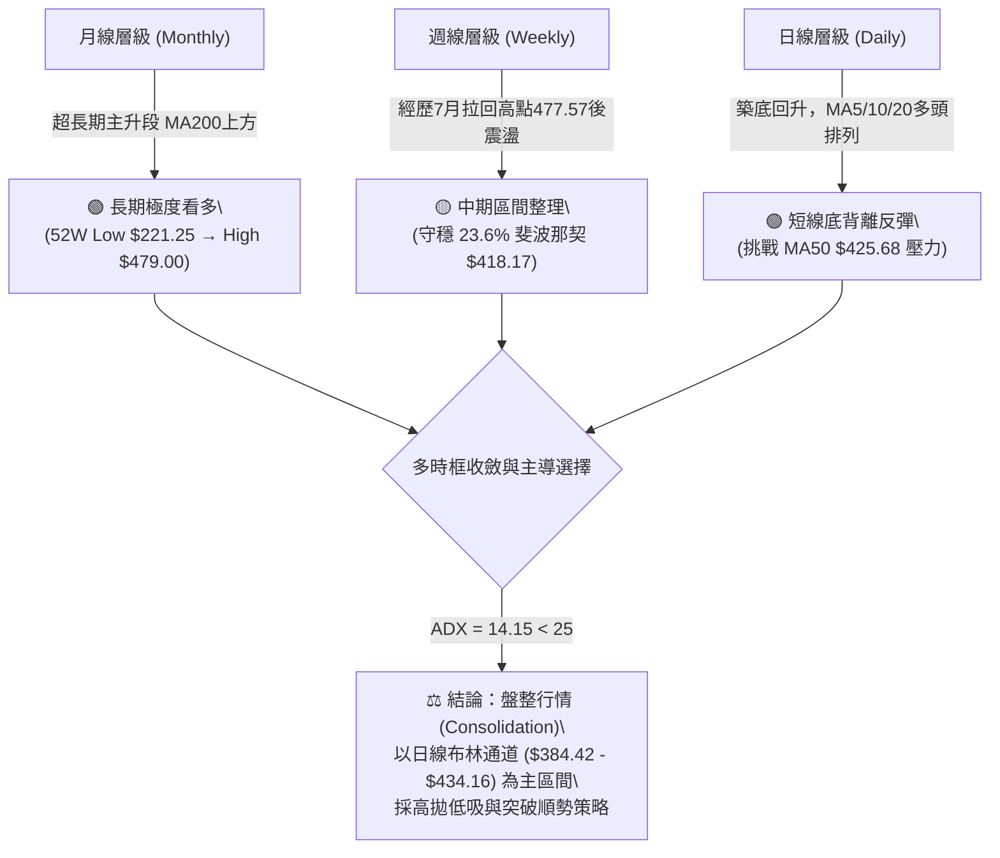
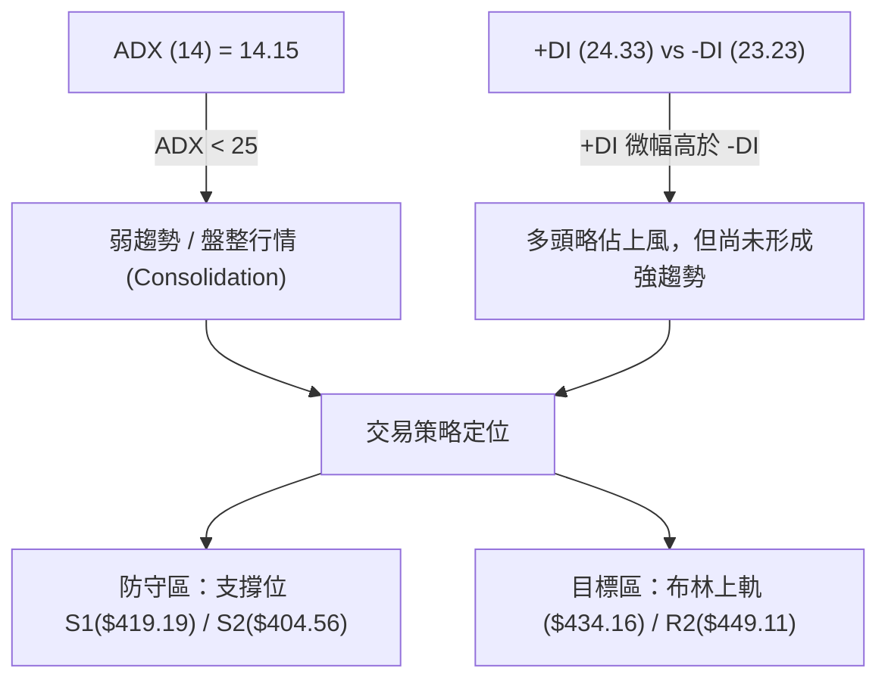
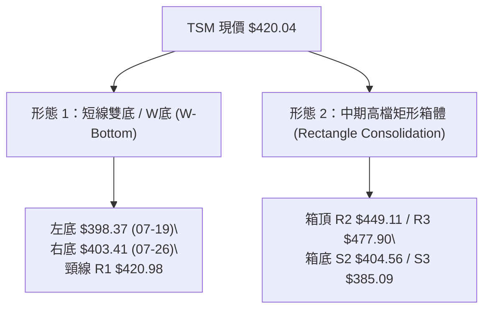
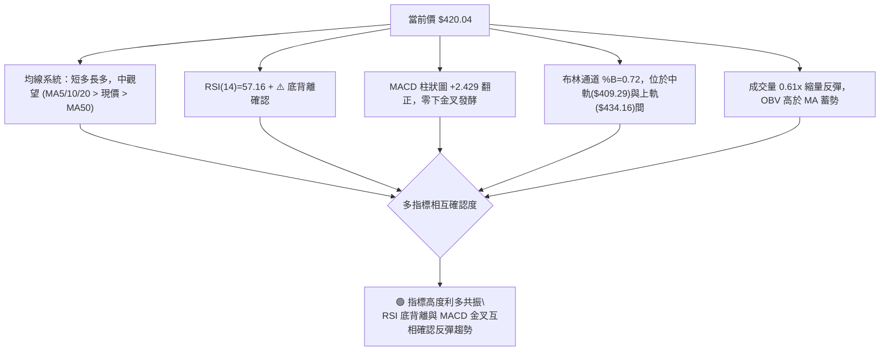
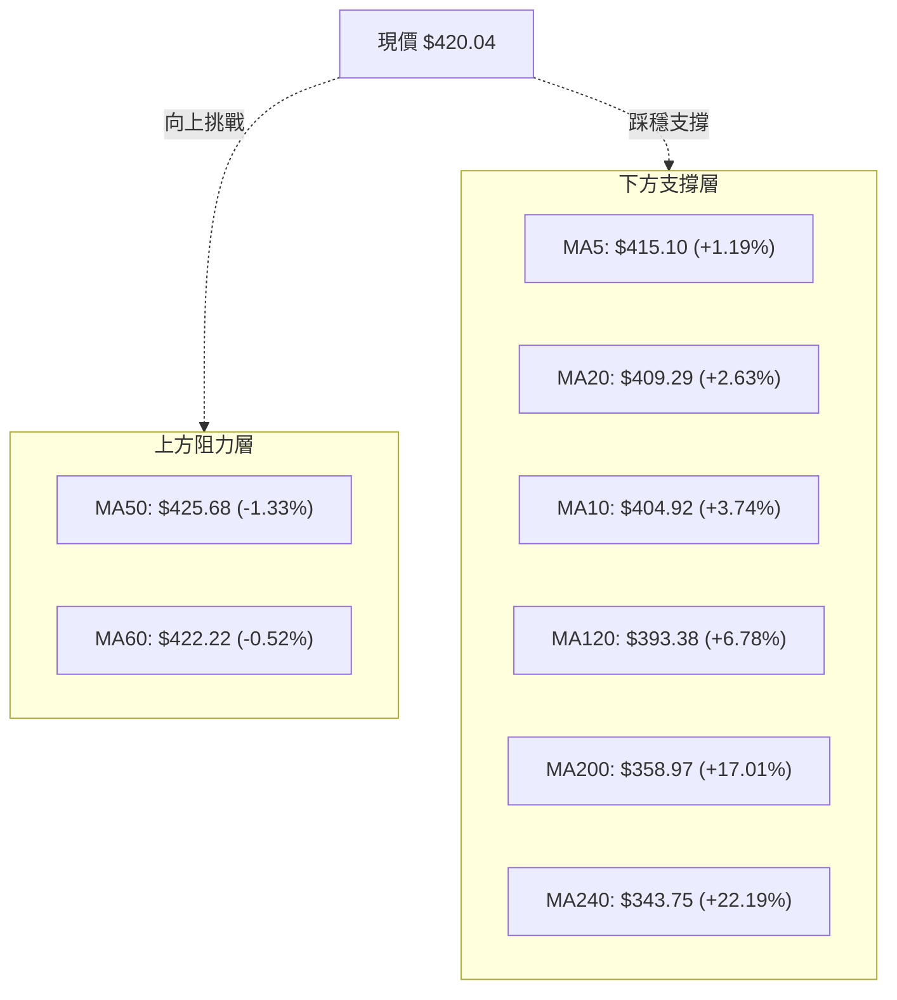
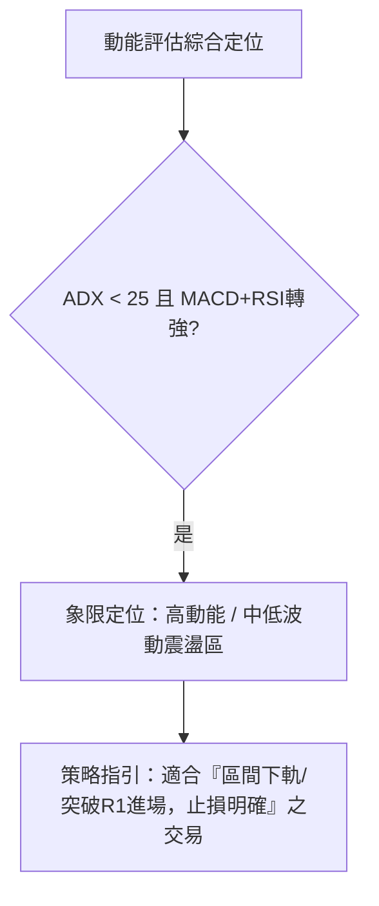
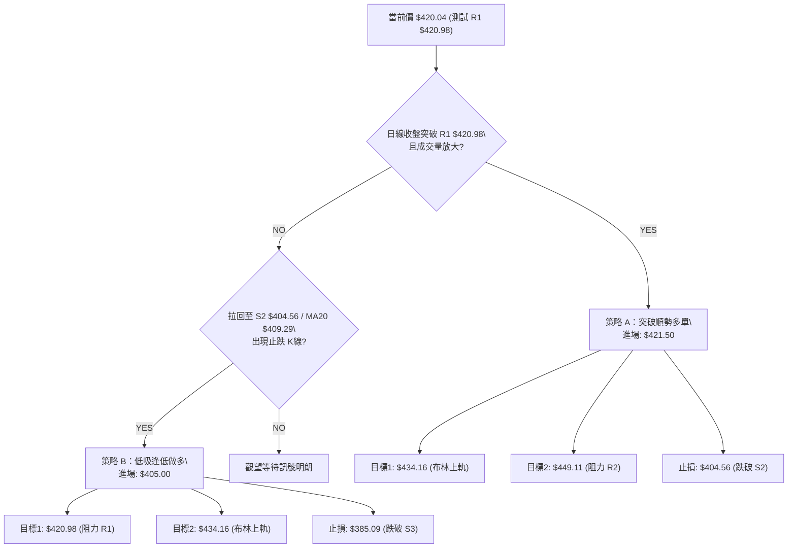
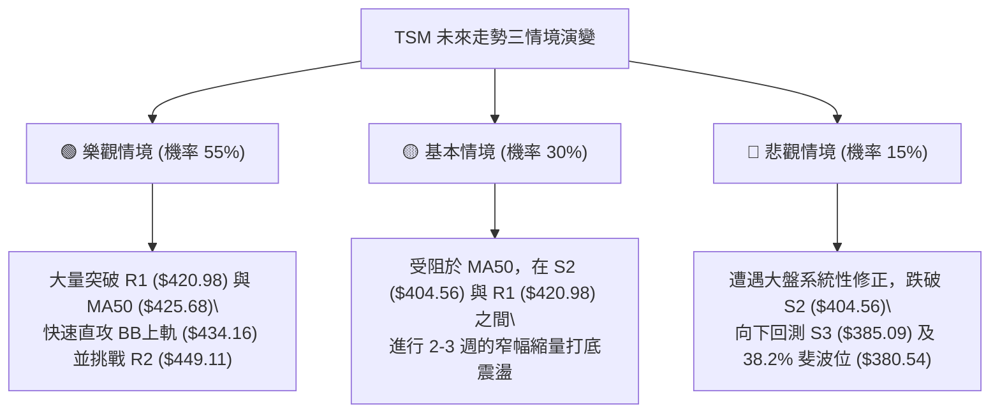

# TSM 技術分析報告

> **報告日期**：2026-08-08 ｜ **語言**：繁體中文 ｜ **數據來源**：Yahoo Finance ｜ **當前價格**：$420.04

---

## 目錄

| 章節 | 內容 |
|------|------|
| [1. 技術面概覽](#1-技術面概覽) | 訊號儀表板、核心指標、評分卡 |
| [2. 趨勢分析](#2-趨勢分析) | 多時框趨勢、長中短期走勢 |
| [3. 圖表形態分析](#3-圖表形態分析) | 形態識別、K線組合、目標價 |
| [4. 支撐與阻力](#4-支撐與阻力) | 關鍵價位、斐波那契回調 |
| [5. 技術指標深度解讀](#5-技術指標深度解讀) | MA/RSI/MACD/布林/成交量 |
| [6. 動能與波動率](#6-動能與波動率) | 動能評估、ATR、Beta |
| [7. 多時框架總結](#7-多時框架總結) | 時框架評分矩陣 |
| [8. 交易策略建議](#8-交易策略建議) | 多空策略、風險報酬比 |
| [9. 風險提示與監控](#9-風險提示與監控) | 監控指標、風險場景 |

---

## 1. 技術面概覽

### 🎯 技術訊號儀表板



### 📊 核心指標速覽表

| 指標類別 | 指標名稱 | 當前數值 | 訊號 | 解讀 |
|----------|----------|----------|------|------|
| **價格** | 當前價格 | $420.04 | 🟢 | 位於52週區間77.1%位置，突破23.6%斐波位($418.17) |
| **均線** | MA20 | $409.29 | 🟢 | 股價位於MA20上方 (+2.63%)，短線趨勢向上 |
| **均線** | MA50 | $425.68 | 🔴 | 股價位於MA50下方 (-1.33%)，中期反壓未克 |
| **均線** | MA200 | $358.97 | 🟢 | 遠高於MA200 (+17.01%)，超長期多頭牛市未變 |
| **動能** | RSI(14) | 57.16 | 🟢 | 遠離超賣區，且前波已完成日/週線級別底背離 |
| **動能** | MACD | -3.410 | 🟢 | 柱狀圖翻正至 +2.429，快線穿過慢線形成金叉 |
| **動能** | Stochastic | 88.32 / 83.41 | 🔴 | 指標進入 >80 超買區，提示短線有回檔整理需求 |
| **波動** | ATR(14) | $16.56 | 🟡 | 佔股價 3.94%，每日波動區間正常，無異常暴動 |
| **通道** | BB %B | 0.72 | 🟢 | 股價位於布林通道中軌($409.29)與上軌($434.16)之間 |
| **量能** | 成交量量比 | 0.61x | 🟡 | 縮量反彈（9.15M vs 15.04M），需大量突破 R1($420.98) |

### 🏆 技術評分卡

```
╔══════════════════════════════════════════════════════════════════╗
║                   技術評分卡 — TSM (2026-08-08)                 ║
╠══════════════════════════════════════════════════════════════════╣
║ 趨勢強度 (ADX)    █████████░░░░░░░░░░░  45/100 🟡 (ADX 14.15 盤整)║
║ 動能指標 (MACD/RSI)███████████████░░░░░  75/100 🟢 (背離金叉發酵)║
║ 支撐穩定度 (Fib/S) ████████████████░░░░  80/100 🟢 (418.17 堅固)  ║
║ 成交量配合 (OBV)   ██████████░░░░░░░░░░  50/100 🟡 (量比 0.61x 縮量)║
║ 形態完整度 (W底)   █████████████░░░░░░░  65/100 🟡 (測試頸線420.98)║
║ 均線排列 (MA System)████████████░░░░░░░  60/100 🟡 (混合多頭支撐) ║
╠══════════════════════════════════════════════════════════════════╣
║ 綜合評分          █████████████░░░░░░░  62/100 🟢 (偏多區間震盪) ║
╚══════════════════════════════════════════════════════════════════╝
```

---

## 2. 趨勢分析

### 🌐 多時框趨勢分析



### 📈 長期趨勢 — 24個月走勢圖（Unicode）

```
TSM 24個月收盤價走勢圖（2024-08 至 2026-08）
價格軸 ($)
$480 ┤                                                    ● 477.57 (2026-06)
$440 ┤                                                  /   \
$400 ┤                                          ● 395.13  /     ● 420.04 (現在)
$360 ┤                                  ● 372.65 \      /  ● 404.25
$320 ┤                          ● 328.86 \        ● 337.16
$280 ┤                  ● 298.08 \
$240 ┤          ● 238.98 \
$200 ┤  ● 205.48 \        ● 228.34
$160 ┼──●─────────● (低點 163.59)
     └─┬────┬────┬────┬────┬────┬────┬────┬────┬────┬────┬────┬───
      24/08 24/11 25/02 25/05 25/08 25/11 26/02 26/05 26/08
```

#### 走勢特徵分析表格

| 階段 | 時間區間 | 起始價 → 終點價 | 漲跌幅 | 走勢特徵與技術意義 |
|------|----------|------------------|--------|--------------------+
| 第一階段 | 2024/08 - 2025/01 | $167.40 → $205.48 | +22.75% | 多頭初段推進，首次突破 $200 心理關卡 |
| 第二階段 | 2025/02 - 2025/04 | $177.21 → $164.27 | -7.30%  | 深縮洗盤，下探 $163.59 探明長線大底 |
| 第三階段 | 2025/05 - 2026/02 | $190.51 → $372.65 | +95.61% | 主升段行情，基本面與技術面共振爆發 |
| 第四階段 | 2026/03 - 2026/06 | $337.16 → $477.57 | +41.65% | 再次發力創歷史新高 $479.00（收盤 $477.57） |
| 第五階段 | 2026/07 - 2026/08 | $404.25 → $420.04 | +3.91%  | 高檔健康回檔落腳於 23.6% 斐波位，打底止跌 |

### 📊 中期趨勢（週線分析）

從最近 20 週收盤數據觀察：
- **波段高點**：2026年6月下旬創出高點（收盤 $462.12，盤中最高 $479.00）。
- **波段低點**：2026年7月中下旬急跌至 $398.37（2026-07-19），並於次週回測 $403.41 完成二次探底。
- **當前位置**：最新一週（2026-08-09）收盤大幅拉升至 **$420.04**，單週上漲 +3.91%，RSI 回升至 57.2，MACD 柱狀圖翻正至 +2.429。
- **中期格局**：正處於從 7 月份 $398.37 低點回升的 W 底築底完成期，關鍵反彈阻力位於 **R1 ($420.98)** 與 MA50 ($425.68)。

### ⚡ 趨勢強度評估（ADX 解讀）



#### ADX 趨勢強度對照表

| 指標名稱 | 當前數值 | 臨界值判斷 | 趨勢狀態 | 對應交易操作指引 |
|----------|----------|------------|----------|------------------|
| **ADX (14)** | **14.15** | < 25.0 | 無明確趨勢（無趨勢/震盪） | 避免追高殺低，採取區間震盪與突破確認策略 |
| **+DI (14)** | **24.33** | +DI > -DI | 多頭控盤力道稍強 | 支撐區偏多思考，不宜盲目做空 |
| **-DI (14)** | **23.23** | 差值為 1.10 | 空頭力道受抑 | 空頭缺乏持續性向下殺傷力 |

---

## 3. 圖表形態分析

### 🔍 形態識別系統



#### 圖表形態信心度評估表

| 形態名稱 | 信心度 | 判斷依據（引用數據） | 完成度 | 目標價（附計算式） |
|----------|--------|----------------------|--------|--------------------|
| **短線雙底 (W底)** | **68%** | 7/19低點$398.37與7/26低點$403.41形成雙腳，當前正在測試頸線 R1 $420.98 | 85% | 頸線 $420.98 + 形態高度 $22.61 = **$443.59** *(由形態高度推算)* |
| **矩形箱體整理** | **75%** | 股價在 S2($404.56) 與 R2($449.11) 之間進行長達數月的大箱體整理 | 70% | 箱體突破目標：R2 $449.11 + 箱體高度 $44.55 = **$493.66** *(由形態推算)* |
| **頭肩頂/底** | **20%** | 數據中未偵測到明確頭肩形態結構 | -- | 訊號不足，僅做指標型解讀 |

*註：形態高度計算式：W底高度 = 頸線 $420.98 - 最低點 $398.37 = $22.61。推算目標價 = $420.98 + $22.61 = $443.59。*

### 🕯️ 重要K線形態分析

| 日期/週期 | 收盤價 | K線形態 | 技術解讀 | 多空訊號 |
|-----------|--------|---------|----------|----------|
| 2026-07-19 | $398.37 | 長下影陰線 (Hammer/Spike) | 觸及 $398.37 極端低點後獲得逢低買盤強烈支撐 | 🟢 底態浮現 |
| 2026-07-26 | $403.41 | 縮量十字星 (Doji) | 空頭向下動能竭盡，多空在 S2($404.56) 附近達成短暫平衡 | 🟡 止跌訊號 |
| 2026-08-02 | $404.25 | 微幅小陽線 (Spinning Top) | 探底不破，醞釀右腳彈升 | 🟢 築底確認 |
| 2026-08-09 | $420.04 | 中實體長紅K (Bullish Marubozu) | 大幅上漲 +3.91%，一舉吞噬前一週陰線實體，完成「晨星」組合 | 🟢 強烈看多 |

### 📉 ASCII 走勢形態示意圖

```
TSM 日線 W底 (雙底) 形態示意圖
價位 ($)
$449.11 ┤------------------------------------------- (阻力 R2 / 箱頂)
        │
$420.98 ┤................. 頸線 (Neckline R1) ..... ◄ 現價 $420.04 正在測試突破
        │               / \                       /
$409.29 ┤--------------/---\------ MA20/中軌 ----/--
        │             /     \                   /
$403.41 ┤            /       \     右腳 (Right)●
$398.37 ┤  左腳 (Left)●        \______/
        └───────────────────────────────────────────
           2026-07-19         2026-07-26     2026-08-08
```

### 🎯 形態目標價計算

1. **短線 W底 形態推算**：
   - 頸線位置：$420.98 (R1)
   - 最低點（左腳）：$398.37
   - 垂直高度 (H)：$420.98 - $398.37 = $22.61
   - **第一突破目標價** = $420.98 + $22.61 = **$443.59** (高度推算，介於 R1 與 R2 之間)

2. **高檔大箱體突破推算**：
   - 箱體下軌：$404.56 (S2)
   - 箱體上軌：$449.11 (R2)
   - 箱體高度：$449.11 - $404.56 = $44.55
   - **中期箱體突破目標** = $449.11 + $44.55 = **$493.66** (高度推算，若突破 52W 高點 $479.00)

---

## 4. 支撐與阻力

### 🗺️ 關鍵價位分布圖（Unicode）

```
TSM 價位結構分布圖 (由 OHLCV 精確計算)
═══════════════════════════════════════════════════════════════
$479.00 ║████████████████████████████████║ 52W High (0.0% Fib)
$477.90 ║██████████████████████████████  ║ 強阻力 R3 (+13.77%)
$449.11 ║████████████████████            ║ 關鍵阻力 R2 (+6.92%)
$434.16 ║▓▓▓▓▓▓▓▓▓▓▓▓▓▓▓▓▓▓              ║ 布林通道上軌
$425.68 ║▓▓▓▓▓▓▓▓▓▓▓▓▓▓                  ║ MA50 中期均線反壓
$420.98 ║██████████████                  ║ 短線阻力 R1 (+0.22%)
$420.04 ╠════════════════════════════════╣ ◄ 當前收盤價 $420.04
$419.19 ║▓▓▓▓▓▓▓▓▓▓▓▓▓▓                  ║ 近期支撐 S1 (-0.20%)
$418.17 ║██████████████                  ║ 23.6% 斐波那契回調位
$409.29 ║▓▓▓▓▓▓▓▓▓▓                      ║ MA20 / 布林通道中軌
$404.56 ║████████████████████            ║ 強支撐 S2 (-3.68%)
$385.09 ║████████████████████████████    ║ 關鍵強支撐 S3 (-8.32%)
$380.54 ║██████████████████████████████  ║ 38.2% 斐波那契回調位
$358.97 ║████████████████████████████████║ MA200 牛熊分界線
═══════════════════════════════════════════════════════════════
```

### 🚧 阻力位分析表

| 阻力級別 | 價位 | 形成原因（數據依據） | 突破難度 | 重要性 |
|----------|------|----------------------|----------|--------|
| **R1** | **$420.98** | 近一年波段高點聚類、W底頸線區 | 🟡 中等 | 短線多空分水嶺，站穩即確立短線轉強 |
| **R2** | **$449.11** | 近一年波段高點聚類、大箱體整理頂部 | 🔴 偏高 | 中期波段強阻力，需大量解套買盤支撐 |
| **R3** | **$477.90** | 歷史高點聚類 ($479.00 52W High 下方) | 🔴 極高 | 歷史極限高點阻力區，解套賣壓最密集 |

### 🛡️ 支撐位分析表

| 支撐級別 | 價位 | 形成原因（數據依據） | 守住機率 | 重要性 |
|----------|------|----------------------|----------|--------|
| **S1** | **$419.19** | 近一年波段低點聚類，貼近當前價格 | 🟢 高 | 短線防守第一道關卡，重疊 23.6% 斐波位 |
| **S2** | **$404.56** | 近一年波段低點聚類，7月下影線支撐區 | 🟢 極高 | 中期強支撐，跌破將引發技術性停損 |
| **S3** | **$385.09** | 近一年波段低點聚類，貼近布林下軌($384.42) | 🟢 極高 | 波段防禦底線，鄰近 38.2% 斐波位 ($380.54) |

### 📐 斐波那契回調位分析（52週區間 $221.25 → $479.00）

| 斐波那契比例 | 精確價位 | 技術意義與當前互動分析 |
|--------------|----------|------------------------|
| **0.0%** (52W High) | **$479.00** | 歷史頂部，波段終極目標價 |
| **23.6%** | **$418.17** | **現價 ($420.04) 正於此位上方扣守**。強勢回調的極限位置，代表多頭格局依然極度健全 |
| **38.2%** | **$380.54** | 標準回調黃金支撐位，與 S3 ($385.09) 形成中期強支撐防線 |
| **50.0%** | **$350.13** | 中性回調位，與 MA200 ($358.97) 形成長線牛熊分界護城河 |
| **61.8%** | **$319.71** | 黃金分割強支撐位，深度回調極限（目前無下探徵兆） |
| **78.6%** | **$276.41** | 超深度回調位 |
| **100.0%** (52W Low)| **$221.25** | 52週起漲點大底 |

---

## 5. 技術指標深度解讀

### 🎛️ 指標訊號總覽



### 📈 移動平均線排列分析



#### 均線數據與狀態表

| 均線名稱 | 當前價位 | 與現價距離 | 每日變動率 | 技術狀態 |
|----------|----------|------------|------------|----------|
| **MA5** | $415.10 | +1.19% | ▲ +4.94 | 短線支撐，扣抵低價急升 |
| **MA10** | $404.92 | +3.74% | ▲ +15.13 | 短線金叉，支撐力道強勁 |
| **MA20** | $409.29 | +2.63% | ▲ +10.75 | 穿過布林中軌，短趨轉多 |
| **MA50** | $425.68 | -1.33% | ▼ -2.18 | 中期扣抵高價，下彎形成反壓 |
| **MA60** | $422.22 | -0.52% | ▼ -2.18 | 季線微幅下彎，首要克服關卡 |
| **MA120**| $393.38 | +6.78% | ▲ +26.66 | 半年線持續上揚，長線保護短線 |
| **MA200**| $358.97 | +17.01%| ▲ +76.29 | 年線陡峭向上，長線牛市基石 |

### 📉 RSI(14) 分析

- **當前數值**：**57.16**
- **強度進度條**：`███████████░░░░░░░░░ 57.16%` (中性偏多區間)
- **背離診斷**：**⚠️ 存在顯著「底背離」(Bullish Divergence)**。
  - *分析細節*：在 2026 年 7 月 19 日與 7 月 26 日期間，TSM 週線/日線價格下探至 $398.37 - $403.41 低區，但 RSI 指標從 27.9 迅速彈升至 43.3 並進一步推升至 57.2，價格創低/低位打底而指標低點顯著抬升，這是非常標準的底背離看多訊號，預示動能已由空轉多。

### 📊 MACD(12,26,9) 訊號解讀

- **MACD 快線**：-3.410
- **Signal 慢線**：-5.839
- **MACD 柱狀圖 (Histogram)**：**+2.429** 🟢
- **訊號解析**：MACD 快線已在零軸下方向上突破 Signal 慢線，形成「零軸下黃金交叉」。柱狀圖由負轉正達 +2.429，顯示空頭波段已告結束，多頭推升動能正在加速累積。

### 📦 布林通道分析

```
TSM 布林通道 (Bollinger Bands) 結構圖
價位 ($)
$434.16 ┤------------------------------------------- Upper Band (布林上軌)
        │                                           /
$420.04 ┤..........................................● 當前價位 (%B = 0.72)
        │                                         /
$409.29 ┤---------------------------------------- Mid Band (MA20 中軌)
        │                                       /
$384.42 ┤-------------------------------------- Lower Band (布林下軌)
```

- **通道寬度**：上軌 $434.16 - 下軌 $384.42 = $49.74 (帶寬度約 11.8%，處於擠壓後開始擴張階段)。
- **%B 指標**：**0.72**（位於 0.5 中軌 $409.29 與 1.0 上軌 $434.16 之間的強勢多頭通道）。

### 💹 成交量分析（量價配合度）

- **當前成交量**：9,145,500 股
- **20日均量**：15,035,295 股 (量比 **0.61x**)
- **OBV (能量潮)**：`OBV > MA` 🟢。
- **量價診斷**：近期反彈呈現「縮量上漲」特徵（量比僅 0.61x）。儘管 OBV 長線趨勢仍高於其均線，顯示法人大戶籌碼並未潰散，但短線若要有效突破 R1 ($420.98) 及 MA50 ($425.68) 重壓區，每日成交量必須放大至 1,500萬股（接近20日均量）以上，否則易遭遇解套賣壓而拉回。

---

## 6. 動能與波動率

### ⚡ 動能評估

根據當前技術指標組合進行綜合動能評估：

| 動能維度 | 評估指標 | 狀態/數值 | 評級 | 技術解讀 |
|----------|----------|-----------|------|----------|
| **趨勢強度** | ADX (14) | 14.15 | 🟡 弱 | 無單邊強烈趨勢，呈區間震盪整理狀態 |
| **動能方向** | MACD Hist / RSI | +2.429 / 57.16 | 🟢 強 | 底背離後動能向上全面轉強 |
| **波動強度** | ATR (14) | $16.56 (3.94%)| 🟡 中 | 波動度適中，未出現極端恐慌洗盤 |
| **籌碼支持** | OBV vs MA | OBV > MA | 🟢 強 | 資金長線留存度高，籌碼結構穩定 |



### 📊 ATR 波動率分析

- **ATR(14)**：**$16.56**（佔當前股價 3.94%）。
- **交易風控指引**：
  - 每日正常波動區間為 ±$16.56（即 $403.48 – $436.60）。
  - **建議止損距離**：採用 1.0 至 1.5 倍 ATR，即 **$16.56 – $24.84**。
  - 若自現價 $420.04 設止損，1.0 ATR 止損價位為 **$403.48**（精確重疊 S2 支撐區 $404.56）。

### 📐 Beta 與市場相關性

- **Beta 係數**：**1.258**
- **解讀**：TSM 波動度高於大盤（S&P 500）25.8%。在大盤反彈週期中，TSM 具備較高彈性；但在市場遭遇系統性風險時，回調幅度亦會放大。當前高 Beta 特性有利於多頭反彈波段的獲利擴展。

---

## 7. 多時框架總結

### 📋 時框架評分表

| 時框架 | 趨勢方向 | 動能狀態 | 均線排列 | 形態結構 | 綜合評分 | 建議操作 |
|--------|----------|----------|----------|----------|----------|----------|
| **月線 (Monthly)** | 🟢 極看多 | 🟢 高位強勢 | 🟢 完美的加頭多頭 | 歷史高點箱體 | **85 / 100** | 長線堅定持有 |
| **週線 (Weekly)** | 🟡 震盪 | 🟢 底背離確立 | 🟡 MA50下偏，MA200超強 | W底築底完成 | **65 / 100** | 逢拉回佈局 |
| **日線 (Daily)** | 🟢 偏多 | 🟢 MACD金叉超強 | 🟢 短均金叉，受阻MA50 | 測試頸線突破 | **62 / 100** | 順勢小量跟進 |

### 🔲 綜合訊號矩陣

```
╔══════════════════════════════════════════════════════════════════╗
║                     TSM 多時框訊號一致性矩陣                    ║
╠══════════════════════════╦══════════════╦══════════════╦═════════╣
║ 維度                     ║ 短期 (日線)  ║ 中期 (週線)  ║ 長期(月線)║
╠══════════════════════════╬══════════════╬══════════════╬═════════╣
║ 趨勢方向 (Trend)         ║  🟢 向上反彈 ║  🟡 區間震盪 ║  🟢 超級牛市
║ 動能指標 (Momentum)      ║  🟢 背離發酵 ║  🟢 轉強上升 ║  🟢 強勁保留
║ 支撐防禦 (Support)       ║  🟢 S1/S2堅固║  🟢 23.6%扣守║  🟢 MA200強固
║ 成交量能 (Volume)        ║  🟡 縮量量比 ║  🟡 中等流動 ║  🟢 資金留存
╠══════════════════════════╬══════════════╬══════════════╬═════════╣
║ 一致性評定               ║  🟢 高度一致偏多 (High Bullish Alignment)║
╚══════════════════════════╩═════════════════════════════════════════╝
```

### ⚖️ 多時框收斂結論

依據多時框收斂規則：
1. **行情屬性**：ADX(14) = 14.15 (< 25)，定義當前市場為 **盤整/區間震盪行情 (Consolidation Regime)**。
2. **主導時框與區間**：以日線布林通道上下軌 **$384.42 – $434.16** 及關鍵價位 **S2 ($404.56) – R2 ($449.11)** 為主要操作區間。
3. **方向收斂**：長線超級多頭未變，日與週線於 $398.37 - $404.56 完成底背離 W 底築底。**最終唯一結論：區間震盪蓄勢偏多 (Consolidation with Bullish Bias)**，建議以突破 R1 ($420.98) 順勢做多或拉回 S2 ($404.56) 低吸為主策略。

---

## 8. 交易策略建議

### 🗺️ 策略決策流程圖



### 🧭 策略路由

**當前主策略方向 = 🟢 多頭主導區間操作（綜合評分 62/100）**

### 🎯 價格情境階梯 (Price Scenarios)

| 觸發條件 | 下一目標價 | 後續延伸目標 | 情境技術含義 |
|----------|------------|--------------|--------------|
| **突破 R1 $420.98** | **$434.16** (BB上軌) | **$449.11** (阻力 R2) | W底頸線確立突破，短線多頭發動攻擊 |
| **站穩現價區間** | **$420.98** (R1) | **$409.29** (MA20) | 區間震盪整理，消化 MA50 ($425.68) 反壓 |
| **跌破 S1 $419.19** | **$404.56** (支撐 S2) | **$385.09** (支撐 S3) | 探底測試 W底右腳防線，短線整理加深 |

### 📊 情境機率分佈

| 情境劇本 | 機率估計 | 主要技術依據 |
|----------|----------|--------------|
| **繼續上攻 / 突破 R1** | **55%** | MACD 柱狀圖翻正 (+2.429)、RSI 底背離、OBV 趨勢高於均線 |
| **高檔區間震盪** | **30%** | ADX = 14.15 缺乏強趨勢、成交量萎縮 (量比 0.61x)、MA50 壓制 |
| **跌破 S2 再探底** | **15%** | Stochastic 處於超買區 (>80) 可能引發短線回檔賣壓 |

### 🟢 主策略詳情

| 策略要素 | 策略 A（突破順勢多單） | 策略 B（拉回低吸多單） |
|----------|------------------------|------------------------|
| **進場條件** | 日線收盤有效突破 R1 ($420.98) | 價格回測 S2 ($404.56) / MA20 ($409.29) 獲止跌 confirmation |
| **進場價格** | **$421.50** | **$405.00** |
| **目標價 T1** | **$434.16** *(布林通道上軌)* | **$420.98** *(阻力 R1)* |
| **目標價 T2** | **$449.11** *(阻力 R2 / 接近W底目標$443.59)* | **$434.16** *(布林通道上軌)* |
| **止損價格** | **$404.56** *(跌破 S2 強支撐)* | **$385.09** *(跌破 S3 及 38.2% 斐波位)* |
| **風險報酬比** | **1.63 : 1** *(至 T2)* | **1.46 : 1** *(至 T2)* |
| **成功機率** | **60%** | **65%** |
| **建議倉位** | **15% - 20%** | **20% - 25%** |

*註：策略 A 風險報酬比計算：(449.11 - 421.50) / (421.50 - 404.56) = 27.61 / 16.94 = 1.63:1。*  
*策略 B 風險報酬比計算：(434.16 - 405.00) / (405.00 - 385.09) = 29.16 / 19.91 = 1.46:1。*

### 🔴 反向風險觸發點（對沖提示）

- **多頭失效清算點**：若日線收盤價跌破 **S3 ($385.09)** 且成交量放大，代表 7 月底打出的 W 底結構完全宣告失敗，應立即執行對沖避險或完全止損離場，下道防線將移至 50% 斐波那契回調位 **$350.13** 及 MA200 **$358.97**。

### ⭐ 整體訊號強度評星

```
做多訊號強度：★★★☆☆  (3.5/5 星) — 底背離金叉確認，受阻於 MA50
做空訊號強度：★★☆☆☆  (2.0/5 星) — 缺乏下殺動能，下有強支撐
整體可信度：  ★★██☆  (3.5/5 星) — 多指標利多共振，縮量為唯一隱憂
```

---

## 9. 風險提示與監控

### ✅ 關鍵監控指標 Checklist

```
╔══════════════════════════════════════════════════════════════════╗
║                   每日交易前技術面監控 Check List              ║
╠══════════════════════════════════════════════════════════════════╣
║ [ ] R1 突破確認：日線收盤是否高於 $420.98                    ║
║ [ ] 成交量回升：單日成交量是否超過 20日均量 (15.03M 股)          ║
║ [ ] MA50 扣抵：股價是否能有效站穩 MA50 ($425.68)              ║
║ [ ] RSI 背離延續：RSI(14) 是否持續保持在 50 中軸之上 (現 57.16)║
║ [ ] MACD 柱狀圖：Histogram 是否持續擴大 positive 數值 (> +2.4)║
║ [ ] S1/S2 防禦：盤中低點是否守穩 S1 ($419.19) / S2 ($404.56)  ║
╚══════════════════════════════════════════════════════════════════╝
```

### ⚠️ 風險場景分析



### 🛡️ 風險管理重要提醒

1. **量能不足風險**：當前反彈量比僅 0.61x，若價格觸及 MA50 ($425.68) 仍無法放量，需防範「假突破後回檔」之風險，建議分批建倉，切勿一次性滿倉。
2. **超買指標修正**：Stochastic 指標已達 88.32/83.41 超買區，極可能在未來 1-3 個交易日內出現短線技術性回沖，提供策略 B 的低吸入場點。
3. **嚴格止損執行**：任何多單操作均應以 **S2 ($404.56)** 或 1.0 ATR ($403.48) 作為絕對風控線，將單筆交易虧損控制在總資金 1.5% 以內。

---

## 📋 報告總結

```
╔══════════════════════════════════════════════════════════════════╗
║                   TSM 技術分析報告總結                          ║
════════════════════════════════════════════════════════════════════
 報告日期：2026-08-08
 當前價格：$420.04
 分析評級：🟢 區間震盪蓄勢偏多 (Consolidation with Bullish Bias)

 關鍵價位速查：
 ├─ 長期趨勢：🟢 陡峭多頭 (高於 MA200 $358.97 達 +17.01%)
 ├─ 中期趨勢：🟡 區間震盪 (W底築底完成，測試 R1 頸線)
 ├─ 短期趨勢：🟢 底背離反彈 (MACD 零下金叉，柱狀圖 +2.429)
 ├─ 關鍵支撐：S1: $419.19 ｜ S2: $404.56 ｜ S3: $385.09
 ├─ 關鍵阻力：R1: $420.98 ｜ R2: $449.11 ｜ R3: $477.90
 └─ 分析師目標：均價 $540.20 (最高 $700.00 / 最低 $430.00)

 最優策略組合：
 1. 🥇 首選策略 (突破順勢)：突破 R1 $420.98 後進場，目標 $449.11，止損 $404.56
 2. 🥈 次選策略 (低吸拉回)：回測 S2 $405.00 買進，目標 $434.16，止損 $385.09
 3. 🥉 保守選擇：等待放量突破 MA50 ($425.68) 後追隨中期右側趨勢
════════════════════════════════════════════════════════════════════
```

---

> ⚠️ **免責聲明**：本報告為依據提供之技術數據進行之專業量化與圖表分析，文中所有價格與指標數值均嚴格依據 OHLCV 歷史數據計算。本報告**僅供研究與學術參考**，**不構成任何形式之投資建議或買賣邀約**。金融市場投資具備高度風險，投資人應獨立思考、審慎評估並自負盈虧。

---

*報告生成時間：2026-08-08 ｜ 數據來源：Yahoo Finance ｜ 分析框架：多時框技術分析與動能識別*