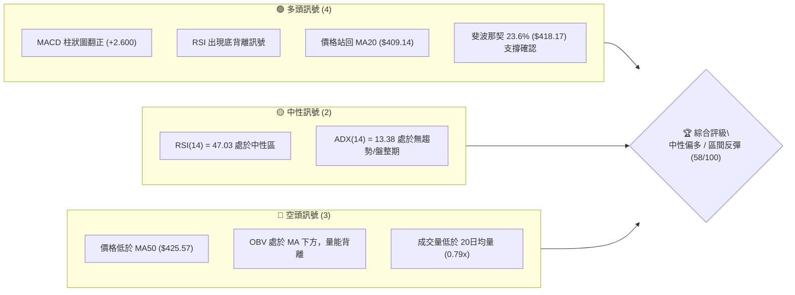
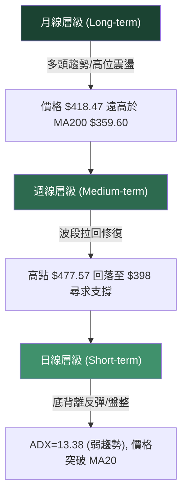
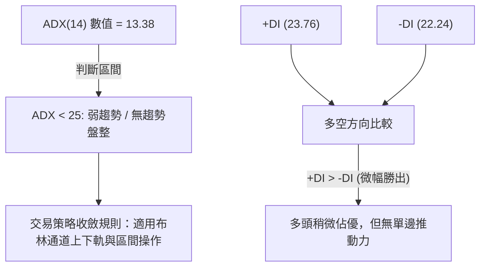
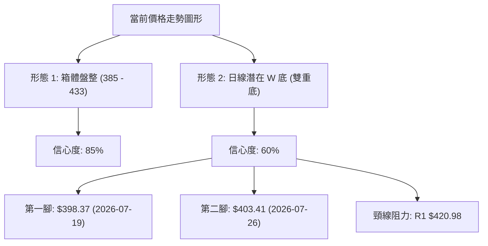
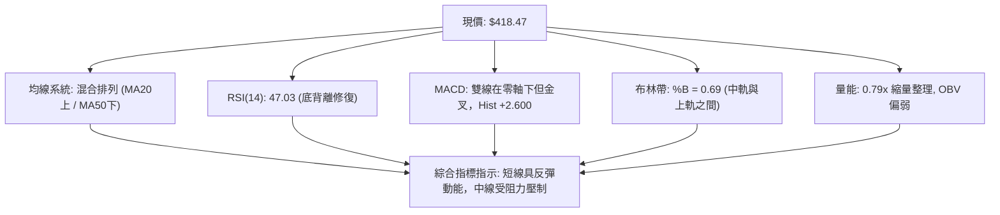
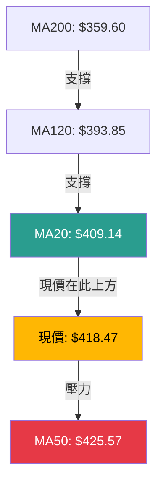
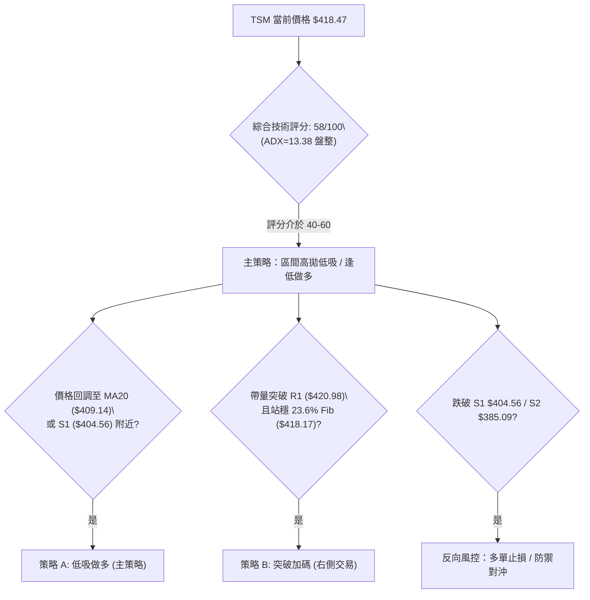
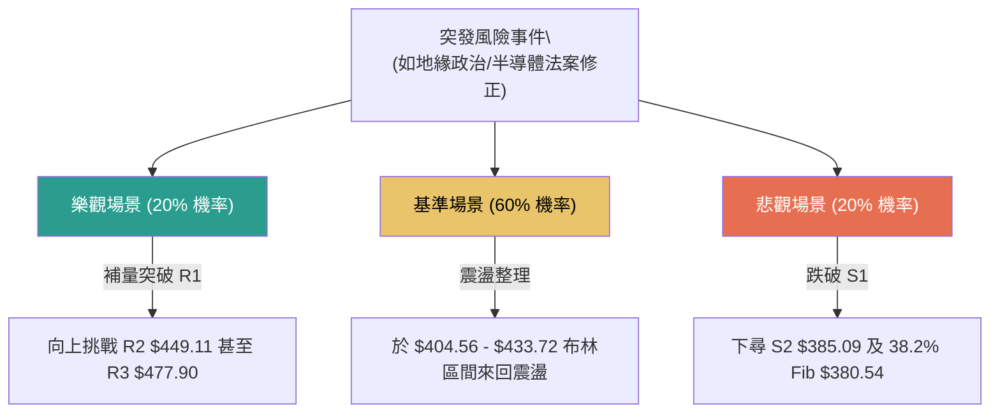

# TSM 技術分析報告

> **報告日期**：2026-08-10 ｜ **語言**：繁體中文 ｜ **數據來源**：Yahoo Finance ｜ **當前價格**：$418.47

---

## 目錄

| 章節 | 內容 |
|------|------|
| [1. 技術面概覽](#1-技術面概覽) | 訊號儀表板、核心指標、評分卡 |
| [2. 趨勢分析](#2-趨勢分析) | 多時框趨勢、長中短期走勢 |
| [3. 圖表形態分析](#3-圖表形態分析) | 形態識別、K線組合、目標價 |
| [4. 支撐與阻力](#4-支撐與阻力) | 關鍵價位、斐波那契回調 |
| [5. 技術指標深度解讀](#5-技術指標深度解讀) | MA/RSI/MACD/布林/成交量 |
| [6. 動能與波動率](#6-動能與波動率) | 動能評估、ATR、Beta |
| [7. 多時框架總結](#7-多時框架總結) | 時框架評分矩陣 |
| [8. 交易策略建議](#8-交易策略建議) | 多空策略、風險報酬比 |
| [9. 風險提示與監控](#9-風險提示與監控) | 監控指標、風險場景 |

---

## 1. 技術面概覽

### 🎯 技術訊號儀表板



### 📊 核心指標速覽表

| 指標類別 | 指標名稱 | 當前數值 | 訊號 | 解讀 |
|----------|----------|----------|------|------|
| **價格** | 當前價格 | $418.47 | 🟡 | 位於52週區間 76.5% 高位震盪區 |
| **均線** | MA20 | $409.14 | 🟢 | 價格在其上方 (+2.28%)，短線扭轉劣勢 |
| **均線** | MA50 | $425.57 | 🔴 | 價格在其下方 (-1.67%)，中期面臨扣抵壓力 |
| **均線** | MA200 | $359.60 | 🟢 | 價格遠高於其上方 (+16.37%)，長期牛市基調穩固 |
| **動能** | RSI(14) | 47.03 | 🟢 | 從低位 27.9 強勢反彈，形成日線級別底背離 |
| **動能** | MACD | -2.589 | 🟢 | 柱狀圖為 +2.600，完成低位金叉向上 |
| **動能** | Stochastic | 85.39 / 86.20 | 🔴 | %K/%D 進入短線超買區，需防範回檔 |
| **波動** | ATR(14) | $15.61 | 🟡 | 每日波幅 3.73%，波動度處於中等水平 |
| **量能** | 成交量比 | 0.79x | 🔴 | 11.75M vs 20D均量 14.91M，呈現縮量反彈 |

### 🏆 技術評分卡

```
╔══════════════════════════════════════════════════════════════════╗
║                   技術評分卡 — TSM (2026-08-10)                  ║
╠══════════════════════════════════════════════════════════════════╣
║ 趨勢強度      ▓▓▓▓▓▓▓░░░░░░░░░░░░░  35/100  🟡 盤整無明顯單邊趨勢║
║ 動能指標      ▓▓▓▓▓▓▓▓▓▓▓▓░░░░░░░░  62/100  🟢 低位金叉與背離修復║
║ 支撐穩定度    ▓▓▓▓▓▓▓▓▓▓▓▓▓▓░░░░░░  70/100  🟢 S1 ($404.56) 築底成功║
║ 成交量配合    ▓▓▓▓▓▓█░░░░░░░░░░░░░  38/100  🔴 量能未能有效放大   ║
║ 形態完整度    ▓▓▓▓▓▓▓▓▓▓▓░░░░░░░░░  55/100  🟡 雙底構築中，等待頸線║
║ 均線排列      ▓▓▓▓▓▓▓▓▓▓▓▓▓░░░░░░░  65/100  🟢 短長期看多、中期受阻║
╠══════════════════════════════════════════════════════════════════╣
║ 綜合評分      ▓▓▓▓▓▓▓▓▓▓▓█░░░░░░░░  58/100  中性偏多 (區間反彈)   ║
╚══════════════════════════════════════════════════════════════════╝
```

---

## 2. 趨勢分析

### 🌐 多時框趨勢分析



### 📈 長期趨勢 — 12個月走勢圖（Unicode）

```
TSM 月線走勢圖（2025-08 至 2026-08）
價格軸 ($)
$480 ┤                                      ● (2026-06 高點 $477.57)
$440 ┤                                     ╱ ╲
$400 ┤                                   ╱     ● (現在 $418.47)
$360 ┤                         ●       ╱
$320 ┤                 ●     ╱   ╲   ╱
$280 ┤         ●     ╱   ╲ ╱       ●
$240 ┤   ●   ╱   ╲ ╱
$200 ┼─●───╱───────────────────────────────────────────────────────
     08 09 10 11 12 01 02 03 04 05 06 07 08  (月份: 2025/08 - 2026/08)
```

**走勢特徵分析表格**：

| 階段 | 時間區間 | 價格區間 | 漲跌幅 | 走勢特徵與主導力量 |
|------|----------|----------|--------|--------------------|
| 1. 主升段 | 2025/08 - 2026/02 | $228.34 → $372.65 | +63.2% | 強勁主升浪，法人大舉加碼，突破各天期均線 |
| 2. 中期拉回 | 2026/02 - 2026/03 | $372.65 → $337.16 | -9.5% | 高位獲利了結，回測試 $330-$340 支撐區 |
| 3. 二次推升 | 2026/04 - 2026/06 | $337.16 → $477.57 | +41.6% | 創歷史新高 $479.00，市場極度樂觀，短線過熱 |
| 4. 急速修正 | 2026/06 - 2026/07 | $477.57 → $404.25 | -15.3% | 獲利賣壓湧現，連續回檔測試 MA120 與 Fib 23.6% |
| 5. 築底反彈 | 2026/07 - 2026/08 | $404.25 → $418.47 | +3.5% | 於 S1 ($404.56) 附近止跌，RSI 底背離啟動反彈 |

### 📊 中期趨勢（週線分析）

從近 20 週數據觀察，TSM 在 2026 年 6 月底探頂至 $462.12（最高達 $479.00）後，出現連續 4 週的大幅拉回，並於 2026-07-26 當週收於 $403.41（週線 RSI 降至 27.9 的超賣區）。隨後兩週（08-02 至 08-16），週線收盤價穩定在 $404.25 與 $420.04，週線 MACD 柱狀圖由 -2.144 翻正至 +2.429，顯示中期下行壓力已獲緩解，呈現低位築底的整理格局。

### ⚡ 趨勢強度評估（ADX 解讀）



| 指標項 | 數值 | 市場狀態標準 | 解讀與操作含義 |
|--------|------|--------------|----------------|
| **ADX(14)** | **13.38** | < 25 (無趨勢) | 趨勢極度羸弱，價格不具備連續突破力，切忌追高殺低 |
| **+DI** | **23.76** | 多頭力道 | 多頭佔據微幅優勢 |
| **-DI** | **22.24** | 空頭力道 | 空頭力道已大幅衰退 |
| **淨差 (+DI - -DI)** | **+1.52** | 多空拉鋸 | 多空雙方平衡，市場處於消化籌碼階段 |

---

## 3. 圖表形態分析

### 🔍 形態識別系統



| 形態名稱 | 信心度 | 判斷依據（引用數據） | 完成度 | 目標價（附計算式） |
|----------|--------|----------------------|--------|--------------------|
| **箱體震盪** | **85%** | 上軌阻力近 BB 上軌 $433.72，下軌支撐於 S2 $385.09 | 90% | 區間震盪，以布林通道上下軌做為邊界 |
| **W底 (雙底)** | **60%** | 前低 $398.37 與次低 $403.41 形成雙腳，MACD 底背離 | 70% | 頸線 $420.98 + (頸線 $420.98 - 低點 $398.37) = **$443.59** |

*註：由於 ADX 低於 25，形態突破往往伴隨假突破，故 W 底形態僅給予 60% 中等信心度。*

### 🕯️ 重要K線形態分析

| 月份/日期 | 收盤價 | K線形態 | 解讀 | 訊號 |
|-----------|--------|---------|------|------|
| 2026-06-21 | $462.12 | 避雷針 / 長上影線 | 衝高至 $479.00 後獲利賣壓大舉湧現 | 🔴 頂部轉折 |
| 2026-07-19 | $398.37 | 長下影黑K | 逢低買盤於 $395 附近強烈支撐 | 🟡 探底止跌 |
| 2026-07-26 | $403.41 | 陽線十字星 (Doji) | 多空交戰激烈，賣壓耗盡 | 🟢 變盤築底 |
| 2026-08-09 | $420.04 | 實體中陽線 | 吞噬前一週陰線，完成短線轉強 | 🟢 多頭反攻 |
| 2026-08-16 | $418.47 | 高位窄幅小陰小陽 | 受到 R1 $420.98 壓制，進入消化整理 | 🟡 短線壓制 |

### 📉 ASCII 走勢形態示意圖

```
TSM 日線級別潛在「W底」形態示意圖
════════════════════════════════════════════════════════════
$433.72 ┼─────────────────────────────────[ BB 上軌 ]──────
$420.98 ┼───────────────解鎖頸線 R1 (突破點)────────────────
        │                 ▲
$418.47 ┼────────────────┼─● (現價)─────────────────────────
        │               ╱   ╲
$409.14 ┼──────────────╱─────╲────[ MA20 中軌 ]─────────────
        │   ╲        ╱         ╲
$398.37 ┼────●──────╱───────────● (次低點 $403.41)──────────
        │ (第一腳 $398.37)
════════════════════════════════════════════════════════════
```

### 🎯 形態目標價計算

1. **W 底形態目標價**：
   - 頸線位置：$420.98 (R1)
   - 形態底部：$398.37 (2026-07-19 最低收盤區間)
   - 形態高度：$420.98 - $398.37 = $22.61
   - **最小測量目標價** = $420.98 + $22.61 = **$443.59** (接近阻力位 R2 $449.11)

---

## 4. 支撐與阻力

### 🗺️ 關鍵價位分布圖（Unicode）

```
TSM 價位結構分布圖 (2026-08-10)
════════════════════════════════════════════════════════════
$479.00 ║██████████████████████████████║ 52W 歷史高點 / 0.0% Fib
$477.90 ║████████████████████████████  ║ 強阻力 R3 (+14.20%)
$449.11 ║████████████████████          ║ 波段阻力 R2 (+7.32%)
$433.72 ║████████████████              ║ 布林通道上軌
$425.57 ║██████████████                ║ MA50 扣抵壓力
$420.98 ║████████████                  ║ 近期頸線阻力 R1 (+0.60%)
$418.47 ╠══════════════════════════════╣ ◄ 現價 (位於 23.6% Fib $418.17)
$409.14 ║▓▓▓▓▓▓▓▓▓▓▓▓                  ║ MA20 / 布林中軌
$404.56 ║▓▓▓▓▓▓▓▓▓▓▓▓▓▓▓▓              ║ 近期波段關鍵支撐 S1 (-3.32%)
$385.09 ║████████████████████          ║ 強支撐 S2 / 布林下軌 (-7.98%)
$380.54 ║██████████████████████        ║ 38.2% 斐波那契回調位
$372.72 ║████████████████████████████  ║ 探底強支撐 S3 (-10.93%)
$359.60 ║██████████████████████████████║ 牛熊分界線 MA200
════════════════════════════════════════════════════════════
```

### 🚧 阻力位分析表

| 阻力級別 | 價位 | 形成原因 | 突破難度 | 重要性 |
|----------|------|----------|----------|--------|
| **R1** | **$420.98** | 近一年波段高點聚類、近期W底頸線位置 | 🟡 中等 | 🟢 決定短線能否開啟反彈攻勢 |
| **R2** | **$449.11** | 近一年波段高點聚類、接近W底測量目標價 | 🔴 較難 | 🟡 中期多空分水嶺 |
| **R3** | **$477.90** | 近一年波段歷史高點聚類 ($479.00 附近) | 🔴 極難 | 🔴 歷史高點解套賣壓區 |

### 🛡️ 支撐位分析表

| 支撐級別 | 價位 | 形成原因 | 守住機率 | 重要性 |
|----------|------|----------|----------|--------|
| **S1** | **$404.56** | 近一年波段低點聚類、7月末止跌回升平台 | 🟢 80% | 🟢 短線多頭防禦第道防線 |
| **S2** | **$385.09** | 近一年波段低點聚類、布林通道下軌位置 | 🟢 85% | 🟡 中期箱體震盪底線 |
| **S3** | **$372.72** | 近一年波段低點聚類、前波轉折低點 | 🟢 90% | 🔴 空頭極限測試位 |

### 📐 斐波那契回調位分析

基於 52 週波段區間（低點 **$221.25** → 高點 **$479.00**，總波段幅員 $257.75）：

| 斐波那契比例 | 計算價位 | 當前價格相對位置與技術意義 |
|--------------|----------|----------------------------|
| **0.0% (High)** | $479.00 | 52 週歷史天花板價位 |
| **23.6%** | **$418.17** | **現價 $418.47 精確重合於此位！** 此處為強勢修正的黃金防守點 |
| **38.2%** | **$380.54** | 回調常態支撐區，介於 S2 ($385.09) 與 S3 ($372.72) 之間 |
| **50.0%** | $350.13 | 中性回調位，接近 MA200 ($359.60) 長期牛熊線 |
| **61.8%** | $319.71 | 深幅修正黃金切割位 |
| **78.6%** | $276.41 | 多頭最後防線 |
| **100.0% (Low)**| $221.25 | 52 週歷史起漲點 |

**解讀**：TSM 價格回落至 **23.6% ($418.17)** 進行橫盤整理，表明市場整體多頭架構極為強韌，修正僅屬於淺幅回調（Shallow Retracement）。只要收盤不有效跌破 23.6% 水平，長期多頭趨勢將延續。

---

## 5. 技術指標深度解讀

### 🎛️ 指標訊號總覽



### 📈 移動平均線排列分析



- **短期均線 (MA5: $417.58, MA10: $406.85, MA20: $409.14)**：均呈向上勾頭，MA5 與 MA10 已完成黃金交叉，為短線帶來向上推升力。
- **中期均線 (MA50: $425.57, MA60: $422.55)**：目前 MA50 處於下行狀態（-0.96%），現價在其下方，為 $422 - $426 區間帶來顯著的扣抵蓋頂壓力。
- **長期均線 (MA120: $393.85, MA200: $359.60, MA240: $344.52)**：發散向上排列，MA200 遠在現價下方 14.1%，長期多頭格局無虞。

### 📉 RSI(14) 分析

- **當前數值**：**47.03**（位於 30-70 中性區間）。
- **進度條**：█████████░░░░░░░░░░░ 47/100
- **背離判斷**：**⚠️ 確立底背離 (Bullish Divergence)**。
  - *分析*：在 2026 年 7 月下旬，TSM 股價創波段低點（收盤 $398-$403），但 RSI(14) 卻在 7 月 26 日落底 27.9 後迅速築出更高的底部（近期回升至 57.2 與 47.0）。價格未創新低而指標率先揚升，確認底背離，發出強烈的中短線止跌反彈訊號。

### 📊 MACD(12/26/9) 訊號解讀

- **MACD 線**：-2.589
- **Signal 線**：-5.189
- **MACD 柱狀圖 (Histogram)**：**+2.600** 🟢
- **分析**：MACD 線向上穿越 Signal 線完成低位黃金交叉，且柱狀圖已連續擴張至 +2.600，顯示空頭動能耗盡，多頭掌控短線發言權。由於雙線仍位於零軸下方，此交叉屬「零軸下金叉」，性質上為超跌後的「反彈波」，突破零軸後方能轉為「推升波」。

### 📦 布林通道分析

```
TSM 布林通道現況 ($384.55 - $433.72)
════════════════════════════════════════════════════════════
$433.72 ┼─────────────────────────────────── 上軌 (BB Upper)
        │
$418.47 ┼─────────────────● (現價, %B = 0.69)
        │
$409.14 ┼─────────────────────────────────── 中軌 (MA20)
        │
$384.55 ┼─────────────────────────────────── 下軌 (BB Lower)
════════════════════════════════════════════════════════════
```

- **帶寬與位置**：%B 為 **0.69**，價格運作於中軌（$409.14）與上軌（$433.72）之間的強勢區間。
- **通道形態**：通道開口呈現收斂狀態（Squeeze），說明波動率正在下降，價格進入醞釀突破的盤整階段。上軌 $433.72 將提供第一階段強壓力。

### 💹 成交量分析（量價配合度）

- **成交量**：最新成交量為 11,748,369 股，低於 20 日均量 (14,906,223 股)，量比僅為 **0.79x**。
- **OBV 趨勢**：OBV 指標小於其移動平均線（OBV < MA），顯示資金追高意願不強，機構買盤多採低檔接籌而非主動向上吃單。縮量反彈意味著多頭攻擊缺乏持續追價力道，容易在阻力區 R1 ($420.98) 遇阻拉回。

---

## 6. 動能與波動率

### ⚡ 動能評估

| 象限區塊 | 動能強度 (Momentum) | 波動率 (Volatility) | TSM 當前位置與狀態 | 策略指南 |
|----------|---------------------|---------------------|--------------------|----------|
| **Q1 (最佳發動)** | 強 (RSI>60, MACD>0) | 低 (ATR收斂) | — | 突破追價 |
| **Q2 (震盪修復)** | **弱 (RSI=47, MACD<0)** | **低 (ADX=13.38)** | **✓ TSM 目前歸屬於 Q2 象限** | **區間高拋低吸，嚴格止損** |
| **Q3 (劇烈洗盤)** | 強 | 高 (ATR>5%) | — | 觀望或縮減倉位 |
| **Q4 (主跌段)** | 弱 | 高 | — | 逢高避險做空 |

### 📊 ATR 波動率分析

- **ATR(14)**：**$15.61** (佔當前股價 3.73%)。
- **波動強度評估**：個股每日平均波幅約為 $15.61，屬於科技巨頭中適中的波動水平。
- **止損距離建議**：
  - **短線緊密止損 (1.0x ATR)**：$15.61 → 進場點下方約 $15.60
  - **標準波段止損 (1.5x ATR)**：**$23.42** → 自現價或進場價下移 $23.42 (如 $418.47 - $23.42 = **$395.05**，剛好位於 S1 $404.56 下方安全區)
  - **寬鬆風控止損 (2.0x ATR)**：$31.22

### 📐 Beta 與市場相關性

- **Beta**：**1.258**。
- **解讀**：TSM 波動度高於大盤（S&P 500）約 25.8%。當美股科技股大盤上漲 1% 時，TSM 預期上漲 1.26%；反之亦然。在盤整階段，高 Beta 屬性意味著其反彈彈性較佳，但須密切注意費城半導體指數 (SOX) 的走勢連動。

---

## 7. 多時框架總結

### 📋 時框架評分表

| 時框架 | 趨勢方向 | 動能指標 | 均線排列 | 圖表形態 | 綜合評分 | 操作建議 |
|--------|----------|----------|----------|----------|----------|----------|
| **月線 (Long)** | 🟢 多頭 | 🟢 偏多 | 🟢 多頭排列 | 高位震盪區 | **82/100** | 長線堅定持有 |
| **週線 (Med)** | 🟡 震盪 | 🟡 中性修復 | 🟡 混合整理 | 低位築底 | **55/100** | 區間操作 / 逢低佈局 |
| **日線 (Short)**| 🟢 微幅偏多| 🟢 金叉/背離 | 🟡 站上 MA20 | W底醞釀中 | **60/100** | 逢拉回買進 |

### 🔲 綜合訊號矩陣

```
時框架訊號收斂分析
┌──────────┬──────────┬──────────┬──────────┐
│ 時框架   │ 短期(日) │ 中期(週) │ 長期(月) │
├──────────┼──────────┼──────────┼──────────┤
│ 趨勢方向 │ 偏多反彈 │ 橫盤整理 │ 偏多主升 │
│ 均線狀態 │ 站上MA20 │ 跌破MA10 │ 遠高MA200│
│ 動能狀態 │ MACD金叉 │ 週RSI超賣│ 月RSI高位│
│ 量能配合 │ 縮量 (🔴)│ 均量 (🟡)│ 放大 (🟢)│
└──────────┴──────────┴──────────┴──────────┘
```

### ⚖️ 多時框收斂結論

依據多時框收斂規則：
1. **ADX = 13.38 (< 25)**，當前市場確立為**盤整/區間行情 (Ranging Market)**。
2. 日線與週線訊號出現交織，短線雖有 MACD 金叉與 RSI 底背離支撐反彈，但受制於中期週線扣抵壓力與 MA50 ($425.57) 的反壓。
3. **最終收斂結論**：**中性偏多（區間反彈格局）**。以布林通道下軌至 S1 區域（$385.09 - $404.56）為主要買盤支撐區，以 R1 至布林上軌（$420.98 - $433.72）為短線獲利調節區。

---

## 8. 交易策略建議

### 🗺️ 策略決策流程圖



### 🧭 策略路由

**當前主策略方向 = 多頭逢低佈局 / 區間反彈策略（依評分 58/100）**

### 🎯 價格情境階梯（Price Scenarios）

| 觸發條件 | 下一目標 | 後續延伸 | 情境含義 |
|----------|----------|----------|----------|
| 放量突破阻力 **R1 $420.98** | **R2 $449.11** | **R3 $477.90** | 短線W底確認，開啟中級反彈浪 |
| 價格於 **$404.56 - $420.98** 震盪 | 布林中軌 **$409.14** | 布林上軌 **$433.72** | 區間窄幅整理，籌碼沉澱 |
| 有效跌破支撐 **S1 $404.56** | **S2 $385.09** | **S3 $372.72** | 反彈失敗，下尋布林下軌及 38.2% Fib |

### 📊 情境機率分佈

| 情境 | 機率 | 主要依據 |
|------|------|----------|
| **反彈延伸 (試探 R1/R2)** | **55%** | MACD 底背離金叉、RSI 修復、價格站回 MA20 上方 |
| **區間橫盤震盪** | **30%** | ADX = 13.38 缺乏單邊推動力、成交量不足 (0.79x) |
| **回落再探底 (測試 S1/S2)**| **15%** | 上方 MA50 ($425.57) 反壓強烈，OBV 量能背離 |

### 🟢 主策略詳情

#### 策略 A：低吸做多策略（左側/轉折交易 — 主推）

- **進場條件**：股價回調至 MA20 ($409.14) 至 S1 ($404.56) 買進區間，且出現 15分鐘/日線止跌K線。
- **進場價格**：**$409.14** (或當前價 $418.47 輕倉試錯)
- **目標價 T1**：**$420.98** (阻力位 R1，預期獲利 +2.89%)
- **目標价 T2**：**$433.72** (布林通道上軌 / R2 前哨，預期獲利 +6.00%)
- **止損價格**：**$398.00** (精確設於 S1 $404.56 下方與前低 $398.37 之下，風險 -$11.14)
- **風險報酬比**：
  - 至 T1：(420.98 - 409.14) / (409.14 - 398.00) = **1.06 : 1**
  - 至 T2：(433.72 - 409.14) / (409.14 - 398.00) = **2.21 : 1**
- **成功機率**：65%
- **建議倉位**：15% - 20%

#### 策略 B：突破追擊策略（右側順勢交易）

- **進場條件**：日線收盤價強勢突破阻力 R1 (**$420.98**)，且當日成交量放大至 20日均量 1.2倍 以上。
- **進場價格**：**$421.50** (突破確認後)
- **目標價 T1**：**$433.72** (布林通道上軌)
- **目標價 T2**：**$449.11** (阻力位 R2，W底測量目標)
- **止損價格**：**$409.14** (跌回 MA20 / 突破點下方)
- **風險報酬比**：(449.11 - 421.50) / (421.50 - 409.14) = **2.23 : 1**
- **成功機率**：55%
- **建議倉位**：10% - 15%

### 🔴 反向風險觸發點（對沖提示）

- **多單撤退/對沖條件**：若股價無預警收盤跌破 **S1 ($404.56)**，且 MACD 柱狀圖重新由正轉負，顯示底背離失敗。
- **應對方案**：多單全面減碼或平倉離場；可考慮於跌破 $404.56 時建立小額反向空單，目標下看 **S2 ($385.09)**，止損設於 $412.00。

### ⭐ 整體訊號強度評星

```
做多訊號強度：★★★☆☆  (3/5 星 — 底背離支持反彈，但量能不足)
做空訊號強度：★★☆☆☆  (2/5 星 — 長期牛市防線穩固，做空空間有限)
整體可信度：  ★★★☆☆  (3/5 星 — 低 ADX 環境下需慎防假突破)
```

---

## 9. 風險提示與監控

### ✅ 關鍵監控指標 Checklist

```
╔══════════════════════════════════════════════════════════════════╗
║                    關鍵技術監控 Checklist                        ║
╠══════════════════════════════════════════════════════════════════╣
║ [ ] R1 ($420.98) 突破狀態：觀察是否伴隨 >18M 股的大量           ║
║ [ ] MA20 ($409.14) 扣抵位置：確保收盤價不連續 2 日跌破中軌      ║
║ [ ] MACD 柱狀圖擴張度：監控 +2.600 是否持續放大或出現縮尖      ║
║ [ ] RSI(14) 50 分水嶺：能否順利站上 50 進入強勢多頭區            ║
║ [ ] S1 ($404.56) 支撐力道：此處為多頭防守底線，絕不能失守       ║
║ [ ] 費半指數 (SOX) 走勢：連動檢視半導體板塊資金流向             ║
╚══════════════════════════════════════════════════════════════════╝
```

### ⚠️ 風險場景分析



### 🛡️ 風險管理重要提醒

1. **ATR 動態倉位控制**：鑑於 TSM 當前 ATR 為 **$15.61**，單次交易承受風險不應超過總資金之 1.5%。若資金規模為 $100,000，單筆最高承受虧損額度為 $1,500。依據策略 A 的止損距離 $11.14 計算，最大可操作股數為：
   $$\text{股數} = \frac{\$1,500}{\$11.14} \approx 134 \text{ 股 (約折合 \$56,000 價值倉位)}$$
2. **防範假突破風險**：ADX(14) 僅為 **13.38**，表明市場缺乏強烈趨勢意願。在阻力位 **R1 ($420.98)** 附近，切忌於盤中急衝時追高，必須等待日線收盤確認站穩方可進場。

---

## 📋 報告總結

```
╔══════════════════════════════════════════════════════════════════╗
║                     TSM 技術分析報告總結                         ║
════════════════════════════════════════════════════════════════════
 報告日期：2026-08-10
 當前價格：$418.47
 分析評級：⚖️ 中性偏多 / 區間反彈 (技術評分: 58/100)

 關鍵結論：
 ├─ 長期趨勢：🟢 強勢多頭 (遠高於 MA200 $359.60，52W區間 76.5%)
 ├─ 中期趨勢：🟡 橫盤整理 (受制於 MA50 $425.57 扣抵壓力)
 ├─ 短期趨勢：🟢 底背離反彈 (MACD 金叉，價格站上 MA20 $409.14)
 ├─ 關鍵支撐：S1 $404.56 / S2 $385.09
 ├─ 關鍵阻力：R1 $420.98 / R2 $449.11
 └─ 分析師目標：均價 $540.20 (最低 $430.00 / 最高 $700.00)

 最優策略組合：
 1. 🥇 最佳機會：策略 A — 回調至 MA20 ($409.14) 逢低佈局，止損 $398.00
 2. 🥈 次選機會：策略 B — 帶量突破 R1 ($420.98) 順勢追擊，目標 $449.11
 3. 🥉 保守選擇：等待 ADX > 25 或價格回測試 S2 ($385.09) 再行建倉
════════════════════════════════════════════════════════════════════
```

---

> ⚠️ **免責聲明**：本報告為 AI 自動生成之技術分析，所有數據及估算均基於提供的歷史價格資訊。本報告**僅供研究與學術參考**，**不構成任何投資建議**。投資有風險，入市需謹慎。

---

*報告生成時間：2026-08-10 ｜ 數據來源：Yahoo Finance ｜ 分析框架：多時框技術分析*