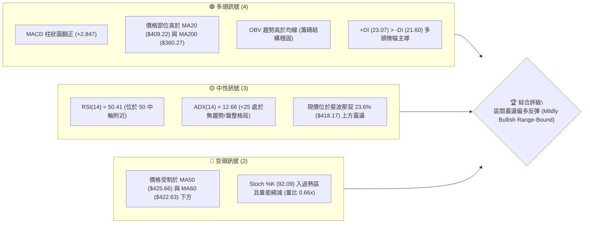
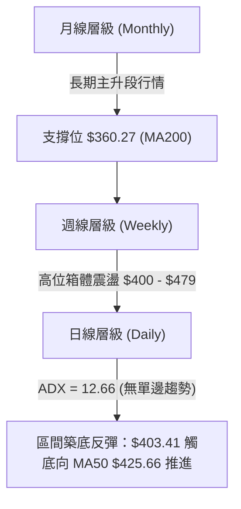
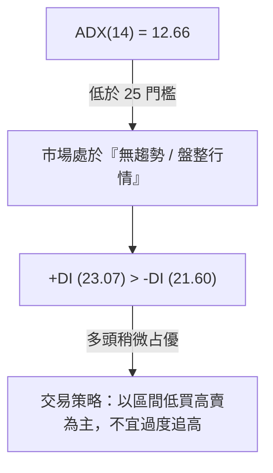
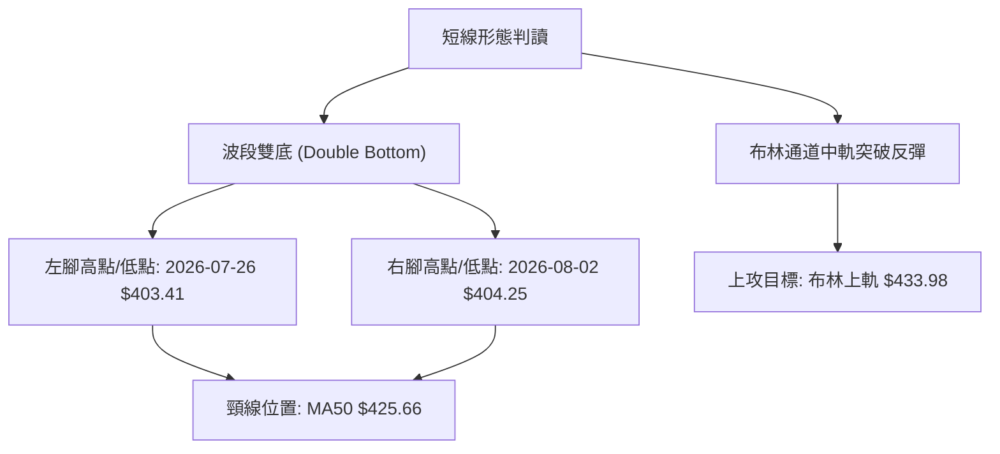
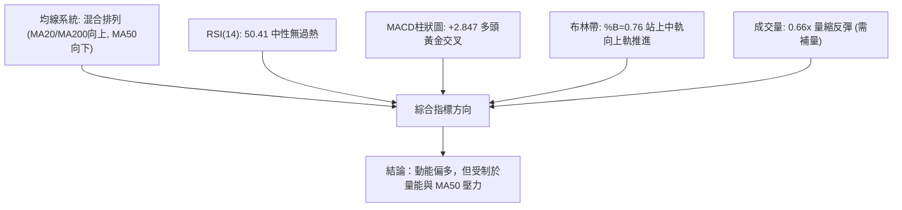
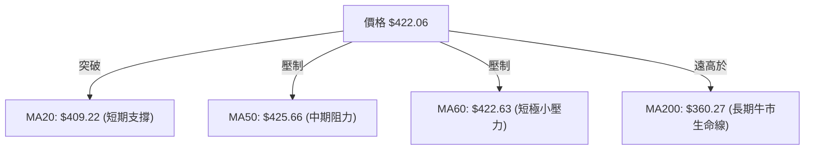
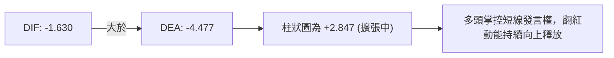
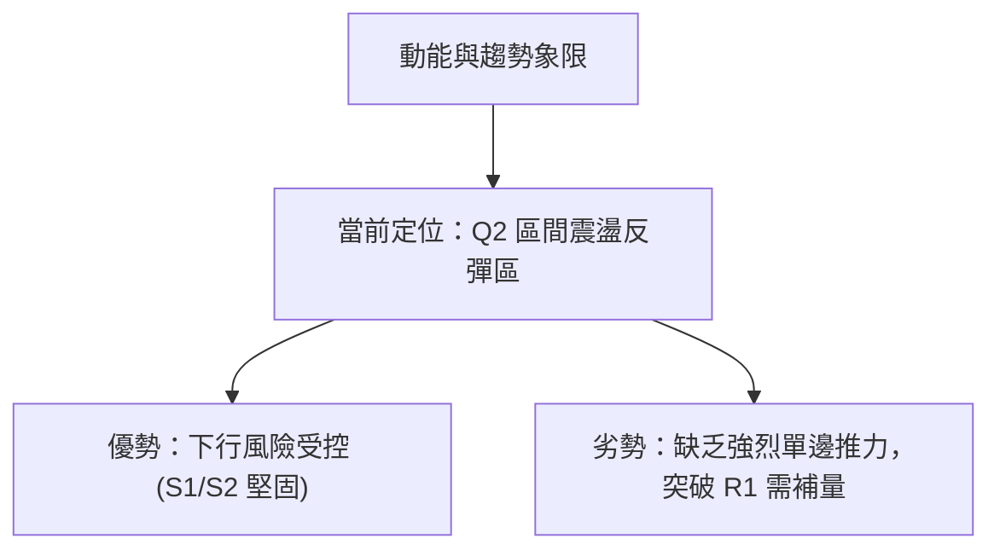
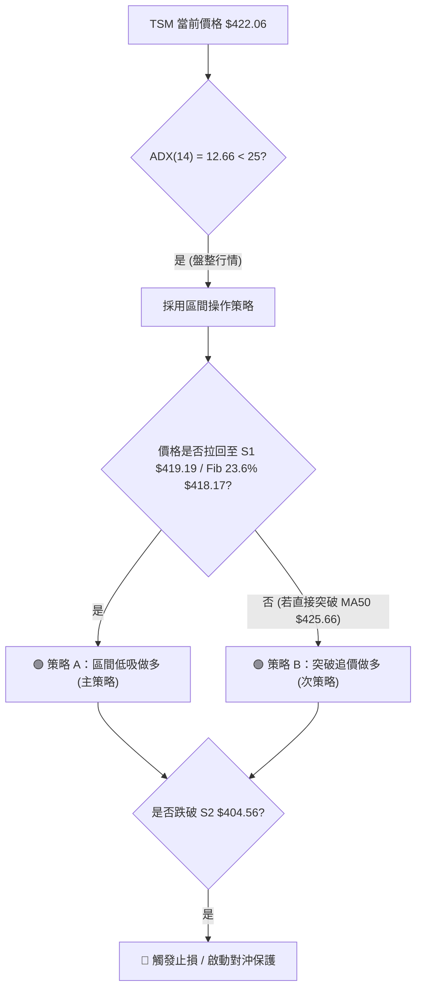
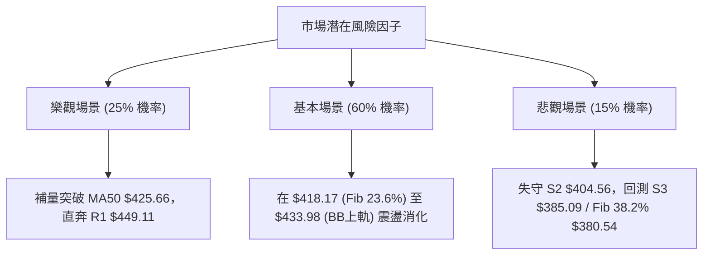

# TSM 技術分析報告

> **報告日期**：2026-08-11 ｜ **語言**：繁體中文 ｜ **數據來源**：Yahoo Finance ｜ **當前價格**：$422.06

---

## 目錄

| 章節 | 內容 |
|------|------|
| [1. 技術面概覽](#1-技術面概覽) | 訊號儀表板、核心指標、評分卡 |
| [2. 趨勢分析](#2-趨勢分析) | 多時框趨勢、長中短期走勢 |
| [3. 圖表形態分析](#3-圖表形態分析) | 形態識別、K線組合、目標價 |
| [4. 支撐與阻力](#4-支撐與阻力) | 關鍵價位、斐波那契回調 |
| [5. 技術指標深度解讀](#5-技術指標深度解讀) | MA/RSI/MACD/布林/成交量 |
| [6. 動能與波動率](#6-動能與波動率) | 動能評估、ATR、Beta |
| [7. 多時框架總結](#7-多時框架總結) | 時框架評分矩陣 |
| [8. 交易策略建議](#8-交易策略建議) | 多空策略、風險報酬比 |
| [9. 風險提示與監控](#9-風險提示與監控) | 監控指標、風險場景 |

---

## 1. 技術面概覽

### 🎯 技術訊號儀表板



### 📊 核心指標速覽表

| 指標類別 | 指標名稱 | 當前數值 | 訊號 | 解讀 |
|----------|----------|----------|------|------|
| **價格** | 當前收盤價 | $422.06 | 🟢 | 站上 52 週區間 77.9% 位置，穩守 $418.17 關鍵回調位 |
| **均線** | MA20 | $409.22 | 🟢 | 現價高於 MA20 (+3.14%)，短線扭轉探底危機 |
| **均線** | MA50 | $425.66 | 🔴 | 現價低於 MA50 (-0.85%)，形成近端動態壓力線 |
| **均線** | MA200 | $360.27 | 🟢 | 現價高於 MA200 (+17.15%)，中長期牛市基調完好 |
| **動能** | RSI(14) | 50.41 | 🟡 | 中性區域，多空於 50 分界線進行拉鋸 |
| **動能** | MACD (12,26,9) | -1.630 | 🟢 | DIF(-1.630) > DEA(-4.477)，柱狀圖 +2.847 擴張看多 |
| **波動** | ATR(14) | $15.31 | 🟡 | 日波幅約 3.63%，波動度居中，適合區間操作 |
| **擺動** | Stoch %K / %D | 92.09 / 88.60 | 🔴 | 短線急漲進入超買區，需留意追高風險 |
| **趨勢** | ADX(14) | 12.66 | 🟡 | 低於 25，顯示缺乏強烈單邊趨勢，呈現盤整特徵 |

### 🏆 技術評分卡

```
╔══════════════════════════════════════════════════════════════════╗
║              TSM 技術綜合評分卡 (2026-08-11)                     ║
╠══════════════════════════════════════════════════════════════════╣
║ 趨勢強度 (ADX/MA)   ████████░░░░░░░░░░░░  40/100  🟡 盤整無強趨勢 ║
║ 動能指標 (MACD/RSI) ██████████████░░░░░░  70/100  🟢 短線動能修復 ║
║ 支撐穩定度 (S1/Fib) ████████████████░░░░  80/100  🟢 $418.17強支撐║
║ 成交量配合度 (OBV)  ████████████░░░░░░░░  60/100  🟡 量能稍顯退潮 ║
║ 形態完整度 (底型)   ██████████████░░░░░░  70/100  🟢 雙底打底型態 ║
║ 均線排列 (多空序)   ████████████░░░░░░░░  60/100  🟡 糾合再出發   ║
╠══════════════════════════════════════════════════════════════════╣
║ 綜合評分           █████████████░░░░░░░  63/100  🟢 區間反彈偏多 ║
╚══════════════════════════════════════════════════════════════════╝
```

---

## 2. 趨勢分析

### 🌐 多時框趨勢分析



### 📈 長期趨勢 — 12個月走勢圖（Unicode）

以下為 2025 年 8 月至 2026 年 8 月 TSM 之月線價格走勢：

```
TSM 月線走勢圖（過去12個月）
價格軸 ($)
$480 ┤                                           ● 2026-06 ($477.57)
$440 ┤                                        ●  │
$400 ┤                                     ●  │  ● 2026-08 ($422.06)
$360 ┤                         ● 2026-02  ●   │  │
$320 ┤                     ●  ($372.65)  │    ● 2026-07 ($404.25)
$280 ┤         ● 2025-09  │              │
$240 ┤ ● 2025-07 ($277.11)│              │
$200 ┤  ($238.98)         │              │
     └─┬───┬───┬───┬───┬───┬───┬───┬───┬───┬───┬───┬───►
      08/25 10  12  01/26 02  03  04  05  06  07  08
```

#### 走勢特徵分析表

| 階段區間 | 價格變動 | 漲跌幅 | 走勢特徵與量能解讀 |
|----------|----------|--------|--------------------|
| **2025-08 ~ 2025-12** | $228.34 → $302.33 | **+32.40%** | 主升段開跑，價漲量增，成交量溫和放大。 |
| **2026-01 ~ 2026-02** | $328.86 → $372.65 | **+13.31%** | 強烈多頭噴出，創出歷史階段高點，市場極度樂觀。 |
| **2026-03 ~ 2026-04** | $337.16 → $395.13 | **+17.20%** | 回檔洗盤後快速收復，突破前高續創新高。 |
| **2026-05 ~ 2026-06** | $417.47 → $477.57 | **+14.40%** | 衝刺至 52 週最高點 $479.00 附近，出現高位獲利結調賣壓。 |
| **2026-07 ~ 2026-08** | $404.25 → $422.06 | **+4.41%** | 急跌至 $403.41 短線見底，展現下影線支撐，回升至 $422.06。 |

### 📊 中期趨勢（週線分析）

```
TSM 近20週價格結構與波動通道示意圖
═══════════════════════════════════════════════════════════════════
$479.00 ┤========================================= [52W 歷史高點 R2]
$462.12 ┤                     ▲ (06-21 衝高)
$449.11 ┤..................../.\................. [關鍵阻力 R1]
$422.06 ┤                   /   \       ▲ 現價
$418.17 ┤- - - - - - - - - / - - \ - - / - - - -  [Fib 23.6% 支撐]
$403.41 ┤-----------------●-------●---/---------- [波段雙底 S2]
$385.09 ┤---------------------------------------- [強支撐 S3]
═══════════════════════════════════════════════════════════════════
```

週線數據顯示，TSM 在 2026 年 6 月底於 $462.12 見頂後，經歷 4 週連續修正，於 2026-07-26 當週收在 $403.41（RSI 跌至 27.9 超賣區）。隨後兩週（08-02 至 08-16）連續拉出陽線，成交量分別為 8,733 萬股與 5,918 萬股，週 MACD 柱狀圖由 -2.144 轉正為 +2.847，顯示中期止跌訊號確立。

### ⚡ 趨勢強度評估（ADX 解讀）



| ADX 數值區間 | 當前 ADX 狀態 | 市場環境類型 | 最佳交易策略 |
|--------------|---------------|--------------|--------------|
| **0 – 20** | **12.66 (當前)** | **弱勢盤整 / 橫盤震盪** | **高拋低吸，利用布林通道上下軌做區間操作** |
| **20 – 25** | — | 趨勢醞釀期 | 觀望突破方向 |
| **25 – 50** | — | 強勁單邊趨勢 | 順勢操作，拉回買進 |

---

## 3. 圖表形態分析

### 🔍 形態識別系統



#### 圖表形態信心度評估表

| 形態名稱 | 信心度 | 判斷依據（引用數據） | 完成度 | 目標價（附計算式） |
|----------|--------|----------------------|--------|--------------------|
| **短線 W 雙底** | **70%** | 左腳 $403.41 與右腳 $404.25 形成二次測底，RSI 從 27.9 底背離回升 | 75% | 頸線 $425.66 + (頸線 $425.66 - 左腳 $403.41) = **$447.91**（貼近 R1 $449.11） |
| **通道反彈** | **65%** | 價格站上布林中軌 $409.22，且 MACD 柱狀圖持續擴大至 +2.847 | 80% | 目標為布林上軌：**$433.98** |

### 🕯️ 重要 K 線形態分析

| 月份/日期 | 收盤價 | K 線形態名稱 | 技術含義與解讀 | 多空訊號 |
|-----------|--------|--------------|----------------|----------|
| **2026-06-21** | $462.12 | 衝高避雷針 (Upper Shadow) | 觸及 $479 高點後遭長上影線壓制，主力逢高減碼 | 🔴 空頭預警 |
| **2026-07-26** | $403.41 | 長下影槌子線 (Hammer) | RSI 降至 27.9 進入超賣，多頭逢低承接力道強勁 | 🟢 底態確立 |
| **2026-08-09** | $420.04 | 實體大陽線 (Bullish Marubozu) | 強勢拉升 +15.79 美元，直接穿透 MA20 ($409.22) | 🟢 強勢反彈 |
| **2026-08-16** | $422.06 | 小陽十字星 (Spinning Top) | 在 MA50 ($425.66) 阻力前高位震盪，蓄勢整理 | 🟡 中性消化 |

### 📉 ASCII 走勢形態示意圖

```
TSM 短線雙底 (W-Bottom) 打底完成形態
───────────────────────────────────────────────────────────────────
$449.11 ┤                                           [形態測幅目標 R1]
        │                                                  /
$425.66 ┤...................頸線位 (MA50)................/....
        │                  / \                          /
$422.06 ┤................./...\............現價 ●....../
        │                /     \                 \    /
$409.22 ┤---------------/-------──────------------\--/----- [BB中軌]
        │              /                   \      /
$403.41 ┤─────●───────/                     \────●────────── [底1/底2]
        └──────┼──────────────────────────────────┼────────►
            07/26 (左腳)                       08/02 (右腳)
───────────────────────────────────────────────────────────────────
```

### 🎯 形態目標價計算

以已驗證的雙底形態進行計算：
1. **底部支撐均價**：($403.41 + $404.25) / 2 = **$403.83**
2. **關鍵頸線位置**：以 50 日均線 **$425.66** 為關鍵突破頸線
3. **形態垂直高度**：$425.66 - $403.83 = **$21.83**
4. **最小突破目標價**：頸線 $425.66 + 垂直高度 $21.83 = **$447.49**
   *(註：此推算高度高度吻合數據中之 R1 阻力位 **$449.11**)*

---

## 4. 支撐與阻力

### 🗺️ 關鍵價位分布圖（Unicode）

```
TSM 價位結構分布圖
═══════════════════════════════════════════════════════════════════
$479.00 ║████████████████████████████████████████  52週歷史高點 (0.0% Fib)
$477.90 ║██████████████████████████████████████    波段阻力 R2 (+13.23%)
$449.11 ║████████████████████████████              波段阻力 R1 (+6.41%)
$433.98 ║▓▓▓▓▓▓▓▓▓▓▓▓▓▓▓▓▓▓▓▓▓▓▓                   布林帶上軌動態阻力
$425.66 ║▓▓▓▓▓▓▓▓▓▓▓▓▓▓▓▓▓                         MA50 均線壓力位
$422.06 ╠═════════════════════════════════════════  ◄ 當前價格 $422.06
$419.19 ║▓▓▓▓▓▓▓▓▓▓▓▓▓▓▓                            波段首要支撐 S1 (-0.68%)
$418.17 ║▓▓▓▓▓▓▓▓▓▓▓▓▓▓▓                            斐波那契 23.6% 回調位
$409.22 ║██████████████                            MA20 / 布林帶中軌
$404.56 ║████████████                              強阻力轉強支撐 S2 (-4.15%)
$385.09 ║████████                                  關鍵防線 S3 (-8.76%)
$380.54 ║████████                                  斐波那契 38.2% 回調位
═══════════════════════════════════════════════════════════════════
```

### 🚧 阻力位分析表

數據中精確計算之關鍵高點聚類阻力位：

| 阻力級別 | 精確價位 | 距現價幅 | 形成原因與技術意涵 | 突破難度 | 重要性 |
|----------|----------|----------|--------------------|----------|--------|
| **R1** | **$449.11** | +6.41% | 近一年高位拉回點之波段高點聚類區，雙底測幅終點 | █ █ █ ░ ░ (中高) | 🔴 核心阻力 |
| **R2** | **$477.90** | +13.23% | 52 週最高點 $479.00 前之最後歷史賣壓帶 | █ █ █ █ █ (極高) | 🔴 強力阻力 |

### 🛡️ 支撐位分析表

數據中精確計算之關鍵低點聚類支撐位：

| 支撐級別 | 精確價位 | 距現價幅 | 形成原因與技術意涵 | 守住機率 | 重要性 |
|----------|----------|----------|--------------------|----------|--------|
| **S1** | **$419.19** | -0.68% | 近年多頭修正之波段低點聚類，與 Fib 23.6% 重疊 | █ █ █ █ ░ (80%) | 🟢 第一支撐 |
| **S2** | **$404.56** | -4.15% | 7-8 月多次下探不破之雙底頸線支撐平台 | █ █ █ █ █ (90%) | 🟢 關鍵支撐 |
| **S3** | **$385.09** | -8.76% | 近一年主要整理平台底部，布林帶下軌 $384.46 保護 | █ █ █ █ █ (95%) | 🟢 鐵板支撐 |

### 📐 斐波那契回調位分析

依據 52 週高低點範圍（$221.25 → $479.00）計算之回調價位分析：

| 比例 | 精確價位 | 與當前價格 ($422.06) 關係 | 技術面意涵與觀察重點 |
|------|----------|---------------------------|----------------------|
| **0.0%** | **$479.00** | +13.49% | 52 週歷史天花板，絕對強阻力 |
| **23.6%**| **$418.17** | **現價緊鄰其上 (+0.93%)** | **多頭強勢回檔的極限支撐線，守住代表處於強勢整理** |
| **38.2%**| **$380.54** | -9.84% | 中期多空強弱分界線，靠近 S3 ($385.09) |
| **50.0%**| **$350.13** | -17.04% | 接近 MA200 ($360.27) 長線牛熊生命線 |
| **61.8%**| **$319.71** | -24.25% | 黃金切割支撐位，長線超級買點 |
| **78.6%**| **$276.41** | -34.51% | 深度回調位 |
| **100.0%**| **$221.25**| -47.58% | 52 週歷史低點 |

**解讀**：當前價格 $422.06 恰好停留在 **23.6% ($418.17)** 與 **0.0% ($479.00)** 的黃金區間，且距離 23.6% 僅 +0.93%，顯示先前從 $479.00 的拉回僅屬於「極強勢修正」，多頭並未破壞長期上漲結構。

---

## 5. 技術指標深度解讀

### 🎛️ 指標訊號總覽



### 📈 移動平均線排列分析



#### 均線數據比較表

| 均線天數 | 精確數值 | 價格相對位置 | 趨勢方向 | 意涵解讀 |
|----------|----------|--------------|----------|----------|
| **MA5** | $418.55 | 價格位於上方 (+0.84%) | ▲ 上升 | 極短線偏多，提供貼身支撐 |
| **MA10** | $409.83 | 價格位於上方 (+2.98%) | ▲ 上升 | 短線動能強勁，黃金交叉 MA20 |
| **MA20** | $409.22 | 價格位於上方 (+3.14%) | ▲ 上升 | 擺脫月線壓制，轉為多頭防線 |
| **MA50** | $425.66 | 價格位於下方 (-0.85%) | ▼ 下降 | **主要反彈壓力關卡，需帶量突破** |
| **MA60** | $422.63 | 價格位於下方 (-0.14%) | ▼ 下降 | 現價緊貼季線，即將測試扣高變盤 |
| **MA120**| $394.36 | 價格位於上方 (+7.02%) | ▲ 上升 | 中長期支撐墊高 |
| **MA200**| $360.27 | 價格位於上方 (+17.15%)| ▲ 上升 | 長線多頭走勢極度明確 |

### 📉 RSI(14) 分析

- **當前 RSI 數值**：**50.41**
- **強度進度條**：`██████████░░░░░░░░░░` (50.41%)

#### RSI 區間評估與背離檢測
- **區間診斷**：位於 50 中性分界點，表明前期跌破 30 超賣區（7 月下旬 RSI 27.9）後，已順利完成技術性修復，目前多空重回同一起跑線。
- **背離分析**：
  - **頂背離**：無。
  - **底背離**：**輕微底背離確認**。價格於 7 月底至 8 月底兩次下探 $403.41 與 $404.25 時，RSI 由 27.9 提升至 43.3，形成典型底背離，隨後帶動價格反彈至 $422.06。

### 📊 MACD(12,26,9) 訊號解讀

- **MACD 線 (DIF)**：-1.630
- **Signal 線 (DEA)**：-4.477
- **MACD 柱狀圖 (Histogram)**：**+2.847** 🟢



**解析**：DIF 與 DEA 雖仍在 0 軸下方，但 DIF 已由下向上穿越 Signal 線完成「水下黃金交叉」，且柱狀圖連續數日呈現綠轉紅擴張（週線柱狀圖亦拉出 +2.847），這是典型的多頭動能修復訊號。

### 📦 布林通道分析

```
TSM 布林通道現況 ASCII 示意圖
───────────────────────────────────────────────────────────────────
$433.98 ┤------------------------------------------ 布林上軌 (BB Upper)
        │                                          ▲ 壓力目標
$422.06 ┤................................●......... 現價 (%B = 0.76)
        │                               /
$409.22 ┤==============================/=========== 布林中軌 (MA20)
        │                             /
$384.46 ┤------------------------------------------ 布林下軌 (BB Lower)
───────────────────────────────────────────────────────────────────
```

- **BB 上軌**：$433.98
- **BB 中軌 (MA20)**：$409.22
- **BB 下軌**：$384.46
- **BB %B 數值**：**0.76** (指出價格位於通道中軌與上軌之間 76% 的位置)
- **通道狀態**：通道寬度收窄後開始微幅張口，價格站穩中軌 $409.22，短線朝上軌 $433.98 推進。

### 💹 成交量分析（量價配合度）

- **最新成交量**：9,675,813 股
- **20 日平均量**：14,678,156 股（**量比 0.66x**）
- **50 日平均量**：14,473,534 股
- **OBV 趨勢**：**OBV > MA** 🟢（量能結構長期看多）

**量價關係診斷**：
當前價格反彈至 $422.06 但成交量僅 967 萬股（為 20 日均量的 66%），屬於「**量縮價漲**」形態。這顯示籌碼鎖定良好、拋壓輕微，但也意味著買盤追高意願不足。若要一舉突破 MA50 ($425.66) 及 R1 ($449.11)，日成交量必須放大至 1,500 萬股以上（量比 > 1.0x）。

---

## 6. 動能與波動率

### ⚡ 動能評估四象限

根據「ADX = 12.66 (低趨勢)」與「MACD 柱狀圖 = +2.847 (正向動能)」，TSM 目前於四象限中的定位：

| 象限 | 動能強度 | 趨勢強度 (ADX) | 當前狀態 | 交易環境與戰略解讀 |
|------|----------|----------------|----------|--------------------|
| **Q1** | 強動能 | 強趨勢 (ADX>25) | — | 最佳順勢突破區，可重倉追漲 |
| **Q2** | **正向修復** | **弱趨勢 (ADX<25)** | **✓ (TSM 當前)** | **區間震盪反彈區，適合低吸高拋，不宜槓桿追高** |
| **Q3** | 弱動能 | 強趨勢 (ADX>25) | — | 單邊空頭向下噴出區，應堅決止損 |
| **Q4** | 弱動能 | 弱趨勢 (ADX<25) | — | 無方向漫長盤整，資金效率極低 |



### 📊 ATR 波動率分析

- **ATR(14) 數值**：**$15.31**
- **ATR 佔比**：3.63% (對應當前價 $422.06)
- **每日波動區間**：$422.06 ± $15.31 → **$406.75 至 $437.37**

**風控應用**：
1. **短線合理止損距離**：1.0 × ATR = **$15.31**（建議止損設於現價下扣 $15.31 即 **$406.75**，剛好位於 S2 $404.56 上方）。
2. **波段防守止損距離**：1.5 × ATR = **$22.97**（即 $422.06 - $22.97 = **$399.09**，防守 $400 整數關卡）。

### 📐 Beta 與市場相關性

- **Beta 係數**：**1.258**
- **解讀**：TSM 波動度為大盤 (S&P 500) 的 1.258 倍，屬於高彈性領頭科技股。在大盤反彈格局中，TSM 具有放大回報的潛力，但在大盤回調時亦需承擔較高波動。

---

## 7. 多時框架總結

### 📋 時框架評分表

| 時框架 | 趨勢方向 | 動能狀態 | 均線排列 | 形態結構 | 綜合評分 | 交易策略建議 |
|--------|----------|----------|----------|----------|----------|--------------|
| **月線 (Monthly)** | 🟢 多頭主升 | 🟢 強勁 | 🟢 完全多頭 | 牛市通道頂部 | **85/100** | 長線堅定持有 |
| **週線 (Weekly)** | 🟡 高位整理 | 🟢 柱狀圖翻正 | 🟡 混合整理 | 400-479 巨型箱體 | **65/100** | 箱體下緣逢低布局 |
| **日線 (Daily)** | 🟡 盤整反彈 | 🟢 短線轉強 | 🟡 MA20/MA50交錯 | 雙底打底完成 | **60/100** | 區間操作，阻力位減碼 |

### 🔲 綜合訊號矩陣

| 維度 | 短期 (1-5天) | 中期 (1-4週) | 長期 (1-6個月) | 訊號收斂狀態 |
|------|--------------|--------------|----------------|--------------|
| **均線方向** | 🟢 多頭 (站上MA20) | 🔴 空頭 (壓制於MA50) | 🟢 多頭 (遠高於MA200) | 短長期看多，中期受阻 |
| **動能指標** | 🔴 超買 (Stoch>90) | 🟢 黃金交叉 (MACD) | 🟢 位於 50 軸上 (RSI) | 短線需消化，中長線好轉 |
| **量能結構** | 🔴 量縮 (量比0.66) | 🟢 OBV高於均線 | 🟢 機構持股穩固 | 籌碼沉澱，缺乏爆發量 |

### ⚖️ 多時框收斂結論

> **收斂規則遵循**：ADX = 12.66 (<25) 確認當前市場處於 **「盤整行情 (Range-Bound)」**。
> **最終收斂方向**：依據中長線多頭底蘊（MA200 = $360.27、週 MACD 翻正）與日線 ADX 盤整特徵相結合，定調為 **「區間低吸高拋、偏多反彈行情」**。主要的交易區間鎖定於 **S1 ($419.19) / S2 ($404.56)** 至 **布林上軌 ($433.98) / R1 ($449.11)** 之間。第 8 章之策略將嚴格圍繞此區間擬定。

---

## 8. 交易策略建議

### 🗺️ 策略決策流程圖



### 🧭 策略路由

**當前主策略方向：區間低吸偏多操作（綜合評分 63/100）**
由於評分 > 60 且 ADX 顯示盤整，策略以「逢低佈局反彈」為主，不建議在高位盲目追高。

### 🎯 價格情境階梯 (Price Scenarios)

| 觸發條件 | 下一目標價 | 後續延伸目標 | 情境含義與技術處置 |
|----------|------------|--------------|--------------------|
| **帶量突破 MA50 $425.66** | 布林上軌 **$433.98** | 波段阻力 R1 **$449.11** | 短線轉強，多頭目標上看 R1 |
| **站穩現價 $422.06 區間** | MA50 **$425.66** | 布林上軌 **$433.98** | 區間震盪消化，蓄勢待發 |
| **跌破 S1 $419.19 / 23.6%** | 波段強支撐 S2 **$404.56**| 強防線 S3 **$385.09** | 探底測試，尋求 S2 雙底支撐 |

### 📊 情境機率分佈

```
情境機率分佈直方圖
═══════════════════════════════════════════════════════════════════
情境 1：區間震盪向上反彈 (55%) ███████████████████████████░░░░░░░░░░
情境 2：橫盤窄幅震盪 (30%)     ███████████████░░░░░░░░░░░░░░░░░░░░
情境 3：跌破支撐向下二次探底(15%)███████░░░░░░░░░░░░░░░░░░░░░░░░░░░
═══════════════════════════════════════════════════════════════════
```

| 情境類別 | 機率估估 | 主要依據（引用指標） |
|----------|----------|----------------------|
| **情境 1：區間震盪向上** | **55%** | MACD 柱狀圖翻正 (+2.847)、週線雙底成形、OBV 長線支撐 |
| **情境 2：橫盤窄幅震盪** | **30%** | ADX = 12.66 無趨勢、成交量縮減 (量比 0.66x) |
| **情境 3：跌破探底** | **15%** | Stoch 超買 (92.09) 帶來短線獲利回吐賣壓 |

### 🟢 主策略詳情

#### 策略 A：拉回低吸做多（首選主策略）
- **進場條件**：價格拉回測試 S1 ($419.19) 或斐波那契 23.6% ($418.17) 獲得支撐不破時進場。
- **進場價格**：**$419.00**（位在 S1 $419.19 與 Fib 23.6% $418.17 之間）
- **止損價格**：**$404.00**（跌破 S2 $404.56 支撐位即止損）
- **目標價 T1**：**$433.98**（布林帶上軌）
- **目標價 T2**：**$449.11**（阻力位 R1 / 雙底形態測幅目標）
- **風險報酬比 (R/R)**：
  - 至 T1：($433.98 - $419.00) / ($419.00 - $404.00) = $14.98 / $15.00 = **1.00 : 1**
  - 至 T2：($449.11 - $419.00) / ($419.00 - $404.00) = $30.11 / $15.00 = **2.01 : 1**
- **勝率預估**：**65%**
- **建議倉位**：**15% - 20%**

#### 策略 B：帶量突破做多（次選追擊策略）
- **進場條件**：日 K 線收盤強勢突破 MA50 ($425.66)，且單日成交量 > 1,450 萬股（量比 > 1.0x）。
- **進場價格**：**$426.50**
- **止損價格**：**$418.00**（跌破 Fib 23.6% $418.17 止損）
- **目標價 T1**：**$449.11**（波段阻力 R1）
- **目標價 T2**：**$477.90**（52 週高點阻力 R2）
- **風險報酬比 (R/R)**：
  - 至 T1：($449.11 - $426.50) / ($426.50 - $418.00) = $22.61 / $8.50 = **2.66 : 1**
  - 至 T2：($477.90 - $426.50) / ($426.50 - $418.00) = $51.40 / $8.50 = **6.05 : 1**
- **勝率預估**：**55%**
- **建議倉位**：**10% - 15%**

### 🔴 反向風險觸發點（對沖提示）

若日線收盤價強勢跌破 **S2 ($404.56)**，宣告 W 底形態失敗，短線將向 **S3 ($385.09)** 或斐波那契 38.2% (**$380.54**) 尋求支撐。屆時應即刻出清多頭部位，或買入 Put 避險。

### ⭐ 整體訊號強度評星

```
做多訊號強度：★★★☆☆  (3/5 星 — 區間偏多，需補量)
做空訊號強度：★★☆☆☆  (2/5 星 — 受限於強大下檔支撐)
整體可信度：  ★★★★☆  (4/5 星 — 多指標與價位高度收斂)
```

---

## 9. 風險提示與監控

### ✅ 關鍵監控指標 Checklist

```
╔══════════════════════════════════════════════════════════════════╗
║                   每日交易監控 Checklist                         ║
╠══════════════════════════════════════════════════════════════════╣
║ [ ] 價格能否有效封閉 MA50 ($425.66) 缺口                        ║
║ [ ] 日成交量是否回升至 20日均量 (1,467 萬股) 以上                 ║
║ [ ] MACD 柱狀圖能否持續維持正值 (+2.847 以上)                   ║
║ [ ] Stoch %K (92.09) 是否高位死叉回檔                           ║
║ [ ] 關鍵防禦位 S1 ($419.19) 與 Fib 23.6% ($418.17) 是否失守     ║
╚══════════════════════════════════════════════════════════════════╝
```

### ⚠️ 風險場景分析



### 🛡️ 風險管理重要提醒

1. **量能背離風險**：當前反彈量比僅 0.66x，屬於量縮反彈，警惕高位遇到 MA50 ($425.66) 壓力時出現假突破。
2. **擺動指標過熱**：Stoch %K 高達 92.09，短線可能出現 1-2 天的技術性微幅拉回，建議等待拉回至 S1 ($419.19) 附近再行建倉。
3. **資金管理**：單一股票風險曝險不宜超過總投資組合的 20%，嚴格執行止損紀律。

---

## 📋 報告總結

```
╔══════════════════════════════════════════════════════════════════╗
║                   TSM 技術分析報告總結                           ║
════════════════════════════════════════════════════════════════════
 報告日期：2026-08-11
 當前價格：$422.06
 分析評級：🟢 63分 — 區間反彈偏多 (Range Rebound)

 關鍵結論：
 ├─ 長期趨勢：🟢 強烈多頭 (高於 MA200 $360.27 +17.15%)
 ├─ 中期趨勢：🟡 箱體整理 (處於 $400 - $479 區間震盪)
 ├─ 短期趨勢：🟢 底態反彈 (W底成形，MACD柱狀圖 +2.847)
 ├─ 關鍵支撐：S1 $419.19 / S2 $404.56
 ├─ 關鍵阻力：MA50 $425.66 / R1 $449.11
 └─ 分析師目標：均價 $547.09 (隱含 +29.62% 上行空間)

 最優策略組合：
 1. 🥇 最佳機會：拉回至 $419.00 附近分批低吸，止損設 $404.00，目標 $449.11。
 2. 🥈 次選機會：帶量突破 $425.66 後追價，目標上看 $477.90。
 3. 🥉 保守選擇：觀望至 ADX > 25 或價格回測 S2 $404.56 出現明確止跌訊號。
════════════════════════════════════════════════════════════════════
```

---

> ⚠️ **免責聲明**：本報告為 AI 自動生成之技術分析，所有數據及估算均基於提供的歷史價格資訊。本報告**僅供研究與學術參考**，**不構成任何投資建議**。投資有風險，入市需謹慎。