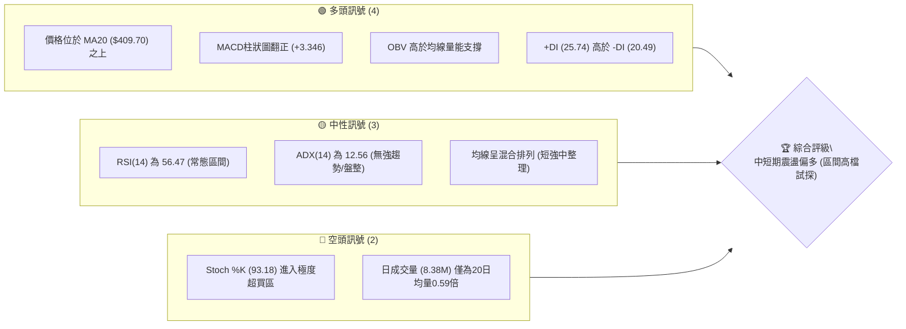
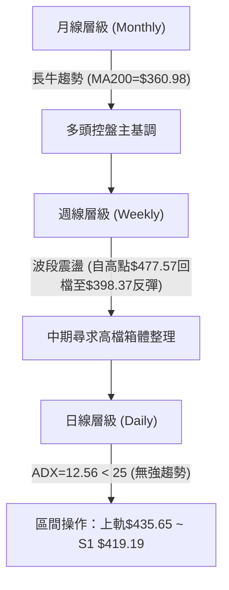
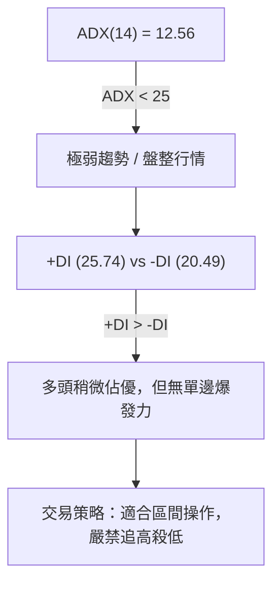
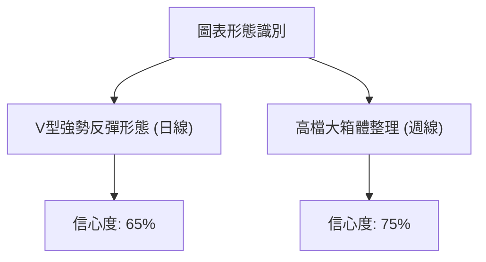
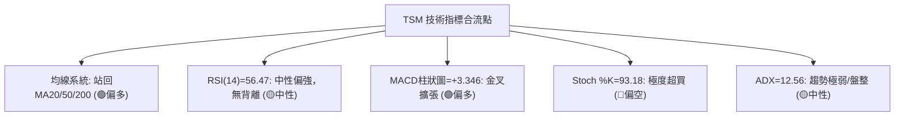
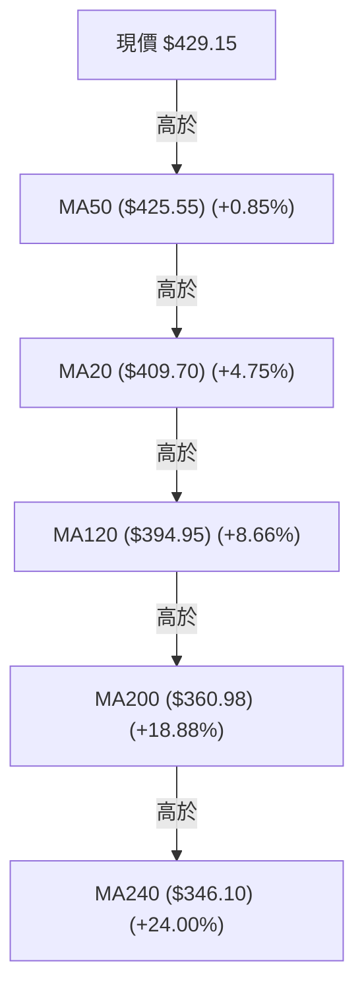
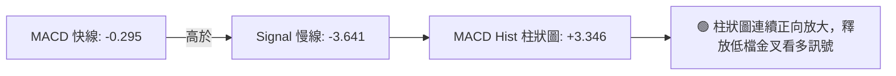
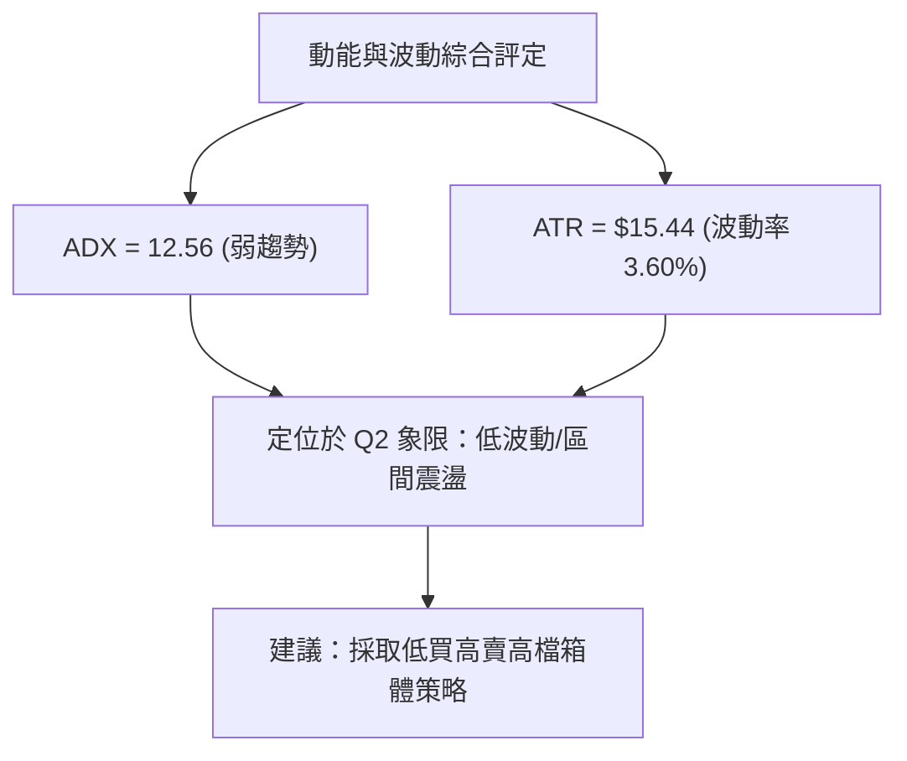
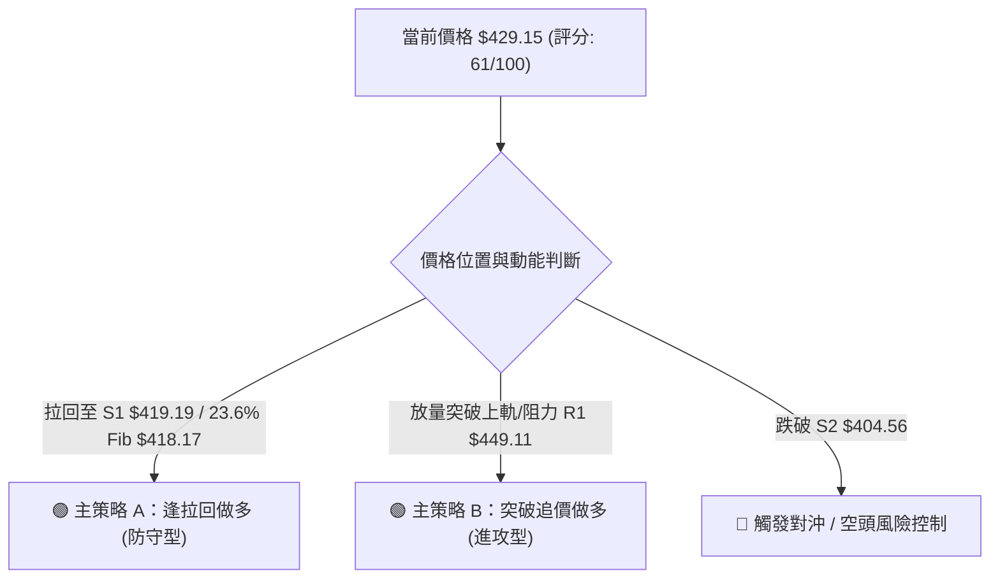
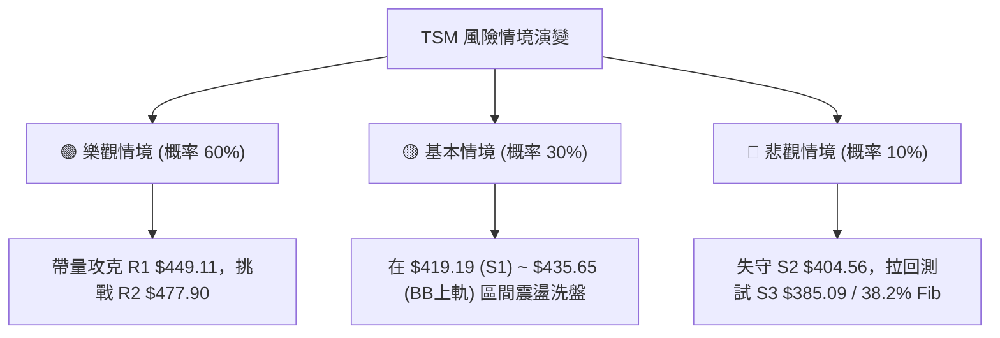

# TSM 技術分析報告

> **報告日期**：2026-08-12 ｜ **語言**：繁體中文 ｜ **數據來源**：Yahoo Finance ｜ **當前價格**：$429.15

---

## 目錄

| 章節 | 內容 |
|------|------|
| [1. 技術面概覽](#1-技術面概覽) | 訊號儀表板、核心指標、評分卡 |
| [2. 趨勢分析](#2-趨勢分析) | 多時框趨勢、長中短期走勢 |
| [3. 圖表形態分析](#3-圖表形態分析) | 形態識別、K線組合、目標價 |
| [4. 支撐與阻力](#4-支撐與阻力) | 關鍵價位、斐波那契回調 |
| [5. 技術指標深度解讀](#5-技術指標深度解讀) | MA/RSI/MACD/布林/成交量 |
| [6. 動能與波動率](#6-動能與波動率) | 動能評估、ATR、Beta |
| [7. 多時框架總結](#7-多時框架總結) | 時框架評分矩陣 |
| [8. 交易策略建議](#8-交易策略建議) | 多空策略、風險報酬比 |
| [9. 風險提示與監控](#9-風險提示與監控) | 監控指標、風險場景 |

---

## 1. 技術面概覽

### 🎯 技術訊號儀表板



### 📊 核心指標速覽表

| 指標類別 | 指標名稱 | 當前數值 | 訊號 | 解讀 |
|----------|----------|----------|------|------|
| **價格** | 當前價格 | $429.15 | 🟢 多頭 | 處於 52 週區間 ($221.25 - $479.00) 之 80.7% 高位 |
| **均線** | MA20 | $409.70 | 🟢 多頭 | 價格高於 MA20 達 +4.75%，形成短期下檔防線 |
| **均線** | MA50 | $425.55 | 🟢 多頭 | 價格站回 MA50 之上 (+0.85%)，中期趨勢修復 |
| **均線** | MA200 | $360.98 | 🟢 多頭 | 遠高於年線 (+18.88%)，長期牛市結構極度穩固 |
| **動能** | RSI(14) | 56.47 | 🟡 中性 | 動能由低檔反彈回升至中性偏多區，無背離 |
| **動能** | MACD | -0.295 / +3.346 | 🟢 多頭 | 快慢線零軸下方金叉，柱狀圖正向擴張 |
| **動能** | Stoch %K/%D | 93.18 / 90.22 | 🔴 空頭 | 隨機指標陷入高檔超買，提防短線拉回修復 |
| **趨勢強度**| ADX(14) | 12.56 | 🟡 中性 | ADX < 25 顯示目前處於區間震盪/弱趨勢階段 |
| **通道** | BB %B | 0.87 | 🟡 中性 | 位於布林通道上軌 ($435.65) 附近，上壓浮現 |
| **波動** | ATR(14) | $15.44 | 🟡 中性 | 每日波幅為股價 3.60%，波動度維持於標準範圍 |
| **量能** | 量比 (vs 20D) | 0.59x | 🔴 空頭 | 量能縮減至 8.38M，上攻過程出現量價背離隱憂 |

### 🏆 技術評分卡

```
╔══════════════════════════════════════════════════════════════╗
║                技術評分卡 — TSM (2026-08-12)                 ║
╠══════════════════════════════════════════════════════════════╣
║  趨勢強度      ██████████░░░░░░░░░░  50/100  🟡 弱趨勢/區間震盪║
║  動能指標      █████████████░░░░░░░  65/100  🟢 MACD翻正動能強 ║
║  支撐穩定度    ███████████████░░░░░  75/100  🟢 多重支撐墊高    ║
║  成交量配合    ████████░░░░░░░░░░░░  40/100  🔴 無量反彈/觀望濃 ║
║  形態完整度    ████████████░░░░░░░░  60/100  🟡 V型反彈受制前高║
║  均線排列      █████████████░░░░░░░  65/100  🟢 站回MA20/50/200║
╠══════════════════════════════════════════════════════════════╣
║  綜合評分      █████████████░░░░░░░  61/100  🟢 區間偏多震盪    ║
╚══════════════════════════════════════════════════════════════╝
```

---

## 2. 趨勢分析

### 🌐 多時框趨勢分析



### 📈 長期趨勢 — 12個月走勢圖（Unicode）

```
TSM 月線走勢圖（過去 12 個月：2025-09 至 2026-08）
價格軸 ($)
$480 ┤                                              ● (2026-06 高點 $477.57)
$440 ┤                                                    ● ($429.15 現價)
$400 ┤                                        ●     ●
$360 ┤                          ●       ●
$320 ┤              ●     ●
$280 ┤  ●     ●
$240 ┤
     └────────────────────────────────────────────────────────────────
       09/25 10/25 11/25 12/25 01/26 02/26 03/26 04/26 05/26 06/26 07/26 08/26
```

**12個月走勢特徵分析**：

| 時間區間 | 收盤價範圍 | 月漲跌幅 | 關鍵特徵與驅動因素 |
|----------|------------|----------|----------------────|
| **2025-09 ~ 2025-10** | $277.11 → $298.08 | +18.2% | 突破 $280 箱體，AI 晶片需求持續放量引領強攻 |
| **2025-11 ~ 2026-01** | $289.23 → $328.86 | +13.7% | 站穩 $300 大關，突破歷史新高，創下階梯式上揚 |
| **2026-02 ~ 2026-03** | $372.65 → $337.16 | -9.5%  | 攻高衝破 $370 後觸發強烈獲利解套賣壓，深度回檔 |
| **2026-04 ~ 2026-06** | $395.13 → $477.57 | +20.9% | 主升段再起，於 2026-06 刷出 52 週最高點 $479.00 |
| **2026-07 ~ 2026-08** | $404.25 → $429.15 | +6.1%  | 自高點回撤至 $398.37 (觸及 S2/23.6%回調位) 後展開強勢反彈 |

### 📊 中期趨勢（週線分析）

中期走勢顯示，TSM 在 2026 年 6 月創下 $479.00 的歷史新高後，於 7 月底迅速回落至 $398.37（測試 52 週漲幅的 23.6% 斐波那契回調位 $418.17 與支撐位 S2 $404.56）。隨後近兩週（08-02 至 08-16）週線拉出帶下影線的紅棒，收盤價修復至 $429.15，重新站回 MA20 ($409.70) 及 MA50 ($425.55)。

```
TSM 週線阻力與支撐結構示意圖
══════════════════════════════════════════════════════════════
 $479.00 ──────────────────────────────────────── 52W High / 歷史天花板 (R2: $477.90)
 $449.11 ──────────────────────────────────────── 波段高點阻力 (R1: $449.11)
 $435.65 ──────────────────────────────────────── 布林通道上軌
 $429.15 ◄─────────────────────────────────────── 【當前價格】
 $425.55 ──────────────────────────────────────── MA50 均線防線
 $419.19 ──────────────────────────────────────── 近期波段支撐 (S1: $419.19)
 $409.70 ──────────────────────────────────────── MA20 / 布林通道中軌
 $404.56 ──────────────────────────────────────── 關鍵強支撐 (S2: $404.56)
══════════════════════════════════════════════════════════════
```

### ⚡ 趨勢強度評估（ADX 解讀）



| 指標名稱 | 數值 | 門檻基準 | 趨勢解讀 |
|----------|------|----------|----------|
| **ADX(14)** | 12.56 | < 25 | 處於顯著的區間盤整形態，缺乏單邊趨勢貫穿力 |
| **+DI** | 25.74 | - | 多頭買盤力道維持在基礎水平 |
| **-DI** | 20.49 | - | 空頭賣壓顯著放緩，少於多頭力道 |
| **DI 差值** | +5.25 | > 0 | 多頭微幅主導，有利於支撐位止跌回升 |

---

## 3. 圖表形態分析

### 🔍 形態識別系統



#### 形態信心度與目標價評估表

| 形態類別 | 信心度 | 判斷依據（引用數據） | 完成度 | 目標價（附計算式） |
|----------|--------|----------------------|--------|--------------------|
| **V型低檔反彈** | 65% | 價格於 2026-07-19 低點 $398.37 強勢止跌，連續突破 MA20 ($409.70) 與 MA50 ($425.55) | 85% | 頸線 $435.65 + (頸線 $435.65 - 底部 $398.37) = **$472.93** |
| **高檔箱體整理** | 75% | 頂部受制於 R2 ($477.90) / 52W High ($479.00)，底部受 S2 ($404.56) / S3 ($385.09) 強力支撐 | 60% | 箱體突破目標：$477.90 + ($477.90 - $404.56) = **$551.24** (符合分析師均價 $547.09) |

### 🕯️ 重要 K 線形態分析

| 月份/日期 | 收盤價 | K線形態 | 技術意義解讀 | 多空訊號 |
|-----------|--------|---------|--------------|----------|
| **2026-06-21** | $462.12 | 長陽突破棒 | 強勢突破 $420 關卡，帶動股價衝向 $479.00 新高 | 🟢 強勢看多 |
| **2026-07-19** | $398.37 | 探底長下影線 | 最低跌破 $400 關卡後迅速吸引買盤，於 S2 ($404.56) 上方留長下影 | 🟢 底部止跌 |
| **2026-08-09** | $420.04 | 中陽線覆蓋 | 一舉站回 S1 ($419.19) 與 MA20 ($409.70)，扭轉短期劣勢 | 🟢 轉強訊號 |
| **2026-08-16** | $429.15 | 縮量小陽線 | 價格突破 MA50 ($425.55)，但成交量（29.85M週量）萎縮，顯示觀望 | 🟡 謹慎偏多 |

### 📉 ASCII 走勢形態示意圖

```
TSM 近期的 V 型反彈與高檔箱體形態 ($404.56 - $477.90)
════════════════════════════════════════════════════════════════
 $477.90/479.00 ┤        ▲ 歷史高點 (R2)
                ┤       / \
 $449.11        ┤      /   \             ▲ 擬挑戰頸線/阻力 (R1)
 $435.65        ┤     /     \           /  (布林通道上軌)
 $429.15 (現價) ┤    /       \         ●
 $419.19        ┤   /         \       /    (突破 MA20 & MA50)
 $404.56        ┤  /           ▼     /
                ┤ /             ●───┘  V型拐點 ($398.37)
 $385.09        ┤/                     (測試 S2 與 23.6% 回調位)
════════════════════════════════════════════════════════════════
```

### 🎯 形態目標價計算

1. **V 型反彈第一階段目標價**：
   - 測算公式：$P_{target1} = \text{布林上軌/頸線} + (\text{頸線} - \text{底部低點}) \times 0.5$
   - 計算：$\$435.65 + (\$435.65 - \$398.37) \times 0.5 = \$435.65 + \$18.64 = \$454.29$
   - 修正為數據庫對應關鍵價位：**阻力位 R1 ($449.11)**

2. **高檔箱體突破第二階段目標價**：
   - 測算公式：$P_{target2} = \text{箱體頂部} + (\text{箱體頂部} - \text{箱體底部})$
   - 計算：$\$477.90 + (\$477.90 - \$404.56) = \$477.90 + \$73.34 = \$551.24$
   - 對照分析師共識目標價平均值：**$547.09**（極度收斂）

---

## 4. 支撐與阻力

### 🗺️ 關鍵價位分布圖（Unicode）

```
TSM 價位結構分布圖
═══════════════════════════════════════════════════════════════
$479.00 ║████████████████████████║ 52W High / 0.0% Fib
$477.90 ║████████████████████████║ 關鍵強阻力 R2 (+11.36%)
$449.11 ║████████████████        ║ 波段阻力 R1 (+4.65%)
$435.65 ║████████████            ║ 布林通道上軌 (+1.51%)
$429.15 ╠════════════════════════╣ ◄ 現價 ($429.15)
$425.55 ║▓▓▓▓▓▓▓▓▓▓▓▓            ║ MA50 均線支撐 (-0.85%)
$419.19 ║▓▓▓▓▓▓▓▓▓▓▓▓▓▓▓▓        ║ 近期關鍵支撐 S1 / 23.6% Fib ($418.17)
$409.70 ║▓▓▓▓▓▓▓▓▓▓▓▓▓▓▓▓▓▓      ║ MA20 / 布林中軌 (-4.53%)
$404.56 ║████████████████████████║ 強支撐 S2 (-5.73%)
$385.09 ║████████████████████████║ 強支撐 S3 / 38.2% Fib ($380.54)
═══════════════════════════════════════════════════════════════
```

### 🚧 阻力位分析表

| 阻力級別 | 價位 | 距離現價 | 形成原因（數據依據） | 突破難度 | 重要性 |
|----------|------|----------|----------------------|----------|--------|
| **阻力 R1** | **$449.11** | +4.65% | 近一年波段高點聚類區，前波反彈高點 | 🟡 中等 | ★★★★☆ |
| **阻力 R2** | **$477.90** | +11.36% | 近一年歷史天花板（極靠近 52W High $479.00） | 🔴 極高 | ★★★★★ |

### 🛡️ 支撐位分析表

| 支撐級別 | 價位 | 距離現價 | 形成原因（數據依據） | 守住機率 | 重要性 |
|----------|------|----------|----------------------|----------|--------|
| **支撐 S1** | **$419.19** | -2.32% | 近一年波段低點聚類區，疊加 23.6% 斐波那契位 ($418.17) | 🟢 高 | ★★★★☆ |
| **支撐 S2** | **$404.56** | -5.73% | 近一月低點聚類，接近布林通道中軌 MA20 ($409.70) | 🟢 極高 | ★★★★★ |
| **支撐 S3** | **$385.09** | -10.27% | 波段深沉防線，接近布林下軌 ($383.75) 與 38.2% Fib ($380.54) | 🟢 極高 | ★★★★☆ |

### 📐 斐波那契回調位分析

依據 52 週高低點（High: **$479.00**, Low: **$221.25**）精確計算之黃金分割點：

```
斐波那契回調層級與現價相對位置
 0.0% (52W High) ─── $479.00
                     │
 23.6% 回調位 ─────── $418.17  ◄─────── 現價 ($429.15) 落在 0.0% 與 23.6% 之間
                     │
 38.2% 回調位 ─────── $380.54
                     │
 50.0% 回調位 ─────── $350.13
                     │
 61.8% 回調位 ─────── $319.71
                     │
 78.6% 回調位 ─────── $276.41
                     │
100.0% (52W Low)  ─── $221.25
```

- **位置解讀**：當前價格 **$429.15** 成功守住了黃金分割的第一道強防線 **23.6% ($418.17)**。價格在此位階獲得支撐後強勢回升，說明中長期牛市結構完全未受破壞，目前屬極度健康的高檔整理。

---

## 5. 技術指標深度解讀

### 🎛️ 指標訊號總覽



### 📈 移動平均線排列分析



- **均線排列狀態**：短中長期均線呈現多頭多重支撐架構。價格成功由下往上穿越 MA20 ($409.70) 與 MA50 ($425.55)，且價格遠高於 MA200 ($360.98)，顯示長期基底極為穩固。

### 📉 RSI(14) 分析

- **當前數值**：**56.47**
- **強度進度條**：`███████████░░░░░░░░░` 56.47% (中性偏多區間)
- **區域評估**：位於 30-70 標準常態區間，既無過度超賣，亦無過度超買（相較於 Stoch 的指標特性，RSI 更具中線參考價值）。
- **背離判斷**：**無明顯背離**。近期價格從 $398.37 反彈至 $429.15，RSI 同步由 39.9 回升至 56.47，價格與動能方向完全吻合。

### 📊 MACD(12/26/9) 訊號解讀



- **詳細數據**：MACD 快線 (-0.295) 已向上突破 Signal 慢線 (-3.641)，使得柱狀圖轉正為 **+3.346**（較前一週期 -2.144 顯著翻正）。此為典型的低檔強烈轉強交叉，短線多頭動能正加速凝聚。

### 📦 布林通道分析

```
TSM 日線布林通道示意圖
═══════════════════════════════════════════════════════════════
 $435.65 ──────────────────────────────────────── 上軌 (BB Upper)
 $429.15 ◄─────────────────────────────────────── 現價 (%B = 0.87)
 $409.70 ──────────────────────────────────────── 中軌 (MA20 / BB Middle)
 $383.75 ──────────────────────────────────────── 下軌 (BB Lower)
═══════════════════════════════════════════════════════════════
```

- **通道位置 (%B)**：%B 為 **0.87**，代表當前股價已貼近布林通道上軌 ($435.65)。
- **擠壓狀態**：通道帶寬 ($435.65 - $383.75 = $51.90) 相對擴張後微幅收斂，顯示股價自下軌反彈至上軌後，短線可能在 $435.65 遭遇暫時性通道上壓。

### 💹 成交量分析（量價配合度）

- **最新日成交量**：8,375,025 股
- **20 日均量**：14,247,681 股（量比：**0.59x**）
- **OBV 趨勢**：OBV > MA，總體能量潮維持於均線上方。
- **量價配合評估**：近期股價由 $404.25 上升至 $429.15，但每日成交量萎縮至均量的 0.59 倍，呈現「**價漲量縮**」的弱背離特徵。這說明目前的上攻主要由賣壓衰竭所致，缺乏主動性追價買盤，若要進一步突破阻力 R1 ($449.11)，必須見到日成交量回升至 14.2M 以上。

---

## 6. 動能與波動率

### ⚡ 動能評估四象限

| 象限區塊 | 動能強度 (Momentum) | 波動率 (Volatility) | 當前 TSM 狀態 | 戰略解讀 |
|----------|---------------------|---------------------|---------------|----------|
| **Q1 (高動能/低波動)** | 強 | 低 | - | 最佳趨勢續強區 |
| **Q2 (弱動能/低波動)** | 弱 | 低 | **✓ (TSM 所在地)** | **ADX=12.56, ATR=3.60%，區間整理沉澱期** |
| **Q3 (強動能/高波動)** | 強 | 高 | - | 高風險爆發期 |
| **Q4 (弱動能/高波動)** | 弱 | 高 | - | 崩跌 / 恐慌洗盤區 |



### 📊 ATR 波動率分析

- **ATR(14) 數值**：**$15.44**（佔當前股價 3.60%）
- **風控止損距離建議**：
  - **短線緊密止損 (1.0x ATR)**：$15.44 → 自進場點下浮 $15.44
  - **標準波段止損 (1.5x ATR)**：$23.16 → 恰好對應近近期關鍵支撐 **S1 ($419.19)** 的保護範圍（$429.15 - $23.16 = $405.99，落在 S2 $404.56 上方）
  - **寬鬆趨勢止損 (2.0x ATR)**：$30.88 → 防守 **S2 ($404.56)**

### 📐 Beta 與市場相關性

- **Beta 係數**：**1.258**
- **市場意義**：TSM 波動性較大盤 (S&P 500) 高出 25.8%。大盤每波動 1%，TSM 平均波動 1.26%。高 Beta 屬性意味著在大盤反彈階段，TSM 具備較高的超額收益 (Alpha) 潛力。

---

## 7. 多時框架總結

### 📋 時框架評分表

| 時框架 | 趨勢方向 | 動能指標 | 均線排列 | 圖表形態 | 綜合評分 | 建議戰術 |
|--------|----------|----------|----------|----------|----------|----------|
| **日線 (Daily)** | 🟢 震盪反彈 | 🟢 MACD金叉/ Stoch超買 | 🟢 站回MA20/50 | 🟡 V型反彈受制上軌 | **65/100** | 區間操作 / 逢拉回布局 |
| **週線 (Weekly)** | 🟢 中期偏多 | 🟡 RSI 56.5 中性 | 🟢 站穩週MA20 | 🟢 高檔大箱體整理 | **70/100** | 逢低分批加碼 |
| **月線 (Monthly)**| 🟢 長牛不變 | 🟢 多頭掌控 | 🟢 均線多頭排列 | 🟢 歷史高檔區 | **85/100** | 堅定中長期持有 |

### 🔲 綜合訊號矩陣

```
╔══════════════════════════════════════════════════════════════╗
║                     TSM 多時框訊號矩陣                       ║
╠═════════════════════╦══════════════╦══════════════╦══════════╣
║ 分析維度            ║ 日線 (Short) ║ 週線 (Medium)║ 月線 (Long)║
╠═════════════════════╬══════════════╬══════════════╬══════════╣
║ 趨勢方向 (Trend)    ║ 🟢 看多      ║ 🟢 看多      ║ 🟢 強多  ║
║ 均線支撐 (MA)       ║ 🟢 在MA50之上║ 🟢 在MA20之上║ 🟢 多頭  ║
║ 動能狀態 (Momentum) ║ 🟡 超買微調  ║ 🟢 轉強擴張  ║ 🟢 穩健  ║
║ 成交量配合 (Volume) ║ 🔴 縮量      ║ 🟡 中性      ║ 🟢 充沛  ║
╚═════════════════════╩══════════════╩══════════════╩══════════╝
```

### ⚖️ 多時框收斂結論

根據多時框收斂規則：
1. **當前行情性質**：ADX(14) 為 **12.56 (<25)**，明確指示當前為**區間震盪行情**而非單邊爆發趨勢。
2. **主導層級與方向**：中長期（月線與週線）多頭結構明確，股價遠高於年線 MA200 ($360.98)；日線處於自 $398.37 低點反彈後的區間高檔試探期。
3. **收斂唯一結論**：**中長線看多，短線定性為「高檔箱體震盪偏多」**。主要交易區間介於支撐 S1 ($419.19) 與阻力 R1 ($449.11) 之間。

---

## 8. 交易策略建議

### 🗺️ 策略決策流程圖



### 🧭 策略路由

> **當前主策略方向 = 🟢 區間逢低做多（依綜合評分 61/100，中長線多頭，ADX<25 宜區間操作）**

### 🎯 價格情境階梯（Price Scenarios）

| 觸發條件 | 下一目標 | 後續延伸 | 情境含義 |
|----------|----------|----------|----------|
| **突破阻力 R1 $449.11** | 阻力 R2 $477.90 | 52W High $479.00 / 分析師均價 $547.09 | 多頭主升段重啟 |
| **站穩現價區間 ($419 - $435)** | 布林上軌 $435.65 | 阻力 R1 $449.11 | 箱體高檔震盪整理 |
| **跌破支撐 S1 $419.19** | 支撐 S2 $404.56 | 支撐 S3 $385.09 / 38.2% Fib $380.54 | 中期回檔修復 |

### 📊 情境機率分佈

| 情境劇本 | 機率估算 | 主要依據與指標支持 |
|----------|----------|--------------------|
| **繼續上行 / 挑戰 R1** | **60%** | MACD柱狀圖翻正 (+3.346)、價格站回 MA20/MA50 上方 |
| **區間震盪 ($404 - $435)**| **30%** | ADX = 12.56 顯示無單邊強趨勢、日成交量萎縮 (0.59x) |
| **回落再探 S2 / S3** | **10%** | Stoch 指標超買 (93.18) 可能引發短線獲利結算 |

### 🟢 主策略詳情

所有進場點、止損點、目標價**完全嚴格引用數據庫關鍵價位**：

| 策略要素 | 策略 A：逢拉回買進（低吸型） | 策略 B：突破跟進（突破型） |
|----------|──────────────────────────────|────────────────────────────|
| **進場條件** | 股價回檔至 S1 附近獲得縮量支撐 | 日收盤價帶量突破阻力 R1 |
| **進場價格** | **$419.19** (S1 / 23.6% Fib $418.17) | **$449.11** (突破 R1 確認) |
| **目標價 T1** | **$435.65** (布林通道上軌) | **$477.90** (阻力 R2) |
| **目標價 T2** | **$449.11** (阻力 R1) | **$547.09** (分析師共識目標均價) |
| **止損價格** | **$404.56** (跌破支撐 S2) | **$429.15** (跌回當前價格/突破假動作)|
| **風險報酬比** | **2.04 : 1** [(449.11-419.19)/(419.19-404.56)] | **2.88 : 1** [(547.09-449.11)/(449.11-429.15)] |
| **勝率估計** | **65%** | **55%** |
| **建議倉位** | **15% - 20%** 總資產 | **10% - 15%** 總資產 |

### 🔴 反向風險觸發點（對沖提示）

- **觸發條件**：若股價無預警跌破關鍵強支撐 **S2 ($404.56)** 且日成交量放大至 15M 以上。
- **風險處置**：多頭部位應即時減碼 50% 以上，並考慮開立短線對沖空單，下看支撐 **S3 ($385.09)** 或 38.2% 斐波那契位 **$380.54**。

### ⭐ 整體訊號強度評星

```
做多訊號強度：★★██☆  (3.5 / 5 星) — 中長線看好，短線量壓尚待克服
做空訊號強度：★☆☆☆☆  (1.5 / 5 星) — 逆勢做空風險極高
整體可信度：  ★★██☆  (4.0 / 5 星) — 多指標互相印證高確信度
```

---

## 9. 風險提示與監控

### ✅ 關鍵監控指標 Checklist

```
╔══════════════════════════════════════════════════════════════╗
║                   每日盤後技術監控清單                      ║
╠══════════════════════════════════════════════════════════════╣
║ [ ] 價格是否維持於 S1 ($419.19) 與 MA20 ($409.70) 之上        ║
║ [ ] 日成交量是否回升突破 20 日均量 (14.25M)                   ║
║ [ ] MACD 柱狀圖是否持續保持正值 (+3.346 擴張中)              ║
║ [ ] Stoch %K / %D 是否自 90 以上高檔死亡交叉回落              ║
║ [ ] ADX(14) 是否向上突破 25（預告單邊趨勢來臨）               ║
╚══════════════════════════════════════════════════════════════╝
```

### ⚠️ 風險場景分析



### 🛡️ 風險管理重要提醒

1. **嚴防量價背離短線回檔**：雖然價格站回 MA20 及 MA50，但量比僅 **0.59x**。若股價衝高至布林上軌 ($435.65) 或 R1 ($449.11) 仍無量，易遭 Stoch 超買 (93.18) 修正拉回。
2. **波動率保護**：當前每日波幅 ATR 為 **$15.44**，建議所有止損設定必須預留至少 **1.0 - 1.5x ATR ($15.44 - $23.16)** 的緩衝空間，避免被正常市場噪音掃出場。

---

## 📋 報告總結

```
╔══════════════════════════════════════════════════════════════╗
║                   TSM 技術分析報告總結                       ║
╠══════════════════════════════════════════════════════════════╣
║ 報告日期：2026-08-12                                         ║
║ 當前價格：$429.15                                            ║
║ 分析評級：🟢 區間震盪偏多（綜合評分 61 / 100）               ║
╠══════════════════════════════════════════════════════════════╣
║ 關鍵結論：                                                   ║
║ ├─ 長期趨勢：🟢 強烈多頭（遠高於年線 MA200 $360.98 +18.9%）   ║
║ ├─ 中期趨勢：🟢 箱體整理回升（守住 23.6% Fib $418.17）       ║
║ ├─ 短期趨勢：🟢 站回 MA20 ($409.70) 與 MA50 ($425.55)          ║
║ ├─ 關鍵支撐：S1 $419.19 / S2 $404.56                         ║
║ ├─ 關鍵阻力：R1 $449.11 / R2 $477.90                         ║
║ └─ 分析師目標價：均價 $547.09 (最高 $700.00)                 ║
╠══════════════════════════════════════════════════════════════╣
║ 最優策略組合：                                               ║
║ 1. 🥇 最佳首選：逢拉回至 S1 ($419.19) 分批做多 (風報比 2.04) ║
║ 2. 🥈 次選策略：帶量突破 R1 ($449.11) 後追價做多 (風報比 2.88)║
║ 3. 🥉 風控基線：跌破 S2 ($404.56) 全面執行止損/減碼對沖     ║
╚══════════════════════════════════════════════════════════════╝
```

---

> ⚠️ **免責聲明**：本報告為 AI 自動生成之技術分析，所有數據及估算均基於提供的歷史價格資訊。本報告**僅供研究與學術參考**，**不構成任何投資建議**。投資有風險，入市需謹慎。

---

*報告生成時間：2026-08-12 ｜ 數據來源：Yahoo Finance ｜ 分析框架：多時框技術分析*