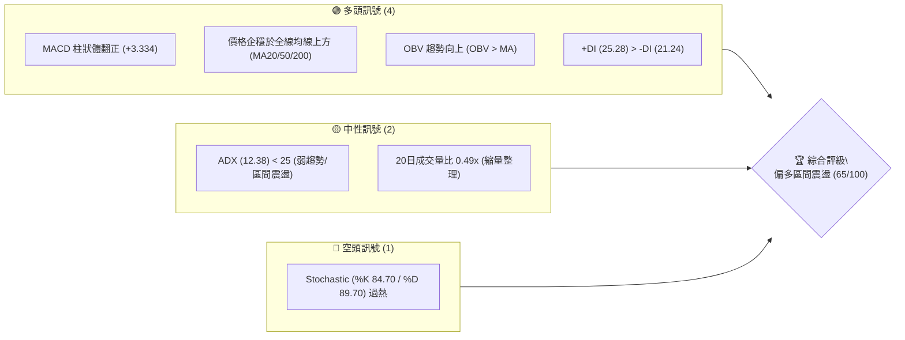
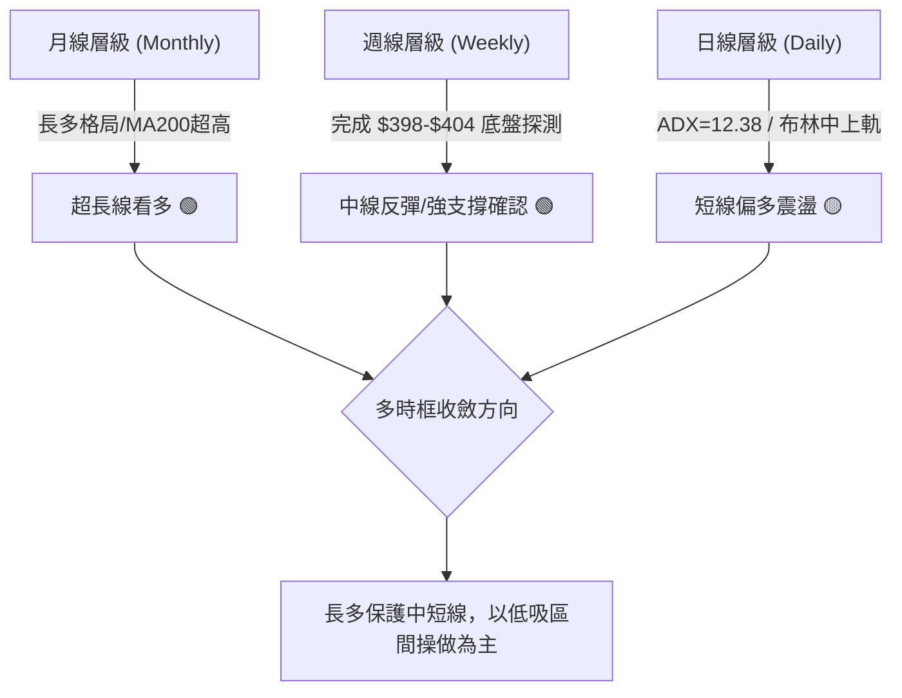
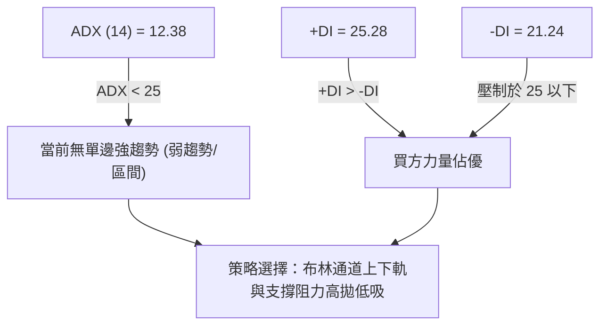
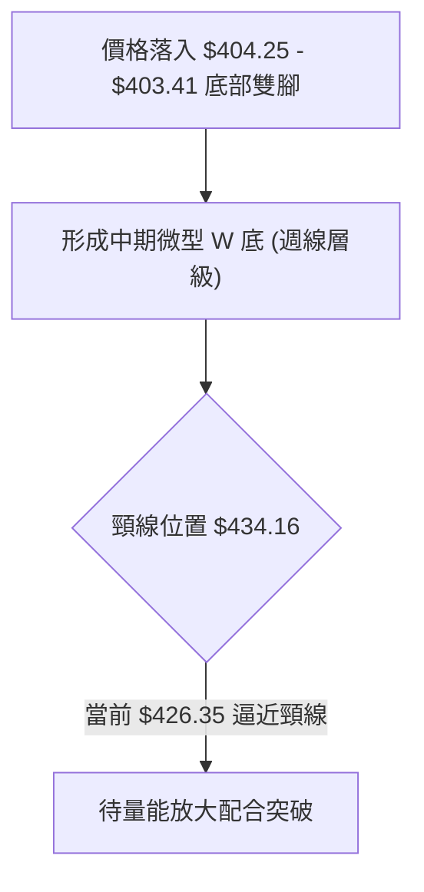
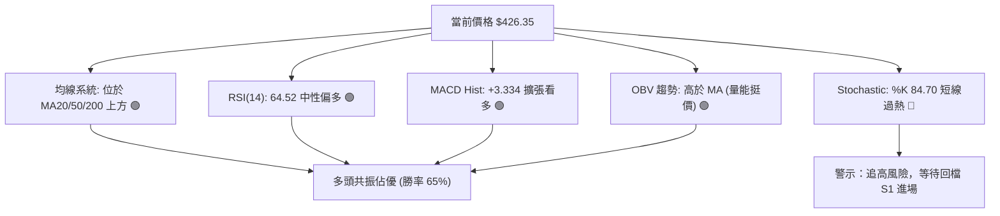
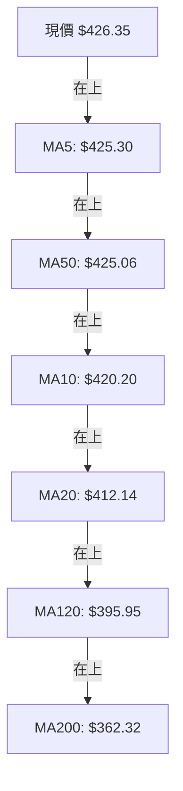
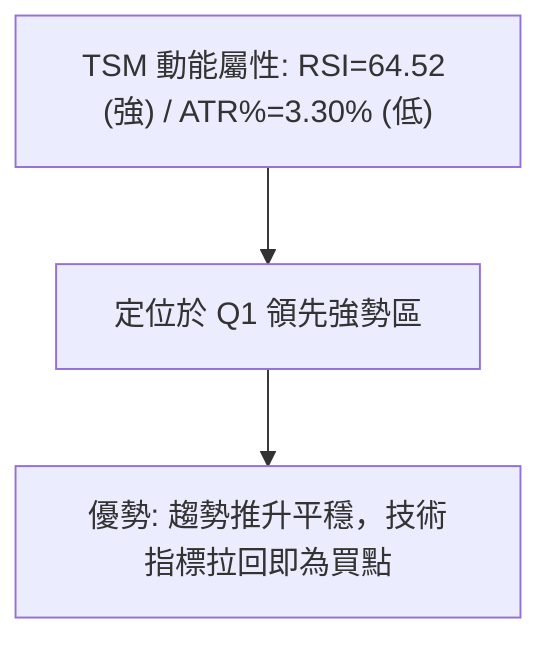
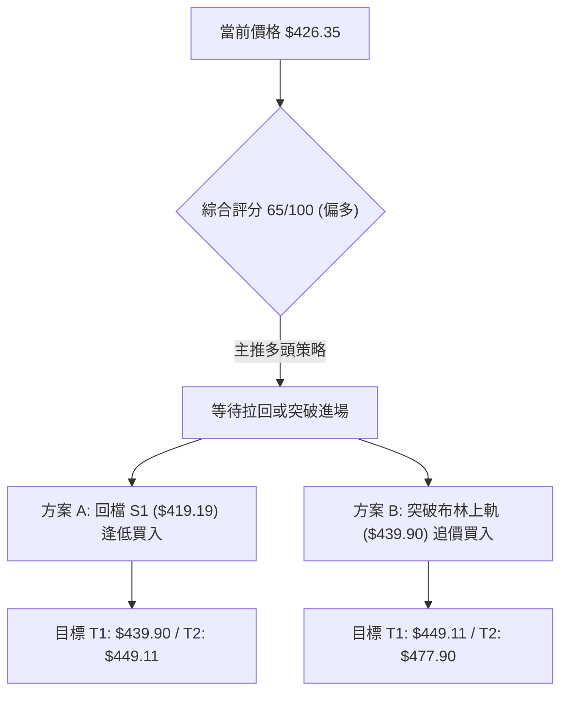
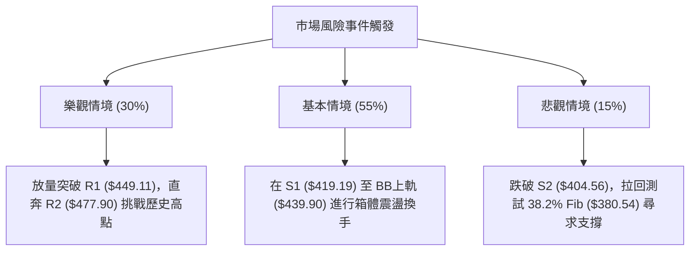

# TSM 技術分析報告

> **報告日期**：2026-08-14 ｜ **語言**：繁體中文 ｜ **數據來源**：Yahoo Finance ｜ **當前價格**：$426.35

---

## 目錄

| 章節 | 內容 |
|------|------|
| [1. 技術面概覽](#1-技術面概覽) | 訊號儀表板、核心指標、評分卡 |
| [2. 趨勢分析](#2-趨勢分析) | 多時框趨勢、長中短期走勢、ADX強度 |
| [3. 圖表形態分析](#3-圖表形態分析) | 形態識別、K線組合、信心度評估 |
| [4. 支撐與阻力](#4-支撐與阻力) | 關鍵價位、斐波那契回調層級 |
| [5. 技術指標深度解讀](#5-技術指標深度解讀) | MA/RSI/MACD/布林通道/成交量 |
| [6. 動能與波動率](#6-動能與波動率) | 動能四象限、ATR風險距、Beta矩陣 |
| [7. 多時框架總結](#7-多時框架總結) | 時框架評分矩陣與多時框收斂結論 |
| [8. 交易策略建議](#8-交易策略建議) | 策略路由、價格情境、多空交易計劃 |
| [9. 風險提示與監控](#9-風險提示與監控) | 監控指標Checklist、風險場景模擬 |

---

## 1. 技術面概覽

### 🎯 技術訊號儀表板



### 📊 核心指標速覽表

| 指標類別 | 指標名稱 | 當前數值 | 訊號 | 技術面深度解讀 |
|----------|----------|----------|------|----------------|
| **價格** | 當前收盤價 | $426.35 | 🟢 多頭 | 處於52週區間 79.6% 位置，站穩 MA50 ($425.06) |
| **均線** | MA20 (月線) | $412.14 | 🟢 多頭 | 價格位於 MA20 上方 (+3.45%)，提供短線動態支撐 |
| **均線** | MA50 (季線) | $425.06 | 🟢 多頭 | 價格收復 MA50 上方 (+0.30%)，短中期多空分水嶺收復 |
| **均線** | MA200 (年線) | $362.32 | 🟢 多頭 | 價格遠高於 MA200 (+17.67%)，長多基調極為穩固 |
| **動能** | RSI (14) | 64.52 | 🟢 看多 | 位於 50-70 多頭強勢區間，未進入 >70 嚴重的超買區 |
| **動能** | MACD (12,26,9) | +3.334 | 🟢 看多 | MACD線(1.427)上穿訊號線(-1.907)，柱狀體擴張發散 |
| **動能** | Stochastic | %K 84.70 | 🔴 空頭 | %K與%D皆在80以上，短線進入超買區，慎防技術性拉回 |
| **趨勢** | ADX (14) | 12.38 | 🟡 中性 | ADX < 25 顯示單邊趨勢暫停，當前處於橫盤震盪結構 |
| **波動** | ATR (14) | $14.06 | 🟡 中性 | 每日波幅占比 3.30%，波動度中等，提供止損參考依據 |
| **通道** | 布林通道 %B | 0.76 | 🟢 看多 | 價格運行於中軌 ($412.14) 與上軌 ($439.90) 之間 |
| **量能** | 量比 (20D) | 0.49x | 🟡 中性 | 日成交量 6.29M 顯著低於 20日均量 12.74M，屬於無量上攻 |

### 🏆 技術評分卡

```
╔══════════════════════════════════════════════════════════════════╗
║                   TSM 技術綜合評分卡 (2026-08-14)                ║
╠══════════════════════════════════════════════════════════════════╣
║  趨勢強度 (ADX)     ▓▓▓▓▓▓░░░░░░░░░░░░░░  30/100  🟡 弱趨勢/區間 ║
║  動能指標 (MACD/RSI)▓▓▓▓▓▓▓▓▓▓▓▓▓▓▓░░░░░  75/100  🟢 多頭強勁    ║
║  支撐穩定度 (Fib/S1)▓▓▓▓▓▓▓▓▓▓▓▓▓▓▓▓░░░░  80/100  🟢 堅固守穩    ║
║  成交量配合 (OBV)   ▓▓▓▓▓▓▓▓▓▓░░░░░░░░░░  50/100  🟡 量能遞減    ║
║  形態完整度 (W底/箱)▓▓▓▓▓▓▓▓▓▓▓▓▓░░░░░░░  65/100  🟢 區間復甦    ║
║  均線排列 (MA System)▓▓▓▓▓▓▓▓▓▓▓▓▓▓░░░░░░  70/100  🟢 混合偏多    ║
╠══════════════════════════════════════════════════════════════════╣
║  綜合評分           ▓▓▓▓▓▓▓▓▓▓▓▓▓░░░░░░░  65/100  🟢 偏多震盪    ║
╚══════════════════════════════════════════════════════════════════╝
```

---

## 2. 趨勢分析

### 🌐 多時框趨勢分析



### 📈 長期趨勢 — 24 個月走勢圖 (ASCII)

下方為根據過去 24 個月實際歷史收盤價繪製之月線價格軌跡與關鍵轉折點：

```
TSM 月線走勢圖 (2024-08 至 2026-08)
價格軸 ($)
$480 ┤                                           ● 2026-06 ($477.57 歷史高點聚類)
$450 ┤                                          ╱ ╲
$420 ┤                                         ╱   ● 2026-08 ($426.35 現價)
$390 ┤                                  ●     ╱   ╱
$360 ┤                          ●      ╱ ╲   ╱   ● 2026-07 ($404.25 低點)
$330 ┤                         ╱ ╲    ╱   ╲ ╱
$300 ┤              ●   ●     ╱   ╲  ╱
$270 ┤             ╱ ╲ ╱ ╲   ╱     ● 2026-03 ($337.16)
$240 ┤        ●   ╱   ●   ● 2025-08 ($228.34)
$210 ┤    ●  ╱ ╲ ╱
$180 ┤●  ╱ ╲╱   ● 2025-03 ($163.59 近兩年低點)
$150 ┴──┬──┬──┬──┬──┬──┬──┬──┬──┬──┬──┬──┬──┬──┬──┬──┬──┬──┬──┬──┬──┬──┬──┬──
       24/08  24/11  25/02  25/05  25/08  25/11  26/02  26/05  26/08
```

#### 走勢特徵分析表格

| 階段 | 時間區間 | 收盤價變化 | 漲跌幅 | 走勢結構與技術特徵分析 |
|------|----------|------------|--------|------------------------|
| **奠基期** | 2024-08 ~ 2025-01 | $167.40 → $205.48 | +22.75% | 多頭底部放量突破，建立 $200 元支撐底盤 |
| **深度回測** | 2025-01 ~ 2025-03 | $205.48 → $163.59 | -20.39% | 波段拉回測試兩年低點，形成長期堅固支撐底層 |
| **主升段起漲** | 2025-03 ~ 2026-02 | $163.59 → $372.65 | +127.80% | 超強單邊主升浪，均線呈完美多頭發散 |
| **高位劇震** | 2026-02 ~ 2026-06 | $372.65 → $477.57 | +28.15% | 震盪衝高至 $477.57，逼近 52週高點 $479.00 |
| **中級修正** | 2026-06 ~ 2026-07 | $477.57 → $404.25 | -15.35% | 高位快速修正，回測 23.6% 斐波那契回調位 ($418.17) |
| **區間復甦** | 2026-07 ~ 2026-08 | $404.25 → $426.35 | +5.47% | 企穩於 S2 ($404.56) 築底反彈，重新收復 MA50 |

### 📊 中期趨勢（週線分析）

自 2026 年 4 月至 8 月的 20 週數據顯示：
*   **高點聚類**：2026 年 6 月下旬摸高至 $462.12 週收盤價（盤中最高觸及 52週高點 $479.00）。
*   **修正低點**：2026 年 7 月底打至 $398.37 週收盤價（對應 S2 支撐位 $404.56 附近）。
*   **動能轉折**：週 MACD 柱狀體在 2026 年 7 月中旬滑落至 -5.832 谷底後，近兩週連續回升至 -2.144、+2.429，並於本週升至 +3.334，週線動能正式完成黃金交叉翻紅。

### ⚡ 趨勢強度評估 (ADX 解讀)



#### ADX 趨勢強度對照表

| 指標項 | 當前數值 | 臨界值 | 趨勢判定 | 交易含義 |
|--------|----------|--------|----------|----------|
| **ADX (14)** | **12.38** | 25.00 | 🟡 無趨勢/盤整 | 不宜盲目追突破，適合做區間擺盪或低吸 |
| **+DI** | **25.28** | 20.00 | 🟢 多頭控制 | 買方主導日線動能 |
| **-DI** | **21.24** | 20.00 | 🟡 空頭受控 | 賣壓並未失控，回檔屬於無量洗盤 |

---

## 3. 圖表形態分析

### 🔍 形態識別系統

根據近一年與最近 20 週之價格走勢，當前走勢呈現**區間箱體築底反彈**與**W底構型**。



#### 形態信心度與目標價評估（嚴格依據數據）

| 形態名稱 | 信心度 (%) | 判斷依據（引用數據） | 完成度 | 目標價推算公式與精確數值 |
|----------|------------|----------------------|--------|--------------------------|
| **週線微型雙底 (W Bottom)** | **70%** | 2026-07-19 低點 $398.37 與 07-26 低點 $403.41 在 S2 ($404.56) 築雙腳 | 85% | **頸線 $434.16 + (頸線 $434.16 - 底部 $398.37) = $469.95** (介於 R1 $449.11 與 R2 $477.90 之間) |
| **日線布林箱體震盪** | **85%** | ADX=12.38 證實區間走勢，價格於 BB下軌 $384.38 至上軌 $439.90 來回 | 90% | **箱體頂部目標：布林上軌 $439.90 / 阻力 R1 $449.11** |
| **複雜幾何圖形 (如頭肩頂/旗形)** | **30%** | *數據不足以支撐幾何形態* | -- | *訊號不足，僅做指標與均線層級解讀* |

### 🕯️ 重要 K 線形態分析

| 月份/週別 | 收盤價 | K 線形態 | 解讀 | 多空訊號 |
|-----------|--------|----------|------|----------|
| **2026-06-21** | $462.12 | 衝高大陽線 | 強勢逼近 52週高點 $479.00，但高位獲利瞭結賣壓湧現 | 🟢 多頭極致 |
| **2026-07-19** | $398.37 | 長下影陰線 | 快速刺穿 $400 大關，隨後買盤進場，探明 S2 ($404.56) 底部 | 🔴 短線恐慌 |
| **2026-08-09** | $420.04 | 底部中陽線 | 週收盤吞噬前週陰線，MACD 柱狀體黃金交叉 | 🟢 轉強訊號 |
| **2026-08-16** | $426.35 | 溫和連陽線 | 價格站上 MA50 ($425.06)，多頭重新掌舵短線走勢 | 🟢 穩定上攻 |

### 📉 ASCII 走勢形態示意圖（週線雙底反彈）

```
TSM 週線雙底 (W-Bottom) 結構示意圖
價位 ($)
$449.11 ┤------------------------------------------- [阻力 R1]
$434.16 ┤............... 頸線位 (07-05高點) ........
$426.35 ┤............................● (當前現價)
$419.19 ┤---------------------●-----/--------------- [支撐 S1 / 23.6% Fib]
$404.56 ┤--------●-----------/--●------------------- [強支撐 S2]
        │       ╱ ╲         ╱    ╲
$398.37 ┤──────●───╲───────╱──────●───────────────── (第一腳 07-19) (第二腳 07-26)
        └──────┴────┴─────┴───────┴─────────────────
```

---

## 4. 支撐與阻力

### 🗺️ 關鍵價位分布圖 (ASCII)

```
TSM 價位結構與密集區分布圖
═════════════════════════════════════════════════════════════════════
$479.00 ║████████████████████████████████████████ 52週歷史高點 / 0.0% Fib
$477.90 ║████████████████████████████████████████ 強阻力位 R2 (+12.09%)
$449.11 ║████████████████████████████            關鍵阻力位 R1 (+5.34%)
$439.90 ║▓▓▓▓▓▓▓▓▓▓▓▓▓▓▓▓▓▓▓▓▓▓                  布林通道上軌 (+3.18%)
$426.35 ╠════════════════════════════════════════ ◄ 當前最新收盤價
$425.06 ║░░░░░░░░░░░░░░░░░░░░░░░░                MA50 季線支撐 (-0.30%)
$419.19 ║▓▓▓▓▓▓▓▓▓▓▓▓▓▓▓▓▓▓▓▓▓▓                  近一年關鍵支撐 S1 (-1.68%)
$418.17 ║▓▓▓▓▓▓▓▓▓▓▓▓▓▓▓▓▓▓▓▓▓▓                  23.6% 斐波那契回調位
$412.14 ║░░░░░░░░░░░░░░░░░░░░░░░░                MA20 月線 / 布林中軌 (-3.33%)
$404.56 ║████████████████████████████            強支撐位 S2 (-5.11%)
$385.09 ║████████████████████████████████████████ 深度支撐位 S3 (-9.68%)
$380.54 ║▓▓▓▓▓▓▓▓▓▓▓▓▓▓▓▓▓▓▓▓▓▓▓▓▓▓▓▓▓▓          38.2% 斐波那契回調位
═════════════════════════════════════════════════════════════════════
```

### 🚧 阻力位分析表（數據源自 OHLCV 高點聚類）

| 阻力級別 | 精確價位 | 距現價幅 | 形成原因與結構意義 | 突破難度 | 重要性 |
|----------|----------|----------|--------------------|----------|--------|
| **R1** | **$449.11** | +5.34% | 近一年波段高點聚類區，接近前高套牢賣壓帶 | 🟡 中等 | 🟢🟢🟢 |
| **R2** | **$477.90** | +12.09% | 逼近 52週最高價 $479.00，歷史天花板密集成交區 | 🔴 極高 | 🟢🟢🟢🟢🟢 |

### 🛡️ 支撐位分析表（數據源自 OHLCV 低點聚類）

| 支撐級別 | 精確價位 | 距現價幅 | 形成原因與結構意義 | 守住機率 | 重要性 |
|----------|----------|----------|--------------------|----------|--------|
| **S1** | **$419.19** | -1.68% | 近一年波段低點聚類，疊加 23.6% Fib ($418.17) | 🟢 高 (75%) | 🟢🟢🟢🟢 |
| **S2** | **$404.56** | -5.11% | 近一年核心次低點，7月兩次探底築底防線 | 🟢 極高 (85%) | 🟢🟢🟢🟢🟢 |
| **S3** | **$385.09** | -9.68% | 波段低點聚類，靠近布林下軌 ($384.38) 與 38.2% Fib | 🟢 極高 (90%) | 🟢🟢🟢 |

### 📐 斐波那契回調位分析（基於 52週區間 $221.25 → $479.00）

```
  0.0%  (52週最高價) ────────────────────────── $479.00
                                                    ▲ (高點)
  23.6% 斐波那契位   ────────────────────────── $418.17 ◄ 現價 $426.35 運行於此上方
  38.2% 斐波那契位   ────────────────────────── $380.54
  50.0% 斐波那契位   ────────────────────────── $350.13
  61.8% 斐波那契位   ────────────────────────── $319.71
  78.6% 斐波那契位   ────────────────────────── $276.41
 100.0% (52週最低價) ────────────────────────── $221.25
```

*   **落點解讀**：現價 **$426.35** 目前精確運行於 **0.0% ($479.00)** 與 **23.6% ($418.17)** 回調位之間。
*   **技術含義**：在經歷了從 $221.25 至 $479.00 的強勁上攻後，股價回調並未跌破 23.6% ($418.17) 的極強回態位（僅盤中下刺至 S2 $404.56 隨即收復），顯示極度典型的**超強勢多頭修正**特徵。只要價格穩守在 23.6% ($418.17) 上方，長線上升趨勢完全未受破壞。

---

## 5. 技術指標深度解讀

### 🎛️ 指標訊號總覽



### 📈 移動平均線排列分析



#### 均線狀態矩陣

| 均線天數 | 精確均價 | 價格相對位置 | 幅度 (%) | 均線扣抵與走向 | 多空評估 |
|----------|----------|--------------|----------|----------------|----------|
| **MA 5** | $425.30 | 價格上方 | +0.25% | 扣抵低價區，短線微幅上彎 | 🟢 短多 |
| **MA 10** | $420.20 | 價格上方 | +1.46% | 扣抵低價區，短線向上穿越 | 🟢 短多 |
| **MA 20** | $412.14 | 價格上方 | +3.45% | 上彎助攻，提供月線強支撐 | 🟢 強多 |
| **MA 50** | $425.06 | 價格上方 | +0.30% | 橫向走平後收復，季線轉強 | 🟢 轉多 |
| **MA 120**| $395.95 | 價格上方 | +7.68% | 穩定上彎，半年線堅固 | 🟢 強多 |
| **MA 200**| $362.32 | 價格上方 | +17.67% | 陡峭上彎，牛市生命線 | 🟢 極多 |

### 📉 RSI(14) 動能指標分析

*   **當前數值**：**64.52**
*   **強度進度條**：`█████████████░░░░░░░` (64.52 / 100)
*   **區間定位**：處於 50–70 的**多頭掌控區**。
*   **背離檢測**：近 20 天價格從 $403.41 反彈至 $426.35，RSI 自 27.9 同步回升至 64.52，**無頂背離或底背離**，動能與價格同向推進，訊號真實健康。

### 📊 MACD (12, 26, 9) 深度訊號

*   **MACD 快線**：+1.427
*   **Signal 慢線**：-1.907
*   **MACD 柱狀體 (Histogram)**：**+3.334** 🟢
*   **解讀**：MACD 快線已明確上穿越慢線發出**零軸附近的黃金交叉買入訊號**。柱狀體數值達 +3.334 且呈發散狀態，顯示多頭加速動能正在釋放。

### 📦 布林通道 (Bollinger Bands) 分析

```
TSM 布林通道現狀示意圖 ($)
$439.90 ┤---------------------------------- Upper Band (上軌)
        │                         ● $426.35 (現價 %B = 0.76)
$412.14 ┤---------------------------------- Middle Band (中軌 / MA20)
        │
$384.38 ┤---------------------------------- Lower Band (下軌)
```

*   **通道參數**：上軌 $439.90 / 中軌 $412.14 / 下軌 $384.38
*   **%B 指標**：**0.76**（代表價格位於整體通道寬度的 76% 高位）
*   **通道型態**：帶寬呈現收斂後擴張初期，價格順利突破中軌 $412.14 並向上軌 $439.90 推進。

### 💹 成交量與 OBV 分析

*   **當前量能**：6,289,097 股（約 6.29M）。
*   **均量比較**：20日均量 12.74M（量比 0.49x）；50日均量 14.19M。
*   **OBV 狀態**：**OBV > MA**（能量潮高於其移動平均線）。
*   **量價關係評估**：當前股價反彈但成交量僅為均量一半，顯示此波段為**籌碼穩定下的輕盈反彈（籌碼鎖死）**。OBV 趨勢向上確認了中長線資金未見撤退，但若要成功攻克阻力位 R1 ($449.11)，日成交量必須放量至 1,200 萬股以上。

---

## 6. 動能與波動率

### ⚡ 動能評估四象限

根據「動能強度」與「波動率」兩維度對 TSM 進行定位：

| 象限分區 | 動能 (Momentum) | 波動率 (Volatility) | 當前狀態標註 | 交易策略與含義 |
|----------|-----------------|---------------------|--------------|----------------|
| **Q1: 領先強勢區** | 強 (RSI > 60) | 低 (ATR% < 3.5%) | **✓ 當前定位 (TSM)** | **最佳買入持有區**：穩健上攻、甩尾洗盤少 |
| **Q2: 爆發突破區** | 強 (RSI > 60) | 高 (ATR% > 4.0%) | -- | **急漲追驟區**：爆發力強但需寬幅止損 |
| **Q3: 築底震盪區** | 弱 (RSI < 40) | 低 (ATR% < 3.5%) | -- | **沉悶觀望區**：資金效率低 |
| **Q4: 恐慌下殺區** | 弱 (RSI < 40) | 高 (ATR% > 4.0%) | -- | **嚴格避險區**：左側抄底風險極高 |



### 📊 ATR 波動率與止損風控距離

*   **ATR (14)**：**$14.06** (占當前股價 3.30%)
*   **波動度判定**：中等偏低波動（健全趨勢發展區間）
*   **風控距離建議**：
    *   **短線交易止損距離 (1.5x ATR)**：$14.06 × 1.5 = **$21.09**
    *   **波段交易止損距離 (2.0x ATR)**：$14.06 × 2.0 = **$28.12**

### 📐 Beta 與市場相關性

*   **Beta 係數**：**1.258**
*   **市場解讀**：TSM 波動性較大盤 (S&P 500) 高出約 25.8%。當半導體板塊或大盤反彈時，TSM 具備良好的槓桿彈性，屬於高 Beta 攻守兼備之標的。

---

## 7. 多時框架總結

### 📋 時框架評分矩陣

| 時框架 | 趨勢方向 | 動能狀態 | 均線排列 | 圖表形態 | 綜合評分 | 戰術建議 |
|--------|----------|----------|----------|----------|----------|----------|
| **月線 (Monthly)** | 🟢 多頭 | 🟢 強勁 | 🟢 多頭發散 | 箱體上攻 | **85/100** | 長線堅決持有 |
| **週線 (Weekly)** | 🟢 轉多 | 🟢 黃金交叉 | 🟢 守穩季線 | 雙底復甦 | **75/100** | 中線逢低加碼 |
| **日線 (Daily)** | 🟡 震盪偏多 | 🟡 超買整理 | 🟡 混合整理 | 布林上軌突破中 | **65/100** | 短線不追高，拉回買 |

### 🔲 綜合訊號矩陣

```
╔══════════════════════════════════════════════════════════════════╗
║                   多時框訊號收斂與一致性分析                     ║
╠══════════════════════════════════════════════════════════════════╣
║ 長線 (月線) ──────────────────────────► 🟢 絕對多頭 ($362 以上) ║
║ 中線 (週線) ──────────────────────────► 🟢 W底完成 ($404 築底)  ║
║ 短線 (日線) ──────────────────────────► 🟡 震盪上攻 ($426 近上軌)║
╚══════════════════════════════════════════════════════════════════╝
```

### ⚖️ 多時框收斂結論（依據規則 14 判定）

1.  **行情屬性判定**：日線 **ADX (14) = 12.38 (< 25)**，明確定義當前整體為**盤整/區間震盪行情**。
2.  **主導結構與取捨**：雖然日線 ADX 顯示單邊趨勢較弱，但中長線（週線與月線）價格遠高於 MA200 ($362.32) 且穩守 23.6% 斐波那契位 ($418.17)。
3.  **最終收斂方向**：**偏多區間震盪（以低吸買進為主，上軌阻力落袋）**。日線布林通道上下軌 ($384.38 - $439.90) 為短線主要運行空間，操作上應遵從「長多保護短多」原則，於 S1 ($419.19) / 23.6% Fib ($418.17) 附近佈局多單，首要目標看至布林上軌 ($439.90) 及阻力 R1 ($449.11)。

---

## 8. 交易策略建議

### 🗺️ 策略決策流程圖



### 🧭 策略路由

*   **當前主策略方向**：**🟢 主推多頭策略（區間低吸與突破延續）**
*   **路由依據**：綜合評分為 **65/100**（符合 ≥60 門檻），價格收復 MA50 ($425.06) 且 MACD 發散翻紅。空頭僅做為反轉風險對沖與風控提示。

### 🎯 價格情境階梯 (Price Scenarios)

| 觸發條件 | 第一目標價 | 第二目標價 | 情境含義與技術面對應 |
|----------|------------|------------|----------------------|
| **突破布林上軌 $439.90** | **R1: $449.11** | **R2: $477.90** | 區間突破，開啟衝擊 52週高點 $479 行情 |
| **企穩現價區間 ($420-$426)** | **BB上軌: $439.90** | **R1: $449.11** | 消化過熱 KD 指標後，順勢溫和上攻 |
| **跌破 S1 $419.19** | **S2: $404.56** | **S3: $385.09** | 短線轉弱，回測週線 W 底二次腳堅固防線 |

### 📊 情境機率分佈

| 情境劇本 | 估算機率 | 主要技術依據 |
|----------|----------|--------------|
| **劇本 1：溫和上攻 / 衝擊 R1** | **55%** | MACD 柱狀體翻紅 (+3.334)、OBV 趨勢看多、站穩 MA50 |
| **劇本 2：高位橫盤震盪** | **35%** | ADX = 12.38 弱趨勢、日成交量比僅 0.49x、Stochastic 過熱 |
| **劇本 3：回落重測 S2 防線** | **10%** | 市場整體出現黑天鵝拉回，刺穿 S1 ($419.19) 支撐 |

### 🟢 主策略詳情

根據數據庫精確價位制定以下兩套執行方案：

| 策略要素 | 策略 A：低吸拉回買進 (主推薦) | 策略 B：突破發散追價 (次推薦) |
|----------|--------------------------------|--------------------------------|
| **策略邏輯** | 於 23.6% Fib 與 S1 支撐重疊區掛單低吸 | 待強勢量能突破布林上軌後順勢跟進 |
| **進場條件** | 股價回檔至 S1 附近出現止跌紅K | 日收盤價實體突破 $439.90 且量比 > 1.2x |
| **精確進場價** | **$419.19** (S1 支撐位) | **$440.00** (突破布林上軌 $439.90) |
| **目標價 T1** | **$439.90** (布林上軌 / 潛在獲利 +4.94%) | **$449.11** (阻力 R1 / 潛在獲利 +2.07%) |
| **目標價 T2** | **$449.11** (阻力 R1 / 潛在獲利 +7.14%) | **$477.90** (阻力 R2 / 潛在獲利 +8.61%) |
| **精確止損價** | **$404.56** (S2 強支撐位 / 風險 -3.49%) | **$425.06** (MA50 季線位 / 風險 -3.40%) |
| **風險報酬比** | **2.05 : 1** (以 T2 計算) | **2.53 : 1** (以 T2 計算) |
| **估計成功率** | **68%** | **60%** |
| **建議倉位** | **15% - 20%** 總資金 | **10% - 15%** 總資金 |

### 🔴 反向風險觸發點（對沖與風控提示）

*   **多頭停損 / 策略失效觸發價**：**跌破 S2 $404.56**。
*   **技術含義**：若日收盤價跌破 $404.56，意味著週線雙底形態宣告失敗，價格將回測 S3 ($385.09) 及 38.2% Fib ($380.54)。多頭必須立即停損離場或進行 Put Option 對沖。

### ⭐ 整體訊號強度評星

```
做多訊號強度：★★★★☆  (4/5 星) — 均線與 MACD 共振看多
做空訊號強度：★☆☆☆☆  (1/5 星) — 長中期結構極度堅固
整體可信度：  ★★★★☆  (4/5 星) — 多時框價位完全收斂
```

---

## 9. 風險提示與監控

### ✅ 關鍵監控指標 Checklist

```
╔══════════════════════════════════════════════════════════════════╗
║                    TSM 技術面每日監控 Checklist                  ║
╠══════════════════════════════════════════════════════════════════╣
║ [ ] 價位防線：每日收盤價是否持續企穩於 MA50 ($425.06) 上方       ║
║ [ ] 關鍵支撐：是否有效守住 S1 ($419.19) 與 23.6% Fib ($418.17)   ║
║ [ ] 量能指標：上攻時日成交量能否放大至 12,000,000 股以上         ║
║ [ ] 動能過熱：Stochastic (%K 84.70) 是否出現高位死叉             ║
║ [ ] 阻力挑戰：價格逼近布林上軌 ($439.90) 與 R1 ($449.11) 的反應  ║
╚══════════════════════════════════════════════════════════════════╝
```

### ⚠️ 風險場景分析



### 🛡️ 風險管理重要提醒

1.  **無量上攻之隱患**：目前股價雖順利反彈至 $426.35，但成交量比僅 0.49x，屬於標準的「縮量反彈」。在缺乏大資金連續遞增買盤前，切忌於 $430.00 以上盲目追高。
2.  **擺盪指標過熱修正**：Stochastic 已經進入 >80 的超買區間（%K 84.70），短線上隨時有降溫需求，較佳的進場時機為等待指標拉回至 50 附近且價格測試 S1 ($419.19) 時。
3.  **嚴格倉位控管**：個股單一持倉不宜超過總投資組合之 20%，止損必須嚴格設定於 S2 ($404.56) 下方。

---

## 📋 報告總結

```
╔══════════════════════════════════════════════════════════════════╗
║                     TSM 技術深度分析報告總結                     ║
════════════════════════════════════════════════════════════════════
 報告日期：2026-08-14
 當前價格：$426.35
 分析評級：🟢 偏多區間震盪 (看多，建議逢低佈局)

 關鍵價位速查：
 ├─ 分析師平均目標價：$547.09 (潛在空間 +28.32%)
 ├─ 關鍵阻力位 R2：   $477.90
 ├─ 關鍵阻力位 R1：   $449.11
 ├─ 當前價格：         $426.35 (已收復 MA50 $425.06)
 ├─ 關鍵支撐位 S1：   $419.19 (疊加 23.6% Fib $418.17)
 └─ 強卡防線位 S2：   $404.56

 最優交易戰術策略：
 1. 🥇 最佳機會 (策略 A)：回檔至 S1 ($419.19) 建立多頭倉位，
    止損設於 S2 ($404.56)，目標看至 R1 ($449.11)，風報比 2.05 : 1。
 2. 🥈 次選機會 (策略 B)：若強勢帶量突破布林上軌 ($439.90)，
    追價買進，目標看至 R2 ($477.90)。
╚══════════════════════════════════════════════════════════════════╝
```

---

> ⚠️ **免責聲明**：本報告為依據提供之市場歷史數據進行之純技術面量化分析。所有價位、圖表與指標解讀僅供研究參考，不構成任何買賣建議或投資邀約。金融市場具高度風險，投資人應獨立評估並自負盈虧。