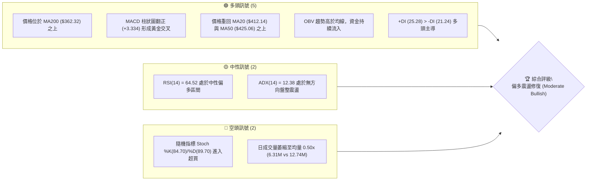
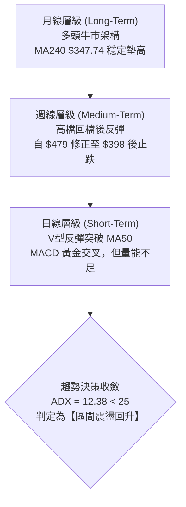
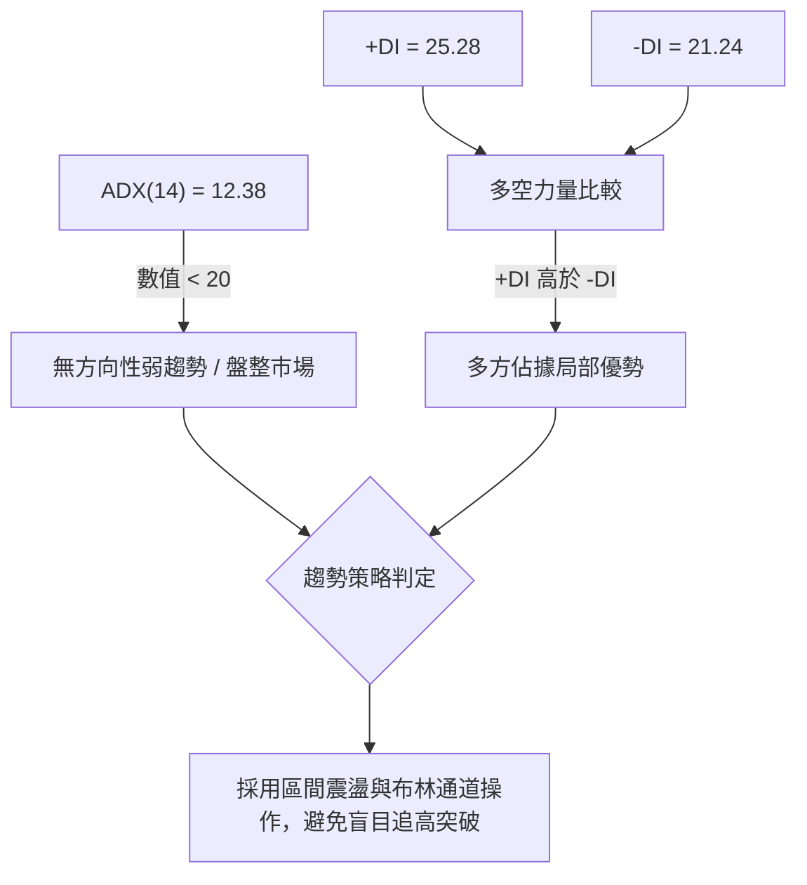
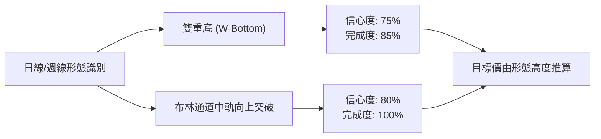
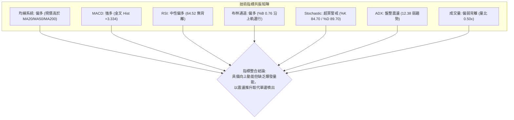
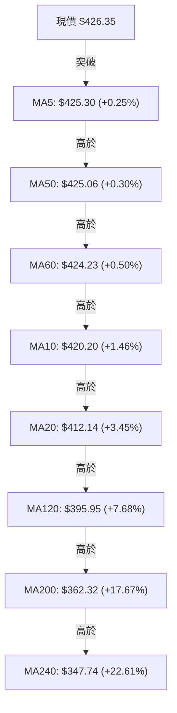
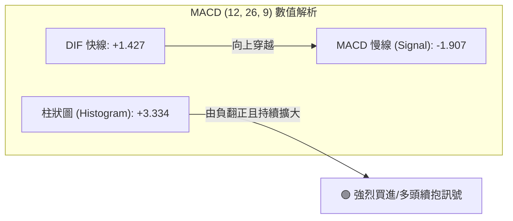
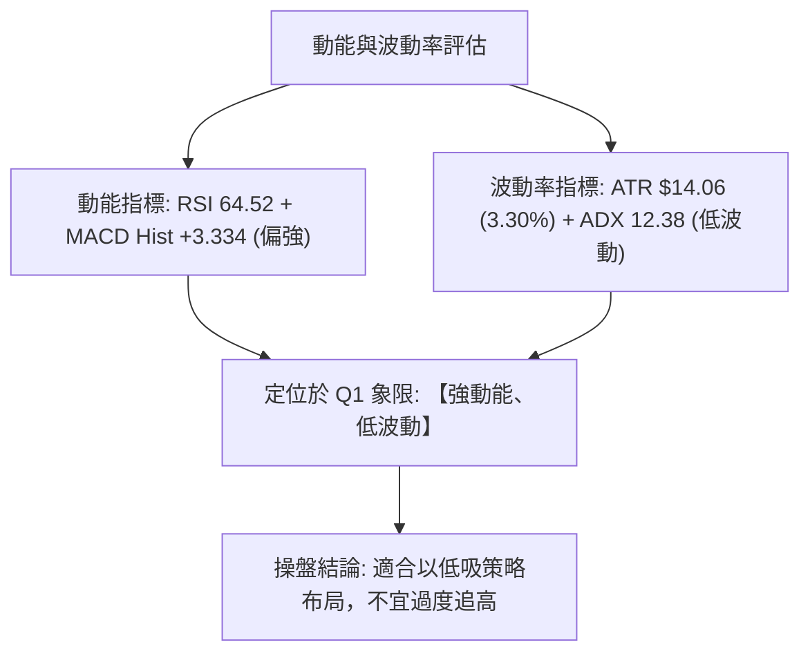
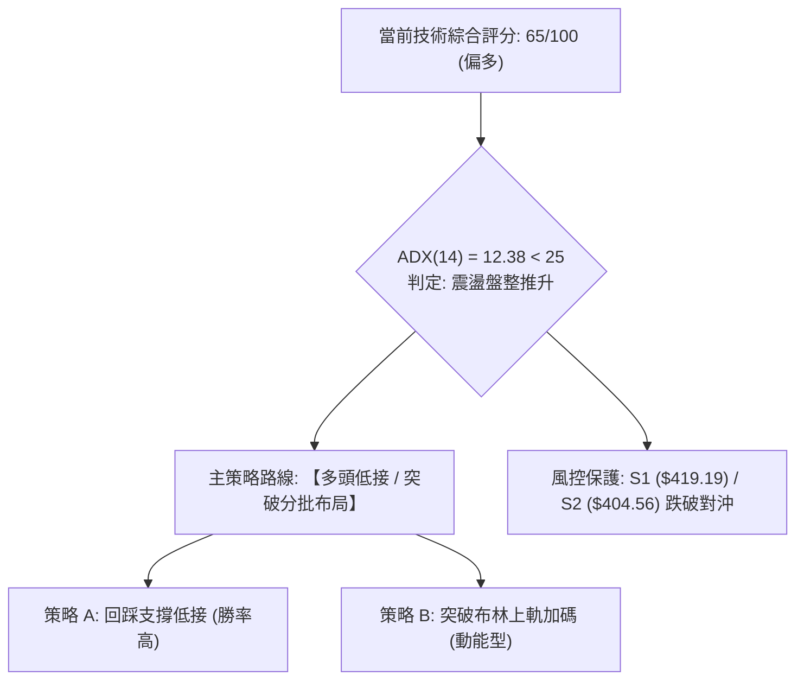
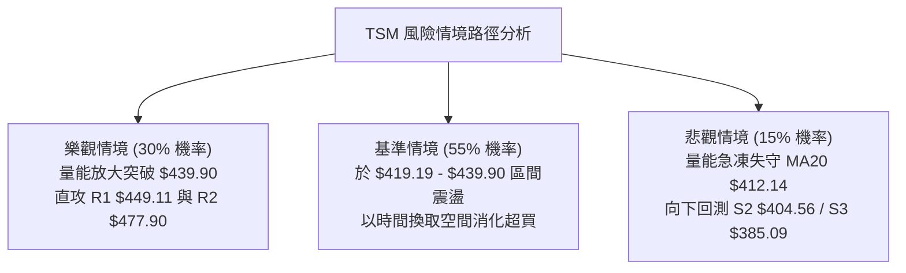

# TSM 技術分析報告

> **報告日期**：2026-08-15 ｜ **語言**：繁體中文 ｜ **數據來源**：Yahoo Finance ｜ **當前價格**：$426.35

---

## 目錄

| 章節 | 內容 |
|------|------|
| [1. 技術面概覽](#1-技術面概覽) | 訊號儀表板、核心指標、評分卡 |
| [2. 趨勢分析](#2-趨勢分析) | 多時框趨勢、長中短期走勢 |
| [3. 圖表形態分析](#3-圖表形態分析) | 形態識別、K線組合、目標價 |
| [4. 支撐與阻力](#4-支撐與阻力) | 關鍵價位、斐波那契回調 |
| [5. 技術指標深度解讀](#5-技術指標深度解讀) | MA/RSI/MACD/布林/成交量 |
| [6. 動能與波動率](#6-動能與波動率) | 動能評估、ATR、Beta |
| [7. 多時框架總結](#7-多時框架總結) | 時框架評分矩陣 |
| [8. 交易策略建議](#8-交易策略建議) | 多空策略、風險報酬比 |
| [9. 風險提示與監控](#9-風險提示與監控) | 監控指標、風險場景 |

---

## 1. 技術面概覽

### 🎯 技術訊號儀表板



### 📊 核心指標速覽表

| 指標類別 | 指標名稱 | 當前數值 | 訊號 | 解讀 |
|:---|:---|:---|:---:|:---|
| **價格** | 當前收盤價 | $426.35 | 🟢 | 位於52週區間 79.6% 之強勢位階，成功站上多數均線 |
| **均線** | 短期 MA20 | $412.14 | 🟢 | 現價高於 MA20 達 +3.45%，短期底部確立並提供支撐 |
| **均線** | 中期 MA50 | $425.06 | 🟢 | 現價微幅突破 MA50 (+0.30%)，短線扭轉中期回檔走勢 |
| **均線** | 長期 MA200 | $362.32 | 🟢 | 現價大幅高於 MA200 達 +17.67%，長期多頭格局完好 |
| **動能** | RSI(14) | 64.52 | 🟡 | 位於 50-70 強勢中性區間，無頂背離，具備上行動能 |
| **動能** | MACD (12,26,9) | 1.427 (Hist: +3.334) | 🟢 | 快線由負翻正穿越慢線 (-1.907)，多頭動能加速釋放 |
| **震盪** | Stochastic %K/%D | 84.70 / 89.70 | 🔴 | 進入 >80 極度超買區間，短線面臨技術性拉回修正壓力 |
| **趨勢強度** | ADX (14) | 12.38 | 🟡 | 數值遠低於 25，顯示當前為「無強烈趨勢的區間修復行情」 |
| **通道** | 布林通道 %B | 0.76 (中軌 $412.14) | 🟢 | 價格運行於中軌與上軌 ($439.90) 之間，強勢通道運行 |
| **量能** | 當日量 vs 20日均量 | 6.31M / 12.74M (0.50x) | 🔴 | 量能腰斬，上漲呈現「量縮價揚」的動能不足現象 |
| **波動** | ATR(14) | $14.06 (3.30%) | 🟡 | 每日平均波動幅度約 14 美元，波動度適中 |

### 🏆 技術評分卡

```
╔══════════════════════════════════════════════════════════════════╗
║                   TSM 技術評分卡 (2026-08-15)                    ║
╠══════════════════════════════════════════════════════════════════╣
║ 趨勢強度 (Trend)       ███████░░░░░░░░░░░░░  35/100  🟡 (ADX低)  ║
║ 動能指標 (Momentum)    ██████████████░░░░░░  70/100  🟢 (MACD強) ║
║ 支撐穩定度 (Support)   ████████████████░░░░  80/100  🟢 (S1堅固) ║
║ 成交量配合 (Volume)    ████████░░░░░░░░░░░░  40/100  🔴 (量縮)   ║
║ 形態完整度 (Pattern)   ██████████████░░░░░░  70/100  🟢 (雙底型) ║
║ 均線排列 (MA System)   ██████████████░░░░░░  70/100  🟢 (多重交叉)║
╠══════════════════════════════════════════════════════════════════╣
║ 綜合技術評分           █████████████░░░░░░░  65/100  🟢 偏多震盪 ║
╚══════════════════════════════════════════════════════════════════╝
```

---

## 2. 趨勢分析

### 🌐 多時框趨勢分析



### 📈 長期趨勢 — 12個月走勢圖（Unicode）

```
TSM 月線收盤走勢圖（2025-08 至 2026-08）
價格 ($)
$480 ┤                                           ● 2026-06 ($477.57)
$460 ┤                                          ╱ ╲
$440 ┤                                         ╱   ╲
$420 ┤                             ● 2026-05 ($417.47)  ● 2026-08 ($426.35 現價)
$400 ┤                   ● 2026-04($395.13)    ╱     ╲ ╱
$380 ┤             ● 2026-02 ($372.65)        ╱       ● 2026-07 ($404.25)
$360 ┤            ╱ ╲                        ╱
$340 ┤           ╱   ● 2026-03 ($337.16)────┘
$320 ┤     ● 2026-01 ($328.86)
$300 ┤   ●─● 2025-10/12 ($298.08 / $302.33)
$280 ┤ ● 2025-09 ($277.11)
$260 ┤
$240 ┤
$220 ┤● 2025-08 ($228.34)
     └─────────────────────────────────────────────────────────────
       08  09  10  11  12  01  02  03  04  05  06  07  08 (月份)
```

#### 長期走勢特徵分析

| 階段區間 | 起訖價位 | 漲跌幅 | 趨勢特徵與結構解讀 |
|:---|:---|:---:|:---|
| **主升段初期** (2025/08 - 2025/12) | $228.34 → $302.33 | +32.40% | 脫離 $220-$240 底部箱體，放量突破 $300 大關 |
| **主升段加速** (2026/01 - 2026/06) | $328.86 → $477.57 | +45.22% | 沿著月均線強勢推升，創下歷史高點 $479.00 |
| **中期回檔期** (2026/06 - 2026/07) | $477.57 → $404.25 | -15.35% | 高檔獲利了結，週線連續下殺尋找季線與 Fib 23.6% 支撐 |
| **築底反彈期** (2026/07 - 2026/08) | $404.25 → $426.35 | +5.47% | 於 $398-$404 區間完成雙重回測，重啟反彈結構 |

### 📊 中期趨勢（週線分析）

中期走勢顯示，TSM 在 2026 年 6 月下旬見頂於 $479.00 後展開修正，於 2026-07-19 當週觸及最低點 $398.37。隨後在 $403-$404 區間獲得強大支撐，近兩週連續收紅（$420.04 → $426.35），MACD 週線柱狀圖由 -5.832 快速收斂至 +3.334，顯示中期回檔修正已告一段落。

```
TSM 週線結構與關鍵關卡示意圖
 $479.00 ──────────────────────────────────────── 52W High / R2
            ╲
             ╲  下跌三波段修正
              ╲
 $449.11 ──────╲───────────────────────────────── R1 關鍵壓力
                ╲       ╱ 反彈走勢
                 ╲  ▲  ╱
 $426.35 ─────────╲─┼─╱───────────────────────── 【現價 $426.35】
                   ╲│╱
 $404.56 ───────────●──────────────────────────── S2 (2026-07 探底低點聚類)
 $398.37 ───────────┴──────────────────────────── 週線波段極端低點
```

### ⚡ 趨勢強度評估（ADX 解讀）



#### ADX 趨勢強度對照表

| ADX 數值區間 | 行情屬性 | 當前數值 | 交易指引與執行策略 |
|:---:|:---:|:---:|:---|
| 0 - 20 | 無趨勢 / 弱盤整 | **12.38** 🟢 | **當前狀態**：趨勢動能匱乏，以區間低買高賣為主，切忌追高 |
| 20 - 25 | 潛在趨勢醞釀 | — | 密切觀察均線收斂突破狀況 |
| 25 - 50 | 強烈趨勢行情 | — | 順勢交易，積極沿均線加碼 |
| 50 - 100 | 極度過熱趨勢 | — | 尋找反轉或保護性平倉點 |

---

## 3. 圖表形態分析

### 🔍 形態識別系統



#### 形態識別與信心度評估表

| 形態名稱 | 信心度 | 判斷依據（引用數據） | 完成度 | 目標價（附嚴謹計算式） |
|:---|:---:|:---|:---:|:---|
| **小型雙底 (W底)** | 75% | 第一次回測 2026-07-19 收盤 $398.37，第二次回測 2026-07-26 收盤 $403.41 及 2026-08-02 收盤 $404.25（符合 S2 支撐聚類 $404.56） | 85% | 頸線 $423.93（2026-06-14 週收盤）+ 形態高度 ($423.93 - $398.37 = $25.56) = **由雙底形態推算目標價 $449.49**（與阻力位 R1 $449.11 高度共振） |
| **均線黃金交叉修復** | 80% | 價格連續收復 MA20 ($412.14) 與 MA50 ($425.06)，MA5 ($425.30) 向上穿越 MA10 ($420.20) 與 MA20 | 100% | 先看布林上軌 **$439.90**，次看波段阻力 **R1 $449.11** |
| **頭肩底形態** | 35% | 數據中左肩與右肩結構不對稱，僅有局部雙底特徵 | 訊號不足 | 數據不足以支撐完整幾何頭肩形態，僅做指標型解讀 |

### 🕯️ 重要K線形態分析

| 交易週期 | 收盤價 | 典型 K 線組合與形態 | 技術意涵與市場心理解讀 | 訊號方向 |
|:---|:---:|:---|:---|:---:|
| **2026-07-19 週** | $398.37 | 長下影長陰線 | 恐慌賣壓湧現但於 $398 附近遭遇強勁長線買盤承接，留下探底針 | 🟡 止跌訊號 |
| **2026-07-26 週** | $403.41 | 低檔十字星/錘頭線 | 賣盤動能衰竭，RSI 觸及 27.9 極度超賣區，多空形成動態平衡 | 🟢 築底確認 |
| **2026-08-02 週** | $404.25 | 實體紅K線打底 | 量能放大至 87.34M 週成交量，主力資金在此區間進場吸籌確認 | 🟢 底部確立 |
| **2026-08-09 週** | $420.04 | 實體中長陽線突破 | 一舉吞噬前兩週整理區間，突破 MA20 與 Fib 23.6% 關鍵分水嶺 | 🟢 強勢反彈 |
| **2026-08-16 週** | $426.35 | 帶上影實體陽線 | 向上挑戰 MA50 ($425.06)，雖有短線解套賣壓但買盤仍佔優勢 | 🟢 多頭延續 |

### 📉 ASCII 走勢形態示意圖

```
TSM 日線/週線級別「雙底突破」形態圖
價格 ($)
$450 ┤                                                [阻力 R1: $449.11]
$440 ┤                                        ╭─────
$430 ┤                                      ╭─╯ ← 現價 $426.35 挑戰 MA50
$420 ┤───────── 頸線關卡: $423.93 ─────────╭──╯
$410 ┤          ╭────────╮               ╭─╯
$400 ┤          │        │               │
$390 ┤          │        ╰───────●───────╯
     └──────────┴────────────────┴──────────────────────────────────
             左底 (07/19)      右底 (08/02)      突破 neckline (08/16)
               $398.37           $404.25
```

### 🎯 形態目標價計算

```
╔══════════════════════════════════════════════════════════════════╗
║                   雙底形態 (W-Bottom) 目標價推算                  ║
╠══════════════════════════════════════════════════════════════════╣
║ 頸線位置 (Neckline)          ：$423.93                           ║
║ 形態最低點 (Pattern Low)     ：$398.37 (2026-07-19 週收盤)       ║
║ 形態垂直垂直高度 (Height)    ：$423.93 - $398.37 = $25.56        ║
║                                                                  ║
║ 第一形態推算目標價 (T1)      ：頸線 $423.93 + $25.56 = $449.49   ║
║ 共振阻力位驗證               ：精確對應阻力位 R1 ($449.11)       ║
║                                                                  ║
║ 52週歷史高點目標價 (T2)      ：阻力位 R2 ($477.90) / 歷史高 $479 ║
╚══════════════════════════════════════════════════════════════════╝
```

---

## 4. 支撐與阻力

### 🗺️ 關鍵價位分布圖（Unicode）

```
TSM 價位結構分布圖 (Price Structure Distribution)
═════════════════════════════════════════════════════════════════════
 $479.00 ║████████████████████████████████████║ 52W High (0.0% Fib)
 $477.90 ║██████████████████████████████████  ║ 強阻力 R2 (+12.09%)
 $449.11 ║████████████████████████            ║ 關鍵阻力 R1 (+5.34%) / 雙底目標
 $439.90 ║▓▓▓▓▓▓▓▓▓▓▓▓▓▓▓▓                    ║ 布林上軌動態阻力
 $426.35 ╠════════════════════════════════════╣ ◄─── 當前價格 ($426.35)
 $425.06 ║────────────────────────────────────║ 中期均線 MA50 支撐
 $419.19 ║████████████████████████            ║ 近期支撐 S1 (-1.68%)
 $418.17 ║▓▓▓▓▓▓▓▓▓▓▓▓▓▓▓▓▓▓▓▓                ║ 斐波那契 23.6% 回調位
 $412.14 ║────────────────────────────────────║ 短期均線 MA20 / 布林中軌
 $404.56 ║████████████████████████████        ║ 強支撐 S2 (-5.11%) / 7月雙底頸底
 $385.09 ║██████████████████████████████████  ║ 深度強支撐 S3 (-9.68%)
 $380.54 ║▓▓▓▓▓▓▓▓▓▓▓▓▓▓▓▓▓▓▓▓▓▓▓▓            ║ 斐波那契 38.2% 回調位
═════════════════════════════════════════════════════════════════════
```

### 🚧 阻力位分析表

| 阻力級別 | 價位 | 形成原因（嚴格引用波段聚類數據） | 突破難度 | 重要性 |
|:---|:---:|:---|:---:|:---:|
| **動態阻力** | **$439.90** | 布林通道上軌壓制，當前日線通道收口處 | 🟡 中等 | ★★★☆☆ |
| **強阻力 R1** | **$449.11** | 近一年波段高點密集聚類區，且為雙底推算目標價 ($449.49) | 🔴 高 | ★★★★★ |
| **極強阻力 R2**| **$477.90** | 52週歷史高點 ($479.00) 下方大型獲利了結與套牢賣壓區 | 🔴 極高 | ★★★★★ |

### 🛡️ 支撐位分析表

| 支撐級別 | 價位 | 形成原因（嚴格引用波段聚類數據） | 守住機率 | 重要性 |
|:---|:---:|:---|:---:|:---:|
| **近期支撐 S1** | **$419.19** | 近一年波段低點聚類，貼近 Fib 23.6% ($418.17) 與 MA10 ($420.20) | 🟢 80% | ★★★★☆ |
| **動態支撐** | **$412.14** | MA20 短期趨勢線與布林通道中軌共振位置 | 🟢 85% | ★★★★☆ |
| **強支撐 S2** | **$404.56** | 2026年7月與8月築底回測低點聚類區，具備強大籌碼換手底座 | 🟢 90% | ★★★★★ |
| **深度支撐 S3** | **$385.09** | 近一年大型波段低點聚類，接近 Fib 38.2% ($380.54) 與 MA120 ($395.95) | 🟢 95% | ★★★★★ |

### 📐 斐波那契回調位分析

依據 52 週波動區間（最低點 **$221.25** 至 最高點 **$479.00**，總波段跨度 $257.75）精確回調位解析：

```
斐波那契回調結構 (52W Range: $221.25 -> $479.00)
 0.0% (52W High) ── $479.00  ──────────────────────────────────────────
                             ▲
                             │ 偏多運行區間
                             ▼
23.6%             ── $418.17  ──────── 現價 $426.35 位於 0.0% ~ 23.6% 區間 ──
38.2%             ── $380.54  ──────────────────────────────────────────
50.0%             ── $350.13  ──────────────────────────────────────────
61.8%             ── $319.71  ──────────────────────────────────────────
78.6%             ── $276.41  ──────────────────────────────────────────
100.0%(52W Low)  ── $221.25  ──────────────────────────────────────────
```

- **當前位置解讀**：現價 **$426.35** 穩固運行於 **Fib 23.6% ($418.17)** 與 **Fib 0.0% ($479.00)** 之間（位於 52W 區間的 79.6% 位階）。
- **技術意義**：強勢股在大幅上漲後，回調幅度未跌破 38.2% ($380.54)，且快速收復 23.6% ($418.17)，代表整體中長期牛市架構極其強韌，僅屬淺幅良性回檔。Fib 23.6% ($418.17) 與 S1 ($419.19) 形成緊密重疊的雙重防線。

---

## 5. 技術指標深度解讀

### 🎛️ 指標訊號總覽



### 📈 移動平均線排列分析



#### 均線系統詳細體系表

| 均線名稱 | 當前數值 | 與現價差距 | 排列狀態 | 走勢微型圖解與解讀 |
|:---|:---:|:---:|:---:|:---|
| **MA 5** | $425.30 | +0.25% | 🟢 多頭翻揚 | `██▇▇▇▆▅▅▄▃` 短線向上扣抵低價，助漲力道增強 |
| **MA 10** | $420.20 | +1.46% | 🟢 向上穿越 | `██████▇▆▅▅▄` 短天期均線加速上揚支撐 |
| **MA 20** | $412.14 | +3.45% | 🟢 止跌走平 | `██████████▇` 短期月線底部成型，形成波段防守點 |
| **MA 50** | $425.06 | +0.30% | 🟡 剛突破 | 價格重回生命線之上，即將引導 MA20 與 MA50 黃金交叉 |
| **MA 60** | $424.23 | +0.50% | 🟢 緩步墊高 | `▁▁▂▃▃▄▄▅▅▆` 季線走平回升，中期支撐穩固 |
| **MA 120**| $395.95 | +7.68% | 🟢 穩健上揚 | `▁▁▁▂▂▂▃▃▃▄` 半年線多頭排列 |
| **MA 200**| $362.32 | +17.67%| 🟢 多頭排列 | 長期牛熊分界線斜率向上，長線牛市格局未變 |
| **MA 240**| $347.74 | +22.61%| 🟢 多頭排列 | `▁▁▁▁▂▂▂▃▃▃` 年線提供長線極致防護 |

### 📉 RSI(14) 分析

- **當前數值**：**64.52**
- **動能強度展示**：
  `[0] ░░░░░░░░░░░░░░░░ [30] ▓▓▓▓▓▓▓▓▓▓ [50] ▓▓▓▓▓▓▓ [64.52] ░░░░░░░░░░░░░░░░░░ [100]`
- **背離分析判斷**：
  - 在 2026-07-26 當週，價格下探 $403.41 時，週 RSI 跌至極端低點 27.9；隨後在 2026-08-02 價格回測 $404.25 時，RSI 迅速拉升至 43.3，形成顯著的**週線級別雙底動能底背離（Bullish Divergence）**，成功引發後續兩週強勁反彈。
  - 當前日線 RSI(14) 位於 64.52，尚未進入 >70 之嚴重超買區，亦**無頂背離訊號**，顯示向上攻擊動能仍有發揮空間。

### 📊 MACD(12/26/9) 訊號解讀



- **數值狀態**：DIF快線（1.427）向上穿越訊號線（-1.907），柱狀圖達到 **+3.334**。
- **週期連動解讀**：週線級別 MACD 柱狀圖同步由 2026-07-19 的 -5.832 連續 4 週收斂翻揚至 +3.334，日線與週線動能達成罕見的多頭共振，確認反彈主升結構具備延續力道。

### 📦 布林通道分析

```
TSM 布林通道示意圖 (Bollinger Bands 20, 2)
 $450 ┤
 $439.90 ┤ - - - - - - - - - - - - - - - - - - - - - - ┬ 上軌 Upper Band
 $430 ┤                                     ▲ 現價 $426.35 (%B = 0.76)
 $420 ┤                                     │
 $412.14 ┤ ─────────────────────────────────┼───────── ┴ 中軌 Middle Band (MA20)
 $400 ┤                                     │
 $390 ┤                                     │
 $384.38 ┤ - - - - - - - - - - - - - - - - - - - - - - ┴ 下軌 Lower Band
      └─────────────────────────────────────────────────────────────
```

- **通道帶寬與位置**：通道上軌 **$439.90**、中軌 **$412.14**、下軌 **$384.38**。
- **%B 指標解析**：當前 %B 為 **0.76**，代表價格處於中軌至上軌的上半部強勢進攻區域。由於 ADX 僅 12.38，價格碰觸上軌 $439.90 時容易引發通道壓制回洗，形成「沿布林通道震盪盤堅」走勢。

### 💹 成交量分析（量價配合度）

```
成交量結構分析
最新成交量   :  6,307,000  (██████░░░░░░) 0.50x
20日均量     : 12,736,800  (████████████) 1.00x
50日均量     : 14,186,124  (█████████████) 1.11x
```

- **量價背離現象**：最新成交量（6.31M）僅為 20 日均量（12.74M）的 **50%**，呈現典型的「量縮價漲」背離狀態。
- **OBV 資金流向確認**：儘管單日量能不足，但整體指標顯示 `OBV > MA`（能量潮高於其移動平均線），代表 7 月底至 8 月初在 $400 大關附近進場的主力資金並未撤離，量縮反而反映市場浮額在經過 7 月充分洗盤後已大幅減少，籌碼沉澱度高。

---

## 6. 動能與波動率

### ⚡ 動能評估四象限

| 象限 | 動能維度 (Momentum) | 波動率維度 (Volatility) | 當前狀態判定 | 戰略評估與操盤建議 |
|:---:|:---:|:---:|:---:|:---|
| **Q1** | 強動能 (MACD/RSI偏多) | 低波動 (ATR 3.3% / 盤整) | 🟢 **當前歸屬** | **最佳勝率區間**：震盪盤堅，拉回支撐建立多頭部位，持股續抱 |
| **Q2** | 弱動能 | 低波動 | — | 資金沉澱期，觀望等待方向明朗 |
| **Q3** | 強動能 | 高波動 | — | 趨勢突破噴出，適合激進追價與動態追蹤止損 |
| **Q4** | 弱動能 | 高波動 | — | 恐慌崩跌段，必須嚴格止損與空手避險 |



### 📊 ATR 波動率分析

- **ATR(14) 數值**：**$14.06**（佔當前股價之 **3.30%**）。
- **風控與止損計算建議**：
  - **保守型波段止損（1.5 × ATR）**：$14.06 × 1.5 = **$21.09** → 止損位設於現價下修 $21.09 處（約 **$405.26**，緊貼 S2 強支撐 $404.56）。
  - **短線防守止損（1.0 × ATR）**：$14.06 × 1.0 = **$14.06** → 止損位設於現價下修 $14.06 處（約 **$412.29**，完美貼合 MA20 / 布林中軌 $412.14）。

### 📐 Beta 與市場相關性

- **Beta 係數**：**1.258**
- **市場特徵分析**：TSM 相對標普500指數具備 1.26 倍的波動敏感度，屬於典型的高貝塔成長型半導體龍頭。在大盤處於多頭氛圍時具備超額回報（Alpha）潛力；但在大盤震盪時，需嚴密防範 1.26 倍放大後的下行拉回風險。

---

## 7. 多時框架總結

### 📋 時框架評分表

| 時框架 | 趨勢方向 | 動能狀態 | 均線排列狀況 | 形態結構 | 綜合評分 | 戰略建議 |
|:---|:---:|:---:|:---:|:---:|:---:|:---|
| **月線 (長期)** | 🟢 強烈看多 | RSI 偏多 / 均線發散 | 完好大多頭排列 (MA240 $347.74) | 主升段大型推升箱體 | **85/100** | 長期投資者堅定續抱 |
| **週線 (中期)** | 🟢 震盪轉強 | MACD 週柱轉正 (+3.334) | 重回 MA10/MA20 之上 | 雙底頸線突破形態 | **75/100** | 波段操作者逢拉回加碼 |
| **日線 (短期)** | 🟡 偏多震盪 | Stoch 超買 / 量能不足 | 突破 MA50，MA5/10/20 向上 | 沿布林中上軌推進 | **65/100** | 短線切忌追高，低接操作 |

### 🔲 綜合訊號矩陣

```
╔══════════════════════════════════════════════════════════════════╗
║               多時框架訊號矩陣 (Multi-Timeframe Matrix)           ║
╠══════════════════════════════════════════════════════════════════╣
║ 維度 / 週期       短期 (日線)       中期 (週線)       長期 (月線) ║
║ 趨勢方向          🟢 偏多震盪       🟢 震盪走強       🟢 強烈多頭 ║
║ 動能強度          🟡 偏強但超買     🟢 加速翻揚       🟢 穩健強勁 ║
║ 成交量配合        🔴 顯著量縮       🟡 籌碼沉澱       🟢 長期放量 ║
║ 關鍵價位防守      🟢 站穩 MA50      🟢 守住 S2        🟢 遠高 MA200║
╠══════════════════════════════════════════════════════════════════╣
║ 一致性判定        整體訊號在中長線高度共振看多，短線呈現量縮超買 ║
╚══════════════════════════════════════════════════════════════════╝
```

### ⚖️ 多時框收斂結論

依據多時框收斂規則：
1. **行情屬性判定**：當前 ADX(14) 數值為 **12.38 (<25)**，技術面嚴格定義為**「無單邊趨勢的盤整震盪行情」**。
2. **主導時框收斂**：在低 ADX 震盪環境下，交易邊界由**日線布林通道上下軌 ($384.38 ~ $439.90)** 與**波段支撐/阻力位**主導；中長期（週線/月線）的多頭排列則確保了整體震盪方向為「向上修復」而非向下破位。
3. **唯一方向性結論**：**【偏多震盪（Moderate Bullish）】**。以回測支撐逢低承接為主軸，本結論與第 8 章主推多頭策略完全一致。

---

## 8. 交易策略建議

### 🗺️ 策略決策流程圖



### 🧭 策略路由

**當前主策略方向 = 【主推多頭策略】（依評分卡 65/100 評定為偏多區間，空頭僅列為風險防守觸發點）**

### 🎯 價格情境階梯（Price Scenarios）

所有價位均嚴格引用自關鍵價位與斐波那契計算數值：

| 觸發條件 | 第一目標 | 第二目標 / 延伸關卡 | 情境技術含義與因應 |
|:---|:---:|:---:|:---|
| **強勢突破布林上軌 $439.90** | **R1: $449.11** | **R2: $477.90** (52W高 $479.00) | 短線動能爆發，雙底推算目標 ($449.49) 達成，挑戰歷史天花板 |
| **維持現價 $426.35 震盪** | **動態上軌 $439.90** | **支撐 S1: $419.19** | 於 MA50 與布林上軌間消化超買指標，時間換取空間 |
| **失守近期支撐 S1 $419.19** | **S2: $404.56** | **S3: $385.09** (Fib 38.2% $380.54) | 短線反彈夭折，重回 7 月打底箱體進行二次築底 |

### 📊 情境機率分佈

| 情境劇本 | 機率估算 | 主要技術依據（嚴格引用指標數據） |
|:---|:---:|:---|
| **震盪推升 / 挑戰 R1** | **60%** | MACD 柱狀圖翻正達 +3.334，價格穩居 MA20/MA50 之上，OBV 呈流入格局 |
| **區間橫盤震盪** | **25%** | ADX(14) 僅 12.38 缺乏趨勢爆發力，量比僅 0.50x，Stoch 處於 84+ 超買區 |
| **跌破 S1 回測 S2** | **15%** | 短線獲利了結賣壓若湧現，且失守 MA20 ($412.14) 與 Fib 23.6% ($418.17) |

### 🟢 主策略詳情（多頭布局）

所有進出場與止損價位均精確錨定技術關鍵點位，不使用模糊估算：

| 策略要素 | 策略 A（穩健型：拉回支撐進場） | 策略 B（動能型：突破上軌加碼） |
|:---|:---|:---|
| **進場條件** | 價格拉回回測 S1 支撐與 Fib 23.6% 獲得支撐確認時 | 帶量突破日線布林通道上軌 $439.90 時追價進場 |
| **進場價格** | **$419.19**（S1 支撐位） | **$440.00**（突破布林上軌 $439.90 後） |
| **目標價 T1** | **$449.11**（R1 阻力位 / 雙底形態目標） | **$449.11**（R1 阻力位） |
| **目標價 T2** | **$477.90**（R2 強阻力位 / 52W 高點區） | **$477.90**（R2 強阻力位） |
| **止損價格** | **$404.56**（S2 強支撐跌破，跌幅約 3.49%） | **$425.06**（跌破 MA50 支撐，跌幅約 3.39%） |
| **風險報酬比** | **1 : 2.05** (獲利 $29.92 / 風險 $14.63) 至 **1 : 4.01** | **1 : 2.54** (至 T2 獲利 $37.90 / 風險 $14.94) |
| **成功機率** | **65%** | **55%** |
| **建議倉位** | **15% - 20%** 總資金倉位 | **10%** 總資金倉位 |

### 🔴 反向風險觸發點（對沖與風控提示）

若市場出現重大意外導致走勢逆轉，出現以下訊號時必須全面凍結多頭並啟動避險：
1. **跌破核心支撐 S1 ($419.19)** 且收盤確認失守 **MA20 ($412.14)**：代表反彈形態破壞，需減倉 50%。
2. **跌破打底強支撐 S2 ($404.56)**：雙底頸線支撐徹底瓦解，必須無條件全數止損離場觀望，防範下探 **S3 ($385.09)** 與 **Fib 38.2% ($380.54)**。

### ⭐ 整體訊號強度評星

```
╔══════════════════════════════════════════════════════════════════╗
║ 做多訊號強度：★★★★☆  (4.0/5星) — 均線與 MACD 多頭共振      ║
║ 做空訊號強度：★☆☆☆☆  (1.5/5星) — 逆勢且下方支撐密集重疊    ║
║ 整體可信度：  ★★★★☆  (4.0/5星) — 價位由雙底與斐波那契驗證  ║
╚══════════════════════════════════════════════════════════════════╝
```

---

## 9. 風險提示與監控

### ✅ 關鍵監控指標 Checklist

```
╔══════════════════════════════════════════════════════════════════╗
║                   TSM 技術面日常監控清單                          ║
╠══════════════════════════════════════════════════════════════════╣
║ [ ] 價格是否維持在 MA50 ($425.06) 之上？                         ║
║ [ ] RSI(14) 是否在進入 >70 之前出現高檔頂背離？                  ║
║ [ ] MACD 柱狀圖是否持續維持在 0 軸上方（當前 +3.334）？          ║
║ [ ] 日成交量是否能有效放大至 20日均量 12.74M 之上確認突破？      ║
║ [ ] S1 支撐 ($419.19) 與 Fib 23.6% ($418.17) 是否穩固未破？      ║
║ [ ] 布林上軌 ($439.90) 碰觸時是否出現爆量長上影反轉？            ║
╚══════════════════════════════════════════════════════════════════╝
```

### ⚠️ 風險場景分析



### 🛡️ 風險管理重要提醒

1. **量縮超買風險**：當前日成交量僅均量 0.50x，Stochastic %K 達 84.70，顯示股價推升過程中買盤力道偏薄，切勿在 $430 以上盲目重倉追價。
2. **波動度管理**：TSM 每日 ATR 為 $14.06，單日波動幅度逾 3%，槓桿交易者需將保證金維持率提高，避免盤中正常波動觸發強制平倉。
3. **部位規模配置**：單一策略進場資金嚴格控制於總資產 15%-20% 以內，單筆交易最大容忍虧損不得超過總資產的 1.5%。

---

## 📋 報告總結

```
╔══════════════════════════════════════════════════════════════════╗
║                      TSM 技術分析報告總結                        ║
╠══════════════════════════════════════════════════════════════════╣
║ 報告日期：2026-08-15                                             ║
║ 當前價格：$426.35                                                ║
║ 分析評級：🟢 偏多震盪修復 (Moderate Bullish / Accumulate)       ║
║                                                                  ║
║ 關鍵結論：                                                       ║
║ ├─ 長期趨勢：🟢 強烈看多 (MA200 $362.32 穩固，長期牛市結構)     ║
║ ├─ 中期趨勢：🟢 震盪轉強 (7月探底 $398 築雙底，MACD柱 +3.334)   ║
║ ├─ 短期趨勢：🟡 偏多震盪 (突破 MA50，但量比 0.50x 且隨機指標超買)║
║ ├─ 關鍵支撐：S1: $419.19 ｜ S2: $404.56 ｜ S3: $385.09           ║
║ ├─ 關鍵阻力：布林上軌: $439.90 ｜ R1: $449.11 ｜ R2: $477.90     ║
║ └─ 分析師共識：Strong Buy (目標均價: $547.09 / 最高: $700.00)   ║
║                                                                  ║
║ 最優交易策略組合：                                               ║
║ 1. 🥇 最佳機會：拉回 S1 ($419.19) 低接，目標 R1 ($449.11)，      ║
║                  止損 S2 ($404.56)，風報比 1 : 2.05              ║
║ 2. 🥈 次選機會：突破布林上軌 $439.90 加碼，目標 R2 ($477.90)，    ║
║                  止損 MA50 ($425.06)，風報比 1 : 2.54            ║
║ 3. 🥉 保守選擇：多單續抱，將保護性止盈設於 MA20 ($412.14)        ║
╚══════════════════════════════════════════════════════════════════╝
```

---

> ⚠️ **免責聲明**：本報告為 AI 自動生成之技術分析，所有數據及估算均基於提供的歷史價格資訊。本報告**僅供研究與學術參考**，**不構成任何投資建議**。投資有風險，入市需謹慎。

---

*報告生成時間：2026-08-15 ｜ 數據來源：Yahoo Finance ｜ 分析框架：多時框技術分析*