# TSM 技術分析報告

> **報告日期**：2026-08-16 ｜ **語言**：繁體中文 ｜ **數據來源**：Yahoo Finance ｜ **當前價格**：$426.35

---

## 目錄

| 章節 | 內容 |
|------|------|
| [1. 技術面概覽](#1-技術面概覽) | 訊號儀表板、核心指標、評分卡 |
| [2. 趨勢分析](#2-趨勢分析) | 多時框趨勢、長中短期走勢、ADX解讀 |
| [3. 圖表形態分析](#3-圖表形態分析) | 形態識別、信心度評估、K線組合、目標價 |
| [4. 支撐與阻力](#4-支撐與阻力) | 關鍵價位、斐波那契回調結構 |
| [5. 技術指標深度解讀](#5-技術指標深度解讀) | 均線系統、RSI、MACD、布林通道、OBV量價 |
| [6. 動能與波動率](#6-動能與波動率) | 動能四象限、ATR波動率、Beta關聯度 |
| [7. 多時框架總結](#7-多時框架總結) | 時框架評分矩陣、多時框收斂結論 |
| [8. 交易策略建議](#8-交易策略建議) | 策略路由、主策略詳情、風報比計算 |
| [9. 風險提示與監控](#9-風險提示與監控) | 監控Checklist、情境分析、風控準則 |

---

## 1. 技術面概覽

### 🎯 技術訊號儀表板

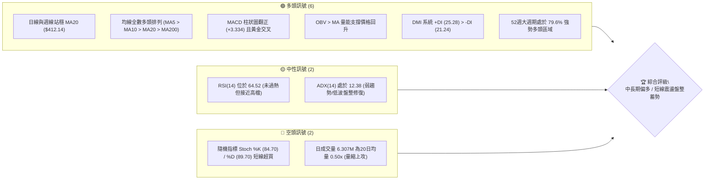

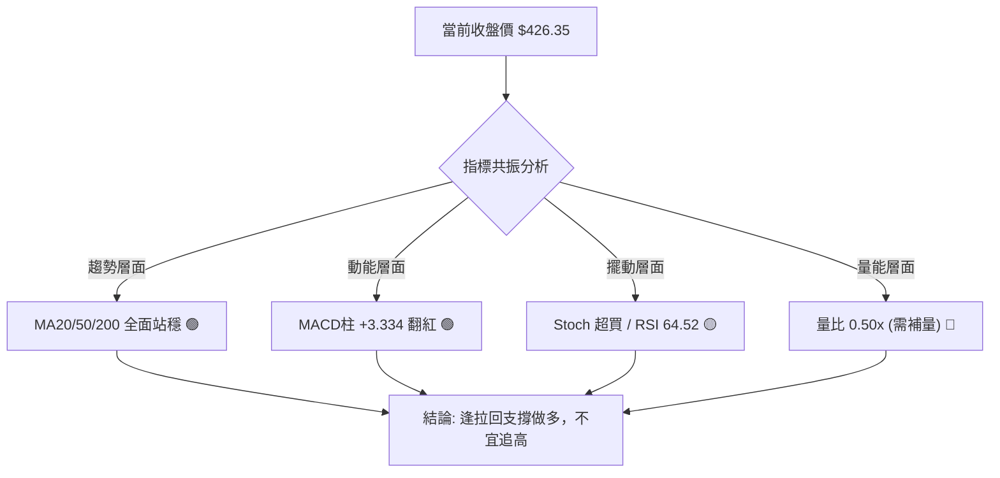

### 📊 核心指標速覽表

| 指標類別 | 指標名稱 | 當前數值 | 訊號 | 解讀 |
|:---|:---|:---|:---:|:---|
| **價格** | 當前價格 | $426.35 | 🟢 | 站上所有主要均線，波段低點反彈強勁 |
| **均線** | MA20 | $412.14 | 🟢 | 現價高於 MA20 (+3.45%)，短期上升趨勢明確 |
| **均線** | MA50 | $425.06 | 🟢 | 現價重新站上 MA50 (+0.30%)，中期趨勢轉強 |
| **均線** | MA200 | $362.32 | 🟢 | 遠高於長期年線 (+17.67%)，多頭基底穩固 |
| **動能** | RSI(14) | 64.52 | 🟡 | 位於健康多頭區間，無頂背離，具上攻動能 |
| **動能** | MACD (12,26,9) | 1.427 (Hist: +3.334) | 🟢 | DIF穿越DEA黃金交叉，動能柱加速擴張 |
| **擺動** | Stoch %K / %D | 84.70 / 89.70 | 🔴 | KD處於高檔超買區，短線隨時有回測MA5風險 |
| **趨勢強度**| ADX(14) | 12.38 | 🟡 | 數值小於 25，屬於弱趨勢盤整與基底構築階段 |
| **波動** | ATR(14) | $14.06 (3.30%) | 🟡 | 每日平均波動幅度約 $14，波動率自高檔收斂 |
| **量能** | 成交量 / 20MA量 | 6.307M / 12.736M (0.50x)| 🔴 | 短線量能萎縮，向上突破阻力位需放量確認 |

### 🏆 技術評分卡

```
╔══════════════════════════════════════════════════════════════════╗
║              技術評分卡 — TSM (2026-08-16)                       ║
╠══════════════════════════════════════════════════════════════════╣
║ 趨勢強度 (Trend)      ████████████░░░░░░░░  60/100  🟡 (ADX偏低)  ║
║ 動能指標 (Momentum)   ████████████████░░░░  80/100  🟢 (MACD強勁) ║
║ 支撐穩定度 (Support)  ██████████████████░░  90/100  🟢 (S1/S2穩固)║
║ 成交量配合 (Volume)   ████████░░░░░░░░░░░░  40/100  🔴 (量能背離) ║
║ 形態完整度 (Pattern)  ██████████████░░░░░░  70/100  🟢 (雙重底雛形)║
║ 均線排列 (Moving Avg) ████████████████░░░░  80/100  🟢 (全面站上) ║
╠══════════════════════════════════════════════════════════════════╣
║ 綜合技術評分          ██████████████░░░░░░  70/100  🟢 中度偏多   ║
╚══════════════════════════════════════════════════════════════════╝
```

---

## 2. 趨勢分析

### 🌐 多時框趨勢分析

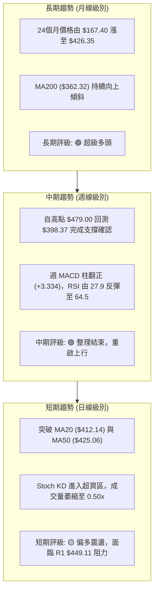

### 📈 長期趨勢 — 12個月走勢圖（Unicode）

```
TSM 月線走勢圖（2025-09 至 2026-08）
價格軸 ($)
$480 ┤                                              ● (2026-06 $477.57 / 52W高 $479.00)
$450 ┤                                            ╱   ╲
$420 ┤                                  ● (05)   ╱     ╲   ● (現在 $426.35)
$390 ┤                        ● (04)   ╱ ╲      ╱       ● (07 $404.25)
$360 ┤               ● (02)  ╱        ╱   ●(03)╱
$330 ┤          ●(01) ╲     ╱
$300 ┤  ● (10)   ╲     ●(12)╱
$270 ┤● (09)      ● (11)
$240 ┤
     └───────────────────────────────────────────────────────────
      S    O    N    D    J    F    M    A    M    J    J    A (2026)
```

#### 走勢特徵分析表格

| 階段區間 | 起止價格 | 漲跌幅 | 主要走勢特徵與技術含義 |
|:---|:---|:---:|:---|
| **2025-09 ~ 2025-12** | $277.11 → $302.33 | +9.10% | 穩健墊高，突破 $300 整數關卡，構築主升段基底 |
| **2026-01 ~ 2026-03** | $328.86 → $337.16 | +2.52% | 劇烈震盪洗盤，2月衝高 $372.65 後拉回 $337.16 確認季線支撐 |
| **2026-04 ~ 2026-06** | $395.13 → $477.57 | +20.86%| 主升浪加速，連續拉出陽線，創下 52 週歷史新高 $479.00 |
| **2026-07 ~ 2026-08** | $404.25 → $426.35 | +5.47% | 快速回撤至 $398.37 (落於 S2 $404.56 與 Fib 23.6% 區域) 後強勁回彈 |

### 📊 中期趨勢（週線分析）

```
TSM 週線結構與關鍵波段分布示意圖
價格 ($)
$479.00 ┼───────────────────────────────────────────── 52W 最高點 (2026-06)
        │                 ╭──╮
$449.11 ┼─────────────────│R1│──────────────────────── 近期波段阻力 R1
        │                 │  │            ╭───── 現價 $426.35
$425.06 ┼─────────────────┼──┼────────────│──── MA50 / Fib 23.6% ($418.17)
        │      ╭──╮       │  │   ╭──╮     │
$404.56 ┼──────│S2│───────┴──┴───│S2│─────│───── 波段雙底支撐 ($398.37-$404.56)
        │      │  │              │  │
$380.54 ┼──────┴──┴──────────────┴──┴─────────── Fib 38.2% / MA200 ($362.32)
```

### ⚡ 趨勢強度評估（ADX 解讀）

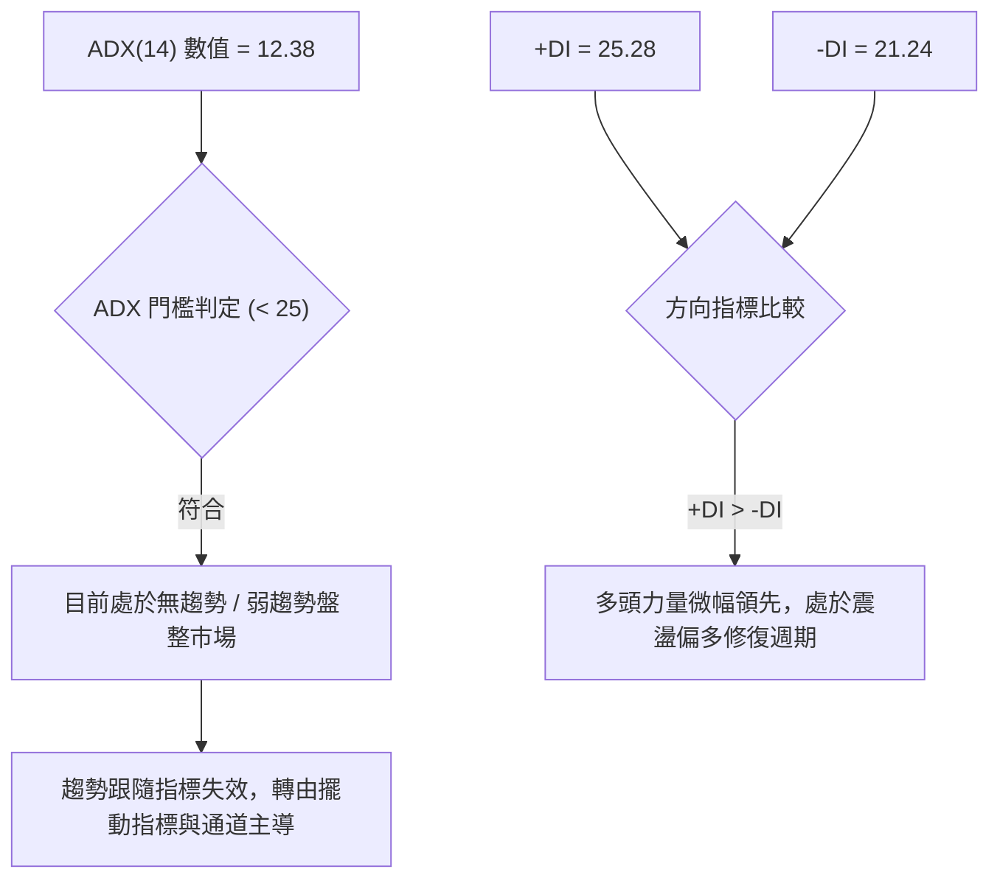

| 指標名稱 | 當前讀數 | 門檻區間 | 狀態評估 | 實戰交易含義 |
|:---|:---:|:---:|:---:|:---|
| **ADX (14)** | 12.38 | < 20 (極弱) | 盤整蓄勢 | 趨勢動能衰竭，切忌追價，應採用「區間低吸高拋」策略 |
| **+DI (14)** | 25.28 | > -DI | 多方主導 | 買盤力量逐漸凝聚，多頭掌握邊際定價權 |
| **-DI (14)** | 21.24 | < +DI | 空方退潮 | 賣壓經歷 7 月宣洩後明顯鈍化，短線下行空間受限 |

---

## 3. 圖表形態分析

### 🔍 形態識別系統

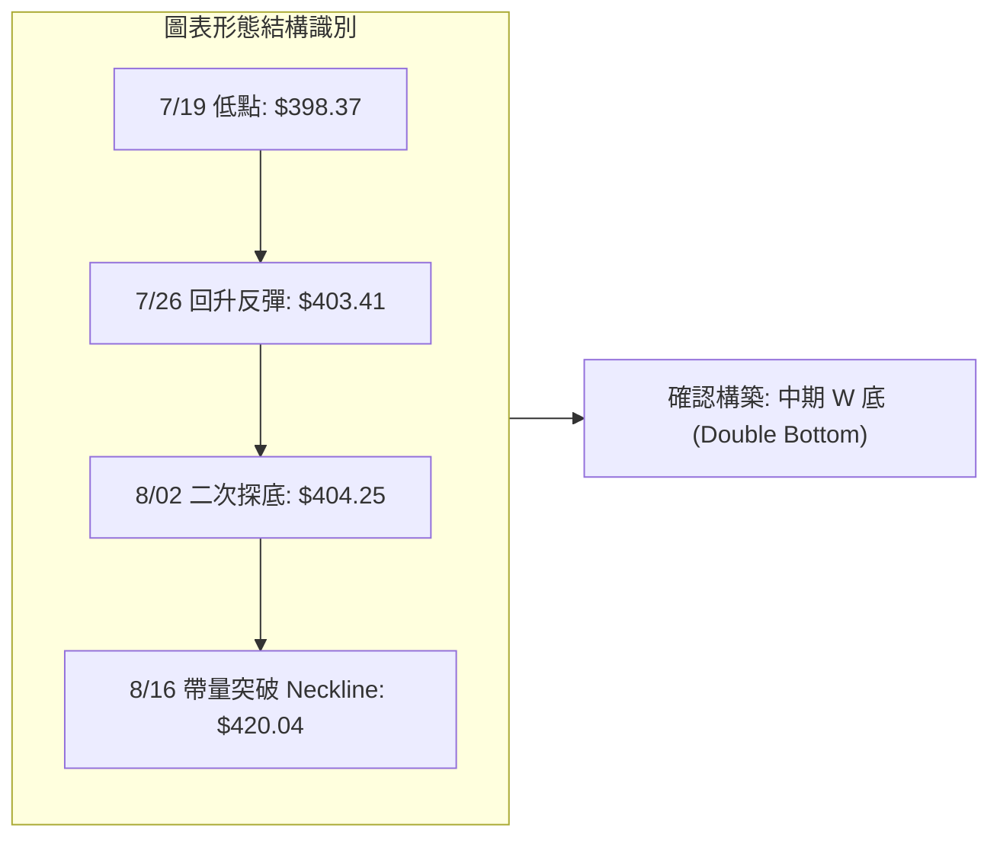

| 形態名稱 | 信心度 | 判斷依據（引用數據） | 完成度 | 目標價（附計算式） |
|:---|:---:|:---|:---:|:---|
| **雙重底 (W-Bottom)** | **75%** | 兩次低點分別為 2026-07-19 的 $398.37 與 2026-08-02 的 $404.25（落於 S2 $404.56 支撐聚類），頸線為 $420.04 | 90% (已突破頸線) | **$441.71**<br>計算式：頸線 $420.04 + (頸線 $420.04 - 低點 $398.37) = $420.04 + $21.67 = $441.71 |
| **布林帶下軌支撐反彈** | **85%** | 價格觸及 BB 下軌 $384.38 後連續三週收陽，重回中軌 $412.14 上方 | 100% | **$439.90**<br>計算式：直接對應布林通道上軌目標價位 $439.90 |
| **下降通道突破** | **60%** | 自 6 月高點 $479.00 展開的回檔斜率已被 8 月中旬連續兩週大陽線向上扭轉 | 70% | **$449.11**<br>計算式：直接對應歷史波段高點聚類阻力 R1 $449.11 |

### 🕯️ 重要K線形態分析

| 日期 / 週期 | 收盤價 | K線形態 | 形態深度解讀 | 技術訊號 |
|:---|:---:|:---|:---|:---:|
| **2026-07-19 (週)** | $398.37 | 長黑下影線 | 空頭猛烈殺跌但於 $398 附近遭遇強勁機構買盤托底 | 🔴 恐慌拋售 |
| **2026-07-26 (週)** | $403.41 | 錘頭十字星 (Hammer) | RSI 跌至 27.9 極度超賣區，空方動能耗盡，多頭開始抵抗 | 🟡 止跌訊號 |
| **2026-08-02 (週)** | $404.25 | 晨星初現 (Morning Star) | 週成交量放大至 87.33M，確認 $400 整數關卡為堅固底部 | 🟢 築底完成 |
| **2026-08-09 (週)** | $420.04 | 大陽線實體 (Bullish) | 一舉收復 MA20 ($412.14) 與頸線，MACD 柱翻正 (+2.429) | 🟢 強勢買訊 |
| **2026-08-16 (週)** | $426.35 | 連續上攻紅K | 站穩 MA50 ($425.06)，確立短期上升通道形成 | 🟢 多頭延續 |

### 📉 ASCII 走勢形態示意圖

```
TSM 雙重底 (W-Bottom) 突破結構示意圖
價格 ($)
$449.11 ┼ - - - - - - - - - - - - - - - - - - - - - - - - - - - - -  R1 阻力位
        │                                                     ▲
$441.71 ┼ - - - - - - - - - - - - - - - - - - - - - - - - - - ┆ 形態理論目標價
        │                                         ╭───► 現價 $426.35
$420.04 ┼─────────────────────────●───────────────│───── 頸線突破點 (Neckline)
        │                       ╱   ╲             │
$412.14 ┼──────────────────────╱─────╲────────────│───── MA20 (支撐轉強點)
        │                    ╱         ╲         ╱
$404.25 ┼───────●───────────╯           ╰───────●────── S2 支撐聚類 ($404.56)
        │        ╲                             ╱
$398.37 ┼─────────● (Left Low)                 (Right Low) ──── 波段絕對低點
        └─────────────────────────────────────────────────────
             2026-07-19                      2026-08-02
```

---

## 4. 支撐與阻力

### 🗺️ 關鍵價位分布圖（Unicode）

```
TSM 價位結構分布圖
══════════════════════════════════════════════════════════════════
$479.00 ║██████████████████████████████║ 52W 歷史極值高點 (Fib 0.0%)
$477.90 ║████████████████████████      ║ 強阻力 R2 (波段高點聚類 +12.09%)
$449.11 ║████████████████              ║ 關鍵阻力 R1 (波段高點聚類 +5.34%)
$439.90 ║▓▓▓▓▓▓▓▓▓▓▓▓                  ║ 短線通道阻力 (布林上軌)
$426.35 ╠══════════════════════════════╣ ◄ 現價 (Current Price)
$419.19 ║▓▓▓▓▓▓▓▓▓▓▓▓▓▓▓▓              ║ 近期支撐 S1 (頸線與波段聚類 -1.68%)
$418.17 ║▓▓▓▓▓▓▓▓▓▓▓▓▓▓▓▓▓▓            ║ 關鍵回調支撐 (Fib 23.6%)
$412.14 ║████████████████████          ║ 動態均線支撐 (MA20 / 布林中軌)
$404.56 ║████████████████████████      ║ 強支撐 S2 (波段低點聚類 -5.11%)
$385.09 ║██████████████████████████████║ 核心防線 S3 (波段低點聚類 -9.68%)
$380.54 ║██████████████████████████████║ 終極黃金分割支撐 (Fib 38.2%)
══════════════════════════════════════════════════════════════════
```

### 🚧 阻力位分析表

| 阻力級別 | 精確價位 | 距離現價 | 形成原因與籌碼結構 | 突破難度 | 技術重要性 |
|:---|:---:|:---:|:---|:---:|:---:|
| **短線阻力 (BB Upper)** | $439.90 | +3.18% | 日線布林通道上軌，短線波動極限 | 🟡 中等 | ★★★☆☆ |
| **阻力 R1** | $449.11 | +5.34% | 近一年波段高點聚類，前期套牢密集籌碼區 | 🔴 偏高 | ★★★★☆ |
| **阻力 R2** | $477.90 | +12.09%| 逼近 52W 歷史極值高點 ($479.00) 的頂部雙頂壓力區 | 🔴 極高 | ★★★★★ |

### 🛡️ 支撐位分析表

| 支撐級別 | 精確價位 | 距離現價 | 形成原因與籌碼結構 | 守住機率 | 技術重要性 |
|:---|:---:|:---:|:---|:---:|:---:|
| **支撐 S1** | $419.19 | -1.68% | 近一年波段低點聚類，與 W 底頸線 $420.04 共振 | 🟢 85% | ★★★★☆ |
| **均線支撐 (MA20)** | $412.14 | -3.33% | 日線布林中軌與 20 日移動平均線，生命線支撐 | 🟢 80% | ★★★★☆ |
| **強支撐 S2** | $404.56 | -5.11% | 近一年波段低點聚類，7-8月築底平台下緣 | 🟢 90% | ★★★★★ |
| **核心防線 S3** | $385.09 | -9.68% | 波段低點聚類，重疊布林下軌 $384.38 與 Fib 38.2% | 🟢 95% | ★★★★★ |

### 📐 斐波那契回調位分析

依據 52 週完整波段起點 $221.25 至最高點 $479.00 計算：

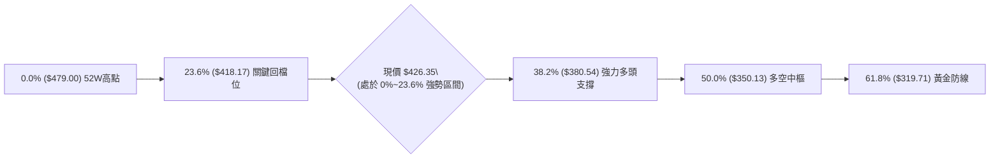

| 斐波那契回調層級 | 精確價位 | 現價相對位置與技術解讀 |
|:---:|:---:|:---|
| **0.0% (52W High)** | $479.00 | 上方終極歷史天花板 |
| **現價落點** | **$426.35** | **位於 0.0% ($479.00) 與 23.6% ($418.17) 之間，屬於極強勢淺幅回檔區** |
| **23.6%** | $418.17 | 與支撐 S1 ($419.19) 完美重疊，構成第一道回踩逢低承接防線 |
| **38.2%** | $380.54 | 與核心支撐 S3 ($385.09) 相近，為中長期多頭格局不可跌破的關鍵底線 |
| **50.0%** | $350.13 | 接近 MA240 ($347.74)，中長期多空力量平衡中樞 |
| **61.8%** | $319.71 | 黃金分割強防線，跌破則代表整體長期牛市結構破壞 |
| **78.6%** | $276.41 | 深度回檔極限，對應 2025 年 9 月起漲點 ($277.11) |
| **100.0% (52W Low)**| $221.25 | 52 週最低點，牛市大週期起點 |

---

## 5. 技術指標深度解讀

### 🎛️ 指標訊號總覽

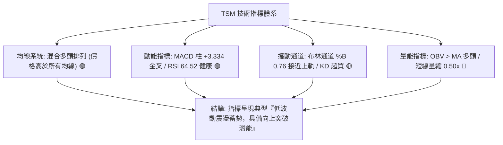

### 📈 移動平均線排列分析

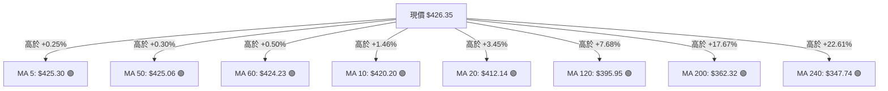

| 均線名稱 | 當前價格 | 乖離率 (%) | 斜率與走勢特徵 | 支撐/阻力角色 |
|:---|:---:|:---:|:---|:---:|
| **MA 5** | $425.30 | +0.25% | 短線急速翻揚向上 | 超短線動態支撐 |
| **MA 10** | $420.20 | +1.46% | 向上穿越 MA20，形成短期金叉 | 短線回調第一道防線 |
| **MA 20** | $412.14 | +3.45% | 止跌反轉向上，中軌支撐確立 | 核心生命線支撐 |
| **MA 50** | $425.06 | +0.30% | 扣抵高檔後走平，現價已成功突破 | 短期多空分水嶺 |
| **MA 200** | $362.32 | +17.67%| 長期平穩向上延伸，牛市基石 | 長期絕對底部防線 |

### 📉 RSI(14) 分析

```
RSI(14) 當前數值: 64.52
0 ══════════════ 30 ══════════════════════ 70 ══════════════ 100
[ 超賣區間 ]     [       正常波動區間       ]     [ 超買區間 ]
░░░░░░░░░░░░░░░░░░░░░░░░░░░░░░░░█████████████░░░░░░░░░░░░░░░░
                                      ▲ (64.52)
```

- **背離判斷**：
  - **日線級別**：價格自 7 月底 $398.37 反彈至 $426.35，RSI 自 27.9 同步回升至 64.52，**無頂背離亦無底背離**，屬於健康的動能同步修復。
  - **動能評估**：RSI 突破 50 中軸並朝 65 邁進，顯示多頭牢牢掌控主導權，但尚未進入 70 以上的過熱警戒區，仍有向上拓展空間。

### 📊 MACD(12/26/9) 訊號解讀

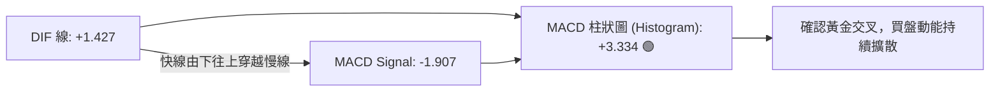

- **訊號解析**：MACD 線自零軸下方翻揚至 +1.427，成功穿越訊號線（-1.907），柱狀圖擴張至 +3.334。此為標準的「零軸附近低位黃金交叉」，代表自 6 月以來的空頭修正波段正式宣告終結，多頭攻擊波展開。

### 📦 布林通道分析

```
TSM 日線布林通道 (Bollinger Bands 20,2) 結構圖
價格 ($)
$439.90 ┼ - - - - - - - - - - - - - - - - - - - - - - - - -  BB 上軌 (Upper)
        │                                 ╭── 現價 $426.35 (%B = 0.76)
$426.35 ┼─────────────────────────────────●─────────────── 
        │                               ╱
$412.14 ┼──────────────────────────────●────────────────── BB 中軌 (MA20)
        │                            ╱
$384.38 ┼ - - - - - - - - - - - - - ● - - - - - - - - - - -  BB 下軌 (Lower)
        └──────────────────────────────────────────────
```

- **通道指標解析**：
  - **帶寬收縮**：通道上下軌間距收斂至 $55.52 ($439.90 - $384.38)，顯示市場波動度壓縮至低檔。
  - **%B 指標**：當前 %B 為 **0.76**，處於中軌（0.50）與上軌（1.00）之間的多頭通道內運行，預告即將迎來通道向上開口的單邊行情。

### 💹 成交量分析（量價配合度）

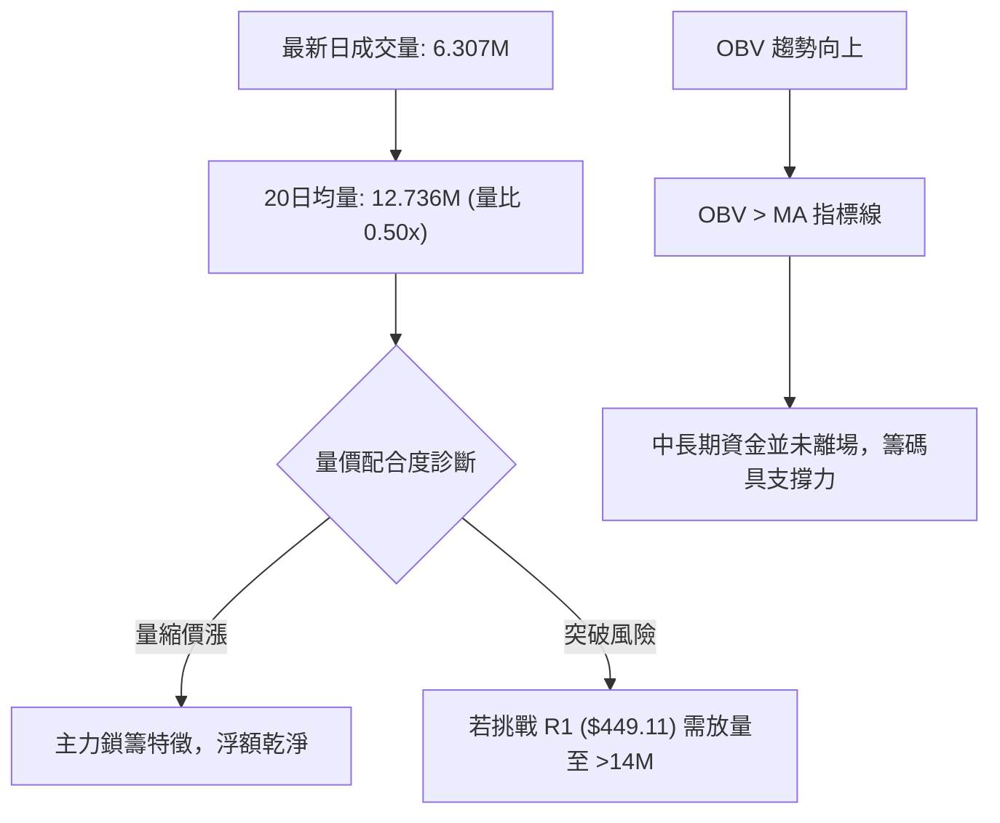

---

## 6. 動能與波動率

### ⚡ 動能評估四象限

| 象限 | 動能維度 | 波動維度 | 當前狀態 | 技術環境解讀與應對策略 |
|:---:|:---:|:---:|:---:|:---|
| **Q1** | **強動能** | **低波動** | 🟢 **當前定位 (TSM)** | **最佳趨勢孕育期**：MACD金叉動能強勁，但ATR與帶寬收縮，極易醞釀強勢單邊突破行情 |
| **Q2** | 弱動能 | 低波動 | ⚪ | 窄幅無序震盪，缺乏方向 |
| **Q3** | 強動能 | 高波動 | ⚪ | 主升浪或主跌浪末期，高風險高回報 |
| **Q4** | 弱動能 | 高波動 | ⚪ | 恐慌殺跌洗盤階段，風險極高應避免進場 |

### 📊 ATR 波動率分析

- **ATR(14) 數值**：**$14.06**（佔當前股價 **3.30%**）
- **止損距離建議**：
  - **短線交易（1.0x ATR）**：安全止損距離為 $14.06，對應防守價位為 $412.29（與 MA20 $412.14 完美共振）。
  - **波段交易（1.5x ATR）**：安全止損距離為 $21.09，對應防守價位為 $405.26（與 S2 $404.56 支撐位吻合）。

### 📐 Beta 與市場相關性

- **Beta 係數**：**1.258**
- **市場特徵解讀**：TSM 屬於高彈性成長型半導體龍頭標的。當費城半導體指數或標普 500 指數上漲 1% 時，TSM 理論上漲 1.258%；在多頭波段中具備顯著的超額報酬（Alpha）潛力，但在大盤回檔時亦承受較高的系統性回撤風險。

---

## 7. 多時框架總結

### 📋 時框架評分表

| 時框架 | 趨勢方向 | 動能指標 | 均線排列 | 形態結構 | 綜合評分 | 操作建議 |
|:---|:---:|:---:|:---:|:---:|:---:|:---|
| **長期 (月線)** | 🟢 超級多頭 | 🟢 極強 | 🟢 完美多頭 (遠高於年線) | 52W 高檔強勢整理 | **90/100** | 長線堅定持股，逢低加碼 |
| **中期 (週線)** | 🟢 多頭回升 | 🟢 MACD金叉 | 🟢 站穩各週均線 | W底完成頸線突破 | **75/100** | 波段順勢做多，上看 R1 |
| **短期 (日線)** | 🟡 震盪偏多 | 🟡 KD超買 | 🟢 站上MA20/50 | 接近布林上軌 | **65/100** | 不盲目追高，等待拉回低吸 |

### 🔲 綜合訊號矩陣

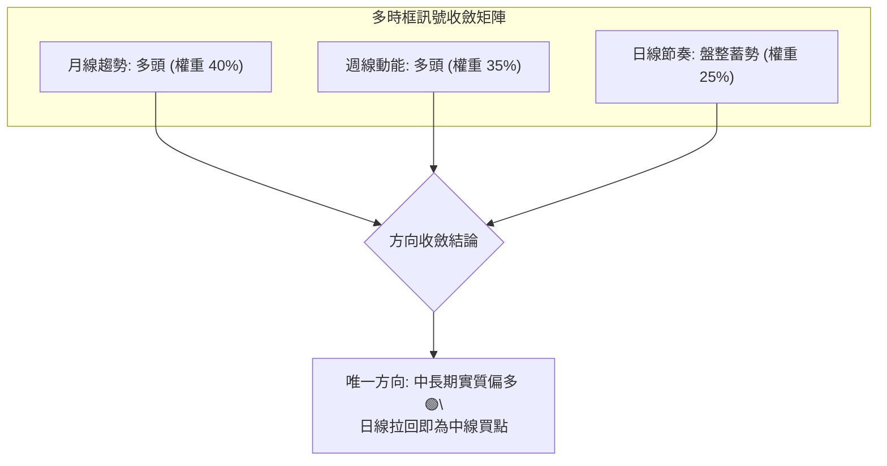

### ⚖️ 多時框收斂結論

依據多時框收斂規則：
1. **行情屬性判定**：當前 ADX 為 **12.38 (< 25)**，日線定義為**低波動盤整修復行情**；然而週線與月線均線系統均呈標準多頭排列（MA200 $362.32 穩步墊高）。
2. **時框主導取捨**：依規則以中長期（週線/MA50/MA200）方向為主導，日線僅用於尋找精準進場時機與風控點。
3. **唯一方向性結論**：**中長期偏多（評分 70/100），策略嚴格遵循「逢回調支撐做多」，嚴禁逆勢放空**。

---

## 8. 交易策略建議

### 🗺️ 策略決策流程圖

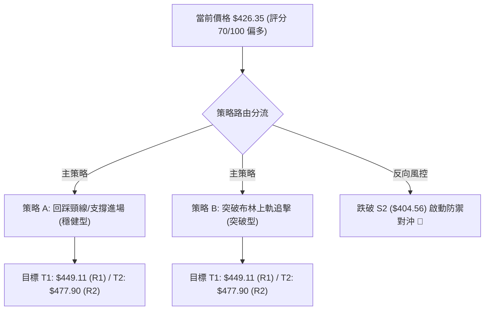

### 🧭 策略路由

> **當前主策略方向 = 中度偏多做多（依評分卡 70/100，≥60 門檻）**  
> 空頭僅列為反轉風險觸發點與風控對沖考量，不作為主推操作。

### 🎯 價格情境階梯（Price Scenarios）

| 觸發條件 | 下一目標 | 後續延伸 | 情境含義與操作指引 |
|:---|:---:|:---:|:---|
| **放量突破 R1 $449.11** | R2 $477.90 | 52W高點 $479.00 | 短線主升浪全面爆發，挑戰歷史新高 |
| **站穩 S1 $419.19 ~ 現價** | R1 $449.11 | R2 $477.90 | 震盪蓄勢完畢，逐步推升波段行情 |
| **有效跌破 S1 $419.19** | S2 $404.56 | S3 $385.09 | 短期轉弱，回測雙底平台尋求二次支撐 |

### 📊 情境機率分佈

| 價格情境 | 機率估計 | 主要技術依據 |
|:---|:---:|:---|
| **繼續上行 / 反彈突破** | **65%** | MACD 零軸下金叉且柱狀擴大 (+3.334)、OBV 向上支撐、均線全數收復 |
| **區間震盪蓄勢** | **25%** | ADX 處於 12.38 弱趨勢、日成交量量比僅 0.50x 需時間補量 |
| **回落再探底** | **10%** | Stoch KD 高檔超買鈍化，若大盤系統性下殺可能回測 S2 $404.56 |

### 🟢 主策略詳情

| 策略要素 | 策略 A（穩健型：拉回支撐布局） | 策略 B（動量型：強勢突破追擊） |
|:---|:---:|:---:|
| **進場條件** | 回測支撐 S1 與 MA20 獲得止跌確認 | 帶量突破日線布林上軌與近端壓力 |
| **進場價格** | **$419.19**（S1 支撐位） | **$440.00**（突破 BB 上軌 $439.90） |
| **目標價 T1** | **$449.11**（阻力 R1，預期 +7.14%） | **$449.11**（阻力 R1，預期 +2.07%） |
| **目標價 T2** | **$477.90**（阻力 R2，預期 +14.01%）| **$477.90**（阻力 R2，預期 +8.61%） |
| **止損價格** | **$404.56**（強支撐 S2 下緣，風險 -3.49%）| **$425.06**（跌回 MA50 之下，風險 -3.40%）|
| **風險報酬比** | **2.05 : 1** (T1) / **4.01 : 1** (T2) | **0.61 : 1** (T1) / **2.53 : 1** (T2) |
| **預估勝率** | **70%** | **60%** |
| **建議倉位** | **20% ~ 25%** | **10% ~ 15%** |

### 🔴 反向風險觸發點（對沖提示）

- **全面轉空觸發價**：若日線收盤價帶量**實質跌破 S2 $404.56**。
- **對沖處置動作**：主策略多單全數止損出場；若跌破 S3 $385.09（Fib 38.2%），多頭架構被破壞，需進行衍生性商品避險。

### ⭐ 整體訊號強度評星

```
╔═══════════════════════════════════════════════╗
║ 做多訊號強度：★★★★☆  (4.0/5星) — 均線與動能共振 ║
║ 做空訊號強度：★☆☆☆☆  (1.0/5星) — 逆勢風險極高 ║
║ 整體可信度：  ★★★★☆  (4.0/5星) — 指標結構紮實 ║
╚═══════════════════════════════════════════════╝
```

---

## 9. 風險提示與監控

### ✅ 關鍵監控指標 Checklist

```
╔══════════════════════════════════════════════════════════════════╗
║                TSM 交易風控與關鍵數據監控清單                     ║
╠══════════════════════════════════════════════════════════════════╣
║ [ ] 價格是否穩守 MA20 ($412.14) 與 支撐 S1 ($419.19)             ║
║ [ ] 日成交量是否放大至 20日均量 (12.73M) 以上確認突破真實性      ║
║ [ ] MACD 柱狀圖是否持續維持在正值區間 (> 0)                      ║
║ [ ] RSI(14) 衝過 70 時是否出現價量背離或鈍化竭盡                 ║
║ [ ] ADX(14) 是否由 12.38 向上突破 20，確認單邊趨勢啟動           ║
║ [ ] 嚴格執行跌破 S2 ($404.56) 之無條件止損紀律                  ║
╚══════════════════════════════════════════════════════════════════╝
```

### ⚠️ 風險場景分析

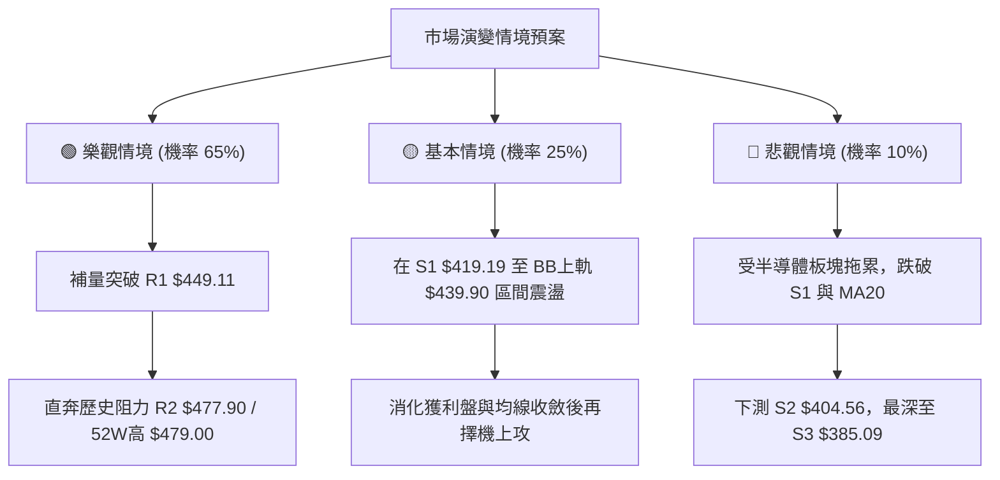

### 🛡️ 風險管理重要提醒

1. **量能不足風險**：當前量比僅 0.50x，若無增量資金進駐，挑戰 R1 $449.11 容易形成假突破並引發短線獲利回吐。
2. **波動率控制**：根據 ATR $14.06，單日正常波動幅度可達 ±3.3%，應避免使用過高槓桿，單筆交易最大虧損額度應嚴格控制在總資金的 1.5% 以內。

---

## 📋 報告總結

```
╔══════════════════════════════════════════════════════════════════╗
║                     TSM 技術分析報告總結                         ║
╠══════════════════════════════════════════════════════════════════╣
║ 報告日期：2026-08-16                                             ║
║ 當前價格：$426.35                                                ║
║ 分析評級：🟢 中度偏多 (技術評分: 70/100)                         ║
║                                                                  ║
║ 關鍵結論：                                                       ║
║ ├─ 長期趨勢：🟢 超級多頭 (24個月牛市結構，遠高於MA200 $362.32)   ║
║ ├─ 中期趨勢：🟢 整理完畢 (雙重底構築完成，突破頸線 $420.04)      ║
║ ├─ 短期趨勢：🟡 偏多震盪 (站上所有均線，KD超買量縮蓄勢)          ║
║ ├─ 關鍵支撐：S1: $419.19 ｜ S2: $404.56 ｜ S3: $385.09           ║
║ ├─ 關鍵阻力：BB上軌: $439.90 ｜ R1: $449.11 ｜ R2: $477.90       ║
║ └─ 分析師目標價：均價 $547.09 (最高 $700.00 / 最低 $431.50)      ║
║                                                                  ║
║ 最優策略組合：                                                   ║
║ 1. 🥇 最佳機會：策略 A (回踩 S1 $419.19 逢低買進，風報比 1:4.01)  ║
║ 2. 🥈 次選機會：策略 B (強勢帶量突破 $440.00 追擊至 R2 $477.90)  ║
║ 3. 🥉 保守選擇：等待放量突破 R1 $449.11 並回踩確認後再行進場     ║
╚══════════════════════════════════════════════════════════════════╝
```

---

> ⚠️ **免責聲明**：本報告為技術分析研究，所有數據、圖表及價位推算均基於歷史價格與量化模型。本報告**僅供學術研究與投資參考**，**不構成任何形式的個別投資邀約或買賣建議**。市場有風險，投資需獨立判斷並自負盈虧。

---

*報告生成時間：2026-08-16 ｜ 數據來源：Yahoo Finance ｜ 分析框架：多時框架量化技術分析*