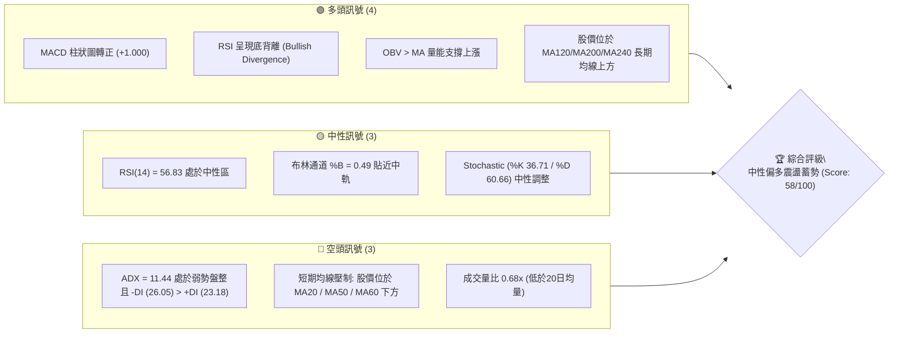
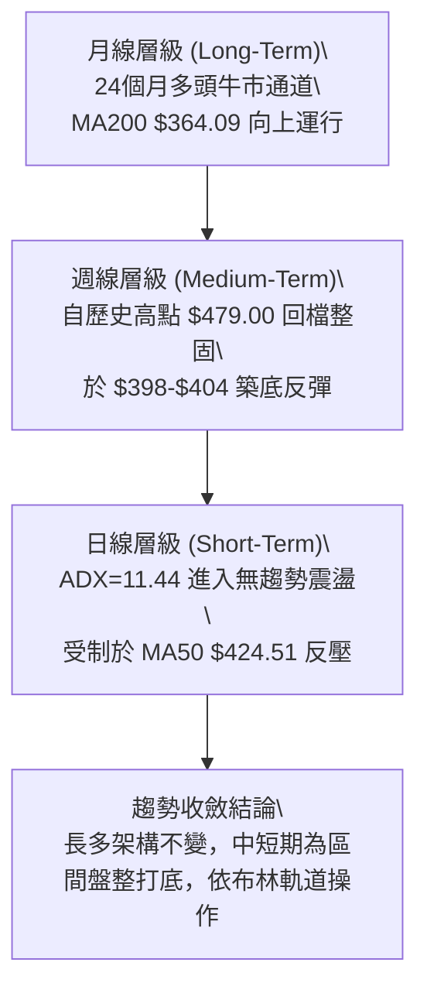
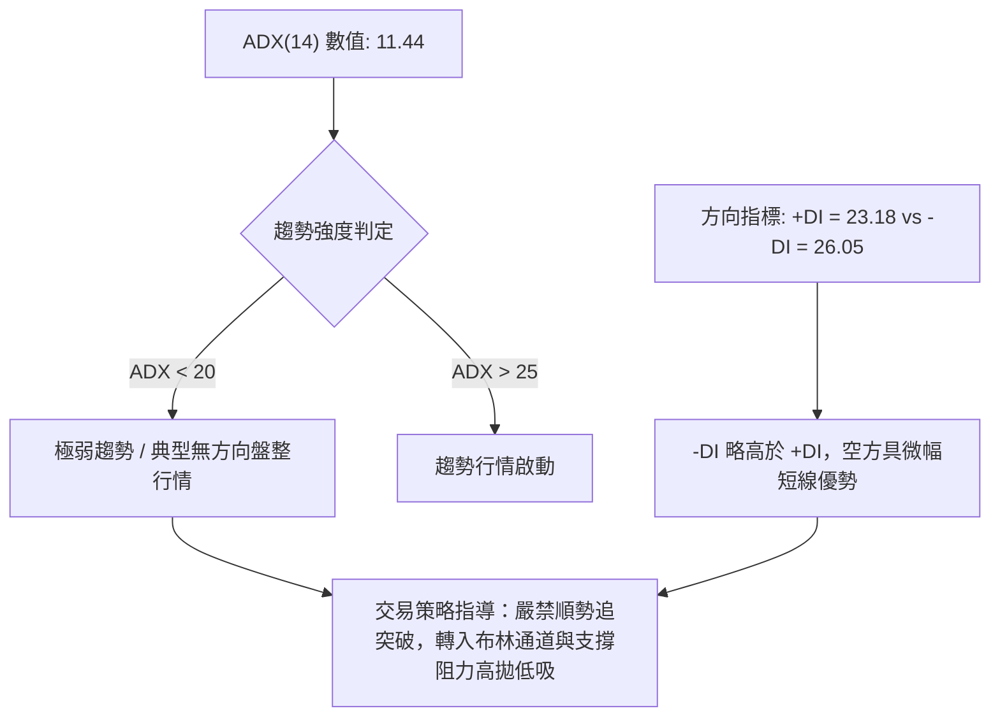
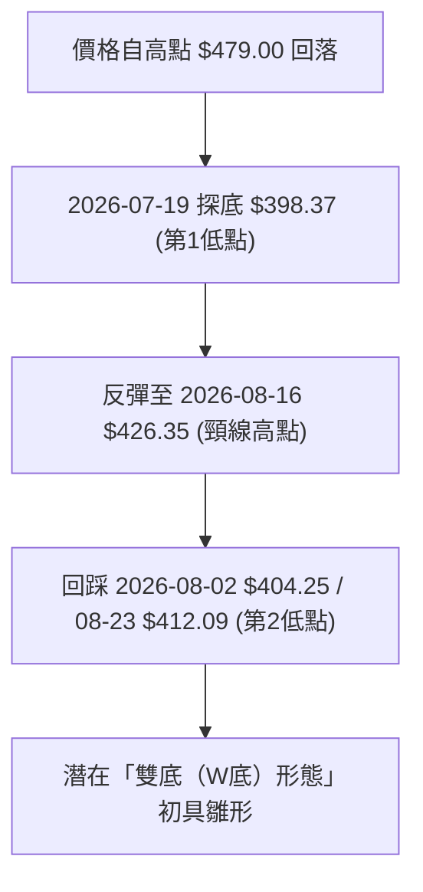
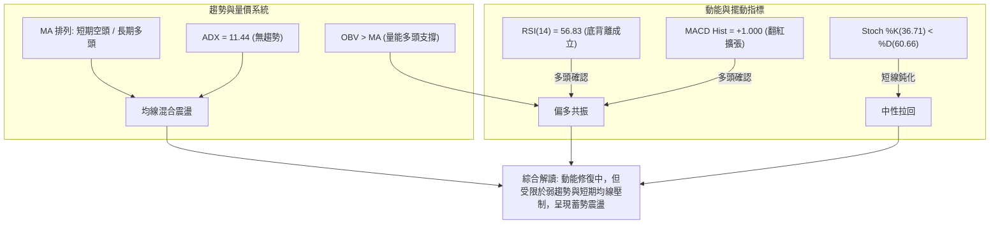
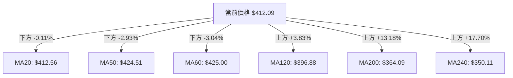
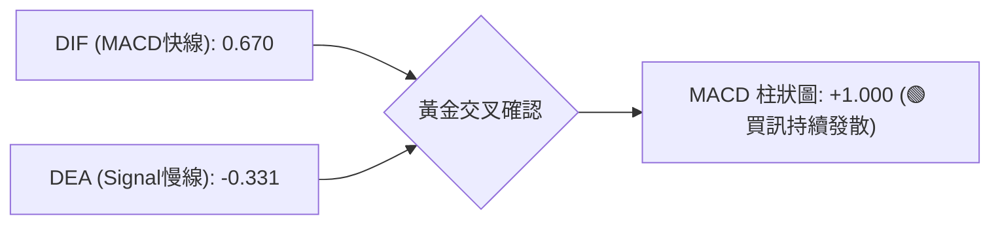
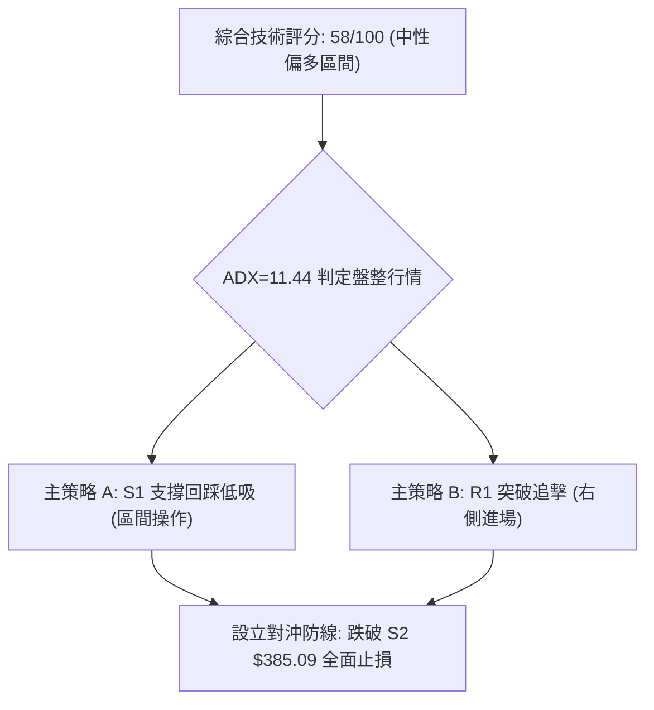
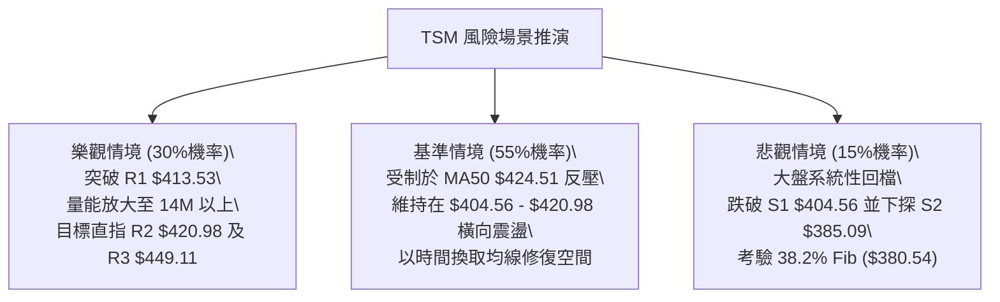

# TSM 技術分析報告

> **報告日期**：2026-08-19 ｜ **語言**：繁體中文 ｜ **數據來源**：Yahoo Finance ｜ **當前價格**：$412.09

---

## 目錄

| 章節 | 內容 |
|------|------|
| [1. 技術面概覽](#1-技術面概覽) | 訊號儀表板、核心指標、評分卡 |
| [2. 趨勢分析](#2-趨勢分析) | 多時框趨勢、長中短期走勢、ADX解讀 |
| [3. 圖表形態分析](#3-圖表形態分析) | 形態識別、K線組合、目標價推算 |
| [4. 支撐與阻力](#4-支撐與阻力) | 關鍵價位、斐波那契回調結構 |
| [5. 技術指標深度解讀](#5-技術指標深度解讀) | MA/RSI/MACD/布林/成交量量價關係 |
| [6. 動能與波動率](#6-動能與波動率) | 動能評估四象限、ATR、Beta 風險 |
| [7. 多時框架總結](#7-多時框架總結) | 時框架評分矩陣與多時框收斂 |
| [8. 交易策略建議](#8-交易策略建議) | 策略路由、情境機率、主策略與對沖防線 |
| [9. 風險提示與監控](#9-風險提示與監控) | 監控清單、情境推演、風控紀律 |

---

## 1. 技術面概覽

### 🎯 技術訊號儀表板



### 📊 核心指標速覽表

| 指標類別 | 指標名稱 | 當前數值 | 訊號 | 解讀 |
|----------|----------|----------|:----:|------|
| **價格** | 當前價格 | $412.09 | 🟡 | 位於52週區間74.0%，處於高位回撤後的橫向整固期 |
| **均線** | MA20 | $412.56 | 🟡 | 價格微幅低於中軌（-0.11%），多空於此爭奪主導權 |
| **均線** | MA50 | $424.51 | 🔴 | 價格低於50日線（-2.93%），中期上方具備反壓 |
| **均線** | MA200 | $364.09 | 🟢 | 價格大幅高於年線（+13.18%），長期牛市基底穩固 |
| **動能** | RSI(14) | 56.83 | 🟢 | 中性偏強，且技術面出現顯著「底背離」多頭訊號 |
| **動能** | MACD | Hist +1.000 | 🟢 | 快線(0.670)高於慢線(-0.331)，柱狀圖翻紅擴張 |
| **波動** | ATR(14) | $12.04 | 🟡 | 日波動率 2.92%，屬於正常健康整理波動範圍 |

### 🏆 技術評分卡

```
╔══════════════════════════════════════════════════════════════════╗
║                   技術評分卡 — TSM (2026-08-19)                  ║
╠══════════════════════════════════════════════════════════════════╣
║ 趨勢強度 (ADX/DI)   █████░░░░░░░░░░░░░░░  32/100  🔴 弱勢盤整    ║
║ 動能指標 (RSI/MACD) ██████████████░░░░░░  72/100  🟢 動能修復    ║
║ 支撐穩定度 (S1-S3)  ████████████████░░░░  80/100  🟢 買盤承接強  ║
║ 成交量配合 (OBV/VOL)████████████░░░░░░░░  60/100  🟡 量縮整理    ║
║ 形態完整度 (結構)   ████████████░░░░░░░░  62/100  🟡 箱體成型    ║
║ 均線排列 (多時框)   ████████░░░░░░░░░░░░  44/100  🔴 短空長多    ║
╠══════════════════════════════════════════════════════════════════╣
║ 綜合技術評分        ███████████░░░░░░░░░  58/100  🟡 中性偏多區間║
╚══════════════════════════════════════════════════════════════════╝
```

---

## 2. 趨勢分析

### 🌐 多時框趨勢分析



### 📈 長期趨勢 — 12個月走勢圖（Unicode）

```
TSM 月線走勢圖（過去12個月：2025-08 至 2026-08）
價格 ($)
$480 ┤                                                 ● $477.57 (2026-06 高點)
$450 ┤                                                ╱ ╲
$420 ┤                                      ● $417.47╱   ╲   ● $412.09 (現價)
$390 ┤                            ● $395.13╱        ╱     ● $404.25
$360 ┤                  ● $372.65╱        ╱        ╱
$330 ┤        ● $328.86╱         ╲       ╱        ╱
$300 ┤  ●   ●╱                    ● $337.16
$270 ┤ ●
$220 ┤● $228.34 (2025-08)
     └────────────────────────────────────────────────────────────────────────
      08  09  10  11  12  01  02    03    04   05   06    07    08 (月份)
      2025                       2026
```

**12個月走勢特徵分析表格**：

| 階段區間 | 起訖月份 | 價格區間 ($) | 區間漲跌幅 | 走勢特徵與技術意義 |
|----------|----------|--------------|:----------:|--------------------|
| **第1階段：主升推升** | 2025-08 → 2026-02 | $228.34 → $372.65 | +63.20% | 呈現穩定階梯式上揚，月線連紅，均線全面多頭排列 |
| **第2階段：波段震盪** | 2026-02 → 2026-03 | $372.65 → $337.16 | -9.52% | 急跌回測季線支撐，完成籌碼洗盤 |
| **第3階段：二次衝頂** | 2026-03 → 2026-06 | $337.16 → $477.57 | +41.64% | 爆發性多頭主升段，創下 52 週新高 $479.00 |
| **第4階段：高位修正** | 2026-06 → 2026-07 | $477.57 → $404.25 | -15.35% | 獲利了結賣壓湧現，自高位回調至 23.6% 斐波那契附近 |
| **第5階段：打底蓄勢** | 2026-07 → 2026-08 | $404.25 → $412.09 | +1.94% | 跌勢趨緩，於支撐區 S1 ($404.56) 上方橫向整固 |

### 📊 中期趨勢（週線分析）

```
TSM 週線關鍵位與走勢示意圖
$479.00 ┬────────────────────────────────────────── 52W 歷史最高點
        │      ╭──╮
$449.11 ┼──────│──│──────────────────────────────── R3 波段高點強阻力
        │     ╭╯  ╰╮
$426.35 ┼─────│────│──────╭─╮────────────────────── 2026-08-16 近期反彈高點
$420.98 ┼─────│────│──────│─│──╭───╮─────────────── R2 波段阻力 / MA50 ($424.51)
$412.09 ┼─────│────│──────│─│──│─●─│─────────────── 當前收盤價 (布林中軌 $412.56)
$404.56 ┼─────│────╰──╮──│─│──│───│─────────────── S1 支撐位 (7月-8月雙重築底線)
$398.37 ┼─────│────────╰──╯─│──│───│─────────────── 2026-07-19 波段低點
$385.09 ┴─────┴────────────────┴──┴───┴─────────────── S2 強支撐位 / BB下軌 ($384.73)
```

### ⚡ 趨勢強度評估（ADX 解讀）



**ADX 強度對照與市場狀態分析表**：

| ADX 區間 | 當前數值 | 行情性質 | 多空主導權 | 策略方針 |
|----------|:--------:|----------|------------|----------|
| 0 – 20 | **11.44** | **強烈震盪盤整（無趨勢）** | -DI (26.05) > +DI (23.18) 空頭微佔優 | **箱體區間交易**，依據 S1/S2 與 R1/R2 進行網格或反轉操作 |
| 20 – 25 | — | 趨勢萌芽期 | 觀察突破方向 | 縮小部位，等待均線糾纏後表態 |
| 25 – 50 | — | 明確單邊趨勢 | 順勢單方做多/做空 | 順勢加碼，拉回找買點 |

---

## 3. 圖表形態分析

### 🔍 形態識別系統



**圖表形態信心度與目標價評估表**：

| 形態名稱 | 信心度 | 判斷依據（引用數據） | 完成度 | 目標價（附嚴格計算式） |
|----------|:------:|----------------------|:------:|------------------------|
| **雙底形態 (W-Bottom)** | **65%** | 兩次低點分別落於 $398.37 與 $404.25（均受 S1 $404.56 / S2 $385.09 有效支撐），頸線位於近週高點 $426.35。 | 70% | **第一目標價 $449.11 (即R3)**<br>形態理論高度 = 頸線 $426.35 - 最低點 $398.37 = $27.98。<br>理論突破目標 = $426.35 + $27.98 = **$454.33**（對應關鍵阻力 R3 $449.11 區域）。 |
| **矩形箱體震盪** | **85%** | 價格受限於布林上軌 $440.39 與下軌 $384.73 之間，ADX=11.44 充分印證無方向箱體。 | 90% | 上箱頂阻力 **R2 $420.98** / **R3 $449.11**；<br>下箱底支撐 **S1 $404.56** / **S2 $385.09**。 |
| **頭肩頂形態** | **25%** | 數據中未偵測到完整右肩結構，信心度不足 50%，依規則不予採納為主要交易形態。 | 15% | 訊號不足，僅做指標型解讀。 |

### 🕯️ 重要K線形態分析

| 週/月份週期 | 收盤價 ($) | 成交量 (股) | K線形態特徵 | 市場心理與解讀 | 訊號 |
|-------------|:----------:|:-----------:|-------------|----------------|:----:|
| **2026-07-19 週** | $398.37 | 91,498,900 | 爆量長下影線 | 空頭極致宣洩，主力資金於 $400 大關下方大舉承接 | 🟢 |
| **2026-07-26 週** | $403.41 | 62,697,100 | 止跌十字星 (RSI=27.9) | 指標嚴重超賣，空頭動能衰竭，市場轉入觀望 | 🟡 |
| **2026-08-09 週** | $420.04 | 59,184,900 | 中陽線實體包覆 | 多頭發力收復 420 關卡，MACD 柱狀圖翻正 (+2.429) | 🟢 |
| **2026-08-16 週** | $426.35 | 45,532,600 | 衝高受阻流星線 | 上攻 MA50 ($424.51) 與 23.6% 斐波那契位遇阻回落 | 🔴 |
| **2026-08-23 週** | $412.09 | 31,905,343 | 量縮小陰線窄幅整理 | 回測布林中軌 $412.56，籌碼進入沉澱鎖定狀態 | 🟡 |

### 📉 ASCII 走勢形態示意圖

```
TSM 潛在雙底（W底）構築示意圖
價格 ($)
$430 ┤                        [頸線高點: $426.35]
     │                             ╭─●─╮
$420 ┤          ╭─────────────────╯     ╰──────● $412.09 (現價)
     │         ╭╯                                ╰─╮
$410 ┤        ╭╯                                   ╰───● $404.25 (第2底)
     │       ╭╯
$400 ┤──────╭╯
     │      ● $398.37 (第1底)
$390 ┴─────────────────────────────────────────────────────────────
     時間:  2026-07-19              2026-08-16         2026-08-23
```

---

## 4. 支撐與阻力

### 🗺️ 關鍵價位分布圖（Unicode）

```
TSM 價位結構分布圖
═══════════════════════════════════════════════════════════════════════
$479.00 ║████████████████████████████████║ 52週歷史最高點 (0.0% Fib)
$449.11 ║████████████████████████        ║ 強阻力 R3 (形態理論目標區間)
$440.39 ║▓▓▓▓▓▓▓▓▓▓▓▓▓▓▓▓▓▓▓▓            ║ 布林通道上軌
$424.51 ║████████████                    ║ MA50 均線反壓
$420.98 ║████████████████                ║ 阻力 R2 (短線反彈壓力區)
$418.17 ║▓▓▓▓▓▓▓▓▓▓                      ║ 23.6% 斐波那契回調位
$413.53 ║████████                        ║ 關鍵阻力 R1 (短線突破點)
$412.09 ╠════════════════════════════════╣ ◄ 當前收盤價 (布林中軌 $412.56)
$404.56 ║▓▓▓▓▓▓▓▓▓▓▓▓▓▓▓▓                ║ 近期支撐 S1 (雙底頸線底層防線)
$385.09 ║████████████████████████        ║ 強支撐 S2 (波段多頭生命線)
$384.73 ║▓▓▓▓▓▓▓▓▓▓▓▓▓▓▓▓▓▓▓▓            ║ 布林通道下軌
$380.54 ║████████████████████            ║ 38.2% 斐波那契回調位
$372.72 ║████████████████████████████    ║ 極強支撐 S3 (MA200 $364 上方防線)
═══════════════════════════════════════════════════════════════════════
```

### 🚧 阻力位分析表

| 阻力級別 | 價位 ($) | 距現價空間 | 形成原因（嚴格引用聚類數據） | 突破難度 | 技術重要性 |
|----------|:--------:|:----------:|------------------------------|:--------:|:----------:|
| **R1** | **$413.53** | +0.35% | 日線近期密集震盪上緣，緊貼布林中軌 ($412.56) | 低 | 🟢 短線多空強弱分水嶺 |
| **R2** | **$420.98** | +2.16% | 近一年波段高點聚類區，鄰近 23.6% Fib ($418.17) 與 MA10 ($422.12) | 中 | 🟡 突破確認開啟波段反彈 |
| **R3** | **$449.11** | +8.98% | 歷史衝頂前回撤重要轉折平台，接近布林上軌 ($440.39) | 高 | 🔴 中期波段多頭強阻力 |

### 🛡️ 支撐位分析表

| 支撐級別 | 價位 ($) | 距現價空間 | 形成原因（嚴格引用聚類數據） | 守住機率 | 技術重要性 |
|----------|:--------:|:----------:|------------------------------|:--------:|:----------:|
| **S1** | **$404.56** | -1.83% | 7月下旬至8月初多次探底回升點，波段低點聚類 | 75% | 🟢 短線回踩不可破防線 |
| **S2** | **$385.09** | -6.55% | 近一年密集換手波段低點，與布林下軌 ($384.73) 重合 | 85% | 🟡 中期多頭防禦核心 |
| **S3** | **$372.72** | -9.55% | 2026年3月波段起漲點，上方緊鄰 MA200 ($364.09) | 95% | 🔴 長期牛熊分界底線 |

### 📐 斐波那契回調位分析

依據 52 週極值區間（低點 **$221.25** → 高點 **$479.00**），總垂直跨度為 $257.75：

```
斐波那契回調層級分析：
  0.0%  (52W High)   $479.00  ──────────────── 歷史天花板
  23.6%              $418.17  ──────────────── 第一道回調壓力 (現價 $412.09 位於此下方)
  ▲ 現價位置: $412.09 (處於 23.6% 與 38.2% 回調區間內)
  38.2%              $380.54  ──────────────── 強力回調支撐 (緊鄰 S2 $385.09)
  50.0%              $350.13  ──────────────── 均衡軸心線 (緊鄰 MA240 $350.11)
  61.8%              $319.71  ──────────────── 黃金分割極限防線
  78.6%              $276.41  ──────────────── 深度回調警戒
 100.0% (52W Low)    $221.25  ──────────────── 52週起漲基準點
```
*技術解讀*：TSM 目前回撤幅度僅略跌破 23.6% ($418.17)，但穩穩守在 38.2% ($380.54) 之上，顯示本輪自 $479.00 的調整屬於**極強勢的淺度回調**，並未破壞長期多頭結構。

---

## 5. 技術指標深度解讀

### 🎛️ 指標訊號總覽



### 📈 移動平均線排列分析



**移動平均線排列狀態解讀**：
當前呈現典型的「**長多短空、均線收斂**」混合排列。
1. **短中期均線（MA5、MA10、MA20、MA60）**由高位向下發散後開始走平，MA5 ($422.66) 與 MA10 ($422.12) 在 $422 附近形成第一道密集蓋頭反壓。
2. **中長期均線（MA120 $396.88、MA200 $364.09、MA240 $350.11）**呈穩健多頭向上發散，且斜率向上，為下檔提供堅不可摧的長線買盤防護墊。

### 📉 RSI(14) 分析與背離判斷

```
RSI(14) 當前數值: 56.83
[0] ────────────── [30:超賣] ───────── [56.83:中性偏多] ──────── [70:超買] ────────────── [100]
進度條: █████████████████████████████░░░░░░░░░░░░░░░░░░░░░ 56.83%
```
- **底背離 (Bullish Divergence) 深度判讀**：
  在 2026-07-26 當週，TSM 股價下探 $403.41 時，週線 RSI 跌至極端低點 **27.9**；而後在 2026-08-02 至 08-23 期間，股價再度回測低位 $404.25 及 $412.09，但 RSI 指標卻大幅回升至 **43.3 → 57.2 → 56.83**。價格在同一水平築底，指標底部卻顯著抬高，**標準多頭底背離確立**，預示中線空頭動能衰竭，買盤正在暗中吸籌。

### 📊 MACD(12/26/9) 訊號解讀


- **柱狀圖動能分析**：
  週線 MACD 柱狀圖自 7 月中旬的低谷 **-5.832** 快速收斂，並於 8 月初正式翻紅（+2.429 → +3.334 → +1.000）。快線成功由負值區上穿訊號線形成零軸附近的「水下黃金交叉」，這是波段行情由弱轉強的關鍵信號。

### 📦 布林通道分析

```
TSM 日線布林通道結構示意圖
$440.39 ┬────────────────────────────────────────── BB 上軌 (上檔強阻力)
        │
$425.00 ┼────────────────────────────────────────── MA50 / MA60 反壓區
$412.56 ┼─────────────────● $412.09 ─────────────── BB 中軌 (MA20) (現價 %B = 0.49)
        │
$384.73 ┴────────────────────────────────────────── BB 下軌 (下檔強支撐 / 鄰近 S2 $385.09)
```
- **帶寬與位置解讀**：
  當前布林帶寬度為 $55.66 ($440.39 - $384.73)，%B 值精確為 **0.49**，代表現價幾乎緊貼中軌。通道開口呈現平行收口狀態，符合 ADX=11.44 的低波動盤整特徵。在通道未放量張口前，價格高機率在 $384.73 – $440.39 區間內運行。

### 💹 成交量分析（量價配合度）

- **量比與均量比較**：
  最新日成交量為 **8,395,843 股**，相較 20 日均量 (12,326,792 股) 的量比僅為 **0.68x**，萎縮約 32%。
- **OBV 能量潮判讀**：
  數據顯示「**OBV > MA → 量能支撐上漲**」。儘管短線量能萎縮，但 OBV 趨勢線維持在均線之上，這表明在 7 月底至 8 月初的大跌過程中，籌碼並未出現恐慌性奪路而逃，縮量回調屬於典型的「**惜售洗盤**」，有利於後續多頭蓄力。

---

## 6. 動能與波動率

### ⚡ 動能評估四象限

```
              高動能 (High Momentum)
                     │
        Q3 (高風險高收益) │ Q1 (最佳多頭進攻)
                     │
── 低波動率 ──────────┼────────── 高波動率 ──
 (Low Volatility)     │ (High Volatility)
      ★ 當前位置 (Q2) │ Q4 (避險觀望)
        (謹慎震盪蓄勢)│
                     │
              低動能 (Low Momentum)
```

**動能與波動率四象限定位分析表**：

| 象限 | 動能強度 | 波動率水準 | TSM 當前狀態判定 | 交易策略指導 |
|------|:--------:|:----------:|:----------------:|--------------|
| **Q1** | 強 | 高 | — | 趨勢突破追價，嚴格移動止盈 |
| **Q2** | **弱 / 中性** | **低 (ATR 2.92%)** | **✓ (TSM 當前落點)** | **區間震盪佈局，低吸高拋，耐心等待均線收斂** |
| **Q3** | 強 | 低 | — | 最佳波段持股期，享受低回撤上行 |
| **Q4** | 弱 | 高 | — | 恐慌殺跌段，全面空倉觀望 |

### 📊 ATR 波動率分析與風控距離

- **當前 ATR(14)**：**$12.04**（佔當前股價比例為 **2.92%**）。
- **停損與防守邊界計算**：
  - **保守型止損（1.0 × ATR）**：$412.09 - $12.04 = **$400.05**（約守在 S1 $404.56 下方）。
  - **波段型止損（1.5 × ATR）**：$412.09 - ($12.04 × 1.5) = $412.09 - $18.06 = **$394.03**。
  - **寬鬆型止損（2.0 × ATR）**：$412.09 - ($12.04 × 2.0) = $412.09 - $24.08 = **$388.01**（精準覆蓋 S2 $385.09 強支撐）。

### 📐 Beta 與市場相關性

- **Beta 係數**：**1.258**
- **市場波動解讀**：
  TSM 具備高於標普500大盤 25.8% 的彈性。在大盤上漲時具備超額 Alpha 動能，但在大盤回檔時亦承受較大系統性修正壓力。當前在低 ADX 盤整環境下，高 Beta 特性將被壓縮在布林通道內釋放。

---

## 7. 多時框架總結

### 📋 時框架評分表

| 時框架 | 趨勢方向 | 動能狀態 | 均線排列 | 圖表形態 | 綜合評分 | 操作建議 |
|--------|:--------:|:--------:|:--------:|:--------:|:--------:|----------|
| **月線 (長期)** | 🟢 多頭上行 | RSI 60+ 強勢 | 完美多頭發散 (MA200向上) | 長期上升通道 | **85/100** | 長線堅定做多，拉回皆為買點 |
| **週線 (中期)** | 🟡 震盪築底 | MACD 翻紅 / RSI 背離 | 處於 MA20 之下、MA50 之上 | 潛在雙底打底 | **62/100** | 波段分批建倉，逢低承接 |
| **日線 (短期)** | 🔴 弱勢盤整 | ADX 11.44 / 量縮 | 混合排列 (MA20/50反壓) | 布林箱體整理 | **48/100** | 嚴禁追高，依軌道高拋低吸 |

### 🔲 綜合訊號矩陣

```
時框共振檢驗矩陣：
╔══════════════╦══════════════╦══════════════╦══════════════╗
║ 指標維度     ║ 長期 (月線)  ║ 中期 (週線)  ║ 短期 (日線)  ║
╠══════════════╬══════════════╬══════════════╬══════════════╣
║ 趨勢方向     ║ 🟢 強烈多頭  ║ 🟡 震盪整理  ║ 🔴 弱勢整理  ║
║ 均線系統     ║ 🟢 多頭排列  ║ 🟡 均線收斂  ║ 🔴 蓋頭反壓  ║
║ 動能指標     ║ 🟢 處於強勢  ║ 🟢 底背離翻紅║ 🟡 56.83中性 ║
║ 量價配合     ║ 🟢 能量充沛  ║ 🟡 量能萎縮  ║ 🔴 量比0.68x ║
╚══════════════╩══════════════╩══════════════╩══════════════╝
```

### ⚖️ 多時框收斂結論

> **依據規則 14 嚴格收斂**：
> 當前日線 **ADX(14) = 11.44 (< 25)**，明確定義當前市場處於**典型「盤整行情」**。
> 根據多時框優先級規則：
> 1. 市場無單邊單向趨勢，中長期（週線/月線）的多頭趨勢暫時受到壓抑，日線主要運行於「**布林通道上下軌（$384.73 – $440.39）**」之間的箱體區間。
> 2. 週線 MACD 柱狀圖翻紅 (+1.000) 與 RSI 底背離提供了下檔強勁保護，而日線短期均線（MA5/10/50）則在上檔構成反壓。
> 
> **唯一方向性結論**：**【中性偏多觀望，區間低吸蓄勢】**。本結論與第 8 章之主推策略完全保持一致。

---

## 8. 交易策略建議

### 🗺️ 策略決策流程圖



### 🧭 策略路由

**當前主策略方向 = 【中性偏多區間操作，以回踩支撐低吸與突破關鍵阻力分批建倉為主】（依評分卡 58/100）**

### 🎯 價格情境階梯（Price Scenarios）

所有價位均嚴格引用第 4 章聚類計算數據：

| 觸發條件 | 第一目標 | 後續延伸目標 | 情境含義與技術應對 |
|----------|:--------:|:------------:|--------------------|
| **強勢突破 R1 ($413.53)** | **R2 ($420.98)** | **R3 ($449.11)** | 短線轉強，突破布林中軌，展開向布林上軌與形態目標攻擊 |
| **守穩 S1 ($404.56) ~ 現價** | **R1 ($413.53)** | **R2 ($420.98)** | 區間震盪蓄勢，MACD 柱狀圖持續修復，打底完成 |
| **放量跌破 S1 ($404.56)** | **S2 ($385.09)** | **S3 ($372.72)** | 中期轉弱，回測 38.2% 斐波那契位及布林下軌尋求支撐 |

### 📊 情境機率分佈

```
情境機率分佈圖：
區間震盪蓄勢 (55%) ▓▓▓▓▓▓▓▓▓▓▓▓▓▓▓▓▓▓▓▓▓▓▓▓▓▓▓
向上突破反彈 (30%) ▓▓▓▓▓▓▓▓▓▓▓▓▓▓█
向下跌破探底 (15%) ▓▓▓▓▓▓█
```

| 市場情境 | 發生機率 | 主要技術依據（嚴格引用指標數據） |
|----------|:--------:|----------------------------------|
| **1. 區間震盪蓄勢** | **55%** | ADX = 11.44 顯示極弱趨勢，布林帶收口，成交量萎縮 (量比 0.68x)，價格高機率在 $404.56 – $420.98 內拉鋸。 |
| **2. 向上突破反彈** | **30%** | RSI 顯著底背離，MACD 柱狀圖翻紅 (+1.000)，OBV > MA 量能中線支撐，基本面機構評級強勁支撐。 |
| **3. 向下跌破探底** | **15%** | 均線呈現短期空頭壓制 (MA20/50/60 均在上方)，-DI (26.05) > +DI (23.18)。 |

### 🟢 主策略詳情

| 策略要素 | 策略 A（左側回踩逢低佈局） | 策略 B（右側放量突破跟進） |
|----------|----------------------------|----------------------------|
| **策略類型** | 支撐位低吸（波段操作） | 阻力位突破（動能追擊） |
| **進場條件** | 價格回踩 S1 不破且出現 15分/60分 K線止跌翻紅 | 日線收盤價帶量突破 R1 ($413.53) 與 MA20 |
| **進場價格** | **$405.00**（緊鄰 S1 $404.56 支撐） | **$414.00**（確認站上 R1 $413.53） |
| **目標價 T1** | **$420.98**（波段阻力 R2） | **$426.35**（8/16 近期反彈頸線高點） |
| **目標價 T2** | **$449.11**（形態理論目標 / R3 強阻力） | **$449.11**（波段強阻力 R3） |
| **止損價格** | **$397.00**（跌破前低 $398.37 及 1.0 ATR） | **$404.00**（跌回 S1 支撐之下） |
| **風險報酬比 (T1)**| **1 : 2.00** (獲利 $15.98 / 風險 $8.00) | **1 : 1.24** (獲利 $12.35 / 風險 $10.00) |
| **風險報酬比 (T2)**| **1 : 5.51** (獲利 $44.11 / 風險 $8.00) | **1 : 3.51** (獲利 $35.11 / 風險 $10.00) |
| **成功機率** | **65%** | **60%** |
| **建議倉位** | **15% - 20%** | **10% - 15%** |

### 🔴 反向風險觸發點（對沖提示）

- **全面停損防線**：若收盤價帶量跌破 **S2 ($385.09)** 與布林下軌 ($384.73)，代表潛在雙底形態徹底破局，多頭結構遭到中度破壞，此時必須**無條件清倉多頭部位**或**建立相應看跌期權 (Put) 對沖風險**。
- **下行深淵目標**：跌破 S2 後，下一道強支撐將直接回測 **S3 ($372.72)** 及年線 **MA200 ($364.09)**。

### ⭐ 整體訊號強度評星

```
做多訊號強度：★★★☆☆  (3.5/5 星 — 具備底背離與MACD翻紅支持，但欠缺成交量)
做空訊號強度：★★☆☆☆  (2.0/5 星 — 下檔支撐密集成交，空方下行空間受限)
整體可信度：  ★★★★☆  (4.0/5 星 — 多時框指標收斂性高，箱體界限分明)
```

---

## 9. 風險提示與監控

### ✅ 關鍵監控指標 Checklist

```
╔══════════════════════════════════════════════════════════════════╗
║                   TSM 每日交易風控監控清單                       ║
╠══════════════════════════════════════════════════════════════════╣
║ [ ] 價格是否有效站穩布林中軌 MA20 ($412.56)                      ║
║ [ ] 向上挑戰 R1 ($413.53) 及 R2 ($420.98) 時成交量是否 > 12.3M  ║
║ [ ] MACD 柱狀圖是否持續維持在正值區間 (> 0)                      ║
║ [ ] RSI(14) 是否守穩在 50 中性水準上方                           ║
║ [ ] 下檔 S1 ($404.56) 支撐是否在盤中被跌破超過 30 分鐘           ║
║ [ ] ADX 數值是否開始上穿 20，若上穿則關注 +DI 與 -DI 交叉方向    ║
║ [ ] 半導體板塊指數與大盤 Beta 連動性是否異常擴大                 ║
╚══════════════════════════════════════════════════════════════════╝
```

### ⚠️ 風險場景分析



### 🛡️ 風險管理重要提醒

1. **嚴禁在震盪市過度交易**：當前 ADX 為 11.44，代表市場處於「打底磨人」階段，切忌在箱體中軸位置頻繁進出追漲殺跌，應耐心等待價格觸及邊界（S1 或 R1）。
2. **倉位管理紀律**：總持倉部位建議控制在 **30% - 40% 以內**，單筆交易虧損不得超過總資產的 **1.5%**。
3. **ATR 動態追蹤止損**：進場後若產生盈利超過 1.5 倍 ATR ($18.06)，應立即將止損點調至損益兩平點（Break-even）。

---

## 📋 報告總結

```
╔══════════════════════════════════════════════════════════════════╗
║                   TSM 技術分析報告總結                           ║
╠══════════════════════════════════════════════════════════════════╣
║ 報告日期：2026-08-19                                             ║
║ 當前價格：$412.09                                                ║
║ 技術評分：58/100                                                 ║
║ 分析評級：🟡 ⚖️ 中性偏多區間震盪（打底蓄勢期）                   ║
╠══════════════════════════════════════════════════════════════════╣
║ 關鍵結論：                                                       ║
║ ├─ 長期趨勢：🟢 強烈多頭 (MA200 $364.09 持續向上，基本面無虞)   ║
║ ├─ 中期趨勢：🟡 震盪築底 (潛在雙底成型，RSI 底背離 + MACD 翻紅)  ║
║ ├─ 短期趨勢：🔴 弱勢盤整 (ADX 11.44 處於無趨勢，受限 MA50 反壓) ║
║ ├─ 關鍵支撐：S1: $404.56 ｜ S2: $385.09 ｜ S3: $372.72           ║
║ ├─ 關鍵阻力：R1: $413.53 ｜ R2: $420.98 ｜ R3: $449.11           ║
║ └─ 分析師共識目標：$547.09 (現價具備 +32.76% 潛在溢價空間)        ║
╠══════════════════════════════════════════════════════════════════╣
║ 最優策略組合：                                                   ║
║ 1. 🥇 最佳機會（策略 A）：回踩支撐 S1 ($405.00附近) 低吸，        ║
║    止損設於 $397.00，第一目標 $420.98 (風報比 1:2.00)。          ║
║ 2. 🥈 次選機會（策略 B）：放量突破 R1 ($414.00) 右側追進，       ║
║    止損設於 $404.00，目標 $449.11 (風報比 1:3.51)。              ║
║ 3. 🥉 保守選擇：空倉觀望，等待日線 ADX 向上突破 20 且放量表態。   ║
╚══════════════════════════════════════════════════════════════════╝
```

---

> ⚠️ **免責聲明**：本報告為 AI 自動生成之技術分析，所有數據及估算均基於提供的歷史價格資訊。本報告**僅供研究與學術參考**，**不構成任何投資建議**。投資有風險，入市需謹慎。

---

*報告生成時間：2026-08-19 ｜ 數據來源：Yahoo Finance ｜ 分析框架：多時框技術分析*