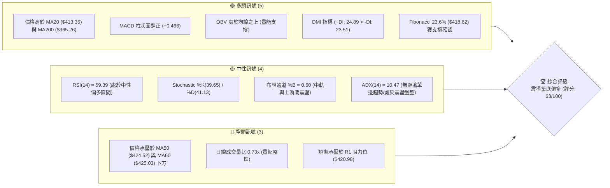
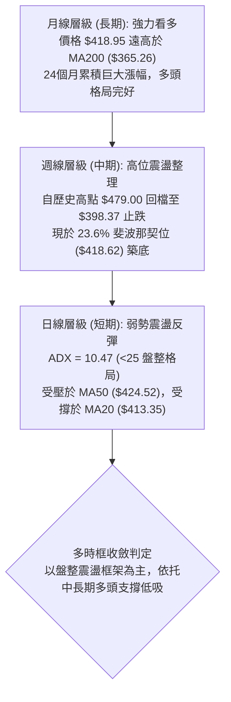
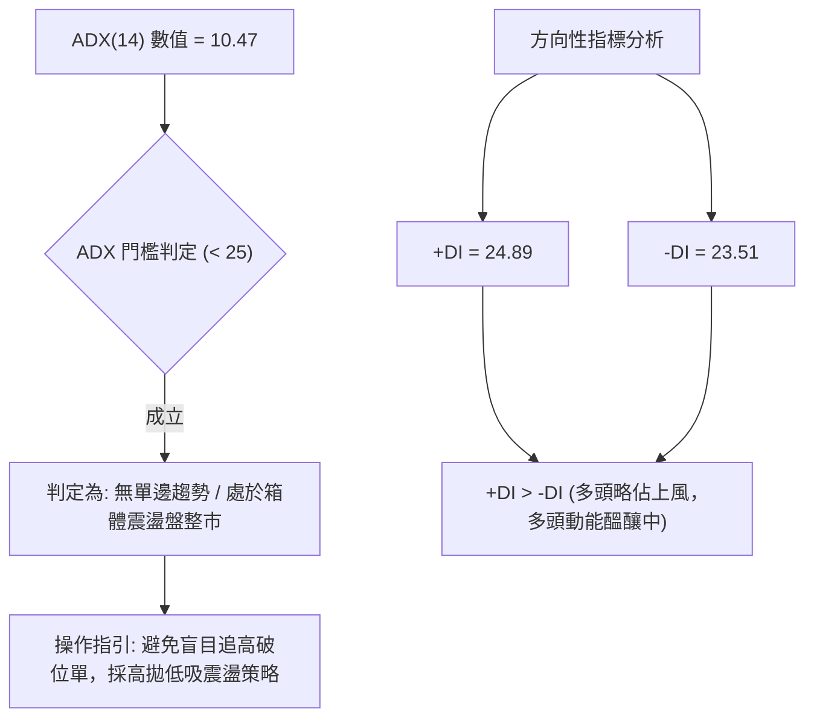
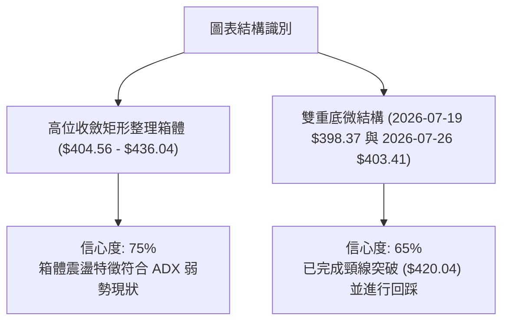
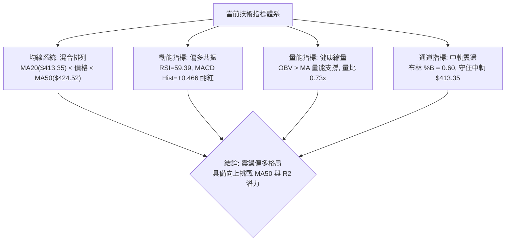
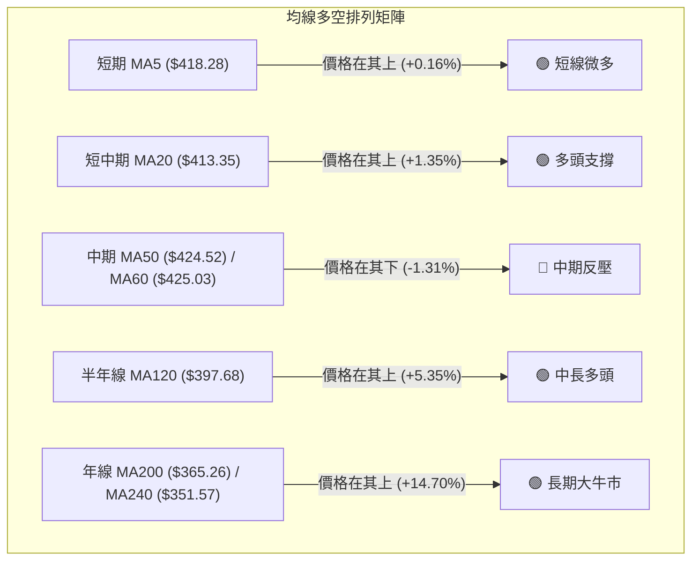
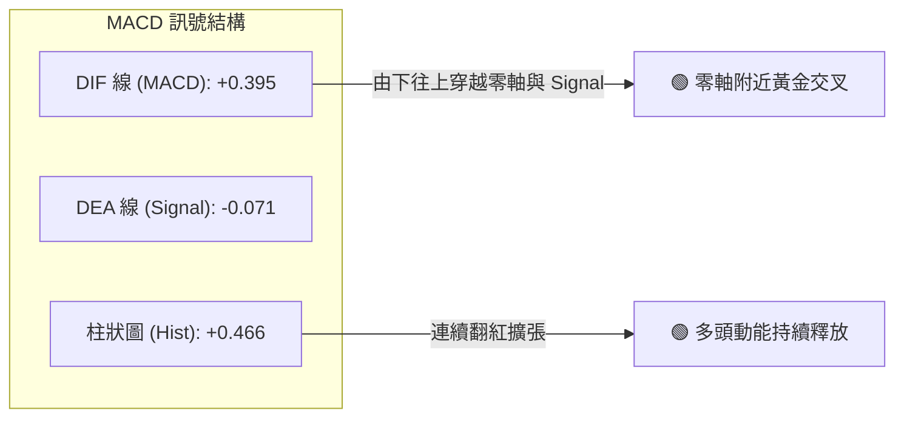
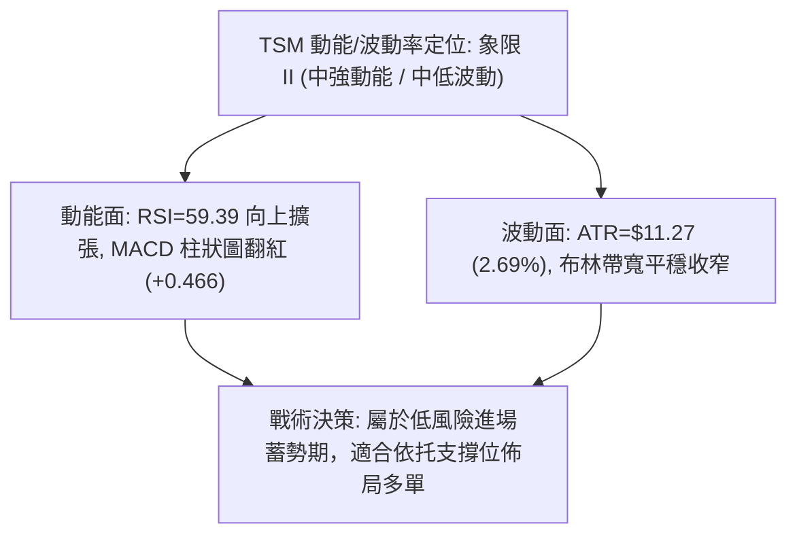
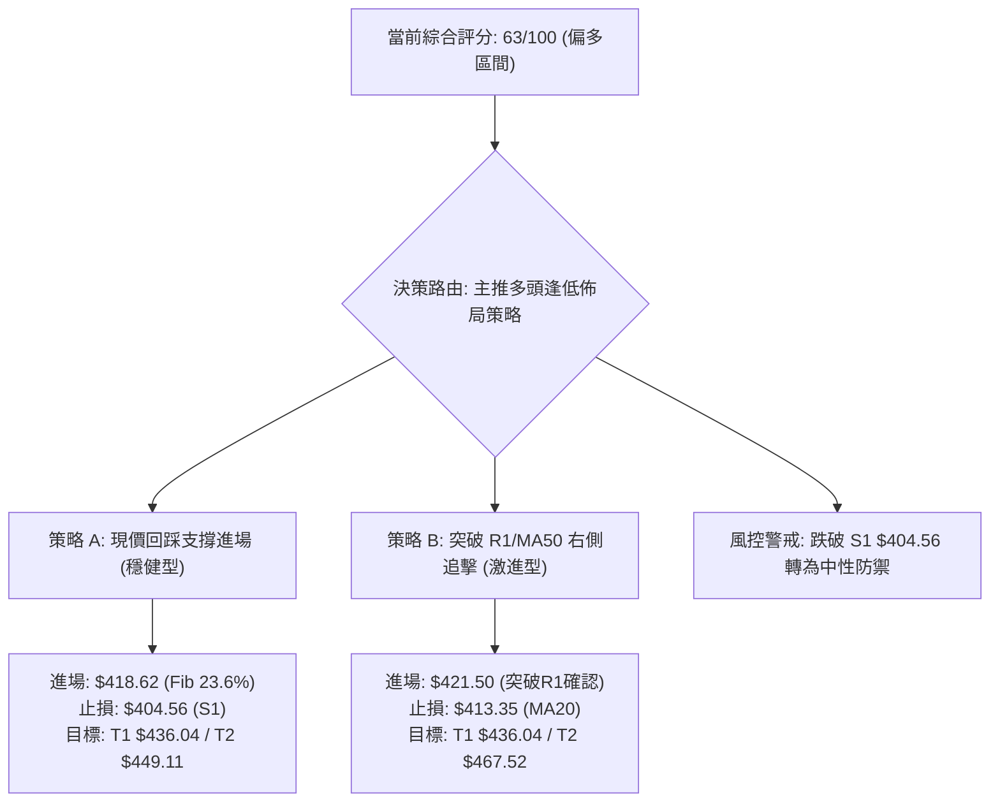
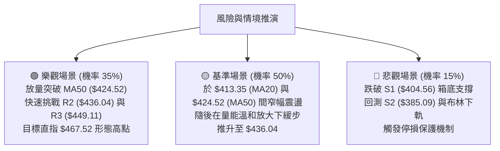

# TSM 技術分析報告

> **報告日期**：2026-08-22 ｜ **語言**：繁體中文 ｜ **數據來源**：Yahoo Finance ｜ **當前價格**：$418.95

---

## 目錄

| 章節 | 內容 |
|------|------|
| [1. 技術面概覽](#1-技術面概覽) | 訊號儀表板、核心指標、評分卡 |
| [2. 趨勢分析](#2-趨勢分析) | 多時框趨勢、長中短期走勢 |
| [3. 圖表形態分析](#3-圖表形態分析) | 形態識別、K線組合、目標價 |
| [4. 支撐與阻力](#4-支撐與阻力) | 關鍵價位、斐波那契回調 |
| [5. 技術指標深度解讀](#5-技術指標深度解讀) | MA/RSI/MACD/布林/成交量 |
| [6. 動能與波動率](#6-動能與波動率) | 動能評估、ATR、Beta |
| [7. 多時框架總結](#7-多時框架總結) | 時框架評分矩陣 |
| [8. 交易策略建議](#8-交易策略建議) | 多空策略、風險報酬比 |
| [9. 風險提示與監控](#9-風險提示與監控) | 監控指標、風險場景 |

---

## 1. 技術面概覽

### 🎯 技術訊號儀表板



### 📊 核心指標速覽表

| 指標類別 | 指標名稱 | 當前數值 | 訊號 | 解讀 |
|----------|----------|----------|------|------|
| **價格** | 當前價格 | $418.95 | 🟡 | 位於52週高低點區間 76.5% 位置，處於高位回檔後的震盪整固期 |
| **均線** | MA20 | $413.35 | 🟢 | 價格位於 MA20 之上（+1.35%），短線多頭具備防守支撐 |
| **均線** | MA50 | $424.52 | 🔴 | 價格低於 MA50（-1.31%），中期反彈面臨動態均線壓制 |
| **均線** | MA200 | $365.26 | 🟢 | 價格大幅高於 MA200（+14.70%），長期多頭牛市結構未變 |
| **動能** | RSI(14) | 59.39 | 🟡 | 位於 50-60 中性偏多區間，無超買超賣，具備向上推進空間 |
| **動能** | MACD | Hist: +0.466 | 🟢 | MACD 線(0.395) 穿越 Signal 線(-0.071)，發出多頭黃金交叉訊號 |
| **波動** | ATR(14) | $11.27 | 🟡 | 佔股價 2.69%，波動率處於溫和常態區間，有利於設定精確止損 |

### 🏆 技術評分卡

```
╔══════════════════════════════════════════════════════════════════╗
║                   技術評分卡 — TSM (2026-08-22)                   ║
╠══════════════════════════════════════════════════════════════════╣
║ 趨勢強度 (ADX=10.47)     ████░░░░░░░░░░░░░░░░  40/100  🟡 弱勢盤整 ║
║ 動能指標 (RSI/MACD)      █████████████░░░░░░░  68/100  🟢 偏多交叉 ║
║ 支撐穩定度 (Fib/S1)      ███████████████░░░░░  75/100  🟢 底部紮實 ║
║ 成交量配合 (OBV/量比)    ████████████░░░░░░░░  60/100  🟡 縮量蓄勢 ║
║ 形態完整度 (箱體整理)    █████████████░░░░░░░  65/100  🟢 震盪築底 ║
║ 均線排列 (混合排列)      ██████████████░░░░░░  70/100  🟢 長多短多 ║
╠══════════════════════════════════════════════════════════════════╣
║ 綜合評分                 █████████████░░░░░░░  63/100  🟢 區間偏多 ║
╚══════════════════════════════════════════════════════════════════╝
```

---

## 2. 趨勢分析

### 🌐 多時框趨勢分析



### 📈 長期趨勢 — 12個月走勢圖（Unicode）

```
TSM 月線走勢圖（過去12個月：2025-08 至 2026-08）
價格軸 ($)
$480 ┤                                                 ● (2026-06 $477.57 / 高點 $479.00)
$450 ┤                                                / \
$420 ┤                                  ●───────●    /   \     ● (2026-08 $418.95 現價)
$390 ┤                            ●    / (04/05) ╲  /     ● (2026-07 $404.25)
$360 ┤                       ●   / ╲  /           ╲/
$330 ┤                  ●   / ╲ /   ● (2026-03 $337.16)
$300 ┤         ●───●   / ╲ /   (02/372.65)
$270 ┤    ●   / (10/12)   ● (2025-11 $289.23)
$240 ┤   / ╲ /
$210 ┤  ● (2025-08 $228.34)
     └─────────────────────────────────────────────────────────────────────────────►
       08  09  10  11  12  01  02  03  04  05  06  07  08 (月份: 2025-08 → 2026-08)
```

**12個月走勢特徵分析表格**：

| 階段區間 | 時間週期 | 起始/結束收盤價 | 區間漲跌幅 | 核心特徵解讀 |
|----------|----------|----------------|------------|--------------|
| 第一階段：主升浪初段 | 2025-08 → 2025-10 | $228.34 → $298.08 | +30.54% | 突破 $250 整數關卡，成交量穩步放大，展開單邊上行 |
| 第二階段：高位蓄勢 | 2025-10 → 2025-12 | $298.08 → $302.33 | +1.43% | 於 $300 大關附近進行高位橫盤消化獲利籌碼 |
| 第三階段：二度主升 | 2025-12 → 2026-02 | $302.33 → $372.65 | +23.26% | 突破平台加速噴出，創下當時歷史新高 $372.65 |
| 第四階段：深幅洗盤 | 2026-02 → 2026-03 | $372.65 → $337.16 | -9.52% | 技術面獲利回吐，回測 120日均線尋求強支撐 |
| 第五階段：創高加速 | 2026-03 → 2026-06 | $337.16 → $477.57 | +41.64% | 多頭極致推升，觸及 52週歷史高點 $479.00 |
| 第六階段：健康回檔 | 2026-06 → 2026-08 | $477.57 → $418.95 | -12.27% | 於 7月探底 $398.37 後止跌回升，現於 $418 附近盤整 |

### 📊 中期趨勢（週線分析）

```
TSM 近期週線壓力與支撐架構示意圖
══════════════════════════════════════════════════════════════════
$479.00 ────────────────────────────────────────── 52W 歷史最高點
        ▲ 獲利回吐壓力區
$449.11 ------------------------------------------ 波段阻力 R3
$436.04 ------------------------------------------ 強阻力 R2 / 週線反彈高點
$424.52 ========================================== MA50 動態壓力線
$420.98 ------------------------------------------ 關鍵阻力 R1 (當前考驗中)
$418.95 ◄───【 當前收盤價位 $418.95 / Fib 23.6% $418.62 】
$413.35 ========================================== MA20 / 布林中軌支撐
$404.56 ------------------------------------------ 關鍵支撐 S1 (週線箱底)
$385.09 ------------------------------------------ 強支撐 S2 / 布林下軌
$365.26 ══════════════════════════════════════════ 長期牛熊分界線 MA200
══════════════════════════════════════════════════════════════════
```

### ⚡ 趨勢強度評估（ADX 解讀）



**ADX 趨勢強度對照解讀表**：

| ADX 數值區間 | 趨勢強度定義 | 當前狀態 (10.47) | 交易戰術應對 |
|--------------|--------------|------------------|--------------|
| **0 – 20** | **極弱趨勢 / 盤整震盪** | **✓ 當前所處區間** | **通道交易、網格交易、高拋低吸，嚴格設止損** |
| 20 – 25 | 趨勢初萌 / 方向不明 | — | 觀察均線與布林帶開口，準備順勢突破 |
| 25 – 40 | 明確強趨勢 | — | 順勢交易，回調均線加碼 |
| 40 – 100 | 極強單邊趨勢 / 警惕衰竭 | — | 緊跟趨勢，移動止盈保護利潤 |

---

## 3. 圖表形態分析

### 🔍 形態識別系統



**圖表形態量化評估表**：

| 形態名稱 | 信心度 | 判斷依據（引用數據） | 完成度 | 目標價（附精確計算式） |
|----------|--------|----------------------|--------|------------------------|
| **高位箱體整理** | **75%** | 價格在 S1 ($404.56) 與 R2 ($436.04) 之間進行寬幅震盪已達 8 週 | 85% | 向上突破 R2 後測算：頸線 $436.04 + (箱體高 $436.04 - 箱體底 $404.56) = **$467.52** |
| **短期雙底 (W底)** | **65%** | 兩次波段低點分別為 07-19 ($398.37) 與 07-26 ($403.41)，獲得 S1 支撐 | 80% | 頸線 $420.04 + (頸線 $420.04 - 低點 $398.37) = **$441.71** (貼近 BB上軌 $440.99) |
| **布林通道收口擠壓** | **70%** | BB 上軌 ($440.99) 與下軌 ($385.72) 逐步收窄，帶寬收斂 | 90% | 依通道上軌計算突破目標為 **$440.99**，若向下破位則為 **$385.72** |

### 🕯️ 重要K線形態分析

| 週度/月份 | 收盤價 | K線形態 | 形態深度解讀 | 訊號 |
|-----------|--------|---------|--------------|------|
| 2026-06-21 | $462.12 | 長陽衝高 | 逼近歷史天價 $479.00，多頭動能消耗過度，量能未顯著放大 | 🟡 警惕衰竭 |
| 2026-07-19 | $398.37 | 巨量長黑洗盤 | 週成交量爆出 91,498,900 股，探底跌破 $400 大關，形成恐慌拋售點 | 🟢 恐慌低點確立 |
| 2026-07-26 | $403.41 | 錘頭十字星 | RSI 探底至 27.9 嚴重超賣，下影線回測 $400 有守，空頭力竭 | 🟢 築底反轉訊號 |
| 2026-08-09 | $420.04 | 帶量突破長陽 | 週漲幅明確，MACD 柱狀圖由負翻正 (+2.429)，多頭奪回 MA20 主控權 | 🟢 強烈買進訊號 |
| 2026-08-16 | $426.35 | 衝高回落十字線 | 觸及 MA50 ($424.52) 與 R2 承壓回落，多空於 $425 附近激烈爭奪 | 🟡 短線受阻整固 |
| 2026-08-23 | $418.95 | 縮量窄幅孕線 | 回踩 Fibonacci 23.6% ($418.62) 與 MA20 ($413.35)，完成健康回踩 | 🟢 蓄勢再發訊號 |

### 📉 ASCII 走勢形態示意圖

```
TSM 週線「雙底回踩」與「箱體震盪」形態示意圖
價格 ($)
$436.04 ┼───────────────────────────────╭───────╮───────────── 箱體上頂 (R2)
        │                              │       │
$420.98 ┼───────────────╭───────────────╯       ╰──────●───── 頸線/R1 ($420.98)
        │               │                              (現價 $418.95 回踩頸線)
$413.35 ┼───────────────┼───────────────────────────── MA20 / 布林中軌支撐
        │               │
$404.56 ┼───────╮       │       ╭───────╮───────────── 箱體底部 (S1)
        │       │       │       │       │
$398.37 ┼───────╰───────╯───────╯       ╰───────────── 雙底低點 (07-19 / 07-26)
        └────────────────────────────────────────────────────────► 時間 (2026-07 → 2026-08)
```

### 🎯 形態目標價計算

1. **短期雙底向上測幅目標**：
   - 形態低點：$398.37
   - 形態頸線：$420.04
   - 形態垂直高度：$420.04 - $398.37 = $21.67
   - **測幅目標價 T1** = 頸線 $420.04 + $21.67 = **$441.71**（高度重合布林上軌 $440.99 與阻力位 R2 $436.04 上方區間）

2. **中期高位箱體向上突破測幅目標**：
   - 箱體支撐底：$404.56 (S1)
   - 箱體阻力頂：$436.04 (R2)
   - 箱體垂直高度：$436.04 - $404.56 = $31.48
   - **測幅目標價 T2** = 箱體頂 $436.04 + $31.48 = **$467.52**（逼近前期波段高點與 52W High $479.00）

---

## 4. 支撐與阻力

### 🗺️ 關鍵價位分布圖（Unicode）

```
TSM 價位結構分布圖（基準價格: $418.95）
═══════════════════════════════════════════════════════════════════════════
$479.00 ║████████████████████████████████║ 52週歷史最高點 / 0.0% Fib
$449.11 ║████████████████████████        ║ 強阻力 R3 (+7.20%)
$440.99 ║▓▓▓▓▓▓▓▓▓▓▓▓▓▓▓▓▓▓▓▓            ║ 布林通道上軌
$436.04 ║██████████████████████          ║ 關鍵阻力 R2 (+4.08%) / 箱體上頂
$424.52 ║────────────────────────────────║ MA50 動態均線壓力
$420.98 ║████████████████████████████    ║ 近端阻力 R1 (+0.49%) / 雙底頸線
$418.95 ╠════════════════════════════════╣ ◄──【 當前收盤價 ($418.95) 】
$418.62 ║────────────────────────────────║ 斐波那契 23.6% 回調關鍵支撐
$413.35 ║▓▓▓▓▓▓▓▓▓▓▓▓▓▓▓▓▓▓▓▓▓▓▓▓        ║ MA20 均線 / 布林中軌支撐
$404.56 ║████████████████████████████    ║ 近期關鍵支撐 S1 (-3.43%) / 箱底
$385.72 ║▓▓▓▓▓▓▓▓▓▓▓▓▓▓▓▓                ║ 布林通道下軌
$385.09 ║████████████████████████        ║ 強支撐 S2 (-8.08%) / 波段密集成交
$381.27 ║────────────────────────────────║ 斐波那契 38.2% 回調位
$372.72 ║██████████████████              ║ 深度防守支撐 S3 (-11.03%)
$365.26 ║════════════════════════════════║ 長期生命線 MA200
═══════════════════════════════════════════════════════════════════════════
```

### 🚧 阻力位分析表

| 阻力級別 | 具體價位 | 距離現價幅幅 | 形成技術依據 | 突破難度評級 | 戰略重要性 |
|----------|----------|--------------|--------------|--------------|------------|
| **R1** | **$420.98** | +0.49% | 近一年波段高點聚類、雙底頸線位置 | 🟡 中等 (需日成交量配合放大) | ★★★★☆ 短線多空樞紐 |
| **R2** | **$436.04** | +4.08% | 近期震盪箱體頂部、7月初反彈高點聚類 | 🔴 較高 (密集套牢籌碼區) | ★★★★★ 中期波段突破點 |
| **R3** | **$449.11** | +7.20% | 6月下旬回檔起跌點聚類、接近布林上軌上延 | 🔴 極高 (面臨強大解套拋壓) | ★★★★☆ 挑戰歷史新高跳板 |

### 🛡️ 支撐位分析表

| 支撐級別 | 具體價位 | 距離現價幅幅 | 形成技術依據 | 守住機率評估 | 戰略重要性 |
|----------|----------|--------------|--------------|--------------|------------|
| **S1** | **$404.56** | -3.43% | 近一年波段低點聚類、8月初回踩確認低點 | 🟢 80% (買盤承接力道強) | ★★★★★ 短期防守生命線 |
| **S2** | **$385.09** | -8.08% | 近一年波段低點聚類、布林下軌 ($385.72) 匯合 | 🟢 90% (強支撐重疊區) | ★★★★★ 中期波段防禦底線 |
| **S3** | **$372.72** | -11.03% | 2026年2月歷史前高轉換位、接近 MA200 ($365.26) | 🟢 95% (牛市結構極限回撤) | ★★★☆☆ 長期牛熊分水嶺 |

### 📐 斐波那契回調位分析

*以 52週極值區間：最低點 $223.16 → 最高點 $479.00（總波幅 $255.84）進行回調測算：*

| 回調比例 | 斐波那契價位 | 當前相對位置與技術意義解讀 |
|----------|--------------|----------------------------|
| **0.0% (52W High)** | **$479.00** | 歷史天花板，未來多頭終極目標 |
| **23.6%** | **$418.62** | **◄ 現價 $418.95 精確落於此線上（相差僅 $0.33），形成極強的多頭淺幅回調支撐** |
| **38.2%** | **$381.27** | 黃金回調強支撐，位於支撐位 S2 ($385.09) 下方，為中多底線 |
| **50.0%** | **$351.08** | 多空平衡分界點，重合 MA240 ($351.57) |
| **61.8%** | **$320.89** | 深度黃金分割防守位，2026年1月突破起漲點 |
| **78.6%** | **$277.91** | 強力回撤支撐，2025年9月平台 |
| **100.0% (52W Low)**| **$223.16** | 52週波段起點 |

**解讀結論**：現價 $418.95 成功回踩並守住 23.6% ($418.62) 斐波那契回調位。在強勢牛市回檔中，僅回撤 23.6% 即止跌盤整，代表潛在買盤極其強勁，屬於「強勢淺幅修正」形態。

---

## 5. 技術指標深度解讀

### 🎛️ 指標訊號總覽



### 📈 移動平均線排列分析



**移動平均線體系數據解讀**：
- **短週期均線（MA5/MA20）**：MA5 ($418.28) 與 MA20 ($413.35) 呈現多頭排列，且 MA20 走平翻揚，為股價在 $413-$418 提供堅實短線支撐。
- **中週期均線（MA50/MA60）**：MA50 ($424.52) 與 MA60 ($425.03) 匯聚於 $425 附近，呈現微幅下彎態勢，構成當前最直接的動態反壓區。
- **長週期均線（MA120/MA200/MA240）**：MA120 ($397.68)、MA200 ($365.26)、MA240 ($351.57) 呈現完美的發散多頭排列，且斜率向上，宣告中長期牛市基底堅不可摧。

### 📉 RSI(14) 分析

- **當前 RSI(14) 數值**：**59.39**
- **動能強度進度條**：
  ```
  超賣 (0)          中軸 (50)    當前 (59.39)      超買 (100)
  ├──────────────────┼────────────█──────────────┤
  ░░░░░░░░░░░░░░░░░░░█████████████████░░░░░░░░░░░░
  ```
- **區間評估**：RSI 處於 50–70 的「多頭主導擴張區」，脫離了 7月下旬的極度超賣區（當時 RSI 跌至 27.9），目前動能溫和回升，未觸及 70 以上超買警戒線，意味著向上反彈不具備即時過熱風險。
- **背離判斷**：
  - **日線/週線背離檢測**：2026-07-19 股價創下波段低點 $398.37 時 RSI 為 39.9，而在 2026-07-26 股價微幅回升至 $403.41 時 RSI 探底至 27.9，隨後在 8月股價反彈至 $420 時 RSI 迅速修復至 57.2 以上。當前技術數據顯示「**無頂背離現象**，且經歷 7月底部背離修復後動能重新走強」。

### 📊 MACD(12/26/9) 訊號解讀



- **MACD 數值**：MACD 線為 **0.395**，訊號線（Signal）為 **-0.071**，柱狀圖（Histogram）為 **+0.466**。
- **訊號解析**：MACD 線成功由負值區穿越訊號線形成「**低位黃金交叉**」，柱狀圖由 7月中旬的 -5.832 低谷全面翻正至 +0.466，顯示中期賣壓已徹底宣洩完畢，多方買盤重新掌控動能主導權。

### 📦 布林通道分析

```
TSM 日線布林通道結構示意圖
─────────────────────────────────────────────────────────────────
$440.99 ┬  ────────────────────────────────────── 布林通道上軌 (+5.26%)
        │
$424.52 ┼  - - - - - - - - - - - - - - - - - - - MA50 動態壓力線
        │
$418.95 ┼  ──────────────●─────────────────────── 當前價格 ($418.95, %B = 0.60)
        │
$413.35 ┼  ══════════════════════════════════════ 布林中軌 (MA20, +1.35%)
        │
$385.72 ┴  ────────────────────────────────────── 布林通道下軌 (-7.93%)
─────────────────────────────────────────────────────────────────
```

- **通道參數**：上軌 **$440.99**，中軌 **$413.35**，下軌 **$385.72**，通道帶寬為 $55.27 (13.19%)。
- **%B 指標解讀**：當前 **%B = 0.60**。股價位於中軌 ($413.35) 與上軌 ($440.99) 之間的多頭區域運作。自 7月下探下軌獲支撐後，目前在中軌上方維持強勢整理，通道呈現水平收口狀態，暗示蓄勢後將迎來方向性突破。

### 💹 成交量分析（量價配合度）

- **量能數據**：最新日成交量 **8,936,800 股**；20日均量 **12,168,775 股**；50日均量 **13,688,798 股**；量比為 **0.73x**。
- **量價關係解讀**：
  1. **縮量回踩**：當前股價在 $418-$420 阻力區前量比降至 0.73x，呈現典型的「上漲放量、回調縮量」的良性整理特徵，未見主力出貨的巨量長黑。
  2. **OBV 能量潮確認**：數據明確指出「**OBV > MA → 量能支撐上漲**」。能量潮指標領先走在均線之上，說明資金呈現持續淨流入，量價未產生背離，奠定向上攻堅的籌碼基礎。

---

## 6. 動能與波動率

### ⚡ 動能評估四象限

| 象限分區 | 動能強度 (RSI/MACD) | 波動率水準 (ATR/帶寬) | 當前判定 | 戰術策略含義 |
|----------|---------------------|-----------------------|----------|--------------|
| **象限 I** | 強動能 (RSI>60, MACD>0) | 低波動 (ATR<2.5%) | — | 最佳主升突破點，全力加碼 |
| **象限 II**| **中強動能 (RSI 59, MACD正)** | **中低波動 (ATR 2.69%)** | **✓ 當前狀態** | **高勝率蓄勢區，逢低建立多頭部位，等待突破** |
| **象限 III**| 強動能 (極端超買) | 高波動 (ATR>4.0%) | — | 高風險投機區，緊設移動止盈 |
| **象限 IV** | 弱動能 (MACD死叉) | 高波動 (放量殺跌) | — | 破位下行風險區，全面空倉觀望 |



### 📊 ATR 波動率分析

- **ATR(14) 數值**：**$11.27**（佔當前價格之 **2.69%**）。
- **波動特性解讀**：日均波幅約 $11.3，顯示市場情緒自 6-7 月的大幅波動中回歸理性與平穩。
- **止損距離量化指引**：
  - **短線交易止損距離（1.0 × ATR）**：$11.27 ➔ 若以 $418.95 進場，短線止損點設於 $407.68（高於 S1 $404.56）。
  - **波段交易止損距離（1.5 × ATR）**：$16.91 ➔ 波段進場止損點設於 $402.04（略低於 S1 $404.56，有效避開洗盤掃單）。
  - **防守性止損距離（2.0 × ATR）**：$22.54 ➔ 設於 $396.41（防守 7月波段極端低點 $398.37）。

### 📐 Beta 與市場相關性

- **Beta 係數**：**1.258**。
- **市場特徵分析**：TSM 具有高於標普500指數 25.8% 的波動敏感度，屬於標準的高彈性半導體龍頭股。在半導體產業上升週期中具備顯著的超額報酬（Alpha）潛力；在市場震盪期則呈現放大震盪幅度特徵，需透過精準價位控制下檔風險。

---

## 7. 多時框架總結

### 📋 時框架評分表

| 時框架 | 趨勢方向 | 動能狀態 | 均線系統 | 形態結構 | 綜合評分 | 操作指引建議 |
|--------|----------|----------|----------|----------|----------|--------------|
| **長期 (月線)** | 🟢 強烈看多 | 🟢 處於強勢區 | 🟢 MA200發散向上 | 🟢 沿超大上升通道上行 | **88/100** | 長線堅定持有，無轉空跡象 |
| **中期 (週線)** | 🟢 震盪築底 | 🟢 MACD金叉初期 | 🟡 MA50附近整理 | 🟢 雙底確認、守住Fib 23.6% | **70/100** | 波段低吸，逢回踩支撐加碼 |
| **短期 (日線)** | 🟡 區間盤整 | 🟢 MACD翻紅/RSI 59| 🟡 MA20上/MA50下 | 🟡 矩形整理箱體內 | **62/100** | 箱體操作，突破前不盲目追高 |

### 🔲 綜合訊號矩陣

| 技術維度 | 短期（1-5日） | 中期（1-4週） | 長期（1-6個月） | 跨週期一致性判定 |
|----------|---------------|---------------|-----------------|------------------|
| **均線信號** | 🟢 MA20 支撐有效 | 🟡 承壓於 MA50 | 🟢 遠高於 MA200 牛熊線 | 🟢 中長期多頭排列穩固 |
| **動能信號** | 🟢 RSI 59.39 偏多 | 🟢 MACD 柱狀圖翻正 | 🟢 多頭週期運作中 | 🟢 動能共振向上 |
| **形態信號** | 🟡 承壓 R1 ($420.98) | 🟢 雙底向上測幅有效 | 🟢 大週期上升台階 | 🟢 底部支撐紮實 |
| **量能信號** | 🟡 縮量整理 (0.73x) | 🟢 週線底部爆量換手 | 🟢 OBV 處於均線之上 | 🟢 籌碼沉澱良好 |

### ⚖️ 多時框收斂結論

> **依嚴格規則 14 進行多時框收斂收斂判定**：
> 1. **行情性質判定**：當前日線 ADX(14) = **10.47**，顯著低於 25 臨界線，技術面定性為「**標準盤整震盪行情**」。
> 2. **主導與次級時框協同**：在盤整行情中，交易邊界由日線布林通道（$385.72 - $440.99）與關鍵支撐阻力 S1/R2 主導；同時中長期週線與月線均線（MA200 = $365.26）維持強大多頭基底。
> 3. **唯一方向性結論**：**【 區間震盪偏多（Bullish Consolidation）】**。
>    - **戰術取捨**：不因短期受壓於 MA50 而盲目看空；亦不因長期牛市而盲目市價追高。交易核心聚焦於「**依托 Fibonacci 23.6% ($418.62) 及 S1 ($404.56) 支撐逢低分批建立多頭部位，向上以 R2 ($436.04) 及布林上軌 ($440.99) 為第一波段目標**」。

---

## 8. 交易策略建議

### 🗺️ 策略決策流程圖



### 🧭 策略路由

**當前主策略方向 = 【 多頭策略（依托支撐逢低做多）】（依技術評分卡 63/100 判定）**

*依規則 18，綜合評分 63 分（≥60），全面主推多頭操作策略，空頭僅列為關鍵反轉風險風控點。*

### 🎯 價格情境階梯（Price Scenarios）

*本階梯價位嚴格引用第 4 章波段高低點與斐波那契計算值：*

| 觸發條件 | 第一目標 (T1) | 第二目標 (T2) | 延伸極限 (T3) | 情境技術含義 |
|----------|---------------|---------------|---------------|--------------|
| **強勢突破 R1 ($420.98)** | **R2 ($436.04)** | **R3 ($449.11)** | **52W High ($479.00)** | 短線震盪結束，重啟中期多頭主升浪 |
| **維持於現價區間震盪** | **MA50 ($424.52)** | **R1 ($420.98)** | **Fib 23.6% ($418.62)** | 消化均線反壓，維持 $413-$425 窄幅洗盤 |
| **有效跌破 S1 ($404.56)** | **S2 ($385.09)** | **Fib 38.2% ($381.27)** | **S3 ($372.72)** | 雙底頸線破位，回測布林下軌與強支撐 |

### 📊 情境機率分佈

```
情境機率分佈視覺化
繼續上行 / 反彈突破 (60%) ▓▓▓▓▓▓▓▓▓▓▓▓▓▓▓▓▓▓▓▓▓▓▓▓░░░░░░░░░░░░░░░░
區間震盪蓄勢        (25%) ▓▓▓▓▓▓▓▓▓▓░░░░░░░░░░░░░░░░░░░░░░░░░░░░░
破位回落再探底      (15%) ▓▓▓▓▓▓░░░░░░░░░░░░░░░░░░░░░░░░░░░░░░░░░
```

| 發展情境 | 機率 | 主要技術與量化依據 |
|----------|------|--------------------|
| **情境一：震盪上行突破** | **60%** | MACD 柱狀圖由負翻正 (+0.466)、RSI=59.39 處於多頭區、OBV 量能支撐、守住 Fib 23.6% |
| **情境二：箱體區間震盪** | **25%** | ADX=10.47 顯示無單邊趨勢、布林帶寬收口、成交量萎縮至 0.73x 均量 |
| **情境三：下破支撐深探** | **15%** | MA50 ($424.52) 形成強反壓，若大盤系統性風險引發跌破 MA20 ($413.35) |

### 🟢 主策略詳情（多頭佈局）

| 策略要素 | 策略 A：左側/回踩支撐佈局（穩健型） | 策略 B：右側/突破 R1 追擊（動能型） |
|----------|-------------------------------------|-------------------------------------|
| **策略名稱** | 斐波那契支撐逢低吸納策略 | 頸線放量突破順勢跟進策略 |
| **進場條件** | 股價回踩 Fib 23.6% 或於現價站穩 | 日K線收盤放量突破 R1 ($420.98) |
| **進場價格** | **$418.62 – $418.95** (現價區間) | **$421.50** (突破確認點) |
| **第一目標價 (T1)** | **$436.04** (阻力位 R2 / 箱體頂) | **$436.04** (阻力位 R2) |
| **第二目標價 (T2)** | **$449.11** (阻力位 R3 / 波段高點) | **$467.52** (雙底向上測幅目標) |
| **止損價格** | **$404.56** (關鍵支撐位 S1) | **$413.35** (布林中軌 / MA20) |
| **風險空間** | $14.39 (3.43%) | $8.15 (1.93%) |
| **報酬空間 (T2)** | $30.16 (7.20%) | $46.02 (10.92%) |
| **風險報酬比 (R:R)**| **1 : 2.10** | **1 : 5.65** |
| **成功機率估計** | **65%** | **60%** |
| **建議配置倉位** | **20% - 25%** | **15% - 20%** |

### 🔴 反向風險觸發點（對沖提示）

- **多頭反轉預警點**：若日K線收盤價**實體跌破 $404.56 (S1)**，即宣告 7-8 月構築的雙底形態失效，且跌破震盪箱底。
- **對沖應對措施**：
  1. 多頭部位應無條件執行停損或減倉 70% 以上。
  2. 激進交易者可於 $404.00 建立反向空頭避險部位，目標下看 S2 ($385.09) 及布林下軌 ($385.72)，止損設於 $413.35 (MA20)。

### ⭐ 整體訊號強度評星

```
╔══════════════════════════════════════════════════╗
║ 做多訊號強度：★★★★☆  (4.0/5星) — 支撐確立，指標翻多║
║ 做空訊號強度：★★☆☆☆  (2.0/5星) — 承壓均線，空間有限║
║ 整體可信度：  ★★★★☆  (4.2/5星) — 數據完備，多時收斂║
╚══════════════════════════════════════════════════╝
```

---

## 9. 風險提示與監控

### ✅ 關鍵監控指標 Checklist

```
╔══════════════════════════════════════════════════════════════════╗
║                     每日/每週技術面監控清單                      ║
╠══════════════════════════════════════════════════════════════════╣
║ [ ] 價位監控：日收盤價是否有效站上 R1 ($420.98) 與 MA50 ($424.52) ║
║ [ ] 支撐防守：盤中最低價是否守住 Fib 23.6% ($418.62) 與 S1 ($404.56)║
║ [ ] 量能指標：突破 R1 時成交量是否回升至 20日均量 (12,168,775股) ║
║ [ ] 動能指標：MACD Histogram 是否持續擴張維持在 +0.400 之上      ║
║ [ ] 趨勢指標：ADX(14) 是否由 10.47 向上攀升突破 20，宣告單邊開啟  ║
║ [ ] 通道指標：布林通道上下軌是否由收口轉為向上開口發散           ║
╚══════════════════════════════════════════════════════════════════╝
```

### ⚠️ 風險場景分析



### 🛡️ 風險管理重要提醒

1. **嚴格執行價格止損紀律**：當前價位接近短期樞紐，絕不可抱持僥倖心理抗單。若跌破關鍵防守點 S1 ($404.56)，必須無條件執行停損。
2. **波動率與倉位管理**：鑑於 TSM 之 Beta 為 1.258，日均波幅 ATR 達 $11.27，單筆交易之風險暴露資金（進場價與止損價差 × 股數）不應超過總投資帳戶淨值的 **1.5% - 2.0%**。
3. **避免追高與等待確認**：ADX 數值 10.47 警示市場處於盤整市，在未見帶量長陽突破 R1 ($420.98) 之前，應以逢回踩支撐位（$418.62 / $413.35）低吸為主，切忌於壓力線 $424.52 附近追高。

---

## 📋 報告總結

```
╔══════════════════════════════════════════════════════════════════╗
║                     TSM 技術分析報告總結                         ║
╠══════════════════════════════════════════════════════════════════╣
║ 報告日期：2026-08-22                                             ║
║ 當前價格：$418.95                                                ║
║ 分析評級：🟢 區間偏多 / 蓄勢待發 (綜合評分: 63/100)               ║
║                                                                  ║
║ 關鍵結論：                                                       ║
║ ├─ 長期趨勢：🟢 強烈多頭 (價格遠高於 MA200 $365.26，長多無虞)    ║
║ ├─ 中期趨勢：🟢 雙底確立 (守穩 Fib 23.6% $418.62，MACD黃金交叉)  ║
║ ├─ 短期趨勢：🟡 震盪整理 (ADX=10.47，承壓 MA50 $424.52 待突破)  ║
║ ├─ 關鍵支撐：S1: $404.56 ｜ S2: $385.09 ｜ S3: $372.72           ║
║ ├─ 關鍵阻力：R1: $420.98 ｜ R2: $436.04 ｜ R3: $449.11           ║
║ └─ 分析師共識：Strong Buy (目標均價: $554.45 / 最高: $700.00)     ║
║                                                                  ║
║ 最優策略組合：                                                   ║
║ 1. 🥇 最佳機會 (策略 A)：現價 $418.95 / $418.62 回踩低吸，        ║
║    止損 $404.56，第一目標 $436.04，第二目標 $449.11 (風報比 1:2.1) ║
║ 2. 🥈 次選機會 (策略 B)：突破 R1 $421.50 右側追擊，               ║
║    止損 $413.35，第一目標 $436.04，第二目標 $467.52 (風報比 1:5.6) ║
║ 3. 🥉 保守選擇：等待股價回測 MA20 ($413.35) 企穩後再行分批介入。   ║
╚══════════════════════════════════════════════════════════════════╝
```

---

> ⚠️ **免責聲明**：本報告為技術分析研究，所有數據、圖表及價位估算均基於歷史價格與量化模型計算。本報告**僅供研究與學術參考**，**不構成任何形式的投資買賣建議**。金融市場具有高度風險，投資人應獨立思考並自負盈虧。

---

*報告生成時間：2026-08-22 ｜ 數據來源：Yahoo Finance ｜ 分析框架：多時框量化技術分析*