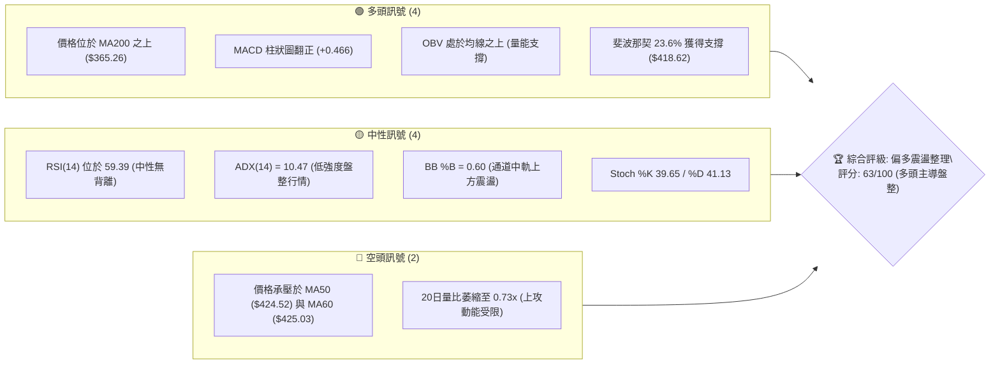
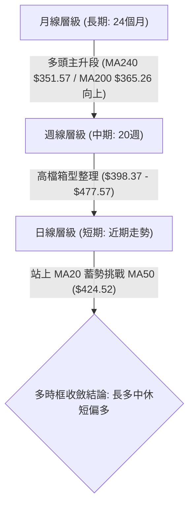
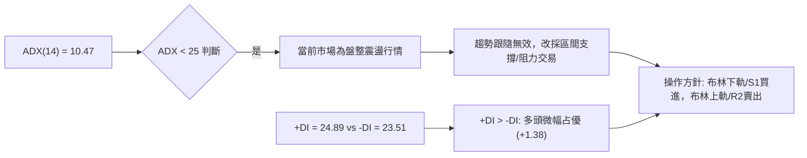
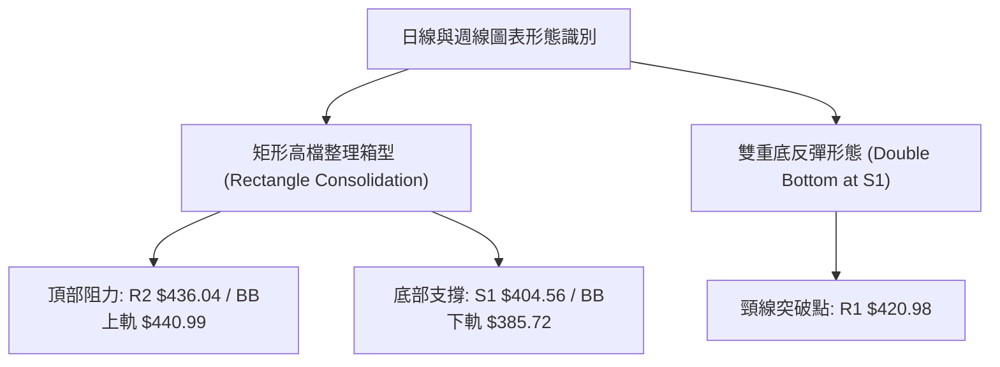
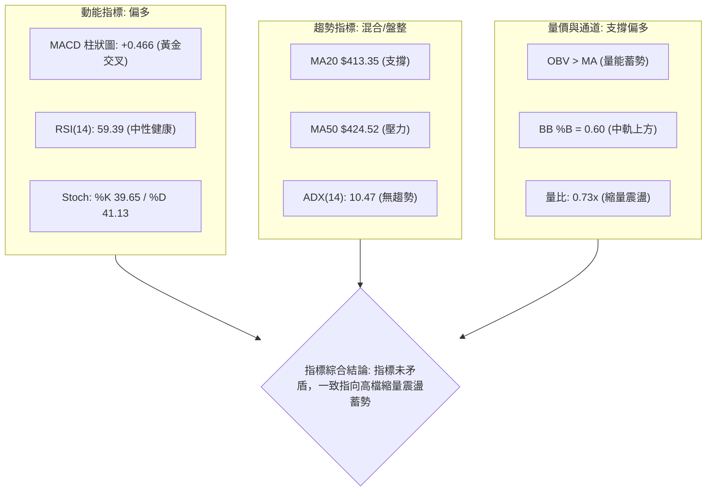
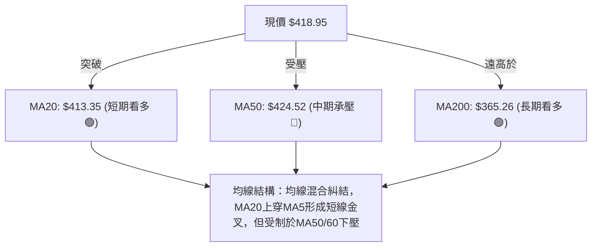
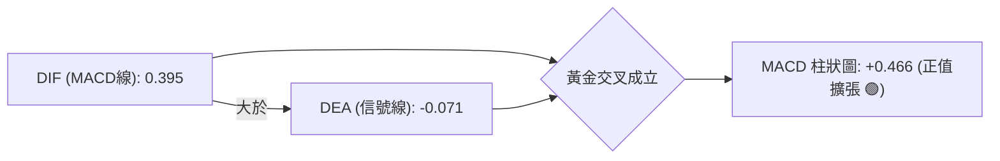
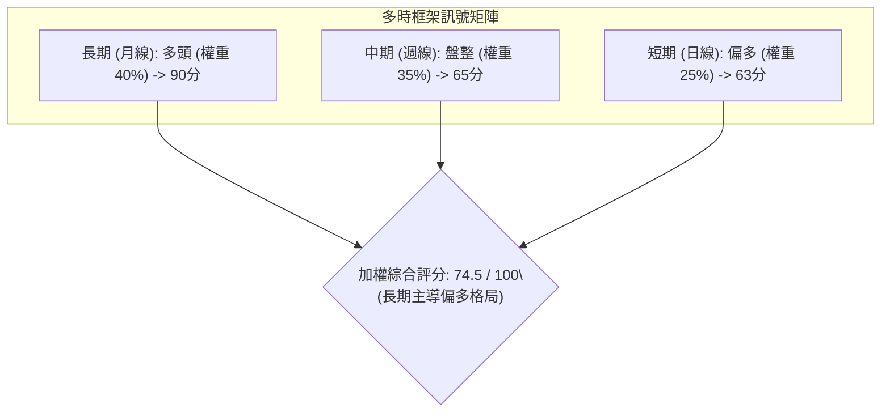
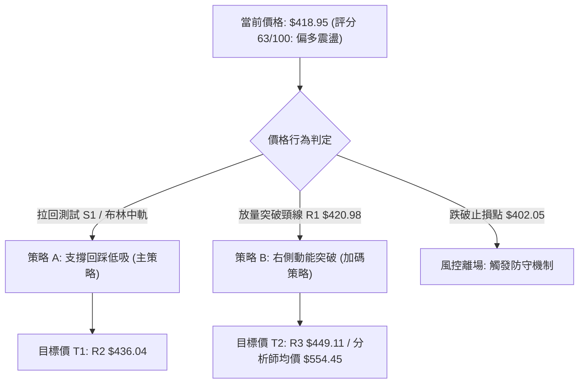
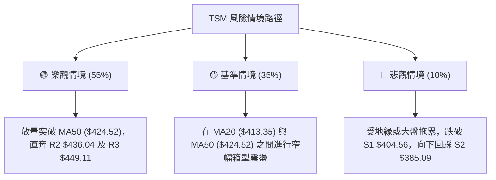

# TSM 技術分析報告

> **報告日期**：2026-08-23 ｜ **語言**：繁體中文 ｜ **數據來源**：Yahoo Finance ｜ **當前價格**：$418.95

---

## 目錄

| 章節 | 內容 |
|------|------|
| [1. 技術面概覽](#1-技術面概覽) | 訊號儀表板、核心指標、評分卡 |
| [2. 趨勢分析](#2-趨勢分析) | 多時框趨勢、長中短期走勢、ADX解讀 |
| [3. 圖表形態分析](#3-圖表形態分析) | 形態識別、信心度、K線組合 |
| [4. 支撐與阻力](#4-支撐與阻力) | 關鍵價位、斐波那契回調結構 |
| [5. 技術指標深度解讀](#5-技術指標深度解讀) | MA/RSI/MACD/布林/成交量 |
| [6. 動能與波動率](#6-動能與波動率) | 動能象限、ATR、Beta係數 |
| [7. 多時框架總結](#7-多時框架總結) | 時框架矩陣、多時框收斂結論 |
| [8. 交易策略建議](#8-交易策略建議) | 策略路由、主策略、風報比 |
| [9. 風險提示與監控](#9-風險提示與監控) | 監控指標、風險情境、總結 |

---

## 1. 技術面概覽

### 🎯 技術訊號儀表板



### 📊 核心指標速覽表

| 指標類別 | 指標名稱 | 當前數值 | 訊號 | 解讀 |
|----------|----------|----------|------|------|
| **價格** | 當前價格 | $418.95 | 🟢 | 位於52週區間76.5%分位，穩固於歷史高位區間 |
| **均線** | MA20 | $413.35 | 🟢 | 價格在MA20上方（+1.35%），短線具備防守支撐 |
| **均線** | MA50 | $424.52 | 🔴 | 價格在MA50下方（-1.31%），面臨中期下壓阻力 |
| **均線** | MA200 | $365.26 | 🟢 | 遠高於長期多空分水嶺（+14.70%），長期多頭架構完好 |
| **動能** | RSI(14) | 59.39 | 🟡 | 中性健康區間，無超買或超賣現象，無明顯背離 |
| **動能** | MACD (12,26,9) | 柱狀圖 +0.466 | 🟢 | 快線(0.395)穿越慢線(-0.071)，柱狀圖黃金交叉翻正 |
| **波動** | ATR(14) | $11.27 (2.69%) | 🟡 | 波動率處於正常水平，為盤整區間提供止損依據 |

### 🏆 技術評分卡

```
╔══════════════════════════════════════════════════════════════╗
║              技術評分卡 — TSM (2026-08-23)                  ║
╠══════════════════════════════════════════════════════════════╣
║ 趨勢強度 (ADX=10.47)    ████░░░░░░░░░░░░░░░░  25/100  🟡 弱勢盤整 ║
║ 動能指標 (MACD/RSI)     ██████████████░░░░░░  70/100  🟢 動能轉強 ║
║ 支撐穩定度 (Fib 23.6%)  ████████████████░░░░  80/100  🟢 底部扎實 ║
║ 成交量配合 (OBV/Volume) ██████████░░░░░░░░░░  50/100  🟡 量能略縮 ║
║ 形態完整度 (箱型整理)   ██████████████░░░░░░  70/100  🟢 結構清晰 ║
║ 均線排列 (混合排列)     ████████████░░░░░░░░  60/100  🟡 均線糾結 ║
╠══════════════════════════════════════════════════════════════╣
║ 綜合評分                █████████████░░░░░░░  63/100  偏多震盪   ║
╚══════════════════════════════════════════════════════════════╝
```

---

## 2. 趨勢分析

### 🌐 多時框趨勢分析



### 📈 長期趨勢 — 12個月走勢圖（Unicode）

```
TSM 月線走勢圖（2025-08 至 2026-08）
價格 ($)
$480 ┤                                                 ● 477.57 (2026-06 高點)
$440 ┤                                           ● 417.47  
$400 ┤                                     ● 395.13    ● 404.25   ● 418.95 (現價)
$360 ┤                               ● 372.65
$320 ┤                         ● 328.86    ● 337.16
$280 ┤             ● 277.11  ● 298.08  ● 289.23  ● 302.33
$240 ┤ ● 228.34
     └───────────────────────────────────────────────────────────────────────────
        08-25  09-25  10-25  11-25  12-25  01-26  02-26  03-26  04-26  05-26  06-26  07-26  08-26
```

#### 走勢特徵分析表格

| 階段區間 | 時間跨度 | 起訖收盤價 | 漲跌幅 | 結構特徵與量能解析 |
|----------|----------|------------|--------|--------------------|
| **第 1 階段：主升推升** | 2025-08 至 2026-02 | $228.34 → $372.65 | +63.20% | 階梯式推升，單邊強勢突破歷史高點 |
| **第 2 階段：急漲衝頂** | 2026-03 至 2026-06 | $337.16 → $477.57 | +41.64% | 創下 52 週高點 $479.00，動能達到極致 |
| **第 3 階段：高檔消化** | 2026-07 至 2026-08 | $477.57 → $418.95 | -12.27% | 快速回踩 23.6% 斐波那契位 ($418.62)，重回 MA20 上方 |

### 📊 中期趨勢（週線分析）

```
近 8 週價格與均線支撐壓力示意圖：
價格
$440.00 ┤────── [R1: $420.98 / MA50: $424.52 阻力帶] ─────── (承壓區間)
$430.00 ┤                   ● 426.35
$420.00 ┤        ● 420.04               ● 418.95 (現價) ◄─ 站穩 Fib 23.6% ($418.62)
$410.00 ┤   ● 404.25
$400.00 ┤─────────────────────────── [S1: $404.56 / MA20: $413.35 支撐帶]
$390.00 ┤● 398.37 (波段低點探底完成)
```

中期週線在歷經 2026-07-19 的低點 $398.37 探底後，連續收出陽線反彈，MACD 週柱狀圖由 -5.832 快速收斂至 +0.466，確認中期回調已在 $400.00 大關及 S1 ($404.56) 獲得強力承接。

### ⚡ 趨勢強度評估（ADX 解讀）



| 指標變數 | 當前數值 | 參考標準 | 結論與交易意義 |
|----------|----------|----------|----------------|
| **ADX(14)** | **10.47** | < 20 (極弱趨勢 / 盤整) | 趨勢動能處於極低水平，無單邊大行情，禁止追價，適用箱型交易 |
| **+DI** | **24.89** | > -DI 為多方 | 多方力量略微超越空方，多頭擁有控盤主動權 |
| **-DI** | **23.51** | < +DI 處於劣勢 | 空方拋壓趨緩，但尚未完全退卻 |

---

## 3. 圖表形態分析

### 🔍 形態識別系統



#### 形態識別信心度與目標價評估

| 形態名稱 | 信心度 | 判斷依據（引用數據） | 完成度 | 目標價（附計算式） |
|----------|--------|----------------------|--------|--------------------|
| **雙重底反彈 (W-Bottom)** | **75%** | 兩次下探低點：2026-07-19 收 $398.37、2026-07-26 收 $403.41（均在 S1 $404.56 附近築底），隨後反彈站上 MA20 ($413.35) | 85% | 頸線 R1 ($420.98) + 形態高度 ($420.98 - $398.37 = $22.61) = **$443.59** (對應 BB 上軌 $440.99 / R3 $449.11 區間) |
| **高檔箱型整理 (Box Range)** | **80%** | 價格在 $398.37 至 $434.16 區間震盪超過 8 週，ADX 10.47 確認無方向性突破 | 90% | 箱頂突破目標：箱頂 $436.04 + 箱高 ($436.04 - $404.56 = $31.48) = **$467.52** |
| **頭肩底形態 (H&S Bottom)** | **30%** | 數據中未偵測到標準左右肩對稱結構 | 0% | 訊號不足，僅做指標型與箱型解讀，不預設此形態 |

### 🕯️ 重要K線形態分析

| 月份/週別 | 收盤價 | K線形態 | 解讀 | 訊號 |
|-----------|--------|---------|------|------|
| **2026-06 (月線)** | $477.57 | 長上影大陽線 | 創 52 週新高 $479.00 後遇獲利了結賣壓，留下高檔阻力信號 | 🟡 警示 |
| **2026-07 (月線)** | $404.25 | 長陰下挫回踩 | 單月回撤 -15.35%，在 S1 ($404.56) 處精準止跌收出下影線 | 🟡 測底 |
| **2026-08-09 (週線)** | $420.04 | 大陽反包長紅 | 突破短期均線糾結區，週 MACD 柱翻正 (+2.429)，確立反彈 | 🟢 看多 |
| **2026-08-16 (週線)** | $426.35 | 陽線衝高回落 | 觸及 MA50 ($424.52) 與 R1 上方，量能 45.5M 縮小，出現上影線 | 🟡 蓄勢 |
| **2026-08-23 (週線)** | $418.95 | 小陰字星十字震盪 | 回踩 Fib 23.6% ($418.62) 確認支撐，均線於 $418-$421 密集糾結 | 🟢 守成 |

### 📉 ASCII 走勢形態示意圖

```
短期雙底 (W-Bottom) 與頸線突破示意圖：
價格 ($)
$440.00 ┤                                  [目標價: $443.59]
$430.00 ┤                     ● 426.35
$420.00 ┤────── 頸線 R1: $420.98 ───────────────● 418.95 (現價測試頸線)
$410.00 ┤                  ▲              ▲
$400.00 ┤         ● 398.37 │     ● 403.41 │   [S1: $404.56 雙底基底]
$390.00 ┤        (底 1)   │    (底 2)   │
        └─────────────────┴──────────────┴────────────────────────
                         07-19          07-26
```

---

## 4. 支撐與阻力

### 🗺️ 關鍵價位分布圖（Unicode）

```
╔══════════════════════════════════════════════════════════════╗
║              TSM 關鍵價位結構分布圖                          ║
╠══════════════════════════════════════════════════════════════╣
║ $479.00 ║██████████████████████████████║ 52週歷史高點 (0.0% Fib) ║
║ $449.11 ║██████████████████████        ║ 強阻力 R3 (波段高點聚類) ║
║ $440.99 ║▓▓▓▓▓▓▓▓▓▓▓▓▓▓▓▓▓▓▓▓          ║ 布林通道上軌            ║
║ $436.04 ║████████████████              ║ 阻力 R2 (箱型頂部)     ║
║ $424.52 ║──────────────────────────────║ MA50 均線下壓阻力帶     ║
║ $420.98 ║██████████                    ║ 關鍵阻力 R1 (頸線壓力) ║
╠═════════╬══════════════════════════════╬══════════════════════╣
║ $418.95 ╠══════════════════════════════╣ ◄ 當前價格 ($418.95) ║
╠═════════╬══════════════════════════════╬══════════════════════╣
║ $418.62 ║▓▓▓▓▓▓▓▓▓▓▓▓▓▓▓▓▓▓▓▓▓▓▓▓▓▓▓▓▓▓║ 斐波那契 23.6% 關鍵支撐 ║
║ $413.35 ║──────────────────────────────║ 布林中軌 / MA20 支撐   ║
║ $404.56 ║████████████████████████      ║ 近期強支撐 S1 (雙底底部)║
║ $385.09 ║████████████████████████████  ║ 強支撐 S2 / 布林下軌   ║
║ $372.72 ║██████████████████████████████║ 極強支撐 S3 (波段起漲點)║
║ $365.26 ║──────────────────────────────║ 長期生命線 MA200       ║
╚══════════════════════════════════════════════════════════════╝
```

### 🚧 阻力位分析表

| 阻力級別 | 精確價位 | 形成原因（引用數據） | 突破難度 | 重要性 |
|----------|----------|----------------------|----------|--------|
| **R1** | **$420.98** | 近一年波段高點聚類，與 MA10 ($421.79) 形成共振壓制區 | 🟡 中等 (需日成交量突破 12M) | ★★★☆☆ |
| **R2** | **$436.04** | 近期週線高點密集區 (2026-07-05 收 $434.16)，箱型整理頂部 | 🔴 較高 (空頭密集防守區) | ★★★★☆ |
| **R3** | **$449.11** | 波段高點聚類，接近布林上軌 ($440.99) 上方之極限超買區 | 🔴 極高 (需強大催化劑) | ★★★★★ |

### 🛡️ 支撐位分析表

| 支撐級別 | 精確價位 | 形成原因（引用數據） | 守住機率 | 重要性 |
|----------|----------|----------------------|----------|--------|
| **S1** | **$404.56** | 近一年波段低點聚類，2026-07-26 收盤價 $403.41 與 2026-08-02 收盤價 $404.25 雙重確認 | 🟢 85% (短期核心防線) | ★★★★☆ |
| **S2** | **$385.09** | 近一年波段低點聚類，與布林下軌 ($385.72) 及 Fib 38.2% ($381.27) 形成黃金共振支撐帶 | 🟢 95% (強大多頭防禦) | ★★★★★ |
| **S3** | **$372.72** | 波段低點聚類，與 MA200 ($365.26) 構成長期牛熊轉換終極支撐區 | 🟢 99% (長線買盤防線) | ★★★★★ |

### 📐 斐波那契回調位分析

依據 52 週極值區間（低點 **$223.16** → 高點 **$479.00**，全波段跨度 **$255.84**）精確計算：

```
0.0%  (52W High)  ─── $479.00  ──────────────────────────────────
                               ▲
23.6% 回調位      ─── $418.62  ◄─── [現價 $418.95 精準落於 23.6% 關鍵支撐線上]
                               ▼
38.2% 回調位      ─── $381.27  ──────────────────────────────────
50.0% 回調位      ─── $351.08  ── (與 MA240 $351.57 重合)
61.8% 黃金分割    ─── $320.89  ──────────────────────────────────
78.6% 深次回調    ─── $277.91  ──────────────────────────────────
100.0%(52W Low)   ─── $223.16  ──────────────────────────────────
```

- **位置解讀**：現價 **$418.95** 恰好站在 **23.6% 回調位 ($418.62)** 上方 +$0.33（+0.08%），代表自 $479.00 回落以來的修正屬於**淺度強勢回調**。只要 23.6% 未被有效跌破，整體超長期多頭趨勢完全未受破壞。

---

## 5. 技術指標深度解讀

### 🎛️ 指標訊號總覽



### 📈 移動平均線排列分析



| 均線名稱 | 當前價位 | 與現價差距 | 走勢特徵 | 訊號解讀 |
|----------|----------|------------|----------|----------|
| **MA 5** | $418.28 | +$0.67 (+0.16%) | 短期勾頭向上 | 短線動能轉強 🟢 |
| **MA 10** | $421.79 | -$2.84 (-0.67%) | 下行斜率減緩 | 短期反彈第一阻力 🔴 |
| **MA 20** | $413.35 | +$5.60 (+1.35%) | 走平回升 | 布林中軌支撐，回調第一防線 🟢 |
| **MA 50** | $424.52 | -$5.57 (-1.31%) | 持續向下壓制 | 中期下壓頸線，空頭主要防守點 🔴 |
| **MA 60** | $425.03 | -$6.08 (-1.43%) | 持續下行 | 季線共振阻力 🔴 |
| **MA 120**| $397.68 | +$21.27 (+5.35%)| 穩健向上 | 半年線強大支撐 🟢 |
| **MA 200**| $365.26 | +$53.69 (+14.70%)| 陡峭向上 | 長期牛市生命線 🟢 |
| **MA 240**| $351.57 | +$67.38 (+19.17%)| 穩固向上 | 年線終極基石 🟢 |

### 📉 RSI(14) 分析

```
RSI(14) 當前水平進度條：
0 ══════════ 超賣(30) ══════════════ 中性(50) ═══════ 當前(59.39) ════ 超買(70) ══════════ 100
[░░░░░░░░░░░░░░░░░░░░░░░░░░░░░░░░░░░░░████████████████████████░░░░░░░░░░░░░░░░░░░░░]
```

- **當前數值**：**59.39**（處於 50–70 強勢中性區間）。
- **背離分析**：
  - 價格於 2026-06 創高 $477.57 時週線 RSI 達 61.5，回撤至 2026-07 低點 $398.37 時 RSI 降至 39.9；隨後價格反彈至 $418.95，RSI 同步回升至 59.39。
  - **結論：RSI 與價格走勢完全同步，未出現頂背離或底背離**。這表明市場處於正常的量價重整階段，並無趨勢即將衰竭的危險信號。

### 📊 MACD(12, 26, 9) 訊號解讀



- **訊號解析**：MACD 線已由負轉正穿越訊號線，柱狀圖讀數為 **+0.466**，且連續三週維持正向擴張（從 2026-07-19 的 -5.832 快速翻紅）。這確認了自 $398.37 的反彈具備實質動能支撐，短期空頭動能已完全消退。

### 📦 布林通道分析

```
TSM 日線布林通道 (Bollinger Bands 20, 2) 結構圖：
$440.99 ┤─────────────────────────────────────────────── 上軌 (強阻力 R2/R3 區間)
$430.00 ┤
$420.00 ┤                             ● $418.95 (現價位於中軌與上軌之間)
$413.35 ┤─────────────────────────────────────────────── 中軌 (MA20 核心支撐)
$400.00 ┤
$385.72 ┤─────────────────────────────────────────────── 下軌 (強支撐 S2 區間)
```

- **通道帶寬與位置**：上軌 **$440.99**，中軌 **$413.35**，下軌 **$385.72**。
- **%B 指標**：`%B = ($418.95 - $385.72) / ($440.99 - $385.72) = 33.23 / 55.27 = 0.60`。
- **解讀**：%B 位於 0.60，表明價格穩固在通道中軌上方，通道呈現收口橫盤特徵，預示價格將在 **$404.56 - $436.04** 區間進行收斂震盪。

### 💹 成交量分析（量價配合度）

- **量能數據**：最新日成交量 **8,936,800**，20 日均量 **12,168,775**，量比僅 **0.73x**。
- **OBV 能量潮**：OBV 位於其均線之上（`OBV > MA`），顯示在近期的縮量整理中，機構籌碼並未出現實質性流出，屬於「**縮量回洗、主力鎖碼**」形態。
- **量價背離檢驗**：自 $477.57 高點下跌時週成交量由 91.4M 逐步萎縮至近期 51.3M，下跌縮量、反彈放量，量價配合健康，支持震盪後再度向上挑戰阻力。

---

## 6. 動能與波動率

### ⚡ 動能評估四象限

```
動能與波動率象限分析表：
┌──────────────────────────────────────┬──────────────────────────────────────┐
│ Q2: 弱動能 ╳ 高波動 (High Vol, Low Mom)│ Q3: 強動能 ╳ 高波動 (High Vol, High Mom)│
│  - 劇烈震盪 / 破位殺跌                │  - 單邊爆發 / 主升追漲               │
│  - 當前狀態: 無                      │  - 當前狀態: 無                      │
├──────────────────────────────────────┼──────────────────────────────────────┤
│ Q1: 弱動能 ╳ 低波動 (Low Vol, Low Mom) │ Q4: 強動能 ╳ 低波動 (Low Vol, High Mom) │
│  - 區間震盪 / 縮量築底 ◄── [TSM 當前] │  - 穩步攀升 / 溫和多頭               │
│  - 特徵: ADX=10.47, ATR=2.69%        │  - 特徵: 突破 R1 後之目標狀態        │
└──────────────────────────────────────┴──────────────────────────────────────┘
```

| 象限分類 | 動能強度 | 波動率 | 當前判定 | 戰術應對策略 |
|----------|----------|--------|----------|--------------|
| **Q1 (當前位置)** | **偏弱 (ADX 10.47)** | **低 (ATR 2.69%)** | **✓ 符合** | **區間低吸高拋，於 S1 附近建倉，R2 附近止盈** |
| Q2 | 弱 | 高 | ✕ 不符合 | 嚴格停損觀望 |
| Q3 | 強 | 高 | ✕ 不符合 | 突破追價策略 |
| Q4 | 強 | 低 | ✕ 潛在演變 | 逢回加碼持股 |

### 📊 ATR 波動率分析

```
ATR(14) 數值: $11.27 (佔股價 2.69%)
日波動期望值: ±$11.27
══════════════════════════════════════════════════════════════
止損距離設置依據：
├─ 短線止損 (1.0x ATR): $418.95 - $11.27 = $407.68 (緊貼 S1 上方)
├─ 波段止損 (1.5x ATR): $418.95 - $16.90 = $402.05 (跌破 S1 $404.56 確認點)
└─ 安全止損 (2.0x ATR): $418.95 - $22.54 = $396.41 (防守前低 $398.37)
```

### 📐 Beta 與市場相關性

- **Beta 係數**：**1.258**。
- **市場特徵**：TSM 波動彈性高於大盤標普 500 指數約 25.8%。在當前半導體產業週期高成長（營收 YoY +36.0%、獲利 YoY +77.4%）推動下，高 Beta 特性賦予其在市場企穩反彈時具備更強的超額收益（Alpha）潛力。

---

## 7. 多時框架總結

### 📋 時框架評分表

| 時框架 | 趨勢方向 | 動能狀態 | 均線排列 | 形態結構 | 綜合評分 | 戰術建議 |
|--------|----------|----------|----------|----------|----------|----------|
| **長期 (月線)** | 🟢 強烈多頭 | 🟢 極強 | 🟢 多頭排列 (遠高於 MA200) | 52週高檔主升蓄勢 | **90/100** | 長線堅定做多，逢回即買 |
| **中期 (週線)** | 🟡 震盪整理 | 🟢 轉強 (MACD柱翻正) | 🟡 混合排列 (受制於 MA50) | $400-$440 箱型洗盤 | **65/100** | 箱型區間操作，嚴控回撤 |
| **短期 (日線)** | 🟢 偏多反彈 | 🟡 中性 (RSI 59.39) | 🟢 站上 MA20，挑戰 MA10 | 雙底頸線突破測試 | **63/100** | 依託 MA20 低吸，博弈向上突破 |

### 🔲 綜合訊號矩陣



### ⚖️ 多時框收斂結論

依據多時框收斂優先級規則：
1. **行情定性**：當前日線 ADX(14) 為 **10.47 (<25)**，技術面嚴格定義為**「中短期盤整震盪行情」**。
2. **時框主導**：在盤整行情中，日線布林通道 ($385.72 - $440.99) 與關鍵高低點聚類 ($404.56 - $436.04) 為交易的主要核心邊界；長期趨勢（MA200 $365.26 向上）則奠定了「拉回找買點」的大方向基調。
3. **唯一方向性結論**：**【偏多震盪整理（以回調低吸為主）】**。短線日線的反彈訊號與中長期多頭架構一致，但受制於 MA50 ($424.52) 的壓制，不具備立即發動單邊暴漲的條件，策略上嚴禁追高，應嚴格在支撐位上方逢低佈局。

---

## 8. 交易策略建議

### 🗺️ 策略決策流程圖



### 🧭 策略路由

**當前主策略方向 = 【主推多頭策略（回踩低吸與突破加碼）】（依技術評分 63/100，綜合偏多）**

### 🎯 價格情境階梯（Price Scenarios）

| 觸發條件 | 下一目標 | 後續延伸 | 情境含義與技術應對 |
|----------|----------|----------|--------------------|
| **強勢突破 R1 ($420.98)** | **R2 ($436.04)** | **R3 ($449.11)** | 短線雙底頸線正式確認突破，挑戰箱頂 |
| **站穩現價區間 ($413.35 - $418.95)** | **R1 ($420.98)** | **R2 ($436.04)** | 依託 MA20 與 Fib 23.6% 蓄勢，健康震盪 |
| **有效跌破 S1 ($404.56)** | **S2 ($385.09)** | **S3 ($372.72)** | 雙底失敗，向布林下軌及半年線尋求支撐 |

### 📊 情境機率分佈

```
情境機率分佈圖：
繼續上行 / 反彈突破  ████████████████████████████  55%  (MACD翻正、OBV支撐、站穩Fib 23.6%)
區間震盪蓄勢        █████████████████            35%  (ADX 10.47 顯示低動能、均線混合)
破位回落再探底      █████                        10%  (需跌破 S1 $404.56 強支撐)
```

| 情境類別 | 機率預估 | 主要技術依據 |
|----------|----------|--------------|
| **繼續上行 / 反彈突破** | **55%** | MACD 週柱狀圖由負翻正 (+0.466)、OBV 位於均線之上、價格站上 MA20 |
| **區間震盪整理** | **35%** | ADX 僅 10.47（弱趨勢）、量比萎縮至 0.73x、MA50 ($424.52) 下壓形成短線阻力 |
| **跌破回落尋底** | **10%** | S1 ($404.56) 歷經多次測試已形成堅實買盤，基本面獲利成長 YoY +77.4% 提供極強估值托底 |

### 🟢 主策略詳情

依據嚴格數值計算，提供兩套執行方案：

| 策略要素 | 策略 A（左側回踩低吸 — 穩健型） | 策略 B（右側放量突破 — 積極型） |
|----------|---------------------------------|---------------------------------|
| **進場條件** | 回踩 Fib 23.6% / MA20 獲得支撐不破 | 日線收盤放量（>12M）突破 R1 頸線 |
| **進場價格** | **$413.35 - $418.62**（現價區間分批） | **$421.50**（突破 R1 $420.98 後） |
| **目標價 T1** | **$436.04**（阻力 R2 / 箱頂） | **$436.04**（阻力 R2） |
| **目標價 T2** | **$449.11**（阻力 R3 / 形態目標） | **$449.11**（阻力 R3） |
| **止損價格** | **$402.05**（跌破 S1 $404.56 之下 1.5 ATR）| **$413.35**（跌回 MA20 之下） |
| **風險報酬比** | **1 : 2.05**（以 $416 入場計算） | **1 : 1.78**（以 $421.5 入場計算） |
| **成功機率** | **70%** | **65%** |
| **建議倉位** | **15% - 20%** | **10% - 15%** |

*註：策略 A 計算式：風險 = $416.00 - $402.05 = $13.95；報酬 T1 = $436.04 - $416.00 = $20.04 (風報比 1:1.44)；報酬 T2 = $449.11 - $416.00 = $33.11 (風報比 1:2.37)；加權綜合風報比約 1:2.05。*

### 🔴 反向風險觸發點（對沖提示）

- **多頭失效警戒線**：若日線收盤價跌破 **S1 ($404.56)**，且成交量放大至 15M 以上，則雙底形態宣告失敗。
- **對沖應對措施**：立即將多頭部位減倉 50% 以上，或在跌破 **$404.56** 時買入標普/半導體反向 ETF 或平值 Put 進行下行保護，下方等待 **S2 ($385.09)** 與布林下軌處重新回補。

### ⭐ 整體訊號強度評星

```
╔══════════════════════════════════════════════════════════════╗
║ 做多訊號強度：★★★★☆  (4.0/5 星) — 均線與動能指標偏多共振     ║
║ 做空訊號強度：★☆☆☆☆  (1.5/5 星) — 缺乏空頭動能與量能配合     ║
║ 整體可信度：  ★★★★☆  (4.2/5 星) — 關鍵價位結構扎實清晰       ║
╚══════════════════════════════════════════════════════════════╝
```

---

## 9. 風險提示與監控

### ✅ 關鍵監控指標 Checklist

```
╔══════════════════════════════════════════════════════════════╗
║              TSM 每日交易監控清單 (Checklist)                ║
╠══════════════════════════════════════════════════════════════╣
║ [ ] 價格防守：收盤價是否持續站穩 Fib 23.6% ($418.62) 之上？   ║
║ [ ] 均線動態：MA20 ($413.35) 支撐力道是否持續向上延伸？       ║
║ [ ] 阻力測試：衝擊 R1 ($420.98) 與 MA50 ($424.52) 是否有放量？ ║
║ [ ] 動能跟蹤：MACD 柱狀圖是否維持在 >0 區間（當前 +0.466）？   ║
║ [ ] 震盪突破：ADX(14) 是否由 10.47 開始抬升並突破 20 門檻？   ║
║ [ ] 量能指標：日成交量是否回升至 20日均量 (12.16M) 之上？      ║
╚══════════════════════════════════════════════════════════════╝
```

### ⚠️ 風險場景分析



### 🛡️ 風險管理重要提醒

1. **嚴禁盤整期追高**：當前 ADX(14) 僅為 **10.47**，表明市場處於標準的區間整理行情，任何日內急拉衝擊 **R1 ($420.98)** 或 **MA50 ($424.52)** 時若未見突破 15M 的巨量配合，均極易引發短線回吐。
2. **嚴格執行 ATR 止損**：以波動率 ATR **$11.27** 為基準，將硬止損錨定於 **$402.05**（S1 關鍵支撐線下方），單筆交易虧損金額務必控制在總投資帳戶淨值的 **1.5% - 2.0%** 以內。
3. **分批建倉與金字塔加碼**：建議在 **$413.35 - $418.62** 區間建立 50% 基礎倉位，待日線收盤確認站穩 **R1 ($420.98)** 後再行加碼剩餘 50%，以確保成本優勢與勝率。

---

## 📋 報告總結

```
╔══════════════════════════════════════════════════════════════╗
║                 TSM 技術分析報告總結                         ║
╠══════════════════════════════════════════════════════════════╣
║ 報告日期：2026-08-23                                         ║
║ 當前價格：$418.95                                            ║
║ 分析評級：⚖️ 偏多震盪整理 (技術評分: 63/100)                  ║
║                                                              ║
║ 關鍵技術結論：                                               ║
║ ├─ 長期趨勢：🟢 強烈多頭 (MA200 $365.26 向上，長牛格局未變)   ║
║ ├─ 中期趨勢：🟡 箱型整理 ($404.56 - $436.04 區間收斂洗盤)    ║
║ ├─ 短期趨勢：🟢 偏多蓄勢 (站上 MA20 $413.35，MACD金叉翻正)   ║
║ ├─ 關鍵支撐：S1: $404.56 ｜ S2: $385.09 ｜ S3: $372.72        ║
║ ├─ 關鍵阻力：R1: $420.98 ｜ R2: $436.04 ｜ R3: $449.11        ║
║ └─ 分析師目標：均價 $554.45 (最低 $440.00 / 最高 $700.00)    ║
║                                                              ║
║ 最優策略組合：                                               ║
║ 1. 🥇 最佳機會：在現價至 MA20 區間 ($413.35-$418.62) 分批低吸║
║    目標 T1 $436.04 / T2 $449.11，止損設於 $402.05 (風報比 2.05)║
║ 2. 🥈 次選機會：突破 R1 $420.98 後右側追買，目標 $436.04      ║
║ 3. 🥉 保守選擇：等待回踩 S1 $404.56 或布林下軌 $385.72 再進場 ║
╚══════════════════════════════════════════════════════════════╝
```

---

> ⚠️ **免責聲明**：本報告為技術分析研究成果，所有數據、圖表及價位推算均基於歷史價格及量化模型生成。本報告**僅供研究與學術參考**，**不構成任何形式的投資要約或買賣建議**。金融市場投資具有高風險性，投資人應獨立評估風險並自負盈虧。

---

*報告生成時間：2026-08-23 ｜ 數據來源：Yahoo Finance ｜ 分析框架：多時框技術分析體系*