# TSM 技術分析報告

> **報告日期**：2026-08-24 ｜ **語言**：繁體中文 ｜ **數據來源**：Yahoo Finance ｜ **當前價格**：$410.12

---

## 目錄

| 章節 | 內容 |
|------|------|
| [1. 技術面概覽](#1-技術面概覽) | 訊號儀表板、核心指標、評分卡 |
| [2. 趨勢分析](#2-趨勢分析) | 多時框趨勢、長中短期走勢 |
| [3. 圖表形態分析](#3-圖表形態分析) | 形態識別、K線組合、目標價 |
| [4. 支撐與阻力](#4-支撐與阻力) | 關鍵價位、斐波那契回調 |
| [5. 技術指標深度解讀](#5-技術指標深度解讀) | MA/RSI/MACD/布林/成交量 |
| [6. 動能與波動率](#6-動能與波動率) | 動能評估、ATR、Beta |
| [7. 多時框架總結](#7-多時框架總結) | 時框架評分矩陣 |
| [8. 交易策略建議](#8-交易策略建議) | 多空策略、風險報酬比 |
| [9. 風險提示與監控](#9-風險提示與監控) | 監控指標、風險場景 |

---

## 1. 技術面概覽

### 🎯 技術訊號儀表板

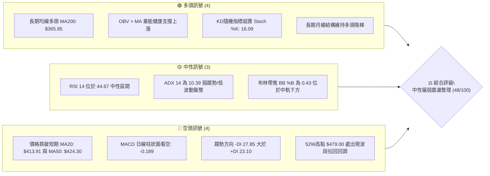

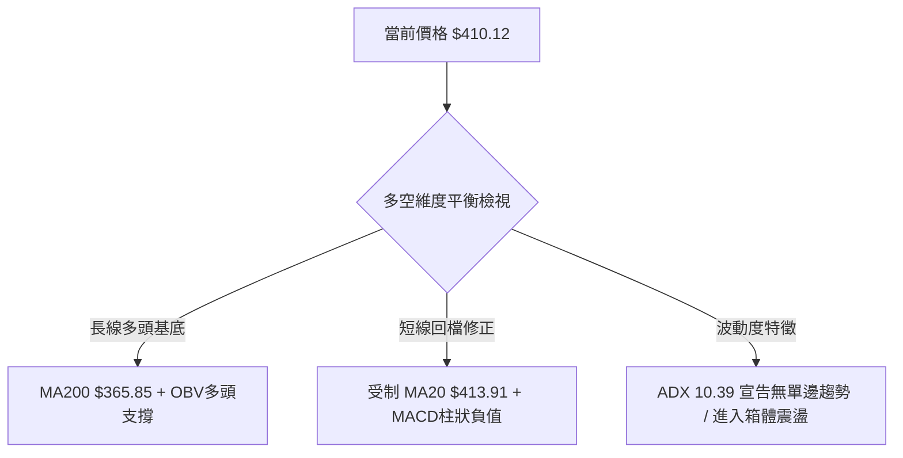

### 📊 核心指標速覽表

| 指標類別 | 指標名稱 | 當前數值 | 訊號 | 解讀 |
|----------|----------|----------|:----:|------|
| **價格** | 當前價格 | $410.12 | 🟡 | 位於52週區間 73.1%，處於近期回調整理區間 |
| **均線** | MA20 | $413.91 | 🔴 | 價格低於 MA20（-0.91%），短線承壓 |
| **均線** | MA50 | $424.30 | 🔴 | 價格低於 MA50（-3.34%），中期動能放緩 |
| **均線** | MA200 | $365.85 | 🟢 | 價格高於 MA200（+12.10%），長線多頭架構完好 |
| **動能** | RSI(14) | 44.67 | 🟡 | 中性偏弱區間（30–70），未見超賣或超買極端值 |
| **動能** | MACD Hist | -0.189 | 🔴 | MACD線（-0.307）低於訊號線（-0.118），短線空方主導 |
| **動能** | Stoch %K / %D | 16.09 / 34.26 | 🟢 | KD 處於超賣區（<20），醞釀短線技術性反彈 |
| **趨勢** | ADX (14) | 10.39 | 🟡 | 極弱趨勢強度（<25），確認當前為箱體盤整格局 |
| **通道** | BB %B | 0.43 | 🟡 | 位於布林下軌（$387.04）與中軌（$413.91）之間 |
| **量能** | OBV 趨勢 | OBV > MA | 🟢 | 能量潮高於均線，中長線資金未見恐慌性撤離 |
| **波動** | ATR(14) | $11.24 | 🟡 | 每日平均波動約 2.74%，波動度處於常態水準 |

### 🏆 技術評分卡

```
╔══════════════════════════════════════════════════════════════╗
║                 技術評分卡 — TSM (2026-08-24)                 ║
╠══════════════════════════════════════════════════════════════╣
║ 趨勢強度 (ADX 10.39/混合均線)  ██████░░░░░░░░░░░░░░  30/100 🔴 ║
║ 動能指標 (RSI 44.67/MACD負值)  ████████░░░░░░░░░░░░  40/100 🔴 ║
║ 支撐穩定度 (S1 $404.56守穩)    ██████████████░░░░░░  70/100 🟢 ║
║ 成交量配合 (OBV多頭/量縮整理)  ████████████░░░░░░░░  60/100 🟢 ║
║ 形態完整度 (斐波那契23.6%整理) ██████████░░░░░░░░░░  50/100 🟡 ║
║ 均線排列 (短空長多混合排列)    ████████░░░░░░░░░░░░  40/100 🔴 ║
╠══════════════════════════════════════════════════════════════╣
║ 綜合評分                       █████████░░░░░░░░░░░  48/100 🟡 ║
║ 評級結論：中性震盪整理（建議以布林通道與波段支撐/阻力區間操作）║
╚══════════════════════════════════════════════════════════════╝
```

---

## 2. 趨勢分析

### 🌐 多時框趨勢分析

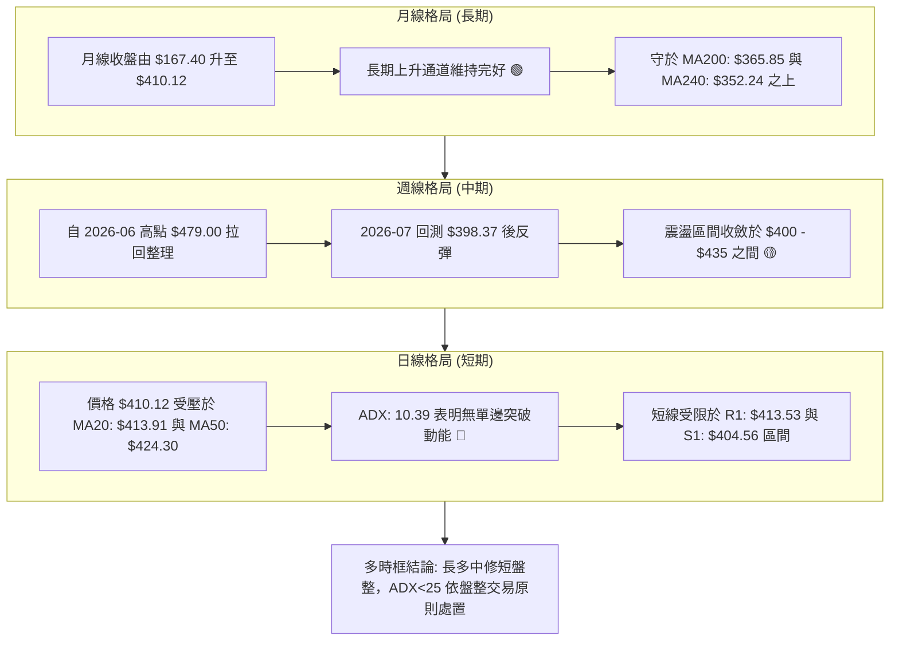

### 📈 長期趨勢 — 12個月走勢圖（Unicode）

```
TSM 月線走勢圖（過去12個月：2025-08 至 2026-08）
價格軸 ($)
$480 ┤                                                 ● (2026-06 $477.57 / 52W高 $479.00)
$450 ┤                                                ╱ ╲
$420 ┤                                      ●        ╱   ● ($410.12 現價)
$390 ┤                            ●        ╱ ╲      ● (2026-07 $404.25)
$360 ┤                  ●        ╱ ╲      ╱   ●
$330 ┤        ●        ╱ ╲      ╱   ●    ╱
$300 ┤  ●    ╱ ╲      ╱   ●    ╱     ●  ╱
$270 ┤ ╱ ╲  ╱   ●    ╱     ●  ╱
$240 ┤●   ●     ●  ╱
$210 ┤
     └─┬────┬────┬────┬────┬────┬────┬────┬────┬────┬────┬────┬────┬
      08   09   10   11   12   01   02   03   04   05   06   07   08 (月份)
      '25                                                     '26
```

#### 24 個月走勢特徵分析表格

| 階段區間 | 起訖月份 | 起訖價格 ($) | 區間漲跌幅 | 走勢特徵與核心催化劑 |
|:---------|:---------|:-------------|:-----------|:---------------------|
| **第一階段：打底蓄勢** | 2024-08 → 2025-04 | 167.40 → 164.27 | -1.87% | 在 $163.59–$205.48 之間寬幅震盪，消化半導體庫存調整 |
| **第二階段：主升浪啟動** | 2025-05 → 2025-10 | 190.51 → 298.08 | +56.46% | AI 晶片需求爆發，連續突破整數關卡，量能全面放大 |
| **第三階段：高位階梯推升**| 2025-11 → 2026-02 | 289.23 → 372.65 | +28.84% | 跨入 300 元以上高位階梯，盈利高增長支撐評價上修 |
| **第四階段：衝頂見高** | 2026-03 → 2026-06 | 337.16 → 477.57 | +41.65% | 創 52 週新高 $479.00，市場情緒進入狂熱期 |
| **第五階段：波段修正盤整**| 2026-07 → 2026-08 | 404.25 → 410.12 | +1.45% | 高位拉回至 23.6% 斐波那契位（$418.62）下方進行箱體震盪 |

### 📊 中期趨勢（週線分析）

```
TSM 週線近20週價格通道與波動區間示意圖
═════════════════════════════════════════════════════════════════════
480 ┤                                      ▲ 52W High: $479.00
460 ┤                              ╭──●──╮
440 ┤                    ╭──●──╮  │     │  ╭──● (R3: $436.04)
420 ┤          ╭──●──╮  │     │  │     │  │     ● (R2: $420.98)
410 ┤───●──────┼─────┼──┼─────┼──┼─────┼──┼─────┼───● $410.12 (現價)
400 ┤   │  ●───╯     ╰──●     │  │     ╰──● (S1: $404.56)
380 ┤   │                       ╰──● (2026-07-19: $398.37 / S2: $385.09)
360 ┤───● (2026-04-19: $369.63 / S3: $372.72)
═════════════════════════════════════════════════════════════════════
```

### ⚡ 趨勢強度評估（ADX 解讀）

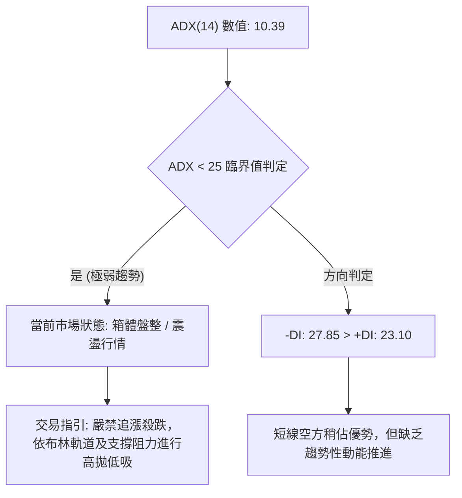

#### ADX 趨勢強度對照表

| ADX 數值區間 | 趨勢強度分類 | TSM 當前狀態 | 策略應對準則 |
|:-------------|:-------------|:------------:|:-------------|
| **0 – 20** | **極弱趨勢 / 無方向盤整** | **✓ (10.39)** | **以支撐阻力區間操作為主，停止趨勢跟隨策略** |
| 20 – 25 | 弱趨勢 / 醞釀期 | — | 觀察均線與布林帶是否收窄醞釀突破 |
| 25 – 40 | 強勁趨勢確立 | — | 順勢交易，回調進場 |
| 40 – 60 | 極強單邊行情 | — | 持股續抱，移定止盈點 |
| > 60 | 趨勢過熱可能反轉 | — | 警戒背離訊號，獲利了結 |

---

## 3. 圖表形態分析

### 🔍 形態識別系統

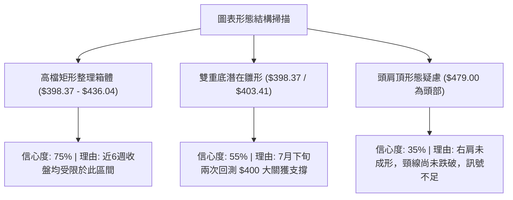

#### 形態識別信心度與參數表

| 形態名稱 | 信心度 | 判斷依據（引用數據） | 完成度 | 目標價（附精確計算式） |
|:---------|:------:|:---------------------|:------:|:----------------------|
| **高位箱體矩形震盪** | **75%** | 箱底支撐 S1 $404.56（週線低點 $398.37 聚類），箱頂阻力 R3 $436.04（7月高點聚類） | 85% | 向上突破目標：$436.04 + ($436.04 - $404.56) = **$467.52**<br>向下破位目標：$404.56 - ($436.04 - $404.56) = **$373.08** |
| **潛在雙重底結構 (W底)** | **55%** | 2026-07-19 低點 $398.37 與 2026-07-26 低點 $403.41 構成雙底，頸線位於 2026-08-16 高點 $426.35 | 60% | 突破頸線量化目標：<br>頸線 $426.35 + 形態高度 ($426.35 - $398.37 = $27.98) = **$454.33** |
| **頭肩頂形態** | **35%** | 僅有頭部 $479.00，左肩約 $462.12，但右肩未構築，且頸線 $398.37 仍守穩 | 30% | 訊號不足，不予計算破位目標價，維持指標型解讀 |

### 🕯️ 重要 K 線形態分析

| 週/月份 | 收盤價 ($) | K 線與走勢形態 | 專業技術解讀 | 多空訊號 |
|:--------|:----------:|:---------------|:-------------|:--------:|
| 2026-06-21 | 462.12 | 大陽線向上突破 | 衝擊 52 週歷史高點 $479.00，成交量放大至 58.8M，動能充沛 | 🟢 |
| 2026-07-19 | 398.37 | 長黑下影線 (量大長陰) | 週成交量爆出 91.5M 巨量，回測 $400 整數關卡，浮額清洗 | 🔴 |
| 2026-07-26 | 403.41 | 帶長下影錘頭線 (Hammer) | RSI 探底至 27.9 極度超賣區，低檔承接買盤顯著進駐 | 🟢 |
| 2026-08-16 | 426.35 | 反彈中陽線 | 突破 MA20 中軌，MACD 柱狀圖翻正至 +3.334，反彈波段高點 | 🟢 |
| 2026-08-30 | 410.12 | 縮量小陰線回踩 | 日量縮至 10.6M（量比 0.90x），受制於 MA20 回測確認 S1 支撐 | 🟡 |

### 📉 ASCII 走勢形態示意圖

```
TSM 高位箱體震盪與潛在雙底形態架構圖
$440 ┤                              [箱頂阻力 R3: $436.04]
     │                                ╭─────╮
$430 ┤                      [頸線]  ╭─╯     ╰─╮ (2026-08-16: $426.35)
     │                     $426.35 ╭╯         ╰─╮
$420 ┤                            ╱             ╰──● $410.12 (現價回踩測試)
     │                           ╱
$410 ┤                          ╱
     │       ╭───╮             ╱
$400 ┤───────╯   ╰──●─────────╯──────────────────────── [箱底支撐 S1: $404.56]
     │          (底1: $398.37)    (底2: $403.41)
$390 ┤
     └──────────────────────────────────────────────────────────
```

### 🎯 形態目標價計算

```
╔══════════════════════════════════════════════════════════════╗
║                   幾何形態測幅計算詳解                       ║
╠══════════════════════════════════════════════════════════════╣
║ 1. 矩形箱體形態（突破 R3: $436.04）：                         ║
║    箱體高度 = $436.04 - $404.56 = $31.48                     ║
║    等距向上測幅 = $436.04 + $31.48 = $467.52                 ║
║                                                              ║
║ 2. 雙重底形態（突破頸線: $426.35）：                          ║
║    形態高度 = $426.35 - $398.37 = $27.98                     ║
║    目標價 = $426.35 + $27.98 = $454.33                       ║
║                                                              ║
║ 3. 箱體破位下行測幅（跌破 S1: $404.56）：                     ║
║    等距向下測幅 = $404.56 - $31.48 = $373.08 (逼近 S3: $372.72)║
╚══════════════════════════════════════════════════════════════╝
```

---

## 4. 支撐與阻力

### 🗺️ 關鍵價位分布圖（Unicode）

```
TSM 價位結構分布圖（引用 OHLCV 聚類計算與斐波那契回調）
═══════════════════════════════════════════════════════════════════════
$479.00 ║██████████████████████████████║ 52W High / 斐波那契 0.0%
$436.04 ║████████████████████████      ║ 強阻力 R3 (近一年波段高點聚類)
$420.98 ║██████████████████            ║ 中期阻力 R2 (MA10 $420.96 / 波段高點)
$418.62 ║▓▓▓▓▓▓▓▓▓▓▓▓▓▓▓▓▓▓            ║ 斐波那契 23.6% 回調位
$413.53 ║████████████                  ║ 關鍵短阻力 R1 (MA20 $413.91 聚類)
$410.12 ╠══════════════════════════════╣ ◄ 現價 ($410.12)
$404.56 ║▓▓▓▓▓▓▓▓▓▓▓▓▓▓▓▓              ║ 近期關鍵支撐 S1 (波段低點聚類)
$387.04 ║████████████████              ║ 布林通道下軌
$385.09 ║████████████████████          ║ 強支撐 S2 (波段低點聚類)
$381.27 ║▓▓▓▓▓▓▓▓▓▓▓▓▓▓▓▓▓▓▓▓          ║ 斐波那契 38.2% 回調位
$372.72 ║████████████████████████      ║ 核心波段防守支撐 S3
$365.85 ║██████████████████████████    ║ 長期均線牛熊線 MA200
═══════════════════════════════════════════════════════════════════════
```

### 🚧 阻力位分析表

| 阻力級別 | 精確價位 | 形成依據與技術共振 | 突破難度 | 戰略重要性 |
|:---------|:--------:|:-------------------|:--------:|:-----------|
| **R1** | **$413.53** | 接近 MA20（$413.91）與 MA5（$414.11），短線動能均線壓制 | 中等 🟡 | 短線多空分水嶺，站上此處方能化解短線陰跌 |
| **R2** | **$420.98** | 接近 MA10（$420.96）與斐波那契 23.6%（$418.62），前波震盪中樞 | 較高 🔴 | 中期空方防線，需具備 1,500 萬股以上日成交量配合突破 |
| **R3** | **$436.04** | 近一年波段高點聚類，高位箱體上軌，7月多頭反彈受阻高點 | 極高 🔴 | 波段反轉關鍵點，突破後將直接打開重返 $479.00 之空間 |

### 🛡️ 支撐位分析表

| 支撐級別 | 精確價位 | 形成依據與技術共振 | 守住機率 | 戰略重要性 |
|:---------|:--------:|:-------------------|:--------:|:-----------|
| **S1** | **$404.56** | 近一年波段低點聚類，8月2日週收盤價（$404.25）重疊區 | 70% 🟢 | 當前箱體下沿防線，失守將導致盤整區間下移 |
| **S2** | **$385.09** | 近一年波段低點聚類，緊鄰布林下軌（$387.04）與斐波那契 38.2%（$381.27） | 85% 🟢 | 中期多頭強支撐帶，具備極強技術買盤承接力 |
| **S3** | **$372.72** | 波段低點聚類，上方緊鄰 MA200（$365.85）與 2026-02 起漲點 | 95% 🟢 | 長線牛市生命線，跌破則宣告長期多頭結構破壞 |

### 📐 斐波那契回調位分析（52週區間：$223.16 → $479.00）

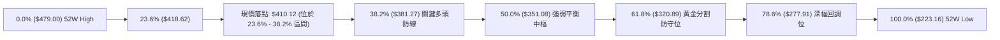

#### 斐波那契回調解讀
當前現價 **$410.12** 位於 **23.6%（$418.62）** 與 **38.2%（$381.27）** 之間：
1. **強勢整理特徵**：在經歷 52 週自 $223.16 翻倍上漲至 $479.00 的強大單邊多頭行情後，股價僅回調至 23.6% 附近震盪，未深幅觸及 38.2%（$381.27），顯示中長線機構籌碼鎖定良好，屬於標準的強勢多頭次級折返。
2. **關鍵攻防區**：上方 23.6%（$418.62）為短線反彈首要收復關卡；下方 38.2%（$381.27）與 S2 支撐（$385.09）高度重疊，構成極為厚實的複合支撐安全墊。

---

## 5. 技術指標深度解讀

### 🎛️ 指標訊號總覽

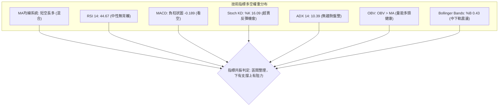

### 📈 移動平均線排列分析

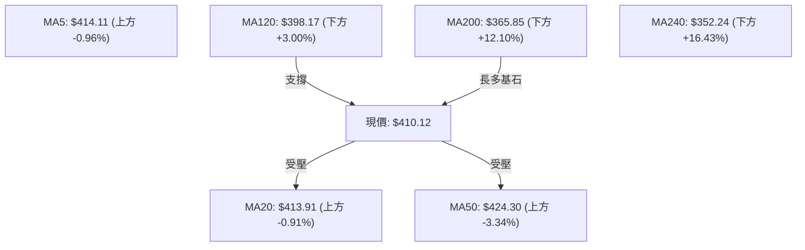

#### 均線系統詳細參數表

| 均線名稱 | 當前價格 | 與現價乖離率 | 排列狀態 | 走勢特徵解讀 |
|:---------|:--------:|:------------:|:--------:|:-------------|
| **MA 5** | $414.11 | -0.96% | 空頭排列 | 短線小幅下行，構成第一道微型壓制 |
| **MA 10** | $420.96 | -2.57% | 空頭排列 | 走平偏下，與 R2 阻力 $420.98 高度重疊 |
| **MA 20** | $413.91 | -0.91% | 空頭排列 | 短期均線扣高走低，現價位於其下方 |
| **MA 60** | $424.80 | -3.46% | 空頭排列 | 中期生命線走平向下，壓制中期動能 |
| **MA 120** | $398.17 | +3.00% | 多頭排列 | 半年線持續上行，於 $400 大關下方提供強力支撐 |
| **MA 200** | $365.85 | +12.10% | 多頭排列 | 年線呈現經典多頭排列，長期多頭趨勢堅不可摧 |
| **MA 240** | $352.24 | +16.43% | 多頭排列 | 長期基線穩健上移，多頭大底明確 |

### 📉 RSI(14) 分析

- **RSI(14) 當前數值**：**44.67**
- **強度進度條**：`█████████░░░░░░░░░░░ 44.67% (中性偏弱)`
- **背離判斷**：
  - **頂背離**：無。近期價格自 $479.00 回檔過程中，RSI 同步自高檔（76.5）回落，未出現價格創新高而 RSI 未創新高之頂背離。
  - **底背離**：無明顯背離。2026-07-26 價格打出低點 $403.41 時 RSI 來到 27.9，後續 8 月回踩價格 $404.25 時 RSI 位於 43.3，動能未進一步惡化，屬於良性指標修復。

### 📊 MACD(12/26/9) 訊號解讀

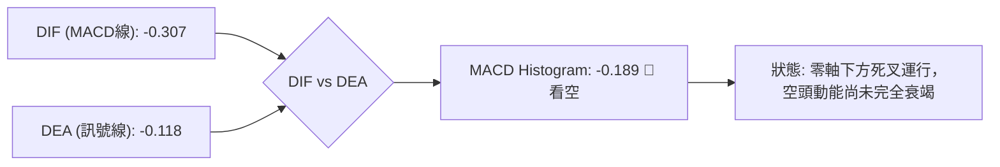

- **MACD 線**：-0.307
- **Signal 線**：-0.118
- **柱狀圖 (Histogram)**：-0.189（處於負值收斂階段）
- **動能評估**：週線 MACD 柱狀圖在 8 月初曾短暫翻正至 +3.334，隨後縮減至 -0.189，顯示反彈動能遭遇阻力，進入短線多空拉鋸狀態。

### 📦 布林通道分析

```
TSM 布林通道寬度與現價相對位置圖（通道寬度 = $53.73）
═════════════════════════════════════════════════════════════════════
$440.77 ┤ ────────────────────────────────── [BB 上軌: $440.77]
        │
$425.00 ┤
        │
$413.91 ┤ ---------------------------------- [BB 中軌 / MA20: $413.91]
$410.12 ┤ ══════════════════════════════════ ◄ 現價: $410.12 (%B = 0.43)
        │
$400.00 ┤
        │
$387.04 ┤ ────────────────────────────────── [BB 下軌: $387.04]
═════════════════════════════════════════════════════════════════════
```

- **通道特徵**：布林通道呈現水平收窄收斂狀態，BB %B 為 **0.43**，處於中軌（$413.91）下方、下軌（$387.04）上方。
- **突破意義**：在帶寬收窄過程中，若未放量跌破下軌 $387.04，則下軌具備顯著彈升支撐效應。

### 💹 成交量分析（量價配合度）

1. **量能萎縮**：最新單日成交量為 **10,623,060 股**，相對於 20 日均量（11,803,313 股）之量比為 **0.90x**，相對於 50 日均量（13,624,729 股）萎縮約 22%。
2. **量價配合判定**：下跌縮量、回踩支撐無恐慌拋盤，顯示目前回調為良性籌碼沉澱。
3. **OBV（能量潮）多頭確認**：數據顯示 `OBV > MA`，能量潮指標持續位於其均線之上，明確指示中長線大資金並未實質性出逃，量能結構有力支撐長期上漲大格局。

---

## 6. 動能與波動率

### ⚡ 動能評估四象限

| 象限 | 動能維度 (Momentum) | 波動維度 (Volatility) | 當前狀態 | 專業操作指引 |
|:-----|:-------------------:|:---------------------:|:--------:|:-------------|
| **象限 I** | 強動能 (Bullish) | 低波動 (Low Volatility) | — | 最佳波段加碼區間（穩健單邊上升） |
| **象限 II**| **弱動能 (Bearish/Neutral)**| **低波動 (Low Volatility)** | **✓ (TSM 落點)** | **區間震盪觀望，以網格或高拋低吸應對** |
| **象限 III**| 強動能 (Bullish) | 高波動 (High Volatility) | — | 趨勢突破追價，需嚴格設定移動止損 |
| **象限 IV**| 弱動能 (Bearish) | 高波動 (High Volatility) | — | 恐慌殺跌階段，嚴禁盲目抄底 |

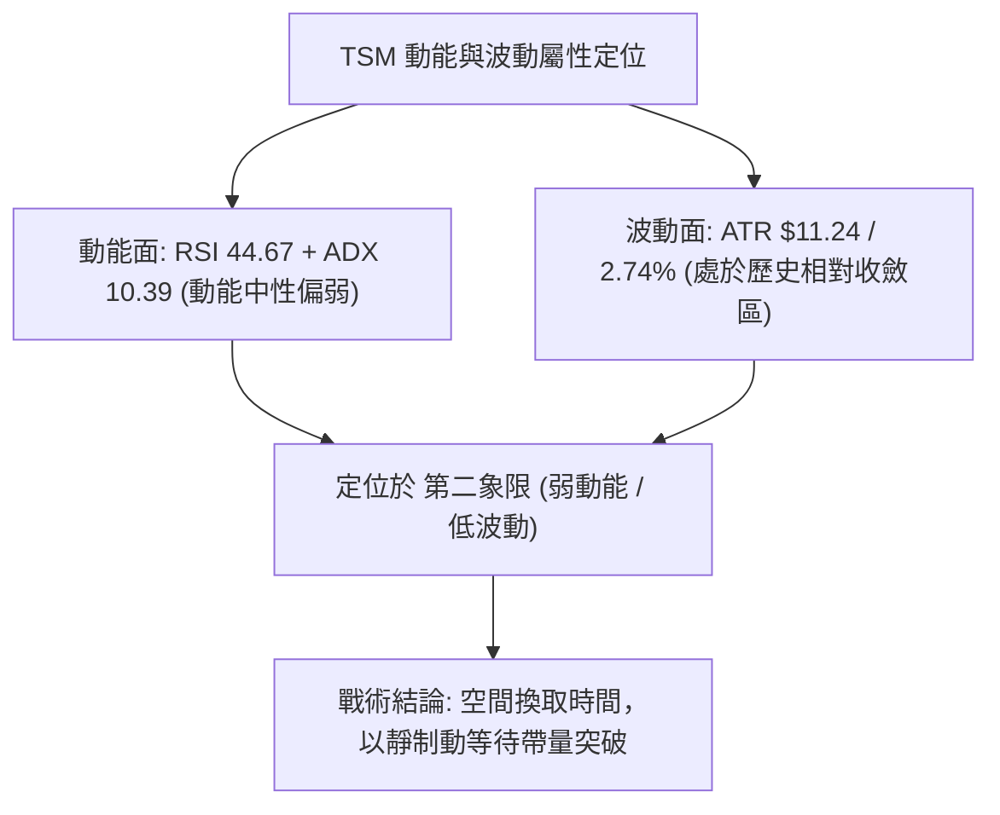

### 📊 ATR 波動率分析

- **當前 ATR(14)**：**$11.24**（佔現價比率為 **2.74%**）。
- **止損距離設計建議**：
  - **短線交易（1.0 × ATR）**：建議止損空間設定為 **$11.24**。
  - **波段交易（1.5 × ATR）**：建議止損空間設定為 **$16.86**。
  - **防守性底線（2.0 × ATR）**：建議止損空間設定為 **$22.48**。
- **波動度解讀**：ATR 數值相對於 6 月衝頂時明顯收斂，每日價格波動範圍約在 $11 左右，有利於精確規劃風報比與限價單布局。

### 📐 Beta 與市場相關性

- **Beta 係數**：**1.258**
- **市場屬性分析**：TSM 屬於高彈性成長型權值科技股，理論波動幅度高於標普 500 指數約 25.8%。在科技板塊（SOX 半導體指數）出現系統性行情時，其波動具有放大效應；但在當前 ADX 為 10.39 的低波動環境下，個股呈現內生性消化整固走勢。

---

## 7. 多時框架總結

### 📋 時框架評分表

| 時框架 | 趨勢方向 | 動能狀態 | 均線排列 | 圖表形態 | 綜合評分 | 戰略建議 |
|:-------|:--------:|:--------:|:--------:|:--------:|:--------:|:---------|
| **月線 (長期)** | 🟢 多頭 | 🟢 強勁 | 🟢 多頭 (MA200 $365.85) | 上升通道大階梯 | **85/100** | 長線多頭持股續抱，無看空理由 |
| **週線 (中期)** | 🟡 震盪整理 | 🟡 中性 | 🟡 混合排列 | 高位箱體整固 ($400-$436) | **52/100** | 區間操作，依箱底支撐低吸 |
| **日線 (短期)** | 🔴 偏弱修正 | 🔴 弱勢 | 🔴 短空 (受制 MA20/MA50)| 縮量回踩測 S1 支撐 | **38/100** | 嚴禁盲目追多，等待回踩確認 |

### 🔲 綜合訊號矩陣

```
╔══════════════════════════════════════════════════════════════╗
║                   TSM 多時框訊號一致性矩陣                   ║
╠══════════════════╦════════════╦════════════╦═════════════════╣
║ 分析維度         ║ 短期 (日線)║ 中期 (週線)║ 長期 (月線)     ║
╠══════════════════╬════════════╬════════════╬═════════════════╣
║ 趨勢方向         ║ 🔴 偏空     ║ 🟡 震盪     ║ 🟢 強多         ║
║ 均線系統         ║ 🔴 均線下方 ║ 🟡 纏繞中軌 ║ 🟢 均線多頭排列 ║
║ 動能指標 (RSI/MACD)║ 🔴 動能收縮 ║ 🟡 中性整理 ║ 🟢 多頭主導     ║
║ 成交量能配合     ║ 🟡 量縮觀望 ║ 🟢 健康換手 ║ 🟢 資金持續流入 ║
║ 形態結構         ║ 🟡 區間下沿 ║ 🟡 箱體震盪 ║ 🟢 突破回踩大牛 ║
╚══════════════════╩════════════╩════════════╩═════════════════╝
```

### ⚖️ 多時框收斂結論

依據多時框收斂規則：
1. **行情性質判定**：當前 ADX(14) 數值為 **10.39（< 25）**，嚴格宣告當前市場處於**「盤整震盪行情」**而非單邊趨勢行情。
2. **時框衝突取捨**：由於處於盤整行情，交易邏輯應以**日線布林通道（$387.04 – $440.77）與關鍵波段高低點（S1: $404.56 至 R2: $420.98）**作為核心決策依據。
3. **唯一方向性結論**：**【中性偏弱區間震盪（偏向箱底低吸）】**。雖然長線多頭基底雄厚，但短期受制於 MA20（$413.91）壓制與 MACD 負柱狀圖，在未帶量突破 R1（$413.53）前，不具備單邊暴漲條件，策略全權收斂至第 8 章之區間操作模型。

---

## 8. 交易策略建議

### 🗺️ 策略決策流程圖

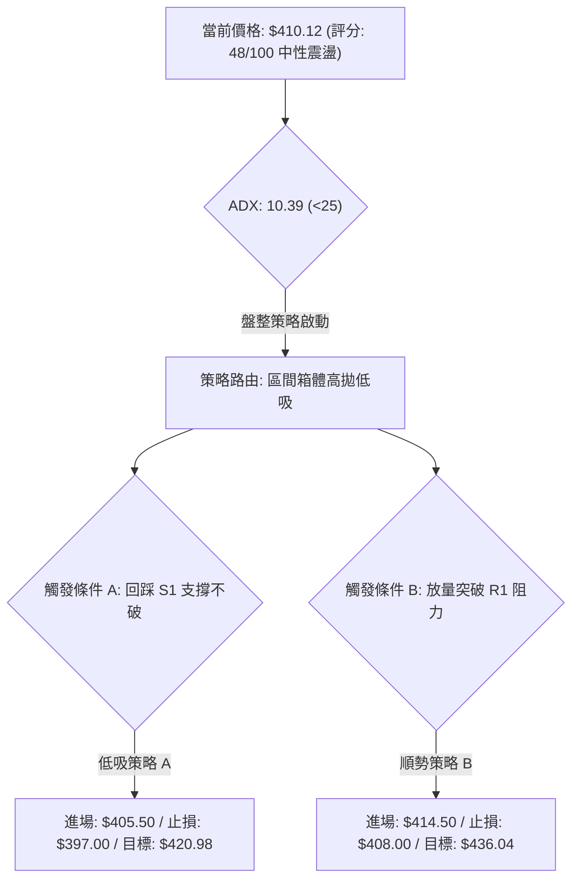

### 🧭 策略路由

> **當前主策略方向 = 【中性區間震盪操作：箱底支撐低吸為主、突破加碼為輔】（依評分卡 48/100 判定）**

因綜合評分落在 **40–60 區間（48/100）**，市場處於布林帶與波段支撐/阻力之間的平衡期。交易核心為「不追高、在波段支撐處分批布局、在波段阻力處獲利了結」。

### 🎯 價格情境階梯（Price Scenarios）

| 觸發條件 | 第一目標 | 後續延伸 | 情境含義與操作指引 |
|:---------|:--------:|:--------:|:-------------------|
| **向上放量突破 R1 $413.53** | **R2 $420.98** | **R3 $436.04** | 短線轉強，突破 MA20 壓制，可啟動右側加碼追買 |
| **維持於 $404.56 – $413.53 震盪** | **$413.53** | **$404.56** | 區間窄幅整理，維持網格或高拋低吸，嚴格控制部位 |
| **有效跌破 S1 $404.56** | **S2 $385.09** | **S3 $372.72** | 中期轉弱，回調加深，多頭退守斐波那契 38.2% 防線 |

### 📊 情境機率分佈

| 預測情境 | 機率估計 | 核心判定依據（引用指標與數據） |
|:---------|:--------:|:-------------------------------|
| **情境一：區間震盪整理** | **55%** | ADX 僅 10.39，成交量萎縮至 10.6M（量比 0.90x），布林通道水平收斂 |
| **情境二：回踩支撐後反彈**| **30%** | KD 指標處於超賣區（Stoch %K 16.09），OBV 長期維持多頭，S1 $404.56 支撐強固 |
| **情境三：跌破 S1 深幅探底**| **15%** | MACD 柱狀負值 -0.189，-DI (27.85) 佔優，若大盤重挫可能回測 S2 $385.09 |

### 🟢 主策略詳情

本策略組合嚴格依據第 4 章由 OHLCV 計算之關鍵價位制定，提供兩套操作方案：

| 策略要素 | 策略 A（箱底支撐低吸策略 — 左側偏穩健） | 策略 B（突破均線順勢策略 — 右側確認） |
|:---------|:---------------------------------------|:-------------------------------------|
| **適用場景** | 價格回踩 S1 $404.56 企穩出現下影線時 | 價格放量突破 R1 $413.53（MA20）確認時 |
| **進場價格** | **$405.50**（S1 $404.56 上方掛單） | **$414.50**（突破 R1 $413.53 後回踩確認）|
| **目標價 T1** | **$420.98**（引用阻力位 R2，漲幅 +3.82%） | **$426.35**（引用形態頸線高點，漲幅 +2.86%）|
| **目標價 T2** | **$436.04**（引用阻力位 R3，漲幅 +7.53%） | **$436.04**（引用阻力位 R3，漲幅 +5.19%）|
| **止損價格** | **$397.00**（跌破週線低點 $398.37 止損） | **$408.00**（跌破 MA20 之下回撤點止損） |
| **止損空間** | **$8.50**（約 0.76 × ATR） | **$6.50**（約 0.58 × ATR） |
| **第一風報比** | **1 : 1.82**（風險 $8.50 vs 獲利 $15.48） | **1 : 1.82**（風險 $6.50 vs 獲利 $11.85） |
| **第二風報比** | **1 : 3.59**（風險 $8.50 vs 獲利 $30.54） | **1 : 3.31**（風險 $6.50 vs 獲利 $21.54） |
| **預估勝率** | **65%** | **60%** |
| **建議倉位** | **15% – 20% 資金** | **10% – 15% 資金** |

### 🔴 反向風險觸發點（風控與對沖提示）

若發生下列技術破位事件，宣告主策略失效，需全面執行停損或建立空頭對沖部位：
1. **收盤跌破 $398.37**（2026-07-19 週線波段低點）：確認雙底形態破局，箱體向下破位，價格將加速滑落至 **S2 $385.09** 及斐波那契 38.2%（**$381.27**）。
2. **MACD 負柱狀圖急遽擴大**（Hist < -1.500）且日成交量暴增至 1,800 萬股以上向下殺跌：代表機構籌碼出現恐慌性拋盤，應立即將多頭倉位降至 5% 以下。

### ⭐ 整體訊號強度評星

```
做多訊號強度：★★★☆☆  (3.0/5星 — 長多基底支撐，但短線受制均線)
做空訊號強度：★★☆☆☆  (2.0/5星 — 下方支撐重重，空頭動能衰竭)
整體可信度：  ★★★★☆  (4.0/5星 — 數據指標一致確認當前處於收斂箱體)
```

---

## 9. 風險提示與監控

### ✅ 關鍵監控指標 Checklist

```
╔══════════════════════════════════════════════════════════════╗
║                   每日交易監控 Checklist                     ║
╠══════════════════════════════════════════════════════════════╣
║ [ ] 價格是否收復短期壓制線 MA20: $413.91 與 R1: $413.53       ║
║ [ ] 關鍵支撐 S1: $404.56 是否遭遇實體黑K跌破                  ║
║ [ ] RSI(14) 是否跌破 40.0 進入弱勢區，或向上突破 50.0 分水嶺  ║
║ [ ] MACD Histogram 柱狀圖是否由負轉正 (零軸上翻)               ║
║ [ ] 日成交量是否放大至 1,360 萬股 (50日均量) 以上確認方向      ║
║ [ ] ADX(14) 是否自 10.39 向上抬頭突破 20.0 展開新趨勢         ║
╚══════════════════════════════════════════════════════════════╝
```

### ⚠️ 風險場景分析

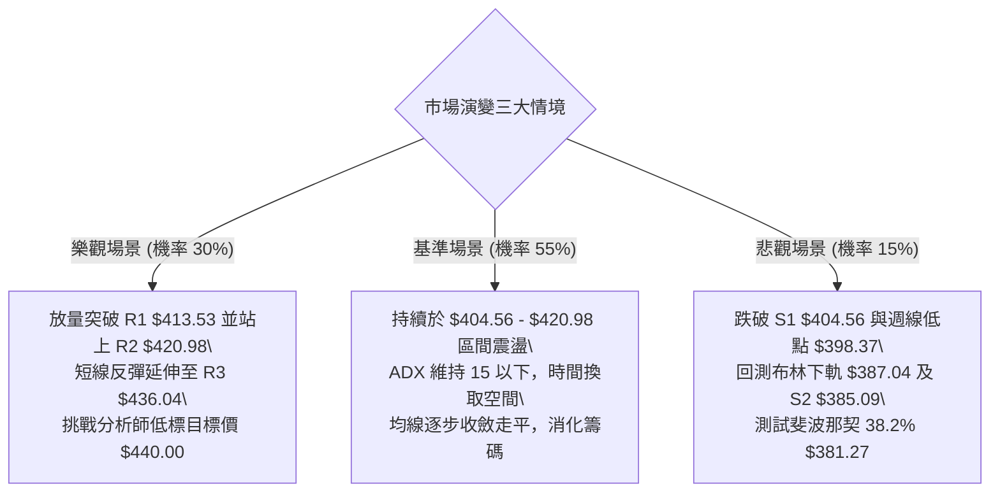

### 🛡️ 風險管理重要提醒

1. **嚴禁在 ADX 低位時過度追價**：當前 ADX 為 10.39，缺乏單邊推升力道，在 R1（$413.53）至 R2（$420.98）阻力區盲目追高極易遭逢短線拉回被套。
2. **嚴格執行固定風控停損**：任何多頭進場均不得承受超過 1.5 × ATR（約 $16.86）之未實現虧損，單筆交易虧損金額應嚴格限制於總投資本金之 **1.0% – 1.5%** 以內。
3. **長期基本面與分析師共識背書**：儘管短線技術面處於整理，但公司基本面極其優異（毛利率 64.2%、淨利率 49.9%、華爾街 18 位分析師一致評級為 Strong Buy、平均目標價高達 **$554.45**），因此中長線投資人不宜盲目殺跌，應將回調至 S2（$385.09）附近視為長線優質買點。

---

## 📋 報告總結

```
╔══════════════════════════════════════════════════════════════╗
║                     TSM 技術分析報告總結                     ║
╠══════════════════════════════════════════════════════════════╣
║ 報告日期：2026-08-24                                         ║
║ 當前價格：$410.12                                            ║
║ 分析評級：⚖️ 中性觀望 / 區間震盪操作（評分：48/100）           ║
╠══════════════════════════════════════════════════════════════╣
║ 關鍵結論：                                                   ║
║ ├─ 長期趨勢：🟢 強烈多頭（遠高於 MA200: $365.85，長多架構完好） ║
║ ├─ 中期趨勢：🟡 震盪整理（受制於 52W高點 $479.00 拉回之箱體） ║
║ ├─ 短期趨勢：🔴 偏弱整固（受制 MA20: $413.91，MACD負柱狀圖） ║
║ ├─ 關鍵支撐：S1: $404.56 ｜ S2: $385.09 ｜ S3: $372.72       ║
║ ├─ 關鍵阻力：R1: $413.53 ｜ R2: $420.98 ｜ R3: $436.04       ║
║ └─ 分析師目標：平均 $554.45（最低 $440.00 ｜ 最高 $700.00）   ║
╠══════════════════════════════════════════════════════════════╣
║ 最優策略組合：                                               ║
║ 1. 🥇 最佳機會（策略 A）：回踩 S1 支撐 $405.50 低吸，        ║
║    止損 $397.00，目標看 $420.98 / $436.04，風報比 1:3.59    ║
║ 2. 🥈 次選機會（策略 B）：放量突破 R1 追買 $414.50，         ║
║    止損 $408.00，目標看 $426.35 / $436.04，風報比 1:3.31    ║
║ 3. 🥉 保守選擇：空倉觀望，等待 ADX 升破 20.0 或價格回測       ║
║    S2 ($385.09) 斐波那契 38.2% 複合支撐區再行布局            ║
╚══════════════════════════════════════════════════════════════╝
```

---

> ⚠️ **免責聲明**：本報告為技術分析研究成果，所有數據、圖表及估算均嚴格基於所提供之歷史交易資訊與量化模型計算。本報告**僅供研究與學術參考**，**不構成任何形式的投資要約或買賣建議**。金融市場投資具有高度風險，交易者應依個人財務狀況與風險承受度獨立決策並自負盈虧。

---

*報告生成時間：2026-08-24 ｜ 數據來源：Yahoo Finance ｜ 分析框架：多時框架量化技術分析*