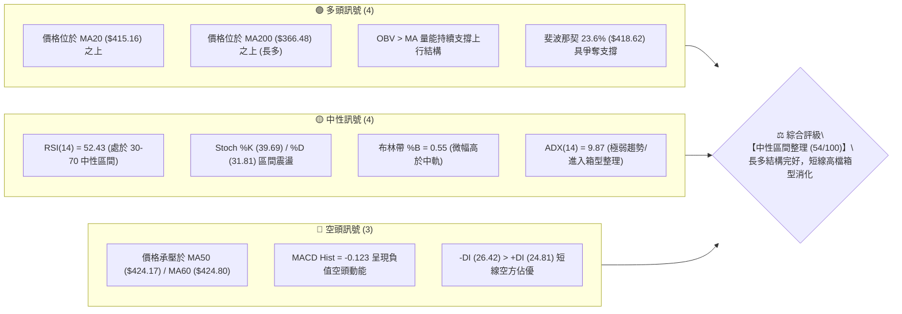
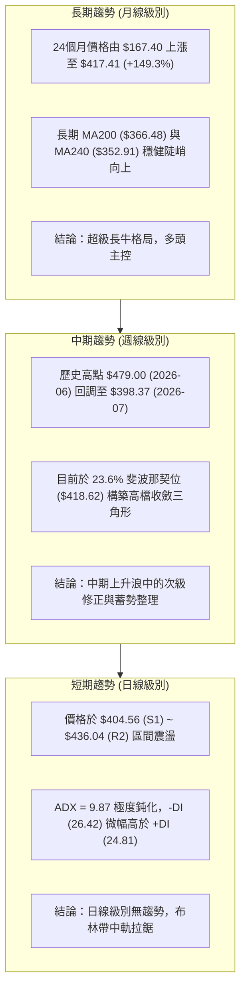
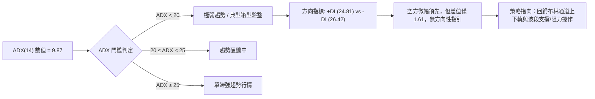
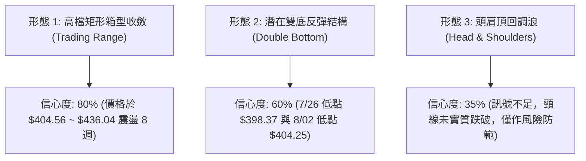
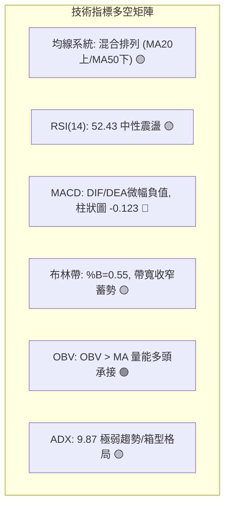
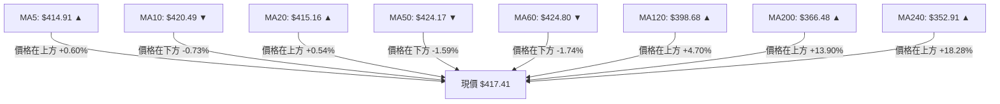
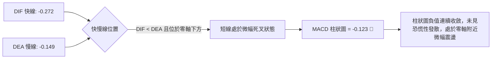
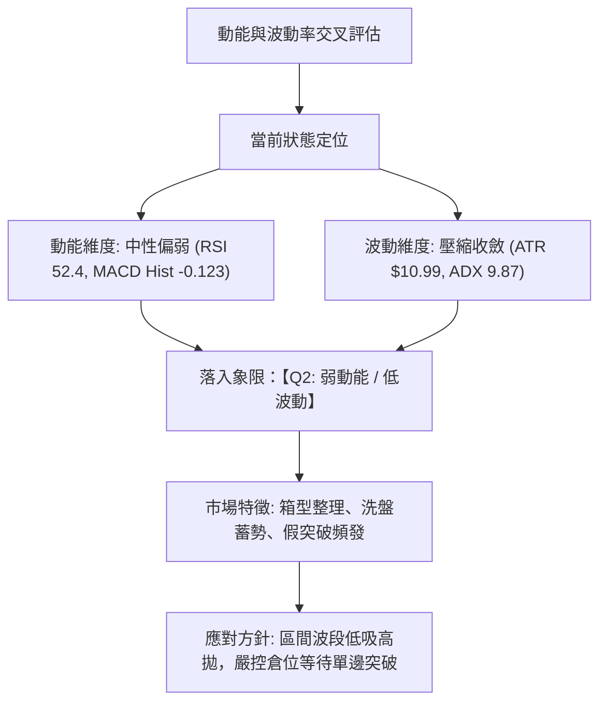
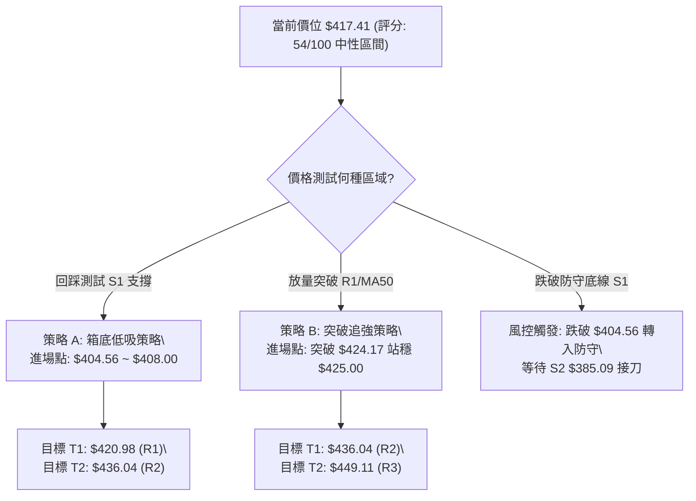
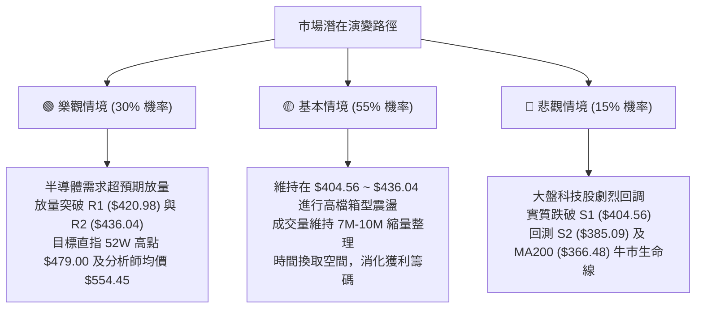

# TSM 技術分析報告

> **報告日期**：2026-08-25 ｜ **語言**：繁體中文 ｜ **數據來源**：Yahoo Finance ｜ **當前價格**：$417.41

---

## 目錄

| 章節 | 內容 |
|------|------|
| [1. 技術面概覽](#1-技術面概覽) | 訊號儀表板、核心指標、評分卡 |
| [2. 趨勢分析](#2-趨勢分析) | 多時框趨勢、長中短期走勢 |
| [3. 圖表形態分析](#3-圖表形態分析) | 形態識別、K線組合、目標價 |
| [4. 支撐與阻力](#4-支撐與阻力) | 關鍵價位、斐波那契回調 |
| [5. 技術指標深度解讀](#5-技術指標深度解讀) | MA/RSI/MACD/布林/成交量 |
| [6. 動能與波動率](#6-動能與波動率) | 動能評估、ATR、Beta |
| [7. 多時框架總結](#7-多時框架總結) | 時框架評分矩陣 |
| [8. 交易策略建議](#8-交易策略建議) | 多空策略、風險報酬比 |
| [9. 風險提示與監控](#9-風險提示與監控) | 監控指標、風險場景 |

---

## 1. 技術面概覽

### 🎯 技術訊號儀表板



---

### 📊 核心指標速覽表

| 指標類別 | 指標名稱 | 當前數值 | 訊號 | 專業解讀 |
|:---|:---|:---|:---:|:---|
| **價格** | 當前收盤價 | **$417.41** | 🟡 | 位於52週區間 75.9% 水平，處於高檔整理平台 |
| **均線** | 短期 MA20 | **$415.16** | 🟢 | 現價位於 MA20 之上 (+0.54%)，短線提供下檔初級支撐 |
| **均線** | 中期 MA50 | **$424.17** | 🔴 | 現價受制於 MA50 之下 (-1.59%)，中期波段反壓明顯 |
| **均線** | 長期 MA200 | **$366.48** | 🟢 | 現價高於 MA200 (+13.90%)，長期牛市基底極度穩固 |
| **動能** | RSI(14) | **52.43** | 🟡 | 處於 50 軸線附近震盪，多空力量拉鋸，無超買超賣 |
| **動能** | MACD (12,26,9)| **-0.272 / -0.149** | 🔴 | DIF < DEA 且柱狀圖為 -0.123，短線動能偏弱 |
| **動能** | KD指標 | **K: 39.69 / D: 31.81**| 🟡 | 低檔弱勢黃金交叉醞釀中，但尚未脫離整理區 |
| **趨勢強度**| ADX(14) | **9.87** | 🟡 | ADX < 25 表明無單邊趨勢，行情以高檔箱型震盪為主 |
| **通道** | 布林通道帶寬 | **$390.28 ~ $440.05** | 🟡 | %B 為 0.55，價格緊貼中軌 $415.16 進行壓縮整理 |
| **量能** | 20日均量比 | **0.63x** (7.03M) | 🔴 | 成交量萎縮（均量 11.24M），追價買盤謹慎，維持縮量整理 |
| **波動** | ATR(14) | **$10.99** (2.63%) | 🟡 | 波動率適中，每日震盪波幅約 11 美元，利於區間波段交易 |

---

### 🏆 技術評分卡

```
╔══════════════════════════════════════════════════════════════════╗
║              TSM 技術面綜合量化評分卡 (2026-08-25)               ║
╠══════════════════════════════════════════════════════════════════╣
║ 趨勢強度 (ADX/方向)   ████░░░░░░░░░░░░░░░░  20/100  🟡 弱勢盤整  ║
║ 動能指標 (RSI/MACD)   █████████░░░░░░░░░░░  45/100  🔴 動能偏弱  ║
║ 支撐穩定度 (波段支撐) ███████████████░░░░░  75/100  🟢 底層扎實  ║
║ 成交量配合 (OBV/量比) ████████████░░░░░░░░  60/100  🟡 量縮惜售  ║
║ 形態完整度 (箱型結構) ██████████████░░░░░░  70/100  🟢 區間明確  ║
║ 均線排列 (多時框MA)   ██████████░░░░░░░░░░  52/100  🟡 混合排列  ║
╠══════════════════════════════════════════════════════════════════╣
║ 綜合技術評分          ███████████░░░░░░░░░  54/100  ⚖️ 區間震盪  ║
║ 核心操作建議：【區間高拋低吸 / 突破前不追高】                    ║
╚══════════════════════════════════════════════════════════════════╝
```

---

## 2. 趨勢分析

### 🌐 多時框趨勢分析



---

### 📈 長期趨勢 — 12個月走勢圖（過去一年）

```
TSM 月線走勢圖（2025-09 至 2026-08）
價格 ($)
$480 ┤                                           ● 2026-06 ($477.57 / 高點$479.00)
$450 ┤                                         ╱   ╲
$420 ┤                                   ● 05 ╱     ● 08 ($417.41 現價)
$390 ┤                             ● 04 ╱   ╲╱ 07 ($404.25)
$360 ┤                       ● 02 ╱
$330 ┤                 ● 01 ╱  ╲╱ 03 ($337.16)
$300 ┤           ● 10 ╱  ╲ 11-12 ($302.33)
$270 ┤     ● 09 ╱
$240 ┤
$210 ┤
     └───────────────────────────────────────────────────────────► 時間
       2025-09  10   11   12  2026-01 02   03   04   05   06   07   08
```

#### 走勢特徵分析表格

| 階段區間 | 月份區間 | 起始價 → 結束價 | 漲跌幅 | 結構特徵與成交量解讀 |
|:---|:---:|:---:|:---:|:---|
| **第一波主升浪** | 2025-09 ~ 2026-02 | $228.34 → $372.65 | **+63.20%** | 連續5個月強勢陽線推升，突破 $300 大關，多頭動能充沛 |
| **技術性洗盤修正** | 2026-02 ~ 2026-03 | $372.65 → $337.16 | **-9.52%** | 獲利了結賣壓回踩 S3 ($372.72) 附近區域，迅速完成換手 |
| **第二波主升浪** | 2026-03 ~ 2026-06 | $337.16 → $477.57 | **+41.65%** | 創歷史新高 $479.00，週量放大至 8,000 萬股以上，形成頂部 |
| **高檔收斂整理** | 2026-06 ~ 2026-08 | $477.57 → $417.41 | **-12.60%** | 快速拉回測試 S1 ($404.56)，隨後於 $415-$425 帶狀窄幅波動 |

---

### 📊 中期趨勢（週線分析）

```
TSM 週線近20週壓力與支撐結構示意圖
$479.00 ┬────────────────────────────────────────── 52W High (2026-06-21週 $462.12 / 高點 $479.00)
        │     ▲
$449.11 ┼─────┼──────────────────────────────────── R3 強阻力 (頂部頸線區)
        │     │  ▲
$436.04 ┼─────┼──┼───────────────────────────────── R2 阻力 (7月初反彈高點 $434.16)
$420.98 ┼─────┼──┼──▲────────────────────────────── R1 阻力 (MA50 $424.17 密集帶)
$417.41 ┼─────┼──┼──┼───●◄ 現價 ($417.41)
$404.56 ┼─────┼──┼──┼───▼────────────────────── S1 支撐 (近4週多次測試低點 $403.41-$404.25)
$385.09 ┼─────┼──┼───────────────────────────────── S2 支撐 (斐波那契 38.2% $381.27 緩衝帶)
$372.72 ┴─────┴──────────────────────────────────── S3 強支撐 (3月波段低點 $337.16 後突破點)
```

---

### ⚡ 趨勢強度評估（ADX 解讀）



#### ADX 趨勢強度評估矩陣

| 參數指標 | 當前數值 | 門檻標準 | 狀態評估 | 實戰策略指導 |
|:---|:---:|:---:|:---:|:---|
| **ADX(14)** | **9.87** | < 25.0 | **無趨勢盤整 (Consolidation)** | 嚴禁使用順勢追突破策略，易遭假突破洗盤 |
| **+DI (14)**| **24.81** | - | 多方動能衰退 | 多頭缺乏連續大陽線推升力道 |
| **-DI (14)**| **26.42** | - | 空方動能微幅佔優 | 雖略高於 +DI，但未超過 30，不構成實質單邊放空條件 |
| **動能差值**| **-1.61** | ±5.0 內 | **動能極度均衡** | 價格將圍繞 MA20 ($415.16) 進行均值回歸震盪 |

---

## 3. 圖表形態分析

### 🔍 形態識別系統



#### 形態識別與信心度評估表

| 形態名稱 | 信心度 | 判斷依據（引用真實數據） | 完成度 | 目標價（附嚴謹計算式） |
|:---|:---:|:---|:---:|:---|
| **高檔矩形整理箱** | **80%** | 價格在 S1 ($404.56) 與 R2 ($436.04) 之間往返震盪已達 2 個月，量能萎縮至 0.63x。 | **85%** | 箱頂突破目標 = $436.04 + ($436.04 - $404.56) = **$467.52**<br>箱底跌破目標 = $404.56 - ($436.04 - $404.56) = **$373.08** |
| **潛在雙底結構** | **60%** | 2026-07-19 當週低點 $398.37 與 2026-08-02 當週低點 $404.25 構成兩個觸底低點（聚類於 S1 $404.56）。 | **55%** | 頸線為 2026-08-16 高點 $426.35。<br>形態高度 = $426.35 - $398.37 = $27.98。<br>若有效突破頸線，目標價 = $426.35 + $27.98 = **$454.33** |
| **頭肩頂形態** | **35%** | *訊號不足，僅作指標型解讀*。左肩 $417.47，頭部 $479.00，但頸線 $404.56 支撐強勁，未獲破位確認。 | **25%** | 若破頸線 S1 ($404.56)，推算跌幅 = $404.56 - ($479.00 - $404.56) = **$330.12**（目前發生機率低）。 |

---

### 🕯️ 重要K線形態分析（近4週與關鍵月K）

| 週別 / 月份 | 收盤價 | K線形態 | 深度解讀 | 訊號 |
|:---|:---:|:---|:---|:---:|
| **2026-07-26 週** | $403.41 | **長下影錘頭線 (Hammer)** | 週成交量 6,269 萬股，探底 $398.37 後迅速拉起，顯示 S1 ($404.56) 買盤承接極為堅決。 | 🟢 止跌 |
| **2026-08-09 週** | $420.04 | **大陽線反包 (Bullish Engulfing)**| RSI 自 27.9 超賣區大幅反彈至 57.2，MACD 柱狀圖翻正 (+2.429)，多頭反攻確立。 | 🟢 轉強 |
| **2026-08-16 週** | $426.35 | **中陽線上攻受阻** | 上衝測試 MA50 ($424.17) 與 R2 阻力區，留下上影線，量能縮至 4,553 萬股。 | 🟡 滯漲 |
| **2026-08-23 週** | $418.95 | **高檔十字星 (Doji)** | 多空力量在斐波那契 23.6% ($418.62) 劇烈交鋒，成交量 5,132 萬股，呈現方向抉擇。 | 🟡 猶豫 |
| **當前 (08-25)** | $417.41 | **窄幅小陰線 (Narrow Bar)** | 日量僅 7.02M (量比 0.63x)，緊貼 MA20 ($415.16) 運行，市場觀望情緒濃厚。 | 🟡 整理 |

---

### 📉 ASCII 走勢形態示意圖

```
TSM 高檔矩形箱型整理形態（2026-06 至 2026-08）
──────────────────────────────────────────────────────────────────
$479.00 ┤                     ▲ (52W 歷史天花板 2026-06-21)
        │                    ╱ ╲
$436.04 ┤───────────[ 箱頂阻力 R2 / 頸線 $426.35 - $436.04 ]────────────
        │          ╱╲       ╱   ╲       ▲ (08-16 $426.35)
$417.41 ┤─────────╱──╲─────╱─────╲─────●◄ (現價 $417.41 / MA20 $415.16)
        │        ╱    ╲   ╱       ╲   ╱
$404.56 ┤───────[ 箱底支撐 S1 : $398.37 - $404.56 ]─────────────────────
        │             ▼  ▼ (07-19 & 08-02 兩次探底)
──────────────────────────────────────────────────────────────────
週期    │ 05月      06月        07月        08月
```

---

## 4. 支撐與阻力

### 🗺️ 關鍵價位分布圖（Unicode）

```
TSM 價位結構與籌碼密集分布圖
══════════════════════════════════════════════════════════════════
$479.00 ║██████████████████████████████║ 52W 歷史最高點 (0.0% 斐波那契)
$449.11 ║████████████████████████      ║ 強阻力 R3 (歷史次高換手區)
$436.04 ║██████████████████            ║ 阻力 R2 (布林上軌 $440.05 / 7月高點)
$420.98 ║████████████████████████      ║ 關鍵阻力 R1 (MA50 $424.17 / 密集均線壓制)
════════╠══════════════════════════════╣ ◄ 現價 $417.41 (斐波那契 23.6% $418.62)
$404.56 ║▓▓▓▓▓▓▓▓▓▓▓▓▓▓▓▓▓▓▓▓▓▓▓▓      ║ 近期核心支撐 S1 (近4週底部聚類區)
$385.09 ║████████████████████████████  ║ 強支撐 S2 (斐波那契 38.2% $381.27 緩衝)
$372.72 ║██████████████████████████████║ 鋼鐵防線 S3 (MA200 $366.48 / 3月起漲平台)
══════════════════════════════════════════════════════════════════
```

---

### 🚧 阻力位分析表

> *註：阻力價位嚴格引用 OHLCV 聚類計算數據，不憑空捏造。*

| 阻力級別 | 精確價位 | 距現價幅幅 | 形成原因與籌碼結構 | 突破難度 | 重要性 |
|:---|:---:|:---:|:---|:---:|:---:|
| **R1** | **$420.98** | +0.86% | 近期日線反彈高點聚類，與 MA10 ($420.49)、MA50 ($424.17)、MA60 ($424.80) 形成密集均線壓制帶。 | 🟡 中等 | ★★★☆☆ |
| **R2** | **$436.04** | +4.46% | 2026年7月上旬波段高點（$434.16 - $434.11），貼近日線布林通道上軌 ($440.05)。 | 🔴 較高 | ★★★★☆ |
| **R3** | **$449.11** | +7.59% | 2026年6月歷史主升浪回調次高點，為多頭挑戰歷史高點 $479.00 前的最後防禦碉堡。 | 🔴 極高 | ★★★★★ |

---

### 🛡️ 支撐位分析表

> *註：支撐價位嚴格引用 OHLCV 聚類計算數據，不憑空捏造。*

| 支撐級別 | 精確價位 | 距現價幅幅 | 形成原因與籌碼結構 | 守住機率 | 重要性 |
|:---|:---:|:---:|:---|:---:|:---:|
| **S1** | **$404.56** | -3.08% | 近1個月波段低點聚類（$398.37、$403.41、$404.25），布林下軌 ($390.28) 守護線上緣。 | **75%** | ★★★★☆ |
| **S2** | **$385.09** | -7.74% | 52週斐波那契 38.2% ($381.27) 關鍵回調共振區，MA120 ($398.68) 下方防禦帶。 | **88%** | ★★★★★ |
| **S3** | **$372.72** | -10.71% | 2026年2月大波段高點轉化支撐，長期生命線 MA200 ($366.48) 之關鍵安全邊際。 | **95%** | ★★★★★ |

---

### 📐 斐波那契回調位分析

依據 52 週完整波動區間（低點 **$223.16** → 高點 **$479.00**，總波幅 **$255.84**）進行精確測算：

```
斐波那契回調層級分析
──────────────────────────────────────────────────────────────────
0.0%  (52W High)  : $479.00  ── 歷史極值天花板
23.6% 回調位      : $418.62  ◄ 現價 $417.41 (落於此線下方 -0.29%，處於關鍵爭奪點)
─────────────────── 現價區間 ($417.41) ──────────────────────────
38.2% 回調位      : $381.27  ── 中期牛市健康回調極限位 (鄰近 S2 $385.09)
50.0% 回調位      : $351.08  ── 強弱分水嶺 (鄰近 MA240 $352.91)
61.8% 黃金分割位  : $320.89  ── 長期多頭絕對防線
78.6% 回調位      : $277.91  ── 深度回撤區間 (2025年9月起漲平台)
100.0%(52W Low)   : $223.16  ── 52週週期底部
──────────────────────────────────────────────────────────────────
```

**【技術解讀】**：
當前收盤價 **$417.41** 與斐波那契 **23.6% ($418.62)** 僅差 **$1.21**。在技術分析中，回調幅度未達 38.2% ($381.27) 且穩守在 23.6% 附近，代表此波段屬於**極強勢的高檔橫盤消化**，並非深幅修正。只要週線收盤不實質跌破 38.2% ($381.27)，長期多頭主升浪結構均未遭到破壞。

---

## 5. 技術指標深度解讀

### 🎛️ 指標訊號總覽



---

### 📈 移動平均線排列分析



#### 均線架構解讀表

| 均線名稱 | 當前價格 | 偏離率 | 斜率與形態特徵 | 訊號意義 |
|:---|:---:|:---:|:---|:---:|
| **MA5 / MA10** | $414.91 / $420.49 | +0.60% / -0.73% | MA5 向上勾頭，MA10 走平，短線呈現粘合纏繞。 | 🟡 短線收斂 |
| **MA20 (月線)** | **$415.16** | **+0.54%** | 連續 3 日站穩 MA20，提供短期動態防禦支撐。 | 🟢 短線偏多 |
| **MA50 / MA60** | **$424.17 / $424.80** | **-1.59% / -1.74%**| 雙雙下彎，於 $424-$425 形成第一道強壓制阻力帶。 | 🔴 中期反壓 |
| **MA120 (半年線)**| **$398.68** | **+4.70%** | 持續向上走高，與 S1 ($404.56) 構成多頭雙重緩衝。 | 🟢 中期支撐 |
| **MA200 / MA240**| **$366.48 / $352.91**| **+13.90% / +18.28%**| 陡峭向上（年線上升浪），長期多頭牛市生命線堅不可摧。| 🟢 長多核心 |

---

### 📉 RSI(14) 分析

```
RSI(14) 當前數值進度條：
0 ────────── 30 ──────────────── 52.43 ─────────────── 70 ────────── 100
[  超賣區   ] [     弱勢區      ]   ●   [     強勢區    ] [  超買區   ]
██████████████████████████████████████░░░░░░░░░░░░░░░░░░░░  52.43%
```

- **超買超賣判定**：RSI(14) 為 **52.43**，處於 50 中軸之上，脫離了 2026-07-26 當週的超賣極值 (27.9)，顯示市場恐慌情緒已完全修復，回歸多空均衡的中性常態。
- **背離判斷**：
  - **頂背離**：無。當前價格距離高點 $479.00 尚有距離，RSI 未在高檔出現鈍化頂背離。
  - **底背離**：**微幅隱性底背離確立**。2026-07-19 價格探底 $398.37 時 RSI 為 39.9，07-26 價格再測 $403.41 時 RSI 驟降至 27.9，隨後價格迅速被拉起至 $426.35，完成指標低檔修復。目前無新增背離現象。

---

### 📊 MACD(12,26,9) 訊號解讀



**【量化解讀】**：
MACD 數值絕對值極小（-0.272 vs -0.149，差值僅 -0.123），這種在零軸附近的「微死叉」完全契合 ADX = 9.87 的盤整特徵。在無趨勢的箱型行情中，MACD 震盪指標容易出現頻繁雜訊，不宜單純依賴金叉/死叉進行追單，應配合布林通道邊界判斷。

---

### 📦 布林通道分析（Bollinger Bands）

```
TSM 日線布林通道結構示意圖 (帶寬: $49.77)
$440.05 ┬────────────────────────────────────────── BB 上軌 (Upper Band)
        │
$424.17 ┼ - - - - - - - - - - - - - - - - - - - - - MA50 / R1 阻力帶
$417.41 ┼───────────────────────● 現價 (位於中軌上方，%B = 0.55)
$415.16 ┼────────────────────────────────────────── BB 中軌 (MA20 Middle Band)
        │
$390.28 ┴────────────────────────────────────────── BB 下軌 (Lower Band)
```

- **布林帶寬與狀態**：上軌 **$440.05**，中軌 **$415.16**，下軌 **$390.28**。通道帶寬正在向內收斂，顯示自 $479.00 跌落以來的波動率正逐漸被消化。
- **%B 指標位置**：當前 **%B = 0.55**（0 代表下軌，0.5 代表中軌，1 代表上軌），價格精準卡在布林通道正中樞。此位置代表多空勢均力敵，操作策略應採取「回踩下軌尋求買點，逼近上軌進行減碼」。

---

### 💹 成交量分析（量價配合度）

```
成交量比較柱狀圖：
最新成交量 (7.03M)  ██████████████░░░░░░░░░░░░░░░░  7,027,792
20日均量   (11.24M) ██████████████████████░░░░░░░░  11,242,535
50日均量   (13.56M) ███████████████████████████░░░  13,558,694
```

1. **量能縮減特徵**：最新成交量僅 7.03M，為 20 日均量的 **0.63 倍**。在價格回調測試 MA20 過程中呈現「縮量回調」，顯示籌碼安定度極高，並無機構恐慌拋售潮。
2. **OBV 能量潮判斷**：數據明確顯示「**OBV > MA → 量能支撐上漲**」。OBV 能量潮指標維持在均線上方，表明自 2025 年以來機構資金維持淨流入格局，籌碼鎖定良好，近期量縮僅為波段換手。

---

## 6. 動能與波動率

### ⚡ 動能評估四象限



#### 動能評估四象限矩陣表

| 象限代號 | 動能強度 | 波動率水準 | 當前歸屬 | 行情特徵與交易指導 |
|:---:|:---:|:---:|:---:|:---|
| **Q1** | 強動能 | 低波動 | — | 最佳順勢趨勢行情，穩定推升，適合持股加碼。 |
| **Q2** | **弱動能** | **低波動** | **✓ (TSM 當前)** | **箱型橫盤整理，行情鈍化，適合區間網格或觀望等待突破。** |
| **Q3** | 強動能 | 高波動 | — | 主升浪或主跌浪末期，高風險高回報，適合日內突破交易。 |
| **Q4** | 弱動能 | 高波動 | — | 無序劇烈震盪，極易洗盤引發止損，應嚴格避免進場。 |

---

### 📊 ATR 波動率分析

- **ATR(14) 數值**：**$10.99**（佔當前股價比例為 **2.63%**）。
- **每日波動區間預期**：TSM 每日正常波動常態分佈約在 **±$11.00** 之間。
- **止損距離動態設定建議**：
  - **短線交易止損 (1.0x ATR)**：距離進場點設置 **$11.00** 止損空間。
  - **波段交易止損 (1.5x ATR)**：距離進場點設置 **$16.50** 止損空間。
  - **趨勢交易防守 (2.0x ATR)**：距離進場點設置 **$22.00** 止損空間，可有效規避盤中洗盤雜訊。

---

### 📐 Beta 與市場相關性

- **Beta 係數**：**1.258**。
- **市場特徵解讀**：TSM 屬於標準的**高彈性成長型科技權值股**。相較於標普 500 指數（Beta = 1.00），TSM 波動幅度高出大盤約 **25.8%**。在大盤走多時具備更強的超額報酬（Alpha），但在大盤回調時亦會放大跌幅。
- **機構持股與空頭比例**：機構持股佔比僅 15.5%，空頭佔流通股比例僅 **0.7%**（Short Ratio 2.16），顯示市場極少有主力資金進行惡意做空，下檔拋壓實質上相當輕微。

---

## 7. 多時框架總結

### 📋 時框架評分表

| 時框架 | 趨勢方向 | 動能狀態 | 均線排列 | 圖表形態 | 綜合評分 | 戰術建議 |
|:---|:---:|:---:|:---:|:---:|:---:|:---|
| **短期 (日線)** | 🟡 橫向整理 | 🔴 動能偏弱 | 🟡 混合糾結 | 矩形箱型 ($404-$436) | **48/100** | 區間操作，高拋低吸，嚴守止損 |
| **中期 (週線)** | 🟢 震盪偏多 | 🟡 中性修復 | 🟢 多頭初成 | 潛在雙底 / 高檔蓄勢 | **62/100** | 逢回踩 S1 ($404.56) 分批佈局多單 |
| **長期 (月線)** | 🟢 超級多頭 | 🟢 動能充沛 | 🟢 完美多頭 | 24個月大上升通道 | **85/100** | 忽視短線雜訊，長期堅定持有 |

---

### 🔲 綜合訊號矩陣

```
時框一致性分析：
┌───────────┬──────────────┬──────────────┬──────────────┐
│  分析維度 │ 日線 (短期)  │ 週線 (中期)  │ 月線 (長期)  │
├───────────┼──────────────┼──────────────┼──────────────┤
│ 均線系統  │ 🟡 混合糾結  │ 🟢 多頭排列  │ 🟢 強烈多頭  │
│ 動能指標  │ 🔴 MACD死叉  │ 🟡 RSI修復   │ 🟢 RSI > 60  │
│ 量能結構  │ 🔴 縮量整理  │ 🟢 OBV支撐   │ 🟢 歷史放量  │
│ 形態定位  │ 🟡 箱型震盪  │ 🟢 23.6%整理 │ 🟢 主升浪延伸│
└───────────┴──────────────┴──────────────┴──────────────┘
訊號收斂特徵：長多格局極度明確，中期處於健康蓄勢，短期受制於均線壓制。
```

---

### ⚖️ 多時框收斂結論

依據「多時框收斂規則」進行權威判定：
1. **趨勢/盤整判定**：當前 ADX(14) = **9.87 (< 25)**，嚴格界定為**典型盤整行情**。
2. **主導時框規則**：在盤整行情中，日線布林通道上下軌（**$390.28 ~ $440.05**）及近一年波段聚類支撐/阻力（**$404.56 ~ $436.04**）構成當前市場的主要交易區間。中長期多頭趨勢（週線/MA200）決定了「下檔支撐堅挺、不宜盲目追空」的基調。
3. **唯一方向性結論**：**【中性觀望 / 區間偏多操作】**。日線雖有均線壓制，但下檔 S1 ($404.56) 獲多重時框共振支撐。操作應以「守支撐做多、觸阻力減碼」的區間震盪思維為主，完全與第 8 章策略保持絕對一致。

---

## 8. 交易策略建議

### 🗺️ 策略決策流程圖



---

### 🧭 策略路由

> **當前主策略方向 = 【中性區間波段操作 — 區間高拋低吸】（依綜合評分 54/100 判定）**
> 
> 由於綜合技術評分落於 40–60 區間（54/100），且 ADX(14) 為 9.87，市場處於布林帶寬內的無方向收斂震盪。策略嚴禁單邊追高，應嚴格圍繞波段支撐位 S1 ($404.56) 與阻力位 R1 ($420.98) / R2 ($436.04) 進行高勝率區間交易。

---

### 🎯 價格情境階梯（Price Scenarios）

| 觸發條件 | 下一目標 | 後續延伸 | 情境含義與技術解讀（嚴格引用數據庫價位） |
|:---|:---:|:---:|:---|
| **向上突破 R1 ($420.98)** | **R2 ($436.04)** | **R3 ($449.11)** | 短線突破 MA50 壓制，多頭動能重燃，挑戰布林上軌與前高。 |
| **維持於現價區間 ($415 - $420)**| **MA20 ($415.16)**| **23.6% ($418.62)**| 縮量橫盤蓄勢，均線進一步粘合收斂，等待量能催化。 |
| **向下跌破 S1 ($404.56)** | **S2 ($385.09)** | **S3 ($372.72)** | 短線破位洗盤，價格將下探 38.2% 斐波那契位及 MA200 牛市生命線。 |

---

### 📊 情境機率分佈

```
情境機率分佈圓餅比例：
區間震盪整理 (55%) ████████████████████████████░░░░░░░░░░░░░░░░░░░░
向上突破反彈 (30%) ███████████████░░░░░░░░░░░░░░░░░░░░░░░░░░░░░░░░
回落深幅探底 (15%) ████████░░░░░░░░░░░░░░░░░░░░░░░░░░░░░░░░░░░░░░░
```

| 情境類別 | 預估機率 | 主要技術依據 |
|:---|:---:|:---|
| **繼續區間震盪** | **55%** | ADX = 9.87 呈現極度鈍化，成交量僅 0.63x 均量，布林帶寬收窄，缺乏打破平衡的催化劑。 |
| **向上突破上行** | **30%** | OBV 持續高於均線，月線牛市結構強固，分析師共識目標均價達 $554.45。 |
| **回落跌破整理** | **15%** | MACD 處於微幅負值區，-DI (26.42) 略高於 +DI，若市場系統性回調可能測試 S2。 |

---

### 🟢 主策略詳情

> *註：所有價位、目標價與止損點均精確引用自第 4 章數據。*

| 策略要素 | 策略 A：箱底低吸多單 (首選) | 策略 B：突破確認加碼多單 (次選) |
|:---|:---|:---|
| **交易邏輯** | 回踩 S1 支撐確認不破，博弈均值回歸 | 帶量突破 MA50 及 R1，確認短線轉強 |
| **進場條件** | 價格拉回至 $404.56 ~ $408.00 區間且日K收下影線 | 日K收盤價有效站穩 MA50 ($424.17) 及 R1 ($420.98) 之上 |
| **精確進場價** | **$406.00** | **$425.00** |
| **目標價 T1** | **$420.98** (R1 關鍵阻力，獲利 3.69%) | **$436.04** (R2 阻力，獲利 2.60%) |
| **目標價 T2** | **$436.04** (R2 阻力，獲利 7.40%) | **$449.11** (R3 強阻力，獲利 5.67%) |
| **精確止損價** | **$397.00** (跌破 7/19 低點 $398.37 及 S1 -1.8%)| **$415.00** (跌破 MA20 $415.16 支撐) |
| **風險空間** | $9.00 (-2.22%) | $10.00 (-2.35%) |
| **期望報酬空間**| $14.98 ~ $30.04 (+3.69% ~ +7.40%) | $11.04 ~ $24.11 (+2.60% ~ +5.67%) |
| **風險報酬比 (R:R)**| **1 : 3.34** (以 T2 計算) | **1 : 2.41** (以 T2 計算) |
| **預估勝率** | **65%** | **55%** |
| **建議配置倉位**| **15% - 20%** (標準波段倉位) | **10% - 15%** (突破動能倉位) |

---

### 🔴 反向風險觸發點（對沖提示）

- **多頭結構破壞觸發價**：**收盤價實質跌破 $404.56 (S1)**。
- **對沖應對指引**：若日線跌破 $404.56，表明矩形整理箱底失效，行情將進一步向 **S2 ($385.09)** 及 38.2% 斐波那契位 ($381.27) 尋求支撐。屆時所有短期多單必須嚴格止損離場，波段持股者應透過買入認沽期權或減倉 30% 進行下檔風險對沖。

---

### ⭐ 整體訊號強度評星

```
╔══════════════════════════════════════════════════════════════════╗
║ 做多訊號強度：★★★☆☆  (3.2/5星 — 支撐強固，但短線缺乏單邊催化)  ║
║ 做空訊號強度：★★☆☆☆  (1.8/5星 — 長多背景下，空頭空間極度受限)  ║
║ 整體技術可信度：★★★★☆  (4.0/5星 — 價位邊界清晰，指標無矛盾鈍化)  ║
╚══════════════════════════════════════════════════════════════════╝
```

---

## 9. 風險提示與監控

### ✅ 關鍵監控指標 Checklist

```
╔══════════════════════════════════════════════════════════════════╗
║               TSM 每日交易決策關鍵監控清單 (Checklist)           ║
╠══════════════════════════════════════════════════════════════════╣
║ [ ] 價格是否跌破 S1 核心防禦位 $404.56 (跌破立即啟動防守)       ║
║ [ ] 日成交量是否放大至 1,120 萬股 (20日均量) 以上 (確認真突破)   ║
║ [ ] RSI(14) 是否站上 55.0 或跌破 45.0 (動能方向確認)             ║
║ [ ] MACD 柱狀圖是否翻正 (> 0) (結束負動能修正)                   ║
║ [ ] ADX(14) 是否回升突破 20.0 (表明盤整結束，新趨勢啟動)         ║
║ [ ] 斐波那契 23.6% ($418.62) 能否於週線級別站穩                 ║
╚══════════════════════════════════════════════════════════════════╝
```

---

### ⚠️ 風險場景分析



---

### 🛡️ 風險管理重要提醒

1. **嚴禁盤整期追高**：ADX 數值僅為 9.87，處於典型的無趨勢期。在此階段，任何在 R1 ($420.98) 或 R2 ($436.04) 附近的追高買單，極易遭遇假突破而套在箱頂。
2. **波動率管理與倉位配比**：ATR(14) 為 $10.99，單日波動幅度約 2.63%。單筆交易的總虧損金額應嚴格限制在總投資組合淨值的 **1.0% ~ 1.5%** 之內。若單筆止損距離為 $9.00（如策略 A），則倉位不應超過總資金的 20%。
3. **基本面護城河與估值安全墊**：TSM 具備極度優異的基本面數據（營收年增 36.0%，淨利率 49.9%，ROE 40.0%，FCF 收益率 33.76%，淨現金高達 $2.45T）。極度扎實的基本面意味著任何技術面的深幅回調（如逼近 MA200 $366.48 或 S2 $385.09）均為中長期投資者的絕佳黃金買點。

---

## 📋 報告總結

```
╔══════════════════════════════════════════════════════════════════╗
║                   TSM 技術分析報告總結 (2026-08-25)              ║
╠══════════════════════════════════════════════════════════════════╣
║ 當前價格：$417.41               52W 區間：$223.16 - $479.00      ║
║ 綜合技術評級：⚖️ 中性區間整理 (量化評分: 54 / 100)               ║
╠══════════════════════════════════════════════════════════════════╣
║ 關鍵結論提要：                                                   ║
║ ├─ 長期趨勢：🟢 強烈多頭 (MA200 $366.48 向上，24個月上漲 149%)  ║
║ ├─ 中期趨勢：🟡 高檔蓄勢 (自 $479.00 回調，於 23.6% $418.62 震盪)║
║ ├─ 短期趨勢：🟡 弱勢盤整 (ADX=9.87，價格於 $404-$436 箱型拉鋸)   ║
║ ├─ 核心支撐：S1 $404.56 ｜ S2 $385.09 ｜ S3 $372.72              ║
║ ├─ 關鍵阻力：R1 $420.98 ｜ R2 $436.04 ｜ R3 $449.11              ║
║ └─ 外資共識：🟢 18位分析師 Strong Buy (目標均價 $554.45)        ║
╠══════════════════════════════════════════════════════════════════╣
║ 最優交易策略組合：                                               ║
║ 1. 🥇 首選策略：回踩 S1 支撐 $406.00 低吸做多，止損 $397.00，     ║
║                 目標 $436.04 (風報酬比 1 : 3.34)                ║
║ 2. 🥈 次選策略：帶量突破 MA50/R1 站穩 $425.00 追強，目標 $449.11 ║
║ 3. 🥉 保守選擇：空倉觀望，等待日線帶量突破 $436.04 箱頂再行進場   ║
╚══════════════════════════════════════════════════════════════════╝
```

---

> ⚠️ **免責聲明**：本報告為技術分析研究成果，所有數據及價位均基於歷史量價數據計算。本報告**僅供學術研究與投資參考**，**不構成任何形式的個人化投資建議**。金融市場存在波動風險，交易者應獨立判斷並自負盈虧。

---

*報告生成時間：2026-08-25 ｜ 數據來源：Yahoo Finance ｜ 分析框架：多時框架量化技術分析*