# TSM 技術分析報告

> **報告日期**：2026-08-27 ｜ **語言**：繁體中文 ｜ **數據來源**：Yahoo Finance ｜ **當前價格**：$417.69

---

## 目錄

| 章節 | 內容 |
|------|------|
| [1. 技術面概覽](#1-技術面概覽) | 訊號儀表板、核心指標、評分卡 |
| [2. 趨勢分析](#2-趨勢分析) | 多時框趨勢、長中短期走勢、ADX 解讀 |
| [3. 圖表形態分析](#3-圖表形態分析) | 形態識別、K線組合、目標價計算 |
| [4. 支撐與阻力](#4-支撐與阻力) | 關鍵價位分布、斐波那契回調 |
| [5. 技術指標深度解讀](#5-技術指標深度解讀) | MA/RSI/MACD/布林/成交量 |
| [6. 動能與波動率](#6-動能與波動率) | 動能評估、ATR、Beta 與市場相關性 |
| [7. 多時框架總結](#7-多時框架總結) | 時框架評分矩陣、多時框收斂結論 |
| [8. 交易策略建議](#8-交易策略建議) | 策略路由、價格情境、主策略詳情 |
| [9. 風險提示與監控](#9-風險提示與監控) | 監控清單、情境分析、風險管理 |

---

## 1. 技術面概覽

### 🎯 技術訊號儀表板

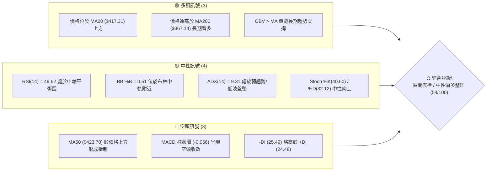

### 📊 核心指標速覽表

| 指標類別 | 指標名稱 | 當前數值 | 訊號 | 解讀 |
|:---|:---|:---|:---:|:---|
| **價格** | 當前收盤價 | **$417.69** | 🟡 | 位於52週區間 76.0% 位置，處於歷史高檔回撤後之收斂整理 |
| **短期均線** | MA20 / BB中軌 | **$417.31** | 🟢 | 現價微幅高於 MA20（+0.09%），短線多空在此拉鋸爭奪支撐 |
| **中期均線** | MA50 | **$423.70** | 🔴 | 現價低於 MA50（-1.42%），中期波段仍面臨反彈反壓 |
| **長期均線** | MA200 | **$367.14** | 🟢 | 現價高於 MA200（+13.77%），長期結構維持多頭牛市格局 |
| **超長期均線**| MA240 | **$353.58** | 🟢 | 現價高於 MA240（+18.13%），年線多頭扣抵安全邊際充裕 |
| **擺動動能** | RSI(14) | **49.62** | 🟡 | 位於 30–70 中性區間正中心，多空力量暫時平衡，無超買超賣 |
| **趨勢動能** | MACD (12,26,9)| **-0.219 / Sig: -0.163**| 🔴 | MACD Hist 為 **-0.056**，處於零軸下方微幅偏空收斂震盪 |
| **動量隨機** | KD (Stoch 14) | **%K 40.60 / %D 32.12** | 🟢 | 低檔金叉後向上發散，短線動能具備微幅反彈契機 |
| **趨勢強度** | ADX(14) | **9.31** | 🟡 | ADX < 25 極弱趨勢，表明市場進入標準的箱體窄幅震盪 |
| **通道狀態** | 布林通道帶寬 | **$401.31 ～ $433.31** | 🟡 | %B = 0.51，緊貼中軌，通道帶寬收窄醞釀後續方向選擇 |
| **量能指標** | 最新量 / 20日均量| **7.20M / 10.52M (0.68x)**| 🟡 | 量縮整理，OBV > MA 顯示籌碼未出現恐慌性拋售 |
| **真實波幅** | ATR(14) | **$10.30 (2.47%)** | 🟢 | 波動率降至低位，短線風險回撤幅度相對可控 |

### 🏆 技術評分卡

```
╔══════════════════════════════════════════════════════════════╗
║                技術評分卡 — TSM (2026-08-27)                  ║
╠══════════════════════════════════════════════════════════════╣
║  趨勢強度 (ADX/方向)   ████░░░░░░░░░░░░░░░░  25/100  🟡 弱勢盤整 ║
║  動能指標 (RSI/MACD)   ██████████░░░░░░░░░░  50/100  🟡 中性平衡 ║
║  支撐穩定度 (S1/Fib)   ██████████████░░░░░░  70/100  🟢 支撐穩固 ║
║  成交量配合 (OBV/量比) ████████████░░░░░░░░  60/100  🟢 籌碼沉澱 ║
║  形態完整度 (箱體整理) ████████████░░░░░░░░  60/100  🟡 區間收斂 ║
║  均線排列 (多時框MA)   ████████████░░░░░░░░  60/100  🟡 混合排列 ║
╠══════════════════════════════════════════════════════════════╣
║  綜合評分              ███████████░░░░░░░░░  54/100  中性整理   ║
╚══════════════════════════════════════════════════════════════╝
```

---

## 2. 趨勢分析

### 🌐 多時框趨勢分析

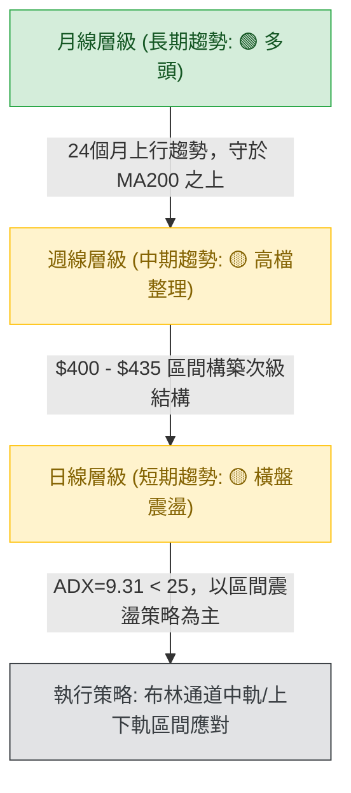

### 📈 長期趨勢 — 12個月走勢圖（Unicode）

```
TSM 月線走勢圖（過去12個月：2025-08 至 2026-08）
價格 ($)
$480 ┤                                           ● (2026-06 高點 $477.57)
$450 ┤                                         ╱   ╲
$420 ┤                                 ●─────●       ●←現價 $417.69
$390 ┤                         ●     ╱ (04-05月)       (07月拉回 $404.25)
$360 ┤                   ●   ╱   ╲ ╱
$330 ┤             ●   ╱   ╲     ● (2026-03)
$300 ┤       ●───●   ╱
$270 ┤ ●   ╱
$240 ┤  (2025-08 $228.34)
     └─┬───┬───┬───┬───┬───┬───┬───┬───┬───┬───┬───┬
      08  09  10  11  12  01  02  03  04  05  06  07  08 (月份)
```

#### 走勢特徵分析表格

| 階段時期 | 起迄價位 | 漲跌幅 | 走勢特徵與量價解讀 |
|:---|:---|:---|:---|
| **2025-08 ～ 2026-02** | $228.34 → $372.65 | **+63.20%** | 主升浪初期：月線連續收紅，AI晶片需求驅動強勁單邊突破。 |
| **2026-02 ～ 2026-03** | $372.65 → $337.16 | **-9.52%** | 急跌洗盤：波段獲利了結賣壓湧現，迅速在 Fib 61.8% 上方獲得支撐。 |
| **2026-03 ～ 2026-06** | $337.16 → $477.57 | **+41.64%** | 主升浪延伸：攻至歷史高點 $479.00（收盤 $477.57），動能見頂。 |
| **2026-06 ～ 2026-07** | $477.57 → $404.25 | **-15.35%** | 次級折返波：高檔量縮回撤至 Fib 23.6%（$418.62）與 S1（$404.56）區間。 |
| **2026-07 ～ 2026-08** | $404.25 → $417.69 | **+3.32%** | 區間沉澱打底：成交量萎縮，波動率下降，於布林中軌反覆築底。 |

### 📊 中期趨勢（週線分析）

```
近20週壓力支撐示意圖
$479.00 ──────────────────────────────────────── 52W 歷史極值高點
$449.11 ─ ─ ─ ─ ─ ─ ─ ─ ─ ─ ─ ─ ─ ─ ─ ─ ─ ─ ─ ─ 阻力 R3 (強阻力區)
$436.04 ─ ─ ─ ─ ─ ─ ─ ─ ─ ─ ─ ─ ─ ─ ─ ─ ─ ─ ─ ─ 阻力 R2 / BB 上軌 $433.31
$420.98 ─ ─ ─ ─ ─ ─ ─ ─ ─ ─ ─ ─ ─ ─ ─ ─ ─ ─ ─ ─ 阻力 R1 / Fib 23.6% $418.62
$417.69 ════════════════════════════════════════ ◄ 當前收盤價 ($417.69)
$404.56 ─ ─ ─ ─ ─ ─ ─ ─ ─ ─ ─ ─ ─ ─ ─ ─ ─ ─ ─ ─ 支撐 S1 / 近期波段回撤低點
$385.09 ─ ─ ─ ─ ─ ─ ─ ─ ─ ─ ─ ─ ─ ─ ─ ─ ─ ─ ─ ─ 支撐 S2 / Fib 38.2% $381.27
$367.14 ──────────────────────────────────────── 長期牛熊分界 MA200
```

週線指標顯示，2026年7月中旬經歷了一波快速修正（最低回測 $398.37），週線 RSI 一度跌至 27.9 的超賣區間，隨後於 8 月初反彈至 64.5。目前週線 MACD 柱狀圖收斂至 -0.056，週 RSI 回落至 49.6，顯示中期多頭主升浪已轉入**高檔矩形箱體整理**階段。

### ⚡ 趨勢強度評估（ADX 解讀）

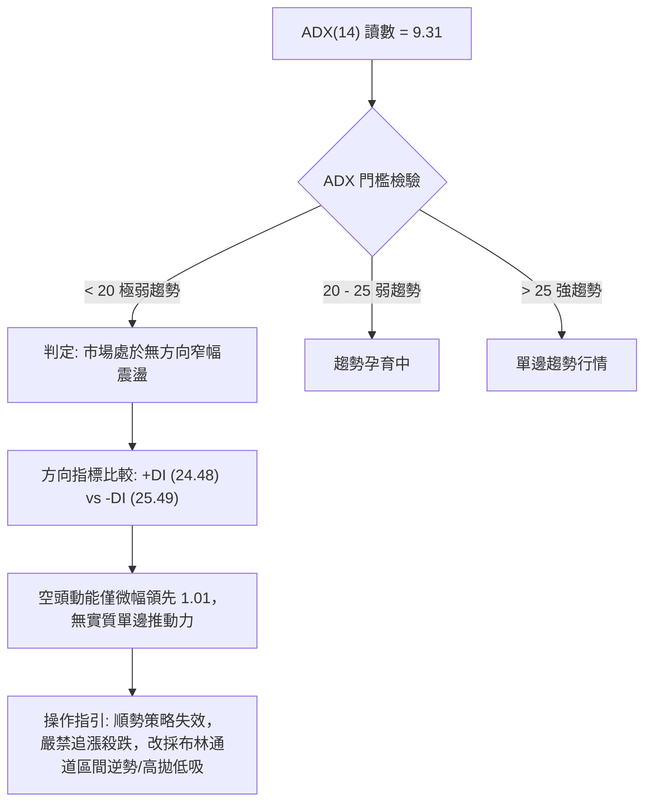

#### ADX 強度量化對照表

| ADX 區間 | 趨勢強度等級 | 當前數值 | 行情屬性判定 | 交易策略適配 |
|:---|:---|:---:|:---|:---|
| **0 ～ 20** | **極弱 / 無趨勢** | **9.31** ◄ | **典型的均值回歸盤整行情** | **通道震盪操作、高拋低吸** |
| 20 ～ 25 | 趨勢形成期 | — | 醞釀突破 | 縮小倉位、等待方向確立 |
| 25 ～ 40 | 強勢趨勢 | — | 單邊主升/主跌浪 | 順勢突破加碼、移動止盈 |
| 40 ～ 100 | 極強 / 動能竭盡 | — | 行情加速趕頂/恐慌見底 | 警惕背離與反轉風險 |

---

## 3. 圖表形態分析

### 🔍 形態識別系統

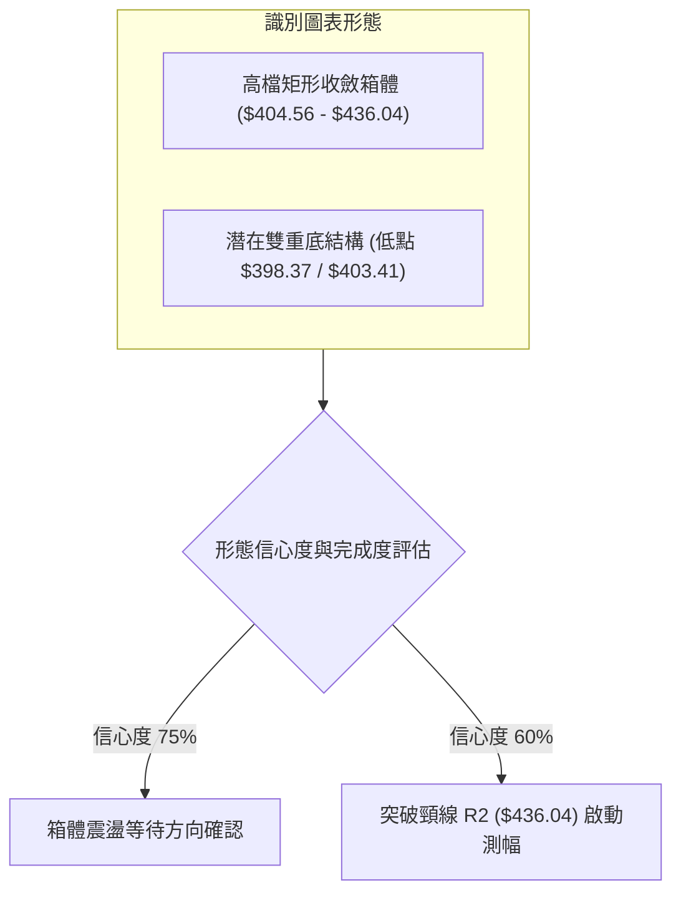

#### 形態信心度評估表

| 形態名稱 | 信心度 | 判斷依據（嚴格引用數據） | 完成度 | 目標價（附嚴謹計算式） |
|:---|:---:|:---|:---:|:---|
| **高檔矩形箱體 (Rectangle Box)** | **75%** | 箱底獲 S1（$404.56）與 7/26 低點支撐；箱頂受制於 R2（$436.04）與 BB上軌（$433.31）。 | **80%** | 上軌突破目標：$436.04 + ($436.04 - $404.56) = **$467.52**<br>下軌跌破目標：$404.56 - ($436.04 - $404.56) = **$373.08** |
| **短期雙底 (Double Bottom)** | **60%** | 2026-07-19 週低點 $398.37 與 2026-07-26 低點 $403.41 構成雙腳支撐，頸線位於 2026-08-16 週高點 $426.35。 | **65%** | 頸線 $426.35 + 形態高度 ($426.35 - $398.37 = $27.98) = **$454.33**（接近強阻力 R3 $449.11 區域） |
| **頭肩頂形態 (Head & Shoulders)** | **30%** | 數據中未偵測到完整右肩結構，信心度不足 50%，僅做指標型震盪解讀，不預先設定空頭測幅。 | **—** | 數據不足，不予計算。 |

### 🕯️ 重要K線形態分析

| 週/月份週期 | 收盤價 | K線組合形態 | 專業技術解讀 | 訊號評級 |
|:---|:---:|:---|:---|:---:|
| **2026-06 月K** | $477.57 | **長上影大陽線** | 測試歷史極值 $479.00 後遭遇強大獲利了結賣壓，多頭動能消耗殆盡。 | 🔴 看跌衰竭 |
| **2026-07 月K** | $404.25 | **長實體陰線吞沒** | 快速拉回測試長期均線支撐，單月重挫 15.35%，消化高檔浮額。 | 🔴 短期空頭 |
| **2026-08-02 週K**| $404.25 | **錘頭線 (Hammer)** | 於 S1 $404.56 附近獲得多頭買盤強力承接，成交量放大至 87.34M。 | 🟢 築底反彈 |
| **2026-08-16 週K**| $426.35 | **多頭反彈陽線** | 突破 MA20 並上測 MA50 ($423.70)，MACD 柱狀圖翻正至 +3.334。 | 🟢 短線轉強 |
| **2026-08-30 週K**| $417.69 | **十字星/紡錘線** | 價格於 Fib 23.6% ($418.62) 處陷入多空膠著，量能急縮，方向待定。 | 🟡 變盤收斂 |

### 📉 ASCII 走勢形態示意圖

```
TSM 日線高檔箱體收斂形態示意圖
$440 ┤                          [阻力 R2: $436.04]
     │          ╭───╮                ╭───╮
$430 ┤          │   │                │   │ ◄ 08-16 反彈高點 $426.35
     │    ╭─────╯   ╰─────╮    ╭─────╯   ╰────── [MA50: $423.70]
$420 ┤────┼───────────────┼────┼──────────────── [Fib 23.6%: $418.62 / 現價 $417.69]
     │    │               │    │                 [MA20: $417.31]
$410 ┤    │               ╰────╯
     │╭───╯                                    [支撐 S1: $404.56]
$400 ┤╯ ◄ 07-19 低點 $398.37 (雙底腳一)
     └────────────────────────────────────────────
```

### 🎯 形態目標價計算

若當前箱體由多頭向上突破，以 **高檔矩形箱體** 之垂直測幅法則進行計算：
1. **箱體上限（頸線壓制）**：採用阻力 R2 = **$436.04**
2. **箱體下限（底部支撐）**：採用支撐 S1 = **$404.56**
3. **形態垂直高度 ($H$)**：$$\$436.04 - \$404.56 = \$31.48$$
4. **多頭向上突破目標價 ($T_{up}$)**：$$\$436.04 + \$31.48 = \$467.52$$（介於 R3 $449.11 與 52W High $479.00 之間）
5. **空頭向下跌破目標價 ($T_{down}$)**：$$\$404.56 - \$31.48 = \$373.08$$（精準重合於 S3 $372.72 與 MA200 $367.14 強支撐帶）

---

## 4. 支撐與阻力

### 🗺️ 關鍵價位分布圖（Unicode）

```
TSM 價位結構分布圖
══════════════════════════════════════════════════════════════════
$479.00 ║████████████████████████████████║ 52週歷史高點 (52W High)
$449.11 ║████████████████████████        ║ 強阻力 R3 (波段高點聚類)
$436.04 ║████████████████                ║ 阻力 R2 (箱體上軌 / 密集反壓)
$420.98 ║████████                        ║ 關鍵阻力 R1 (Fib 23.6% $418.62 區域)
$417.69 ╠════════════════════════════════╣ ◄ 當前價格 $417.69 (BB中軌 $417.31)
$404.56 ║▓▓▓▓▓▓▓▓▓▓▓▓▓▓▓▓                ║ 近期關鍵支撐 S1 (箱體下軌 / 7月底部)
$385.09 ║████████████████████            ║ 強支撐 S2 (Fib 38.2% $381.27 緩衝區)
$372.72 ║████████████████████████        ║ 極強支撐 S3 (MA200 $367.14 核心防線)
══════════════════════════════════════════════════════════════════
```

### 🚧 阻力位分析表

| 阻力級別 | 精確價位 | 形成技術原因（基於 OHLCV 聚類） | 突破難度 | 重要性權重 |
|:---|:---:|:---|:---:|:---:|
| **R1** | **$420.98** | 近期日線反彈高點聚類，且與斐波那契 23.6%（$418.62）及 MA10（$419.35）重疊。 | 🟡 中等 | 70% |
| **R2** | **$436.04** | 近一年波段次高點聚集區，布林通道上軌（$433.31）與 6-7 月平台整理反壓。 | 🔴 較高 | 85% |
| **R3** | **$449.11** | 6月下旬下殺起跌點，多頭籌碼套牢密集區，為重返歷史高點前之最後強阻力。 | 🔴 極高 | 95% |

### 🛡️ 支撐位分析表

| 支撐級別 | 精確價位 | 形成技術原因（基於 OHLCV 聚類） | 守住機率 | 重要性權重 |
|:---|:---:|:---|:---:|:---:|
| **S1** | **$404.56** | 近期波段低點聚類，布林通道下軌（$401.31）與 7/26、8/02 兩週收盤低點防線。 | 🟢 75% | 80% |
| **S2** | **$385.09** | 近一年波段強支撐，緊鄰斐波那契 38.2%（$381.27）回調位，為中期多頭防守底線。 | 🟢 85% | 90% |
| **S3** | **$372.72** | 2026年2月平台低點，重疊長期生命線 MA200（$367.14）與 MA240（$353.58）。 | 🟢 95% | 98% |

### 📐 斐波那契回調位分析

依據 52 週極值區間（低點 **$223.16** → 高點 **$479.00**，波幅 **$255.84**）進行精確黃金分割對照：

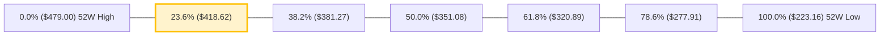

- **當前位置解讀**：現價 **$417.69** 精準落於 **23.6% 回調位 ($418.62)** 與 **38.2% 回調位 ($381.27)** 之間，且極度貼近 23.6% 水平（僅差距 -$0.93，幅度 -0.22%）。
- **技術意涵**：在強勢多頭趨勢中，強勢整理通常守在 23.6% 回調位附近；若能有效收復並站穩 $418.62 之上，表明此波回撤僅為淺度修正，後續仍具備再戰 52W 高點之實力；反之若跌破 S1，則將下探 38.2%（$381.27）強支撐帶。

---

## 5. 技術指標深度解讀

### 🎛️ 指標訊號總覽

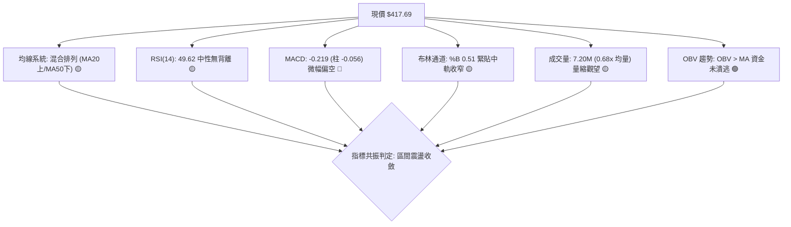

### 📈 移動平均線排列分析

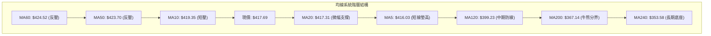

- **均線排列狀態**：當前呈現典型的「短中期均線糾纏、長期均線多頭排列」之混合格局。
- **短期均線 (MA5/10/20)**：現價位於 MA5（$416.03）與 MA20（$417.31）之上，但低於 MA10（$419.35），短線多空在 $417–$419 區間呈現高度膠著。
- **中期均線 (MA50/60)**：MA50（$423.70）與 MA60（$424.52）於上方形成蓋頭反壓，限制了短線反彈的拓展空間。
- **長期均線 (MA120/200/240)**：MA120（$399.23）、MA200（$367.14）、MA240（$353.58）呈現完美的多頭順向排列且持續向上發散，顯示中長期多頭格局牢不可破。

### 📉 RSI(14) 分析

```
RSI(14) 動能進度條：
0 ─────── 30 ──────────────── 50 ──────────────── 70 ─────── 100
[ 超賣區 ]   [   弱勢區間   ] ◄ 49.62 [   強勢區間   ]   [ 超買區 ]
████████████████████████░░░░░░░░░░░░░░░░░░░░░░░░░  49.62%
```

- **數值與區間判定**：當前 RSI(14) 為 **49.62**，處於 30–70 中性常態區間的幾何中心點，顯示市場既無過熱超買，亦無恐慌超賣。
- **背離檢驗**：
  - **頂背離檢驗**：2026-06 價格創歷史新高 $479.00 時，週 RSI 達到 61.5，未能超越 2026-04 高點之 RSI 76.5，曾出現中期頂背離並引發 7 月回調。
  - **底背離檢驗**：在 7 月底價格下探 $398.37 時 RSI 為 27.9，8 月次回測 $404.25 時 RSI 回升至 43.3，形成顯著的**日/週線級別底背離雛形**，支撐了當前的止跌反彈。
  - **當前結論**：現階段 RSI 走平於 50 附近，無新增背離訊號，動能處於真空蓄勢期。

### 📊 MACD(12/26/9) 訊號解讀

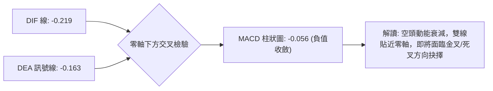

- **指標讀數**：DIF 為 **-0.219**，Signal (DEA) 為 **-0.163**，Histogram 為 **-0.056**。
- **量化特徵**：柱狀圖自 7 月中旬的極端負值 **-5.832** 大幅收斂至當前的 **-0.056**，負值柱狀體幾近歸零，表明空方下殺動能已完全釋放完畢，多方力量正在低檔進行修復性防守。

### 📦 布林通道分析

```
布林通道 (Bollinger Bands 20, 2) 結構圖
$433.31 ┬──────────────────────────────────────── BB 上軌 (+2σ)
        │
$425.00 ┼
        │
$417.69 ┼──────────────────●───────────────────── 現價 ($417.69) / BB %B = 0.51
$417.31 ┼┄┄┄┄┄┄┄┄┄┄┄┄┄┄┄┄┄┄┄┄┄┄┄┄┄┄┄┄┄┄┄┄┄┄┄┄┄┄┄ BB 中軌 (MA20: $417.31)
        │
$410.00 ┼
        │
$401.31 ┴──────────────────────────────────────── BB 下軌 (-2σ)
```

- **通道帶寬與位置**：上軌 **$433.31**、中軌 **$417.31**、下軌 **$401.31**，總帶寬為 **$32.00**（約 7.6%），呈現顯著的帶寬壓縮（Squeeze）狀態。
- **%B 指標解析**：當前 **%B = 0.51**，價格分毫不差地坐落於中軌水平線之上，表明短線波動率被極度壓抑，依據布林通道統計規律，帶寬收窄後必將迎來波動率擴張與新一輪單邊突破。

### 💹 成交量分析（量價配合度）

- **量能規模評估**：最新單日成交量為 **7,201,789 股**，相對於 20 日均量（**10,518,714 股**）之量比僅為 **0.68x**，相對於 50 日均量（**13,479,472 股**）呈現深度量縮。
- **量價關係解讀**：
  - 在價格回調至 $404 支撐區時，成交量顯著萎縮（相較於主升段單週 80M–90M 股降至 24M–50M 股水準），符合「上漲放量、回調縮量」的牛市回撤特徵。
  - **OBV (能量潮指標)**：當前明確呈現 `OBV > MA`，表明機構主力資金在回調過程中並未大舉出逃，量價配合健康度維持良好。

---

## 6. 動能與波動率

### ⚡ 動能評估四象限

| 象限分區 | 動能強度 (RSI/MACD) | 波動率水準 (ATR/帶寬) | TSM 當前歸屬狀態 | 專業戰略評估 |
|:---:|:---:|:---:|:---:|:---|
| **第一象限 (Q1)** | 強 (Bullish) | 低 (Low Vol) | — | 最佳波段順勢推升機會 |
| **第二象限 (Q2)** | **弱 / 中性 (Neutral)** | **低 (Low Vol)** | **✓ [TSM 當前所處位置]** | **箱體窄幅沉澱，觀望並預設區間網格操作** |
| **第三象限 (Q3)** | 強 (Bullish) | 高 (High Vol) | — | 單邊主升急漲，適配突破追買與動量交易 |
| **第四象限 (Q4)** | 弱 / 偏空 (Bearish) | 高 (High Vol) | — | 恐慌殺跌主跌段，嚴禁盲目抄底 |

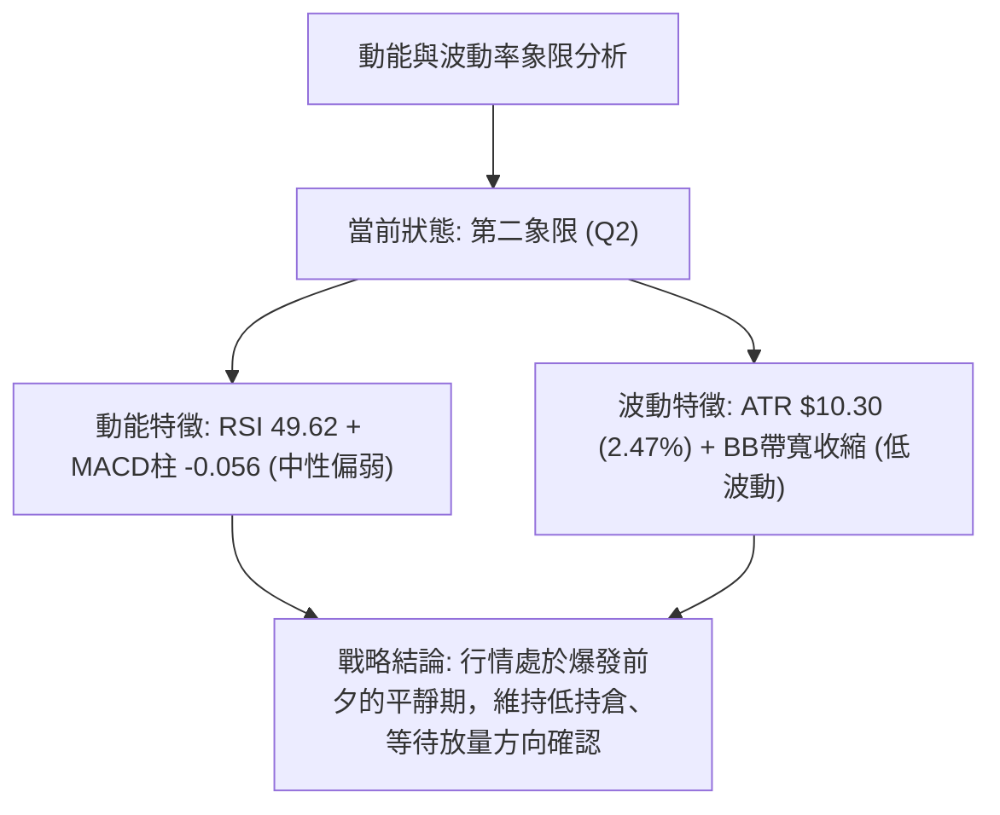

### 📊 ATR 波動率分析

- **ATR(14) 絕對值**：**$10.30**（佔現價比率為 **2.47%**）。
- **日內/波段波動界限**：
  - 單日技術性常態波動區間：現價 $\pm 1.0 \times \text{ATR} = \$417.69 \pm \$10.30 \rightarrow$ **$407.39 ～ $427.99**。
  - 極端波動安全邊界（$2.0 \times \text{ATR}$）：現價 $\pm 2.0 \times \text{ATR} = \$417.69 \pm \$20.60 \rightarrow$ **$397.09 ～ $438.29**。
- **風控止損距離建議**：針對日內與短線交易者，建議動態止損幅度設定為 **$1.5 \times \text{ATR} = \$15.45**，波段交易者建議設定為 **$2.0 \times \text{ATR} = \$20.60**，以避免在窄幅震盪中遭遇雜訊掃單出場。

### 📐 Beta 與市場相關性

- **Beta 係數**：**1.258**。
- **特徵解讀**：TSM 作為全球半導體龍頭與科技權值核心標的，其波動度相對於標普 500 指數高出約 25.8%。在科技板塊大盤上行週期中具備顯著的高彈性超額收益（Alpha），但在大盤系統性調整時亦承擔較高的系統性風險（Beta），因此短線操作需密切關注美股大盤環境。

---

## 7. 多時框架總結

### 📋 時框架評分表

| 時框架 | 趨勢方向 | 動能指標狀態 | 均線排列狀況 | 形態特徵 | 綜合評分 | 戰術指引 |
|:---|:---:|:---:|:---:|:---:|:---:|:---|
| **長期 (月線)** | 🟢 多頭 | RSI 偏多、長期多頭主升 | 多頭完美排列 (MA200上) | 歷史高檔大箱體蓄勢 | **85/100** | 逢低堅定做多，長期持有 |
| **中期 (週線)** | 🟡 整理 | MACD 柱收斂、RSI 49.6 | 均線高檔混合收斂 | 雙底回升、箱體測試 | **55/100** | 區間震盪應對，等待突破 |
| **短期 (日線)** | 🟡 震盪 | RSI 49.62、MACD -0.056 | 糾纏於 MA20 ($417.31) | 布林通道壓縮盤整 | **50/100** | 嚴控倉位，以中軌為錨高拋低吸 |

### 🔲 綜合訊號矩陣

```
╔══════════════════════════════════════════════════════════════════╗
║                   多時框架訊號矩陣收斂圖表                       ║
╠══════════════╦════════════╦════════════╦════════════╦════════════╣
║   時框維度   ║  趨勢維度  ║  動能維度  ║  量能維度  ║  綜合共振  ║
╠══════════════╬════════════╬════════════╬════════════╬════════════╣
║  短期 (日線) ║  🟡 橫盤   ║  🟡 中性   ║  🟡 量縮   ║  🟡 中性   ║
║  中期 (週線) ║  🟡 整理   ║  🟡 弱修復 ║  🟢 沉澱   ║  🟡 偏多   ║
║  長期 (月線) ║  🟢 牛市   ║  🟢 強勁   ║  🟢 支撐   ║  🟢 強多   ║
╚══════════════╩════════════╩════════════╩════════════╩════════════╝
```

### ⚖️ 多時框收斂結論

依據多時框收斂規則（嚴格要求 14）：
1. **行情屬性判定**：當前 ADX(14) = **9.31 < 25**，確立當前市場處於標準的**「低波盤整行情」**。
2. **主導時框與交易邊界**：在盤整行情中，中長期均線（MA200 $367.14）確立了長期底部安全邊界，而日線**布林通道上下軌（$401.31 ～ $433.31）**則直接主導了近期的價格交易區間。
3. **唯一方向性結論**：**【中性觀望 / 區間震盪收斂】**。
   - 短線不具備追價發動單邊趨勢之條件；策略完全聚焦於布林通道下軌與支撐位 S1（$404.56）附近的低吸機會，以及上軌與阻力位 R2（$436.04）附近的高拋機會。

---

## 8. 交易策略建議

### 🗺️ 策略決策流程圖

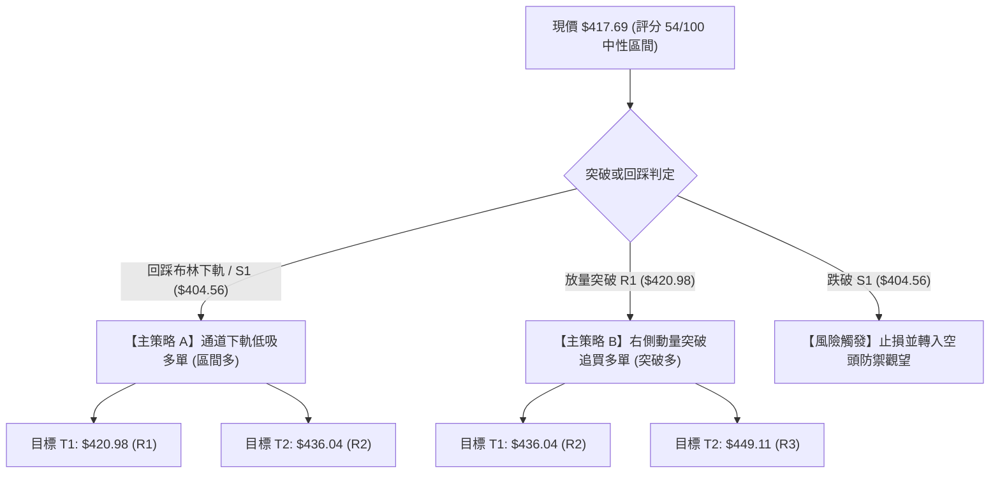

### 🧭 策略路由

> **當前主策略方向 = 區間震盪偏多操作（依綜合評分卡 54/100）**
> 鑑於 ADX = 9.31 極度低迷且綜合評分落於 40–60 之中性區間，禁止採用高槓桿單邊押注；整體主推**「布林帶下軌支撐回踩做多」**與**「右側確認突破做多」**兩套震盪應對方案，空頭方向僅作為風控止損與防禦提示。

### 🎯 價格情境階梯（Price Scenarios）

| 觸發條件 | 第一目標 | 後續延伸目標 | 技術情境含義 |
|:---|:---:|:---:|:---|
| **放量突破 R1 $420.98** | **R2 $436.04** | **R3 $449.11** | 短線擺脫 MA50 壓制，多頭動能重燃，挑戰箱頂。 |
| **持穩於現價 $417.69 ～ $404.56** | — | — | 維持在布林帶中下軌間進行籌碼沉澱與橫盤震盪。 |
| **有效跌破 S1 $404.56** | **S2 $385.09** | **S3 $372.72** | 箱體結構破位，中期拉回加深，回測 Fib 38.2% 與 MA200。 |

### 📊 情境機率分佈

| 預測情境 | 發生機率 | 主要技術依據（嚴格引用指標） |
|:---|:---:|:---|
| **情境一：區間震盪收斂** | **55%** | **ADX = 9.31** 極弱趨勢、**RSI = 49.62** 處於平衡軸、成交量僅 0.68x 均量。 |
| **情境二：向上突破反彈** | **30%** | **OBV > MA** 資金未退、日線雙底成形、長週期均線（MA200 $367.14）多頭向上。 |
| **情境三：向下破位回跌** | **15%** | **MACD 柱狀圖為負 (-0.056)**、-DI (25.49) > +DI (24.48)、MA50 ($423.70) 蓋頂。 |

### 🟢 主策略詳情

| 策略要素 | 策略 A：左側下軌低吸（主推策略） | 策略 B：右側突破加碼（確認策略） |
|:---|:---|:---|
| **交易類型** | 區間下軌均值回歸多單 | 阻力突破動量順勢多單 |
| **進場條件** | 價格回踩 S1（$404.56）或 BB 下軌（$401.31）獲支撐收下影線 | 日線收盤價帶量放量突破 R1（$420.98）之上 |
| **精確進場點** | **$404.56** | **$421.50**（突破 $420.98 確認後進場） |
| **目標價 T1** | **$420.98** (阻力 R1 / +4.06%) | **$436.04** (阻力 R2 / +3.45%) |
| **目標價 T2** | **$436.04** (阻力 R2 / +7.78%) | **$449.11** (阻力 R3 / +6.55%) |
| **嚴格止損點** | **$396.00** (跌破 7月低點 $398.37 與下軌) | **$414.00** (跌回 MA20 $417.31 之下) |
| **風險報酬比** | **1 : 3.68**（以 T2 計算：潛在收益 $31.48 / 潛在風險 $8.56） | **1 : 3.68**（以 T2 計算：潛在收益 $27.61 / 潛在風險 $7.50） |
| **成功機率** | **65%** | **60%** |
| **建議倉位** | **15% - 20%** 基礎波段倉位 | **10% - 15%** 動態加碼倉位 |

### 🔴 反向風險觸發點（對沖提示）

- **多頭結構失效閥值**：若日線收盤價跌破 **S1 ($404.56)** 且成交量放大，代表短期雙底形態失敗，主策略應立即全數止損出場。
- **空頭避險啟動點**：若進一步跌破 **$398.37**，投資人應考慮對現貨部位進行相應比例的空頭對沖（如買入看跌期權），第一回補目標鎖定在 **S2 ($385.09)**，極端防禦目標鎖定在 **S3 ($372.72)** 及 MA200 附近。

### ⭐ 整體訊號強度評星

```
╔══════════════════════════════════════════════════════════════╗
║  做多訊號強度：  ★★★☆☆  (3.0 / 5星 - 中期趨勢支撐但缺乏短線動能)║
║  做空訊號強度：  ★★☆☆☆  (2.0 / 5星 - 長期牛市格局限制下跌空間)  ║
║  整體策略可信度：★★★★☆  (4.0 / 5星 - 區間邊界清晰，風控依據扎實)║
╚══════════════════════════════════════════════════════════════╝
```

---

## 9. 風險提示與監控

### ✅ 關鍵監控指標 Checklist

```
╔══════════════════════════════════════════════════════════════╗
║                     每日/每週盤後技術監控清單                  ║
╠══════════════════════════════════════════════════════════════╣
║ [ ] 價格是否有效站上 MA50 ($423.70)？（確立波段重啟訊號）     ║
║ [ ] RSI(14) 是否突破 55 強弱分水嶺？（動能轉強確認）         ║
║ [ ] MACD 柱狀圖是否由負轉正 (Hist > 0)？（黃金交叉訊號）       ║
║ [ ] 日成交量是否放大至 20日均量 (10.52M) 之 1.2 倍以上？      ║
║ [ ] 價格是否跌破 S1 ($404.56) / BB 下軌 ($401.31)？（破位警告）║
║ [ ] ADX(14) 是否脫離 < 20 區間並向上發散？（單邊趨勢啟動）   ║
╚══════════════════════════════════════════════════════════════╝
```

### ⚠️ 風險場景分析

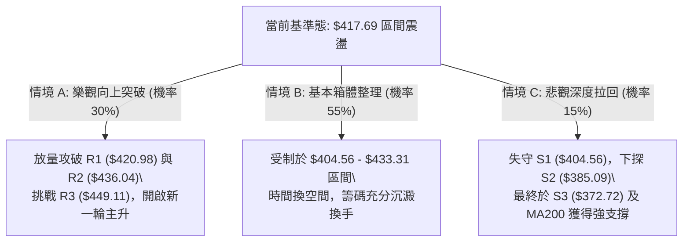

### 🛡️ 風險管理重要提醒

1. **嚴禁震盪區中軸追單**：現價 $417.69 緊貼布林中軌（$417.31）與 Fib 23.6%（$418.62），處於多空拉鋸之「無優勢區域」，在此處隨意開倉將大幅降低風險報酬比。應嚴格執行「接近下軌低吸、接近上軌高拋」之紀律。
2. **波動率壓縮警訊**：布林通道與 ATR 均顯示當前處於低波壓縮末期，市場即將迎來方向性選擇。一旦放量突破或跌破，必須立刻切換為趨勢順勢策略，嚴格執行預設之止損點位（策略 A 止損 $396.00，策略 B 止損 $414.00）。
3. **倉位配置原則**：在 ADX < 25 期間，總交易部位建議控制在總資金的 30% 以內，保留充裕的現金部位以應對後續趨勢明朗後的加碼操作。

---

## 📋 報告總結

```
╔══════════════════════════════════════════════════════════════════╗
║                   TSM 技術分析報告總結 (2026-08-27)             ║
╠══════════════════════════════════════════════════════════════════╣
║  當前價格：$417.69 ｜ 52W 區間：$223.16 - $479.00 (76.0% 分位)    ║
║  技術評級：⚖️ 中性偏多整理（綜合技術評分：54 / 100）           ║
╠══════════════════════════════════════════════════════════════════╣
║  【核心趨勢結論】                                                ║
║  ├─ 長期趨勢 (月線)：🟢 強勢多頭 (守於 MA200 $367.14 之上)       ║
║  ├─ 中期趨勢 (週線)：🟡 高檔收斂 (介於 S1 $404.56 與 R2 $436.04)║
║  ├─ 短期趨勢 (日線)：🟡 橫盤震盪 (ADX=9.31，極弱趨勢，布林收窄)  ║
║  ├─ 關鍵核心支撐：S1: $404.56 ｜ S2: $385.09 ｜ S3: $372.72     ║
║  ├─ 關鍵核心阻力：R1: $420.98 ｜ R2: $436.04 ｜ R3: $449.11     ║
║  └─ 分析師共識均價：$554.45 (強烈買入評級 / 18 位分析師)        ║
╠══════════════════════════════════════════════════════════════════╣
║  【最優交易策略組合】                                            ║
║  1. 🥇 最佳機會（策略 A - 區間低吸）：                          ║
║     於 S1 ($404.56) 附近掛單低吸，止損 $396.00，目標看 $436.04， ║
║     風險報酬比高達 1 : 3.68。                                    ║
║  2. 🥈 次選機會（策略 B - 突破加碼）：                          ║
║     帶量突破 R1 ($420.98) 後順勢跟進，止損 $414.00，目標 $449.11。║
║  3. 🥉 保守選擇（觀望等待）：                                    ║
║     等待 ADX 回升至 20 以上且價格突破箱體 ($404.56 - $436.04)    ║
║     再行介入單邊趨勢波段。                                      ║
╚══════════════════════════════════════════════════════════════════╝
```

---

> ⚠️ **免責聲明**：本報告為技術分析研究成果，所有數據及模型推演均基於歷史市場交易資訊。本報告**僅供學術研究與投資參考**，**不構成任何形式的個別投資建議或買賣邀約**。金融市場具有高度風險，投資人應依據自身風險承受能力審慎評估，並自負投資盈虧。

---

*報告生成時間：2026-08-27 ｜ 數據來源：Yahoo Finance ｜ 分析框架：多時框技術量化分析架構*