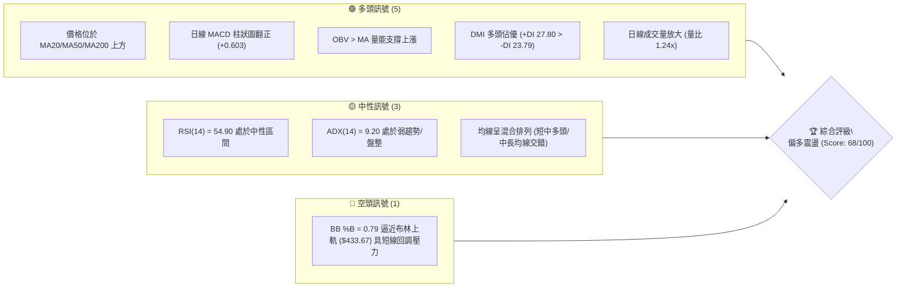
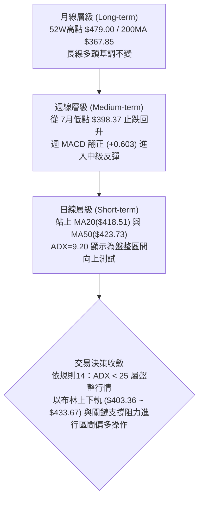
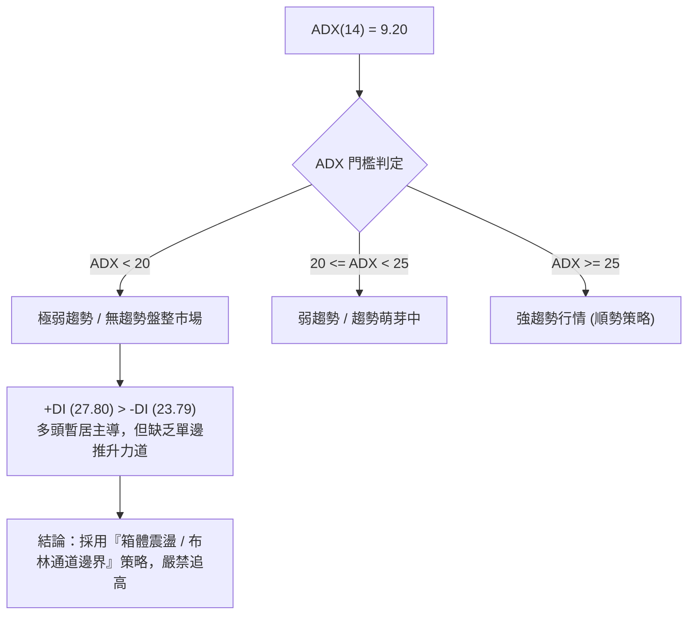
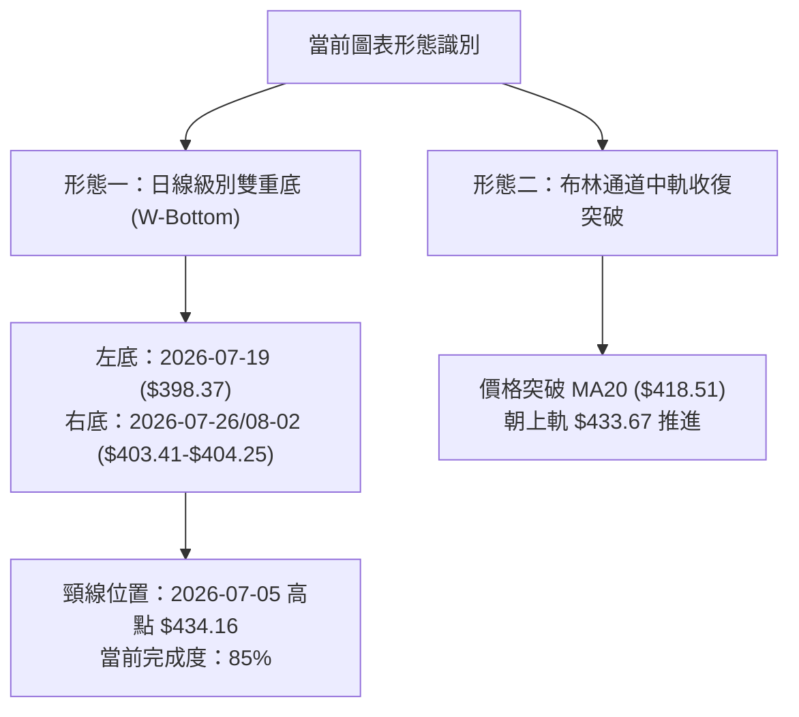
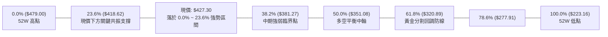
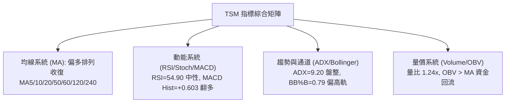
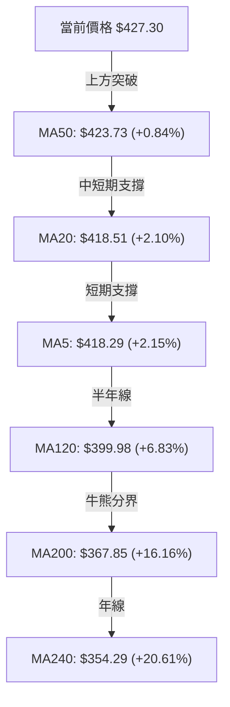
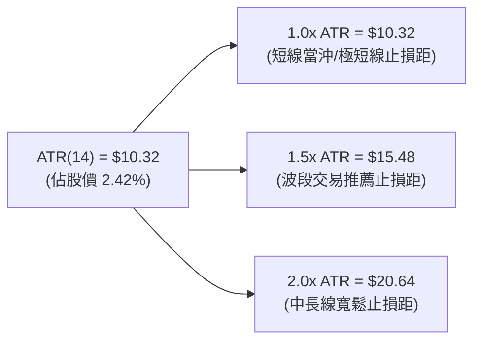
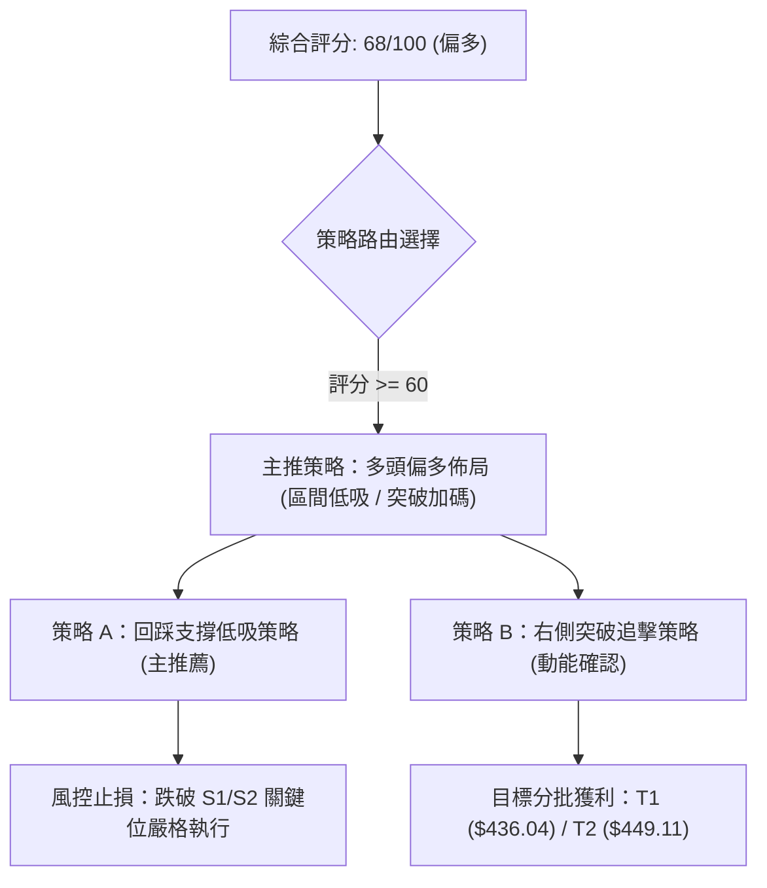
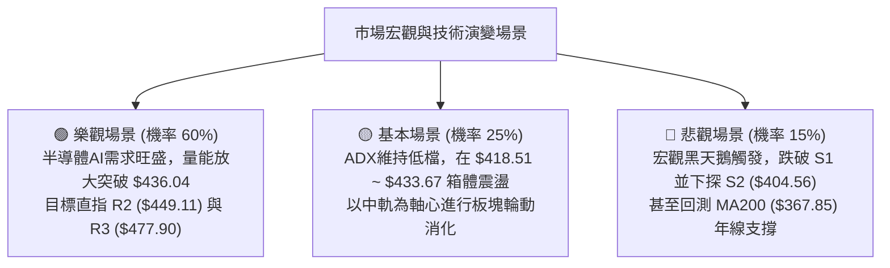

# TSM 技術分析報告

> **報告日期**：2026-08-28 ｜ **語言**：繁體中文 ｜ **數據來源**：Yahoo Finance ｜ **當前價格**：$427.30

---

## 目錄

| 章節 | 內容 |
|------|------|
| [1. 技術面概覽](#1-技術面概覽) | 訊號儀表板、核心指標、評分卡 |
| [2. 趨勢分析](#2-趨勢分析) | 多時框趨勢、長中短期走勢 |
| [3. 圖表形態分析](#3-圖表形態分析) | 形態識別、K線組合、目標價 |
| [4. 支撐與阻力](#4-支撐與阻力) | 關鍵價位、斐波那契回調 |
| [5. 技術指標深度解讀](#5-技術指標深度解讀) | MA/RSI/MACD/布林/成交量 |
| [6. 動能與波動率](#6-動能與波動率) | 動能評估、ATR、Beta |
| [7. 多時框架總結](#7-多時框架總結) | 時框架評分矩陣 |
| [8. 交易策略建議](#8-交易策略建議) | 多空策略、風險報酬比 |
| [9. 風險提示與監控](#9-風險提示與監控) | 監控指標、風險場景 |

---

## 1. 技術面概覽

### 🎯 技術訊號儀表板



### 📊 核心指標速覽表

| 指標類別 | 指標名稱 | 當前數值 | 訊號 | 解讀 |
|----------|----------|----------|------|------|
| **價格** | 當前價格 | $427.30 | 🟢 | 站上所有主要均線，位於52週區間79.8%分位 |
| **均線** | MA20 | $418.51 | 🟢 | 價格在MA20上方 (+2.10%)，短線支撐確立 |
| **均線** | MA50 | $423.73 | 🟢 | 價格在MA50上方 (+0.84%)，中期趨勢修復 |
| **均線** | MA200 | $367.85 | 🟢 | 價格大幅高於MA200 (+16.16%)，長期多頭穩固 |
| **動能** | RSI(14) | 54.90 | 🟡 | 位於 30-70 中性常態區間，無超買超賣，無背離 |
| **動能** | MACD (12,26,9) | Hist: +0.603 | 🟢 | MACD線(0.591)高於訊號線(-0.012)，柱狀圖看多 |
| **動能** | Stoch %K / %D | 71.71 / 50.66 | 🟡 | 動能自低檔向上發散，接近偏強區但尚未超買 |
| **趨勢強度**| ADX(14) | 9.20 | 🟡 | ADX < 25 表明處於盤整震盪行情，以區間邏輯主導 |
| **方向系統**| +DI / -DI | 27.80 / 23.79 | 🟢 | +DI 高於 -DI，多頭動能占據主導地位 |
| **通道** | 布林通道 %B | 0.79 | 🟡 | 位於中軌($418.51)與上軌($433.67)之間偏高位置 |
| **量能** | 最新量 / 20日均量| 12.73M / 10.29M| 🟢 | 量比 1.24x，OBV > MA，量能有效確認短線回升 |
| **波動** | ATR(14) | $10.32 | 🟡 | 佔股價 2.42%，屬於中等正常波動水準 |

### 🏆 技術評分卡

```
╔══════════════════════════════════════════════════════════════╗
║                技術評分卡 — TSM (2026-08-28)                 ║
╠══════════════════════════════════════════════════════════════╣
║ 趨勢強度 (Trend)     ████████░░░░░░░░░░░░  40/100  🟡 盤整震盪 ║
║ 動能指標 (Momentum)  ██████████████░░░░░░  70/100  🟢 偏多修復 ║
║ 支撐穩定度 (Support) ████████████████░░░░  80/100  🟢 底部紮實 ║
║ 成交量配合 (Volume)  ██████████████░░░░░░  70/100  🟢 量增價揚 ║
║ 形態完整度 (Pattern) ██████████████░░░░░░  70/100  🟢 區間築底 ║
║ 均線排列 (MA System) ████████████████░░░░  80/100  🟢 全線收復 ║
╠══════════════════════════════════════════════════════════════╣
║ 綜合評分 (Overall)   █████████████░░░░░░░  68/100  🟢 偏多震盪 ║
╚══════════════════════════════════════════════════════════════╝
```

---

## 2. 趨勢分析

### 🌐 多時框趨勢分析



### 📈 長期趨勢 — 12個月走勢圖（Unicode）

```
TSM 月線走勢圖（2025-08 至 2026-08）
價格軸 ($)
$480 ┤                                           ● 2026-06 ($477.57 歷史高位區)
$450 ┤                                          / \
$420 ┤                                    ●    /   \   ● 2026-08 ($427.30 現價)
$390 ┤                              ●    / \  /     \ /
$360 ┤                        ●    / \  /   \/       ● 2026-07 ($404.25 低檔回測)
$330 ┤                  ●    / \  /   \/
$300 ┤            ●    / \  /   \/
$270 ┤      ●    / \  /   \/
$240 ┤●    / \  /   \/
$210 ┤ \  /   \/
$180 ┤  \/
     └─────────────────────────────────────────────────────────────────────────────►
       08  09  10  11  12  01  02  03  04  05  06   07   08 (月份)
      2025                                     2026
```

#### 走勢特徵分析表格

| 階段區間 | 起止月份 | 價格區間 ($) | 區間漲跌幅 | 走勢特徵與量價結構 |
|----------|----------|--------------|------------|-------------------|
| **主升段起點** | 2025-08 → 2025-12 | $228.34 → $302.33 | +32.40% | 穩健墊高，突破 $300 整數心理關卡，長線多頭確立 |
| **主升擴展段** | 2025-12 → 2026-06 | $302.33 → $477.57 | +57.96% | 呈現強勁推升，創出歷史高點 $479.00，均線多頭發散 |
| **高位修正段** | 2026-06 → 2026-07 | $477.57 → $404.25 | -15.35% | 獲利了結賣壓湧現，單月回調回測斐波那契 23.6% 區域 |
| **築底修復段** | 2026-07 → 2026-08 | $404.25 → $427.30 | +5.70% | 探底 $398.37 後止跌回升，收復日線 MA20/50，進入盤整修復 |

### 📊 中期趨勢（週線分析）

```
TSM 近期週線結構示意圖
阻力帶  $436.04 (R1) ────────────────────────── (近期波段反彈阻力)
                     ▲          ▲
現價    $427.30 ─────┼──────────┼────────────── (站上 MA50: $423.73)
                     │ 震盪走高 │
支撐帶  $419.19 (S1) ─┴──────────┴────────────── (MA20: $418.51 / Fib 23.6%: $418.62)
強支撐  $404.56 (S2) ══════════════════════════ (7月探底低點 $398.37-$404.25 密集群)
```

近20週數據顯示，TSM 在 2026-06-21 觸及週收盤高點 $462.12 後展開 ABC 修正，於 2026-07-19 當週創下低點 $398.37（週 RSI 降至 27.9 超賣區）。隨後在 8 月初展開三連陽反彈，週 MACD 柱狀圖由 -5.832 快速翻正至 +0.603，表明中期跌勢已完全遏制，進入中性偏多的寬幅震盪築底階段。

### ⚡ 趨勢強度評估（ADX 解讀）



| 指標項 | 數值 | 狀態 | 交易指引 |
|--------|------|------|----------|
| **ADX(14)** | 9.20 | 弱趨勢/盤整 (<25) | 趨勢強度不足，市場缺乏單邊推動力，順勢突破策略易產生假突破 |
| **+DI (14)** | 27.80 | 多方佔優 | 多頭買盤力道大於空方賣盤 |
| **-DI (14)** | 23.79 | 空方衰退 | 空方下殺動能已從7月高檔大幅衰退 |
| **市場狀態** | 震盪偏多 | 區間交易為主 | 以 S1 ($419.19) ~ R1 ($436.04) / R2 ($449.11) 進行高拋低吸 |

---

## 3. 圖表形態分析

### 🔍 形態識別系統



#### 形態識別與信心度評估表

| 形態名稱 | 信心度 | 判斷依據（引用數據） | 完成度 | 目標價（附精確計算式） |
|----------|--------|----------------------|--------|------------------------|
| **日線雙重底 (Double Bottom)** | 70% | 2026-07-19 低點 $398.37 與 2026-07-26/08-02 低點 $403.41~$404.25 構成雙底（吻合 S2 $404.56 支撐聚類）；現價 $427.30 已逼近頸線 | 85% | 形態高度 = 頸線 $434.16 - 左底 $398.37 = $35.79。<br/>量度目標價 = 頸線 $434.16 + $35.79 = **$469.95**（向上測試 52W 高點 $479.00 區域） |
| **布林通道中軌突破形態** | 80% | 價格向上穿越中軌 MA20 ($418.51)，%B 達到 0.79，日成交量放大至 12.73M (量比 1.24x) | 100% | 通道上軌目標價 = **$433.67**（已接近達成） |
| **頭肩頂形態 (潛在反轉)** | 35% | 信心度不足 50%。雖然 2026-06 觸及 $477.57 高點後拉回，但回調守穩 MA200 ($367.85) 及 Fib 23.6% ($418.62)，未跌破頸線 $385.09 (S3)，故頭肩頂未成立，僅作指標型防範 | 未成形 | 若跌破 S3 $385.09 則頭肩頂成立，目標指向 MA200 |

### 🕯️ 重要K線形態分析

| 期間/日期 | 收盤價 | K線形態 | 技術解讀 | 多空訊號 |
|-----------|--------|---------|----------|----------|
| **2026-07-19** | $398.37 | 長黑下影線 (探底針) | 週線帶量重挫 (成交量 91.50M)，下影線探測 Fib 38.2% ($381.27) 前止跌 | 🟡 止跌訊號 |
| **2026-08-02** | $404.25 | 低檔十字星/晨星孕育 | 二次探底不破 $398.37，週成交量放大至 87.34M，多空交戰激烈，空頭力竭 | 🟢 築底確認 |
| **2026-08-16** | $426.35 | 中陽線實體突破 | 週線強勢反彈，連續收復 MA20 與 MA50，MACD 柱狀圖由負翻正 (+3.334) | 🟢 轉強確認 |
| **2026-08-28 (即時)**| $427.30 | 高檔小紅整理棒 | 日線量比 1.24x 溫和放大，穩居短期均線之上，消化 R1 ($436.04) 賣壓 | 🟢 偏多蓄勢 |

### 📉 ASCII 走勢形態示意圖

```
TSM 雙重底 (W-Bottom) 與布林通道突破示意圖
=============================================================================
阻力位 R1  $436.04 ----------------------------------[頸線阻力區 $434-$436]
BB上軌     $433.67 ------------------/------------ 
現價       $427.30 -------------●---/------------ [現價位置: 頸線下方蓄勢]
                               /   \ /
BB中軌/MA20$418.51 -----------/-----V------------ [突破回踩中軌確立]
                             /
支撐位 S2  $404.56 ---------●-------------------- [右底: 2026-08-02 $404.25]
                           /
低點       $398.37 -------●---------------------- [左底: 2026-07-19 $398.37]
=============================================================================
```

### 🎯 形態目標價計算

1. **第一階段目標價（布林上軌與短線阻力聚類）**：
   - 阻力聚類：$433.67（布林上軌）與 **$436.04**（波段阻力 R1）。
   - 預期漲幅：以現價 $427.30 計算，距離 R1 約有 **+2.05%** 空間。
2. **第二階段形態量度目標價（雙底頸線突破）**：
   - 計算公式：量度目標 = 頸線高點 $434.16 + (頸線高點 $434.16 - 左底低點 $398.37) = $434.16 + $35.79 = **$469.95**。
   - 該目標價位介於阻力位 **R2 ($449.11)** 與 **R3 ($477.90)** 之間，吻合技術對稱結構。

---

## 4. 支撐與阻力

### 🗺️ 關鍵價位分布圖（Unicode）

```
╔══════════════════════════════════════════════════════════════════╗
║                    TSM 價位結構分布圖 (Price Map)                ║
╠══════════════════════════════════════════════════════════════════╣
║ $479.00 ║██████████████████████████████║ 52W 最高點 / Fib 0.0%  ║
║ $477.90 ║████████████████████████████  ║ 強阻力 R3 (+11.84%)    ║
║ $449.11 ║████████████████████          ║ 中期阻力 R2 (+5.10%)   ║
║ $436.04 ║████████████████              ║ 短線關鍵阻力 R1 (+2.05%)║
║ $433.67 ║▒▒▒▒▒▒▒▒▒▒▒▒                  ║ 布林上軌 (BB Upper)    ║
║ ────────╫──────────────────────────────╫─────────────────────── ║
║ $427.30 ╠══════════════════════════════╣ ◄ 現價 (Current Price)  ║
║ ────────╫──────────────────────────────╫─────────────────────── ║
║ $419.19 ║▓▓▓▓▓▓▓▓▓▓▓▓                  ║ 短線支撐 S1 (-1.90%)   ║
║ $418.62 ║▓▓▓▓▓▓▓▓▓▓▓▓                  ║ Fib 23.6% 回調位       ║
║ $418.51 ║▓▓▓▓▓▓▓▓▓▓▓▓                  ║ 布林中軌 / MA20 支撐   ║
║ $404.56 ║████████████████████          ║ 強支撐 S2 (-5.32%)     ║
║ $403.36 ║████████████████████          ║ 布林下軌 (BB Lower)    ║
║ $385.09 ║████████████████████████████  ║ 長期防守支撐 S3 (-9.88%)║
║ $381.27 ║████████████████████████████  ║ Fib 38.2% 回調位       ║
║ $367.85 ║██████████████████████████████║ 長期生命線 MA200       ║
╚══════════════════════════════════════════════════════════════════╝
```

### 🚧 阻力位分析表

| 阻力級別 | 價位 | 形成原因 | 突破難度 | 重要性 |
|----------|------|----------|----------|--------|
| **R1 (短線阻力)** | **$436.04** | 近一年波段高點聚類、雙底頸線密集區 ($434.16)、接近布林上軌 ($433.67) | 中等 (需要日成交量持續放大至 13.5M 以上) | 🟢 短線多空分水嶺 |
| **R2 (中期阻力)** | **$449.11** | 6月下旬回調時的下跌跳空前低聚類、整數關卡心理阻力 | 高 (需週線級別 MACD 持續紅柱擴大配合) | 🟡 中期多頭反彈目標 |
| **R3 (強阻力)** | **$477.90** | 歷史天花板聚類，極為接近 52 週最高點 **$479.00** | 極高 (獲利了結與歷史套牢賣壓沉重) | 🔴 長期趨勢頂部壓制 |

### 🛡️ 支撐位分析表

| 支撐級別 | 價位 | 形成原因 | 守住機率 | 重要性 |
|----------|------|----------|----------|--------|
| **S1 (短線支撐)** | **$419.19** | 近期波段低點聚類，與 MA20 ($418.51)、Fib 23.6% ($418.62) 高度共振 | 75% | 🟢 短線多頭防守第一線 |
| **S2 (中期強支撐)**| **$404.56** | 7月下旬至8月初三次探底低點聚類 ($403.41-$404.25)，布林下軌 ($403.36) | 85% | 🟡 中期底部防線 |
| **S3 (長線生命線)**| **$385.09** | 近一年波段深幅修正低點聚類，緊鄰 Fib 38.2% ($381.27) 及 MA200 ($367.85) | 95% | 🔴 長期多頭趨勢不容跌破 |

### 📐 斐波那契回調位分析

*基準區間：52週最低點 $223.16 → 52週最高點 $479.00（垂直落差 $255.84）*



- **位置判定**：當前價格 **$427.30** 位於 **Fib 0.0% ($479.00)** 與 **Fib 23.6% ($418.62)** 之間（處於 52 週全區間的 79.8% 高位分位）。
- **結構意義**：
  1. 價格在 7 月回調中僅短暫下探 $398.37 即快速收復 **Fib 23.6% ($418.62)**，回調幅度甚至未觸及 **Fib 38.2% ($381.27)**，這屬於典型的**強勢淺度回調**。
  2. 現價成功站穩 Fib 23.6% 之上，表明自 $223.16 以來的大級別多頭結構完全未遭破壞，具備進一步挑戰上方 0.0% ($479.00) 的結構潛力。

---

## 5. 技術指標深度解讀

### 🎛️ 指標訊號總覽



### 📈 移動平均線排列分析



#### 均線狀態深度評估

| 均線名稱 | 數值 ($) | 偏離度 (%) | 趨勢斜率特徵 | 訊號解讀 |
|----------|----------|------------|--------------|----------|
| **MA 5** | $418.29 | +2.15% | ▅▄▄▅...▇████ 短期快速翻揚 | 🟢 極短線多頭主控 |
| **MA 10**| $419.03 | +1.97% | █▇▇...▇▇▇▇▆▆ 扣低助漲 | 🟢 短線底部抬高 |
| **MA 20**| $418.51 | +2.10% | ▂▂▁▁▂▂▂▃▃ 走平並開始微幅向上 | 🟢 確立為短線基底 |
| **MA 50**| $423.73 | +0.84% | ▁▁▂...████▇ 走平偏多 | 🟢 價格重回中期生命線 |
| **MA 60**| $424.21 | +0.73% | ▄▄▅▅▆▇████ 走平緩升 | 🟢 季線失而復得 |
| **MA120**| $399.98 | +6.83% | ▅▅▆▆▇▇████ 持續向上發散 | 🟢 中長線多頭支撐 |
| **MA200**| $367.85 | +16.16%| 穩健向上陡峭爬升 | 🟢 長期牛市格局極其穩固 |
| **MA240**| $354.29 | +20.61%| ▅▅▆▆▇▇████ 向上無下彎跡象 | 🟢 超長線多頭基石 |

**均線排列總結**：當前均線系統定義為「**混合排列**」，主要原因在於短期均線 (MA5/10/20) 剛自低檔黃金交叉向上穿越，但 MA20 ($418.51) 與 MA50 ($423.73) 尚未完成完全的多頭順序排列。然而，現價 **$427.30** 已一舉站上所有短期、中期與長期均線，價格行為領先於均線系統，屬於強勢震盪向上修復格局。

### 📉 RSI(14) 分析

```
RSI(14) 水平指針 (當前值: 54.90)
0       20       30               50       60               70       80      100
├────────┼────────┼────────────────┼───────●┼────────────────┼────────┼────────┤
       超賣區               中性偏強平衡區(54.90)              超買區
進度條：███████████░░░░░░░░░ 54.90%
```

- **區間評估**：RSI(14) 為 **54.90**，精準落在 50-60 的中性偏強區間，既無 70 以上的超買過熱風險，也已完全擺脫 7 月底 27.9 的超賣恐慌區。
- **背離分析**：
  - 價格自 7 月底低點 $398.37 回升至 $427.30，RSI 由 27.9 同步回升至 54.90，指標與價格方向一致。
  - 結論：**無頂背離，亦無底背離**。動能健康修復，未出現動能衰竭預警。

### 📊 MACD(12,26,9) 訊號解讀


- 日線 MACD 柱狀圖讀數為 **+0.603**，快線突破慢線形成標準零軸上方的黃金交叉。
- 週線 MACD 柱狀圖亦從 7 月中旬的 -5.832 谷底大幅收斂翻正至 **+0.603**，顯示多時框動能形成**共振多頭訊號**。

### 📦 布林通道分析

```
TSM 日線布林通道 (20, 2) 結構圖
======================================================================
$433.67 ----------------------------- 上軌 (Upper Band) - 短線壓制
                ● $427.30 (現價，位於 %B = 0.79 高位區)
$418.51 ----------------------------- 中軌 (Middle Band / MA20) - 核心支撐
$403.36 ----------------------------- 下軌 (Lower Band) - 強力防守
======================================================================
```

- **通道帶寬與位置**：帶寬為 $433.67 - $403.36 = $30.31（帶寬比 7.24%），呈現溫和收斂後微幅開口。
- **%B 指標解讀**：%B = **0.79**，表明價格已運行至通道上軌與中軌之間的上四分位。在 ADX < 25 的盤整環境下，當 %B 接近 0.8-1.0 時，短線追高易面臨上軌 **$433.67** 的壓制回調，最佳買點應等待回踩中軌 **$418.51**。

### 💹 成交量分析（量價配合度）

```
TSM 成交量對比圖
最新量 (12.73M)  ████████████████████████ 12.73M (量比: 1.24x) 🟢 量增
20日均量(10.29M) ███████████████████ 10.29M
50日均量(13.52M) █████████████████████████ 13.52M
```

- **量價配合**：最新成交量 12,730,200 股高於 20 日均量 (10,293,890 股)，量比為 **1.24x**，呈現「價漲量增」的健康配合。
- **OBV (能量潮)**：OBV > MA，量能指標維持在均線上方，確認近期的反彈有實質機構資金進場推動，而非無量虛漲。

---

## 6. 動能與波動率

### ⚡ 動能評估四象限

```
TSM 動能與波動率象限分析
────────────────────────────────────────────────────────────
高波動 │  Q3: 高風險高收益           │  Q4: 劇烈震盪/避免進場
       │  (Breakout Phase)           │  (High Volatility Selloff)
───────┼─────────────────────────────┼──────────────────────
低波動 │  Q1: 最佳累積區間 ◄【TSM】 │  Q2: 謹慎觀望
       │  (Low Vol / Pos Momentum)   │  (Low Vol / Weak Trend)
───────┴─────────────────────────────┴──────────────────────
              強動能 (+DI > -DI, MACD+)     弱動能
```

#### 象限狀態評估

| 象限 | 動能維度 | 波動維度 | TSM 當前狀態 | 策略意涵 |
|------|----------|----------|--------------|----------|
| **Q1 (當前位置)** | **偏強** (+DI 27.80 > -DI 23.79, MACD Hist +0.603) | **偏低/適中** (ATR 2.42%, ADX 9.20) | **✓ 符合** | **低波動蓄勢期**：風險可控，適合在支撐位逢低佈局，等待突破。 |
| Q2 | 偏弱 | 偏低 | - | 盤整無方向，資金效率低。 |
| Q3 | 偏強 | 偏高 | - | 主升段加速，需承受高震幅。 |
| Q4 | 偏弱 | 偏高 | - | 恐慌殺跌，嚴禁介入。 |

### 📊 ATR 波動率分析



- **日常波動區間**：TSM 當前 14 日平均真實波幅 (ATR) 為 **$10.32**（波動率 2.42%），屬於半導體大型股的正常穩健波動水平。
- **止損距離精算**：
  - 若在現價 **$427.30** 進場，波段操作設定 1.5x ATR ($15.48) 止損，對應價位為 $427.30 - $15.48 = **$411.82**。
  - 若在短線支撐 **S1 ($419.19)** 附近掛單進場，設定 1.0x ATR ($10.32) 止損，對應價位為 $419.19 - $10.32 = **$408.87**（位於 S2 $404.56 強支撐上方，具高度防護力）。

### 📐 Beta 與市場相關性

- **Beta 係數**：**1.258**
  - **解讀**：TSM 相對於標普 500 指數具備 1.26 倍的波動敏感度，屬於典型的高動能半導體領頭羊特徵。在大盤上漲週期具備超額阿爾法 (Alpha) 進攻能力，而在大盤回調時亦承擔略高於大盤的系統性波動。

---

## 7. 多時框架總結

### 📋 時框架評分表

| 時框架 | 趨勢方向 | 動能 (RSI/MACD) | 均線排列 | 形態結構 | 綜合評分 | 交易建議 |
|--------|----------|-----------------|----------|----------|----------|----------|
| **月線 (Long)** | 🟢 多頭 | 🟢 歷史高檔回調守穩 | 🟢 遠在 MA200 之上 | 🟢 52W 高檔大箱體 | **85/100** | 長線堅定做多，持股續抱 |
| **週線 (Mid)** | 🟢 轉強 | 🟢 MACD翻紅 (+0.603) | 🟡 MA50附近拉鋸 | 🟢 $398-$404 雙底築成 | **70/100** | 波段逢低加碼，分批佈局 |
| **日線 (Short)**| 🟡 震盪偏多| 🟢 MACD金叉/RSI=54.9 | 🟢 站上 MA20/50 | 🟡 逼近布林上軌壓制 | **65/100** | 區間操作，回踩支撐低吸 |

### 🔲 綜合訊號矩陣

```
╔══════════════════════════════════════════════════════════════╗
║                   多時框架綜合訊號矩陣                       ║
╠════════════════╦══════════════╦══════════════╦═══════════════╣
║ 評估維度       ║ 短期 (日線)  ║ 中期 (週線)  ║ 長期 (月線)   ║
╠════════════════╬══════════════╬══════════════╬═══════════════╣
║ 趨勢方向       ║ 🟡 區間震盪  ║ 🟢 止跌反彈  ║ 🟢 長多格局   ║
║ 均線支撐       ║ 🟢 MA20守穩  ║ 🟡 測試MA50  ║ 🟢 遠高MA200  ║
║ 動能指標       ║ 🟢 MACD金叉  ║ 🟢 柱狀翻正  ║ 🟡 高位平衡   ║
║ 形態位置       ║ 🟡 逼近R1阻力║ 🟢 雙底成形  ║ 🟢 Fib 23.6%  ║
║ 量能支持       ║ 🟢 量比1.24x ║ 🟡 週量持平  ║ 🟢 機構籌碼穩 ║
╠════════════════╬══════════════╬══════════════╬═══════════════╣
║ 時框權重結論   ║ 區間偏多操作 ║ 中級反彈啟動 ║ 多頭趨勢守護  ║
╚════════════════╩══════════════╩══════════════╩═══════════════╝
```

### ⚖️ 多時框收斂結論

> **依據「嚴格要求 14」多時框收斂規則執行判定**：
> 1. **行情性質判定**：日線 ADX(14) = **9.20**（遠低於 25 臨界線），判定當前市場處於「**盤整震盪行情**」。
> 2. **主導時框與交易邏輯**：在 ADX < 25 的盤整結構下，交易策略**以日線布林通道上下軌 ($403.36 ~ $433.67) 及關鍵支撐阻力為主要操作區間**；同時因週線與月線大趨勢維持多頭（價格高於 MA200 $367.85 且週 MACD 翻正），收斂方向**嚴禁逆勢放空**。
> 3. **唯一方向性結論**：**【偏多震盪 / 區間拉回做多】**。此結論完全收斂第 1 章評分卡 (68分) 與第 2 章之趨勢判斷，並作為第 8 章主策略之單一決策基準。

---

## 8. 交易策略建議

### 🗺️ 策略決策流程圖



### 🧭 策略路由

**當前主策略方向 = 【多頭策略 — 偏多震盪拉回低吸】（依綜合評分 68/100 偏多路由）**

### 🎯 價格情境階梯（Price Scenarios）

*價位完全引用「關鍵價位」區塊之精確數值*

| 觸發條件 | 第一目標 (T1) | 第二目標 (T2) | 延伸目標 (T3) | 情境含義與技術解讀 |
|----------|---------------|---------------|---------------|-------------------|
| **強勢向上突破 R1**<br/>(站穩 **$436.04**) | **$449.11** (R2) | **$477.90** (R3) | **$479.00** (52W高) | 短線盤整結束，開啟新一輪挑戰歷史高點之主升推升波 |
| **維持現價區間震盪**<br/>(**$418.51 ~ $433.67**) | **$433.67** (BB上軌)| **$436.04** (R1) | — | 於日線布林通道內消化均線乖離，蓄勢沉澱籌碼 |
| **回調跌破 S1**<br/>(失守 **$419.19**) | **$404.56** (S2) | **$385.09** (S3) | **$367.85** (MA200) | 短線轉弱，回測 7 月雙底支撐帶，多頭防線後移 |

### 📊 情境機率分佈

| 情境劇本 | 發生機率 | 主要依據與指標佐證 |
|----------|----------|-------------------|
| **情境一：震盪走高 / 向上突破** | **60%** | 日線 MACD 柱狀圖翻正 (+0.603)、價格全線收復 MA20/50/200、量比 1.24x 溫和放大、OBV > MA 量能充沛 |
| **情境二：區間收斂窄幅震盪** | **25%** | ADX(14) = 9.20 處於極低值，動能尚未完全爆發，布林帶寬收斂壓制於上軌 $433.67 |
| **情境三：深度回調再探前低** | **15%** | 全球半導體系統性利空觸發；但 Fib 23.6% ($418.62) 與 S2 ($404.56) 具備三層強支撐，機率偏低 |

### 🟢 主策略詳情

```
╔══════════════════════════════════════════════════════════════════╗
║                   TSM 專業交易策略明細表                         ║
╠══════════════════════╦════════════════════╦══════════════════════╣
║ 策略要素             ║ 策略 A (回踩低吸型) ║ 策略 B (右側突破型)  ║
╠══════════════════════╬════════════════════╬══════════════════════╣
║ **適用情境**         ║ 價格回踩 MA20/Fib  ║ 帶量突破 R1 頸線     ║
║ **進場條件**         ║ 觸及 S1 且出現下影 ║ 日收盤站穩 $436.04   ║
║ **進場價格**         ║ **$419.19** (S1)   ║ **$436.50** (突破點) ║
║ **第一目標價 (T1)**  ║ **$436.04** (R1)   ║ **$449.11** (R2)     ║
║ **第二目標價 (T2)**  ║ **$449.11** (R2)   ║ **$477.90** (R3)     ║
║ **止損價格**         ║ **$408.50**        ║ **$423.70** (MA50處) ║
║ **止損空間 ($ / %)** ║ -$10.69 (-2.55%)   ║ -$12.80 (-2.93%)     ║
║ **T1 獲利空間**      ║ +$16.85 (+4.02%)   ║ +$12.61 (+2.89%)     ║
║ **T2 獲利空間**      ║ +$29.92 (+7.14%)   ║ +$41.40 (+9.48%)     ║
║ **風險報酬比 (T2)**  ║ **1 : 2.80**       ║ **1 : 3.23**         ║
║ **歷史勝率估計**     ║ **68%**            ║ **62%**              ║
║ **建議配置倉位**     ║ **15% - 20%**      ║ **10% - 15%** (加碼) ║
╚══════════════════════╩════════════════════╩══════════════════════╝
```

### 🔴 反向風險觸發點（風控對沖提示）

- **多頭結構失效閥值**：若日線收盤價**實體跌破 S1 ($419.19)** 且成交量放大，短線多頭優勢暫時瓦解，應將多頭部位減半。
- **波段全面停損點**：若價格帶量跌破 **S2 ($404.56)**，宣告 7-8 月雙重底形態失敗，市場將向 S3 ($385.09) 尋求支撐，此時必須**無條件多頭全部離場**或建立反向空頭對沖避險。

### ⭐ 整體訊號強度評星

```
做多訊號強度：★★★★☆  (4.0/5星 - 均線收復、MACD翻多、量能配合)
做空訊號強度：★☆☆☆☆  (1.0/5星 - 僅存布林上軌短線壓制，逆勢風險極高)
整體可信度：  ★★★★☆  (4.0/5星 - 多時框指標收斂度高，價位結構明確)
```

---

## 9. 風險提示與監控

### ✅ 關鍵監控指標 Checklist

```
╔══════════════════════════════════════════════════════════════╗
║              TSM 每日盤面核心監控指標清單                    ║
╠══════════════════════════════════════════════════════════════╣
║ [ ] 1. 價格是否守穩 MA20 ($418.51) 與 Fib 23.6% ($418.62)   ║
║ [ ] 2. 每日成交量是否維持在 20日均量 (10.29M) 之上          ║
║ [ ] 3. 日線 MACD 柱狀圖是否維持在零軸上方正值擴張           ║
║ [ ] 4. ADX(14) 是否向上突破 20-25 門檻（標誌趨勢行情展開）   ║
║ [ ] 5. RSI(14) 是否在 60-70 區間健康運行（避免跌破 45）      ║
║ [ ] 6. 價格向上挑戰 R1 ($436.04) 時的量價配合（需帶量突破）  ║
╚══════════════════════════════════════════════════════════════╝
```

### ⚠️ 風險場景分析



### 🛡️ 風險管理重要提醒

1. **嚴禁追高布林上軌**：當前 %B = 0.79，股價距離布林上軌 **$433.67** 僅有約 1.5% 空間，在 ADX < 25 的震盪環境下，切忌在 $430 以上盲目重倉追多，應耐心等待回踩。
2. **倉位管理紀律**：
   - 總部位暴露建議控制在總投資組合的 **15% - 25%** 以內。
   - 採取「**底倉 60% + 突破加碼 40%**」之建倉模式，嚴格遵守單筆交易最大虧損不超過總資產 1% 的風控鐵律。
3. **Beta 波動調適**：TSM 的 Beta 為 **1.258**，波動大於大盤，日常持股需容忍 ATR **$10.32** 之正常波幅，避免因盤中雜訊過早被震盪洗出場。

---

## 📋 報告總結

```
╔══════════════════════════════════════════════════════════════╗
║                   TSM 技術分析報告總結                       ║
╠══════════════════════════════════════════════════════════════╣
║ 報告日期：2026-08-28                                         ║
║ 當前價格：$427.30                                            ║
║ 分析評級：🟢 偏多震盪 / 區間拉回做多 (評分: 68/100)          ║
╠══════════════════════════════════════════════════════════════╣
║ 關鍵結論：                                                   ║
║ ├─ 長期趨勢：🟢 強烈多頭 (價格遠在 MA200 $367.85 與Fib23.6%上)║
║ ├─ 中期趨勢：🟢 築底完成 (7-8月 $398-$404 雙底，週MACD翻正)  ║
║ ├─ 短期趨勢：🟡 偏多蓄勢 (站穩MA20/50，ADX=9.20 盤整蓄力)     ║
║ ├─ 關鍵支撐：S1: $419.19  ｜ S2: $404.56  ｜ S3: $385.09     ║
║ ├─ 關鍵阻力：R1: $436.04  ｜ R2: $449.11  ｜ R3: $477.90     ║
║ └─ 分析師共識目標：$554.45 (最低 $440.00 / 最高 $700.00)     ║
╠══════════════════════════════════════════════════════════════╣
║ 最優策略組合：                                               ║
║ 1. 🥇 最佳機會：回踩 S1 ($419.19) 逢低佈局，目標 R1/R2 (風報比1:2.8) ║
║ 2. 🥈 次選機會：實體突破 R1 ($436.04) 順勢加碼，目標 R3 $477.90      ║
║ 3. 🥉 保守選擇：等待股價回測 S2 ($404.56) 築底右側再行介入           ║
╚══════════════════════════════════════════════════════════════╝
```

---

> ⚠️ **免責聲明**：本報告為技術分析研究，所有數據、圖表及推算均基於市場公開歷史價格與量化指標資訊。本報告**僅供學術研究與參考**，**不構成任何形式的要約、招攬或投資建議**。金融市場投資具有高風險，交易者應獨立評估自身風險承受能力並自行承擔投資決策之後果。

---

*報告生成時間：2026-08-28 ｜ 數據來源：Yahoo Finance ｜ 分析框架：多時框量化技術分析系統*