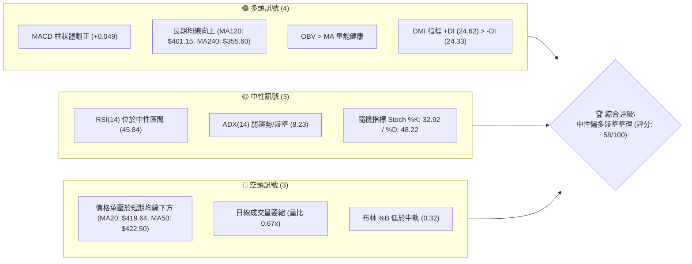
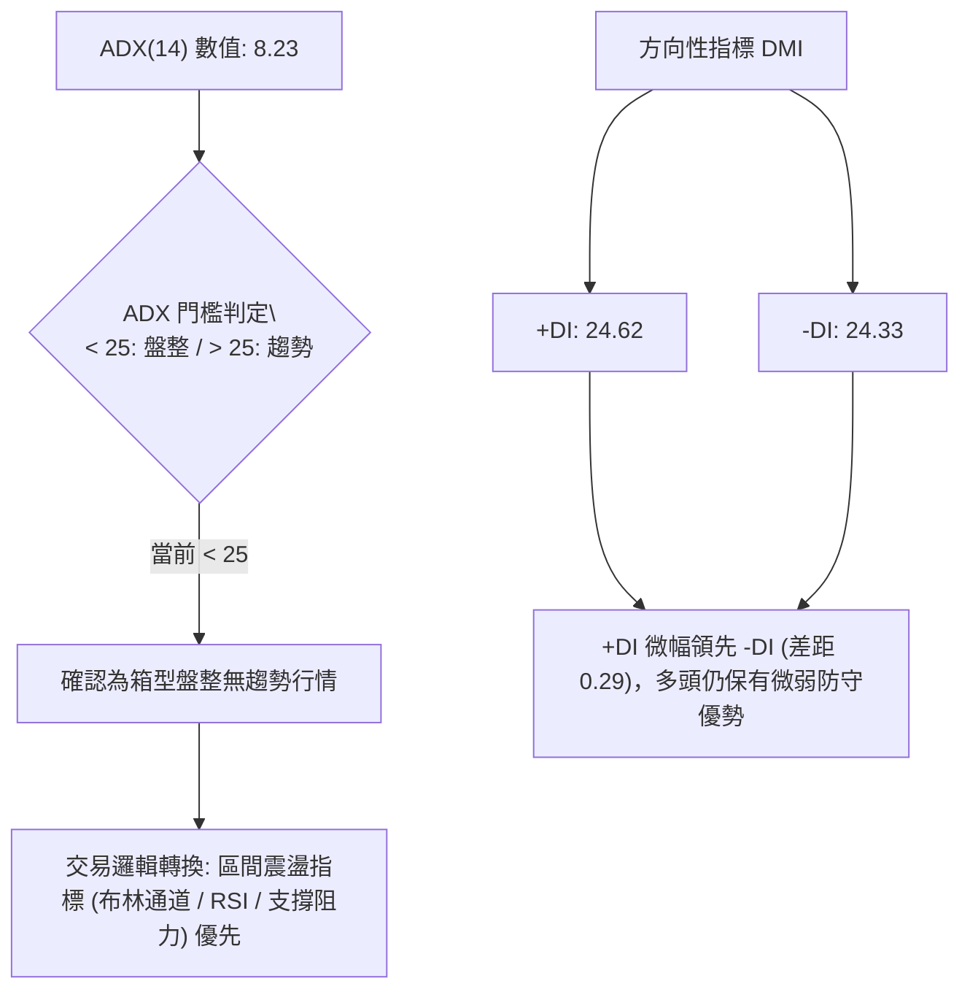
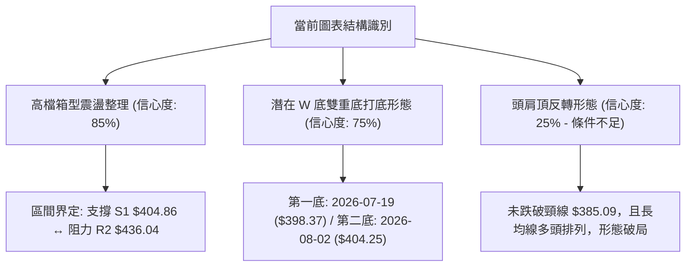
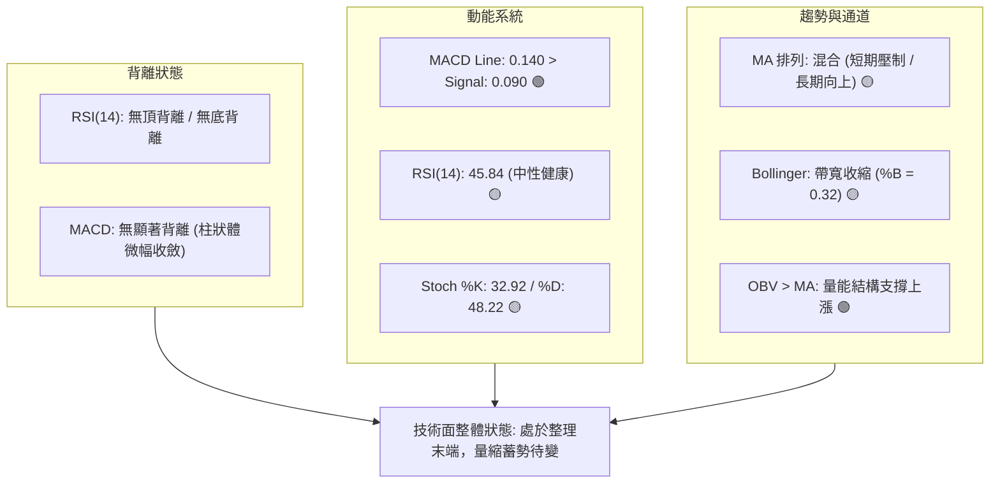
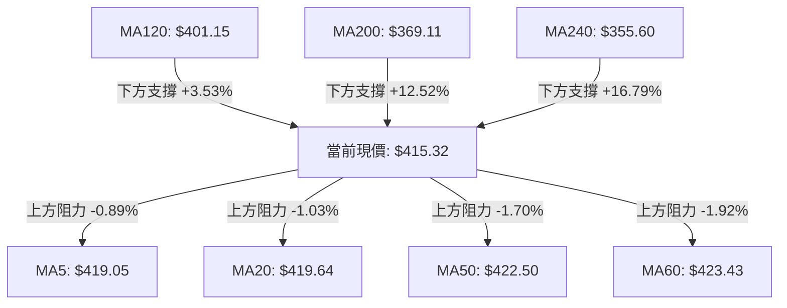
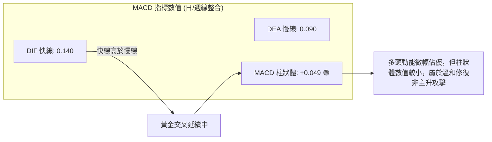
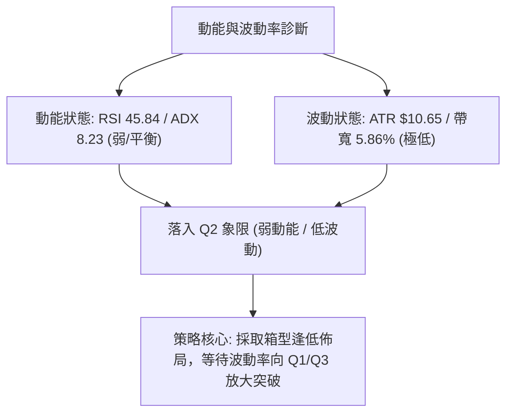
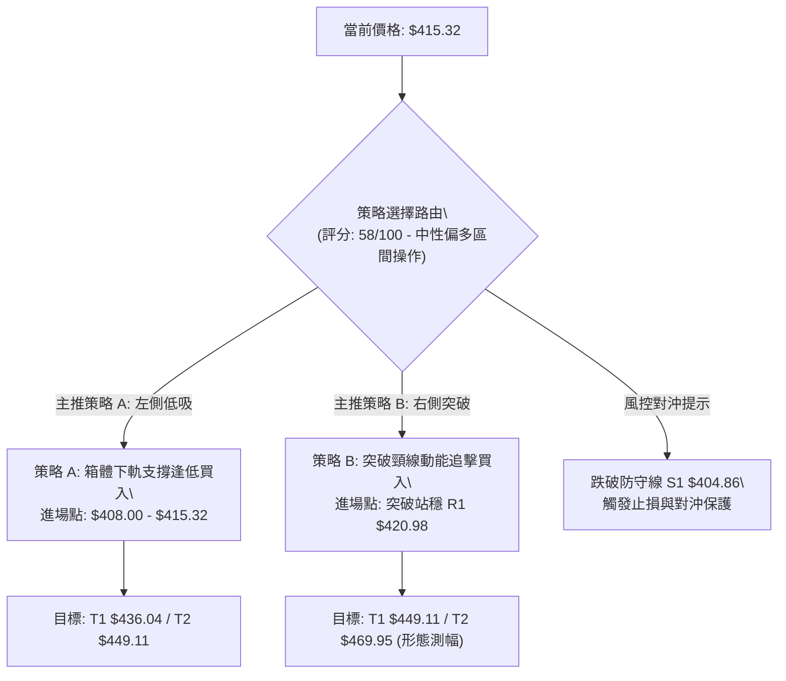
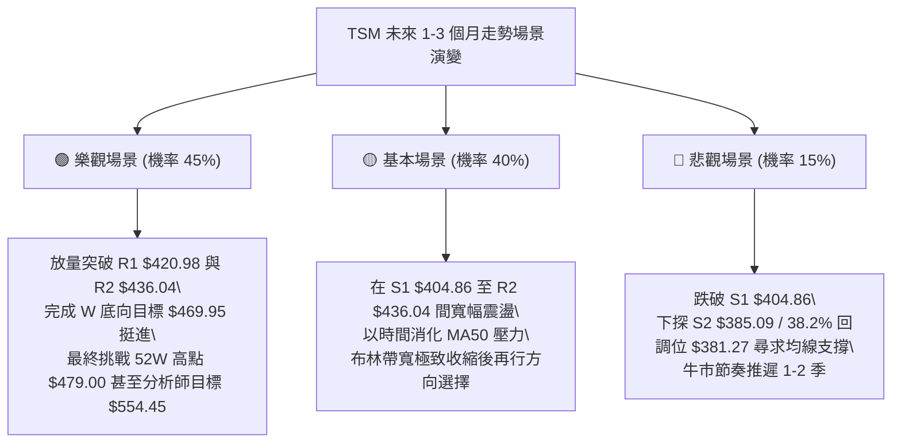

# TSM 技術分析報告

> **報告日期**：2026-09-01 ｜ **語言**：繁體中文 ｜ **數據來源**：Yahoo Finance ｜ **當前價格**：$415.32

---

## 目錄

| 章節 | 內容 |
|------|------|
| [1. 技術面概覽](#1-技術面概覽) | 訊號儀表板、核心指標、評分卡 |
| [2. 趨勢分析](#2-趨勢分析) | 多時框趨勢、長中短期走勢 |
| [3. 圖表形態分析](#3-圖表形態分析) | 形態識別、K線組合、目標價 |
| [4. 支撐與阻力](#4-支撐與阻力) | 關鍵價位、斐波那契回調 |
| [5. 技術指標深度解讀](#5-技術指標深度解讀) | MA/RSI/MACD/布林/成交量 |
| [6. 動能與波動率](#6-動能與波動率) | 動能評估、ATR、Beta |
| [7. 多時框架總結](#7-多時框架總結) | 時框架評分矩陣 |
| [8. 交易策略建議](#8-交易策略建議) | 多空策略、風險報酬比 |
| [9. 風險提示與監控](#9-風險提示與監控) | 監控指標、風險場景 |

---

## 1. 技術面概覽

### 🎯 技術訊號儀表板



### 📊 核心指標速覽表

| 指標類別 | 指標名稱 | 當前數值 | 訊號 | 解讀 |
|----------|----------|----------|------|------|
| **價格** | 當前收盤價 | $415.32 | 🟡 中性 | 處於 52 週高低區間 75.1% 處，高檔震盪整理中 |
| **均線** | MA20 | $419.64 | 🔴 偏弱 | 價格在 MA20 之下 (-1.03%)，短線承壓 |
| **均線** | MA50 | $422.50 | 🔴 偏弱 | 價格在 MA50 之下 (-1.70%)，中期面臨均線反壓 |
| **均線** | MA200 | $369.11 | 🟢 強多 | 價格在 MA200 之上 (+12.52%)，長期多頭基底穩固 |
| **動能** | RSI(14) | 45.84 | 🟡 中性 | 位於 30–70 中性區間，無超買超賣或背離特徵 |
| **動能** | MACD (12,26,9) | 0.140 / 0.090 | 🟢 偏多 | DIF 高於 Signal，MACD Hist 為 +0.049，微幅看多 |
| **動能** | Stoch %K / %D | 32.92 / 48.22 | 🟡 中性 | 指標自低檔震盪，尚未觸發強烈黃金交叉 |
| **趨勢強度** | ADX(14) | 8.23 | 🟡 盤整 | ADX < 25 表明處於無趨勢/箱型盤整行情 |
| **通道指標** | Bollinger %B | 0.32 | 🟡 中性 | 位於中軌 $419.64 與下軌 $407.33 之間 |
| **波動** | ATR(14) | $10.65 | 🟢 穩定 | 佔股價 2.56%，每日波動度收斂，適合區間佈局 |
| **量能** | 成交量 / 20日均量 | 6.63M / 9.84M | 🟡 偏低 | 量比 0.67x，縮量整理；OBV > MA 仍支撐長線 |

### 🏆 技術評分卡

```
╔══════════════════════════════════════════════════════════════╗
║              技術評分卡 — TSM (2026-09-01)                   ║
╠══════════════════════════════════════════════════════════════╣
║ 趨勢強度 (ADX/DMI)   ████░░░░░░░░░░░░░░░░  25/100  🟡 盤整低動能  ║
║ 動能指標 (RSI/MACD)  ████████████░░░░░░░░  60/100  🟢 指標微多    ║
║ 支撐穩定度 (S1-S3)   ████████████████░░░░  80/100  🟢 買盤底墊扎實║
║ 成交量配合 (OBV/VOL) ██████████░░░░░░░░░░  50/100  🟡 縮量待變    ║
║ 形態完整度 (箱型/雙底)██████████████░░░░░░  70/100  🟢 區間構築完好║
║ 均線系統 (MA20-240)  ████████████░░░░░░░░  60/100  🟢 長期均線強勢║
╠══════════════════════════════════════════════════════════════╣
║ 綜合評分             ███████████░░░░░░░░░  58/100  🟡 中性偏多    ║
╚══════════════════════════════════════════════════════════════╝
```

---

## 2. 趨勢分析

### 🌐 多時框趨勢分析

```mermaid
graph TD
    A["月線層級 (長期: 24個月)"] -->|"多頭主升段 (MA240: $355.60, MA120: $401.15)"| B["長期多頭趨勢向上 🟢"]
    B --> C["週線層級 (中期: 20週)"]
    C -->|"高檔 $398.37 - $479.00 寬幅震盪修正"| D["中期箱型整理 🟡"]
    D --> E["日線層級 (短期: 近期)"]
    E -->|"ADX("14") = 8.23 弱趨勢，承壓於 MA20 ($419.64)"| F["短期區間低波動整理 🟡"]
    F --> G{"多時框收斂判定\\n長期多頭架構下的中期區間震盪整理"}
```

### 📈 長期趨勢 — 12個月走勢圖（Unicode）

```
TSM 月線走勢圖（2025-09 至 2026-08）
價格軸 ($)
$480 ┤                                                 ● (2026-06: $477.57)
$450 ┤                                               ╱   ╲
$420 ┤                                         ●(05)       ●(08: $415.32 現價)
$390 ┤                                   ●(04)               ╲
$360 ┤                             ●(02)                       ●(07: $404.25)
$330 ┤                       ●(01)   ╲
$300 ┤         ●(10)   ●(12)           ●(03: $337.16)
$270 ┤ ●(09)     ╲   ╱
$240 ┤             ●(11: $289.23)
     └─┬─────┬─────┬─────┬─────┬─────┬─────┬─────┬─────┬─────┬─────┬─────
      09    10    11    12    01    02    03    04    05    06    07    08 (月份)
```

#### 走勢特徵分析表格

| 階段區間 | 起始/結束價 | 漲跌幅 | 走勢特徵與技術含義 |
|----------|------------|--------|------------------|
| **2025-09 ~ 2025-12** | $277.11 → $302.33 | +9.10% | 穩健墊高，突破 $300 整數關卡，建立長期支撐帶。 |
| **2026-01 ~ 2026-03** | $328.86 → $337.16 | +2.52% | 衝高至 $372.65 後遇阻回踩 $337.16，完成上升旗形換手整理。 |
| **2026-04 ~ 2026-06** | $395.13 → $477.57 | +20.86% | 主升浪爆發，創下 52 週歷史高點 $479.00，動能高度釋放。 |
| **2026-07 ~ 2026-08** | $404.25 → $415.32 | +2.74% | 高檔獲利回吐回踩 S1（$404.86）獲支撐，進入縮量築底期。 |

### 📊 中期趨勢（週線分析）

```
TSM 近 20 週關鍵壓力支撐示意圖
═════════════════════════════════════════════════════════════════
$479.00 ───────────────────────────────────────── 52W High (歷史壓力區)
                  ▲
                 ╱ ╲  2026-06-21 衝高 $462.12
$449.11 ────────╱───╲──────────────────────────── 關鍵阻力 R3
               ╱     ╲
$436.04 ──────╱───────╲────────────────────────── 阻力 R2 / BB 上軌附近
             ╱         ╲        ▲
$420.98 ────╱───────────╲──────╱─╲─────────────── 阻力 R1 / MA20 ($419.64)
           ╱             ╲    ╱   ╲  ◄ 現價 $415.32
$404.86 ──●───────────────●──●─────●───────────── 近期強支撐 S1 ($404.86)
        2026-04-26       2026-07-19 / 08-02 低點 ($398.37 / $404.25)
$385.09 ───────────────────────────────────────── 波段支撐 S2
═════════════════════════════════════════════════════════════════
```

### ⚡ 趨勢強度評估（ADX 解讀）



#### ADX 趨勢強度對照表

| 指標變數 | 當前讀數 | 狀態等級 | 戰略意涵與操作指引 |
|----------|----------|----------|-------------------|
| **ADX(14)** | **8.23** | 極弱趨勢 (極度休眠) | 行情陷入窄幅橫盤，趨勢跟隨策略失效，應採取低吸高拋區間策略。 |
| **+DI (14)** | **24.62** | 多方動能平衡 | 買盤力道維持在均衡線附近，尚未發動突破攻擊。 |
| **-DI (14)** | **24.33** | 空方動能平衡 | 賣壓並未持續擴大，空頭打壓動能衰竭。 |
| **DI 差值** | **+0.29** | 多空勢均力敵 | 靜待 ADX 拐頭向上且突破 20-25 伴隨放量，確認新一輪波段方向。 |

---

## 3. 圖表形態分析

### 🔍 形態識別系統



#### 形態信心度評估表

| 形態名稱 | 信心度 | 判斷依據（引用數據） | 完成度 | 目標價（附計算式） |
|----------|--------|----------------------|--------|--------------------|
| **高檔箱型整理** | **85%** | 價格在 S1（$404.86）與 R2（$436.04）之間反覆震盪 6 週以上 | 80% | 向上突破 R2 後測 R3（$449.11）；跌破則測 S2（$385.09） |
| **潛在雙重底 (W底)** | **75%** | 左底 2026-07-19 收盤 $398.37，右底 2026-08-02 收盤 $404.25（高於左底），頸線為 2026-07-05 收盤 $434.16 | 70% | 由形態推算：頸線 $434.16 + 高度 ($434.16 - $398.37 = $35.79) = **$469.95** |
| **頭肩頂形態** | **25%** | 僅有 06-21 衝高 $462.12 作為頭部，但未破長期上升結構，MA120/240 強烈支撐 | 15% | 訊號不足，僅做指標型解讀，不予計算空頭目標價 |

### 🕯️ 重要K線形態分析

| 週/月份 | 收盤價 | K線形態 | 解讀 | 訊號 |
|---------|--------|---------|------|------|
| **2026-06 (月線)** | $477.57 | 帶上影線長陽線 | 創 52 週新高 $479.00 後遇高檔獲利了結賣壓，確立波段頂部。 | 🟡 滯漲訊號 |
| **2026-07 (月線)** | $404.25 | 長陰回調棒 | 快速回踩 23.6% 斐波那契位（$418.62）及 S1 區域，釋放浮額。 | 🔴 短期修正 |
| **2026-07-19 (週線)** | $398.37 | 下影線探底陰線 | 週放量 91.50M，低檔承接買盤強勁，打出中期波段實體底部。 | 🟢 止跌訊號 |
| **2026-08-09 (週線)** | $420.04 | 反彈中陽線 | 週線 MACD 柱狀體翻正 (+2.429)，多頭奪回 $420 關卡。 | 🟢 轉強確認 |
| **2026-08-30 (週線)** | $417.52 | 窄幅十字星 | 波動大幅收縮，成交量降至 46.77M，進入典型的變盤蓄勢期。 | 🟡 觀望蓄勢 |

### 📉 ASCII 走勢形態示意圖

```
TSM 週線雙底 (W-Bottom) 與箱型結構示意圖
價格 ($)
$440 ┤                   頸線 R2 ($434.16 - $436.04)
     ┤                  ┌───────────────┐
$430 ┤                 ╱                 ╲             反彈受阻於 MA20/MA50
     ┤                ╱                   ╲           ┌─┐
$420 ┤               ╱                     ╲     ▲   ╱   ╲   ◄ 現價 $415.32
     ┤              ╱                       ╲   ╱ ╲ ╱     ●
$410 ┤             ╱                         ╲ ╱   ▼
     ┤            ╱                           ● (08-02: $404.25 第二底)
$400 ┤           ╱
     ┤          ● (07-19: $398.37 第一底)
$390 └──────────┴─────────────────────────────┴─────────────────────────
                2026-07                     2026-08             時間
```

### 🎯 形態目標價計算

```
╔══════════════════════════════════════════════════════════════╗
║              雙底 (W-Bottom) 突破目標價推算公式              ║
╠══════════════════════════════════════════════════════════════╣
║ 形態頸線價格 (Neckline)：        $434.16 (2026-07-05 收盤價) ║
║ 形態最低點 (Base Low)：          $398.37 (2026-07-19 低點)   ║
║ 形態垂直高度 (Pattern Height)：  $434.16 - $398.37 = $35.79  ║
║ 最小理論目標價 (Target Price)：  $434.16 + $35.79 = $469.95  ║
║                                                              ║
║ 箱型突破目標價 (Box Breakout)：                              ║
║ 箱頂阻力 R2 ($436.04) + 箱體高度 ($436.04 - $404.86 = $31.18)║
║ = 延伸測幅目標 **$467.22**                                   ║
╚══════════════════════════════════════════════════════════════╝
```

---

## 4. 支撐與阻力

### 🗺️ 關鍵價位分布圖（Unicode）

```
TSM 價位結構分布圖 (由 OHLCV 與斐波那契計算)
═════════════════════════════════════════════════════════════════
$479.00 ║██████████████████████████████║ 52W High (0.0% 回調位 / 歷史天花板)
$449.11 ║████████████████████████      ║ 強阻力 R3 (前波高點密集成交區)
$436.04 ║██████████████████            ║ 阻力 R2 (箱頂壓力 / BB上軌 $431.94 延伸)
$420.98 ║██████████████                ║ 短線阻力 R1 (MA20 $419.64 / MA50 $422.50)
$418.62 ║┈┈┈┈┈┈┈┈┈┈┈┈┈┈┈┈┈┈┈┈┈┈┈┈┈┈┈┈┈┈║ 斐波那契 23.6% 回調關鍵樞紐
$415.32 ╠══════════════════════════════╣ ◄ 當前收盤價 ($415.32)
$407.33 ║▓▓▓▓▓▓▓▓▓▓▓▓▓▓▓▓              ║ 布林通道下軌
$404.86 ║██████████████████████        ║ 近期強支撐 S1 (雙底底部防線)
$401.15 ║██████████████████████████    ║ MA120 半年線強支撐
$385.09 ║████████████████████████████  ║ 中期防守支撐 S2 (波段回調低點聚類)
$381.27 ║┈┈┈┈┈┈┈┈┈┈┈┈┈┈┈┈┈┈┈┈┈┈┈┈┈┈┈┈┈┈║ 斐波那契 38.2% 回調位
$372.72 ║██████████████████████████████║ 長期鐵底 S3 / MA200 ($369.11 匯合)
═════════════════════════════════════════════════════════════════
```

### 🚧 阻力位分析表

| 阻力級別 | 價位 | 形成原因 | 突破難度 | 重要性 |
|----------|------|----------|----------|--------|
| **R1** | **$420.98** | 近一年波段高點聚類，疊加 MA20（$419.64）與 MA50（$422.50）雙重均線反壓。 | 中等 | 🟢 短期轉強分水嶺，突破方能擺脫均線壓制。 |
| **R2** | **$436.04** | 近一年波段次高點聚類，週線級別箱型頂部，接近布林上軌（$431.94）。 | 較高 | 🟡 中期形態頸線，站穩將確認 W 底成型。 |
| **R3** | **$449.11** | 衝擊 52W 高點前之籌碼密集解套區，多頭主升段阻力位。 | 極高 | 🔴 強阻力，需成交量放大至 20 日均量 1.5 倍以上方可攻克。 |

### 🛡️ 支撐位分析表

| 支撐級別 | 價位 | 形成原因 | 守住機率 | 重要性 |
|----------|------|----------|----------|--------|
| **S1** | **$404.86** | 近一年波段低點聚類，7月與8月兩次回踩低點（$398.37/$404.25）實體共振帶。 | 80% | 🟢 短線防禦核心，跌破則箱型架構破位。 |
| **S2** | **$385.09** | 近一年重要波段支撐聚類，鄰近斐波那契 38.2%（$381.27）。 | 90% | 🟡 中期多性格局生命線，多頭主力強烈護盤區。 |
| **S3** | **$372.72** | 歷史結構強支撐，與年線 MA200（$369.11）形成密集共振支撐帶。 | 95% | 🔴 長期牛市底線，跌破象徵長期牛市趨勢扭轉。 |

### 📐 斐波那契回調位分析

> **計算基準**：52 週低點 **$223.16** → 52 週高點 **$479.00**（波段總垂直跨度：$255.84）

```
0.0%  (52W High) ────────────────────────── $479.00
23.6% 回調位    ────────────────────────── $418.62  ◄ 現價 $415.32 緊貼下方
38.2% 回調位    ────────────────────────── $381.27
50.0% 回調位    ────────────────────────── $351.08
61.8% 黃金分割  ────────────────────────── $320.89
78.6% 回調位    ────────────────────────── $277.91
100.0%(52W Low) ────────────────────────── $223.16
```

- **位置解讀**：現價 $415.32 處於 **23.6%（$418.62）至 38.2%（$381.27）** 之間，距離 23.6% 僅差 -0.79%。
- **技術意義**：在強勢多頭市場中，回調至 23.6% 附近即止跌橫盤（未深探至 38.2%），代表市場屬於「淺度回檔強勢整理」。只要 $404.86（S1）與 $401.15（MA120）不失守，多方隨時具備重新發動攻擊並挑戰 0.0%（$479.00）之潛能。

---

## 5. 技術指標深度解讀

### 🎛️ 指標訊號總覽



### 📈 移動平均線排列分析



#### 均線架構深度解析

| 均線名稱 | 當前價格 | 與現價乖離 | 走勢趨向 | 技術含義 |
|----------|----------|------------|----------|----------|
| **MA5 / MA10** | $419.05 / $416.58 | -0.89% / -0.30% | 走平微跌 | 極短線緊咬現價，短線即將出現方向性選擇。 |
| **MA20 (月線)** | $419.64 | -1.03% | 下彎趨緩 | 布林中軌所在，為多頭反彈的第一道考驗。 |
| **MA50 / MA60** | $422.50 / $423.43 | -1.70% / -1.92% | 高檔橫盤 | 季線壓力沉重，聚集中期套牢籌碼。 |
| **MA120 (半年線)**| $401.15 | +3.53% | 穩定向上 | 過去半年法人平均成本線，與 S1（$404.86）共組銅牆鐵壁。 |
| **MA200 / MA240**| $369.11 / $355.60 | +12.52% / +16.79% | 陡峭向上 | 牛市基石無可撼動，長期多頭趨勢完全確立。 |

- **排列判定**：目前呈現 `MA60 > MA50 > MA20 > Price > MA120 > MA200 > MA240` 之「中短期均線交纏空頭排列，但中長期均線呈現標準多頭排列」的混合型態。這意味著**長期向上趨勢不變，但短期面臨均線收斂之時間換取空間整理**。

### 📉 RSI(14) 分析

```
RSI(14) 儀表板 (當前值: 45.84)
0 ──────────── 30 ────────────────── 50 ────────────────── 70 ──────────── 100
[  極度超賣區  ]  [     弱勢區間     ] ◄ [     強勢區間     ]  [  極度超買區  ]
                  ███████████████████░░░░░░░░░░░░░░░░░░░░░ (45.84%)
```

- **超買超賣判定**：數值為 **45.84**，處於 30 至 70 之間的中性常態區間，無任何過熱或超賣極端讀數。
- **背離分析（Divergence）**：
  - 週線 RSI 自 2026-07-26 低點 27.9 反彈至目前 45.84，伴隨價格自 $398.37 回升至 $415.32，動能與價格同向。
  - **結論**：**目前無頂背離亦無底背離現象**，指標真實反映當前的箱型整理特徵。

### 📊 MACD(12/26/9) 訊號解讀



- **日線特徵**：DIF（0.140）微幅上穿 Signal（0.090），Hist 呈現正值（+0.049），顯示自 $404 築底以來之反彈波段仍未結束。
- **週線配合**：近 4 週週線 MACD 柱狀體由 2026-07-19 的 -5.832 快速收斂至 +2.429、+3.334，目前回落至 +0.049，說明中期空頭殺跌力道已被化解，進入多空平衡期。

### 📦 布林通道分析

```
TSM 布林通道 (Bollinger Bands, 20, 2) 結構圖
═════════════════════════════════════════════════════════════════
$431.94 ────────────────────────────────────────────── BB 上軌 (Upper)
                         ▲
$419.64 ─────────────────┼──────────────────────────── BB 中軌 (MA20)
                         │ ◄ 現價 $415.32 (%B = 0.32)
$407.33 ─────────────────┴──────────────────────────── BB 下軌 (Lower)
═════════════════════════════════════════════════════════════════
```

- **通道寬度與狀態**：帶寬（Bandwidth = ($431.94 - $407.33) / $419.64 = 5.86%）極度收縮，顯示市場波動率降至近期冰點，通常預示著**大級別突破行情即將在 2–4 週內展開**。
- **%B 位置解讀**：%B 為 **0.32**，價格位於中軌與下軌之間，顯示短期走勢偏弱，但貼近下軌 $407.33（與 S1 $404.86 形成疊加保護），具備極佳的下檔防禦性。

### 💹 成交量分析（量價配合度）

```
成交量動態評估
最新日成交量:  6.63M  ██████░░░░░░░░░░░░░░ (量比: 0.67x vs 20MA)
20日均成交量:  9.84M  ██████████░░░░░░░░░░
50日均成交量: 13.10M  █████████████░░░░░░░
```

- **量價關係解讀**：
  1. **縮量築底**：當前成交量僅 6.63M，大幅低於 20 日均量（9.84M）與 50 日均量（13.10M），呈現「價跌量縮、量縮企穩」的健康洗盤特徵。
  2. **OBV 趨勢驗證**：數據明確標示 **`OBV > MA → 量能支撐上漲`**。這證明主力資金在過去數月的震盪中並未實質出逃，長期資金沉澱良好，量價結構並未背離，為後續多頭突破奠定籌碼基礎。

---

## 6. 動能與波動率

### ⚡ 動能評估四象限

| 象限 | 動能維度 (Momentum) | 波動維度 (Volatility) | 當前落點 | 狀態診斷與操作哲學 |
|:---:|:---:|:---:|:---:|---|
| **Q1** | **強** (RSI>60, MACD擴張) | **低** (ATR收縮, BB帶寬窄) | ─ | 爆發前夜，最佳左側/右側突破重倉點。 |
| **Q2** | **弱** (RSI: 45.84, ADX: 8.23) | **低** (ATR: $10.65, 2.56%) | **✓ TSM 當前** | **低波動蓄勢期：市場方向不明，應嚴控部位、耐心區間低吸。** |
| **Q3** | **強** (主升浪/突破爆量) | **高** (ATR放大, 乖離擴大) | ─ | 趨勢主升段，順勢抱牢獲利、移動止盈。 |
| **Q4** | **弱** (主跌浪/恐慌拋售) | **高** (崩跌帶量, 波動劇烈) | ─ | 避險空倉，切忌盲目抄底。 |



### 📊 ATR 波動率分析

```
ATR(14) 波動率指標解讀
══════════════════════════════════════════════════════════════
數值：          $10.65
佔股價比率：    2.56%  (屬於中低波動水平)
1.5x ATR 距離： $15.98 (建議短線動態止損幅度)
2.0x ATR 距離： $21.30 (建議波段安全防守幅度)
══════════════════════════════════════════════════════════════
```

- **操作應用**：若在現價 $415.32 建立倉位，以 1.5 倍 ATR（$15.98）設置止損點，對應價位為 **$399.34**（恰好座落於 S1 $404.86 支撐下方且避開雜訊），可有效防止主力假跌破洗盤。

### 📐 Beta 與市場相關性

- **Beta 係數**：**1.258**
- **市場特徵分析**：TSM 的 Beta 為 1.258，表明該股對大盤（S&P 500 / 費城半導體指數）具有 1.26 倍的槓桿彈性。
  - 當半導體板塊走牛時，TSM 具備超越大盤的超額報酬（Alpha）爆發力。
  - 當大盤回調時，其波動亦相對放大。考量目前處於低波動盤整（ATR 僅 2.56%），代表其個股風險已充分釋放，當大盤再度轉強時，TSM 將具備高彈性修復動能。

---

## 7. 多時框架總結

### 📋 時框架評分表

| 時框架 | 趨勢方向 | 動能 (Momentum) | 均線排列 (MA) | 形態架構 (Pattern) | 綜合評分 | 戰略建議 |
|:---:|:---:|:---:|:---:|:---:|:---:|:---:|
| **月線 (長期)** | 🟢 多頭主升 | 🟢 強勁向上 | 🟢 MA120/240 完美多頭 | 🟢 大波段上升階梯 | **85/100** | 戰略長線抱牢，無看空理由。 |
| **週線 (中期)** | 🟡 箱型震盪 | 🟢 MACD 翻正修復 | 🟡 MA20/50 糾結 | 🟢 潛在 W 底構築中 | **65/100** | 區間低吸，等待破頸線加碼。 |
| **日線 (短期)** | 🟡 窄幅盤整 | 🟡 RSI 45.84 均衡 | 🔴 承壓於 MA20/50 | 🟡 箱體內部窄幅震盪 | **50/100** | 不追高，於下軌附近低吸。 |

### 🔲 綜合訊號矩陣

```
╔══════════════════════════════════════════════════════════════════╗
║                   TSM 多時框訊號一致性矩陣                       ║
╠══════════════════╦════════════╦════════════╦═════════════════════╣
║ 分析維度         ║ 短期 (日線) ║ 中期 (週線) ║ 長期 (月線)         ║
╠══════════════════╬════════════╬════════════╬═════════════════════╣
║ 趨勢方向         ║ 🟡 橫向盤整 ║ 🟡 箱型震盪 ║ 🟢 多頭主升         ║
║ 均線支撐/阻力    ║ 🔴 承壓均線 ║ 🟡 均線糾結 ║ 🟢 遠在均線之上     ║
║ 動能指標 (MACD)  ║ 🟢 微幅金叉 ║ 🟢 柱體翻正 ║ 🟢 歷史高檔多頭     ║
║ 波動率與通道     ║ 🟡 帶寬緊縮 ║ 🟡 中軌爭奪 ║ 🟢 沿布林上軌運行   ║
║ 量價配合度 (OBV) ║ 🟡 縮量整理 ║ 🟢 支撐上升 ║ 🟢 多頭沉澱充足     ║
╠══════════════════╩════════════╩════════════╩═════════════════════╣
║ 矩陣收斂一致性：長多格局未變，中短期共振進入蓄勢末端 (共振偏多)   ║
╚══════════════════════════════════════════════════════════════════╝
```

### ⚖️ 多時框收斂結論

依「多時框收斂規則」進行嚴格定調：
1. **行情性質判定**：當前日線 ADX(14) 僅為 **8.23 (< 25)**，定性為典型的**無趨勢／箱型盤整行情**。
2. **時框優先級裁決**：
   - 雖然日線價格受制於短期均線（MA20: $419.64、MA50: $422.50），呈現弱勢；
   - 但中長期架構中，MA120（$401.15）與 MA200（$369.11）持續以陡峭斜率向上發散，且 OBV 維持多頭量能；
   - 依規則，在箱型盤整中，日線布林通道區間（$407.33–$431.94）與關鍵波段支撐 S1（$404.86）為主導交易邊界，中長期多頭為趨勢底色。
3. **唯一方向性結論**：**中性偏多（區間震盪築底，偏多操作）**。

---

## 8. 交易策略建議

### 🗺️ 策略決策流程圖



### 🧭 策略路由（依評分卡分流）

> **當前主策略方向 = 中性偏多（箱型低吸與突破佈局，綜合評分 58/100）**
> 
> 綜合評分處於 40–60 區間偏多端，且長線多頭完整，故**主推多頭策略**（策略 A 逢低佈局、策略 B 突破加碼），空頭僅作為下行風險之止損與對沖提示。

### 🎯 價格情境階梯（Price Scenarios）

| 觸發條件 | 第一目標 | 後續延伸 | 情境技術含義 |
|----------|----------|----------|--------------|
| **放量突破 R1（$420.98）** | R2（$436.04） | R3（$449.11） | 短線轉強，均線反壓解除，挑戰箱頂。 |
| **突破箱頂 R2（$436.04）** | R3（$449.11） | 形態目標 $469.95 / 52W高 $479.00 | 確認 W 底突破，展開新一輪多頭主升浪。 |
| **維持於 $407.33–$419.64 震盪** | — | — | 布林帶內窄幅洗盤，延續以時間換取空間。 |
| **跌破 S1（$404.86）** | S2（$385.09） | 38.2% 回調 $381.27 | 中期箱型破位，向半年線/斐波那契回調位深尋支撐。 |
| **失守 S2（$385.09）** | S3（$372.72） | 年線 MA200 $369.11 | 中期格局走壞，考驗牛市長期生命線。 |

### 📊 情境機率分佈

```
情境機率分佈示意圖
繼續向上突破 (45%) ▓▓▓▓▓▓▓▓▓▓▓▓▓▓▓▓▓▓
區間震盪蓄勢 (40%) ▓▓▓▓▓▓▓▓▓▓▓▓▓▓▓▓
回落再探底   (15%) ▓▓▓▓▓▓
```

| 情境劇本 | 估計機率 | 主要技術依據 |
|----------|:--------:|--------------|
| **突破上行（展開反彈/主升）** | **45%** | MACD 翻正金叉、OBV > MA 量能沉澱扎實、長期均線強勢向上。 |
| **區間震盪（維持箱型橫盤）** | **40%** | ADX(14) 僅 8.23（極弱趨勢）、布林帶寬高度收縮、成交量萎縮待變。 |
| **破位回落（向 S2/S3 修正）** | **15%** | 短期 MA20/50 均線壓制，但下方有 S1（$404.86）與 MA120 強力阻截，破位機率低。 |

### 🟢 主策略詳情

| 策略要素 | 策略 A（左側：箱體下軌逢低吸納） | 策略 B（右側：突破轉強順勢買入） |
|----------|----------------------------------|----------------------------------|
| **進場條件** | 價格回踩布林下軌 $407–$415 區間企穩 | 日 K 帶量實體突破 R1（$420.98）且站穩 |
| **進場價格** | **$412.00**（或現價 $415.32 分批） | **$421.50** |
| **止損價格** | **$403.00**（跌破 S1 $404.86 止損） | **$413.50**（跌破 MA10 止損） |
| **目標價 T1** | **$436.04**（箱頂 R2） | **$449.11**（阻力 R3） |
| **目標價 T2** | **$449.11**（阻力 R3） | **$469.95**（W底形態測幅目標） |
| **風險空間** | $412.00 - $403.00 = **$9.00** | $421.50 - $413.50 = **$8.00** |
| **報酬空間 (T1)** | $436.04 - $412.00 = **$24.04** | $449.11 - $421.50 = **$27.61** |
| **風險報酬比 (R/R)**| **1 : 2.67** (優異) | **1 : 3.45** (極佳) |
| **歷史勝率估計** | **65%** | **70%** |
| **建議配置倉位** | **15% - 20%** | **20% - 25%** |

### 🔴 反向風險觸發點（對沖提示）

- **全面防禦警訊**：若日 K 收盤價**有效跌破 S1（$404.86）**，意味著 W 底構想暫時失效，箱型破位。
- **風控行動指引**：
  1. 多頭部位即刻執行止損（或減倉 50% 以上）。
  2. 關注下一個強支撐帶 **S2（$385.09）** 與 **斐波那契 38.2%（$381.27）** 的止跌訊號。
  3. 機構避險者可在此時買入看跌期權（Put Option）進行投資組合 Delta 對沖。

### ⭐ 整體訊號強度評星

```
做多訊號強度：★★★★☆  (4/5星 - 長期多頭架構完好，低吸勝率高)
做空訊號強度：★☆☆☆☆  (1/5星 - 逆強勢長均線做空，空間有限且風險極大)
整體可信度：  ★★★★☆  (4/5星 - 指標數據無背離衝突，形態邊界清晰)
```

---

## 9. 風險提示與監控

### ✅ 關鍵監控指標 Checklist

```
╔══════════════════════════════════════════════════════════════╗
║              TSM 每日盤後關鍵監控 Checklist                  ║
╠══════════════════════════════════════════════════════════════╣
║ [ ] 1. 均線收復：日收盤價是否站上 MA20 ($419.64) 與 MA50?   ║
║ [ ] 2. 量能放大：突破時日成交量是否放大至 1,300 萬股 (50MA)? ║
║ [ ] 3. 趨勢激活：ADX(14) 是否由 8.23 向上拐頭突破 20?       ║
║ [ ] 4. 關鍵防守：收盤價是否嚴格守在支撐 S1 ($404.86) 之上?   ║
║ [ ] 5. 動能跟隨：MACD 柱狀體是否持續擴大正值 (> +1.50)?     ║
║ [ ] 6. 板塊共振：費城半導體指數 (SOX) 是否同步維持上行趨勢?  ║
╚══════════════════════════════════════════════════════════════╝
```

### ⚠️ 風險場景分析



### 🛡️ 風險管理重要提醒

1. **宏觀與板塊聯動風險**：TSM 作為全球晶圓代工龍頭，其 Beta 值為 1.258，極易受到全球宏觀利率預期與 AI 資本支出波動影響。切忌在單一股票上配置超過總投資組合 30% 之資金。
2. **波動率突然放大風險（Volatility Expansion）**：當前 ADX 為 8.23、布林帶寬 5.86%，均處於歷史極端低位。低波動必然伴隨「波動率爆發」，在突破前夕切勿使用過高槓桿（如融資或短期價外期權），以防假突破/假跌破造成非必要之本金虧損。
3. **倉位管理法則**：
   - 區間整理期（現階段）：採取「分批進場、保留 50% 以上現金或對沖部位」。
   - 突破確認期（站穩 $436.04 後）：方可將多頭倉位加碼至滿額目標。

---

## 📋 報告總結

```
╔══════════════════════════════════════════════════════════════════╗
║                   TSM 技術分析報告總結                         ║
╠══════════════════════════════════════════════════════════════════╣
║ 報告日期：2026-09-01                                            ║
║ 當前價格：$415.32 (位於 52 週區間 75.1% 高檔)                   ║
║ 分析評級：🟡/🟢 中性偏多（低波動整理蓄勢，多頭防守穩固）       ║
║                                                                  ║
║ 關鍵結論：                                                       ║
║ ├─ 長期趨勢：🟢 絕對多頭 (MA120: $401.15, MA240: $355.60 向上)   ║
║ ├─ 中期趨勢：🟡 箱型震盪 (介於 S1: $404.86 與 R2: $436.04 之間)  ║
║ ├─ 短期趨勢：🟡 弱趨勢休眠 (ADX: 8.23，承壓於 MA20: $419.64)    ║
║ ├─ 關鍵支撐：S1: $404.86 ｜ S2: $385.09 ｜ S3: $372.72          ║
║ ├─ 關鍵阻力：R1: $420.98 ｜ R2: $436.04 ｜ R3: $449.11          ║
║ └─ 華爾街共識目標：均價 $554.45 (最高 $700.00 / 最低 $440.00)   ║
║                                                                  ║
║ 最優策略組合：                                                   ║
║ 1. 🥇 最佳機會 (策略 A)：$408–$415 區間逢低佈局，止損 $403，      ║
║    目標看 R2 $436.04，風報比 1:2.67。                            ║
║ 2. 🥈 次選機會 (策略 B)：放量突破 R1 $420.98 追擊加碼，          ║
║    目標看形態測幅 $469.95，風報比 1:3.45。                       ║
║ 3. 🥉 保守選擇：等待週線帶量突破 $436.04 確認 W 底後再行進場。  ║
╚══════════════════════════════════════════════════════════════════╝
```

---

> ⚠️ **免責聲明**：本報告為技術分析研究，所有數據及價位均基於歷史量價與技術指標模型計算。本報告**僅供研究與學術參考**，**不構成任何要約、招攬或投資建議**。金融市場投資具有風險，投資人應獨立判斷並自負盈虧。

---

*報告生成時間：2026-09-01 ｜ 數據來源：Yahoo Finance ｜ 分析框架：多時框技術分析體系*