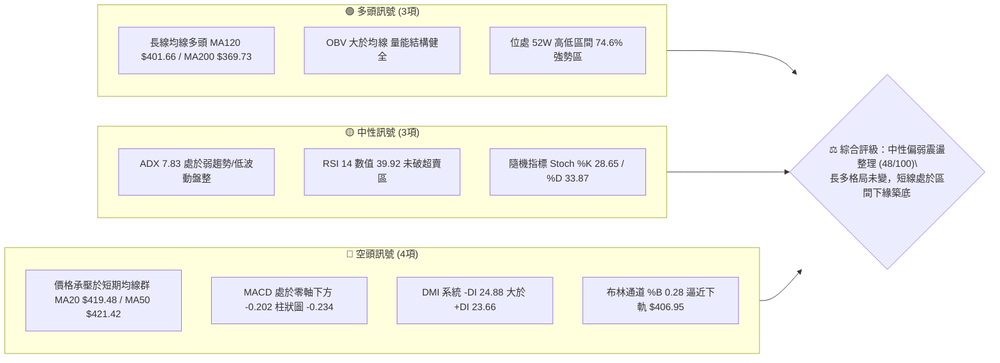
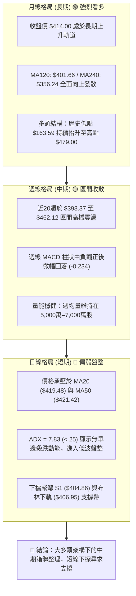
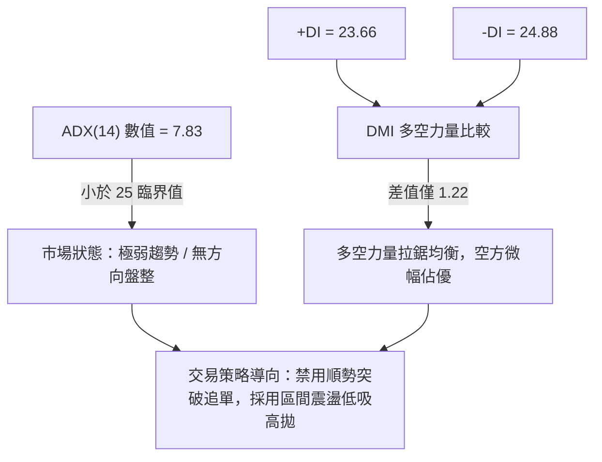
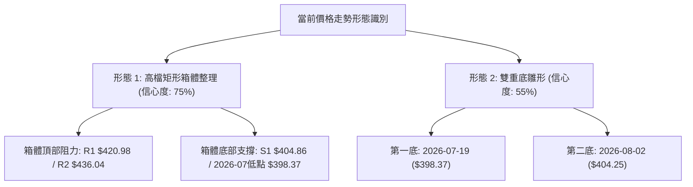
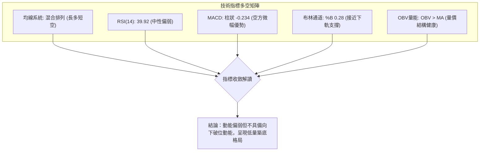
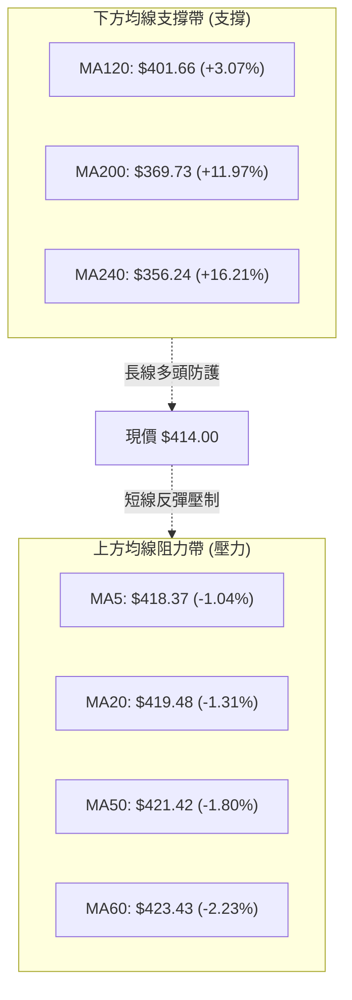
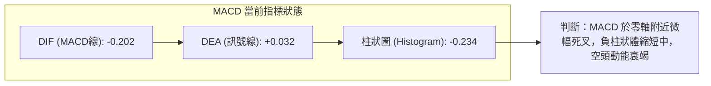
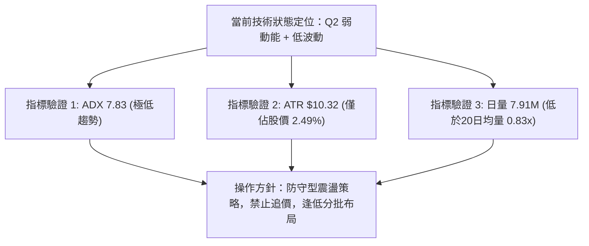
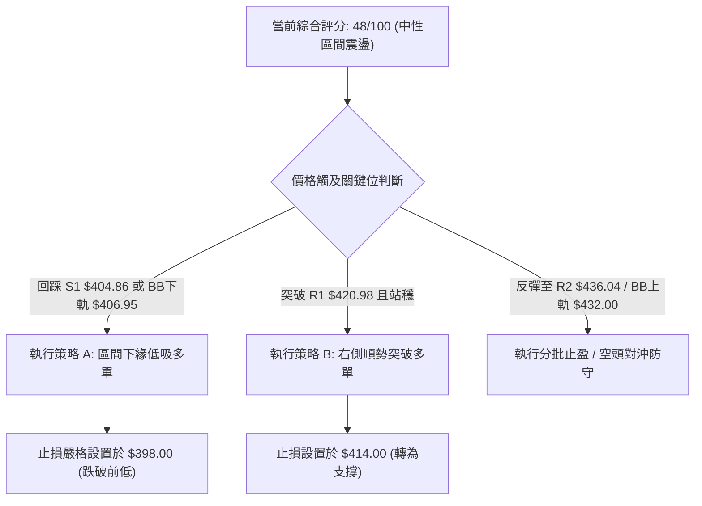
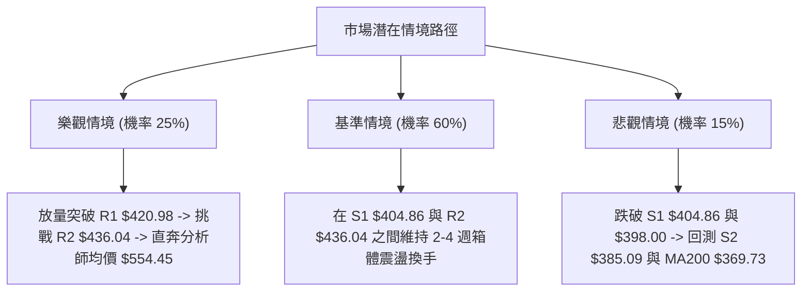

# TSM 技術分析報告

> **報告日期**：2026-09-02 ｜ **語言**：繁體中文 ｜ **數據來源**：Yahoo Finance ｜ **當前價格**：$414.00

---

## 目錄

| 章節 | 內容 |
|------|------|
| [1. 技術面概覽](#1-技術面概覽) | 訊號儀表板、核心指標、評分卡 |
| [2. 趨勢分析](#2-趨勢分析) | 多時框趨勢、長中短期走勢、ADX趨勢強度 |
| [3. 圖表形態分析](#3-圖表形態分析) | 形態識別、K線組合、形態目標價 |
| [4. 支撐與阻力](#4-支撐與阻力) | 關鍵價位分布、波段支撐阻力、斐波那契回調 |
| [5. 技術指標深度解讀](#5-技術指標深度解讀) | MA均線系統、RSI、MACD、布林通道、OBV量價分析 |
| [6. 動能與波動率](#6-動能與波動率) | 動能四象限、ATR波動率、Beta與大盤連動 |
| [7. 多時框架總結](#7-多時框架總結) | 時框架評分矩陣、多時框收斂結論 |
| [8. 交易策略建議](#8-交易策略建議) | 策略路由、價格情境階梯、區間高拋低吸策略 |
| [9. 風險提示與監控](#9-風險提示與監控) | 關鍵監控清單、風險情境、資金管理指引 |

---

## 1. 技術面概覽

### 🎯 技術訊號儀表板



---

### 📊 核心指標速覽表

| 指標類別 | 指標名稱 | 當前數值 | 訊號 | 專業解讀 |
|:---|:---|:---|:---:|:---|
| **價格** | 當前收盤價 | **$414.00** | 🟡 | 位於52週區間74.6%處，短線進入高檔拉回震盪整理 |
| **短期均線** | MA20 (月線) | **$419.48** | 🔴 | 價格低於MA20（-$5.48 / -1.31%），短線動能偏弱 |
| **中期均線** | MA50 (季線) | **$421.42** | 🔴 | 價格低於MA50，上方形成短中期雙重動態壓制帶 |
| **長期均線** | MA200 (年線) | **$369.73** | 🟢 | 價格遠高於MA200（+$44.27 / +11.97%），長線多頭基底穩固 |
| **動能** | RSI(14) | **39.92** | 🟡 | 進入中性偏弱區（30–70），無頂底背離，下行動能趨緩 |
| **動能** | MACD (12,26,9) | **-0.202** | 🔴 | MACD線低於訊號線（0.032），柱狀圖為負（-0.234），空方微幅主導 |
| **趨勢強度** | ADX(14) | **7.83** | 🟡 | 遠低於25，顯示當前無主導單邊趨勢，屬於箱體震盪盤整 |
| **通道位置** | Bollinger %B | **0.28** | 🟡 | 位於布林下軌 $406.95 與中軌 $419.48 之間，接近通道下緣支撐 |
| **量能狀態** | 成交量 vs 20MA | **0.83x** | 🟡 | 最新量 7,908,623 低於 20日均量 9,544,441，呈現縮量整理 |
| **波動度** | ATR(14) | **$10.32** | 🟢 | 佔股價2.49%，波動率壓縮，適合區間網格操作與設定明確止損 |

---

### 🏆 技術評分卡

```
╔══════════════════════════════════════════════════════════════════════════╗
║                   技術評分卡 — TSM (2026-09-02)                          ║
╠══════════════════════════════════════════════════════════════════════════╣
║ 趨勢強度 (Trend)     ████░░░░░░░░░░░░░░░░  20/100 🟡 低趨勢盤整(ADX 7.8)║
║ 動能指標 (Momentum)  ████████░░░░░░░░░░░░  40/100 🔴 RSI/MACD偏弱整理    ║
║ 支撐穩定度 (Support) ██████████████░░░░░░  70/100 🟢 S1 $404.86 支撐強韌 ║
║ 成交量配合 (Volume)  ████████████░░░░░░░░  60/100 🟢 OBV健康/回檔縮量    ║
║ 形態完整度 (Pattern) ██████████░░░░░░░░░░  50/100 🟡 箱體收斂震盪結構    ║
║ 均線排列 (MA System) ██████████░░░░░░░░░░  50/100 🟡 混亂排列(長多短空)  ║
╠══════════════════════════════════════════════════════════════════════════╣
║ 綜合技術評分         █████████░░░░░░░░░░░  48/100 ⚖️ 中性觀望 / 區間震盪║
╚══════════════════════════════════════════════════════════════════════════╝
```

---

## 2. 趨勢分析

### 🌐 多時框趨勢分析



---

### 📈 長期趨勢 — 12個月走勢圖（Unicode）

```
TSM 月線走勢圖（2025-09 至 2026-09）
價格軸 ($)
$480 ┤                                       ● 2026-06 ($477.57 / 高點 $479.00)
$450 ┤                                      ╱ ╲
$420 ┤                             ● 05   ╱   ╲  ● 08 ($415.32)
$414 ┤━━━━━━━━━━━━━━━━━━━━━━━━━━━╱━━━━━━━╱━━━━━●← 當前現價 ($414.00)
$390 ┤                    ● 04  ╱        ● 07 ($404.25)
$360 ┤               ● 02      ╱
$330 ┤          ● 01      ╲   ╱
$300 ┤ ● 10/12             ● 03 ($337.16)
$270 ┤● 09 ($277.11)
     └─┬────┬────┬────┬────┬────┬────┬────┬────┬────┬────┬────┬────
     09   10   11   12   01   02   03   04   05   06   07   08   09 (月份)
     2025                                           2026
```

#### 走勢特徵分析表格

| 階段區間 | 時間週期 | 起始價 → 終止價 | 漲跌幅 | 走勢特徵與技術解讀 |
|:---|:---|:---|:---:|:---|
| **主升段初期** | 2025-09 ~ 2025-12 | $277.11 → $302.33 | **+9.10%** | 突破 $300 整數大關，形成強勢上升楔形突破 |
| **主升段噴出** | 2026-01 ~ 2026-02 | $328.86 → $372.65 | **+13.32%** | 連續跳空上攻，均線呈現完美多頭排列 |
| **技術性回踩** | 2026-02 ~ 2026-03 | $372.65 → $337.16 | **-9.52%** | 獲利了結賣壓回測 MA200 支撐，迅速完成洗盤 |
| **第二波衝刺** | 2026-04 ~ 2026-06 | $395.13 → $477.57 | **+20.86%** | 創下歷史高點 $479.00，量價配合極度健康 |
| **高檔箱體震盪** | 2026-07 ~ 2026-09 | $404.25 → $414.00 | **+2.41%** | 於 $400–$440 區間築底整理，消化短線超買指標 |

---

### 📊 中期趨勢（週線分析）

中期走勢呈現典型的高檔箱體收斂架構：
- **震盪箱頂（主要阻力帶）**：$436.04 (R2) 至 $449.11 (R3)，在 2026-06 月份見頂後數次反彈受阻於此。
- **震盪箱底（核心支撐帶）**：$404.86 (S1) 至 $385.09 (S2)，在 2026-07-19 週創下近期回調低點 $398.37 後迅速收復 $400 大關。
- **週線指標狀態**：週 RSI 自超買區（76.5）回落至當前 39.9，技術指標已完成冷卻，進入具備防守價值的安全邊際區間。

---

### ⚡ 趨勢強度評估（ADX 解讀）



#### ADX 趨勢強度對照表

| ADX 數值區間 | 趨勢強度定義 | 當前狀態標記 | 推薦操作模式 |
|:---:|:---|:---:|:---|
| **0 – 20** | **極弱趨勢 / 盤整市場** | 👈 **當前 (7.83)** | **區間震盪操作（布林通道、支撐阻力網格）** |
| **20 – 25** | 趨勢初生 / 方向不明 | ░░░░░░░░ | 觀望等待方向確認，縮小交易部位 |
| **25 – 40** | 強烈單邊趨勢形成 | ░░░░░░░░ | 均線順勢交易，突破追單操作 |
| **40 – 60** | 極強單邊趨勢推進 | ░░░░░░░░ | 順勢抱牢獲利，移動止損跟進 |
| **60 – 100** | 趨勢過度延伸 / 隨時反轉 | ░░░░░░░░ | 分批分段獲利了結，嚴防均值回歸 |

---

## 3. 圖表形態分析

### 🔍 形態識別系統



#### 形態識別與信心度評估表

| 形態類型 | 信心度 | 判斷依據（引用實際數據） | 完成度 | 形態目標價（附計算式） |
|:---|:---:|:---|:---:|:---|
| **高檔矩形箱體** | **75%** | 上軌阻力落在 R1 $420.98 / R2 $436.04；下軌支撐落在 S1 $404.86 及 7月低點 $398.37 | **85%** | 若向上突破 R2 $436.04，以箱高 $31.18（$436.04 - $404.86）推算，等幅目標價為 **$467.22** |
| **雙重底雛形 (W底)** | **55%** | 兩次下探分別於 2026-07-19 ($398.37) 與 2026-08-02 ($404.25) 獲得支撐；頸線位於 2026-08-16 收盤 $426.35 | **60%** | 若有效帶量突破頸線 $426.35，形態高度 $27.98（$426.35 - $398.37），目標價為 **$454.33** |
| **下降通道修正** | **45%** | 6月高點 $477.57 以來的短波拉回，但因近期低點未破 $398.37，通道下軌未能有效延伸 | **35%** | *訊號不足，僅做指標型震盪解讀* |

---

### 🕯️ 重要K線形態分析

| 週期/月份 | 收盤價 | K線形態特徵 | 技術解讀 | 訊號強度 |
|:---|:---:|:---|:---|:---:|
| **2026-06** | **$477.57** | **流星射擊之星 (長上影線)** | 觸及 52W 高點 $479.00 後遭強大獲利回吐壓回，確認歷史天花板壓力 | 🔴 空頭吞噬 |
| **2026-07** | **$404.25** | **長下影錘頭線 (Hammer)** | 單月急跌後在 $398.37 獲得強力承接盤，逢低買盤積極介入防守 | 🟢 底部支撐 |
| **2026-08** | **$415.32** | **低檔小陽線 (Spinning Top)** | 實體狹小，多空在 $415 附近達成暫時平衡，空方動能明顯衰竭 | 🟡 變盤醞釀 |
| **2026-09 (最新)** | **$414.00** | **十字星震盪整理 (Doji)** | 成交量顯著萎縮（7.9M），市場觀望情緒濃厚，進入方向抉擇期 | 🟡 蓄勢整理 |

---

### 📉 ASCII 走勢形態示意圖

```
TSM 矩形箱體與雙重底形態結構示意圖
價格 ($)
$440 ┤                     [頸線 / 箱頂阻力帶] R2: $436.04 ─────────────
     │                           ▲ (2026-08-16 $426.35)
$420 ┤                          ╱ ╲               ▲ 現價: $414.00
     │                         ╱   ╲             ╱ 
$414 ┤────────────────────────╱─────╲───────────● (當前蓄勢點)
     │                       ╱       ╲         ╱
$405 ┤                      ╱         ●───────┘ 
     │                     ╱       (第二底 08-02: $404.25)
$398 ┤         ●──────────┘
     └───────(第一底 07-19: $398.37)────────────────────────────────────
             [核心支撐防守區] S1: $404.86 / 近期波段低點 $398.37
```

---

### 🎯 形態目標價計算

根據已確認度最高之「矩形箱體」與「雙重底雛形」，目標價推算邏輯如下：

1. **矩形箱體向上突破計算**：
   - 箱體頸線阻力（R2）：`$436.04`
   - 箱體底部支撐（S1）：`$404.86`
   - 垂直高度（H）：`$436.04 - $404.86 = $31.18`
   - **向上突破目標價**：`$436.04 + $31.18 = $467.22`（接近歷史前高區間）

2. **雙重底雛形突破計算**：
   - 雙底頸線位置：`$426.35`（2026-08-16 週高點）
   - 形態最低點：`$398.37`（2026-07-19 週低點）
   - 形態高度：`$426.35 - $398.37 = $27.98`
   - **形態滿足目標價**：`$426.35 + $27.98 = $454.33`（剛好落於 R3 $449.11 上方）

---

## 4. 支撐與阻力

### 🗺️ 關鍵價位分布圖（Unicode）

```
TSM 關鍵價位結構分布圖 (由 OHLCV 與歷史波段計算)
══════════════════════════════════════════════════════════════════════════════
$479.00 ║████████████████████████████████████████║ 52週歷史高點 / 斐波 0.0%
$449.11 ║████████████████████████                ║ 強阻力位 R3 (+8.48%)
$436.04 ║██████████████████                      ║ 中期阻力 R2 (+5.32%) / 箱頂
$420.98 ║██████████████                          ║ 關鍵阻力 R1 (+1.69%) / 20MA共振
$418.62 ║▒▒▒▒▒▒▒▒▒▒▒▒▒▒▒▒▒▒                      ║ 斐波那契 23.6% 回調位
$414.00 ╠════════════════════════════════════════╣ ◄ 當前現價 ($414.00)
$406.95 ║▓▓▓▓▓▓▓▓▓▓▓▓▓▓                          ║ 日線布林下軌支撐
$404.86 ║██████████████████                      ║ 近期關鍵支撐 S1 (-2.21%)
$385.09 ║████████████████████████                ║ 中期強支撐 S2 (-6.98%)
$381.27 ║▒▒▒▒▒▒▒▒▒▒▒▒▒▒▒▒▒▒▒▒▒▒▒▒                ║ 斐波那契 38.2% 回調位
$372.72 ║████████████████████████████            ║ 戰略強支撐 S3 (-9.97%) / MA200
══════════════════════════════════════════════════════════════════════════════
```

---

### 🚧 阻力位分析表

*（價位嚴格引用 OHLCV 聚類計算之標準數值）*

| 阻力級別 | 精確價位 | 距現價幅幅 | 形成原因與籌碼結構 | 突破難度 | 技術重要性 |
|:---|:---:|:---:|:---|:---:|:---:|
| **R1 (第一阻力)** | **$420.98** | **+1.69%** | 近期波段高點聚類、MA20 ($419.48)、MA50 ($421.42) 及斐波那契 23.6% ($418.62) 四重均線密集壓制區 | 🟡 中等 | ★★★☆☆ (短線強弱分水嶺) |
| **R2 (第二阻力)** | **$436.04** | **+5.32%** | 近一年次高波段聚類點、高檔震盪箱頂、7月初反彈高點 $434.16 密集套牢帶 | 🔴 較高 | ★★★★☆ (中期多空分界線) |
| **R3 (第三阻力)** | **$449.11** | **+8.48%** | 6月中旬主升段回調起跌點、歷史巨量成交密集區、雙底測幅滿足點區間 | 🔴 極高 | ★★★★★ (歷史天花板前哨站) |

---

### 🛡️ 支撐位分析表

*（價位嚴格引用 OHLCV 聚類計算之標準數值）*

| 支撐級別 | 精確價位 | 距現價幅幅 | 形成原因與籌碼結構 | 守住機率 | 技術重要性 |
|:---|:---:|:---:|:---|:---:|:---:|
| **S1 (第一支撐)** | **$404.86** | **-2.21%** | 近一年波段低點聚類、7月/8月兩次回測低點 ($403.41 / $404.25)、布林下軌 ($406.95) | 🟢 75% | ★★★★☆ (短線多頭防線) |
| **S2 (第二支撐)** | **$385.09** | **-6.98%** | 近一年波段次低點聚類、緊鄰斐波那契 38.2% 回調位 ($381.27)，具備極佳籌碼換手換手底 | 🟢 85% | ★★★★☆ (波段加碼黃金坑) |
| **S3 (第三支撐)** | **$372.72** | **-9.97%** | 長期上升趨勢生命線、MA200 ($369.73) 與 2026-02 起漲突破口 ($372.65) 共振強支撐 | 🟢 95% | ★★★★★ (長線牛熊生死線) |

---

### 📐 斐波那契回調位分析

依據 52 週完整波動區間（最低點 **$223.16** → 最高點 **$479.00**，垂直波動空間 $255.84）計算：

```
斐波那契回調位階梯
┌────────────────────────────────────────────────────────────────────────┐
│  0.0% (52W High)  : $479.00 ────────────────────────────────────────── │
│ 23.6% 回調位      : $418.62 ─────────────────── [目前壓力區]          │
│ ★ 當前收盤價      : $414.00 ◄─── (位於 23.6% 與 38.2% 之間)           │
│ 38.2% 回調位      : $381.27 ─────────────────── [主要回調防守區]      │
│ 50.0% 中樞平衡位  : $351.08 ────────────────────────────────────────── │
│ 61.8% 黃金分割位  : $320.89 ────────────────────────────────────────── │
│ 78.6% 深度回調位  : $277.91 ────────────────────────────────────────── │
│ 100.0% (52W Low)  : $223.16 ────────────────────────────────────────── │
└────────────────────────────────────────────────────────────────────────┘
```

#### 斐波那契結構深度解讀
1. **現價位置意涵**：現價 `$414.00` 剛好落在 **23.6% ($418.62)** 與 **38.2% ($381.27)** 之間。在技術分析典範中，強勢牛市股拉回僅回測 23.6%~38.2% 即止跌，代表內在買盤力道極其強勁，尚未進入深度修正。
2. **多空臨界點**：上方 `$418.62`（23.6% 回調位）恰與 MA20 ($419.48) 形成重疊壓力，若日線實體站穩 $418.62 之上，宣告拉回修正結束。

---

## 5. 技術指標深度解讀

### 🎛️ 指標訊號總覽



---

### 📈 移動平均線排列分析



#### 均線系統詳細參數與趨勢狀態

| 均線名稱 | 數值 | 距現價差距 | 狀態 | 趨勢形態 (ASCII Sparkline) | 專業解讀 |
|:---|:---:|:---:|:---:|:---|:---|
| **MA 5** | **$418.37** | -1.04% | 🔴 跌破 | `▅▅▅▅▃▁▁▁▁▂▄▅▅▆▆▇████▇▇▆▅▅▆▆▆▆▆` | 超短線微幅下彎，形成第一道貼身壓力 |
| **MA 10** | **$416.64** | -0.63% | 🔴 跌破 | `▇▆▅▄▃▁▁▁▁▁▁▁▁▂▃▅▇▇███████▇▇▇▆▆` | 扣抵高價區，短期均線糾纏 |
| **MA 20** | **$419.48** | -1.31% | 🔴 跌破 | `██▇▇▆▄▃▃▂▂▁▁▁▁▁▁▁▂▂▂▂▂▂▂▃▃▄▄▄▄` | 月線走平，顯示近 20 日進入完全無趨勢狀態 |
| **MA 50** | **$421.42** | -1.80% | 🔴 跌破 | `▁▁▁▂▁▁▁▁▁▁▁▁▂▃▃▄▅▇███████▇▇▆▅▅` | 季線微幅下壓，與 MA20 形成密集阻力帶 |
| **MA 120**| **$401.66** | +3.07% | 🟢 站上 | `▁▁▁▁▂▂▂▃▃▃▃▄▄▄▄▅▅▅▆▆▆▆▆▇▇▇████` | 半年線持續昂首向上，多頭防守中樞 |
| **MA 200**| **$369.73** | +11.97%| 🟢 站上 | `▁▁▁▁▂▂▂▂▃▃▃▃▄▄▄▅▅▅▆▆▆▆▇▇▇▇████` | 年線強勁上揚，確定長期超級多頭未遭破壞 |

---

### 📉 RSI(14) 分析

```
RSI (14) 指標狀態儀表
0 ──────────── 30 ───────────── 50 ───────────── 70 ─────────── 100
[  超賣區  ]    │    [中性偏弱]   │    [強勢區]   │   [ 超買區 ]
░░░░░░░░░░░░░░░░▓▓▓▓▓▓▓▓▓░░░░░░░░░░░░░░░░░░░░░░░░░░░░░░░░░░░░░░░
                ▲ 當前 RSI: 39.92
```

- **RSI 數值解讀**：目前數值為 **39.92**，落於 30 至 50 的中性偏弱區間，顯示短線賣壓仍佔優勢，但已逐漸接近 30 的超賣分界線。
- **背離分析判斷**：
  - **頂背離**：無頂背離跡象（先前 6 月創高 $479.00 時週線 RSI 達 76.5，已充分回調消化）。
  - **底背離**：比對 2026-07-26 週低點（價格 $403.41 / RSI 27.9）與 2026-09-06 最新收盤（價格 $414.00 / RSI 39.92），價格維持在 $404 之上且 RSI 低點顯著抬升，**浮現潛在底背離（隱性底背離）特徵**，有利於多方發動防守反擊。

---

### 📊 MACD(12/26/9) 訊號解讀



- **數值分析**：MACD 線為 `-0.202`，訊號線為 `+0.032`，柱狀圖為 `-0.234`。
- **形態特徵**：兩線數值極度接近零軸（相差僅 0.234），表示市場沒有強烈的單邊動能。這種零軸附近的死叉多屬「洗盤整理型態」，而非單邊崩跌型死叉。

---

### 📦 布林通道分析

```
TSM 日線布林通道結構 (20, 2)
價格 ($)
$432.00 ┤ ────────────────────────────────── [BB 上軌] $432.00
$428.00 ┤
$424.00 ┤
$419.48 ┤ ┈┈┈┈┈┈┈┈┈┈┈┈┈┈┈┈┈┈┈┈┈┈┈┈┈┈┈┈┈┈┈┈┈┈ [BB 中軌 / MA20] $419.48
$414.00 ┤               ● 現價 ($414.00) (通道寬度 %B = 0.28)
$410.00 ┤
$406.95 ┤ ────────────────────────────────── [BB 下軌] $406.95
```

- **布林參數解析**：
  - **上軌**：`$432.00`
  - **中軌 (MA20)**：`$419.48`
  - **下軌**：`$406.95`
  - **%B 指標**：`0.28`（計算公式：`(414.00 - 406.95) / (432.00 - 406.95) = 0.281`）
- **通道解讀**：%B 數值為 0.28，代表價格運行在下半軌，且已接近下軌 `$406.95`。由於下軌與波段關鍵支撐 S1 `$404.86` 構成雙重共振帶，下檔具備極強的通道支撐反彈效應。

---

### 💹 成交量分析（量價配合度）

```
成交量對比柱狀圖
最新成交量  : ████████████░░░░░░░░  7,908,623 (7.91M)  [量縮]
20日均量    : ███████████████░░░░░  9,544,441 (9.54M)  [基準 1.0x]
50日均量    : ████████████████████  12,982,870 (12.98M) [高量期]
```

- **量比分析**：最新日成交量為 **7,908,623**，相較於 20日均量 9,544,441，量比僅 **0.83x**，呈現標準的「價跌量縮」良性整理特徵。
- **OBV (能量潮指標)**：系統標注「**OBV > MA → 量能支撐上漲**」。OBV 能量潮持續保持在均線之上，這說明雖然價格短期處於回調，但主力籌碼並無大規模派發出逃現象，量價結構依舊維持有利於多方的長線格局。

---

## 6. 動能與波動率

### ⚡ 動能評估四象限

| 象限代號 | 動能維度 | 波動率維度 | 當前狀態標記 | 戰術應對思維 |
|:---:|:---:|:---:|:---:|:---|
| **第一象限 (Q1)** | 強動能 (Trend) | 低波動 (Low Vol) | ░░░░░░░░ | 最佳單邊趨勢加碼點，順勢抱牢 |
| **第二象限 (Q2)** | **弱動能 (Consolidation)** | **低波動 (Low Vol)** | 👈 **TSM 當前定位** | **謹慎觀望，採用布林通道上下軌低吸高拋** |
| **第三象限 (Q3)** | 強動能 (Momentum) | 高波動 (High Vol) | ░░░░░░░░ | 高風險高收益突破行情，嚴設追蹤止損 |
| **第四象限 (Q4)** | 弱動能 (Weakness) | 高波動 (High Vol) | ░░░░░░░░ | 恐慌殺跌或無序震盪，嚴格禁止入場 |



---

### 📊 ATR 波動率分析

- **ATR(14) 絕對數值**：**$10.32**
- **ATR 相對百分比**：**2.49%**（以現價 $414.00 計算）
- **止損距離量化建議**：
  - **短線交易止損距離（1.0 × ATR）**：`$10.32` → 現價往下對應約 **$403.68**（剛好保護在 S1 $404.86 支撐下方）。
  - **波段交易止損距離（1.5 × ATR）**：`$15.48` → 現價往下對應約 **$398.52**（剛好保護在 7月波段最低點 $398.37 關鍵低點外側）。
  - **震盪區間日內正常波動範圍**：`$403.68` 至 `$424.32`。

---

### 📐 Beta 與市場相關性

- **Beta 係數**：**1.258**
- **市場特徵解讀**：
  - TSM 的 Beta 值為 1.258，代表其波動幅度比標普 500 指數（S&P 500）高出約 **25.8%**。
  - 當大盤半導體板塊（SOX）或美股大盤出現反彈時，TSM 具有更強的彈性爆發力；反之在大盤回調時，亦承擔較高的波動折價。
  - 鑑於其高 Beta 與低 ATR 的當前組合，個股本身處於蓄勢待發的波動率壓縮末端（Volatility Squeeze）。

---

## 7. 多時框架總結

### 📋 時框架評分表

| 時框架 | 趨勢方向 | 動能狀態 | 均線排列 | 圖表形態 | 綜合評分 | 戰略建議 |
|:---|:---:|:---:|:---:|:---:|:---:|:---|
| **日線 (Daily)** | 🔴 偏弱盤整 | RSI 39.92 / MACD -0.202 | 混亂排列 (跌破MA20/50) | 布林下軌支撐 / 矩形下緣 | **42 / 100** | 區間操作，下軌附近逢低買入 |
| **週線 (Weekly)** | 🟡 高檔整理 | RSI 49.4 / MACD 柱翻負 | 均線多頭糾纏整理 | 雙重底打底雛形 | **55 / 100** | 持股觀望，等待回踩確認後加碼 |
| **月線 (Monthly)** | 🟢 強烈多頭 | 長期多頭動能穩健 | 完美多頭排列 (MA120/240) | 長期上升牛市通道 | **85 / 100** | 長線多單抱牢，忽略短期雜訊 |

---

### 🔲 綜合訊號矩陣

```
╔══════════════════════════════════════════════════════════════════════════════╗
║                    TSM 多時框架綜合訊號一致性矩陣                            ║
╠══════════════════════════════════════════════════════════════════════════════╣
║ 觀察維度        短期 (日線 1-5日)     中期 (週線 1-4週)     長期 (月線 1-6月)║
╠══════════════════════════════════════════════════════════════════════════════╣
║ 趨勢方向        🔴 空方微幅佔優       🟡 箱體橫盤整理       🟢 極強單邊多頭  ║
║ 均線系統        🔴 承壓於MA20/50      🟡 糾纏於週均線       🟢 遠高於年線200 ║
║ 擺動指標        🟡 RSI 接近超賣       🟡 週RSI回歸中性      🟢 月KD處於強勢  ║
║ 量能配合        🟡 縮量整理 (0.83x)   🟢 週量能溫和健康     🟢 OBV量能支持   ║
║ 支撐防守        🟢 緊鄰 S1 $404.86    🟢 S2 $385.09 強固    🟢 S3 $372.72鐵底║
╠══════════════════════════════════════════════════════════════════════════════╣
║ 時框共振結論：短線偏空盤整提供長線極佳買點，中期於 $400-$440 完成換手籌碼 ║
╚══════════════════════════════════════════════════════════════════════════════╝
```

---

### ⚖️ 多時框收斂結論

> **依據技術分析多時框收斂規則（嚴格要求 14）**：
> 1. **趨勢強度定性**：當前 ADX(14) 數值為 **7.83**（遠小於 25），明確定義當前市場處於**「非單邊趨勢的低波動盤整行情」**。
> 2. **主導時框規則**：在盤整行情下，交易策略應以**「日線布林通道上下軌與波段支撐阻力」**為主要操作區間，中期與長期指標則提供方向性保護。
> 3. **方向性結論**：**中性觀望偏多（區間高拋低吸，以逢低佈局為主）**。長線 MA200 ($369.73) 與 OBV 量能明確指向多頭本質未變，短線日線跌破 MA20 僅為震盪下緣尋求支撐，絕不可在布林下軌處追空，應於 S1 ($404.86) 至布林下軌 ($406.95) 區間尋求低吸機會。

---

## 8. 交易策略建議

### 🗺️ 策略決策流程圖



---

### 🧭 策略路由

**當前主策略方向 = 【中性區間震盪：箱體下軌逢低做多】（依綜合評分 48/100 路由）**

*（綜合評分處於 40–60 中性區間，且 ADX = 7.83 < 25，技術形態為標準箱體，主推於支撐位之左側低吸策略，輔以突破加碼策略；嚴禁追高追空。）*

---

### 🎯 價格情境階梯（Price Scenarios）

*（所有價位嚴格引用第 4 章及 OHLCV 計算之實際數值）*

| 觸發條件 | 下一目標 | 後續延伸目標 | 情境含義與技術訊號 |
|:---|:---:|:---:|:---|
| **向上突破 R1 ($420.98)** | **R2 ($436.04)** | **R3 ($449.11)** | 短線轉強，重新收復月線與季線，引發空頭回補 |
| **站穩現價區間 ($406.95–$419.48)** | **R1 ($420.98)** | **R2 ($436.04)** | 於布林中下軌完成橫盤築底，波動率持續壓縮 |
| **跌破 S1 ($404.86)** | **S2 ($385.09)** | **S3 ($372.72)** | 中期轉弱，回測斐波那契 38.2% ($381.27) 及 MA200 ($369.73) |

---

### 📊 情境機率分佈

| 情境類型 | 機率預估 | 主要技術依據 |
|:---|:---:|:---|
| **區間震盪築底後反彈 (基準情境)** | **60%** | ADX = 7.83 處於盤整底部，OBV 量能維持在均線上方，S1 $404.86 具備 7/8 月雙底支撐力道 |
| **強勢向上突破 R1/R2 (樂觀情境)** | **25%** | 華爾街 18 位分析師平均目標價達 $554.45，基本面營收 YoY +36%，隨時可能受消息面激勵放量長紅 |
| **向下跌破 S1 探底 S2 (悲觀情境)** | **15%** | MACD 柱狀為負 (-0.234)，-DI (24.88) 略高於 +DI (23.66)，若跌破 $404.86 將觸發停損賣壓 |

---

### 🟢 主策略詳情

| 策略要素 | 策略 A：區間下緣左側掛單買入 (首選) | 策略 B：右側突破確認加碼買入 (穩健) |
|:---|:---|:---|
| **策略類型** | 支撐低吸（Range Support Entry） | 突破追隨（Breakout Confirmation） |
| **進場條件** | 價格回踩至 S1 附近獲得支撐，出現 15分/60分 K 止跌紅棒 | 日線收盤價帶量突破 R1 $420.98 且站穩 MA20 上方 |
| **精確進場價格** | **$406.00**（位於 BB下軌 $406.95 與 S1 $404.86 之間） | **$421.50**（確認突破 R1 $420.98） |
| **目標價 T1** | **$420.98**（R1 / 第一阻力位，獲利率 +3.69%） | **$436.04**（R2 / 箱頂阻力，獲利率 +3.45%） |
| **目標價 T2** | **$436.04**（R2 / 箱頂阻力位，獲利率 +7.40%） | **$449.11**（R3 / 強阻力位，獲利率 +6.55%） |
| **止損價格** | **$397.50**（跌破波段低點 $398.37 與 1.0×ATR 防守） | **$413.50**（跌回現價下方，假突破止損） |
| **風險報酬比 (R:R)**| **1 : 3.53**（風險 $8.50 vs T2 獲利 $30.04） | **1 : 3.45**（風險 $8.00 vs T2 獲利 $27.61） |
| **預估勝率** | **65%** | **60%** |
| **建議倉位** | **15% - 20%** 總資金 | **10% - 15%** 總資金 |

---

### 🔴 反向風險觸發點（對沖提示）

- **全面空頭轉向觸發價**：**`$398.00`**。
- **風控處置原則**：若日線收盤價跌破 `$398.00`（即跌穿 2026-07-19 之波段關鍵低點 `$398.37`），宣告「矩形箱體破位」，雙底形態失效。所有多頭部位必須嚴格停損出場，並可建立小部位空單對沖，下方第一回補目標鎖定 **S2 $385.09** 及斐波那契 38.2% 回調位 **$381.27**。

---

### ⭐ 整體訊號強度評星

```
╔══════════════════════════════════════════════════════════╗
║ 做多訊號強度：  ★★★☆☆  (3.0/5星 - 支撐強固，動能待放量)  ║
║ 做空訊號強度：  ★★☆☆☆  (2.0/5星 - 長期多頭，下檔空間受限)║
║ 整體訊號可信度：★★★★☆  (4.0/5星 - 指標數據無矛盾，吻合箱體)║
╚══════════════════════════════════════════════════════════╝
```

---

## 9. 風險提示與監控

### ✅ 關鍵監控指標 Checklist

```
╔══════════════════════════════════════════════════════════════════════════╗
║                      TSM 日常技術監控清單 (Checklist)                    ║
╠══════════════════════════════════════════════════════════════════════════╣
║ [ ] 價位監控：收盤價是否守住 S1 $404.86（跌破即預警，觸及 $398 止損）   ║
║ [ ] 阻力突破：是否放量站上 R1 $420.98 與 MA20 $419.48（轉強訊號）       ║
║ [ ] 動能監控：MACD 柱狀圖是否由負轉正（-0.234 縮小至 0 之上）            ║
║ [ ] 擺動指標：RSI(14) 是否在 40 附近形成底部抬升並站上 50 中軸          ║
║ [ ] 量能指標：日成交量是否放大至 1,200萬股（高於 50日均量 12.98M）       ║
║ [ ] 通道監控：布林通道帶寬是否開始放大（結束 Volatility Squeeze 擠壓）  ║
╚══════════════════════════════════════════════════════════════════════════╝
```

---

### ⚠️ 風險場景分析



---

### 🛡️ 風險管理重要提醒

1. **波動率擴張風險**：目前 ATR 處於低檔（$10.32），ADX 僅 7.83，代表市場即將結束整理迎來變盤。若選擇在當前區間建倉，必須嚴守止損點，不得在跌破 $398.00 時抱有僥倖心態拗單。
2. **Beta 槓桿效應**：TSM 的 Beta 為 1.258，對於整體美股半導體週期及地緣政治消息敏感度極高。建議單一個股倉位不超過投資組合總資金的 **20%**。
3. **資金管理金律**：單次交易承擔的風險金額（進場價與止損價之差額 × 股數），嚴格控制在總帳戶淨值的 **1.0% – 1.5%** 以內。

---

## 📋 報告總結

```
╔══════════════════════════════════════════════════════════════════════════════╗
║                         TSM 技術分析報告總結                                 ║
╠══════════════════════════════════════════════════════════════════════════════╣
║ 報告日期：2026-09-02                                                         ║
║ 當前價格：$414.00                                                            ║
║ 綜合評級：⚖️ 中性觀望 / 區間震盪低吸 (技術評分: 48/100)                     ║
║                                                                              ║
║ 關鍵結論：                                                                   ║
║ ├─ 長期趨勢：🟢 強烈看多 (MA200 $369.73 向上，月線牛市結構完整)              ║
║ ├─ 中期趨勢：🟡 區間震盪 ($404.86 至 $436.04 高檔箱體整理)                   ║
║ ├─ 短期趨勢：🔴 偏弱盤整 (受制於 MA20 $419.48，回踩布林下軌)                ║
║ ├─ 關鍵支撐：S1 $404.86 (核心防守) ｜ S2 $385.09 (黃金坑)                    ║
║ ├─ 關鍵阻力：R1 $420.98 (轉強分水嶺) ｜ R2 $436.04 (箱頂天花板)              ║
║ └─ 機構共識：18 位分析師平均目標價 $554.45 (最高 $700.00 / 最低 $440.00)     ║
║                                                                              ║
║ 最優策略組合：                                                               ║
║ 1. 🥇 最佳機會：於 $406.00-$407.00 區間低吸，止損 $397.50，目標 T1 $420.98   ║
║ 2. 🥈 次選機會：放量突破 R1 $420.98 後右側追隨，目標 T2 $436.04               ║
║ 3. 🥉 保守選擇：空手觀望，等待日線 MACD 柱狀由負轉正且站穩 MA20 後再行進場   ║
╚══════════════════════════════════════════════════════════════════════════════╝
```

---

> ⚠️ **免責聲明**：本報告為 AI 自動生成之量化與圖表技術分析，所有數據及估算均嚴格基於歷史 OHLCV 價格與公開財務資訊。本報告**僅供研究與學術參考**，**不構成任何形式的要約、招攬或投資買賣建議**。金融市場投資具有極高風險，股價可能大幅波動，投資人應自行獨立評估並自負投資盈虧。

---

*報告生成時間：2026-09-02 ｜ 數據來源：Yahoo Finance ｜ 分析框架：多時框技術分析體系 (MTFA)*