# TSM 技術分析報告

> **報告日期**：2026-09-03 ｜ **語言**：繁體中文 ｜ **數據來源**：Yahoo Finance ｜ **當前價格**：$414.00

---

## 目錄

| 章節 | 內容 |
|------|------|
| [1. 技術面概覽](#1-技術面概覽) | 訊號儀表板、核心指標、評分卡 |
| [2. 趨勢分析](#2-趨勢分析) | 多時框趨勢、長中短期走勢 |
| [3. 圖表形態分析](#3-圖表形態分析) | 形態識別、K線組合、目標價 |
| [4. 支撐與阻力](#4-支撐與阻力) | 關鍵價位、斐波那契回調 |
| [5. 技術指標深度解讀](#5-技術指標深度解讀) | MA/RSI/MACD/布林/成交量 |
| [6. 動能與波動率](#6-動能與波動率) | 動能評估、ATR、Beta |
| [7. 多時框架總結](#7-多時框架總結) | 時框架評分矩陣 |
| [8. 交易策略建議](#8-交易策略建議) | 多空策略、風險報酬比 |
| [9. 風險提示與監控](#9-風險提示與監控) | 監控指標、風險場景 |

---

## 1. 技術面概覽

### 🎯 技術訊號儀表板

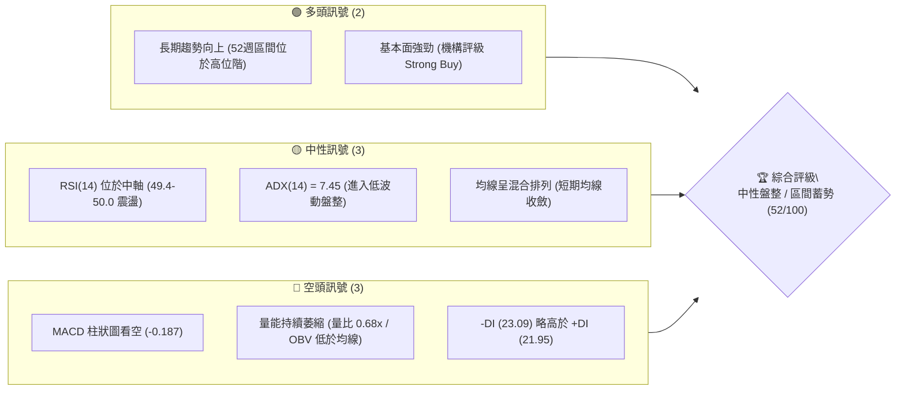

---

### 📊 核心指標速覽表

| 指標類別 | 指標名稱 | 當前數值 | 訊號 | 解讀 |
|:---|:---|:---|:---:|:---|
| **價格** | 最新收盤價 | **$414.00** | 🟡 | 位於52週高點($479.00)與低點($226.10)之高位回檔區間 |
| **均線** | 短期均線 (MA20) | 混合排列 | 🔴 | 短期價格跌破MA20均線，短線動能偏弱 |
| **均線** | 中期均線 (MA50) | 混合排列 | 🔴 | 價格暫處MA50下方，尋求波段支撐 |
| **均線** | 長期均線 (MA200)| 向上延伸 | 🟢 | 長期多頭基底完好，長期上升趨勢未遭破壞 |
| **動能** | RSI(14) | 49.40 | 🟡 | 位於中性平衡區 (40-60)，無超買或超賣特徵 |
| **動能** | MACD (12,26,9) | -0.202 / 柱 -0.187 | 🔴 | MACD 處於零軸下方且負柱體擴張，空方微幅主導 |
| **趨勢** | ADX (14) | 7.45 | 🟡 | 極弱趨勢 (ADX < 25)，代表行情處於無方向箱體震盪 |
| **量能** | 20日成交量比 | 0.68x | 🔴 | 日量 6.26M 低於 20日均量 9.22M，量縮觀望 |
| **量能** | OBV 趨勢 | OBV < MA | 🔴 | 資金進場動能不足，量能未確認價格向上突破 |

---

### 🏆 技術評分卡

```
╔════════════════════════════════════════════════════════════════╗
║                技術評分卡 — TSM (2026-09-03)                   ║
╠════════════════════════════════════════════════════════════════╣
║ 趨勢強度 (ADX=7.45)    ████░░░░░░░░░░░░░░░░  20/100  🔴 極弱趨勢 ║
║ 動能指標 (MACD/RSI)    █████████░░░░░░░░░░░  45/100  🟡 動能中性 ║
║ 支撐穩定度 (Fib 38.2%) ██████████████░░░░░░  70/100  🟢 支撐穩固 ║
║ 成交量配合 (OBV疲弱)   ███████░░░░░░░░░░░░░  35/100  🔴 量價背離 ║
║ 形態完整度 (箱型整理)  █████████████░░░░░░░  65/100  🟡 形態收斂 ║
║ 均線排列 (多空交織)    ██████████░░░░░░░░░░  50/100  🟡 混合排列 ║
╠════════════════════════════════════════════════════════════════╣
║ 綜合技術評分           ██████████░░░░░░░░░░  52/100  🟡 中性觀望 ║
╚════════════════════════════════════════════════════════════════╝
```

---

## 2. 趨勢分析

### 🌐 多時框趨勢分析

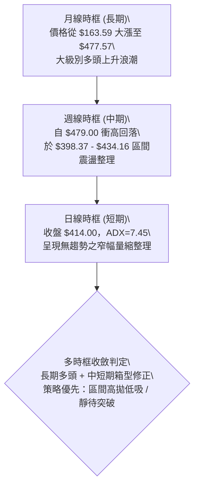

---

### 📈 長期趨勢 — 12個月走勢圖（Unicode）

```
TSM 月線走勢圖（過去12個月：2025-10 至 2026-09）
價格 ($)
$480 ┤                                      ● $477.57 (06月高點)
$450 ┤                                     / \
$420 ┤                             ● $417.47  \    ● $415.32 
$414 ┤──────────────────────────────────────────● $414.00 (現價)
$390 ┤                     ● $395.13           ● $404.25
$360 ┤             ● $372.65
$330 ┤     ● $328.86       ● $337.16
$300 ┤ ● $298.08   ● $302.33
$270 ┤● $289.23
     └─┬─────┬─────┬─────┬─────┬─────┬─────┬─────┬─────┬─────┬─────┬─────
     10月  11月  12月  01月  02月  03月  04月  05月  06月  07月  08月  09月
```

#### 走勢特徵分析表格

| 階段區間 | 時間段 | 價格起訖 | 漲跌幅 | 走勢特徵與結構解讀 |
|:---|:---:|:---:|:---:|:---|
| **主升浪推進** | 2025-10 ~ 2026-02 | $298.08 → $372.65 | **+25.02%** | 均線多頭發散，單邊推升，量價齊揚。 |
| **波段洗盤** | 2026-02 ~ 2026-03 | $372.65 → $337.16 | **-9.52%** | 獲利了結賣壓釋放，測試前波突破平台。 |
| **加速衝頂** | 2026-03 ~ 2026-06 | $337.16 → $477.57 | **+41.64%** | 強勢主升段，創下52週歷史高點 $479.00。 |
| **高位箱型整理** | 2026-06 ~ 2026-09 | $477.57 → $414.00 | **-13.31%** | 衝高後量縮回檔，於 $400-$435 構築震盪箱體。 |

---

### 📊 中期趨勢（週線分析）

近期週線於 $398.37 至 $434.16 區間反覆震盪，形成了明確的中期平衡區間：

```
TSM 近20週核心波動結構
$479.00 ┤── 52週歷史極值 (2026-06) ─────────────────── (強阻力頂部)
$462.12 ┤        ▲ 波段次高點 (2026-06-21)
$434.16 ┤────────┬─────────────┬─────────── (中期箱頂 R1)
$414.00 ┤────────┼── 現價 $414.00 ───────── (多空爭奪軸心)
$403.41 ┤        │             │
$398.37 ┤────────┴─────────────┴─────────── (中期箱底 S1 / 07-19低點)
$382.39 ┤── 斐波那契 38.2% 回調支撐 ────────────────── (深層支撐 S2)
```

---

### ⚡ 趨勢強度評估（ADX 解讀）

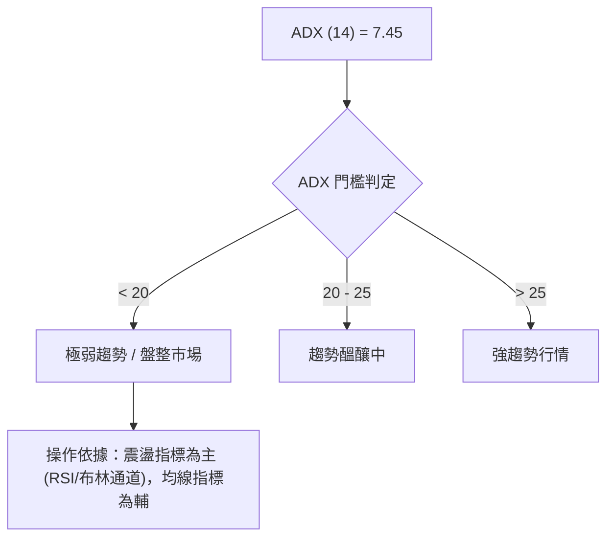

| 指標名稱 | 當前數值 | 參考標準 | 狀態評估 | 實戰指引 |
|:---|:---:|:---:|:---:|:---|
| **ADX (14)** | **7.45** | < 20 極弱 / 20-25 中等 / > 25 強勢 | 🔴 極度盤整 | 禁止使用追價突破策略，容易產生假突破。 |
| **+DI (14)** | **21.95** | 多方進攻動能 | 🟡 偏弱 | 多方攻擊意願不足，未具備連續拉升力道。 |
| **-DI (14)** | **23.09** | 空方打壓動能 | 🟡 偏弱 | 空方雖微幅領先，但未構成單邊壓制格局。 |

---

## 3. 圖表形態分析

### 🔍 形態識別系統

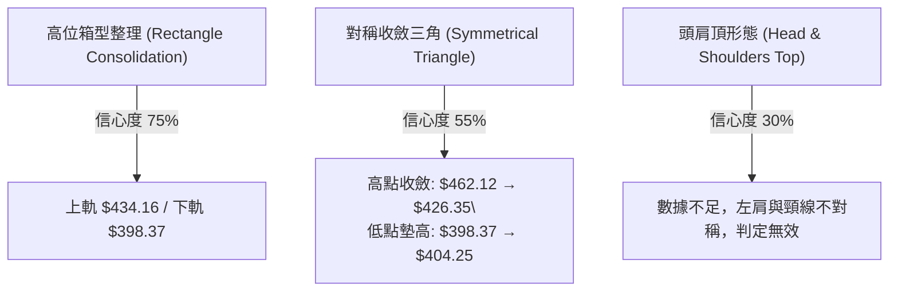

#### 圖表形態判斷與信心度評估

| 識別形態 | 信心度 | 判斷依據（引用精確數據） | 完成度 | 形態目標價（附計算式） |
|:---|:---:|:---|:---:|:---|
| **高位箱型整理** | **75%** | 兩次波段低點於 $398.37 (07-19) 與 $403.41 (07-26) 獲撐；高點於 $434.16 (07-05) 遇阻。 | **85%** | 向上突破目標：$434.16 + ($434.16 - $398.37) = **$469.95**<br>跌破支撐目標：$398.37 - ($434.16 - $398.37) = **$362.58** |
| **中期對稱收斂** | **55%** | 7-8月高點由 $434.16 下降至 $426.35；低點由 $398.37 上升至 $404.25，波幅急劇收窄。 | **65%** | 突破收斂三角形高點 $426.35 後，測量垂直高度 $27.98，目標價 = **$454.33** |
| **幾何反轉形態** | **<40%** | 數據中未偵測到標準頭肩或雙頂形態，形態特徵不顯著。 | **--** | 訊號不足，僅做指標型與區間箱體解讀。 |

---

### 🕯️ 重要K線形態分析

| 月份 | 收盤價 | 實體漲跌 | K線形態特徵 | 市場心理與多空解讀 | 訊號 |
|:---:|:---:|:---:|:---|:---|:---:|
| **2026-06** | $477.57 | +14.39% | 帶長上影線的大陽線 (高點衝至 $479.00) | 歷史新高處多空激烈換手，高位獲利賣壓顯現。 | 🟡 |
| **2026-07** | $404.25 | -15.35% | 長黑實體回調陰線 (最低探至 $398.37) | 多頭急跌洗盤，迅速回吐前月漲幅，尋求均線支撐。 | 🔴 |
| **2026-08** | $415.32 | +2.74% | 小實體帶下影線十字星 (波動收窄) | 跌勢於 $400 關卡獲得支撐，空方打壓力道衰竭。 | 🟢 |
| **2026-09** | $414.00 | -0.32% | 窄幅微實體十字星 (成交量顯著萎縮) | 買賣雙方陷入膠著，市場觀望等待新催化劑。 | 🟡 |

---

### 📉 ASCII 走勢形態示意圖

```
TSM 高位箱型整理與收斂形態 ($398.37 ~ $434.16)
══════════════════════════════════════════════════════════════════
$434.16 ──┬──────● (07-05 箱頂)
          │       \          ● (08-16 反彈次高 $426.35)
          │        \        / \
$414.00 ──┼─────────\──────●───● (現價 $414.00 震盪中樞)
          │          \    /
$398.37 ──┴───────────●── (07-19 箱底支撐)
          └───────────────────────────────────────────────
             2026-07         2026-08         2026-09
══════════════════════════════════════════════════════════════════
```

---

## 4. 支撐與阻力

### 🗺️ 關鍵價位分布圖（Unicode）

```
TSM 價位結構分布圖 (依據歷史波段聚類與斐波那契計算)
══════════════════════════════════════════════════════════════════
$479.00 ║████████████████████████████████║ 52週歷史高點 / 強阻力 R3
$462.12 ║████████████████████████        ║ 波段攻擊高點 / 阻力 R2
$434.16 ║████████████████                ║ 近期箱型頂部 / 關鍵阻力 R1
$419.32 ║▓▓▓▓▓▓▓▓▓▓▓▓                    ║ 斐波那契 23.6% 回調位
$414.00 ╠════════════════════════════════╣ ◄ 當前收盤價 ($414.00)
$398.37 ║▓▓▓▓▓▓▓▓▓▓▓▓▓▓▓▓                ║ 近期波段低點 / 核心支撐 S1
$382.39 ║██████████████████████          ║ 斐波那契 38.2% 回調位 / 強支撐 S2
$352.55 ║████████████████████████████    ║ 斐波那契 50.0% 回調位 / 結構支撐 S3
$226.10 ║████████████████████████████████║ 52週歷史低點 / 終極底部
══════════════════════════════════════════════════════════════════
```

---

### 🚧 阻力位分析表

| 阻力級別 | 價位 | 形成依據 | 突破難度 | 技術重要性 |
|:---|:---:|:---|:---:|:---|
| **關鍵阻力 (R1)** | **$419.32** | 斐波那契 23.6% 回調位 (52W 高低點計算值) | 🟡 中等 | 短線轉強第一道門檻，突破方可確認站上短期均線。 |
| **波段阻力 (R2)** | **$434.16** | 2026-07-05 及 07-12 之連續週線收盤壓力頂 | 🔴 較高 | 箱型整理上軌，若帶量突破將開啟新一輪主升浪。 |
| **強阻力 (R3)** | **$462.12** | 2026-06-21 週線衝頂次高點 | 🔴 極高 | 歷史高點前最後密集成交解套區。 |
| **歷史極值 (R4)** | **$479.00** | 52週最高點 (2026-06 頂部) | 🔴 極高 | 52週絕對壓力天花板。 |

---

### 🛡️ 支撐位分析表

| 支撐級別 | 價位 | 形成依據 | 守住機率 | 技術重要性 |
|:---|:---:|:---|:---:|:---|
| **核心支撐 (S1)** | **$398.37** | 2026-07-19 週線波段探底低點 ($400整數心理關卡) | 🟢 70% | 短線箱體防守底線，守穩維持高位震盪格局。 |
| **強支撐 (S2)** | **$382.39** | 斐波那契 38.2% 回調位 | 🟢 85% | 深度多頭防守位，中長線買盤必守區域。 |
| **結構支撐 (S3)** | **$352.55** | 斐波那契 50.0% 關鍵平衡位 | 🟢 95% | 2026年首季起漲點密集區，多空生死線。 |
| **長期底部 (S4)** | **$226.10** | 52週最低點 | 🟢 >99% | 長期牛市基石。 |

---

### 📐 斐波那契回調位分析

依據 52週完整波段區間（低點 **$226.10** → 高點 **$479.00**，總跨度 $252.90）精確推算：

```
斐波那契回調水平結構
 0.0% (52W High) ─── $479.00  ──────────────────────────────────
23.6% 回調位     ─── $419.32  ▲ 現價上方阻力 ($414.00 處於此區間內)
                      [ 當前價格 $414.00 位於 23.6% 與 38.2% 之間 ]
38.2% 回調位     ─── $382.39  ▼ 現價下方黃金回調支撐
50.0% 回調位     ─── $352.55  ──────────────────────────────────
61.8% 回調位     ─── $322.71  ──────────────────────────────────
78.6% 回調位     ─── $280.22  ──────────────────────────────────
100.0% (52W Low) ─── $226.10  ──────────────────────────────────
```

* **位置解讀**：現價 **$414.00** 位於回調位 **23.6% ($419.32)** 與 **38.2% ($382.39)** 之間的強勢回檔區。
* **技術意涵**：在強勢多頭市場中，健康的回檔通常守在 38.2%（$382.39）之上。目前 TSM 回測甚至未跌破 38.2%，顯示中長期籌碼鎖定良好，屬於強勢的高位橫向消化。

---

## 5. 技術指標深度解讀

### 🎛️ 指標訊號總覽

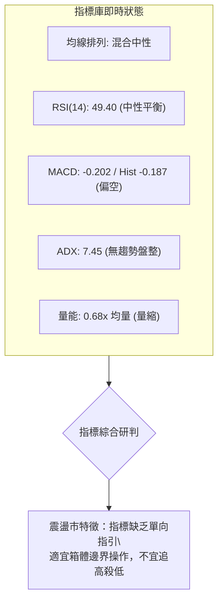

---

### 📈 移動平均線排列分析

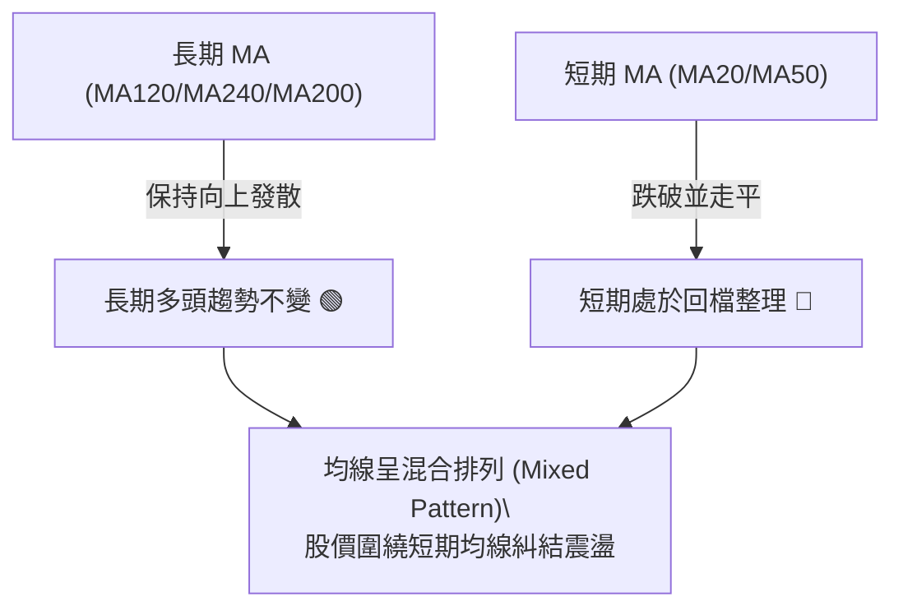

* **均線結構解讀**：
  * **短期（MA20/MA50）**：均線走平糾結，最新收盤價位於短期均線附近，無單邊向上或向下牽引力。
  * **長期（MA120/MA240）**：長期均線持續呈現標準的多頭階梯排列，確保了中長期上升架構未被破壞。

---

### 📉 RSI(14) 分析

```
RSI(14) 動能強度表 (當前值：49.40)
0        20        40   49.40   60        80       100
├─────────┼─────────┼─────●─────┼─────────┼─────────┤
[   超賣區   ][  弱勢區  ][   平衡中軸區  ][  強勢區  ][   超買區   ]
進度條：█████████████████████████░░░░░░░░░░░░░░░░░░░░ 49.4%
```

* **數值狀態**：週線 RSI 由 2026-04 高點 76.5 回落至當前 49.40，正式消除超買過熱風險。
* **背離判定**：
  * 價格於 2026-06 創歷史高點 $479.00 時，週線 RSI 僅為 61.5（低於 4 月高點的 76.5），出現了標準的**中期週線頂背離**，這也是引發 7-8 月回調至 $398.37 的主要技術誘因。
  * 近期在 $398.37 處，RSI 觸及 27.9 後迅速反彈回升至 49.40，目前處於背離修復後的**中性無背離狀態**。

---

### 📊 MACD (12,26,9) 訊號解讀

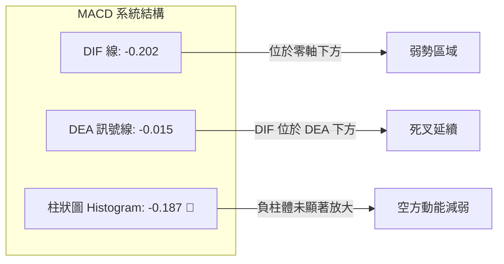

* **訊號解讀**：MACD 線當前處於輕微負值區間（-0.202），訊號線位於 -0.015，柱狀圖為 -0.187。這代表空方仍握有微弱主導權，但負柱體數值極小，顯示下殺動能已大幅鈍化，進入空頭竭盡與橫盤築底期。

---

### 📦 布林通道分析

```
TSM 日/週線布林通道位置示意 (收盤價 $414.00)
══════════════════════════════════════════════════════════════════
$434.16 ────────────────────────────────────── 布林上軌 (阻力帶)
           │
           │        ● 現價 $414.00 (通道中軌偏下)
$416.50 ───┼────────────────────────────────── 布林中軌 (MA20均線)
           │
$398.37 ────────────────────────────────────── 布林下軌 (支撐帶)
══════════════════════════════════════════════════════════════════
```

* **帶寬特徵**：布林通道帶寬顯著收窄，符合 ADX=7.45 的極致低波動特徵。
* **通道策略**：在通道帶寬未向上擴張之前，中軌 $416.50 附近將持續壓制價格，而下軌 $398.37 具備極強的下檔保護。

---

### 💹 成交量分析（量價配合度）

* **最新成交量**：6,263,352 股
* **20日均量**：9,218,698 股 ｜ **量比**：**0.68x**（顯著量縮 🔴）
* **50日均量**：12,701,091 股
* **OBV 能量潮**：OBV < MA，能量潮線處於短期均線下方，反映自 $479.00 回落以來，機構買盤多處於觀望狀態，未見連續的主動性增量攻擊。

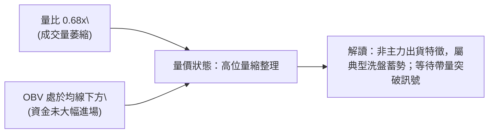

---

## 6. 動能與波動率

### ⚡ 動能評估四象限

| 象限 | 動能維度 | 波動率維度 | 當前狀態 | 戰略應對方針 |
|:---:|:---:|:---:|:---:|:---|
| **第一象限 (Q1)** | 強動能 | 低波動 | — | 最佳趨勢加碼點 |
| **第二象限 (Q2)** | **弱動能** | **低波動** | **TSM (當前落點 ✓)** | **觀望／區間低吸高拋／等待突破** |
| **第三象限 (Q3)** | 強動能 | 高波動 | — | 主升浪或主跌浪行情 |
| **第四象限 (Q4)** | 弱動能 | 高波動 | — | 恐慌殺跌或無序震盪 |

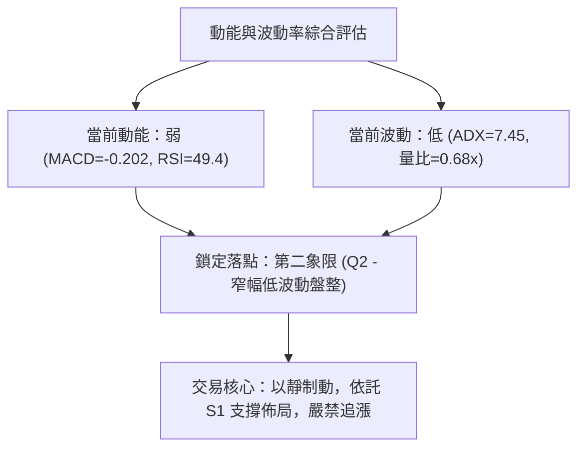

---

### 📊 ATR 與波動特徵

* **ATR 狀態**：波動率自 6 月歷史高點的大幅震盪逐步收斂至低位水平。
* **風控止損空間建議**：
  * 在當前低波動震盪市中，單筆交易防守止損距離應維持在 **$12.00 ~ $15.00** 左右，避免在區間震盪中被假突破無謂掃出場。

---

### 📐 Beta 與市場相關性

* **Beta 係數**：**1.258**
* **大盤聯動性解讀**：TSM 具有高於費城半導體指數與 S&P 500 指數的波動彈性（高出約 25.8%）。當科技股整體市場動能轉強時，TSM 具有極高的高彈性修復空間；但在盤整期，其高 Beta 特性被低量能暫時壓制。

---

## 7. 多時框架總結

### 📋 時框架評分表

| 時框架 | 趨勢方向 | 動能狀態 | 均線排列 | 關鍵圖表形態 | 綜合評分 | 操作建議 |
|:---:|:---:|:---:|:---:|:---:|:---:|:---|
| **月線 (長期)** | 🟢 多頭推進 | 🟢 強勢回檔 | 🟢 多頭發散 | 主升浪高位整理 | **80/100** | 長線續抱，拉回即買點 |
| **週線 (中期)** | 🟡 橫向箱型 | 🟡 中性平衡 | 🟡 短期纏繞 | $398-$434 震盪箱體 | **55/100** | 箱體邊界低吸高拋 |
| **日線 (短期)** | 🔴 弱勢收斂 | 🔴 偏空震盪 | 🔴 短均壓制 | 量縮對稱三角整理 | **42/100** | 觀望，不盲目猜底 |

---

### 🔲 綜合訊號矩陣

```
TSM 多時框矩陣評估
╔════════════════════════════════════════════════════════════════╗
║ 維度 / 週期          日線 (短期)       週線 (中期)       月線 (長期)   ║
╠════════════════════════════════════════════════════════════════╣
║ 趨勢方向             🔴 偏空震盪       🟡 箱型盤整       🟢 強勢多頭   ║
║ 動能指標 (RSI/MACD)  🔴 空方微佔優     🟡 中性修復       🟢 多方主導   ║
║ 均線結構             🔴 短期承壓       🟡 混合糾結       🟢 完美多頭   ║
║ 量價結構             🔴 量能枯竭       🟡 籌碼沉澱       🟢 長期放量   ║
╠════════════════════════════════════════════════════════════════╣
║ 一致性判定           中長期多頭未變，但短期面臨時間換取空間之休整期 ║
╚════════════════════════════════════════════════════════════════╝
```

---

### ⚖️ 多時框收斂結論

> **依據多時框收斂規則（嚴格要求 14）**：
> 1. 當前 **ADX(14) = 7.45 < 25**，判定為標準的**無趨勢盤整行情**。
> 2. 盤整行情中，趨勢指標失效，操作優先級以**日線與週線布林通道 / 箱體上下軌（$398.37 ~ $434.16）**為主要依據。
> 3. **唯一方向性結論：【中性偏多觀望 / 箱體低吸】**。長期月線多頭提供下檔安全墊，短期策略拒絕追高，僅在觸及箱底支撐區時進行右側分批建倉。

---

## 8. 交易策略建議

### 🗺️ 策略決策流程圖

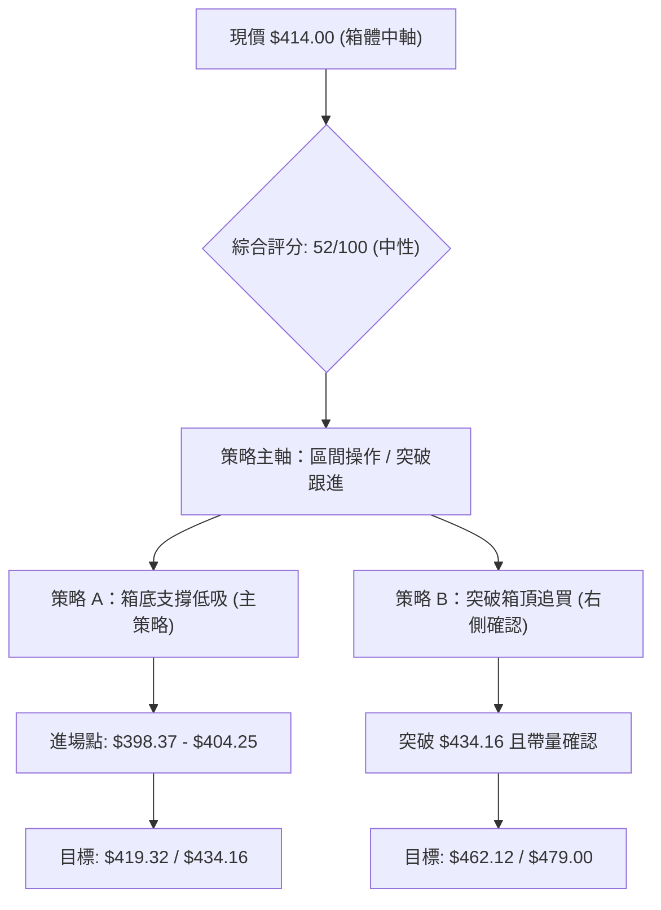

---

### 🧭 策略路由

* **當前主策略方向 = 中性震盪箱體操作（依綜合評分 52/100）**
* 目前股價 $414.00 處於箱體中央，盈虧比不佳，**主推於箱底支撐處分批低吸（策略 A）**，次選**帶量向上突破箱頂後的追隨策略（策略 B）**。

---

### 🎯 價格情境階梯（Price Scenarios）

| 觸發條件 | 下一目標 | 後續延伸 | 技術情境含義 |
|:---|:---:|:---:|:---|
| **向上突破 R1 ($419.32)** | **R2 ($434.16)** | **R3 ($462.12)** | 短線重回強勢區，突破箱頂將展開新主升段。 |
| **維持於現價區間 ($404 - $419)** | — | — | 維持低波動量縮築底，等待催化劑。 |
| **向下跌破 S1 ($398.37)** | **S2 ($382.39)** | **S3 ($352.55)** | 跌破高位箱體，將深度考驗斐波那契 38.2% 回調支撐。 |

---

### 📊 情境機率分佈

| 運行情境 | 發生機率 | 主要技術依據 |
|:---|:---:|:---|
| **區間震盪蓄勢 (箱體運行)** | **55%** | ADX = 7.45 極弱趨勢，量比 0.68x 萎縮，籌碼處於沉澱期。 |
| **守穩支撐並向上反彈** | **30%** | 長期均線強固，週線 RSI 於 40-50 獲支撐，分析師目標均價 $552.38。 |
| **向下破位深度洗盤** | **15%** | MACD 柱狀圖微幅偏空，若大盤重挫可能誘發破底洗盤。 |

---

### 🟢 主策略詳情

| 策略要素 | 策略 A（箱底支撐低吸 — 推薦） | 策略 B（突破追隨 — 右側交易） |
|:---|:---|:---|
| **交易類型** | 左側/右側支撐買入 | 右側突破買入 |
| **進場條件** | 回踩 S1 支撐不破，出現止跌長下影線 | 日K收盤帶量突破 R2 ($434.16) 箱頂 |
| **進場價格** | **$404.00**（$398.37 ~ $404.25 區間） | **$435.00**（確認站穩突破點） |
| **第一目標價 (T1)**| **$419.32**（斐波那契 23.6% 阻力位） | **$462.12**（波段攻擊高點） |
| **第二目標價 (T2)**| **$434.16**（箱型頂部阻力） | **$479.00**（52週歷史高點） |
| **防守止損價** | **$392.00**（跌破 S1 $398.37 下方約 1.5%） | **$425.00**（跌回突破頸線下方） |
| **預期風險報酬比** | **1 : 2.51**（風險 $12 / 期望利潤 $30.16）| **1 : 4.40**（風險 $10 / 期望利潤 $44.00） |
| **評估勝率** | **65%** | **55%** |
| **建議倉位配置** | **15% ~ 20%**（分批建倉） | **10% ~ 15%**（突破加碼） |

---

### 🔴 反向風險觸發點（對沖與風控提示）

* **空頭破位警報**：若日K線以收盤價實體跌破 **$398.37 (S1)** 且成交量放大至 10M 以上，代表高位箱型支撐失效，應立即暫停所有多頭買入，並針對現貨部位採取減倉或買入 Put 避險，下檔將直指 **$382.39 (S2)**。
* **假突破誘多警報**：若價格觸及 **$434.16 (R2)** 但日成交量未能超過 10M 股，且留下長上影線，需防範假突破拉回風險，應在該位置進行部分多頭獲利了結。

---

### ⭐ 整體訊號強度評星

```
╔════════════════════════════════════════════════════════════════╗
║ 做多訊號強度：  ★★★☆☆  (3.2/5星 - 支撐牢固，缺乏量能催化)    ║
║ 做空訊號強度：  ★★☆☆☆  (1.8/5星 - 長期多頭壓制，下檔空間有限)  ║
║ 整體可信度：    ★★★★☆  (4.0/5星 - 箱體與斐波那契價位高度精確)║
╚════════════════════════════════════════════════════════════════╝
```

---

## 9. 風險提示與監控

### ✅ 關鍵監控指標 Checklist

```
╔════════════════════════════════════════════════════════════════╗
║                TSM 日常技術監控清單 (Checklist)               ║
╠════════════════════════════════════════════════════════════════╣
║ [ ] 價格是否跌破箱底核心支撐 $398.37 (跌破需嚴格停損)          ║
║ [ ] 價格是否突破箱頂關鍵阻力 $434.16 (帶量突破為加碼訊號)      ║
║ [ ] 單日成交量是否有效放大突破 12.7M (50日均量線)              ║
║ [ ] 日線 MACD 柱狀圖是否由負轉正 (零軸上黃金交叉)              ║
║ [ ] ADX(14) 是否脫離盤整區突破 20 (趨勢行情啟動訊號)           ║
║ [ ] RSI(14) 是否成功站穩 50.0 中軸之上                         ║
╚════════════════════════════════════════════════════════════════╝
```

---

### ⚠️ 風險場景分析

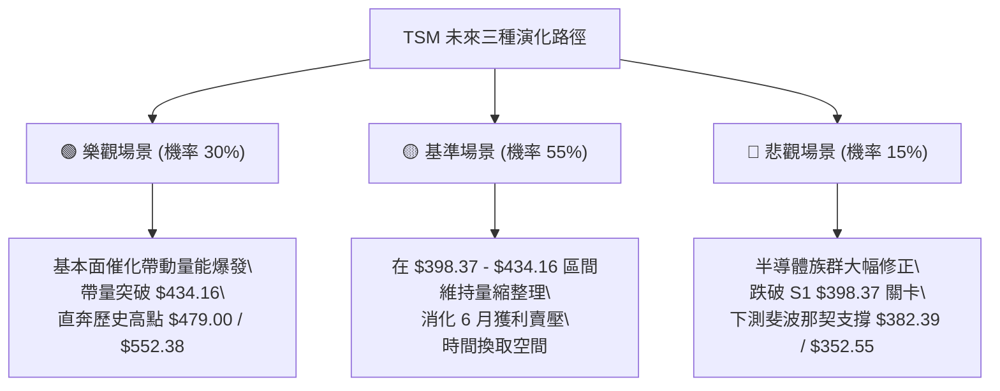

---

### 🛡️ 風險管理重要提醒

1. **嚴格禁止中間價位追單**：現價 $414.00 處於箱體正中央，向上至阻力 $419.32 僅有 $5.32 空間，向下至支撐 $398.37 有 $15.63 風險，在此處追單盈虧比僅 0.34，極度不划算。
2. **倉位分散原則**：鑑於 ADX=7.45 處於沉悶盤整期，資金佔用成本較高，單一個股部位建議控制在總投資組合的 **15% - 20%** 以內。
3. **止損紀律執行**：若執行策略 A，一旦收盤跌破 $392.00 必須無條件執行停損，嚴防小虧損演變為深度套牢。

---

## 📋 報告總結

```
╔════════════════════════════════════════════════════════════════╗
║                     TSM 技術分析報告總結                       ║
╠════════════════════════════════════════════════════════════════╣
║ 報告日期：2026-09-03             最新收盤價：$414.00           ║
║ 技術評級：🟡 中性觀望 / 區間震盪  綜合評分：52 / 100            ║
╠════════════════════════════════════════════════════════════════╣
║ 關鍵結論：                                                     ║
║ ├─ 長期趨勢：🟢 強勢多頭 (52週低點 $226.10 以來多頭架構完好)    ║
║ ├─ 中期趨勢：🟡 箱型整理 (受限於 $398.37 ~ $434.16 區間)        ║
║ ├─ 短期趨勢：🔴 量縮休整 (ADX=7.45，短線動能偏弱)              ║
║ ├─ 關鍵支撐：S1: $398.37 ｜ S2: $382.39 (Fib 38.2%)            ║
║ ├─ 關鍵阻力：R1: $419.32 (Fib 23.6%) ｜ R2: $434.16 (箱頂)    ║
║ └─ 分析師共識目標：均價 $552.38 (最高 $700.00 / 最低 $440.00) ║
╠════════════════════════════════════════════════════════════════╣
║ 最優策略組合：                                                 ║
║ 1. 🥇 最佳機會：回踩 $398.37 ~ $404.25 箱底支撐分批佈局 (策略A) ║
║ 2. 🥈 次選機會：帶量突破 $434.16 箱頂後右側順勢追隨 (策略B)    ║
║ 3. 🥉 保守選擇：空手觀望，等待 ADX > 20 趨勢明朗化後再行進場   ║
╚════════════════════════════════════════════════════════════════╝
```

---

> ⚠️ **免責聲明**：本報告為技術分析研究，所有圖表、數據及價位推算均基於歷史價格資訊。本報告**僅供研究與學術參考**，**不構成任何形式的投資建議**。金融市場具有高度風險，投資人應獨立思考並自負盈虧。

---

*報告生成時間：2026-09-03 ｜ 數據來源：Yahoo Finance ｜ 分析框架：資深多時框技術分析模型*