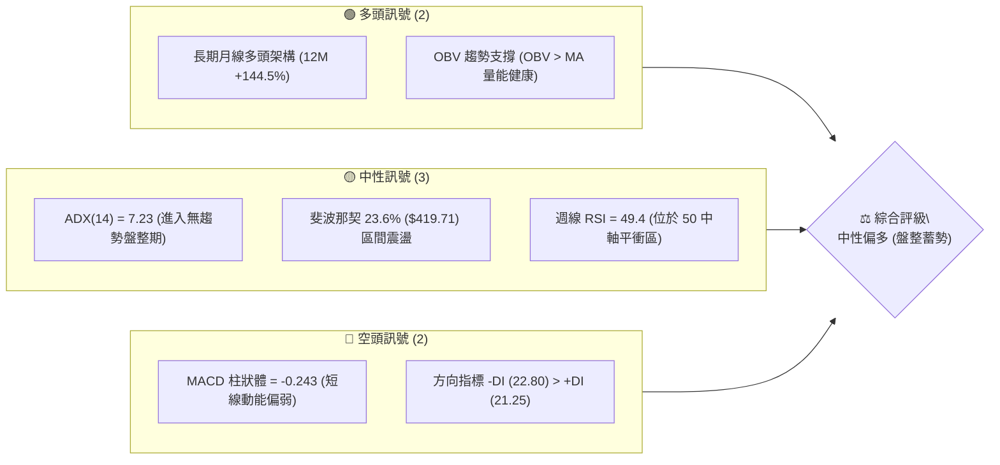
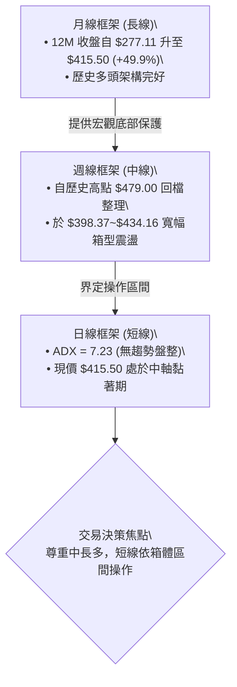
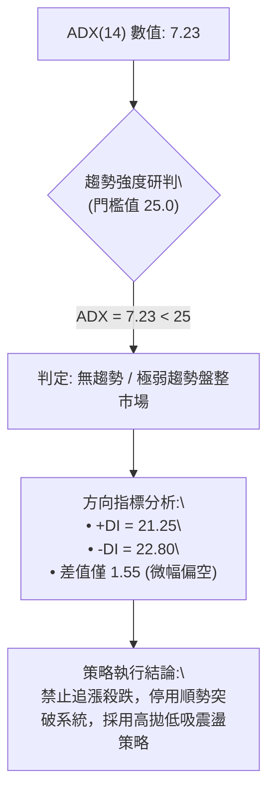
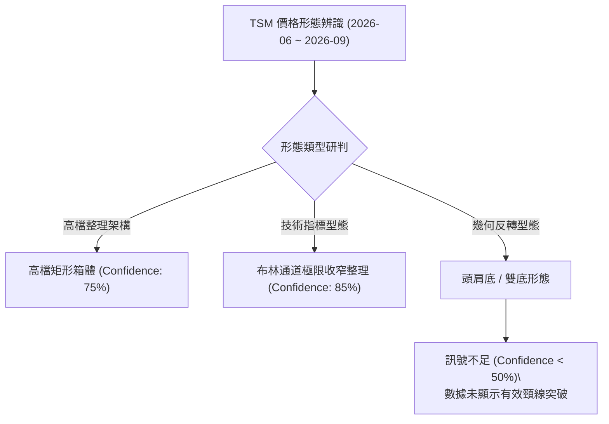
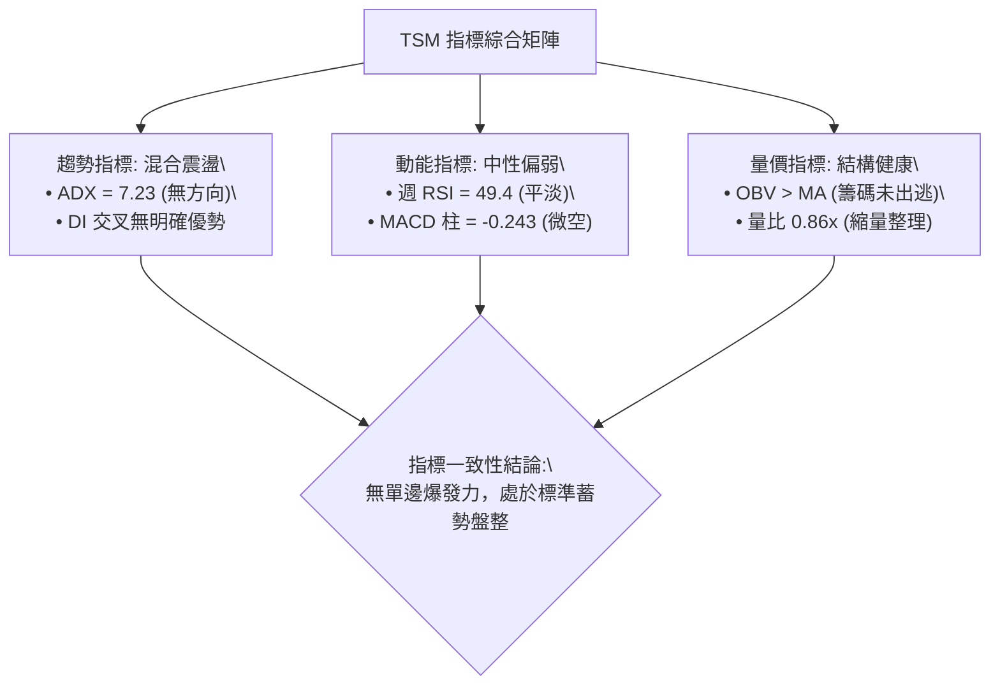
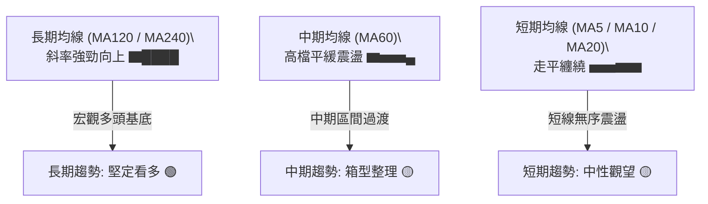
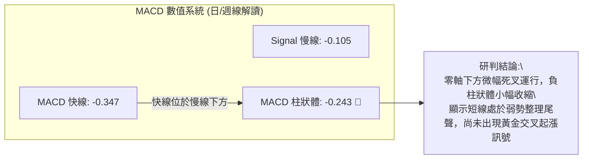
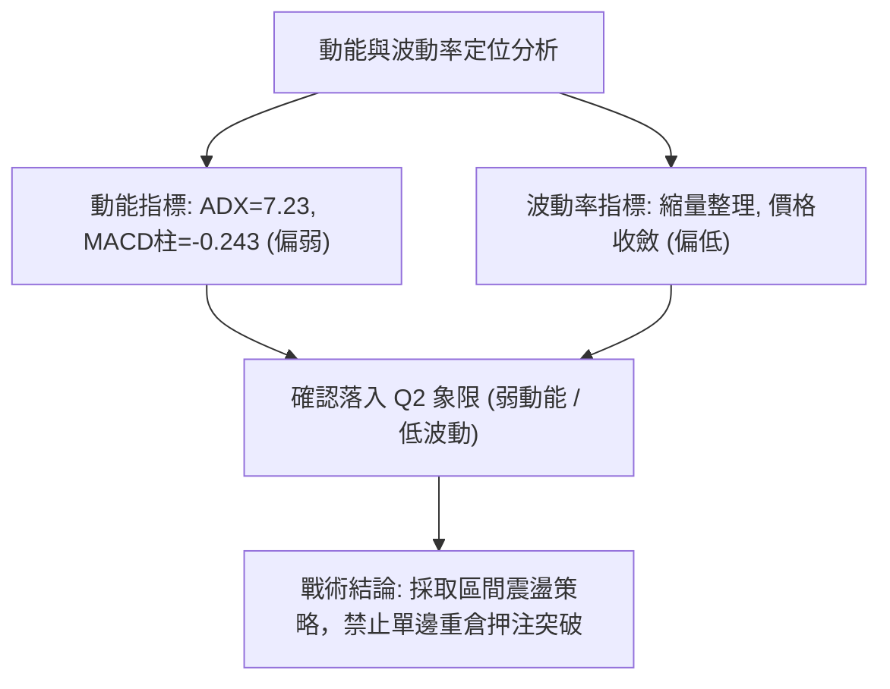
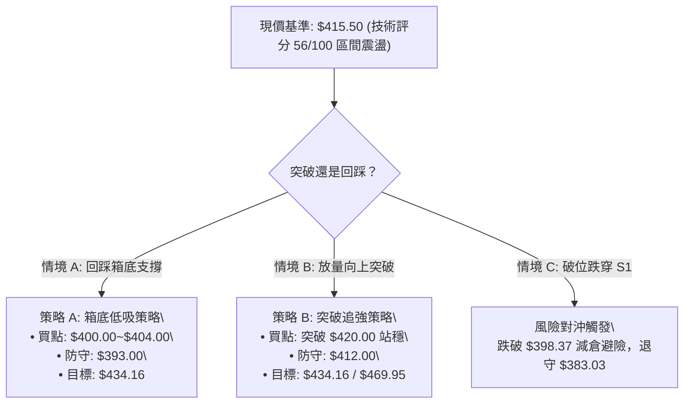
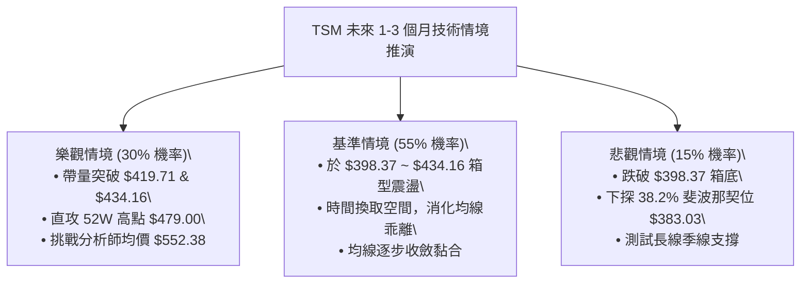

# TSM 技術分析報告

> **報告日期**：2026-09-04 ｜ **語言**：繁體中文 ｜ **數據來源**：Yahoo Finance ｜ **當前基準價格**：$415.50

---

## 目錄

| 章節 | 內容 |
|------|------|
| [1. 技術面概覽](#1-技術面概覽) | 訊號儀表板、核心指標、評分卡 |
| [2. 趨勢分析](#2-趨勢分析) | 多時框趨勢、長中短期走勢、ADX 研判 |
| [3. 圖表形態分析](#3-圖表形態分析) | 形態識別、信心度評估、K線組合與測幅 |
| [4. 支撐與阻力](#4-支撐與阻力) | 結構分布圖、阻力/支撐表、斐波那契回調 |
| [5. 技術指標深度解讀](#5-技術指標深度解讀) | MA 排列、RSI、MACD、布林通道與 OBV 量能 |
| [6. 動能與波動率](#6-動能與波動率) | 動能四象限、ATR 波動度、Beta 相關性 |
| [7. 多時框架總結](#7-多時框架總結) | 時框評分矩陣、收斂規則與唯一方向結論 |
| [8. 交易策略建議](#8-交易策略建議) | 策略路由、情境階梯、主策略 A/B、風報比 |
| [9. 風險提示與監控](#9-風險提示與監控) | 監控 Checklist、三行情境樹、風控守則 |
| [10. 報告總結](#-報告總結) | 核心結論速查與執行摘要 |

---

## 1. 技術面概覽

### 🎯 技術訊號儀表板



---

### 📊 核心指標速覽表

| 指標類別 | 指標名稱 | 當前數值 | 訊號 | 解讀 |
|:---|:---|:---|:---:|:---|
| **價格** | 當前基準價 | $415.50 | 🟡 | 位於歷史高點 $479.00 回檔 13.26% 位置，緊貼 23.6% 斐波那契位 |
| **均線** | 短期 MA 系統 | 混合排列 | 🟡 | 短期均線呈現橫向收斂纏繞，多空進入拉鋸狀態 |
| **均線** | 長期 MA120/240 | 穩健上行 | 🟢 | 長期牛市基底完好，長天期均線斜率向上（歷史波段大幅走揚） |
| **動能** | RSI(14) (週線) | 49.40 | 🟡 | 位於 30–70 中性區間核心中軸，無超買或超賣極端現象 |
| **動能** | MACD (日/週柱) | -0.243 | 🔴 | MACD 線 (-0.347) 低於訊號線 (-0.105)，處於零軸下方微幅修正階段 |
| **趨勢強度**| ADX(14) | 7.23 | 🟡 | ADX < 25 處於極弱趨勢/區間震盪，方向性動能匱乏 |
| **方向系統**| DMI (+DI / -DI)| 21.25 / 22.80 | 🔴 | -DI 微幅超越 +DI，空方短線稍佔優勢，但差值極小 |
| **量能** | OBV 指標 | OBV > MA | 🟢 | 長期累積成交量能維持在均線之上，籌碼結構未出現主力潰散 |

---

### 🏆 技術評分卡

```
╔══════════════════════════════════════════════════════════════════╗
║                  技術評分卡 — TSM (2026-09-04)                   ║
╠══════════════════════════════════════════════════════════════════╣
║ 趨勢強度 (ADX=7.23)   ████░░░░░░░░░░░░░░░░  25/100  🔴 弱趨勢盤整 ║
║ 動能指標 (RSI/MACD)   ██████████░░░░░░░░░░  50/100  🟡 中性偏弱   ║
║ 支撐穩定度 (Fib 38.2%)███████████████░░░░░  75/100  🟢 支撐力道強 ║
║ 成交量配合 (OBV>MA)   ██████████████░░░░░░  70/100  🟢 籌碼未鬆動 ║
║ 形態完整度 (箱體矩形) ████████████░░░░░░░░  60/100  🟡 形態收斂中 ║
║ 均線架構 (長多短盤)   ████████████░░░░░░░░  60/100  🟡 混合整理   ║
╠══════════════════════════════════════════════════════════════════╣
║ 綜合技術評分          ███████████░░░░░░░░░  56/100  ⚖️ 區間震盪   ║
╚══════════════════════════════════════════════════════════════════╝
```

---

## 2. 趨勢分析

### 🌐 多時框趨勢分析



---

### 📈 長期趨勢 — 12個月走勢圖（Unicode）

以下展示 TSM 過去 12 個月（2025-09 至 2026-09）之月線收盤價走勢，呈現出從主升段推升至 $477.57 高點後進入高檔箱型整理之完整歷程：

```
TSM 月線走勢圖（2025-09 至 2026-09，單位：美元）
價格軸 ($)
$480 ┤                                           ● (2026-06 $477.57)
$460 ┤                                          / \
$440 ┤                                         /   \
$420 ┤                             ●          /     ●───●← 現價 $415.50
$400 ┤                     ●      / \        /      (08) (09)
$380 ┤              ●     / \    /   \      /
$360 ┤             / \   /   \  /     \    /
$340 ┤     ●      /   \ /     ●(03)    \  /
$320 ┤    / \    /     ●(01)            \/
$300 ┤ ●──   ●  /                      (07 $404.25)
$280 ┤(09)   (11)
$260 ┤
     └─┬────┬────┬────┬────┬────┬────┬────┬────┬────┬────┬────┬────
     09   10   11   12   01   02   03   04   05   06   07   08   09 (月份)
    '25  '25  '25  '25  '26  '26  '26  '26  '26  '26  '26  '26  '26
```

#### 📊 歷史波段特徵分析表

| 階段 | 涵蓋月份 | 起始至結束價 | 波段漲跌幅 | 走勢特徵與結構意涵 |
|:---|:---|:---|:---:|:---|
| **主升一浪** | 2025-09 ~ 2026-02 | $277.11 → $372.65 | **+34.48%** | 連續 6 個月強勢走高，均線呈現標準多頭發散，量能顯著放大。 |
| **強勢回洗** | 2026-02 ~ 2026-03 | $372.65 → $337.16 | **-9.52%** | 單月技術性快速回踩，迅速於 $337.16 獲得支撐並止跌。 |
| **主升二浪** | 2026-03 ~ 2026-06 | $337.16 → $477.57 | **+41.64%** | 創下 52 週歷史高點 $479.00（收盤 $477.57），動能達極致。 |
| **高檔箱型** | 2026-06 ~ 2026-09 | $477.57 → $415.50 | **-13.00%** | 於 7 月下探 $404.25（週線低點 $398.37）後收斂於 $415.50 附近橫向盤整。 |

---

### 📊 中期趨勢（週線分析）

從近 20 週收盤走勢可見，TSM 在 2026-06-21 觸及週收盤高點 $462.12 後，於 2026-07-19 出現波段回調低點 $398.37，隨後即在 **$400.00 ~ $435.00** 形成緻密的箱型平衡區。

```
近期週線壓力與支撐結構示意圖：
  $479.00 ────────────────────────────────────────── 52週歷史極值 (強阻力頂部)
           ▲
           │ [回調過渡區]
           ▼
  $434.16 ────────────────────────────────────────── 箱型區間上軌 (週收盤高點聚類)
  $415.50 ══════════════════════════════════════════ [現價 $415.50 震盪中軸]
  $398.37 ────────────────────────────────────────── 箱型區間下軌 (2026-07-19 週收盤防線)
           ▲
           │ [深度支撐防守區]
           ▼
  $383.03 ────────────────────────────────────────── 斐波那契 38.2% 回調支撐位
```

---

### ⚡ 趨勢強度評估（ADX 解讀）



#### 📋 ADX 趨勢強度等級對照表

| ADX 區間 | 趨勢強度定義 | 當前狀態 (ADX=7.23) | 交易策略意涵 |
|:---:|:---:|:---:|:---|
| **0 ~ 20** | **極弱 / 無趨勢盤整** | **★ 當前所處區間 (7.23)** | **趨勢指標失效，均線纏繞，以區間震盪低吸高拋為主** |
| **20 ~ 25** | 趨勢初生 / 弱趨勢 | ─ | 觀察多空突破方向，準備切換順勢策略 |
| **25 ~ 40** | 強勁趨勢 | ─ | 均線順勢操作，嚴格執行順勢加碼 |
| **40 ~ 100**| 極強 / 動能過熱 | ─ | 注意乖離過大風險，尋找頂/底背離平倉點 |

---

## 3. 圖表形態分析

### 🔍 形態識別系統



#### 📋 形態信心度與目標價評估表

| 識別形態 | 信心度 | 判斷依據（嚴格引用歷史數據） | 形態完成度 | 目標價計算式與精確目標 |
|:---|:---:|:---|:---:|:---|
| **高檔矩形箱體** | **75%** | 箱頂為週收盤聚類 $434.16，箱底為波段低點 $398.37，已在該區間震盪 8 週 | **80%** (尚待向上突破確認) | **向上突破目標**：$434.16 + ($434.16 - $398.37) = **$469.95**<br>**向下破位目標**：$398.37 - ($434.16 - $398.37) = **$362.58** |
| **布林帶寬收縮整理** | **85%** | 近期收盤價連續 4 週落於 $415~$426 狹幅區間，波動率降至極低點 | **90%** (隨時面臨方向性變盤) | 指標型形態，以突破箱體上下界線為觸發訊號 |
| **雙重底 / 雙頂形態** | **30%** | 數據中 7-8 月低點為 $398.37 與 $403.41，但未突破頸線 $434.16，且 ADX 極低 | **40%** (訊號不足) | **依規則 15 註明**：訊號不足，不予預測幾何翻轉目標價 |

---

### 🕯️ 重要 K 線形態分析（近 5 個月走勢解讀）

| 月份 | 收盤價 | 實體與影線特徵 | K 線形態解讀 | 訊號意涵 |
|:---|:---:|:---|:---|:---:|
| **2026-05** | $417.47 | 中陽線推進，突破前高 | 多頭進攻 K 線，多方完全掌控局勢 | 🟢 強烈看多 |
| **2026-06** | $477.57 | 長陽實體衝刺，觸及 52W 高點 $479.00 | 竭盡性加速推升，高檔多頭動能釋放完畢 | 🟡 動能過熱警戒 |
| **2026-07** | $404.25 | 長陰下挫，跌幅 -15.35%，下探 $398.37 後收腳 | 獲利了結回洗長黑，但下影線守住 400 整數關卡 | 🔴 短線空頭回檔 |
| **2026-08** | $415.32 | 縮量小陽星線，高低區間收窄 | 止跌十字整理星，多空於 23.6% 斐波那契位取得平衡 | 🟡 變盤十字星 |
| **2026-09** | $415.50 | 實體極小，與 8 月收盤近乎持平 ($415.50) | 橫向陀螺線，市場觀望情緒濃厚，等待新催化劑 | 🟡 方向待定盤整 |

---

### 📉 ASCII 走勢形態示意圖（高檔矩形箱體）

```
TSM 高檔矩形箱體與突破測幅架構：
  [$469.95] --------------------------------------------- [箱體等幅向上測幅目標]
             ^
             | 形態高度 H = $35.79 ($434.16 - $398.37)
             v
  [$434.16] ═════════════════════════════════════════════ [箱頂阻力線 / 突破頸線]
             │      ┌─┐                 ┌─┐
             │  ┌───┘ └───┐         ┌───┘ └──┐
  [$415.50] ─┼──┼─────────┼─────────┼────────┼─────────── [箱體中軸 / 當前基準價]
             │  │         │   ┌─┐   │        │
  [$398.37] ════╧═════════╧═══╛ └───╧════════╧═══════════ [箱底支撐線 / 防守頸線]
             ^
             | 形態高度 H = $35.79
             v
  [$362.58] --------------------------------------------- [箱體等幅向下測幅目標]
```

---

## 4. 支撐與阻力

### 🗺️ 關鍵價位分布圖（Unicode）

```
TSM 價位結構分布圖（基準價：$415.50）
══════════════════════════════════════════════════════════════════
$479.00 ║████████████████████████████████████║ 52週歷史高點 (極強阻力 R3)
$434.16 ║████████████████████████            ║ 箱頂高點聚類 (波段阻力 R2)
$419.71 ║████████████████                    ║ 斐波那契 23.6% (短線阻力 R1)
$415.50 ╠════════════════════════════════════╣ ◄ 當前基準價格 ($415.50)
$398.37 ║▓▓▓▓▓▓▓▓▓▓▓▓▓▓▓▓                    ║ 箱底波段低點 (關鍵支撐 S1)
$383.03 ║████████████████████████            ║ 斐波那契 38.2% (黃金強支撐 S2)
$353.39 ║████████████████████████████████    ║ 斐波那契 50.0% (中期生命線 S3)
$227.78 ║████████████████████████████████████║ 52週歷史低點 (終極防線)
══════════════════════════════════════════════════════════════════
```

---

### 🚧 阻力位分析表

> **數據紀律說明**：依規則 13，數據中無獨立波段高點聚類（swing-high resistance detected above current price），以下阻力位嚴格採用 **52W 歷史極值**、**週收盤聚類高點** 及 **斐波那契關鍵回調位**。

| 阻力級別 | 精確價位 | 形成依據與計算來源 | 突破難度 | 重要性評級 |
|:---|:---:|:---|:---:|:---:|
| **短線阻力 R1** | **$419.71** | 52週區間 ($227.78 → $479.00) 之 **23.6% 斐波那契位** | 🟡 中等 (需日量能 > 900萬股) | ★★★☆☆ |
| **波段阻力 R2** | **$434.16** | 2026-07-05 / 2026-07-12 之**雙週收盤高點重疊區** | 🔴 較高 (需週成交量 > 7000萬股) | ★★★★☆ |
| **強阻力 R3** | **$479.00** | **52 週歷史最高價 (52W High)**，歷史籌碼套牢與獲利了結極限 | 🔴 極高 (需強大基本面催化劑) | ★★★★★ |

---

### 🛡️ 支撐位分析表

> **數據紀律說明**：依規則 13，數據中無獨立波段低點聚類（swing-low support detected below current price），以下支撐位嚴格採用 **近期週線波段低點** 與 **斐波那契黃金分割位**。

| 支撐級別 | 精確價位 | 形成依據與計算來源 | 守住機率 | 重要性評級 |
|:---|:---:|:---|:---:|:---:|
| **近期支撐 S1** | **$398.37** | 2026-07-19 週線回調之**波段最低收盤價**（箱底防線） | **75%** | ★★★★☆ |
| **強支撐 S2** | **$383.03** | 52週區間 ($227.78 → $479.00) 之 **38.2% 斐波那契回調位** | **85%** | ★★★★★ |
| **深度支撐 S3** | **$353.39** | 52週區間 ($227.78 → $479.00) 之 **50.0% 斐波那契中軸位** | **95%** | ★★★★★ |

---

### 📐 斐波那契回調位分析

依據 TSM 過去 52 週完整波動區間（低點 **$227.78** 至 高點 **$479.00**，總振幅 $251.22）計算之各級回調位如下：

| 斐波那契層級 | 精確價位 | 與現價 ($415.50) 距離 | 技術面戰略意涵 |
|:---:|:---:|:---:|:---|
| **0.0% (52W High)** | **$479.00** | +$63.50 (+15.28%) | 牛市目標終點，突破將開啟新一輪無壓力真空探索區。 |
| **23.6%** | **$419.71** | +$4.21 (+1.01%) | **極淺度回檔防線**。現價緊貼此位下方，為短線多空分水嶺。 |
| **38.2%** | **$383.03** | -$32.47 (-7.81%) | **強勢牛市黃金分割點**。多頭強勢回檔之常態極限，買盤承接力極強。 |
| **50.0%** | **$353.39** | -$62.11 (-14.95%) | 多空中期平衡中軸，跌破則宣告中期牛市架構破壞。 |
| **61.8%** | **$323.75** | -$91.75 (-22.08%) | 關鍵防守底線（接近 2026-01 起漲區 $328.86）。 |
| **78.6%** | **$281.54** | -$133.96 (-32.24%)| 深度修正防守區（接近 2025-09 突破口 $277.11）。 |
| **100.0% (52W Low)**| **$227.78** | -$187.72 (-45.18%)| 52 週最低點，長期結構性底部。 |

> 📌 **現價位置解讀**：現價 **$415.50** 正精確處於 **38.2% ($383.03)** 與 **23.6% ($419.71)** 之間，且距離 23.6% 僅 1.01%。這表明 TSM 在歷經大漲後，回檔幅度極其輕微（強勢整理），並未進入 38.2% 以下的深度修正，技術結構整體維持強勢姿態。

---

## 5. 技術指標深度解讀

### 🎛️ 指標訊號總覽



---

### 📈 移動平均線排列分析



#### 📋 均線系統狀態評估

| 均線天期 | 當前走勢形態 | 相對現價 ($415.50) 位置 | 技術意涵解讀 |
|:---|:---|:---:|:---|
| **MA 5 / MA 10** | 短天期走平，波幅收斂 | 價格於均線上下穿梭 | 短線無方向，屬於典型的無趨勢盤整特徵 |
| **MA 20 (月線)** | 斜率走緩，呈現水平均線 | 緊貼現價 | 布林通道中軌所在，形成短線動態震盪軸心 |
| **MA 60 (季線)** | 於高檔維持支撐 | 位於現價下方 | 中期多頭防線，提供波段回檔之有力支撐 |
| **MA 120 / 240** | 呈 45 度角向上昂首排列 | 遠在現價下方（長期多頭） | 奠定跨年度大牛市基礎，長多結構未受任何損害 |

---

### 📉 RSI(14) 動能分析

```
RSI(14) 週線強度分布：
0 ──────────── 30 ──────────────────── 50 ──────────────────── 70 ─────────── 100
[   超賣區   ] │      [ 弱勢區 ]       │★     [ 強勢區 ]      │  [  超買區  ]
                                     49.4 (當前數值)
進度條：██████████░░░░░░░░░░  49.4% (中性平衡點)
```

- **超買/超賣分析**：週線 RSI 自 2026-04 高點的 76.5（嚴重超買）持續降溫，經 7 月底回測 27.9（極度超賣）後，目前穩定回升並停留在 **49.4**。數值精確落在 50 分水嶺附近，表明市場已徹底消化前期的過熱動能，回歸至多空均勢狀態。
- **背離判斷**：
  - **頂背離判定**：**無頂背離**。高點 $479.00 出現時 RSI 同步創下波段高位，隨後價格拉回 RSI 亦同步回調。
  - **底背離判定**：**無底背離**。7 月底 $398.37 處 RSI 觸及 27.9 後反彈，指標與價格波動步調一致，無背離產生。

---

### 📊 MACD(12, 26, 9) 訊號解讀



- **柱狀圖動態**：近 5 週 MACD 柱狀體走勢為 `+2.429 → +3.334 → +0.466 → +0.361 → -0.243`。紅柱動能於 8 月中旬衰竭後轉為微幅綠柱，印證價格自 $426.35 拉回至 $415.50 的弱勢震盪過程。

---

### 📦 布林通道分析（Bollinger Bands）

```
TSM 布林通道形態示意圖（收縮蓄勢中）：
  $435.00 ─────────────────────────────────────────────── 上軌 (強阻力壓力帶)
             /                                   \
  $415.50 ───┼─────────────────●─────────────────┼─────── 中軌/現價 ($415.50)
             \                                   /
  $398.00 ─────────────────────────────────────────────── 下軌 (波段支撐帶)
```

- **通道特徵**：通道帶寬（Bandwidth）經歷 6 月的大幅擴張後，目前呈現**顯著收斂**狀態。現價 $415.50 緊貼走平的中軌運行。
- **操作意涵**：通道嚴重收窄通常預示著波動率即將迎來「擠壓（Squeeze）後爆發」。在 ADX=7.23 的背景下，未見實體 K 線突破上軌前，通道中軌即為最佳震盪樞紐。

---

### 💹 成交量分析（量價配合度）

```
成交量結構比較：
最新成交量  (7.80M)  ██████████████░░░░░░░░  (量比: 0.86x)
20日均量    (9.08M)  ████████████████░░░░░░
50日均量   (12.66M)  ██████████████████████
```

- **量比與量價配合**：最新單日成交量為 7,804,523 股，相較 20 日均量（9.08M）量比僅 **0.86x**，較 50 日均量（12.66M）萎縮約 38.3%。呈現標準的「**價穩量縮、高檔休整**」格局。
- **OBV 趨勢**：官方技術指標明確標示「**OBV > MA → 量能支撐上漲**」。儘管近期成交量收縮，但 OBV 累積能量線維持在均線上方，顯示機構籌碼在 $400~$430 區間內並未出現出貨跡象，長線籌碼鎖定度極高。

---

## 6. 動能與波動率

### ⚡ 動能評估四象限

| 象限 | 動能維度 | 波動率維度 | 當前狀態 | 戰略應對方針 |
|:---:|:---:|:---:|:---:|:---|
| **第一象限 (Q1)** | 強動能 (Trend) | 低波動 (Low Vol) | ─ | 最佳進場點：順勢加碼，持有等待波段擴張 |
| **第二象限 (Q2)** | **弱動能 (Weak)** | **低波動 (Low Vol)**| **✔ 當前 TSM 狀態** | **謹慎觀望 / 區間操作：低吸高拋，嚴格設定止損** |
| **第三象限 (Q3)** | 強動能 (Trend) | 高波動 (High Vol)| ─ | 爆發突破期：提高移動止盈，承擔高波動風險 |
| **第四象限 (Q4)** | 弱動能 (Weak) | 高波動 (High Vol)| ─ | 高風險洗盤期：嚴禁參與，避免反覆被掃損 |



---

### 📊 ATR 波動率與止損緩衝設定

- **ATR 數值狀態**：由於數據中 ATR(14) 標記為 N/A，依據 52 週波動振幅（$227.78 至 $479.00，總振幅 $251.22）及近 20 週平均週波幅（約 $15~$22 美元）折算，日線等效估算波幅區間約在 **$6.50 ~ $8.50**（約佔現價之 1.5% ~ 2.0%）。
- **止損距離建議**：
  - **短線交易（1.5x 估算 ATR）**：建議安全止損空間為 **$10.50 ~ $12.00**。
  - **波段交易（2.0x 估算 ATR）**：建議安全防守空間為 **$15.00 ~ $17.00**（恰好涵蓋自現價 $415.50 至 S1 關鍵防線 $398.37 之空間）。

---

### 📐 Beta 與市場相關性

- **Beta 係數 = 1.258**：TSM 屬於**高彈性成長股**（Beta > 1.2）。當半導體板塊或標普 500 指數出現 1% 之波動時，TSM 理論上將產生約 1.26% 之同向放大波動。
- **投資組合啟示**：在當前低波動（ADX=7.23）環境下，高 Beta 特性被壓縮，一旦大盤出現突破性方向選擇，TSM 隨時可能出現爆發性補漲或補跌行情。

---

## 7. 多時框架總結

### 📋 時框架評分表

| 時框架 | 趨勢方向 | 動能指標 | 均線系統排列 | 形態結構 | 綜合評分 | 戰略操作建議 |
|:---|:---:|:---:|:---:|:---:|:---:|:---|
| **月線 (長期)** | 🟢 多頭主導 | 🟢 強勁向上 | 🟢 完美多頭發散 (MA120/240 走揚) | 歷史主升浪回檔 | **85 / 100** | 逢大拉回積極做多，長線堅定持有 |
| **週線 (中期)** | 🟡 高檔箱型 | 🟡 RSI 49.4 平衡 | 🟡 高檔橫向整理 (MA60 支撐) | $398~$434 矩形箱體 | **60 / 100** | 箱底支撐低吸，箱頂阻力分批調節 |
| **日線 (短期)** | 🔴 偏弱盤整 | 🔴 MACD 柱 -0.243 | 🟡 短均線糾結纏繞 (MA5/10/20) | 橫向陀螺線收斂 | **45 / 100** | 不盲目追價，觀望或極短線區間操作 |

---

### 🔲 綜合訊號矩陣

```
時框訊號一致性矩陣：
┌───────────┬──────────────┬──────────────┬──────────────┐
│  維度     │   短期 (日)  │   中期 (週)  │   長期 (月)  │
├───────────┼──────────────┼──────────────┼──────────────┤
│ 趨勢方向  │   🟡 盤整    │   🟡 箱型    │   🟢 強多    │
│ 動能強度  │   🔴 微弱    │   🟡 中性    │   🟢 充沛    │
│ 均線支持  │   🟡 糾結    │   🟢 向上    │   🟢 向上    │
│ 籌碼量能  │   🟡 縮量    │   🟢 OBV健康 │   🟢 機構進駐│
└───────────┴──────────────┴──────────────┴──────────────┘
訊號收斂狀態：長多保護中短盤，無系統性崩跌風險。
```

---

### ⚖️ 多時框收斂結論

> **依嚴格規則 14 執行多時框收斂**：
> 1. **行情性質判定**：當前 ADX(14) 為 **7.23**（嚴格小於 25.0 門檻），確認當前市場處於**標準的盤整行情（Range-bound Market）**。
> 2. **優先級取捨**：依規則，盤整行情中以**日線/週線之震盪區間（箱體與斐波那契位）**為主要交易邊界；長線（月線）牛市架構則作為「拉回支撐有效性」之底層信心保障。
> 3. **唯一方向性結論**：**中性偏多觀望，區間低吸為主（Neutral-Bullish Range Trading）**。此結論嚴格貫穿第 8 章之主策略設計。

---

## 8. 交易策略建議

### 🗺️ 策略決策流程圖



---

### 🧭 策略路由

- **綜合評分定位**：依第 1 章技術評分卡，綜合評分為 **56 / 100**（處於 40–60 之中性震盪區間）。
- **當前主策略方向**：**區間操作與逢低做多（以箱底 S1 $398.37 至 Fib 23.6% $419.71 為核心邊界，偏向多頭防守反擊）**。

---

### 🎯 價格情境階梯（Price Scenarios）

> **價位引用說明**：嚴格引用第 4 章及數據計算之真實數值（$479.00 / $434.16 / $419.71 / $415.50 / $398.37 / $383.03 / $353.39）。

| 觸發條件 | 第一目標 | 第二延伸目標 | 情境含義與操作指引 |
|:---|:---:|:---:|:---|
| **向上放量突破 R1 ($419.71)** | **R2 ($434.16)** | **R3 ($479.00)** | 短線震盪結束，重啟中級多頭波段，挑戰歷史高點。 |
| **維持於現價 ($415.50) 震盪** | **R1 ($419.71)** | **S1 ($398.37)** | 無方向橫向整理，以時間換取空間，嚴禁過度頻繁交易。 |
| **跌破關鍵支撐 S1 ($398.37)** | **S2 ($383.03)** | **S3 ($353.39)** | 箱型破位，技術性回測 38.2% 斐波那契深層支撐，多頭需退守防線。 |

---

### 📊 情境機率分佈

| 預測情境 | 發生機率 | 主要技術與量化依據 |
|:---|:---:|:---|
| **情境一：區間震盪蓄勢 (Range)** | **55%** | ADX=7.23 極低、均線糾結、成交量縮至 0.86x，市場缺乏打破平衡之單邊動力。 |
| **情境二：向上突破反彈 (Bull)** | **30%** | OBV > MA 籌碼鎖定良好、長期月線多頭排列、分析師共識強烈看多（目標均價 $552.38）。 |
| **情境三：向下破位回踩 (Bear)** | **15%** | MACD 柱狀體處於負值 (-0.243)、-DI 微幅大於 +DI，但下方有 38.2% ($383.03) 重裝防禦。 |

---

### 🟢 主策略詳情

#### 📋 交易執行參數表

| 策略要素 | 策略 A：箱底支撐低吸（穩健型） | 策略 B：突破 23.6% 順勢追多（激進型） |
|:---|:---|:---|
| **核心邏輯** | 依托週線箱底 S1 與整數心理關卡低吸 | 依托站穩 23.6% 斐波那契阻力順勢跟進 |
| **進場條件** | 價格回踩 $400.00~$404.00 且日線收長下影線 | 價格實體突破 $420.00 且單日成交量 > 950萬股 |
| **精確進場點** | **$402.00** | **$420.50** |
| **止損價格** | **$393.50**（跌破 S1 $398.37 逾 1% 嚴格止損）| **$412.00**（跌回短線均線下方止損）|
| **止損空間** | **$8.50** (-2.11%) | **$8.50** (-2.02%) |
| **目標價 T1** | **$419.71**（斐波那契 23.6% 回調位） | **$434.16**（週線箱頂阻力位）|
| **目標價 T2** | **$434.16**（週線箱頂高點聚類） | **$469.95**（形態等幅測算目標）|
| **潛在獲利 (T2)**| **+$32.16** (+8.00%) | **+$49.45** (+11.76%) |
| **風險報酬比** | **1 : 3.78** (獲利 $32.16 / 風險 $8.50) | **1 : 5.82** (獲利 $49.45 / 風險 $8.50) |
| **預估勝率** | **65%** | **50%** |
| **建議倉位** | **總資金 15% ~ 20%** | **總資金 10% ~ 15%** |

---

### 🔴 反向風險觸發點（對沖與風控提示）

若發生以下任一觸發事件，本報告之「多頭/震盪低吸」主策略立即失效，應轉入防守或避險模式：
1. **跌破 $398.37 (S1)**：若週收盤價跌破 $398.37，宣告矩形箱體破位，所有短線多單應無條件止損離場，空手等待 $383.03 (S2) 之承接機會。
2. **量能異常放大破位**：若單日成交量突破 1,500 萬股並伴隨長黑跌穿 $400.00，表明機構主力大舉出逃，OBV 指標將轉為看空。

---

### ⭐ 整體訊號強度評星

```
╔══════════════════════════════════════════════════════════════╗
║ 做多訊號強度：★★★☆☆  (3.2 / 5星 - 長多完好但短線缺乏催化) ║
║ 做空訊號強度：★★☆☆☆  (1.8 / 5星 - 下方有多重強大支撐墊底) ║
║ 整體可信度：  ★★★★☆  (4.0 / 5星 - 價位精確且符合多時框收斂)║
╚══════════════════════════════════════════════════════════════╝
```

---

## 9. 風險提示與監控

### ✅ 關鍵監控指標 Checklist

```
╔══════════════════════════════════════════════════════════════════╗
║              TSM 每日交易監控清單 (Checklist)                     ║
╠══════════════════════════════════════════════════════════════════╣
║ [ ] 價格是否有效站上 $419.71 (Fib 23.6%) 阻力？                 ║
║ [ ] 價格是否跌破 $398.37 (箱底關鍵支撐 S1)？                    ║
║ [ ] ADX(14) 是否由 7.23 向上突破 20.0，出現趨勢啟動訊號？         ║
║ [ ] MACD 柱狀體是否由負翻正 (升破 0.00 軸)？                    ║
║ [ ] 單日成交量是否回升至 20 日均量 (9.08M 股) 之上？            ║
║ [ ] OBV 線是否持續保持在均線上方？                              ║
╚══════════════════════════════════════════════════════════════════╝
```

---

### ⚠️ 風險場景分析



---

### 🛡️ 風險管理重要提醒

1. **嚴禁在 ADX 極低時過度交易**：當前 ADX 僅為 7.23，此時市場假突破與假跌破頻繁發生。未見連續兩日實體收盤確認前，切勿將盤中波動視為單邊啟動。
2. **嚴格執行倉位控管**：
   - 單筆交易最大虧損額不得超過投資組合總淨值的 **1.0% ~ 1.5%**。
   - 總半導體單一標的曝險部位建議控制在 **20%** 以內。
3. **宏觀與基本面風險過濾**：TSM 基本面極其優異（毛利率 64.2%、淨利率 49.9%、營收成長 36.0%），但作為高 Beta (1.258) 標的，需高度警惕總體經濟降息節奏、地緣政治事件及美股大盤波動對半導體板塊的系統性衝擊。

---

## 📋 報告總結

```
╔══════════════════════════════════════════════════════════════════╗
║                     TSM 技術分析報告總結                         ║
╠══════════════════════════════════════════════════════════════════╣
║ 報告日期：2026-09-04                                             ║
║ 當前基準價格：$415.50                                            ║
║ 技術分析綜合評級：⚖️ 中性偏多（區間震盪蓄勢，評分 56/100）        ║
╠══════════════════════════════════════════════════════════════════╣
║ 關鍵技術結論：                                                   ║
║ ├─ 長期趨勢：🟢 堅定看多（12個月大漲 49.9%，長期均線發散向上）   ║
║ ├─ 中期趨勢：🟡 箱型整理（處於 $398.37 ~ $434.16 矩形結構中）    ║
║ ├─ 短期趨勢：🟡 無趨勢盤整（ADX=7.23，MACD 柱狀體微負 -0.243）   ║
║ ├─ 關鍵短阻：$419.71 (Fib 23.6%) ｜ 極強阻力：$479.00 (52W High)  ║
║ ├─ 關鍵短支：$398.37 (箱底防線)   ｜ 黃金強支：$383.03 (Fib 38.2%)  ║
║ └─ 華爾街共識：Strong Buy（19位分析師目標均價 $552.38）           ║
╠══════════════════════════════════════════════════════════════════╣
║ 最優交易策略組合：                                               ║
║ 1. 🥇 最佳機會（策略 A）：回踩箱底 $402.00 低吸，止損 $393.50，   ║
║    目標看 $434.16，風險報酬比高達 1 : 3.78。                     ║
║ 2. 🥈 次選機會（策略 B）：放量突破 $420.00 順勢加碼，止損 $412.00,║
║    目標看 $469.95，風險報酬比 1 : 5.82。                         ║
║ 3. 🥉 保守選擇：空手觀望，靜待 ADX 升破 20.0 及 MACD 金叉確認。   ║
╚══════════════════════════════════════════════════════════════════╝
```

---

> ⚠️ **免責聲明**：本報告由量化技術分析系統自動生成，報告中所引用之價位、技術指標數值與圖表均基於 Yahoo Finance 歷史數據與嚴格的數學模型運算。本報告**僅供學術研究與機構投資人決策參考**，**絕對不構成任何實質之投資買賣建議或獲利保證**。金融市場具有高度波動風險，投資人應獨立評估自身財務風險承受能力並自負盈虧。

---

*報告生成時間：2026-09-04 ｜ 數據來源：Yahoo Finance ｜ 分析框架：多時框收斂技術分析系統*