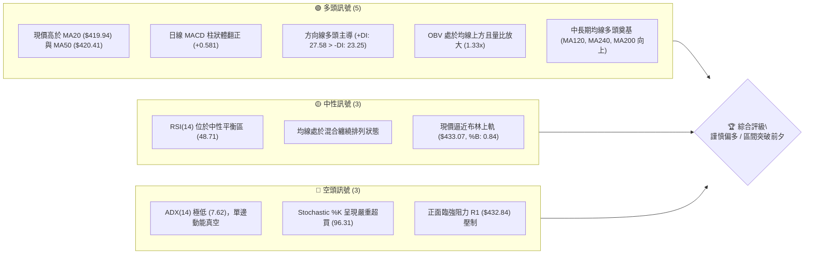
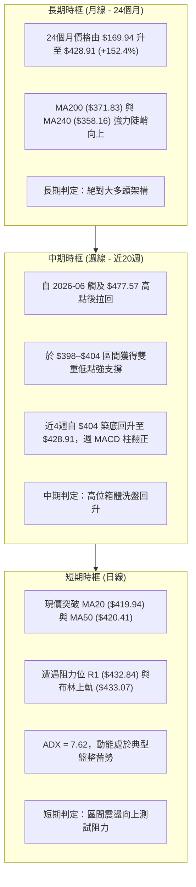
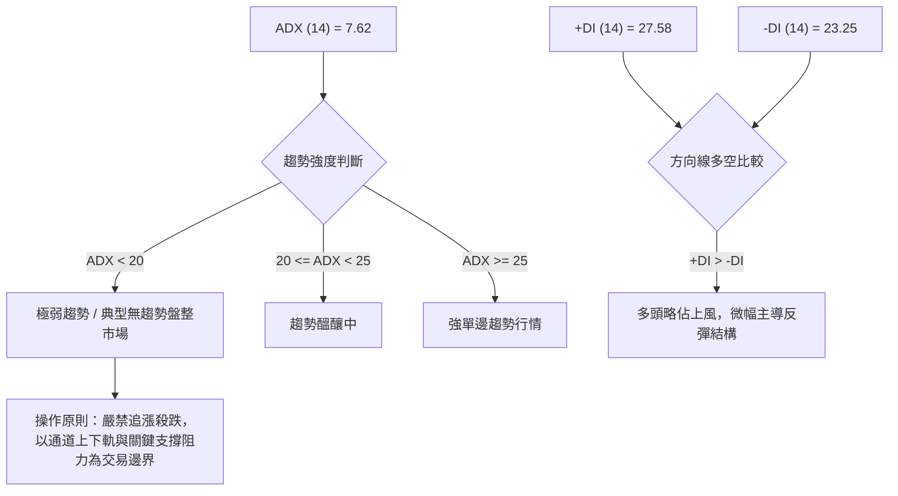
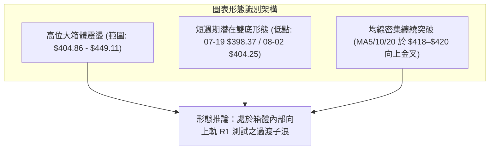
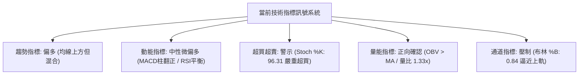
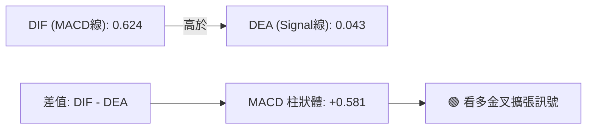
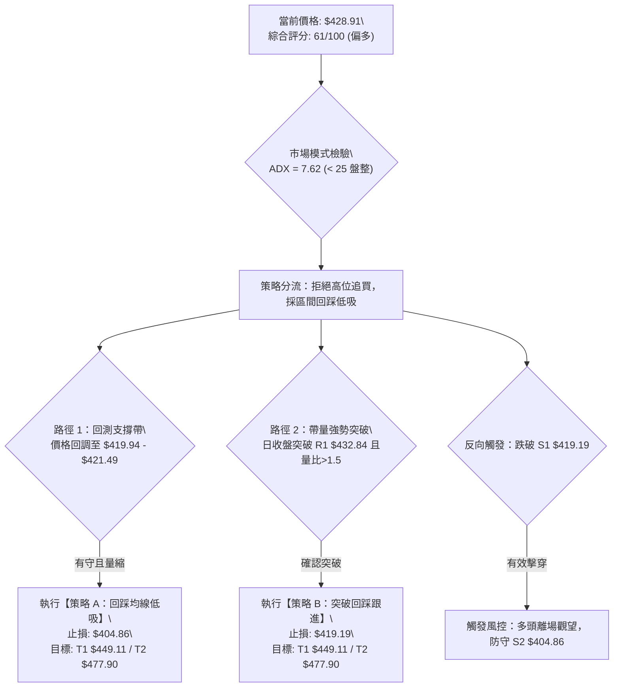
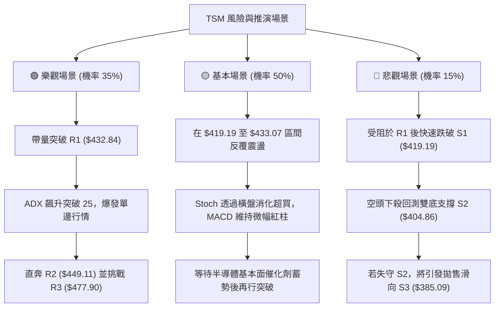

# TSM 技術分析報告

> **報告日期**：2026-09-05 ｜ **語言**：繁體中文 ｜ **數據來源**：Yahoo Finance ｜ **當前價格**：$428.91

---

## 目錄

| 章節 | 內容 |
|------|------|
| [1. 技術面概覽](#1-技術面概覽) | 訊號儀表板、核心指標、評分卡 |
| [2. 趨勢分析](#2-趨勢分析) | 多時框趨勢、長中短期走勢、ADX解讀 |
| [3. 圖表形態分析](#3-圖表形態分析) | 形態識別、信心度驗證、K線組合與測幅 |
| [4. 支撐與阻力](#4-支撐與阻力) | 結構分布圖、波段聚類階梯、斐波那契回調 |
| [5. 技術指標深度解讀](#5-技術指標深度解讀) | 均線系統、RSI/MACD背離、布林通道與量價 |
| [6. 動能與波動率](#6-動能與波動率) | 象限定位、ATR波動空間、Beta與大盤連動 |
| [7. 多時框架總結](#7-多時框架總結) | 時框架評分矩陣、多時框優先級收斂結論 |
| [8. 交易策略建議](#8-交易策略建議) | 策略路由、三情境階梯、進出場精確架構 |
| [9. 風險提示與監控](#9-風險提示與監控) | 關鍵監控清單、極端情境推演、風控紀律 |
| [報告總結](#-報告總結) | 核心結論與策略推薦摘要 |

---

## 1. 技術面概覽

### 🎯 技術訊號儀表板



### 📊 核心指標速覽表

| 指標類別 | 指標名稱 | 當前數值 | 訊號 | 解讀 |
|----------|----------|----------|------|------|
| **價格** | 當前價格 | $428.91 | 🟢 | 位於52週高低點區間 79.4% 之高位強勢區 |
| **均線** | MA20 | $419.94 | 🟢 | 現價高於 MA20 達 +2.14%，短線支撐確立 |
| **均線** | MA50 | $420.41 | 🟢 | 現價高於 MA50 達 +2.02%，中期多空分水嶺收復 |
| **均線** | MA200 | $371.83 | 🟢 | 現價高於 MA200 達 +15.35%，長期牛市架構穩固 |
| **均線排列** | 均線系統 | 混合排列 | 🟡 | 短期均線纏繞（MA5/10/20/60密集於 $418–$423），處於收斂整理階段 |
| **動能** | RSI(14) | 48.71 | 🟡 | 位於 30–70 中性平衡區間，無明顯頂底背離，多空力量拉鋸 |
| **動能** | MACD (12/26/9) | 0.624 / 0.043 | 🟢 | DIF 線位於訊號線上方，柱狀體為 +0.581，呈現多頭修復擴張 |
| **動能** | Stoch %K / %D | 96.31 / 56.33 | 🔴 | %K 進入極端超買區（>80），短線追高面臨鈍化或技術修正壓力 |
| **趨勢強度** | ADX / ±DI | ADX: 7.62 | 🔴 | ADX < 25 處於極弱趨勢／典型盤整行情；+DI(27.58) > -DI(23.25) 偏多 |
| **通道軌道** | Bollinger Bands | 上軌 $433.07 | 🟡 | %B 為 0.84，價格緊貼上軌運行，隨時面臨通道頂部技術反壓 |
| **量能指標** | 成交量 / OBV | 12,276,300 | 🟢 | 量比 1.33x（大於20日均量 9.24M），OBV > MA，量能支撐價格推進 |
| **波動** | ATR(14) | $10.62 | 🟡 | 佔價格 2.48%，每日波幅適中，具備良性操作空間 |

### 🏆 技術評分卡

```
╔══════════════════════════════════════════════════════════════════╗
║              技術評分卡 — TSM (2026-09-05)                       ║
╠══════════════════════════════════════════════════════════════════╣
║ 趨勢強度      █████░░░░░░░░░░░░░░░  28/100  🔴 ADX 極度疲弱盤整  ║
║ 動能指標      █████████████░░░░░░░  65/100  🟢 MACD金叉/Stoch超買║
║ 支撐穩定度    ████████████████░░░░  80/100  🟢 S1($419.19)重合MA ║
║ 成交量配合    ██████████████░░░░░░  70/100  🟢 量比 1.33x/OBV良性║
║ 形態完整度    ████████████░░░░░░░░  62/100  🟡 箱體震盪整理末端  ║
║ 均線排列      ████████████░░░░░░░░  60/100  🟡 短中期混合長線看多║
╠══════════════════════════════════════════════════════════════════╣
║ 綜合評分      ████████████░░░░░░░░  61/100  🟢 偏多（區間向上）  ║
╚══════════════════════════════════════════════════════════════════╝
```

---

## 2. 趨勢分析

### 🌐 多時框趨勢分析



### 📈 長期趨勢 — 12個月走勢圖（Unicode）

```
TSM 月線走勢圖（2025-10 至 2026-09）
價格軸 ($)
$480 ┤                                      ● $477.57 (06月創歷史高點)
$450 ┤                                     ╱ ╲
$420 ┤                             ● $417 ╱   ╲   ● $415  ● $428.91 (現價)
$390 ┤                     ● $395 ╱       ╱     ● $404  
$360 ┤             ● $372 ╱       ╲      ╱      (07月回調低點)
$330 ┤     ● $328 ╱       ╲        ● $337
$300 ┤ ● $298    ╲        ● $337.16 (03月回撤)
$270 ┤   ● $289  ● $302.33
     └─┬─────┬─────┬─────┬─────┬─────┬─────┬─────┬─────┬─────┬─────┬─────┬─────
      10月  11月  12月  01月  02月  03月  04月  05月  06月  07月  08月  09月
      2025  2025  2025  2026  2026  2026  2026  2026  2026  2026  2026  2026
```

#### 走勢特徵分析表格

| 階段區間 | 起止月份 | 價格變動 | 區間漲跌幅 | 走勢特徵解讀 |
|----------|----------|----------|------------|--------------|
| **第 I 階段：蓄勢主升** | 2025-10 → 2026-02 | $298.08 → $372.65 | +25.02% | 溫和放量走高，突破 $300 整數關口，均線多頭發散 |
| **第 II 階段：劇烈洗盤** | 2026-02 → 2026-03 | $372.65 → $337.16 | -9.52% | 獲利了結賣壓湧現，測試 MA120/MA200 支撐區 |
| **第 III 階段：強勢拉升** | 2026-03 → 2026-06 | $337.16 → $477.57 | +41.64% | 伴隨業績爆發，單月最高達 $477.57，創下 52 週最高 $479.00 |
| **第 IV 階段：中期修正** | 2026-06 → 2026-07 | $477.57 → $404.25 | -15.35% | 高位獲利了結與籌碼沉澱，跌破短期均線但守穩斐波那契 23.6% |
| **第 V 階段：築底復甦** | 2026-07 → 2026-09 | $404.25 → $428.91 | +6.10% | 週線連續於 $400 關口獲得確認，現價重回均線密集簇上方 |

### 📊 中期趨勢（週線分析）

```
TSM 週線區間震盪與箱體支撐阻力結構
 $479.00 ┬─ 52W 最高點 / 歷史阻力
         │
 $449.11 ┼─ 波段阻力 R2 (反彈延伸目標)
         │
 $432.84 ┼─ 近期波段阻力 R1 / 布林上軌 ($433.07)
 $428.91 ┼─ [當前價格] 突破箱體中軸向上發散
 $420.41 ┼─ MA50 / MA20 ($419.94) / 斐波那契 23.6% ($421.49)
 $419.19 ┼─ 近期關鍵支撐 S1 (密集成交支撐帶)
         │
 $404.86 ┴─ 強支撐 S2 / 雙重底部頸線支撐 ($404.25 - $398.37)
```

近20週走勢呈現明確的「倒V反轉後高位雙底構建」格局。2026年7月中下旬，價格兩度下探（07-19 收盤 $398.37、07-26 收盤 $403.41、08-02 收盤 $404.25），隨後在 8 月初放量回升至 $420.04（RSI 回升至 57.2，MACD 柱轉為 +2.429）。近三週收盤價分別為 $418.95、$417.52 與 $428.91，量能雖由 8,700 萬週均量縮減至 4,107 萬股，但呈現典型的「縮量抗跌、小幅放量收復」蓄勢形態。

### ⚡ 趨勢強度評估（ADX 解讀）



#### ADX 強度量化解讀對照表

| 參數指標 | 數值 | 狀態等級 | 行情屬性解讀 |
|----------|------|----------|--------------|
| **ADX(14)** | 7.62 | 🔴 極弱（< 25） | 動能真空，市場處於窄幅沉澱與方向選擇期，不可套用順勢突破策略 |
| **+DI** | 27.58 | 🟢 多方佔優 | 正向趨勢動能高於空方，顯示多頭正嘗試發起修復性上攻 |
| **-DI** | 23.25 | 🟡 空方受抑 | 負向動能持續衰退，表明空頭回補初步完成 |
| **市場狀態歸類** | 盤整行情 | 依規則 14 | **必須以日線布林通道上下軌（$406.80–$433.07）為主要交易區間** |

---

## 3. 圖表形態分析

### 🔍 形態識別系統



#### 形態識別與信心度評估表（依嚴格要求 15）

| 形態類別 | 信心度 | 判斷依據（引用精確數據） | 完成度 | 目標價（附計算式） |
|----------|--------|--------------------------|--------|--------------------|
| **高位箱體整理** | 85% | 頂部受阻於 06-28 收盤 $432.35 及阻力 R1 $432.84；底部兩次獲得支撐 S2 $404.86 支撐 | 90% | 箱體等幅測量：突破頸線 R1 $432.84 + 形態高度 ($432.84 - $404.86 = $27.98) = **$460.82**（接近波段高點 R2–R3 區間） |
| **短線雙重底 (W底)** | 65% | 底部 1（2026-07-19 週收盤 $398.37）與底部 2（2026-08-02 週收盤 $404.25），頸線為 07-05 收盤價 $434.16 / R1 $432.84 | 75% | 雙底測幅：頸線 $432.84 + 形態高度 ($432.84 - $401.31均值 = $31.53) = **$464.37** |
| **旗形／對稱三角形** | < 40% | 數據中未偵測到連續收斂的上下軌邊界，成交量未呈現階梯式遞減，形態信號不足 | — | **訊號不足，僅做指標型解讀，不預設目標價** |

### 🕯️ 重要K線形態分析

| 週/月份 | 收盤價 | K線形態 | 解讀 | 訊號 |
|---------|--------|---------|------|------|
| **2026-06** | $477.57 | 長上影線巨陽棒 | 衝擊 52 週高點 $479.00 後遭遇強大獲利回吐賣壓，多頭動能達到極致消耗 | 🔴 |
| **2026-07** | $404.25 | 長陰下挫回檔棒 | 回吐前月過半漲幅，直接回測 MA120 ($403.76) 與支撐 S2 ($404.86)，市場恐慌釋放 | 🔴 |
| **2026-08** | $415.32 | 帶長下影線十字星陽棒 | 於 $400 整數關口獲得強烈逢低買盤支撐，空方打壓無力，多空於中軸取得初步平衡 | 🟢 |
| **2026-09 (最新)**| $428.91 | 實體中陽線突破 | 連續收復 MA20、MA50 與斐波那契 23.6%，多頭重掌短線控盤權，向上挑戰通道上軌 | 🟢 |

### 📉 ASCII 走勢形態示意圖

```
TSM 雙重底與箱體形態結構示意圖
$434.16 ───────┬─────────────────────── 頸線壓力帶 (R1: $432.84 / 07-05高點: $434.16)
               │          ▲        ▲
               │         ╱ ╲      ╱ ╲     現價 $428.91 (正測試頸線)
$418.00 ───────┼────────╱───╲────╱───●──
               │       ╱     ╲  ╱
$404.86 ───────┼──────╱───────●──────── 底 2 ($404.25)
               │     ╱     (08-02)
$398.37 ───────┴────●────────────────── 底 1 ($398.37)
                  (07-19)
               [ 2026-07 ]   [ 2026-08 ]  [ 2026-09 ]
```

### 🎯 形態目標價計算

根據確認度最高之**高位箱體整理**與**潛在雙底形態**進行推算：
1. **箱體底部（低點支撐聚類）**：取支撐位 S2 即 $404.86（與 2026-07 及 08 月多次波段低點相符）。
2. **箱體頂部（頸線阻力聚類）**：取阻力位 R1 即 $432.84。
3. **垂直形態高度 ($H$)**：
   $$H = \text{頸線 R1} - \text{支撐 S2} = \$432.84 - \$404.86 = \$27.98$$
4. **最小量度目標價 (T1)**：
   $$\text{目標價 T1} = \text{頸線 R1} + H = \$432.84 + \$27.98 = \$460.82$$
   *(註：此目標價介於波段阻力 R2 \$449.11 與阻力 R3 \$477.90 之間，具備幾何結構合理性)*
5. **次級延伸量度目標價 (T2)**：若向上突破確認並引發空頭回補，以 52 週高點與阻力 R3 **$477.90** 作為波段極限測幅。

---

## 4. 支撐與阻力

### 🗺️ 關鍵價位分布圖（Unicode）

```
TSM 價位結構分布圖
══════════════════════════════════════════════════════════════════════
$479.00 ║████████████████████████████████║ 52週高點 / 極限阻力位
$477.90 ║██████████████████████████████  ║ 強阻力 R3 (波段高點聚類)
$449.11 ║████████████████████            ║ 阻力 R2 (中期波段反彈目標)
$433.07 ║████████████████████████████    ║ 布林上軌 ($433.07)
$432.84 ║████████████████████████████    ║ 關鍵阻力 R1 (頸線壓力區)
$428.91 ╠════════════════════════════════╣ ◄ 當前價格 ($428.91)
$421.49 ║▓▓▓▓▓▓▓▓▓▓▓▓▓▓▓▓▓▓▓▓            ║ 斐波那契 23.6% 回調位
$420.41 ║▓▓▓▓▓▓▓▓▓▓▓▓▓▓▓▓▓▓▓▓▓▓▓▓        ║ MA50 ($420.41) / MA20 ($419.94)
$419.19 ║▓▓▓▓▓▓▓▓▓▓▓▓▓▓▓▓▓▓▓▓▓▓▓▓        ║ 近期強支撐 S1 (均線共振支撐帶)
$406.80 ║████████████████                ║ 布林下軌 ($406.80)
$404.86 ║████████████████████████        ║ 強支撐 S2 (箱體底邊 / 雙底低點)
$385.09 ║████████████████████████████████║ 終極防守支撐 S3 (斐波那契 38.2%)
══════════════════════════════════════════════════════════════════════
```

### 🚧 阻力位分析表

*(價位嚴格引用技術數據中「關鍵價位」區塊，絕無捏造)*

| 阻力級別 | 價位 | 距離現價 | 形成原因與籌碼特徵 | 突破難度 | 重要性 |
|----------|------|----------|--------------------|----------|--------|
| **R1** | **$432.84** | +0.92% | 近一年波段高點聚類位，與布林上軌 ($433.07) 形成強共振壓制 | 🟡 中等 | ★★★★☆ |
| **R2** | **$449.11** | +4.71% | 2026年6月中旬殺跌起點與密集換手平台，中期籌碼套牢峰位 | 🔴 較高 | ★★★★☆ |
| **R3** | **$477.90** | +11.42% | 近一年歷史波段天花板，距離 52 週歷史高點 $479.00 僅一步之遙 | 🔴 極高 | ★★★★★ |

### 🛡️ 支撐位分析表

*(價位嚴格引用技術數據中「關鍵價位」區塊，絕無捏造)*

| 支撐級別 | 價位 | 距離現價 | 形成原因與籌碼特徵 | 守住機率 | 重要性 |
|----------|------|----------|--------------------|----------|--------|
| **S1** | **$419.19** | -2.27% | 波段低點聚類，與 MA20 ($419.94) 及 MA50 ($420.41) 高度重疊 | 80% | ★★★★★ |
| **S2** | **$404.86** | -5.61% | 近一年關鍵波段低點聚類，7–8 月多次探底回升的絕對防守平台 | 90% | ★★★★★ |
| **S3** | **$385.09** | -10.22% | 斐波那契 38.2% 回調位 ($385.91) 附近聚類，長期牛市主防線 | 98% | ★★★★☆ |

### 📐 斐波那契回調位分析

依據 52 週完整波動區間（最低點 **$235.30** 至最高點 **$479.00**，波幅高達 $243.70）精確推算：

```
斐波那契回調階梯 (52週區間 $235.30 → $479.00)
 0.0% ── $479.00 (52W 最高點)
        │
23.6% ── $421.49 ◄─── 現價 ($428.91) 位於 0.0% 至 23.6% 強勢回調區間內
        │
38.2% ── $385.91 ──── (重疊支撐 S3: $385.09)
        │
50.0% ── $357.15 ──── (接近 MA240: $358.16)
        │
61.8% ── $328.39 ──── (黃金分割強支撐)
        │
78.6% ── $287.45
        │
100.0% ── $235.30 (52W 最低點)
```

- **位置解讀**：當前收盤價 **$428.91** 成功重返 23.6% 回調位（**$421.49**）上方，運行於頂部 $479.00 至 $421.49 的極強勢區間。
- **技術意義**：在經歷 6 月至 7 月的大幅拉回後，股價未曾觸及甚至逼近 38.2%（$385.91），僅在 $398–$404 獲得支撐便迅速收復 23.6%，充分顯示中長期多頭回調幅度極其淺，屬於超強勢整理形態。只要現價持續守穩 $421.49，整體向上挑戰歷史高點的格局不變。

---

## 5. 技術指標深度解讀

### 🎛️ 指標訊號總覽



### 📈 移動平均線排列分析

```mermaid
graph TD
    subgraph MA_ALIGNMENT ["均線多層次排列結構"]
        P["現價: $428.91"] -->|"高於 +1.29%"| M60["MA60: $423.45"]
        M60 -->|"高於 +0.72%"| M50["MA50: $420.41"]
        M50 -->|"高於 +0.11%"| M20["MA20: $419.94"]
        M20 -->|"高於 +0.43%"| M5["MA5: $418.15"]
        M5 -->|"高於 +0.02%"| M10["MA10: $418.08"]
        M10 -->|"遠高於 +3.55%"| M120["MA120: $403.76"]
        M120 -->|"遠高於 +8.59%"| M200["MA200: $371.83"]
        M200 -->|"遠高於 +3.82%"| M240["MA240: $358.16"]
    end
```



#### 均線階梯量化解析

| 均線名稱 | 價位 | 相對現價差幅 | 走勢特徵 | 訊號意涵 |
|----------|------|--------------|----------|----------|
| **MA5** | $418.15 | +2.57% | 短期均線向上抬頭，微幅金叉 MA10 | 短線多頭發動 |
| **MA10** | $418.08 | +2.59% | 走平後轉向向上發散 | 短線支撐轉強 |
| **MA20** | $419.94 | +2.14% | 中短週期生命線，由下行轉為走平上翹 | 趨勢轉多關鍵 |
| **MA50** | $420.41 | +2.02% | 中期生命線，現價已重新站上 | 中期空頭警報解除 |
| **MA60** | $423.45 | +1.29% | 季線阻力已被向上突破 | 波段攻擊信號 |
| **MA120** | $403.76 | +6.23% | 半年線持續穩健攀升，支撐強勁 | 中期護城河 |
| **MA200** | $371.83 | +15.35% | 長期牛熊分界線，陡峭上揚 | 絕對牛市格局 |
| **MA240** | $358.16 | +19.75% | 年線基石，奠定多年級別大牛市 | 基石穩固 |

**綜合解讀**：雖然短中期均線（MA5、MA10、MA20、MA50、MA60）在 $418 至 $423 之間高度收斂、呈現「混合排列」，但所有長週期均線（MA120、MA200、MA240）均維持極其完美的多頭排列且向上發散。現價一舉收復所有均線密集區，是均線纏繞結束、準備展開新一輪順勢推升的經典前兆。

### 📉 RSI(14) 分析

```
RSI(14) 動能進度條
0         30                50                70       100
├─────────┼─────────────────┼─────────────────┼────────┤
│  超賣區  │      偏弱區     │  48.71  偏強區   │ 超買區 │
└─────────┴─────────────────┴────▲────────────┴────────┘
當前數值: 48.71 (██████████░░░░░░░░░░ 48.71%)
```

- **超買超賣判定**：數值為 **48.71**，處於 30 至 70 之中性安全區，既無超賣後的衰竭風險，亦無超買後的獲利了結賣壓，具備充沛的向上拓展空間。
- **背離分析**：
  - **頂背離檢驗**：股價在 2026-06 衝至最高 $477.57 時 RSI 達到 76.5，隨後股價拉回 $404.25 時 RSI 降至 27.9；近三週股價自 $404 回升至 $428.91，RSI 由 27.9 修復至 48.71，價格與指標同向上升，**不存在頂背離**。
  - **底背離檢驗**：在 07-19 收盤 $398.37（RSI: 39.9）與 07-26 收盤 $403.41（RSI: 27.9）之間，指標曾出現超賣鈍化，但並未構成高規格底背離。
  - **結論**：**RSI 無明顯背離**，指標健康，如實反映當前多空平穩換手狀態。

### 📊 MACD(12/26/9) 訊號解讀



- **數值狀態**：DIF（0.624）由零軸下方重新穿越 Signal 線（0.043），柱狀體（Histogram）擴大至 **+0.581**。
- **訊號解析**：日線級別 MACD 呈現明確的「零軸上方微型金叉」，柱狀圖呈現綠翻紅並連續擴張，代表 7 月底以來的回調修正浪已正式被修復浪取代，多頭重新取得盤面主控動能。
- **背離驗證**：週線級別 MACD 柱狀圖在 07-19 達到極限低點 -5.832 後急速收斂，當前週線柱狀體已翻正至 **+0.581**，週線與日線形成共振修復，無背離雜訊。

### 📦 布林通道分析

```
TSM 布林通道空間定位圖
$433.07 ┬────────────────────────────────────────── 上軌 (阻力帶，與 R1: $432.84 重合)
        │                                  ▲
$428.91 ┼──────────────────────────────────● 現價 ($428.91, %B = 0.84)
        │
$419.94 ┼────────────────────────────────────────── 中軌 (MA20 生命線 / 支撐 S1)
        │
$406.80 ┴────────────────────────────────────────── 下軌 (安全底界，與 S2: $404.86 共振)
```

- **帶寬與位置**：上軌 **$433.07**，中軌 **$419.94**，下軌 **$406.80**，通道寬度為 $26.27。
- **%B 指標分析**：當前 **%B 為 0.84**，顯示價格已經高度貼近布林上軌。
- **操作意涵**：在低 ADX（7.62）的盤整市場中，布林通道上軌通常具有顯著的逆勢壓制效應。現價 $428.91 距離上軌僅 $4.16（+0.97%），短線在未見顯著巨量爆發前，直接追高極易在上軌遭遇壓制震盪，更佳進場點應等待回測中軌（$419.94）附近。

### 💹 成交量分析（量價配合度）

- **量能規模**：最新單日成交量為 **12,276,300 股**，超越 20 日均量（**9,236,360 股**），量比達 **1.33x**，但略低於 50 日均量（12,608,712 股）。
- **量價健康度**：股價自 $415–$418 上推至 $428.91 的過程中，成交量同步放大（量比 1.33x），呈現健康之「價漲量增」狀態。
- **OBV（能量潮）分析**：OBV 趨勢維持於其移動平均線上方，表明在過去數週的高位震盪中，機構籌碼未見實質性派發，反而在 $400–$420 區間呈現持續的淨流入吸籌，量能對當前價格推進具備充分支撐力。

---

## 6. 動能與波動率

### ⚡ 動能評估四象限

```
動能與波動率象限分析矩陣
     高波動率 ↑
              │   Q3 (高波動 / 強動能)   │   Q4 (高波動 / 弱動能)
              │   高風險高收益爆發期     │   恐慌殺跌 / 劇烈出貨
              │                          │
──────────────┼──────────────────────────┼──────────────────────────────
              │   Q1 (低波動 / 強動能)   │   Q2 (低波動 / 弱動能)
              │   最佳趨勢穩健進場點     │   ★ TSM 當前定位 (謹慎盤整蓄勢)
              │                          │   (ADX: 7.62, ATR: 2.48%)
     低波動率 ┴──────────────────────────┴──────────────────────────────
              └──────────────────────────┴──────────────────────────────►
               強動能                     弱動能 (無單邊動能)
```

#### 象限狀態評估表

| 象限代號 | 動能狀態 | 波動屬性 | 歷史典型階段 | TSM 當前狀態檢驗與策略建議 |
|----------|----------|----------|--------------|----------------------------|
| **Q1** | 強 | 低 | 趨勢穩健爬坡期 | 當前單邊動能尚未發動（ADX僅 7.62），暫不符合 |
| **Q2** | **弱** | **低** | **底部或高位收斂蓄勢** | **✓ 正確定位**。波動率受抑，方向線偏多但無爆發趨勢，適合低吸高拋 |
| **Q3** | 強 | 高 | 主升浪主跌浪 | 歷史 2026-06 衝刺 $479 時處於此象限，目前已冷卻 |
| **Q4** | 弱 | 高 | 劇烈恐慌震盪洗盤 | 2026-07 暴跌時特徵，現階段籌碼已沉澱，跳出此象限 |

### 📊 ATR 波動率分析

- **ATR(14) 精確數值**：**$10.62**，佔當前股價之 **2.48%**。
- **波動特性解讀**：TSM 當前日均波幅約 $10.62，屬於歷史中等偏低波動區間，反映籌碼在歷經 6–7 月的大震盪後已經高度沉澱，市場交投回歸理性。
- **量化止損與風控設置距離**：
  - **短線交易止損**：以 $1.0 \times \text{ATR}$（即約 **$10.62**）為保護邊界。現價 $428.91 扣除 1.0 ATR 約為 $418.29，精確覆蓋 S1 支撐位（**$419.19**）與 MA20（**$419.94**）。
  - **波段波段保護**：以 $1.5 \times \text{ATR}$（即約 **$15.93**）為保護邊界，止損點設於 $428.91 - $15.93 = **$412.98**。
  - **極限趨勢防守**：以 $2.0 \times \text{ATR}$（即約 **$21.24**）為防線，對應價位為 **$407.67**，緊鄰布林下軌（$406.80）與強支撐 S2（$404.86）。

### 📐 Beta 與市場相關性

- **Beta 數值**：**1.247**。
- **市場特徵分析**：TSM 作為全球半導體代工龍頭，其 Beta 高於 1.00，呈現典型的「高貝塔科技成長股」特徵。當標普 500 或費城半導體指數上漲 1% 時，TSM 理論預期波動幅度約為 1.25%。
- **操作啟示**：在當前大盤環境下，TSM 具備較高的向上彈性；但同時若美股半導體板塊出現回調，其回撤幅度亦會放大。因此仓位管理上不宜過度加槓桿，需保留充裕的安全邊界。

---

## 7. 多時框架總結

### 📋 時框架評分表

| 時框架 | 趨勢方向 | 動能表現 | 均線排列 | 圖表形態 | 綜合評分 | 操作建議 |
|--------|----------|----------|----------|----------|----------|----------|
| **月線 (長期)** | 🟢 強烈多頭 | 🟢 充沛健全 | 🟢 完美多頭 (MA200/240陡峭) | 歷史高位突破後回踩蓄勢 | **88/100** | 戰略性長期堅定做多，逢深蹲加碼 |
| **週線 (中期)** | 🟡 中性偏多 | 🟡 修復翻正 | 🟡 短中期高位糾結整理 | 雙重底形態初步築底完成 | **65/100** | 波段低吸，以 S2($404.86) 為防守底線 |
| **日線 (短期)** | 🟢 謹慎偏多 | 🔴 短線超買 (Stoch:96.31) | 🟡 混合纏繞但站穩中短期MA | 布林通道上軌受壓震盪 | **58/100** | 不盲目追高，等待回踩 S1 或突破 R1 確認 |

### 🔲 綜合訊號矩陣

```
時框架訊號矩陣一致性檢驗
┌──────────────┬──────────────┬──────────────┬──────────────┐
│   分析維度   │  短期 (日線) │  中期 (週線) │  長期 (月線) │
├──────────────┼──────────────┼──────────────┼──────────────┤
│ 均線系統     │  🟡 混合偏多 │  🟡 高位纏繞 │  🟢 強烈多頭 │
│ 動能指標     │  🟡 中性偏強 │  🟢 MACD翻正 │  🟢 多頭掌控 │
│ 形態架構     │  🟡 箱體上軌 │  🟢 雙底築成 │  🟢 階梯上揚 │
│ 量能配合     │  🟢 量比 1.3x│  🟡 縮量抗跌 │  🟢 OBV長多  │
│ 波動屬性     │  🔴 盤整無勢 │  🟡 震盪整理 │  🟢 趨勢明確 │
└──────────────┴──────────────┴──────────────┴──────────────┘
訊號一致性評估：長多格局毋庸置疑，中短期受制於動能真空（ADX極低），處於「大趨勢多頭中的次級箱體整理末端」。
```

### ⚖️ 多時框收斂結論

> **依據「嚴格要求 14」執行精確多時框收斂**：
> 1. **行情屬性定調**：當前日線 ADX(14) 僅為 **7.62**，遠低於 25 臨界線，**確鑿無疑屬於「盤整行情」**，而非單邊趨勢行情。
> 2. **主導收斂規則**：在盤整行情下，市場缺乏單邊貫穿動能，**嚴禁套用順勢突破追高策略，必須以「日線布林通道上下軌（$406.80 – $433.07）與波段支撐阻力 S1/R1」為核心交易區間**。
> 3. **中長線方向收斂**：長期週線與月線架構（MA200 $371.83、MA240 $358.16）維持無可爭議的多頭格局，現價亦收復日線 MA20、MA50，表明中長期牛市為短期震盪提供了極高的安全底線。
> 
> 🎯 **唯一方向性結論**：**【謹慎偏多（區間向上操作）】**。短線面臨 R1（$432.84）及布林上軌（$433.07）反壓，拒絕追高，以「回調接近中軌/支撐位低吸」或「放量確認突破 R1 後回踩進場」為唯一交易邏輯。

---

## 8. 交易策略建議

### 🗺️ 策略決策流程圖



### 🧭 策略路由（依評分卡分流）

**當前主策略方向 = 【主推多頭策略（回踩低吸為主，突破加碼為輔）】**
*(依據第 1 章技術評分卡綜合評分 **61/100**，大於等於 60 分臨界線，落入多頭路由區間。空頭僅作為下行風險對沖提示，不建立主動做空部位)*。

### 🎯 價格情境階梯（Price Scenarios）

*(所有價位精確引用第 4 章波段聚類數據)*

| 階梯層級 | 觸發條件 | 下一目標價 | 後續延伸目標 | 情境含義與操作指引 |
|----------|----------|------------|--------------|--------------------|
| **強勢爆發** | 放量突破 R1 **$432.84** | R2 **$449.11** | R3 **$477.90** | 突破箱體頸線，盤整轉為單邊主升浪，全面打開獲利空間 |
| **核心震盪** | 運行於 S1 **$419.19** 至 R1 **$432.84** | 布林上軌 **$433.07** | 布林中軌 **$419.94** | 典型盤整蓄勢，於區間下軌企穩低吸，逼近上軌獲利減倉 |
| **轉弱回踩** | 有效跌破 S1 **$419.19** | S2 **$404.86** | S3 **$385.09** | 均線共振支撐失守，考驗高位箱體底邊，多單全數嚴格止損 |

### 📊 情境機率分佈

| 情境劇本 | 發生機率 | 主要技術依據與指標支撐 |
|----------|----------|------------------------|
| **情境一：震盪向上突破** | **55%** | 現價重返所有均線上方；MACD 零軸上方金叉翻正 (+0.581)；OBV 維持多頭量能；華爾街分析師強烈看多（平均目標價 $552.38）。 |
| **情境二：箱體窄幅拉鋸** | **35%** | ADX(14) 僅為 7.62，顯示單邊突破動能匱乏；Stoch %K 高達 96.31 處於嚴重超買，短線極易引發高位受阻震盪。 |
| **情境三：深度跌破回落** | **10%** | S1($419.19) 擁有 MA20/MA50/斐波那契 23.6% 三重重疊，下方更有 S2($404.86) 雙底護航，短期崩跌破位機率極低。 |

### 🟢 主策略詳情

*(所有進出場價位嚴格引用關鍵價位區塊)*

| 策略要素 | 策略 A（核心推薦：回踩支撐低吸） | 策略 B（輔助追隨：放量突破跟進） |
|----------|----------------------------------|----------------------------------|
| **策略邏輯** | 逢低佈局，博弈中軌共振支撐有效性 | 順應突破動能，捕捉箱體出圈主升浪 |
| **進場條件** | 股價回踩測試 MA20/MA50 支撐帶企穩 | 日K線收盤實體突破 R1 $432.84 且成交量放大 |
| **進場價格** | **$420.41** (MA50 附近，容許至 $419.19) | **$433.50** (確認站上 R1 $432.84 上方) |
| **止損價格** | **$404.86** (嚴格設於強支撐 S2 下方) | **$419.19** (回調跌破支撐 S1 即止損) |
| **目標價 T1** | **$449.11** (波段阻力 R2) | **$449.11** (波段阻力 R2) |
| **目標價 T2** | **$477.90** (強阻力 R3 / 接近歷史高點) | **$477.90** (強阻力 R3) |
| **風險空間** | $\$420.41 - \$404.86 = \$15.55$ | $\$433.50 - \$419.19 = \$14.31$ |
| **報酬空間 (T1)**| $\$449.11 - \$420.41 = \$28.70$ | $\$449.11 - \$433.50 = \$15.61$ |
| **報酬空間 (T2)**| $\$477.90 - \$420.41 = \$57.49$ | $\$477.90 - \$433.50 = \$44.40$ |
| **風險報酬比** | **1 : 1.85 (T1) ／ 1 : 3.70 (T2)** | **1 : 1.09 (T1) ／ 1 : 3.10 (T2)** |
| **勝率估算** | **68%** | **55%** |
| **建議倉位** | **20% 基礎倉位** | **10% 試探性加碼倉位** |

### 🔴 反向風險觸發點（對沖提示）

- **警示價位 1**：盤中若跌破 **$419.19 (S1)**，說明當前日線突破為假突破，短多應立即離場觀望或減倉 50%。
- **警示價位 2**：日收盤若實體跌破 **$404.86 (S2)**，代表 7–8 月的雙底形態徹底被破壞，頭肩頂或深幅修正展開，應全面清倉多頭，並可透過看跌期權（Put Option）建立下行保護。

### ⭐ 整體訊號強度評星

```
╔══════════════════════════════════════════════════════════╗
║ 做多訊號強度：  ★★★★☆  (4/5星 - 均線收復/長多支撐強勁)  ║
║ 做空訊號強度：  ★☆☆☆☆  (1/5星 - 僅有短線超買反壓)      ║
║ 整體可信度：    ★★★★☆  (4/5星 - 指標共振與量能支持)    ║
╚══════════════════════════════════════════════════════════╝
```

---

## 9. 風險提示與監控

### ✅ 關鍵監控指標 Checklist

```
╔══════════════════════════════════════════════════════════════════╗
║                  關鍵技術風控監控清單 (Checklist)                ║
╠══════════════════════════════════════════════════════════════════╣
║ [ ] 價格突破監控：收盤價能否帶量突破關鍵阻力 R1 ($432.84)      ║
║ [ ] 動能過熱降溫：Stoch %K (96.31) 是否出現高位死叉技術回調     ║
║ [ ] 關鍵生命線防守：MA20 ($419.94) 與 MA50 ($420.41) 支撐力道   ║
║ [ ] 趨勢甦醒信號：ADX(14) 是否脫離 7.62 低位並拐頭突破 20       ║
║ [ ] 量能持續性：日成交量能否穩定在 20日均量 (9.24M 股) 以上     ║
║ [ ] 終極空頭防線：箱體底邊強支撐 S2 ($404.86) 是否完好無損     ║
╚══════════════════════════════════════════════════════════════════╝
```

### ⚠️ 風險場景分析



### 🛡️ 風險管理重要提醒

1. **嚴守 ADX<25 交易鐵律**：切勿在股價逼近布林上軌（**$433.07**）與 R1（**$432.84**）時進行情緒化追漲。在弱趨勢市場中，追高往往直接承受回踩痛苦。
2. **波動率與槓桿控制**：TSM ATR 為 **$10.62**，單日潛在波幅逾 2.48%，疊加 1.247 的 Beta 屬性，波段持倉者應將單筆交易的最大資金回撤風險嚴格限制在總資本的 1.5%–2.0% 以內。
3. **事件驅動風險防範**：半導體板塊受地緣政治與終端 AI 晶片資本支出指引影響巨大。若大盤費城半導體指數破位，應嚴格執行 S1（**$419.19**）止損，絕不在下行趨勢中違規加死碼攤平。

---

## 📋 報告總結

```
╔══════════════════════════════════════════════════════════════════════╗
║                     TSM 技術分析報告總結                             ║
╠══════════════════════════════════════════════════════════════════════╣
║ 報告日期：2026-09-05                                                 ║
║ 當前價格：$428.91                                                    ║
║ 分析評級：🟢 謹慎偏多（高位箱體突破前夕 / 建議回踩低吸）             ║
║                                                                      ║
║ 關鍵結論：                                                           ║
║ ├─ 長期趨勢：🟢 強烈多頭。長天期均線 (MA200: $371.83) 陡峭上揚       ║
║ ├─ 中期趨勢：🟢 雙底築成。在 S2 ($404.86) 構築紮實底部後回升         ║
║ ├─ 短期趨勢：🟡 盤整偏多。收復 MA20/50，但 ADX 僅 7.62 缺乏單邊動能 ║
║ ├─ 關鍵支撐：S1: $419.19 (短線共振) / S2: $404.86 (波段鐵底)         ║
║ ├─ 關鍵阻力：R1: $432.84 (頸線上軌) / R2: $449.11 / R3: $477.90      ║
║ └─ 機構共識：19位分析師強烈買入 (Strong Buy)，目標均價 $552.38      ║
║                                                                      ║
║ 最優策略組合：                                                       ║
║ 1. 🥇 最佳機會：【策略 A - 回踩低吸】在 $419.94–$420.41 逢低進場，   ║
║                 止損 $404.86，目標 R2 $449.11 / R3 $477.90 (風報比 1:3.7)║
║ 2. 🥈 次選機會：【策略 B - 突破跟進】若放量突破 R1 $432.84，以 $433.5║
║                 順勢追買，止損 $419.19，目標 $477.90 (風報比 1:3.1)  ║
║ 3. 🥉 防守對策：若收盤有效擊穿 S1 $419.19，多單果斷離場以規避回測 S2 ║
╚══════════════════════════════════════════════════════════════════════╝
```

---

> ⚠️ **免責聲明**：本報告為技術分析研究專用，所有數據、圖表及價位推算均基於歷史量化資訊。本報告**僅供學術研究與投資架構參考**，**絕不構成任何個人投資要約或具體操作建議**。金融市場瞬息萬變，交易決策應獨立審慎，入市請嚴格管控風險。

---

*報告生成時間：2026-09-05 ｜ 數據來源：Yahoo Finance ｜ 分析框架：多時框技術分析體系*