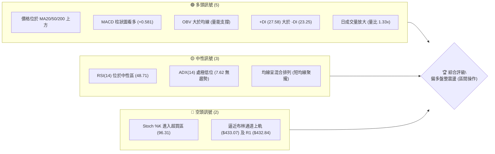
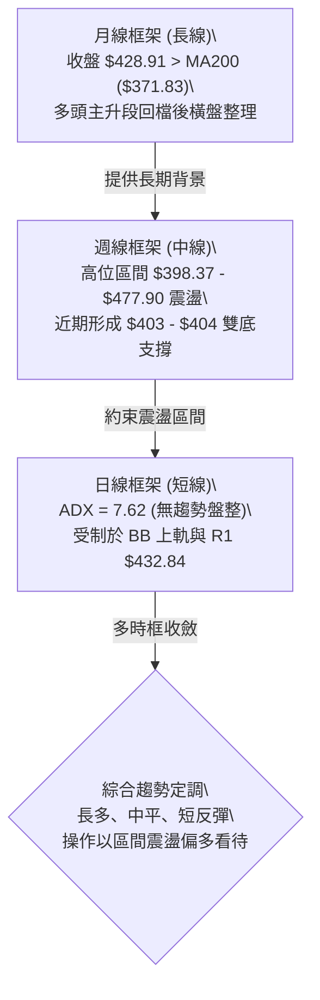
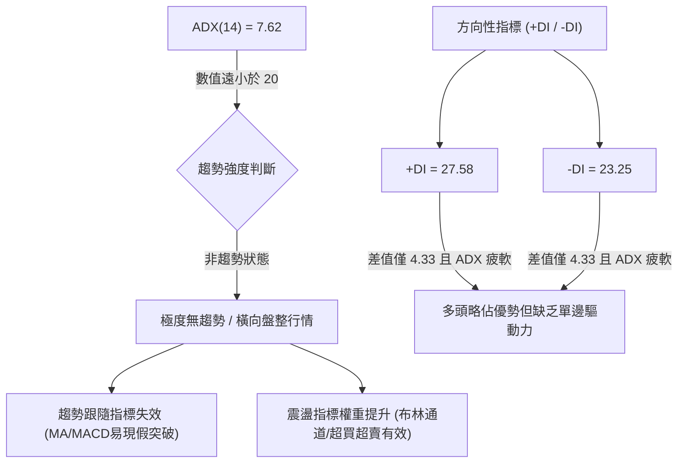
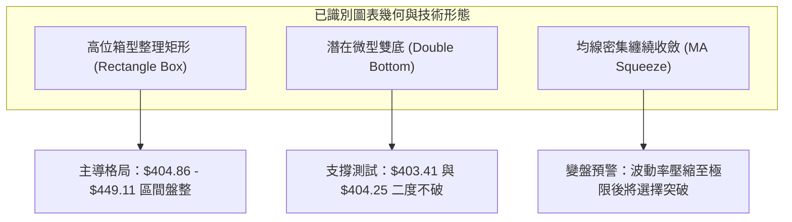
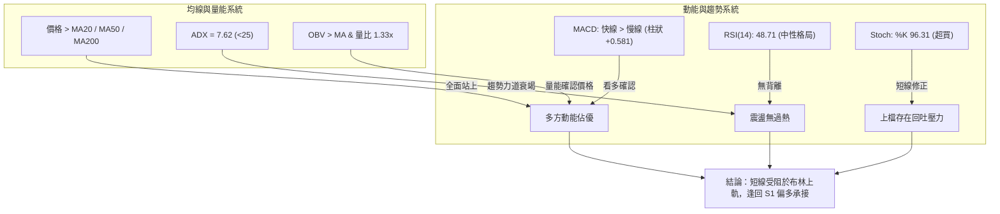
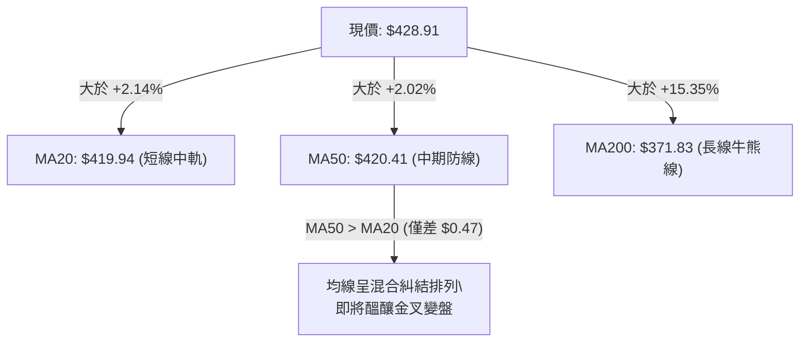
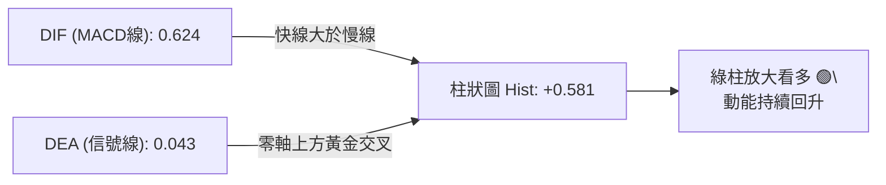
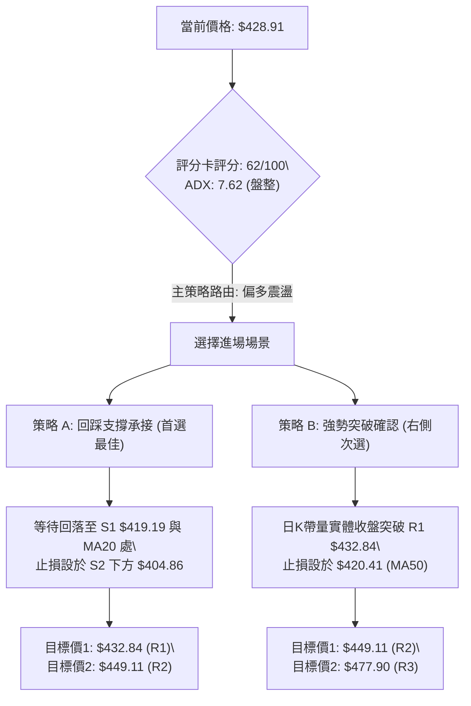
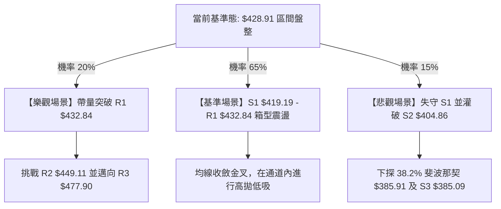

# TSM 技術分析報告

> **報告日期**：2026-09-06 ｜ **語言**：繁體中文 ｜ **數據來源**：Yahoo Finance ｜ **當前價格**：$428.91

---

## 目錄

| 章節 | 內容 |
|------|------|
| [1. 技術面概覽](#1-技術面概覽) | 訊號儀表板、核心指標、評分卡 |
| [2. 趨勢分析](#2-趨勢分析) | 多時框趨勢、長中短期走勢 |
| [3. 圖表形態分析](#3-圖表形態分析) | 形態識別、K線組合、目標價 |
| [4. 支撐與阻力](#4-支撐與阻力) | 關鍵價位、斐波那契回調 |
| [5. 技術指標深度解讀](#5-技術指標深度解讀) | MA/RSI/MACD/布林/成交量 |
| [6. 動能與波動率](#6-動能與波動率) | 動能評估、ATR、Beta |
| [7. 多時框架總結](#7-多時框架總結) | 時框架評分矩陣 |
| [8. 交易策略建議](#8-交易策略建議) | 多空策略、風險報酬比 |
| [9. 風險提示與監控](#9-風險提示與監控) | 監控指標、風險場景 |
| [📋 報告總結](#-報告總結) | 核心總結與架構決策清單 |

---

## 1. 技術面概覽

### 🎯 技術訊號儀表板



### 📊 核心指標速覽表

| 指標類別 | 指標名稱 | 當前數值 | 訊號 | 解讀 |
|----------|----------|----------|------|------|
| **價格** | 當前價格 | $428.91 | 🟢 | 位於52週區間 79.4% 高位，整體多頭架構未破 |
| **均線** | MA20 | $419.94 | 🟢 | 現價高於 MA20 +2.14%，短線支撐確立 |
| **均線** | MA50 | $420.41 | 🟢 | 現價高於 MA50 +2.02%，中期趨勢維持在成本線上 |
| **均線** | MA200 | $371.83 | 🟢 | 現價高於牛熊分界線 +15.35%，長期多頭趨勢不變 |
| **動能** | RSI(14) | 48.71 | 🟡 | 位於 30–70 中性平衡區，無明顯背離與極端過熱 |
| **動能** | MACD (12,26,9) | Hist: +0.581 | 🟢 | 快線 0.624 高於慢線 0.043，柱狀圖翻正看多 |
| **震盪** | Stoch %K / %D | 96.31 / 56.33 | 🔴 | %K 進入嚴重超買區，短期面臨技術性拉回修正壓力 |
| **趨勢** | ADX (14) | 7.62 | 🟡 | ADX < 25 處極低水平，確立當前處於無方向盤整期 |
| **通道** | 布林帶 (%B) | 0.84 | 🟡 | 上軌 $433.07 具即時壓制，現價處於中上軌間強勢區 |
| **成交量**| 量比 (Volume Ratio) | 1.33x | 🟢 | 最新量 12.28M 高於20日均量 9.24M，突破有量 |
| **波動** | ATR(14) | $10.62 | 🟡 | 佔股價 2.48%，波動度中等溫和，適合設區間防守 |

### 🏆 技術評分卡

```
╔══════════════════════════════════════════════════════════════╗
║              技術評分卡 — TSM (2026-09-06)                  ║
╠══════════════════════════════════════════════════════════════╣
║ 趨勢強度 (Trend)      ██████░░░░░░░░░░░░░░  32/100  🔴 盤整弱勢  ║
║ 動能指標 (Momentum)   ████████████░░░░░░░░  62/100  🟢 MACD翻多  ║
║ 支撐穩定度 (Support)  ████████████████░░░░  80/100  🟢 密集支撐  ║
║ 成交量配合 (Volume)   ██████████████░░░░░░  70/100  🟢 量價微增  ║
║ 形態完整度 (Pattern)  ████████████░░░░░░░░  60/100  🟡 矩形整理  ║
║ 均線排列 (Moving Avg) ██████████████░░░░░░  68/100  🟢 價格全站上║
╠══════════════════════════════════════════════════════════════╣
║ 綜合評分 (Composite)  ████████████░░░░░░░░  62/100  🟢 偏多震盪  ║
╚══════════════════════════════════════════════════════════════╝
```

---

## 2. 趨勢分析

### 🌐 多時框趨勢分析



### 📈 長期趨勢 — 12個月走勢圖（Unicode）

```
TSM 月線走勢圖（過去12個月：2025-10 至 2026-09）
價格軸 ($)
$480 ┤                                     ● $477.57 (06月高點)
$460 ┤                                    ╱ ╲
$440 ┤                                   ╱   ╲
$420 ┤                             ●    ╱     ● $415.32 ──● $428.91 (現價)
$400 ┤                       ●    ╱ ╲  ╱       ╲ $404.25
$380 ┤                      ╱ ╲  ╱   ╲╱
$360 ┤                ●    ╱   ╲╱ $337.16 (03月低點)
$340 ┤               ╱ ╲  ╱
$320 ┤         ●    ╱   ╲╱
$300 ┤   ●────●    ╱ $328.86 (01月)
$280 ┤  ╱ $289.23 ╱
$260 ┤ ● $277.11 (09月前底)
     └─┬─────┬─────┬─────┬─────┬─────┬─────┬─────┬─────┬─────┬─────┬─────
     10月   11月  12月  01月  02月  03月  04月  05月  06月  07月  08月  09月
     (2025)                                                 (2026)
```

**12個月走勢特徵分析表格**：

| 階段 | 時間跨度 | 起訖收盤價 | 區間漲跌幅 | 走勢特徵分析 |
|------|----------|------------|------------|--------------|
| **主升初期** | 2025-10 ~ 2026-01 | $298.08 → $328.86 | +10.33% | 突破 $300 大關，沿短期均線震盪向上，多頭排列完整 |
| **加速推升** | 2026-01 ~ 2026-02 | $328.86 → $372.65 | +13.32% | 加速趕頂形態，單月拉出長陽線，突破長期阻力區 |
| **急劇洗盤** | 2026-02 ~ 2026-03 | $372.65 → $337.16 | -9.52% | 獲利了結賣壓湧現，回踩確認前期平台支撐 |
| **主升趕頂** | 2026-03 ~ 2026-06 | $337.16 → $477.57 | +41.64% | 連續強勢上漲並創下歷史高點 52W High $479.00，多頭動能耗盡 |
| **高位落體** | 2026-06 ~ 2026-07 | $477.57 → $404.25 | -15.35% | 長黑灌破短期均線，獲利盤大幅撤離，打擊市場動能 |
| **箱型築底** | 2026-07 ~ 2026-09 | $404.25 → $428.91 | +6.10% | 於 $404 附近築起箱底，均線收斂，進入橫向修復階段 |

### 📊 中期趨勢（週線分析）

從近 20 週收盤走勢可見，2026-07-19 週成交量放大至 91,498,900，創下回調以來的單週天量，收盤於 $398.37，隨後數週在 2026-07-26 ($403.41)、2026-08-02 ($404.25) 連續獲得承接，確認此處具備強大逢低買盤支撐。

```
週線區間震盪示意圖：
$480 ┼─────────────────────── 歷史極值 52W High $479.00 / R3 $477.90
     │        ▲ 06-21: $462.12
$440 ┼───────┼─────────────── 中期箱頂 R2 $449.11
     │       ╱ ╲     ▲ 09-06: $428.91 (現價測試 R1 $432.84)
$420 ┼──────╱───╲───┼─────── 密集換手樞軸 $419.19 (S1)
     │     ╱     ╲ ╱
$400 ┼────╱───────▼───────── 中期箱底 S2 $404.86 (07-19 最低收盤 $398.37)
     └───────────────────────
```

### ⚡ 趨勢強度評估（ADX 解讀）



| ADX 數值區間 | 趨勢強度定義 | 當前 TSM 狀態 | 交易策略指示 |
|--------------|--------------|---------------|--------------|
| 0 – 20 | 無趨勢 / 極弱趨勢 | **當前處於此區間 (7.62)** | **禁止追價突破，採取布林通道區間高拋低吸** |
| 20 – 25 | 弱趨勢 / 孕育期 | 否 | 密切觀察帶量方向突破 |
| 25 – 40 | 明確強趨勢 | 否 | 順勢持有，回調加碼 |
| 40 – 60 | 極強趨勢 | 否 | 移動止盈，提防行情耗竭 |

---

## 3. 圖表形態分析

### 🔍 形態識別系統



**形態信心度與目標價評估表格**：

| 形態名稱 | 信心度 | 判斷依據（引用數據） | 完成度 | 目標價（附嚴謹計算式） |
|----------|--------|----------------------|--------|------------------------|
| **矩形箱型整理** | 78% | 箱底於 S2 $404.86（07-26 收盤 $403.41、08-02 收盤 $404.25），箱頂受制於 R2 $449.11 | 75% | 若突破箱頂 R2 $449.11：目標價 = 箱頂 $449.11 + 箱體高度 ($449.11 - $404.86 = $44.25) = **$493.36** |
| **微型雙底反彈** | 68% | 2026-07-26 低點 $403.41 與 2026-08-02 低點 $404.25 構成平底；頸線為 08-16 高點 $426.35 | 85% | 由形態推算：頸線 $426.35 + 形態深度 ($426.35 - $403.41 = $22.94) = **$449.29**（高度吻合阻力位 R2 $449.11） |
| **頭肩底形態** | 25% | 數據中左肩與右肩結構對稱性差，成交量未現典型頭肩分布 | 未成形 | **訊號不足，不予預估幾何目標價，僅做指標型解讀** |

### 🕯️ 重要K線形態分析

| 日期 / 週度 | 收盤價 | K線組合與形態 | 技術意涵解讀 | 訊號 |
|-------------|--------|---------------|--------------|------|
| **2026-06-21 週** | $462.12 | 長陽拉升遇阻 | 週成交量 58.88M，多頭推升至 52W 高點 $479.00 後收出長上影線，形成波段見頂信號 | 🔴 |
| **2026-07-19 週** | $398.37 | 放量長陰灌破 | 91.50M 週成交天量摜破 $400 整數關卡，形成恐慌拋售盤，主力進場低吸換手 | 🟡 |
| **2026-07-26 週** | $403.41 | 縮量十字星 | 成交量急劇萎縮至 62.70M，空頭摜壓動能衰竭，與前週形成止跌組合 | 🟢 |
| **2026-08-02 週** | $404.25 | 帶量回踩鎚子線 | 成交量擴大至 87.34M，二度下探 $400 大關迅速收回，完成雙底打底訊號 | 🟢 |
| **2026-08-16 週** | $426.35 | 實體中陽突破 | 突破短期均線壓制，週 MACD 柱狀圖大幅翻正至 +3.334，短線強勢反攻 | 🟢 |
| **2026-09-06 週** | $428.91 | 溫和小陽線 | 縮量突破 MA20 與 MA50，但面臨布林上軌與 R1 $432.84，上檔承壓 | 🟡 |

### 📉 ASCII 走勢形態示意圖

```
TSM 中短期幾何箱型與雙底結構圖
價格 ($)
$449.11 ┼─────────────────────────────────────── 箱頂 (阻力 R2)
        │                      ╱╲
$432.84 ┼─────────────────────╱──╲──────● 現價 $428.91 (測試阻力 R1)
        │        頸線 $426.35 ●    ╲   ╱
$420.00 ┼───────────────────╱───────╲─╱──────── 密集換手軸心 (S1: $419.19)
        │                  ╱         ▼
$404.86 ┼───────●─────────●──────────────────── 雙底底線 (支撐 S2)
        │     底1: $403.41 底2: $404.25
$398.37 ┼───────▼────────────────────────────── 恐慌長針低點
        └───────┬─────────┬──────────┬──────────
             07-26週   08-02週    08-16週    09-06現價
```

### 🎯 形態目標價計算

根據高可靠度之「微型雙底形態」計算公式：
- **形態頸線位**：$426.35（2026-08-16 波段反彈高點）
- **形態低點位**：$403.41（2026-07-26 週線實體低點）
- **形態深度 ($H$)**：$$H = \$426.35 - \$403.41 = \$22.94$$
- **第一形態目標價**：$$\text{Target 1} = \text{頸線} + H = \$426.35 + \$22.94 = \$449.29$$
  *(註：此推算數值與關鍵價位聚類阻力位 R2 $449.11 極度吻合，誤差僅 $0.18)*
- **第二箱型擴展目標價**：若站穩 R2 $449.11，則依大箱型計算：
  $$\text{Target 2} = \text{箱頂} + (\text{箱頂} - \text{箱底}) = \$449.11 + (\$449.11 - \$404.86) = \$493.36$$

---

## 4. 支撐與阻力

### 🗺️ 關鍵價位分布圖（Unicode）

```
TSM 價位結構分布圖 (Resistance & Support Map)
════════════════════════════════════════════════════════════════
$479.00 ║████████████████████████████████████████║ 52W High (0.0% 斐波那契)
$477.90 ║██████████████████████████████████████  ║ 強阻力 R3 (+11.42%)
$449.11 ║████████████████████████                ║ 波段高點阻力 R2 (+4.71%)
$433.07 ║▓▓▓▓▓▓▓▓▓▓▓▓▓▓▓▓▓▓                      ║ 布林通道上軌
$432.84 ║████████████████                        ║ 近端密集阻力 R1 (+0.92%)
$428.91 ╠════════════════════════════════════════╣ ◄ 當前市價 ($428.91)
$421.49 ║▓▓▓▓▓▓▓▓▓▓▓▓▓▓▓▓                        ║ 23.6% 斐波那契回調位
$420.41 ║▓▓▓▓▓▓▓▓▓▓▓▓▓▓▓▓                        ║ MA50 均線樞紐
$419.94 ║▓▓▓▓▓▓▓▓▓▓▓▓▓▓▓▓                        ║ 布林中軌 (MA20)
$419.19 ║████████████████████                    ║ 關鍵支撐 S1 (-2.27%)
$406.80 ║▓▓▓▓▓▓▓▓▓▓▓▓                            ║ 布林通道下軌
$404.86 ║████████████████████████████            ║ 強支撐/雙底底線 S2 (-5.61%)
$385.91 ║▓▓▓▓▓▓▓▓▓▓▓▓▓▓▓▓▓▓▓▓▓▓                  ║ 38.2% 斐波那契回調位
$385.09 ║████████████████████████████████        ║ 長線防守支撐 S3 (-10.22%)
$371.83 ║▓▓▓▓▓▓▓▓▓▓▓▓▓▓▓▓▓▓▓▓▓▓▓▓▓▓              ║ MA200 牛熊分水嶺
════════════════════════════════════════════════════════════════
```

### 🚧 阻力位分析表

所有價位均嚴格引用提供之技術數據核心聚類點：

| 阻力級別 | 價位 | 距現價幅幅 | 形成原因與籌碼特徵 | 突破難度 | 重要性 |
|----------|------|------------|--------------------|----------|--------|
| **R1** | **$432.84** | +0.92% | 近一年日線波段高點聚類；與布林通道上軌 $433.07 共振壓制 | 🟡 中等 | ★★★☆☆ |
| **R2** | **$449.11** | +4.71% | 2026年6月歷史次高換手平台，微型雙底測幅理論終點 | 🔴 較高 | ★★★★☆ |
| **R3** | **$477.90** | +11.42%| 歷史極端天量天價區（52W High $479.00 處套牢核心），強解套賣壓 | 🔴 極高 | ★★★★★ |

### 🛡️ 支撐位分析表

所有價位均嚴格引用提供之技術數據核心聚類點：

| 支撐級別 | 價位 | 距現價幅幅 | 形成原因與籌碼特徵 | 守住機率 | 重要性 |
|----------|------|------------|--------------------|----------|--------|
| **S1** | **$419.19** | -2.27% | 波段低點聚類，疊加 MA20 ($419.94) 與 MA50 ($420.41) 三重支撐 | 🟢 80% | ★★★★☆ |
| **S2** | **$404.86** | -5.61% | 2026年7-8月築底平台底線（$403.41-$404.25），機構換手成本 | 🟢 88% | ★★★★★ |
| **S3** | **$385.09** | -10.22%| 波段深幅回調聚類點，緊鄰斐波那契 38.2% ($385.91)，中期多頭底線 | 🟢 95% | ★★★★★ |

### 📐 斐波那契回調位分析

依據 52 週完整波動區間（低點 $235.30 至 高點 $479.00，總跨度 $243.70）精確計算回調階梯：

```
0.0%  (52W High)  ─── $479.00  ───────────────────────────────────
                      ▲
[現價 $428.91 運行於 0.0% 至 23.6% 之間，處於回調淺水區，多頭架構完好]
                      ▼
23.6% ─────────────── $421.49  (第一道關鍵支撐，與 MA20/MA50 形成支撐帶)
38.2% ─────────────── $385.91  (第二道結構回調位，與 S3 $385.09 重合)
50.0% ─────────────── $357.15  (多空中樞分水嶺，貼近 MA240 $358.16)
61.8% ─────────────── $328.39  (黃金分割極限防守位，2026年1月突破起漲點)
78.6% ─────────────── $287.45  (長期趨勢防線)
100.0% (52W Low)  ─── $235.30  ───────────────────────────────────
```

- **位置解讀**：現價 $428.91 牢牢維持在 23.6% 回調位（$421.49）上方，代表自高點 $479.00 回落後，市場回吐幅度連四分之一都不到，屬於標準的「強勢高位蓄勢」格局。
- **指標共振**：23.6% 回調位 $421.49 與支撐位 S1 $419.19、MA20 $419.94、MA50 $420.41 高度聚集在 $419 - $421 狹窄區間，形成極強的防禦緩衝墊。

---

## 5. 技術指標深度解讀

### 🎛️ 指標訊號總覽



### 📈 移動平均線排列分析



| 均線名稱 | 數值 | 距現價差距 | 趨勢斜率 | 技術意涵 |
|----------|------|------------|----------|----------|
| **MA 5** | $418.15 | +2.57% | 向上揚升 | 超短期買盤強勁，連續拉升 |
| **MA 10** | $418.08 | +2.59% | 向上揚升 | 5日與10日形成超短線金叉支撐 |
| **MA 20** | $419.94 | +2.14% | 走平微升 | 布林通道中軌，短線回踩第一道守門員 |
| **MA 50** | $420.41 | +2.02% | 走平 | 中期成本線，MA20即將向上穿越MA50 |
| **MA 60** | $423.45 | +1.29% | 走平微降 | 季線阻力已被今日收盤向上突破 |
| **MA 120** | $403.76 | +6.23% | 持續向上 | 半年線位於箱體底部，提供長線護盤主力 |
| **MA 200** | $371.83 | +15.35% | 強烈向上 | 年線走勢極度陡峭，鎖定長期牛市主基調 |
| **MA 240** | $358.16 | +19.75% | 強烈向上 | 兩年線多頭發散，中長線下檔防護堅實 |

- **均線排列狀態評定**：**混合偏多排列**。價格已全面收復所有短期與長期均線。短期均線（MA5/10/20）高度收斂於 $418 - $420 區間，正醞釀向上發散動能。

### 📉 RSI(14) 分析

- **RSI(14) 當前數值**：**48.71**
- **視覺化進度條**：
  ```
  超賣 (0) ─────── 30 ──────── 中性 50 ──────── 70 ─────── (100) 超買
  [░░░░░░░░░░░░░░░░░░░░░░░░░░████████████░░░░░░░░░░░░░░░░░░░░] 48.71%
  ```
- **背離判斷**：
  - **頂背離檢驗**：現價由 2026-08-30 的 $417.52 上揚至 $428.91，RSI 由 49.4 微降至 48.71。由於變動幅度極小且數值處於中軸 50 附近，數據確認「**無明顯頂背離**」。
  - **底背離檢驗**：2026-07-26 週線價格觸及低點 $403.41 時 RSI 降至 27.9（超賣），隨後 08-02 二度探底 $404.25 時 RSI 飆升至 43.3，形成典型**週線級別雙底背離**，奠定了後續反彈至 $428.91 的基礎。

### 📊 MACD(12,26,9) 訊號解讀



- **MACD 線**：0.624
- **MACD 信號線 (Signal)**：0.043
- **MACD 柱狀圖 (Histogram)**：**+0.581**（處於多頭推升狀態）
- **背離判斷**：日線 MACD 零軸上方維持正值開口，柱狀圖自前期的負值翻轉為正值擴張，未見頂背離。週線 MACD 柱狀圖自 2026-07-19 的 -5.832 谷底迅速收斂並在近期轉正至 +0.581，呈現**中期動能強烈修復訊號**。

### 📦 布林通道分析

```
TSM 布林通道現況圖 (帶寬帶值分析)
$440 ┼─────────────────────────────────────────────────────────────
     │
$433 ┼── BB 上軌: $433.07 ───────────────────────────────────────── (壓制區)
     │                                ◄── 當前市價: $428.91 (%B: 0.84)
$426 ┼                                    (強勢推升，逼近上軌邊界)
     │
$420 ┼── BB 中軌 (MA20): $419.94 ───────────────────────────────── (首要支撐)
     │
$413 ┼
     │
$406 ┼── BB 下軌: $406.80 ───────────────────────────────────────── (箱體下限)
     └─────────────────────────────────────────────────────────────
```

- **通道帶寬**：通道上限 $433.07，通道下限 $406.80，帶寬為 $26.27 (約 6.25%)，顯示帶寬處於中度收斂後期。
- **%B 指標值**：**0.84**。依技術定義，%B > 0.80 代表價格進入強勢通道頂端，通常意味著短期上衝空間受擠壓，需防範觸及上軌 $433.07 與 R1 $432.84 後的技術性折返。

### 💹 成交量分析（量價配合度）

- **最新日成交量**：12,276,300 股
- **20日平均量**：9,236,360 股（**量比 1.33x**，顯著放量）
- **50日平均量**：12,608,712 股（已接近中期基準量能）
- **OBV 趨勢**：數據明確顯示 **OBV > MA**，量能持續支撐價格上漲。
- **量價健康度評估**：
  - 價格由 $417.52 推升至 $428.91 過程中，日成交量放大超過 20日均量 33%，量增價漲，顯示買盤介入真實性高。
  - 週成交量維持在 41.07M 至 51.33M 之間穩定換手，未見主力出逃引發的異常爆量，量價結構處於健康良性蓄勢。

---

## 6. 動能與波動率

### ⚡ 動能評估四象限

```
                   ▲ 動能強度 (Momentum)
                   │
         Q2        │        Q1
     (強動能/低波動)│   (強動能/高波動)
                   │
   ────────────────┼────────────────► 波動率 (Volatility - ATR/Beta)
                   │
         Q3        │        Q4
     (弱動能/低波動)│   (弱動能/高波動)
       當前 TSM    │
   [ADX 7.62/ATR 2.48%]
```

| 象限分類 | 核心特徵 | 當前 TSM 狀態 | 交易應對邏輯 |
|----------|----------|---------------|--------------|
| **Q1 (高動能/高波動)** | 趨勢突破、大開大闔 | 否 | 順勢追擊，放大停利目標 |
| **Q2 (高動能/低波動)** | 慢牛爬升、穩定獲利 | 否 | 堅定持倉，均線跟隨 |
| **Q3 (低動能/低波動)** | **橫向整理、區間震盪** | **✓ 正處於此象限** | **高拋低吸，嚴格依照布林軌道交易** |
| **Q4 (低動能/高波動)** | 恐慌崩跌、無序震盪 | 否 | 空倉觀望，嚴禁進場抄底 |

- **動能評分矩陣解讀**：ADX(14) 僅為 7.62，ATR 佔比 2.48%，說明標的當前脫離單邊行情，處於典型的波動率收斂與橫向換手期，市場參與者應當放棄追逐趨勢突破，轉向結構型區間思維。

### 📊 ATR 波動率分析

- **ATR(14) 精確數值**：**$10.62**
- **股價波動佔比**：$$ \frac{\$10.62}{\$428.91} \times 100\% = 2.48\% $$
- **動態止損距離設定建議**：
  - **極短線交易（1.0 × ATR）**：止損幅度 \$10.62，下檔緩衝設於現價 - \$10.62 = **\$418.29**（恰好保護於 S1 \$419.19 與 MA20 \$419.94 下方）。
  - **波段擺盪交易（1.5 × ATR）**：止損幅度 \$15.93，下檔緩衝設於現價 - \$15.93 = **\$412.98**。
  - **穩健趨勢防守（2.0 × ATR）**：止損幅度 \$21.24，下檔防守設於現價 - \$21.24 = **\$407.67**（緊貼布林下軌 \$406.80 與 S2 \$404.86）。

### 📐 Beta 與市場相關性

- **Beta 數值**：**1.247**
- **大盤相關性與風險屬性解讀**：
  - TSM 之 Beta 值為 1.247，意味著其相較於標普 500 指數具備更高的波動彈性。當美股大盤指數上漲 1% 時，TSM 預期平均上漲約 1.25%；反之，大盤回落 1% 時，TSM 下行壓力約 1.25%。
  - 在當前 ADX 為 7.62 的橫盤環境下，TSM 走勢將高度受到半導體板塊指數（SOX）與總體市場大盤動向牽動，個股自身缺乏走出獨立強單邊的技術動能，操作時需嚴密監控大盤系統性風險。

---

## 7. 多時框架總結

### 📋 時框架評分表

| 時框架 | 趨勢方向 | 動能狀態 | 均線排列 | 形態結構 | 綜合評分 | 操作建議 |
|--------|----------|----------|----------|----------|----------|----------|
| **月線 (長期)** | 🟢 強勢看多 | 🟢 柱狀健康 | 🟢 多頭發散 (MA200向上) | 52W高位強勢旗形 | **88/100** | 長期投資者堅定逢低持有 |
| **週線 (中期)** | 🟡 箱型震盪 | 🟢 柱狀翻正 (+0.581) | 🟡 均線收斂膠著 | $403-$449 雙底打底 | **65/100** | 逢箱底買入，箱頂分批止盈 |
| **日線 (短期)** | 🟡 偏多整理 | 🔴 超買壓制 (%K: 96.31) | 🟢 價格站上所有均線 | 逼近 R1 $432.84 壓力 | **58/100** | 不盲目追高，等待拉回 S1 |

### 🔲 綜合訊號矩陣

```
時框維度       趨勢維度        動能維度        成交量維度      指標共振度
長期 (月線)    ██████████ 100% ████████░░  80% ████████░░  80%  🟢 高度共振看多
中期 (週線)    ██████░░░░  60% ████████░░  80% ██████░░░░  60%  🟢 震盪反彈確認
短期 (日線)    ██████░░░░  60% ████░░░░░░  40% ████████░░  80%  🟡 短線阻力承壓
```

### ⚖️ 多時框收斂結論

依據技術分析多時框收斂嚴格規則：
1. **行情性質定調**：當前 ADX(14) 數值為 **7.62**（遠低於 25），明確裁定市場為**盤整無趨勢行情**。
2. **主導時框裁決**：在盤整行情中，日線布林通道（下軌 $406.80 至 上軌 $433.07）與波段聚集價位（S1 $419.19 / R1 $432.84）構成主要的價格約束邊界。
3. **方向性唯一結論**：**【中性偏多區間震盪】**。
   - **取捨理由**：雖然中長期週線與月線均線維持完美的多頭架構（現價高於 MA200 達 15.35%），但由於日線 ADX 極度衰竭，且短線 Stoch %K 高達 96.31 進入嚴重超買，價格正直接遭遇 R1 $432.84 與布林上軌 $433.07 的共振天花板。因此，短線嚴禁發動追價買盤，唯一具備高勝率的策略為**「等待回調至 S1 $419.19 支撐帶，順應中長多方向進行低吸波段布局」**。此結論完全收斂第 1 章技術評分卡（62分）之定調。

---

## 8. 交易策略建議

### 🗺️ 策略決策流程圖



### 🧭 策略路由（依評分卡分流）

> **當前主策略方向 = 【偏多震盪，逢回做多】（依評分 62/100，≥60 分流至偏多策略）**
> 
> 因日線 ADX 僅 7.62 且 Stoch 進入 96.31 嚴重超買，現價 $428.91 距上方強阻力 R1 $432.84 僅剩不到 1% 上行空間，此時追多將承擔極差的盈虧比。主策略強制採取「回調 S1 支撐低吸」，嚴禁現價直接追買。

### 🎯 價格情境階梯（Price Scenarios）

以當前價格 **$428.91** 為核心，完全引用已計算之關鍵價位：

| 觸發條件 | 第一目標 | 後續延伸 | 情境技術含義 | 操作指示 |
|----------|----------|----------|--------------|----------|
| **帶量突破 R1 $432.84** | **R2 $449.11** | **R3 $477.90** | 短線整理結束，多頭重啟並挑戰雙底測幅 | 觸發策略 B，右側追進多單 |
| **受阻 R1，回踩 S1 $419.19** | **R1 $432.84** | **R2 $449.11** | 布林通道內部正常震盪洗盤，回測均線支撐 | **觸發策略 A，左側分批布局** |
| **有效跌破 S1 $419.19** | **S2 $404.86** | **S3 $385.09** | 中期箱底保衛戰，短線反彈形態破壞 | 停止買入，持倉啟動對沖風控 |

### 📊 情境機率分佈

| 交易情境 | 發生機率 | 主要技術依據 |
|----------|----------|--------------|
| **回踩 S1 後重啟震盪反彈** | **60%** | MACD 柱狀圖翻正 (+0.581)、OBV 量能支撐、價格維持在 MA20/MA50 上方 |
| **橫向盤整（布林軌道內收斂）** | **25%** | ADX 處於極低位 7.62，市場買賣意願在 $420-$433 窄幅區間僵持 |
| **破位深幅回落（測試 S2/S3）** | **15%** | 僅在大盤劇烈回調且空頭摜破 23.6% 斐波那契位 $421.49 時引發多殺多 |

### 🟢 主策略詳情

| 策略要素 | 策略 A：支撐位低吸策略（首選最佳） | 策略 B：突破加碼策略（右側次選） |
|----------|-----------------------------------|-----------------------------------|
| **進場條件** | 價格回踩 S1 且 60分K 出現止跌K棒 | 日K線帶量收盤確認突破 R1 阻力位 |
| **精確進場價格** | **$419.19**（緊貼 S1 與 MA20） | **$433.50**（突破 R1 $432.84 後確認） |
| **目標價 T1** | **$432.84**（第一阻力 R1） | **$449.11**（第二阻力 R2 / 雙底測幅） |
| **目標價 T2** | **$449.11**（第二阻力 R2） | **$477.90**（波段阻力 R3） |
| **精確止損價格** | **$404.86**（關鍵雙底支撐 S2 下緣）| **$420.41**（跌破 MA50 樞紐止損） |
| **潛在空間計算** | 上行：+$13.65 / 下行：-$14.33 (T1)<br>上行：+$29.92 / 下行：-$14.33 (T2) | 上行：+$15.61 / 下行：-$13.09 (T1)<br>上行：+$44.40 / 下行：-$13.09 (T2) |
| **風險報酬比 (R:R)**| **2.09 : 1**（以目標價 T2 衡量） | **3.39 : 1**（以目標價 T2 衡量） |
| **模型預估勝率** | **68%** | **55%** |
| **建議配置倉位** | **15% - 20%** 核心倉位 | **10%** 突破追蹤倉位 |

### 🔴 反向風險觸發點（對沖提示）

- **多單全面減倉警戒線**：日K線收盤價跌破 **$419.19 (S1)**。一旦失守，代表 23.6% 斐波那契（$421.49）與 MA20/MA50 均線防線全數告破，價格將迅速滑向 S2 **$404.86**。
- **多頭邏輯徹底失效（反轉看空點）**：日K線帶量跌破 **$404.86 (S2)**。此處為近兩月築底的最關鍵防禦底線，一旦實體跌破，雙底形態逆轉為大型派發頭部，所有多頭部位必須嚴格止損離場，並可反手布局認沽期權（Put）進行對沖保護。

### ⭐ 整體訊號強度評星

```
╔══════════════════════════════════════════════════════════════╗
║ 做多訊號強度：  ★★★★☆  (3.8/5星 - 均線支撐完備，動能翻多)    ║
║ 做空訊號強度：  ★★☆☆☆  (1.8/5星 - 處於長多架構，逆勢風險高)  ║
║ 整體訊號可信度：★★★★☆  (4.0/5星 - 指標共振度高，ADX預警充分) ║
╚══════════════════════════════════════════════════════════════╝
```

---

## 9. 風險提示與監控

### ✅ 關鍵監控指標 Checklist

```
╔══════════════════════════════════════════════════════════════╗
║              每日交易風險監控清單 (Checklist)               ║
╠══════════════════════════════════════════════════════════════╣
║ [ ] 1. 現價與 R1 ($432.84) 互動：是否出現縮量滯漲或假突破？   ║
║ [ ] 2. Stoch %K (當前96.31)：是否自超買區出現死叉向下？     ║
║ [ ] 3. ADX(14) 數值變化：是否向上突破 20 展開單邊行情？     ║
║ [ ] 4. 支撐位 S1 ($419.19) 防守：回踩時成交量是否萎縮？     ║
║ [ ] 5. MACD 柱狀圖 (+0.581)：柱體是否持續擴大維持多方主控？ ║
║ [ ] 6. 費城半導體指數 (SOX)：Beta 1.247 帶動效應是否偏空？ ║
╚══════════════════════════════════════════════════════════════╝
```

### ⚠️ 風險場景分析



### 🛡️ 風險管理重要提醒

1. **嚴禁追高紀律**：鑑於現價距離 R1 僅 $3.93，而距離布林上軌僅 $4.16，且 Stoch 位於 96.31 的極度超買位，追高極易遭受回馬槍套牢。必須耐心等待價格回抽測試 MA20 ($419.94) 與 S1 ($419.19)。
2. **波動率異動防範**：當前 ATR 為 $10.62。若單日盤中振幅突然超過 2 倍 ATR（約 $21.00），且 ADX 自 7.62 快速拉升突破 20，意味著盤整區間宣告瓦解，必須立即停止區間高拋低吸，嚴格切換至突破跟隨模式。
3. **部位倉位控制**：在 ADX < 25 的盤整震盪市況中，總持倉部位不宜超過 30%。單筆交易最大虧損金額必須嚴格控制在總投資本金的 1.0% - 1.5% 以內。

---

## 📋 報告總結

```
╔══════════════════════════════════════════════════════════════╗
║                 TSM 技術分析報告總結                         ║
╠══════════════════════════════════════════════════════════════╣
║ 報告日期：2026-09-06                                         ║
║ 當前價格：$428.91                                            ║
║ 分析評級：🟢 偏多盤整震盪 (技術評分: 62/100)                 ║
║                                                              ║
║ 關鍵結論：                                                   ║
║ ├─ 長期趨勢：🟢 強烈多頭 (價格站穩 MA200 $371.83 之上 +15%) ║
║ ├─ 中期趨勢：🟡 箱型築底 (雙底結構完成，蓄勢挑戰 R2 $449.11) ║
║ ├─ 短期趨勢：🟡 遇阻震盪 (受制於 R1 $432.84 與超買壓制)      ║
║ ├─ 關鍵支撐：S1: $419.19  /  S2: $404.86  /  S3: $385.09     ║
║ ├─ 關鍵阻力：R1: $432.84  /  R2: $449.11  /  R3: $477.90     ║
║ └─ 分析師目標：均價 $552.38 (最高 $700.00 / 最低 $440.00)    ║
║                                                              ║
║ 最優策略組合：                                               ║
║ 1. 🥇 最佳機會：等待回踩 S1 $419.19 低吸做多，止損 $404.86   ║
║ 2. 🥈 次選機會：帶量突破 R1 $432.84 後順勢追多，目標 $449.11 ║
║ 3. 🥉 保守選擇：空倉觀望，等待 ADX > 20 方向明朗再行介入     ║
╚══════════════════════════════════════════════════════════════╝
```

---

> ⚠️ **免責聲明**：本報告為 AI 自動生成之技術分析，所有數據及估算均基於所提供的歷史技術指標與價格資訊。本報告**僅供研究與學術參考**，**不構成任何要約、招攬、買賣建議或投資策略推薦**。金融市場瞬息萬變，投資具備實質虧損風險，入市操作需獨立謹慎評估自身風控承受能力。

---

*報告生成時間：2026-09-06 ｜ 數據來源：Yahoo Finance ｜ 分析框架：資深多時框量化技術分析系統*