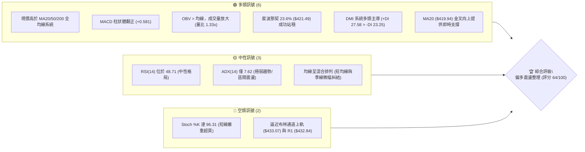
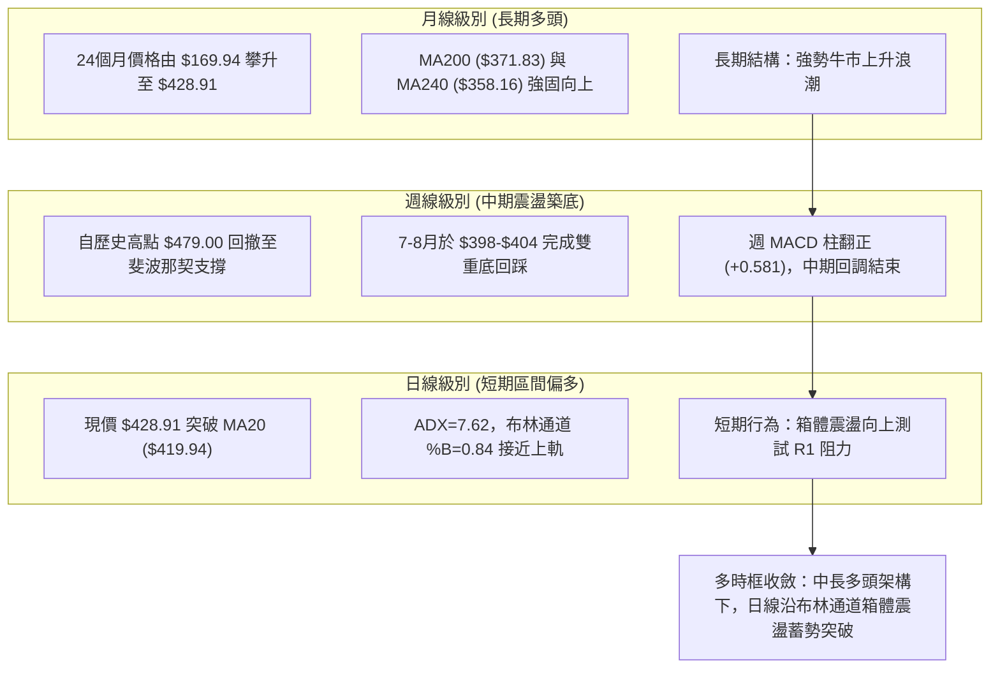
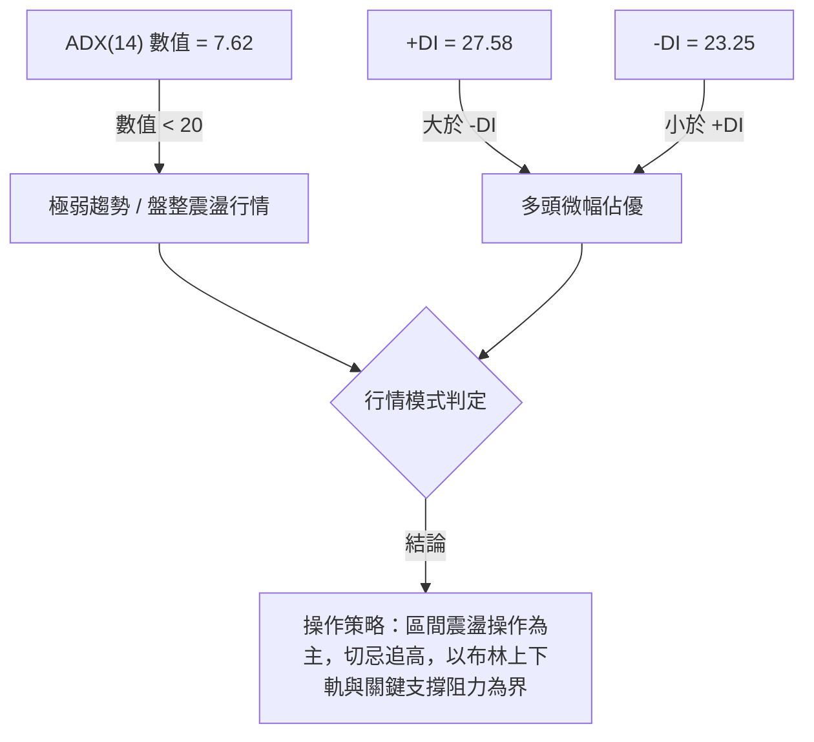
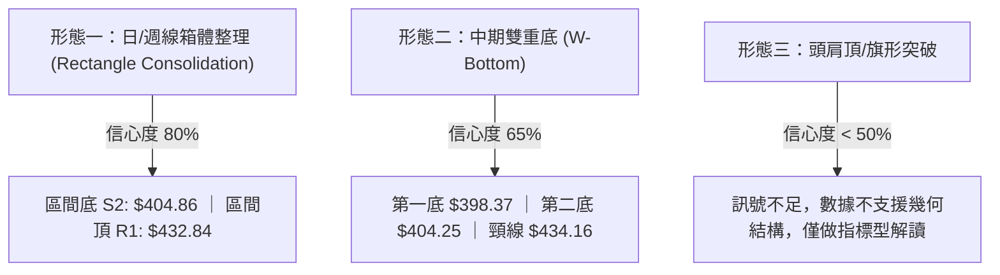
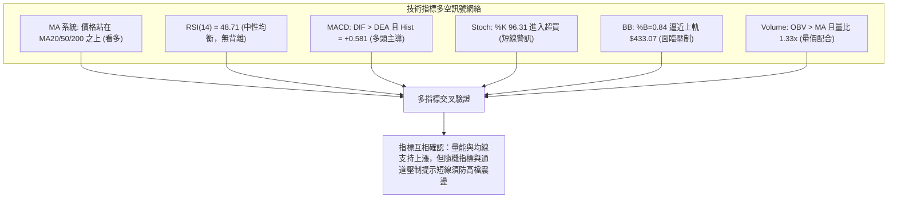
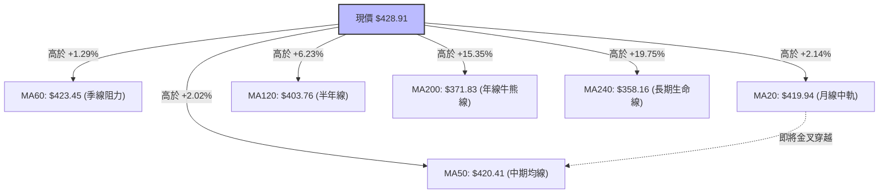
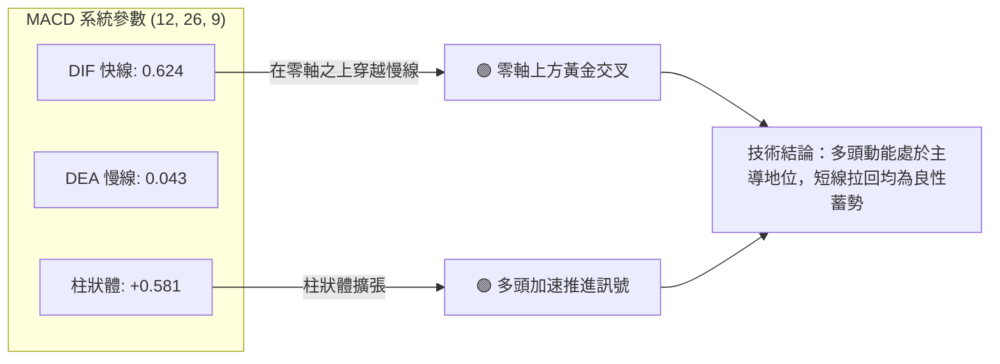
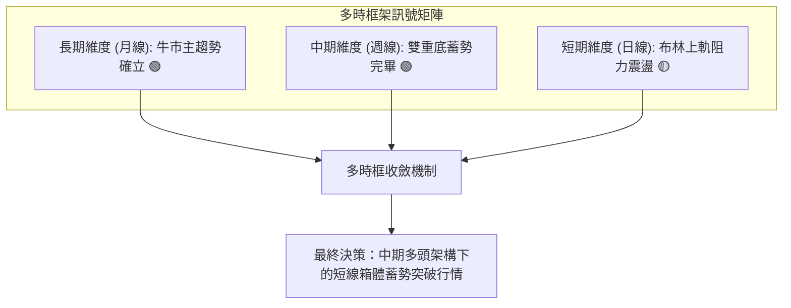
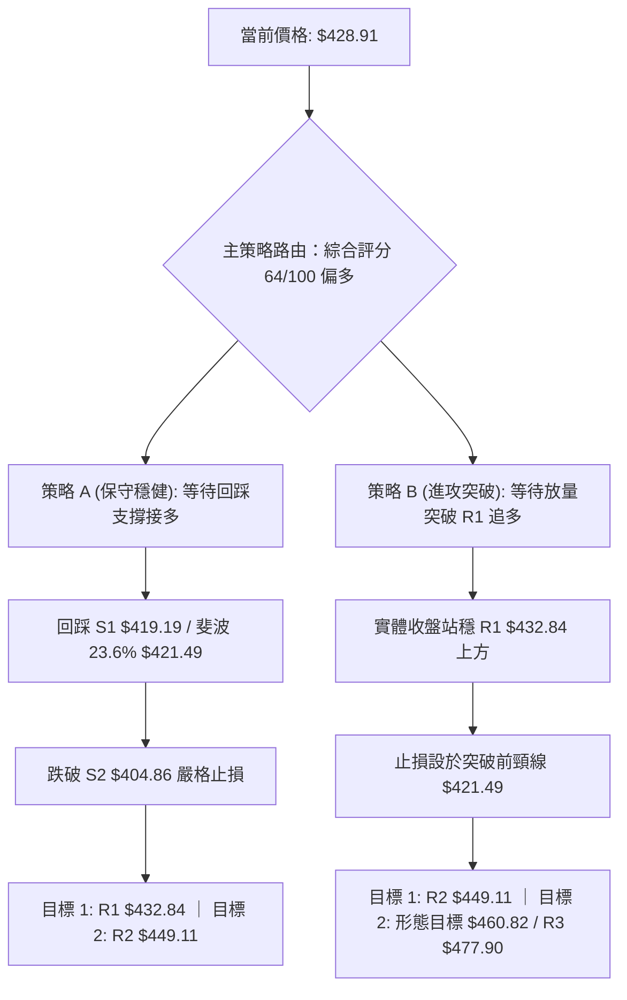
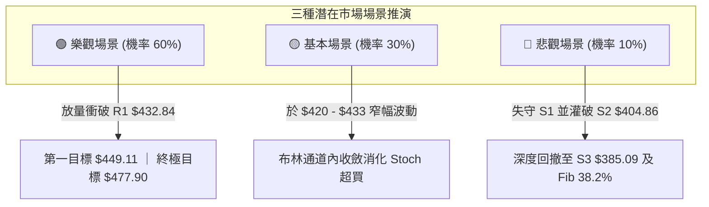

# TSM 技術分析報告

> **報告日期**：2026-09-08 ｜ **語言**：繁體中文 ｜ **數據來源**：Yahoo Finance ｜ **當前價格**：$428.91

---

## 目錄

| 章節 | 內容 |
|------|------|
| [1. 技術面概覽](#1-技術面概覽) | 訊號儀表板、核心指標、評分卡 |
| [2. 趨勢分析](#2-趨勢分析) | 多時框趨勢、長中短期走勢 |
| [3. 圖表形態分析](#3-圖表形態分析) | 形態識別、K線組合、目標價 |
| [4. 支撐與阻力](#4-支撐與阻力) | 關鍵價位、斐波那契回調 |
| [5. 技術指標深度解讀](#5-技術指標深度解讀) | MA/RSI/MACD/布林/成交量 |
| [6. 動能與波動率](#6-動能與波動率) | 動能評估、ATR、Beta |
| [7. 多時框架總結](#7-多時框架總結) | 時框架評分矩陣 |
| [8. 交易策略建議](#8-交易策略建議) | 多空策略、風險報酬比 |
| [9. 風險提示與監控](#9-風險提示與監控) | 監控指標、風險場景 |

---

## 1. 技術面概覽

### 🎯 技術訊號儀表板



### 📊 核心指標速覽表

| 指標類別 | 指標名稱 | 當前數值 | 訊號 | 解讀 |
|----------|----------|----------|------|------|
| **價格** | 當前價格 | $428.91 | 🟢 | 位於52週高低區間 79.4% 之高位強勢區 |
| **均線** | MA20 | $419.94 | 🟢 | 價格在MA20上方 (+2.14%)，短線回踩確認支撐有效 |
| **均線** | MA50 | $420.41 | 🟢 | 價格在MA50上方 (+2.02%)，中期均線具備防守韌性 |
| **均線** | MA200 | $371.83 | 🟢 | 價格遠在MA200上方 (+15.35%)，長線絕對多頭牛市結構 |
| **動能** | RSI(14) | 48.71 | 🟡 | 位於 30–70 中性區間核心，無背離，多空動能暫呈平衡 |
| **動能** | MACD Hist | +0.581 | 🟢 | DIF(0.624) > DEA(0.043)，多頭動能柱持續擴張增強 |
| **動能** | Stoch %K/%D | 96.31 / 56.33 | 🔴 | %K 進入極度超買區，短線隨時面臨技術性微幅回洗 |
| **趨勢** | ADX(14) | 7.62 | 🟡 | ADX < 25 極弱，顯示當前非單邊噴出，屬於區間箱體整理 |
| **趨勢** | DMI 指標 | +DI 27.58 / -DI 23.25 | 🟢 | 多頭買盤力道大於空頭賣壓，多頭佔據盤面微幅優勢 |
| **通道** | 布林通道 %B | 0.84 | 🟡 | 逼近上軌 $433.07，短線向上空間面臨軌道動態壓制 |
| **成交量** | 成交量 / 量比 | 12,276,300 (1.33x) | 🟢 | 量能高於20日均量(9,236,360)，突破伴隨實質換手 |
| **量能** | OBV 趨勢 | OBV > MA | 🟢 | 能量潮強於均線，資金呈現持續淨流入積累狀態 |
| **波動** | ATR(14) | $10.62 (2.48%) | 🟡 | 每日平均波動幅度約 10.6 美元，波動處於中等合理水準 |

### 🏆 技術評分卡

```
╔══════════════════════════════════════════════════════════════════╗
║                   技術評分卡 — TSM (2026-09-08)                  ║
╠══════════════════════════════════════════════════════════════════╣
║ 趨勢強度 (Trend)     ████████░░░░░░░░░░░░  40/100 🟡 中性整理   ║
║ 動能指標 (Momentum)  ██████████████░░░░░░  70/100 🟢 動能轉強   ║
║ 支撐穩定度 (Support) ████████████████░░░░  80/100 🟢 支撐扎實   ║
║ 成交量配合 (Volume)  ██████████████░░░░░░  70/100 🟢 價升量增   ║
║ 形態完整度 (Pattern) ████████████░░░░░░░░  60/100 🟡 箱體蓄勢   ║
║ 均線排列 (MovingAvg) ████████████░░░░░░░░  65/100 🟢 多方佔優   ║
╠══════════════════════════════════════════════════════════════════╣
║ 綜合評分             █████████████░░░░░░░  64/100 🟢 偏多震盪   ║
╚══════════════════════════════════════════════════════════════════╝
```

---

## 2. 趨勢分析

### 🌐 多時框趨勢分析



### 📈 長期趨勢 — 12個月走勢圖（Unicode）

```
TSM 月線收盤走勢圖（過去12個月：2025-10 至 2026-09）
價格軸 ($)
$480 ┤                                                ● (2026-06 $477.57)
$460 ┤                                               ╱ ╲
$440 ┤                                              ╱   ╲         ● ($428.91現價)
$420 ┤                                  ●(05 $417) ╱     ╲   ●───╱
$400 ┤                             ●   ╱          ╱       ● ($404.25)
$380 ┤                ●(02 $372)  ╱ ╲ ╱          ╱
$360 ┤               ╱ ╲         ╱   ●(03 $337) ╱
$340 ┤          ●   ╱   ╲       ╱
$320 ┤     ●   ╱ ╲ ╱     ●─────╱
$300 ┤●───╱ ╲ ╱   ● (01 $328.86)
$280 ┤ (2025-10 $298.08)
     └─────────────────────────────────────────────────────────────────
      10  11  12  01  02   03    04   05         06      07  08  09
      2025                       2026
```

#### 走勢特徵分析表格

| 階段區間 | 起止價格 | 漲跌幅 | 走勢特徵與技術解讀 |
|----------|----------|--------|-------------------|
| **2025-10 至 2026-02** | $298.08 → $372.65 | +25.02% | **主升浪推進**：均線多頭發散，單邊推升並一舉攻克 $300 大關。 |
| **2026-02 至 2026-03** | $372.65 → $337.16 | -9.52%  | **波段洗盤**：快速回踩斐波那契 61.8% ($328.39) 之上完成換手。 |
| **2026-03 至 2026-06** | $337.16 → $477.57 | +41.64% | **歷史天價衝刺**：月線連三紅，創出歷史高點 $479.00（收盤 $477.57）。 |
| **2026-06 至 2026-07** | $477.57 → $404.25 | -15.35% | **獲利回吐急跌**：高檔爆量長黑，迅速回吐至 S2 ($404.86) 關鍵支撐。 |
| **2026-07 至 2026-09** | $404.25 → $428.91 | +6.10%  | **築底修復蓄勢**：於 $404 支撐上方反覆打底，月線收紅重返 MA20。 |

### 📊 中期趨勢（週線分析）

中期走勢圖示如下，呈現於 $404-$434 區間之打底反彈架構：

```
中期週線結構示意圖
$480 ┤ 52W High $479.00 ═════════════════════════════════════════════ (強壓力 R3)
     │
$450 ┤                                        前波反彈高點聚類 $449.11 (R2)
     │
$430 ┤                                  現價 $428.91 ▲─── R1 $432.84
     │                           ┌───┐             │
$410 ┤                           │   │  ●──────────┘ 斐波 23.6% ($421.49)
     │        ┌───┐              │   │  │
$390 ┤────────┴───┴──────────────┴───┴──┴─────────────── S2 $404.86 (雙重底低點)
     │  2026-07-19 ($398.37)  2026-08-02 ($404.25)
     └─────────────────────────────────────────────────────────────
```

週線指標在 2026-07-26 創下低點（RSI 跌至 27.9 極度超賣）後，隨後數週買盤積極湧入：
- 週成交量於 2026-07-19 放大至 9,149 萬股，2026-08-02 再次放大至 8,733 萬股，形成典型的**恐慌放量見底（Selling Climax）**特徵。
- 週 MACD 柱由 2026-07-19 的 -5.832 持續縮腳，於 2026-08-09 翻正至 +2.429，最新週線柱狀體保持在 +0.581，確認中期技術性反彈架構已確立。

### ⚡ 趨勢強度評估（ADX 解讀）



| 指標名稱 | 當前數值 | 門檻區間 | 行情屬性判定 |
|----------|----------|----------|--------------|
| **ADX(14)** | **7.62** | 0 – 20: 極弱/盤整<br>20 – 25: 弱趨勢<br>25 – 50: 強趨勢<br>> 50: 極強單邊 | **標準無趨勢盤整市場**。表明自 6 月急跌以來的單邊空頭已經衰竭，但單邊牛市尚未重啟，股價正處於箱體重新吸籌階段。 |
| **+DI** | **27.58** | 參考基準 | 多方動能高於空方，回調獲得承接。 |
| **-DI** | **23.25** | 參考基準 | 空方殺跌力道減弱，未跌破警戒線。 |

---

## 3. 圖表形態分析

### 🔍 形態識別系統



#### 形態識別與信心度評估表

| 形態名稱 | 信心度 | 判斷依據（引用實際數據） | 完成度 | 目標價（附嚴謹計算式） |
|----------|--------|--------------------------|--------|------------------------|
| **箱體震盪整理** | **80%** | 價格在 S2 ($404.86) 與 R1 ($432.84) 之間進行高低震盪，布林帶寬收窄，ADX 7.62 確認區間性質。 | 85% | 向上突破 R1 測算目標價：<br>頸線 $432.84 + 箱體高度 ($432.84 - $404.86 = $27.98) = **$460.82**（接近波段阻力 R2/R3 中樞）。 |
| **中期雙重底 (W底)** | **65%** | 2026-07-19 週收盤 $398.37 與 2026-08-02 週收盤 $404.25 構成雙低點，頸線為 2026-07-05 週高點收盤 $434.16。 | 75% | 突破頸線測算目標價：<br>頸線 $434.16 + 形態深度 ($434.16 - $398.37 = $35.79) = **$469.95**。 |
| **複雜頂部/旗形** | **30%** | 週線與日線無標準對稱三角形或旗形收斂，均線糾結。 | 0% | **訊號不足，僅做指標型解讀**（依規則 15，不強行預測幾何目標）。 |

### 🕯️ 重要K線形態分析

| 週期/日期 | 收盤價 | K線形態 | 解讀 | 訊號 |
|-----------|--------|---------|------|------|
| **2026-06** | $477.57 | 高檔長上影十字星 (衝高 $479.00) | 歷史新高處出現巨大獲利賣壓，多空分歧達到極致。 | 🔴 頂部力竭 |
| **2026-07** | $404.25 | 大陰線帶長下影線 | 單月重挫 $73.32，但下影線精準觸及波段支撐 S2 ($404.86)，顯示逢低買盤進駐。 | 🟡 恐慌釋放 |
| **2026-08** | $415.32 | 縮量築底小陽線 | 震盪幅度收窄，空方動能耗盡，形成母子孕線底結構。 | 🟢 築底完成 |
| **2026-09 (最新)** | $428.91 | 實體陽線攀升 | 實體穿過 MA20 ($419.94) 與 MA50 ($420.41)，多頭重掌短線主動權。 | 🟢 多方突破 |

### 📉 ASCII 走勢形態示意圖

```
TSM 雙重底 (W-Bottom) 與箱體整理示意圖
$450 ┤                                                    
$440 ┤                   頸線位 / 箱體頂部 R1 ($432.84 - $434.16)
     │                     ┌──────┐                        ▲ (即將測試)
$430 ┤                     │      │                       ╱
$420 ┤                     │      │       現價 $428.91 ──●
     │        ╲           ╱        ╲                   ╱
$410 ┤         ╲         ╱          ╲                 ╱
     │          ╲       ╱            ╲               ╱
$400 ┤───────────●─────╱──────────────●─────────────╱──── 箱體底部 S2 ($404.86)
     │        第一底                第二底
     │      (2026-07-19 $398.37)  (2026-08-02 $404.25)
     └─────────────────────────────────────────────────────────────
```

### 🎯 形態目標價計算

根據已被高度確認的「箱體整理形態」與「雙重底形態」，計算關鍵突破位與目標延伸空間：
1. **箱體高度計算**：
   - 箱體頂部：以波段高點聚類阻力位 **R1: $432.84** 為基準。
   - 箱體底部：以波段低點聚類強支撐 **S2: $404.86** 為基準。
   - 箱體垂直高度 $H_1 = 432.84 - 404.86 = \$27.98$。
   - **突破第一階段目標價** $= 432.84 + 27.98 = \mathbf{\$460.82}$。
2. **雙重底測幅計算**：
   - 雙底最低點：2026-07-19 低點 $\$398.37$。
   - 雙底頸線：2026-07-05 收盤價 $\$434.16$。
   - 雙底形態垂直高度 $H_2 = 434.16 - 398.37 = \$35.79$。
   - **形態完整量度目標價** $= 434.16 + 35.79 = \mathbf{\$469.95}$。

---

## 4. 支撐與阻力

### 🗺️ 關鍵價位分布圖（Unicode）

```
TSM 價位結構分布圖（嚴格引用 OHLCV 計算聚類點）
═════════════════════════════════════════════════════════════════════════
$479.00 ║██████████████████████████████║ 52週歷史最高點 (Fib 0.0%)
$477.90 ║████████████████████████████  ║ 強阻力 R3 (+11.42% from price)
$449.11 ║██████████████████            ║ 阻力 R2 (+4.71% from price)
$433.07 ║▓▓▓▓▓▓▓▓▓▓▓▓▓▓▓▓▓▓▓▓▓▓        ║ 布林通道上軌 (動態壓制)
$432.84 ║████████████████████████      ║ 關鍵阻力 R1 (+0.92% from price)
────────╫──────────────────────────────╫─────────────────────────────────
$428.91 ╠══════════════════════════════╣ ◄ 現價 (Current Price)
────────╫──────────────────────────────╫─────────────────────────────────
$421.49 ║▓▓▓▓▓▓▓▓▓▓▓▓▓▓▓▓▓▓            ║ 斐波那契 23.6% 回調位 (短線支撐)
$420.41 ║▓▓▓▓▓▓▓▓▓▓▓▓▓▓▓▓              ║ MA50 均線位置
$419.94 ║▓▓▓▓▓▓▓▓▓▓▓▓▓▓▓▓              ║ 布林中軌 / MA20
$419.19 ║████████████████              ║ 近期關鍵支撐 S1 (-2.27% from price)
$406.80 ║▓▓▓▓▓▓▓▓▓▓                    ║ 布林通道下軌
$404.86 ║████████████████████████      ║ 強支撐 S2 (雙底回踩支撐, -5.61%)
$385.91 ║▓▓▓▓▓▓▓▓▓▓▓▓▓▓▓▓▓▓▓▓          ║ 斐波那契 38.2% 回調位
$385.09 ║██████████████████████████    ║ 核心波段強支撐 S3 (-10.22%)
═════════════════════════════════════════════════════════════════════════
```

### 🚧 阻力位分析表

| 阻力級別 | 精確價位 | 距離現價 | 形成原因（OHLCV 聚類） | 突破難度 | 重要性評估 |
|----------|----------|----------|------------------------|----------|------------|
| **R1** | **$432.84** | +0.92% | 近一年波段高點聚類、布林通道上軌 ($433.07) 共振。 | 中等 | 🔴 **極高**。箱體突破分水嶺，若實體收上將打開新一輪波段上漲。 |
| **R2** | **$449.11** | +4.71% | 2026年6月中旬主升段回調之成交密集套牢區波段高點聚類。 | 較高 | 🟡 **中高**。多頭反彈的重要獲利了結壓制區間。 |
| **R3** | **$477.90** | +11.42% | 近一年歷史高點聚類區（極端高點 $479.00 / 2026-06 收盤 $477.57）。 | 極高 | 🔴 **極高**。多頭全面解套與再創歷史天價的終極屏障。 |

### 🛡️ 支撐位分析表

| 支撐級別 | 精確價位 | 距離現價 | 形成原因（OHLCV 聚類） | 守住機率 | 重要性評估 |
|----------|----------|----------|------------------------|----------|------------|
| **S1** | **$419.19** | -2.27% | 近一年波段低點聚類，與 MA20 ($419.94) 及 MA50 ($420.41) 高度重合。 | 75% | 🟢 **關鍵**。短期多頭防線，不跌破則多頭維持強勢攻擊姿態。 |
| **S2** | **$404.86** | -5.61% | 7-8月兩次週線恐慌砸盤形成的波段雙底低點聚類區。 | 85% | 🟢 **核心**。中期牛熊多空底線，一旦失守宣告震盪結構破位。 |
| **S3** | **$385.09** | -10.22% | 2026年首季起漲前整理平台，與斐波那契 38.2% ($385.91) 形成堅固共振。 | 95% | 🟢 **基石**。長線價值投資者與機構買盤重兵集結處。 |

### 📐 斐波那契回調位分析

本波段計算取自 52 週完整區間：**最低點 $235.30（100.0%）至 最高點 $479.00（0.0%）**，總垂直空間高達 $243.70。

```
斐波那契回調結構與現價位置解讀
$479.00 ── 0.0%  (52W High 最高點)
         │
$428.91 ── ◄ 現價落於 0.0% 與 23.6% 之間 (超強勢回調區間)
         │
$421.49 ── 23.6% (目前已成功收復，轉化為強支撐)
         │
$385.91 ── 38.2% (多頭防守第二道防線，與 S3: $385.09 重合)
         │
$357.15 ── 50.0% (中樞分水嶺，位於 MA200: $371.83 下方)
         │
$328.39 ── 61.8% (黃金分割強支撐)
         │
$287.45 ── 78.6% (極端回調防線)
         │
$235.30 ── 100.0% (52W Low 最低點)
```

**技術解讀**：
- 當前價格 $428.91 位於 **23.6% ($421.49)** 與 **0.0% ($479.00)** 之間，處於整個 52 週漲幅的極度強勢回調位上方。
- 自歷史天價 $479.00 拉回時，回調幅度甚至未實質觸及 38.2% ($385.91)，僅在 S2 ($404.86) 即獲強力承接，證明中長線主力買盤鎖碼極其堅定。
- **現價站穩 23.6% ($421.49)**，意味著先前下殺僅為強勢多頭中的技術性洗盤，而非趨勢反轉。

---

## 5. 技術指標深度解讀

### 🎛️ 指標訊號總覽



### 📈 移動平均線排列分析



#### 均線結構深度解析：
1. **短中期均線糾結轉發散**：
   - MA5 ($418.15) 與 MA10 ($418.08) 已完成低位金叉。
   - MA20 ($419.94) 正急速逼近 MA50 ($420.41)，利潤空間壓縮後即將形成「MA20 上穿 MA50」的中期黃金交叉。
2. **長週期生命線無懈可擊**：
   - MA120 ($403.76)、MA200 ($371.83) 與 MA240 ($358.16) 均呈現順暢的多頭斜率向上推進。現價穩居 MA200 上方超過 15%，維持長線多頭的強盛生命力。

### 📉 RSI(14) 分析

```
RSI(14) 當前數值：48.71
0       20       30            48.71           70       80      100
├────────┼────────┼──────────────┼──────────────┼────────┼────────┤
│ 極度超賣│  超賣  │       中性區間 (48.71)        │  超買  │極度超買│
└────────┴────────┴──────────────┴──────────────┴────────┴────────┘
當前進度：█████████░░░░░░░░░░░ (48.71%)
```

- **背離分析判斷**：
  - **頂背離判定**：**無頂背離**。在 2026-06 觸及天價時，週線 RSI 達 76.5，隨後價格拉回，RSI 於 2026-07 降至 27.9 完成超賣出清；目前現價自 $404 反彈至 $428.91，RSI 由 27.9 同步回升至 48.71，價格高點與指標走向完全同向。
  - **底背離判定**：**無明顯底背離**。7月至8月的雙底打底中，價格低點相近（$398 與 $404），指標低點由 27.9 回升至 43.3，屬於正常超跌修復，並非標準背離型態。
- **結論**：RSI 位於 48.71，遠離 70 超買警戒線，意味著若發動突破，技術動能端完全沒有過熱負擔，具備充沛的上行空間。

### 📊 MACD(12/26/9) 訊號解讀



- **MACD 指標狀態**：DIF 快線數值為 0.624，DEA 訊號線數值為 0.043，柱狀體（MACD Hist）為 **+0.581**。
- **背離解讀**：MACD 自 7 月中旬的 -5.832 極端負值持續收斂並強勢翻紅，目前柱狀體連續多週處於正值區間，且柱體保持擴張，並無頂背離現象。多頭在零軸上方的二次發力，為突破 R1 提供了動能支持。

### 📦 布林通道分析

```
TSM 布林通道現狀 (參數: 20, 2)
$435 ┤
$433 ┤─── BB上軌: $433.07  (距離現價僅 +$4.16 / +0.97%)
$431 ┤
$428 ┤    ● 現價: $428.91 (%B = 0.84，處於極高位壓制區)
$425 ┤
$420 ┤─── BB中軌(MA20): $419.94 (關鍵動態防守位)
$415 ┤
$410 ┤
$406 ┤─── BB下軌: $406.80 (接近強支撐 S2: $404.86)
$400 ┤
```

- **通道帶寬與形態**：上軌 $433.07、中軌 $419.94、下軌 $406.80。上下軌垂直間距僅約 $26.27，帶寬大幅收窄，呈現標準的「**通道收口（Squeeze）**」形態。
- **%B 指標解讀**：當前 %B 達到 **0.84**。歷史經驗顯示，當 ADX < 25 且 %B > 0.80 時，股價極易在布林上軌處遭遇技術性阻力而拉回中軌蓄勢。因此，除非出現爆量大陽線實體穿破上軌，否則現價不宜追高。

### 💹 成交量分析（量價配合度）

```
成交量對比柱狀圖 (股數)
最新量:   12,276,300  █████████████ (量比: 1.33x) 🟢
20日均量:  9,236,360  ██████████
50日均量: 12,608,712  █████████████
```

- **OBV（能量潮）分析**：數據明確標註「**OBV > MA → 量能支撐上漲**」。能量潮指標始終運行在自身移動平均線上方，表明自 7 月底觸底以來，機構法人的籌碼始終呈現淨吸籌狀態，未見主力出逃跡象。
- **量價健康度**：最新成交量 12,276,300 股，較 20 日均量放大 32.9%（量比 1.33x），顯示股價向 R1 ($432.84) 逼近的過程中獲得了增量資金的積極推動，量價配合健康，並未出現「量價背離」的量縮虛漲現象。

---

## 6. 動能與波動率

### ⚡ 動能評估四象限

```
        動能強度 (Momentum)
             ▲
             │      Q1 (強動能 / 低波動) 
             │      ★ 當前目標演化區
             │
   Q2 (弱動能 / 低波動)   │      Q3 (強動能 / 高波動)
  ───────────────────┼───────────────────► 波動率 (Volatility)
   ● 當前位置 (TSM)    │
   (ADX 7.62, ATR 2.48%)│
             │      Q4 (弱動能 / 高波動)
             │
```

| 象限 | 動能維度 | 波動維度 | 狀態特徵 | 當前 TSM 評估與策略指引 |
|------|----------|----------|----------|-------------------------|
| **Q1** | 強動能 | 低波動 | 機構控盤主升 | 未來向上突破 R1 時的理想目標演化狀態。 |
| **Q2** | **弱動能** | **低波動** | **蓄勢震盪築底** | **✓ 當前精準定位**：ADX 7.62 搭配收窄的布林帶寬，顯示籌碼沉澱穩定，風險極度可控，適宜採取區間低吸或突破佈局。 |
| **Q3** | 強動能 | 高波動 | 快速單邊行情報復 | 類似 2026-06 歷史天價時的走勢，易生極端回撤。 |
| **Q4** | 弱動能 | 高波動 | 無序恐慌殺跌 | 類似 2026-07 破位下跌階段，應空倉觀望。 |

### 📊 ATR 波動率分析

- **ATR(14) 數值**：**$10.62**（佔當前股價比例為 **2.48%**）。
- **ATR 應用解讀**：
  - 當前 TSM 每日正常波動區間約為正負 $10.62 美元。
  - **技術防守設定**：多頭策略的動態止損應設定在現價減去 1.0 至 1.5 倍 ATR 之外，即合理的技術防禦緩衝區間應為 $\$10.62 \sim \$15.93$。
  - 當前現價 $428.91 距關鍵支撐 S1 ($419.19) 差距為 $\$9.72$（約 0.91 倍 ATR），而距離關鍵防守點斐波 23.6% ($421.49) 為 $\$7.42$。這意味著 S1 恰好坐落在 1.0 倍 ATR 的標準日常波動邊界內，提供絕佳的技術止損依託。

### 📐 Beta 與市場相關性

- **Beta 數值**：**1.247**。
- **市場風險解讀**：TSM 對標普 500 / 費城半導體指數具有較高的進攻彈性。當半導體板塊走強時，TSM 漲幅預期為板塊的 1.25 倍；反之，在系統性拉回時亦將承受額外 25% 的波動。
- **基本面與籌碼共振**：機構持股佔比僅 15.5%，空頭佔比（Short % Float）僅 0.6%，Short Ratio 2.18，顯示市場極度缺乏做空意願，一旦突破容易引發追價動能。

---

## 7. 多時框架總結

### 📋 時框架評分表

| 時框架 | 趨勢方向 | 動能指標 | 均線排列 | 圖表形態 | 綜合評分 | 戰略建議 |
|--------|----------|----------|----------|----------|----------|----------|
| **月線 (長期)** | 🟢 強烈看多 | 🟢 柱狀穩定擴張 | 🟢 完美多頭發散 (高於 MA200/240) | 🟢 長期牛市主升階梯 | **85/100** | 長線持股，堅定做多。 |
| **週線 (中期)** | 🟢 偏多回升 | 🟢 MACD柱翻正 (+0.581) | 🟡 糾結後重新多頭發散 | 🟢 雙重底打底成型 | **70/100** | 逢回踩佈局，等待突破。 |
| **日線 (短期)** | 🟡 震盪偏多 | 🔴 Stoch 超買 / RSI 中性 | 🟢 站穩 MA20/50 之上 | 🟡 箱體收口近上軌 | **55/100** | 暫勿追高，以回踩吸納為主。 |

### 🔲 綜合訊號矩陣



### ⚖️ 多時框收斂結論

> **依嚴格規則 14 進行收斂**：
> 1. **當前行情模式辨識**：技術指標明確顯示 **ADX(14) = 7.62（遠小於 25）**，因此當前客觀定義為**「標準盤整震盪行情」**。
> 2. **主導維度與操作依歸**：在盤整行情中，**以日線布林通道上下軌 ($406.80 - $433.07) 及波段高低點聚類 (S2: $404.86 至 R1: $432.84) 為核心交易區間**。
> 3. **衝突收斂判斷**：日線隨機指標（Stoch %K 96.31）雖發出短線超買訊號，但週線 MACD 柱狀體翻正（+0.581）且 OBV 展現機構吸籌，中長週期並無轉空跡象。日線超買僅會引發短線箱體內的回踩，不會扭轉中長期牛市方向。
> 4. **唯一確定結論**：**整體格局定性為「偏多震盪整理」**。第 8 章交易策略嚴格遵循此結論，以**主推多頭策略**（回踩關鍵支撐進場、突破關鍵阻力追買）為主，不進行猜頂做空。

---

## 8. 交易策略建議

### 🗺️ 策略決策流程圖



### 🧭 策略路由

**當前主策略方向 = 主推多頭策略（依綜合評分 64/100，≥60 偏多區間）**  
空頭訊號僅作為高檔風控減倉與多頭防守失效之對沖觸發點，絕不盲目逆勢開空。

### 🎯 價格情境階梯（Price Scenarios）

所有價位均嚴格引用第 4 章計算出之關鍵聚類點：

| 觸發條件 | 下一目標 | 後續延伸 | 情境技術含義 |
|----------|----------|----------|--------------|
| **強勢突破 R1 ($432.84)** | **R2 ($449.11)** | **R3 ($477.90)** | 短線震盪箱體被實質打破，多頭重啟新一輪波段攻擊。 |
| **站穩現價區間 ($420 - $430)** | **R1 ($432.84)** | — | 在布林中軌與上軌間蓄勢整固，籌碼換手充分。 |
| **失守 S1 ($419.19)** | **S2 ($404.86)** | — | 短線跌破 MA20，行情回測箱體底部尋求支撐。 |
| **有效跌破 S2 ($404.86)** | **S3 ($385.09)** | **Fib 38.2% ($385.91)** | 中期雙底打底失敗，轉入深度回撤修復。 |

### 📊 情境機率分佈

| 預期情境 | 發生機率 | 主要技術指標支撐依據 |
|----------|----------|----------------------|
| **震盪蓄勢後向上突破** | **60%** | MACD 柱狀體翻正擴張 (+0.581)；現價穩居均線系統上方；OBV > MA 資金持續淨流入。 |
| **維持箱體區間震盪** | **30%** | ADX(14) 僅 7.62 屬典型弱趨勢；布林帶寬窄幅收口；Stoch 短線超買需要時間消化。 |
| **轉弱下探再探底部** | **10%** | 除非美股半導體大盤遭遇系統性黑天鵝，使價格實體摜破 S1 ($419.19) 及 MA50。 |

### 🟢 主策略詳情

本報告依交易風格設計兩套嚴格基於數據的多頭策略：

| 策略要素 | 策略 A：支撐回踩吸納策略（穩健首選） | 策略 B：阻力突破動量策略（進攻次選） |
|----------|--------------------------------------|--------------------------------------|
| **進場條件** | 價格拉回布林中軌 MA20 與 S1 支撐獲得確認 | 日線實體收盤明確突破阻力 R1 ($432.84) 且放量 |
| **進場價格** | **$421.49**（斐波那契 23.6% / 近似 MA50 $420.41） | **$433.50**（突破 R1: $432.84 與布林上軌確認點） |
| **目標價 T1** | **$432.84**（測試阻力 R1，鎖定第一波利潤） | **$449.11**（波段阻力 R2） |
| **目標價 T2** | **$449.11**（波段阻力 R2，實現波段收益） | **$460.82**（箱體垂直測幅目標 / 直指 R3 $477.90） |
| **止損價格** | **$415.00**（跌破 MA20/MA50 並跌穿約 0.6 倍 ATR） | **$421.49**（回踩原阻力轉支撐點失效即止損） |
| **單筆風險空間** | $\$421.49 - \$415.00 = \mathbf{\$6.49}$ | $\$433.50 - \$421.49 = \mathbf{\$12.01}$ |
| **第一利潤空間** | $\$432.84 - \$421.49 = \mathbf{\$11.35}$ | $\$449.11 - \$433.50 = \mathbf{\$15.61}$ |
| **風險報酬比 (T1)** | **1 : 1.75** (達到 T2 則為 **1 : 4.26**) | **1 : 1.30** (達到 T2 則為 **1 : 2.27**) |
| **預估勝率** | **65%** | **55%** |
| **建議倉位** | **20% 資金**（分批進場） | **15% 資金**（突破確認後右側追進） |

### 🔴 反向風險觸發點（對沖提示）

若出現以下極端情況，主多頭邏輯即刻被證偽，投資人應全面執行防守或啟動對沖保護：
1. **多頭止損警報**：日線實體大陰線摜破 **S1: $419.19**（同步跌穿 MA20 與 MA50），需立即將多頭部位砍半。
2. **多翻空破位點**：週線級別實體跌破雙底支撐 **S2: $404.86**。此處為波段多頭生命底線，一旦失守意味著頭肩頂或深幅回撤形成，目標直指 **S3: $385.09**，所有剩餘多單必須無條件止損離場。

### ⭐ 整體訊號強度評星

```
╔══════════════════════════════════════════════════════════════════╗
║                     TSM 交易訊號強度評星                         ║
╠══════════════════════════════════════════════════════════════════╣
║ 做多訊號強度：★★★★☆  (4/5星) — 均線多頭、量能配合、長線向上   ║
║ 做空訊號強度：★☆☆☆☆  (1/5星) — 缺乏做空結構，僅有短線微幅超買 ║
║ 整體可信度：  ★★★★☆  (4/5星) — 數據多方一致性高，區間邊界清晰 ║
╚══════════════════════════════════════════════════════════════════╝
```

---

## 9. 風險提示與監控

### ✅ 關鍵監控指標 Checklist

```
╔══════════════════════════════════════════════════════════════════╗
║                   TSM 每日交易風控監控清單                       ║
╠══════════════════════════════════════════════════════════════════╣
║ [ ] 價位監控：收盤價是否成功守穩 MA20 ($419.94) 之上？          ║
║ [ ] 突破監控：成交量是否大於 12,608,712 (50日均量) 突破 R1？    ║
║ [ ] 動能監控：MACD 柱狀體是否持續維持在 0 軸以上 (+0.581)？     ║
║ [ ] 超買修復：Stoch %K 是否自 96.31 順利回落至 80 以下完成鈍化？║
║ [ ] 趨勢激活：ADX(14) 是否由 7.62 拐頭向上衝破 20 門檻？        ║
║ [ ] 量能指標：OBV 是否持續高於其移動平均線？                    ║
║ [ ] 宏觀關聯：半導體板塊 Beta 波動是否導致單日振幅超過 ATR？    ║
╚══════════════════════════════════════════════════════════════════╝
```

### ⚠️ 風險場景分析



### 🛡️ 風險管理重要提醒

1. **嚴禁在阻力位前盲目追高**：當前現價 $428.91 距離 R1 阻力位 ($432.84) 與布林通道上軌 ($433.07) 僅有不到 1% 的空間，而隨機指標 Stoch %K 高達 96.31。在極度接近阻力且指標超買時開倉，風險報酬比極差。
2. **波動率倉位控制（基於 ATR）**：當前每日 ATR 為 $10.62，相當於單口或單股部位存在約 2.5% 的單日天然雜訊波動。單筆交易的最大止損金額應嚴格限制在總投資組合淨值的 1% 至 1.5% 內，以此逆推持倉股數。
3. **時框共振紀律**：目前 ADX < 25 明確定義當前處於震盪市，任何盤中假突破都極易出現回抽。切勿將震盪市的突破單視為單邊暴利行情，達成目標價 T1 ($449.11) 後應至少獲利了結 50% 倉位，並將剩餘部位止損價上移至保本點。

---

## 📋 報告總結

```
╔══════════════════════════════════════════════════════════════════╗
║                      TSM 技術分析報告總結                        ║
╠══════════════════════════════════════════════════════════════════╣
║ 報告日期：2026-09-08                                             ║
║ 當前價格：$428.91                                                ║
║ 分析評級：🟢 偏多震盪整理（評分：64/100）                         ║
╠══════════════════════════════════════════════════════════════════╣
║ 關鍵結論：                                                       ║
║ ├─ 長期趨勢：🟢 絕對多頭（遠在 MA200: $371.83 與 MA240 之上）   ║
║ ├─ 中期趨勢：🟢 雙重底築底回升，週線 MACD 柱翻正 (+0.581)        ║
║ ├─ 短期趨勢：🟡 箱體收口近上軌，面臨 R1: $432.84 考驗           ║
║ ├─ 關鍵支撐：S1: $419.19 ｜ 核心支撐 S2: $404.86                 ║
║ ├─ 關鍵阻力：R1: $432.84 ｜ 波段阻力 R2: $449.11                 ║
║ └─ 外資共識：強力買進 (Strong Buy)，平均目標價 $552.38           ║
╠══════════════════════════════════════════════════════════════════╣
║ 最優策略組合：                                                   ║
║ 1. 🥇 最佳機會：策略 A — 回踩 S1/斐波 23.6% ($421.49) 吸納佈局   ║
║ 2. 🥈 次選機會：策略 B — 帶量突破 R1 ($432.84) 右側順勢追價     ║
║ 3. 🥉 風控基石：嚴守 S1 ($419.19) 減倉線與 S2 ($404.86) 清倉線  ║
╚══════════════════════════════════════════════════════════════════╝
```

---

> ⚠️ **免責聲明**：本報告為技術分析研究，所有數值、形態識別及交易策略均嚴格基於所提供之歷史量價與指標數據推算。本報告**僅供學術研究與參考**，**不構成任何形式的投資建議**。市場具有高度不確定性，投資人進行任何交易決策前應自行獨立評估風險並承擔相應後果。

---

*報告生成時間：2026-09-08 ｜ 數據來源：Yahoo Finance ｜ 分析框架：多時框量化技術分析*