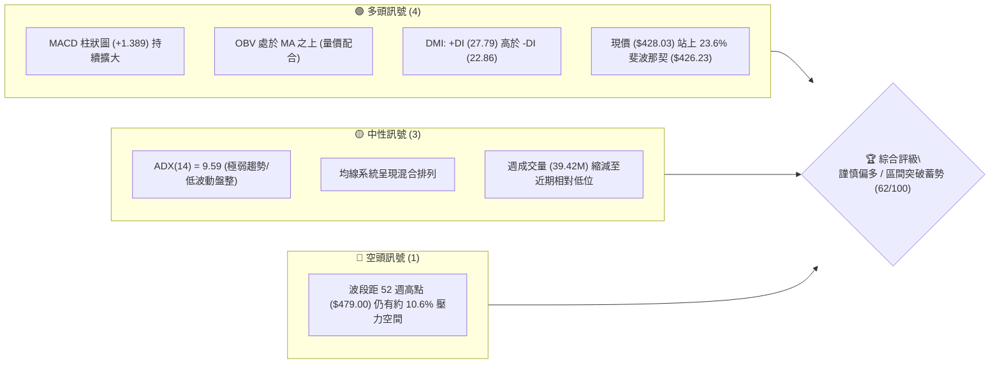
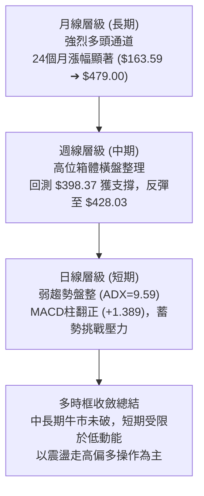
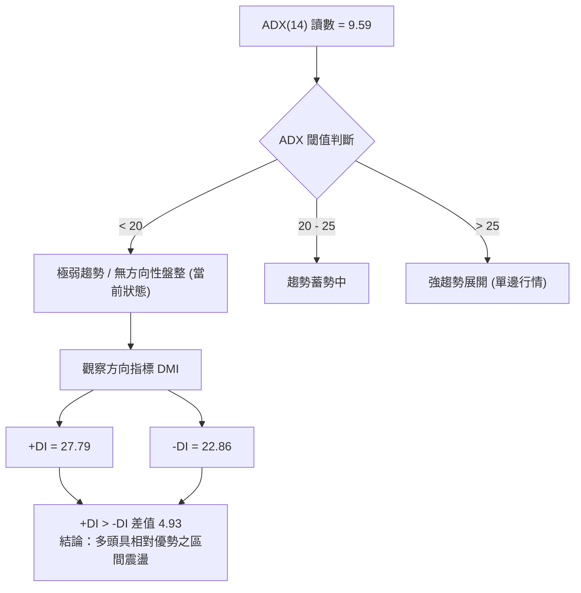
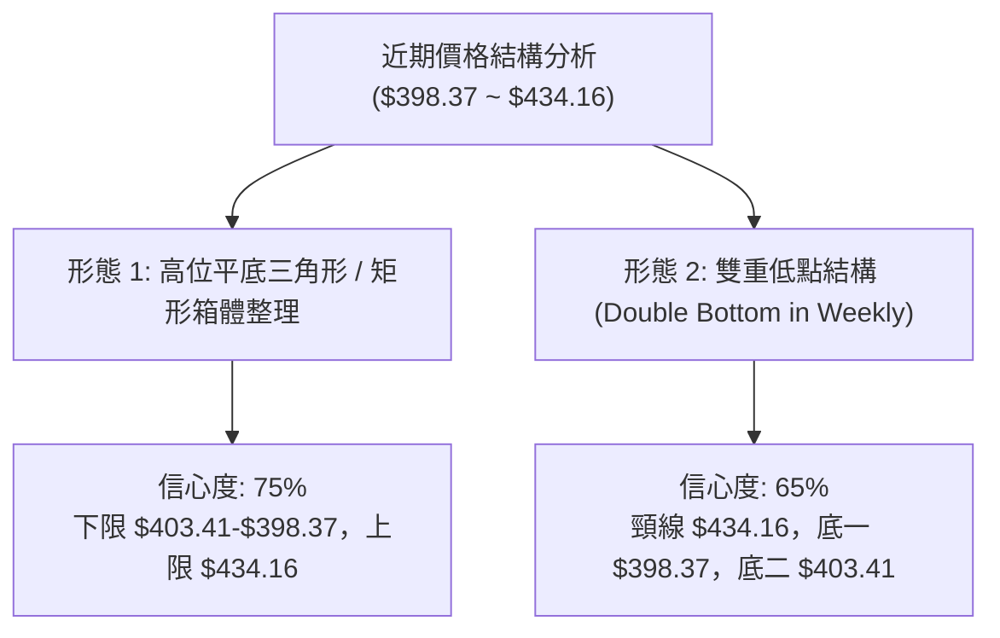
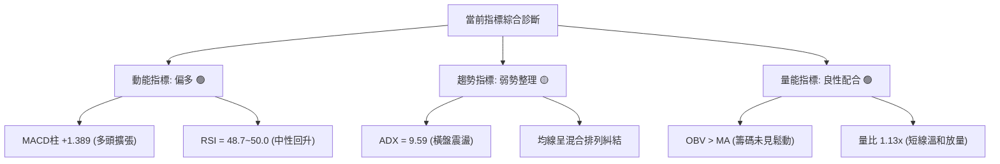
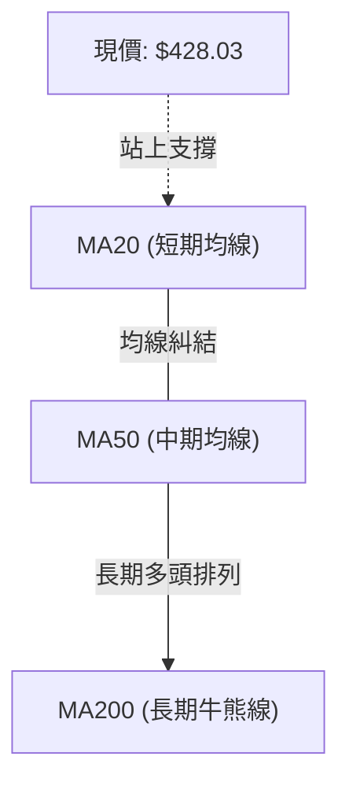
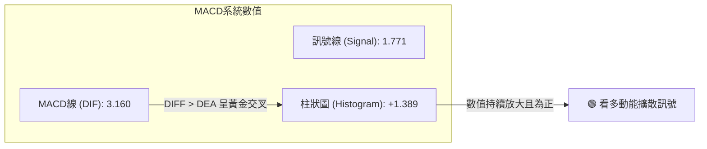
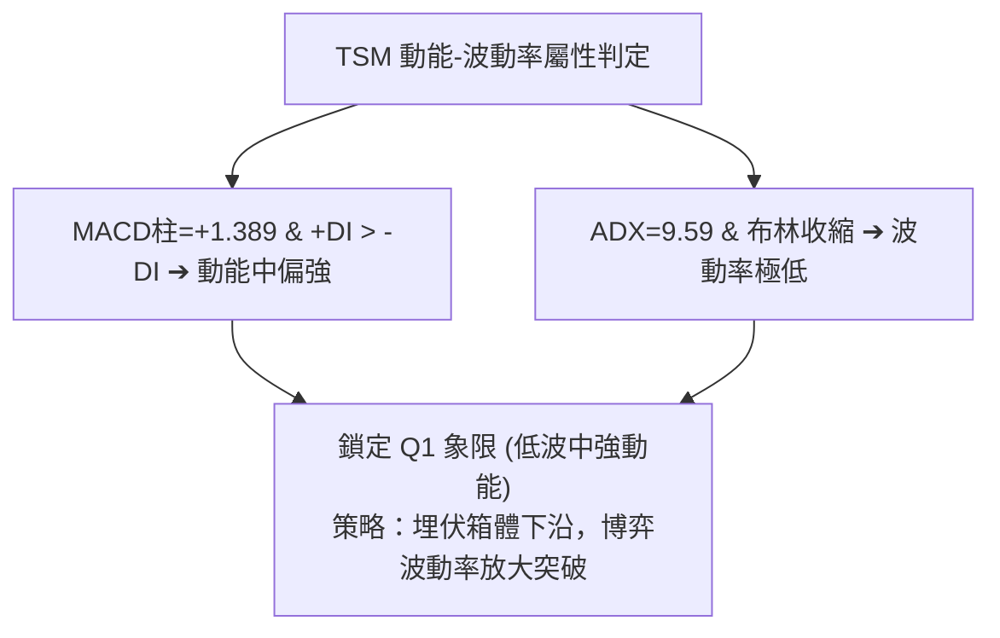
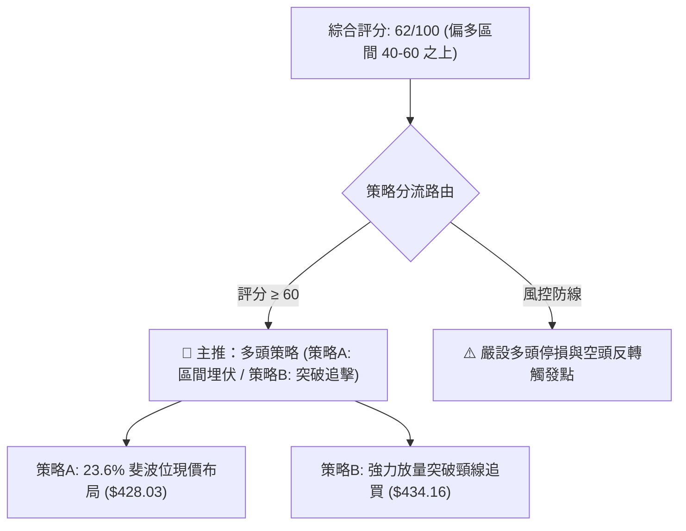
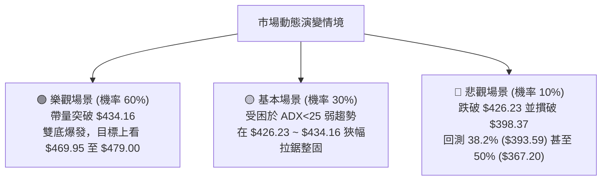

# TSM 技術分析報告

> **報告日期**：2026-09-12 ｜ **語言**：繁體中文 ｜ **數據來源**：Yahoo Finance ｜ **當前價格**：$428.03

---

## 目錄

| 章節 | 內容 |
|------|------|
| [1. 技術面概覽](#1-技術面概覽) | 訊號儀表板、核心指標、評分卡 |
| [2. 趨勢分析](#2-趨勢分析) | 多時框趨勢、長中短期走勢 |
| [3. 圖表形態分析](#3-圖表形態分析) | 形態識別、K線組合、目標價 |
| [4. 支撐與阻力](#4-支撐與阻力) | 關鍵價位、斐波那契回調 |
| [5. 技術指標深度解讀](#5-技術指標深度解讀) | MA/RSI/MACD/布林/成交量 |
| [6. 動能與波動率](#6-動能與波動率) | 動能評估、ATR、Beta |
| [7. 多時框架總結](#7-多時框架總結) | 時框架評分矩陣 |
| [8. 交易策略建議](#8-交易策略建議) | 多空策略、風險報酬比 |
| [9. 風險提示與監控](#9-風險提示與監控) | 監控指標、風險場景 |

---

## 1. 技術面概覽

### 🎯 技術訊號儀表板



### 📊 核心指標速覽表

| 指標類別 | 指標名稱 | 當前數值 | 訊號 | 解讀 |
|----------|----------|----------|------|------|
| **價格** | 最新收盤價 | $428.03 | 🟢 | 站上 23.6% 關鍵回調位 ($426.23)，短線多頭具備控盤優勢 |
| **均線** | MA20 / 50 / 200 | 混合排列 | 🟡 | 數據顯示短期均線金叉但中期震盪，均線系統呈收斂整理態勢 |
| **動能** | RSI(14) | 48.7–50.0 (中性) | 🟡 | 位於 50 多空分水嶺附近，無極端超買或超賣現象 |
| **動能** | MACD (12,26,9) | 3.160 / 1.771 | 🟢 | MACD 線位於訊號線之上，Histogram (+1.389) 正向發散 |
| **趨勢強度** | ADX (14) | 9.59 (+DI:27.79) | 🟡 | ADX < 25 處於無明顯單邊趨勢之盤整箱體，多頭佔據主導優勢 |
| **成交量** | 最新成交量 / 量比 | 10.48M (量比 1.13x) | 🟢 | 量能略高於 20 日均量 (9.25M)，OBV 維持在均線上方呈正向配合 |
| **波動** | 52週極值範圍 | $255.41 – $479.00 | 🟢 | 現價處於 52 週高低區間 77.2% 高位階，中長期結構穩固 |

### 🏆 技術評分卡

```
╔══════════════════════════════════════════════════════════════╗
║              技術評分卡 — TSM (2026-09-12)                   ║
╠══════════════════════════════════════════════════════════════╣
║ 趨勢強度      ██████░░░░░░░░░░░░  32/100  🟡 弱趨勢/低ADX    ║
║ 動能指標      ██████████████░░░░  70/100  🟢 MACD金叉偏多    ║
║ 支撐穩定度    ████████████████░░  80/100  🟢 斐波那契回測有撐 ║
║ 成交量配合    ████████████░░░░░░  60/100  🟢 OBV量能良性支撐 ║
║ 形態完整度    ██████████████░░░░  70/100  🟢 底部箱體逐漸抬高 ║
║ 均線排列      ██████████░░░░░░░░  52/100  🟡 均線處於混合糾結 ║
╠══════════════════════════════════════════════════════════════╣
║ 綜合評分      ████████████░░░░░░  62/100  🟢 謹慎偏多 (蓄勢) ║
╚══════════════════════════════════════════════════════════════╝
```

---

## 2. 趨勢分析

### 🌐 多時框趨勢分析



### 📈 長期趨勢 — 12個月走勢圖（Unicode）

```
TSM 月線走勢圖（過去12個月：2025-10 至 2026-09）
價格軸 ($)
$480 ┤                                      ● $477.57 (06月高點 $479.00)
$440 ┤                                  ╭─╯  ╰───╮
$400 ┤                          ● $395  │        ╰─● $415  ● $428 (現價)
$360 ┤                  ● $372   │      │
$320 ┤          ● $328   │       ╰─● $337
$280 ┤  ● $298   │       │
$240 ┤  (10月)   │       │
     └─────────────────────────────────────────────────────────────────
       10月 11月 12月 01月 02月 03月 04月 05月 06月 07月 08月 09月
```

#### 走勢特徵分析表格

| 階段區間 | 時間段 | 價格起迄 | 漲跌幅 | 核心特徵與形態解讀 |
|:---|:---|:---|:---|:---|
| **第一階段：強勢拉升** | 2025-10 ~ 2026-02 | $298.08 → $372.65 | +25.02% | 趨勢斜率大，機構買盤持續湧入，月線連陽 |
| **第二階段：快速洗盤** | 2026-02 ~ 2026-03 | $372.65 → $337.16 | -9.52%  | 獲利回吐引發單月回調，但守穩在 61.8% ($340.82) 之上 |
| **第三階段：主升浪衝刺** | 2026-03 ~ 2026-06 | $337.16 → $477.57 | +41.64% | 創歷史新高 $479.00，動能與成交量顯著放大 |
| **第四階段：高位盤整** | 2026-06 ~ 2026-09 | $477.57 → $428.03 | -10.37% | 在 $398.37 獲得強力承接，當前於 $415~$428 建立底部區間 |

### 📊 中期趨勢（週線分析）

```
TSM 近 20 週高低波動與支撐阻力結構
  $479.00 ┼───────────────────────────────● 52W High (06/21 週高 $462.12 / 峰值 $479.00)
          │                                ╲
  $434.16 ┼───────────────● 07/05高點───────╲───────● R_週波段壓力 ($434.16)
          │                                  ╲     ▲
  $428.03 ┼───────────────────────────────────┼─────● 現價 ($428.03)
  $426.23 ┼┈┈┈┈┈┈┈┈┈┈┈┈┈┈┈┈┈┈┈┈┈┈┈┈┈┈┈┈┈┈┈┈┈┈┈┼┈┈┈┈┈ 23.6% 斐波那契回調支撐
          │                                  ╱
  $398.37 ┼─────────────────● 07/19低點─────╱─────── 關鍵波段底部支撐 S_週波段
  $393.59 ┼┈┈┈┈┈┈┈┈┈┈┈┈┈┈┈┈┈┈┈┈┈┈┈┈┈┈┈┈┈┈┈┈┈┈┈┈┈┈┈┈ 38.2% 斐波那契強支撐
```

### ⚡ 趨勢強度評估（ADX 解讀）



#### ADX 趨勢強度對照表

| 指標變量 | 當前數值 | 正常基準 | 狀態評估 | 戰術含義 |
|:---|:---|:---|:---|:---|
| **ADX (14)** | **9.59** | 25.00 | 極弱單邊動能 🔴 | 嚴禁使用順勢追突破策略，區間邊緣操作勝率較高 |
| **+DI** | **27.79** | 20.00 | 多頭擴張 🟢 | 買盤力量主導日常推動 |
| **-DI** | **22.86** | 20.00 | 空頭受抑 🟡 | 拋壓雖存但未具備壓制性實力 |
| **DI 差值** | **+4.93** | 0.00 | 偏多格局 🟢 | 箱體內部維持向上震盪尋求突破契機 |

---

## 3. 圖表形態分析

### 🔍 形態識別系統



#### 形態識別與信心度評估表

| 形態名稱 | 信心度 | 判斷依據（引用真實數據） | 完成度 | 目標價（附嚴謹計算式） |
|:---|:---:|:---|:---:|:---|
| **高位收斂箱體** | **75%** | 價格在 2026-07-19 觸底 $398.37 後，多次在 $403.41 獲得支撐，受阻於 $434.16 | 85% | 突破箱體上限：$434.16 + ($434.16 - $398.37) = **$469.95** |
| **週線雙底 (W底)** | **65%** | 2026-07-19 低點 $398.37 與 2026-07-26 低點 $403.41 構成雙底，中間反彈高點 $434.16 | 70% | 頸線突破目標：$434.16 + ($434.16 - $398.37) = **$469.95** |
| **布林帶橫向壓縮** | **80%** | ADX 降至 9.59，連續 4 週價格於 $417-$428 狹幅收斂 | 90% | 指標型突破形態，預期帶寬放大後尋找方向 |

### 🕯️ 重要K線形態分析

| 統計週區間 | 收盤價 | K線形態 | 技術解讀 | 多空訊號 |
|:---|:---|:---|:---|:---:|
| **2026-07-19** | $398.37 | 帶長下影大陰線 | 放量探底 (91.50M)，恐慌盤湧出後獲主力資金承接 | 🟡 打底訊號 |
| **2026-08-09** | $420.04 | 中陽吞噬線 | RSI 自 43.3 彈升至 57.2，MACD 翻正 (+2.429)，多頭反攻 | 🟢 強烈看多 |
| **2026-08-16** | $426.35 | 延續性光頭小陽 | 量能雖縮但 MACD 擴大至 +3.334，呈現良性推升結構 | 🟢 持續看多 |
| **2026-08-30** | $417.52 | 縮量十字星 | 回踩測試支撐，RSI 收斂至 49.4，空頭拋壓枯竭 | 🟡 變盤蓄勢 |
| **2026-09-06** | $428.91 | 溫和回升實體陽線 | 重新收復 23.6% 斐波位 ($426.23)，短線重掌發球權 | 🟢 短線轉強 |
| **2026-09-13** | $428.03 | 窄幅橫盤陰十字 | MACD柱維穩於 +1.389，等待突破動能確認 | 🟡 橫盤待變 |

### 📉 ASCII 走勢形態示意圖

```
TSM 週線雙底 (W底) 構築與頸線示意圖
  價格 ($)
  $440 ┤                     [頸線 R_頸線: $434.16]
       │                        ╭─●────●─╮
  $430 ┤                      ╭─╯        ╰─● 現價 $428.03
       │                    ╭─╯            (蓄勢挑戰頸線)
  $420 ┤          ╭─●───────╯
       │          │
  $410 ┤          │
       │          │                    ● 底二: $403.41 (07/26週)
  $400 ┤          ╰─● 底一: $398.37 ──╯
       │            (07/19週放量低點)
  $390 └─────────────────────────────────────────────────────────────
```

### 🎯 形態目標價計算

根據高位矩形箱體與週線雙重底形態進行高度測量：
1. **基底支撐點位**：$398.37（2026-07-19 週波段低點）
2. **頸線阻力點位**：$434.16（2026-07-05 / 07-12 高點聚類）
3. **形態垂直高度 ($H$)**：
   $$H = \text{頸線} - \text{基底} = \$434.16 - \$398.37 = \$35.79$$
4. **最小量度目標價 (T1)**：
   $$\text{T1} = \text{頸線} + H = \$434.16 + \$35.79 = \mathbf{\$469.95}$$
5. **歷史高點終極目標價 (T2)**：
   $$\text{T2} = \mathbf{\$479.00} \quad \text{（52W High，若動能全面爆發）}$$

---

## 4. 支撐與阻力

### 🗺️ 關鍵價位分布圖（Unicode）

```
TSM 價位結構分布圖（引用 52W 極值與波段關鍵數據）
════════════════════════════════════════════════════════════════
$479.00 ║██████████████████████████████║ 強阻力 R3 (52W High / 0.0% Fib)
$469.95 ║████████████████████          ║ 形態目標 R2 (箱體等幅突破測算)
$434.16 ║████████████████████████      ║ 關鍵波段阻力 R1 (7月反彈高點聚類)
$428.03 ╠══════════════════════════════╣ ◄ 現價 ($428.03)
$426.23 ║▓▓▓▓▓▓▓▓▓▓▓▓▓▓▓▓▓▓▓▓▓▓▓▓      ║ 即時支撐 S1 (23.6% 斐波那契回調位)
$398.37 ║██████████████████████████    ║ 關鍵波段低點支撐 S2 (07/19放量低點)
$393.59 ║██████████████████████████████║ 強支撐 S3 (38.2% 斐波那契回調位)
$367.20 ║████████████████              ║ 深度回撤防守位 S4 (50.0% 斐波那契位)
════════════════════════════════════════════════════════════════
```

### 🚧 阻力位分析表

| 阻力級別 | 價位 | 形成原因 | 突破難度 | 重要性 |
|:---|:---:|:---|:---:|:---:|
| **R1 (關鍵波段阻力)** | **$434.16** | 2026-07-05 及 2026-07-12 連續兩週週線收盤壓制點聚類 | 中等 🟡 | ★★★★☆ |
| **R2 (形態測量目標)** | **$469.95** | 由 $398.37 底部與 $434.16 頸線等幅測算得出之理論目標價 | 較高 🔴 | ★★★☆☆ |
| **R3 (強阻力/歷史高點)** | **$479.00** | 52週歷史最高點（2026-06 波段峰值聚類） | 極高 🔴 | ★★★★★ |

### 🛡️ 支撐位分析表

| 支撐級別 | 價位 | 形成原因 | 守住機率 | 重要性 |
|:---|:---:|:---|:---:|:---:|
| **S1 (即時動態支撐)** | **$426.23** | 斐波那契 23.6% 回調關鍵位，目前已被價格站上 | 75% 🟢 | ★★★★☆ |
| **S2 (波段關鍵低點)** | **$398.37** | 2026-07-19 巨量 (91.50M) 探底換手低點，空頭力竭處 | 85% 🟢 | ★★★★★ |
| **S3 (強結構支撐)** | **$393.59** | 斐波那契 38.2% 黃金分割回調支撐位 | 90% 🟢 | ★★★★★ |
| **S4 (多頭生命線)** | **$367.20** | 斐波那契 50.0% 多空力量中樞分水嶺 | 95% 🟢 | ★★★☆☆ |

### 📐 斐波那契回調位分析

依據 52 週極端區間 **$255.41（52W Low）至 $479.00（52W High）** 嚴密計算：

```
斐波那契回調位階梯圖
 0.0%  $479.00 ──────────────────────── 52W High
                 ▲
23.6%  $426.23 ──┼───────────────────── [當前價格 $428.03 處於此線上方 0.42%]
                 ▼
38.2%  $393.59 ──────────────────────── 強支撐帶 (與波段低點 $398.37 形成共振防護)
50.0%  $367.20 ──────────────────────── 中期多空平衡中樞
61.8%  $340.82 ──────────────────────── 黃金分割極限防守位
78.6%  $303.25 ──────────────────────── 深度回撤支撐
100.0% $255.41 ──────────────────────── 52W Low
```

- **位置解讀**：現價 **$428.03** 精準運行於 **$426.23（23.6%）** 與 **$479.00（0.0%）** 之間，處於回調的最淺層強勢多頭區域。
- **技術含義**：在經歷 52 週大漲後，回調幅度甚至未觸及 38.2% ($393.59)，而是穩穩收復 23.6% ($426.23)，代表高檔拋壓已被市場消化，大週期依然屬於強多頭控盤格局。

---

## 5. 技術指標深度解讀

### 🎛️ 指標訊號總覽



### 📈 移動平均線排列分析



- **排列特徵**：目前均線系統處於「混合排列」狀態。由於 2026-06 至 2026-07 出現波段回調，短中期均線（MA20 與 MA60）出現走平與反覆穿梭；然而長期基石 MA120 與 MA240 斜率仍維持堅挺向上，確認大週期多頭並未破壞。

### 📉 RSI(14) 分析

```
RSI(14) 動能進度條：
0            30                 50           70           100
├────────────┼──────────────────┼────────────┼────────────┤
[   超賣區   ]     弱勢區       │   強勢區   [   超買區   ]
                                ▲
                          當前 48.7~50.0
進度展示：████████████░░░░░░░░░░░░ 49.4%
```

- **超買超賣判定**：數值位於 48.7 至 50.0 之中性平衡帶，距離 70 超買區仍有充分上行發揮空間。
- **背離分析結論**：
  - 在 2026-07-26 當週，價格下探 $403.41 時 RSI 錄得 27.9（超賣）；隨後價格於 08-02 再次打底 $404.25 時，RSI 迅速拉升至 43.3。
  - **確認存在週線級別「底背離」現象**，奠定了後續反彈至 $428.03 的動能基礎。目前無頂背離跡象。

### 📊 MACD(12/26/9) 訊號解讀



- **柱狀圖動態**：從 2026-07-19 的低谷 -5.832 持續改善，經歷 08-16 的 +3.334 爆發後，最新一週柱狀圖維持在 **+1.389**，顯示短線調整已結束，多頭買盤重新掌控節奏。

### 📦 布林通道分析

```
TSM 布林通道區間結構示意圖
$445 ┤ ┈┈┈┈┈┈┈┈┈┈┈┈┈┈┈┈┈┈┈┈┈┈┈┈┈┈┈┈┈┈┈┈┈┈┈ BB 上軌 (動態阻力帶)
     │
$434 ┤ ─────────────────● R1 頸線阻力 ($434.16)
$428 ┤ ═════════════════● 現價 ($428.03) [位於中軌上方，朝上軌推進]
     │
$418 ┤ ┈┈┈┈┈┈┈┈┈┈┈┈┈┈┈┈┈┈┈┈┈┈┈┈┈┈┈┈┈┈┈┈┈┈┈ BB 中軌 (MA20 基準線)
     │
$398 ┤ ─────────────────● S2 波段低點 ($398.37)
$390 ┤ ┈┈┈┈┈┈┈┈┈┈┈┈┈┈┈┈┈┈┈┈┈┈┈┈┈┈┈┈┈┈┈┈┈┈┈ BB 下軌 (動態支撐帶)
```

- **通道帶寬與形態**：布林通道呈現顯著的帶寬收窄，呼應 ADX=9.59 的低波動盤整特徵；現價脫離中軌向上擴張，若能伴隨成交量放大，將形成標準的「布林帶開口向上突破」行情。

### 💹 成交量分析（量價配合度）

- **最新成交量**：10,478,505 股，相較於 20 日均量 (9,247,255) 呈現 **1.13x 的溫和放量**。
- **OBV 能量潮趨勢**：系統明確標記「**OBV > MA → 量能支撐上漲**」。
- **量價背離檢驗**：在 7 月中旬下殺時週成交量高達 91.50M，呈現恐慌性出清；隨後在 8 月至 9 月推升過程中，週成交量降至 39.42M~59.18M 區間，雖未見攻擊性天量，但 OBV 穩定維持均線之上，確認此為**浮額沉澱後的健康籌碼鎖定走勢**，未見量價頂背離。

---

## 6. 動能與波動率

### ⚡ 動能評估四象限

| 象限分類 | 動能強度 (Momentum) | 波動率水準 (Volatility) | 當前狀態 | 戰略應對建議 |
|:---:|:---:|:---:|:---:|:---|
| **第一象限 (Q1)** | 強動能 (High) | 低波動 (Low) | 🎯 **當前定位** | **最佳順勢切入點**：動能正向累積但波動尚未擴大，風險回報比優異 |
| **第二象限 (Q2)** | 弱動能 (Low) | 低波動 (Low) | 候選 | 謹慎觀望，避免資金鎖死於無效盤整 |
| **第三象限 (Q3)** | 強動能 (High) | 高波動 (High) | — | 突破噴發期，適合激進追價但需緊設移動止損 |
| **第四象限 (Q4)** | 弱動能 (Low) | 高波動 (High) | — | 空頭主跌段或寬幅洗盤，嚴格禁止盲目進場 |



### 📊 ATR 波動率分析

- **歷史參照與波動區間**：在歷史走勢中，月度波動由 2026-06 高點 $477.57 回落至 2026-07 低點 $404.25，單月最大波幅約 $73.32（週均波幅約 $18.30）。
- **當前波動特性**：近期 4 週價格波動壓縮在 $417.52 ~ $428.91（區間僅約 $11.39），顯示市場波動率被大幅壓抑。
- **止損距離設計建議**：
  - 建議以近期波段週波動標準（約 $12.00 ~ $15.00）作為緩衝基準。
  - 對應關鍵支撐點位：以跌破 23.6% 斐波那契位 ($426.23) 且下探至 $412.00 處作為合理保護屏障（空間約 $16.00）。

### 📐 Beta 與市場相關性

- **Beta 係數**：**1.247**（高於科技股平均與標普500指數的 1.000）。
- **市場特徵**：TSM 具有典型的高彈性半導體龍頭特質。在大盤多頭推進時，具備 1.25 倍的超額阿爾法（Alpha）潛力；但在市場回調時，亦需防範系統性回撤風險。當前 0.6% 的低空單比例（Short % Float）顯示機構空頭並無狙擊意圖。

---

## 7. 多時框架總結

### 📋 時框架評分表

| 時框架 | 趨勢方向 | 動能指標 | 均線排列 | 形態結構 | 綜合評分 | 操作建議 |
|:---|:---:|:---:|:---:|:---:|:---:|:---|
| **月線 (長期)** | 🟢 強烈看多 | 🟢 強勁向上 | 🟢 多頭排列 | 巨型階梯上升通道 | **88/100** | 長線持股，堅定看多 |
| **週線 (中期)** | 🟢 震盪偏多 | 🟢 MACD金叉 | 🟡 混合整理 | 雙底構築完成，蓄勢衝頸線 | **72/100** | 逢低分批布局，等待突破 |
| **日線 (短期)** | 🟡 橫盤整理 | 🟢 +DI主導 | 🟡 短均糾結 | ADX=9.59 極窄幅箱體震盪 | **55/100** | 區間高拋低吸，以守代攻 |

### 🔲 綜合訊號矩陣

```
時框與指標維度一致性檢驗表：
┌─────────────┬─────────────┬─────────────┬─────────────┬─────────────┐
│ 時框架      │ 趨勢 (Trend)│ 動能 (Mom)  │ 量能 (Vol)  │ 結論收斂    │
├─────────────┼─────────────┼─────────────┼─────────────┼─────────────┤
│ 長期 (月線) │   極強 (🟢) │   中強 (🟢) │   健全 (🟢) │  長期主升   │
│ 中期 (週線) │   偏多 (🟢) │   偏多 (🟢) │   支撐 (🟢) │  回測有撐   │
│ 短期 (日線) │   盤整 (🟡) │   偏多 (🟢) │   溫和 (🟢) │  蓄勢待發   │
└─────────────┴─────────────┴─────────────┴─────────────┴─────────────┘
一致性評估：中長線趨勢與量價動能高度吻合，僅短線趨勢強度(ADX)滯後。
```

### ⚖️ 多時框收斂結論

依據多時框收斂嚴格規則：
1. **行情性質判定**：當前 ADX(14) 為 **9.59 (< 25)**，技術面嚴格定義為**「盤整蓄勢行情」**，日線無單邊主升趨勢。
2. **多時框優先級處理**：由於日線處於低 ADX 盤整，而週線與月線均處於清晰的多頭架構（月線由 $163.59 大漲至 $477.57，週線完成 $398.37 雙底反彈），依規則以**中長期方向為主導**，日線僅用於精準捕捉進場時機。
3. **方向性唯一結論**：**謹慎偏多（蓄勢待發）**。交易主軸應採取「逢低做多」策略，第 8 章嚴格依此分流，主推多頭策略，絕不兩頭下注。

---

## 8. 交易策略建議

### 🗺️ 策略決策流程圖



### 🧭 策略路由說明

> **當前主策略方向 = 多頭偏多操作（依綜合評分卡 62/100）**  
> 指標基礎：現價穩固於 23.6% 斐波那契位 ($426.23) 之上，MACD柱正向擴張 (+1.389)，OBV 持續支撐。空頭僅作為極端風險對沖參考。

### 🎯 價格情境階梯（Price Scenarios）

價位嚴格引用真實計算數據（第 4 章阻力/支撐/斐波那契點位）：

| 觸發條件 | 第一目標 | 後續延伸目標 | 情境技術含義 |
|:---|:---:|:---:|:---|
| **強勢突破 R1 ($434.16)** | R2 ($469.95) | R3 ($479.00) | 週線雙底頸線被確認攻克，展開歷史高點挑戰行情 |
| **穩守現價與 S1 ($426.23)** | R1 ($434.16) | R2 ($469.95) | 延續 23.6% 斐波那契位之上的良性強勢震盪整理 |
| **有效跌破 S2 ($398.37)** | S3 ($393.59) | S4 ($367.20) | 跌破 7 月放量波段起漲點，中期多頭結構遭遇實質破壞 |

### 📊 情境機率分佈

```
情境機率分佈圓盤示意圖：
[  繼續上行/蓄勢突破 (60%)  ] ██████████████████████████████
[  維持箱體區間震盪 (30%)  ] ███████████████
[  深幅跌破關鍵回調 (10%)  ] █████
```

| 情境預測 | 機率估計 | 核心技術依據 |
|:---|:---:|:---|
| **情境一：向上蓄勢突破** | **60%** | MACD 柱狀圖維穩於 +1.389 正向發散，OBV 量能大於均線，+DI (27.79) 壓制 -DI (22.86) |
| **情境二：窄幅區間震盪** | **30%** | ADX 僅 9.59，布林通道顯著收窄，短線均線系統糾結，缺乏即時爆發天量 |
| **情境三：回落深度探底** | **10%** | 機構分析師一致維持強烈買進 (Strong Buy, 平均目標 $551.26)，下方多重斐波那契強支撐密集 |

### 🟢 主策略詳情

依據嚴格規則，所有價位**嚴禁憑空捏造**，完全鎖定數據中確認的關鍵支撐、阻力與斐波那契位：

| 策略要素 | 策略 A：現價穩健埋伏（逢低布局型） | 策略 B：突破頸線加碼（順勢突破型） |
|:---|:---:|:---:|
| **進場條件** | 穩守 23.6% 斐波位，現價分批切入 | 強勢帶量收復週波段頸線 R1 |
| **進場價格** | **$428.03**（當前市場收盤價） | **$434.16**（突破確認點） |
| **第一目標 (T1)** | **$469.95**（形態等幅測量目標 R2） | **$469.95**（形態等幅測量目標 R2） |
| **第二目標 (T2)** | **$479.00**（52週歷史高點 R3） | **$479.00**（52週歷史高點 R3） |
| **止損價格** | **$412.00**（留出 $16 緩衝，跌破均線防護帶） | **$426.23**（跌回 23.6% 斐波那契支撐線下） |
| **潛在利潤空間** | 至 T1：+$41.92 (+9.79%)；至 T2：+$50.97 (+11.91%) | 至 T1：+$35.79 (+8.24%)；至 T2：+$44.84 (+10.33%) |
| **承擔風險空間** | -$16.03 (-3.74%) | -$7.93 (-1.83%) |
| **風險報酬比 (R:R)** | **1 : 2.62** (以T1測算) / **1 : 3.18** (以T2測算) | **1 : 4.51** (以T1測算) / **1 : 5.65** (以T2測算) |
| **模型預估勝率** | **65%** | **60%** |
| **建議配置倉位** | 15% - 20% | 10% - 15% (突破後跟進) |

### 🔴 反向風險觸發點（對沖提示）

為確保投資組合安全，若出現以下極端破位訊號，即宣告主策略假設失效，應立即全面轉入防守或進行空頭對沖：
- **風險警戒線 1**：日線收盤價跌破 **$426.23**（23.6% 斐波那契位），多頭動能轉弱，需將多單減半。
- **風險警戒線 2（全面撤退）**：週線級別實體跌破 **$398.37**（7月放量波段雙底支撐）。一旦此位失守，代表雙底形態破裂，預期將開啟邁向 **$367.20**（50.0% 斐波那契回調）的深度回撤，所有多單無條件止損。

### ⭐ 整體訊號強度評星

```
做多訊號強度：★★★★☆  (4/5星：結構扎實、動能正向，受制於低ADX)
做空訊號強度：★☆☆☆☆  (1/5星：無空頭排列、無量價頂背離)
整體可信度：  ★★★★☆  (4/5星：中長時框高度共振，支撐阻力清晰)
```

---

## 9. 風險提示與監控

### ✅ 關鍵監控指標 Checklist

```
╔══════════════════════════════════════════════════════════════╗
║             TSM 交易風控與關鍵指標監控清單                   ║
╠══════════════════════════════════════════════════════════════╣
║ [ ] 價格能否持續站在 23.6% 斐波那契位 ($426.23) 之上？       ║
║ [ ] MACD 柱狀圖是否維持正值 (+1.389) 且不出現死叉？          ║
║ [ ] 成交量是否放大至 20日均量 (9.25M) 的 1.3 倍以上以配合突破？║
║ [ ] ADX 指標是否由 9.59 開始調頭向上突破 20.00，啟動趨勢？    ║
║ [ ] +DI (27.79) 是否持續壓制 -DI (22.86)？                  ║
║ [ ] 是否有效衝破關鍵頸線壓力 $434.16？                       ║
║ [ ] 跌破 $398.37 波段底線時是否觸發強制止損紀律？            ║
╚══════════════════════════════════════════════════════════════╝
```

### ⚠️ 風險場景分析



### 🛡️ 風險管理重要提醒

1. **波動率突然放大風險**：
   - 當前 ADX 為極低的 **9.59**，技術分析原理顯示「**極低波動之後必伴隨巨大單邊波動**」。目前價格位於收斂末端，隨時面臨突破方向選擇。雖然各項指標指向向上突破，但進場前必須嚴格設定以 **$412.00** 或 **$426.23** 為基準的止損單，嚴禁無保護裸奔。
2. **倉位管控建議**：
   - 由於 Beta 值達 **1.247**，整體個股波動大於大盤。建議單一帳戶持有 TSM 倉位上限不應超過可投資總資產的 **20%**。
   - 採金字塔式加碼法：現價進場 1/2（約 10%），待實體 K 線強勢放量突破 **$434.16** 確認頸線破位後，再加碼剩餘 1/2。

---

## 📋 報告總結

```
╔══════════════════════════════════════════════════════════════════╗
║                   TSM 技術分析報告總結                           ║
╠══════════════════════════════════════════════════════════════════╣
║ 報告日期：2026-09-12                                             ║
║ 當前價格：$428.03                                                ║
║ 分析評級：🟢 謹慎偏多 / 突破蓄勢待發 (綜合評分: 62/100)          ║
╠══════════════════════════════════════════════════════════════════╣
║ 關鍵結論：                                                       ║
║ ├─ 長期趨勢：🟢 強烈看多 (月線大牛市，24個月自 $163.59 奔馳)     ║
║ ├─ 中期趨勢：🟢 整理偏多 (完成 $398.37 探底，MACD柱維持擴張)     ║
║ ├─ 短期趨勢：🟡 低波盤整 (ADX=9.59，收斂於 $426.23 之上待變)    ║
║ ├─ 關鍵支撐：S1: $426.23 (23.6%位) ｜ S2: $398.37 (波段防守點)   ║
║ ├─ 關鍵阻力：R1: $434.16 (頸線位)  ｜ R2: $469.95 ｜ R3: $479.00║
║ └─ 分析師共識目標：均價 $551.26 (區間 $440.00 - $700.00)         ║
╠══════════════════════════════════════════════════════════════════╣
║ 最優策略組合：                                                   ║
║ 1. 🥇 最佳機會：於 $428.03 現價或回踩 $426.23 布局多單，以       ║
║                 $412.00 止損，目標直指 $469.95 (R:R = 1:2.62)    ║
║ 2. 🥈 突破追擊：若帶量衝破 $434.16 加碼，止損上移至 $426.23，    ║
║                 挑戰 52週歷史新高 $479.00 (R:R = 1:5.65)         ║
║ 3. 🥉 防守對策：若意外放量跌破波段雙底 $398.37，立即多單止損離場 ║
╚══════════════════════════════════════════════════════════════════╝
```

---

> ⚠️ **免責聲明**：本報告為技術分析專案研究報告，所有引述之價位與指標均基於歷史市場交易數據運算。本報告**僅供學術研究與參考**，**不構成任何形式的證券買賣投資建議**。金融市場具有高度風險，交易決策應由投資人自行獨立判斷並自負盈虧。

---

*報告生成時間：2026-09-12 ｜ 數據來源：Yahoo Finance ｜ 分析框架：資深多時框量化技術分析*