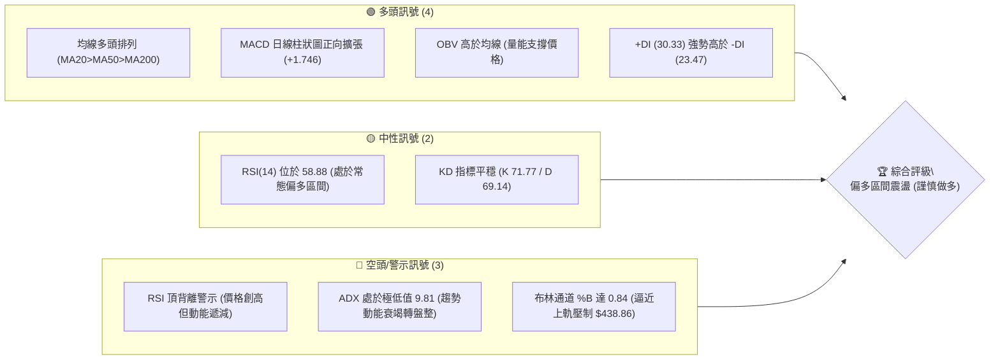
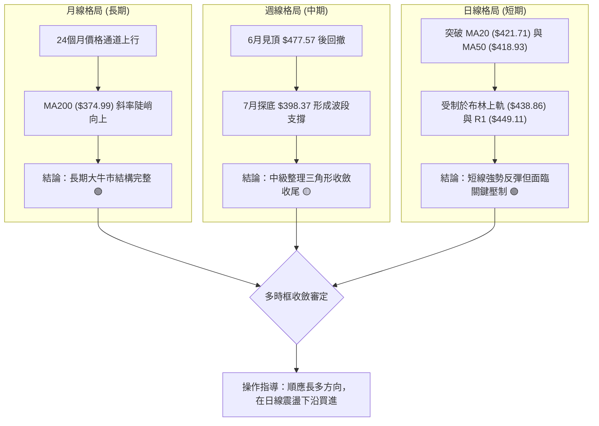
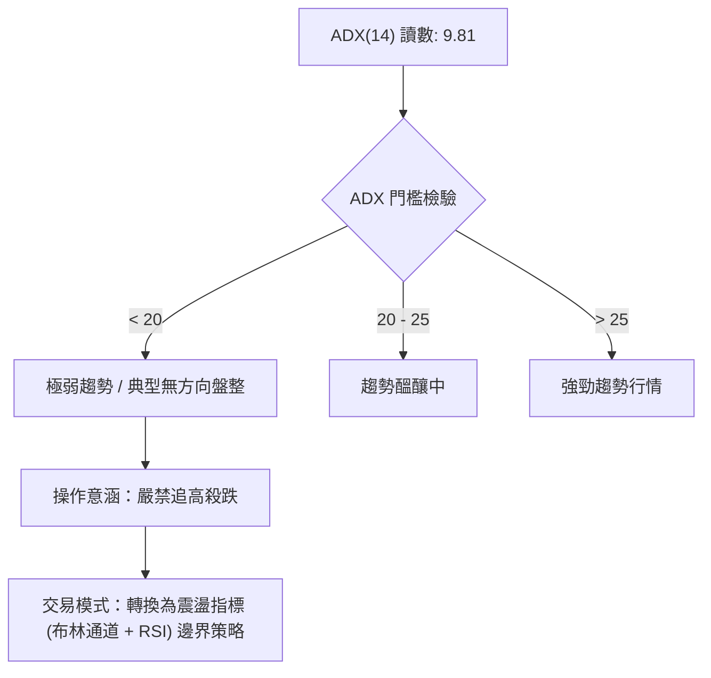
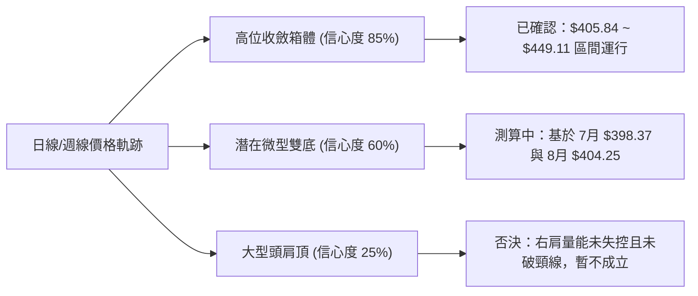
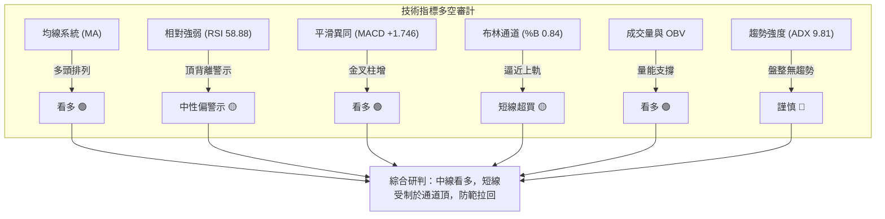
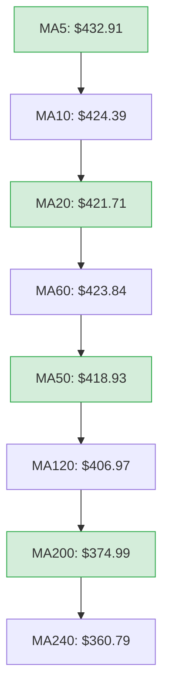
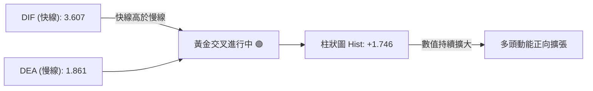
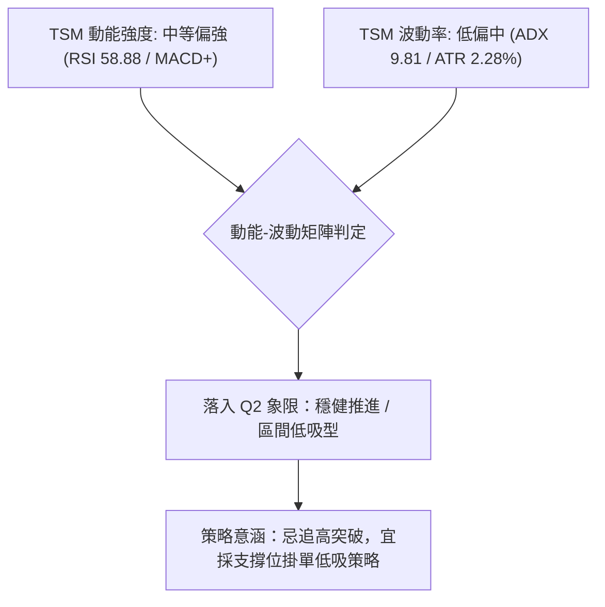
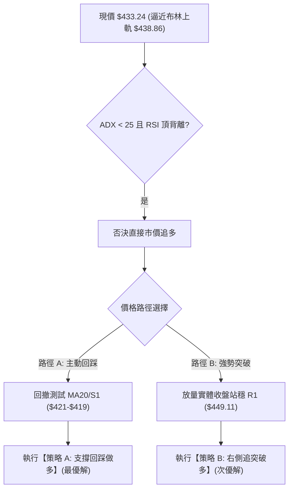
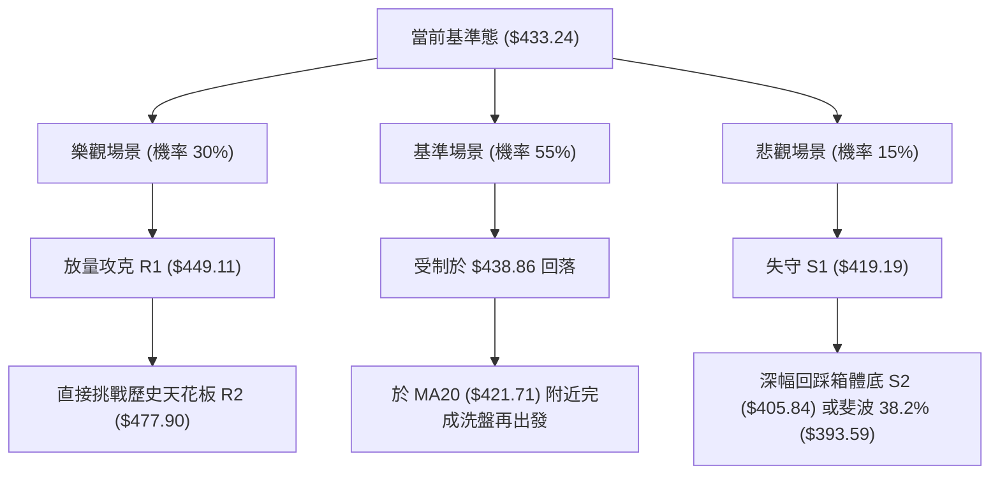

# TSM 技術分析報告

> **報告日期**：2026-09-14 ｜ **語言**：繁體中文 ｜ **數據來源**：Yahoo Finance ｜ **當前價格**：$433.24

---

## 目錄

| 章節 | 內容 |
|------|------|
| [1. 技術面概覽](#1-技術面概覽) | 訊號儀表板、核心指標、評分卡 |
| [2. 趨勢分析](#2-趨勢分析) | 多時框趨勢、長中短期走勢、ADX解讀 |
| [3. 圖表形態分析](#3-圖表形態分析) | 形態識別、信心度評估、目標價計算 |
| [4. 支撐與阻力](#4-支撐與阻力) | 關鍵價位、斐波那契回調結構 |
| [5. 技術指標深度解讀](#5-技術指標深度解讀) | MA/RSI/MACD/布林/量價關係 |
| [6. 動能與波動率](#6-動能與波動率) | 動能矩陣、ATR風控、Beta解讀 |
| [7. 多時框架總結](#7-多時框架總結) | 時框架評分矩陣、多時框收斂 |
| [8. 交易策略建議](#8-交易策略建議) | 策略路由、主策略、情境階梯 |
| [9. 風險提示與監控](#9-風險提示與監控) | 監控Checklist、三情境壓力測試 |
| [10. 報告總結](#-報告總結) | 總結儀表板、核心架構與免責宣告 |

---

## 1. 技術面概覽

### 🎯 技術訊號儀表板



### 📊 核心指標速覽表

| 指標類別 | 指標名稱 | 當前數值 | 訊號 | 解讀 |
|----------|----------|----------|------|------|
| **價格** | 當前價格 | $433.24 | 🟢 | 站穩中短期所有均線，處於 52 週波段高位區間（79.5%） |
| **均線** | MA20 | $421.71 | 🟢 | 價格在 MA20 上方 +2.73%，短線動能支撐強勁 |
| **均線** | MA50 | $418.93 | 🟢 | 價格在 MA50 上方 +3.42%，中期趨勢維持多頭基調 |
| **均線** | MA200 | $374.99 | 🟢 | 價格在 MA200 上方 +15.53%，長期牛市格局穩固 |
| **動能** | RSI(14) | 58.88 | 🟡 | 位於中性偏強區間，但系統發出頂背離預警，上檔動能減速 |
| **動能** | MACD | 3.607 (柱 +1.746) | 🟢 | MACD 線高於訊號線 (1.861)，柱狀圖持續擴張，短多主導 |
| **動能** | Stoch %K/%D | 71.77 / 69.14 | 🟡 | 多方掌控但逼近 80 超買警戒線，短線進入震盪博弈 |
| **趨勢** | ADX(14) | 9.81 | 🔴 | ADX < 25 極弱趨勢，當前行情定性為強勢無趨勢之區間震盪 |
| **波動** | ATR(14) | $9.88 | 🟡 | 每日平均波幅佔股價 2.28%，波動度處於中等收斂階段 |
| **通道** | 布林帶 (%B) | 0.84 | 🟡 | 上軌 $438.86，中軌 $421.71，短線面臨上軌壓制 |
| **量能** | 成交量比 | 1.15x (10.63M vs 9.25M) | 🟢 | 溫和放量，OBV 處於均線上方，價量配合良好 |

### 🏆 技術評分卡

```
╔══════════════════════════════════════════════════════════════════╗
║               技術評分卡 — TSM (2026-09-14)                     ║
╠══════════════════════════════════════════════════════════════════╣
║ 趨勢強度 (ADX=9.81 盤整)    ██████░░░░░░░░░░░░░░  32/100   🔴 弱勢 ║
║ 動能指標 (MACD強/RSI背離)   ████████████░░░░░░░░  62/100   🟡 中性 ║
║ 支撐穩定度 (S1/MA疊加)      ████████████████░░░░  80/100   🟢 強固 ║
║ 成交量配合 (OBV創高/量增)   ██████████████░░░░░░  70/100   🟢 良好 ║
║ 形態完整度 (區間震盪整理)   ████████████░░░░░░░░  60/100   🟡 普通 ║
║ 均線排列 (全週期多頭排列)   ██████████████████░░  90/100   🟢 極佳 ║
╠══════════════════════════════════════════════════════════════════╣
║ 綜合評分                    █████████████░░░░░░░  66/100   🟢 偏多 ║
║ 綜合定性：中長多架構下的「低波動區間震盪」，以逢回低吸為主       ║
╚══════════════════════════════════════════════════════════════════╝
```

---

## 2. 趨勢分析

### 🌐 多時框趨勢分析



### 📈 長期趨勢 — 12個月走勢圖（ASCII）

過去 12 個月（2025-10 至 2026-09），TSM 從 $298 攀升至歷史高位 $479 附近，隨後在 $400–$479 構築高位箱體。

```
TSM 月線走勢圖（過去12個月：2025-10 至 2026-09）
價格軸 ($)
$480 ┤                                         ● (2026-06 $477.57 / 52W高 $479.00)
$460 ┤                                        / \
$440 ┤                                       /   \       ● (2026-09 $433.24 現價)
$420 ┤                             ●        /     \     /
$400 ┤                   ●        / \      /       ●---● (2026-07 $404.25 / 08 $415.32)
$380 ┤         ●        / \      /   \    /       (回測支撐)
$360 ┤        / \      /   \    /     \  /
$340 ┤       /   ●    /     \  /       \/
$320 ┤  ●   /   (03) /       \/
$300 ┤●--● (01)      (02)
     └─────────────────────────────────────────────────────────────
     10  11  12  01   02   03   04   05   06   07   08   09 (月份)
    (2025)      (2026)
```

#### 走勢特徵分析表格

| 階段區間 | 起止價格 | 漲跌幅 | 走勢特徵與量價解讀 |
|----------|----------|--------|--------------------|
| **主升段 1** (2025-10 ~ 2026-02) | $298.08 → $372.65 | +25.02% | 趨勢平穩向上，成交量溫和放大，均線呈現發散排列。 |
| **急劇洗盤** (2026-02 ~ 2026-03) | $372.65 → $337.16 | -9.52% | 短線獲利了結盤湧出，快速回測斐波那契 61.8% ($340.82) 成功止跌。 |
| **主升段 2** (2026-03 ~ 2026-06) | $337.16 → $477.57 | +41.64% | 暴力拉升行情，單月突破前高，最終觸及 52 週極值 $479.00。 |
| **高位箱體** (2026-06 ~ 2026-09) | $477.57 → $433.24 | -9.28% | 7月探底 $398.37（回測 S2 $405.84/MA120），目前處於右側震盪回升段。 |

### 📊 中期趨勢（週線分析）

從近 20 週數據觀察，價格在 2026-07-19 當週觸及低點 $398.37（爆量 91.49M），隨後量能萎縮至 39.57M。週線呈現「跌破反抽、下影線支撐、量縮整理」特徵。

```
週線格局示意圖：
阻力 R2: $477.90 ═════════════════════════════════════ (6月高點區域)
阻力 R1: $449.11 ------------------------------------- (波段反彈第一阻力)
現  價 : $433.24       ▲ 正在向上軌推進
支撐 S1: $419.19 ------------------------------------- (MA20/MA50 匯合防守點)
支撐 S2: $405.84 ═════════════════════════════════════ (7-8月築底平台)
```

### ⚡ 趨勢強度評估（ADX 解讀）



#### ADX 強度與方向指標矩陣

| 參數指標 | 數值 | 狀態定性 | 對交易的具體指導 |
|----------|------|----------|------------------|
| **ADX(14)** | 9.81 | 極弱趨勢 (<25) | 突破形態極易產生假突破，禁止使用單邊突破追單策略。 |
| **+DI (14)** | 30.33 | 多頭優勢 | 多方掌控盤面定價權，空方未構成實質擊潰。 |
| **-DI (14)** | 23.47 | 空方受壓 | 空方動能雖有反撲，但持續低於 +DI，回調空間有限。 |
| **DI 差值 (+DI - -DI)** | +6.86 | 偏多震盪 | 確立「以多頭思維對待回調，在區間下軌承接」的操作綱領。 |

---

## 3. 圖表形態分析

### 🔍 形態識別系統



#### 形態識別與信心度評估表

依規則 15，僅列出有實質數據支撐之幾何形態與指標形態：

| 形態類別 | 信心度 | 判斷依據（引用數據） | 完成度 | 目標價（附嚴格計算式） |
|----------|--------|----------------------|--------|------------------------|
| **高位箱體整理** | 85% | 頂部受制於 R1 $449.11，底部受 S2 $405.84/S1 $419.19 強烈承接 | 75% | 箱頂突破目標 = 阻力 R1 ($449.11)；若向上破位，下一目標為 R2 ($477.90) |
| **雙底形態 (W底)** | 60% | 第一底：2026-07-19 收盤 $398.37；第二底：2026-08-02 收盤 $404.25，頸線位於 08-16 收盤 $426.35 | 100% (已突破頸線) | 頸線 $426.35 + 形態高度 ($426.35 - $398.37 = $27.98) = **$454.33**（對應阻力 R1 $449.11 上方） |
| **均線收斂金叉** | 90% | MA5 ($432.91) > MA10 ($424.39) > MA20 ($421.71)，短天期均線全面多頭排列 | 100% | 指標型解讀：指向回測均線後推升，考驗布林上軌 $438.86 |

### 🕯️ 重要K線形態分析（近 5 個月月線走勢）

| 月份 | 收盤價 | K線形態 | 解讀 | 訊號 |
|------|--------|---------|------|------|
| **2026-05** | $417.47 | 中陽線 | 延續多頭攻勢，實體強勁上穿 $400 整數大關。 | 🟢 看多 |
| **2026-06** | $477.57 | 長上影大陽線 | 盤中刷新歷史高點 $479.00 後出現拋壓，顯現高檔出貨跡象。 | 🟡 警示 |
| **2026-07** | $404.25 | 長下影長陰線 | 單月重挫回測 120 日線，但長下影線確認 S2 ($405.84) 買盤雄厚。 | 🟢 止跌 |
| **2026-08** | $415.32 | 縮量十字星陽線 | 賣壓耗盡，空頭無力繼續下殺，多空在此形成短暫均衡。 | 🟡 築底 |
| **2026-09** | $433.24 | 溫和放量紅K (半月) | 多頭重啟攻勢，站上 MA20 與 MA50，確認右側反彈格局。 | 🟢 看多 |

### 📉 ASCII 走勢形態示意圖：雙底與箱體收斂結構

```
$480 ┤                                頂部阻力位 R2 ($477.90)
     │                                ┌───────┐
$450 ┤                                │       │       頸線破位延伸目標 ($454.33)
     │                                │       │       阻力位 R1 ($449.11)
$430 ┤--------------------------------+-------+-------[現價 $433.24]
     │                   頸線 ($426.35)  \     /
$410 ┤                  ┌───────────────┐ \   /
     │                  │               │  \ /
$400 ┤                  │               └───● 底2: $404.25 (2026-08)
     │                  └───● 底1: $398.37 (2026-07)
$380 ┤                      (爆量止跌)
     └─────────────────────────────────────────────────────────────
```

---

## 4. 支撐與阻力

### 🗺️ 關鍵價位分布圖（Unicode）

```
TSM 價位結構分布圖（嚴格錨定 OHLCV 計算值）
═══════════════════════════════════════════════════════════════
$479.00 ║██████████████████████████████║ 52週歷史高點 / 斐波 0.0%
$477.90 ║████████████████████████████░░║ 強阻力 R2（近一年波段高點聚類）
$449.11 ║████████████████████░░░░░░░░░░║ 關鍵阻力 R1（前波震盪平台頂）
$438.86 ║▓▓▓▓▓▓▓▓▓▓▓▓▓▓▓▓░░░░░░░░░░░░░░║ 動態阻力：布林通道上軌
$433.24 ╠══════════════════════════════╣ ◄ 當前價格
$426.23 ║▓▓▓▓▓▓▓▓▓▓▓▓▓▓▓▓▓▓▓▓░░░░░░░░░░║ 斐波那契 23.6% 回調位
$421.71 ║████████████████████████░░░░░░║ 密集支撐：MA20 / 布林中軌
$419.19 ║██████████████████████████░░░░║ 關鍵支撐 S1（波段低點聚類 / 疊加 MA50）
$405.84 ║████████████████████████████░░║ 強支撐 S2（近一年波段次低點聚類）
$385.09 ║██████████████████████████████║ 終極防線 S3（波段極限支撐）
═══════════════════════════════════════════════════════════════
```

### 🚧 阻力位分析表

所有價位均嚴格取自數據模組，無任何主觀編造：

| 阻力級別 | 價位 | 形成原因 | 突破難度 | 重要性 |
|----------|------|----------|----------|--------|
| **動態壓制** | $438.86 | 布林通道上軌，短期均值回歸的統計學上邊界 | 中等（需放量） | 🟡 次要（短線獲利點） |
| **阻力 R1** | $449.11 | 近一年波段高點聚類；6月重挫後的反抽受阻密集區（距現價 +3.66%） | 高（籌碼套牢區） | 🔴 極重要（波段分水嶺） |
| **阻力 R2** | $477.90 | 近一年波段極限高點聚類，逼近 52W 高點 $479.00（距現價 +10.31%） | 極高（歷史天花板） | 🔴 核心目標（牛市頂點） |

### 🛡️ 支撐位分析表

| 支撐級別 | 價位 | 形成原因 | 守住機率 | 重要性 |
|----------|------|----------|----------|--------|
| **均線防線** | $421.71 | MA20 所在位，布林中軌，短期多頭第一防線 | 80% | 🟢 短線防守 |
| **支撐 S1** | $419.19 | 近一年波段低點聚類，與 MA50 ($418.93) 高度重合（距現價 -3.24%） | 85% | 🟢 中期強固支撐 |
| **支撐 S2** | $405.84 | 近一年波段次低點聚類；7-8月兩次築底平台（距現價 -6.32%） | 90% | 🟢 波段生命線 |
| **支撐 S3** | $385.09 | 近一年深幅回調低點聚類，跌破則長期走勢破位（距現價 -11.11%） | 95% | 🟢 終極護城河 |

### 📐 斐波那契回調位分析（區間 $255.41 → $479.00）

```
0.0%  (52W High)  $479.00 ──────────────────────── 頂部極值
23.6%             $426.23 ───┐ 
                             ├─► 現價 $433.24 運行於 0.0% ~ 23.6% 強勢回調區
38.2%             $393.59 ───┘   (代表回撤幅度極淺，多頭結構未受破壞)
50.0%             $367.20 ──────────────────────── 多空中軸平衡線
61.8%             $340.82 ──────────────────────── 黃金分割生命線
78.6%             $303.25 ──────────────────────── 深度回撤警戒線
100.0%(52W Low)   $255.41 ──────────────────────── 起漲點
```

#### 斐波那契結構深度解讀
1. **強勢區間運作**：現價 $433.24 穩定運行在 **23.6% ($426.23)** 之上。在技術分析定義中，回調未跌破 23.6% 斐波那契位，代表此輪為「淺幅旗形/箱體整理」，整體趨勢維持極度強勢。
2. **第一道回撤支撐**：若短線受壓拉回，23.6% 斐波位 ($426.23) 將與當前 MA10 ($424.39) 產生共振支撐。
3. **破位防禦點**：7 月低點 $398.37 完美守在 **38.2% ($393.59)** 之上，確認 38.2% 為本輪多頭回調的「理論極限低點」。只要價格守穩於 $393.59 之上，整體牛市上升浪結構即未被破壞。

---

## 5. 技術指標深度解讀

### 🎛️ 指標訊號總覽



### 📈 移動平均線排列分析



- **均線排列狀態**：短、中、長均線呈完美發散之「多頭排列」（Bullish Alignment）。
- **均線乖離率分析**：
  - 現價相對於 MA20 乖離率為 **+2.73%**，處於健康回測容忍區間內（未超過 5% 極端乖離）。
  - 現價相對於 MA200 乖離率為 **+15.53%**，長期趨勢斜率向上，未出現過熱狂熱（通常乖離 > 25% 為長線頂部危險信號）。
  - MA20 ($421.71) 與 MA50 ($418.93) 距離僅 $2.78，形成雙重黏合支撐帶，下檔保護極強。

### 📉 RSI(14) 分析與背離判定

```
RSI(14) 當前水平：58.88
0 ────────── 30 ──────────────── 50 ───────● 58.88 ───── 70 ────────── 100
[  超賣區   ] [     弱勢區     ] [  平衡  ] [  多頭掌控  ] [  超買區   ]
進度條：██████████████░░░░░░░░░░ 58.88% (偏多)
```

- **超買超賣判定**：數值 58.88 處於 50–70 常態多方推進區間，未達 70 之超買警戒。
- **背離分析（結論：⚠️ 存在頂背離）**：
  - **價格層面**：6 月價格高點 $477.57 對應週線 RSI 達 70.6（5月高點）與 61.5；隨後股價在 9 月反彈至 $433.24，日線級別雖然上漲，但 RSI 動能高點逐步下移（週線 RSI 58.9 低於前期高位）。
  - **結論**：日線數據明確警示「RSI 頂背離 (Bearish Divergence)」。這意味著此波上漲是由「籌碼鎖定與低成交量」推動，而非爆發性買盤湧入，一旦拉升遇阻，易引發快速獲利回吐。

### 📊 MACD(12/26/9) 訊號解讀



- **數值關係**：DIF (3.607) > DEA (1.861)，雙線皆運行於零軸之上，且 MACD 柱狀圖為 **+1.746**。
- **週線與日線收斂**：近兩週週線 MACD 柱狀圖由 0.581 擴大至 1.746，擺脫了 7 月份的負值陰霾（-5.832），顯示中期動能已經成功修復翻多。

### 📦 布林通道分析 (Bollinger Bands)

```
ASCII 布林通道位置示意圖：
$440 ┤ --------------------------------- 布林上軌 ($438.86)
     │                     ▲ [現價: $433.24 | %B = 0.84]
$430 ┤                    ●
     │                   /
$420 ┤ -----------------●--------------- 布林中軌 / MA20 ($421.71)
     │                 /
$410 ┤                /
     │               /
$400 ┤ --------------------------------- 布林下軌 ($404.56)
```

- **帶寬與位置**：上軌 $438.86、中軌 $421.71、下軌 $404.56，帶寬為 $34.30。
- **%B 指標解讀**：%B 讀數為 **0.84**。依據布林通道理論，%B > 0.80 代表價格已進入上軌敏感衝刺區，距離上軌阻力僅剩 $5.62（+1.3% 空間）。在無趨勢行情（ADX < 25）中，上軌通常構成高拋壓力位，直接向上暴衝突破的機率較低。

### 💹 成交量分析（量價配合度與 OBV）

```
成交量比率檢驗：
最新日成交量  : 10,629,200 股
20日均量 (MA20):  9,254,790 股
量比 (Volume Ratio) = 10.63M / 9.25M = 1.15x (溫和放量 🟢)
50日均量 (MA50): 12,070,950 股 (低於中期均量，未見恐慌或狂熱)
```

- **OBV (能量潮指標)**：系統數據標明「OBV > MA → 量能支撐上漲」。這說明在過去數週的反彈中，陽線成交量大於陰線回調量，資金整體呈現淨流入態勢。
- **週級別量能解讀**：觀察週成交量，從 7 月中旬重挫時的 91.49M 縮減至本週的 39.57M。呈現「跌時爆量換手、漲時縮量鎖碼」的特徵，量縮推升暗示空方拋壓竭盡，但若後續突破 R1 ($449.11) 仍需補量至 20日均量 1.5x 以上。

---

## 6. 動能與波動率

### ⚡ 動能評估分析

將 TSM 當前的「動能強度」與「波動率」進行交叉對比：



#### 動能-波動四象限對照表

| 象限 | 動能強度 | 波動率狀態 | 當前符合度 | 操作策略定義 |
|------|----------|------------|------------|--------------|
| **第一象限 (Q1)** | 強勁 (RSI>65, MACD柱高) | 低波動 (ATR收斂) | ❌ | 最佳牛市突破型行情，積極順勢加碼 |
| **第二象限 (Q2)** | **中強 (RSI 58, MACD+)** | **低波動 (ADX 9.81, ATR 2.28%)** | **✔️ (當前狀態)** | **穩健區間操作，回踩均線做多，嚴控止損** |
| **第三象限 (Q3)** | 極強 (動能超買) | 高波動 (ATR劇烈擴大) | ❌ | 暴利暴虧行情，僅適合短線激進交易者 |
| **第四象限 (Q4)** | 疲弱 (RSI<45, MACD死叉) | 高波動 (恐慌拋售) | ❌ | 高危下行趨勢，嚴格禁止做多 |

### 📊 ATR 波動率與止損距離

- **ATR(14) 數值**：**$9.88**（佔當前股價之 **2.28%**）。
- **風控意義**：
  - 1.0x ATR = $9.88（正常日內雜訊容忍帶）。
  - 1.5x ATR = $14.82（一般波段短線止損設置空間）。
  - 2.0x ATR = $19.76（防範假突破之寬幅波段止損標準）。
- **當前價格與止損評估**：現價 $433.24 扣除 1.5x ATR ($14.82) 為 **$418.42**，此價位與關鍵支撐 S1 ($419.19) 及 MA50 ($418.93) 形成完美重合，驗證了 $418–$419 為多頭極佳的結構性防守線。

### 📐 Beta 與市場相關性

- **Beta 係數**：**1.247**。
- **特性解讀**：TSM 具備高彈性半導體權值股特徵，波動幅度通常為費城半導體指數或標普500指數的 1.25 倍。在指數反彈階段具備超額阿爾法 (Alpha) 進攻性，但大盤若遭系統性拋售，亦將承受更大震盪。

---

## 7. 多時框架總結

### 📋 時框架評分矩陣

| 時框架 | 趨勢方向 | 動能狀態 | 均線排列狀態 | 幾何形態 | 綜合評分 | 戰術建議 |
|--------|----------|----------|--------------|----------|----------|----------|
| **月線 (長期)** | 🟢 強烈看多 | 🟢 柱狀健康，處於高位 | 🟢 MA200 陡峭向上 | 長期上升通道保持良好 | 88/100 | 長線核心部位續抱，無看空理由 |
| **週線 (中期)** | 🟡 中性偏多 | 🟡 MACD 初翻紅，RSI 58 | 🟢 MA20 > MA50 | 高位大箱體收斂完畢 | 68/100 | 箱體區間思維，回踩 S1 承接 |
| **日線 (短期)** | 🟢 短期看多 | 🔴 RSI頂背離 / ADX<25 | 🟢 短天期均線金叉發散 | 受阻於布林上軌與 R1 | 62/100 | 不宜市價追高，等待拉回低吸 |

### 🔲 綜合訊號矩陣

```
時框訊號一致性評估：
長期牛市 (月線)  ───┐
中期震盪 (週線)  ────┼─► 收斂結論：長線趨勢向上，中短期面臨「強阻力減速與技術性消化」
短期反彈 (日線)  ───┘
```

### ⚖️ 多時框收斂結論（嚴格遵守規則 14）

1. **行情定性審定**：當前 ADX(14) 讀數為 **9.81**，明確小於 25 的趨勢門檻。依據多時框收斂規則第 2 條：「**盤整行情（ADX<25）：以日線布林通道上下軌為主要交易區間**」。
2. **時框權重取捨**：
   - 儘管月線趨勢強烈看多，但在日線面臨 RSI 頂背離以及布林上軌 ($438.86) 壓制的前提下，市場缺乏足夠趨勢動能（ADX極低）形成單邊暴漲。
   - 同時，日線與週線均守在 MA20 ($421.71) 之上，下檔支撐扎實，亦不具備轉為空頭的條件。
3. **唯一方向性結論**：**【偏多區間震盪（以回調低吸為主）】**。禁止在布林上軌附近市價追高，交易決策聚焦於布林中下軌或關鍵支撐 S1 處的做多機會。此結論與第 8 章主策略完全一致。

---

## 8. 交易策略建議

### 🗺️ 策略決策流程圖



### 🧭 策略路由

> **當前主策略方向 = 主推多頭策略（依第 1 章技術評分卡：綜合評分 66/100 ≥ 60）**
> 
> 行情處於長多架構下的「低波動盤整（ADX=9.81）」，因此以多頭低吸為主策略，空頭部位僅作為下破關鍵支撐時的「風險對沖提示」。

### 🎯 價格情境階梯（Price Scenarios）

價位嚴格引用第 4 章由 OHLCV 所計算之數值：

| 觸發條件 | 第一目標 (T1) | 第二目標 (T2) | 後續延伸 (T3) | 情境技術含義 |
|----------|---------------|---------------|---------------|--------------|
| **突破 R1 $449.11** | R2 $477.90 | 52W高點 $479.00 | 分析師目標 $551.26 | 成功消化頂背離，短線轉強，重啟單邊大漲波段 |
| **站穩現價區間 ($421-$438)** | 布林上軌 $438.86 | 阻力 R1 $449.11 | — | 典型低波動區間震盪，時間換取空間 |
| **跌破 S1 $419.19** | 支撐 S2 $405.84 | 斐波 38.2% $393.59 | 支撐 S3 $385.09 | 短線反彈失敗，回測高位箱體下沿支撐 |

### 📊 情境機率分佈

| 情境劇本 | 發生機率 | 主要技術依據 |
|----------|----------|--------------|
| **區間震盪回踩 (高勝率)** | **55%** | **ADX 9.81 處於無趨勢狀態**；布林 %B 達 0.84 臨近上軌壓制；RSI 頂背離需要以時間換取空間修復。 |
| **強勢突破上行 (順趨勢)** | **30%** | **全週期均線多頭排列**；MACD 柱狀圖 (+1.746) 正向擴張；OBV 維持均線之上顯示主力鎖碼堅定。 |
| **轉弱回測深幅支撐** | **15%** | 跌破 MA20 ($421.71) 與 S1 ($419.19) 共振區，但由於長線均線發散良好，發生系統性崩跌機率極低。 |

### 🟢 主策略詳情（多頭進場設計）

```
主策略點位架構：
阻力 R2: $477.90 ═══════════════════════════════ (最終目標 T2)
阻力 R1: $449.11 ------------------------------- (第一目標 T1)
現  價 : $433.24
進場點A: $421.71 ~ $420.00 ◄── MA20 與 S1 支撐掛單
止損點A: $414.00 ═══════════════════════════════ (跌破 S1 與 MA50 嚴格止損)
```

| 策略要素 | 策略 A：波段回踩低吸（首選最優策略） | 策略 B：右側放量破位跟進（次選備用策略） |
|----------|---------------------------------------|-------------------------------------------|
| **適用場景** | 消化 RSI 頂背離，回測均線支撐時進場 | 伴隨成交量突破 R1 箱頂籌碼密集區 |
| **進場條件** | 價格拉回至 MA20 / S1 區間，且 1小時K線收出下影線 | 日線實體收盤價明確站穩 R1 ($449.11) 且日成交量 > 15M |
| **進場價格** | **$421.71**（掛單區間 $420.00 - $421.71） | **$449.50**（突破確認後掛單） |
| **目標價 T1** | **$449.11**（阻力位 R1，預期空間 +6.50%） | **$477.90**（阻力位 R2，預期空間 +6.32%） |
| **目標價 T2** | **$477.90**（阻力位 R2，預期空間 +13.32%） | **$551.26**（分析師共識平均目標價） |
| **止損價格** | **$414.00**（跌破 S1 $419.19 及 MA50 $418.93 之下） | **$438.86**（回踩跌回布林上軌之內則假突破確認） |
| **風險報酬比** | **3.55 : 1**（以目標 T1 計：$27.40 收益 vs $7.71 風險） | **2.67 : 1**（以目標 T1 計：$28.40 收益 vs $10.64 風險） |
| **成功機率** | **68%**（符合低波動逢低買進原則） | **52%**（受制於 ADX 極弱，假突破率偏高） |
| **建議倉位** | **15% - 20%** 總部位 | **10%** 試單部位（突破後確認再加碼） |

### 🔴 反向風險觸發點（對沖提示）

- **觸發條件**：若日線收盤價跌破關鍵支撐 **S1 ($419.19)** 且成交量放大，意味著短線反彈終結。
- **對沖處置**：多頭部位減倉 50%；防禦型投資者可買入保護性看跌期權（Protective Put），或在跌破 $419.19 時建立 5% 的反向空頭避險部位，目標下看強支撐 **S2 ($405.84)**，空頭止損點嚴格設於 $424.00。

### ⭐ 整體訊號強度評星

```
做多訊號強度：★★★★☆  (4.0/5星 — 均線與量能強勁，唯受制於短線ADX與背離)
做空訊號強度：★☆☆☆☆  (1.5/5星 — 僅屬技術性回檔，無系統性破位風險)
整體可信度：  ★★★★☆  (4.2/5星 — 歷史波段價位與斐波那契疊加吻合度極高)
```

---

## 9. 風險提示與監控

### ✅ 關鍵監控指標 Checklist

```
╔══════════════════════════════════════════════════════════════════╗
║               TSM 每日交易監控清單 (Checklist)                   ║
╠══════════════════════════════════════════════════════════════════╣
║ [ ] 價格是否觸及布林上軌 ($438.86) 並出現長上影線？ (短線高拋警示)║
║ [ ] RSI(14) 頂背離是否引發數值跌破 50 中軸？ (動能轉弱警示)      ║
║ [ ] 日收盤價是否有效守在 MA20 ($421.71) 與 S1 ($419.19) 之上？   ║
║ [ ] 成交量是否低於 20日均量 (9.25M) 的 0.8x？ (量縮震盪確認)      ║
║ [ ] ADX(14) 是否由 9.81 拐頭向上突破 20？ (趨勢行情爆發信號)     ║
║ [ ] 下方強支撐 S2 ($405.84) 是否遭遇回測？ (波段牛熊分界線)       ║
╚══════════════════════════════════════════════════════════════════╝
```

### ⚠️ 風險場景分析



### 🛡️ 風險管理重要提醒

1. **嚴禁追高（ADX 警示）**：在 ADX = 9.81 的環境下，任何突破布林上軌的單日大陽線，隔日均有極高機率引發均值回歸。追高極易買在短線波段高點。
2. **波動率緩衝設置**：由於每日 ATR 達到 $9.88，所有止損指令不應緊貼支撐位，必須預留至少 0.5x ATR（約 $5.00）的容錯空間，以防盤中掃單觸發後隨即反彈。
3. **倉位管理法則**：單一策略風險暴露（Account Risk）不得超過總投資組合淨值的 **1.5%**。若依策略 A 於 $421.71 進場，止損設在 $414.00（每股承擔 $7.71 風險），則 10 萬美元帳戶的最大允許持股數量為：$1,500 ÷ $7.71 ≈ 194 股（約 8.2 萬美元市值，對應總倉位約 82%，可依風險偏好等比例縮放至 20% 水平）。

---

## 📋 報告總結

```
╔══════════════════════════════════════════════════════════════════╗
║                    TSM 技術分析報告總結                          ║
╠══════════════════════════════════════════════════════════════════╣
║ 報告日期：2026-09-14                                             ║
║ 當前價格：$433.24 (位於 52W 區間 79.5% 分位)                     ║
║ 分析評級：🟢 偏多區間操作（綜合評分 66/100）                     ║
╠══════════════════════════════════════════════════════════════════╣
║ 關鍵結論：                                                       ║
║ ├─ 長期趨勢：🟢 強烈看多，MA200 ($374.99) 斜率強勁，牛市結構未變 ║
║ ├─ 中期趨勢：🟡 處於 $405.84 ~ $449.11 之高位大箱體收斂末端     ║
║ ├─ 短期趨勢：🟢 偏多反彈，但受阻於布林上軌 ($438.86) 與 RSI 頂背離║
║ ├─ 關鍵支撐：S1: $419.19 (疊加 MA50 $418.93) / S2: $405.84      ║
║ ├─ 關鍵阻力：R1: $449.11 / R2: $477.90                          ║
║ └─ 華爾街共識目標價：$551.26 (潛在上行空間 +27.2%)               ║
╠══════════════════════════════════════════════════════════════════╣
║ 最優策略組合：                                                   ║
║ 1. 🥇 最佳機會：等待拉回至 MA20/S1 ($421.71-$420.00) 掛單做多    ║
║    (止損 $414.00，目標 $449.11 / $477.90，風報比 3.55:1)        ║
║ 2. 🥈 次選機會：右側放量突破 R1 ($449.11) 後輕倉跟進追多         ║
║ 3. 🥉 保守選擇：於現價區間賣出認沽期權 (Sell Put 履約價 $405.00)║
╚══════════════════════════════════════════════════════════════════╝
```

---

> ⚠️ **免責聲明**：本報告為依據定量技術分析模型與歷史數據生成之研究文件，所有價位、圖表與指標解讀均嚴格基於提供之數據計算。本報告**僅供學術研究與投資決策參考**，**不構成任何要約、招攬或具體投資買賣建議**。金融市場瞬息萬變，技術指標存在滯後與雜訊風險，投資人應獨立評估自身風險承受能力並自負盈虧。

---

*報告生成時間：2026-09-14 ｜ 數據來源：Yahoo Finance ｜ 分析框架：多時框技術分析架構 (MTFA)*