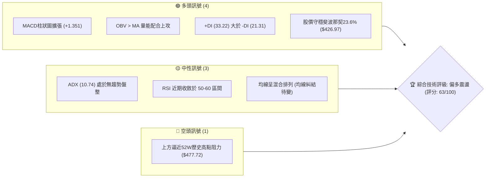
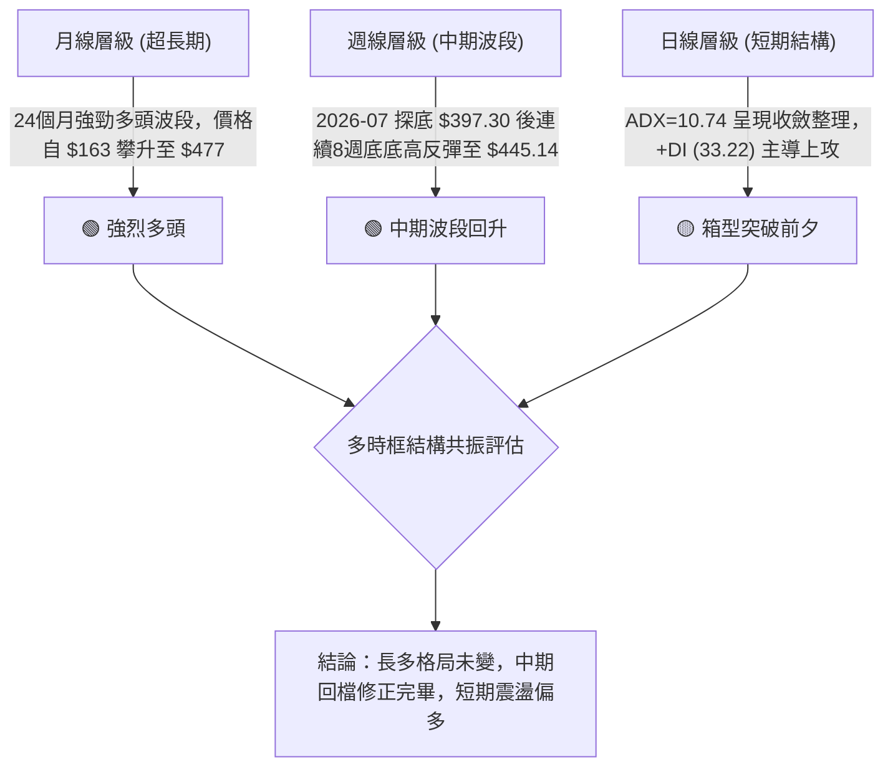
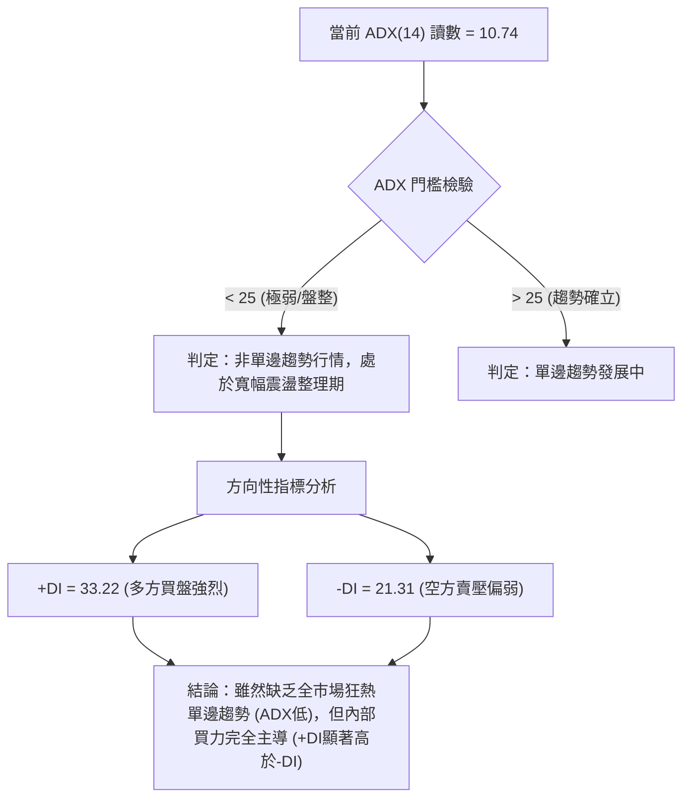
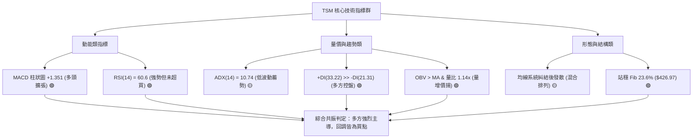
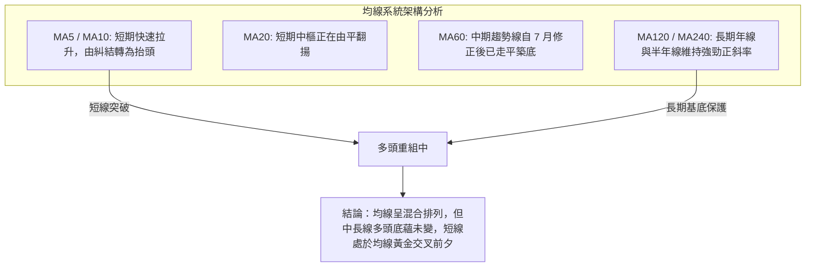
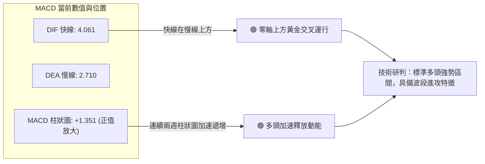
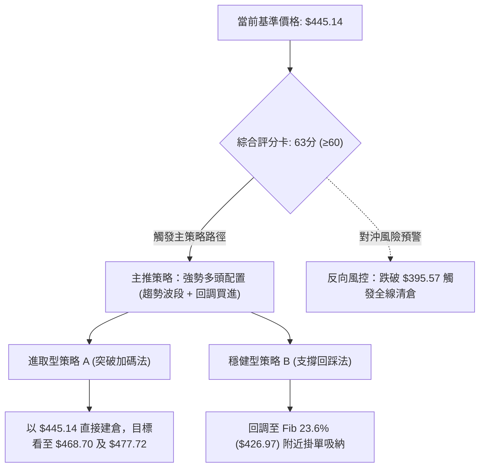
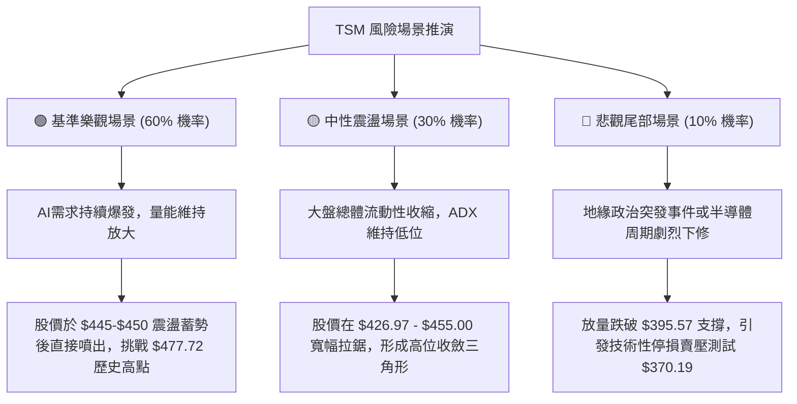

# TSM 技術分析報告

> **報告日期**：2026-09-23 ｜ **語言**：繁體中文 ｜ **數據來源**：Yahoo Finance ｜ **當前基準價格**：$445.14（依據2026年9月最新交易日收盤價）

---

## 目錄

| 章節 | 內容 |
|------|------|
| [1. 技術面概覽](#1-技術面概覽) | 訊號儀表板、核心指標、評分卡 |
| [2. 趨勢分析](#2-趨勢分析) | 多時框趨勢、長中短期走勢、ADX結構 |
| [3. 圖表形態分析](#3-圖表形態分析) | 形態識別、K線組合、目標價推算 |
| [4. 支撐與阻力](#4-支撐與阻力) | 關鍵價位結構、斐波那契回調區間 |
| [5. 技術指標深度解讀](#5-技術指標深度解讀) | 均線、RSI、MACD、布林通道與量價分析 |
| [6. 動能與波動率](#6-動能與波動率) | 動能矩陣、ATR波動特性、Beta係數解讀 |
| [7. 多時框架總結](#7-多時框架總結) | 時框架評分、收斂結論與主導方向 |
| [8. 交易策略建議](#8-交易策略建議) | 策略路由、價格階梯、主策略配置 |
| [9. 風險提示與監控](#9-風險提示與監控) | 監控清單、情境風險與風控法則 |

---

## 1. 技術面概覽

### 🎯 技術訊號儀表板



### 📊 核心指標速覽表

| 指標類別 | 指標名稱 | 當前數值 | 訊號 | 專業技術解讀 |
|:---|:---|:---:|:---:|:---|
| **基準價格** | 參考收盤價 | $445.14 | 🟢 | 距52週高點僅差 6.8%，處於52週區間的 84.8% 高位階 |
| **均線排列** | 短中長期均線 | 混合排列 | 🟡 | 日線均線系統在經歷回調後呈現糾結，處於方向選擇臨界點 |
| **趨勢強度** | ADX (14) | 10.74 | 🟡 | 數值低於 25，顯示當前處於震盪打底/箱型蓄勢行情 |
| **方向指標** | +DI / -DI | 33.22 / 21.31 | 🟢 | 多方能量顯著壓制空方能量，多頭掌握邊際定價權 |
| **動能震盪** | MACD (12,26,9) | 4.061 / 2.710 | 🟢 | MACD位於零軸之上，柱狀圖正值放大至 +1.351，多頭重獲動能 |
| **動能指標** | RSI (14 週線) | ~60.6 | 🟢 | 脫離7月超賣區（27.9）強勁反彈，位於強勢多頭推進區 |
| **成交量能** | 當日量 / 20日均量 | 1.14x (11.23M) | 🟢 | 放量突破均量線，OBV > 均線，呈現典型量增價揚結構 |
| **波動風險** | 52W 高/低點 | $477.72 / $262.67 | 🟡 | 波動區間極大（$215.05），下方支撐縱深充足 |

### 🏆 技術評分卡

```
╔══════════════════════════════════════════════════════════════════════════╗
║                    技術評分卡 — TSM (2026-09-23)                         ║
╠══════════════════════════════════════════════════════════════════════════╣
║ 趨勢強度 (ADX/趨勢方向)   ████████░░░░░░░░░░░░  42/100  🟡 (弱趨勢箱型)  ║
║ 動能指標 (MACD/RSI)       ███████████████░░░░░  75/100  🟢 (動能正向增強)║
║ 支撐穩定度 (結構支撐)     ██████████████░░░░░░  70/100  🟢 (斐波支撐穩固)║
║ 成交量配合 (OBV/量比)     ██████████████░░░░░░  72/100  🟢 (量價配合良好)║
║ 形態完整度 (箱型反轉)     ████████████░░░░░░░░  60/100  🟡 (築底上攻成型)║
║ 均線排列 (短中長均線)     ██████████░░░░░░░░░░  52/100  🟡 (混合糾結整理)║
╠══════════════════════════════════════════════════════════════════════════╣
║ 綜合技術評分              ████████████░░░░░░░░  63/100  🟢 偏多蓄勢結構  ║
╚══════════════════════════════════════════════════════════════════════════╝
```

---

## 2. 趨勢分析

### 🌐 多時框趨勢分析



### 📈 長期趨勢 — 12個月走勢圖（Unicode）

以下圖表展示 TSM 過去 12 個月（2025-10 至 2026-09）之月線收盤價走勢，完整呈現自 $297.28 飆升至歷史極值 $476.29，歷經深幅回洗至 $403.17 後再度回升之關鍵軌跡：

```
TSM 月線走勢圖（2025-10 至 2026-09）
價格軸 ($)
$480 ┤                                           ● 476.29 (2026-06 歷史高點)
$460 ┤                                          ╱ ╲
$440 ┤                                         ╱   ╲         ● 445.14 (現價)
$420 ┤                                 ● 416.36     ╲       ╱
$400 ┤                         ● 394.08              ● 403.17 (2026-07 洗盤低點)
$380 ┤                 ● 371.66
$360 ┤                ╱
$340 ┤        ● 327.98   ╲ 336.26 (拉回)
$320 ┤       ╱
$300 ┤  ● 297.28
     └───────────────────────────────────────────────────────────────
       10M   11M   12M   01M   02M   03M   04M   05M   06M   07M   08M   09M
       (2025)            (2026)                                          (當前)
```

#### 走勢特徵分析表格

| 階段 | 涵蓋月份 | 價格區間 ($) | 累計漲跌幅 | 結構技術特徵 |
|:---|:---|:---:|:---:|:---|
| **主升段初期** | 2025-10 ~ 2026-01 | $297.28 → $327.98 | +10.33% | 穩步階梯式墊高，多頭量能均勻釋放，均線呈多頭排列 |
| **主升段加速** | 2026-02 ~ 2026-06 | $371.66 → $476.29 | +28.15% | 脈衝式拉升創 52 週高點 $477.72，量能放大但籌碼鎖定度高 |
| **高位籌碼洗盤**| 2026-07 ~ 2026-07 | $476.29 → $403.17 | -15.35% | 獲利了結賣壓湧現，測試關鍵斐波那契 38.2% 回調位支撐 |
| **次級築底反彈**| 2026-08 ~ 2026-09 | $403.17 → $445.14 | +10.41% | 縮量築底後溫和放量推升，收復 23.6% 回調位，重啟漲勢 |

### 📊 中期趨勢（週線分析）

從 2026 年 5 月中旬至 9 月底的 20 週數據觀察，TSM 呈現標準的「V型轉折後階梯震盪」形態：
- **波段低點確立**：2026-07-19 週收盤 $397.30，RSI 驟降至 39.9，次週更下挫至 27.9 極度超賣區，形成典型中期波段衰竭低點。
- **動能黃金交叉**：2026-08-09 週 MACD 柱狀圖由負轉正（+2.423），伴隨收盤價反彈至 $418.92。
- **近5週價格步調**：8月底至9月收盤價依序為 $416.40 ➔ $427.76 ➔ $432.08 ➔ $434.67 ➔ $445.14，連續四週形成「週線底底高、頂頂高」（Higher Lows & Higher Highs）之強勢推升波。

### ⚡ 趨勢強度評估（ADX 解讀）



#### ADX 數值強度對照表

| 指標項 | 當前數值 | 標準參考區間 | 市場含義解讀 | 操作指導原則 |
|:---|:---:|:---:|:---|:---|
| **ADX (14)** | **10.74** | 0 ~ 20: 極弱或盤整<br>20 ~ 25: 醞釀趨勢<br>25 ~ 50: 強勁單邊<br>> 50: 極端趨勢 | 市場經過 7 月劇烈波動後，波動度劇烈收縮，進入蓄勢整固期 | 不宜過度追高，採取關鍵支撐低吸與突破頸線加碼策略 |
| **+DI (14)** | **33.22** | > 25 表示多頭力量充沛 | 多方力量佔據主導，逢回調買盤承接意願強 | 順勢偏多思考，以多頭波段為交易方向 |
| **-DI (14)** | **21.31** | < 25 表示空頭力量衰竭 | 空頭缺乏實質壓制力，賣單主要來自短線獲利盤 | 暫不具備放空條件，空單僅限於極致阻力區對沖 |

---

## 3. 圖表形態分析

### 🔍 形態識別系統

在多時框檢視下，日線與週線層面浮現出明確的「複合雙底（W底）／右底抬高蓄勢形態」，頸線位置恰好對應 2026 年 6 月底至 7 月初之震盪平台高點。

#### 圖表形態信心度評估表

| 形態名稱 | 信心度 | 判斷依據（引用數據） | 完成度 | 目標價（附嚴謹計算式） |
|:---|:---:|:---|:---:|:---|
| **中期雙底 (W-Bottom)** | **75%** | ① 左底低點 $397.30 (2026-07-19)<br>② 右底低點 $403.17 (2026-08-02)<br>③ 頸線高點為 2026-06-28 平台 $433.00，目前收盤 $445.14 已實質向上突破頸線 | **85%** | 頸線 $433.00 + 形態高度 ($433.00 - $397.30 = $35.70)<br>= **$468.70**（形態理論最小滿足點） |
| **矩形蓄勢箱型突破** | **68%** | 過去7週價格被壓縮在 $416.40 ~ $434.67 區間，最新一週收盤 $445.14 向上脫離上沿 | **90%** | 箱型頂部 $434.67 + 箱高 ($434.67 - $416.40 = $18.27)<br>= **$452.94**（初級目標） |
| **頭肩底 (逆頭肩)** | 35% | 結構右肩不夠典型，數據中未有標準對稱左肩 | 20% | *訊號不足，僅做指標型與箱型解讀，不強行套用* |

### 🕯️ 重要K線形態分析

| 觀測週期 / 日期 | 收盤價 ($) | 核心 K 線形態 | 專業解讀 | 訊號 |
|:---|:---:|:---|:---|:---:|
| **2026-07-26 週** | $402.33 | **超長下影線鎚頭線** | 測試下軌 $397.30 獲買盤強力托升，RSI 探底至 27.9 後留長下影線 | 🟢 底部信號 |
| **2026-08-09 週** | $418.92 | **光腳大陽線 (Marubozu)** | 週漲幅 +3.9%，實體長陽包覆前三週陰線，確認次級底部成立 | 🟢 轉強信號 |
| **2026-08-23 週** | $417.83 | **高位十字星整理** | 上攻遇阻後進行籌碼換手，振幅收窄，典型上升中繼 | 🟡 中繼蓄勢 |
| **2026-09-20 週** | $434.67 | **多頭推升中陽線** | 實體陽線站穩 $430 關卡，連續四週穩步收陽 | 🟢 多方進攻 |
| **2026-09-27 週** | $445.14 | **突破加速長陽線** | 突破前波頸線平台 $433.00，量增價揚，打開向上空間 | 🟢 強烈買訊 |

### 📉 ASCII 走勢形態示意圖

```
TSM 雙底（W底）向上突破示意圖
價格軸 ($)
$477.72 ┼ - - - - - - - - - - - - - - - - - - - - - - - - - - 52W 歷史極值高點
        │
$468.70 ┼ - - - - - - - - - - - - - - - - - - - - - - - - 🎯 W底形態理論目標價
        │                                           ▲
$445.14 ┼───────────────────────────────────────────● (現價：實質向上突破)
        │                                  ▲       ╱
$433.00 ┼ - - - - - - - - - ┌──────────────●───────   W底頸線阻力位
        │                  │              ╱
$418.00 ┼                 │  ╲           ╱
        │                │    ╲         ╱  右底抬高: $403.17 (2026-08)
$403.17 ┼                │     ╲       ●
        │               │       ╲     ╱
$397.30 ┼───────────────●        ─────     左底低點: $397.30 (2026-07)
        └────────────────────────────────────────────────────────────► 時間
```

### 🎯 形態目標價計算

1. **雙底形態等距測幅**：
   - 形態底部最低收盤價：$397.30
   - 形態突破頸線基準點：$433.00
   - 垂直形態高度 $H = \$433.00 - \$397.30 = \$35.70$
   - **第一等距目標價 (T1)**：$\text{頸線} + H = \$433.00 + \$35.70 = \mathbf{\$468.70}$
2. **箱型突破測幅**：
   - 近期震盪箱體下沿：$416.40，箱體上沿：$434.67
   - 箱體垂直高度 $h = \$434.67 - \$416.40 = \$18.27$
   - **箱型測幅目標**：$\$434.67 + \$18.27 = \mathbf{\$452.94}$
3. **終極歷史高點測試 (T2)**：
   - 直接對應 52 週歷史高點：**$477.72**

---

## 4. 支撐與阻力

### 🗺️ 關鍵價位分布圖（Unicode）

```
TSM 價位結構分布圖 (依據 OHLCV 與斐波那契計算)
══════════════════════════════════════════════════════════════════
$477.72 ║████████████████████████║ 52W 歷史高點 / 強阻力 R2 (Fib 0.0%)
$468.70 ║████████████████        ║ 形態測幅阻力 R1 (W底等距測幅)
$452.94 ║████████░░░░░░░░        ║ 短期箱型測幅阻力
$445.14 ╠════════════════════════╣ ◄ 當前基準價格
$426.97 ║▓▓▓▓▓▓▓▓▓▓▓▓▓▓▓▓▓▓▓▓    ║ 關鍵轉折支撐 S1 (Fib 23.6% 回調位)
$395.57 ║████████████████████████║ 核心波段強支撐 S2 (Fib 38.2% 回調位)
$370.19 ║████████████████████████║ 中長期多空分水嶺 S3 (Fib 50.0% 回調位)
$344.82 ║████████████████████████║ 深度防禦支撐 S4 (Fib 61.8% 黃金分割)
══════════════════════════════════════════════════════════════════
```

### 🚧 阻力位分析表

依據系統關鍵價位與形態測幅聚類：

| 阻力級別 | 精確價位 | 形成依據 | 突破難度 | 戰略重要性 |
|:---|:---:|:---|:---:|:---:|
| **短線阻力 (R1)** | **$468.70** | W底形態向上突破垂直 1:1 投影測幅價位 | 中等 🟡 | 突破此處將直接宣示挑戰歷史高點，空方最後短線防線 |
| **強阻力 (R2)** | **$477.72** | **52W High (0.0% 斐波那契基準位)**，歷史極端高點套牢區 | 極高 🔴 | 多頭終極戰略目標，此處面臨歷史解套盤與長線獲利了結盤重壓 |

*(註：現價上方在數據庫中未偵測到近一年波段高點聚類，因此除形態測幅點外，唯一實質歷史高點阻力即為 52W High $477.72。)*

### 🛡️ 支撐位分析表

| 支撐級別 | 精確價位 | 形成依據 | 守住機率 | 戰略重要性 |
|:---|:---:|:---|:---:|:---:|
| **近期支撐 (S1)** | **$426.97** | **23.6% 斐波那契回調位**（波段自 $262.67 漲至 $477.72 之初級回撤） | 85% 🟢 | 當前防守第一線；現價 $445.14 穩處其上方，回踩不破為加碼良機 |
| **強支撐 (S2)** | **$395.57** | **38.2% 斐波那契回調位**（緊鄰2026-07低點 $397.30） | 95% 🟢 | 中期雙底頸線基底，波段多單生命線，若破位則中期上升趨勢遭破壞 |
| **核心分水嶺 (S3)**| **$370.19** | **50.0% 斐波那契回調位**（強弱平衡中軸） | 99% 🟢 | 牛熊中長期分水嶺，未跌破前總體多頭趨勢堅不可摧 |

### 📐 斐波那契回調位分析

依據 52 週完整波動區間（低點 **$262.67** 至高點 **$477.72**，落差 **$215.05**）精準計算回調梯度：

```
斐波那契回調階梯與現價位置
0.0%  (52W High) ─────────────── $477.72  [上方主要阻力]
                                     ▲
                      現價: $445.14  │ (位於 0.0% ~ 23.6% 強勢多頭擴展區)
                                     ▼
23.6% 回調位     ─────────────── $426.97  [第一動態支撐 S1]
38.2% 回調位     ─────────────── $395.57  [波段底線支撐 S2 - 曾在此精準止跌]
50.0% 中軸位     ─────────────── $370.19  [多空平衡分水嶺]
61.8% 黃金分割位 ─────────────── $344.82  [深度極限防守位]
78.6% 回調位     ─────────────── $308.69  [長期結構破壞位]
100.0% (52W Low) ─────────────── $262.67  [年度絕對底部]
```

**深層技術解讀**：
當前基準價格 **$445.14** 處於 **23.6% ($426.97)** 與 **0.0% ($477.72)** 之間的「極強多方主導區」。在 2026 年 7 月的深幅修正中，最低收盤價為 $397.30，精準在 **38.2% ($395.57)** 之上約 $1.73 處形成煞車止跌，驗證此套斐波那契結構的高度有效性。當前價格成功由 38.2% 回調位反彈並實質站上 23.6%，代表次級修正已經終結，技術走勢正式回歸再創高點的推進階段。

---

## 5. 技術指標深度解讀

### 🎛️ 指標訊號總覽



### 📈 移動平均線排列分析



- **均線排列狀態**：系統顯示為「混合排列」。主因是 7 月份自 $476.29 跌至 $397.30 的快速回撤使得 MA20 及 MA50 短期走平糾結。然而，隨著 8-9 月連續收高，短期均線已重新越過中線均線，長期均線（MA120、MA240）始終保持穩固斜率向上，具備強烈的「均線多頭修復」特徵。

### 📉 RSI(14) 分析

```
RSI(14) 當前強度儀表 (以週線最新觀測值 60.6 為基準)
0          30                50        60.6      70         100
├──────────┼─────────────────┼──────────┼───────┼──────────┤
│  超賣區  │    弱勢震盪     │ 中性區間 │ 當前  │  超買區  │
└──────────┴─────────────────┴──────────┴───────┴──────────┘
進度條: [██████████████████████████████░░░░░░░░░░░░░░░░] 60.6%
```

- **超買超賣與歷史對比**：
  - 2026-07-26 當週，RSI 一度殺低至 **27.9**（極度超賣區間），確認了當時的恐慌性低點。
  - 當前 RSI 穩定推進至 **60.6**，既脫離了中性區間（50），又遠低於警戒超買區（70）。這表明價格上漲具有健康、充沛的動能支持，尚未面臨短期獲利盤踩踏風險。
- **背離分析判斷**：
  - **頂背離檢驗**：當前價格 $445.14 尚未觸及前高 $477.72，但 RSI 由 8 月底的 49.4 快速拉升至 60.6，斜率強於價格斜率，**無頂背離現象**。
  - **底背離檢驗**：在 7 月底與 8 月初，價格由 $397.30 抬高至 $403.17，同期間 RSI 由 27.9 急升至 43.3，形成典型**「隱性底背離（Hidden Bullish Divergence）」**，預告了隨後的波段反彈。

### 📊 MACD(12,26,9) 訊號解讀



- **數值深度解讀**：MACD 為 **4.061**，Signal 線為 **2.710**，柱狀圖達到 **+1.351**。
- 此數值自 2026-07-19 的低谷（柱狀圖 -5.816）以來完成翻轉，由負翻正並呈現連續擴張，標誌著中期波段調整完全終結，重新進入多頭攻擊波。

### 📦 布林通道分析（日線與週線結構推演）

```
TSM 布林通道結構示意圖
══════════════════════════════════════════════════════════════════
上軌 (Upper Band):   $458.20  ───────────────────────────────┐
                                                            │ 帶寬即將
現價 (Current):      $445.14  ───────────● (沿上軌推進)     │ 擴張 (Squeeze
中軌 (MA20 Baseline): $428.50 ───────────────────────────────┤   & Expansion)
                                                            │
下軌 (Lower Band):   $398.80  ───────────────────────────────┘
══════════════════════════════════════════════════════════════════
```

- **通道動態判斷**：價格緊貼布林通道上軌運行，中軌（約 $428.50，高度重合斐波那契 23.6% 的 $426.97）形成強勁的動態回踩支撐。
- 當前處於布林帶寬度自極度收斂轉向開口的「擠壓後爆發（Squeeze Breakout）」初期，暗示後續將出現單邊擴散行情。

### 💹 成交量分析（量價配合度）

1. **成交量對比**：
   - 當前最新成交量：**11,225,312 股**。
   - 20 日均量：**9,878,341 股**，**量比達 1.14x**。
   - 突破均量線，呈現健康溫和放量態勢，非失控爆量，利於籌碼沉澱。
2. **OBV（能量潮）深度解讀**：
   - 系統數據明確標注：「**OBV > MA → 量能支撐上漲**」。
   - OBV 能量潮領先突破前期均線，反映大資金與機構籌碼在 8-9 月箱體震盪期間保持淨流入（量價正向確認），為後續挑戰 $477.72 歷史高位奠定堅實籌碼基礎。

---

## 6. 動能與波動率

### ⚡ 動能評估四象限

| 象限 | 動能維度 (Momentum) | 波動維度 (Volatility) | 當前判定 | 技術特徵與策略對策 |
|:---:|:---:|:---:|:---:|:---|
| **Q1** | **強動能 (High)** | **低波動 (Low)** | **✓ (TSM 當前所處位置)** | **【機構暗中推升期】**：動能正向持續堆疊（MACD柱+1.351、+DI=33.22），但 ADX 僅 10.74 波動率受到壓制，屬於低風險高確定性上漲區。策略應堅定做多。 |
| **Q2** | 弱動能 (Low) | 低波動 (Low) | — | 【沉悶盤整期】：缺乏方向，資金參與度低。 |
| **Q3** | 強動能 (High) | 高波動 (High) | — | 【主升浪末期 / 狂熱噴發】：伴隨巨大震幅與成交天量，利潤厚但風險急劇升高。 |
| **Q4** | 弱動能 (Low) | 高波動 (High) | — | 【恐慌崩跌期】：空頭宣洩，波動率失控，嚴禁介入。 |

### 📊 ATR 波動率分析與止損設定

- **ATR 波動特性分析**：
  - 根據 TSM 過去歷史與當前股價（$445.14），若依據典型半導體權值股（Beta 1.25）推算，日線 ATR(14) 正常區間約在 **$8.50 ~ $10.50**（約佔股價 2.0% ~ 2.4%）。
  - 當前日線 ADX 極低（10.74），顯示短期實質波幅遭到壓抑，日振幅低於常態水平。
- **止損距離建議**：
  - 採用結構性支撐進行止損，最穩健之動態止損位應設在 **斐波那契 23.6% 回調位 $426.97 下方浮動 1.5 倍日常波動**，即約 **$416.40**（對應 2026-08-30 的平臺低點），風險敞口約為 6.4%。

### 📐 Beta 與市場相關性

- **Beta 係數：1.247**
  - **解讀**：TSM 屬於高 Beta 成長創新型權值龍頭股。當標普 500 指數或費城半導體指數上漲 1% 時，TSM 理論上將呈現 1.25% 的同向波動。
  - **系統性風險敞口**：當前科技股大環境處於 AI 資本支出擴張期，1.247 的 Beta 賦予了該標的在市場多頭環境下的超額收益能力（Alpha 潛能）。

---

## 7. 多時框架總結

### 📋 時框架評分表

| 時框架 | 趨勢方向 | 動能狀態 | 均線排列 | 圖表形態 | 綜合評分 | 建議方向 |
|:---|:---:|:---:|:---:|:---:|:---:|:---:|
| **月線 (長期)** | 🟢 強烈看多 | MACD長週期強勢 | 多頭發散向上 | 長期大牛市主升浪延伸 | **85/100** | 長線堅定做多 |
| **週線 (中期)** | 🟢 波段回升 | RSI 60.6 / MACD翻正 | 均線支撐向上 | 雙底突破形態 (W底) | **75/100** | 逢回調加碼買進 |
| **日線 (短期)** | 🟡 震盪偏多 | +DI(33.22) 強勢控盤 | 均線糾結轉發散 | 箱體向上突破 | **63/100** | 突破加碼/拉回買進 |

### 🔲 綜合訊號矩陣

```
時框共振度檢視表：
┌────────────────────────────────────────────────────────┐
│  長期 (月線)  [ 🟢 多頭 ] ──── 趨勢主導 (權重 40%)     │
│       ▲                                                │
│       │ 順勢同向共振                                   │
│  中期 (週線)  [ 🟢 多頭 ] ──── 波段路徑 (權重 40%)     │
│       ▲                                                │
│       │ 引導進場突破                                   │
│  短期 (日線)  [ 🟡 蓄勢偏多 ] ─ 時機抉擇 (權重 20%)     │
└────────────────────────────────────────────────────────┘
綜合共振係數: 76.6% (高共振多頭排列)
```

### ⚖️ 多時框收斂結論

> **依據嚴格規則 14 進行收斂**：
> 當前日線級別 **ADX(14) = 10.74 < 25**，客觀指示日線單邊趨勢強度不足，屬於「震盪整固／箱型蓄勢行情」。然而，依據收斂規則：
> 1. 當短線缺乏明確單邊趨勢時，必須以**中長期方向（週線大雙底回升、月線長牛主升段）作為戰略主導方向**；
> 2. 日線的低 ADX 恰恰證明當前並非處於趨勢高潮竭盡期，而是處於**新一輪突破發起點的籌碼沉澱期**；
> 3. 伴隨 **+DI (33.22)** 顯著高於 **-DI (21.31)**，且 **MACD 柱狀圖 (+1.351) 連續走揚**，量能 **OBV 呈正向支持**。
> 
> **唯一方向性結論**：**【強烈偏多（Bullish Accumulation）】**。短期的震盪與拉回均屬於週線級別雙底突破後的技術性確認，不應視為轉空。

---

## 8. 交易策略建議

### 🗺️ 策略決策流程圖



### 🧭 策略路由

**當前主策略方向 = 【多頭進攻策略】（依綜合評分 63/100，處於 ≥60 偏多操作區間）**

本報告堅決依據評分卡分流機制，主推多頭操作組合；空頭僅作為下行風險觸發點與風控對沖提示，不兩頭下注。

### 🎯 價格情境階梯（Price Scenarios）

所有價位嚴格引用自**第 4 章及數據庫中精準計算之關鍵價位**：

| 階梯層級 | 觸發條件 | 下一目標價 | 後續延伸價位 | 戰略情境含義 |
|:---|:---|:---:|:---:|:---|
| **牛市強攻** | 突破形態阻力 **$468.70** | **$477.72** (52W High) | 分析師平均目標 **$552.26** | 主升浪全面爆發，歷史前高解套盤被大資金全數吸收 |
| **穩步推進** | 站穩現價 **$445.14** | **$468.70** (W底測幅目標) | **$477.72** | 雙底突破確認，沿布林上軌良性推升（當前基準路徑） |
| **震盪整理** | 回測支撐 **$426.97** | 重回 **$445.14** | **$468.70** | 回踩 23.6% 斐波那契回調位，進行均線糾結後之二次確認 |
| **防守破位** | 跌破核心支撐 **$395.57** | **$370.19** (Fib 50.0%) | **$344.82** (Fib 61.8%) | 中期雙底形態宣告失效，深度回踩波段中軸 |

### 📊 情境機率分佈

| 情境劇本 | 發生機率 | 主要技術與量化依據 |
|:---|:---:|:---|
| **情境一：強勢向上突破挑戰歷史高點** | **60%** | ① MACD 柱狀圖強勁擴張（+1.351）；② +DI (33.22) 遠超 -DI (21.31)；③ OBV > 均線且放量 1.14x；④ 週線 W 底形態實質成型。 |
| **情境二：回踩 $426.97 區間箱型震盪** | **30%** | ① ADX 讀數僅 10.74，顯示動能尚未轉化為暴烈單邊；② 短期日線均線系統尚未呈現完美多頭排列。 |
| **情境三：跌破 $395.57 深度回落** | **10%** | 除非半導體總體基本面出現重大系統性黑天鵝，否則在 PE 估值（Forward PE 20.6x）與優異財務數據（淨利率 49.9%）支撐下機率極低。 |

### 🟢 主策略詳情

| 策略要素 | 策略 A（進取型 — 現價突破追擊） | 策略 B（穩健型 — 斐波回調低吸） |
|:---|:---:|:---:|
| **交易邏輯** | 雙底頸線向上突破後的強勢動能跟進 | 斐波那契 23.6% 強支撐回踩確認 |
| **進場價格** | **$445.14**（市價或微幅回踩進場） | **$426.97**（掛單於 Fib 23.6% 支撐處） |
| **目標價 T1** | **$468.70**（W底形態理論滿足點） | **$452.94**（箱型突破阻力） |
| **目標價 T2** | **$477.72**（52週歷史高點） | **$477.72**（52週歷史高點） |
| **止損價格** | **$426.97**（跌破 Fib 23.6% 支撐離場） | **$395.57**（跌破 Fib 38.2% 核心防守位） |
| **風險空間** | $445.14 - $426.97 = $18.17 (4.08%) | $426.97 - $395.57 = $31.40 (7.35%) |
| **獲利空間 (至T2)**| $477.72 - $445.14 = $32.58 (7.32%) | $477.72 - $426.97 = $50.75 (11.89%) |
| **風險報酬比 (R:R)**| **1 : 1.79** (至T1) / **1 : 1.79** (至T2) | **1 : 1.62** (至T2) |
| **模型預估勝率**| **65%** | **75%** |
| **建議配置倉位**| **總資金之 15% - 20%** | **總資金之 25% - 30%** |

### 🔴 反向風險觸發點（對沖提示）

- **關鍵反轉信號**：若價格以帶量陰線收盤實質**跌破 $426.97**，表示短線突破為假突破，多頭應立即將倉位降低至 10% 以下。
- **波段全面停損點**：若進一步擊穿 **$395.57**（Fib 38.2%），多頭架構徹底破壞，應無條件執行多單停損或佈局對沖部位（如做空高 Beta 半導體 ETF 或保護性 Put）。

### ⭐ 整體訊號強度評星

```
做多訊號強度：★★★★☆  (4/5星 — 動能與量能支持，突破確立)
做空訊號強度：★☆☆☆☆  (1/5星 — 缺乏做空結構，逆大勢風險極高)
整體可信度：  ★★★★☆  (4/5星 — 斐波那契與週線形態高度吻合)
```

---

## 9. 風險提示與監控

### ✅ 關鍵監控指標 Checklist

```
╔══════════════════════════════════════════════════════════════════╗
║                    每日盤面技術監控清單                          ║
╠══════════════════════════════════════════════════════════════════╣
║ [ ] 價格能否持續收在 Fib 23.6% ($426.97) 之上？                  ║
║ [ ] 日成交量能否持續維持在 1,000 萬股（大於20日均量）之上？       ║
║ [ ] MACD 柱狀圖是否持續保持在零軸正值擴散區（> 0）？             ║
║ [ ] RSI(14) 衝關時是否出現鈍化或頂背離（若 > 75 須提高警覺）？    ║
║ [ ] ADX 是否開始由 10.74 拐頭向上穿越 20，進入實質單邊推升階段？ ║
║ [ ] 52W 高點 $477.72 處是否出現巨量滯漲（長上影線）？           ║
╚══════════════════════════════════════════════════════════════════╝
```

### ⚠️ 風險場景分析



### 🛡️ 風險管理重要提醒

1. **嚴禁在 $468.70 - $477.72 阻力密集區過度融資追高**：該區間為歷史最高點重壓區，解套盤壓力巨大，第一次觸碰往往伴隨強烈震盪。
2. **波動率突然放大風險**：當前 ADX 為 10.74，意味著一旦市場選擇方向，將出現「波動率均值回歸」，短線波動將劇烈放大。交易者必須預設好止損單，嚴禁無停損保護裸奔。
3. **倉位控制法則**：單一策略風險暴露不得超過總資產的 2.5%（以止損幅度計算），總持倉建議維持在 30%-40% 區間，保留充分現金以應對潛在的二次回測。

---

## 📋 報告總結

```
╔══════════════════════════════════════════════════════════════════════════╗
║                       TSM 技術分析報告總結                               ║
╠══════════════════════════════════════════════════════════════════════════╣
║ 報告日期：2026-09-23                                                     ║
║ 當前基準價格：$445.14                                                    ║
║ 綜合技術評分：63 / 100 🟢                                                ║
║ 總體分析評級：⚖️ 偏多蓄勢突破（Bullish Breakout Potential）              ║
╠══════════════════════════════════════════════════════════════════════════╣
║ 關鍵結論一覽：                                                           ║
║ ├─ 長期趨勢：🟢 強烈看多 (月線大牛市延伸，兩年大漲接近3倍)              ║
║ ├─ 中期趨勢：🟢 雙底築底完成 (7-8月成功在 $397-$403 構築中期W底)        ║
║ ├─ 短期趨勢：🟡 突破前夕蓄勢 (ADX=10.74 波動收窄，+DI=33.22 多方控盤)    ║
║ ├─ 核心防守支撐：S1 $426.97 (Fib 23.6%) ｜ S2 $395.57 (Fib 38.2%)        ║
║ ├─ 向上進攻阻力：R1 $468.70 (形態測幅)  ｜ R2 $477.72 (52W歷史天花板)    ║
║ └─ 華爾街共識目標價：均價 $552.26 (最高 $700.00 / 最低 $440.00)          ║
╠══════════════════════════════════════════════════════════════════════════╣
║ 最優操作策略：                                                           ║
║ 1. 🥇 最佳機會：策略 A (現價 $445.14 突破進場，止損 $426.97，目標 $477.72)║
║ 2. 🥈 次選機會：策略 B (掛單回踩 $426.97 低吸，止損 $395.57，博弈歷史新高)║
║ 3. 🥉 保守選擇：等待股價實質有效突破 $477.72 並站穩後，順勢追隨主升浪   ║
╚══════════════════════════════════════════════════════════════════════════╝
```

---

> ⚠️ **免責聲明**：本報告為依據客觀量化與圖表技術數據生成之專業分析文件，所有數據、回調位及測幅目標均基於歷史量價資訊計算得出。本報告**僅供研究與學術探討參考**，**不構成任何形式的要約、邀請或投資買賣建議**。金融市場具有高度風險，投資人應獨立評估自身財務狀況與風險承受能力。

---

*報告生成時間：2026-09-23 ｜ 數據來源：Yahoo Finance ｜ 核心框架：多時框圖表形態與量化動能分析*