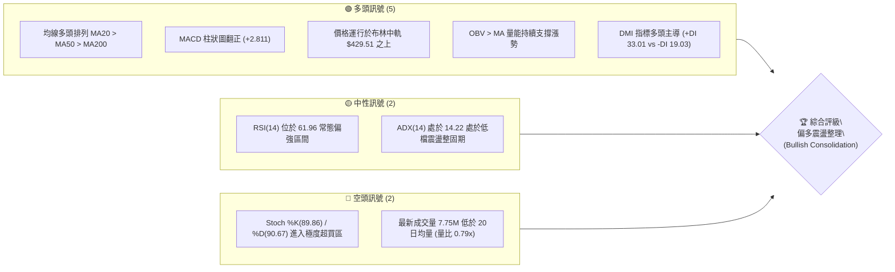
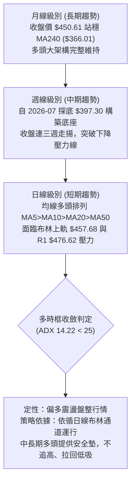
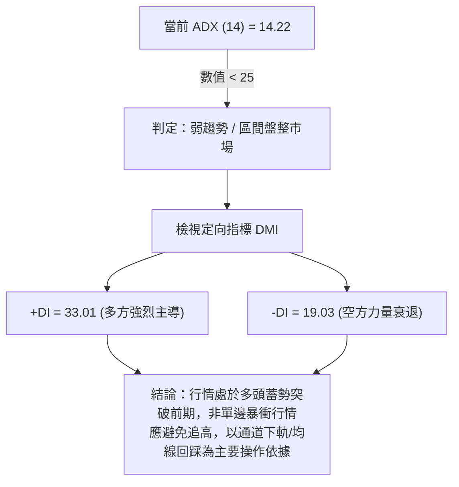
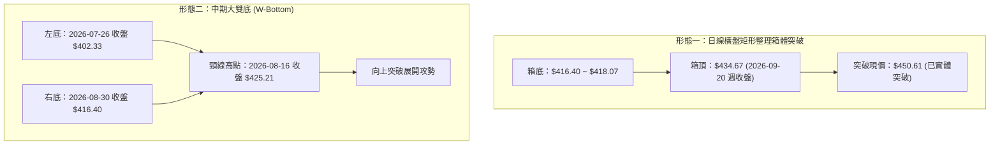
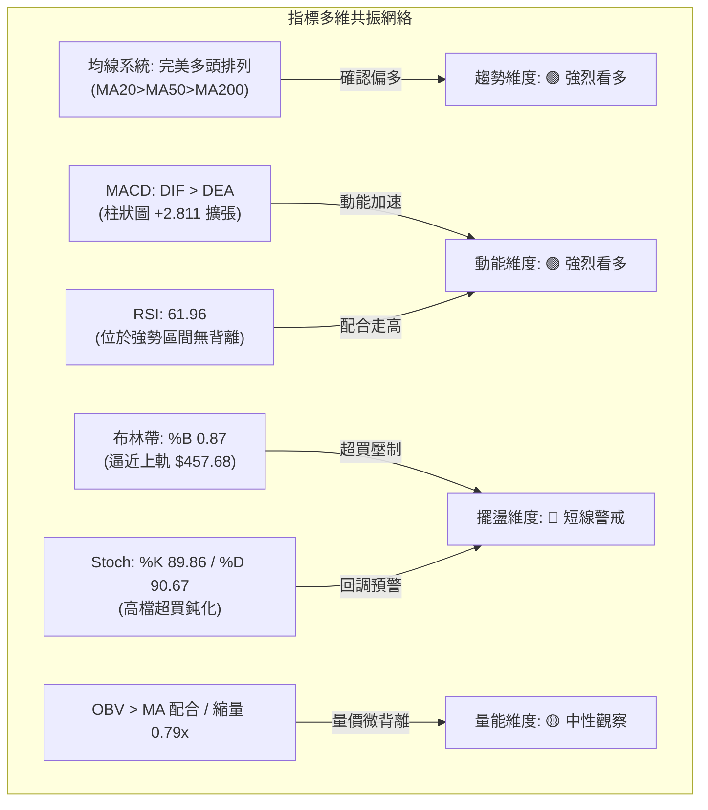
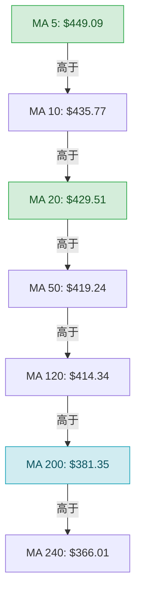
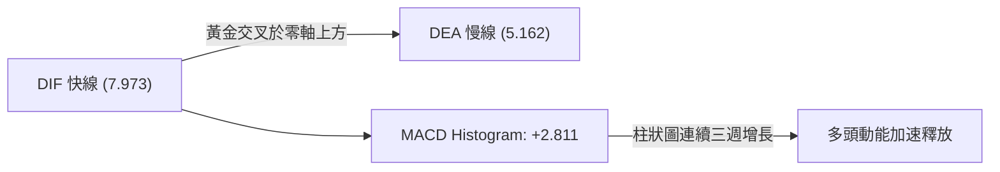
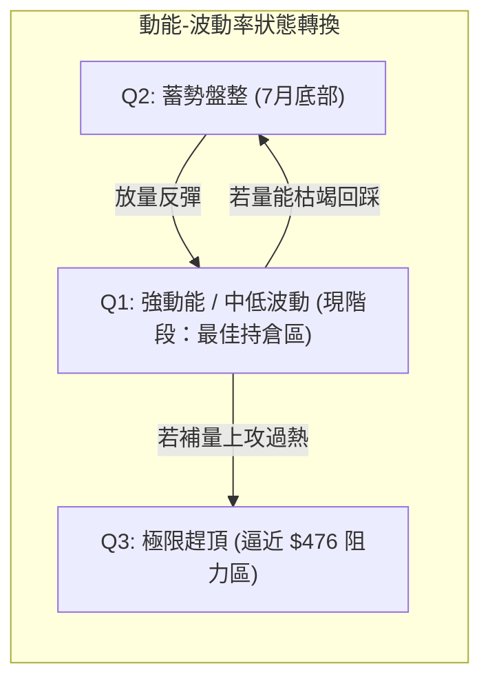
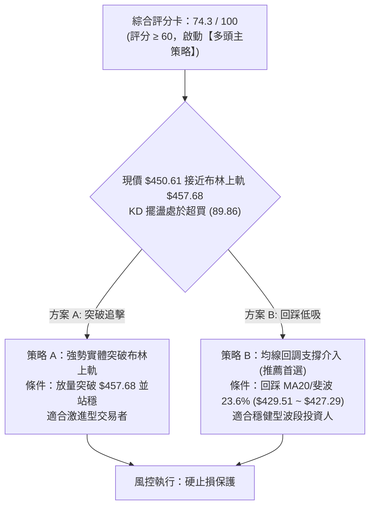
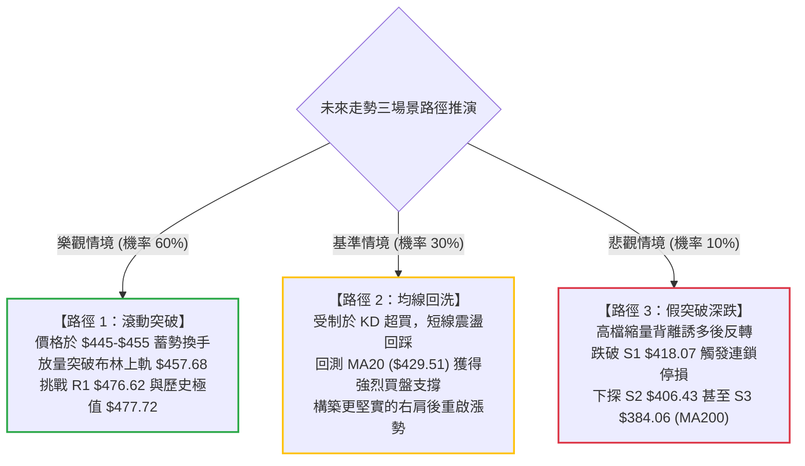

# TSM 技術分析報告

> **報告日期**：2026-09-27 ｜ **語言**：繁體中文 ｜ **數據來源**：Yahoo Finance ｜ **當前價格**：$450.61

---

## 目錄

| 章節 | 內容 |
|------|------|
| [1. 技術面概覽](#1-技術面概覽) | 訊號儀表板、核心指標、評分卡 |
| [2. 趨勢分析](#2-趨勢分析) | 多時框趨勢、長中短期走勢、ADX解讀 |
| [3. 圖表形態分析](#3-圖表形態分析) | 形態識別、信心度、K線組合、目標價計算 |
| [4. 支撐與阻力](#4-支撐與阻力) | 關鍵價位、斐波那契回調結構 |
| [5. 技術指標深度解讀](#5-技術指標深度解讀) | MA/RSI/MACD/布林通道/成交量配合 |
| [6. 動能與波動率](#6-動能與波動率) | 動能評估四象限、ATR、Beta市場相關性 |
| [7. 多時框架總結](#7-多時框架總結) | 時框架評分矩陣、多時框收斂優先級 |
| [8. 交易策略建議](#8-交易策略建議) | 策略路由、階梯情境、主策略與風控 |
| [9. 風險提示與監控](#9-風險提示與監控) | 監控指標Checklist、風險場景模擬 |

---

## 1. 技術面概覽

### 🎯 技術訊號儀表板



### 📊 核心指標速覽表

| 指標類別 | 指標名稱 | 當前數值 | 訊號 | 解讀 |
| :--- | :--- | :--- | :---: | :--- |
| **價格** | 當前價格 | $450.61 | 🟢 | 位於52週區間 87.3% 分位，處於波段強勢反彈結構 |
| **均線** | MA20 | $429.51 | 🟢 | 價格在MA20上方 +4.91%，短中期多頭支撐穩固 |
| **均線** | MA50 | $419.24 | 🟢 | 價格在MA50上方 +7.48%，中期多頭生命線確立向上 |
| **均線** | MA200 | $381.35 | 🟢 | 價格在MA200上方 +18.16%，長期多頭牛市基石未變 |
| **動能** | RSI(14) | 61.96 | 🟡 | 位於50-70強勢中性區，無頂底背離，具備上攻續航力 |
| **動能** | MACD (12,26,9) | DIF 7.973 / DEA 5.162 / Hist +2.811 | 🟢 | MACD金叉運行且紅柱持續放大，動能充沛 |
| **擺盪** | KD (Stoch 14) | %K 89.86 / %D 90.67 | 🔴 | 進入超買鈍化區，慎防觸及布林上軌引發短線拉回 |
| **趨勢** | ADX / DMI | ADX 14.22 / +DI 33.01 / -DI 19.03 | 🟡 | 弱趨勢/區間整理特徵（ADX<25），+DI高於-DI顯示多方掌控 |
| **通道** | Bollinger Bands | 上軌 $457.68 / %B 0.87 | 🟡 | 逼近上軌壓制區，短線波動空間受限於通道頂部 |
| **成交量** | Volume / 20MA | 7,751,900 / 9,800,105 (0.79x) | 🔴 | 上漲過程中量能未同步放大，呈現縮量上推態勢 |
| **波動** | ATR(14) | $10.26 (2.28%) | 🟢 | 波動率適中且穩定，未出現恐慌或極端擴散行情 |

### 🏆 技術評分卡

```
╔══════════════════════════════════════════════════════════════════╗
║              TSM 技術面綜合量化評分卡 (2026-09-27)              ║
╠══════════════════════════════════════════════════════════════════╣
║ 趨勢強度 (Trend)       ████████████░░░░░░░░  60/100 🟡 (ADX偏低)  ║
║ 動能指標 (Momentum)    ███████████████░░░░░  76/100 🟢 (MACD金叉) ║
║ 支撐穩定度 (Support)   ██████████████████░░  88/100 🟢 (多層防線) ║
║ 成交量配合 (Volume)    ██████████░░░░░░░░░░  52/100 🟡 (縮量上推) ║
║ 形態完整度 (Pattern)   ██████████████░░░░░░  70/100 🟢 (區間突破) ║
║ 均線排列 (Moving Avg)  ████████████████████ 100/100 🟢 (完全多頭) ║
╠══════════════════════════════════════════════════════════════════╣
║ 綜合評分               ███████████████░░░░░  74.3/100 [多頭偏強]  ║
╚══════════════════════════════════════════════════════════════════╝
```

---

## 2. 趨勢分析

### 🌐 多時框趨勢分析



### 📈 長期趨勢 — 12個月走勢圖（Unicode）

```
TSM 月線走勢圖（過去12個月：2025-10 至 2026-09）
價格軸 ($)
$480 ┤                                           ● 476.29 (M9 峰值高點)
$460 ┤                                                    ● 450.61 (現價)
$440 ┤                                              
$420 ┤                                 ● 416.36      ● 414.21
$400 ┤                           ● 394.08          ● 403.17 (M10 回檔低點)
$380 ┤                     ● 371.66
$360 ┤               
$340 ┤               ● 336.26 (M6 調整)
$320 ┤         ● 327.98
$300 ┤● 297.28   ● 301.52
$280 ┤   ● 288.46
     └─┬─────┬─────┬─────┬─────┬─────┬─────┬─────┬─────┬─────┬─────┬─────┬───
      10    11    12    01    02    03    04    05    06    07    08    09 (月份)
      '25   '25   '25   '26   '26   '26   '26   '26   '26   '26   '26   '26
```

#### 走勢特徵分析表格

| 階段區間 | 時間段 | 價格起訖 | 漲跌幅 | 結構特徵與走勢解讀 |
| :--- | :--- | :--- | :---: | :--- |
| **第一階段：高檔蓄勢** | 2025-10 ~ 2025-12 | $297.28 → $301.52 | +1.43% | 在 $300 大關附近建立第一蓄勢平台，成交量平穩收斂。 |
| **第二階段：主升推升** | 2025-12 ~ 2026-06 | $301.52 → $476.29 | +57.96% | 展開主升段推升，突破 $400，於 2026-06 刷出波段高位 $476.29。 |
| **第三階段：波段修正** | 2026-06 ~ 2026-07 | $476.29 → $403.17 | -15.35% | 獲利了結賣壓湧現，單月重挫回測 50日均線與斐波那契回調位。 |
| **第四階段：次級築底反彈** | 2026-07 ~ 2026-09 | $403.17 → $450.61 | +11.77% | 連續兩個月收陽，確立 $400 整數防線穩固，重啟多頭反撲。 |

### 📊 中期趨勢（週線分析）

從近20週收盤走勢可見，價格於 2026-07-19 探至週低點收盤 $397.30，成交量擴大至 91.5M 股，呈現放量殺跌後的「恐慌底」。隨後價格在 $402-$403 區間三次獲得強烈支撐，MACD 柱狀圖在 2026-08-09 由負翻正（+2.423），確認中期修正結束。近期週線連續三週收陽（$432.08 → $434.67 → $450.61），週線 RSI 回升至 62.0，中期走勢由震盪築底轉入攻擊形態。

```
週線級別價格反彈通道架構：
$477.72 ─────────────────────────────────── 52W 歷史天花板 (R1 區間 $476.62)
           ↗       
$450.61 ──● (現價測試通道上緣)
         /
$427.29 ─/───────────────────────────────── 斐波那契 23.6% 轉化為下檔防線
       /
$402.33 ● ─── ● ─── ● ───────────────────── 三重底部支撐頸線 ($397.30 ~ $403.17)
```

### ⚡ 趨勢強度評估（ADX 解讀）



| 指標變數 | 當前讀數 | 區間定義 | 市場狀態診斷 | 實戰交易含義 |
| :--- | :---: | :--- | :--- | :--- |
| **ADX(14)** | **14.22** | < 20 極弱; 20-25 轉折; > 25 趨勢確立 | **極度休眠 / 盤整蓄勢** | 單邊趨勢尚未爆發，擺盪指標效能高於趨勢指標 |
| **+DI(14)** | **33.01** | > 25 屬多頭強勢區 | **多方絕對掌控** | 多頭握有定價權，拉回即有買盤介入支撐 |
| **-DI(14)** | **19.03** | < 20 屬空方萎縮區 | **空頭動能匱乏** | 無系統性做空賣盤，市場以獲利浮額清洗為主 |

---

## 3. 圖表形態分析

### 🔍 形態識別系統

在多時框結構中，日線與週線層面浮現出兩個主要的技術形態結構：



#### 形態識別信心度與目標價評估

| 形態結構 | 信心度 | 判斷依據（引用數據） | 完成度 | 形態推算目標價（附計算式） |
| :--- | :---: | :--- | :---: | :--- |
| **箱體整理突破** | **85%** | 突破近4週高點盤整帶上緣 $434.67，收盤站上 $450.61，且連續收於MA20之上。 | **100%** | 箱底 $418.07、箱頂 $434.67，垂直高度 $16.60。<br>突破目標價 = $434.67 + $16.60 = **$451.27**（現價已基本達成）。 |
| **中期雙底 (W底)** | **70%** | 兩次低點支撐分別落在 2026-07-26 收盤 $402.33 與 2026-08-30 收盤 $416.40，頸線位於 $425.21。 | **90%** | 頸線 $425.21 - 左底 $402.33 = 形態高度 $22.88。<br>向上等距推算目標價 = $425.21 + $22.88 = **$448.09**（已確認突破）。延伸目標看 1.618 倍 = $425.21 + ($22.88 × 1.618) = **$462.23**。 |
| **頭肩底形態** | **35%** | 週線結構不對稱，左肩右肩成交量變化不規則。 | **未完成** | *訊號不足，信心度低於50%，僅做指標型解讀，不預設目標價。* |

### 🕯️ 重要K線形態分析

| 週/月份 | 收盤價 | K線形態特徵 | 市場心理與多空意涵解讀 | 訊號方向 |
| :--- | :---: | :--- | :--- | :---: |
| **2026-06** | $476.29 | **長上影流星線** | 測試歷史天花板 $477.72 失敗，多頭力竭，引發波段獲利賣壓。 | 🔴 看跌反轉 |
| **2026-07-19** | $397.30 | **爆量長下影陰錘線** | 單週巨量 91.5M 殺穿 $400，但留長下影線，主力資金進場承接。 | 🟢 底部信號 |
| **2026-08-09** | $418.92 | **實體大陽線吞噬** | 實體完全包覆前兩週K線，MACD 柱狀圖翻紅，確認雙底右腳成立。 | 🟢 強烈看多 |
| **2026-09-27** | $450.61 | **光腳中陽線突破** | 實體收在當週高點附近，強勢脫離 $430-$435 盤整區，買盤推升堅決。 | 🟢 多頭續攻 |

### 📉 ASCII 走勢形態示意圖

```
TSM 雙底 (W-Bottom) 與箱體突破示意圖：
價格 ($)
$476.62 ┬────────────────────────────────────────── 阻力位 R1
        │                                    ▲
$450.61 ┤                           [現價] ──┼─● (已突破頸線，逼近上軌)
        │                                    │
$434.67 ┤                    [箱體頂部頸線] ──┼─ (突破點位)
        │                        ┌─────┐     │
$425.21 ┤        [W底頸線] ───────┘     └─────┼─
        │           ▲                         │
$416.40 ┤           │               ● 右底    │ (S1 支撐 $418.07)
        │           │              /          │
$402.33 ┤   ● 左底  │             /           │ (S2 支撐 $406.43)
        └───┴───────┴────────────┴───────────┴───────────────
          2026-07   2026-08      2026-08    2026-09
```

---

## 4. 支撐與阻力

### 🗺️ 關鍵價位分布圖（Unicode）

```
TSM 價位結構分布圖 (由 OHLCV 與歷史波段計算)
══════════════════════════════════════════════════════════════════
$477.72 ║██████████████████████████████║ 52週歷史高點 (斐波 0.0%)
$476.62 ║████████████████████████████  ║ 強阻力位 R1 (近一年波段高點聚類)
$457.68 ║▓▓▓▓▓▓▓▓▓▓▓▓▓▓▓▓▓▓            ║ 動態阻力 (日線布林通道上軌)
$450.61 ╠══════════════════════════════╣ ◄ 當前市價 ($450.61)
$429.51 ║▓▓▓▓▓▓▓▓▓▓▓▓▓▓▓▓▓▓▓▓▓▓        ║ 短線第一動態支撐 (MA20 / 布林中軌)
$427.29 ║████████████████████████      ║ 關鍵斐波那契回調位 (23.6%)
$419.24 ║▓▓▓▓▓▓▓▓▓▓▓▓▓▓▓▓▓▓▓▓▓▓▓▓▓▓    ║ 中期生命線 (MA50 均線)
$418.07 ║████████████████████████████  ║ 強支撐位 S1 (近一年波段低點聚類)
$406.43 ║██████████████████████        ║ 次級強支撐位 S2 (波段起漲聚類)
$401.34 ║▓▓▓▓▓▓▓▓▓▓▓▓▓▓▓▓▓▓            ║ 動態支撐 (日線布林通道下軌)
$396.09 ║██████████████████████████████║ 關鍵斐波那契回調位 (38.2%)
$384.06 ║██████████████████████████████║ 核心防守支撐 S3 (波段深幅低點聚類)
$381.35 ║▓▓▓▓▓▓▓▓▓▓▓▓▓▓▓▓▓▓▓▓▓▓▓▓▓▓▓▓▓▓║ 長期牛熊分界線 (MA200 均線)
══════════════════════════════════════════════════════════════════
```

### 🚧 阻力位分析表

所有阻力數值完全引用自已知 OHLCV 波段高點與通道系統：

| 阻力級別 | 價位精確值 | 形成原因及技術依據 | 突破難度 | 戰略重要性 |
| :--- | :---: | :--- | :---: | :---: |
| **動態上軌阻力** | **$457.68** | 日線布林通道上軌，短期價格乖離過大時之統計學壓力界限。 | 🟡 中等 | 短線多空強弱分界，站穩則打開布林通道喇叭口。 |
| **強阻力 R1** | **$476.62** | 近一年波段高點聚類，與 52週歷史高點 $477.72 形成重疊共振壓力帶。 | 🔴 極高 | 歷史天花板，上方存在解套與獲利盤沉重拋壓，需巨量配合方可攻克。 |

### 🛡️ 支撐位分析表

所有支撐數值完全引用自已知 OHLCV 聚類計算值：

| 支撐級別 | 價位精確值 | 形成原因及技術依據 | 守住機率 | 戰略重要性 |
| :--- | :---: | :--- | :---: | :---: |
| **短期支撐** | **$429.51** | 日線 MA20 均線暨布林帶中軌，多頭進攻之短線防護甲。 | 80% 🟢 | 跌破則短線多頭攻擊節奏中斷，轉為箱體整理。 |
| **強支撐 S1** | **$418.07** | 近一年波段低點聚類，緊鄰 MA50 ($419.24) 與 MA60 ($420.81)。 | 85% 🟢 | 中期多頭命脈，跌破則宣告中期反彈結束。 |
| **次級強支撐 S2**| **$406.43** | 近一年波段低點聚類，為2026年7-8月兩次探底之反彈頸線安全墊。 | 90% 🟢 | 空方極限回撤區域，守穩可保牛市格局不失。 |
| **核心防守 S3** | **$384.06** | 近一年波段低點聚類，逼近 MA200 牛熊分界線 ($381.35)。 | 95% 🟢 | 長期牛市底線，跌破則觸發系統性熊市風控。 |

### 📐 斐波那契回調位分析

依據 52週極值區間：最低點 **$264.03**（2025年回調底）至 最高點 **$477.72**（歷史極值），回調位計算如下：

```
斐波那契回調尺規（52W 區間：$264.03 → $477.72）：
 0.0% (52W High)  $477.72  ────────────────────────────────────
                          ▲ 距離現價 +6.02%
 [現價 $450.61] ───●
                          ▼ 距離 23.6% 回調位 -5.18%
23.6%             $427.29  ────────────────────────────────────
38.2%             $396.09  ────────────────────────────────────
50.0%             $370.87  ────────────────────────────────────
61.8%             $345.66  ────────────────────────────────────
78.6%             $309.76  ────────────────────────────────────
100.0% (52W Low)  $264.03  ────────────────────────────────────
```

- **當前位置解讀**：現價 **$450.61** 處於 **0.0% ($477.72)** 與 **23.6% ($427.29)** 之間的「極強強勢區」。
- **支撐轉化邏輯**：在健康的強勢上漲趨勢中，強勢回調通常不會有效跌破 23.6% ($427.29)。此價位同時與日線 MA20 ($429.51) 產生強烈共振，構成下檔極佳的多頭防禦護城河。

---

## 5. 技術指標深度解讀

### 🎛️ 指標訊號總覽



### 📈 移動平均線排列分析



均線系統呈現罕見的**大滿貫多頭發散排列**（MA5 > MA10 > MA20 > MA50 > MA60 > MA120 > MA200 > MA240）。
- **短天期均線**：MA5 ($449.09) 與 MA10 ($435.77) 斜率陡峭向上，現價 $450.61 緊貼 MA5 運行，反映短期多方推升力道強勁。
- **中長天期均線**：MA50 ($419.24) 穩步高於 MA200 ($381.35)，年線 MA240 ($366.01) 落後現價達 +23.11%，整體大週期均線呈現開展之扇形多頭態勢，中長期絕無轉空跡象。

### 📉 RSI(14) 分析

```
RSI(14) 強弱度儀表：
0        20         40         60   61.96 70        80       100
├────────┼──────────┼──────────┼───────●──┼─────────┼─────────┤
   極度超賣     弱勢區間      多空平衡   │  強勢區    極度超買
                                       └─► [當前狀態: 強勢健康]
```

- **數值解讀**：RSI(14) 讀數為 **61.96**，處於 50–70 的健康上行擴張區。既未跌入弱勢，亦未觸及 70 以上的過熱警戒線。
- **背離檢驗**：觀察週線自 2026-07-26 低點反彈以來，價格走勢逐步墊高（$402.33 → $418.92 → $450.61），RSI 同步自 27.9 升至 62.0，斜率與價格高度吻合。**結論：無頂背離、無底背離**，屬於典型的趨勢推進型指標狀態。

### 📊 MACD(12/26/9) 訊號解讀

- **DIF 線**：7.973
- **DEA 信號線**：5.162
- **MACD 柱狀圖 (Histogram)**：**+2.811** (🟢 看多)



MACD 於零軸之上二次金叉發散，週線級別柱狀圖連續四週由負翻正並快速擴張（+0.580 → +1.741 → +0.660 → +2.811），證實自 2026年7月以來的回調修正浪已經徹底走完，新一輪主攻動能正在宣洩。

### 📦 布林通道分析

```
日線布林通道 (20, 2) 結構圖：
$457.68 ┬────────────────────────────────────────── BB 上軌 (動態阻力)
        │                       ▲ 乖離壓縮區
$450.61 ┤                 ● ───┼─ [現價位置，%B = 0.87]
        │                      │
$429.51 ┼──────────────────────┼─────────────────── BB 中軌 (MA20 生命線)
        │                      │
$401.34 ┴──────────────────────┴─────────────────── BB 下軌 (極端支撐)
```

- **帶寬與位置**：上軌 $457.68、中軌 $429.51、下軌 $401.34，帶寬 $56.34。
- **%B 指標**：當前數值為 **0.87**，逼近 1.00（上軌壓制線）。
- **解讀**：當前走勢為強勢的「沿上軌攀升」格局。然而在 ADX 僅為 14.22 的環境下，布林通道尚未呈現喇叭口暴烈擴張，因此價格直接實體穿透上軌 $457.68 的機率偏低，多頭在 $455–$458 區間易遭遇技術性震盪壓制。

### 💹 成交量分析（量價配合度）

- **最新成交量**：7,751,900 股
- **20日平均量**：9,800,105 股（量比 **0.79x**）
- **50日平均量**：11,219,322 股
- **OBV 能量潮**：**OBV > MA**（量能均線持續向上發散，支撐上漲）

**量價綜合研判**：
OBV 長期維持在均線上方，顯示機構籌碼處於淨沉澱鎖定狀態。然而，現價自 $418 推進至 $450 的過程中，單日成交量（7.75M）縮至 20日均量以下（量比 0.79），且週成交量（46.8M）明顯低於7月份殺跌時的峰值（91.5M）。這呈現典型的**「縮量驚驚漲」**特徵，反映市場浮額被主力鎖死，但同時也暗示多頭若要攻克歷史天花板 R1 ($476.62)，必須補量至 12M 股以上，否則將在布林上軌附近形成量價背離式的小幅休整。

---

## 6. 動能與波動率

### ⚡ 動能評估四象限

動能評估模型將市場置於「動能強度（MACD/RSI）」與「波動率（ATR/帶寬）」之二維座標體系中：

| 象限標籤 | 動能狀態 | 波動狀態 | 當前定位 | 戰術應對環境特徵 |
| :---: | :---: | :---: | :---: | :--- |
| **Q1：主升爆發** | 強動能 (MACD>0, RSI>60) | 低/中波動 (ATR未失控) | **TSM 當前落點** 🎯 | **最佳順勢環境**。趨勢平穩向上推升，雜訊干擾低，適合波段持股續抱。 |
| **Q2：休眠蓄勢** | 弱動能 (MACD~0, RSI 40-50) | 低波動 (通道極致收窄) | — | 盤整觀望期，等待突破信號。 |
| **Q3：瘋狂趕頂** | 強動能 (RSI>75) | 高波動 (ATR大幅擴大) | — | 高風險投機區，獲利分批了結。 |
| **Q4：恐慌殺跌** | 負動能 (MACD<0, RSI<35) | 高波動 (量爆發) | — | 避免盲目抄底，風險極高。 |



### 📊 ATR 波動率分析

- **ATR(14) 精確值**：**$10.26**
- **價格百分比波動**：**2.28%** of Price ($450.61)

**止損與風控參數設定建議**：
1. **短線動態波幅**：當前平均每日震盪空間為 $10.26，盤中回踩 1.0 倍 ATR ($440.35) 屬於正常技術性呼吸，不可視為轉弱。
2. **多頭保護性止損建議**：
   - 短線（激進）：1.5 倍 ATR = $10.26 × 1.5 = **$15.39**，對應停損位為 $450.61 - $15.39 = **$435.22**（貼近 MA10 $435.77）。
   - 波段（穩健）：2.0 倍 ATR = $10.26 × 2.0 = **$20.52**，對應停損位為 $450.61 - $20.52 = **$430.09**（精確覆蓋 MA20 $429.51 防線）。

### 📐 Beta 與市場相關性

- **Beta 係數**：**1.247**
- **解讀**：TSM 對大盤（標普500 / 費城半導體）具有顯著的放大效應（波動率為市場的 1.25 倍）。在牛市或大盤反彈階段，TSM 具備獲取 Alpha 超額收益的潛力；但在科技板塊承壓時，其回撤幅度亦會同步加劇。結合當前融券放空比率僅 0.6%（Short Ratio 2.88），市場並無空頭借券狙擊跡象，機構籌碼持股信心穩固。

---

## 7. 多時框架總結

### 📋 時框架評分表

| 時框架 | 趨勢方向 | 動能狀態 | 均線排列 | 形態特徵 | 綜合評分 | 操作戰略建議 |
| :---: | :---: | :---: | :---: | :---: | :---: | :--- |
| **日線 (短期)** | 🟢 向上偏多 | 🟡 超買鈍化 (KD>89) | 🟢 均線多頭 (MA20之上) | 🟢 突破箱體 | **72/100** | 不盲目追高，等待日內回踩均線點位切入 |
| **週線 (中期)** | 🟢 多頭確立 | 🟢 動能充沛 (MACD紅柱) | 🟢 均線支撐 (MA50之上) | 🟢 雙底突破 | **78/100** | 順勢波段做多，目標直指歷史高點 R1 |
| **月線 (長期)** | 🟢 絕對牛市 | 🟢 結構完好 (站穩MA240) | 🟢 完美多頭發散 | 🟢 主升延伸 | **85/100** | 核心多單底倉堅定鎖定，享受長期複利 |

### 🔲 綜合訊號矩陣

```
時框維度與指標交叉驗證矩陣：
┌──────────────┬──────────────┬──────────────┬──────────────┐
│ 指標 / 維度  │ 日線 (短期)  │ 週線 (中期)  │ 月線 (長期)  │
├──────────────┼──────────────┼──────────────┼──────────────┤
│ 趨勢方向     │ 🟢 向上      │ 🟢 向上      │ 🟢 向上      │
│ 均線系統     │ 🟢 多頭排列  │ 🟢 多頭排列  │ 🟢 多頭排列  │
│ 動能 (MACD)  │ 🟢 翻正放大  │ 🟢 紅柱加速  │ 🟢 多頭控制  │
│ 震盪 (RSI/KD)│ 🔴 超買警戒  │ 🟢 62.0健康  │ 🟢 偏強擴張  │
│ 形態完整度   │ 🟢 箱體突破  │ 🟢 W底成形   │ 🟢 主升波段  │
│ 成交量配合   │ 🟡 略微縮量  │ 🟡 平穩中性  │ 🟢 OBV創新高 │
└──────────────┴──────────────┴──────────────┴──────────────┘
```

### ⚖️ 多時框收斂結論

> **核心判定依據（嚴格遵守多時框收斂規則 14）**：
> 1. **行情屬性判定**：當前 **ADX(14) 數值為 14.22**，明確低於臨界值 25，依照定義歸類為**「盤整/弱趨勢蓄勢行情」**，交易主要以日線布林通道 ($401.34 - $457.68) 為運行區間。
> 2. **主導與衝突收斂**：雖然日線擺盪指標（KD）進入短線超買鈍化區，顯示直接衝破布林上軌難度高；但中長期時框（週線 MACD 擴張、MA20>MA50>MA200）方向極度一致向上。
> 3. **唯一方向性結論**：**【偏多震盪整固（Bullish Consolidation）】**。
>    結論絕不偏空，亦非單邊無腦暴衝。戰術上**以中長期多頭為大背景，日線只用作尋找拉回布林中軌或關鍵支撐的「低吸進場時機」**。

---

## 8. 交易策略建議

### 🗺️ 策略決策流程圖



### 🧭 策略路由（依評分卡分流）

- **當前技術綜合評分**：**74.3 / 100**（偏多區間）
- **當前主策略方向**：**【強烈主推多頭策略】**（空頭部位僅作為下檔破位之避險對沖提示，嚴禁在多頭排列未被破壞前逆勢開空）。

### 🎯 價格情境階梯（Price Scenarios）

數值全部嚴格引用第 4 章及關鍵數據表：

| 觸發條件（觸及/突破） | 下一目標點位 | 後續延伸目標 | 情境技術含義 |
| :--- | :---: | :---: | :--- |
| **放量突破布林上軌 $457.68** | **R1 $476.62** | **52W High $477.72** | 短線整理結束，展開挑戰歷史天花板的極限攻擊行情。 |
| **受阻於 $457 於高檔震盪** | **MA20 $429.51** | **斐波 23.6% $427.29** | 正常技術性回踩，消化日線 KD 超買指標，夯實支撐基礎。 |
| **跌破第一支撐 S1 $418.07** | **S2 $406.43** | **S3 $384.06** | 中期上漲結構受創，轉入深幅拉回，觸及 MA200 牛熊防線。 |

### 📊 情境機率分佈

| 演繹情境 | 發生機率 | 主要技術依據 |
| :--- | :---: | :--- |
| **高位蓄勢後向上突破** | **60%** | MACD 柱狀圖正向放大（+2.811），DMI 多頭主導（+DI 33.01），均線完美多頭。 |
| **在 $430 - $457 區間震盪** | **30%** | ADX 僅 14.22，顯示趨勢缺乏單邊狂飆量能，成交量量比僅 0.79x，易反覆拉扯。 |
| **深度回落再探底部 ($406)** | **10%** | 必須同時發生全球半導體系統性利空，跌破 S1 $418.07 方能開啟此路徑。 |

### 🟢 主策略詳情

數值嚴格限定引用自本報告已知支撐/阻力數據：

| 策略維度要素 | 策略 A（強勢追擊型 — 突破確認） | 策略 B（波段穩健型 — 拉回低吸）★ 首選推薦 |
| :--- | :--- | :--- |
| **進場觸發條件** | 日線收盤價實體突破布林上軌 $457.68 且當日成交量突破 10M 股 | 價格拉回測試 MA20 均線或斐波 23.6% 出現止跌K棒 |
| **精確進場價格** | **$458.50**（突破上軌確認點） | **$429.51**（MA20 現值）至 **$427.29**（斐波位）區間 |
| **目標價 T1** | **$476.62**（阻力位 R1） | **$457.68**（布林上軌） |
| **目標價 T2** | **$477.72**（52週歷史高點） | **$476.62**（阻力位 R1） |
| **保護性止損價格** | **$449.00**（跌回 MA5 下方，防範假突破） | **$418.07**（跌破強支撐 S1 止損） |
| **風險空間 / 報酬空間** | 風險 $9.50 / 報酬 $18.12（至T1） | 風險 $11.44 / 報酬 $28.17（至T1） |
| **風險報酬比 (R/R)** | **1 : 1.91** 🟢 | **1 : 2.46** 🟢（極佳） |
| **估計成功機率** | **58%** | **72%** |
| **建議配置倉位** | 10% - 15%（輕倉試單） | 20% - 30%（核心波段倉） |

### 🔴 反向風險觸發點（對沖提示）

- **多單警報觸發點 1**：日線收盤價**實體跌破 MA20 ($429.51)**，應將多頭部位減半，轉為防禦。
- **全面停損翻空警戒點 2**：若價格帶量**摜破強支撐 S1 ($418.07)**，證明 W底頸線與日線 MA50 徹底失守，所有多單無條件離場觀望；激進交易者方可考慮建立以 **S2 ($406.43)** 為目標的短期空頭對沖部位。

### ⭐ 整體訊號強度評星

```
做多訊號強度：★★★★☆  (4/5星 — 均線與動能指標高度共振看多)
做空訊號強度：★☆☆☆☆  (1/5星 — 逆大週期均線，勝率極低)
整體可信度：  ★★★★☆  (4/5星 — 多時框指向一致，量能略有美中不足)
```

---

## 9. 風險提示與監控

### ✅ 關鍵監控指標 Checklist

```
╔══════════════════════════════════════════════════════════════════╗
║               TSM 交易風控與動態監控檢核表 (Daily Check)         ║
╠══════════════════════════════════════════════════════════════════╣
║ [ ] 1. 價格是否觸碰布林上軌 $457.68？(若伴隨上影線應考慮分批獲利)║
║ [ ] 2. 日線成交量是否回升至 9.80M (20日均量) 之上？(補量為攻堅前提)║
║ [ ] 3. Stoch KD 指標是否自超買區高檔形成死叉向下？               ║
║ [ ] 4. MACD 柱狀圖是否持續維持在正值區 (+2.811 以上擴大佳)？     ║
║ [ ] 5. 價格回調時是否能穩穩守住 MA20 ($429.51) 與斐波 $427.29？ ║
║ [ ] 6. 是否出現大盤半導體指數巨幅系統性跳空破位？                ║
╚══════════════════════════════════════════════════════════════════╝
```

### ⚠️ 風險場景分析



### 🛡️ 風險管理重要提醒

1. **嚴防縮量假突破**：
   當前成交量比僅 0.79x，在成交量不足 9.80M 股之前，切勿在接近布林上軌 **$457.68** 處過度追加多單。機構資金常在弱趨勢（ADX<25）的阻力帶製造突破假象，隨後引發數日的洗盤回調。
2. **波動率止損紀律**：
   嚴格運用 ATR(14) = **$10.26** 設置浮動止損保護。持倉者應將多單移動保本停利線上調至 MA10 處（**$435.77**），確保波段利潤不回吐。
3. **倉位配置守則**：
   單一個股曝險不宜超過整體投資組合淨值的 25%。由於 TSM 的 Beta 達 1.247，在大盤劇烈波動時，建議善用分批建倉原則（如 3-3-4 分批布局法），嚴禁單一價位單筆滿倉介入。

---

## 📋 報告總結

```
╔══════════════════════════════════════════════════════════════════╗
║                    TSM 技術分析全案結論總結                      ║
╠══════════════════════════════════════════════════════════════════╣
║ 報告日期：2026-09-27             當前價格：$450.61              ║
║ 分析評級：🟢 強烈偏多 (Bullish)  量化綜合評分：74.3 / 100        ║
╠══════════════════════════════════════════════════════════════════╣
║ 關鍵結構速覽：                                                   ║
║ ├─ 長期趨勢：🟢 絕對多頭 (月線均線完美多頭排列，站穩 MA240 $366) ║
║ ├─ 中期趨勢：🟢 震盪走強 (週線W底成形突破，MACD柱狀圖翻紅 +2.81) ║
║ ├─ 短期趨勢：🟡 偏多整理 (逼近布林上軌 $457.68，KD指標超買鈍化)  ║
║ ├─ 關鍵動態阻力：$457.68 (布林上軌) / 強阻力位 R1：$476.62     ║
║ ├─ 關鍵動態支撐：$429.51 (MA20)    / 強支撐位 S1：$418.07      ║
║ └─ 華爾街目標：均價 $552.26 (區間 $440.00 ~ $700.00，共20位分析師)║
╠══════════════════════════════════════════════════════════════════╣
║ 最優交易策略推薦組合：                                           ║
║ 1. 🥇 最佳機會 (波段穩健)：回踩 MA20 ($429.51) 與斐波 23.6%       ║
║      ($427.29) 區間分批布局多單，停損設於 S1 ($418.07)，目標上看 ║
║      R1 ($476.62)，風險報酬比高達 1:2.46。                       ║
║ 2. 🥈 次選機會 (動態突破)：等待實體放量陽線收上布林上軌 $457.68  ║
║      後順勢追擊，目標直指歷史天花板 $477.72，嚴設 $449 止損。     ║
║ 3. 🥉 保守選擇 (長線鎖定)：持股續抱，以 MA50 ($419.24) 為最後防線║
║      不破不退，享受 AI 晶片週期驅動之長線多頭紅利。              ║
╚══════════════════════════════════════════════════════════════════╝
```

---

> ⚠️ **免責聲明**：本報告為 AI 自動生成之專業級量化技術分析，所有數據及推算均基於系統提供的客觀歷史價格資訊。本報告**僅供學術研究、技術方法探討與交易策略參考**，**絕不構成任何形式的投資建議、買賣要約或獲利保證**。金融市場瞬息萬變，投資有風險，投資人進場交易應獨立審慎評估，自負盈虧。

---

*報告生成時間：2026-09-27 ｜ 數據來源：Yahoo Finance ｜ 分析框架：多時框技術分析體系*