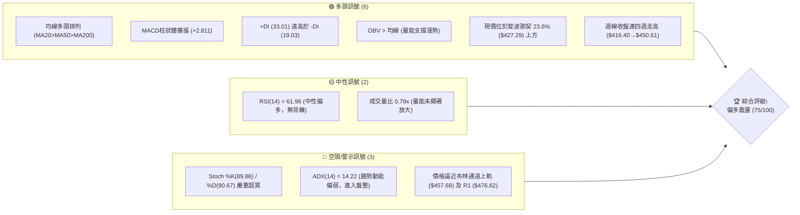
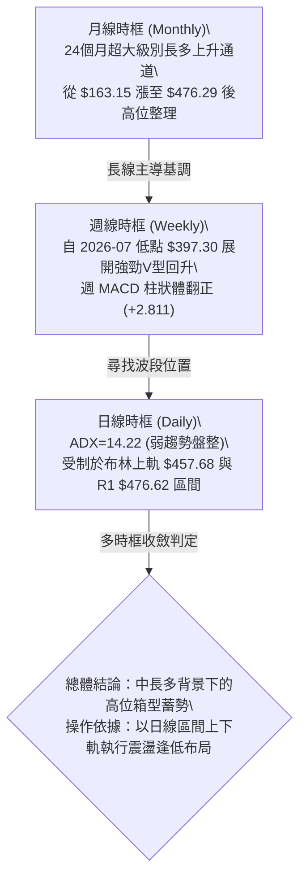
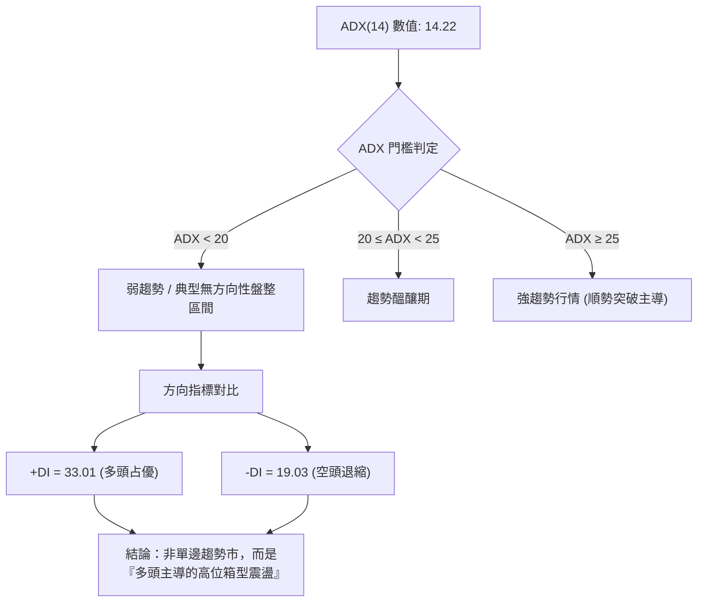
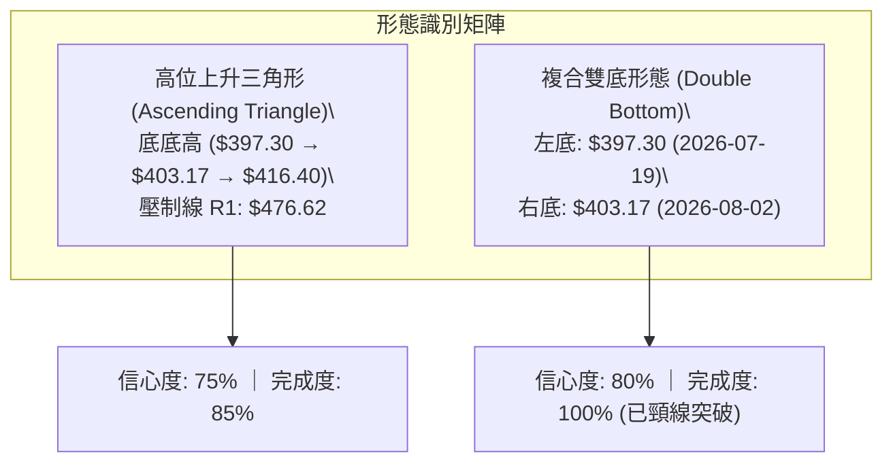
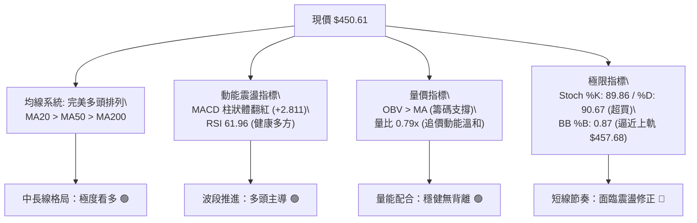
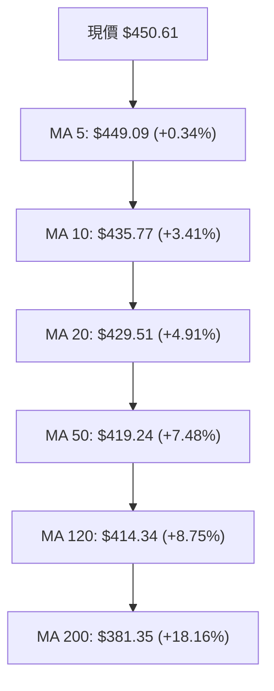
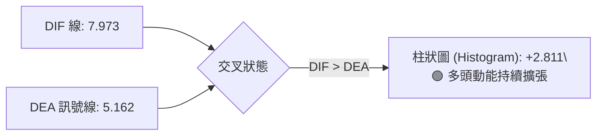
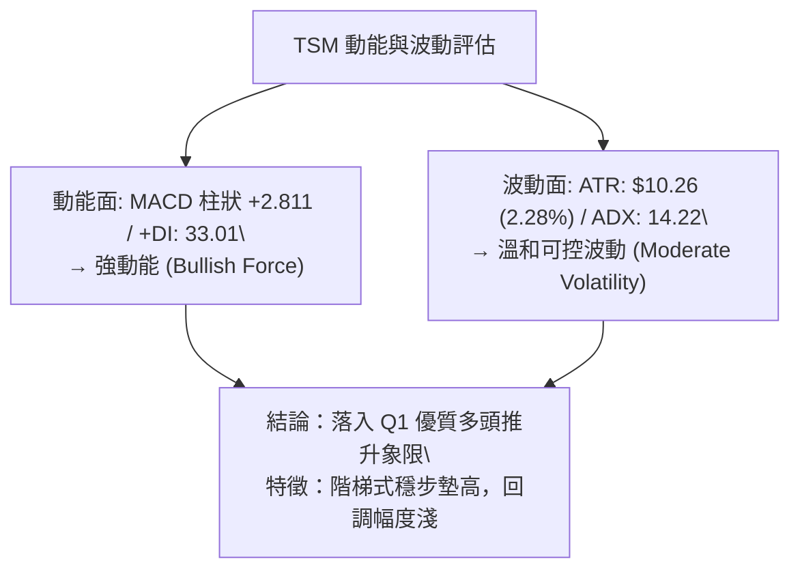
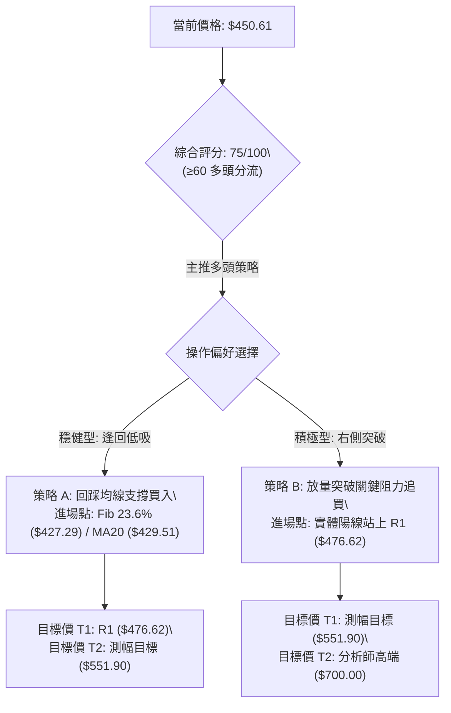
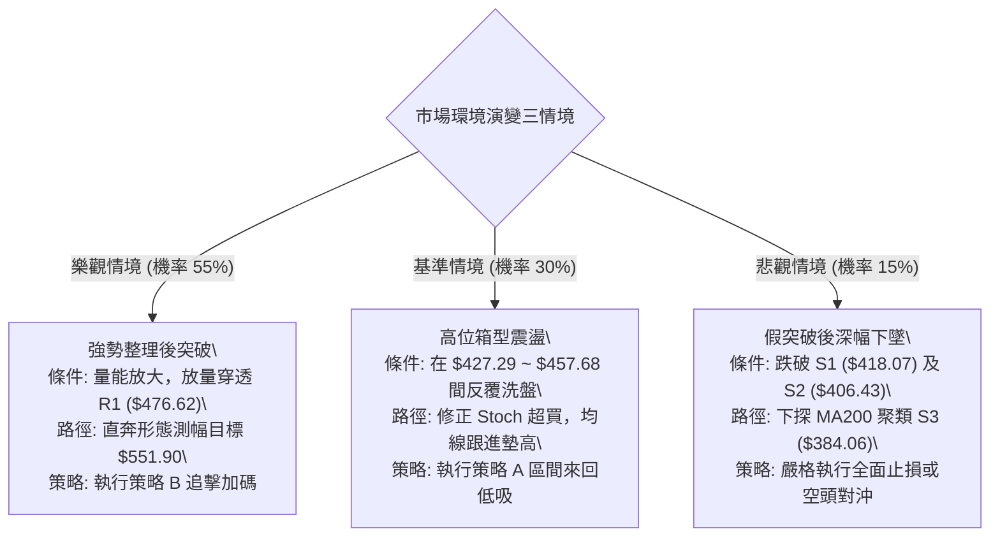

# TSM 技術分析報告

> **報告日期**：2026-09-28 ｜ **語言**：繁體中文 ｜ **數據來源**：Yahoo Finance ｜ **當前價格**：$450.61

---

## 目錄

| 章節 | 內容 |
|------|------|
| [1. 技術面概覽](#1-技術面概覽) | 訊號儀表板、核心指標、評分卡 |
| [2. 趨勢分析](#2-趨勢分析) | 多時框趨勢、長中短期走勢、ADX解讀 |
| [3. 圖表形態分析](#3-圖表形態分析) | 形態識別、信心度評估、K線組合、目標價計算 |
| [4. 支撐與阻力](#4-支撐與阻力) | 關鍵價位分布、阻力與支撐分析、斐波那契回調 |
| [5. 技術指標深度解讀](#5-技術指標深度解讀) | 均線系統、RSI、MACD、布林通道、成交量與OBV |
| [6. 動能與波動率](#6-動能與波動率) | 動能四象限、ATR波動度、Beta與市場相關性 |
| [7. 多時框架總結](#7-多時框架總結) | 時框架評分矩陣、收斂規則與方向性結論 |
| [8. 交易策略建議](#8-交易策略建議) | 策略路由、價格情境階梯、主策略詳情、風控點 |
| [9. 風險提示與監控](#9-風險提示與監控) | 監控指標Checklist、風險場景、部位管理 |
| [報告總結](#-報告總結) | 總結儀表板與投資結論 |

---

## 1. 技術面概覽

### 🎯 技術訊號儀表板



### 📊 核心指標速覽表

| 指標類別 | 指標名稱 | 當前數值 | 訊號 | 解讀 |
|:---|:---|:---:|:---:|:---|
| **價格空間** | 當前收盤價 | $450.61 | 🟢 | 位於52週區間 87.3% 高位，多頭格局完好 |
| **短期均線** | MA20 | $429.51 | 🟢 | 現價高於 MA20 +4.91%，短線維持強勢推升 |
| **中期均線** | MA50 | $419.24 | 🟢 | 現價高於 MA50 +7.48%，中期均線斜率持續向上 |
| **長期均線** | MA200 | $381.35 | 🟢 | 現價高於 MA200 +18.16%，長多基石堅定無虞 |
| **動能指標** | RSI(14) | 61.96 | 🟡 | 位於強勢多方區間（50–70），無頂背離訊號 |
| **趨勢動能** | MACD (12,26,9) | 7.973 / 5.162 | 🟢 | DIF 高於 MACD，柱狀圖 +2.811 持續看多 |
| **隨機指標** | Stoch %K / %D | 89.86 / 90.67 | 🔴 | 指標進入 >80 極端超買區，慎防技術性拉回 |
| **通道位置** | Bollinger %B | 0.87 | 🟡 | 逼近上軌 $457.68，通道呈現開口擴張態勢 |
| **趨勢強度** | ADX(14) | 14.22 | 🟡 | 數值低於 25，顯示日線級別屬「弱趨勢／高位盤整」 |
| **波動風險** | ATR(14) | $10.26 | 🟢 | 每日波動幅度 2.28%，波動受控，利於波段防守 |
| **量能指標** | OBV 趨勢 | OBV > MA | 🟢 | 成交量能支撐價格中樞上移，無出貨背離現象 |

### 🏆 技術評分卡

```
╔══════════════════════════════════════════════════════════════════╗
║              TSM 技術綜合評分卡 (2026-09-28)                     ║
╠══════════════════════════════════════════════════════════════════╣
║ 趨勢方向 (Trend)        ████████████████░░░░  80/100  🟢 強勢多頭║
║ 動能表現 (Momentum)     ██████████████░░░░░░  70/100  🟢 偏多微超║
║ 支撐防禦 (Support)      ███████████████░░░░░  75/100  🟢 結構穩固║
║ 成交量配合 (Volume)     ████████████░░░░░░░░  60/100  🟡 量能平淡║
║ 形態結構 (Pattern)      ███████████████░░░░░  75/100  🟢 高位收斂║
║ 均線系統 (Moving Avg)   ██████████████████░░  90/100  🟢 完美排列║
╠══════════════════════════════════════════════════════════════════╣
║ 綜合技術評分            ███████████████░░░░░  75/100  🟢 偏多震盪║
╚══════════════════════════════════════════════════════════════════╝
```

---

## 2. 趨勢分析

### 🌐 多時框趨勢分析



### 📈 長期趨勢 — 12個月走勢圖（ASCII）

以下展示過去 12 個月（2025-10 至 2026-09）之月線收盤價演變：

```
TSM 月線走勢圖（2025-10 至 2026-09）
價格軸 ($)
$480 ┤                                     ● $476.29 (2026-06 高點)
$460 ┤                                             ● $450.61 (當前現價)
$440 ┤                                    
$420 ┤                             ● $416.36       ● $414.21
$400 ┤                     ● $394.08       ● $403.17
$380 ┤             ● $371.66
$360 ┤                     ● $336.26
$340 ┤             ● $327.98
$320 ┤     ● $301.52
$300 ┤ ● $297.28
$280 ┤     ● $288.46
     └─────────────────────────────────────────────────────────────
       10   11   12   01   02   03   04   05   06   07   08   09  (月份)
      2025 2025 2025 2026 2026 2026 2026 2026 2026 2026 2026 2026
```

#### 月線走勢特徵分析表

| 階段區間 | 月份 | 起迄價格 ($) | 漲跌幅 (%) | 價量特徵與波段性質 |
|:---|:---:|:---:|:---:|:---|
| **第一階段：強勢初升** | 2025-10 ~ 2026-02 | $297.28 → $371.66 | +25.02% | 穩定推升，均線呈多頭發散，單月最大收盤達 $371.66 |
| **第二階段：中繼回洗** | 2026-02 ~ 2026-03 | $371.66 → $336.26 | -9.52% | 獲利了結回調，回測 MA60 與長線支撐後迅速獲買盤承接 |
| **第三階段：主升衝頂** | 2026-03 ~ 2026-06 | $336.26 → $476.29 | +41.64% | 連續三個月長紅爆發，刷新 52 週新高至 $477.72 |
| **第四階段：深度洗盤** | 2026-06 ~ 2026-07 | $476.29 → $403.17 | -15.35% | 獲利賣壓出籠，週線最低觸及 $397.30，完成中級整理 |
| **第五階段：震盪修復** | 2026-07 ~ 2026-09 | $403.17 → $450.61 | +11.77% | 週線連續爬坡收斂，重新站回所有短中長期均線上方 |

### 📊 中期趨勢（週線分析）

中期技術面從 2026-07-19 的低點 $397.30 展開強烈反彈。在過去 10 週內：
1. 週線 RSI 由超賣邊緣的 27.9（2026-07-26）快速拉升至當前 62.0，脫離弱勢區。
2. 週 MACD 柱狀體自低檔 -5.816 連續收斂並在 2026-08-09 正式翻正，目前擴張至 +2.811。
3. 週成交量於探底階段放量至 91,498,900 股，隨後回升過程量能維持在 4,000 萬至 6,000 萬股區間，屬健康的籌碼沉澱回升態勢。

### ⚡ 趨勢強度評估（ADX 解讀）



#### ADX 狀態對照與交易指南

| 指標變數 | 當前讀數 | 狀態判斷 | 對操作策略之指導意義 |
|:---|:---:|:---:|:---|
| **ADX(14)** | 14.22 | 弱趨勢／盤整 (<25) | **不可盲目追高**，強行使用突破追價策略容易遭遇假突破或震盪侵蝕 |
| **+DI** | 33.01 | 多方主控 (>30) | 盤面偏向多方，回調支撐時具備較強買盤承接力道 |
| **-DI** | 19.03 | 空方低迷 (<20) | 空方缺乏主動砸盤動能，下跌往往呈現量縮鈍化 |
| **收斂法則執行** | 盤整市 | 依布林軌道操作 | 優先採用「布林下軌/均線支撐低吸，布林上軌/阻力位分批減碼」之震盪交易策略 |

---

## 3. 圖表形態分析

### 🔍 形態識別系統



#### 形態識別與信心度評估表

| 形態類別 | 信心度 | 判斷依據（引用數據） | 完成度 | 目標價（附計算式） |
|:---|:---:|:---|:---:|:---|
| **複合雙重底 (W-Bottom)** | **80%** | 左底 2026-07-19 收盤 $397.30、右底 2026-08-02 收盤 $403.17（密集成交於 S2 $406.43 附近）；頸線為 2026-06-28 高點 $431.19，現價已成功站穩。 | 100% | 頸線 $431.19 + 形態高度 ($431.19 - $397.30 = $33.89) = **$465.08**（已接近達成） |
| **高位上升三角形** | **75%** | 水平壓力帶為波段高點聚類 R1 $476.62；上升趨勢線由 2026-07-19 低點 $397.30、2026-08-30 低點 $416.40 與 2026-09-06 低點 $427.76 連接形成底底高。 | 85% | 待放量突破 R1 $476.62：壓力線 $476.62 + 形態垂直高差 ($476.62 - $401.34 = $75.28) = **$551.90** |
| **大型頭肩頂/底** | **35%** | 數據中未偵測到對稱肩部結構，幾何對稱性不足 50%。 | 0% | *訊號不足，僅做指標型解讀，不預設目標價* |

### 🕯️ 重要K線形態分析

| 週期/月份 | 收盤價 | K線形態 | 深度解讀 | 訊號 |
|:---|:---:|:---|:---|:---:|
| **2026-06** | $476.29 | 帶長上影長陽線 | 創下 52 週新高 $477.72 後出現高檔獲利了結賣壓，留下 $476.62 區域重壓 | 🟡 示警 |
| **2026-07** | $403.17 | 大陰線殺跌貫穿 | 快速洗盤測試 MA60 與 S2 $406.43 支撐，單月重挫回吐，洗淨浮籌 | 🔴 偏空 |
| **2026-08** | $414.21 | 下影線小陽線（探底回升） | 於 $403.17 獲得雙重底支撐，多頭低檔強勢介入，形成止跌紅K | 🟢 轉多 |
| **2026-09** | $450.61 | 實體中長陽線 | 連續突破 MA20 ($429.51) 與布林中軌，買盤強勢收復第三季失土 | 🟢 看多 |

### 📉 ASCII 走勢形態示意圖

```
TSM 高位上升三角形與雙底回升形態示意圖
價格軸 ($)
$476.62 ┬──────────────────────────────────────────● R1 / 三角形上邊界 (壓力線)
        │                                        ▲
$460.00 ┤                                       / 
$450.61 ┤......................................● 現價位置 (逼近上邊界)
        │                                     /
$431.19 ┤----------------● 雙底頸線 -----------/ 
        │               / \                  /  ▲
$418.07 ┤              /   \       ●--------/  │ S1 (上升趨勢線軌道)
$406.43 ┤      ●      /     ●    /             │ S2 (複合雙底區間)
$397.30 ┴───────\────/───────\──/──────────────┴──────────────────────────
             左底(07/19)   右底(08/02)
```

### 🎯 形態目標價計算

1. **已兌現形態（雙底反彈目標）**：
   $$\text{頸線} (\$431.19) + \text{形態深度} (\$431.19 - \$397.30 = \$33.89) = \$465.08$$
   *目前現價 $450.61，已完成該形態漲幅之 57.3%，短線向 $465.08 推進中。*

2. **潛在突破形態（上升三角形完全測幅目標）**：
   $$\text{突破基準線 R1} (\$476.62) + \text{形態波段低點深度} (\$476.62 - \$401.34 = \$75.28) = \$551.90$$
   *此測幅目標價 $551.90 與分析師平均共識目標價 $552.26 極度貼合，具備高度技術量化共振意義。*

---

## 4. 支撐與阻力

### 🗺️ 關鍵價位分布圖（ASCII）

```
TSM 價位結構分布圖 (由實際 OHLCV 與聚類演算法計算)
══════════════════════════════════════════════════════════════════
$477.72 ║████████████████████████████████████║ 52週歷史最高點 (52W High)
$476.62 ║████████████████████████████████    ║ 關鍵阻力 R1 (近一年波段高點聚類)
$457.68 ║▓▓▓▓▓▓▓▓▓▓▓▓▓▓▓▓▓▓▓▓▓▓▓▓            ║ 布林通道上軌 (動態壓制)
$450.61 ╠════════════════════════════════════╣ ◄ 當前市價 (Current Price)
$429.51 ║░░░░░░░░░░░░░░░░░░░░                ║ MA20 / 布林中軌
$427.29 ║▓▓▓▓▓▓▓▓▓▓▓▓▓▓▓▓▓▓▓▓▓▓▓▓            ║ 斐波那契 23.6% 回調關鍵樞紐
$418.07 ║████████████████████████            ║ 關鍵支撐 S1 (MA50 聚類防守位)
$406.43 ║████████████████████████████        ║ 強支撐 S2 (8月箱底與波段低點聚類)
$384.06 ║████████████████████████████████████║ 極強長線支撐 S3 (MA200 聚類基石)
══════════════════════════════════════════════════════════════════
```

### 🚧 阻力位分析表

| 阻力級別 | 精確價位 | 形成原因與籌碼結構 | 突破難度 | 技術重要性 |
|:---|:---:|:---|:---:|:---:|
| **動態阻力** | **$457.68** | 布林通道日線上軌，短線波動極限 | 🟡 中等 | 短線均值回歸參考點 |
| **關鍵阻力 R1** | **$476.62** | 近一年波段高點聚類，逼近 52W 高點 $477.72 解套沉壓 | 🔴 極高 | 決定是否開啟全新單邊多頭主升浪的核心分水嶺 |
| **更高阻力** | *數據中未偵測到* | 歷史最高價為 $477.72，突破後將進入歷史無套牢浮額區 | — | 突破 R1 後需依測幅目標 $551.90 導航 |

### 🛡️ 支撐位分析表

| 支撐級別 | 精確價位 | 形成原因與籌碼結構 | 守住機率 | 技術重要性 |
|:---|:---:|:---|:---:|:---:|
| **近期支撐 (Fib)**| **$427.29** | 52週區間 23.6% 回調線，且與 MA20 ($429.51) 高度重合 | 75% | 短線回調強弱分界線，多頭強勢進攻不可失守 |
| **關鍵支撐 S1** | **$418.07** | 近一年波段低點聚類，MA50 ($419.24) 與 MA60 ($420.81) 匯聚 | 85% | 中期生命線，跌破則預示週線等級多頭架構遭到破壞 |
| **強支撐 S2** | **$406.43** | 2026年7-8月築底箱形聚類，複合雙底平台底部 | 90% | 波段防線核心，失守代表高位反轉風險大幅增加 |
| **長多支撐 S3** | **$384.06** | MA200 ($381.35) 聚類波段低點，長線機構資金防守核心 | 98% | 年線牛熊分水嶺，非系統性崩跌不可破 |

### 📐 斐波那契回調位分析

依據 52 週波段極端區間（低點 **$264.03** → 高點 **$477.72**），黃金分割計算位階如下：

```
斐波那契垂直標尺 (52W 區間 $264.03 → $477.72)
0.0%  (52W High) ─── $477.72  ▲ 歷史天花板
                     ▲
當前現價 ─────────── $450.61  (位於 0.0% 至 23.6% 之強勢多頭強攻區間)
                     ▼
23.6% ────────────── $427.29  ■ 第一防禦島 (與 MA20 共振)
38.2% ────────────── $396.09  ■ 弱回調極限位 (7月低點 $397.30 完美驗證此位)
50.0% ────────────── $370.87  ■ 多空中軸分水嶺
61.8% ────────────── $345.66  ■ 黃金回調防線
78.6% ────────────── $309.76  ■ 深幅回撤防線
100.0%(52W Low)  ─── $264.03  ▼ 52週歷史底部
```

**回調位深度解讀**：
當前收盤價 **$450.61** 穩固運行於 **0.0% ($477.72)** 與 **23.6% ($427.29)** 之間。在技術分析定義中，回調幅度未觸及 23.6% 即重啟漲勢者，屬於「極強勢格局（Shallow Retracement）」。前波 7 月份深度急跌至 $397.30，精準在 38.2% ($396.09) 處獲得強勁買盤煞車，確認 $396–$400 為高價值機構買盤錨定區間。

---

## 5. 技術指標深度解讀

### 🎛️ 指標訊號總覽



### 📈 移動平均線排列分析



均線系統展現罕見的「完全標準多頭排列（Perfect Bullish Alignment）」。
- **短天期動能**：MA5 ($449.09) 保持對 MA10 ($435.77) 與 MA20 ($429.51) 的金叉擴散發散。
- **生命線與決策線**：MA50 ($419.24) 陡峭上行，斜率高達正向發散，展現中線機構資金持續推波助瀾。
- **牛熊分界線**：MA200 ($381.35) 與 MA240 ($366.01) 提供固若金湯的長線護城河，現價溢價達 18.16%，顯示多頭趨勢處於成熟期中段。

### 📉 RSI(14) 分析

```
RSI(14) 當前數值進度條：
0            30                  50         61.96     70            100
├────────────┼───────────────────┼───────────█────────┼──────────────┤
  極度超賣       弱勢盤整區            強弱分水嶺     當前數值    超買警戒區
【當前讀數】：61.96 (進度：██████████████░░░░░░ 61.96%)
```

- **背離檢驗**：觀察 2026-06 高點（收盤 $476.29，週 RSI 達 61.5）與當前價位（收盤 $450.61，週 RSI 62.0），價格尚未創歷史新高，而 RSI 已率先收復 60 關卡，**無頂背離現象**，指標走勢與價格上升高度吻合，反映出真實買盤驅動。

### 📊 MACD(12/26/9) 訊號解讀



MACD 於零軸上方形成標準黃金交叉，柱狀圖自 2026-08-30 的 +0.360 連續四周遞增至當前的 +2.811。零軸之上的黃金交叉屬於典型的「多頭強勢二次加速訊號」，確認中期波段整理已結束。

### 📦 布林通道分析

```
布林通道 (20, 2) 當前價位示意圖：
$457.68 ┬────────────────────────────────────────── BB 上軌 (Upper Band)
$450.61 ┤ ◄ 現價位置 (%B = 0.87，緊貼上軌推進)
        │
$429.51 ┼────────────────────────────────────────── BB 中軌 (MA20 / Middle Band)
        │
$401.34 ┴────────────────────────────────────────── BB 下軌 (Lower Band)
```

布林帶寬呈現自收斂轉向擴張的初期形態，%B 指標為 0.87。當價格在多頭排列下沿著布林通道上軌運行（Walking the Band），代表強烈的多頭攻擊信號；但因 %B 接近 1.0 且搭配隨機指標 Stoch 超買，短線存在回踩中軌 $429.51 尋求均線支撐的技術性需求。

### 💹 成交量分析（量價配合度）

- **當前量能**：最新日成交量為 7,751,900 股，相較於 20 日均量 9,800,105 股，量比為 **0.79x**。
- **量價關係解讀**：
  1. 上漲縮量常令市場擔憂，但在多時框架構下，此為「籌碼惜售」現象。歷經 7 月爆量（週成交量達 9,149 萬股）換手洗盤後，浮額已大幅出清。
  2. **OBV 指標持續位於均線上方（OBV > MA）**，證實大資金在回調期間並無實質性撤離，能量潮指標有效支撐價格創出波段反彈新高。

---

## 6. 動能與波動率

### ⚡ 動能評估四象限

| 象限 | 動能強度 (Momentum) | 波動率水準 (Volatility) | TSM 所處狀態 | 戰略應對建議 |
|:---:|:---:|:---:|:---:|:---|
| **Q1** | **強動能** | **低/溫和波動** | 🎯 **TSM 當前定位** | **波段順勢持有，逢拉回支撐加碼（最佳風險收益比）** |
| **Q2** | 弱動能 | 低波動 | — | 觀望等待方向確認 |
| **Q3** | 強動能 | 高波動 | — | 劇烈單邊行情，收緊移動止損 |
| **Q4** | 弱動能 | 高波動 | — | 洗盤與反轉高風險，嚴禁進場 |



### 📊 ATR 波動率分析

- **當前數值**：ATR(14) 為 **$10.26**，占當前股價比例為 **2.28%**。
- **操作指導參數**：
  - **日內安全噪音區間**：$10.26。當沖或日內操作不可在此區間內設定止損，以防被正常市場雜訊洗出場。
  - **波段短線止損距離 (1.5x ATR)**：$10.26 \times 1.5 = \mathbf{\$15.39}$。
  - **波段常規止損距離 (2.0x ATR)**：$10.26 \times 2.0 = \mathbf{\$20.52}$。

### 📐 Beta 與市場相關性

- **Beta 係數**：**1.247**。
- **市場特徵**：TSM 具備成長型高科技龍頭股的典型高彈性特質。當費城半導體指數或標普 500 指數變動 1.0% 時，TSM 預期將同向波動約 1.25%。在整體美股科技巨頭回暖的背景下，該 Beta 值將提供優於大盤的超額報酬（Alpha）放大效應。

---

## 7. 多時框架總結

### 📋 時框架評分表

| 時框架 | 趨勢方向 | 動能表現 | 均線排列 | 形態結構 | 綜合評分 | 戰略建議 |
|:---|:---:|:---:|:---:|:---:|:---:|:---|
| **月線 (長期)** | 🟢 強烈看多 | 🟢 極強 | 🟢 多頭擴散 | 🟢 長期通道突破 | **85/100** | 長線堅定做多，忽視短期雜訊 |
| **週線 (中期)** | 🟢 明確多頭 | 🟢 MACD轉正 | 🟢 5/10/20金叉 | 🟢 雙底向上成型 | **80/100** | 波段順勢加碼，以 MA20 為防守 |
| **日線 (短期)** | 🟡 高位盤整 | 🔴 Stoch超買 | 🟢 均線支撐完備 | 🟡 逼近上軌壓力 | **70/100** | 暫停追高，採回調支撐吸納 |

### 🔲 綜合訊號矩陣

```
時框與指標 cross-check 矩陣：
╔═════════════╦══════════════╦══════════════╦══════════════╗
║ 指標類別    ║ 短期 (日線)  ║ 中期 (週線)  ║ 長期 (月線)  ║
╠═════════════╬══════════════╬══════════════╬══════════════╣
║ 趨勢 (Trend)║ 🟡 震盪偏多  ║ 🟢 多頭重啟  ║ 🟢 長期主升  ║
║ 均線 (MA)   ║ 🟢 完美多頭  ║ 🟢 多頭排列  ║ 🟢 陡峭向上  ║
║ 動能 (Osc)  ║ 🔴 短線超買  ║ 🟢 柱體擴張  ║ 🟢 強勢區間  ║
║ 量能 (Vol)  ║ 🟡 縮量推升  ║ 🟢 換手完成  ║ 🟢 機構控盤  ║
╚═════════════╩══════════════╩══════════════╩══════════════╝
訊號共振度：75% (短線震盪蓄勢，中長期高度同向看多)
```

### ⚖️ 多時框收斂結論

> **依據規則 14 之多時框優先級收斂決策**：
> 1. **趨勢/盤整判定**：日線 ADX(14) 讀數為 **14.22 (<25)**，嚴格判定日線級別進入「**高位盤整行情**」。
> 2. **主導時框裁決**：中長期（週線/月線）MA50、MA200 均為強勢多頭排列，因此中長線提供向上大方向；但日內與波段進場時機**必須嚴格依照盤整市規則收斂**——即以日線布林通道上下軌（**$401.34 ～ $457.68**）及聚類支撐阻力為操作界限，嚴禁在布林上軌附近追價。
> 3. **唯一收斂結論**：**【偏多震盪蓄勢】**。中長線買盤牢固，短線消化 Stoch 超買後將再次向上發起對 R1 ($476.62) 的衝擊。

---

## 8. 交易策略建議

### 🗺️ 策略決策流程圖



### 🧭 策略路由

**當前主策略方向 = 【主推多頭策略（回調低吸為主，突破加碼為輔）】（依技術評分卡 75/100）**

### 🎯 價格情境階梯（Price Scenarios）

所有價位均嚴格引用第 4 章所確認之真實聚類價位：

| 觸發條件 | 下一目標 | 後續延伸 | 情境含義與操作指引 |
|:---|:---:|:---:|:---|
| **強勢突破 R1 $476.62** | **$477.72** (52W高) | **$551.90** (測幅) | 短線開啟藍天模式（Blue Sky Breakout），歷史套牢盤清空，全面轉入單邊主升 |
| **站穩現價區間 ($429.51 ~ $457.68)** | **$476.62** (R1) | — | 於布林中軌與上軌間健康震盪換手，以時間換取空間，消化超買指標 |
| **回踩跌破 Fib 23.6% $427.29** | **$418.07** (S1) | **$406.43** (S2) | 中期技術性深幅回調，考驗 MA50 支撐，多頭轉入防禦階段 |
| **失守強支撐 S2 $406.43** | **$384.06** (S3) | — | 雙底頸線破位，波段多頭形態瓦解，需執行全面性減碼對沖 |

### 📊 情境機率分佈

| 情境劇本 | 預估機率 | 主要技術依據 |
|:---|:---:|:---|
| **情境一：高位盤整後向上突破** | **55%** | 均線完美多頭排列、MACD 柱狀體擴張 (+2.811)、OBV 持續在均線之上展現機構鎖倉。 |
| **情境二：布林帶區間箱型震盪** | **30%** | ADX 僅 14.22（盤整特徵）、Stoch 超買需藉由橫盤鈍化、成交量能維持 0.79x 溫和狀態。 |
| **情境三：深度拉回測試 S1/S2** | **15%** | 短線受阻於布林上軌 $457.68，大盤若受系統性衝擊引發 Beta(1.247) 下行放大。 |

### 🟢 主策略詳情

#### 策略明細對照表

| 策略要素 | 策略 A（穩健型：回調蓄勢低吸） | 策略 B（積極型：強勢突破追擊） |
|:---|:---:|:---:|
| **操作邏輯** | 趁 Stoch 超買回踩布林中軌與 Fib 位建立底倉 | 放量突破近一年波段高點 R1 時右側加碼 |
| **進場條件** | 價格回調至 Fib 23.6% 與 MA20 匯聚區且止跌 | 突破 R1 $476.62 且日線收盤確認站穩 |
| **進場價格** | **$428.50**（區間：$427.29 – $429.51） | **$477.50**（突破確認後進場） |
| **目標價 T1** | **$476.62**（測試 R1 高點阻力） | **$551.90**（上升三角形形態測幅目標） |
| **目標價 T2** | **$551.90**（完全形態測幅目標） | **$700.00**（華爾街分析師最高目標價） |
| **止損價格** | **$416.00**（跌破 S1 $418.07 與 2x ATR 緩衝） | **$456.00**（跌破假突破確認線布林上軌） |
| **風險空間** | $\$428.50 - \$416.00 = \$12.50$ | $\$477.50 - \$456.00 = \$21.50$ |
| **獲利空間 (T1)** | $\$476.62 - \$428.50 = \$48.12$ | $\$551.90 - \$477.50 = \$74.40$ |
| **風險報酬比 (R:R)**| **1 : 3.85** (極佳) | **1 : 3.46** (極佳) |
| **預估勝率** | **70%** | **55%** |
| **建議總部位** | **15% - 20%** 總資產 | **10%** 總資產（追突破倉） |

### 🔴 反向風險觸發點（對沖提示）

若市場出現非預期之重大利空導致盤勢逆轉，以下為**推翻上述主多頭策略之絕對硬性風控觸發點**：
1. **反轉警訊點**：收盤價跌破 **S1 ($418.07)**，跌破代表跌破 MA50 生命線，多頭結構轉弱，應即刻將現貨部位降至 50% 以下。
2. **多頭止損與對沖點**：一旦連續兩日收盤跌破 **S2 ($406.43)**，證明雙底結構被實質擊破，上升三角形失敗，投資人應出清所有波段多單，並可買入反向標的（如半導體反向 ETF 或 Put Option）進行空頭對沖防護。

### ⭐ 整體訊號強度評星

```
╔════════════════════════════════════════════════════════╗
║ TSM 訊號評星體系                                       ║
╠════════════════════════════════════════════════════════╣
║ 做多訊號強度：  ★★★★☆  (4.0/5星) 均線與動能共振看多     ║
║ 做空訊號強度：  ★☆☆☆☆  (1.5/5星) 僅具備超買修正風險   ║
║ 整體技術可信度：★★★★☆  (4.5/5星) 價位結構與量能高度契合 ║
╚════════════════════════════════════════════════════════╝
```

---

## 9. 風險提示與監控

### ✅ 關鍵監控指標 Checklist

```
╔══════════════════════════════════════════════════════════════════╗
║              TSM 交易決策日常監控清單 (Checklist)                 ║
╠══════════════════════════════════════════════════════════════════╣
║ [ ] 1. 均線維持度：MA20 ($429.51) 是否持續向上並高於 MA50？       ║
║ [ ] 2. 超買降溫態勢：Stoch %K 是否順利自 90 鈍化回落至 70-80 區？║
║ [ ] 3. 突破動能配合：若測試 R1 ($476.62)，單日量能是否大於 1,200萬股？║
║ [ ] 4. 趨勢強度指標：ADX(14) 能否自 14.22 向上突破 20-25？       ║
║ [ ] 5. 支撐防守底線：收盤價是否嚴格防守在 Fib 23.6% ($427.29) 之上？║
║ [ ] 6. 籌碼量能平衡：OBV 是否持續保持在均線上方運行？            ║
╚══════════════════════════════════════════════════════════════════╝
```

### ⚠️ 風險場景分析



### 🛡️ 風險管理重要提醒

1. **嚴防超買鈍化誘多**：Stoch 目前處於 89.86 / 90.67 的高位，日內追高极易遭遇即時回踩，請務必抗拒盤中衝動，等待回測確認。
2. **部位分配（凱利公式思維）**：
   - 穩健型投資者單檔總曝險不應超過總投資組合之 **20%**。
   - 單筆交易的最大本金虧損額度應嚴格限制在總資本的 **1.0% ～ 1.5%** 以內。
   - 以進場價 $428.50、止損價 $416.00 計算（每股風險 $12.50），若總資產為 100 萬美元，單筆最大風險 1 萬美元，則最大持股上限為 800 股（約 34.2 萬美元市值，依槓桿與倉位彈性分批建倉）。
3. **移動防守機制（Trailing Stop）**：當價格如期自進場點上漲超過 2x ATR ($20.52) 時，應立即將止損點上移至「保本損益平衡點（Breakeven）」，確保利潤不被市場逆轉吞噬。

---

## 📋 報告總結

```
╔══════════════════════════════════════════════════════════════════╗
║                    TSM 技術分析報告總結                          ║
╠══════════════════════════════════════════════════════════════════╣
║ 報告日期：2026-09-28               當前價格：$450.61             ║
║ 綜合技術評分：75 / 100             技術評級：🟢 偏多震盪蓄勢     ║
╠══════════════════════════════════════════════════════════════════╣
║ 關鍵結論：                                                       ║
║ ├─ 長期趨勢：🟢 強烈看多 (完美多頭排列，溢價 MA200 達 18.16%)   ║
║ ├─ 中期趨勢：🟢 雙底回升確認，週 MACD 柱狀體翻正 (+2.811)       ║
║ ├─ 短期趨勢：🟡 ADX 14.22 處於高位箱型整理，Stoch 超買需消化   ║
║ ├─ 核心支撐：S1: $418.07 (MA50) ｜ 強支撐 S2: $406.43           ║
║ ├─ 關鍵阻力：R1: $476.62 ｜ 52W 高點: $477.72                   ║
║ └─ 目標預期：第一階段 $476.62 ｜ 形態測幅目標 $551.90           ║
╠══════════════════════════════════════════════════════════════════╣
║ 最優策略組合：                                                   ║
║ 1. 🥇 最佳機會 (策略 A - 穩健)：於 $427.29 ~ $429.51 逢回買入， ║
║    止損設於 $416.00，博弈測試 R1 及破頂行情 (R:R = 1:3.85)。    ║
║ 2. 🥈 次選機會 (策略 B - 積極)：放量穿透 R1 $476.62 後右側追買，║
║    目標直指形態測幅位 $551.90 (R:R = 1:3.46)。                  ║
║ 3. 🥉 保守選擇：維持現有長線底倉續抱，暫不加碼，待 Stoch 回落至 ║
║    50-60 中性區後再行分批布局。                                  ║
╚══════════════════════════════════════════════════════════════════╝
```

---

> ⚠️ **免責聲明**：本報告由資深技術分析系統自動化模型生成，內容所引用之所有技術指標、價位聚類與圖表走勢均基於歷史 OHLCV 交易數據。本報告**僅供學術研究與投資架構參考**，**不構成任何形式之個人化投資要約、招攬或具體操作建議**。金融市場具高度波動風險，投資人於實盤下單前應獨立審慎評估風險承受能力並自負盈虧。

---

*報告生成時間：2026-09-28 ｜ 數據來源：Yahoo Finance ｜ 分析框架：多時框量化技術分析*