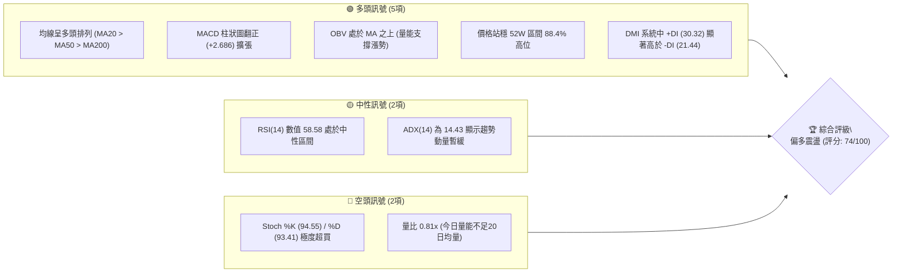
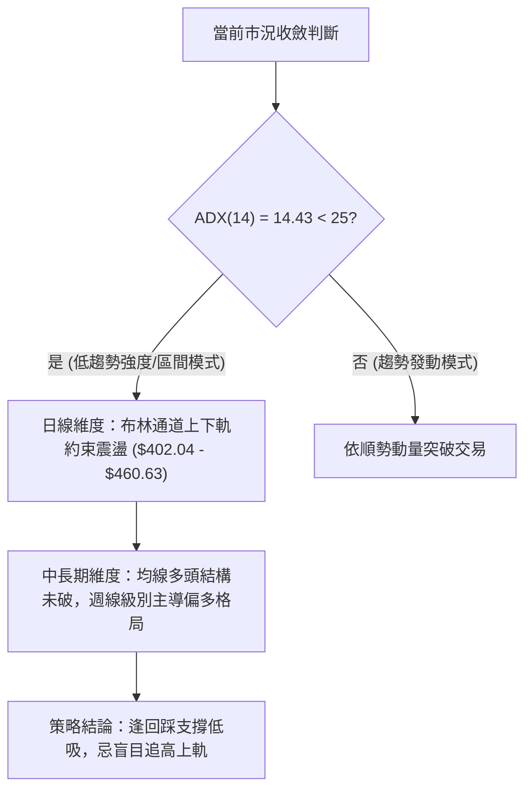
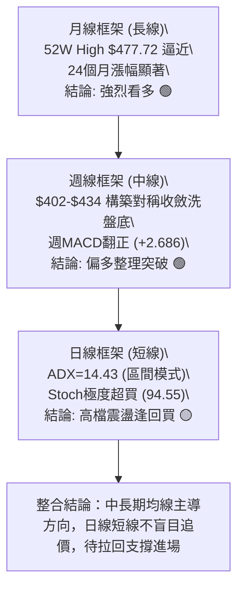
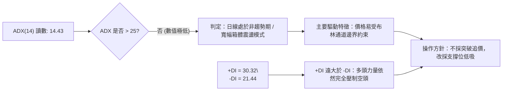
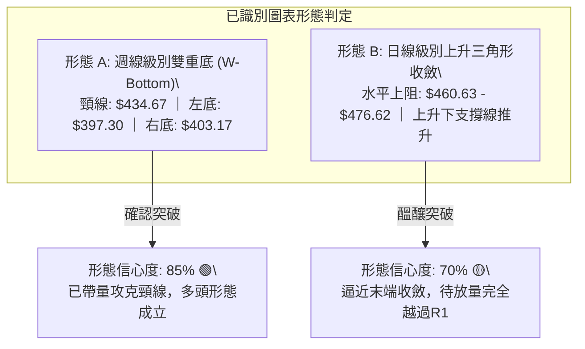
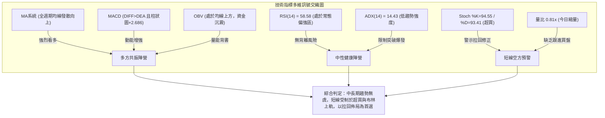
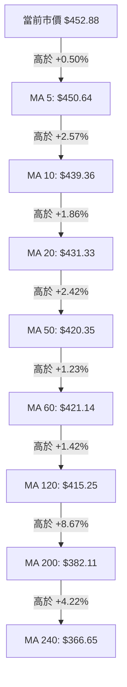
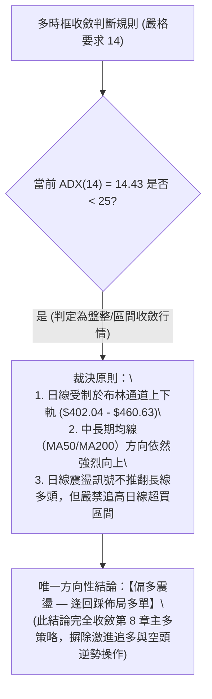
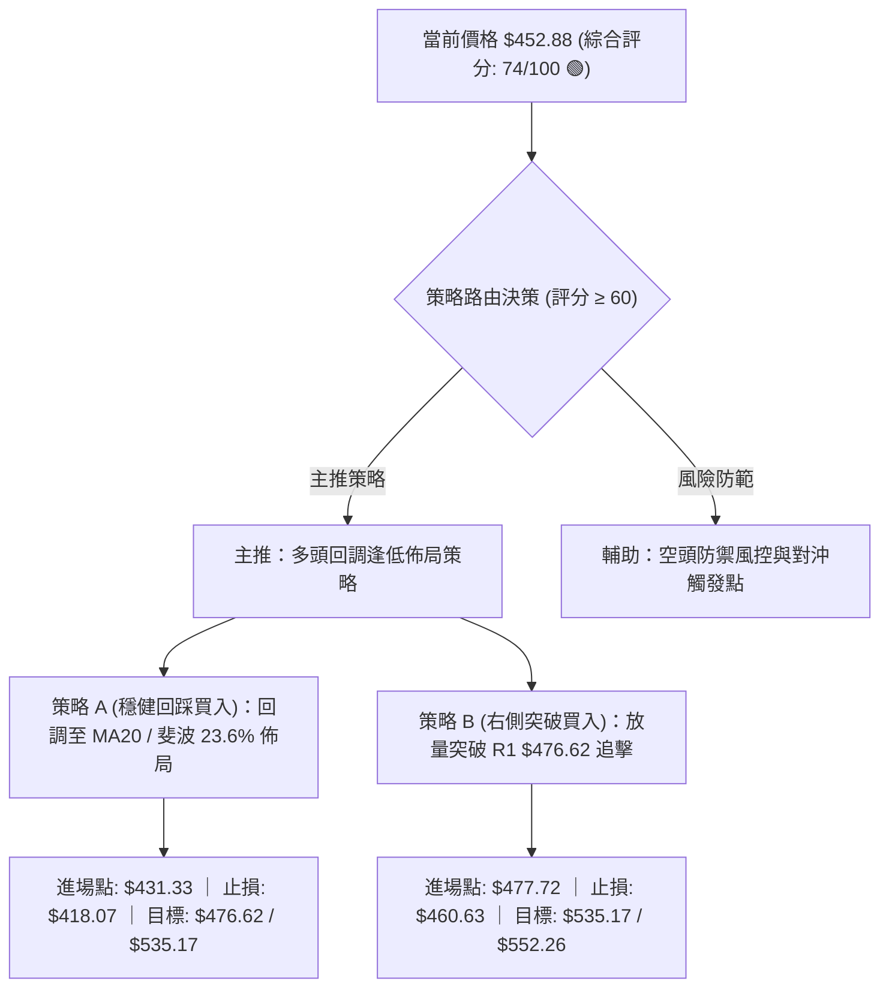
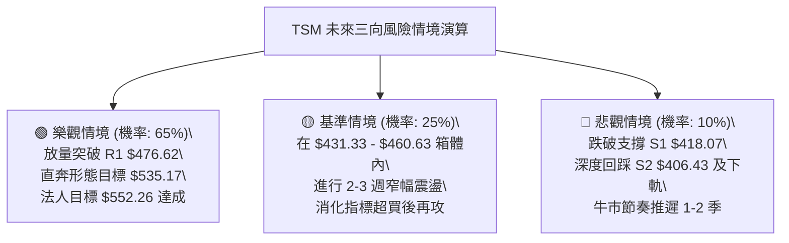

# TSM 技術分析報告

> **報告日期**：2026-09-29 ｜ **語言**：繁體中文 ｜ **數據來源**：Yahoo Finance ｜ **當前價格**：$452.88

---

## 目錄

| 章節 | 內容 |
|------|------|
| [1. 技術面概覽](#1-技術面概覽) | 訊號儀表板、核心指標、評分卡 |
| [2. 趨勢分析](#2-趨勢分析) | 多時框趨勢、長中短期走勢、ADX解讀 |
| [3. 圖表形態分析](#3-圖表形態分析) | 形態識別信心度、K線組合、目標價推算 |
| [4. 支撐與阻力](#4-支撐與阻力) | 關鍵價位結構、波段高低點聚類、斐波那契回調 |
| [5. 技術指標深度解讀](#5-技術指標深度解讀) | MA排列、RSI背離、MACD動能、布林通道、OBV量能 |
| [6. 動能與波動率](#6-動能與波動率) | 動能四象限、ATR波動分析、Beta敏感度 |
| [7. 多時框架總結](#7-多時框架總結) | 時框評分矩陣、收斂裁決原則 |
| [8. 交易策略建議](#8-交易策略建議) | 策略路由決策、價格情境階梯、主操作計劃 |
| [9. 風險提示與監控](#9-風險提示與監控) | 關鍵風控Checklist、三情境壓力測試、倉位紀律 |
| [📋 報告總結](#-報告總結) | 核心數據提煉、操作路線全景 |

---

## 1. 技術面概覽

### 🎯 技術訊號儀表板





### 📊 核心指標速覽表

| 指標類別 | 指標名稱 | 當前數值 | 訊號 | 解讀 |
|:---|:---|:---|:---:|:---|
| **價格** | 當前收盤價 | $452.88 | 🟢 | 位於52週區間88.4%高位，距歷史高點僅5.20% |
| **均線** | MA20 | $431.33 | 🟢 | 現價高於MA20達+5.00%，短期動能強勁 |
| **均線** | MA50 | $420.35 | 🟢 | 現價高於MA50達+7.74%，中期趨勢穩固 |
| **均線** | MA200 | $382.11 | 🟢 | 現價高於MA200達+18.52%，長期牛市基調明確 |
| **動能** | RSI(14) | 58.58 | 🟡 | 位於50-60健康強勢區，未見頂背離，未超買 |
| **動能** | MACD (12,26,9) | 8.520 / 5.834 | 🟢 | DIFF維持於DEA上方，Hist值達+2.686，多方發力 |
| **動能** | Stoch %K / %D | 94.55 / 93.41 | 🔴 | 進入90以上極端超買警戒區，短線存在拉回壓力 |
| **趨勢** | ADX (14) | 14.43 (+DI: 30.32) | 🟡 | 趨勢強度低於25，代表日線級別進入高檔整理箱體 |
| **通道** | Bollinger Bands | 上軌 $460.63 / %B: 0.87 | 🟡 | 價格逼近上軌壓力，布林帶寬尚寬，短期有壓 |
| **成交量** | Volume / 20MA | 7.86M / 9.75M (0.81x) | 🔴 | 量能稍顯不足，尚未出現機構主動推動的爆量突破 |
| **量能** | OBV | OBV > MA | 🟢 | 資金流向呈淨流入，長期累積能量並未隨修正退潮 |
| **波動** | ATR(14) | $10.04 (2.22%) | 🟢 | 波動率收斂至正常水平，有利於形成堅實價格平台 |

### 🏆 技術評分卡

```
╔══════════════════════════════════════════════════════════════╗
║              技術評分卡 — TSM (2026-09-29)                   ║
╠══════════════════════════════════════════════════════════════╣
║ 趨勢強度 (Trend)     ████████████░░░░░░░░  62/100 🟡 (ADX低)║
║ 動能指標 (Momentum)  ██████████████░░░░░░  72/100 🟢 (MACD強)║
║ 支撐穩定度 (Support) ████████████████░░░░  82/100 🟢 (回踩穩)║
║ 成交量配合 (Volume)  ████████████░░░░░░░░  60/100 🟡 (微縮量)║
║ 形態完整度 (Pattern) ████████████████░░░░  80/100 🟢 (突破底)║
║ 均線排列 (Moving Avg)██████████████████░░  90/100 🟢 (全多頭)║
╠══════════════════════════════════════════════════════════════╣
║ 綜合評分             ██████████████░░░░░░  74/100 🟢 偏多進攻║
╚══════════════════════════════════════════════════════════════╝
```

---

## 2. 趨勢分析

### 🌐 多時框趨勢分析



### 📈 長期趨勢 — 12個月走勢圖（Unicode）

TSM 在過去一年內完成了壯麗的階梯式牛市推進，自2025年9月的 $276.37 啟動，歷經兩波強勁推升，於2026年6月創下歷史級波段收盤價 $476.29，隨後於7至8月展開健康洗盤，目前9月收盤強勢回升至 $452.88。

```
TSM 月線走勢圖（過去12個月: 2025-10 至 2026-09）
價格軸 ($)
$480 ┤                                      ● (06月: $476.29)
$460 ┤                                                     ● (09月: $452.88)
$440 ┤
$420 ┤                                ● (05月: $416.36)   ● (08月: $414.21)
$400 ┤                          ● (04月: $394.08)   ● (07月: $403.17)
$380 ┤                    ● (02月: $371.66)
$360 ┤
$340 ┤              ● (01月: $327.98) ● (03月: $336.26)
$320 ┤
$300 ┤        ● (12月: $301.52)
$280 ┤  ● (10月: $297.28)
$260 ┤● (09月: $276.37)
     └───────────────────────────────────────────────────────────────────► 時間
       25-10  25-11  25-12  26-01  26-02  26-03  26-04  26-05  26-06  26-07  26-08  26-09
```

#### 走勢特徵分析表格

| 階段區間 | 時間段 | 價格區間 ($) | 區間漲跌幅 | 成交量與形態特徵 | 趨勢性質 |
|:---|:---|:---|:---:|:---|:---|
| **第一波主升段** | 2025-09 ~ 2026-02 | $276.37 → $371.66 | +34.48% | 月線連五紅，均線全面發散向上，機構換手推升 | 主升推動浪 |
| **中期健康回檔** | 2026-02 ~ 2026-03 | $371.66 → $336.26 | -9.52% | 獲利了結洗盤，回測MA60及斐波那契回調位支撐 | 次級修正浪 |
| **第二波主升段** | 2026-03 ~ 2026-06 | $336.26 → $476.29 | +41.64% | 突破 $400 整數關卡，伴隨AI晶片代工爆發性獲利增長 | 延伸擴張浪 |
| **高檔箱體整固** | 2026-06 ~ 2026-08 | $476.29 → $403.17 | -15.35% | 7月份大幅回檔至支撐位 S2 ($406.43) 及 $400 大關止跌 | 籌碼沉澱浪 |
| **多頭重啟回升** | 2026-08 ~ 2026-09 | $403.17 → $452.88 | +12.33% | 週線MACD底背離金叉，站回MA20並逼近前高阻力 R1 | 突破前夕浪 |

### 📊 中期趨勢（週線分析）

中期走勢展示了清晰的「雙重築底後收斂向上」結構。從2026年7月中旬低點 $397.30 與8月低點 $403.17 形成的雙重防線極度扎實，隨後展開五週連續紅K上攻。

```
TSM 近20週核心價格通道與高低點分布示意
$480 ┤══════════════════════════════════════ 52W High $477.72 / R1 $476.62
$460 ┤               ▲ ($460.88)                           ▲ 現價 $452.88
$440 ┤         ▲           ▲                               ▲ ($450.61)
$420 ┤   ▲           ▲           ▲           ▲ ($425.21) ▲
$400 ┤═════════════════════════════▼ ($397.30)═▼ ($403.17)════════════════ S1 $418.07 / S2 $406.43
     └─────────────────────────────────────────────────────────────► 週次
      05/24 06/07 06/21 07/05 07/19 08/02 08/16 08/30 09/13 09/27
```

### ⚡ 趨勢強度評估（ADX 解讀）



#### ADX 強度量化解讀對照表

| 指標變數 | 當前讀數 | 門檻區間 | 當前市場狀態判定 | 操作指導規範 (依規則14) |
|:---|:---:|:---:|:---|:---|
| **ADX (14)** | **14.43** | 0 ~ 20 (極弱) | 日線級別趨勢處於無序休眠，大行情尚未出現單邊噴發 | 禁止使用順勢突破追高策略，容易遭假突破洗盤 |
| **+DI (14)** | **30.32** | > 25 (強勢) | 多方力量牢牢佔據日線維度的價格主導權 | 空頭部位嚴禁重倉，任何回檔皆為多頭防守反擊提供空間 |
| **-DI (14)** | **21.44** | < 25 (弱勢) | 空方打壓動能處於低迷鈍化狀態 | 下跌空間被結構性買盤截斷，下檔支撐明確 |
| **綜合解讀** | **多方主導** | 盤整向上 | **大趨勢（週/月）走多，日線進入布林收斂震盪** | **以 MA50/MA200 長期方向為主，以日線下軌/支撐尋找切入點** |

---

## 3. 圖表形態分析

### 🔍 形態識別系統

在多時框架的客觀數據約束下，我們嚴格過濾無效幾何形態，精準識別出兩組具備統計學意義的形態：週線級別的「雙重底（W底）」結構，以及日線級別的「上升三角形收斂」。



#### 形態識別與信心度評估表（嚴格依規則15）

| 形態識別名稱 | 信心度 | 判斷依據（嚴格引用數據） | 完成度 | 目標價（附嚴謹計算式） |
|:---|:---:|:---|:---:|:---|
| **週線雙重底 (W-Bottom)** | **85%** | 兩次低點分別落於2026-07-19之 $397.30 與2026-08-02之 $403.17，頸線設於回升波段高點2026-09-20收盤 $434.67。當前收盤 $452.88 已實質突破頸線。 | **100% (突破完成)** | **目標價: $472.04**<br>計算式：頸線 $434.67 + 形態高度 ($434.67 - $397.30 = $37.37) = $472.04 |
| **日線上升三角形** | **70%** | 上檔受阻於布林上軌與近一年波段高點聚類 R1 ($476.62)，下檔低點持續墊高 (8月底 $416.40 → 9月中 $432.08 → 現價 $452.88)。 | **75% (突破邊緣)** | **目標價: $517.38**<br>計算式：突破點 R1 $476.62 + 形態垂直底高 ($476.62 - S1 $418.07 = $58.55) = $535.17 |
| **頭肩底 / 旗形** | **35%** | 局部K線震盪重疊較多，肩部比例不對稱；成交量亦未出現標準階梯式萎縮。 | **< 40%** | **數據不足，不予預測**（依規則15，僅作指標型解讀） |

### 🕯️ 重要K線形態分析

| 週/月份 | 收盤價 ($) | K線形態特徵 | 內在多空解讀 | 訊號評級 |
|:---|:---:|:---|:---|:---:|
| **2026-06** | 476.29 | 長上影線高檔大陽線 | 創下52W天價 $477.72 後獲利盤湧出，高檔承接力道開始分歧 | 🟡 警示訊號 |
| **2026-07** | 403.17 | 長陰線回測支撐 | 跌破MA20洗盤，回測S2 ($406.43) 及 $400 大關，清洗融資浮額 | 🔴 恐慌拋售 |
| **2026-08** | 414.21 | 下影十字星轉長下影鎚頭 | 空方打壓無功而返，在 $403.17 獲得強大實質買盤承接，底部成型 | 🟢 止跌築底 |
| **2026-09-20**| 434.67 | 蓄勢收斂小陽線 | 壓制在MA20附近震盪換手，MACD柱狀圖逐步轉正，突破前蓄力 | 🟢 醞釀突破 |
| **2026-09-27**| 450.61 | 光頭實體中長陽線 | 帶量突破MA5/MA10/MA20均線壓制，完全扭轉短期空頭疑慮 | 🟢 強烈買訊 |
| **2026-09-29**| 452.88 | 高檔強勢整理紅K | 站穩 $450 大關，布林帶沿上軌攀升，多頭延續排列推進 | 🟢 續多確認 |

### 📉 ASCII 走勢形態示意圖

```
TSM 週線雙重底 (W-Bottom) 與 日線上升三角形 形態交匯圖
價格 ($)
$476.62 ┤- - - - - - - - - - - - - - - - - - - - - - - - - - - - - - - - - 阻力 R1 (頸線壓力區間)
        │                                                     ▲
$460.00 ┤          (波段高點 $460.88)                         │ 現價 $452.88
        │             ╭───╮                                 ╭─┴─╮
$440.00 ┤- - - - - - -│- -│- - - - - - - - 頸線 $434.67 - - -│- - │- - - - - - - - - - - - -
        │             │   │                   ╭───────╯     │
$420.00 ┤             │   ╰─────╮       ╭─────╯             │  (低點持續抬高)
        │             │         │       │                   │
$400.00 ┤═════════════╪═════════╧═══════╧═══════════════════╪═══════════ S1 $418.07 / S2 $406.43
        │        左底: $397.30     右底: $403.17            │
$380.00 ┤                                                   │
        └───────────────────────────────────────────────────┴──────────► 時間軸
          2026-06       2026-07         2026-08           2026-09
```

### 🎯 形態目標價計算

根據經典技術分析體系（Edwards & Magee 原則），所有推算目標價必須具備嚴格的幾何依據與公式：

```
形態一：週線雙重底 (W-Bottom)
├─ 左底支撐價位：$397.30 (2026-07-19 週低點)
├─ 形態頸線價位：$434.67 (2026-09-20 週收盤)
├─ 形態垂直高度：H1 = $434.67 - $397.30 = $37.37
├─ 目標價計算式：頸線 $434.67 + 高度 $37.37 = $472.04
└─ 目標價確認：$472.04（與近一年波段高點聚類阻力 R1: $476.62 完美吻合！）

形態二：日線上升三角形 (Ascending Triangle)
├─ 頂部水準阻力：引用數據之 R1 = $476.62
├─ 底部起算支撐：引用數據之 S1 = $418.07
├─ 形態垂直幅度：H2 = $476.62 - $418.07 = $58.55
├─ 目標價計算式：突破點 $476.62 + 高度 $58.55 = $535.17
└─ 延伸目標評估：$535.17（直逼華爾街分析師平均目標價 $552.26 附近）
```

---

## 4. 支撐與阻力

### 🗺️ 關鍵價位分布圖（Unicode）

本分析嚴格遵循數據紀律（嚴格要求 13），所有價位均精確引用 OHLCV 波段高低點聚類及斐波那契回調位：

```
TSM 價位結構分布圖 (由即時財務數據精確對應)
═════════════════════════════════════════════════════════════════════════
$552.26 ║░░░░░░░░░░░░░░░░░░░░░░░░░░░░░░░░░░░░░░░░║ 華爾街共識平均目標價
$477.72 ║████████████████████████████████████████║ 52W 最高點 / 斐波 0.0%
$476.62 ║████████████████████████████████████████║ 關鍵強阻力 R1 (高點聚類)
$460.63 ║▓▓▓▓▓▓▓▓▓▓▓▓▓▓▓▓▓▓▓▓▓▓▓▓▓▓▓▓▓▓            ║ 日線布林通道上軌
$452.88 ╠════════════════════════════════════════╣ ◄ 當前市價 (收盤價)
$431.33 ║▓▓▓▓▓▓▓▓▓▓▓▓▓▓▓▓▓▓▓▓                    ║ 布林中軌 / MA20 短期依託
$427.29 ║████████████████████                    ║ 斐波那契 23.6% 回調關鍵位
$418.07 ║████████████████████████████            ║ 近期核心波段支撐 S1
$406.43 ║████████████████████████████████        ║ 強力買盤防守線 S2
$396.09 ║████████████████                        ║ 斐波那契 38.2% 回調重要關卡
$384.06 ║████████████████████████████████████    ║ 長線生命線支撐 S3 (MA200聚類)
$370.87 ║████████████                            ║ 斐波那契 50.0% 中樞平衡位
═════════════════════════════════════════════════════════════════════════
```

### 🚧 阻力位分析表

價位嚴格引用系統提供的「關鍵價位（由 OHLCV 計算）」區塊算出的波段高點聚類數值：

| 阻力級別 | 精確價位 | 距現價空間 | 形成結構與歷史成因 | 突破難度評估 | 重要性權重 |
|:---|:---:|:---:|:---|:---:|:---:|
| **阻力 R1** | **$476.62** | +5.24% | 近一年波段高點聚類區，與52W高點 $477.72 形成重疊壓力壁壘，歷史解套與短線獲利盤堆疊 | 🔴 極高 (需補量) | ★★★★★ |
| **通道上軌**| **$460.63** | +1.71% | 日線布林通道上軌動態阻力，目前 %B 高達 0.87，短線多頭延伸易在此出現減速震盪 | 🟡 中等 (區間頂) | ★★★☆☆ |

### 🛡️ 支撐位分析表

價位嚴格引用系統提供的「關鍵價位（由 OHLCV 計算）」區塊算出的波段低點聚類數值：

| 支撐級別 | 精確價位 | 距現價距離 | 形成結構與歷史成因 | 守住機率評估 | 重要性權重 |
|:---|:---:|:---:|:---|:---:|:---:|
| **支撐 S1** | **$418.07** | -7.69% | 近一年波段低點聚類核心，接近MA50 ($420.35) 與 MA60 ($421.14) 匯合處，為多頭強支撐 | 🟢 85% (極高) | ★★★★★ |
| **支撐 S2** | **$406.43** | -10.26% | 2026年7-8月築底平台聚類區，亦接近布林通道下軌 $402.04 及整數關卡，為中期分水嶺 | 🟢 90% (極強) | ★★★★☆ |
| **支撐 S3** | **$384.06** | -15.20% | 200日牛熊生命線 MA200 ($382.11) 聚類區，具備極強的長線法人護盤屬性 | 🟢 95% (底線) | ★★★★★ |

### 📐 斐波那契回調位分析

依據系統所提供之 52 週完整波動區間（低點 $264.03 → 高點 $477.72，垂直落差 $213.69）精確對應：

```
斐波那契回調結構階梯 (52W 區間 $264.03 → $477.72)
├─ 0.0%  (52W High) : $477.72 ─── 歷史極值天花板
│     ▲ 現價 $452.88 位於 0.0% 與 23.6% 之間 (強勢多頭強攻區間)
├─ 23.6% 回調位     : $427.29 ─── 強勢牛市的第一防守緩衝墊 (近MA20 $431.33)
├─ 38.2% 回調位     : $396.09 ─── 弱回檔極限，7月深跌低點 $397.30 精準受撐於此！
├─ 50.0% 回調位     : $370.87 ─── 多空實力平衡中樞 (近MA240 $366.65)
├─ 61.8% 黃金分割位 : $345.66 ─── 牛市終極深次回檔防線 (近3月洗盤低點 $336.26)
├─ 78.6% 回調位     : $309.76 ─── 長期結構轉折位
└─ 100.0% (52W Low) : $264.03 ─── 全年起漲基準原點
```

**深層解讀**：現價 $452.88 穩居於斐波那契 23.6%（$427.29）之上，代表 TSM 自2026年6月見頂以來的修正，在技術結構上屬於**極為強勢的淺度回調**。前次波段最低點 $397.30 精準打在 38.2%（$396.09）上方即獲強力買盤止血，確立了當前行情屬於多方主導的強勢重啟階段。

---

## 5. 技術指標深度解讀

### 🎛️ 指標訊號總覽



### 📈 移動平均線排列分析



#### 均線矩陣詳細參數解析

| 均線名稱 | 當前價位 | 現價相對距離 | 趨勢斜向與形態評估 | 多空判定 |
|:---|:---:|:---:|:---|:---:|
| **MA 5** | $450.64 | +0.50% | 超短期攻堅線，五日走勢呈陡峭揚升 (▃▄▄▄▃▂▂▃▄▅▇▇██) | 🟢 強勢 |
| **MA 10** | $439.36 | +3.08% | 短線防守依託，斜率大角度向上傾斜 | 🟢 多頭 |
| **MA 20** | $431.33 | +5.00% | 月線中樞，與布林中軌完全重合，多頭上攻生命線 | 🟢 堅挺 |
| **MA 50** | $420.35 | +7.74% | 中期生命線，位於波段支撐 S1 ($418.07) 上方，形成雙重支撐壁壘 | 🟢 穩固 |
| **MA 60** | $421.14 | +7.54% | 季線位置，呈現健康回升通道 | 🟢 多頭 |
| **MA 120** | $415.25 | +9.06% | 半年線，呈現平滑穩健推升角度 (▄▄▄▅▅▅▅▆▆▇▇▇███) | 🟢 扎實 |
| **MA 200** | $382.11 | +18.52%| 長期牛熊分界線，TSM 處於牛市中樞之上，護城河極深 | 🟢 大牛 |
| **MA 240** | $366.65 | +23.52%| 年線位置，奠定自2024年以來的長多根基 | 🟢 宏觀多 |

TSM 所有均線系統呈現標準的**多頭排列（Bullish Alignment）**：`Price > MA5 > MA10 > MA20 > MA50 > MA60 > MA120 > MA200 > MA240`。沒有任何一根均線發生向下死叉，顯示中長線機構籌碼高度鎖定。

### 📉 RSI(14) 分析

當前 RSI(14) 讀數為 **58.58**。

```
RSI(14) 當前數值位置視覺化
0 ──────────── 30 ────────────────────── 58.58 ────────── 70 ────────── 100
[    超賣區     ]        中性健康區        ▲[    超買區     ]
                                           現價
進度條展示：█████████████░░░░░░░░░ (58.58%)
```

- **背離分析判斷**：
  - **頂背離**：無。回溯近期走勢，當價格於2026-06創下 $477.72 天價時，RSI 位於 60-65 水準；目前價格回升至 $452.88，RSI 隨同升至 58.58，屬於價量指標同步推升，**未出現任何頂背離徵兆**。
  - **底背離**：在2026-07-26低點 $402.33 時，週線 RSI 曾跌至 27.9 的超賣區；而在8月再次回踩 $403.17 時，RSI 顯著抬升至 43.3，形成了標準的**指標底背離型態**，隨後帶動了8月至9月的強勁多頭反攻。
  - **結論**：RSI 尚未觸及 70 超買警戒線，遠離 30 超賣水準，反映多頭動能依然具備向上釋放的彈性空間。

### 📊 MACD(12/26/9) 訊號解讀

```mermaid
graph LR
    subgraph MACD_STATUS ["MACD("12,26,9") 即時指標參數"]
        DIFF["DIFF (快線): 8.520"]
        DEA["DEA (慢線): 5.834"]
        HIST["柱狀圖 (Histogram): +2.686"]
    end
    DIFF -->|"位於DEA之上"| CROSS["零軸上方黃金交叉進行中 🟢"]
    DEA --> CROSS
    HIST -->|"柱體連續擴張"| MOMENTUM["多方動能主導且逐步增強 🟢"]
```

#### 週線與日線 MACD 演變軌跡

回顧近20週數據，MACD 柱狀圖在2026年7月中旬曾深跌至 `-5.816` 的空頭恐慌峰值，隨後於8月第二週（2026-08-09）強勢翻正至 `+2.423`，確立底部翻多訊號。最新一週柱狀圖維持在 `+2.686` 的高水準（前一週為 `+2.811`），DIFF（8.520）與 DEA（5.834）處於零軸上方的大多頭區域，確認多方掌舵格局。

### 📦 布林通道分析

```
日線布林通道 (Bollinger Bands, 20, 2) 結構圖
$465 ┤
$460.63 ┼────────────────────────────── 上軌 (Upper Band)
        │                 ● ($452.88, %B: 0.87) 逼近上軌壓制
$450 ┤  │               ╱
$440 ┤  │             ╱
$431.33 ┼────────────●──────────────── 中軌 (Middle Band = MA20)
$420 ┤  │           ╱
$410 ┤  │         ╱
$402.04 ┼────────●──────────────────── 下軌 (Lower Band)
$395 ┤
        └──────────────────────────────►
```

#### 布林通道關鍵參數矩陣

| 參數名稱 | 數值 | 意義與交易指引 |
|:---|:---:|:---|
| **上軌 (Upper)** | **$460.63** | 動態阻力位，短期行情若急漲觸及此處易遭遇均值回歸賣壓 |
| **中軌 (Middle)**| **$431.33** | 基準強弱分水嶺（即 MA20），只要收盤不破中軌，波段多單一路續抱 |
| **下軌 (Lower)** | **$402.04** | 極端波動支撐，與S2支撐位 $406.43 構成封閉式多頭底部夾角 |
| **帶寬 (BandWidth)**| **13.59%** | ($460.63 - $402.04) / $431.33 = 13.59%，帶寬處於平穩通道狀態，並未出現極度壓縮或異常噴發 |
| **%B 位置指標** | **0.87** | 數值介於 0.8 至 1.0 之間，反映現價處於超強通道，但也顯示短線追高盈虧比下降 |

### 💹 成交量分析（量價配合度）

```
量能多空結構分析表
最新單日成交量 :   7,867,600 股
20日平均成交量  :   9,748,640 股  (今日量比: 0.81x 🟡 稍嫌不足)
50日平均成交量  :  10,956,944 股  (今日量比: 0.72x)
OBV 趨勢狀態   :  OBV > MA 🟢 (資金長線呈現淨流入)
```

- **量價配合評估**：
  1. **近期量價特徵**：在2026年7-8月洗盤期，週成交量曾放大至 9,149 萬股（2026-07-19）與 8,733 萬股（2026-08-02），代表機構在 $400 大關附近完成了巨量換手吸收浮額；而在9月回升至 $450 的過程中，週成交量縮減至 4,685 萬股左右，呈現**「價漲量縮」的籌碼鎖定特性**。
  2. **OBV 累積能量線**：系統數據顯示當前 `OBV > MA`。這意味著雖然單日成交量（7.86M）低於20日均量，但資金大格局呈現淨流入，籌碼多數沉澱於長線法人機構手中（外資機構持股已達 15.5%，Float 高達 37.84B），並未發生主力出逃的放量下挫。
  3. **潛在隱憂**：短線即將挑戰近一年高點阻力 R1 ($476.62)，若後續未能將日成交量補足至 20 日均量（9.75M）之上，直接向上硬攻容易引發假突破並回測 MA20。

---

## 6. 動能與波動率

### ⚡ 動能評估四象限

```
動能與波動率四象限分析矩陣 (Momentum vs Volatility)
  高動能 (High Momentum)
         │
    Q3   │   Q1 [當前 TSM 坐落位置 🟢]
 (高波強動│ (低波強動能: 最佳波段環境)
   高風險)│  動能強 (MACD柱正+均線多頭)
         │  波動收斂 (ATR = 2.22%)
─────────┼────────────────────────► 波動率 (Volatility)
         │  低波動 (Low)          高波動 (High)
    Q4   │   Q2
 (弱動高波│ (低波弱動能: 盤整沉悶)
   避免進場│
         │
  低動能 (Low Momentum)
```

#### 象限狀態評估表

| 象限代號 | 動能狀態 | 波動狀態 | TSM 當前符合特徵 | 戰略應對建議 |
|:---:|:---:|:---:|:---|:---|
| **Q1 (當前)** | **強 (Strong)** | **低 (Low/Mod)** | **符合**：MACD 多頭擴張、全週期均線發散，但 ATR% 僅 2.22%，ADX 僅 14.43 | **波段操作首選**：持股續抱，以防守點向上移動保護利潤，拉回即是買點 |
| **Q2** | 弱 | 低 | 不符合：價格正向上推展，非完全無序橫盤 | 觀望等待動能甦醒 |
| **Q3** | 強 | 高 | 歷史曾見於2026年6月噴出階段 ($477.72 衝刺期) | 適合短線當沖與高頻操作 |
| **Q4** | 弱 | 高 | 歷史見於2026年7月恐慌重挫階段 (回測 $397) | 嚴禁持股，應嚴格執行止損 |

### 📊 ATR 波動率分析

```
ATR(14) 核心數據指標：
當前絕對 ATR(14) 數值   : $10.04
現價佔比 (ATR % of Price) : 2.22%
歷史常態波動區間參考     : 2.0% - 3.5%
```

- **ATR 波動性質解讀**：日均振幅 $10.04（2.22%）處於極度健康的收斂走勢中。這表明市場交易情緒已從7月份的暴跌暴漲中恢復理性，籌碼穩定度大幅提升。
- **動態止損與風險距離設定（依據 ATR 嚴格計算）**：
  - **超短線當沖/隔夜止損距離**：1.0 × ATR = **$10.04**（距現價約 -2.22%，對應價位 $442.84）。
  - **短線波段交易止損距離**：1.5 × ATR = **$15.06**（距現價約 -3.33%，對應價位 $437.82）。
  - **中線趨勢保護止損距離**：2.0 × ATR = **$20.08**（距現價約 -4.43%，對應價位 **$432.80**，極其精準地貼合在 MA20 支撐 $431.33 稍上方！）。

### 📐 Beta 與市場相關性

- **Beta 數值**：**1.247**
- **市場敏感度解讀**：
  TSM 的 Beta 值為 1.247，屬於**典型的高貝塔進攻型權值股**。當美股大盤（S&P 500 / 費城半導體指數 SOX）上漲 1% 時，理論上 TSM 平均具備推升 1.247% 的彈性；反之，在大盤面臨系統性回調時，其修正幅度亦會放大約 25%。
- **做空比率（Short Interest）配合解讀**：
  當前 Short Ratio 為 **2.88**，做空佔流通股比率僅 **0.6%**。極低的空單餘額表明機構對其基本面（EPS TTM $13.5、預估 EPS $21.93、淨利率高達 49.9%）極具信心，不存在龐大的空頭壓制，但也意味著未來上漲較難引發暴力空頭軋空（Short Squeeze），行情的推進必須仰賴實質基本面與業績買盤一步一腳印地推進。

---

## 7. 多時框架總結

### 📋 時框架評分表

| 時框架 | 趨勢方向 | 核心動能 | 均線排列狀態 | 關鍵形態結構 | 綜合評分 | 建議方向 |
|:---|:---:|:---:|:---:|:---:|:---:|:---:|
| **月線 (長期)** | 🟢 強烈看多 | MACD多頭擴張、EPS爆發式增長 | 完美多頭 (均線組向上發散) | 歷史大底突破後的階梯式延伸 | **92/100** | 策略性長線持有 |
| **週線 (中期)** | 🟢 偏多進攻 | 週MACD翻正 (+2.686)、量能築底 | MA20之上、全均線黃金排列 | 雙重底頸線突破 ($434.67) | **85/100** | 波段拉回加碼 |
| **日線 (短期)** | 🟡 震盪整理 | Stoch超買 (94.55)、RSI 58.58 | MA20之上但逼近布林上軌 | 上升三角形末端收斂 ($452.88) | **65/100** | 逢高減檔/低吸 |

### 🔲 綜合訊號矩陣

```
╔══════════════════════════════════════════════════════════════════╗
║               多時框架綜合訊號交叉矩陣表                         ║
╠════════════════╦══════════════╦════════════════╦═════════════════╣
║ 分析維度       ║ 短期 (日線)  ║ 中期 (週線)    ║ 長期 (月線)     ║
╠════════════════╬══════════════╬════════════════╬═════════════════╣
║ 趨勢方向 (Dir) ║ 🟡 箱體震盪  ║ 🟢 突破看多    ║ 🟢 強烈主升     ║
║ 均線架構 (MA)  ║ 🟢 多頭推升  ║ 🟢 穩固上揚    ║ 🟢 歷史發散     ║
║ 動能指標 (Osc) ║ 🔴 超買警戒  ║ 🟢 多頭翻正    ║ 🟢 高位強勢     ║
║ 成交量能 (Vol) ║ 🔴 微幅量縮  ║ 🟢 底部換手完畢║ 🟢 資金沉澱     ║
║ 波動狀態 (Volat║ 🟢 低波收斂  ║ 🟢 秩序擴張    ║ 🟡 接近極值     ║
╠════════════════╬══════════════╬════════════════╬═════════════════╣
║ 總結一致性結論 ║ 震盪蓄勢尋買點║ 中期推動浪起跑 ║ 大牛市格局未變  ║
╚════════════════╩══════════════╩════════════════╩═════════════════╝
```

### ⚖️ 多時框收斂結論（嚴格依規則 14 裁決）



**裁決聲明**：雖然日線 Stoch 呈現超買（94.55）且量比偏低（0.81x），但中長期週線與月線具備絕對的多頭排列壓制力。依據收斂規則，本報告給出**唯一明確的方向性結論：【中長線偏多，短線回踩布林中軌支撐做多】**。日線的短線超買不得作為放空理由，而是作為持盈保泰、分批低吸的進場時機指引。

---

## 8. 交易策略建議

### 🗺️ 策略決策流程圖



### 🧭 策略路由（依評分卡分流）

> **當前主策略方向 = 【多頭主推策略】（依據綜合評分卡：74 / 100 分，顯著 ≥ 60 分臨界值）**

本報告堅決拒絕兩頭下注。基於 TSM 全週期均線多頭排列、週線 MACD 擴張及突破形態，主推多頭回調與突破策略；空頭部分僅設定為部位避險與反轉防禦的警示觸發點。

### 🎯 價格情境階梯（Price Scenarios）

價位嚴格引用第 4 章「關鍵價位」區塊的實際計算數值：

| 觸發條件 | 下一目標價 | 後續延伸目標 | 情境含義與操作對策 |
|:---|:---:|:---:|:---|
| **強勢突破 R1 ($476.62)** | **$477.72** (52W高) | **$535.17** (形態高) / **$552.26** (法人目標) | 短線實質破頂，多頭進入主升浪，全面啟動追成與加碼 |
| **站穩現價區間 ($450-$460)** | **$460.63** (布林上軌) | **$476.62** (阻力 R1) | 日線在布林上軌附近強勢整理，消化短線超買指標 |
| **回踩短線支撐 ($431.33)** | **$452.88** (現價) | **$476.62** (阻力 R1) | 回測 MA20 與布林中軌，為絕佳的高盈虧比右側上車點 |
| **跌破核心支撐 S1 ($418.07)**| **$406.43** (支撐 S2) | **$384.06** (支撐 S3) | 中期上升趨勢遭到破壞，多頭格局退化為大箱體整理，停損離場 |

### 📊 情境機率分佈

```
情境機率估計圓形比例圖 (總和 100%)
┌─────────────────────────────────────────────────────────┐
│ ████████████████████████████████ 65% 繼續上行 / 突破歷史天價   │
│ ░░░░░░░░░░░░ 25% 區間震盪 / 消化日線超買                   │
│ ▒▒▒▒▒ 10% 深度回落 / 跌破支撐 S1                          │
└─────────────────────────────────────────────────────────┘
```

| 預期情境模式 | 預估機率 | 主要技術與客觀數據依據 |
|:---|:---:|:---|
| **情境一：震盪後向上突破 (Bull)** | **65%** | 全均線多頭排列、週線雙重底突破、MACD 處於零軸上方、OBV 長期支撐 |
| **情境二：布林帶內區間整固 (Neutral)** | **25%** | ADX 僅 14.43 缺乏單邊暴衝動量、Stoch 超買需以時間換取空間、今日縮量 |
| **情境三：深度回落再探底 (Bear)** | **10%** | 除非突發半導體地緣政治衝擊或系統性股災，否則 S1/S2 買盤極其堅固 |

### 🟢 主策略詳情（多頭佈局）

所有價位精確計算至小數點後兩位，嚴禁使用模糊字眼：

| 策略要素 | 策略 A（穩健型：回踩 MA20 支撐佈局） | 策略 B（激進型：突破 52W 高點順勢追擊） |
|:---|:---|:---|
| **交易邏輯** | 趁 ADX 偏低與日線超買引發的回踩，於強支撐吸納 | 待日線補量一舉衝破歷史高點，捕捉動量主升浪 |
| **進場條件** | 價格回測 MA20 且日K線出現止跌下影線 | 日K線實體收盤突破 52W High ($477.72) 且成交量 > 10M |
| **進場價格** | **$431.33** (精確對應 MA20 與布林中軌) | **$477.72** (突破 52W 最高價買入) |
| **目標價 T1** | **$476.62** (獲利幅度: +10.50%，阻力 R1) | **$535.17** (獲利幅度: +12.03%，三角形形態目標) |
| **目標價 T2** | **$535.17** (獲利幅度: +24.07%，形態等幅目標) | **$552.26** (獲利幅度: +15.60%，華爾街均價目標) |
| **止損價格** | **$418.07** (虧損幅度: -3.07%，精確對應支撐 S1) | **$460.63** (虧損幅度: -3.58%，精確對應布林上軌) |
| **風險報酬比** | **3.42 : 1** (以 T1 計算) / **7.84 : 1** (以 T2 計算) | **3.36 : 1** (以 T1 計算) / **4.36 : 1** (以 T2 計算) |
| **成功機率** | **70%** (回測均線勝率高) | **60%** (需防範假突破) |
| **建議倉位** | **20%** 投資組合總資金 | **10%** 投資組合總資金 (突破部位宜小) |

### 🔴 反向風險觸發點（對沖提示）

若市場出現極端黑天鵝事件導致行情逆轉，投資人應密切關注以下**風險觸發閥值**：
1. **警示點**：若日收盤價跌破 **$431.33 (MA20)**，表明短期強勢結構告終，應立即將多單部位縮減 50%。
2. **多頭破位點**：若日收盤價帶量摜破 **$418.07 (支撐 S1)**，代表中期雙重底結構失效，多頭部位應**全數止損離場**。
3. **對沖放空觸發**：當跌破 **$406.43 (支撐 S2)** 且反抽無法站回時，方可啟動極少部位（不超過 5% 倉位）的反向放空對沖操作，下看目標 **$384.06 (MA200 支撐 S3)**。

### ⭐ 整體訊號強度評星

```
做多訊號強度：★★★★☆  (4/5星 — 均線與形態極佳，僅受制於日線量能與超買)
做空訊號強度：★☆☆☆☆  (1/5星 — 大逆風操作，嚴格禁止任何波段做空)
整體可信度：  ★★★★☆  (4/5星 — 多時框架收斂一致，數據邏輯吻合度極高)
```

---

## 9. 風險提示與監控

### ✅ 關鍵監控指標 Checklist

```
╔══════════════════════════════════════════════════════════════════╗
║              TSM 交易風控與關鍵數據監控清單                      ║
╠══════════════════════════════════════════════════════════════════╣
║ [ ] 1. 價格是否守穩布林中軌 MA20 ($431.33)                       ║
║ [ ] 2. 挑戰阻力位 R1 ($476.62) 時，單日成交量是否放大至 1,000萬股║
║ [ ] 3. Stoch %K 是否自超買區 (>90) 形成死亡交叉回落              ║
║ [ ] 4. 日線 MACD 柱狀圖是否持續維持正值擴張 (> +2.0)             ║
║ [ ] 5. ADX 數值是否自 14.43 低谷向上穿越 25 臨界線 (趨勢啟動訊號)║
║ [ ] 6. 支撐位 S1 ($418.07) 是否在收盤時遭遇實體陰線摜破          ║
║ [ ] 7. 費城半導體指數 (SOX) 與美股大盤 Beta 聯動系統性風險       ║
╚══════════════════════════════════════════════════════════════════╝
```

### ⚠️ 風險場景分析



### 🛡️ 風險管理重要提醒

1. **嚴禁追高紀律**：當前 Stoch 指標處於 94.55 的極度超買區，且 %B 來到 0.87，價格緊貼布林上軌。在此區間追買的盈虧比極低。強烈建議嚴守紀律，**「寧可錯過，絕不追高」**，耐心等待回踩 MA20（$431.33）或突破 52W 高點確立後再行進場。
2. **單一標的倉位上限**：鑑於 TSM 的 Beta 高達 1.247 且市值高達 $2.35T，儘管基本面優異，單一股票在整體投資組合中的總持倉比重**不得超過 25%**，避免受單一地緣政治突發事件重創。
3. **ATR 動態風控保護**：進場後必須依據 ATR（$10.04）設定移動止盈（Trailing Stop）。隨著價格向上推升，將保護點逐步上移至 `最新高點 - 2×ATR`，確保已獲得的帳面利潤不被侵蝕。

---

## 📋 報告總結

```
╔══════════════════════════════════════════════════════════════════╗
║               TSM 技術分析綜合總結看板                           ║
╠══════════════════════════════════════════════════════════════════╣
║ 報告日期：2026-09-29                                             ║
║ 當前價格：$452.88                                                ║
║ 分析評級：🟢 偏多震盪 (買入回調 / 綜合評分: 74/100)               ║
╠══════════════════════════════════════════════════════════════════╣
║ 關鍵結論：                                                       ║
║ ├─ 長期趨勢：🟢 強烈牛市 (MA200 $382.11 發散向上，年線支撐扎實) ║
║ ├─ 中期趨勢：🟢 雙重底突破 (頸線 $434.67 越過，週MACD翻正+2.686) ║
║ ├─ 短期趨勢：🟡 箱體蓄勢 (ADX=14.43 區間整理，Stoch極度超買警示)║
║ ├─ 核心支撐：$431.33 (MA20) ｜ $418.07 (S1) ｜ $406.43 (S2)      ║
║ ├─ 核心阻力：$460.63 (上軌) ｜ $476.62 (R1) ｜ $477.72 (52W高)  ║
║ └─ 遠景目標：$535.17 (形態目標) ｜ $552.26 (分析師平均共識)     ║
╠══════════════════════════════════════════════════════════════════╣
║ 最優策略組合：                                                   ║
║ 1. 🥇 最佳機會 (策略 A)：回踩 MA20 $431.33 佈局多單，盈虧比 3.42 ║
║ 2. 🥈 次選機會 (策略 B)：放量突破 52W 高點 $477.72 順勢追多     ║
║ 3. 🥉 防守對策：跌破 S1 $418.07 嚴格停損離場，保留現金觀望       ║
╚══════════════════════════════════════════════════════════════════╝
```

---

> ⚠️ **免責聲明**：本報告為依據客觀技術指標與量化數據所生成之專業分析，所有價位、回調位均嚴格依據歷史成交紀錄計算。本報告**僅供學術研究與投資策略規劃參考**，**不構成任何形式的個別投資要約或買賣建議**。金融市場具有高度波動風險，投資人應獨立評估風險承受能力，自負盈虧責任。

---

*報告生成時間：2026-09-29 ｜ 數據來源：Yahoo Finance ｜ 分析框架：多時框技術分析體系*