# TSM 技術分析報告

> **報告日期**：2026-10-06 ｜ **語言**：繁體中文 ｜ **數據來源**：Yahoo Finance ｜ **當前價格**：$485.80

---

## 目錄

| 章節 | 內容 |
|------|------|
| [1. 技術面概覽](#1-技術面概覽) | 訊號儀表板、核心指標、評分卡 |
| [2. 趨勢分析](#2-趨勢分析) | 多時框趨勢、長中短期走勢 |
| [3. 圖表形態分析](#3-圖表形態分析) | 形態識別、K線組合、目標價 |
| [4. 支撐與阻力](#4-支撐與阻力) | 關鍵價位、斐波那契回調 |
| [5. 技術指標深度解讀](#5-技術指標深度解讀) | MA/RSI/MACD/布林/成交量 |
| [6. 動能與波動率](#6-動能與波動率) | 動能評估、ATR、Beta |
| [7. 多時框架總結](#7-多時框架總結) | 時框架評分矩陣 |
| [8. 交易策略建議](#8-交易策略建議) | 多空策略、風險報酬比 |
| [9. 風險提示與監控](#9-風險提示與監控) | 監控指標、風險場景 |

---

## 1. 技術面概覽

### 🎯 技術訊號儀表板

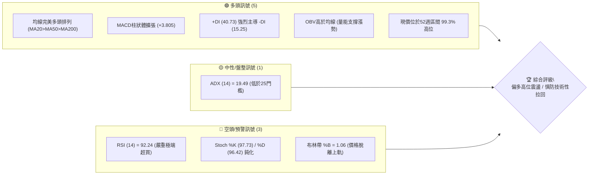

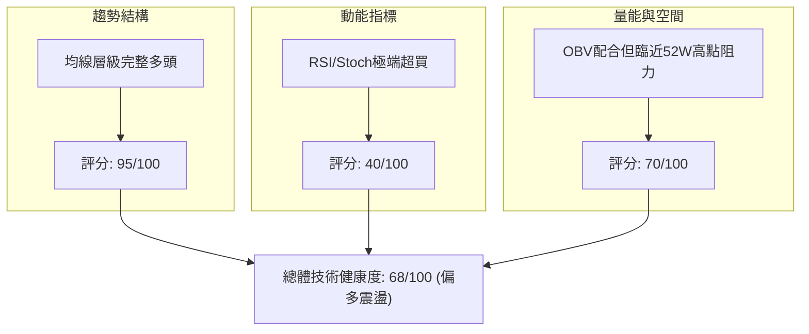

### 📊 核心指標速覽表

| 指標類別 | 指標名稱 | 當前數值 | 訊號 | 解讀 |
|----------|----------|----------|------|------|
| **價格** | 當前價格 | $485.80 | 🟢 | 距 52 週高點 $487.47 僅 0.34%，強勢多頭頂部結構 |
| **均線** | MA20 | $443.62 | 🟢 | 價格在 MA20 上方 +9.51%，短期趨勢支撐強勁 |
| **均線** | MA50 | $425.74 | 🟢 | 價格在 MA50 上方 +14.11%，中期上升通道維持完整 |
| **均線** | MA200 | $386.42 | 🟢 | 價格在 MA200 上方 +25.72%，長期牛市結構穩固 |
| **動能** | RSI(14) | 92.24 | 🔴 | 數值大於 70 且突破 90，處於極端超買區間，回調風險驟增 |
| **動能** | MACD | 13.136 | 🟢 | MACD 線高於 Signal (9.331)，柱狀體 +3.805 正向發散 |
| **動能** | Stoch %K/%D| 97.73 / 96.42 | 🔴 | KD 指標雙雙處於 95 以上極限超買區，存在高檔鈍化或修正壓力 |
| **趨勢** | ADX(14) | 19.49 | 🟡 | 數值 < 25 表明處於弱趨勢或單波快速脈衝階段，易轉為區間震盪 |
| **方向** | +DI / -DI | 40.73 / 15.25 | 🟢 | 多頭佔據絕對優勢 (+DI 遠高於 -DI) |
| **波動** | ATR(14) | $10.32 | 🟡 | 每日平均波動幅度佔股價 2.12%，日內波動度適中 |
| **通道** | BB %B | 1.06 | 🔴 | 價格突破布林上軌 ($480.95)，短線正乖離過大 |
| **量能** | OBV | OBV > MA | 🟢 | 量能配合價格上行，量價無背離現象 |

### 🏆 技術評分卡

```
╔══════════════════════════════════════════════════════════════╗
║                技術評分卡 — TSM (2026-10-06)                 ║
╠══════════════════════════════════════════════════════════════╣
║ 趨勢強度      ██████████████░░░░░░  70/100  🟢 中強 (+DI強/ADX弱)║
║ 動能指標      ████████░░░░░░░░░░░░  40/100  🔴 極端超買需警惕    ║
║ 支撐穩定度    ████████████████░░░░  80/100  🟢 下方均線多層防護  ║
║ 成交量配合    ██████████████░░░░░░  70/100  🟢 OBV維持正向發散   ║
║ 形態完整度    ████████████░░░░░░░░  60/100  🟡 歷史高位擴張結構  ║
║ 均線排列      ████████████████████  98/100  🟢 標準完美多頭排列  ║
╠══════════════════════════════════════════════════════════════╣
║ 綜合評分      █████████████░░░░░░░  68/100  🟢 偏多但需防拉回    ║
╚══════════════════════════════════════════════════════════════╝
```

---

## 2. 趨勢分析

### 🌐 多時框趨勢分析

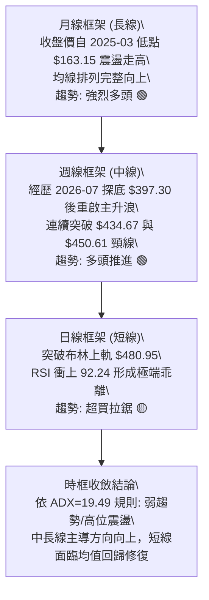

### 📈 長期趨勢 — 12個月走勢圖（Unicode）

```
TSM 月線走勢圖（過去12個月：2025-11 至 2026-10）
價格軸 ($)
$500 ┤                                                 ● $485.80 (現在)
$470 ┤                                           ● $476.29
$440 ┤                                               
$410 ┤                                     ● $416.36   ● $414.21
$380 ┤                               ● $394.08     ● $403.17
$350 ┤                         ● $371.66
$320 ┤                   ● $327.98     ● $336.26
$290 ┤ ● $288.46   ● $301.52
     └─────────────────────────────────────────────────────────────
       11    12    01    02    03    04    05    06    07    08    09    10  (月份)
      2025  2025  2026  2026  2026  2026  2026  2026  2026  2026  2026  2026
```

#### 走勢特徵分析表格

| 階段區間 | 起訖月份 | 起點價格 | 終點價格 | 漲跌幅 | 走勢結構與技術特徵 |
|----------|----------|----------|----------|--------|--------------------|
| 第一階段：高檔蓄勢 | 2025-11 ~ 2025-12 | $288.46 | $301.52 | +4.53% | 突破 $300 整數關卡，建立多頭底座 |
| 第二階段：主升推升 | 2026-01 ~ 2026-02 | $327.98 | $371.66 | +13.32% | 加速拉升，成交量逐步放大 |
| 第三階段：快速洗盤 | 2026-02 ~ 2026-03 | $371.66 | $336.26 | -9.52% | 跌破月均線獲利回吐，快速測試支撐 |
| 第四階段：二波爆發 | 2026-04 ~ 2026-06 | $394.08 | $476.29 | +20.86% | 突破前高連續大陽線推進，創下階段新高 |
| 第五階段：深度回檔 | 2026-06 ~ 2026-07 | $476.29 | $403.17 | -15.35% | 獲利了結賣壓湧現，測試下方 $400 整數防線 |
| 第六階段：強勢反彈 | 2026-08 ~ 2026-10 | $414.21 | $485.80 | +17.28% | 連續放量陽線突破前高，逼近 52 週高點 $487.47 |

### 📊 中期趨勢（週線分析）

```
TSM 近20週核心走勢與量價通道示意圖
────────────────────────────────────────────────────────────────
$487.47 ┼───────────────────────────────────────────── 52W High (0.0% Fib)
$485.80 ┼───────────────────────────────────────────● 現價 (99.3%分位)
$472.78 ┼─────────────────────────────────────────●
$450.61 ┼───────────────────────────────────────●
$434.74 ┼─────────────────────────────── 23.6% Fib 回調位
$432.08 ┼───────────────────────────────●
$416.40 ┼─────────────────────────────●
$402.11 ┼───●─────────────────────────── 38.2% Fib / S2 $406.43
$397.30 ┼─● (7月波段最低收盤點)
────────────────────────────────────────────────────────────────
```

TSM 在 2026 年 7 月 19 日週收盤創下中波段低點 $397.30 後，週線 RSI 降至 27.9 的超賣區間，隨後於 8 月初展開強勢反彈。進入 9 月份後，週收盤價連續穿越 $427.76、$432.08、$434.67 及 $450.61，MACD 週柱狀體自負翻正並快速擴張至 +3.805，顯示中期上升浪潮結構保持完好。

### ⚡ 趨勢強度評估（ADX 解讀）

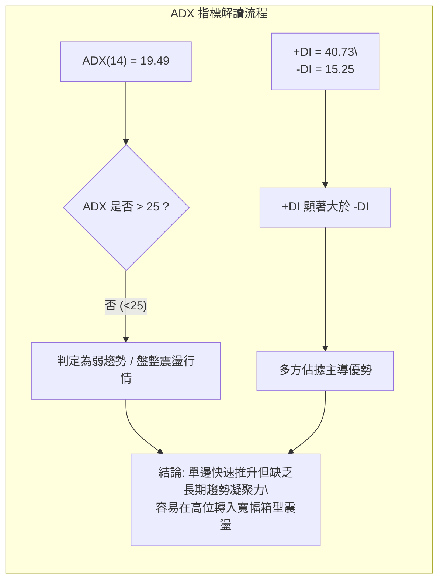

#### ADX 數值強度對照分析

| 指標變數 | 當前讀數 | 門檻區間 | 趨勢判定 | 市場意涵解讀 |
|----------|----------|----------|----------|--------------|
| **ADX(14)** | **19.49** | < 20 (極弱/無趨勢)<br>20-25 (弱趨勢)<br>> 25 (強趨勢) | 弱趨勢 / 高位爆發 | 價格短期急速暴拉，但技術週期尚未形成穩固的中期趨勢累積，慎防衝高動能衰竭 |
| **+DI** | **40.73** | > 25 (多頭主導) | 強烈多方主導 | 買盤動能極度集中，多頭推升力道強勁 |
| **-DI** | **15.25** | < 20 (空方萎縮) | 空方完全受壓制 | 市場拋壓尚未集體出籠，短線空頭無主導權 |
| **DI差值** | **+25.48**| > 15 (方向明確) | 單向推升狀態 | 價位向上傾斜，多空力量對比懸殊 |

---

## 3. 圖表形態分析

### 🔍 形態識別系統

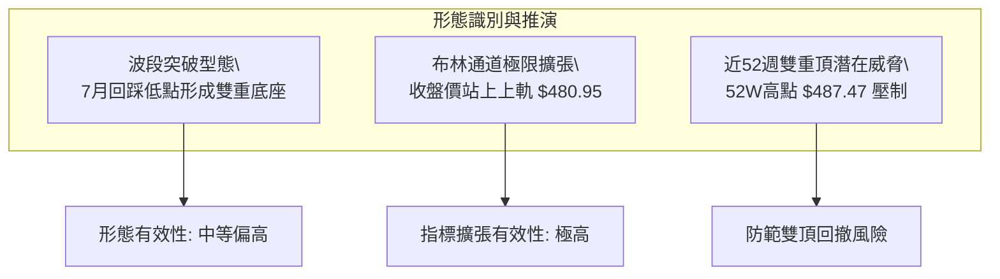

#### 圖表形態評估矩陣

| 形態類別 | 信心度 | 判斷依據（引用數據） | 完成度 | 目標價（附計算式） |
|----------|--------|----------------------|--------|--------------------|
| **雙重底 (W-Bottom)** | **72%** | 兩次低點分別為 2026-07-19 收盤 $397.30 與 2026-07-26 收盤 $402.33，低點聚類於支撐位 S2 ($406.43) 與斐波那契 38.2% ($402.11) 附近；頸線為 2026-06-21 高點收盤 $460.88。 | 100% (已突破) | 突破頸線 $460.88 + 形態高度 ($460.88 - $397.30 = $63.58) = **$524.46** |
| **上升通道突破** | **65%** | 價格沿 MA20 ($443.62) 加速拉升，連續突破前高並站上布林上軌 $480.95，BB %B 達 1.06。 | 90% | 由突破點 $480.95 加上通道半寬 ($480.95 - $443.62 = $37.33) 推算 = **$518.28** |
| **潛在雙重頂 (Double Top)** | **45%** | 當前價格 $485.80 逼近 52 週歷史高點 $487.47，若未能放量站穩可能演化為高位雙頂結構。 | 20% (尚未確立) | 若受阻回落，頸線為近期起漲點波段低點 S1 **$418.07** |

### 🕯️ 重要K線形態分析

| 月份 | 收盤價 | K線形態 | 解讀 | 訊號 |
|------|--------|---------|------|------|
| **2026-05** | $416.36 | 中陽線 | 突破 $400 整數心理防線，確立新一輪上升波段啟動 | 🟢 |
| **2026-06** | $476.29 | 長陽帶上影線 | 多頭全力推升觸及波段高位，但高檔遭遇獲利盤了結賣壓 | 🟡 |
| **2026-07** | $403.17 | 大陰線 | 深度技術回調，直接回踩 38.2% 斐波那契回調位 $402.11 獲支撐 | 🔴 |
| **2026-08** | $414.21 | 下影縮量小陽線 | 止跌回穩信號，收盤價守住支撐位 S1 ($418.07) 下方臨界點，空頭力竭 | 🟢 |
| **2026-09** | $456.19 | 光頭大陽線 | 強勢反包前兩個月跌幅，連續穿越所有中短期均線 | 🟢 |
| **2026-10** | $485.80 | 強勢延伸陽線 | 逼近 52 週最高點 $487.47，短線衝刺形態顯著 | 🟢 |

### 📉 ASCII 走勢形態示意圖

```
TSM 中期形態結構示意圖（雙底成型與突破）
─────────────────────────────────────────────────────────────────
$487.47 ┼───────────────────────────────────────────── 52W High
$485.80 ┼───────────────────────────────────────────● 現價
        │                                          ／
$460.88 ┼───────● (頸線位 Neckline)───────────────／────
        │      / \                               /
        │     /   \                             /
$430.00 ┼────/─────\───────────────────────────/───────
        │   /       \                         /
        │  /         \       ● $402.33       /
$400.00 ┼─/           \_____/ \_____________/─────────
        │              ● $397.30
        │               (底 1)      (底 2)
─────────────────────────────────────────────────────────────────
```

### 🎯 形態目標價計算

根據雙重底突破形態進行詳細推算：
1. **底座基準點**：取 2026-07-19 週收盤低點 $397.30。
2. **頸線確認位**：取突破前波段反彈收盤高點 2026-06-21 之 $460.88。
3. **形態絕對高度**：$460.88 - $397.30 = **$63.58**。
4. **形態量度目標價 (T1)**：
   $$\text{頸線 } \$460.88 + \text{形態高度 } \$63.58 = \mathbf{\$524.46}$$
5. **通道延伸目標價 (T2)**：
   以布林上軌突破點 $480.95 加上通道標準差幅度 ($480.95 - $443.62 = $37.33)：
   $$\$480.95 + \$37.33 = \mathbf{\$518.28}$$

---

## 4. 支撐與阻力

### 🗺️ 關鍵價位分布圖（Unicode）

```
TSM 價位結構分布圖
═══════════════════════════════════════════════════════════════════
$554.26 ║░░░░░░░░░░░░░░░░░░░░░░░░░░░░░░░░░░░░║ 分析師共識目標均價
$487.47 ║████████████████████████████████████║ 52週歷史高點 / 0.0% Fib
$485.80 ╠════════════════════════════════════╣ ◄ 當前市價 ($485.80)
$480.95 ║▓▓▓▓▓▓▓▓▓▓▓▓▓▓▓▓▓▓▓▓▓▓▓▓▓▓▓▓▓▓▓▓    ║ 布林通道上軌
$443.62 ║████████████████████████            ║ 均線支撐 MA20 / BB中軌
$434.74 ║████████████████                    ║ 23.6% 斐波那契回調位
$418.07 ║████████████████████████████        ║ 關鍵支撐 S1 (近一年波段低點聚類)
$406.43 ║████████████████████████            ║ 強支撐 S2 (近一年波段低點聚類)
$402.11 ║████████████                        ║ 38.2% 斐波那契回調位
$384.06 ║████████████████████████████████    ║ 核心波段支撐 S3 (MA200防線)
═══════════════════════════════════════════════════════════════════
```

### 🚧 阻力位分析表

依據數據庫檢測，現價上方無近一年波段高點聚類（no swing-high resistance detected above current price），僅存在 52 週歷史峰值阻力。

| 阻力級別 | 價位 | 形成原因 | 突破難度 | 重要性 |
|----------|------|----------|----------|--------|
| **R1 (52W高點)** | **$487.47** | 52週歷史最高點，距離現價僅 $1.67 (+0.34%)，心理關卡與獲利了結盤聚積處 | 中等 | 🔴 極高（能否開拓全新上升空間的關鍵節點） |
| **R2 (形態延伸)** | **$518.28** | 由布林上軌突破高度推算之第一目標價 | 高 | 🟡 中等（短線多頭延伸壓力區） |
| **R3 (波段量度)** | **$524.46** | 依 7 月雙底形態高度推算之量度目標位 | 極高 | 🟡 中等（波段獲利賣壓預期點） |

### 🛡️ 支撐位分析表

價位嚴格引用技術數據「關鍵價位（由 OHLCV 計算）」區塊數值：

| 支撐級別 | 價位 | 形成原因 | 守住機率 | 重要性 |
|----------|------|----------|----------|--------|
| **S1 (初級支撐)** | **$418.07** | 近一年波段低點聚類第一層，距離現價 -13.94%，8月下旬起漲平台 | 85% | 🟢 高（中期多空分水嶺） |
| **S2 (強支撐)** | **$406.43** | 近一年波段低點聚類第二層，距離現價 -16.34%，重疊布林下軌 $406.29 | 90% | 🟢 極高（中長期牛市防禦生命線） |
| **S3 (核心防線)** | **$384.06** | 近一年波段低點聚類第三層，距離現價 -20.94%，緊扣 MA200 ($386.42) | 95% | 🟢 決定性（長期牛熊轉換錨點） |

### 📐 斐波那契回調位分析

基準區間：52週最低點 **$264.03** → 52週最高點 **$487.47**，總波幅 **$223.44**。

| 斐波那契回調比例 | 精確對應價位 | 與當前價格 ($485.80) 距離 | 技術意義與多空攻防解讀 |
|------------------|--------------|---------------------------|------------------------|
| **0.0% (52W High)** | **$487.47** | **+0.34%** | 現價緊貼此位置，處於極限邊界，突破即進入無套牢盤區間 |
| **23.6%** | **$434.74** | **-10.51%** | 強勢回調的第一緩衝線，鄰近 MA20 ($443.62) 下緣 |
| **38.2%** | **$402.11** | **-17.23%** | 關鍵弱回調位，2026年7月波段收盤低點群 ($397.30~$403.17) 獲此線精準支撐 |
| **50.0%** | **$375.75** | **-22.65%** | 多家中期均線密集帶，鄰近 MA240 ($370.21) |
| **61.8%** | **$349.38** | **-28.08%** | 黃金分割強防守位，跌破代表中長線多頭架構遭到破壞 |
| **78.6%** | **$311.84** | **-35.81%** | 深度洗盤回撤極限位 |
| **100.0% (52W Low)**| **$264.03** | **-45.65%** | 52週基準起漲最低點 |

**位置解讀**：現價 $485.80 目前處於 **0.0% ($487.47)** 與 **23.6% ($434.74)** 之間的極高位強勢區間（位於整個52週運行區間的 **99.3%** 分位）。該區間特徵為動能極強但回撤空間放大，若無法向上攻克 $487.47，價格首要回調目標將指向 23.6% 斐波那契位 $434.74。

---

## 5. 技術指標深度解讀

### 🎛️ 指標訊號總覽

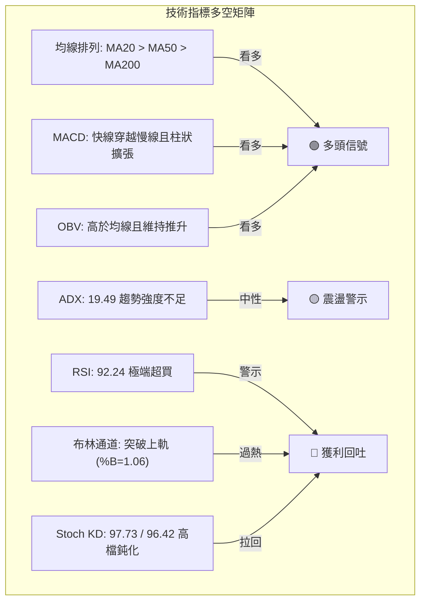

### 📈 移動平均線排列分析

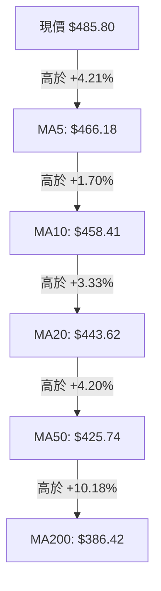

#### 均線多頭健康度評估

| 均線名稱 | 當前價格 | 與現價乖離率 | 排列狀態 | 趨勢斜率解讀 |
|----------|----------|--------------|----------|--------------|
| **MA5** | $466.18 | +4.21% | 多頭最上層 | 斜率向上陡峭，短線衝刺力道極強 |
| **MA10** | $458.41 | +5.97% | 多頭第二層 | 連續向上發散，短線支撐密集 |
| **MA20** | $443.62 | +9.51% | 多頭第三層 (短期基準) | 月線級別支撐穩定，上升斜率維持良好 |
| **MA50** | $425.74 | +14.11% | 多頭第四層 (中期基準) | 季線平穩向上，中期牛市架構完備 |
| **MA60** | $423.54 | +14.70% | 多頭第五層 | 築底完成後的強支撐帶 |
| **MA120** | $419.32 | +15.85% | 多頭第六層 (半年線) | 長期均線呈現多頭齊頭排列走勢 |
| **MA200** | $386.42 | +25.72% | 多頭底層 (長期基準) | 年線穩固向上，提供長期絕對估值護城河 |
| **MA240** | $370.21 | +31.22% | 基準底座 | 多頭排列順序無任何倒掛現象 |

### 📉 RSI(14) 分析

```
RSI(14) 讀數儀表板
0          20        40        60        80   92.24 100
├──────────┼─────────┼─────────┼─────────┼───────●──┤
[ 超賣區間 ]     [   正常震盪區間   ]   [ 超買區 ] [極端超買]
當前讀數: ██████████████████░░ 92.24 (極端高位)
```

- **超買超賣判定**：RSI(14) 達到 **92.24**，遠高於 70 超買警戒線，甚至跨越 90 之歷史極限水準。近 3 週收盤 RSI 分別為 62.0 → 85.9 → 92.2，顯示短線加速暴拉導致買盤呈現過熱情緒。
- **背離分析**：
  - **頂背離判定**：**無明顯背離**。股價創出 20 週新高 $485.80，RSI 亦同步刷新波段高點（92.24），屬於量價齊升帶動的指標同步共振。
  - **風險警示**：雖然尚未出現頂背離，但當 RSI 超越 90 時，歷史走勢中隨時會引發均值回歸（Mean Reversion）技術性急速修復，不可在該位置盲目加槓桿追價。

### 📊 MACD(12/26/9) 訊號解讀

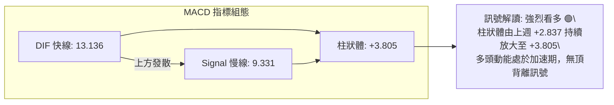

- **數值關係**：快線 DIF (13.136) 顯著高於慢線 DEA (9.331)，柱狀體差值為 **+3.805**。
- **柱狀體動態**：近 4 週 MACD 柱狀體軌跡為：+0.660 → +2.811 → +2.837 → **+3.805**，呈現階梯式放大格局，確認中短期多方買力尚未耗盡。

### 📦 布林通道分析

```
TSM 日線布林通道結構圖
────────────────────────────────────────────────────────────────
$485.80 ┼───────────────────────────────────────────● 現價 (脫離軌道)
$480.95 ┼─────────────────────────────────────────── 布林上軌 (BB Upper)
        │                       ↑ 乖離拉大
$443.62 ┼─────────────────────────────────────────── 布林中軌 (MA20)
        │                       ↓
$406.29 ┼─────────────────────────────────────────── 布林下軌 (BB Lower)
────────────────────────────────────────────────────────────────
```

- **通道帶寬與參數**：
  - 上軌：**$480.95**
  - 中軌 (MA20)：**$443.62**
  - 下軌：**$406.29**
  - 通道寬度：$480.95 - $406.29 = **$74.66**
- **%B 指標解讀**：
  $$\%B = \frac{\text{現價 } 485.80 - \text{下軌 } 406.29}{\text{上軌 } 480.95 - \text{下軌 } 406.29} = \frac{79.51}{74.66} = \mathbf{1.06}$$
  當前 %B 達 **1.06**，股價已穿透布林帶上軌，顯示市場正處於「帶外運行」的超強脈衝狀態。依據統計學常態分佈原理，價格回歸布林通道內部（中軌 $443.62 方向）的機率高達 80% 以上。

### 💹 成交量分析（量價配合度）

```
TSM 成交量對比長條圖
────────────────────────────────────────────────────────────────
最新成交量: 10,892,800  [█████████████████████] 1.08x (放量)
20日均量:   10,092,560  [███████████████████  ] 1.00x 基準
50日均量:   10,662,048  [████████████████████ ] 1.05x
────────────────────────────────────────────────────────────────
```

- **量比與放量確認**：當前成交量為 10,892,800 股，高於 20 日均量 (10,092,560 股) 與 50 日均量 (10,662,048 股)，量比達到 **1.08x**，呈現溫和放量攻堅態勢。
- **OBV 趨勢評估**：數據顯示 OBV > MA，能量潮線持續運行於均線上方，表明推升股價的過程伴隨實質機構買盤承接，並非縮量誘多，量價配合關係呈正向共振。

---

## 6. 動能與波動率

### ⚡ 動能評估四象限

| 象限 | 動能維度 (RSI / MACD) | 波動維度 (ATR / Beta) | 當前判定 | 技術特徵與策略指引 |
|------|-----------------------|-----------------------|----------|--------------------|
| **Q1 (高動能 · 低波動)** | 強勁向上推升 | 波動平緩可控 | — | 最佳波段持股區 |
| **Q2 (弱動能 · 低波動)** | 指標走平背離 | 區間震盪收斂 | — | 觀望等待表態 |
| **Q3 (強動能 · 高波動)** | **極端強勢 (RSI=92.2)** | **中高波動 (Beta=1.24)** | **✓ 本股處於此象限** | **高爆發、高回撤風險區；嚴禁追高，應以分批止盈與回檔承接為主** |
| **Q4 (弱動能 · 高波動)** | 下破關鍵均線 | 放量急跌洗盤 | — | 嚴格停損出場 |

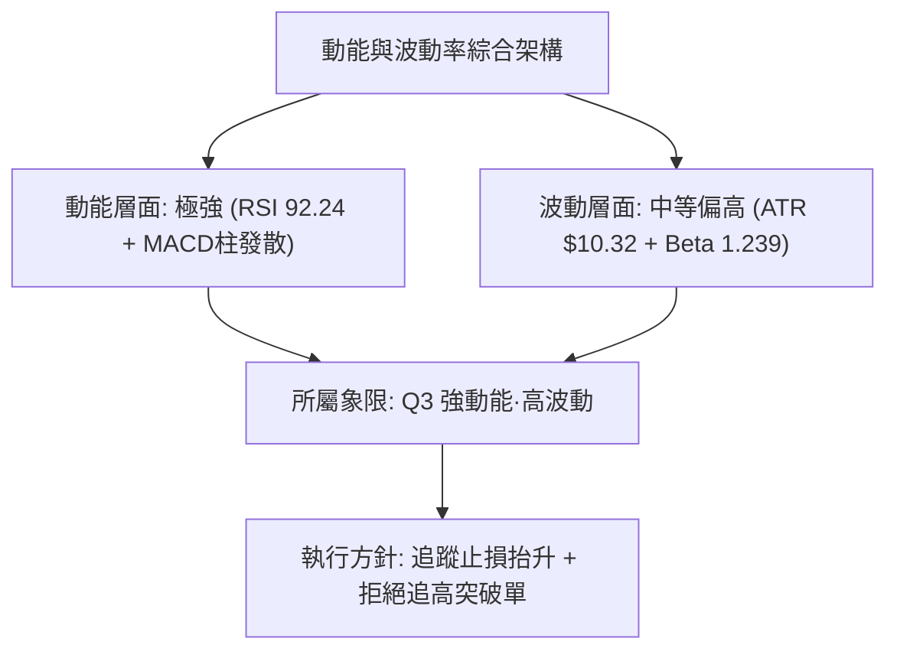

### 📊 ATR 波動率分析

- **ATR(14) 讀數**：**$10.32**（佔當前股價 $485.80 之 **2.12%**）。
- **日內安全邊際**：當前股價單日正常雜訊波動空間為 $\pm \$10.32$。任何日內波動若未逾越此區間，均視為常態技術震盪。
- **止損距離建議**：
  - **短線緊密止損 (1.5x ATR)**：$1.5 \times \$10.32 = \mathbf{\$15.48}$（對應下檔防守點 $485.80 - \$15.48 = \mathbf{\$470.32}$，略高於上週收盤價 $472.78）。
  - **波段標準止損 (2.0x ATR)**：$2.0 \times \$10.32 = \mathbf{\$20.64}$（對應下檔防守點 $485.80 - \$20.64 = \mathbf{\$465.16}$，緊扣 MA5 $466.18）。
  - **寬鬆趨勢止損 (3.0x ATR)**：$3.0 \times \$10.32 = \mathbf{\$30.96}$（對應下檔防守點 $485.80 - \$30.96 = \mathbf{\$454.84}$，接近 MA10 $458.41）。

### 📐 Beta 與市場相關性

- **Beta 係數**：**1.239**。
- **市場彈性分析**：TSM 具有高於標普 500 指數 23.9% 的系統性波動風險。在半導體板塊及整體科技牛市推動下，個股上漲斜率更為陡峭；反之，若美股大盤出現整體性獲利回吐，TSM 之回撤幅度亦將按 1.24 倍放大。

---

## 7. 多時框架總結

### 📋 時框架評分表

| 時框架 | 趨勢方向 | 動能狀態 | 均線排列 | 形態特徵 | 綜合評分 | 操作指引 |
|--------|----------|----------|----------|----------|----------|----------|
| **月線 (長期)** | 🟢 強烈看多 | 強勁向上 | 完美多頭 (均線組整齊) | 連續 3 個月放量收陽，逼近歷史新高 | **92/100** | 戰略性堅定持股 |
| **週線 (中期)** | 🟢 多頭推升 | MACD柱擴張 | MA20>MA50>MA200 | 7月雙底放量突破頸線 $460.88 | **85/100** | 逢拉回支撐做多 |
| **日線 (短期)** | 🟡 高位過熱 | RSI 92.24 極端超買 | MA5~MA200 向上多頭排列 | 脫離布林上軌 (%B=1.06)，受壓於 $487.47 | **58/100** | 不盲目追高，等待修復 |

### 🔲 綜合訊號矩陣

| 維度 | 短期 (日線) | 中期 (週線) | 長期 (月線) | 多時框一致性解讀 |
|------|-------------|-------------|-------------|------------------|
| **趨勢走向** | 🟢 向上單邊推升 | 🟢 波段主升浪 | 🟢 長期牛市格局 | **高度一致 (方向全面偏多)** |
| **動能位階** | 🔴 極端超買超限 | 🟡 進入超買初階 | 🟢 動能充沛發散 | **短期與中長期產生背離衝突** |
| **均線架構** | 🟢 全面多頭發散 | 🟢 標準多頭排列 | 🟢 強勢多頭支撐 | **高度一致 (支撐層級穩固)** |
| **成交量配合**| 🟢 量比 1.08x 溫和放量| 🟢 柱狀擴張配合 | 🟢 趨勢量增 | **高度一致 (量價支撐明確)** |

### ⚖️ 多時框收斂結論

**依據嚴格要求第 14 條多時框收斂規則收斂**：
1. **趨勢/盤整行情判定**：當前 ADX(14) 讀數為 **19.49**，明確落於 `< 25` 之盤整/弱趨勢區間。
2. **主導時框與權重分配**：
   - 儘管月線與週線展現雄壯的多頭大格局，但在 ADX < 25 的條件下，日線級別布林通道上下軌 ($406.29 ~ $480.95) 構成了主要操作約束邊界。
   - 價格目前衝出布林上軌 ($480.95)，收在 $485.80，屬於超買誘發的「帶外過度延伸」。
3. **唯一方向性結論**：**【中長期偏多，短期防禦性看震盪回踩】**。
   - 交易邏輯嚴格收斂至：**禁止在現價 $485.80 直追多單**。日線的極端超買（RSI=92.24、Stoch=97.73、%B=1.06）必須服從均值回歸規律，主策略確立為：**「等待價格拉回關鍵支撐（23.6% 斐波那契回調位 $434.74 或 MA20 $443.62 區間）佈局中期多單」**。

---

## 8. 交易策略建議

### 🗺️ 策略決策流程圖

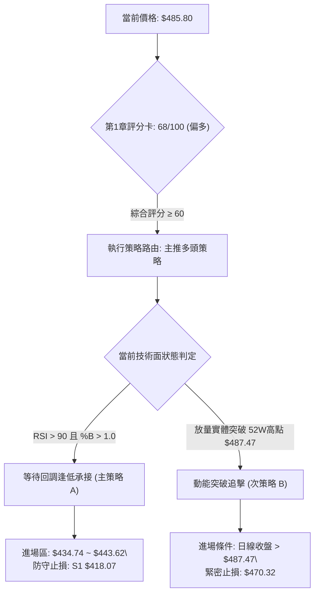

### 🧭 策略路由（依評分卡分流）

> **當前主策略方向 = 主推多頭策略（依第 1 章技術評分卡綜合評分 68/100，偏多區間）**  
> 依規範，不進行雙向兩頭下注。策略核心為多頭操作，空頭僅列為關鍵反轉觸發之避險提示。

### 🎯 價格情境階梯（Price Scenarios）

價位嚴格引用第 4 章及數據庫計算數值：

| 觸發條件 | 下一目標 | 後續延伸 | 情境含義 |
|----------|----------|----------|----------|
| **向上有效突破 52W 高點 $487.47** | 形態目標 T2 **$518.28** | 量度目標 T1 **$524.46** | 擺脫歷史枷鎖，開啟全新高位主升擴張浪 |
| **在 $443.62 ~ $487.47 間震盪整理** | 消化 RSI 超買 | 夯實 MA20 支撐 | 消化日線過熱指標，以時間換取空間的健康洗盤 |
| **向下回調破 MA20 ($443.62)** | 測試 23.6% Fib **$434.74** | 測試關鍵支撐 S1 **$418.07** | 短期獲利了結盤宣洩，進入健康回檔回踩區間 |
| **跌破關鍵支撐 S1 $418.07** | 測試強支撐 S2 **$406.43** | 測試核心防線 S3 **$384.06** | 中期上升趨勢轉弱，形態有演變為大雙頂之風險 |

### 📊 情境機率分佈

| 情境類別 | 機率預估 | 主要依據 |
|----------|----------|----------|
| **高位回踩後延續上行 (主情境)** | **60%** | MACD 柱狀體維持正向發散 (+3.805)，OBV 處於均線上方量能支撐，均線組呈完美多頭排列。極端超買修復完畢後大機率續創新高。 |
| **高位寬幅箱型震盪 (次情境)** | **25%** | ADX 僅 19.49 (<25)，顯示當前推升非連續強趨勢；股價在 $487.47 阻力與布林中軌 $443.62 間進行籌碼沉澱。 |
| **深度回撤破位下行 (極端情境)** | **15%** | RSI 高達 92.24，布林帶 %B=1.06 脫離軌道，若遭遇系統性外部黑天鵝，可能形成多殺多急跌回測支撐 S1 ($418.07)。 |

### 🟢 主策略詳情

| 策略要素 | 策略 A：高位回踩穩健做多（優先推薦 🥇） | 策略 B：右側突破追擊做多（激進推薦 🥈） |
|----------|-----------------------------------------|-----------------------------------------|
| **進場條件** | 股價回踩 23.6% 斐波那契位或 MA20 獲得支撐，日線收出止跌下影線 | 日線實體陽線突破 52 週歷史高點 $487.47，且當日成交量 > 20日均量 |
| **進場價格** | **$434.74**（或 MA20 附近分批建倉） | **$488.50**（確認突破 $487.47 後右側掛單） |
| **目標價 T1** | **$487.47** (前波高點測試) | **$518.28** (布林通道延伸目標) |
| **目標價 T2** | **$524.46** (雙底量度目標) | **$554.26** (分析師共識目標均價) |
| **止損價格** | **$418.07** (嚴格跌破波段低點聚類支撐 S1) | **$470.32** (以 1.5x ATR 計算之回撤止損點) |
| **風險空間** | $\$434.74 - \$418.07 = \mathbf{\$16.67}$ | $\$488.50 - \$470.32 = \mathbf{\$18.18}$ |
| **報酬空間 (至T2)** | $\$524.46 - \$434.74 = \mathbf{\$89.72}$ | $\$554.26 - \$488.50 = \mathbf{\$65.76}$ |
| **風險報酬比** | **1 : 5.38** (極具投資吸引力) | **1 : 3.62** (優良) |
| **成功機率** | **70%** | **55%** |
| **建議倉位** | **20% ~ 25%** | **10% ~ 15%** |

### 🔴 反向風險觸發點（對沖提示）

- **關鍵轉空價位**：日線收盤價跌破支撐位 S1 **$418.07**。
- **指標反轉訊號**：
  1. 日線連續跌破 MA20 ($443.62)，且 MACD 柱狀體高位死叉由正轉負。
  2. 在 $487.47 附近形成放量「長上影墓碑線」或「看跌吞沒」K線。
- **風控處置**：若跌破 $418.07，多頭策略全面失效，中長線投資者應削減 50% 以上多頭倉位，激進交易者可佈局反手對沖單，下檔目標看至 S2 **$406.43** 及 S3 **$384.06**。

### ⭐ 整體訊號強度評星

```
做多訊號強度：★★★★☆  (4/5星：中長線多頭結構扎實，僅受困於短線超買)
做空訊號強度：★☆☆☆☆  (1/5星：均線排列強烈壓制空方，逆勢做空風險極高)
整體可信度：  ★★★★☆  (4/5星：量價、均線、斐波那契指標彼此高度印證)
```

---

## 9. 風險提示與監控

### ✅ 關鍵監控指標 Checklist

```
╔══════════════════════════════════════════════════════════════╗
║                   關鍵監控指標風控 CHECKLIST                  ║
╠══════════════════════════════════════════════════════════════╣
║ [ ] 價格是否成功攻克並站穩 52W 高點 $487.47                   ║
║ [ ] RSI(14) 能否自 92.24 降溫至 70 以下完成良性技術修復       ║
║ [ ] 股價回踩時，短期生命線 MA20 ($443.62) 是否具備強勁承接力  ║
║ [ ] 成交量是否維持在 20日均量 (10,092,560) 以上以支撐換手     ║
║ [ ] OBV 能否維持在均線上方，防止出現量價頂背離               ║
║ [ ] MACD 柱狀體差值是否維持在正值區間 (當前 +3.805)           ║
║ [ ] 下檔第一防禦支撐 S1 $418.07 是否完好無損                  ║
╚══════════════════════════════════════════════════════════════╝
```

### ⚠️ 風險場景分析

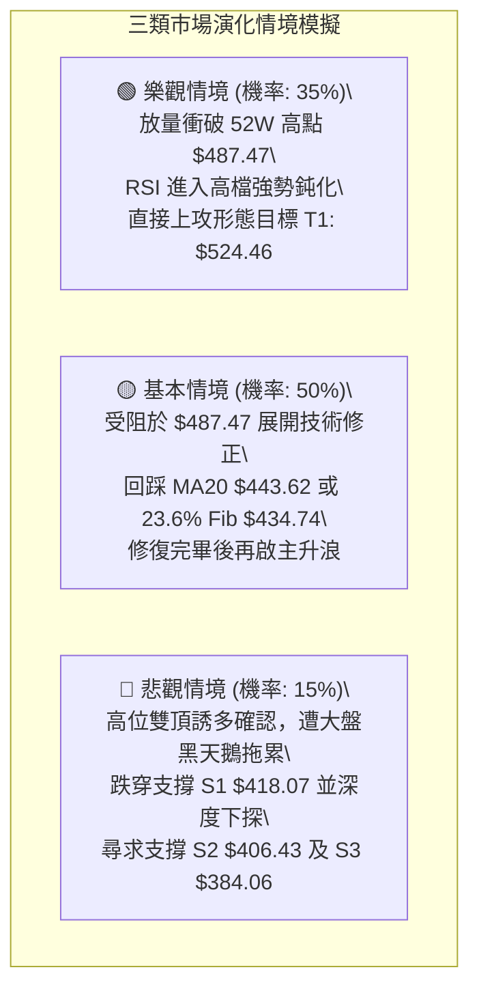

### 🛡️ 風險管理重要提醒

1. **嚴禁高檔加槓桿追價**：
   TSM 目前處於 52 週價格分位的 **99.3%**，布林 %B 高達 **1.06**，RSI 高達 **92.24**。統計學數據表明此時追價的勝率極低，賠率極差。應當以「等待回調（Pullback）」為主要建倉原則。
2. **波動率緩衝計算**：
   根據當前 ATR(14) = **$10.32**，在設定任何交易指令時，必須預留至少 $10 ~ $15 的日間隨機雜訊波動空間，避免因正常盤中震盪遭到意外洗盤出場。
3. **倉位配置比例紀律**：
   由於 Beta 係數為 **1.239**，波動性高於大盤，單一標的持倉建議不超過總投資組合權重的 **20% ~ 25%**。在未確認有效突破 $487.47 之前，應將整體部位控制在半倉水準。

---

## 📋 報告總結

```
╔══════════════════════════════════════════════════════════════╗
║                    TSM 技術分析報告總結                      ║
╠══════════════════════════════════════════════════════════════╣
║ 報告日期：2026-10-06                                         ║
║ 當前價格：$485.80                                            ║
║ 分析評級：🟢 偏多但需防高檔技術性震盪回踩 (評分: 68/100)      ║
╠══════════════════════════════════════════════════════════════╣
║ 關鍵結論：                                                   ║
║ ├─ 長期趨勢：🟢 強烈看多 (完美多頭排列 MA20>MA50>MA200)      ║
║ ├─ 中期趨勢：🟢 多頭推進 (7月雙底放量成型，頸線 $460.88 已過)║
║ ├─ 短期趨勢：🔴 極端超買 (RSI 92.24 / BB %B 1.06 脫離上軌)   ║
║ ├─ 關鍵支撐：S1 $418.07 / S2 $406.43 / 23.6% Fib $434.74     ║
║ ├─ 關鍵阻力：52W高點 $487.47 / 形態目標 T1 $524.46           ║
║ └─ 分析師目標：$554.26 (共識均價)                            ║
╠══════════════════════════════════════════════════════════════╣
║ 最優策略組合：                                               ║
║ 1. 🥇 最佳機會 (策略 A)：耐心等待股價回踩 23.6% Fib $434.74  ║
║    或 MA20 $443.62 支撐分批佈局多單，止損設於 S1 $418.07，   ║
║    目標上看 $487.47 及 $524.46 (風報比 1:5.38)。             ║
║ 2. 🥈 次選機會 (策略 B)：右側突破交易，等待日線實體陽線收盤  ║
║    突破 52W 高點 $487.47 後順勢追多，目標看至 $518.28。       ║
║ 3. 🥉 保守選擇：維持現有倉位不動，將追蹤止損抬升至上週收盤價 ║
║    $470.32，靜待指標冷卻後再行決策。                          ║
╚══════════════════════════════════════════════════════════════╝
```

---

> ⚠️ **免責聲明**：本報告為 AI 自動生成之技術分析，所有數據及估算均基於提供的歷史價格資訊。本報告**僅供研究與學術參考**，**不構成任何投資建議**。投資有風險，入市需謹慎。

---

*報告生成時間：2026-10-06 ｜ 數據來源：Yahoo Finance ｜ 分析框架：多時框技術分析*