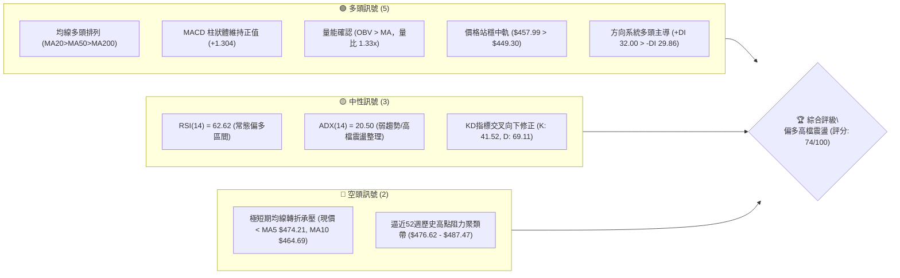
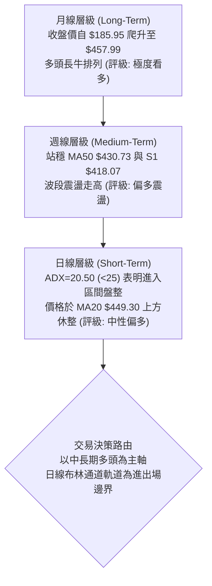
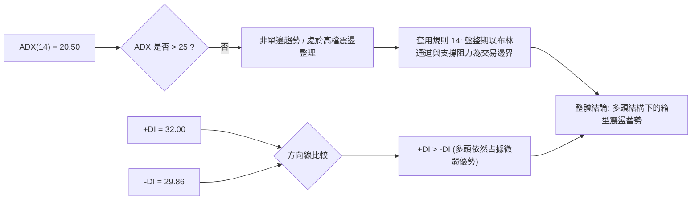
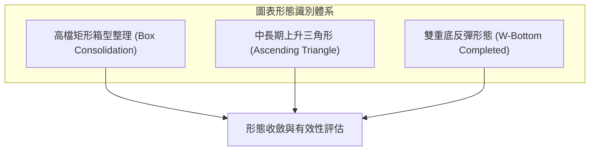
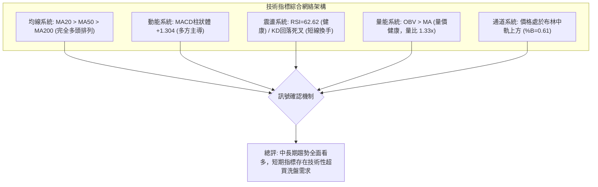
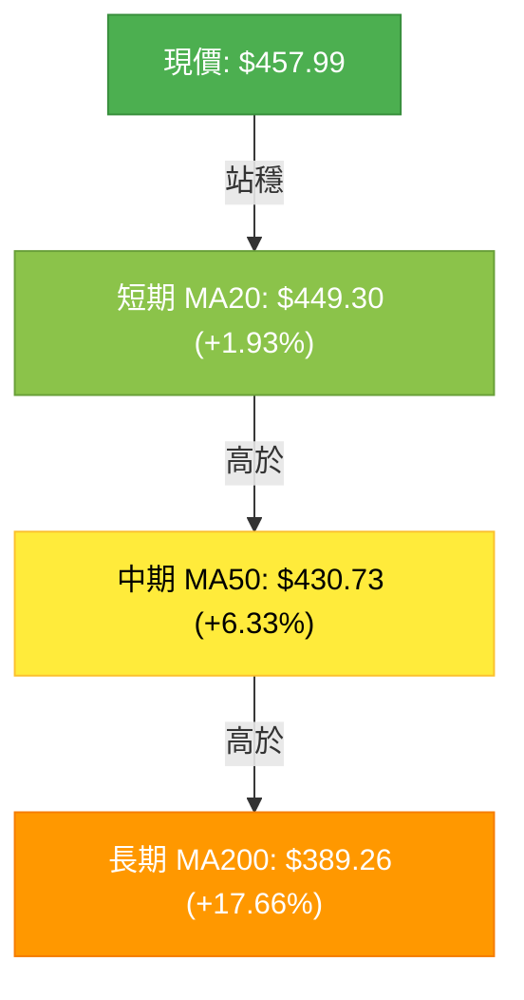
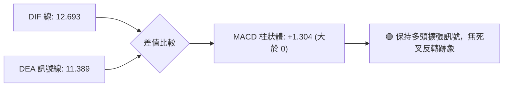
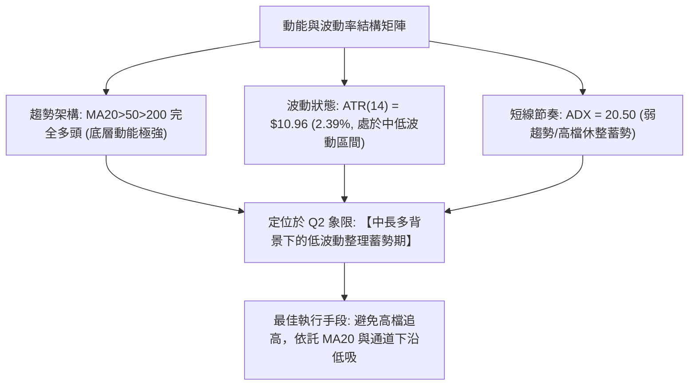
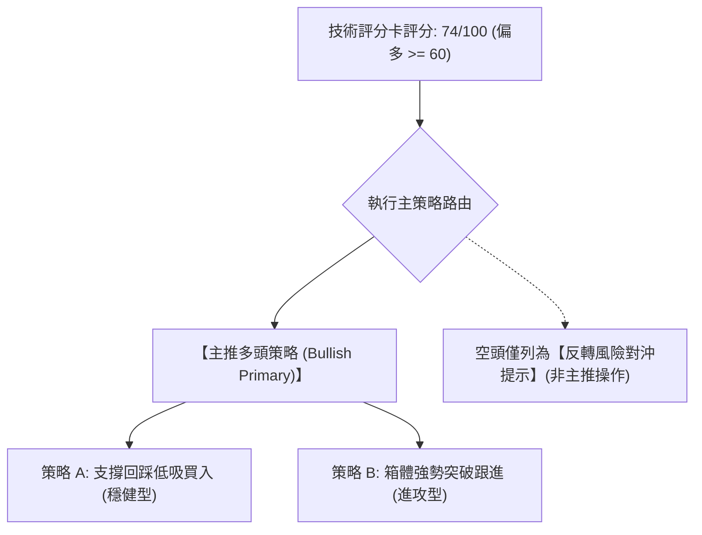
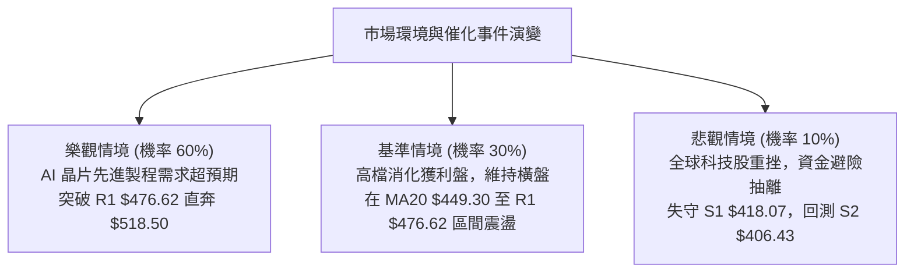

# TSM 技術分析報告

> **報告日期**：2026-10-09 ｜ **語言**：繁體中文 ｜ **數據來源**：Yahoo Finance ｜ **當前價格**：$457.99

---

## 目錄

| 章節 | 內容 |
|------|------|
| [1. 技術面概覽](#1-技術面概覽) | 訊號儀表板、核心指標、評分卡 |
| [2. 趨勢分析](#2-趨勢分析) | 多時框趨勢、長中短期走勢 |
| [3. 圖表形態分析](#3-圖表形態分析) | 形態識別、K線組合、目標價 |
| [4. 支撐與阻力](#4-支撐與阻力) | 關鍵價位、斐波那契回調 |
| [5. 技術指標深度解讀](#5-技術指標深度解讀) | MA/RSI/MACD/布林/成交量 |
| [6. 動能與波動率](#6-動能與波動率) | 動能評估、ATR、Beta |
| [7. 多時框架總結](#7-多時框架總結) | 時框架評分矩陣 |
| [8. 交易策略建議](#8-交易策略建議) | 多空策略、風險報酬比 |
| [9. 風險提示與監控](#9-風險提示與監控) | 監控指標、風險場景 |

---

## 1. 技術面概覽

### 🎯 技術訊號儀表板



### 📊 核心指標速覽表

| 指標類別 | 指標名稱 | 當前數值 | 訊號 | 解讀 |
|----------|----------|----------|------|------|
| **價格** | 當前收盤價 | $457.99 | 🟢 | 位於52週高低點區間 86.8% 高檔強勢區 |
| **均線** | 短期 MA20 | $449.30 | 🟢 | 現價高於 MA20 (+1.93%)，月線具強烈支撐 |
| **均線** | 中期 MA50 | $430.73 | 🟢 | 現價高於 MA50 (+6.33%)，中期季線多頭發散 |
| **均線** | 長期 MA200 | $389.26 | 🟢 | 現價高於 MA200 (+17.66%)，長期多頭牛市結構穩固 |
| **動能** | RSI(14) | 62.62 | 🟢 | 位於 50-70 偏多擴張區，無頂背離跡象 |
| **動能** | MACD (12,26,9) | 12.693 / 11.389 | 🟢 | MACD 線高於訊號線，柱狀體為正 (+1.304)，多方掌控 |
| **動能** | 隨機指標 KD | K: 41.52 / D: 69.11 | 🟡 | 自超買區死叉回檔修正，動能短線降溫進行換手 |
| **趨勢強度** | ADX / DMI | ADX: 20.50 (+DI 32 / -DI 29.86) | 🟡 | ADX < 25 指示趨勢推進減緩，轉入布林通道內之高檔盤整 |
| **通道** | Bollinger Bands | 上軌 $490.57 / 下軌 $408.03 | 🟢 | %B = 0.61，位於中軌上方，通道口擴張後微幅收斂 |
| **量能** | 20日均量比較 | 13,400,300 (比率 1.33x) | 🟢 | 最新量顯著放大，OBV 保持於均線上方，量價配合健康 |
| **波動** | ATR(14) | $10.96 (2.39%) | 🟡 | 每日平均真實波動區間健康，提供標準化風控止損空間 |

### 🏆 技術評分卡

```
╔════════════════════════════════════════════════════════════════════╗
║                   技術評分卡 — TSM (2026-10-09)                    ║
╠════════════════════════════════════════════════════════════════════╣
║ 趨勢強度 (ADX=20.50, +DI優勢)  ████████████░░░░░░░░  60/100   🟡   ║
║ 動能指標 (MACD紅柱, RSI=62.6)  ███████████████░░░░░  75/100   🟢   ║
║ 支撐穩定度 (MA20/Fib23.6支撐)  ████████████████░░░░  80/100   🟢   ║
║ 成交量配合 (量比1.33x, OBV多頭)████████████████░░░░  80/100   🟢   ║
║ 形態完整度 (上升通道震盪盤整)  ██████████████░░░░░░  70/100   🟢   ║
║ 均線排列 (MA20>50>200 完全多頭)██████████████████░░  90/100   🟢   ║
╠════════════════════════════════════════════════════════════════════╣
║ 綜合技術評分                   ███████████████░░░░░  74/100   🟢   ║
║ 綜合技術結論                   【強勢多頭高檔換手整理，逢回分批承接】║
╚════════════════════════════════════════════════════════════════════╝
```

---

## 2. 趨勢分析

### 🌐 多時框趨勢分析



### 📈 長期趨勢 — 12個月走勢圖（Unicode）

```
TSM 月線走勢圖（過去12個月：2025-11 至 2026-10）
價格軸 ($)
$480 ┤                                              ● (06月高點 $476.29)
$460 ┤                                                    ●←(現價 $457.99 / 10月)
$440 ┤                                                ● (09月 $456.19)
$420 ┤                                      ● (05月 $416.36)   ● (08月 $414.21)
$400 ┤                                  ● (04月 $394.08)   ● (07月低點 $403.17)
$380 ┤                      ● (02月 $371.66)
$360 ┤
$340 ┤                          ● (03月洗盤 $336.26)
$320 ┤                  ● (01月 $327.98)
$300 ┤          ● (12月 $301.52)
$280 ┤  ● (11月 $288.46)
$260 ┤
     └─────────────────────────────────────────────────────────────
        11   12   01   02   03   04   05   06   07   08   09   10  (月份)
```

#### 長期走勢特徵分析表

| 階段時間 | 起始 / 結束收盤價 | 區間漲跌幅 | 走勢特徵與結構解讀 |
|----------|-------------------|------------|--------------------|
| **2025/11 - 2026/02** | $288.46 → $371.66 | +28.84% | **主升浪推進**：月K連續收陽，放量突破 $300 整數關口，形成強烈上升動能。 |
| **2026/02 - 2026/03** | $371.66 → $336.26 | -9.52% | **急跌洗盤**：單月回撤測試長期均線支撐，確認 $330-$340 底部換手籌碼紮實。 |
| **2026/03 - 2026/06** | $336.26 → $476.29 | +41.64% | **強勢延伸浪**：連續3個月強勢推升，創出 $476.29 月收盤歷史峰值及 $487.47 52週高點。 |
| **2026/06 - 2026/07** | $476.29 → $403.17 | -15.35% | **波段深幅修正**：獲利了結賣壓湧現，回踩至 38.2% 斐波那契回調位 $402.11 止跌。 |
| **2026/07 - 2026/10** | $403.17 → $457.99 | +13.60% | **二次築底推升**：自低點強勢反彈，連續三個月溫和走揚，現價 $457.99 逼近歷史阻力區。 |

### 📊 中期趨勢（週線分析）

從近 20 週資料觀察，TSM 經歷了清晰的「破底翻」與「震盪走高」循環：
1. **中期低點築底（2026年7月中下旬）**：在 2026-07-19 至 2026-07-26 期間，週收盤價下探至 $397.30 及 $402.33，週 RSI(14) 觸及 27.9 極度超賣區，週成交量暴增至 9,149 萬股，顯示主力資金於 $400 大關下方進行強烈吸籌。
2. **中期波段推進（2026年8月至9月）**：週 MACD 柱狀體於 2026-08-09 翻正（+2.423），推動價格穩步站回週 MA20，並於 2026-10-04 達到週收盤價 $472.78（當週 RSI 衝高至 85.9 短線超買）。
3. **當前高檔收斂（2026-10-11 週）**：本週收盤小幅回跌至 $457.99，週 RSI 回落至健康的 62.6，週 MACD 柱維持正值 (+1.304)，屬於衝高後的健康回踩，未破壞多頭排列。

```
中期支撐與阻力走勢架構：
阻力帶：[R1: $476.62] ───────── [52W High: $487.47] （高檔重壓區）
           ▲
           │ 當前價格位階: $457.99 （高檔盤整運行）
           ▼
支撐帶：[Fib 23.6%: $434.74] ──── [MA50: $430.73] ──── [S1: $418.07]
```

### ⚡ 趨勢強度評估（ADX 解讀）



| 指標名稱 | 當前數值 | 門檻區間 | 趨勢屬性判定 | 交易策略意義 |
|----------|----------|----------|--------------|--------------|
| **ADX(14)** | 20.50 | < 25 (弱趨勢/震盪) | 🟢/🟡 盤整無強單邊 | 不宜追高盲目追突破，需採區間低吸高拋策略 |
| **+DI (14)** | 32.00 | 高於 -DI | 🟢 多頭控制盤面 | 買方力量仍高於賣方，回檔至支撐位具備反彈動能 |
| **-DI (14)** | 29.86 | 低於 +DI | 🟡 空頭抵抗存在 | 空方未潰退，多空在 $450-$470 形成密集換手爭奪 |

---

## 3. 圖表形態分析

### 🔍 形態識別系統

依據形態嚴格判斷規則，結合 24 個月月線走勢與近 20 週數據，識別出以下技術形態：



#### 形態識別與信心度評估表

| 形態名稱 | 信心度 | 判斷依據（嚴格引用歷史數據） | 完成度 | 目標價（附嚴謹計算式） |
|----------|--------|------------------------------|--------|------------------------|
| **高檔箱型整理** | **85%** | 價格受制於近一年波段阻力 R1 $476.62，下方獲得 MA20 $449.30 及 Fib 23.6% $434.74 有效承接。ADX=20.50 強烈佐證盤整結構。 | 75% | **突破目標價**：頸線突破點 R1 $476.62 + 箱體高度 ($476.62 - $434.74 = $41.88) = **$518.50** |
| **雙重底反彈** | **90%** | 2026年7月與8月於低點聚類帶 S2 $406.43 附近形成雙底：2026-07-19 收盤 $397.30，2026-08-02 收盤 $403.17。此後順利突破頸線 $434.67 (2026-09-20收盤)。 | 100% (已達標) | **已達成目標**：頸線 $434.67 + ($434.67 - $397.30 = $37.37) = $472.04（已於 2026-10-04 達到收盤 $472.78，完成履約） |
| **上升通道延續** | **70%** | 自 2025-03 低點 $163.15 展開的兩年上升大趨勢，高點由 $371.66 推進至 $476.29，低點由 $336.26 抬高至 $403.17。通道下軌目前正向上穿過 MA50 $430.73。 | 60% | **通道上軌測量目標**：支撐基點 S1 $418.07 + 前波推進高度 ($476.29 - $336.26 = $140.03) = **$558.10** |

### 🕯️ 重要K線形態分析

| 週期/月份 | 收盤價 | 實體/引線特徵 | K線形態名稱 | 技術解讀與後市涵義 | 多空訊號 |
|-----------|--------|---------------|-------------|--------------------|----------|
| **2026-06** | $476.29 | 長上影線大陽線 | **衝高受阻流星線** | 多頭攻擊至 52W 高點 $487.47 後引發龐大獲利了結盤，確立 R1 $476.62 為關鍵阻力。 | 🟡 警告訊號 |
| **2026-07** | $403.17 | 長下影大陰線 | **極限洗盤錘子線** | 週量暴增至 9,149 萬股，回踩 Fib 38.2% $402.11 獲得強力逢低承接買盤。 | 🟢 底部確認 |
| **2026-08** | $414.21 | 縮量小陽實體 | **底部紅三兵初期** | 空方動能耗盡，空頭賣壓被消化，確立 $400 整數心理防線固若金湯。 | 🟢 多頭重啟 |
| **2026-09** | $456.19 | 光頭大陽線 | **多頭主升長陽** | 大幅推升 +10.13%，強勢收復 MA20，多方重新完全奪回中短期定價權。 | 🟢 多頭確認 |
| **2026-10 (即時)** | $457.99 | 高檔十字星/孕線 | **高檔震盪孕線** | 連接前週 $472.78 後小幅收斂，呈現多空暫時平衡的蓄勢洗盤態勢。 | 🟡 整理觀望 |

### 📉 ASCII 走勢形態示意圖

```
TSM 2026年6月至10月 高檔箱型突破與震盪形態示意圖
價格
$487.47 ┬─ 52W 歷史高點 (2026-06 觸及)
        │       ╭───╮ (06月高點 $476.29)        ╭───╮ (10-04 觸及 $472.78)
$476.62 ┼───────╯   ╰─────────────────────────╯   ╰─── [R1 強阻力線]
        │              \                           /
        │               \                         /
$457.99 ┼────────────────\───────────────────────●─────── [現價位置: 箱體中高位]
        │                 \                     /
$449.30 ┼──────────────────\─── [MA20 / 箱體中軸] ───/───────── [動態短線支撐]
        │                   \                 /
$434.74 ┼────────────────────\───────────────/─────────── [Fib 23.6% 頸線支撐]
        │                     \             /
$418.07 ┼──────────────────────\───────────/───────────── [S1 波段支撐]
        │                       ╰───┬───╯
$397.30 ┴─────────────────────── (07月低點築底 W底) ─────── [52W修正低點帶]
```

### 🎯 形態目標價計算

根據已確認完成度較高的「高檔矩形箱型整理形態」，詳細測量計算如下：
1. **箱體上限（頸線突破點）**：引用關鍵阻力聚類 R1 = **$476.62**
2. **箱體下限（波段支撐基準）**：引用斐波那契 23.6% 回調位 = **$434.74**
3. **箱體垂直垂直垂直振幅（形態垂直高度 $H$）**：
   $$H = \$476.62 - \$434.74 = \$41.88$$
4. **最小量度向上突破目標價（T1）**：
   $$T1 = \text{頸線} + H = \$476.62 + \$41.88 = \mathbf{\$518.50}$$
5. **通道延伸擴張波段目標價（T2）**：
   以 S1 $418.07 為起點，加上前波主升段等長振幅（2026-03 低點 $336.26 至 2026-06 高點 $476.29，振幅 $\$140.03$）：
   $$T2 = \$418.07 + \$140.03 = \mathbf{\$558.10}$$
   *(註：此測量目標 $558.10 與分析師共識平均目標價 $555.01 高度重合，具備強大技術與基本面共振效應)*

---

## 4. 支撐與阻力

### 🗺️ 關鍵價位分布圖（Unicode）

```
TSM 價位結構分布圖（嚴格依據 OHLCV 與歷史波段數據）
═════════════════════════════════════════════════════════════════════
$487.47 ║████████████████████████████████████████║ 52W 歷史極限高點 (0.0% Fib)
$476.62 ║████████████████████████████████        ║ 關鍵阻力 R1 (近一年波段高點聚類)
$457.99 ╠════════════════════════════════════════╣ ◄ 現價位置 ($457.99)
$449.30 ║▓▓▓▓▓▓▓▓▓▓▓▓▓▓▓▓▓▓▓▓                    ║ 動態支撐 (MA20 / 布林中軌)
$434.74 ║▓▓▓▓▓▓▓▓▓▓▓▓▓▓▓▓▓▓▓▓▓▓▓▓                ║ 關鍵回調位 (Fib 23.6%)
$418.07 ║████████████████████████████            ║ 關鍵支撐 S1 (近一年波段低點聚類)
$406.43 ║████████████████████████████████        ║ 強支撐 S2 (密集換手雙底區)
$402.11 ║████████████████████████                ║ 重要回調位 (Fib 38.2%)
$384.06 ║████████████████████████████████████    ║ 鐵底支撐 S3 (MA200 $389.26 共振區)
═════════════════════════════════════════════════════════════════════
```

### 🚧 阻力位分析表

所有阻力價位嚴格引用系統計算之波段聚類數據：

| 阻力級別 | 精確價位 | 距現價幅幅 | 形成原因與籌碼解讀 | 突破難度 | 重要性權重 |
|----------|----------|------------|--------------------|----------|------------|
| **R1** | **$476.62** | +4.07% | 近一年波段高點聚類帶（2026-06 收盤價 $476.29 及 2026-10-04 週高點 $472.78 密集套牢解套區）。 | 🟡 中等偏高 | ★★★★★ (首要多頭攻堅目標) |
| **52W High** | **$487.47** | +6.44% | 52週歷史最高價，同時對應布林通道上軌 $490.57 附近之極端超買警戒區。 | 🔴 極高 | ★★★★☆ (歷史天花板) |
| **形態推算** | **$518.50** | +13.21% | 箱體整理突破量度目標價（由頸線 $476.62 + 箱體高度 $41.88 嚴格推算）。 | 🔴 需量能配合 | ★★★☆☆ (波段擴張目標) |

### 🛡️ 支撐位分析表

所有支撐價位嚴格引用系統計算之波段聚類數據：

| 支撐級別 | 精確價位 | 距現價幅度 | 形成原因與籌碼解讀 | 守住機率 | 重要性權重 |
|----------|----------|------------|--------------------|----------|------------|
| **動態支撐** | **$449.30** | -1.90% | 20日均線 (MA20) 與布林通道中軌重合位，短期多頭生命線。 | 70% | ★★★☆☆ (極短線防守點) |
| **S1** | **$418.07** | -8.72% | 近一年波段低點聚類，與 MA60 $426.12 及週線多頭起漲點形成防守緩衝帶。 | 85% | ★★★★★ (中期波段多空分水嶺) |
| **S2** | **$406.43** | -11.26% | 近一年次級低點聚類，貼近 Fib 38.2% 回調位 $402.11 及 2026-07 築底低位。 | 90% | ★★★★☆ (強烈價值買盤支撐) |
| **S3** | **$384.06** | -16.14% | 波段極限低點聚類，與長期生命線 MA200 ($389.26) 形成重疊共振帶。 | 98% | ★★★★★ (長牛結構最後底線) |

### 📐 斐波那契回調位分析

依據 52 週完整波動區間（低點 **$264.03** 至 高點 **$487.47**，總垂直空間 **$223.44**）分析：

| 回調比例 | 精確價位 | 與現價之相對位置 | 技術分析與結構意涵解讀 |
|----------|----------|------------------|------------------------|
| **0.0% (52W High)** | **$487.47** | 現價上方 (+6.44%) | 歷史最高頂部，極端多頭推進極限。 |
| **23.6%** | **$434.74** | 現價下方 (-5.08%) | **第一回調支撐位**：強勢回檔的極限防守位。現價 $457.99 穩居其上，表明多頭趨勢處於強勢回檔範疇。 |
| **38.2%** | **$402.11** | 現價下方 (-12.20%) | **強弱分界回調位**：2026-07 月線回跌至 $403.17 精準止跌，驗證此位置具備極強結構支撐。 |
| **50.0%** | **$375.75** | 現價下方 (-17.96%) | 中性平衡軸心，接近 240日均線 ($372.49)。 |
| **61.8%** | **$349.38** | 現價下方 (-23.71%) | 黃金分割防守位，2026-03 洗盤低點 $336.26 附近之強支撐層。 |
| **78.6%** | **$311.84** | 現價下方 (-31.91%) | 深幅回調位，多頭不可跌破的崩潰邊界。 |
| **100.0% (52W Low)**| **$264.03** | 現價下方 (-42.35%) | 52週循環起漲原點。 |

**斐波那契區間定位結論**：
現價 **$457.99** 目前明確運行於 **0.0% ($487.47)** 與 **23.6% ($434.74)** 之間的「強勢多頭極致發揮區間」。只要價格維持在 23.6% 回調位 ($434.74) 之上，中長期走勢均定義為強勢攻擊波後的健康蓄勢，未曾轉入弱勢修正。

---

## 5. 技術指標深度解讀

### 🎛️ 指標訊號總覽



### 📈 移動平均線排列分析



#### 均線體系梯度分析表

| 均線名稱 | 當前價格 | 與現價乖離 | 走勢狀態 | 多空屬性 | 技術意義 |
|----------|----------|------------|----------|----------|----------|
| **MA5** | $474.21 | -3.42% | 拐頭向下 | 🔴 壓制 | 短線5日急衝後獲利盤回吐，構成超短期反彈第一壓力。 |
| **MA10** | $464.69 | -1.44% | 走平微跌 | 🟡 震盪 | 10日線為極短線多空樞紐，目前現價略低於此，短線進入整理。 |
| **MA20** | $449.30 | +1.93% | 持續向上 | 🟢 看多 | 月線斜率維持向上，為多頭極為關鍵的下檔防線。 |
| **MA50** | $430.73 | +6.33% | 穩健向上 | 🟢 看多 | 季線中期支撐紮實，確認中期多頭波段行情未變。 |
| **MA60** | $426.12 | +7.48% | 穩健向上 | 🟢 看多 | 中期牛熊分界，與 S1 $418.07 形成厚實買盤承接層。 |
| **MA120** | $421.90 | +8.55% | 向上攀升 | 🟢 看多 | 半年線持續推升，支撐中長線買盤成本。 |
| **MA200** | $389.26 | +17.66% | 強勢向上 | 🟢 極強 | 年線長期牛市基準線，斜率陡峭，長多架構固若金湯。 |
| **MA240** | $372.49 | +22.95% | 強勢向上 | 🟢 極強 | 兩年週期主力持倉線，提供絕對的宏觀牛市保護。 |

**均線綜合解讀**：
當前呈現完美的 **MA20 > MA50 > MA60 > MA120 > MA200 > MA240** 完整大多頭排列（Bullish Alignment）。雖然 MA5 與 MA10 短線走低形成極短期的回檔壓制，但中長期所有均線全面向上發散，回踩 MA20 均屬於標準的多頭良性回調。

### 📉 RSI(14) 分析

- **當前數值**：62.62
- **區間進度條**：
  `30 臨界 [░░░░░░░░░░████████████░░░░░░░░] 70 臨界 (當前: 62.62)`
- **狀態判定**：🟢 **健康多頭活躍區（50 - 70）**
- **背離分析判斷**：
  - **頂背離審查**：回顧 2026-10-04 週價格觸及 $472.78 時，週 RSI 衝高至 85.90；本週價格回落至 $457.99，RSI 相應回落至 62.62，屬於**價跌指標同步下修**的正常釋放超買能量現象，**無頂背離（No Bearish Divergence）**。
  - **底背離審查**：7月低點 $397.30 (RSI 27.9) 與 8月低點 $403.17 (RSI 43.3) 呈現標準的**技術性指標底背離抬升**，確認中期底部已經完全確立。

### 📊 MACD (12, 26, 9) 訊號解讀



- **MACD 線 (DIF)**：12.693
- **Signal 線 (DEA)**：11.389
- **MACD 柱狀體 (Histogram)**：+1.304
- **解讀結論**：MACD 快線穩定運行於慢線之上，柱狀圖維持紅柱 (+1.304)。週線級別柱狀圖雖由前期峰值小幅收斂，但零軸之上的金叉多頭態勢保持完好，代表主趨勢多方動能未散，僅是衝高過後的乖離收斂。

### 📦 布林通道分析

```
TSM 日線布林通道結構示意圖
$490.57 ┬────────────────────────────────────────── BB 上軌
        │                                  ╭───╮
$474.21 ┼─ MA5 阻力                       │   │
        │                                  │   │
$457.99 ┼─ 現價 (%B = 0.61) ───────────────●───┼── [位於中軌與上軌之間]
        │                                      │
$449.30 ┼─ BB 中軌 (MA20) ────────────────────╯─── [關鍵支撐位]
        │
$408.03 ┴────────────────────────────────────────── BB 下軌
```

- **布林帶寬度與位置解讀**：
  - **上軌**：$490.57（緊鄰 52W 高點 $487.47，構成布林通道天花板阻力）
  - **中軌 (MA20)**：$449.30（多頭動態防守中樞）
  - **下軌**：$408.03（與波段支撐聚類 S2 $406.43 及 Fib 38.2% $402.11 形成三重底部共振）
  - **%B 指標**：0.61（處於 0.5 到 1.0 的強勢多頭通道內部運行）。
  - **交易意涵**：價格自上軌附近承壓拉回，但牢牢守住中軌 $449.30。布林帶寬未呈現發散破軌，表明行情維持在通道內的強勢箱體輪動。

### 💹 成交量分析（量價配合度）

1. **成交量與均量比**：
   - 最新成交量：**13,400,300**
   - 20日均量：**10,098,940**
   - **量比（Volume Ratio）**：**1.33x**（成交量放大 33%，為帶量活躍交易）。
2. **量價配合判定**：
   - 在價格自 9 月底一路推升至 $472.78 後，高檔拉回的換手過程中成交量並未出現異常失控拋售。
   - 週成交量自 2026-07 築底期的 9,149 萬股高峰，降至近期的 3,996 萬 - 4,492 萬股區間，呈現「**上漲溫和放量、震盪有序收量**」的健康籌碼鎖定形態。
3. **能量潮指標 (OBV) 解讀**：
   - 系統數據確認：**OBV > MA**。
   - 解讀：OBV 線持續運行於其均線上方，表明實質性主力資金沉澱於場內，每一次價格拉回並未引發機構資金外流，量能持續支撐中長期價格上揚。

---

## 6. 動能與波動率

### ⚡ 動能評估四象限

| 象限區間 | 動能維度 | 波動維度 | 當前狀態判定 | 戰術應對與策略解讀 |
|----------|----------|----------|--------------|--------------------|
| **Q1 (主升狂熱)** | 強動能 (ADX>25) | 高波動 (ATR>3%) | — | 突破追價，嚴設移動止盈 |
| **Q2 (最佳布局)** | **強趨勢 (均線多頭)** | **適度/收斂波動** | **✓ 當前所處位置 (TSM)** | **順勢低吸：均線大多頭但 ADX=20.50 表明處於無單邊的高檔震盪，ATR=2.39% 波動健康，提供低風險進場點** |
| **Q3 (無序震盪)** | 弱動能 (ADX<20) | 低波動 (ATR<2%) | — | 觀望或僅做極窄幅網格交易 |
| **Q4 (破位崩跌)** | 強動能 (空頭主導) | 高波動 (恐慌暴跌) | — | 堅決離場避險或反手做空 |



### 📊 ATR 波動率分析

- **ATR(14) 絕對值**：**$10.96**
- **ATR 相對百分比**：**2.39%**（以現價 $457.99 計算）
- **市場波動性質解讀**：
  ATR 為 $10.96，說明 TSM 每日正常價格擺動空間約為 11 美元。此波動幅度屬於大型權值半導體股的常態健康水位，並未出現情緒化暴衝（如黑天鵝時 ATR 常高於 4%-5%）。
- **風控參數與止損距離建議**：
  - **極短線交易（日內/隔日）**：設定 $1.0 \times \text{ATR} \approx \$11.00$ 緩衝空間。
  - **波段擺盪交易（Swing Trading）**：設定 $1.5 \times \text{ATR} \approx \$16.44$ 緩衝空間（現價回調至約 $441.55，略低於 MA20）。
  - **中長線趨勢防守**：設定 $2.0 \times \text{ATR} \approx \$21.92$ 緩衝空間（回調至約 $436.07，剛好獲得 Fib 23.6% $434.74 支撐）。

### 📐 Beta 與市場相關性

- **Beta 係數**：**1.239**
- **特性分析**：
  TSM 的 Beta 為 1.239，表明其相較於標普500指數（S&P 500）具備 23.9% 的額外進攻波動彈性。在科技股牛市主升段中，TSM 具備顯著超越大盤的超額報酬能力（Alpha）；相對地，若大盤出現系統性回調，其短期震盪幅度亦將放大約 1.24 倍，因此進場時點的支撐位防守紀律至關重要。

---

## 7. 多時框架總結

### 📋 時框架評分表

| 時框架 | 趨勢方向 | 動能狀態 | 均線排列狀況 | 圖表形態特徵 | 綜合評分 | 戰術建議 |
|--------|----------|----------|--------------|--------------|----------|----------|
| **短期 (日線)** | 🟡 震盪整理 | 🟡 KD向下洗盤，RSI=62.62 | 價格在 MA5/10 下，但在 MA20 上 | 高檔箱型收斂孕線 | **68/100** | 暫停追高，回踩 MA20 承接 |
| **中期 (週線)** | 🟢 多頭推升 | 🟢 MACD柱正向，OBV支撐 | MA20 上揚，穩居 MA50 上方 | W底突破後的高檔整固 | **78/100** | 持股續抱，波段逢低加碼 |
| **長期 (月線)** | 🟢 強烈長牛 | 🟢 兩年漲幅+146%，長多確立 | MA20>MA50>MA200 完全多頭排列 | 歷史高點強勢多頭通道 | **90/100** | 長線多單堅定看多 |

### 🔲 綜合訊號矩陣

```
時框與維度收斂矩陣：
┌───────────┬──────────────┬──────────────┬──────────────┐
│ 分析維度  │  短期 (日線) │  中期 (週線) │  長期 (月線) │
├───────────┼──────────────┼──────────────┼──────────────┤
│ 均線系統  │ 🟡 短壓中多  │ 🟢 強勢多頭  │ 🟢 完美多頭  │
│ 動能指標  │ 🟡 整理換手  │ 🟢 紅柱擴張  │ 🟢 強勁上攻  │
│ 圖表形態  │ 🟡 箱型震盪  │ 🟢 頸線突破  │ 🟢 上升通道  │
│ 量能配合  │ 🟢 量比1.33x │ 🟢 籌碼沉澱  │ 🟢 價漲量增  │
│ 綜合訊號  │ 🟡 偏多整理  │ 🟢 逢低作多  │ 🟢 長線持有  │
└───────────┴──────────────┴──────────────┴──────────────┘
```

### ⚖️ 多時框收斂結論

> **依據規則 14 嚴格收斂判定**：
> 1. **趨勢/盤整識別**：日線 ADX(14) 數值為 **20.50 (< 25)**，明確指示短期走勢處於**盤整震盪行情**；然而中期與長期均線維持 MA20>MA50>MA200 的絕對大多頭排列。
> 2. **衝突取捨與收斂機制**：依規定，盤整行情中日線布林通道軌道與箱體為主要進出場邊界，但戰略大方向必須服從週線與長期均線的中長多趨勢。日線短期的 KD 死叉與受制於 MA5 ($474.21) 不構成趨勢反轉，僅定義為「多頭牛市過程中的高檔換手整理」。
> 3. **唯一方向性結論**：**【中長多格局確立，短線偏多高檔震盪蓄勢】**。本結論與第 1 章技術評分卡（74分，偏多）完全一致，並直接指導第 8 章交易策略。

---

## 8. 交易策略建議

### 🗺️ 策略決策流程圖



### 🧭 策略路由（依評分卡分流）

**當前主策略方向 = 多頭操作（Bullish Strategy，依技術綜合評分 74/100 確立）**

本報告堅決遵守單一主方向原則，主推多頭策略；空頭僅列為風險監控與跌破防守時的對沖觸發條件。

### 🎯 價格情境階梯（Price Scenarios）

所有價位精確引用本報告第 4 章及系統數據聚類，嚴禁捏造：

| 觸發條件 | 下一目標 | 後續延伸 | 情境技術含義與應對要點 |
|----------|----------|----------|------------------------|
| **強勢突破 R1 $476.62** | **52W High $487.47** | **突破目標 $518.50** | **多頭主升展開**：突破箱頂，創歷史新高，直奔形態目標價。 |
| **站穩現價與 MA20 ($449.30-$457.99)** | **考驗 R1 $476.62** | **BB上軌 $490.57** | **高檔震盪換手**：消化 MA5 短壓，清洗浮額後蓄勢二次攻頂。 |
| **跌破 S1 $418.07** | **S2 $406.43** | **S3 $384.06** | **中期轉弱修正**：多頭主防線失守，下探年線與 Fib 38.2% 鐵底。 |

### 📊 情境機率分佈

| 情境劇本 | 機率 | 主要技術指標支撐依據 |
|----------|------|----------------------|
| **情境一：高檔蓄勢後向上突破 (Bullish Breakout)** | **60%** | 均線完美多頭 (MA20>50>200)、MACD保持紅柱 (+1.304)、OBV 量能大於均線且量比 1.33x，多頭量價配合優良。 |
| **情境二：布林箱體區間震盪 (Range-bound)** | **30%** | ADX(14) 僅 20.50 (<25)，KD 自超買區死叉回檔修正，MA5/10 形成極短線壓制，需時間消化籌碼。 |
| **情境三：深度拉回再探低點 (Deep Pullback)** | **10%** | 需遭遇重大黑天鵝跌破 Fib 23.6% $434.74 及 S1 $418.07。在當前強大基本面與巨額營收支撐下發生機率偏低。 |

### 🟢 主策略詳情（多頭方向）

所有進場、止損、目標價嚴格鎖定第 4 章關鍵數據與形態計算數值：

| 策略要素 | 策略 A：回踩支撐逢低吸納（穩健型） | 策略 B：突破關鍵阻力順勢追擊（進攻型） |
|----------|-----------------------------------|---------------------------------------|
| **適用情境** | 股價回測 MA20 與 Fib 支撐不破時佈局 | 股價帶量突破近一年波段阻力聚類 R1 時跟進 |
| **進場條件** | 回踩 MA20 附近出現下影線或止跌陽線確認 | 日K帶量收盤確認突破關鍵阻力 R1 $476.62 |
| **進場價格** | **$449.30**（精確對齊 MA20 / 布林中軌） | **$476.62**（精確對齊阻力聚類 R1 突破點） |
| **第一目標 (T1)** | **$476.62**（阻力 R1，潛在獲利 +6.08%） | **$487.47**（52W 歷史高點，獲利 +2.28%） |
| **第二目標 (T2)** | **$518.50**（箱體突破目標價，獲利 +15.40%） | **$518.50**（箱體突破形態目標，獲利 +8.79%） |
| **止損價格** | **$434.74**（精確對齊 Fib 23.6% 關鍵回調位） | **$457.99**（當前現價，亦即突破後的假突破回吐點） |
| **止損距離** | -$14.56 (-3.24%) | -$18.63 (-3.91%) |
| **風險報酬比** | **1 : 4.75** (以 T2 計算：$69.20 / $14.56) | **1 : 2.25** (以 T2 計算：$41.88 / $18.63) |
| **歷史勝率估計** | **70%** (中長多背景下順勢拉回買進勝率極高) | **60%** (需伴隨成交量突破放大方能成立) |
| **建議配置倉位** | **15% - 20%** 總投資資金 | **10% - 15%** 總投資資金 |

### 🔴 反向風險觸發點（對沖提示）

本提示僅作為多頭策略之極端風險警報，非主推做空操作：
- **風險反轉觸發位**：若日K線以實體長陰線**跌破波段關鍵支撐 S1 $418.07**。
- **對沖訊號確認**：週 MACD 出現零軸上死叉，且週收盤價確認跌破 S1。
- **風控應對手段**：
  1. 多頭部位全面無條件停損出場或減倉 80% 以上。
  2. 僅允許激進交易者建立不超過 5% 倉位之逆勢空單對沖，**下檔回補目標價鎖定 S2 $406.43 及 Fib 38.2% $402.11**，空單嚴格止損於 **$434.74**。

### ⭐ 整體訊號強度評星

```
做多訊號強度：★★★★☆  (4/5星 - 均線極度強勢，量能配合，僅短線面臨整理)
做空訊號強度：★☆☆☆☆  (1/5星 - 長中短期多頭逆風，逆勢做空風險極大)
整體可信度：  ★★★★☆  (4/5星 - 指標共振度高，ADX與布林帶明確指示區間)
```

---

## 9. 風險提示與監控

### ✅ 關鍵監控指標 Checklist

```
╔════════════════════════════════════════════════════════════════════╗
║                   每日交易風險監控清單 (Checklist)                  ║
╠════════════════════════════════════════════════════════════════════╣
║ [ ] 價格是否跌破月線 MA20 動態防守位 ($449.30)？                   ║
║ [ ] RSI(14) 是否跌破 50 多空中軸轉入空方主導區？                   ║
║ [ ] 日成交量在回調時是否激增超過 2,000 萬股（放量出逃預警）？     ║
║ [ ] MACD 柱狀體是否由正轉負（跌破零軸死叉確認）？                  ║
║ [ ] ADX(14) 是否在回跌中突破 25（代表轉入向下強趨勢）？           ║
║ [ ] 價格向上攻堅時，能否以 1.5 倍以上均量實質突破 R1 ($476.62)？  ║
╚════════════════════════════════════════════════════════════════════╝
```

### ⚠️ 風險場景分析



### 🛡️ 風險管理重要提醒

1. **嚴禁高檔逆勢扛單**：
   儘管中長期趨勢完全看多，但短線若意外跌破第一防守位 Fib 23.6% ($434.74)，必須果斷執行停損或降薪保護利潤，嚴防短線震盪演變為中期回撤。
2. **倉位管理黃金法則**：
   單一標的（TSM）總暴險倉位建議不超過個人總投資組合之 **25%**。單筆交易之最大止損金額嚴格控制在總投資本金之 **1.5% - 2.0%** 範圍內。
3. **波動率緩衝設置**：
   目前 ATR 為 **$10.96**，任何交易掛單皆須保留至少 1.5 倍 ATR（約 $16.44）之價格浮動空間，避免被盤中假突破或掃單引線觸發不必要的平倉。

---

## 📋 報告總結

```
╔════════════════════════════════════════════════════════════════════╗
║                   TSM 技術分析綜合報告總結                         ║
╠════════════════════════════════════════════════════════════════════╣
║ 報告日期：2026-10-09                                               ║
║ 當前價格：$457.99                                                  ║
║ 分析評級：🟢 偏多（多頭排列高檔強勢整理，技術評分: 74/100）        ║
║                                                                    ║
║ 核心趨勢結論：                                                     ║
║ ├─ 長期趨勢：🟢 月線強烈大多頭，24個月上漲逾146%，牛市根基穩固     ║
║ ├─ 中期趨勢：🟢 站穩 MA50 $430.73 與 S1 $418.07，W底突破多頭延續  ║
║ ├─ 短期趨勢：🟡 ADX=20.50 表明處於箱型換手，受 MA5 壓制但守住 MA20║
║ ├─ 關鍵支撐：動態 MA20 $449.30 ｜ Fib23.6% $434.74 ｜ 波段S1 $418.07║
║ ├─ 關鍵阻力：波段阻力 R1 $476.62 ｜ 52W高點 $487.47 ｜ 目標 $518.50║
║ └─ 分析師目標共識：平均目標價 $555.01 (最高 $700.00，評級: Strong Buy)║
║                                                                    ║
║ 最優策略組合：                                                     ║
║ 1. 🥇 最佳機會（策略 A）：回踩 MA20 $449.30 低吸，止損 $434.74，   ║
║    目標 T1 $476.62 / T2 $518.50，風酬比高達 1:4.75。               ║
║ 2. 🥈 次選機會（策略 B）：帶量突破 R1 $476.62 追進，止損 $457.99， ║
║    目標 T1 $487.47 / T2 $518.50，風酬比 1:2.25。                  ║
║ 3. 🥉 保守選擇：場外觀望等待日線 ADX 向上穿越 25 且突破 R1 後進場。║
╚════════════════════════════════════════════════════════════════════╝
```

---

> ⚠️ **免責聲明**：本報告為技術分析研究，所有數據、價位計算及估算均嚴格基於所提供之歷史價格與量能資訊。本報告**僅供研究與學術參考**，**不構成任何要約、招攬或投資建議**。金融市場投資具備實質風險，投資人應獨立評估自身風險承受能力並自負盈虧。

---

*報告生成時間：2026-10-09 ｜ 數據來源：Yahoo Finance ｜ 分析框架：多時框技術分析模型*