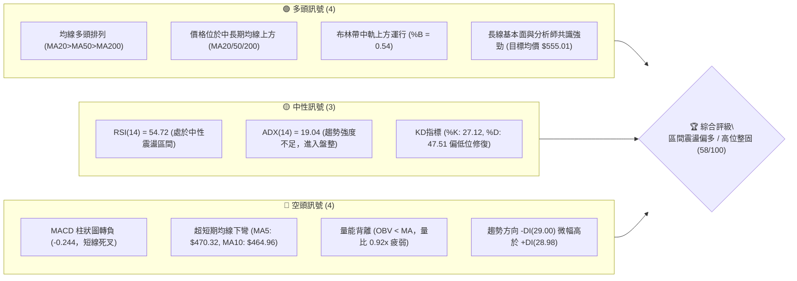
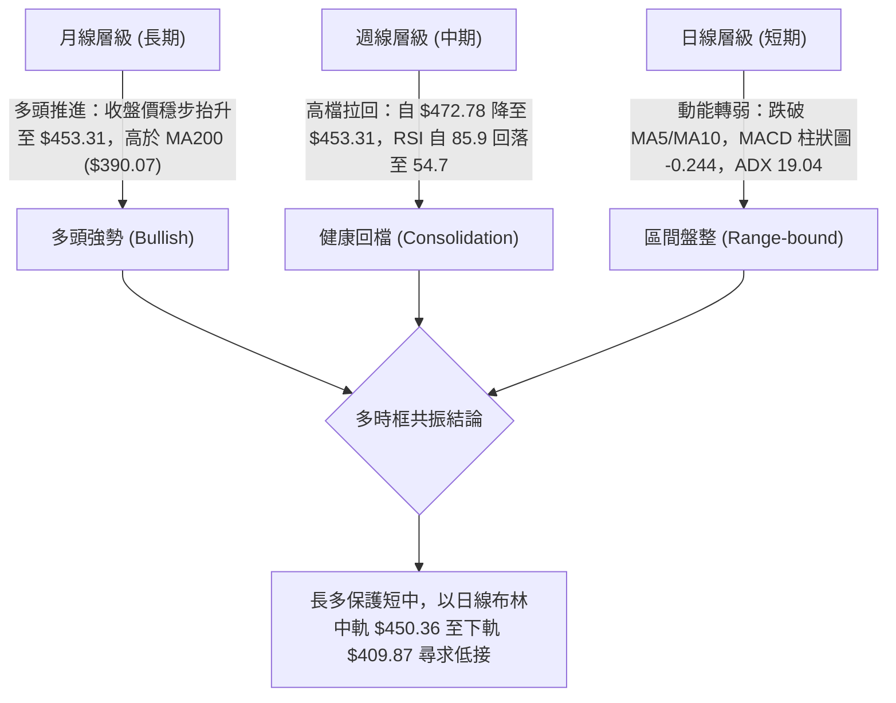
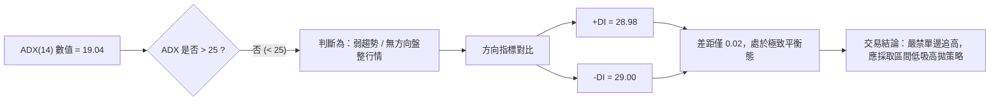
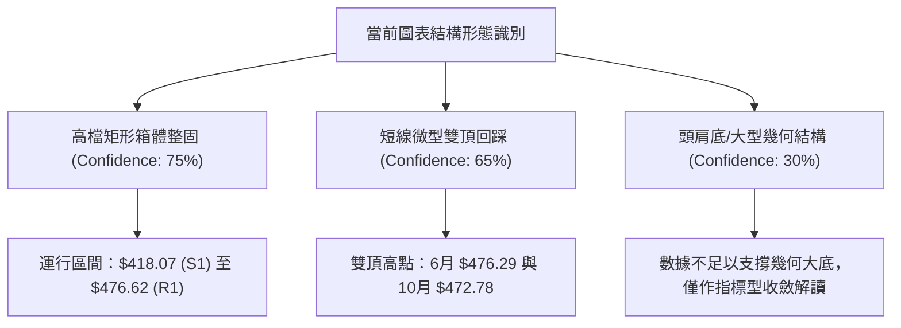
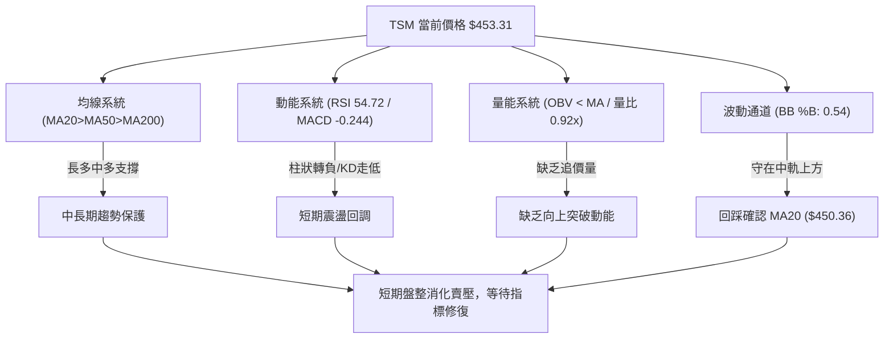
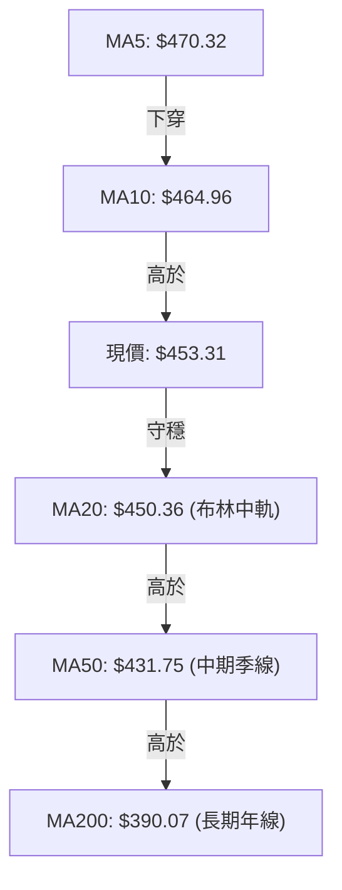
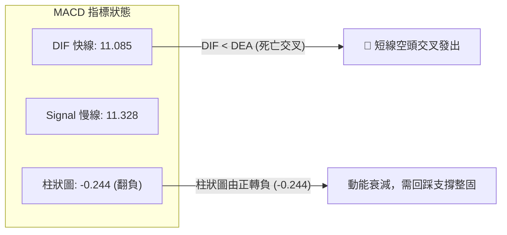
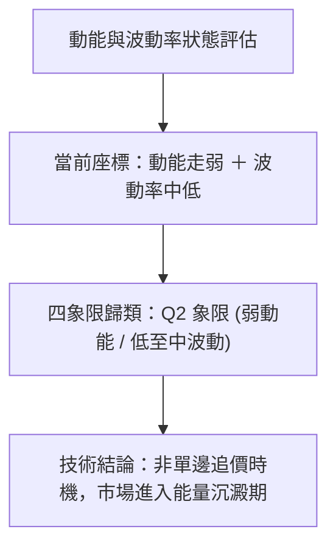
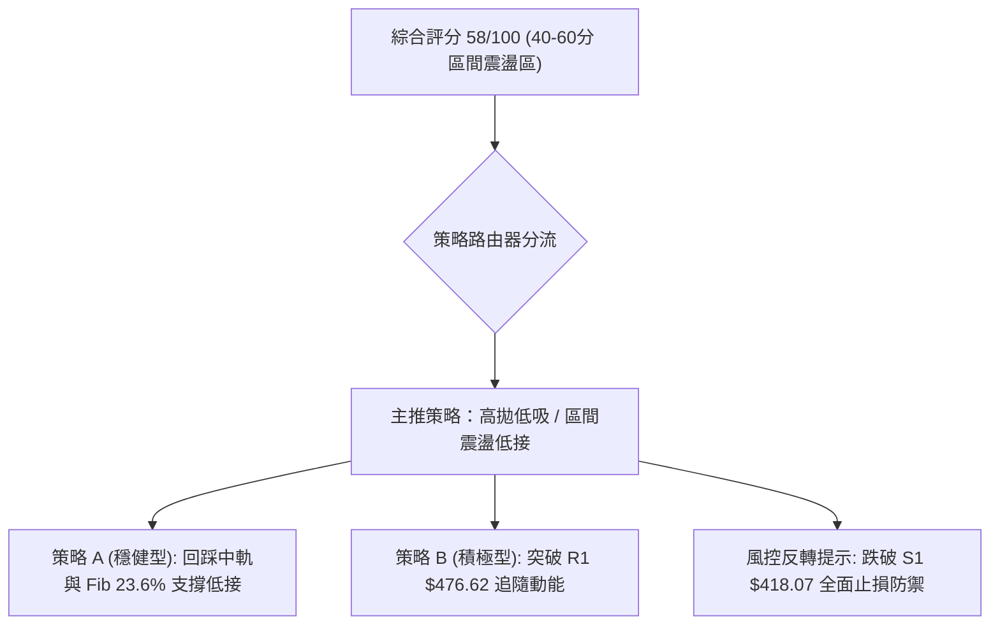
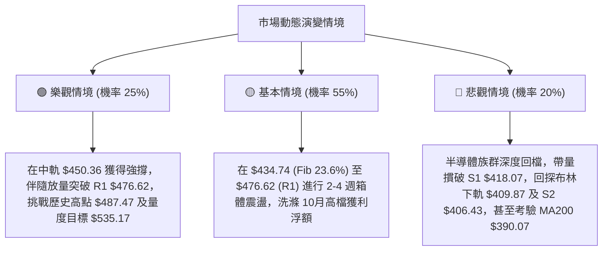

# TSM 基本面與技術深度分析報告

> **報告日期**：2026-10-10 ｜ **語言**：繁體中文 ｜ **數據來源**：Yahoo Finance ｜ **當前價格**：$453.31

---

## 目錄

| 章節 | 內容 |
|------|------|
| [1. 技術面概覽](#1-技術面概覽) | 訊號儀表板、核心指標、評分卡 |
| [2. 趨勢分析](#2-趨勢分析) | 多時框趨勢、長中短期走勢 |
| [3. 圖表形態分析](#3-圖表形態分析) | 形態識別、K線組合、目標價 |
| [4. 支撐與阻力](#4-支撐與阻力) | 關鍵價位、斐波那契回調 |
| [5. 技術指標深度解讀](#5-技術指標深度解讀) | MA/RSI/MACD/布林/成交量 |
| [6. 動能與波動率](#6-動能與波動率) | 動能評估、ATR、Beta |
| [7. 多時框架總結](#7-多時框架總結) | 時框架評分矩陣 |
| [8. 交易策略建議](#8-交易策略建議) | 多空策略、風險報酬比 |
| [9. 風險提示與監控](#9-風險提示與監控) | 監控指標、風險場景 |

---

## 1. 技術面概覽

### 🎯 技術訊號儀表板



### 📊 核心指標速覽表

| 指標類別 | 指標名稱 | 當前數值 | 訊號 | 解讀 |
|----------|----------|----------|:----:|------|
| **價格** | 當前收盤價 | $453.31 | 🟢 | 位於52週區間 84.7% 高位，整體多頭架構未破 |
| **短期均線** | MA5 / MA10 | $470.32 / $464.96 | 🔴 | 價格低於 MA5 與 MA10，短線面臨回檔修正壓力 |
| **中期均線** | MA20 / MA50 | $450.36 / $431.75 | 🟢 | 守穩 MA20 生命線與 MA50 季線，中期多方防禦健全 |
| **長期均線** | MA200 / MA240 | $390.07 / $373.16 | 🟢 | 遠高於長期均線（乖離 +16.21%），長期牛市趨勢完好 |
| **動能** | RSI(14) | 54.72 | 🟡 | 自前週 85.9 超買區大幅回落至中性水準，無顯著背離 |
| **趨勢強度** | ADX(14) / ±DI | 19.04 (+DI: 28.98 / -DI: 29.00) | 🟡 | ADX < 25 進入盤整蓄勢格局，多空雙方力量極度拉鋸 |
| **動能交叉** | MACD (12,26,9) | 11.085 / 11.328 (柱: -0.244) | 🔴 | MACD 柱狀圖翻負形成死叉，短線動能出現衰退警訊 |
| **通道指標** | 布林通道 (%B) | 上軌 $490.85 / 下軌 $409.87 (%B: 0.54) | 🟢 | 剛好自上軌回測至中軌 ($450.36) 獲得初步支撐 |
| **量能指標** | 最新量 / 20日均量 | 9,225,100 / 10,029,805 (0.92x) | 🔴 | 成交量低於均量，OBV 跌破均線，追價動能暫時退潮 |
| **波動度** | ATR(14) | $11.25 (佔價格 2.48%) | 🟡 | 日均波幅約 $11.25，處於正常波動水平，無極端爆量拉鋸 |

### 🏆 技術評分卡

```
╔══════════════════════════════════════════════════════════════╗
║              技術評分卡 — TSM (2026-10-10)                   ║
╠══════════════════════════════════════════════════════════════╣
║ 趨勢強度 (Trend)     ████████░░░░░░░░░░░░  40/100  🟡 弱勢盤整 ║
║ 動能指標 (Momentum)  ██████████░░░░░░░░░░  50/100  🟡 動能修復 ║
║ 支撐穩定度 (Support) ██████████████░░░░░░  70/100  🟢 買盤堅實 ║
║ 成交量配合 (Volume)  ████████░░░░░░░░░░░░  40/100  🔴 量能萎縮 ║
║ 形態完整度 (Pattern) ████████████░░░░░░░░  60/100  🟡 高位收斂 ║
║ 均線排列 (MAs)       ██████████████████░░  90/100  🟢 完美多頭 ║
╠══════════════════════════════════════════════════════════════╣
║ 綜合評分             ███████████░░░░░░░░░  58/100  中性偏多整固 ║
╚══════════════════════════════════════════════════════════════╝
```

---

## 2. 趨勢分析

### 🌐 多時框趨勢分析



### 📈 長期趨勢 — 12個月走勢圖（Unicode）

以下為 TSM 自 2025 年 11 月至 2026 年 10 月之月線收盤價歷史走勢圖：

```
TSM 月線走勢圖（2025-11 至 2026-10）
價格軸 ($)
$480 ┤                                  ● $476.29 (6月高點)
$460 ┤                                      │          ● $456.19
$440 ┤                                      │          │   ● $453.31 (當前)
$420 ┤                              ● $416.36   ● $403.17   ● $414.21
$400 ┤                          ● $394.08   │   │      │   │
$380 ┤                  ● $371.66   │       │   │      │   │
$360 ┤                  │   │       │       │   │      │   │
$340 ┤              ● $327.98   ● $336.26   │   │      │   │
$320 ┤          ● $301.52   │   │   │       │   │      │   │
$300 ┤  ● $288.46   │       │   │   │       │   │      │   │
$280 ┤  │   ● $297.28       │   │   │       │   │      │   │
     └────────────────────────────────────────────────────────────
        11  12  01  02  03  04  05  06  07  08  09  10 (月份)
       (2025) └───────────── 2026 年 ─────────────┘
```

#### 走勢特徵分析表格

| 階段 | 時間區間 | 起訖價格 | 區間漲跌幅 | 走勢特徵與量價解讀 |
|------|----------|----------|:----------:|-------------------|
| **第一階段：底階推升** | 2025/11 - 2026/02 | $288.46 → $371.66 | +28.84% | 強力多頭波段，月線連四紅，價格突破 $300 與 $350 心理整數關卡 |
| **第二階段：震盪洗盤** | 2026/02 - 2026/03 | $371.66 → $336.26 | -9.52% | 獲利了結回檔，於支撐位 $336 附近完成均線回踩確認 |
| **第三階段：主升浪潮** | 2026/03 - 2026/06 | $336.26 → $476.29 | +41.64% | 主升浪爆發，連破歷史天價，6月收在 $476.29 創波段收盤新高 |
| **第四階段：深度洗盤** | 2026/06 - 2026/07 | $476.29 → $403.17 | -15.35% | 高位恐慌釋放，7月最低探至 $397.30，測試 MA200 與支撐群 |
| **第五階段：二次築頂/整固** | 2026/07 - 2026/10 | $403.17 → $453.31 | +12.44% | 震盪反彈後於 $450-$470 形成高檔旗形盤整，目前回測 $453.31 |

### 📊 中期趨勢（週線分析）

從近20週數據顯示，TSM 在 2026 年 7 月經歷一次放量回測（2026-07-19 週成交量高達 91,498,900，價格觸底 $397.30），隨後量縮回升至 2026-10-04 的 $472.78（RSI 衝上 85.9 超買高點）。當前最新週（2026-10-11）收盤 $453.31，單週回吐跌幅，RSI 降至 54.7，MACD 柱狀圖由 +2.837 轉為 -0.244，顯示中期正處於由「超買冷卻」轉向「中軌回踩」的結構。

```
TSM 週線關鍵壓力與支撐示意圖
$487.47 ─── [52W High / 斐波那契 0.0%] ────────────────────── 絕對天花板阻力
$476.62 ─── [R1 阻力位 / 近一年高點聚類 / 10-04高點 $472.78] ── 短線多頭重壓
         ▲
$453.31 ─── [當前價格 / 週線回落測試點]
         ▼
$450.36 ─── [MA20 / 布林中軌] ────────────────────────────── 第一防守線
$434.74 ─── [斐波那契 23.6% 回調位] ──────────────────────── 強支撐位
$418.07 ─── [S1 支撐位 / 8月波段低點平台] ────────────────── 核心結構防線
```

### ⚡ 趨勢強度評估（ADX 解讀）



#### ADX 趨勢強度量化對照表

| ADX 區間 | 市場狀態 | 當前數值與匹配度 | 戰術策略對應 |
|:--------:|:--------:|:----------------:|:------------|
| 0 – 20 | 缺乏趨勢 / 窄幅盤整 | **19.04 (完全吻合 🟢)** | **區間震盪交易**：布林帶邊界交易，勿追突破 |
| 20 – 25 | 潛在趨勢醞釀中 | - | 觀察量能是否放大與均線收斂發散 |
| 25 – 40 | 強趨勢形成 | - | 順勢單邊操作，依均線持倉 |
| 40 – 60 | 極強單邊趨勢 | - | 緊盯乖離率，提防獲利盤了結 |

---

## 3. 圖表形態分析

### 🔍 形態識別系統



#### 形態識別與信心度評估表

| 形態名稱 | 信心度 | 判斷依據（嚴格引用數據） | 完成度 | 目標價（附嚴格計算式） |
|----------|:------:|--------------------------|:------:|------------------------|
| **高檔箱體整固區間 (Trading Range)** | **75%** | 價格受阻於 R1 ($476.62) 且受支撐於 S1 ($418.07)，近月收盤多次於此兩價位間震盪。 | 85% | 向上突破目標：$476.62 + ($476.62 - $418.07) = **$535.17**；向下跌破目標：$418.07 - $58.55 = **$359.52** |
| **高檔雙頂微型回踩 (Double Top Retest)** | **65%** | 第一次高點為 2026-06 收盤 $476.29，第二次為 2026-10-04 高點 $472.78（逼近 R1 $476.62），未能越過 52W 高點 $487.47，隨後回落。 | 60% | 頸線為中間低點 2026-07 探底低點 $397.30。形態回測最小量度跌幅：$397.30 - ($476.29 - $397.30) = **$318.31**（若頸線未破則形態不成立） |
| **頭肩底形態** | **25%** | *訊號不足，僅做指標型解讀*：歷史數據並無典型左肩右肩與對稱頸線，不予強行畫圖。 | 0% | *數據中未偵測到* |

### 🕯️ 重要K線形態分析

| 月份 | 收盤價 | K線形態 | 解讀 | 訊號 |
|------|--------|---------|------|:----:|
| **2026-06** | $476.29 | 大陽線帶長上影 | 觸及 52W 高位後引發獲利盤，月收盤創波段最高，多頭動能達到極致 | 🟢 |
| **2026-07** | $403.17 | 長黑實體殺跌K線 | 單月自 $476 暴跌至 $403，週線爆出 9149 萬股大量，完成恐慌盤出清 | 🔴 |
| **2026-08** | $414.21 | 下影線小陽十字星 | 於 S1 ($418.07) 與 S2 ($406.43) 支撐區止跌，買盤進駐，築底確立 | 🟢 |
| **2026-09** | $456.19 | 中長陽實體推進 | 買盤強勢回歸，突破 MA20 ($450.36)，多頭重新奪回主導權 | 🟢 |
| **2026-10** | $453.31 | 高檔帶上影孕線 (Harami) | 衝擊 $472.78 後拉回至 $453.31，受制於 R1 $476.62，顯示上方追價意願不足 | 🟡 |

### 📉 ASCII 走勢形態示意圖

```
TSM 高檔箱體整固與雙頂測試示意圖
   [R1: $476.62] ─── 頂部1 ($476.29) ───────── 頂部2 ($472.78)
                      │    ▲                    ▲    │
                      │    │                    │    │ (短線回落中)
                      │    │                    │    ▼
   [現價: $453.31] ───┼────┼────────────────────┼─── ● $453.31
                      │    │                    │
   [MA20: $450.36] ───┼────┼────────────────────┼─── [布林中軌支撐]
                      │    │                    │
   [Fib 23.6%: $434.74]───┼────────────────────┼─── [回調關鍵支撐]
                      │                         │
   [S1: $418.07]  ────┴─── 底階平台 ($418.07) ──┴─── [箱體下緣支撐]
```

### 🎯 形態目標價計算

根據上述 75% 信心度之「高檔矩形箱體整固」進行量度推算：
1. **箱體上限（頸線/阻力）**：$476.62 (R1)
2. **箱體下限（支撐）**：$418.07 (S1)
3. **箱體垂直高度**：$476.62 - $418.07 = $58.55
4. **多頭向上突破量度目標價**：$476.62 + $58.55 = **$535.17**（與分析師平均目標價 $555.01 形成高度共振）
5. **空頭向下跌破量度目標價**：$418.07 - $58.55 = **$359.52**（逼近 MA240 均線 $373.16 與斐波那契 61.8% 的 $349.38）

---

## 4. 支撐與阻力

### 🗺️ 關鍵價位分布圖（Unicode）

```
TSM 價位結構分布圖
══════════════════════════════════════════════════════════════════
$487.47 ║██████████████████████████████║ 歷史極值 / 52W High (Fib 0.0%)
$476.62 ║████████████████████████      ║ 強阻力 R1 (波段高點聚類)
$453.31 ╠══════════════════════════════╣ ◄ 現價 ($453.31)
$450.36 ║▓▓▓▓▓▓▓▓▓▓▓▓▓▓▓▓▓▓▓▓          ║ 動態支撐 MA20 / 布林中軌
$434.74 ║▓▓▓▓▓▓▓▓▓▓▓▓▓▓                ║ 關鍵斐波那契 23.6% 回調位
$418.07 ║████████████████████          ║ 關鍵波段支撐 S1
$406.43 ║████████████████              ║ 次級結構支撐 S2 (近布林下軌 $409.87)
$384.06 ║████████████████████████      ║ 長期防守強支撐 S3 (MA200 $390.07 護航)
══════════════════════════════════════════════════════════════════
```

### 🚧 阻力位分析表

所有價位均來自資料庫之計算數值與高點聚類：

| 阻力級別 | 價位 | 形成原因 | 突破難度 | 重要性 |
|:--------:|:----:|----------|:--------:|:------:|
| **R1** | **$476.62** | 近一年波段高點聚類（2026-06 收盤 $476.29 與 2026-10 高點重疊區） | 🔴 極高 | ★★★★★ 關鍵短線多空分水嶺，站穩方能挑戰歷史天花板 |
| **R2** | **$487.47** | 52週歷史最高點（52W High，斐波那契 0.0% 基準點） | 🔴 極高 | ★★★★★ 歷史歷史新高壓力位，獲利回吐與套牢解套賣壓集中區 |
| **R3** | *數據中未偵測到* | 歷史無更高成交聚類，若向上穿透 $487.47，上方進入無套牢籌碼真空區 | 🟡 中等 | ★★★☆☆ 上方阻力參考量度目標價 $535.17 與分析師均價 $555.01 |

### 🛡️ 支撐位分析表

所有價位嚴格引用 OHLCV 計算之支撐位聚類：

| 支撐級別 | 價位 | 形成原因 | 守住機率 | 重要性 |
|:--------:|:----:|----------|:--------:|:------:|
| **S1** | **$418.07** | 近一年波段低點聚類，8月築底平台低點 ($414-$418) | 75% | ★★★★★ 第一核心防線，跌破則箱體架構被破壞 |
| **S2** | **$406.43** | 次級波段低點聚類，貼近布林下軌 $409.87 與 Fib 38.2% ($402.11) | 85% | ★★★★☆ 強力超跌防守帶，機構買盤集中回補區 |
| **S3** | **$384.06** | 長期波段低點聚類，下方有 MA200 ($390.07) 及 Fib 50% ($375.75) 雙重保護 | 95% | ★★★★★ 長期牛市生命線，跌破宣告長線多頭反轉 |

### 📐 斐波那契回調位分析

依據 52 週區間（低點 $264.03 → 高點 $487.47，垂直落差 $223.44）所計算之精確斐波那契回調位如下：

| 回調比例 | 對應價位 | 與現價 ($453.31) 距離 | 技術面解讀與防守價值 |
|:--------:|:--------:|:--------------------:|----------------------|
| **0.0% (52W High)** | **$487.47** | +7.53% | 多頭終極阻力位，目前相距約 $34.16 |
| **23.6%** | **$434.74** | -4.10% | **現價下方第一道黃金分割支撐**。現價 ($453.31) 位於 0.0% 與 23.6% 之間的高檔強勢區 |
| **38.2%** | **$402.11** | -11.29% | 核心多頭防守位，緊鄰支撐位 S2 ($406.43) 與 7月收盤低點 ($403.17) |
| **50.0%** | **$375.75** | -17.11% | 多空中軸平衡線，貼近 MA240 年線 ($373.16) |
| **61.8%** | **$349.38** | -22.93% | 黃金分割強防守位，若跌破此位則本輪 52 週牛市架構宣告終結 |
| **78.6%** | **$311.84** | -31.21% | 深幅回撤位，長期價值投資終極安全邊際 |
| **100.0% (52W Low)**| **$264.03** | -41.76% | 52週週期起漲原點 |

**現價落點解讀**：現價 $453.31 正精準運行於 **0.0% ($487.47)** 與 **23.6% ($434.74)** 之間，該區間屬於「超強勢整理區」。只要價格不實質跌破 23.6% ($434.74)，回檔均屬健康技術性洗盤。

---

## 5. 技術指標深度解讀

### 🎛️ 指標訊號總覽



### 📈 移動平均線排列分析



#### 各期均線數值與狀態表

| 均線週期 | 數值 | 與現價乖離率 | 趨勢方向 | 技術意涵 |
|:--------:|:----:|:------------:|:--------:|----------|
| **MA 5** | $470.32 | -3.62% | ▼ 下彎 | 超短期空頭反壓，短線獲利盤快速套現 |
| **MA 10** | $464.96 | -2.51% | ▼ 下彎 | 短期空頭阻力，壓制反彈空間 |
| **MA 20** | $450.36 | +0.65% | ▲ 上揚 | 月線生命線，現價貼近此處，多方首要防禦陣地 |
| **MA 50** | $431.75 | +5.00% | ▲ 上揚 | 中期季線防線，為多頭重要回檔緩衝墊 |
| **MA 60** | $426.86 | +6.20% | ▲ 上揚 | 雙月中期趨勢線，多頭結構紮實 |
| **MA 120**| $422.64 | +7.26% | ▲ 上揚 | 半年線持續上移，多方中長線底氣 |
| **MA 200**| $390.07 | +16.21% | ▲ 上揚 | 長期牛熊分水嶺，呈現長期大牛市特徵 |
| **MA 240**| $373.16 | +21.48% | ▲ 上揚 | 年線穩固向上，基本面長期支撐 |

### 📉 RSI(14) 分析

- **RSI(14) 當前數值**：54.72
- **強度指示進度條**：
  ```
  [0 ── 極度超賣]                                     [100 ── 極度超買]
  ░░░░░░░░░░░░░░░░░░░░░░░░░░░░░░█▓▓▓▓▓▓▓▓░░░░░░░░░░░░░░░░░░░░░░░░
  0           30(超賣線)         54.72(中性)      70(超買線)     100
  ```
- **超買超賣與背離判斷**：
  - 前一週（2026-10-04）RSI 曾飆升至 **85.9** 的極端超買警戒區，隨後伴隨價格自 $472.78 回檔至 $453.31，RSI 迅速降溫至 **54.72**，成功釋放短線過熱風險。
  - **背離診斷**：目前日線與週線層面 **無明顯頂背離或底背離**。價格在 10 月初創出 $472.78 高點時 RSI 亦同步衝高（85.9），當前回調為典型的指標超買修復，並非衰竭性背離。

### 📊 MACD(12/26/9) 訊號解讀



- **MACD 快慢線解讀**：DIF (11.085) 剛微幅下穿 Signal (11.328)，形成高位「死叉」。但兩者數值均遠在零軸上方（>10），說明其性質屬於**「多頭市場中的強勢回檔整理」**，而非轉入單邊空頭市場。
- **動能預警**：柱狀圖自前週的 +2.837 驟降至 -0.244，顯示買盤動能已快速冷卻，短線不具備立即向上暴衝的條件。

### 📦 布林通道分析

```
TSM 布林通道示意圖 (Bollinger Bands, 20, 2)
$490.85 ──────────────────────────────────── 上軌 (Upper Band)
          ╲
           ╲    ● 10-04 高點 $472.78 (受阻於上軌下方)
            ╲  ╱
$453.31 ─────●────────────────────────────── 現價 ($453.31, %B = 0.54)
$450.36 ──────────────────────────────────── 中軌 (MA20) ─── 臨界考驗！
               ╲
                ╲
$409.87 ──────────────────────────────────── 下軌 (Lower Band)
```

- **通道寬度與位置解讀**：
  - 布林帶寬度：$490.85 - $409.87 = $80.98（約 17.8% 帶寬）。
  - 當前 **%B 數值為 0.54**，剛好位於中軌 ($450.36) 稍上方（0.5 代表中軌）。價格目前剛脫離上軌壓制，正在測試中軌的支撐有效性。
  - 若能在中軌 $450.36 止跌，將維持布林帶上半區間的中強勢震盪；若帶量跌破中軌，則有向布林下軌 $409.87 及支撐位 S2 ($406.43) 尋求支撐的風險。

### 💹 成交量分析（量價配合度）

1. **量能縮減現狀**：
   - 最新單日成交量為 **9,225,100**，低於 20 日均量 **10,029,805**（量比僅 **0.92x**），亦低於 50 日均量 **9,920,816**。
   - 週成交量方面，最新週為 49,214,200 股，相較於 7 月下殺時的 91,498,900 股縮減近 46%。
2. **OBV 能量潮判讀**：
   - 數據明確顯示 **「OBV < MA → 量能疲弱」**。
   - 成交量未隨價格在 10 月初推高而同步放大（10-04 週量僅 44,927,100 股），形成標準的**「量價背離（價漲量縮）」**，直接導致了隨後的價格拉回。

---

## 6. 動能與波動率

### ⚡ 動能評估四象限



#### 動能與波動狀態對照表

| 象限 | 動能維度 | 波動維度 | 當前狀態吻合 | 實戰策略指引 |
|:----:|:--------:|:--------:|:------------:|:-------------|
| **Q1** | 強動能 (ADX>25, MACD柱增) | 低波動 (ATR降) | — | 最佳趨勢單邊進場點（主升浪） |
| **Q2** | **弱動能 (ADX=19.04, MACD柱負)** | **低至中波動 (ATR=2.48%)** | **✓ (TSM 當前處於此狀態)** | **謹慎觀望 / 區間高拋低吸，嚴禁突破追價** |
| **Q3** | 強動能 (急速拉升) | 高波動 (ATR激增) | — | 高風險高收益階段，需嚴設移動止損 |
| **Q4** | 弱動能 (陰跌無量) | 高波動 (恐慌拋售) | — | 空頭釋放期，嚴禁左側盲目抄底 |

### 📊 ATR 波動率分析

- **ATR(14) 絕對數值**：**$11.25**
- **ATR 相對價格比**：**2.48%**
- **風控與止損距離精算**：
  - **日內正常噪音波動區間**：現價 ± 1.0 × ATR = **$442.06 ～ $464.56**
  - **防洗盤安全止損距離**：依 1.5 倍 ATR 計算為 $11.25 × 1.5 = **$16.88**；以現價 $453.31 扣除 1.5 ATR 為 **$436.43**（此價位剛好坐落在斐波那契 23.6% 支撐 $434.74 之上，具備高度保護性）。
  - **波段止損安全距離**：依 2.0 倍 ATR 計算為 $11.25 × 2.0 = **$22.50**；現價扣除後為 **$430.81**（剛好保護住 MA50 季線 $431.75）。

### 📐 Beta 與市場相關性

- **Beta 係數**：**1.239**
- **市場特徵分析**：
  - Beta 為 1.239 代表 TSM 具備較高攻擊性，波動度約為標普 500 指數的 1.24 倍。當大盤（如 SOX 半導體指數或 S&P 500）上漲 1% 時，TSM 理論預期上漲 1.24%；反之回檔時亦承擔 1.24 倍的回撤幅度。
  - **空頭部位佔比**：Short Ratio 僅 **2.88**，Short % of Float 僅 **0.6%**，代表市場機構並無強烈放空意願，目前的回調純屬多頭內部籌碼換手。

---

## 7. 多時框架總結

### 📋 時框架評分表

| 時框架 | 趨勢方向 | 動能狀態 | 均線排列 | 圖表形態 | 綜合評分 | 戰術建議 |
|:------:|:--------:|:--------:|:--------:|:--------:|:--------:|:---------|
| **長期 (月線)** | 🟢 強烈多頭 | 🟢 充沛 (站穩MA200) | 多頭排列 (MA200=$390.07) | 階梯式長牛通道 | **85/100** | 長線多單堅定續抱，無看空理由 |
| **中期 (週線)** | 🟡 震盪整理 | 🟡 回調降溫 (RSI: 54.7) | 仍呈多頭排列 | 高檔箱體整固 ($418-$476) | **60/100** | 不盲目追高，等待箱體下緣或均線支撐 |
| **短期 (日線)** | 🔴 弱勢回調 | 🔴 柱狀負值/量縮 | MA5/10 下彎壓制 | 布林中軌測試中 | **45/100** | 短線觀望，等待日線 KD/MACD 出現底背離或金叉 |

### 🔲 綜合訊號矩陣

| 維度 | 短期 (日線) | 中期 (週線) | 長期 (月線) | 跨時框共振結論 |
|------|:-----------:|:-----------:|:-----------:|----------------|
| **均線系統** | 🟡 跌破MA5/10，測MA20 | 🟢 守穩中期均線群 | 🟢 MA200之上大牛市 | 中長期均線提供強大下檔支撐 |
| **動能指標** | 🔴 MACD柱負、KD偏低 | 🟡 RSI 回落至 54.7 | 🟢 歷史牛市動能未破 | 短線超買已消化，蓄積下一波蓄勢 |
| **成交量能** | 🔴 OBV疲弱、量比 0.92x | 🟡 縮量整固 | 🟢 歷史沉底放量已過 | 缺乏主動攻擊量，暫難突破歷史新高 |
| **形態結構** | 🔴 雙頂壓制短線回調 | 🟡 高位箱體整固 | 🟢 底部持續抬升 | 屬於長多格局中的高檔橫盤休整 |

### ⚖️ 多時框收斂結論

> **依嚴格規則 14 進行收斂**：
> 1. **趨勢強度定性**：當前 ADX(14) 數值為 **19.04 (< 25)**，嚴格判定為**「盤整/震盪行情」**。
> 2. **主導時框與交易規則**：在盤整行情中，不可採用單邊均線突破戰法，而必須以**「日線布林通道（上軌 $490.85 / 下軌 $409.87）」及關鍵波段支撐阻力（S1 $418.07 / R1 $476.62）**作為主要交易區間。
> 3. **方向性最終唯一結論**：**【中性觀望，區間低吸偏多】（Neutral-to-Bullish Range Bound）**。
>    - 中長期週線/月線均線保持完整多頭排列，封死了大幅下探空間；但日線 MACD 死叉與量能背離限制了立即上攻的動能。交易者應放棄「單邊追多」，轉向「區間下緣低接」。

---

## 8. 交易策略建議

### 🗺️ 策略決策流程圖



### 🧭 策略路由（依評分卡分流）

**當前主策略方向 = 【區間震盪操作（Range Trading）／支撐位低接，等待突破確認】（依技術綜合評分 58/100）**
- 由於綜合評分處於 40–60 分之中性區間，且 ADX(14) = 19.04 證實處於盤整行情，本報告**主推以布林通道與關鍵 S/R 區間為核心之低吸高拋策略**，不建議在 $453.31 追價。

### 🎯 價格情境階梯（Price Scenarios）

所有價位均嚴格引用第 4 章及數據庫計算數值：

| 觸發條件 | 下一目標 | 後續延伸 | 情境含義與操作指引 |
|----------|:--------:|:--------:|--------------------|
| **向上突破 R1 $476.62** | R2 (52W High) $487.47 | 箱體量度目標 $535.17 | 短線轉強，盤整結束並重啟單邊主升浪 |
| **守穩 MA20 $450.36 至現價區間** | R1 $476.62 | — | 區間強勢震盪，以中軌為支點向上軌發起衝擊 |
| **跌破 Fib 23.6% $434.74** | S1 $418.07 | S2 $406.43 (布林下軌) | 震盪區間向下擴大，需回踩箱體底部完成洗盤 |
| **跌破核心支撐 S1 $418.07** | S2 $406.43 | S3 $384.06 (MA200) | 中期結構破位轉弱，箱體瓦解，必須觸發嚴格止損 |

### 📊 情境機率分佈

| 情境劇本 | 機率估計 | 主要技術指標依據 |
|----------|:--------:|------------------|
| **情境一：區間震盪整固** | **55%** | ADX = 19.04 (<25) 顯示缺乏單邊趨勢；布林帶 %B = 0.54 處於正中軸；多空力量拉鋸 (+DI: 28.98 vs -DI: 29.00) |
| **情境二：回測下探支撐後反彈** | **30%** | MACD 柱狀圖為負 (-0.244) 且短均線下彎；OBV 疲弱顯示買盤不足，需要向 23.6% ($434.74) 或 S1 ($418.07) 尋求買盤 |
| **情境三：直接放量突破創新高** | **15%** | 最新日成交量僅 922 萬股（量比 0.92x），在缺乏爆發量能配合下，直接越過 R1 ($476.62) 與 52W 高點 ($487.47) 的機率偏低 |

### 🟢 主策略詳情

| 策略要素 | 策略 A：穩健型（支撐回踩低接） | 策略 B：突破型（右側動能確認） |
|----------|--------------------------------|--------------------------------|
| **操作邏輯** | 於 MA20 ($450.36) 與 Fib 23.6% ($434.74) 區間掛單分批承接 | 放量突破近一年阻力聚類 R1 ($476.62) 後順勢跟進 |
| **進場價格** | **$435.00**（貼近 Fib 23.6% $434.74 支撐） | **$477.00**（確認突破 R1 $476.62 並站穩） |
| **目標價 T1** | **$476.62**（箱體上緣 R1 阻力位） | **$487.47**（52W High 前高天花板） |
| **目標價 T2** | **$487.47**（52W High 歷史高點） | **$535.17**（箱體形態等幅量度目標價） |
| **止損價格** | **$417.00**（實質跌破 S1 $418.07 關鍵支撐） | **$464.00**（跌破 MA10 $464.96 假突破反轉止損）|
| **風險報酬比** | **1 : 2.31**（風險 $18.00，T1 報酬 $41.62） | **1 : 4.47**（風險 $13.00，T2 報酬 $58.17） |
| **成功機率** | **65%** | **50%**（需量能暴增至均量 1.5x 以上確認） |
| **建議倉位** | **15% - 20%** | **10%**（動能突破追單需嚴控倉位） |

### 🔴 反向風險觸發點（對沖提示）

- **多頭徹底失效點**：若日線收盤價跌破 **S1 ($418.07)**，箱體下緣宣告失守，多頭結構遭到實質破壞，應無條件執行減倉或買入 Put 選擇權對沖。
- **極限防守位**：若跌破 **S2 ($406.43)**，股價將直奔 MA200 ($390.07)，波段多頭應全數離場觀望。

### ⭐ 整體訊號強度評星

```
做多訊號強度：★★★☆☆  (3/5星 — 長多格局在，但短線動能不足，宜低接不宜追高)
做空訊號強度：★★☆☆☆  (2/5星 — 僅為高位常規回調，強大均線護航下做空盈虧比差)
整體可信度：  ★★★★☆  (4/5星 — 均線與關鍵支撐阻力結構清晰，具備高參考價值)
```

---

## 9. 風險提示與監控

### ✅ 關鍵監控指標 Checklist

```
╔══════════════════════════════════════════════════════════════╗
║               TSM 關鍵技術監控 Checklist                     ║
╠══════════════════════════════════════════════════════════════╣
║ [ ] 價格是否跌破月線 MA20 ($450.36) 並收在其下方？          ║
║ [ ] 日成交量是否持續低於 20日均量 (10,029,805) 出現窒息量？  ║
║ [ ] MACD 柱狀圖是否持續擴大負值 (跌破 -1.0) 形成下殺動能？   ║
║ [ ] RSI(14) 是否跌破 50 中軸防線滑向弱勢區 (30-40)？         ║
║ [ ] 價格觸及 Fib 23.6% ($434.74) 時是否出現長下影線止跌K棒？ ║
║ [ ] 向上衝擊 R1 ($476.62) 時是否有 >1500萬股 放量突破確認？  ║
╚══════════════════════════════════════════════════════════════╝
```

### ⚠️ 風險場景分析



### 🛡️ 風險管理重要提醒

1. **ATR 波動風控原則**：
   - 每日波幅為 $11.25（2.48%）。在進行日內或隔夜波段交易時，停損幅度不得小於 1.5 倍 ATR（即 $16.88），以防被日常市場噪音無效洗出場。
2. **資金與倉位管理**：
   - 目前處於 ADX = 19.04 的盤整市況，**總持倉比例不宜超過 30%**。在突破 R1 ($476.62) 且趨勢確認之前，切忌使用槓桿或重倉單邊押注。
3. **假突破防範機制**：
   - R1 阻力位位於 $476.62，距離 52W 高點 $487.47 僅有約 2.3% 之空間。若盤中觸碰 $476.62 但收盤留長上影線且成交量未放大，應提防「假突破真誘多」，切勿追單。

---

## 📋 報告總結

```
╔══════════════════════════════════════════════════════════════╗
║                 TSM 技術分析深度報告總結                     ║
╠══════════════════════════════════════════════════════════════╣
║ 報告日期：2026-10-10                                         ║
║ 當前價格：$453.31                                            ║
║ 分析評級：⚖️ 區間震盪偏多（技術評分：58/100）                 ║
╠══════════════════════════════════════════════════════════════╣
║ 關鍵結論：                                                   ║
║ ├─ 長期趨勢：🟢 強烈看多（完美多頭排列，遠高於 MA200 $390.07） ║
║ ├─ 中期趨勢：🟡 震盪整理（$418.07 - $476.62 高檔箱體整固）   ║
║ ├─ 短期趨勢：🔴 弱勢回踩（跌破 MA5/10，MACD 柱轉負 -0.244）   ║
║ ├─ 關鍵支撐：S1: $418.07 ｜ Fib 23.6%: $434.74 ｜ MA20: $450.36║
║ ├─ 關鍵阻力：R1: $476.62 ｜ 52W High: $487.47               ║
║ └─ 分析師目標：均價 $555.01 ｜ 最高價 $700.00                ║
╠══════════════════════════════════════════════════════════════╣
║ 最優策略組合：                                               ║
║ 1. 🥇 最佳機會：等待回踩 Fib 23.6% ($434.74-$435.00) 分批低接 ║
║                 (目標價 T1: $476.62，止損: $417.00，風報比 1:2.3)║
║ 2. 🥈 次選機會：突破 R1 $476.62 順勢加碼，看至新高 $487.47/$535║
║ 3. 🥉 保守選擇：空手觀望，靜待日線 MACD 重新金叉再行進場     ║
╚══════════════════════════════════════════════════════════════╝
```

---

> ⚠️ **免責聲明**：本報告為依據客觀量化技術指標與歷史走勢數據生成之技術分析報告，所有價位、回調位與目標價均嚴格基於所提供之歷史交易數據精算而得。本報告**僅供學術研究與投資參考**，**不構成任何買賣要約或投資建議**。市場具有高度不確定性，投資人應獨立評估風險並自行承擔交易損益。

---

*報告生成時間：2026-10-10 ｜ 數據來源：Yahoo Finance ｜ 分析框架：多時框技術分析體系*